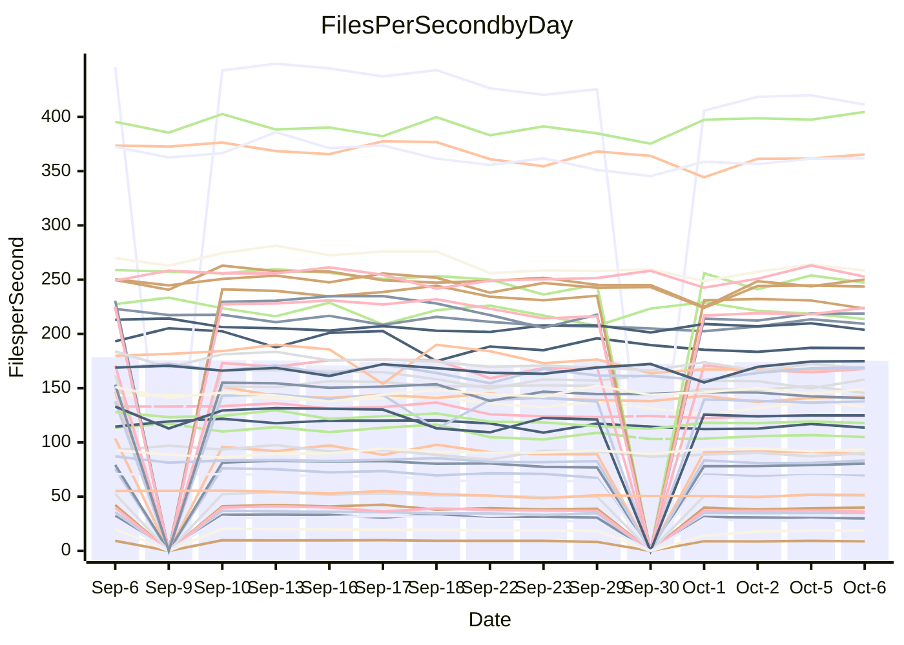

<!---
# This file is auto-generated. Do not edit.
# cspell:disable
--->
# Performance Report

## Daily Performance

## Time to Process Files

| Repository                                      | Elapsed | Min/Avg/Max           |   SD | SD Graph                |
| ----------------------------------------------- | ------: | :-------------------: | ---: | ----------------------- |
| AdaDoom3/AdaDoom3                    |    2.82 | 2.7 /   2.9 /   3.1   | 0.09 | `    ┣━━●━━╋━━┻━━┫    ` |
| alexiosc/megistos                    |    7.50 | 6.6 /   7.3 /   7.7   | 0.24 | `    ┣━━┻━━╋━━●━━┫    ` |
| apollographql/apollo-server          |    2.29 | 2.0 /   2.1 /   2.3   | 0.07 | `     ┣━┻━━╋━━┻━┫●    ` |
| aspnetboilerplate/aspnetboilerplate  |   10.77 | 10.5 /  10.9 /  12.0  | 0.36 | `    ┣━━┻━●╋━━┻━━┫    ` |
| aws-amplify/docs                     |   11.30 | 10.7 /  11.4 /  12.6  | 0.39 | `    ┣━━┻━━●━━┻━━┫    ` |
| Azure/azure-rest-api-specs           |   14.39 | 12.9 /  14.0 /  15.4  | 0.60 | `   ┣━━━┻━━╋━●┻━━━┫   ` |
| bitjson/typescript-starter           |    0.69 | 0.6 /   0.6 /   0.7   | 0.03 | `     ┣━━┻━╋━┻━━●     ` |
| caddyserver/caddy                    |    2.95 | 2.8 /   3.0 /   3.5   | 0.16 | `    ┣━━┻●━╋━━┻━━┫    ` |
| canada-ca/open-source-logiciel-libre |    0.76 | 0.7 /   0.8 /   0.9   | 0.05 | `     ┣━┻━━●━━┻━┫     ` |
| chef/chef                            |    5.76 | 5.1 /   5.4 /   6.0   | 0.22 | `    ┣━━┻━━╋━━┻━●┫    ` |
| dart-lang/sdk                        |   55.50 | 54.2 /  57.8 /  70.4  | 3.12 | `  ┣━━━┻●━━╋━━━┻━━━┫  ` |
| django/django                        |   13.65 | 13.0 /  13.5 /  14.3  | 0.31 | `    ┣━━┻━━╋●━┻━━┫    ` |
| eslint/eslint                        |    9.84 | 8.9 /   9.5 /  10.0   | 0.27 | `    ┣━━┻━━╋━━┻●━┫    ` |
| exonum/exonum                        |    3.05 | 2.9 /   3.0 /   3.7   | 0.17 | `    ┣━━┻━━●━━┻━━┫    ` |
| flutter/samples                      |   16.64 | 13.7 /  15.5 /  18.4  | 1.56 | `   ┣━━━┻━━╋━━●━━━┫   ` |
| gitbucket/gitbucket                  |    3.02 | 2.8 /   3.0 /   3.3   | 0.12 | `    ┣━━┻━━●━━┻━━┫    ` |
| googleapis/google-cloud-cpp          |  130.28 | 129.1 / 135.6 / 145.8 | 3.96 | `  ┣━●━┻━━━╋━━━┻━━━┫  ` |
| graphql/express-graphql              |    0.72 | 0.6 /   0.7 /   0.8   | 0.04 | `     ┣━┻━━╋━●┻━┫     ` |
| graphql/graphql-js                   |    2.12 | 1.9 /   2.1 /   2.3   | 0.09 | `     ┣━┻━━╋●━┻━┫     ` |
| graphql/graphql-relay-js             |    0.70 | 0.6 /   0.7 /   0.8   | 0.04 | `     ┣━┻━━●━━┻━┫     ` |
| graphql/graphql-spec                 |    0.84 | 0.7 /   0.8 /   1.1   | 0.07 | `     ┣━┻━━╋━●┻━┫     ` |
| iluwatar/java-design-patterns        |   10.81 | 10.3 /  10.9 /  12.5  | 0.45 | `    ┣━━┻━●╋━━┻━━┫    ` |
| ktaranov/sqlserver-kit               |    5.76 | 5.6 /   5.9 /   6.4   | 0.17 | `    ┣━━●━━╋━━┻━━┫    ` |
| liriliri/licia                       |    3.51 | 3.1 /   3.3 /   3.5   | 0.11 | `    ┣━━┻━━╋━━┻━●┫    ` |
| MartinThoma/LaTeX-examples           |    6.14 | 5.9 /   6.3 /   7.0   | 0.25 | `    ┣━━┻●━╋━━┻━━┫    ` |
| mdx-js/mdx                           |    1.60 | 1.4 /   1.6 /   1.8   | 0.07 | `     ┣━┻━━╋━●┻━┫     ` |
| microsoft/TypeScript-Website         |    4.95 | 4.7 /   5.0 /   5.5   | 0.18 | `    ┣━━┻━●╋━━┻━━┫    ` |
| MicrosoftDocs/PowerShell-Docs        |   22.62 | 20.6 /  22.2 /  23.9  | 0.87 | `   ┣━━━┻━━╋●━┻━━━┫   ` |
| neovim/nvim-lspconfig                |    2.80 | 2.6 /   2.8 /   3.0   | 0.13 | `    ┣━━┻━━╋●━┻━━┫    ` |
| pagekit/pagekit                      |    3.45 | 3.0 /   3.2 /   3.3   | 0.09 | `    ┣━━┻━━╋━━┻━━┫  ● ` |
| php/php-src                          |   23.29 | 23.2 /  24.2 /  26.1  | 0.72 | `   ┣━━●┻━━╋━━┻━━━┫   ` |
| plasticrake/tplink-smarthome-api     |    0.90 | 0.8 /   0.9 /   0.9   | 0.03 | `     ┣━┻━━╋━●┻━┫     ` |
| prettier/prettier                    |    5.97 | 5.7 /   6.0 /   6.4   | 0.16 | `    ┣━━┻━━●━━┻━━┫    ` |
| pycontribs/jira                      |    1.17 | 1.1 /   1.2 /   1.3   | 0.05 | `     ┣━┻━●╋━━┻━┫     ` |
| RustPython/RustPython                |    4.33 | 4.1 /   4.4 /   4.9   | 0.18 | `    ┣━━┻━●╋━━┻━━┫    ` |
| shoelace-style/shoelace              |    2.36 | 2.1 /   2.3 /   2.5   | 0.11 | `    ┣━━┻━━╋━●┻━━┫    ` |
| SoftwareBrothers/admin-bro           |    1.97 | 1.8 /   2.0 /   2.2   | 0.09 | `     ┣━┻━━●━━┻━┫     ` |
| sveltejs/svelte                      |   18.18 | 18.1 /  18.9 /  20.3  | 0.50 | `   ┣━●━┻━━╋━━┻━━━┫   ` |
| TheAlgorithms/Python                 |    5.16 | 4.7 /   5.1 /   5.5   | 0.20 | `    ┣━━┻━━╋●━┻━━┫    ` |
| twbs/bootstrap                       |    1.12 | 1.0 /   1.1 /   1.2   | 0.05 | `     ┣━┻━━╋●━┻━┫     ` |
| typescript-cheatsheets/react         |    1.03 | 1.0 /   1.0 /   1.2   | 0.04 | `     ┣━┻━━●━━┻━┫     ` |
| typescript-eslint/typescript-eslint  |    3.51 | 3.2 /   3.4 /   3.7   | 0.12 | `    ┣━━┻━━╋━●┻━━┫    ` |
| vitest-dev/vitest                    |    7.21 | 6.6 /   7.0 /   7.4   | 0.21 | `    ┣━━┻━━╋━━●━━┫    ` |
| w3c/aria-practices                   |    2.84 | 2.5 /   2.7 /   3.0   | 0.12 | `    ┣━━┻━━╋━●┻━━┫    ` |
| w3c/specberus                        |    1.61 | 1.5 /   1.6 /   2.1   | 0.12 | `    ┣━━┻━━●━━┻━━┫    ` |
| webdeveric/webpack-assets-manifest   |    0.81 | 0.6 /   0.6 /   0.8   | 0.05 | `     ┣━┻━━╋━━┻━┫  ●  ` |
| webpack/webpack                      |    4.35 | 4.2 /   4.4 /   4.8   | 0.17 | `    ┣━━┻━●╋━━┻━━┫    ` |
| wireapp/wire-desktop                 |    0.83 | 0.8 /   0.8 /   0.9   | 0.04 | `     ┣━┻━━●━━┻━┫     ` |
| wireapp/wire-webapp                  |    7.54 | 6.9 /   7.4 /   8.0   | 0.28 | `    ┣━━┻━━╋━●┻━━┫    ` |

Note:
- Elapsed time is in seconds.

## Files per Second over Time

| Repository                                      | Files |    Sec |    Fps |     Rel | Trend Fps              |    N |
| ----------------------------------------------- | ----: | -----: | -----: | ------: | ---------------------- | ---: |
| AdaDoom3/AdaDoom3                    |   103 |   2.82 |  36.50 |   3.55% | `█▆█▆█▆▆▅▄▆▆▇▅▆▆▆▇▅▅█` |   23 |
| alexiosc/megistos                    |   583 |   7.50 |  77.74 |  -3.25% | `▆▇▅▄█▅▅▅▄▄▄▅▅▃▅▅▄▅▆▄` |   23 |
| apollographql/apollo-server          |   250 |   2.29 | 109.03 |  -6.83% | `█████▇▇▄▇▆▅▄▇▆▇▆▇▆▇▄` |   26 |
| aspnetboilerplate/aspnetboilerplate  |  2739 |  10.77 | 254.20 |   1.18% | `█▇█▆█▇▆▇▅▆█▆▇▄▇██▆▆▇` |   25 |
| aws-amplify/docs                     |  2832 |  11.30 | 250.73 |   0.41% | `██▆▇▆▆▇▇▆▆▃▇▆▆▅▅▇▇▆▇` |   26 |
| Azure/azure-rest-api-specs           |  2426 |  14.39 | 168.54 |  -2.79% | `▆██▇▇█▅▇▆▆▇█▄▅▅█▇▆▆▆` |   26 |
| bitjson/typescript-starter           |    20 |   0.69 |  28.82 |  -8.66% | `██▇▅▅█▄▅▆▅▆▅▅▅▆▅▃▆▄▃` |   23 |
| caddyserver/caddy                    |   276 |   2.95 |  93.45 |   3.00% | `█▅█▇▆▃▆▇▇▆▆▇▆▇▆▆▄▆▆█` |   26 |
| canada-ca/open-source-logiciel-libre |     7 |   0.76 |   9.23 |  -0.30% | `▇▇▇██▇▇▆▆▄▅▆▂▆▇▇▅▄▅▆` |   23 |
| chef/chef                            |  1201 |   5.76 | 208.40 |  -5.73% | `▇█▃▅▆▇▇▆▄▆▇█▇▄▇▅▅▅▆▄` |   26 |
| dart-lang/sdk                        |  9723 |  55.50 | 175.18 |   4.09% | `▇▂▇▇▇▆▆▆▇▇▅▅▇▇██▇▇██` |   26 |
| django/django                        |  2792 |  13.65 | 204.55 |  -0.84% | `█▅█▆▆▆▆▇▇▆██▆███▇▇▆▇` |   26 |
| eslint/eslint                        |  2016 |   9.84 | 204.82 |  -3.32% | `▇█▇▅▇▆▇▆▅▅▅▆▅▅▇▇▇▇▆▅` |   26 |
| exonum/exonum                        |   421 |   3.05 | 138.22 |  -0.31% | `▇█▆█▇▂▇▇▇▇▇▆▇▆▆▇▆▆▇▇` |   23 |
| flutter/samples                      |  2850 |  16.64 | 171.31 |  -2.10% | `▇█▅▂█▇█▆▆▅▅▆▅▆▆▅▅▅▆▆` |   26 |
| gitbucket/gitbucket                  |   411 |   3.02 | 136.10 |  -0.70% | `▆█▇██▆▇▆▇▅▄▅▅▆▆▇█▆▄▇` |   26 |
| googleapis/google-cloud-cpp          | 19694 | 130.28 | 151.16 |   4.15% | `▄▄▆▆▇▆▆▆█▆▇█▇▇▆▇▆▇▇█` |   26 |
| graphql/express-graphql              |    26 |   0.72 |  36.30 |  -4.65% | `█▇█▇▃▇▆▅▅▅▅▅▅▆▆▆▅▄▅▅` |   23 |
| graphql/graphql-js                   |   333 |   2.12 | 157.37 |  -1.19% | `█▆█▆▆▄▄▆▆▇▆▅▇▅▅▅▃▇▆▆` |   25 |
| graphql/graphql-relay-js             |    28 |   0.70 |  40.13 |   0.10% | `█▇▅█▇▅▅▅▅▅▆▆▅▃▅▆▅▆▆▆` |   23 |
| graphql/graphql-spec                 |    15 |   0.84 |  17.76 |  -6.53% | `█▇▇█▇▇▇▇▆▆▂▆▆▄▆▆▇▇▇▅` |   23 |
| iluwatar/java-design-patterns        |  1838 |  10.81 | 170.00 |   0.50% | `▆█▇███▇▃▆▇▇▆▆▆▅▆▇▆▇▇` |   23 |
| ktaranov/sqlserver-kit               |   489 |   5.76 |  84.90 |   2.64% | `█▇▇▆██▆▇▆▇▇▇▇▄▄▇▇▇▇█` |   24 |
| liriliri/licia                       |  1421 |   3.51 | 405.18 |  -5.72% | `████▇█▆▇▆▆▄▅▆▆▆▅▆▄▆▄` |   23 |
| MartinThoma/LaTeX-examples           |  1407 |   6.14 | 229.02 |   2.63% | `▇▇▇█▅▇▆▆▅▅▅▃▇▆▅▄▇▅▆▇` |   23 |
| mdx-js/mdx                           |   144 |   1.60 |  89.87 |  -2.97% | `▆█▇▆▃▇▅▅▅▅▅▆▅▆▅▅▆▅▄▅` |   24 |
| microsoft/TypeScript-Website         |   758 |   4.95 | 153.06 |   1.43% | `▇█▇█▆▇▆▆▆▄▆▇▇▃▆▇▆▅▄▇` |   25 |
| MicrosoftDocs/PowerShell-Docs        |  2692 |  22.62 | 118.98 |  -1.70% | `▇▆▇██▆▅▆▅▄▆▆▅▆▅▇▆▄▆▆` |   26 |
| neovim/nvim-lspconfig                |   355 |   2.80 | 126.63 |  -1.42% | `█▄▇▇█▆▅▅▅▅▄▅▄▅▆▄▅▆▃▅` |   26 |
| pagekit/pagekit                      |   741 |   3.45 | 214.66 |  -8.35% | `▆▅▇▇██▆▆▆▇▆▇▅▆▆▇▄▅▆▃` |   23 |
| php/php-src                          |  2211 |  23.29 |  94.95 |   3.92% | `▅▆██▇▆▆▆▇▆████▆█▇█▇█` |   26 |
| plasticrake/tplink-smarthome-api     |    62 |   0.90 |  68.98 |  -3.65% | `▇█▆▇█▅▆▇▆▄▆▅▄▆▅▆▆▅▅▅` |   23 |
| prettier/prettier                    |  2196 |   5.97 | 367.57 |   0.42% | `▅▇█▇▇▆▆▅▇▆▄▇▆▄▆▆▆▇▆▆` |   25 |
| pycontribs/jira                      |    80 |   1.17 |  68.50 |   0.89% | `▇█▆▆█▆▆▃▅▅▇▆▅▇▇▇▇▆▆▇` |   24 |
| RustPython/RustPython                |   621 |   4.33 | 143.46 |   0.85% | `█▆▇▇▆▇▇▆▆▆▇▇▇▃▆▇▇▇▆▇` |   25 |
| shoelace-style/shoelace              |   437 |   2.36 | 185.31 |  -3.28% | `▇▇▇█▃▆▅▅▆▅▅▃▅▆▅▆▄▅▅▅` |   26 |
| SoftwareBrothers/admin-bro           |   441 |   1.97 | 223.88 |   0.66% | `▆▇███▇▅▅▄▅▅▆▃▄▄▅▆▆▅▆` |   23 |
| sveltejs/svelte                      |  7455 |  18.18 | 409.98 |   4.45% | `▆▆▇▄▇▅▆▆▆▅▇█▆▇▇▇▇█▇█` |   26 |
| TheAlgorithms/Python                 |  1352 |   5.16 | 262.21 |  -1.25% | `█▇███▅▆▆▆▆▄▄▇▆▆▇▇▆▅▆` |   26 |
| twbs/bootstrap                       |   120 |   1.12 | 107.26 |  -1.24% | `▇▃█▆█▅▄▄▆▄▄▅▄▅▅▅▅▄▄▅` |   26 |
| typescript-cheatsheets/react         |    53 |   1.03 |  51.49 |   0.07% | `█▅▇▇▇▆▆▆▅▅▆▆▆▃▆▇▆▆▅▆` |   23 |
| typescript-eslint/typescript-eslint  |  1247 |   3.51 | 355.24 |  -2.52% | `█▄▇▇▆▅▅▆▅▄▅▅▆▅▆▅▆▆▆▅` |   26 |
| vitest-dev/vitest                    |  1801 |   7.21 | 249.93 |  -1.78% | `▆█▆▅▄▅▅▅▅▆▄▆▅▄▆█▇▅▆▅` |   26 |
| w3c/aria-practices                   |   403 |   2.84 | 141.79 |  -3.78% | `▅▇█▆█▃▅▆▆▆▆▆▆▆▆▄▅▅▄▅` |   25 |
| w3c/specberus                        |   200 |   1.61 | 124.30 |  -0.37% | `▇█▇█▆▅▂▆▆▆▇▇▇▅▆▆▇▇▆▆` |   25 |
| webdeveric/webpack-assets-manifest   |    19 |   0.81 |  23.56 | -20.14% | `██▇███▆▆▆▃▆▂▆▅▅▆▆▆▅▂` |   23 |
| webpack/webpack                      |  1086 |   4.35 | 249.86 |   1.67% | `▇▅██▇▄▇▇▆▆▄█▄▇▇▅▇▆▆▇` |   26 |
| wireapp/wire-desktop                 |    43 |   0.83 |  51.83 |  -1.08% | `█▇█▇▆▅▅▄▆▅▅▆▃▅▆▆▅▆▅▆` |   26 |
| wireapp/wire-webapp                  |  1227 |   7.54 | 162.74 |  -1.84% | `▅▅█▆▅▃▄▆▅▅▄▅▅▆▇▇▅▆█▅` |   26 |

## Data Throughput

| Repository                                      | Files |    Sec |     Kps |     Rel | Trend Kps              |    N |
| ----------------------------------------------- | ----: | -----: | ------: | ------: | ---------------------- | ---: |
| AdaDoom3/AdaDoom3                    |   103 |   2.82 |  775.62 |   3.55% | `█▆█▆█▆▆▅▄▆▆▇▅▆▆▆▇▅▅█` |   23 |
| alexiosc/megistos                    |   583 |   7.50 |  610.82 |  -3.25% | `▆▇▅▄█▅▅▅▄▄▄▅▅▃▅▅▄▅▆▄` |   23 |
| apollographql/apollo-server          |   250 |   2.29 |  863.98 |  -6.83% | `█████▇▇▄▇▆▅▄▇▆▇▆▇▆▇▄` |   26 |
| aspnetboilerplate/aspnetboilerplate  |  2739 |  10.77 |  591.00 |  -0.02% | `█▇█▆█▇▆▇▄▆▇▆▆▃▆▇▇▅▆▇` |   25 |
| aws-amplify/docs                     |  2832 |  11.30 |  836.99 |   0.70% | `██▆▇▆▆▇▇▆▆▃▇▆▆▅▅▇▇▆▇` |   26 |
| Azure/azure-rest-api-specs           |  2426 |  14.39 |  481.23 |  -2.67% | `▆██▇▇█▅▆▆▆▇█▄▅▅█▇▆▆▆` |   26 |
| bitjson/typescript-starter           |    20 |   0.69 |  115.29 |  -8.66% | `██▇▅▅█▄▅▆▅▆▅▅▅▆▅▃▆▄▃` |   23 |
| caddyserver/caddy                    |   276 |   2.95 |  760.80 |   3.12% | `█▅█▇▆▃▆▇▇▅▆▇▆▇▆▆▄▆▆█` |   26 |
| canada-ca/open-source-logiciel-libre |     7 |   0.76 |   76.51 |  -0.30% | `▇▇▇██▇▇▆▆▄▅▆▂▆▇▇▅▄▅▆` |   23 |
| chef/chef                            |  1201 |   5.76 |  956.26 |  -5.91% | `▇█▃▅▆▇▇▆▄▆▇█▇▄▇▅▅▅▆▄` |   26 |
| dart-lang/sdk                        |  9723 |  55.50 | 1266.83 |   3.93% | `▇▂▇▇▇▆▆▆▇▇▅▅▇▇██▇▇██` |   26 |
| django/django                        |  2792 |  13.65 | 1251.85 |  -0.75% | `█▅█▆▆▆▆▇▇▆██▆████▇▆▇` |   26 |
| eslint/eslint                        |  2016 |   9.84 | 1672.19 |  -3.47% | `▇█▇▅▇▆▇▆▅▅▄▆▅▅▇▇▆▆▆▅` |   26 |
| exonum/exonum                        |   421 |   3.05 | 1322.13 |  -0.31% | `▇█▆█▇▂▇▇▇▇▇▆▇▆▆▇▆▆▇▇` |   23 |
| flutter/samples                      |  2850 |  16.64 | 1328.54 |  -0.04% | `▇█▅▂█▇█▆▆▆▆▆▆▆▇▆▆▅▆▇` |   26 |
| gitbucket/gitbucket                  |   411 |   3.02 |  614.93 |  -0.70% | `▆█▇██▆▇▆▇▅▄▅▅▆▆▇█▆▄▇` |   26 |
| googleapis/google-cloud-cpp          | 19694 | 130.28 | 1079.01 |   4.17% | `▄▄▆▆▇▆▆▆█▆▇█▇▇▆▇▆▇▇█` |   26 |
| graphql/express-graphql              |    26 |   0.72 |  166.15 |  -4.65% | `█▇█▇▃▇▆▅▅▅▅▅▅▆▆▆▅▄▅▅` |   23 |
| graphql/graphql-js                   |   333 |   2.12 |  897.45 |  -1.07% | `█▆█▆▆▄▄▆▆▇▆▅▇▅▅▅▃▇▆▆` |   25 |
| graphql/graphql-relay-js             |    28 |   0.70 |  157.66 |   0.10% | `█▇▅█▇▅▅▅▅▅▆▆▅▃▅▆▅▆▆▆` |   23 |
| graphql/graphql-spec                 |    15 |   0.84 |  652.29 |  -6.53% | `█▇▇█▇▇▇▇▆▆▂▆▆▄▆▆▇▇▇▅` |   23 |
| iluwatar/java-design-patterns        |  1838 |  10.81 |  523.12 |   0.50% | `▆█▇███▇▃▆▇▇▆▆▆▅▆▇▆▇▇` |   23 |
| ktaranov/sqlserver-kit               |   489 |   5.76 | 1284.23 |   2.64% | `█▇▇▆██▆▇▆▇▇▇▇▄▄▇▇▇▇█` |   24 |
| liriliri/licia                       |  1421 |   3.51 |  477.61 |  -5.67% | `████▇█▆▇▆▆▄▅▆▆▆▅▆▄▆▄` |   23 |
| MartinThoma/LaTeX-examples           |  1407 |   6.14 |  473.34 |   2.63% | `▇▇▇█▅▇▆▆▅▅▅▃▇▆▅▄▇▅▆▇` |   23 |
| mdx-js/mdx                           |   144 |   1.60 |  411.92 |  -2.83% | `▆█▇▆▃▇▅▅▅▅▅▆▅▆▅▅▆▅▅▅` |   24 |
| microsoft/TypeScript-Website         |   758 |   4.95 | 1047.39 |   1.38% | `▇█▇█▆▇▆▆▆▄▆▇▇▃▆▇▆▅▄▇` |   25 |
| MicrosoftDocs/PowerShell-Docs        |  2692 |  22.62 | 1215.74 |  -1.74% | `▇▆▇██▆▅▆▅▄▆▆▅▆▅▇▆▄▆▆` |   26 |
| neovim/nvim-lspconfig                |   355 |   2.80 |  331.37 |  -1.71% | `█▄▇▇█▆▅▅▅▅▄▅▄▅▆▄▅▅▃▅` |   26 |
| pagekit/pagekit                      |   741 |   3.45 |  447.57 |  -8.35% | `▆▅▇▇██▆▆▆▇▆▇▅▆▆▇▄▅▆▃` |   23 |
| php/php-src                          |  2211 |  23.29 | 1386.26 |   3.97% | `▅▆██▇▆▆▆▇▆████▆█▇█▇█` |   26 |
| plasticrake/tplink-smarthome-api     |    62 |   0.90 |  372.72 |  -3.65% | `▇█▆▇█▅▆▇▆▄▆▅▄▆▅▆▆▅▅▅` |   23 |
| prettier/prettier                    |  2196 |   5.97 |  512.53 |   0.45% | `▅▇█▇▇▆▆▅▇▆▄▇▆▄▆▆▆▇▆▆` |   25 |
| pycontribs/jira                      |    80 |   1.17 |  471.81 |   0.90% | `▇█▆▆█▆▆▃▅▅▇▆▅▇▇▇▇▆▆▇` |   24 |
| RustPython/RustPython                |   621 |   4.33 | 1055.95 |   1.03% | `█▆▇▇▆▇▇▆▆▆▇▇▇▃▆▇▇▇▇▇` |   25 |
| shoelace-style/shoelace              |   437 |   2.36 |  880.34 |  -2.89% | `▇▇▇█▃▆▅▅▇▆▅▃▅▆▅▆▅▅▆▅` |   26 |
| SoftwareBrothers/admin-bro           |   441 |   1.97 |  493.46 |   0.60% | `▆▇███▇▅▅▃▅▅▆▃▄▄▅▆▅▄▆` |   23 |
| sveltejs/svelte                      |  7455 |  18.18 |  295.43 |   4.29% | `▆▆▇▄▇▅▆▆▆▅▇█▆▇▇▇▇█▇█` |   26 |
| TheAlgorithms/Python                 |  1352 |   5.16 |  662.69 |  -1.42% | `█▇███▅▆▆▆▆▄▄▇▅▆▇▇▆▅▆` |   26 |
| twbs/bootstrap                       |   120 |   1.12 |  858.98 |  -1.24% | `▇▃█▆█▅▄▄▆▄▄▅▄▅▅▅▅▄▄▅` |   26 |
| typescript-cheatsheets/react         |    53 |   1.03 |  375.98 |   0.07% | `█▅▇▇▇▆▆▆▅▅▆▆▆▃▆▇▆▆▅▆` |   23 |
| typescript-eslint/typescript-eslint  |  1247 |   3.51 | 1653.12 |  -2.13% | `█▄▇▇▆▅▅▆▅▄▆▅▆▅▆▅▆▇▆▅` |   26 |
| vitest-dev/vitest                    |  1801 |   7.21 |  509.16 |  -2.34% | `▇█▇▆▄▅▆▆▆▆▄▆▅▄▆█▇▅▆▅` |   26 |
| w3c/aria-practices                   |   403 |   2.84 | 1321.82 |  -3.67% | `▅▇█▆█▃▅▆▆▆▆▆▆▆▆▄▅▅▄▅` |   25 |
| w3c/specberus                        |   200 |   1.61 |  396.52 |  -0.37% | `▇█▇█▆▅▂▆▆▆▇▇▇▅▆▆▇▇▆▆` |   25 |
| webdeveric/webpack-assets-manifest   |    19 |   0.81 |  126.48 | -20.14% | `██▇███▆▆▆▃▆▂▆▅▅▆▆▆▅▂` |   23 |
| webpack/webpack                      |  1086 |   4.35 | 1086.42 |   1.74% | `▇▅██▇▄▇▇▆▆▄█▄▇▇▅▇▆▆▇` |   26 |
| wireapp/wire-desktop                 |    43 |   0.83 |  227.81 |  -1.08% | `█▇█▇▆▅▅▄▆▅▅▆▃▅▆▆▅▆▅▆` |   26 |
| wireapp/wire-webapp                  |  1227 |   7.54 |  688.64 |  -1.88% | `▅▅█▆▅▃▄▆▅▅▄▅▅▆▇▇▅▆█▅` |   26 |

