<!---
# This file is auto-generated. Do not edit.
# cspell:disable
--->
# Performance Report

## Daily Performance

```mermaid
xychart-beta
    title Files Per Second by Day
    y-axis Files per Second
    x-axis Date [Jan-13, Jan-14, Jan-15, Jan-16, Jan-18, Jan-20, Jan-21, Jan-22, Jan-26, Jan-27, Jan-28, Jan-29, Feb-2, Feb-5, Feb-8, Feb-9, Feb-10, Feb-11, Feb-12]
    bar [167.48, 169.75, 163.88, 166.13, 174.50, 168.43, 169.86, 170.44, 173.21, 172.82, 168.69, 170.17, 172.76, 169.39, 173.94, 176.68, 172.01, 170.80, 173.32]
    line [142.76, 141.64, 141.15, 123.99, 143.49, 147.59, 143.59, 141.42, 143.21, 141.20, 143.98, 143.78, 140.14, 135.87, 142.86, 142.75, 143.10, 145.82, 142.23]
    line [106.48, 111.07, 106.70, 105.83, 110.59, 105.90, 107.50, 104.30, 108.52, 110.13, 106.78, 107.20, 109.65, 110.63, 111.16, 110.94, 109.21, 107.83, 109.05]
    line [83.13, 74.36, 86.16, 86.38, 84.98, 80.87, 81.08, 81.74, 87.91, 80.34, 86.50, 86.84, 88.66, 83.22, 85.59, 83.52, 82.54, 80.25, 84.07]
    line [127.26, 126.67, 127.57, 126.01, 128.09, 123.93, 133.11, 122.76, 127.88, 128.69, 130.23, 128.77, 121.54, 127.82, 124.27, 124.62, 123.31, 125.03, 124.15]
    line [114.87, 112.73, 121.37, 119.21, 111.41, 120.28, 114.69, 112.28, 117.78, 116.14, 114.78, 110.96, 118.96, 114.84, 114.56, 119.99, 116.03, 111.12, 117.56]
    line [187.54, 191.28, 196.46, 192.64, 192.25, 187.45, 187.38, 192.87, 195.04, 191.69, 194.48, 178.97, 199.11, 192.32, 196.15, 196.80, 192.49, 195.28, 195.62]
    line [196.30, 189.40, 186.97, 192.92, 206.92, 196.43, 199.84, 197.78, 203.69, 196.52, 194.52, 195.98, 201.87, 201.12, 204.97, 199.43, 190.33, 187.01, 188.98]
    line [218.81, 223.94, 217.59, 191.78, 206.70, 229.01, 219.68, 219.77, 209.49, 204.94, 198.04, 223.32, 227.45, 204.37, 225.14, 223.42, 222.08, 213.20, 214.88]
    line [160.36, 157.59, 157.97, 159.04, 161.40, 158.69, 156.26, 158.43, 164.60, 154.09, 155.59, 154.71, 166.16, 160.94, 165.57, 174.04, 154.30, 162.65, 166.44]
    line [152.68, 160.69, 156.79, 156.81, 155.73, 146.52, 155.23, 146.60, 152.95, 153.44, 146.68, 148.04, 159.34, 150.93, 158.41, 157.97, 156.56, 158.71, 155.61]
    line [338.80, 330.51, 341.37, 332.29, 317.17, 344.00, 340.27, 346.07, 341.26, 330.59, 326.24, 336.05, 350.02, 336.18, 342.95, 339.36, 335.43, 338.51, 319.34]
    line [112.95, 112.89, 112.17, 115.75, 121.13, 117.45, 107.89, 115.63, 108.80, 113.98, 108.63, 112.03, 101.57, 107.21, 115.59, 114.29, 115.98, 101.55, 111.83]
    line [145.30, 149.05, 140.78, 149.26, 147.65, 139.36, 140.95, 149.41, 138.21, 138.55, 146.90, 148.25, 146.04, 146.87, 144.71, 150.09, 144.64, 141.32, 141.27]
    line [228.64, 236.61, 179.24, 231.58, 227.41, 232.25, 239.53, 241.09, 233.83, 229.73, 231.27, 235.75, 232.76, 227.56, 235.60, 244.14, 228.71, 227.46, 229.11]
    line [201.84, 183.49, 193.18, 186.41, 206.76, 190.09, 194.48, 202.39, 197.93, 196.32, 205.82, 204.70, 203.85, 198.04, 207.86, 211.91, 205.36, 214.41, 211.00]
    line [243.64, 250.04, 233.42, 245.62, 241.64, 242.10, 243.52, 243.78, 252.46, 245.33, 245.88, 247.56, 250.17, 242.23, 239.94, 251.24, 247.36, 235.88, 236.26]
    line [45.48, 47.52, 48.15, 46.82, 48.44, 0.00, 45.59, 47.24, 46.87, 46.43, 46.80, 47.45, 47.29, 47.35, 47.86, 48.05, 47.30, 43.46, 45.40]
    line [339.94, 351.75, 349.84, 352.46, 347.95, 349.61, 348.67, 336.98, 334.45, 346.57, 346.60, 352.58, 347.78, 346.57, 347.57, 348.75, 351.19, 348.15, 339.49]
    line [243.18, 235.07, 210.91, 252.26, 245.25, 247.79, 237.71, 245.48, 250.24, 239.03, 246.34, 215.04, 240.95, 243.60, 242.70, 251.69, 234.31, 244.51, 237.97]
    line [366.78, 394.48, 380.24, 387.08, 391.19, 385.76, 384.74, 382.99, 381.11, 378.87, 384.64, 371.32, 391.09, 379.53, 386.07, 370.43, 367.95, 383.26, 379.76]
    line [118.82, 119.70, 120.72, 120.60, 119.83, 111.61, 121.49, 119.94, 120.57, 119.01, 117.99, 117.30, 120.43, 119.43, 118.96, 118.43, 117.39, 122.51, 116.28]
    line [48.15, 49.96, 48.86, 49.35, 49.61, 49.98, 48.14, 47.57, 46.02, 47.96, 48.80, 46.78, 47.79, 48.42, 47.97, 48.95, 44.92, 41.33, 48.53]
    line [100.22, 103.42, 102.77, 104.55, 104.84, 96.90, 99.42, 91.88, 98.65, 96.11, 99.25, 100.66, 103.18, 98.24, 96.65, 104.96, 94.67, 90.15, 99.61]
    line [156.59, 163.92, 156.50, 162.70, 162.52, 155.39, 161.05, 158.62, 159.47, 158.84, 149.03, 155.81, 162.82, 158.93, 165.88, 167.89, 164.45, 156.78, 158.30]
    line [107.78, 110.93, 111.50, 98.69, 111.74, 0.00, 0.00, 0.00, 256.11, 255.68, 274.20, 237.51, 254.20, 253.57, 266.34, 269.39, 246.86, 267.66, 270.11]
    line [160.33, 159.51, 160.62, 164.27, 165.83, 163.17, 162.82, 166.39, 165.48, 164.06, 162.34, 156.27, 166.07, 155.61, 164.06, 170.66, 167.78, 165.93, 168.70]
    line [153.24, 158.05, 143.97, 146.11, 167.84, 138.47, 151.83, 152.31, 153.48, 154.19, 144.39, 154.19, 151.10, 150.58, 152.48, 156.02, 149.70, 153.17, 153.25]
    line [30.13, 29.74, 28.69, 30.19, 29.74, 0.00, 30.87, 30.00, 28.70, 30.12, 29.90, 29.99, 31.08, 29.80, 28.87, 23.26, 29.91, 29.82, 29.16]
    line [9.09, 8.82, 8.93, 8.76, 8.99, 0.00, 9.21, 8.99, 8.69, 9.06, 9.17, 8.90, 9.14, 9.10, 8.87, 9.39, 9.10, 8.79, 9.46]
    line [37.19, 37.15, 36.65, 38.13, 37.95, 0.00, 37.76, 37.89, 38.81, 37.93, 37.35, 37.58, 36.65, 37.87, 37.52, 36.62, 36.71, 35.21, 36.62]
    line [35.46, 35.24, 35.59, 35.58, 35.07, 0.00, 35.24, 34.68, 33.94, 35.92, 35.70, 34.97, 35.24, 35.24, 35.29, 34.51, 36.01, 35.10, 34.01]
    line [18.04, 18.04, 18.22, 17.23, 17.55, 0.00, 17.39, 18.17, 18.55, 17.57, 16.82, 17.76, 17.39, 17.79, 18.01, 16.74, 16.81, 17.17, 17.62]
    line [33.01, 34.00, 33.70, 33.67, 33.62, 0.00, 32.53, 32.97, 33.70, 32.82, 33.62, 33.93, 33.23, 33.25, 33.77, 34.38, 31.28, 33.43, 33.53]
    line [146.13, 148.32, 143.55, 147.19, 151.83, 146.83, 148.17, 142.81, 152.72, 147.54, 147.09, 145.41, 148.70, 151.93, 151.71, 152.93, 151.27, 147.55, 144.08]
    line [77.54, 79.76, 78.94, 80.05, 79.79, 0.00, 78.41, 81.03, 80.80, 79.69, 83.58, 77.01, 80.34, 79.32, 79.86, 81.63, 78.70, 79.41, 80.67]
    line [382.18, 391.17, 394.86, 389.55, 393.53, 0.00, 392.61, 391.87, 384.72, 385.87, 389.43, 389.76, 387.86, 381.95, 388.55, 388.50, 387.75, 391.57, 383.77]
    line [133.26, 132.31, 127.23, 131.76, 132.93, 0.00, 127.27, 127.81, 130.32, 132.03, 125.54, 132.09, 121.09, 133.64, 133.48, 121.84, 129.06, 122.93, 134.90]
    line [225.53, 218.14, 222.73, 239.07, 237.86, 219.38, 227.33, 226.70, 233.87, 217.12, 216.93, 224.01, 224.86, 217.64, 233.33, 222.49, 222.54, 219.50, 230.89]
    line [85.54, 86.15, 85.12, 85.43, 82.51, 0.00, 87.43, 86.48, 87.49, 84.71, 86.94, 81.29, 88.85, 83.51, 88.25, 87.06, 84.92, 87.81, 90.08]
    line [72.97, 78.65, 78.72, 77.98, 76.03, 0.00, 77.82, 78.41, 77.74, 77.78, 73.82, 74.60, 78.73, 76.88, 78.62, 77.47, 76.02, 78.07, 72.54]
    line [214.18, 220.74, 215.80, 207.87, 219.52, 0.00, 214.36, 216.75, 217.84, 220.87, 215.44, 214.77, 213.40, 220.70, 222.08, 221.01, 216.87, 215.38, 220.38]
    line [210.61, 215.07, 220.69, 214.26, 215.48, 0.00, 214.23, 216.83, 222.41, 215.81, 211.64, 216.10, 218.52, 215.06, 216.88, 216.99, 208.40, 212.31, 216.10]
    line [66.66, 65.78, 67.40, 65.04, 63.23, 0.00, 67.48, 67.27, 65.41, 67.07, 67.22, 68.71, 67.83, 67.42, 64.50, 68.29, 67.95, 63.94, 67.93]
    line [62.15, 63.63, 63.52, 64.93, 61.26, 0.00, 63.19, 63.24, 64.72, 62.00, 60.00, 63.28, 59.94, 63.60, 64.06, 62.64, 63.65, 63.88, 59.88]
    line [93.83, 104.36, 95.41, 100.49, 100.17, 98.43, 101.26, 97.05, 98.45, 98.30, 100.11, 81.16, 97.62, 97.16, 101.86, 100.35, 99.46, 93.91, 99.35]
    line [172.87, 181.24, 165.83, 179.67, 178.49, 0.00, 174.64, 178.29, 177.69, 180.46, 173.36, 171.47, 176.27, 176.08, 177.50, 180.37, 179.50, 169.53, 172.72]
    line [27.25, 28.25, 26.29, 26.94, 27.92, 0.00, 27.74, 27.10, 28.41, 27.77, 28.43, 27.26, 29.20, 28.78, 27.22, 28.25, 25.94, 28.04, 29.13]
    line [134.58, 123.64, 135.23, 140.79, 137.86, 0.00, 141.02, 138.02, 132.73, 140.24, 138.48, 133.03, 140.20, 137.55, 139.32, 138.06, 134.03, 131.86, 137.72]
    line [214.77, 211.68, 227.93, 222.84, 225.57, 0.00, 229.76, 226.99, 229.64, 213.50, 236.23, 220.41, 211.45, 222.13, 224.72, 223.26, 221.76, 223.13, 223.49]
    line [202.65, 212.27, 207.96, 201.68, 204.97, 200.41, 200.50, 201.35, 196.11, 202.03, 205.84, 210.33, 202.30, 198.84, 204.68, 214.35, 200.27, 199.54, 205.95]
```

## Time to Process Files

| Repository                                      | Elapsed | Min/Avg/Max           |   SD | SD Graph                |
| ----------------------------------------------- | ------: | :-------------------: | ---: | ----------------------- |
| AdaDoom3/AdaDoom3                    |    3.07 | 3.0 /   3.1 /   3.3   | 0.09 | `    ┣━━┻━●╋━━┻━━┫    ` |
| alexiosc/megistos                    |    7.23 | 6.8 /   7.3 /   8.0   | 0.20 | `    ┣━━┻●━╋━━┻━━┫    ` |
| apollographql/apollo-server          |    2.29 | 2.2 /   2.3 /   2.6   | 0.07 | `     ┣━┻━●╋━━┻━┫     ` |
| aspnetboilerplate/aspnetboilerplate  |    9.73 | 9.4 /  10.0 /  11.3   | 0.38 | `    ┣━━●━━╋━━┻━━┫    ` |
| aws-amplify/docs                     |   12.51 | 11.7 /  12.5 /  16.0  | 0.75 | `   ┣━━━┻━━●━━┻━━━┫   ` |
| Azure/azure-rest-api-specs           |    8.77 | 0.0 /  10.9 /  24.9   | 7.08 | `   ┣━━┻━━●╋━━━┻━━┫   ` |
| bitjson/typescript-starter           |    0.69 | 0.6 /   0.7 /   0.9   | 0.04 | `     ┣━┻━━╋●━┻━┫     ` |
| caddyserver/caddy                    |    3.32 | 3.1 /   3.4 /   3.8   | 0.17 | `    ┣━━┻━●╋━━┻━━┫    ` |
| canada-ca/open-source-logiciel-libre |    0.74 | 0.7 /   0.8 /   0.8   | 0.02 | `     ┣●━┻━╋━┻━━┫     ` |
| chef/chef                            |    5.60 | 5.3 /   5.6 /   6.6   | 0.31 | `    ┣━━┻━━●━━┻━━┫    ` |
| dart-lang/sdk                        |   59.80 | 59.1 /  62.0 /  67.6  | 2.11 | `  ┣━━━●━━━╋━━━┻━━━┫  ` |
| django/django                        |   14.45 | 14.2 /  14.7 /  16.4  | 0.43 | `    ┣━━┻●━╋━━┻━━┫    ` |
| eslint/eslint                        |   10.84 | 9.8 /  10.4 /  11.9   | 0.40 | `    ┣━━┻━━╋━━┻●━┫    ` |
| exonum/exonum                        |    3.12 | 3.0 /   3.3 /   3.5   | 0.13 | `    ┣━━●━━╋━━┻━━┫    ` |
| flutter/samples                      |   17.40 | 16.7 /  17.6 /  19.5  | 0.65 | `   ┣━━━┻━●╋━━┻━━━┫   ` |
| gitbucket/gitbucket                  |    3.32 | 3.0 /   3.3 /   3.6   | 0.11 | `    ┣━━┻━━╋━●┻━━┫    ` |
| googleapis/google-cloud-cpp          |  129.32 | 117.6 / 130.6 / 142.8 | 4.85 | `  ┣━━━┻━━●╋━━━┻━━━┫  ` |
| graphql/express-graphql              |    0.76 | 0.7 /   0.7 /   0.8   | 0.02 | `     ┣━━┻━╋━┻━●┫     ` |
| graphql/graphql-js                   |    2.38 | 2.2 /   2.3 /   2.5   | 0.06 | `     ┣━┻━━╋━━┻●┫     ` |
| graphql/graphql-relay-js             |    0.76 | 0.7 /   0.8 /   0.8   | 0.02 | `     ┣━━┻━╋━●━━┫     ` |
| graphql/graphql-spec                 |    0.85 | 0.8 /   0.9 /   1.0   | 0.03 | `     ┣━┻━━●━━┻━┫     ` |
| iluwatar/java-design-patterns        |   11.43 | 10.9 /  11.9 /  13.1  | 0.44 | `    ┣━━●━━╋━━┻━━┫    ` |
| ktaranov/sqlserver-kit               |    6.74 | 6.1 /   6.4 /   7.2   | 0.22 | `    ┣━━┻━━╋━━┻━●┫    ` |
| liriliri/licia                       |    3.74 | 3.6 /   3.7 /   3.9   | 0.06 | `     ┣━┻━━╋━●┻━┫     ` |
| MartinThoma/LaTeX-examples           |    6.52 | 6.3 /   6.6 /   7.1   | 0.16 | `    ┣━━┻━●╋━━┻━━┫    ` |
| mdx-js/mdx                           |    1.57 | 1.6 /   1.7 /   1.9   | 0.06 | `     ┣●┻━━╋━━┻━┫     ` |
| microsoft/TypeScript-Website         |    5.34 | 5.0 /   5.4 /   6.1   | 0.23 | `    ┣━━┻━━●━━┻━━┫    ` |
| MicrosoftDocs/PowerShell-Docs        |   24.22 | 18.5 /  23.3 /  28.9  | 2.49 | `   ┣━━┻━━━╋●━━┻━━┫   ` |
| neovim/nvim-lspconfig                |    3.22 | 3.1 /   3.3 /   3.6   | 0.12 | `    ┣━━┻━●╋━━┻━━┫    ` |
| pagekit/pagekit                      |    3.36 | 3.3 /   3.4 /   3.6   | 0.08 | `    ┣━━┻●━╋━━┻━━┫    ` |
| php/php-src                          |   22.26 | 21.0 /  22.6 /  26.5  | 1.44 | `   ┣━━┻━━●╋━━━┻━━┫   ` |
| plasticrake/tplink-smarthome-api     |    0.91 | 0.9 /   0.9 /   1.1   | 0.04 | `     ┣━┻━●╋━━┻━┫     ` |
| prettier/prettier                    |    6.88 | 6.2 /   6.6 /   7.1   | 0.18 | `    ┣━━┻━━╋━━┻━━●    ` |
| pycontribs/jira                      |    1.34 | 1.2 /   1.3 /   1.4   | 0.04 | `     ┣━┻━━╋━━┻●┫     ` |
| RustPython/RustPython                |    4.39 | 4.1 /   4.3 /   4.7   | 0.14 | `    ┣━━┻━━╋━●┻━━┫    ` |
| shoelace-style/shoelace              |    2.54 | 2.4 /   2.5 /   2.7   | 0.08 | `     ┣━┻━━╋━●┻━┫     ` |
| slint-ui/slint                       |    9.50 | 9.2 /   9.9 /  11.2   | 0.46 | `    ┣━━●━━╋━━┻━━┫    ` |
| SoftwareBrothers/admin-bro           |    2.14 | 2.1 /   2.2 /   2.3   | 0.07 | `     ┣━┻━●╋━━┻━┫     ` |
| sveltejs/svelte                      |   18.94 | 18.1 /  18.9 /  22.2  | 0.73 | `   ┣━━━┻━━●━━┻━━━┫   ` |
| TheAlgorithms/Python                 |    5.79 | 5.4 /   5.6 /   6.1   | 0.17 | `    ┣━━┻━━╋━━●━━┫    ` |
| twbs/bootstrap                       |    1.21 | 1.1 /   1.2 /   1.5   | 0.07 | `     ┣━┻━●╋━━┻━┫     ` |
| typescript-cheatsheets/react         |    1.17 | 1.1 /   1.1 /   1.3   | 0.05 | `     ┣━┻━━╋━●┻━┫     ` |
| typescript-eslint/typescript-eslint  |    3.78 | 3.6 /   3.7 /   3.8   | 0.06 | `     ┣━┻━━╋━━●━┫     ` |
| vitest-dev/vitest                    |    8.29 | 7.7 /   8.2 /   9.2   | 0.37 | `    ┣━━┻━━╋●━┻━━┫    ` |
| w3c/aria-practices                   |    2.94 | 2.9 /   3.0 /   3.3   | 0.10 | `    ┣━━┻━●╋━━┻━━┫    ` |
| w3c/specberus                        |    1.72 | 1.6 /   1.7 /   1.8   | 0.03 | `     ┣━┻━━╋━━●━┫     ` |
| webdeveric/webpack-assets-manifest   |    0.65 | 0.7 /   0.7 /   0.8   | 0.03 | `     ┣━●┻━╋━┻━━┫     ` |
| webpack/webpack                      |    4.90 | 4.6 /   4.9 /   5.4   | 0.17 | `    ┣━━┻━━●━━┻━━┫    ` |
| wireapp/wire-desktop                 |    0.89 | 0.9 /   0.9 /   1.1   | 0.06 | `     ┣━┻━●╋━━┻━┫     ` |
| wireapp/wire-webapp                  |    8.98 | 8.2 /   8.6 /   9.3   | 0.29 | `    ┣━━┻━━╋━━┻●━┫    ` |

Note:
- Elapsed time is in seconds.

## Files per Second over Time

| Repository                                      | Files |    Sec |    Fps |    Rel | Trend Fps              |    N |
| ----------------------------------------------- | ----: | -----: | -----: | -----: | ---------------------- | ---: |
| AdaDoom3/AdaDoom3                    |   103 |   3.07 |  33.53 |  0.97% | `▆▇▆▇█▇█▇█▅▇▇▇██▄▅█▆▇` |   29 |
| alexiosc/megistos                    |   583 |   7.23 |  80.67 |  1.29% | `▆▆▆▆▆█▅▆▆▅▅▆▆▅▇▆▅▅▆▆` |   29 |
| apollographql/apollo-server          |   250 |   2.29 | 109.05 |  0.58% | `▇▇█▆▆▆▇▇▇▇█▇▇▇▆▇▇▇▆▇` |   33 |
| aspnetboilerplate/aspnetboilerplate  |  2246 |   9.73 | 230.89 |  3.13% | `▇█▅▆▆▅▇▇▆█▃▇██▇▇▇▆▇█` |   30 |
| aws-amplify/docs                     |  2867 |  12.51 | 229.11 | -0.56% | `▇▆▇▆█▇▇▆▇▆▇▇▇█▆▇▇▆▇▇` |   33 |
| Azure/azure-rest-api-specs           |  2369 |   8.77 | 270.11 | 47.96% | `█▇███▇█▇██▇███▇▇████` |   33 |
| bitjson/typescript-starter           |    20 |   0.69 |  29.16 | -1.67% | `▆▆▇▇▇▇▇█▆█▇▇▇▅▂▆█▇▇▇` |   29 |
| caddyserver/caddy                    |   279 |   3.32 |  84.07 |  1.11% | `▇▄▄█▇▇█▇▄▇▇▆█▆▆▆▅▇▃▆` |   33 |
| canada-ca/open-source-logiciel-libre |     7 |   0.74 |   9.46 |  4.79% | `▆▅▆▇▇▇▆▇█▅▇▆▄▇█▇▆▇▄█` |   29 |
| chef/chef                            |  1204 |   5.60 | 214.88 |  0.29% | `▆▆▅▄▆▃▇█▆▆▅▄█▇▇▆█▅▇▆` |   32 |
| dart-lang/sdk                        | 10088 |  59.80 | 168.70 |  3.59% | `▇▆▇▆▇▅▇▆▄▆▄▇▇███▆▇▇█` |   33 |
| django/django                        |  2826 |  14.45 | 195.62 |  1.91% | `▆▇▇█▆▅█▇▇▇▆▇██▆▇▇▇█▇` |   33 |
| eslint/eslint                        |  2049 |  10.84 | 188.98 | -3.94% | `▇▅▇▆▇▆▇█▇▇▇█▇▇▅▅▆▇▃▅` |   33 |
| exonum/exonum                        |   421 |   3.12 | 134.90 |  4.04% | `▅▆▆▆▆▃▆▄█▆▅▇▇▇▄▅▆▅▄▇` |   29 |
| flutter/samples                      |  2707 |  17.40 | 155.61 |  1.33% | `▇▇▆█▇▃▆█▇▅▇▆█▇█▇▇██▇` |   32 |
| gitbucket/gitbucket                  |   412 |   3.32 | 124.15 | -2.03% | `▇▇██▇▇▅▇▇▆▇▅▇▆█▅▅▇▅▆` |   33 |
| googleapis/google-cloud-cpp          | 19819 | 129.32 | 153.25 |  1.06% | `▇█▇▆▄▇▇▇█▄▆▆██▇▆▆▇▇▇` |   33 |
| graphql/express-graphql              |    26 |   0.76 |  34.01 | -3.62% | `▇▅█▆▇▆▆▆▆▆▆▆▆▆▅▆▇▇▅▅` |   29 |
| graphql/graphql-js                   |   343 |   2.38 | 144.08 | -3.05% | `█▆▇▆▇▆▇██▇█▇███▇▇▆▇▆` |   31 |
| graphql/graphql-relay-js             |    28 |   0.76 |  36.62 | -1.98% | `██▇█▇▇▇▆▇▇▇█▇▇▆▆▆▄▆▆` |   29 |
| graphql/graphql-spec                 |    15 |   0.85 |  17.62 |  0.20% | `█▆▇▆▅▇▆▇▇▇▆▇▇▅▃▇▆▆▅▇` |   30 |
| iluwatar/java-design-patterns        |  1902 |  11.43 | 166.44 |  4.16% | `▆▆▆▃▅▅▅▇▆▅▆▆▇▇█▆▃▆▆▇` |   31 |
| ktaranov/sqlserver-kit               |   489 |   6.74 |  72.54 | -5.55% | `▇▇▇▇▆▅▆▇▇▇▆▇▇▇▇▇▆█▆▅` |   29 |
| liriliri/licia                       |  1434 |   3.74 | 383.77 | -1.07% | `█▇▆█▇▇▇▇█▆▇▅▇▇▇▆█▇█▇` |   29 |
| MartinThoma/LaTeX-examples           |  1409 |   6.52 | 216.10 |  0.69% | `▇█▆█▇▅▇▇▆▇▇▆▆█▇▇▄▇▆▇` |   29 |
| mdx-js/mdx                           |   141 |   1.57 |  90.08 |  5.01% | `▇▇▆▇█▇▅█▆▆▃██▇▇▇▆▇▇█` |   29 |
| microsoft/TypeScript-Website         |   760 |   5.34 | 142.23 |  0.49% | `▇▅▇▇▆▇▆▆▄▇▄▆▇▇▇▇▅█▆▆` |   33 |
| MicrosoftDocs/PowerShell-Docs        |  2708 |  24.22 | 111.83 |  0.14% | `█▆▇▅▆▆▄▆▆▅▄▇▇▇▇▆█▆▂▆` |   33 |
| neovim/nvim-lspconfig                |   379 |   3.22 | 117.56 |  2.01% | `█▇▅▇▆▅▇▆▆▆█▆▆█▆█▆▅▆▇` |   33 |
| pagekit/pagekit                      |   741 |   3.36 | 220.38 |  1.45% | `▆▇▇▇█▅▆▆▇▇▇▇▇█▇▅█▆▇▇` |   29 |
| php/php-src                          |  2217 |  22.26 |  99.61 |  1.43% | `▃▇▇█▆▇█▅▇▇▇▇▅█▅▅▇▃▆▇` |   33 |
| plasticrake/tplink-smarthome-api     |    62 |   0.91 |  67.93 |  1.95% | `▇▆▆█▇▇█▇▇▇▇▇▅▇█▇██▃▇` |   29 |
| prettier/prettier                    |  2198 |   6.88 | 319.34 | -5.21% | `▄▆▇▅▅▆▇▆▇▆▆▇▇▆▆▆▆▄█▄` |   33 |
| pycontribs/jira                      |    80 |   1.34 |  59.88 | -4.85% | `▇█▆▇▇▃▇▅▇█▇▇▇█▇▇▇▇█▅` |   29 |
| RustPython/RustPython                |   620 |   4.39 | 141.27 | -2.34% | `▇▅▄█▇█▇▇▇▇█▇▆██▇▆▅▆▆` |   33 |
| shoelace-style/shoelace              |   438 |   2.54 | 172.72 | -1.80% | `▇▇▇█▇▅▆▇▅█▆█▇▇█▇█▇▄▆` |   29 |
| slint-ui/slint                       |  2005 |   9.50 | 211.00 |  4.98% | `▃▇▇▆▇▇▆▇▆▄▆▇▇▇▇▆▆█▇▇` |   33 |
| SoftwareBrothers/admin-bro           |   441 |   2.14 | 205.95 |  1.59% | `▄▅▅▇▇▆▇▆█▄▄▆▇▆█▅▆▆▅▇` |   30 |
| sveltejs/svelte                      |  7191 |  18.94 | 379.76 |  0.08% | `▇█▇█▇▇████▆▇█▇▇▆▆█▇▇` |   33 |
| TheAlgorithms/Python                 |  1369 |   5.79 | 236.26 | -3.19% | `█▇▇█▆▇█▇█▄█▅████▇█▄▆` |   33 |
| twbs/bootstrap                       |   120 |   1.21 |  99.35 |  1.63% | `▅▇▇▇▇▂▆█▇▆▄▇▇▇▇█▆▆▅▇` |   32 |
| typescript-cheatsheets/react         |    53 |   1.17 |  45.40 | -2.81% | `█▇▇▇▇▇▇▇█▇█▆▇██▇█▃▆▆` |   30 |
| typescript-eslint/typescript-eslint  |  1282 |   3.78 | 339.49 | -1.99% | `▇▇▆▇▆█▇▆▆█▇▆█▇▇██▆█▆` |   33 |
| vitest-dev/vitest                    |  1972 |   8.29 | 237.97 | -1.22% | `▇▆▇▇█▄▇█▇▇▇▇▇█▇▇▃▆█▆` |   33 |
| w3c/aria-practices                   |   405 |   2.94 | 137.72 |  0.82% | `█▆████▆█▇▇█▇███▆▇▇▅▇` |   29 |
| w3c/specberus                        |   200 |   1.72 | 116.28 | -2.44% | `▇▆▇▆▇▆▇▇▇▆▆▆▇▆▅▆▇██▆` |   33 |
| webdeveric/webpack-assets-manifest   |    19 |   0.65 |  29.13 |  5.08% | `▆▇▆▇▇▇▆████▇▇▅▇▆▃▇▇█` |   29 |
| webpack/webpack                      |  1095 |   4.90 | 223.49 |  0.38% | `▇▆▃██▆▄▅▆▆▆▇▆▆▅▆▆▅▇▆` |   30 |
| wireapp/wire-desktop                 |    43 |   0.89 |  48.53 |  1.89% | `▇████▇▇██▇█▇██▇█▂▄▄█` |   34 |
| wireapp/wire-webapp                  |  1421 |   8.98 | 158.30 | -0.72% | `▄▇▇▄▄▆▇▆▇▆▆▇██▇▇█▆▆▆` |   33 |

## Data Throughput

| Repository                                      | Files |    Sec |     Kps |    Rel | Trend Kps              |    N |
| ----------------------------------------------- | ----: | -----: | ------: | -----: | ---------------------- | ---: |
| AdaDoom3/AdaDoom3                    |   103 |   3.07 |  712.63 |  0.97% | `▆▇▆▇█▇█▇█▅▇▇▇██▄▅█▆▇` |   29 |
| alexiosc/megistos                    |   583 |   7.23 |  633.87 |  1.29% | `▆▆▆▆▆█▅▆▆▅▅▆▆▅▇▆▅▅▆▆` |   29 |
| apollographql/apollo-server          |   250 |   2.29 |  873.27 |  0.61% | `▇▇█▆▆▆▇▇▇▇█▇▇▇▆▇▇▇▆▇` |   33 |
| aspnetboilerplate/aspnetboilerplate  |  2246 |   9.73 |  543.31 |  3.15% | `▇█▅▆▆▅▇▇▆█▃▇██▇▇▇▆▇█` |   30 |
| aws-amplify/docs                     |  2867 |  12.51 |  788.82 | -0.41% | `▇▆▇▆█▇▇▆▇▆▇▇▇█▆▇▇▆▇▇` |   33 |
| Azure/azure-rest-api-specs           |  2369 |   8.77 |  773.49 | 25.57% | `█▇███▇▇▇██▇███▇▆████` |   28 |
| bitjson/typescript-starter           |    20 |   0.69 |  116.63 | -1.67% | `▆▆▇▇▇▇▇█▆█▇▇▇▅▂▆█▇▇▇` |   29 |
| caddyserver/caddy                    |   279 |   3.32 |  701.81 |  1.16% | `▇▄▄█▆▇█▇▄▇▇▆█▆▆▆▅▇▃▆` |   33 |
| canada-ca/open-source-logiciel-libre |     7 |   0.74 |   78.35 |  4.79% | `▆▅▆▇▇▇▆▇█▅▇▆▄▇█▇▆▇▄█` |   29 |
| chef/chef                            |  1204 |   5.60 |  987.30 |  0.32% | `▆▆▅▄▆▃▇█▆▆▅▄█▇▇▆█▅▇▆` |   32 |
| dart-lang/sdk                        | 10088 |  59.80 | 1184.44 |  2.54% | `█▆▇▆█▆█▆▄▆▄▇▇███▆▇▇█` |   33 |
| django/django                        |  2826 |  14.45 | 1208.19 |  1.87% | `▆▇▇█▆▅█▇▇▇▆▇██▆▇▇▇█▇` |   33 |
| eslint/eslint                        |  2049 |  10.84 | 1542.47 | -4.12% | `▇▅▇▆▇▆▇█▇▇▇█▇▇▅▅▆▇▃▅` |   33 |
| exonum/exonum                        |   421 |   3.12 | 1290.39 |  4.04% | `▅▆▆▆▆▃▆▄█▆▅▇▇▇▄▅▆▅▄▇` |   29 |
| flutter/samples                      |  2707 |  17.40 | 1258.47 |  1.13% | `▇▇▆█▇▃▆█▇▄▇▆█▇█▇▇██▇` |   32 |
| gitbucket/gitbucket                  |   412 |   3.32 |  561.41 | -2.05% | `▇▇██▇▇▅▇▇▆▇▅▇▆█▅▅▇▅▆` |   33 |
| googleapis/google-cloud-cpp          | 19819 | 129.32 | 1200.42 |  1.18% | `▇█▇▆▄▇▇▇█▄▆▆██▇▆▆▇▇▇` |   33 |
| graphql/express-graphql              |    26 |   0.76 |  155.66 | -3.62% | `▇▅█▆▇▆▆▆▆▆▆▆▆▆▅▆▇▇▅▅` |   29 |
| graphql/graphql-js                   |   343 |   2.38 |  809.86 | -3.60% | `█▆▇▆▇▆▇██▇█▇███▇▇▆▇▆` |   31 |
| graphql/graphql-relay-js             |    28 |   0.76 |  143.85 | -1.98% | `██▇█▇▇▇▆▇▇▇█▇▇▆▆▆▄▆▆` |   29 |
| graphql/graphql-spec                 |    15 |   0.85 |  649.45 |  0.35% | `█▆▇▆▅▇▆▇▇▇▆▇▇▅▃▇▆▆▅▇` |   30 |
| iluwatar/java-design-patterns        |  1902 |  11.43 |  510.33 |  4.12% | `▆▆▆▃▅▅▅▇▆▅▆▆▇▇█▆▃▆▆▇` |   31 |
| ktaranov/sqlserver-kit               |   489 |   6.74 | 1097.52 | -5.55% | `▇▇▇▇▆▅▆▇▇▇▆▇▇▇▇▇▆█▆▅` |   29 |
| liriliri/licia                       |  1434 |   3.74 |  454.69 | -1.07% | `█▇▆█▇▇▇▇█▆▇▅▇▇▇▆█▇█▇` |   29 |
| MartinThoma/LaTeX-examples           |  1409 |   6.52 |  446.32 |  0.69% | `▇█▆█▇▅▇▇▆▇▇▆▆█▇▇▄▇▆▇` |   29 |
| mdx-js/mdx                           |   141 |   1.57 |  417.83 |  5.19% | `▇▇▆▇▇▇▅█▆▆▃██▇▇▇▆▇▇█` |   29 |
| microsoft/TypeScript-Website         |   760 |   5.34 |  980.26 |  0.97% | `▇▅▇▇▆▇▆▆▄▇▅▆▇▇▇▇▆█▆▇` |   33 |
| MicrosoftDocs/PowerShell-Docs        |  2708 |  24.22 | 1146.83 |  0.79% | `█▆▇▅▆▆▄▆▆▅▄▇▇▇▇▆█▆▂▆` |   33 |
| neovim/nvim-lspconfig                |   379 |   3.22 |  308.94 |  2.36% | `▇▇▅▇▆▅▇▆▅▆█▆▆█▆█▆▅▆▇` |   33 |
| pagekit/pagekit                      |   741 |   3.36 |  459.51 |  1.45% | `▆▇▇▇█▅▆▆▇▇▇▇▇█▇▅█▆▇▇` |   29 |
| php/php-src                          |  2217 |  22.26 | 1459.32 |  1.42% | `▃▇▇▇▆▇█▅▇▇▇▇▅█▅▅▇▃▆▇` |   33 |
| plasticrake/tplink-smarthome-api     |    62 |   0.91 |  367.01 |  1.95% | `▇▆▆█▇▇█▇▇▇▇▇▅▇█▇██▃▇` |   29 |
| prettier/prettier                    |  2198 |   6.88 |  453.59 | -4.71% | `▄▆▆▅▅▆▇▆▆▆▆▆▇▆▆▆▆▅█▄` |   33 |
| pycontribs/jira                      |    80 |   1.34 |  412.39 | -4.85% | `▇█▆▇▇▃▇▅▇█▇▇▇█▇▇▇▇█▅` |   29 |
| RustPython/RustPython                |   620 |   4.39 | 1047.42 | -2.26% | `▇▅▄█▇█▇▇▇▇█▇▆██▇▆▅▆▆` |   33 |
| shoelace-style/shoelace              |   438 |   2.54 |  832.43 | -1.59% | `▇▇▇█▇▅▆▇▅█▆█▇▇█▇█▇▄▆` |   29 |
| slint-ui/slint                       |  2005 |   9.50 | 1093.61 |  5.40% | `▃▇▇▆▇▆▆▇▆▄▆▇▇▇▇▆▆█▇▇` |   33 |
| SoftwareBrothers/admin-bro           |   441 |   2.14 |  453.94 |  1.59% | `▄▅▅▇▇▆▇▆█▄▄▆▇▆█▅▆▆▅▇` |   30 |
| sveltejs/svelte                      |  7191 |  18.94 |  252.12 |  0.14% | `▇█▇█▇▇████▆▇█▇▇▆▆█▇▇` |   33 |
| TheAlgorithms/Python                 |  1369 |   5.79 |  600.22 | -3.21% | `█▇▇█▆▇█▇█▄█▅████▇█▄▆` |   33 |
| twbs/bootstrap                       |   120 |   1.21 |  797.31 |  1.63% | `▅▇▇▇▇▂▆█▇▆▄▇▇▇▇█▆▆▅▇` |   32 |
| typescript-cheatsheets/react         |    53 |   1.17 |  332.33 | -2.81% | `█▇▇▇▇▇▇▇█▇█▆▇██▇█▃▆▆` |   30 |
| typescript-eslint/typescript-eslint  |  1282 |   3.78 | 1668.32 | -1.20% | `▇▇▆▇▆▇▇▆▆█▇▆█▇▇██▇█▆` |   33 |
| vitest-dev/vitest                    |  1972 |   8.29 |  497.05 | -0.96% | `▇▆▇▇█▄▇█▇▇▇▇▇█▇▇▄▆█▆` |   33 |
| w3c/aria-practices                   |   405 |   2.94 | 1278.97 |  0.82% | `█▆████▆█▇▇█▇███▆▇▇▅▇` |   29 |
| w3c/specberus                        |   200 |   1.72 |  370.93 | -2.44% | `▇▆▇▆▇▆▇▇▇▆▆▆▇▆▅▆▇██▆` |   33 |
| webdeveric/webpack-assets-manifest   |    19 |   0.65 |  156.36 |  5.08% | `▆▇▆▇▇▇▆████▇▇▅▇▆▃▇▇█` |   29 |
| webpack/webpack                      |  1095 |   4.90 |  986.43 |  0.41% | `▇▆▃██▆▄▅▆▆▆▇▆▆▅▆▆▅▇▆` |   30 |
| wireapp/wire-desktop                 |    43 |   0.89 |  214.44 |  1.89% | `▇████▇▇██▇█▇██▇█▂▄▄█` |   34 |
| wireapp/wire-webapp                  |  1421 |   8.98 |  626.42 | -2.21% | `▅▇█▅▄▆▇▆▆▆▆▇██▇▇█▅▅▆` |   33 |

