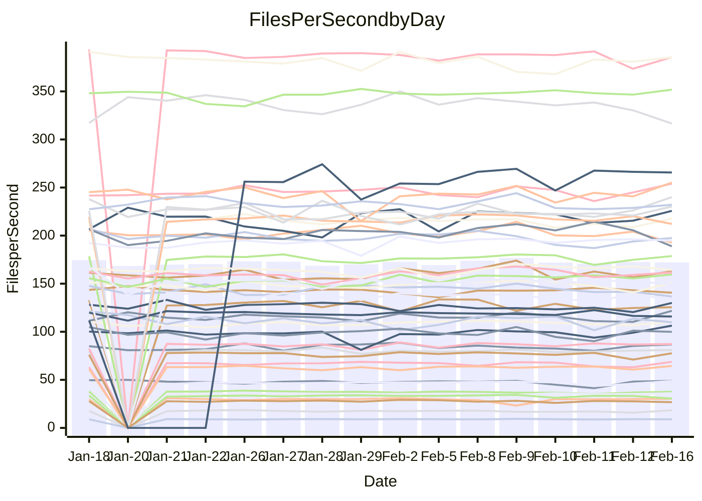

<!---
# This file is auto-generated. Do not edit.
# cspell:disable
--->
# Performance Report

## Daily Performance

## Time to Process Files

| Repository                                      | Elapsed | Min/Avg/Max           |   SD | SD Graph                |
| ----------------------------------------------- | ------: | :-------------------: | ---: | ----------------------- |
| AdaDoom3/AdaDoom3                    |    3.37 | 3.0 /   3.1 /   3.3   | 0.09 | `    ┣━━┻━━╋━━┻━━┫ ●  ` |
| alexiosc/megistos                    |    7.20 | 6.8 /   7.3 /   7.6   | 0.16 | `    ┣━━┻●━╋━━┻━━┫    ` |
| apollographql/apollo-server          |    2.26 | 2.2 /   2.3 /   2.5   | 0.05 | `     ┣━┻●━╋━━┻━┫     ` |
| aspnetboilerplate/aspnetboilerplate  |    9.35 | 9.4 /  10.1 /  11.3   | 0.38 | `    ●━━┻━━╋━━┻━━┫    ` |
| aws-amplify/docs                     |   12.36 | 11.7 /  12.4 /  13.1  | 0.38 | `    ┣━━┻━━●━━┻━━┫    ` |
| Azure/azure-rest-api-specs           |    8.92 | 0.0 /   8.0 /  21.2   | 4.35 | `   ┣━━┻━━━╋●━━┻━━┫   ` |
| bitjson/typescript-starter           |    0.66 | 0.6 /   0.7 /   0.9   | 0.04 | `     ┣━┻━●╋━━┻━┫     ` |
| caddyserver/caddy                    |    3.22 | 3.1 /   3.4 /   3.7   | 0.15 | `    ┣━━●━━╋━━┻━━┫    ` |
| canada-ca/open-source-logiciel-libre |    0.78 | 0.7 /   0.8 /   0.8   | 0.02 | `     ┣━━┻━╋●┻━━┫     ` |
| chef/chef                            |    5.33 | 5.3 /   5.6 /   6.6   | 0.30 | `    ┣━━●━━╋━━┻━━┫    ` |
| dart-lang/sdk                        |   61.37 | 59.1 /  61.7 /  67.6  | 2.05 | `  ┣━━━┻━━●╋━━━┻━━━┫  ` |
| django/django                        |   14.50 | 14.2 /  14.7 /  15.8  | 0.34 | `    ┣━━┻━●╋━━┻━━┫    ` |
| eslint/eslint                        |   10.37 | 9.8 /  10.4 /  11.9   | 0.42 | `    ┣━━┻━━●━━┻━━┫    ` |
| exonum/exonum                        |    3.35 | 3.0 /   3.3 /   3.7   | 0.15 | `    ┣━━┻━━╋●━┻━━┫    ` |
| flutter/samples                      |   16.96 | 16.9 /  17.6 /  19.5  | 0.65 | `   ┣━━━●━━╋━━┻━━━┫   ` |
| gitbucket/gitbucket                  |    3.17 | 3.0 /   3.3 /   3.6   | 0.13 | `    ┣━━┻●━╋━━┻━━┫    ` |
| googleapis/google-cloud-cpp          |  132.49 | 117.6 / 130.6 / 142.8 | 4.85 | `  ┣━━━┻━━━╋━●━┻━━━┫  ` |
| graphql/express-graphql              |    0.72 | 0.7 /   0.7 /   0.8   | 0.02 | `     ┣━━●━╋━┻━━┫     ` |
| graphql/graphql-js                   |    2.27 | 2.2 /   2.3 /   2.5   | 0.07 | `     ┣━┻━●╋━━┻━┫     ` |
| graphql/graphql-relay-js             |    0.74 | 0.7 /   0.8 /   0.8   | 0.02 | `     ┣━━┻●╋━┻━━┫     ` |
| graphql/graphql-spec                 |    0.82 | 0.8 /   0.9 /   1.1   | 0.05 | `     ┣━┻●━╋━━┻━┫     ` |
| iluwatar/java-design-patterns        |   11.68 | 10.9 /  11.9 /  13.1  | 0.52 | `    ┣━━┻●━╋━━┻━━┫    ` |
| ktaranov/sqlserver-kit               |    6.30 | 6.1 /   6.4 /   7.0   | 0.21 | `    ┣━━┻━●╋━━┻━━┫    ` |
| liriliri/licia                       |    3.72 | 3.6 /   3.7 /   3.9   | 0.07 | `    ┣━━┻━━●━━┻━━┫    ` |
| MartinThoma/LaTeX-examples           |    6.47 | 6.3 /   6.6 /   7.1   | 0.18 | `    ┣━━┻●━╋━━┻━━┫    ` |
| mdx-js/mdx                           |    1.62 | 1.6 /   1.6 /   1.9   | 0.07 | `     ┣━┻━●╋━━┻━┫     ` |
| microsoft/TypeScript-Website         |    5.40 | 5.0 /   5.3 /   5.9   | 0.19 | `    ┣━━┻━━╋●━┻━━┫    ` |
| MicrosoftDocs/PowerShell-Docs        |   24.65 | 18.5 /  24.2 /  28.9  | 1.79 | `   ┣━━┻━━━╋●━━┻━━┫   ` |
| neovim/nvim-lspconfig                |    3.11 | 3.1 /   3.3 /   3.7   | 0.14 | `    ┣━●┻━━╋━━┻━━┫    ` |
| pagekit/pagekit                      |    3.49 | 3.3 /   3.4 /   3.6   | 0.07 | `    ┣━━┻━━╋━━┻●━┫    ` |
| php/php-src                          |   22.19 | 21.1 /  22.8 /  26.5  | 1.48 | `   ┣━━┻━━●╋━━━┻━━┫   ` |
| plasticrake/tplink-smarthome-api     |    0.90 | 0.9 /   0.9 /   1.1   | 0.05 | `     ┣━┻●━╋━━┻━┫     ` |
| prettier/prettier                    |    6.94 | 6.2 /   6.6 /   7.1   | 0.20 | `    ┣━━┻━━╋━━┻━━●    ` |
| pycontribs/jira                      |    1.24 | 1.2 /   1.3 /   1.4   | 0.04 | `     ┣━┻●━╋━━┻━┫     ` |
| RustPython/RustPython                |    4.54 | 4.1 /   4.3 /   4.7   | 0.14 | `    ┣━━┻━━╋━━┻━●┫    ` |
| shoelace-style/shoelace              |    2.45 | 2.4 /   2.5 /   2.7   | 0.07 | `     ┣━┻●━╋━━┻━┫     ` |
| slint-ui/slint                       |   10.62 | 9.2 /   9.9 /  11.2   | 0.45 | `    ┣━━┻━━╋━━┻━●┫    ` |
| SoftwareBrothers/admin-bro           |    2.29 | 2.1 /   2.2 /   2.3   | 0.07 | `     ┣━┻━━╋━━┻●┫     ` |
| sveltejs/svelte                      |   18.65 | 18.3 /  18.9 /  20.1  | 0.43 | `   ┣━━━┻●━╋━━┻━━━┫   ` |
| TheAlgorithms/Python                 |    5.39 | 5.4 /   5.6 /   6.1   | 0.18 | `    ┣━●┻━━╋━━┻━━┫    ` |
| twbs/bootstrap                       |    1.13 | 1.1 /   1.2 /   1.5   | 0.07 | `     ┣●┻━━╋━━┻━┫     ` |
| typescript-cheatsheets/react         |    1.09 | 1.1 /   1.1 /   1.3   | 0.04 | `     ┣━●━━╋━━┻━┫     ` |
| typescript-eslint/typescript-eslint  |    3.64 | 3.6 /   3.7 /   3.8   | 0.06 | `     ┣━┻●━╋━━┻━┫     ` |
| vitest-dev/vitest                    |    7.73 | 7.8 /   8.2 /   9.2   | 0.34 | `    ┣━●┻━━╋━━┻━━┫    ` |
| w3c/aria-practices                   |    3.02 | 2.9 /   2.9 /   3.1   | 0.07 | `     ┣━┻━━╋━━●━┫     ` |
| w3c/specberus                        |    1.73 | 1.6 /   1.7 /   1.8   | 0.04 | `     ┣━┻━━╋━━●━┫     ` |
| webdeveric/webpack-assets-manifest   |    0.71 | 0.7 /   0.7 /   0.8   | 0.03 | `     ┣━━┻━╋━●━━┫     ` |
| webpack/webpack                      |    4.76 | 4.6 /   4.9 /   5.4   | 0.16 | `    ┣━━●━━╋━━┻━━┫    ` |
| wireapp/wire-desktop                 |    0.88 | 0.9 /   0.9 /   1.1   | 0.06 | `     ┣━┻━●╋━━┻━┫     ` |
| wireapp/wire-webapp                  |    8.80 | 8.2 /   8.7 /   9.3   | 0.28 | `    ┣━━┻━━╋●━┻━━┫    ` |

Note:
- Elapsed time is in seconds.

## Files per Second over Time

| Repository                                      | Files |    Sec |    Fps |    Rel | Trend Fps              |    N |
| ----------------------------------------------- | ----: | -----: | -----: | -----: | ---------------------- | ---: |
| AdaDoom3/AdaDoom3                    |   103 |   3.37 |  30.53 | -7.93% | `▆▇█▇█▇█▅▇▇▇██▄▅█▆▇▆▄` |   25 |
| alexiosc/megistos                    |   583 |   7.20 |  80.99 |  1.29% | `▅▆▆█▄▆▅▅▅▆▆▅▆▆▄▅▆▆▆▆` |   25 |
| apollographql/apollo-server          |   250 |   2.26 | 110.60 |  1.81% | `█▆▅▆▇▇▇▆█▇▇▇▆▇▇▆▆▆▅▇` |   28 |
| aspnetboilerplate/aspnetboilerplate  |  2246 |   9.35 | 240.10 |  7.41% | `▅▆▆▅▆▆▅▇▃▆▇▇▆▆▆▅▆▇▆█` |   26 |
| aws-amplify/docs                     |  2867 |  12.36 | 232.02 | -0.04% | `▇▄█▇▆▄▆▅▇▇▇█▅▆▇▅▆▆▆▆` |   28 |
| Azure/azure-rest-api-specs           |  2369 |   8.92 | 265.66 | 28.14% | `███▇█▇██▇███▇▇██████` |   28 |
| bitjson/typescript-starter           |    20 |   0.66 |  30.35 |  2.38% | `▇▇▇▇▇█▆█▇▇▇▅▂▆█▇▇▇██` |   25 |
| caddyserver/caddy                    |   279 |   3.22 |  86.74 |  4.01% | `▄█▆▇█▇▄▇▇▆█▆▆▆▅▇▃▆▇▇` |   28 |
| canada-ca/open-source-logiciel-libre |     7 |   0.78 |   8.93 | -1.28% | `▆▇▇▇▆▇█▅▇▆▄▇█▇▆▇▄█▅▆` |   25 |
| chef/chef                            |  1204 |   5.33 | 225.73 |  5.47% | `▅▄▆▃▇█▆▆▅▄█▇▇▆█▅▇▆▇█` |   27 |
| dart-lang/sdk                        | 10088 |  61.37 | 164.38 |  0.40% | `▇▆▇▅▇▆▄▆▄▇▇███▆▇▇█▇▇` |   28 |
| django/django                        |  2826 |  14.50 | 194.83 |  1.09% | `▆█▆▄█▇▇▇▆▇██▆▇▇▇▇▇█▇` |   28 |
| eslint/eslint                        |  2049 |  10.37 | 197.53 |  0.10% | `▇▆▇▆▇█▇▇▇█▇▇▅▅▆▇▃▅▇▇` |   28 |
| exonum/exonum                        |   421 |   3.35 | 125.50 | -2.51% | `▆▇▇▄▇▄█▇▆▇▇▇▄▅▆▅▄▇▃▅` |   25 |
| flutter/samples                      |  2707 |  16.96 | 159.62 |  4.10% | `▆█▇▃▆█▇▅▇▆█▇█▇▇██▇▇█` |   27 |
| gitbucket/gitbucket                  |   412 |   3.17 | 129.98 |  2.99% | `██▇▇▅▇▇▆▇▅▇▆█▅▅▇▅▆▄▇` |   28 |
| googleapis/google-cloud-cpp          | 19819 | 132.49 | 149.58 | -1.41% | `▇▆▄▇▇▇█▄▆▆██▇▆▆▇▇▇▇▆` |   28 |
| graphql/express-graphql              |    26 |   0.72 |  35.98 |  2.11% | `█▆▇▆▆▆▆▆▆▆▆▆▅▆▇▇▅▅▇▇` |   25 |
| graphql/graphql-js                   |   343 |   2.27 | 151.13 |  1.72% | `▇▆▇▆▇██▇█▇███▇▇▆▇▆▄▇` |   27 |
| graphql/graphql-relay-js             |    28 |   0.74 |  37.62 |  0.77% | `██▇▇▇▇█████▇▆▆▇▄▆▆▇▇` |   25 |
| graphql/graphql-spec                 |    15 |   0.82 |  18.35 |  5.67% | `▇▇▆▇▇█▇▇▇██▆▄█▆▇▆▇▂█` |   26 |
| iluwatar/java-design-patterns        |  1902 |  11.68 | 162.87 |  2.02% | `▆▃▅▅▅▇▆▅▆▆▇▇█▆▃▆▆▇▃▆` |   26 |
| ktaranov/sqlserver-kit               |   489 |   6.30 |  77.64 |  1.33% | `▇▇▆▅▆▇▇▇▆▇▇▇▇▇▆█▆▅▃▇` |   25 |
| liriliri/licia                       |  1434 |   3.72 | 385.59 | -0.36% | `▆█▇▇▇▇█▆▇▆▇▇▇▇█▇█▇▅▇` |   25 |
| MartinThoma/LaTeX-examples           |  1409 |   6.47 | 217.81 |  1.60% | `▆█▇▅▇█▆▇▇▇▆█▇▇▄▇▆▇▅▇` |   25 |
| mdx-js/mdx                           |   141 |   1.62 |  87.24 |  1.55% | `▆▇█▇▅█▆▆▃██▇▇▇▆▇▇█▆▇` |   25 |
| microsoft/TypeScript-Website         |   760 |   5.40 | 140.65 | -1.02% | `▇▇▆▇▆▅▃▇▄▅▇▆▇▇▅█▆▆▇▆` |   28 |
| MicrosoftDocs/PowerShell-Docs        |  2708 |  24.65 | 109.85 | -1.41% | `▇▅▆▆▄▆▆▅▄▇▇▇▇▆█▆▂▆▇▆` |   28 |
| neovim/nvim-lspconfig                |   379 |   3.11 | 121.81 |  6.23% | `▅▇▆▅▇▆▆▆█▆▆█▆█▆▅▆▇▃█` |   28 |
| pagekit/pagekit                      |   741 |   3.49 | 212.12 | -2.76% | `▇▇█▅▆▆▇▇▇▇▇█▇▅█▅▇▇▇▅` |   25 |
| php/php-src                          |  2217 |  22.19 |  99.92 |  2.43% | `▇█▆▇█▅▇▇▇▇▅█▅▅▇▃▆▇█▇` |   28 |
| plasticrake/tplink-smarthome-api     |    62 |   0.90 |  68.79 |  3.59% | `▆█▇▇█▇▇▇▇▇▅▇█▇██▃▇▃█` |   25 |
| prettier/prettier                    |  2198 |   6.94 | 316.59 | -5.89% | `▇▅▅▆▇▆▇▆▆▇▇▆▆▆▆▄█▄▇▄` |   28 |
| pycontribs/jira                      |    80 |   1.24 |  64.42 |  2.74% | `▆▇▇▃▇▅▇█▇▇▇█▇▇▇▇█▅▆█` |   25 |
| RustPython/RustPython                |   620 |   4.54 | 136.63 | -5.23% | `▄█▇█▇▇▇▇█▇▆██▇▆▅▆▆▆▅` |   28 |
| shoelace-style/shoelace              |   438 |   2.45 | 178.71 |  1.43% | `▇█▇▅▆▇▅█▆█▇▇█▇█▇▄▆▇▇` |   25 |
| slint-ui/slint                       |  2005 |  10.62 | 188.86 | -6.79% | `▇▆▇▇▆▇▆▄▆▇▇▇▇▆▆█▇▇▆▄` |   28 |
| SoftwareBrothers/admin-bro           |   441 |   2.29 | 192.69 | -4.76% | `▅▇▇▆▇▆█▄▄▆▇▆█▅▆▆▅▇▆▄` |   26 |
| sveltejs/svelte                      |  7191 |  18.65 | 385.48 |  1.30% | `▇█▇▆██▇▇▅▇█▆▇▅▄▇▇▇▇█` |   28 |
| TheAlgorithms/Python                 |  1369 |   5.39 | 253.98 |  3.97% | `▇█▆▇█▇█▄▇▅▇█▇█▇▇▄▆██` |   28 |
| twbs/bootstrap                       |   120 |   1.13 | 106.34 |  8.49% | `▆▇▇▂▆█▇▅▄▇▇▇▆█▆▆▅▇▆█` |   28 |
| typescript-cheatsheets/react         |    53 |   1.09 |  48.76 |  4.28% | `▇▇▇▇▇▇█▇█▆▇██▇█▃▆▆▇█` |   25 |
| typescript-eslint/typescript-eslint  |  1282 |   3.64 | 351.78 |  1.44% | `▆▇▆█▇▆▆█▇▆█▇▇██▆█▆██` |   28 |
| vitest-dev/vitest                    |  1972 |   7.73 | 255.22 |  5.70% | `▇▇▇▃▆▇▇▆▆▆▇█▇▇▃▆█▆▇█` |   28 |
| w3c/aria-practices                   |   405 |   3.02 | 133.91 | -2.54% | `██▇█▆█▇▇█▇██▇▆▇▇▄▇█▆` |   25 |
| w3c/specberus                        |   200 |   1.73 | 115.88 | -2.56% | `▇▆▇▆▇▇▇▆▆▆▇▆▅▆▇██▆▆▆` |   28 |
| webdeveric/webpack-assets-manifest   |    19 |   0.71 |  26.73 | -3.99% | `▆▇▇▇▆████▇▇▅▇▆▃▇▇█▅▆` |   25 |
| webpack/webpack                      |  1095 |   4.76 | 230.21 |  2.94% | `▃██▆▄▅▆▆▆▇▆▆▅▆▆▅▇▆▅▇` |   26 |
| wireapp/wire-desktop                 |    43 |   0.88 |  48.93 |  3.20% | `███▇▇██▇█▇██▇█▂▄▄█▇█` |   29 |
| wireapp/wire-webapp                  |  1421 |   8.80 | 161.56 |  1.19% | `▇▄▄▆▇▆▇▆▆▇██▇▇█▆▆▆▆▇` |   28 |

## Data Throughput

| Repository                                      | Files |    Sec |     Kps |    Rel | Trend Kps              |    N |
| ----------------------------------------------- | ----: | -----: | ------: | -----: | ---------------------- | ---: |
| AdaDoom3/AdaDoom3                    |   103 |   3.37 |  648.92 | -7.93% | `▆▇█▇█▇█▅▇▇▇██▄▅█▆▇▆▄` |   25 |
| alexiosc/megistos                    |   583 |   7.20 |  636.42 |  1.29% | `▅▆▆█▄▆▅▅▅▆▆▅▆▆▄▅▆▆▆▆` |   25 |
| apollographql/apollo-server          |   250 |   2.26 |  885.70 |  1.84% | `█▆▅▆▇▇▇▆█▇▇▇▆▇▇▆▆▆▅▇` |   28 |
| aspnetboilerplate/aspnetboilerplate  |  2246 |   9.35 |  564.98 |  7.42% | `▅▆▆▅▆▆▅▇▃▆▇▇▆▆▆▅▆▇▆█` |   26 |
| aws-amplify/docs                     |  2867 |  12.36 |  798.83 |  0.05% | `▇▄█▇▆▄▆▅▇▇▇█▅▆▇▅▆▆▆▆` |   28 |
| Azure/azure-rest-api-specs           |  2369 |   8.92 |  760.75 |  5.37% | `███▆▇▆██▆███▇▆██████` |   23 |
| bitjson/typescript-starter           |    20 |   0.66 |  121.39 |  2.38% | `▇▇▇▇▇█▆█▇▇▇▅▂▆█▇▇▇██` |   25 |
| caddyserver/caddy                    |   279 |   3.22 |  724.07 |  4.06% | `▄█▆▇█▇▄▇▇▆█▆▆▆▅▇▃▆▇▇` |   28 |
| canada-ca/open-source-logiciel-libre |     7 |   0.78 |   73.99 | -1.28% | `▆▇▇▇▆▇█▅▇▆▄▇█▇▆▇▄█▅▆` |   25 |
| chef/chef                            |  1204 |   5.33 | 1037.16 |  5.49% | `▅▄▆▃▇█▆▆▅▄█▇▇▆█▅▇▆▇█` |   27 |
| dart-lang/sdk                        | 10088 |  61.37 | 1154.08 | -0.41% | `▇▆█▆█▆▄▆▄▇▇███▆▇▇█▇▇` |   28 |
| django/django                        |  2826 |  14.50 | 1203.32 |  1.11% | `▆█▆▄█▇▇▇▆▇██▆▇▇▇▇▇█▇` |   28 |
| eslint/eslint                        |  2049 |  10.37 | 1612.25 | -0.09% | `▇▆▇▆▇█▇▇▇█▇▇▅▅▆▇▃▅▇▇` |   28 |
| exonum/exonum                        |   421 |   3.35 | 1200.49 | -2.51% | `▆▇▇▄▇▄█▇▆▇▇▇▄▅▆▅▄▇▃▅` |   25 |
| flutter/samples                      |  2707 |  16.96 | 1290.92 |  3.90% | `▆█▇▃▆█▇▄▇▆█▇█▇▇██▇▇█` |   27 |
| gitbucket/gitbucket                  |   412 |   3.17 |  587.74 |  2.99% | `██▇▇▅▇▇▆▇▅▇▆█▅▅▇▅▆▄▇` |   28 |
| googleapis/google-cloud-cpp          | 19819 | 132.49 | 1171.69 | -1.36% | `▇▆▄▇▇▇█▄▆▆██▇▆▆▇▇▇▇▆` |   28 |
| graphql/express-graphql              |    26 |   0.72 |  164.69 |  2.11% | `█▆▇▆▆▆▆▆▆▆▆▆▅▆▇▇▅▅▇▇` |   25 |
| graphql/graphql-js                   |   343 |   2.27 |  849.48 |  1.30% | `▇▆▇▆▇██▇█▇███▇▇▆▇▆▄▇` |   27 |
| graphql/graphql-relay-js             |    28 |   0.74 |  147.80 |  0.77% | `██▇▇▇▇█████▇▆▆▇▄▆▆▇▇` |   25 |
| graphql/graphql-spec                 |    15 |   0.82 |  676.37 |  5.81% | `▇▇▆▇▇█▇▇▇██▆▄█▆▇▆▇▂█` |   26 |
| iluwatar/java-design-patterns        |  1902 |  11.68 |  499.38 |  2.02% | `▆▃▅▅▅▇▆▅▆▆▇▇█▆▃▆▆▇▃▆` |   26 |
| ktaranov/sqlserver-kit               |   489 |   6.30 | 1174.55 |  1.33% | `▇▇▆▅▆▇▇▇▆▇▇▇▇▇▆█▆▅▃▇` |   25 |
| liriliri/licia                       |  1434 |   3.72 |  456.85 | -0.36% | `▆█▇▇▇▇█▆▇▆▇▇▇▇█▇█▇▅▇` |   25 |
| MartinThoma/LaTeX-examples           |  1409 |   6.47 |  449.85 |  1.60% | `▆█▇▅▇█▆▇▇▇▆█▇▇▄▇▆▇▅▇` |   25 |
| mdx-js/mdx                           |   141 |   1.62 |  404.66 |  1.69% | `▆▇▇▇▅█▆▆▃██▇▇▇▆▇▇█▆▇` |   25 |
| microsoft/TypeScript-Website         |   760 |   5.40 |  969.38 | -0.63% | `▆▇▆▆▆▅▃▇▄▅▇▆▇▇▅█▆▆▇▆` |   28 |
| MicrosoftDocs/PowerShell-Docs        |  2708 |  24.65 | 1126.49 | -1.31% | `▇▅▆▆▄▆▆▅▄▇▇▇▇▆█▆▂▆▇▆` |   28 |
| neovim/nvim-lspconfig                |   379 |   3.11 |  320.10 |  6.50% | `▅▇▆▅▇▆▆▆█▆▆█▆█▆▅▆▇▃█` |   28 |
| pagekit/pagekit                      |   741 |   3.49 |  442.27 | -2.76% | `▇▇█▅▆▆▇▇▇▇▇█▇▅█▅▇▇▇▅` |   25 |
| php/php-src                          |  2217 |  22.19 | 1463.88 |  2.40% | `▇▇▆▇█▅▇▇▇▇▅█▅▅▇▃▆▇█▇` |   28 |
| plasticrake/tplink-smarthome-api     |    62 |   0.90 |  371.70 |  3.59% | `▆█▇▇█▇▇▇▇▇▅▇█▇██▃▇▃█` |   25 |
| prettier/prettier                    |  2198 |   6.94 |  449.68 | -5.44% | `▆▅▅▆▇▆▆▆▆▆▇▆▆▆▆▅█▄▇▄` |   28 |
| pycontribs/jira                      |    80 |   1.24 |  443.72 |  2.74% | `▆▇▇▃▇▅▇█▇▇▇█▇▇▇▇█▅▆█` |   25 |
| RustPython/RustPython                |   620 |   4.54 | 1013.06 | -5.19% | `▄█▇█▇▇▇▇█▇▆██▇▆▅▆▆▆▅` |   28 |
| shoelace-style/shoelace              |   438 |   2.45 |  861.31 |  1.60% | `▇█▇▅▆▇▅█▆█▇▇█▇█▇▄▆▇▇` |   25 |
| slint-ui/slint                       |  2005 |  10.62 |  978.85 | -6.56% | `▇▆▇▆▆▇▆▄▆▇▇▇▇▆▆█▇▇▆▄` |   28 |
| SoftwareBrothers/admin-bro           |   441 |   2.29 |  424.71 | -4.76% | `▅▇▇▆▇▆█▄▄▆▇▆█▅▆▆▅▇▆▄` |   26 |
| sveltejs/svelte                      |  7191 |  18.65 |  255.92 |  1.35% | `▇█▇▆██▇▇▅▇█▆▇▅▄▇▇▇▇█` |   28 |
| TheAlgorithms/Python                 |  1369 |   5.39 |  645.25 |  3.97% | `▇█▆▇█▇█▄▇▅▇█▇█▇▇▄▆██` |   28 |
| twbs/bootstrap                       |   120 |   1.13 |  853.38 |  8.49% | `▆▇▇▂▆█▇▅▄▇▇▇▆█▆▆▅▇▆█` |   28 |
| typescript-cheatsheets/react         |    53 |   1.09 |  356.96 |  4.28% | `▇▇▇▇▇▇█▇█▆▇██▇█▃▆▆▇█` |   25 |
| typescript-eslint/typescript-eslint  |  1282 |   3.64 | 1728.73 |  2.00% | `▆▇▆▇▇▆▆█▇▆█▇▇██▇█▆██` |   28 |
| vitest-dev/vitest                    |  1972 |   7.73 |  533.08 |  5.66% | `▇▇▇▃▆▇▇▆▆▆▇█▇▇▃▆█▆▇█` |   28 |
| w3c/aria-practices                   |   405 |   3.02 | 1243.53 | -2.54% | `██▇█▆█▇▇█▇██▇▆▇▇▄▇█▆` |   25 |
| w3c/specberus                        |   200 |   1.73 |  369.65 | -2.56% | `▇▆▇▆▇▇▇▆▆▆▇▆▅▆▇██▆▆▆` |   28 |
| webdeveric/webpack-assets-manifest   |    19 |   0.71 |  143.49 | -3.99% | `▆▇▇▇▆████▇▇▅▇▆▃▇▇█▅▆` |   25 |
| webpack/webpack                      |  1095 |   4.76 | 1016.10 |  2.97% | `▃██▆▄▅▆▆▆▇▆▆▅▆▆▅▇▆▅▇` |   26 |
| wireapp/wire-desktop                 |    43 |   0.88 |  216.19 |  3.20% | `███▇▇██▇█▇██▇█▂▄▄█▇█` |   29 |
| wireapp/wire-webapp                  |  1421 |   8.80 |  639.31 | -0.07% | `█▅▄▆▇▆▆▆▆▇██▇▇█▅▅▆▆▆` |   28 |

