<!---
# This file is auto-generated. Do not edit.
# cspell:disable
--->
# Performance Report

## Daily Performance

```mermaid
xychart-beta
    title Files Per Second by Day
    y-axis Files per Second
    x-axis Date [Jan-18, Jan-20, Jan-21, Jan-22, Jan-26, Jan-27, Jan-28, Jan-29, Feb-2, Feb-5, Feb-8, Feb-9, Feb-10, Feb-11, Feb-12, Feb-16, Feb-17]
    bar [174.50, 168.43, 169.86, 170.44, 173.21, 172.82, 168.69, 170.17, 172.76, 169.39, 173.94, 176.68, 172.01, 170.80, 172.59, 172.20, 168.44]
    line [49.61, 49.98, 48.14, 47.57, 46.02, 47.96, 48.80, 46.78, 47.79, 48.42, 47.97, 48.95, 44.92, 41.33, 48.11, 48.93, 47.72]
    line [29.74, 0.00, 30.87, 30.00, 28.70, 30.12, 29.90, 29.99, 31.08, 29.80, 28.87, 23.26, 29.91, 29.82, 30.05, 30.35, 27.53]
    line [17.55, 0.00, 17.39, 18.17, 18.55, 17.57, 16.82, 17.76, 17.39, 17.79, 18.01, 16.74, 16.81, 17.17, 15.81, 18.35, 18.01]
    line [37.95, 0.00, 37.76, 37.89, 38.81, 37.93, 37.35, 37.58, 36.65, 37.87, 37.52, 36.62, 36.71, 35.21, 36.78, 37.62, 38.00]
    line [132.93, 0.00, 127.27, 127.81, 130.32, 132.03, 125.54, 132.09, 121.09, 133.64, 133.48, 121.84, 129.06, 122.93, 124.68, 125.50, 126.10]
    line [8.99, 0.00, 9.21, 8.99, 8.69, 9.06, 9.17, 8.90, 9.14, 9.10, 8.87, 9.39, 9.10, 8.79, 9.11, 8.93, 8.61]
    line [393.53, 0.00, 392.61, 391.87, 384.72, 385.87, 389.43, 389.76, 387.86, 381.95, 388.55, 388.50, 387.75, 391.57, 373.53, 385.59, 389.76]
    line [128.09, 123.93, 133.11, 122.76, 127.88, 128.69, 130.23, 128.77, 121.54, 127.82, 124.27, 124.62, 123.31, 125.03, 120.42, 129.98, 129.47]
    line [110.59, 105.90, 107.50, 104.30, 108.52, 110.13, 106.78, 107.20, 109.65, 110.63, 111.16, 110.94, 109.21, 107.83, 106.68, 110.60, 103.19]
    line [35.07, 0.00, 35.24, 34.68, 33.94, 35.92, 35.70, 34.97, 35.24, 35.24, 35.29, 34.51, 36.01, 35.10, 35.21, 35.98, 34.50]
    line [84.98, 80.87, 81.08, 81.74, 87.91, 80.34, 86.50, 86.84, 88.66, 83.22, 85.59, 83.52, 82.54, 80.25, 85.24, 86.74, 84.52]
    line [204.97, 200.41, 200.50, 201.35, 196.11, 202.03, 205.84, 210.33, 202.30, 198.84, 204.68, 214.35, 200.27, 199.54, 204.14, 192.69, 205.08]
    line [79.79, 0.00, 78.41, 81.03, 80.80, 79.69, 83.58, 77.01, 80.34, 79.32, 79.86, 81.63, 78.70, 79.41, 80.42, 80.99, 79.72]
    line [33.62, 0.00, 32.53, 32.97, 33.70, 32.82, 33.62, 33.93, 33.23, 33.25, 33.77, 34.38, 31.28, 33.43, 33.24, 30.53, 33.56]
    line [143.49, 147.59, 143.59, 141.42, 143.21, 141.20, 143.98, 143.78, 140.14, 135.87, 142.86, 142.75, 143.10, 145.82, 143.11, 140.65, 141.05]
    line [206.92, 196.43, 199.84, 197.78, 203.69, 196.52, 194.52, 195.98, 201.87, 201.12, 204.97, 199.43, 190.33, 187.01, 193.91, 197.53, 193.75]
    line [63.23, 0.00, 67.48, 67.27, 65.41, 67.07, 67.22, 68.71, 67.83, 67.42, 64.50, 68.29, 67.95, 63.94, 63.10, 68.79, 65.11]
    line [206.70, 229.01, 219.68, 219.77, 209.49, 204.94, 198.04, 223.32, 227.45, 204.37, 225.14, 223.42, 222.08, 213.20, 215.50, 225.73, 182.17]
    line [215.48, 0.00, 214.23, 216.83, 222.41, 215.81, 211.64, 216.10, 218.52, 215.06, 216.88, 216.99, 208.40, 212.31, 208.84, 217.81, 210.09]
    line [48.44, 0.00, 45.59, 47.24, 46.87, 46.43, 46.80, 47.45, 47.29, 47.35, 47.86, 48.05, 47.30, 43.46, 46.02, 48.76, 47.97]
    line [206.76, 190.09, 194.48, 202.39, 197.93, 196.32, 205.82, 204.70, 203.85, 198.04, 207.86, 211.91, 205.36, 214.41, 205.57, 188.86, 197.85]
    line [61.26, 0.00, 63.19, 63.24, 64.72, 62.00, 60.00, 63.28, 59.94, 63.60, 64.06, 62.64, 63.65, 63.88, 60.68, 64.42, 62.81]
    line [317.17, 344.00, 340.27, 346.07, 341.26, 330.59, 326.24, 336.05, 350.02, 336.18, 342.95, 339.36, 335.43, 338.51, 330.30, 316.59, 325.50]
    line [178.49, 0.00, 174.64, 178.29, 177.69, 180.46, 173.36, 171.47, 176.27, 176.08, 177.50, 180.37, 179.50, 169.53, 174.82, 178.71, 167.27]
    line [161.40, 158.69, 156.26, 158.43, 164.60, 154.09, 155.59, 154.71, 166.16, 160.94, 165.57, 174.04, 154.30, 162.65, 156.66, 162.87, 160.86]
    line [147.65, 139.36, 140.95, 149.41, 138.21, 138.55, 146.90, 148.25, 146.04, 146.87, 144.71, 150.09, 144.64, 141.32, 141.68, 136.63, 148.87]
    line [82.51, 0.00, 87.43, 86.48, 87.49, 84.71, 86.94, 81.29, 88.85, 83.51, 88.25, 87.06, 84.92, 87.81, 86.69, 87.24, 83.58]
    line [100.17, 98.43, 101.26, 97.05, 98.45, 98.30, 100.11, 81.16, 97.62, 97.16, 101.86, 100.35, 99.46, 93.91, 99.01, 106.34, 94.50]
    line [151.83, 146.83, 148.17, 142.81, 152.72, 147.54, 147.09, 145.41, 148.70, 151.93, 151.71, 152.93, 151.27, 147.55, 140.92, 151.13, 149.52]
    line [192.25, 187.45, 187.38, 192.87, 195.04, 191.69, 194.48, 178.97, 199.11, 192.32, 196.15, 196.80, 192.49, 195.28, 196.29, 194.83, 184.43]
    line [111.41, 120.28, 114.69, 112.28, 117.78, 116.14, 114.78, 110.96, 118.96, 114.84, 114.56, 119.99, 116.03, 111.12, 110.27, 121.81, 116.46]
    line [219.52, 0.00, 214.36, 216.75, 217.84, 220.87, 215.44, 214.77, 213.40, 220.70, 222.08, 221.01, 216.87, 215.38, 220.23, 212.12, 219.61]
    line [237.86, 219.38, 227.33, 226.70, 233.87, 217.12, 216.93, 224.01, 224.86, 217.64, 233.33, 222.49, 222.54, 219.50, 226.16, 240.10, 229.41]
    line [347.95, 349.61, 348.67, 336.98, 334.45, 346.57, 346.60, 352.58, 347.78, 346.57, 347.57, 348.75, 351.19, 348.15, 346.62, 351.78, 346.11]
    line [76.03, 0.00, 77.82, 78.41, 77.74, 77.78, 73.82, 74.60, 78.73, 76.88, 78.62, 77.47, 76.02, 78.07, 71.09, 77.64, 76.15]
    line [121.13, 117.45, 107.89, 115.63, 108.80, 113.98, 108.63, 112.03, 101.57, 107.21, 115.59, 114.29, 115.98, 101.55, 113.56, 109.85, 112.52]
    line [241.64, 242.10, 243.52, 243.78, 252.46, 245.33, 245.88, 247.56, 250.17, 242.23, 239.94, 251.24, 247.36, 235.88, 244.92, 253.98, 249.71]
    line [119.83, 111.61, 121.49, 119.94, 120.57, 119.01, 117.99, 117.30, 120.43, 119.43, 118.96, 118.43, 117.39, 122.51, 116.51, 115.88, 119.07]
    line [391.19, 385.76, 384.74, 382.99, 381.11, 378.87, 384.64, 371.32, 391.09, 379.53, 386.07, 370.43, 367.95, 383.26, 380.80, 385.48, 385.13]
    line [137.86, 0.00, 141.02, 138.02, 132.73, 140.24, 138.48, 133.03, 140.20, 137.55, 139.32, 138.06, 134.03, 131.86, 138.50, 133.91, 130.58]
    line [104.84, 96.90, 99.42, 91.88, 98.65, 96.11, 99.25, 100.66, 103.18, 98.24, 96.65, 104.96, 94.67, 90.15, 101.17, 99.92, 97.35]
    line [245.25, 247.79, 237.71, 245.48, 250.24, 239.03, 246.34, 215.04, 240.95, 243.60, 242.70, 251.69, 234.31, 244.51, 240.78, 255.22, 242.13]
    line [225.57, 0.00, 229.76, 226.99, 229.64, 213.50, 236.23, 220.41, 211.45, 222.13, 224.72, 223.26, 221.76, 223.13, 220.88, 230.21, 220.92]
    line [155.73, 146.52, 155.23, 146.60, 152.95, 153.44, 146.68, 148.04, 159.34, 150.93, 158.41, 157.97, 156.56, 158.71, 155.41, 159.62, 145.85]
    line [27.92, 0.00, 27.74, 27.10, 28.41, 27.77, 28.43, 27.26, 29.20, 28.78, 27.22, 28.25, 25.94, 28.04, 27.66, 26.73, 27.31]
    line [227.41, 232.25, 239.53, 241.09, 233.83, 229.73, 231.27, 235.75, 232.76, 227.56, 235.60, 244.14, 228.71, 227.46, 228.82, 232.02, 226.65]
    line [162.52, 155.39, 161.05, 158.62, 159.47, 158.84, 149.03, 155.81, 162.82, 158.93, 165.88, 167.89, 164.45, 156.78, 159.08, 161.56, 166.44]
    line [111.74, 0.00, 0.00, 0.00, 256.11, 255.68, 274.20, 237.51, 254.20, 253.57, 266.34, 269.39, 246.86, 267.66, 266.35, 265.66, 245.22]
    line [165.83, 163.17, 162.82, 166.39, 165.48, 164.06, 162.34, 156.27, 166.07, 155.61, 164.06, 170.66, 167.78, 165.93, 167.97, 164.38, 153.94]
    line [167.84, 138.47, 151.83, 152.31, 153.48, 154.19, 144.39, 154.19, 151.10, 150.58, 152.48, 156.02, 149.70, 153.17, 152.51, 149.58, 149.35]
```

## Time to Process Files

| Repository                                      | Elapsed | Min/Avg/Max           |   SD | SD Graph                |
| ----------------------------------------------- | ------: | :-------------------: | ---: | ----------------------- |
| AdaDoom3/AdaDoom3                    |    3.02 | 3.0 /   3.1 /   3.4   | 0.10 | `    ┣━━●━━╋━━┻━━┫    ` |
| alexiosc/megistos                    |    7.42 | 6.8 /   7.3 /   7.6   | 0.16 | `    ┣━━┻━━╋━●┻━━┫    ` |
| apollographql/apollo-server          |    2.36 | 2.2 /   2.3 /   2.5   | 0.06 | `     ┣━┻━━╋━●┻━┫     ` |
| aspnetboilerplate/aspnetboilerplate  |    9.88 | 9.4 /  10.0 /  11.3   | 0.39 | `    ┣━━┻━●╋━━┻━━┫    ` |
| aws-amplify/docs                     |   12.83 | 11.7 /  12.4 /  13.1  | 0.36 | `    ┣━━┻━━╋━━┻●━┫    ` |
| Azure/azure-rest-api-specs           |    9.73 | 0.0 /   8.1 /  21.2   | 4.22 | `   ┣━━┻━━━╋●━━┻━━┫   ` |
| bitjson/typescript-starter           |    0.67 | 0.6 /   0.7 /   0.9   | 0.05 | `     ┣━┻━●╋━━┻━┫     ` |
| caddyserver/caddy                    |    3.37 | 3.1 /   3.3 /   3.7   | 0.15 | `    ┣━━┻━━╋●━┻━━┫    ` |
| canada-ca/open-source-logiciel-libre |    0.80 | 0.7 /   0.8 /   0.8   | 0.03 | `     ┣━━┻━╋━●━━┫     ` |
| chef/chef                            |    5.53 | 5.3 /   5.7 /   8.2   | 0.56 | `    ┣━━┻━●╋━━┻━━┫    ` |
| dart-lang/sdk                        |   65.91 | 59.1 /  61.8 /  67.6  | 2.10 | `  ┣━━━┻━━━╋━━━┻━━●┫  ` |
| django/django                        |   15.12 | 14.2 /  14.7 /  15.8  | 0.37 | `    ┣━━┻━━╋━━┻●━┫    ` |
| eslint/eslint                        |   10.72 | 9.8 /  10.4 /  11.9   | 0.40 | `    ┣━━┻━━╋━━●━━┫    ` |
| exonum/exonum                        |    3.25 | 3.0 /   3.3 /   3.7   | 0.15 | `    ┣━━┻━●╋━━┻━━┫    ` |
| flutter/samples                      |   18.47 | 16.9 /  17.6 /  19.5  | 0.65 | `   ┣━━━┻━━╋━━┻●━━┫   ` |
| gitbucket/gitbucket                  |    3.15 | 3.0 /   3.3 /   3.6   | 0.13 | `    ┣━━●━━╋━━┻━━┫    ` |
| googleapis/google-cloud-cpp          |  135.23 | 117.6 / 130.7 / 142.8 | 4.70 | `  ┣━━━┻━━━╋━━━●━━━┫  ` |
| graphql/express-graphql              |    0.74 | 0.7 /   0.7 /   0.8   | 0.02 | `     ┣━━┻━╋●┻━━┫     ` |
| graphql/graphql-js                   |    2.29 | 2.2 /   2.3 /   2.5   | 0.07 | `     ┣━┻━●╋━━┻━┫     ` |
| graphql/graphql-relay-js             |    0.75 | 0.7 /   0.7 /   0.8   | 0.02 | `     ┣━━┻━●━┻━━┫     ` |
| graphql/graphql-spec                 |    0.83 | 0.8 /   0.9 /   1.1   | 0.05 | `     ┣━┻━●╋━━┻━┫     ` |
| iluwatar/java-design-patterns        |   12.10 | 10.9 /  11.9 /  13.1  | 0.51 | `    ┣━━┻━━╋●━┻━━┫    ` |
| ktaranov/sqlserver-kit               |    6.63 | 6.1 /   6.4 /   7.0   | 0.21 | `    ┣━━┻━━╋━━┻●━┫    ` |
| liriliri/licia                       |    3.90 | 3.5 /   3.7 /   3.9   | 0.08 | `    ┣━━┻━━╋━━┻━━┫●   ` |
| MartinThoma/LaTeX-examples           |    6.51 | 6.3 /   6.6 /   7.1   | 0.19 | `    ┣━━┻━●╋━━┻━━┫    ` |
| mdx-js/mdx                           |    1.76 | 1.6 /   1.6 /   1.9   | 0.06 | `     ┣━┻━━╋━━┻━●     ` |
| microsoft/TypeScript-Website         |    5.24 | 5.0 /   5.4 /   5.9   | 0.19 | `    ┣━━┻●━╋━━┻━━┫    ` |
| MicrosoftDocs/PowerShell-Docs        |   24.16 | 18.5 /  24.2 /  28.9  | 1.74 | `   ┣━━┻━━━●━━━┻━━┫   ` |
| neovim/nvim-lspconfig                |    3.26 | 3.1 /   3.3 /   3.7   | 0.14 | `    ┣━━┻━●╋━━┻━━┫    ` |
| pagekit/pagekit                      |    3.34 | 3.3 /   3.4 /   3.6   | 0.07 | `    ┣━━┻●━╋━━┻━━┫    ` |
| php/php-src                          |   23.01 | 21.1 /  22.8 /  26.5  | 1.43 | `   ┣━━┻━━━╋●━━┻━━┫   ` |
| plasticrake/tplink-smarthome-api     |    0.94 | 0.9 /   0.9 /   1.1   | 0.04 | `     ┣━┻━━╋●━┻━┫     ` |
| prettier/prettier                    |    6.39 | 6.2 /   6.6 /   7.2   | 0.23 | `    ┣━━●━━╋━━┻━━┫    ` |
| pycontribs/jira                      |    1.31 | 1.2 /   1.3 /   1.4   | 0.04 | `     ┣━┻━━╋━●┻━┫     ` |
| RustPython/RustPython                |    4.11 | 4.1 /   4.3 /   4.7   | 0.14 | `    ┣━●┻━━╋━━┻━━┫    ` |
| shoelace-style/shoelace              |    2.47 | 2.4 /   2.5 /   2.8   | 0.09 | `     ┣━┻━●╋━━┻━┫     ` |
| slint-ui/slint                       |   10.85 | 9.2 /   9.9 /  11.2   | 0.45 | `    ┣━━┻━━╋━━┻━━┫●   ` |
| SoftwareBrothers/admin-bro           |    2.18 | 2.1 /   2.2 /   2.3   | 0.07 | `     ┣━┻━━●━━┻━┫     ` |
| sveltejs/svelte                      |   18.85 | 18.3 /  18.9 /  20.1  | 0.42 | `   ┣━━━┻━━●━━┻━━━┫   ` |
| TheAlgorithms/Python                 |    5.35 | 5.4 /   5.6 /   6.1   | 0.18 | `    ┣━●┻━━╋━━┻━━┫    ` |
| twbs/bootstrap                       |    1.25 | 1.1 /   1.2 /   1.5   | 0.07 | `     ┣━┻━━╋●━┻━┫     ` |
| typescript-cheatsheets/react         |    1.11 | 1.1 /   1.1 /   1.3   | 0.04 | `     ┣━┻━●╋━━┻━┫     ` |
| typescript-eslint/typescript-eslint  |    3.70 | 3.6 /   3.7 /   3.8   | 0.06 | `    ┣━━┻━━●━━┻━━┫    ` |
| vitest-dev/vitest                    |    8.20 | 7.7 /   8.1 /   9.2   | 0.33 | `    ┣━━┻━━╋●━┻━━┫    ` |
| w3c/aria-practices                   |    3.01 | 2.9 /   3.0 /   3.2   | 0.08 | `    ┣━━┻━━╋━●┻━━┫    ` |
| w3c/specberus                        |    1.66 | 1.6 /   1.7 /   1.8   | 0.04 | `     ┣━┻━●╋━━┻━┫     ` |
| webdeveric/webpack-assets-manifest   |    0.69 | 0.7 /   0.7 /   0.8   | 0.03 | `     ┣━━┻━╋●┻━━┫     ` |
| webpack/webpack                      |    4.75 | 4.6 /   4.9 /   5.4   | 0.16 | `    ┣━━●━━╋━━┻━━┫    ` |
| wireapp/wire-desktop                 |    0.87 | 0.9 /   0.9 /   1.1   | 0.06 | `     ┣━┻●━╋━━┻━┫     ` |
| wireapp/wire-webapp                  |    8.85 | 8.2 /   8.7 /   9.3   | 0.28 | `    ┣━━┻━━╋━●┻━━┫    ` |

Note:
- Elapsed time is in seconds.

## Files per Second over Time

| Repository                                      | Files |    Sec |    Fps |    Rel | Trend Fps              |    N |
| ----------------------------------------------- | ----: | -----: | -----: | -----: | ---------------------- | ---: |
| AdaDoom3/AdaDoom3                    |   103 |   3.02 |  34.05 |  2.99% | `█▇█▇█▅▇▇▇██▄▅█▇▇▇▄▇█` |   27 |
| alexiosc/megistos                    |   583 |   7.42 |  78.56 | -1.84% | `▆█▄▆▅▅▅▆▆▅▆▆▄▅▆▆▆▆▆▅` |   27 |
| apollographql/apollo-server          |   250 |   2.36 | 105.86 | -2.37% | `▅▆▇▇▇▆█▇▇▇▆▇▇▆▆▇▅▇▄▆` |   30 |
| aspnetboilerplate/aspnetboilerplate  |  2246 |   9.88 | 227.38 |  1.32% | `▆▅▆▆▅▇▃▆▇▇▆▆▆▅▆▇▆█▇▇` |   28 |
| aws-amplify/docs                     |  2867 |  12.83 | 223.45 | -3.70% | `█▇▆▄▆▅▇▇▇█▅▆▇▅▆▆▆▆▆▅` |   30 |
| Azure/azure-rest-api-specs           |  2373 |   9.73 | 243.99 | 15.87% | `█▇█▇██▇███▇▇██████▇▇` |   30 |
| bitjson/typescript-starter           |    20 |   0.67 |  29.89 |  1.31% | `▇▇▇█▆█▇▇▇▅▂▆█▇▇▇██▄▇` |   27 |
| caddyserver/caddy                    |   279 |   3.37 |  82.71 | -1.07% | `▆▇█▇▄▇▇▆█▆▆▆▅▇▃▆▇▇▇▆` |   30 |
| canada-ca/open-source-logiciel-libre |     7 |   0.80 |   8.76 | -2.82% | `▇▇▆▇█▅▇▆▄▇█▇▆▇▄█▅▆▄▅` |   27 |
| chef/chef                            |  1204 |   5.53 | 217.67 |  2.63% | `▇▅██▇▆▆▅███▇█▆█▇▇█▂▇` |   29 |
| dart-lang/sdk                        | 10108 |  65.91 | 153.36 | -6.17% | `▇▅▇▆▄▆▄▇▇███▆▇▇█▇▇▅▄` |   30 |
| django/django                        |  2833 |  15.12 | 187.36 | -2.63% | `▆▄█▇▇▇▆▇██▆▇▇▇▇▇█▇▅▆` |   30 |
| eslint/eslint                        |  2058 |  10.72 | 191.89 | -2.73% | `▇▆▇█▇▇▇█▇▇▅▅▆▇▃▅▇▇▆▆` |   30 |
| exonum/exonum                        |   421 |   3.25 | 129.52 |  0.88% | `▇▄▇▄█▇▆▇▇▇▄▅▆▅▄▇▃▅▅▆` |   27 |
| flutter/samples                      |  2684 |  18.47 | 145.32 | -5.20% | `▇▃▆█▇▅▇▆█▇█▇▇██▇▇█▅▅` |   29 |
| gitbucket/gitbucket                  |   412 |   3.15 | 130.76 |  3.45% | `▇█▆█▇▇█▅█▆█▅▅▇▆▆▄█▇█` |   30 |
| googleapis/google-cloud-cpp          | 19818 | 135.23 | 146.55 | -3.38% | `▄▇▇▇█▄▆▆██▇▆▆▇▇▇▇▆▇▆` |   30 |
| graphql/express-graphql              |    26 |   0.74 |  34.96 | -0.74% | `▇▇▆▇▇▆▇▇▆▇▆▇█▇▆▅█▇▅▆` |   27 |
| graphql/graphql-js                   |   343 |   2.29 | 150.07 |  0.93% | `▇▆▇██▇█▇███▇▇▆▇▆▄▇▇▇` |   29 |
| graphql/graphql-relay-js             |    28 |   0.75 |  37.29 | -0.30% | `▇▇▇▆▇▇▇█▇▇▆▆▆▄▆▆▆▇█▇` |   27 |
| graphql/graphql-spec                 |    15 |   0.83 |  17.96 |  3.11% | `▆▇▇█▇▇▇██▆▄█▆▇▆▇▂███` |   28 |
| iluwatar/java-design-patterns        |  1917 |  12.10 | 158.44 | -0.90% | `▅▅▅▇▆▅▆▆▇▇█▆▃▆▆▇▃▆▆▅` |   28 |
| ktaranov/sqlserver-kit               |   489 |   6.63 |  73.71 | -3.93% | `▆▅▆▇▇▇▆▇▇▇▇▇▆█▆▅▃▇▇▅` |   27 |
| liriliri/licia                       |  1434 |   3.90 | 367.23 | -5.32% | `▆▆▆▆▆▅▆▅▆▆▆▅▇▆▇▆▄▆█▄` |   27 |
| MartinThoma/LaTeX-examples           |  1409 |   6.51 | 216.52 |  1.12% | `▇▅▇█▆▇▇▇▆█▇▇▄▇▆▇▅▇▅▇` |   27 |
| mdx-js/mdx                           |   141 |   1.76 |  80.22 | -6.72% | `█▇▅█▆▆▃██▇▇▇▆▇▇█▆▇▇▅` |   27 |
| microsoft/TypeScript-Website         |   760 |   5.24 | 145.13 |  2.29% | `▆▇▆▅▃▇▄▅▇▆▇▇▅█▆▆▇▆▅▇` |   30 |
| MicrosoftDocs/PowerShell-Docs        |  2709 |  24.16 | 112.12 |  0.64% | `▆▆▄▆▆▅▄▇▇▇▇▆█▆▂▆▇▆▇▆` |   30 |
| neovim/nvim-lspconfig                |   379 |   3.26 | 116.14 |  1.01% | `▆▅▇▆▆▆█▆▆█▆█▆▅▆▇▃█▇▇` |   30 |
| pagekit/pagekit                      |   741 |   3.34 | 221.61 |  1.71% | `█▅▆▆▇▇▇▇▇█▇▅█▅▇▇▇▅▇▇` |   27 |
| php/php-src                          |  2221 |  23.01 |  96.51 | -1.17% | `▆▇█▅▇▇▇▇▅█▅▅▇▃▆▇█▇▆▆` |   30 |
| plasticrake/tplink-smarthome-api     |    62 |   0.94 |  65.66 | -1.16% | `▇▇█▇▇▇▇▇▅▇█▇██▃▇▃█▆▆` |   27 |
| prettier/prettier                    |  2197 |   6.39 | 343.83 |  2.71% | `▅▆█▆▇▆▆▇▇▆▆▆▆▅█▅▇▄▃▇` |   30 |
| pycontribs/jira                      |    80 |   1.31 |  60.96 | -2.99% | `▇▃▇▅▇█▇▇▇█▇▇▇▇█▅▆██▆` |   27 |
| RustPython/RustPython                |   622 |   4.11 | 151.42 |  5.16% | `▆▇▇▇▇▇▇▇▆█▇▆▆▅▆▆▆▅▇█` |   30 |
| shoelace-style/shoelace              |   438 |   2.47 | 177.39 |  1.03% | `▇▆▆▇▆█▇█▇▇█▇█▇▅▆▇█▃▇` |   27 |
| slint-ui/slint                       |  2058 |  10.85 | 189.70 | -6.22% | `▇▇▆▇▆▄▆▇▇▇▇▆▆█▇▇▆▄▇▅` |   30 |
| SoftwareBrothers/admin-bro           |   441 |   2.18 | 202.20 |  0.01% | `▇▆▇▆█▄▄▆▇▆█▅▆▆▅▇▆▄▇▆` |   28 |
| sveltejs/svelte                      |  7215 |  18.85 | 382.76 |  0.49% | `▇▆██▇▇▅▇█▆▇▅▄▇▇▇▇██▇` |   30 |
| TheAlgorithms/Python                 |  1369 |   5.35 | 256.10 |  4.71% | `▆▇▇▇▇▄▇▅▇▇▇▇▆▇▄▅██▆█` |   30 |
| twbs/bootstrap                       |   120 |   1.25 |  96.08 | -2.08% | `▇▂▆█▇▅▄▇▇▇▆█▆▆▅▇▆█▅▆` |   30 |
| typescript-cheatsheets/react         |    53 |   1.11 |  47.82 |  1.99% | `▇▇▇▇█▇█▆▇██▇█▃▆▆▇██▇` |   27 |
| typescript-eslint/typescript-eslint  |  1282 |   3.70 | 346.26 | -0.19% | `▆█▇▆▆█▇▆█▇▇██▆█▆██▇▇` |   30 |
| vitest-dev/vitest                    |  1978 |   8.20 | 241.07 | -0.37% | `▇▃▆▇▇▆▆▆▇█▇▇▃▆█▆▇█▇▆` |   30 |
| w3c/aria-practices                   |   405 |   3.01 | 134.38 | -1.82% | `██▆█▇▇█▇██▇▆▇▇▅▇█▆▄▆` |   27 |
| w3c/specberus                        |   200 |   1.66 | 120.25 |  1.23% | `▇▆▇▇▇▆▆▆▇▆▅▆▇██▆▆▆▆▇` |   30 |
| webdeveric/webpack-assets-manifest   |    19 |   0.69 |  27.38 | -1.42% | `▇▇▆████▇▇▅▇▆▃▇▇█▅▆▆▆` |   27 |
| webpack/webpack                      |  1096 |   4.75 | 230.92 |  3.36% | `█▆▄▅▆▆▆▇▆▆▅▆▆▅▇▆▅▇▄▇` |   28 |
| wireapp/wire-desktop                 |    43 |   0.87 |  49.25 |  3.87% | `█▇▇██▇█▇██▇█▂▄▄█▇█▇█` |   31 |
| wireapp/wire-webapp                  |  1443 |   8.85 | 163.01 |  1.84% | `▄▅▇▆▆▆▆▇██▇▇▇▅▆▆▆▆█▇` |   30 |

## Data Throughput

| Repository                                      | Files |    Sec |     Kps |    Rel | Trend Kps              |    N |
| ----------------------------------------------- | ----: | -----: | ------: | -----: | ---------------------- | ---: |
| AdaDoom3/AdaDoom3                    |   103 |   3.02 |  723.71 |  2.99% | `█▇█▇█▅▇▇▇██▄▅█▇▇▇▄▇█` |   27 |
| alexiosc/megistos                    |   583 |   7.42 |  617.30 | -1.84% | `▆█▄▆▅▅▅▆▆▅▆▆▄▅▆▆▆▆▆▅` |   27 |
| apollographql/apollo-server          |   250 |   2.36 |  847.77 | -2.34% | `▅▆▇▇▇▆█▇▇▇▆▇▇▆▆▇▅▇▄▆` |   30 |
| aspnetboilerplate/aspnetboilerplate  |  2246 |   9.88 |  535.04 |  1.33% | `▆▅▆▆▅▇▃▆▇▇▆▆▆▅▆▇▆█▇▇` |   28 |
| aws-amplify/docs                     |  2867 |  12.83 |  770.66 | -3.45% | `█▇▆▄▆▅▇▇▇█▅▆▇▅▆▆▆▆▆▅` |   30 |
| Azure/azure-rest-api-specs           |  2373 |   9.73 |  701.65 | -2.95% | `█▆▇▆██▆███▇▆██████▇▇` |   25 |
| bitjson/typescript-starter           |    20 |   0.67 |  119.55 |  1.31% | `▇▇▇█▆█▇▇▇▅▂▆█▇▇▇██▄▇` |   27 |
| caddyserver/caddy                    |   279 |   3.37 |  695.78 | -0.29% | `▆▇█▇▄▇▇▆█▆▆▆▅▇▃▆▇▇▇▆` |   30 |
| canada-ca/open-source-logiciel-libre |     7 |   0.80 |   72.61 | -2.82% | `▇▇▆▇█▅▇▆▄▇█▇▆▇▄█▅▆▄▅` |   27 |
| chef/chef                            |  1204 |   5.53 | 1000.14 |  2.65% | `▇▅██▇▆▆▅███▇█▆█▇▇█▂▇` |   29 |
| dart-lang/sdk                        | 10108 |  65.91 | 1078.10 | -6.76% | `█▆█▆▄▆▄▇▇███▆▇▇█▇▇▅▅` |   30 |
| django/django                        |  2833 |  15.12 | 1155.17 | -2.78% | `▆▄█▇▇▇▆▇██▆▇▇▇▇▇█▇▅▆` |   30 |
| eslint/eslint                        |  2058 |  10.72 | 1560.86 | -3.22% | `▇▆▇█▇▇▇█▇▇▅▅▆▇▃▅▇▇▆▆` |   30 |
| exonum/exonum                        |   421 |   3.25 | 1238.89 |  0.88% | `▇▄▇▄█▇▆▇▇▇▄▅▆▅▄▇▃▅▅▆` |   27 |
| flutter/samples                      |  2684 |  18.47 | 1190.64 | -4.18% | `▇▃▆█▇▄▇▆█▇█▇▇██▇▇█▆▅` |   29 |
| gitbucket/gitbucket                  |   412 |   3.15 |  591.28 |  3.45% | `▇█▆█▇▇█▅█▆█▅▅▇▆▆▄█▇█` |   30 |
| googleapis/google-cloud-cpp          | 19818 | 135.23 | 1150.04 | -3.15% | `▄▇▇▇█▄▆▆██▇▆▆▇▇▇▇▆▇▆` |   30 |
| graphql/express-graphql              |    26 |   0.74 |  160.02 | -0.74% | `▇▇▆▇▇▆▇▇▆▇▆▇█▇▆▅█▇▅▆` |   27 |
| graphql/graphql-js                   |   343 |   2.29 |  843.52 |  0.55% | `▇▆▇██▇█▇███▇▇▆▇▆▄▇▇▇` |   29 |
| graphql/graphql-relay-js             |    28 |   0.75 |  146.48 | -0.30% | `▇▇▇▆▇▇▇█▇▇▆▆▆▄▆▆▆▇█▇` |   27 |
| graphql/graphql-spec                 |    15 |   0.83 |  662.30 |  3.24% | `▆▇▇█▇▇▇██▆▄█▆▇▆▇▂███` |   28 |
| iluwatar/java-design-patterns        |  1917 |  12.10 |  485.80 | -0.91% | `▅▅▅▇▆▅▆▆▇▇█▆▃▆▆▇▃▆▆▅` |   28 |
| ktaranov/sqlserver-kit               |   489 |   6.63 | 1115.12 | -3.93% | `▆▅▆▇▇▇▆▇▇▇▇▇▆█▆▅▃▇▇▅` |   27 |
| liriliri/licia                       |  1434 |   3.90 |  435.10 | -5.32% | `▆▆▆▆▆▅▆▅▆▆▆▅▇▆▇▆▄▆█▄` |   27 |
| MartinThoma/LaTeX-examples           |  1409 |   6.51 |  447.17 |  1.12% | `▇▅▇█▆▇▇▇▆█▇▇▄▇▆▇▅▇▅▇` |   27 |
| mdx-js/mdx                           |   141 |   1.76 |  372.08 | -6.60% | `▇▇▅█▆▆▃██▇▇▇▆▇▇█▆▇▇▅` |   27 |
| microsoft/TypeScript-Website         |   760 |   5.24 | 1000.47 |  2.69% | `▆▆▆▅▃▇▄▅▇▆▇▇▅█▆▆▇▆▅▇` |   30 |
| MicrosoftDocs/PowerShell-Docs        |  2709 |  24.16 | 1149.63 |  0.71% | `▆▆▄▆▆▅▄▇▇▇▇▆█▆▂▆▇▆▇▆` |   30 |
| neovim/nvim-lspconfig                |   379 |   3.26 |  305.20 |  1.25% | `▆▅▇▆▆▆█▆▆█▆█▆▅▆▇▃█▇▇` |   30 |
| pagekit/pagekit                      |   741 |   3.34 |  462.07 |  1.71% | `█▅▆▆▇▇▇▇▇█▇▅█▅▇▇▇▅▇▇` |   27 |
| php/php-src                          |  2221 |  23.01 | 1422.67 | -0.60% | `▆▇█▅▇▇▇▇▅█▅▅▇▃▆▇█▇▇▆` |   30 |
| plasticrake/tplink-smarthome-api     |    62 |   0.94 |  354.78 | -1.16% | `▇▇█▇▇▇▇▇▅▇█▇██▃▇▃█▆▆` |   27 |
| prettier/prettier                    |  2197 |   6.39 |  487.81 |  3.05% | `▅▆▇▆▆▆▆▆▇▆▆▆▆▅█▅▇▄▃▇` |   30 |
| pycontribs/jira                      |    80 |   1.31 |  419.88 | -2.99% | `▇▃▇▅▇█▇▇▇█▇▇▇▇█▅▆██▆` |   27 |
| RustPython/RustPython                |   622 |   4.11 | 1122.74 |  5.20% | `▆▇▇▇▇▇▇▇▆█▇▆▆▅▆▆▆▅▇█` |   30 |
| shoelace-style/shoelace              |   438 |   2.47 |  854.96 |  1.19% | `▇▆▆▇▆█▇█▇▇█▇█▇▅▆▇█▃▇` |   27 |
| slint-ui/slint                       |  2058 |  10.85 |  970.43 | -7.18% | `▇▆▆▇▆▄▆▇▇▇▇▆▆█▇▇▆▄▆▄` |   30 |
| SoftwareBrothers/admin-bro           |   441 |   2.18 |  445.67 |  0.01% | `▇▆▇▆█▄▄▆▇▆█▅▆▆▅▇▆▄▇▆` |   28 |
| sveltejs/svelte                      |  7215 |  18.85 |  254.01 |  0.49% | `▇▆██▇▇▅▇█▆▇▅▄▇▇▇▇██▇` |   30 |
| TheAlgorithms/Python                 |  1369 |   5.35 |  650.63 |  4.71% | `▆▇▇▇▇▄▇▅▇▇▇▇▆▇▄▅██▆█` |   30 |
| twbs/bootstrap                       |   120 |   1.25 |  771.04 | -2.08% | `▇▂▆█▇▅▄▇▇▇▆█▆▆▅▇▆█▅▆` |   30 |
| typescript-cheatsheets/react         |    53 |   1.11 |  350.04 |  1.99% | `▇▇▇▇█▇█▆▇██▇█▃▆▆▇██▇` |   27 |
| typescript-eslint/typescript-eslint  |  1282 |   3.70 | 1703.73 |  0.45% | `▆▇▇▆▆█▇▆█▇▇██▇█▆██▇▇` |   30 |
| vitest-dev/vitest                    |  1978 |   8.20 |  504.82 | -0.16% | `▇▃▆▇▇▆▆▆▇█▇▇▃▆█▆▇█▇▆` |   30 |
| w3c/aria-practices                   |   405 |   3.01 | 1247.91 | -1.82% | `██▆█▇▇█▇██▇▆▇▇▅▇█▆▄▆` |   27 |
| w3c/specberus                        |   200 |   1.66 |  383.58 |  1.23% | `▇▆▇▇▇▆▆▆▇▆▅▆▇██▆▆▆▆▇` |   30 |
| webdeveric/webpack-assets-manifest   |    19 |   0.69 |  146.99 | -1.42% | `▇▇▆████▇▇▅▇▆▃▇▇█▅▆▆▆` |   27 |
| webpack/webpack                      |  1096 |   4.75 | 1018.29 |  3.30% | `█▆▄▅▆▆▆▇▆▆▅▆▆▅▇▆▅▇▄▇` |   28 |
| wireapp/wire-desktop                 |    43 |   0.87 |  217.63 |  3.87% | `█▇▇██▇█▇██▇█▂▄▄█▇█▇█` |   31 |
| wireapp/wire-webapp                  |  1443 |   8.85 |  639.27 | -0.21% | `▄▆▇▆▆▆▆▇██▇▇█▅▅▆▆▆█▆` |   30 |

