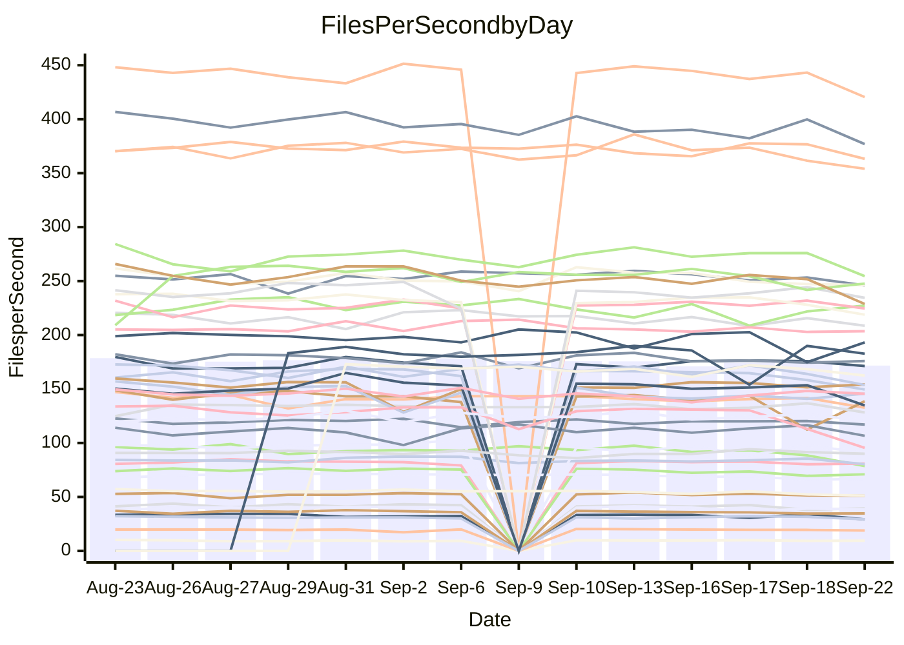

<!---
# This file is auto-generated. Do not edit.
# cspell:disable
--->
# Performance Report

## Daily Performance

## Time to Process Files

| Repository                                      | Elapsed | Min/Avg/Max           |   SD | SD Graph                |
| ----------------------------------------------- | ------: | :-------------------: | ---: | ----------------------- |
| AdaDoom3/AdaDoom3                    |    2.97 | 2.7 /   2.8 /   3.1   | 0.10 | `    ┣━━┻━━╋━━┻●━┫    ` |
| alexiosc/megistos                    |    7.20 | 6.6 /   7.1 /   7.5   | 0.24 | `    ┣━━┻━━╋●━┻━━┫    ` |
| apollographql/apollo-server          |    2.14 | 2.0 /   2.1 /   2.3   | 0.05 | `     ┣━┻━━╋━●┻━┫     ` |
| aspnetboilerplate/aspnetboilerplate  |   11.13 | 10.5 /  10.8 /  12.7  | 0.41 | `    ┣━━┻━━╋━●┻━━┫    ` |
| aws-amplify/docs                     |   11.49 | 10.6 /  11.2 /  12.0  | 0.37 | `    ┣━━┻━━╋━━●━━┫    ` |
| Azure/azure-rest-api-specs           |   13.74 | 12.9 /  13.6 /  14.6  | 0.47 | `    ┣━━┻━━╋●━┻━━┫    ` |
| bitjson/typescript-starter           |    0.69 | 0.6 /   0.6 /   0.7   | 0.03 | `     ┣━━┻━╋━┻━━┫  ●  ` |
| caddyserver/caddy                    |    3.51 | 2.8 /   3.0 /   3.5   | 0.15 | `    ┣━━┻━━╋━━┻━━┫   ●` |
| canada-ca/open-source-logiciel-libre |    0.74 | 0.7 /   0.7 /   0.9   | 0.04 | `     ┣━┻━━●━━┻━┫     ` |
| chef/chef                            |    5.28 | 4.8 /   5.3 /   6.0   | 0.28 | `    ┣━━┻━━●━━┻━━┫    ` |
| dart-lang/sdk                        |   59.75 | 55.3 /  57.7 /  70.4  | 3.41 | `  ┣━━━┻━━━╋━●━┻━━━┫  ` |
| django/django                        |   13.72 | 13.0 /  13.6 /  14.4  | 0.38 | `    ┣━━┻━━╋●━┻━━┫    ` |
| eslint/eslint                        |    9.56 | 8.8 /   9.2 /  10.2   | 0.30 | `    ┣━━┻━━╋━━●━━┫    ` |
| exonum/exonum                        |    3.04 | 2.7 /   3.0 /   3.7   | 0.19 | `    ┣━━┻━━╋●━┻━━┫    ` |
| flutter/samples                      |   14.22 | 13.7 /  14.4 /  18.4  | 1.05 | `   ┣━━━┻━━●━━┻━━━┫   ` |
| gitbucket/gitbucket                  |    3.10 | 2.8 /   2.9 /   3.5   | 0.13 | `    ┣━━┻━━╋━━┻●━┫    ` |
| googleapis/google-cloud-cpp          |  135.24 | 129.2 / 135.5 / 145.8 | 4.18 | `  ┣━━━┻━━━●━━━┻━━━┫  ` |
| graphql/express-graphql              |    0.68 | 0.6 /   0.7 /   0.8   | 0.04 | `     ┣━┻━━╋●━┻━┫     ` |
| graphql/graphql-js                   |    2.23 | 1.9 /   2.0 /   2.3   | 0.09 | `     ┣━┻━━╋━━┻━┫●    ` |
| graphql/graphql-relay-js             |    0.71 | 0.6 /   0.7 /   0.7   | 0.04 | `     ┣━┻━━╋━━●━┫     ` |
| graphql/graphql-spec                 |    0.79 | 0.7 /   0.8 /   0.9   | 0.03 | `     ┣━┻━━╋━●┻━┫     ` |
| iluwatar/java-design-patterns        |   10.73 | 10.1 /  10.6 /  11.5  | 0.32 | `    ┣━━┻━━╋●━┻━━┫    ` |
| ktaranov/sqlserver-kit               |    6.08 | 5.6 /   5.8 /   6.0   | 0.15 | `    ┣━━┻━━╋━━┻━●┫    ` |
| liriliri/licia                       |    3.36 | 3.1 /   3.2 /   3.3   | 0.05 | `     ┣━┻━━╋━━┻━┫   ● ` |
| MartinThoma/LaTeX-examples           |    6.26 | 5.8 /   6.2 /   6.8   | 0.27 | `    ┣━━┻━━●━━┻━━┫    ` |
| mdx-js/mdx                           |    1.59 | 1.4 /   1.5 /   1.8   | 0.07 | `     ┣━┻━━╋━━●━┫     ` |
| microsoft/TypeScript-Website         |    4.91 | 4.6 /   4.9 /   5.9   | 0.24 | `    ┣━━┻━━●━━┻━━┫    ` |
| MicrosoftDocs/PowerShell-Docs        |   22.29 | 20.6 /  21.7 /  23.9  | 0.80 | `   ┣━━━┻━━╋━●┻━━━┫   ` |
| neovim/nvim-lspconfig                |    2.78 | 2.5 /   2.6 /   2.9   | 0.09 | `    ┣━━┻━━╋━━┻●━┫    ` |
| pagekit/pagekit                      |    3.16 | 2.9 /   3.1 /   3.4   | 0.11 | `    ┣━━┻━━╋━●┻━━┫    ` |
| php/php-src                          |   24.57 | 23.2 /  24.4 /  26.1  | 0.71 | `   ┣━━━┻━━╋●━┻━━━┫   ` |
| plasticrake/tplink-smarthome-api     |    0.87 | 0.8 /   0.8 /   0.9   | 0.03 | `     ┣━┻━━╋━━●━┫     ` |
| prettier/prettier                    |    6.03 | 5.7 /   5.9 /   6.2   | 0.12 | `    ┣━━┻━━╋━━┻●━┫    ` |
| pycontribs/jira                      |    1.20 | 1.1 /   1.1 /   1.2   | 0.04 | `     ┣━┻━━╋━━┻●┫     ` |
| RustPython/RustPython                |    4.26 | 4.0 /   4.3 /   6.1   | 0.41 | `    ┣━━┻━━●━━┻━━┫    ` |
| shoelace-style/shoelace              |    2.26 | 2.1 /   2.2 /   2.5   | 0.10 | `    ┣━━┻━━╋●━┻━━┫    ` |
| SoftwareBrothers/admin-bro           |    2.01 | 1.8 /   1.9 /   2.0   | 0.05 | `     ┣━┻━━╋━━┻━┫ ●   ` |
| sveltejs/svelte                      |   19.60 | 17.4 /  18.5 /  20.3  | 0.54 | `   ┣━━━┻━━╋━━┻━━━●   ` |
| TheAlgorithms/Python                 |    5.28 | 4.7 /   4.9 /   5.5   | 0.18 | `    ┣━━┻━━╋━━┻━━●    ` |
| twbs/bootstrap                       |    1.12 | 1.0 /   1.1 /   1.4   | 0.08 | `     ┣━┻━━╋●━┻━┫     ` |
| typescript-cheatsheets/react         |    1.04 | 0.9 /   1.0 /   1.1   | 0.04 | `     ┣━┻━━╋━●┻━┫     ` |
| typescript-eslint/typescript-eslint  |    3.51 | 3.2 /   3.3 /   3.7   | 0.12 | `    ┣━━┻━━╋━━┻●━┫    ` |
| vitest-dev/vitest                    |    7.18 | 6.5 /   7.0 /   9.6   | 0.56 | `    ┣━━┻━━╋●━┻━━┫    ` |
| w3c/aria-practices                   |    2.99 | 2.4 /   2.6 /   2.9   | 0.10 | `    ┣━━┻━━╋━━┻━━┫   ●` |
| w3c/specberus                        |    2.10 | 1.5 /   1.5 /   1.8   | 0.09 | `       ┣┻━╋━┻┫      ●` |
| webdeveric/webpack-assets-manifest   |    0.65 | 0.6 /   0.6 /   0.7   | 0.02 | `     ┣━━┻━╋━┻━●┫     ` |
| webpack/webpack                      |    4.75 | 4.1 /   4.3 /   4.6   | 0.12 | `     ┣━┻━━╋━━┻━┫    ●` |
| wireapp/wire-desktop                 |    0.84 | 0.7 /   0.8 /   0.9   | 0.03 | `     ┣━┻━━╋━━┻━●     ` |
| wireapp/wire-webapp                  |    7.96 | 6.9 /   7.2 /   7.9   | 0.27 | `    ┣━━┻━━╋━━┻━━┫ ●  ` |

Note:
- Elapsed time is in seconds.

## Files per Second over Time

| Repository                                      | Files |    Sec |    Fps |     Rel | Trend Fps              |    N |
| ----------------------------------------------- | ----: | -----: | -----: | ------: | ---------------------- | ---: |
| AdaDoom3/AdaDoom3                    |   103 |   2.97 |  34.73 |  -4.19% | `▄▇▆▆▆▅▆█▆▆▆▇▆▆▅▆▄▆▄▅` |   23 |
| alexiosc/megistos                    |   583 |   7.20 |  80.94 |  -1.62% | `▆█▆▇▇▄▅▇▆▄▆▅▆▆▇▄▄█▅▅` |   23 |
| apollographql/apollo-server          |   250 |   2.14 | 117.01 |  -2.41% | `▆█▇▇▇▇█▅▇█▇▇▆█▇▇▇▇▇▆` |   25 |
| aspnetboilerplate/aspnetboilerplate  |  2739 |  11.13 | 246.02 |  -2.71% | `▃▇▇█▇▇███▇████▇█▆█▇▆` |   27 |
| aws-amplify/docs                     |  2831 |  11.49 | 246.32 |  -2.92% | `▄▆█▆█▅█▆▅██▇▇▆▇█▅▇▆▆` |   27 |
| Azure/azure-rest-api-specs           |  2417 |  13.74 | 175.87 |  -1.24% | `▇▇▇▅█▇▄█▅█▆▇█▇▅▆▆▆▆▆` |   27 |
| bitjson/typescript-starter           |    20 |   0.69 |  29.20 | -11.92% | `▇█▇███▃▇▆▆▆▇▇▇▇▇▄▄█▃` |   23 |
| caddyserver/caddy                    |   276 |   3.51 |  78.69 | -15.97% | `▇▃▇▇▆█▅▇█▆███▇▇▄▇▆▅▃` |   27 |
| canada-ca/open-source-logiciel-libre |     7 |   0.74 |   9.45 |  -1.38% | `█▇▄▆█▃█▇▅▆██▇▇▇▇██▆▇` |   23 |
| chef/chef                            |  1201 |   5.28 | 227.29 |   1.00% | `▅██▄▇▆▇▆▇▅▆▅▅▅▆▇▃▅▅▆` |   27 |
| dart-lang/sdk                        |  9707 |  59.75 | 162.45 |  -3.48% | `███▇▇█▇▇▇▇██▃▇█▇▆`    |   16 |
| django/django                        |  2792 |  13.72 | 203.51 |  -1.19% | `█▆▄█▇▇▅██▇▆▇▆▆▇▄▇▆▆▆` |   27 |
| eslint/eslint                        |  1996 |   9.56 | 208.69 |  -3.18% | `▇▇▇▄▇█▇█▇▇█▅▇▇▇█▆▅▇▆` |   27 |
| exonum/exonum                        |   421 |   3.04 | 138.64 |  -2.66% | `▇▇▇▇▆█▆▇▇▆▇▇▇▆▇▆▇▆▂▆` |   23 |
| flutter/samples                      |  2598 |  14.22 | 182.71 |   0.43% | `▇█▇███▇▇▇█▇███▇█▅▂█▇` |   19 |
| gitbucket/gitbucket                  |   411 |   3.10 | 132.74 |  -5.75% | `▃▇▇█▇▇▇████▇▇▇▆█▇▇█▆` |   27 |
| googleapis/google-cloud-cpp          | 19685 | 135.24 | 145.55 |   0.49% | `▅▇▇▇█▆▆█▅▆▇▆▆▅▄▄▆▇▇▇` |   27 |
| graphql/express-graphql              |    26 |   0.68 |  38.49 |  -2.86% | `▇▇█▇▆████▇▆███▇█▇▃▇▆` |   23 |
| graphql/graphql-js                   |   333 |   2.23 | 149.56 |  -9.12% | `▇▄▆▇█▇▇▇▆▇▇▆█▇▇▆▇▆▅▄` |   24 |
| graphql/graphql-relay-js             |    28 |   0.71 |  39.44 |  -5.90% | `█▃▆▆▇▇▄▆▇▆▇▄▅▆▆▄▇▅▃▄` |   23 |
| graphql/graphql-spec                 |    15 |   0.79 |  18.94 |  -3.70% | `▇█▆▇▇▅▆█▃▇██▇█▇▇█▆▆▆` |   23 |
| iluwatar/java-design-patterns        |  1838 |  10.73 | 171.28 |  -1.13% | `▆▅▇█▄▆██▇▆▆▇▆▅█▆▇▇▇▆` |   23 |
| ktaranov/sqlserver-kit               |   489 |   6.08 |  80.38 |  -4.28% | `▅█▅▅▆▇███▅▆▆▆▇▆▆▅▇▇▄` |   25 |
| liriliri/licia                       |  1415 |   3.36 | 420.51 |  -5.08% | `▇█▆█▆▅▆▆█▇▆▇█▇▇▇▇▅▇▄` |   23 |
| MartinThoma/LaTeX-examples           |  1407 |   6.26 | 224.64 |  -0.76% | `▇█▄▆▆▅█▄▇▆▆▇▆▇▇▆█▅▇▆` |   23 |
| mdx-js/mdx                           |   144 |   1.59 |  90.83 |  -5.75% | `▆▆▇▆▆▇▇▇█▆▆▄▆▆▇▆▆▃▇▅` |   25 |
| microsoft/TypeScript-Website         |   758 |   4.91 | 154.30 |   0.35% | `▆▇▇▇█▇▇▃▆▇▆▆▆▆▇█▇▇▆▇` |   25 |
| MicrosoftDocs/PowerShell-Docs        |  2686 |  22.29 | 120.51 |  -2.56% | `▇▇▄██▇▃▇▆▇▆██▆▆▆▆▇▇▆` |   27 |
| neovim/nvim-lspconfig                |   357 |   2.78 | 128.23 |  -3.97% | `▇█▅▇▇▇▇▇▇▇▆▇█▇█▄▇▆█▅` |   27 |
| pagekit/pagekit                      |   741 |   3.16 | 234.46 |  -2.47% | `▇▆▆▇█▆█▆▇▄▇▅▇▅▅▆▅▆▇▅` |   23 |
| php/php-src                          |  2211 |  24.57 |  89.99 |  -0.81% | `▆██▆█▅▇▇▅▄▅▅▇▆▆▆██▇▆` |   27 |
| plasticrake/tplink-smarthome-api     |    62 |   0.87 |  70.95 |  -5.09% | `█▅▆▇▇▆▅▆▆▆▆▇▇▅▆▄▅▆▃▄` |   23 |
| prettier/prettier                    |  2191 |   6.03 | 363.28 |  -2.74% | `▇█▅▇▆▇▇█▇▇▇▇▇▆▅▇█▇▇▆` |   26 |
| pycontribs/jira                      |    80 |   1.20 |  66.71 |  -4.72% | `▇██▇█▇▇█▇▇█▇▇▇█▅▅█▅▅` |   26 |
| RustPython/RustPython                |   621 |   4.26 | 145.68 |  -0.60% | `███████▂▇█▇█▆▆▇▆▇▇▆▇` |   25 |
| shoelace-style/shoelace              |   437 |   2.26 | 193.22 |  -2.43% | `▇▇█▆▅█▇▆█▇█▇▃█▇▇▇█▃▆` |   25 |
| SoftwareBrothers/admin-bro           |   440 |   2.01 | 218.86 |  -6.35% | `▇▅▄▇█▇▇▆▆▆▆▆▇▅▆▇▇▇▆▄` |   24 |
| sveltejs/svelte                      |  7389 |  19.60 | 376.97 |  -4.83% | `▆▇▇▆█▆▆▆▅▇▇▆▅▆▆▅▇▄▇▅` |   27 |
| TheAlgorithms/Python                 |  1345 |   5.28 | 254.61 |  -6.63% | `▇▆▆█▆█▇▆▆▇▇▇█▆▇▆▇▇▇▅` |   27 |
| twbs/bootstrap                       |   120 |   1.12 | 106.67 |  -3.66% | `▇██▆▇▂▆▇█▇▆▇█▇▇▅█▇█▆` |   26 |
| typescript-cheatsheets/react         |    53 |   1.04 |  51.00 |  -2.58% | `▇▃▅█▅▄▆▅▇▆▇▅▆▇▅▇▆▇▅▅` |   23 |
| typescript-eslint/typescript-eslint  |  1243 |   3.51 | 354.08 |  -4.86% | `▆▇▆▆█▆▆▆▅▅▇▇███▃▆▇▅▅` |   27 |
| vitest-dev/vitest                    |  1778 |   7.18 | 247.69 |  -2.55% | `██▇▇█▇█▇▇█▆█▇▇▇█▇▇▆▇` |   27 |
| w3c/aria-practices                   |   403 |   2.99 | 134.71 | -11.54% | `▄▆▄▅█▇▆▆▅▆▅▆▆▆▄▅▆▄▆▂` |   25 |
| w3c/specberus                        |   200 |   2.10 |  95.42 | -26.32% | `▇▃▇▅██▇▇▃▆▇▇▇▆█▇█▆▃ ` |   27 |
| webdeveric/webpack-assets-manifest   |    19 |   0.65 |  29.30 |  -6.01% | `▆▆▇▇▇▆▇▆▇▆▇▇▃█▇▆██▇▅` |   23 |
| webpack/webpack                      |  1086 |   4.75 | 228.79 | -10.08% | `▇▆▇███▇▆▅▆▆▇▆▇▆▄▆▇▆▃` |   27 |
| wireapp/wire-desktop                 |    43 |   0.84 |  51.19 |  -7.13% | `▇▇▆▇▆█▇▇▇▇▇▆▇▃▇▆▇▇▅▅` |   27 |
| wireapp/wire-webapp                  |  1224 |   7.96 | 153.74 |  -8.25% | `▄▇▄█▇▇▄▇█▅▇█▇▅▆▆█▇▆▄` |   27 |

## Data Throughput

| Repository                                      | Files |    Sec |     Kps |     Rel | Trend Kps              |    N |
| ----------------------------------------------- | ----: | -----: | ------: | ------: | ---------------------- | ---: |
| AdaDoom3/AdaDoom3                    |   103 |   2.97 |  738.11 |  -4.19% | `▄▇▆▆▆▅▆█▆▆▆▇▆▆▅▆▄▆▄▅` |   23 |
| alexiosc/megistos                    |   583 |   7.20 |  635.96 |  -1.62% | `▆█▆▇▇▄▅▇▆▄▆▅▆▆▇▄▄█▅▅` |   23 |
| apollographql/apollo-server          |   250 |   2.14 |  927.22 |  -2.41% | `▆█▇▇▇▇█▅▇█▇▇▆█▇▇▇▇▇▆` |   25 |
| aspnetboilerplate/aspnetboilerplate  |  2739 |  11.13 |  584.10 |  -2.70% | `▃▇▇█▇▇███▇████▇█▆█▇▆` |   27 |
| aws-amplify/docs                     |  2831 |  11.49 |  818.59 |  -2.75% | `▄▆█▆█▅█▆▅██▇▇▇▇█▅▇▆▆` |   27 |
| Azure/azure-rest-api-specs           |  2417 |  13.74 |  502.00 |  -0.85% | `▇▇▇▅█▆▄▇▅█▆▇█▇▅▆▇▆▆▆` |   27 |
| bitjson/typescript-starter           |    20 |   0.69 |  116.78 | -11.92% | `▇█▇███▃▇▆▆▆▇▇▇▇▇▄▄█▃` |   23 |
| caddyserver/caddy                    |   276 |   3.51 |  640.95 | -15.42% | `▇▃▇▆▆█▅▇█▆███▇▇▄▇▆▆▃` |   27 |
| canada-ca/open-source-logiciel-libre |     7 |   0.74 |   78.26 |  -1.38% | `█▇▄▆█▃█▇▅▆██▇▇▇▇██▆▇` |   23 |
| chef/chef                            |  1201 |   5.28 | 1042.96 |   0.35% | `▅██▄▇▆▇▆▇▅▆▅▅▅▆▇▃▅▅▆` |   27 |
| dart-lang/sdk                        |  9707 |  59.75 | 1177.51 |  -3.56% | `███▇▇▇▇▇▇▇██▃▇█▇▆`    |   16 |
| django/django                        |  2792 |  13.72 | 1243.64 |  -1.09% | `█▆▄█▇▇▅██▇▆▇▆▆▇▄▇▆▆▆` |   27 |
| eslint/eslint                        |  1996 |   9.56 | 1709.47 |  -2.61% | `▇▇▇▄▇█▇█▇▇█▆▇▇▇█▇▅▇▆` |   27 |
| exonum/exonum                        |   421 |   3.04 | 1326.16 |  -2.66% | `▇▇▇▇▆█▆▇▇▆▇▇▇▆▇▆▇▆▂▆` |   23 |
| flutter/samples                      |  2598 |  14.22 | 1370.97 |   0.44% | `▇█▇███▇▇▇█▇███▇█▅▂█▇` |   19 |
| gitbucket/gitbucket                  |   411 |   3.10 |  599.74 |  -5.75% | `▃▇▇█▇▇▇████▇▇▇▆█▇▇█▆` |   27 |
| googleapis/google-cloud-cpp          | 19685 | 135.24 | 1037.68 |   0.31% | `▅▇▇▇█▆▆█▅▆▇▆▆▅▄▄▆▇▇▇` |   27 |
| graphql/express-graphql              |    26 |   0.68 |  176.18 |  -2.86% | `▇▇█▇▆████▇▆███▇█▇▃▇▆` |   23 |
| graphql/graphql-js                   |   333 |   2.23 |  851.08 |  -9.12% | `▇▄▆▇█▇▇▇▆▇▇▆█▇▇▆▇▆▅▄` |   24 |
| graphql/graphql-relay-js             |    28 |   0.71 |  154.94 |  -5.90% | `█▃▆▆▇▇▄▆▇▆▇▄▅▆▆▄▇▅▃▄` |   23 |
| graphql/graphql-spec                 |    15 |   0.79 |  695.74 |  -3.70% | `▇█▆▇▇▅▆█▃▇██▇█▇▇█▆▆▆` |   23 |
| iluwatar/java-design-patterns        |  1838 |  10.73 |  527.09 |  -1.13% | `▆▅▇█▄▆██▇▆▆▇▆▅█▆▇▇▇▆` |   23 |
| ktaranov/sqlserver-kit               |   489 |   6.08 | 1215.93 |  -4.27% | `▅█▅▅▆▇███▅▆▆▆▇▆▆▅▇▇▄` |   25 |
| liriliri/licia                       |  1415 |   3.36 |  495.10 |  -5.08% | `▇█▆█▆▅▆▆█▇▆▇█▇▇▇▇▅▇▄` |   23 |
| MartinThoma/LaTeX-examples           |  1407 |   6.26 |  464.29 |  -0.76% | `▇█▄▆▆▅█▄▇▆▆▇▆▇▇▆█▅▇▆` |   23 |
| mdx-js/mdx                           |   144 |   1.59 |  415.69 |  -5.53% | `▆▆▇▆▆▇▇▇█▆▆▄▆▆▇▆▆▃▇▅` |   25 |
| microsoft/TypeScript-Website         |   758 |   4.91 | 1055.85 |   0.16% | `▆▇▇▇█▇▇▃▆▇▆▆▆▆▇█▇▇▆▇` |   25 |
| MicrosoftDocs/PowerShell-Docs        |  2686 |  22.29 | 1232.36 |  -2.50% | `▇▇▄██▇▃▇▆▇▆██▆▆▆▆▇▇▆` |   27 |
| neovim/nvim-lspconfig                |   357 |   2.78 |  336.19 |  -4.44% | `██▅▇▇▇▇▇▇▇▆▇█▇█▄▇▆▇▅` |   27 |
| pagekit/pagekit                      |   741 |   3.16 |  488.85 |  -2.47% | `▇▆▆▇█▆█▆▇▄▇▅▇▅▅▆▅▆▇▅` |   23 |
| php/php-src                          |  2211 |  24.57 | 1312.70 |  -0.77% | `▆██▅█▅▇▇▆▄▅▅▇▆▆▆██▇▆` |   27 |
| plasticrake/tplink-smarthome-api     |    62 |   0.87 |  383.36 |  -5.09% | `█▅▆▇▇▆▅▆▆▆▆▇▇▅▆▄▅▆▃▄` |   23 |
| prettier/prettier                    |  2191 |   6.03 |  506.37 |  -2.71% | `▇█▅▇▆▇▇█▇▇▇▇▇▆▅▇█▇▇▆` |   26 |
| pycontribs/jira                      |    80 |   1.20 |  459.48 |  -5.04% | `▇██▇█▇▇▇▇▇█▇▇▇▇▄▅█▄▅` |   26 |
| RustPython/RustPython                |   621 |   4.26 | 1068.80 |  -0.60% | `███████▂▇█▇█▆▆▇▆▇▇▆▇` |   25 |
| shoelace-style/shoelace              |   437 |   2.26 |  912.17 |  -2.25% | `▇▆█▆▅█▇▆█▇▇▇▃█▇▇▇█▃▆` |   25 |
| SoftwareBrothers/admin-bro           |   440 |   2.01 |  482.98 |  -6.35% | `▇▅▄▇█▇▇▆▆▆▆▆▇▅▆▇▇▇▆▄` |   24 |
| sveltejs/svelte                      |  7389 |  19.60 |  272.18 |  -5.23% | `▆▇▇▆█▆▆▆▅▇▇▆▅▆▆▅▆▃▆▅` |   27 |
| TheAlgorithms/Python                 |  1345 |   5.28 |  645.15 |  -6.85% | `▇▆▆█▆█▇▆▅▇▇▇█▆▇▆▇▇▇▅` |   27 |
| twbs/bootstrap                       |   120 |   1.12 |  854.26 |  -3.66% | `▇██▆▇▂▆▇█▇▆▇█▇▇▅█▇█▆` |   26 |
| typescript-cheatsheets/react         |    53 |   1.04 |  372.40 |  -2.58% | `▇▃▅█▅▄▆▅▇▆▇▅▆▇▅▇▆▇▅▅` |   23 |
| typescript-eslint/typescript-eslint  |  1243 |   3.51 | 1637.66 |  -4.51% | `▆▇▆▆▇▆▆▆▅▅▇▇███▃▆▇▅▅` |   27 |
| vitest-dev/vitest                    |  1778 |   7.18 |  508.89 |  -2.61% | `██▇▇█▇█▇▇█▆█▇▇▇█▇▇▆▇` |   27 |
| w3c/aria-practices                   |   403 |   2.99 | 1255.80 | -11.20% | `▄▆▄▅█▇▆▆▅▆▅▆▆▆▄▆▆▄▆▂` |   25 |
| w3c/specberus                        |   200 |   2.10 |  304.38 | -26.32% | `▇▃▇▅██▇▇▃▆▇▇▇▆█▇█▆▃ ` |   27 |
| webdeveric/webpack-assets-manifest   |    19 |   0.65 |  157.31 |  -6.01% | `▆▆▇▇▇▆▇▆▇▆▇▇▃█▇▆██▇▅` |   23 |
| webpack/webpack                      |  1086 |   4.75 |  993.75 | -10.06% | `▇▆▇███▇▆▅▆▆▇▆▇▆▄▆▇▆▃` |   27 |
| wireapp/wire-desktop                 |    43 |   0.84 |  225.00 |  -6.88% | `▆▇▆▇▆█▇▇▇▇█▆▇▃▇▆▇▇▅▅` |   27 |
| wireapp/wire-webapp                  |  1224 |   7.96 |  650.24 |  -8.52% | `▄▇▄█▇▇▄▇█▅▇█▇▅▆▆█▇▆▄` |   27 |

