<!---
# This file is auto-generated. Do not edit.
# cspell:disable
--->
# Performance Report

## Daily Performance

```mermaid
xychart-beta
    title Files Per Second by Day
    y-axis Files per Second
    x-axis Date [May-26, May-27, May-28, Jun-2, Jun-3, Jun-4, Jun-5, Jun-6, Jun-7, Jun-8, Jun-9, Jun-10, Jun-11, Jun-12, Jun-13, Jun-14, Jun-16, Jun-23]
    bar [170.65, 166.96, 169.46, 169.96, 167.33, 166.18, 163.49, 167.64, 166.67, 170.13, 167.55, 162.35, 108.94, 163.62, 164.52, 162.91, 165.65, 161.99]
    line [29.89, 29.97, 29.26, 26.66, 29.18, 29.82, 30.31, 29.19, 29.49, 29.31, 30.11, 30.11, 28.55, 21.08, 22.04, 22.18, 21.66, 20.52]
    line [66.54, 65.92, 61.45, 66.55, 63.66, 66.39, 61.22, 66.87, 62.38, 67.14, 67.89, 65.57, 63.26, 51.25, 48.63, 44.36, 52.41, 51.51]
    line [110.16, 104.19, 109.94, 104.58, 100.60, 104.91, 105.40, 103.85, 106.22, 109.49, 108.40, 100.17, 93.09, 97.72, 89.92, 95.33, 99.63, 96.80]
    line [9.58, 10.09, 9.91, 9.92, 9.53, 9.28, 10.06, 10.19, 9.49, 10.16, 10.41, 10.23, 10.15, 7.58, 7.35, 7.42, 7.28, 7.38]
    line [60.65, 60.71, 60.16, 61.03, 59.59, 60.87, 59.62, 60.76, 62.31, 62.61, 63.50, 58.41, 51.82, 52.68, 49.85, 52.20, 51.85, 51.88]
    line [86.15, 86.86, 88.34, 85.50, 84.47, 88.02, 88.72, 85.27, 89.11, 82.67, 88.45, 84.36, 84.11, 87.88, 85.81, 88.09, 78.16, 85.48]
    line [82.54, 75.89, 77.47, 73.86, 74.85, 71.14, 76.14, 78.15, 82.81, 79.64, 79.01, 70.82, 61.30, 76.37, 77.13, 76.03, 78.06, 79.48]
    line [34.38, 35.47, 33.75, 35.37, 34.22, 32.93, 35.76, 34.34, 33.08, 34.79, 30.45, 36.74, 34.61, 25.22, 27.49, 26.99, 26.84, 26.69]
    line [38.01, 36.71, 34.78, 33.91, 36.69, 37.31, 37.44, 37.24, 35.30, 34.77, 36.25, 37.82, 33.71, 28.61, 28.16, 28.05, 28.76, 24.40]
    line [128.33, 122.44, 116.90, 125.01, 123.38, 123.79, 117.07, 125.94, 118.40, 118.39, 121.53, 129.30, 127.90, 119.77, 124.29, 124.35, 117.01, 120.68]
    line [377.83, 380.47, 381.86, 371.54, 374.06, 373.98, 371.38, 376.26, 368.01, 380.10, 379.55, 383.29, 365.99, 374.63, 372.72, 362.93, 349.94, 358.12]
    line [17.45, 17.18, 17.51, 16.57, 17.42, 16.78, 16.53, 16.44, 17.51, 17.66, 17.41, 17.50, 17.71, 17.68, 18.34, 17.12, 16.25, 16.74]
    line [77.89, 78.87, 79.08, 78.31, 73.00, 75.74, 76.85, 75.23, 78.81, 80.33, 77.10, 77.48, 64.05, 77.39, 75.61, 71.46, 77.16, 67.74]
    line [45.45, 46.05, 45.56, 40.22, 45.53, 45.18, 46.69, 45.37, 46.01, 47.36, 45.48, 45.06, 39.72, 39.47, 40.00, 39.07, 39.70, 37.22]
    line [125.67, 123.56, 125.85, 123.16, 123.10, 122.32, 125.12, 124.06, 124.88, 126.90, 127.99, 124.73, 92.95, 120.36, 118.07, 115.35, 114.38, 112.40]
    line [218.77, 212.39, 203.78, 212.56, 214.03, 221.77, 221.19, 224.37, 218.89, 220.13, 221.21, 219.70, 143.90, 199.78, 201.47, 205.17, 207.22, 205.41]
    line [220.12, 213.01, 224.63, 217.35, 221.03, 221.25, 213.65, 229.70, 223.48, 219.68, 227.92, 202.72, 153.79, 213.73, 212.23, 220.18, 211.27, 220.92]
    line [150.26, 137.65, 149.96, 147.05, 148.67, 143.16, 145.94, 143.30, 134.96, 144.03, 143.02, 149.83, 130.69, 133.43, 133.31, 131.91, 133.18, 122.30]
    line [332.86, 326.59, 328.18, 330.50, 324.04, 333.26, 322.71, 333.34, 330.40, 327.16, 331.90, 323.14, 261.07, 338.35, 332.69, 326.37, 322.64, 321.30]
    line [32.56, 32.77, 31.93, 31.50, 31.70, 32.51, 32.67, 32.05, 32.77, 33.08, 31.95, 32.91, 27.58, 30.74, 29.76, 30.63, 29.07, 29.46]
    line [209.73, 211.01, 213.71, 214.38, 214.29, 209.74, 209.84, 206.76, 201.57, 215.78, 212.77, 213.18, 139.00, 202.99, 196.51, 209.12, 202.60, 209.28]
    line [186.34, 187.29, 189.95, 184.53, 188.39, 185.43, 180.94, 188.95, 192.45, 187.05, 185.74, 177.64, 118.63, 166.53, 181.43, 168.60, 169.42, 180.87]
    line [74.85, 76.23, 75.12, 76.51, 74.07, 73.11, 74.81, 76.32, 76.71, 76.80, 73.74, 74.27, 59.93, 73.62, 72.46, 71.40, 73.58, 63.75]
    line [192.06, 177.15, 178.96, 184.54, 184.81, 185.74, 189.51, 188.80, 197.42, 184.56, 185.39, 175.70, 156.70, 187.10, 192.94, 186.79, 186.02, 177.24]
    line [210.18, 213.28, 212.12, 220.46, 209.25, 209.34, 207.30, 195.72, 199.83, 209.95, 194.96, 213.85, 159.52, 202.89, 195.38, 189.84, 200.33, 196.90]
    line [247.35, 234.97, 257.03, 246.00, 240.49, 248.05, 241.53, 240.02, 250.72, 249.07, 243.35, 230.21, 168.52, 236.78, 215.01, 237.87, 232.93, 237.30]
    line [140.42, 139.81, 139.15, 143.14, 140.08, 138.53, 141.10, 136.12, 141.18, 140.04, 142.05, 141.88, 103.59, 133.58, 131.67, 139.76, 130.35, 133.12]
    line [168.50, 169.00, 171.65, 172.08, 171.12, 171.41, 171.98, 173.13, 171.37, 173.71, 173.55, 167.26, 155.87, 157.93, 149.82, 145.84, 147.63, 151.21]
    line [226.83, 229.07, 218.04, 228.28, 213.28, 208.94, 221.41, 223.40, 228.84, 234.29, 227.02, 228.77, 219.57, 195.02, 221.53, 214.60, 224.77, 206.46]
    line [188.81, 187.98, 187.78, 177.77, 184.03, 180.33, 185.60, 181.36, 181.92, 188.23, 188.91, 180.00, 125.49, 173.22, 170.75, 180.24, 189.10, 178.04]
    line [239.51, 236.94, 237.65, 241.45, 240.17, 238.54, 237.31, 234.14, 229.58, 244.42, 243.79, 239.33, 159.65, 230.81, 234.11, 231.13, 227.87, 233.71]
    line [134.41, 130.99, 133.32, 137.46, 133.16, 131.72, 138.89, 137.60, 137.33, 133.44, 128.55, 130.54, 117.59, 120.60, 119.36, 126.68, 124.68, 126.08]
    line [87.23, 86.22, 87.00, 88.85, 85.35, 85.47, 89.21, 83.88, 87.59, 84.94, 85.33, 87.27, 67.23, 77.70, 76.81, 78.39, 74.00, 75.18]
    line [193.68, 178.94, 172.60, 191.14, 184.47, 180.81, 182.21, 194.17, 193.46, 193.48, 195.01, 190.90, 131.77, 192.67, 189.08, 189.64, 183.39, 190.72]
    line [336.65, 339.29, 320.69, 338.05, 333.16, 341.58, 330.05, 336.69, 331.37, 341.98, 331.53, 337.68, 257.72, 315.29, 320.05, 316.70, 318.97, 298.57]
    line [148.87, 152.29, 152.18, 146.83, 146.85, 149.33, 152.93, 149.35, 153.74, 153.91, 150.81, 139.91, 110.07, 150.95, 153.45, 149.19, 147.76, 147.43]
    line [66.47, 61.90, 67.30, 66.98, 65.52, 63.49, 66.01, 65.37, 69.17, 67.00, 68.40, 68.60, 63.88, 50.72, 51.41, 51.47, 52.39, 51.15]
    line [198.66, 199.24, 175.34, 196.23, 196.86, 189.06, 201.96, 198.84, 198.16, 197.09, 193.40, 192.55, 186.93, 176.04, 174.92, 181.06, 184.11, 160.72]
    line [155.04, 142.71, 139.43, 150.16, 152.90, 156.03, 151.19, 149.91, 156.27, 156.23, 153.60, 155.11, 113.07, 141.70, 154.36, 151.21, 153.33, 143.16]
    line [114.58, 117.54, 113.89, 113.32, 110.93, 114.82, 116.20, 110.99, 111.90, 113.82, 109.84, 106.42, 108.66, 112.63, 116.73, 103.14, 113.74, 113.99]
    line [369.17, 371.49, 369.90, 373.28, 367.80, 363.68, 370.07, 366.52, 374.25, 374.25, 369.07, 378.68, 227.98, 386.38, 382.81, 374.09, 365.35, 365.67]
    line [97.44, 94.80, 98.23, 84.40, 87.80, 85.09, 84.81, 89.37, 83.72, 89.94, 85.93, 72.73, 68.90, 82.72, 88.26, 76.41, 88.08, 88.69]
    line [257.76, 255.79, 260.96, 252.34, 260.36, 252.30, 249.54, 253.41, 262.59, 260.07, 261.63, 234.80, 222.16, 255.69, 252.37, 242.53, 253.26, 248.76]
    line [48.65, 48.11, 48.53, 45.73, 48.27, 48.30, 47.93, 47.89, 48.02, 48.77, 46.64, 45.94, 46.92, 47.88, 49.42, 46.70, 44.72, 47.62]
    line [121.98, 123.80, 115.09, 129.03, 122.28, 116.92, 123.22, 114.34, 124.65, 123.68, 119.64, 124.80, 107.83, 101.96, 100.16, 109.91, 108.33, 100.23]
    line [208.13, 206.60, 213.74, 210.83, 203.35, 203.68, 215.12, 220.07, 216.34, 222.20, 218.63, 215.45, 173.74, 197.78, 209.33, 207.61, 214.45, 212.02]
    line [169.22, 155.11, 163.74, 161.68, 166.56, 168.03, 163.74, 168.68, 168.50, 167.45, 164.46, 166.51, 117.60, 170.47, 156.38, 164.16, 163.15, 165.54]
    line [142.18, 138.23, 142.50, 144.46, 138.26, 141.73, 144.23, 142.34, 139.73, 144.07, 140.57, 144.39, 117.16, 134.67, 135.55, 132.71, 138.18, 136.70]
    line [165.93, 161.02, 168.94, 162.90, 166.32, 157.04, 157.22, 160.62, 160.99, 161.40, 162.90, 146.98, 118.64, 159.81, 164.92, 162.77, 165.48, 163.07]
    line [146.87, 145.21, 148.86, 148.30, 147.22, 148.06, 137.39, 147.79, 143.52, 149.79, 142.40, 146.80, 105.67, 145.87, 143.36, 146.61, 147.23, 141.28]
```

## Time to Process Files

| Repository                                      | Elapsed | Min/Avg/Max           |    SD | SD Graph                |
| ----------------------------------------------- | ------: | :-------------------: | ----: | ----------------------- |
| AdaDoom3/AdaDoom3                    |    3.50 | 3.1 /   3.2 /   4.1   |  0.19 | `     ┣━┻━━╋━━┻●┫     ` |
| alexiosc/megistos                    |    8.61 | 7.2 /   7.7 /  12.1   |  0.83 | `    ┣━━┻━━╋━━●━━┫    ` |
| apollographql/apollo-server          |    2.63 | 2.3 /   2.5 /   3.0   |  0.17 | `     ┣━┻━━╋━━●━┫     ` |
| aspnetboilerplate/aspnetboilerplate  |   10.23 | 9.8 /  10.9 /  27.9   |  3.03 | `    ┣━━┻━●╋━━┻━━┫    ` |
| aws-amplify/docs                     |   13.91 | 12.1 /  12.9 /  15.7  |  0.73 | `    ┣━━┻━━╋━━┻●━┫    ` |
| Azure/azure-rest-api-specs           |    9.63 | 8.7 /   9.4 /  13.0   |  0.73 | `    ┣━━┻━━╋●━┻━━┫    ` |
| bitjson/typescript-starter           |    0.97 | 0.6 /   0.7 /   0.9   |  0.08 | `     ┣━━┻━╋━┻━━┫  ●  ` |
| caddyserver/caddy                    |    3.59 | 3.3 /   3.8 /   5.9   |  0.44 | `    ┣━━┻━●╋━━┻━━┫    ` |
| canada-ca/open-source-logiciel-libre |    0.95 | 0.7 /   0.7 /   1.0   |  0.09 | `     ┣━━┻━╋━┻━━┫●    ` |
| chef/chef                            |    6.13 | 5.4 /   6.0 /   9.9   |  0.73 | `    ┣━━┻━━╋●━┻━━┫    ` |
| dart-lang/sdk                        |   65.47 | 61.8 /  67.9 / 148.3  | 13.97 | `  ┣━━━┻━━●╋━━━┻━━━┫  ` |
| django/django                        |   15.97 | 14.5 /  16.2 /  41.3  |  4.33 | `   ┣━━━┻━━●━━┻━━━┫   ` |
| eslint/eslint                        |   10.87 | 10.3 /  11.5 /  28.4  |  2.94 | `    ┣━━┻━●╋━━┻━━┫    ` |
| exonum/exonum                        |    3.49 | 3.1 /   3.4 /   3.7   |  0.17 | `     ┣━┻━━╋●━┻━┫     ` |
| flutter/samples                      |   18.02 | 16.9 /  18.3 /  38.8  |  3.59 | `   ┣━━━┻━━●━━┻━━━┫   ` |
| gitbucket/gitbucket                  |    3.67 | 3.2 /   3.4 /   6.7   |  0.57 | `    ┣━━┻━━╋●━┻━━┫    ` |
| googleapis/google-cloud-cpp          |  144.99 | 134.8 / 144.7 / 295.9 | 26.23 | `  ┣━━━┻━━━●━━━┻━━━┫  ` |
| graphql/express-graphql              |    0.97 | 0.7 /   0.8 /   1.0   |  0.09 | `     ┣━━┻━╋━┻━━●     ` |
| graphql/graphql-js                   |    2.98 | 2.3 /   2.5 /   3.1   |  0.17 | `     ┣━┻━━╋━━┻━┫ ●   ` |
| graphql/graphql-relay-js             |    1.15 | 0.7 /   0.8 /   1.0   |  0.09 | `     ┣━━┻━╋━┻━━┫    ●` |
| graphql/graphql-spec                 |    0.90 | 0.8 /   0.9 /   1.0   |  0.03 | `     ┣━━┻━╋━●━━┫     ` |
| iluwatar/java-design-patterns        |   13.91 | 12.5 /  13.6 /  28.2  |  2.68 | `    ┣━━┻━━●━━┻━━┫    ` |
| ktaranov/sqlserver-kit               |    7.67 | 6.3 /   6.7 /  10.6   |  0.72 | `    ┣━━┻━━╋━━┻●━┫    ` |
| liriliri/licia                       |    4.01 | 3.7 /   3.8 /   4.1   |  0.10 | `     ┣━┻━━╋━━┻━●     ` |
| MartinThoma/LaTeX-examples           |    6.73 | 6.4 /   7.2 /  20.0   |  2.32 | `    ┣━━┻━●╋━━┻━━┫    ` |
| mdx-js/mdx                           |    1.88 | 1.5 /   1.7 /   2.9   |  0.24 | `     ┣━┻━━╋━●┻━┫     ` |
| microsoft/TypeScript-Website         |    5.71 | 5.2 /   5.6 /  11.4   |  1.02 | `    ┣━━┻━━●━━┻━━┫    ` |
| MicrosoftDocs/PowerShell-Docs        |   23.75 | 22.7 /  24.0 /  26.2  |  0.84 | `    ┣━━┻━●╋━━┻━━┫    ` |
| neovim/nvim-lspconfig                |    4.14 | 3.8 /   4.2 /  10.5   |  1.08 | `    ┣━━┻━━●━━┻━━┫    ` |
| pagekit/pagekit                      |    3.61 | 3.2 /   3.6 /  10.0   |  1.14 | `    ┣━━┻━━●━━┻━━┫    ` |
| php/php-src                          |   25.67 | 22.1 /  26.1 /  45.4  |  3.95 | `   ┣━━━┻━━●━━┻━━━┫   ` |
| plasticrake/tplink-smarthome-api     |    1.20 | 0.9 /   1.0 /   1.4   |  0.12 | `     ┣━━┻━╋━┻━●┫     ` |
| prettier/prettier                    |    7.07 | 6.7 /   7.1 /  11.9   |  0.84 | `    ┣━━┻━━●━━┻━━┫    ` |
| pycontribs/jira                      |    1.52 | 1.2 /   1.3 /   2.0   |  0.15 | `     ┣━┻━━╋━━●━┫     ` |
| RustPython/RustPython                |    4.93 | 4.6 /   4.9 /   7.5   |  0.47 | `    ┣━━┻━━●━━┻━━┫    ` |
| shoelace-style/shoelace              |    2.90 | 2.5 /   2.6 /   3.1   |  0.16 | `     ┣━┻━━╋━━┻●┫     ` |
| slint-ui/slint                       |   12.28 | 10.6 /  11.8 /  16.2  |  0.95 | `    ┣━━┻━━╋━●┻━━┫    ` |
| SoftwareBrothers/admin-bro           |    2.74 | 2.1 /   2.3 /   2.5   |  0.11 | `     ┣━┻━━╋━━┻━┫    ●` |
| sveltejs/svelte                      |   20.57 | 18.8 /  21.9 /  80.1  | 10.00 | `   ┣━━┻━━━●━━━┻━━┫   ` |
| TheAlgorithms/Python                 |    5.85 | 5.4 /   6.1 /  17.4   |  1.96 | `    ┣━━┻━━●━━┻━━┫    ` |
| twbs/bootstrap                       |    1.38 | 1.3 /   1.4 /   1.5   |  0.05 | `     ┣━━┻━●━┻━━┫     ` |
| typescript-cheatsheets/react         |    1.42 | 1.1 /   1.2 /   1.6   |  0.10 | `     ┣━━┻━╋━┻━━●     ` |
| typescript-eslint/typescript-eslint  |    4.26 | 3.7 /   3.9 /   7.1   |  0.55 | `    ┣━━┻━━╋━●┻━━┫    ` |
| vitest-dev/vitest                    |    9.08 | 8.6 /   9.4 /  25.9   |  2.84 | `    ┣━━┻━━●━━┻━━┫    ` |
| w3c/aria-practices                   |    3.21 | 2.9 /   3.1 /   3.9   |  0.18 | `     ┣━┻━━╋━●┻━┫     ` |
| w3c/specberus                        |    2.04 | 1.6 /   1.7 /   2.3   |  0.15 | `     ┣━┻━━╋━━┻━●     ` |
| webdeveric/webpack-assets-manifest   |    1.06 | 0.8 /   0.8 /   1.1   |  0.08 | `     ┣━━┻━╋━┻━━┫●    ` |
| webpack/webpack                      |    5.18 | 4.9 /   5.3 /   8.3   |  0.57 | `    ┣━━┻━●╋━━┻━━┫    ` |
| wireapp/wire-desktop                 |    0.90 | 0.9 /   0.9 /   1.0   |  0.03 | `     ┣━━┻━●━┻━━┫     ` |
| wireapp/wire-webapp                  |   10.81 | 10.0 /  11.0 /  25.1  |  2.47 | `    ┣━━┻━━●━━┻━━┫    ` |

Note:
- Elapsed time is in seconds.

## Files per Second over Time

| Repository                                      | Files |    Sec |    Fps |     Rel | Trend Fps              |    N |
| ----------------------------------------------- | ----: | -----: | -----: | ------: | ---------------------- | ---: |
| AdaDoom3/AdaDoom3                    |   103 |   3.50 |  29.46 |  -7.53% | `▇█▇█▇▇▇██▇█▇█▂▆▆▆▆▅▅` |   32 |
| alexiosc/megistos                    |   583 |   8.61 |  67.74 | -11.24% | `▇▇▇▇▇█▆████▇▇▁█▇▇▆▇▅` |   32 |
| apollographql/apollo-server          |   255 |   2.63 |  96.80 |  -7.13% | `█▆▇▇▆▇▆███▇█▆▂▆▅▄▅▆▅` |   34 |
| aspnetboilerplate/aspnetboilerplate  |  2259 |  10.23 | 220.92 |   2.84% | `█▇█▇██████▇█▇▁█▇▇█▇█` |   33 |
| aws-amplify/docs                     |  2871 |  13.91 | 206.46 |  -7.35% | `▂██▅▇▆▇▇██▇▇▇▅█▄▆▆▇▅` |   35 |
| Azure/azure-rest-api-specs           |  2396 |   9.63 | 248.76 |  -1.85% | `█▆▆██▆██▇██▇▆▂█▇▇▆▇▇` |   35 |
| bitjson/typescript-starter           |    20 |   0.97 |  20.52 | -28.16% | `█▇▇▇█▇▇▇▇▇▇██▇▇▂▂▃▂▁` |   32 |
| caddyserver/caddy                    |   285 |   3.59 |  79.48 |   4.05% | `▅▆▆▇▆▇▇█▆██▆▆▁▆▇▇▆▇▇` |   34 |
| canada-ca/open-source-logiciel-libre |     7 |   0.95 |   7.38 | -22.69% | `▇▇▄█▇█▇▆▆████▇█▃▂▂▂▂` |   33 |
| chef/chef                            |  1206 |   6.13 | 196.90 |  -3.62% | `█▇█▇▆▇▇▇█▇▇▆█▁▆▇▆▆▇▆` |   35 |
| dart-lang/sdk                        | 10676 |  65.47 | 163.07 |   2.26% | `▇█▇▇█▇█▇▇██▇▇▁█▇████` |   35 |
| django/django                        |  2843 |  15.97 | 178.04 |  -1.61% | `█▇█▇█▇▇█████▇▁▇▇▇▇█▇` |   35 |
| eslint/eslint                        |  2073 |  10.87 | 190.72 |   3.17% | `▇▆█▇██████▇██▁██▇▇▇█` |   35 |
| exonum/exonum                        |   421 |   3.49 | 120.68 |  -2.06% | `█▃▅▃▄▄█▄▄▅▃▅▆▆▆▄▅▅▄▅` |   32 |
| flutter/samples                      |  2657 |  18.02 | 147.43 |  -0.27% | `▇██████████▇▇▁████▇▇` |   34 |
| gitbucket/gitbucket                  |   412 |   3.67 | 112.40 |  -7.87% | `█▇███▇███████▁█▇▇▇▇▆` |   35 |
| googleapis/google-cloud-cpp          | 20485 | 144.99 | 141.28 |  -1.67% | `██▇▇███▇███▇█▁▇████▇` |   35 |
| graphql/express-graphql              |    26 |   0.97 |  26.69 | -20.09% | `█▃▇██▆█▅▇▇█▅█▆█▂▃▃▃▃` |   32 |
| graphql/graphql-js                   |   364 |   2.98 | 122.30 | -14.18% | `██▅█▇▆█▇▄▇▇▇█▂▇▅▅▅▅▃` |   34 |
| graphql/graphql-relay-js             |    28 |   1.15 |  24.40 | -31.24% | `█▇██▇▇██▅█▄▇█▃█▂▂▂▃ ` |   32 |
| graphql/graphql-spec                 |    15 |   0.90 |  16.74 |  -2.84% | `▆▆▅▅▅▅▆▇▆▇▇▆▇▆█▇█▆▄▅` |   33 |
| iluwatar/java-design-patterns        |  1992 |  13.91 | 143.16 |  -4.00% | `███▇█▇███████▁█▇█▇█▇` |   32 |
| ktaranov/sqlserver-kit               |   489 |   7.67 |  63.75 | -13.80% | `▇▆██▇▇█████▇▇▁▇▇▇▇▇▅` |   32 |
| liriliri/licia                       |  1437 |   4.01 | 358.12 |  -4.35% | `█▅▇▆▇▇▇▇▅█▇▇█▄█▇▇▆▄▅` |   32 |
| MartinThoma/LaTeX-examples           |  1409 |   6.73 | 209.28 |   2.06% | `██▇▇██▇█▇████▁█▇▇█▇█` |   32 |
| mdx-js/mdx                           |   141 |   1.88 |  75.18 | -10.54% | `██▇███▇██▇█▇█▁█▆▆▆▆▆` |   32 |
| microsoft/TypeScript-Website         |   760 |   5.71 | 133.12 |  -3.01% | `█▇████▇██▇███▁█▇▇█▇▇` |   34 |
| MicrosoftDocs/PowerShell-Docs        |  2707 |  23.75 | 113.99 |   0.75% | `▆███▆▆▆▇█▇▅▇▅▆▅▇█▄▇▇` |   35 |
| neovim/nvim-lspconfig                |   748 |   4.14 | 180.87 |  -0.00% | `███▇████▇█▇█▇▁▆▇▇▇▇▇` |   35 |
| pagekit/pagekit                      |   741 |   3.61 | 205.41 |  -2.83% | `█████████████▁▇▇▇▇▇▇` |   32 |
| php/php-src                          |  2277 |  25.67 |  88.69 |   0.94% | `▇▇▇▇███▆██▇█▅▁█▇█▆██` |   35 |
| plasticrake/tplink-smarthome-api     |    62 |   1.20 |  51.51 | -18.51% | `██▇▄███▆▇███▇▆█▄▃▂▄▄` |   32 |
| prettier/prettier                    |  2273 |   7.07 | 321.30 |  -1.33% | `██▇▇██▇██▇██▇▁████▇▇` |   35 |
| pycontribs/jira                      |    79 |   1.52 |  51.88 | -12.24% | `▇▇▇▇▇▇▇█▇█▇█▆▂█▅▄▅▅▅` |   32 |
| RustPython/RustPython                |   674 |   4.93 | 136.70 |  -1.87% | `▇████▇█▇███▇█▂█▇▇▆▇▇` |   34 |
| shoelace-style/shoelace              |   439 |   2.90 | 151.21 |  -9.61% | `█▇▆▇██▇▆██▇▇▇▃▇▅▄▃▄▄` |   32 |
| slint-ui/slint                       |  2176 |  12.28 | 177.24 |  -4.11% | `▅▇█▆▇▇▇█▆▇▇▆▆▂▆▇▇▇▇▆` |   35 |
| SoftwareBrothers/admin-bro           |   441 |   2.74 | 160.72 | -16.99% | `▇▄▅█▇▇█▇▇▆█▆▆▃▇▄▃▄▅▁` |   33 |
| sveltejs/svelte                      |  7523 |  20.57 | 365.67 |   0.81% | `█▇███▇███████▁██████` |   35 |
| TheAlgorithms/Python                 |  1389 |   5.85 | 237.30 |  -0.38% | `███▇▇▇██▇███▇▁█▇▆▇▇▇` |   35 |
| twbs/bootstrap                       |   118 |   1.38 |  85.48 |  -0.86% | `▇▇█▇▇▅▇█▄▇▇▇▆▄█▇▆▇▃▆` |   35 |
| typescript-cheatsheets/react         |    53 |   1.42 |  37.22 | -16.35% | `█▆▇██▇▇█▇██▇▇▂█▅▅▄▅▄` |   33 |
| typescript-eslint/typescript-eslint  |  1271 |   4.26 | 298.57 |  -9.38% | `██▇████▇███▇█▁█▇▇▇▇▆` |   35 |
| vitest-dev/vitest                    |  2123 |   9.08 | 233.71 |   0.21% | `████▇█▇██████▁█▇█▇▇█` |   35 |
| w3c/aria-practices                   |   405 |   3.21 | 126.08 |  -4.13% | `▇▆█▇▇█▇▇▇▇▆▆▆▂▆▅▅▆▅▆` |   34 |
| w3c/specberus                        |   204 |   2.04 | 100.23 | -15.55% | `▅▇█▇▆▆▇███▇▇█▂█▄▄▅▅▄` |   33 |
| webdeveric/webpack-assets-manifest   |    54 |   1.06 |  51.15 | -20.12% | `▅▆▇▇▇▆▇█▇▇█▇█▆▆▂▂▂▃▂` |   34 |
| webpack/webpack                      |  1098 |   5.18 | 212.02 |   1.58% | `▆▇▇███▇█████▇▁█▆▇▇▇▇` |   35 |
| wireapp/wire-desktop                 |    43 |   0.90 |  47.62 |  -0.35% | `▆█▇▇▆▇▆█▇█▆▆▅▄█▇█▆▄▇` |   35 |
| wireapp/wire-webapp                  |  1790 |  10.81 | 165.54 |   1.98% | `▇█▇█▇██████▇█▁██▇▇▇█` |   35 |

## Data Throughput

| Repository                                      | Files |    Sec |     Kps |     Rel | Trend Kps              |    N |
| ----------------------------------------------- | ----: | -----: | ------: | ------: | ---------------------- | ---: |
| AdaDoom3/AdaDoom3                    |   103 |   3.50 |  626.15 |  -7.53% | `▇█▇█▇▇▇██▇█▇█▂▆▆▆▆▅▅` |   32 |
| alexiosc/megistos                    |   583 |   8.61 |  532.28 | -11.24% | `▇▇▇▇▇█▆████▇▇▁█▇▇▆▇▅` |   32 |
| apollographql/apollo-server          |   255 |   2.63 |  765.70 |  -7.33% | `█▆▇▇▆▇▆███▇█▆▂▆▅▄▅▆▅` |   34 |
| aspnetboilerplate/aspnetboilerplate  |  2259 |  10.23 |  519.77 |   2.83% | `█▇█▇██████▇█▇▁█▇▇█▇█` |   33 |
| aws-amplify/docs                     |  2871 |  13.91 |  717.98 |  -7.33% | `▂██▅▇▆▇▇██▇▇▇▅█▄▆▆▇▅` |   35 |
| Azure/azure-rest-api-specs           |  2396 |   9.63 |  681.81 |  -2.20% | `█▆▆██▆██▇██▇▆▂█▇▇▆▇▇` |   35 |
| bitjson/typescript-starter           |    20 |   0.97 |   82.07 | -28.16% | `█▇▇▇█▇▇▇▇▇▇██▇▇▂▂▃▂▁` |   32 |
| caddyserver/caddy                    |   285 |   3.59 |  674.04 |   3.93% | `▅▆▆▇▆▇▇█▆██▆▆▁▆▇▇▆▇▇` |   34 |
| canada-ca/open-source-logiciel-libre |     7 |   0.95 |   61.14 | -22.69% | `▇▇▄█▇█▇▆▆████▇█▃▂▂▂▂` |   33 |
| chef/chef                            |  1206 |   6.13 |  905.30 |  -3.66% | `█▇█▇▆▇▇▇█▇▇▆█▁▆▇▆▆▇▆` |   35 |
| dart-lang/sdk                        | 10676 |  65.47 | 1112.42 |   2.21% | `▇█▇▇█▇█▇▇██▇▇▁█▇████` |   35 |
| django/django                        |  2843 |  15.97 | 1106.30 |  -1.37% | `█▇█▇█▇▇█████▇▁▇▇▇▇█▇` |   35 |
| eslint/eslint                        |  2073 |  10.87 | 1382.15 |   3.68% | `▇▆█▇██████▇██▁██▇▇▇█` |   35 |
| exonum/exonum                        |   421 |   3.49 | 1154.37 |  -2.06% | `█▃▅▃▄▄█▄▄▅▃▅▆▆▆▄▅▅▄▅` |   32 |
| flutter/samples                      |  2657 |  18.02 | 1215.94 |  -0.27% | `▇██████████▇▇▁████▇▇` |   34 |
| gitbucket/gitbucket                  |   412 |   3.67 |  508.26 |  -7.87% | `█▇███▇███████▁█▇▇▇▇▆` |   35 |
| googleapis/google-cloud-cpp          | 20485 | 144.99 | 1126.69 |  -1.55% | `██▇▇███▇███▇█▁▇████▇` |   35 |
| graphql/express-graphql              |    26 |   0.97 |  122.18 | -20.09% | `█▃▇██▆█▅▇▇█▅█▆█▂▃▃▃▃` |   32 |
| graphql/graphql-js                   |   364 |   2.98 |  703.25 | -13.99% | `██▅█▇▆█▇▄▇▇▇█▂▇▅▅▅▅▃` |   34 |
| graphql/graphql-relay-js             |    28 |   1.15 |   95.85 | -31.24% | `█▇██▇▇██▅█▄▇█▃█▂▂▂▃ ` |   32 |
| graphql/graphql-spec                 |    15 |   0.90 |  626.16 |  -2.46% | `▆▅▅▅▅▄▆▇▆▇▇▆▇▆█▇█▆▄▅` |   33 |
| iluwatar/java-design-patterns        |  1992 |  13.91 |  442.50 |  -4.00% | `███▇█▇███████▁█▇█▇█▇` |   32 |
| ktaranov/sqlserver-kit               |   489 |   7.67 |  964.98 | -13.78% | `▇▆██▇▇█████▇▇▁▇▇▇▇▇▅` |   32 |
| liriliri/licia                       |  1437 |   4.01 |  426.65 |  -4.35% | `█▅▇▆▇▇▇▇▅█▇▇█▄█▇▇▆▄▅` |   32 |
| MartinThoma/LaTeX-examples           |  1409 |   6.73 |  432.23 |   2.06% | `██▇▇██▇█▇████▁█▇▇█▇█` |   32 |
| mdx-js/mdx                           |   141 |   1.88 |  349.25 | -10.54% | `██▇███▇██▇█▇█▁█▆▆▆▆▆` |   32 |
| microsoft/TypeScript-Website         |   760 |   5.71 |  919.39 |  -3.00% | `█▇████▇██▇███▁█▇▇█▇▇` |   34 |
| MicrosoftDocs/PowerShell-Docs        |  2707 |  23.75 | 1171.45 |   0.77% | `▆███▆▆▆▇█▇▅▇▅▆▅▇█▄▇▇` |   35 |
| neovim/nvim-lspconfig                |   748 |   4.14 |  289.92 |   0.35% | `███▇████▇█▇█▇▁▆▇▇▇▇▇` |   35 |
| pagekit/pagekit                      |   741 |   3.61 |  428.28 |  -2.83% | `█████████████▁▇▇▇▇▇▇` |   32 |
| php/php-src                          |  2277 |  25.67 | 1541.07 |   6.54% | `▇▇▇▇███▆██▇█▅▁█▇█▆██` |   35 |
| plasticrake/tplink-smarthome-api     |    62 |   1.20 |  278.33 | -18.51% | `██▇▄███▆▇███▇▆█▄▃▂▄▄` |   32 |
| prettier/prettier                    |  2273 |   7.07 |  456.86 |   0.49% | `██▇▇██▇██▇██▇▁███▇▇█` |   35 |
| pycontribs/jira                      |    79 |   1.52 |  369.11 | -12.24% | `▇▇▇▇▇▇▇█▇█▇█▆▂█▅▄▅▅▅` |   32 |
| RustPython/RustPython                |   674 |   4.93 | 1058.53 |  -1.47% | `▇████▇█▇███▇█▂█▇▇▇▇▇` |   34 |
| shoelace-style/shoelace              |   439 |   2.90 |  730.55 |  -9.61% | `█▇▆▇██▇▆██▇▇▇▃▇▅▄▃▄▄` |   32 |
| slint-ui/slint                       |  2176 |  12.28 | 1147.08 |  -3.43% | `▅▇█▆▇▇▇█▆▇█▆▆▂▆▇▇▇▇▆` |   35 |
| SoftwareBrothers/admin-bro           |   441 |   2.74 |  354.24 | -16.99% | `▇▄▅█▇▇█▇▇▆█▆▆▃▇▄▃▄▅▁` |   33 |
| sveltejs/svelte                      |  7523 |  20.57 |  243.18 |   0.73% | `█▇███▇███████▁██████` |   35 |
| TheAlgorithms/Python                 |  1389 |   5.85 |  602.56 |  -0.36% | `███▇▇▇██▇███▇▁█▇▆▇▇▇` |   35 |
| twbs/bootstrap                       |   118 |   1.38 |  701.93 |  -0.72% | `▇▇█▇▇▅▇█▄▇▇▇▆▄█▇▆▇▃▆` |   35 |
| typescript-cheatsheets/react         |    53 |   1.42 |  271.79 | -16.35% | `█▆▇██▇▇█▇██▇▇▂█▅▅▄▅▄` |   33 |
| typescript-eslint/typescript-eslint  |  1271 |   4.26 | 1515.19 |  -9.18% | `██▇████▇███▇█▁█▇▇▇▇▆` |   35 |
| vitest-dev/vitest                    |  2123 |   9.08 |  512.44 |   0.43% | `█▇██▇█▇██████▁█▇█▇▇▇` |   35 |
| w3c/aria-practices                   |   405 |   3.21 | 1171.16 |  -4.13% | `▇▆█▇▇█▇▇▇▇▆▆▆▂▆▅▅▆▅▆` |   34 |
| w3c/specberus                        |   204 |   2.04 |  315.42 | -15.42% | `▅▇█▇▆▆▇███▇▇█▂█▄▄▅▅▄` |   33 |
| webdeveric/webpack-assets-manifest   |    54 |   1.06 |  119.34 | -20.76% | `▅▇▇▇▇▇▇█▇▇█▇▇▆▆▂▂▂▃▂` |   34 |
| webpack/webpack                      |  1098 |   5.18 |  954.07 |   1.57% | `▆▇▇███▇█████▇▁▇▆▇▇▇▇` |   35 |
| wireapp/wire-desktop                 |    43 |   0.90 |  210.44 |  -0.35% | `▆█▇▇▆▇▆█▇█▆▆▅▄█▇█▆▄▇` |   35 |
| wireapp/wire-webapp                  |  1790 |  10.81 |  591.79 |   0.90% | `▇█▇█▇██████▇█▁██▇▇▇▇` |   35 |

