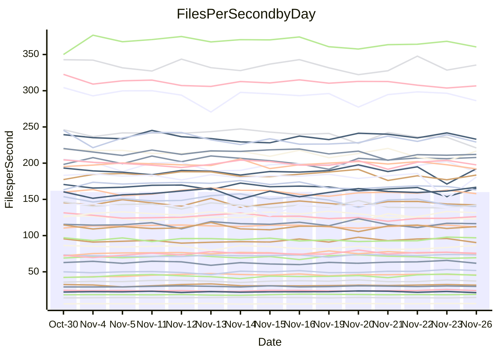

<!---
# This file is auto-generated. Do not edit.
# cspell:disable
--->
# Performance Report

## Daily Performance

## Time to Process Files

| Repository                                      | Elapsed | Min/Avg/Max           |    SD | SD Graph                |
| ----------------------------------------------- | ------: | :-------------------: | ----: | ----------------------- |
| AdaDoom3/AdaDoom3                    |    3.36 | 3.3 /   3.5 /   3.7   |  0.09 | `     ┣━●━━╋━━┻━┫     ` |
| alexiosc/megistos                    |    7.58 | 7.3 /   7.8 /   8.7   |  0.31 | `    ┣━━┻●━╋━━┻━━┫    ` |
| apollographql/apollo-server          |    2.73 | 2.6 /   2.7 /   3.2   |  0.13 | `     ┣━┻━━●━━┻━┫     ` |
| aspnetboilerplate/aspnetboilerplate  |   10.46 | 10.3 /  10.7 /  11.8  |  0.36 | `    ┣━━┻●━╋━━┻━━┫    ` |
| aws-amplify/docs                     |   13.90 | 12.6 /  13.4 /  14.8  |  0.46 | `    ┣━━┻━━╋━━●━━┫    ` |
| Azure/azure-rest-api-specs           |   10.77 | 9.6 /  10.1 /  11.2   |  0.40 | `    ┣━━┻━━╋━━┻━●┫    ` |
| bitjson/typescript-starter           |    1.06 | 1.0 /   1.1 /   1.1   |  0.03 | `     ┣━━●━╋━┻━━┫     ` |
| caddyserver/caddy                    |    3.70 | 3.4 /   3.8 /   4.0   |  0.11 | `     ┣━┻●━╋━━┻━┫     ` |
| canada-ca/open-source-logiciel-libre |    1.17 | 1.1 /   1.2 /   1.3   |  0.05 | `     ┣━━┻━●━┻━━┫     ` |
| chef/chef                            |    6.49 | 5.8 /   6.0 /   6.4   |  0.16 | `    ┣━━┻━━╋━━┻━━┫  ● ` |
| dart-lang/sdk                        |   65.06 | 64.2 /  67.6 /  72.3  |  2.01 | `   ┣━●┻━━━╋━━━┻━━┫   ` |
| django/django                        |   16.01 | 14.9 /  15.9 /  19.1  |  0.75 | `    ┣━━┻━━●━━┻━━┫    ` |
| eslint/eslint                        |   10.68 | 10.5 /  11.1 /  12.2  |  0.40 | `    ┣━━●━━╋━━┻━━┫    ` |
| exonum/exonum                        |    3.53 | 3.4 /   3.7 /   4.0   |  0.12 | `     ┣━●━━╋━━┻━┫     ` |
| flutter/samples                      |   17.44 | 16.0 /  17.0 /  19.0  |  0.59 | `    ┣━━┻━━╋━●┻━━┫    ` |
| gitbucket/gitbucket                  |    3.81 | 3.5 /   3.6 /   3.9   |  0.10 | `     ┣━┻━━╋━━┻●┫     ` |
| googleapis/google-cloud-cpp          |  143.86 | 142.0 / 150.8 / 209.7 | 11.61 | `  ┣━━━┻●━━╋━━━┻━━━┫  ` |
| graphql/express-graphql              |    1.41 | 1.1 /   1.2 /   1.3   |  0.05 | `      ┣━┻━╋━┻━┫     ●` |
| graphql/graphql-js                   |    3.05 | 2.8 /   3.0 /   3.2   |  0.10 | `     ┣━┻━━╋━●┻━┫     ` |
| graphql/graphql-relay-js             |    1.18 | 1.1 /   1.2 /   1.2   |  0.04 | `     ┣━━┻━╋●┻━━┫     ` |
| graphql/graphql-spec                 |    1.29 | 1.3 /   1.3 /   1.4   |  0.03 | `     ┣━●┻━╋━┻━━┫     ` |
| iluwatar/java-design-patterns        |   13.66 | 12.6 /  13.4 /  14.9  |  0.48 | `    ┣━━┻━━╋━●┻━━┫    ` |
| ktaranov/sqlserver-kit               |    6.61 | 6.5 /   6.8 /   7.3   |  0.19 | `    ┣━━●━━╋━━┻━━┫    ` |
| liriliri/licia                       |    4.33 | 4.1 /   4.3 /   4.6   |  0.12 | `     ┣━┻━━╋●━┻━┫     ` |
| MartinThoma/LaTeX-examples           |    7.00 | 6.8 /   7.1 /   7.9   |  0.24 | `    ┣━━┻━●╋━━┻━━┫    ` |
| mdx-js/mdx                           |    2.11 | 1.9 /   2.0 /   2.1   |  0.06 | `     ┣━┻━━╋━━┻━●     ` |
| microsoft/TypeScript-Website         |    5.68 | 5.5 /   5.8 /   6.5   |  0.19 | `    ┣━━┻●━╋━━┻━━┫    ` |
| MicrosoftDocs/PowerShell-Docs        |   23.96 | 22.9 /  24.3 /  26.2  |  0.77 | `    ┣━━┻●━╋━━┻━━┫    ` |
| neovim/nvim-lspconfig                |    4.85 | 4.3 /   4.5 /   4.7   |  0.10 | `     ┣━┻━━╋━━┻━┫    ●` |
| pagekit/pagekit                      |    3.55 | 3.5 /   3.7 /   4.3   |  0.15 | `     ┣━┻●━╋━━┻━┫     ` |
| php/php-src                          |   26.38 | 25.9 /  27.0 /  29.3  |  0.88 | `   ┣━━━┻●━╋━━┻━━━┫   ` |
| plasticrake/tplink-smarthome-api     |    1.35 | 1.3 /   1.4 /   1.5   |  0.05 | `     ┣━┻━●╋━━┻━┫     ` |
| prettier/prettier                    |    8.01 | 7.4 /   7.8 /   8.3   |  0.16 | `    ┣━━┻━━╋━━┻●━┫    ` |
| pycontribs/jira                      |    1.57 | 1.5 /   1.6 /   1.7   |  0.07 | `     ┣━┻━●╋━━┻━┫     ` |
| RustPython/RustPython                |    5.64 | 5.2 /   5.6 /   6.0   |  0.21 | `    ┣━━┻━━╋●━┻━━┫    ` |
| shoelace-style/shoelace              |    3.01 | 2.9 /   3.0 /   3.2   |  0.09 | `     ┣━┻━●╋━━┻━┫     ` |
| slint-ui/slint                       |   13.76 | 13.4 /  14.0 /  15.0  |  0.38 | `    ┣━━┻●━╋━━┻━━┫    ` |
| SoftwareBrothers/admin-bro           |    2.68 | 2.5 /   2.6 /   2.9   |  0.07 | `     ┣━┻━━╋●━┻━┫     ` |
| sveltejs/svelte                      |   22.30 | 20.8 /  21.9 /  22.9  |  0.50 | `    ┣━━┻━━╋━●┻━━┫    ` |
| TheAlgorithms/Python                 |    6.29 | 5.6 /   5.8 /   6.4   |  0.16 | `    ┣━━┻━━╋━━┻━━┫ ●  ` |
| twbs/bootstrap                       |    1.96 | 1.8 /   1.9 /   2.4   |  0.11 | `     ┣━┻━━╋━●┻━┫     ` |
| typescript-cheatsheets/react         |    1.40 | 1.3 /   1.4 /   1.6   |  0.06 | `     ┣━┻━●╋━━┻━┫     ` |
| typescript-eslint/typescript-eslint  |    4.51 | 4.2 /   4.4 /   4.7   |  0.12 | `     ┣━┻━━╋━━●━┫     ` |
| vitest-dev/vitest                    |    9.87 | 9.2 /   9.8 /  10.9   |  0.41 | `    ┣━━┻━━●━━┻━━┫    ` |
| w3c/aria-practices                   |    3.47 | 3.4 /   3.6 /   3.8   |  0.10 | `     ┣━●━━╋━━┻━┫     ` |
| w3c/specberus                        |    2.00 | 2.0 /   2.1 /   2.2   |  0.06 | `     ┣━●━━╋━━┻━┫     ` |
| webdeveric/webpack-assets-manifest   |    1.21 | 1.2 /   1.2 /   1.4   |  0.05 | `     ┣━━●━╋━┻━━┫     ` |
| webpack/webpack                      |    6.12 | 5.5 /   5.8 /   6.7   |  0.23 | `    ┣━━┻━━╋━━┻●━┫    ` |
| wireapp/wire-desktop                 |    1.31 | 1.3 /   1.4 /   1.7   |  0.10 | `     ┣●┻━━╋━━┻━┫     ` |
| wireapp/wire-webapp                  |   11.11 | 10.6 /  11.2 /  12.6  |  0.52 | `    ┣━━┻━●╋━━┻━━┫    ` |

Note:
- Elapsed time is in seconds.

## Files per Second over Time

| Repository                                      | Files |    Sec |    Fps |     Rel | Trend Fps              |    N |
| ----------------------------------------------- | ----: | -----: | -----: | ------: | ---------------------- | ---: |
| AdaDoom3/AdaDoom3                    |   103 |   3.36 |  30.70 |   2.95% | `▆▇▆▅▇█▆▅▆▅▇▅▇▇▆▆▅▇▅▇` |   30 |
| alexiosc/megistos                    |   583 |   7.58 |  76.95 |   3.20% | `▆▄▇▆▅▇▇▆▆▆▆▅█▆▆▆█▇▆▇` |   30 |
| apollographql/apollo-server          |   253 |   2.73 |  92.64 |   0.38% | `▇▃▆▆▇▇▅▇▆▆█▆█▇▇█▇█▅▇` |   30 |
| aspnetboilerplate/aspnetboilerplate  |  2286 |  10.46 | 218.52 |   2.38% | `██▇▇▅█▅▇▆▆▆▅▇██▆▆▅▇▇` |   30 |
| aws-amplify/docs                     |  2871 |  13.90 | 206.61 |  -3.45% | `▆▆▇▇██▆█▇▇▇▅▇▄▆▆▇▆▇▅` |   30 |
| Azure/azure-rest-api-specs           |  2365 |  10.77 | 219.68 |  -6.02% | `▇█▆▅▆▇▇▅▃▇▄▇▆▇▆▇▅▇▇▄` |   30 |
| bitjson/typescript-starter           |    20 |   1.06 |  18.83 |   1.94% | `▇▆▅▄▆▇▆██▆▇█▇▅▆▆▇▆▇▇` |   30 |
| caddyserver/caddy                    |   288 |   3.70 |  77.91 |   2.20% | `▄▆▅▅▅▅▅▄▅▆▆█▅▆▆▄▆▅▃▆` |   30 |
| canada-ca/open-source-logiciel-libre |     7 |   1.17 |   6.01 |   0.15% | `█▅▇▃▆▅▇▄▆▇▇█▇▆▇▆▇██▆` |   30 |
| chef/chef                            |  1191 |   6.49 | 183.65 |  -7.60% | `▇█▆█▆▇▄▆▇▇█▇▇█▅▇▇▆▇▄` |   30 |
| dart-lang/sdk                        | 10778 |  65.06 | 165.67 |   4.10% | `▆▇█▄▅█▇▅▅▇▇▇▇▇▆▆▇▇██` |   30 |
| django/django                        |  2885 |  16.01 | 180.21 |  -0.70% | `▇▅▇▆▆█▆▇▇▇▇▆▆▇▆▇█▃▇▆` |   30 |
| eslint/eslint                        |  2089 |  10.68 | 195.54 |   3.78% | `█▇▇▆▆▆▇▆██▅▆█▆▇▇█▃▇█` |   30 |
| exonum/exonum                        |   421 |   3.53 | 119.19 |   3.72% | `▄▃▇▆▆▆▆▇▄▆▅▆█▆▆▄▅▆▆▇` |   30 |
| flutter/samples                      |  2400 |  17.44 | 137.60 |  -2.46% | `▃▆▇▇▅▇▆▇█▅▅▆█▇▆▇▅▆█▆` |   30 |
| gitbucket/gitbucket                  |   413 |   3.81 | 108.41 |  -4.31% | `▆▇▇▆▅▇█▇▆▄▇▇▅▆▆▆▇▇▇▅` |   30 |
| googleapis/google-cloud-cpp          | 20955 | 143.86 | 145.66 |   4.40% | `██▇▇▂█▇█▇▇█▇██▇██▇▆█` |   30 |
| graphql/express-graphql              |    26 |   1.41 |  18.40 | -18.30% | `▅▆▆▅▄▅█▆▃█▅▇▇▇▆▄▆▆█ ` |   30 |
| graphql/graphql-js                   |   368 |   3.05 | 120.51 |  -3.23% | `▇▄▆▆▇▇▇▆▇▄▇▆▅▇█▇▆▆▇▅` |   30 |
| graphql/graphql-relay-js             |    28 |   1.18 |  23.63 |  -1.57% | `▆▆▄▅▆▇▇▆▄▄▇▆▅▆▆▇▅█▇▅` |   30 |
| graphql/graphql-spec                 |    19 |   1.29 |  14.70 |   3.09% | `▅▆▇██▇█▇▅▅▇▆█▆▇▇▆▆██` |   30 |
| iluwatar/java-design-patterns        |  1992 |  13.66 | 145.86 |  -2.07% | `▆▇██▇▇▆▇▇▇▆▆▄▆▇▇▇▅▃▆` |   30 |
| ktaranov/sqlserver-kit               |   489 |   6.61 |  73.99 |   2.83% | `▆▅▇▇▇▆▇▇█▆▄▅█▇██▅█▇█` |   30 |
| liriliri/licia                       |  1437 |   4.33 | 331.64 |  -0.96% | `██▆▆▆▇█▇▅▇▇▆▅▆▆██▆▇▆` |   30 |
| MartinThoma/LaTeX-examples           |  1409 |   7.00 | 201.16 |   1.24% | `▇▄▇█▇██▇▇█▇▆██▄███▆█` |   30 |
| mdx-js/mdx                           |   141 |   2.11 |  66.91 |  -5.75% | `██▆▅▆▅█▄▆▇█▇██▆▆▇▅▇▄` |   30 |
| microsoft/TypeScript-Website         |   761 |   5.68 | 133.99 |   2.73% | `▃▇▇▆▇▇▇▆▇▇▇█▆▄▆▅▅▇▆▇` |   30 |
| MicrosoftDocs/PowerShell-Docs        |  2708 |  23.96 | 113.03 |   1.46% | `▆▄█▅▅▄▅▇▆▆▇▆▄▆▇█▇▆▆▇` |   30 |
| neovim/nvim-lspconfig                |   760 |   4.85 | 156.54 |  -7.97% | `▇█▇█▆▇▇█▆▅▅▆▅▆▆▇▆▆▆▃` |   30 |
| pagekit/pagekit                      |   741 |   3.55 | 208.87 |   3.06% | `▇▆███▇▇▇▃▇▇▆██▇█████` |   30 |
| php/php-src                          |  2262 |  26.38 |  85.73 |   2.19% | `█▇▅███▅▆▄▆▆▇▇▆▅▆▅▆█▇` |   30 |
| plasticrake/tplink-smarthome-api     |    62 |   1.35 |  45.92 |   1.61% | `▇▇█▇▇▅▇█▅▆▇▆▇▆▇█▇▇▆▇` |   30 |
| prettier/prettier                    |  2426 |   8.01 | 302.91 |  -2.68% | `▅█▇█▇█▇███▇▇███▆█▆▇▆` |   30 |
| pycontribs/jira                      |    79 |   1.57 |  50.38 |   0.91% | `▅▇▄▇▇▆▅▇▄▆█▃▅▆▇▆▆██▆` |   30 |
| RustPython/RustPython                |   703 |   5.64 | 124.54 |  -0.58% | `▇▇▇█▇▇▇▇▅▆▇▇▆▅▅▆▆▆▇▆` |   30 |
| shoelace-style/shoelace              |   439 |   3.01 | 145.87 |   0.71% | `▆▆█▅▆▅▇▇▇▆▇▄▅▇▇▇▇▆▅▇` |   30 |
| slint-ui/slint                       |  2570 |  13.76 | 186.77 |   1.52% | `▇▇▇▆▅▆▇▇▇▆█▇█▄▆▇▆▅▆▇` |   30 |
| SoftwareBrothers/admin-bro           |   441 |   2.68 | 164.62 |  -1.32% | `▇█▆██▇▇▇█▇▆▆▆█▅▇▆▄▇▆` |   30 |
| sveltejs/svelte                      |  8068 |  22.30 | 361.83 |  -1.47% | `▇▇▆▇▆▆█▇▆▆▆▅▅▆▆▇▅▆▅▆` |   30 |
| TheAlgorithms/Python                 |  1399 |   6.29 | 222.33 |  -7.33% | `██▇█▇▆█▇▆▇▇▇▅▇▇▆▆▆▄▄` |   30 |
| twbs/bootstrap                       |   118 |   1.96 |  60.05 |  -4.44% | `█▇▅▇██▂▆▅▇██▆▆█▇▇█▇▆` |   30 |
| typescript-cheatsheets/react         |    53 |   1.40 |  37.77 |   1.75% | `▇█▆▄▆▆▆▆▄▆▆▇▇▅▆▃█▇▆▆` |   30 |
| typescript-eslint/typescript-eslint  |  1290 |   4.51 | 286.01 |  -3.06% | `▇█▄██▆█▇▇▇▇█▅▆█▇█▇▆▆` |   30 |
| vitest-dev/vitest                    |  2338 |   9.87 | 236.94 |   0.59% | `▆█▇▆▄▅█▇█▆▄████▆██▆▇` |   30 |
| w3c/aria-practices                   |   414 |   3.47 | 119.35 |   3.79% | `▇▆█▆█▆▇▇▇█▄▆▆▅▄█▇▇██` |   30 |
| w3c/specberus                        |   197 |   2.00 |  98.45 |   4.04% | `▇█▇▇█▇▇▆▇▇▅▇▅▄█▆▆█▇█` |   30 |
| webdeveric/webpack-assets-manifest   |    55 |   1.21 |  45.41 |   2.53% | `▆▇▅▃█▆▅▆▆▄▆▇▇▄▅█▇█▇▇` |   30 |
| webpack/webpack                      |  1143 |   6.12 | 186.77 |  -4.86% | `█▇▆▆▇▇▇▇▆█▇▇▇▆▅▆██▆▅` |   30 |
| wireapp/wire-desktop                 |    43 |   1.31 |  32.89 |   5.74% | `█▇█▆▅█▅▆▇▇▄▇▇▇▆▇▇▇▆█` |   30 |
| wireapp/wire-webapp                  |  1783 |  11.11 | 160.51 |   0.95% | `▅██▇▇▇█▆▇▇▃▅▇▆▇▅█▇▆▇` |   30 |

## Data Throughput

| Repository                                      | Files |    Sec |     Kps |     Rel | Trend Kps              |    N |
| ----------------------------------------------- | ----: | -----: | ------: | ------: | ---------------------- | ---: |
| AdaDoom3/AdaDoom3                    |   103 |   3.36 |  652.42 |   2.95% | `▆▇▆▅▇█▆▅▆▅▇▅▇▇▆▆▅▇▅▇` |   30 |
| alexiosc/megistos                    |   583 |   7.58 |  604.65 |   3.20% | `▆▄▇▆▅▇▇▆▆▆▆▅█▆▆▆█▇▆▇` |   30 |
| apollographql/apollo-server          |   253 |   2.73 |  756.87 |   0.38% | `▇▃▆▆▇▇▅▇▆▆█▆█▇▇█▇█▅▇` |   30 |
| aspnetboilerplate/aspnetboilerplate  |  2286 |  10.46 |  531.66 |   2.38% | `██▇▇▅█▅▇▆▆▆▅▇██▆▆▅▇▇` |   30 |
| aws-amplify/docs                     |  2871 |  13.90 |  721.07 |  -3.47% | `▆▆▇▇██▆█▇▇▇▅▇▄▆▆▇▆▇▅` |   30 |
| Azure/azure-rest-api-specs           |  2365 |  10.77 |  597.73 |  -5.90% | `▇█▆▅▆▇▇▅▃▇▄▇▆▇▇▇▅▇▇▄` |   30 |
| bitjson/typescript-starter           |    20 |   1.06 |   75.32 |   1.94% | `▇▆▅▄▆▇▆██▆▇█▇▅▆▆▇▆▇▇` |   30 |
| caddyserver/caddy                    |   288 |   3.70 |  676.57 |   2.28% | `▄▆▅▅▅▅▅▄▅▆▆█▅▆▆▄▆▅▄▆` |   30 |
| canada-ca/open-source-logiciel-libre |     7 |   1.17 |   49.78 |   0.15% | `█▅▇▃▆▅▇▄▆▇▇█▇▆▇▆▇██▆` |   30 |
| chef/chef                            |  1191 |   6.49 |  852.72 |  -7.49% | `▇█▆█▆▇▄▆▇▇█▇▇█▅▇▇▆▇▄` |   30 |
| dart-lang/sdk                        | 10778 |  65.06 | 1132.60 |   4.25% | `▆▇▇▄▅█▇▅▅▇▇▇▇▇▆▆▇▇██` |   30 |
| django/django                        |  2885 |  16.01 | 1131.42 |  -0.72% | `▇▅▇▆▆█▆▇▇▇▇▆▆▇▆▇█▃▇▆` |   30 |
| eslint/eslint                        |  2089 |  10.68 | 1326.93 |   0.13% | `█▇▇▆▇▇█▇▆▇▄▅▇▅▆▆▇▃▅▆` |   30 |
| exonum/exonum                        |   421 |   3.53 | 1140.07 |   3.72% | `▄▃▇▆▆▆▆▇▄▆▅▆█▆▆▄▅▆▆▇` |   30 |
| flutter/samples                      |  2400 |  17.44 | 1227.94 |  -2.46% | `▃▆▇▇▅▇▆▇█▅▅▆█▇▆▇▅▆█▆` |   30 |
| gitbucket/gitbucket                  |   413 |   3.81 |  492.69 |  -4.31% | `▆▇▇▆▅▇█▇▆▄▇▇▅▆▆▆▇▇▇▅` |   30 |
| googleapis/google-cloud-cpp          | 20955 | 143.86 | 1186.68 |   4.53% | `██▇▇▂█▇█▇▇█▇██▇██▇▆█` |   30 |
| graphql/express-graphql              |    26 |   1.41 |   84.23 | -18.30% | `▅▆▆▅▄▅█▆▃█▅▇▇▇▆▄▆▆█ ` |   30 |
| graphql/graphql-js                   |   368 |   3.05 |  699.46 |  -3.22% | `▇▄▆▆▇▇▇▆▇▄▇▆▅▇█▇▆▆▇▅` |   30 |
| graphql/graphql-relay-js             |    28 |   1.18 |   92.85 |  -1.57% | `▆▆▄▅▆▇▇▆▄▄▇▆▅▆▆▇▅█▇▅` |   30 |
| graphql/graphql-spec                 |    19 |   1.29 |  490.68 |   3.09% | `▅▆▇██▇█▇▅▅▇▆█▆▇▇▆▆██` |   30 |
| iluwatar/java-design-patterns        |  1992 |  13.66 |  450.84 |  -2.07% | `▆▇██▇▇▆▇▇▇▆▆▄▆▇▇▇▅▃▆` |   30 |
| ktaranov/sqlserver-kit               |   489 |   6.61 | 1120.42 |   2.83% | `▆▅▇▇▇▆▇▇█▆▄▅█▇██▅█▇█` |   30 |
| liriliri/licia                       |  1437 |   4.33 |  395.11 |  -0.96% | `██▆▆▆▇█▇▅▇▇▆▅▆▆██▆▇▆` |   30 |
| MartinThoma/LaTeX-examples           |  1409 |   7.00 |  415.45 |   1.24% | `▇▄▇█▇██▇▇█▇▆██▄███▆█` |   30 |
| mdx-js/mdx                           |   141 |   2.11 |  311.28 |  -5.75% | `██▆▅▆▅█▄▆▇█▇██▆▆▇▅▇▄` |   30 |
| microsoft/TypeScript-Website         |   761 |   5.68 |  926.85 |   2.73% | `▃▇▇▆▇▇▇▆▇▇▇█▆▄▆▅▅▇▆▇` |   30 |
| MicrosoftDocs/PowerShell-Docs        |  2708 |  23.96 | 1163.95 |   1.47% | `▆▄█▅▅▄▅▇▆▆▇▆▄▆▇█▇▆▆▇` |   30 |
| neovim/nvim-lspconfig                |   760 |   4.85 |  290.63 |  -1.76% | `▅▆▅▆▄▅▅▅█▇▇▇▇▇▇█▇██▅` |   30 |
| pagekit/pagekit                      |   741 |   3.55 |  435.50 |   3.06% | `▇▆███▇▇▇▃▇▇▆██▇█████` |   30 |
| php/php-src                          |  2262 |  26.38 | 1503.02 |   2.28% | `█▇▅███▅▆▄▆▆▇▇▆▅▆▅▇█▇` |   30 |
| plasticrake/tplink-smarthome-api     |    62 |   1.35 |  248.14 |   1.61% | `▇▇█▇▇▅▇█▅▆▇▆▇▆▇█▇▇▆▇` |   30 |
| prettier/prettier                    |  2426 |   8.01 |  420.02 |  -2.80% | `▅█▇█▇█▇███▇▇███▆█▆▇▆` |   30 |
| pycontribs/jira                      |    79 |   1.57 |  357.12 |   0.91% | `▅▇▄▇▇▆▅▇▄▆█▃▅▆▇▆▆██▆` |   30 |
| RustPython/RustPython                |   703 |   5.64 | 1271.58 |  12.90% | `▄▄▄▄▄▄▄▄▆▇███▇▇█▇▇██` |   30 |
| shoelace-style/shoelace              |   439 |   3.01 |  704.75 |   0.71% | `▆▆█▅▆▅▇▇▇▆▇▄▅▇▇▇▇▆▅▇` |   30 |
| slint-ui/slint                       |  2570 |  13.76 | 1156.47 |   1.80% | `▇▇▇▆▅▆▇▇▇▆█▇█▄▆▇▆▅▆▇` |   30 |
| SoftwareBrothers/admin-bro           |   441 |   2.68 |  362.83 |  -1.32% | `▇█▆██▇▇▇█▇▆▆▆█▅▇▆▄▇▆` |   30 |
| sveltejs/svelte                      |  8068 |  22.30 |  241.28 |  -1.51% | `▇▇▆▇▆▆█▇▆▆▆▅▅▆▆▇▅▆▅▆` |   30 |
| TheAlgorithms/Python                 |  1399 |   6.29 |  565.43 |  -7.33% | `██▇█▇▆█▇▆▇▇▇▅▇▇▆▆▆▄▄` |   30 |
| twbs/bootstrap                       |   118 |   1.96 |  493.13 |  -4.42% | `█▇▅▇██▂▆▅▇██▆▆█▇▇█▇▆` |   30 |
| typescript-cheatsheets/react         |    53 |   1.40 |  279.35 |   1.75% | `▇█▆▄▆▆▆▆▄▆▆▇▇▅▆▃█▇▆▆` |   30 |
| typescript-eslint/typescript-eslint  |  1290 |   4.51 | 1476.85 |  -2.89% | `▇█▄██▆█▇▇▇▇█▅▆█▇█▇▆▆` |   30 |
| vitest-dev/vitest                    |  2338 |   9.87 |  509.04 |  -0.17% | `▆█▇▆▄▅█▇█▆▄████▆██▆▇` |   30 |
| w3c/aria-practices                   |   414 |   3.47 | 1112.74 |   3.79% | `▇▆█▆█▆▇▇▇█▄▆▆▅▄█▇▇██` |   30 |
| w3c/specberus                        |   197 |   2.00 |  311.33 |   4.04% | `▇█▇▇█▇▇▆▇▇▅▇▅▄█▆▆█▇█` |   30 |
| webdeveric/webpack-assets-manifest   |    55 |   1.21 |  104.85 |   2.53% | `▆▇▅▃█▆▅▆▆▄▆▇▇▄▅█▇█▇▇` |   30 |
| webpack/webpack                      |  1143 |   6.12 |  852.98 |  -4.65% | `█▇▆▆▇▇▇▇▆██▇▇▆▆▆██▆▅` |   30 |
| wireapp/wire-desktop                 |    43 |   1.31 |  145.31 |  -9.39% | `█▇█▇▆█▆▇▃▄▂▃▃▃▃▃▄▄▃▄` |   30 |
| wireapp/wire-webapp                  |  1783 |  11.11 |  594.32 |   1.07% | `▅██▇▇▇█▆▇▇▃▅▇▆▇▅█▇▆▇` |   30 |

