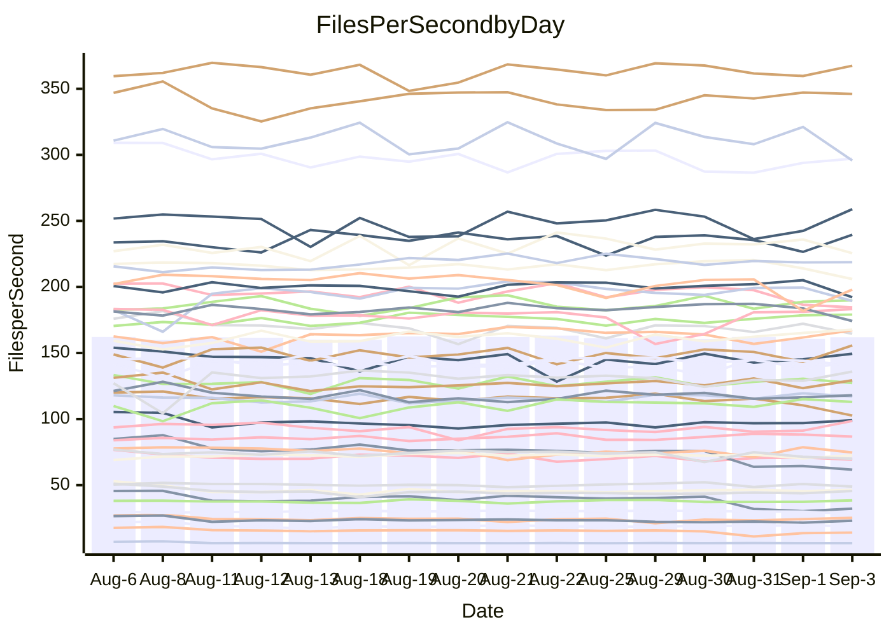

<!---
# This file is auto-generated. Do not edit.
# cspell:disable
--->
# Performance Report

## Daily Performance

## Time to Process Files

| Repository                                      | Elapsed | Min/Avg/Max           |   SD | SD Graph                |
| ----------------------------------------------- | ------: | :-------------------: | ---: | ----------------------- |
| AdaDoom3/AdaDoom3                    |    3.66 | 3.3 /   3.4 /   3.6   | 0.07 | `     ┣━┻━━╋━━┻━┫    ●` |
| alexiosc/megistos                    |    8.33 | 7.5 /   7.9 /   9.4   | 0.42 | `    ┣━━┻━━╋━━●━━┫    ` |
| apollographql/apollo-server          |    2.56 | 2.6 /   2.7 /   3.3   | 0.14 | `    ┣━━●━━╋━━┻━━┫    ` |
| aspnetboilerplate/aspnetboilerplate  |   11.10 | 10.1 /  10.6 /  11.2  | 0.24 | `    ┣━━┻━━╋━━┻━━┫●   ` |
| aws-amplify/docs                     |   13.12 | 12.5 /  13.2 /  14.2  | 0.39 | `    ┣━━┻━●╋━━┻━━┫    ` |
| Azure/azure-rest-api-specs           |    9.42 | 9.4 /   9.9 /  11.3   | 0.43 | `    ┣━━●━━╋━━┻━━┫    ` |
| bitjson/typescript-starter           |    1.06 | 0.9 /   1.0 /   1.3   | 0.07 | `     ┣━┻━━●━━┻━┫     ` |
| caddyserver/caddy                    |    3.82 | 3.6 /   3.8 /   4.3   | 0.17 | `    ┣━━┻━━╋●━┻━━┫    ` |
| canada-ca/open-source-logiciel-libre |    1.15 | 0.9 /   1.1 /   1.2   | 0.06 | `     ┣━┻━━╋●━┻━┫     ` |
| chef/chef                            |    6.38 | 5.8 /   6.2 /   7.7   | 0.38 | `    ┣━━┻━━╋●━┻━━┫    ` |
| dart-lang/sdk                        |   64.48 | 63.3 /  67.1 /  70.7  | 1.98 | `  ┣━━●┻━━━╋━━━┻━━━┫  ` |
| django/django                        |   16.41 | 14.8 /  15.5 /  16.4  | 0.35 | `    ┣━━┻━━╋━━┻━━┫ ●  ` |
| eslint/eslint                        |   11.01 | 10.6 /  11.2 /  12.1  | 0.41 | `    ┣━━┻━●╋━━┻━━┫    ` |
| exonum/exonum                        |    4.10 | 3.4 /   3.6 /   3.9   | 0.12 | `     ┣━┻━━╋━━┻━┫    ●` |
| flutter/samples                      |   17.05 | 16.3 /  17.2 /  19.7  | 0.70 | `   ┣━━━┻━●╋━━┻━━━┫   ` |
| gitbucket/gitbucket                  |    3.52 | 3.4 /   3.6 /   3.9   | 0.12 | `    ┣━━┻━●╋━━┻━━┫    ` |
| googleapis/google-cloud-cpp          |  145.41 | 136.7 / 143.6 / 155.3 | 4.74 | `  ┣━━━┻━━━╋━●━┻━━━┫  ` |
| graphql/express-graphql              |    1.13 | 1.0 /   1.1 /   1.3   | 0.07 | `     ┣━┻━━╋●━┻━┫     ` |
| graphql/graphql-js                   |    2.82 | 2.7 /   2.9 /   3.2   | 0.10 | `    ┣━━┻●━╋━━┻━━┫    ` |
| graphql/graphql-relay-js             |    1.11 | 1.0 /   1.2 /   1.3   | 0.07 | `     ┣━┻●━╋━━┻━┫     ` |
| graphql/graphql-spec                 |    1.28 | 0.9 /   1.0 /   1.5   | 0.13 | `     ┣━┻━━╋━━┻━●     ` |
| iluwatar/java-design-patterns        |   12.79 | 12.6 /  13.4 /  15.2  | 0.57 | `    ┣━━●━━╋━━┻━━┫    ` |
| ktaranov/sqlserver-kit               |    6.74 | 6.5 /   6.8 /   7.4   | 0.19 | `    ┣━━┻━●╋━━┻━━┫    ` |
| liriliri/licia                       |    4.15 | 4.0 /   4.2 /   4.6   | 0.12 | `    ┣━━┻●━╋━━┻━━┫    ` |
| MartinThoma/LaTeX-examples           |    7.33 | 6.7 /   7.0 /   7.5   | 0.17 | `    ┣━━┻━━╋━━┻━●┫    ` |
| mdx-js/mdx                           |    2.03 | 1.8 /   2.0 /   2.2   | 0.09 | `     ┣━┻━━╋●━┻━┫     ` |
| microsoft/TypeScript-Website         |    5.60 | 5.5 /   5.9 /   7.3   | 0.36 | `    ┣━━┻●━╋━━┻━━┫    ` |
| MicrosoftDocs/PowerShell-Docs        |   23.97 | 23.2 /  24.5 /  27.5  | 0.96 | `   ┣━━━┻●━╋━━┻━━━┫   ` |
| neovim/nvim-lspconfig                |    4.23 | 4.1 /   4.3 /   4.7   | 0.12 | `    ┣━━┻●━╋━━┻━━┫    ` |
| pagekit/pagekit                      |    3.74 | 3.5 /   3.6 /   4.1   | 0.14 | `    ┣━━┻━━╋━●┻━━┫    ` |
| php/php-src                          |   26.30 | 25.3 /  26.6 /  29.7  | 0.98 | `   ┣━━━┻━●╋━━┻━━━┫   ` |
| plasticrake/tplink-smarthome-api     |    1.34 | 1.2 /   1.3 /   1.4   | 0.07 | `     ┣━┻━━●━━┻━┫     ` |
| prettier/prettier                    |    7.73 | 7.0 /   7.4 /   8.1   | 0.24 | `    ┣━━┻━━╋━━┻●━┫    ` |
| pycontribs/jira                      |    1.61 | 1.5 /   1.6 /   1.7   | 0.06 | `     ┣━┻━━╋━●┻━┫     ` |
| RustPython/RustPython                |    5.37 | 5.0 /   5.4 /   5.8   | 0.21 | `    ┣━━┻━━●━━┻━━┫    ` |
| shoelace-style/shoelace              |    2.94 | 2.8 /   3.0 /   3.7   | 0.16 | `    ┣━━┻━●╋━━┻━━┫    ` |
| slint-ui/slint                       |   12.24 | 11.9 /  12.7 /  15.5  | 0.81 | `   ┣━━━┻●━╋━━┻━━━┫   ` |
| SoftwareBrothers/admin-bro           |    2.68 | 2.4 /   2.6 /   3.0   | 0.11 | `    ┣━━┻━━╋━●┻━━┫    ` |
| sveltejs/svelte                      |   21.30 | 20.2 /  21.5 /  23.0  | 0.50 | `   ┣━━━┻━●╋━━┻━━━┫   ` |
| TheAlgorithms/Python                 |    5.83 | 5.6 /   5.9 /   6.9   | 0.31 | `    ┣━━┻━●╋━━┻━━┫    ` |
| twbs/bootstrap                       |    1.91 | 1.3 /   1.6 /   1.9   | 0.13 | `     ┣━┻━━╋━━┻━┫ ●   ` |
| typescript-cheatsheets/react         |    1.38 | 1.3 /   1.4 /   1.5   | 0.04 | `     ┣━┻●━╋━━┻━┫     ` |
| typescript-eslint/typescript-eslint  |    4.30 | 4.1 /   4.3 /   4.7   | 0.14 | `    ┣━━┻━━●━━┻━━┫    ` |
| vitest-dev/vitest                    |    9.78 | 9.1 /   9.5 /  11.1   | 0.41 | `    ┣━━┻━━╋━●┻━━┫    ` |
| w3c/aria-practices                   |    3.47 | 3.2 /   3.5 /   3.8   | 0.11 | `    ┣━━┻━━●━━┻━━┫    ` |
| w3c/specberus                        |    2.00 | 1.9 /   2.1 /   2.2   | 0.08 | `     ┣━┻●━╋━━┻━┫     ` |
| webdeveric/webpack-assets-manifest   |    1.18 | 1.0 /   1.2 /   1.3   | 0.06 | `     ┣━┻━●╋━━┻━┫     ` |
| webpack/webpack                      |    6.05 | 5.4 /   5.7 /   6.2   | 0.19 | `    ┣━━┻━━╋━━┻━━●    ` |
| wireapp/wire-desktop                 |    1.34 | 0.9 /   1.1 /   1.4   | 0.13 | `     ┣━┻━━╋━━┻━●     ` |
| wireapp/wire-webapp                  |   10.95 | 10.8 /  11.3 /  13.3  | 0.52 | `    ┣━━┻●━╋━━┻━━┫    ` |

Note:
- Elapsed time is in seconds.

## Files per Second over Time

| Repository                                      | Files |    Sec |    Fps |     Rel | Trend Fps              |    N |
| ----------------------------------------------- | ----: | -----: | -----: | ------: | ---------------------- | ---: |
| AdaDoom3/AdaDoom3                    |   103 |   3.66 |  28.16 |  -6.52% | `█▇█▇▇▇▇█▇▇█▇██▇█▇▇▇▄` |   29 |
| alexiosc/megistos                    |   583 |   8.33 |  69.97 |  -5.36% | `▇█▆▇▇██▇▇█▆█▇█▃▃▇█▆▆` |   29 |
| apollographql/apollo-server          |   252 |   2.56 |  98.55 |   5.94% | `█▆▆▇▇▂▆▇▇▇▆▇▆█▅█▆▆▆█` |   29 |
| aspnetboilerplate/aspnetboilerplate  |  2286 |  11.10 | 205.97 |  -4.88% | `█▄▆▇▆▆█▆▆▇▇▅▇▇▇█▇█▆▅` |   29 |
| aws-amplify/docs                     |  2871 |  13.12 | 218.78 |   0.56% | `▆▅▆▇▇▇▆▇▆▆▇▇▇▆▆▇▅█▆▆` |   29 |
| Azure/azure-rest-api-specs           |  2438 |   9.42 | 258.87 |   4.61% | `▆▃▇█▄▆▅█▆▇▇▇█▇█▇▆▅▆█` |   29 |
| bitjson/typescript-starter           |    20 |   1.06 |  18.88 |  -1.61% | `▆▃▇▅▇▆██▇▇▇▆▆██▇▇▇█▇` |   29 |
| caddyserver/caddy                    |   285 |   3.82 |  74.68 |  -1.48% | `▇▇█▄█▇▇▄▅▆█▅▆█▆▆▇▃█▆` |   29 |
| canada-ca/open-source-logiciel-libre |     7 |   1.15 |   6.09 |  -2.86% | `▇▇▆▇█▇▆▆▇▇▆▆▇▆▆▆█▇▆▆` |   29 |
| chef/chef                            |  1208 |   6.38 | 189.39 |  -2.95% | `▇▇▆▇█▇▇█▇█▇█▇▇▇▅▇█▇▆` |   29 |
| dart-lang/sdk                        | 10816 |  64.48 | 167.75 |   4.34% | `▆▅▆█▇▆▇▇▆▇▅▄▇▇▄▆▇▆▇█` |   29 |
| django/django                        |  2858 |  16.41 | 174.20 |  -5.16% | `▇▄▆▅█▆▆▇▇▆▆▇▇▇▇█▇▇▆▄` |   29 |
| eslint/eslint                        |  2090 |  11.01 | 189.86 |   1.51% | `▆▅▅▄██▇█▆▆▇▄▆▇▇█▄▇▇▇` |   29 |
| exonum/exonum                        |   421 |   4.10 | 102.65 | -11.48% | `▆█▅█▇▅▇▇▇▇▇▇█▇▅▇▆▇▅▂` |   29 |
| flutter/samples                      |  2400 |  17.05 | 140.79 |  -0.37% | `██▇▆▆▆▇▆▇█▆▆▆▆▃▆█▇▇▇` |   29 |
| gitbucket/gitbucket                  |   413 |   3.52 | 117.17 |   1.46% | `▇▅█▅▆█▅▇█▆▄██▇█▇▇▇█▇` |   29 |
| googleapis/google-cloud-cpp          | 20726 | 145.41 | 142.53 |  -0.81% | `▆▇▅█▇▄█▆▆█▇▇▇▇▅▆▇▇▅▆` |   29 |
| graphql/express-graphql              |    26 |   1.13 |  23.03 |  -1.65% | `▇▆█▆▇▇██▇▇▇▇▅▆▃▅▅▆▅▇` |   29 |
| graphql/graphql-js                   |   364 |   2.82 | 129.29 |   2.23% | `▇▃▆▆▆▆▆▆▆▆▆▇▇▆▆▇█▆▅▇` |   29 |
| graphql/graphql-relay-js             |    28 |   1.11 |  25.24 |   3.38% | `▅▆█▇▇▆█▄▆▇█▇▃▆▆▇▃█▇█` |   29 |
| graphql/graphql-spec                 |    18 |   1.28 |  14.09 |  -9.07% | `▆██████▇██▇██▅██▂▂▅▆` |   29 |
| iluwatar/java-design-patterns        |  1992 |  12.79 | 155.69 |   4.41% | `▆▆▇▇▆▆▇█▇▃▇▇▆▇█▇█▆▆█` |   29 |
| ktaranov/sqlserver-kit               |   489 |   6.74 |  72.55 |   0.45% | `▆█▆▇███▇▇▇▅█▇█▅▇█▆▆▇` |   29 |
| liriliri/licia                       |  1437 |   4.15 | 346.14 |   1.72% | `▆▇▇█▇▇██▇▇▇▆▆█▇▇▇▇██` |   29 |
| MartinThoma/LaTeX-examples           |  1409 |   7.33 | 192.22 |  -4.12% | `▆▇▆▆▅▆▄▇▆██▆▆▇▇▅▆▇▇▅` |   29 |
| mdx-js/mdx                           |   141 |   2.03 |  69.29 |  -2.48% | `▅▇█▇█▅██▅▆▆▇▇▅▆▅█▅▇▆` |   29 |
| microsoft/TypeScript-Website         |   761 |   5.60 | 135.94 |   4.53% | `▆███▇▆█▇▇▇▇▇▇█▆▄█▆▇█` |   29 |
| MicrosoftDocs/PowerShell-Docs        |  2708 |  23.97 | 112.97 |   2.04% | `▆▆▄▅▇▆█▅█▇█▇▇▆▇▇▅▇█▇` |   29 |
| neovim/nvim-lspconfig                |   757 |   4.23 | 179.08 |   2.72% | `▆▆▆██▇█▇█▆▇▅▇▇▆▆▆███` |   29 |
| pagekit/pagekit                      |   741 |   3.74 | 198.01 |  -2.87% | `▆██▇███▇▇▆▇▃▆█▆██▇▃▆` |   29 |
| php/php-src                          |  2281 |  26.30 |  86.74 |   1.15% | `▅▇▇▄▇▇▆▇▇█▆▆▆█▆▆█▇▇▇` |   29 |
| plasticrake/tplink-smarthome-api     |    62 |   1.34 |  46.41 |   0.15% | `▇▇▄▇█▅▇▆▇▆▆▅▆▆█▆▇▇▆▇` |   29 |
| prettier/prettier                    |  2286 |   7.73 | 295.70 |  -4.53% | `▆██▄▇▆▆█▇▆▅▅█▇█▆▇▆█▅` |   29 |
| pycontribs/jira                      |    79 |   1.61 |  48.97 |  -2.91% | `▄█▆▇▅▆▆▅▇▅▆▇▇█▇▇▇▃▇▅` |   29 |
| RustPython/RustPython                |   684 |   5.37 | 127.29 |  -0.14% | `▅▄█▇█▅▆█▄▇▆██▄▇▆▇▇█▇` |   29 |
| shoelace-style/shoelace              |   439 |   2.94 | 149.46 |   2.61% | `▇▇▆▇█▇▇█▆▂▆█▇███▇▆▇█` |   29 |
| slint-ui/slint                       |  2243 |  12.24 | 183.21 |   3.55% | `▇█▇▆██▇▇█▇▇▇▄▆▇▃████` |   29 |
| SoftwareBrothers/admin-bro           |   441 |   2.68 | 164.57 |  -2.84% | `▇██▇█▃▇██▇▆▆███▇█▆█▇` |   29 |
| sveltejs/svelte                      |  7828 |  21.30 | 367.46 |   1.32% | `▅▆▆▅▄▅▆▆▆▆▆▅▇█▆▅▆▅▆▆` |   29 |
| TheAlgorithms/Python                 |  1396 |   5.83 | 239.54 |   2.22% | `██▇▇▇▇█▇▇█▇▄▇▇█▇▆█▆▇` |   29 |
| twbs/bootstrap                       |   118 |   1.91 |  61.65 | -19.28% | `▇▇█▇▆▆▇▇█▅█▄▇██▄▃▃▃▂` |   29 |
| typescript-cheatsheets/react         |    53 |   1.38 |  38.42 |   1.87% | `▅▆▅██▆▇▅█▅█▇▇▆▅▇▇▄▆▇` |   29 |
| typescript-eslint/typescript-eslint  |  1278 |   4.30 | 297.13 |  -0.10% | `▅▇▇█▆▇█▆▇████▆▄▇▄▇▇▇` |   29 |
| vitest-dev/vitest                    |  2206 |   9.78 | 225.53 |  -2.00% | `▆▅█▃▇▇█▆███▇▆▇▇▇▆█▇▆` |   29 |
| w3c/aria-practices                   |   409 |   3.47 | 118.04 |  -0.01% | `▆▆█▄▆▅▇▅▆▅▇█▇▇█▇▅▆▆▇` |   29 |
| w3c/specberus                        |   198 |   2.00 |  99.11 |   1.76% | `█▇▇▅█▇▄▆▇▇▇▇▆▇▆█▇▇▇█` |   29 |
| webdeveric/webpack-assets-manifest   |    54 |   1.18 |  45.60 |   0.98% | `▇█▄█▆▇█▆▇▇▇▆▆█▆▅▇▆▆█` |   29 |
| webpack/webpack                      |  1117 |   6.05 | 184.53 |  -6.20% | `█▆▆█▇▇▄▇██▇▅▇█▇▇█▆▅▅` |   29 |
| wireapp/wire-desktop                 |    43 |   1.34 |  32.20 | -18.78% | `▇▅███▇▅█▇██▆▇██▇▃▃▂▃` |   29 |
| wireapp/wire-webapp                  |  1832 |  10.95 | 167.23 |   3.04% | `▇█▇█▇▇▇███▇▇▇██▆▆▆▇█` |   29 |

## Data Throughput

| Repository                                      | Files |    Sec |     Kps |     Rel | Trend Kps              |    N |
| ----------------------------------------------- | ----: | -----: | ------: | ------: | ---------------------- | ---: |
| AdaDoom3/AdaDoom3                    |   103 |   3.66 |  598.49 |  -6.52% | `█▇█▇▇▇▇█▇▇█▇██▇█▇▇▇▄` |   29 |
| alexiosc/megistos                    |   583 |   8.33 |  549.79 |  -5.36% | `▇█▆▇▇██▇▇█▆█▇█▃▃▇█▆▆` |   29 |
| apollographql/apollo-server          |   252 |   2.56 |  792.67 |   5.94% | `█▆▆▇▇▂▆▇▇▇▆▇▆█▅█▆▆▆█` |   29 |
| aspnetboilerplate/aspnetboilerplate  |  2286 |  11.10 |  501.15 |  -4.87% | `█▄▆▇▆▆█▆▆▇▇▅▇▇▇█▇█▆▅` |   29 |
| aws-amplify/docs                     |  2871 |  13.12 |  763.96 |   0.56% | `▆▅▆▇▇▇▆▇▆▆▇▇▇▆▆▇▅█▆▆` |   29 |
| Azure/azure-rest-api-specs           |  2438 |   9.42 |  687.10 |   4.52% | `▇▃▇█▄▆▅█▇▇▇▇█▇█▇▆▅▆█` |   29 |
| bitjson/typescript-starter           |    20 |   1.06 |   75.52 |  -1.61% | `▆▃▇▅▇▆██▇▇▇▆▆██▇▇▇█▇` |   29 |
| caddyserver/caddy                    |   285 |   3.82 |  638.04 |  -1.26% | `▇▇▇▄█▇▇▄▅▆█▅▆█▆▆▇▃█▆` |   29 |
| canada-ca/open-source-logiciel-libre |     7 |   1.15 |   50.45 |  -2.86% | `▇▇▆▇█▇▆▆▇▇▆▆▇▆▆▆█▇▆▆` |   29 |
| chef/chef                            |  1208 |   6.38 |  874.52 |  -2.97% | `▇▇▆▇█▇▇█▇█▇█▇▇▇▅▇█▇▆` |   29 |
| dart-lang/sdk                        | 10816 |  64.48 | 1138.18 |   4.69% | `▆▅▆█▇▆▇▇▅▇▅▄▇▇▄▆▇▆▇█` |   29 |
| django/django                        |  2858 |  16.41 | 1092.11 |  -5.10% | `▇▄▆▅█▆▆▇▇▆▆▇▇▇▇█▇▇▆▄` |   29 |
| eslint/eslint                        |  2090 |  11.01 | 1379.70 |   1.52% | `▆▅▅▄██▇█▆▆▇▄▆▇▇█▄▇▇▇` |   29 |
| exonum/exonum                        |   421 |   4.10 |  981.88 | -11.48% | `▆█▅█▇▅▇▇▇▇▇▇█▇▅▇▆▇▅▂` |   29 |
| flutter/samples                      |  2400 |  17.05 | 1256.40 |   0.53% | `██▇▆▆▆▇▆▇█▆▆▇▆▃▇███▇` |   29 |
| gitbucket/gitbucket                  |   413 |   3.52 |  532.53 |   1.46% | `▇▅█▅▆█▅▇█▆▄██▇█▇▇▇█▇` |   29 |
| googleapis/google-cloud-cpp          | 20726 | 145.41 | 1151.91 |  -0.71% | `▆▇▅█▇▄█▆▆█▇▇▇▇▅▆▇▇▅▆` |   29 |
| graphql/express-graphql              |    26 |   1.13 |  105.42 |  -1.65% | `▇▆█▆▇▇██▇▇▇▇▅▆▃▅▅▆▅▇` |   29 |
| graphql/graphql-js                   |   364 |   2.82 |  743.03 |   2.23% | `▇▃▆▆▆▆▆▆▆▆▆▇▇▆▆▇█▆▅▇` |   29 |
| graphql/graphql-relay-js             |    28 |   1.11 |   99.18 |   3.38% | `▅▆█▇▇▆█▄▆▇█▇▃▆▆▇▃█▇█` |   29 |
| graphql/graphql-spec                 |    18 |   1.28 |  460.42 | -17.81% | `▆██████▇██▇██▅██▂▂▄▄` |   29 |
| iluwatar/java-design-patterns        |  1992 |  12.79 |  481.21 |   4.41% | `▆▆▇▇▆▆▇█▇▃▇▇▆▇█▇█▆▆█` |   29 |
| ktaranov/sqlserver-kit               |   489 |   6.74 | 1098.41 |   0.48% | `▆█▆▇███▇▇▇▅█▇█▅▇█▆▆▇` |   29 |
| liriliri/licia                       |  1437 |   4.15 |  412.39 |   1.72% | `▆▇▇█▇▇██▇▇▇▆▆█▇▇▇▇██` |   29 |
| MartinThoma/LaTeX-examples           |  1409 |   7.33 |  396.99 |  -4.12% | `▆▇▆▆▅▆▄▇▆██▆▆▇▇▅▆▇▇▅` |   29 |
| mdx-js/mdx                           |   141 |   2.03 |  322.39 |  -2.46% | `▅▇█▇█▅██▅▆▆▇▇▅▆▅█▅▇▆` |   29 |
| microsoft/TypeScript-Website         |   761 |   5.60 |  940.17 |   4.55% | `▆███▇▆█▇▇▇▇▇▇█▆▄█▆▇█` |   29 |
| MicrosoftDocs/PowerShell-Docs        |  2708 |  23.97 | 1161.69 |   2.07% | `▆▆▄▅▇▆█▅█▇█▇▇▆▇▇▅▇█▇` |   29 |
| neovim/nvim-lspconfig                |   757 |   4.23 |  294.76 |   3.96% | `▆▆▆██▇█▇█▆▇▆▇▇▇▆▇███` |   29 |
| pagekit/pagekit                      |   741 |   3.74 |  412.85 |  -2.87% | `▆██▇███▇▇▆▇▃▆█▆██▇▃▆` |   29 |
| php/php-src                          |  2281 |  26.30 | 1510.65 |   1.26% | `▅▇▇▄▇▇▆▇▇█▆▆▆█▆▆█▇▇▇` |   29 |
| plasticrake/tplink-smarthome-api     |    62 |   1.34 |  250.79 |   0.15% | `▇▇▄▇█▅▇▆▇▆▆▅▆▆█▆▇▇▆▇` |   29 |
| prettier/prettier                    |  2286 |   7.73 |  419.49 |  -4.54% | `▆██▄▇▆▆█▇▆▅▅█▇█▆▇▆█▅` |   29 |
| pycontribs/jira                      |    79 |   1.61 |  347.16 |  -2.91% | `▄█▆▇▅▆▆▅▇▅▆▇▇█▇▇▇▃▇▅` |   29 |
| RustPython/RustPython                |   684 |   5.37 | 1002.34 |   0.17% | `▅▄█▇█▅▆█▄▇▆██▄▇▆▇▇█▇` |   29 |
| shoelace-style/shoelace              |   439 |   2.94 |  722.10 |   2.61% | `▇▇▆▇█▇▇█▆▂▆█▇███▇▆▇█` |   29 |
| slint-ui/slint                       |  2243 |  12.24 | 1195.73 |   3.66% | `▇█▇▆██▇▇█▇▇▇▄▆▇▃████` |   29 |
| SoftwareBrothers/admin-bro           |   441 |   2.68 |  362.72 |  -2.84% | `▇██▇█▃▇██▇▆▆███▇█▆█▇` |   29 |
| sveltejs/svelte                      |  7828 |  21.30 |  245.84 |   1.24% | `▅▆▆▅▄▅▆▆▆▆▆▅▇█▆▅▆▅▆▆` |   29 |
| TheAlgorithms/Python                 |  1396 |   5.83 |  608.46 |   2.29% | `██▇▇▇▇█▇▇█▇▄▇▇█▇▆█▆▇` |   29 |
| twbs/bootstrap                       |   118 |   1.91 |  505.73 | -19.36% | `▇▇█▇▆▆▇▇█▅█▄▇██▄▃▃▃▂` |   29 |
| typescript-cheatsheets/react         |    53 |   1.38 |  284.17 |   2.78% | `▅▅▅█▇▆▇▄█▄█▇█▆▅▇█▅▆▇` |   29 |
| typescript-eslint/typescript-eslint  |  1278 |   4.30 | 1516.81 |  -0.02% | `▅▇▇█▆▇█▆▇████▆▄▇▄▇▇▇` |   29 |
| vitest-dev/vitest                    |  2206 |   9.78 |  504.64 |  -2.33% | `▆▅█▃▇▇█▆███▇▆▇▇▇▆█▇▆` |   29 |
| w3c/aria-practices                   |   409 |   3.47 | 1098.39 |  -0.00% | `▆▆█▄▆▅▇▅▆▅▇█▇▇█▇▅▆▆▇` |   29 |
| w3c/specberus                        |   198 |   2.00 |  311.36 |   2.15% | `▇▇▇▅█▇▄▆▇▇▇▇▆▇▆█▇▇▇█` |   29 |
| webdeveric/webpack-assets-manifest   |    54 |   1.18 |  107.25 |   0.98% | `▇█▄█▆▇█▆▇▇▇▆▆█▆▅▇▆▆█` |   29 |
| webpack/webpack                      |  1117 |   6.05 |  837.57 |  -6.13% | `▇▆▆█▇▇▄▇██▇▅▇█▇▇█▆▅▅` |   29 |
| wireapp/wire-desktop                 |    43 |   1.34 |  142.27 | -18.78% | `▇▅███▇▅█▇██▆▇██▇▃▃▂▃` |   29 |
| wireapp/wire-webapp                  |  1832 |  10.95 |  597.26 |   3.06% | `▇█▇█▇▇▇███▇▇▇██▆▆▆▇█` |   29 |

