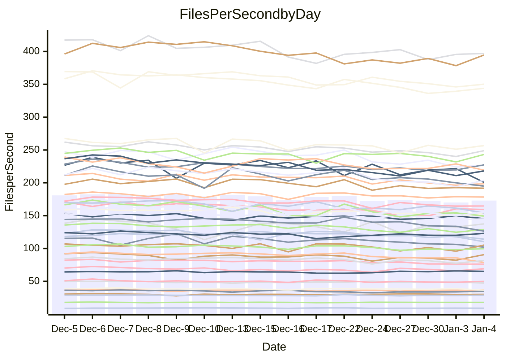

<!---
# This file is auto-generated. Do not edit.
# cspell:disable
--->
# Performance Report

## Daily Performance

## Time to Process Files

| Repository                                      | Elapsed | Min/Avg/Max           |   SD | SD Graph                |
| ----------------------------------------------- | ------: | :-------------------: | ---: | ----------------------- |
| AdaDoom3/AdaDoom3                    |    2.95 | 2.8 /   2.9 /   3.2   | 0.12 | `    ┣━━┻━━●━━┻━━┫    ` |
| alexiosc/megistos                    |    7.14 | 6.7 /   7.1 /   8.1   | 0.34 | `    ┣━━┻━━╋●━┻━━┫    ` |
| apollographql/apollo-server          |    2.45 | 2.0 /   2.2 /   2.4   | 0.09 | `     ┣━┻━━╋━━┻━┫●    ` |
| aspnetboilerplate/aspnetboilerplate  |    9.91 | 8.8 /   9.4 /  10.4   | 0.39 | `    ┣━━┻━━╋━━┻●━┫    ` |
| aws-amplify/docs                     |   11.77 | 11.3 /  11.8 /  12.5  | 0.34 | `    ┣━━┻━━●━━┻━━┫    ` |
| Azure/azure-rest-api-specs           |   16.14 | 13.8 /  15.1 /  17.0  | 0.84 | `   ┣━━━┻━━╋━━┻●━━┫   ` |
| bitjson/typescript-starter           |    0.66 | 0.6 /   0.7 /   0.7   | 0.02 | `     ┣━━┻━●━┻━━┫     ` |
| caddyserver/caddy                    |    3.08 | 2.9 /   3.2 /   3.7   | 0.18 | `    ┣━━┻●━╋━━┻━━┫    ` |
| canada-ca/open-source-logiciel-libre |    0.77 | 0.7 /   0.8 /   0.8   | 0.02 | `     ┣━━┻━●━┻━━┫     ` |
| chef/chef                            |    6.00 | 5.0 /   5.3 /   6.0   | 0.23 | `    ┣━━┻━━╋━━┻━━┫ ●  ` |
| dart-lang/sdk                        |   60.88 | 55.8 /  58.8 /  62.8  | 1.88 | `  ┣━━━┻━━━╋━━━●━━━┫  ` |
| django/django                        |   14.70 | 13.5 /  14.2 /  15.5  | 0.54 | `    ┣━━┻━━╋━━●━━┫    ` |
| eslint/eslint                        |   10.26 | 9.2 /   9.9 /  10.9   | 0.38 | `    ┣━━┻━━╋━━●━━┫    ` |
| exonum/exonum                        |    3.06 | 2.9 /   3.1 /   3.7   | 0.19 | `    ┣━━┻━●╋━━┻━━┫    ` |
| flutter/samples                      |   16.88 | 15.0 /  16.7 /  22.0  | 1.14 | `   ┣━━━┻━━●━━┻━━━┫   ` |
| gitbucket/gitbucket                  |    3.19 | 2.9 /   3.1 /   3.4   | 0.12 | `    ┣━━┻━━╋━●┻━━┫    ` |
| googleapis/google-cloud-cpp          |  126.95 | 117.0 / 125.3 / 139.4 | 5.04 | `  ┣━━━┻━━━╋●━━┻━━━┫  ` |
| graphql/express-graphql              |    0.70 | 0.7 /   0.7 /   0.8   | 0.02 | `     ┣━━●━╋━┻━━┫     ` |
| graphql/graphql-js                   |    2.21 | 2.1 /   2.2 /   2.4   | 0.08 | `     ┣━┻━━╋●━┻━┫     ` |
| graphql/graphql-relay-js             |    0.77 | 0.7 /   0.7 /   0.8   | 0.02 | `     ┣━━┻━╋━┻━━●     ` |
| graphql/graphql-spec                 |    0.84 | 0.8 /   0.8 /   0.9   | 0.02 | `     ┣━━┻━●━┻━━┫     ` |
| iluwatar/java-design-patterns        |   11.66 | 10.5 /  11.2 /  13.6  | 0.56 | `    ┣━━┻━━╋━━●━━┫    ` |
| ktaranov/sqlserver-kit               |    6.43 | 5.8 /   6.1 /   6.6   | 0.21 | `    ┣━━┻━━╋━━┻●━┫    ` |
| liriliri/licia                       |    3.61 | 3.2 /   3.5 /   3.8   | 0.13 | `    ┣━━┻━━╋●━┻━━┫    ` |
| MartinThoma/LaTeX-examples           |    6.20 | 6.0 /   6.3 /   6.7   | 0.14 | `    ┣━━┻●━╋━━┻━━┫    ` |
| mdx-js/mdx                           |    1.81 | 1.5 /   1.6 /   1.8   | 0.07 | `     ┣━┻━━╋━━┻━┫  ●  ` |
| microsoft/TypeScript-Website         |    5.21 | 4.7 /   5.1 /   5.3   | 0.15 | `    ┣━━┻━━╋━●┻━━┫    ` |
| MicrosoftDocs/PowerShell-Docs        |   19.55 | 17.6 /  18.8 /  25.8  | 1.38 | `   ┣━━━┻━━╋━●┻━━━┫   ` |
| neovim/nvim-lspconfig                |    3.37 | 2.8 /   3.0 /   3.4   | 0.12 | `    ┣━━┻━━╋━━┻━━┫  ● ` |
| pagekit/pagekit                      |    3.40 | 3.0 /   3.3 /   3.8   | 0.19 | `    ┣━━┻━━╋━●┻━━┫    ` |
| php/php-src                          |   21.05 | 19.9 /  21.6 /  25.7  | 1.30 | `   ┣━━━┻━●╋━━┻━━━┫   ` |
| plasticrake/tplink-smarthome-api     |    0.90 | 0.8 /   0.9 /   1.0   | 0.04 | `     ┣━┻━●╋━━┻━┫     ` |
| prettier/prettier                    |    6.40 | 5.9 /   6.2 /   7.2   | 0.26 | `    ┣━━┻━━╋━●┻━━┫    ` |
| pycontribs/jira                      |    1.23 | 1.2 /   1.2 /   1.3   | 0.03 | `     ┣━┻━●╋━━┻━┫     ` |
| RustPython/RustPython                |    4.28 | 3.9 /   4.1 /   4.6   | 0.15 | `    ┣━━┻━━╋━━●━━┫    ` |
| shoelace-style/shoelace              |    2.46 | 2.3 /   2.4 /   2.5   | 0.07 | `     ┣━┻━━╋●━┻━┫     ` |
| slint-ui/slint                       |    9.59 | 8.4 /   9.2 /  10.7   | 0.53 | `    ┣━━┻━━╋━●┻━━┫    ` |
| SoftwareBrothers/admin-bro           |    2.26 | 2.0 /   2.1 /   2.3   | 0.09 | `     ┣━┻━━╋━━┻━●     ` |
| sveltejs/svelte                      |   18.05 | 17.0 /  18.0 /  18.9  | 0.58 | `   ┣━━━┻━━●━━┻━━━┫   ` |
| TheAlgorithms/Python                 |    5.30 | 4.9 /   5.3 /   5.7   | 0.19 | `    ┣━━┻━━╋●━┻━━┫    ` |
| twbs/bootstrap                       |    1.20 | 1.1 /   1.2 /   1.4   | 0.06 | `     ┣━┻━━╋●━┻━┫     ` |
| typescript-cheatsheets/react         |    1.12 | 1.0 /   1.1 /   1.1   | 0.02 | `     ┣━┻━━╋━━┻●┫     ` |
| typescript-eslint/typescript-eslint  |    3.63 | 3.4 /   3.5 /   3.8   | 0.10 | `    ┣━━┻━━╋━━●━━┫    ` |
| vitest-dev/vitest                    |    7.78 | 6.9 /   7.6 /   8.2   | 0.34 | `    ┣━━┻━━╋━●┻━━┫    ` |
| w3c/aria-practices                   |    3.20 | 2.7 /   2.9 /   3.2   | 0.13 | `    ┣━━┻━━╋━━┻━━┫●   ` |
| w3c/specberus                        |    1.63 | 1.6 /   1.6 /   1.7   | 0.04 | `     ┣━┻━●╋━━┻━┫     ` |
| webdeveric/webpack-assets-manifest   |    0.66 | 0.6 /   0.7 /   0.7   | 0.01 | `     ┣━━┻●╋━┻━━┫     ` |
| webpack/webpack                      |    4.99 | 4.5 /   4.8 /   5.3   | 0.19 | `    ┣━━┻━━╋━━┻●━┫    ` |
| wireapp/wire-desktop                 |    0.86 | 0.8 /   0.9 /   0.9   | 0.03 | `     ┣━┻━━●━━┻━┫     ` |
| wireapp/wire-webapp                  |    8.68 | 7.3 /   7.9 /   8.5   | 0.32 | `    ┣━━┻━━╋━━┻━━┫●   ` |

Note:
- Elapsed time is in seconds.

## Files per Second over Time

| Repository                                      | Files |    Sec |    Fps |     Rel | Trend Fps              |    N |
| ----------------------------------------------- | ----: | -----: | -----: | ------: | ---------------------- | ---: |
| AdaDoom3/AdaDoom3                    |   103 |   2.95 |  34.86 |  -0.43% | `▇▇▇▇▇█▆▅▄▄▆▅▆▆▅▄▆▅▅▆` |   32 |
| alexiosc/megistos                    |   583 |   7.14 |  81.68 |  -1.16% | `▇█▆▇▇▆█▇▄▅▆▇▆▆▇▅▃▅▇▆` |   32 |
| apollographql/apollo-server          |   250 |   2.45 | 102.14 |  -8.90% | `▇▇█▆▅▆▇▇▆▆▆▅▄▆▅▅▄▄▆▃` |   33 |
| aspnetboilerplate/aspnetboilerplate  |  2246 |   9.91 | 226.75 |  -5.72% | `██▇█▇▆▇█▆▅▅▅▆▆▆▆▆▃▄▅` |   32 |
| aws-amplify/docs                     |  2863 |  11.77 | 243.15 |   0.19% | `██▅█▆█▅▇▇█▇██▇▅▇▅▆▅▇` |   33 |
| Azure/azure-rest-api-specs           |  2411 |  16.14 | 149.42 |  -6.57% | `█▅▆▅▃▄▄▇▅▅▃▄▄▅▄▅▄▆▅▄` |   33 |
| bitjson/typescript-starter           |    20 |   0.66 |  30.12 |  -0.56% | `▆▆▇▇▆▇▆▇▇▆██▇███▆▇▅▇` |   32 |
| caddyserver/caddy                    |   279 |   3.08 |  90.61 |   3.67% | `█▃▆█▆▅█▇▅▄▆▇▆▆▇▄▆▄▄█` |   33 |
| canada-ca/open-source-logiciel-libre |     7 |   0.77 |   9.11 |  -0.60% | `▅▆▇▇▄▆▇█▄▅▆▅▅▅▆▆▆▆▆▆` |   32 |
| chef/chef                            |  1204 |   6.00 | 200.66 | -11.07% | `██▇█▆▆█▅▇▇▅▄▆▇▇▃▆▅▇▃` |   32 |
| dart-lang/sdk                        | 10026 |  60.88 | 164.70 |  -3.27% | `▇▆██▇▆██▅▅▇█▅▇▇▅▅▆▅▆` |   33 |
| django/django                        |  2817 |  14.70 | 191.68 |  -3.15% | `██▇▇▇▇▆█▄▆▆▇▅▆▄▇▆▅▆▆` |   33 |
| eslint/eslint                        |  2038 |  10.26 | 198.61 |  -3.40% | `█▆▇█▇▇▇█▆▅▇▆▇▆▇▄▆▅▅▆` |   33 |
| exonum/exonum                        |   421 |   3.06 | 137.41 |   1.83% | `▅██▇█▆▆▅▇█▄▅▇█▇▆▇▆▆▇` |   32 |
| flutter/samples                      |  2690 |  16.88 | 159.38 |  -1.25% | `█▇▇▆▇▇▇▇▇▇▆▆▇▇▇▂▇▇▇▇` |   33 |
| gitbucket/gitbucket                  |   412 |   3.19 | 128.97 |  -2.51% | `██▇▇▇▅▇▇▅▆▅▄▇▆▅▆▄▆▄▆` |   33 |
| googleapis/google-cloud-cpp          | 19742 | 126.95 | 155.51 |  -1.43% | `█▄▇▅▄▄▇▇▅▅▆▆▆▅▆▅▆▅▃▆` |   33 |
| graphql/express-graphql              |    26 |   0.70 |  37.08 |   1.87% | `█▇█▆▇█▆▆▇█▇▄███▆▆▇██` |   32 |
| graphql/graphql-js                   |   339 |   2.21 | 153.20 |  -1.36% | `▇▇█▆▅▄▇▇▇█▇▆▇▇▆▆▆▄▇▇` |   33 |
| graphql/graphql-relay-js             |    28 |   0.77 |  36.54 |  -4.89% | `██▆▅▅▅██▇██▆▇▆▅█▇██▅` |   32 |
| graphql/graphql-spec                 |    15 |   0.84 |  17.83 |  -0.37% | `█▇█▇▇▇▆▆▇▇▆█▇▆▆▇▅▇█▇` |   32 |
| iluwatar/java-design-patterns        |  1849 |  11.66 | 158.59 |  -4.18% | `█▇▇▆▇▇▇█▇▆▆▇▇▇▆▆▇▇▆▆` |   33 |
| ktaranov/sqlserver-kit               |   489 |   6.43 |  76.08 |  -5.02% | `▇█▆▅▇█▇▇▇▅▆▇▆▆▄▄▆▄▄▅` |   33 |
| liriliri/licia                       |  1434 |   3.61 | 397.05 |  -1.97% | `▇█▆█▅▅▄▅▅▆▆▆▅▆▅▄▅▆▅▆` |   32 |
| MartinThoma/LaTeX-examples           |  1409 |   6.20 | 227.40 |   1.41% | `█▇▇▇▆▇▆▇▇▆▇▇▆▆▄▇▆▆▆█` |   32 |
| mdx-js/mdx                           |   142 |   1.81 |  78.64 | -12.52% | `█▆██▇▆▇█▆▇▇▄▇▆▆▃▇▅▅▃` |   32 |
| microsoft/TypeScript-Website         |   757 |   5.21 | 145.36 |  -2.49% | `▇▆▇█▆▆▇▇█▆▅▆▇█▅▅█▆▇▆` |   32 |
| MicrosoftDocs/PowerShell-Docs        |  2232 |  19.55 | 114.16 |  -4.31% | `▇▇▂██▇▇▇▇▇▇▇█▆▅▆▇▇▇▆` |   33 |
| neovim/nvim-lspconfig                |   372 |   3.37 | 110.33 | -10.29% | `█▇█▇▇▇██▆▇▅▇▆▇▇▇▆█▄▄` |   33 |
| pagekit/pagekit                      |   741 |   3.40 | 218.13 |  -3.29% | `▆▆▇██▇▆▆▆▅▆▃█▅▆▅▃▇▅▆` |   32 |
| php/php-src                          |  2213 |  21.05 | 105.11 |   2.31% | `▇▇█▆▃▄██▆▆▆▄▆▅▇▇▃▅▇▇` |   33 |
| plasticrake/tplink-smarthome-api     |    62 |   0.90 |  69.11 |   1.25% | `█▆▇▇▅▆▇▇▇▃▇█▆▇▇█▆▆▇▇` |   32 |
| prettier/prettier                    |  2202 |   6.40 | 343.93 |  -2.36% | `█▇▇▆▇▇▆█▇▇▇▆▇▆▇▃▇▅▇▇` |   33 |
| pycontribs/jira                      |    80 |   1.23 |  65.11 |   1.04% | `▄▇█▆▆▆▅▅▄▆▇▇▅▇▇▇▇▇▇▇` |   32 |
| RustPython/RustPython                |   621 |   4.28 | 145.06 |  -3.60% | `▅██▇▇▇▇▇▆▆▆█▆▆▇▆▄▅▇▆` |   33 |
| shoelace-style/shoelace              |   438 |   2.46 | 178.38 |  -1.18% | `▇▇█▅▆▆██▇▇█▆▆█▅▆▅█▇▇` |   33 |
| slint-ui/slint                       |  1954 |   9.59 | 203.79 |  -3.40% | `▆▇█▆█▇▇█▆▆▆▄▆▅▄▆▆▄▃▆` |   33 |
| SoftwareBrothers/admin-bro           |   441 |   2.26 | 194.96 |  -6.83% | `█▇▅▇▄▆▇█▆▅▅▆▇▆▅▅▅▃▆▄` |   32 |
| sveltejs/svelte                      |  7122 |  18.05 | 394.66 |  -0.35% | `█▇█▇███▆▇▆▆▆██▆▆▅▅▆█` |   33 |
| TheAlgorithms/Python                 |  1361 |   5.30 | 256.72 |  -0.80% | `█▆▇▅▆▄▆▆▆▆▄▅▇▆▅▆▆▄▆▆` |   33 |
| twbs/bootstrap                       |   120 |   1.20 |  99.60 |  -1.78% | `▅▇▇█▃▆▇▇█▅▅▅▅▅▆█▇▄▅▆` |   33 |
| typescript-cheatsheets/react         |    53 |   1.12 |  47.38 |  -3.39% | `█▆▅▇▅▆▇▇██▇▆█▇▆▇▆▇▇▅` |   32 |
| typescript-eslint/typescript-eslint  |  1273 |   3.63 | 350.21 |  -2.66% | `█▇▇█▇▇▆▆█▇▇▆▇▆▇▆▄▇▆▆` |   33 |
| vitest-dev/vitest                    |  1936 |   7.78 | 248.92 |  -1.46% | `▇███▇▅█▇▇▆▆▇▇▆▅▇▆▄▅▇` |   33 |
| w3c/aria-practices                   |   405 |   3.20 | 126.46 |  -9.98% | `▇▆▆▆▅▇▆█▇▆▇▆▄▃▇▇▆▆▃▄` |   33 |
| w3c/specberus                        |   200 |   1.63 | 122.96 |   0.91% | `█▇▇██▇▅▆▆▇█▇▇▇▆▆▇▅▇█` |   33 |
| webdeveric/webpack-assets-manifest   |    19 |   0.66 |  28.89 |   1.01% | `▇▅▅▆▅▆▅█▆▇▆▅▇▇▅▇▆▅▇▇` |   32 |
| webpack/webpack                      |  1095 |   4.99 | 219.30 |  -4.70% | `█▇██▆██▆▆▅▅▆▆▆▅▅█▆▆▅` |   33 |
| wireapp/wire-desktop                 |    43 |   0.86 |  49.88 |   0.12% | `▆▇▆▆▆▅█▇▅▆▇▆▇▇▅▅▅▅▇▇` |   33 |
| wireapp/wire-webapp                  |  1337 |   8.68 | 154.09 |  -7.29% | `█▅▆▆▆▅▇▅▅▅▅▅▆▆▆▆▄▅▆▃` |   33 |

## Data Throughput

| Repository                                      | Files |    Sec |     Kps |     Rel | Trend Kps              |    N |
| ----------------------------------------------- | ----: | -----: | ------: | ------: | ---------------------- | ---: |
| AdaDoom3/AdaDoom3                    |   103 |   2.95 |  740.86 |  -0.43% | `▇▇▇▇▇█▆▅▄▄▆▅▆▆▅▄▆▅▅▆` |   32 |
| alexiosc/megistos                    |   583 |   7.14 |  641.82 |  -1.16% | `▇█▆▇▇▆█▇▄▅▆▇▆▆▇▅▃▅▇▆` |   32 |
| apollographql/apollo-server          |   250 |   2.45 |  817.10 |  -8.75% | `▇▇█▆▅▆▇▇▆▆▆▅▅▆▅▅▄▄▆▃` |   33 |
| aspnetboilerplate/aspnetboilerplate  |  2246 |   9.91 |  533.46 |  -5.72% | `██▇█▇▆▇█▆▅▅▅▆▆▆▆▆▃▄▅` |   32 |
| aws-amplify/docs                     |  2863 |  11.77 |  833.14 |   0.48% | `██▅█▆█▅▇▇█▇██▇▅▇▅▆▅▇` |   33 |
| Azure/azure-rest-api-specs           |  2411 |  16.14 |  430.43 |  -6.53% | `█▅▆▅▃▄▄▇▅▅▃▄▄▅▄▅▄▆▅▄` |   33 |
| bitjson/typescript-starter           |    20 |   0.66 |  120.47 |  -0.56% | `▆▆▇▇▆▇▆▇▇▆██▇███▆▇▅▇` |   32 |
| caddyserver/caddy                    |   279 |   3.08 |  754.40 |   3.91% | `█▃▆█▆▅█▇▅▄▆▇▆▇▇▄▆▄▅█` |   33 |
| canada-ca/open-source-logiciel-libre |     7 |   0.77 |   75.51 |  -0.60% | `▅▆▇▇▄▆▇█▄▅▆▅▅▅▆▆▆▆▆▆` |   32 |
| chef/chef                            |  1204 |   6.00 |  921.63 | -11.06% | `██▇█▆▆█▅▇▇▅▄▆▇▇▃▆▅▇▃` |   32 |
| dart-lang/sdk                        | 10026 |  60.88 | 1176.28 |  -3.23% | `▇▆██▇▆██▅▅▇█▅▇▇▅▅▆▅▆` |   33 |
| django/django                        |  2817 |  14.70 | 1184.79 |  -3.04% | `██▇▇▇▇▆█▄▆▆▇▅▆▄▇▆▅▆▆` |   33 |
| eslint/eslint                        |  2038 |  10.26 | 1622.43 |  -3.25% | `█▆▇█▇▇▇█▆▅▇▇▇▆▇▄▆▅▅▆` |   33 |
| exonum/exonum                        |   421 |   3.06 | 1314.40 |   1.83% | `▅██▇█▆▆▅▇█▄▅▇█▇▆▇▆▆▇` |   32 |
| flutter/samples                      |  2690 |  16.88 | 1290.92 |  -1.25% | `█▇▇▆▇▇▇▇▇▇▆▆▇▇▇▂▇▇▇▇` |   33 |
| gitbucket/gitbucket                  |   412 |   3.19 |  583.48 |  -2.48% | `██▇▇▆▅▇▇▅▆▅▄▇▆▅▆▄▆▄▆` |   33 |
| googleapis/google-cloud-cpp          | 19742 | 126.95 | 1215.31 |  -1.32% | `█▄▇▅▄▄▇▇▅▅▆▆▆▅▆▅▆▅▃▆` |   33 |
| graphql/express-graphql              |    26 |   0.70 |  169.72 |   1.87% | `█▇█▆▇█▆▆▇█▇▄███▆▆▇██` |   32 |
| graphql/graphql-js                   |   339 |   2.21 |  870.39 |  -1.36% | `▇▇█▆▅▄▇▇▇█▇▆▇▇▆▆▆▄▇▇` |   33 |
| graphql/graphql-relay-js             |    28 |   0.77 |  143.54 |  -4.89% | `██▆▅▅▅██▇██▆▇▆▅█▇██▅` |   32 |
| graphql/graphql-spec                 |    15 |   0.84 |  656.28 |  -0.31% | `█▇█▇▇▇▆▆▇▇▆█▇▆▆▇▅▇█▇` |   32 |
| iluwatar/java-design-patterns        |  1849 |  11.66 |  488.72 |  -4.17% | `█▇▇▆▇▇▇█▇▆▆▇▇▇▆▆▇▇▆▆` |   33 |
| ktaranov/sqlserver-kit               |   489 |   6.43 | 1150.93 |  -5.03% | `▇█▆▅▇█▇▇▇▅▆▇▆▆▄▄▆▄▄▅` |   33 |
| liriliri/licia                       |  1434 |   3.61 |  470.42 |  -1.97% | `▇█▆█▅▅▄▅▅▆▆▆▅▆▅▄▅▆▅▆` |   32 |
| MartinThoma/LaTeX-examples           |  1409 |   6.20 |  469.64 |   1.41% | `█▇▇▇▆▇▆▇▇▆▇▇▆▆▄▇▆▆▆█` |   32 |
| mdx-js/mdx                           |   142 |   1.81 |  364.95 | -12.52% | `█▆██▇▆▇█▆▇▇▄▇▆▆▃▇▅▅▃` |   32 |
| microsoft/TypeScript-Website         |   757 |   5.21 |  995.41 |  -2.49% | `▇▆▇█▆▆▇▇█▆▅▆▇█▅▅█▆▇▆` |   32 |
| MicrosoftDocs/PowerShell-Docs        |  2232 |  19.55 | 1139.76 |  -4.24% | `▇▇▂██▇▇▇▇▇▇▇█▆▅▆▇▇▇▆` |   33 |
| neovim/nvim-lspconfig                |   372 |   3.37 |  288.28 |  -9.84% | `█▇█▇▇▇██▆▇▅▇▆▇▇▇▆█▄▄` |   33 |
| pagekit/pagekit                      |   741 |   3.40 |  454.81 |  -3.29% | `▆▆▇██▇▆▆▆▅▆▃█▅▆▅▃▇▅▆` |   32 |
| php/php-src                          |  2213 |  21.05 | 1538.81 |   2.33% | `▇▇█▆▃▄██▆▆▆▄▆▅▇▇▃▅▇▇` |   33 |
| plasticrake/tplink-smarthome-api     |    62 |   0.90 |  373.44 |   1.25% | `█▆▇▇▅▆▇▇▇▃▇█▆▇▇█▆▆▇▇` |   32 |
| prettier/prettier                    |  2202 |   6.40 |  485.28 |  -2.62% | `█▇▇▆▇▇▇█▇▇▇▆▇▆▇▃▆▅▇▆` |   33 |
| pycontribs/jira                      |    80 |   1.23 |  448.48 |   1.04% | `▄▇█▆▆▆▅▅▄▆▇▇▅▇▇▇▇▇▇▇` |   32 |
| RustPython/RustPython                |   621 |   4.28 | 1070.79 |  -3.50% | `▅██▇▇▇▇▇▆▆▆█▆▆▇▆▄▅▇▆` |   33 |
| shoelace-style/shoelace              |   438 |   2.46 |  856.46 |  -1.12% | `█▇█▅▆▆██▇▇█▆▆█▅▆▅█▇▇` |   33 |
| slint-ui/slint                       |  1954 |   9.59 | 1045.97 |  -3.12% | `▆▇█▆█▇▇█▆▆▆▄▆▅▄▆▆▄▃▆` |   33 |
| SoftwareBrothers/admin-bro           |   441 |   2.26 |  429.70 |  -6.83% | `█▇▅▇▄▆▇█▆▅▅▆▇▆▅▅▅▃▆▄` |   32 |
| sveltejs/svelte                      |  7122 |  18.05 |  259.34 |  -1.00% | `█▇█▆▇▇▇▅▆▆▅▅▇▇▅▆▅▅▅▇` |   33 |
| TheAlgorithms/Python                 |  1361 |   5.30 |  651.52 |  -0.59% | `█▆▇▅▆▄▆▆▆▆▄▅▇▆▅▆▆▄▇▆` |   33 |
| twbs/bootstrap                       |   120 |   1.20 |  799.31 |  -1.78% | `▅▇▇█▃▆▇▇█▅▅▅▅▅▆█▇▄▅▆` |   33 |
| typescript-cheatsheets/react         |    53 |   1.12 |  346.87 |  -3.39% | `█▆▅▇▅▆▇▇██▇▆█▇▆▇▆▇▇▅` |   32 |
| typescript-eslint/typescript-eslint  |  1273 |   3.63 | 1674.02 |  -2.17% | `█▇▇█▇▇▆▆█▇▇▇▇▆▇▆▄▇▆▆` |   33 |
| vitest-dev/vitest                    |  1936 |   7.78 |  513.40 |  -1.16% | `▇▇██▇▅██▇▇▇██▆▅▇▇▅▅▇` |   33 |
| w3c/aria-practices                   |   405 |   3.20 | 1174.39 | -10.18% | `▇▆▆▆▅▇▆█▇▆▇▆▄▃▇▇▆▆▃▄` |   33 |
| w3c/specberus                        |   200 |   1.63 |  392.25 |   0.91% | `█▇▇██▇▅▆▆▇█▇▇▇▆▆▇▅▇█` |   33 |
| webdeveric/webpack-assets-manifest   |    19 |   0.66 |  155.11 |   1.01% | `▇▅▅▆▅▆▅█▆▇▆▅▇▇▅▇▆▅▇▇` |   32 |
| webpack/webpack                      |  1095 |   4.99 |  967.54 |  -4.68% | `█▇██▆██▆▆▅▅▆▆▆▅▅█▆▆▅` |   33 |
| wireapp/wire-desktop                 |    43 |   0.86 |  220.39 |   0.28% | `▆▇▆▆▆▅█▇▅▆▇▆▇▇▅▅▅▅▇▇` |   33 |
| wireapp/wire-webapp                  |  1337 |   8.68 |  623.51 |  -7.75% | `█▅▆▆▆▅▇▅▅▅▄▄▆▆▅▅▄▅▆▃` |   33 |

