<!---
# This file is auto-generated. Do not edit.
# cspell:disable
--->
# Performance Report

## Daily Performance

```mermaid
xychart-beta
    title Files Per Second by Day
    y-axis Files per Second
    x-axis Date [Oct-28, Oct-30, Nov-2, Nov-3, Nov-4, Nov-5, Nov-6, Nov-7, Nov-8, Nov-9, Nov-10, Nov-12, Nov-17, Nov-19, Nov-22, Nov-23, Nov-25, Nov-26, Nov-27]
    bar [170.37, 173.88, 181.41, 181.83, 180.03, 177.03, 180.02, 181.19, 180.85, 185.26, 182.11, 183.02, 179.67, 181.22, 181.55, 184.70, 192.57, 183.27, 184.29]
    line [65.87, 66.92, 67.26, 68.82, 68.00, 67.86, 65.51, 63.67, 64.87, 66.76, 67.56, 66.97, 68.98, 66.79, 63.49, 65.54, 67.63, 65.16, 61.06]
    line [160.24, 156.22, 158.57, 160.95, 158.00, 160.31, 147.15, 159.42, 156.12, 164.10, 153.25, 158.83, 162.50, 155.26, 161.99, 161.00, 160.02, 155.33, 159.60]
    line [117.62, 116.69, 112.83, 118.13, 116.33, 113.51, 117.50, 115.81, 118.63, 116.72, 116.49, 116.48, 117.45, 112.12, 117.70, 117.75, 118.80, 116.72, 113.80]
    line [92.25, 89.49, 91.13, 92.48, 92.53, 87.65, 91.37, 92.01, 91.93, 94.57, 93.46, 93.94, 91.73, 87.45, 91.05, 94.79, 93.97, 94.67, 91.77]
    line [127.43, 122.27, 128.47, 126.54, 125.96, 128.10, 126.48, 129.06, 126.84, 130.40, 128.50, 126.86, 127.39, 128.53, 129.02, 122.85, 124.15, 127.61, 126.67]
    line [141.42, 135.85, 137.42, 138.47, 136.81, 134.26, 133.45, 139.44, 136.40, 136.32, 131.65, 134.94, 137.19, 136.33, 132.82, 127.42, 141.81, 137.38, 136.52]
    line [356.05, 347.75, 366.29, 362.14, 364.28, 361.14, 363.96, 367.65, 347.60, 375.37, 367.87, 367.07, 371.79, 359.89, 353.22, 368.32, 374.93, 365.77, 365.34]
    line [210.62, 210.07, 213.81, 209.04, 216.16, 216.14, 213.21, 213.46, 209.61, 218.80, 218.08, 206.42, 211.56, 214.70, 201.32, 208.63, 216.56, 211.21, 211.22]
    line [103.12, 104.26, 107.07, 102.94, 104.39, 101.54, 105.44, 103.31, 109.90, 104.67, 104.85, 104.85, 102.15, 102.24, 108.41, 107.84, 102.72, 107.24, 106.83]
    line [190.43, 184.26, 190.47, 194.38, 184.13, 185.17, 189.74, 189.19, 183.94, 184.74, 191.91, 183.56, 186.00, 187.01, 192.19, 191.67, 0.00, 182.52, 182.93]
    line [202.67, 201.52, 209.94, 210.45, 210.46, 205.70, 195.00, 206.27, 202.50, 195.41, 214.93, 208.44, 206.40, 204.90, 203.63, 207.69, 210.97, 200.63, 205.87]
    line [168.18, 167.34, 169.29, 170.21, 167.93, 169.20, 166.04, 167.77, 170.78, 172.83, 169.54, 170.69, 168.51, 170.43, 152.49, 164.76, 169.85, 169.02, 155.60]
    line [124.73, 126.71, 126.18, 126.17, 125.20, 123.91, 124.93, 127.28, 124.63, 124.24, 125.03, 125.24, 123.48, 121.57, 127.94, 124.68, 128.18, 123.81, 125.25]
    line [227.55, 225.16, 233.46, 237.64, 215.17, 224.62, 227.06, 227.82, 230.59, 232.99, 231.54, 235.20, 225.87, 229.42, 231.39, 232.22, 233.95, 231.55, 226.69]
    line [51.91, 49.28, 50.64, 52.57, 51.30, 51.37, 51.10, 52.20, 48.34, 51.40, 48.84, 50.71, 51.87, 51.27, 48.95, 50.74, 51.36, 50.08, 50.16]
    line [140.68, 142.52, 142.98, 143.73, 145.11, 140.08, 145.92, 145.09, 140.71, 145.23, 139.03, 143.66, 147.67, 143.64, 145.07, 148.78, 145.20, 139.52, 143.87]
    line [120.10, 122.23, 120.57, 121.21, 121.39, 121.32, 116.47, 124.25, 122.72, 125.93, 124.62, 120.74, 122.33, 123.30, 126.42, 130.12, 126.69, 118.47, 125.12]
    line [241.93, 228.86, 238.45, 230.34, 237.13, 232.97, 242.75, 238.83, 237.46, 245.31, 238.15, 238.92, 243.36, 234.75, 243.01, 243.28, 229.25, 233.06, 242.21]
    line [266.32, 254.88, 263.29, 262.92, 253.89, 248.33, 260.33, 260.40, 262.23, 265.71, 267.34, 258.77, 260.78, 261.46, 264.14, 258.29, 259.88, 261.65, 259.42]
    line [377.37, 358.99, 355.86, 364.55, 364.46, 351.23, 368.55, 361.63, 363.56, 361.00, 364.43, 360.15, 365.05, 367.22, 354.80, 363.64, 373.17, 364.09, 363.89]
    line [252.89, 258.82, 265.53, 262.27, 265.13, 268.91, 260.25, 268.67, 265.98, 276.77, 250.02, 272.22, 269.63, 262.78, 266.27, 264.63, 265.39, 262.12, 267.94]
    line [400.69, 402.14, 395.05, 414.08, 397.19, 404.53, 393.69, 403.73, 402.78, 401.18, 398.88, 404.51, 401.52, 385.51, 402.83, 398.10, 400.47, 401.59, 405.19]
    line [239.84, 243.76, 249.82, 255.91, 247.24, 251.21, 246.70, 252.56, 252.48, 253.34, 246.50, 250.04, 248.32, 248.40, 243.10, 246.46, 253.84, 244.86, 253.25]
    line [160.91, 162.39, 166.03, 163.82, 171.58, 163.50, 168.96, 172.75, 170.15, 173.41, 171.14, 167.37, 166.50, 171.04, 166.81, 168.79, 172.43, 172.30, 169.46]
    line [89.69, 96.76, 102.94, 97.99, 100.19, 101.63, 104.36, 102.75, 108.04, 105.75, 108.53, 107.61, 103.87, 104.59, 104.39, 110.58, 106.99, 105.01, 108.03]
    line [162.19, 179.55, 173.75, 173.21, 170.21, 168.22, 175.85, 174.73, 178.68, 179.16, 176.80, 173.86, 176.80, 174.52, 178.44, 183.84, 176.75, 178.41, 175.69]
    line [158.05, 164.74, 173.21, 172.35, 171.74, 166.28, 171.14, 173.72, 175.33, 180.56, 166.86, 160.67, 171.35, 173.67, 163.99, 174.13, 171.44, 171.10, 171.27]
    line [137.82, 144.72, 162.92, 163.47, 161.58, 153.47, 160.59, 159.17, 156.54, 166.82, 162.10, 163.95, 153.46, 157.33, 159.29, 160.15, 167.27, 163.00, 165.42]
    line [0.00, 79.53, 82.90, 85.80, 87.11, 84.45, 83.88, 83.68, 89.12, 87.30, 84.78, 87.41, 87.06, 86.68, 84.68, 84.66, 0.00, 86.16, 85.73]
    line [0.00, 36.38, 36.34, 35.21, 36.89, 35.49, 35.63, 36.38, 37.15, 37.84, 35.87, 36.08, 37.20, 36.20, 36.44, 36.12, 0.00, 36.09, 35.22]
    line [0.00, 30.03, 31.49, 27.98, 30.33, 30.80, 30.49, 31.24, 30.45, 31.85, 30.57, 31.13, 30.89, 30.94, 31.34, 30.76, 0.00, 30.81, 29.91]
    line [0.00, 8.54, 9.31, 9.31, 9.15, 9.14, 9.20, 9.09, 9.19, 9.27, 8.92, 9.14, 9.18, 8.84, 9.32, 9.24, 0.00, 9.27, 9.00]
    line [0.00, 236.88, 251.19, 246.42, 246.40, 248.00, 243.11, 246.73, 252.50, 246.24, 251.54, 252.31, 250.79, 249.89, 259.20, 257.89, 248.21, 247.03, 251.62]
    line [0.00, 136.48, 142.08, 141.79, 134.81, 142.76, 139.88, 142.79, 144.44, 140.29, 132.61, 142.45, 144.07, 134.61, 146.19, 141.96, 0.00, 142.52, 140.94]
    line [0.00, 18.26, 18.82, 18.54, 18.97, 18.76, 18.55, 18.73, 18.36, 18.35, 19.12, 18.64, 18.32, 18.95, 18.34, 18.44, 18.84, 18.37, 18.45]
    line [0.00, 39.88, 39.20, 40.08, 39.54, 40.28, 39.64, 39.74, 38.81, 37.90, 39.54, 38.73, 39.95, 40.00, 37.29, 39.41, 0.00, 39.61, 39.35]
    line [0.00, 37.55, 36.80, 39.02, 37.93, 37.67, 37.57, 37.08, 36.63, 38.88, 36.70, 37.54, 37.45, 37.05, 37.59, 38.10, 0.00, 36.55, 37.37]
    line [0.00, 165.69, 170.56, 173.64, 167.90, 172.53, 172.53, 170.03, 165.93, 170.87, 155.75, 175.08, 172.86, 174.82, 173.87, 168.75, 0.00, 168.42, 171.55]
    line [0.00, 82.62, 82.09, 84.81, 83.10, 81.93, 82.15, 84.55, 84.56, 84.50, 82.79, 84.08, 81.67, 82.81, 81.19, 83.62, 0.00, 81.43, 79.51]
    line [0.00, 412.16, 413.22, 414.38, 421.70, 412.03, 421.51, 412.86, 422.15, 414.20, 436.61, 418.89, 419.72, 418.60, 416.16, 419.91, 420.14, 425.45, 409.93]
    line [0.00, 145.79, 154.88, 156.33, 151.90, 155.38, 149.97, 157.16, 151.98, 154.79, 156.47, 154.38, 143.43, 149.38, 154.11, 161.15, 140.96, 153.09, 156.54]
    line [0.00, 63.29, 68.50, 72.61, 67.57, 70.12, 69.24, 70.59, 70.35, 69.51, 68.69, 67.71, 70.32, 71.50, 69.84, 71.46, 0.00, 68.63, 69.03]
    line [0.00, 226.09, 225.89, 219.34, 227.90, 223.41, 226.89, 231.20, 232.42, 233.76, 216.82, 232.75, 231.73, 227.11, 220.77, 232.83, 0.00, 226.61, 228.78]
    line [0.00, 237.68, 238.13, 248.60, 234.68, 231.98, 234.98, 230.05, 223.17, 216.85, 227.77, 231.99, 238.91, 233.06, 237.44, 231.81, 0.00, 229.54, 225.12]
    line [0.00, 146.35, 144.69, 143.99, 152.36, 147.11, 149.93, 152.49, 155.90, 160.36, 152.28, 150.06, 152.05, 158.28, 146.52, 158.85, 0.00, 155.81, 154.15]
    line [0.00, 50.60, 49.95, 51.96, 49.47, 50.81, 49.63, 49.77, 48.97, 50.50, 48.94, 50.11, 50.42, 50.32, 51.47, 51.26, 50.21, 50.12, 50.57]
    line [0.00, 222.52, 224.45, 225.63, 219.89, 210.23, 216.75, 222.44, 224.03, 222.14, 214.23, 209.04, 218.60, 212.59, 214.66, 226.79, 0.00, 213.37, 220.84]
    line [0.00, 89.81, 95.01, 87.81, 92.12, 91.82, 94.84, 93.87, 94.75, 84.15, 93.85, 94.70, 94.62, 92.44, 90.51, 94.24, 0.00, 91.28, 94.16]
    line [0.00, 29.85, 27.90, 29.48, 29.46, 29.34, 29.13, 28.68, 28.99, 28.78, 28.56, 28.81, 27.61, 29.00, 27.12, 28.69, 0.00, 29.62, 29.19]
    line [0.00, 0.00, 0.00, 0.00, 0.00, 0.00, 0.00, 0.00, 0.00, 0.00, 0.00, 0.00, 216.65, 210.39, 209.57, 206.62, 225.23, 216.74, 222.65]
```

## Time to Process Files

| Repository                                      | Elapsed | Min/Avg/Max           |   SD | SD Graph                |
| ----------------------------------------------- | ------: | :-------------------: | ---: | ----------------------- |
| AdaDoom3/AdaDoom3                    |    2.93 | 2.6 /   2.8 /   3.1   | 0.08 | `     ┣━┻━━╋━━●━┫     ` |
| alexiosc/megistos                    |    7.04 | 6.4 /   6.8 /   7.5   | 0.25 | `    ┣━━┻━━╋━●┻━━┫    ` |
| apollographql/apollo-server          |    2.16 | 2.1 /   2.2 /   2.6   | 0.09 | `     ┣━┻━●╋━━┻━┫     ` |
| aspnetboilerplate/aspnetboilerplate  |    8.99 | 8.6 /   9.1 /   9.7   | 0.24 | `    ┣━━┻━●╋━━┻━━┫    ` |
| aws-amplify/docs                     |   11.38 | 11.0 /  11.4 /  12.2  | 0.27 | `    ┣━━┻━●╋━━┻━━┫    ` |
| Azure/azure-rest-api-specs           |   14.25 | 13.7 /  14.4 /  16.5  | 0.52 | `    ┣━━┻━●╋━━┻━━┫    ` |
| bitjson/typescript-starter           |    0.68 | 0.6 /   0.7 /   0.8   | 0.03 | `     ┣━━┻━╋━┻●━┫     ` |
| caddyserver/caddy                    |    3.13 | 2.9 /   3.0 /   3.3   | 0.10 | `     ┣━┻━━╋━━●━┫     ` |
| canada-ca/open-source-logiciel-libre |    0.76 | 0.7 /   0.8 /   0.9   | 0.03 | `     ┣━━┻●╋━┻━━┫     ` |
| chef/chef                            |    5.49 | 5.0 /   5.3 /   7.1   | 0.31 | `    ┣━━┻━━╋━●┻━━┫    ` |
| dart-lang/sdk                        |   54.53 | 52.2 /  56.4 /  63.6  | 2.09 | `   ┣━━┻●━━╋━━━┻━━┫   ` |
| django/django                        |   13.43 | 13.0 /  13.7 /  15.4  | 0.53 | `    ┣━━┻━●╋━━┻━━┫    ` |
| eslint/eslint                        |    9.45 | 8.9 /   9.5 /  10.4   | 0.30 | `    ┣━━┻━●╋━━┻━━┫    ` |
| exonum/exonum                        |    2.91 | 2.9 /   3.0 /   3.4   | 0.11 | `     ┣━┻●━╋━━┻━┫     ` |
| flutter/samples                      |   19.07 | 15.6 /  16.5 /  18.3  | 0.47 | `      ┣━┻━╋━┻━┫     ●` |
| gitbucket/gitbucket                  |    3.02 | 2.9 /   3.0 /   3.2   | 0.08 | `     ┣━┻━━●━━┻━┫     ` |
| googleapis/google-cloud-cpp          |  119.38 | 114.9 / 124.4 / 160.5 | 8.01 | `  ┣━━━┻●━━╋━━━┻━━━┫  ` |
| graphql/express-graphql              |    0.68 | 0.7 /   0.7 /   0.8   | 0.02 | `     ┣━━●━╋━┻━━┫     ` |
| graphql/graphql-js                   |    2.06 | 2.0 /   2.1 /   2.5   | 0.10 | `     ┣━┻●━╋━━┻━┫     ` |
| graphql/graphql-relay-js             |    0.71 | 0.7 /   0.7 /   0.8   | 0.02 | `     ┣━━┻━●━┻━━┫     ` |
| graphql/graphql-spec                 |    0.80 | 0.8 /   0.8 /   0.9   | 0.03 | `     ┣━━┻●╋━┻━━┫     ` |
| iluwatar/java-design-patterns        |   10.70 | 10.3 /  10.8 /  11.9  | 0.36 | `    ┣━━┻━●╋━━┻━━┫    ` |
| ktaranov/sqlserver-kit               |    6.32 | 5.7 /   5.9 /   6.5   | 0.15 | `    ┣━━┻━━╋━━┻━━┫ ●  ` |
| liriliri/licia                       |    3.40 | 3.2 /   3.4 /   3.7   | 0.09 | `     ┣━┻━●╋━━┻━┫     ` |
| MartinThoma/LaTeX-examples           |    6.26 | 6.0 /   6.2 /   6.9   | 0.18 | `    ┣━━┻━━╋●━┻━━┫    ` |
| mdx-js/mdx                           |    1.50 | 1.5 /   1.5 /   1.8   | 0.06 | `     ┣━┻━●╋━━┻━┫     ` |
| microsoft/TypeScript-Website         |    4.80 | 4.7 /   5.0 /   6.4   | 0.26 | `    ┣━━┻●━╋━━┻━━┫    ` |
| MicrosoftDocs/PowerShell-Docs        |   17.69 | 17.1 /  20.6 /  24.4  | 2.07 | `   ┣━●━┻━━╋━━┻━━━┫   ` |
| neovim/nvim-lspconfig                |    2.89 | 2.8 /   2.9 /   3.3   | 0.08 | `     ┣━┻━━●━━┻━┫     ` |
| pagekit/pagekit                      |    3.41 | 2.9 /   3.2 /   3.6   | 0.13 | `    ┣━━┻━━╋━━┻━●┫    ` |
| php/php-src                          |   20.42 | 20.0 /  21.4 /  24.7  | 1.09 | `   ┣━━━●━━╋━━┻━━━┫   ` |
| plasticrake/tplink-smarthome-api     |    0.91 | 0.8 /   0.9 /   1.2   | 0.05 | `     ┣━┻━━●━━┻━┫     ` |
| prettier/prettier                    |    6.09 | 5.9 /   6.1 /   6.8   | 0.19 | `    ┣━━┻━━●━━┻━━┫    ` |
| pycontribs/jira                      |    1.38 | 1.1 /   1.2 /   1.3   | 0.04 | `     ┣━━┻━╋━┻━━┫    ●` |
| RustPython/RustPython                |    4.11 | 3.9 /   4.1 /   4.6   | 0.16 | `    ┣━━┻━━●━━┻━━┫    ` |
| shoelace-style/shoelace              |    2.38 | 2.2 /   2.3 /   2.5   | 0.07 | `     ┣━┻━━╋━●┻━┫     ` |
| slint-ui/slint                       |    8.55 | 8.5 /   9.0 /   9.9   | 0.36 | `    ┣━●┻━━╋━━┻━━┫    ` |
| SoftwareBrothers/admin-bro           |    2.00 | 1.9 /   2.0 /   2.3   | 0.08 | `     ┣━┻━●╋━━┻━┫     ` |
| sveltejs/svelte                      |   19.08 | 18.1 /  19.1 /  20.9  | 0.52 | `    ┣━━┻━━●━━┻━━┫    ` |
| TheAlgorithms/Python                 |    5.08 | 4.9 /   5.1 /   5.5   | 0.15 | `    ┣━━┻━●╋━━┻━━┫    ` |
| twbs/bootstrap                       |    1.15 | 1.1 /   1.1 /   1.3   | 0.04 | `     ┣━┻━━╋●━┻━┫     ` |
| typescript-cheatsheets/react         |    1.03 | 1.0 /   1.1 /   1.1   | 0.03 | `     ┣━━●━╋━┻━━┫     ` |
| typescript-eslint/typescript-eslint  |    3.50 | 3.3 /   3.5 /   3.7   | 0.08 | `     ┣━┻━━╋●━┻━┫     ` |
| vitest-dev/vitest                    |    7.24 | 6.7 /   7.1 /   7.6   | 0.20 | `    ┣━━┻━━╋━●┻━━┫    ` |
| w3c/aria-practices                   |    2.82 | 2.7 /   2.8 /   3.2   | 0.11 | `     ┣━┻━━●━━┻━┫     ` |
| w3c/specberus                        |    1.62 | 1.5 /   1.6 /   1.8   | 0.04 | `     ┣━┻━━╋●━┻━┫     ` |
| webdeveric/webpack-assets-manifest   |    0.66 | 0.6 /   0.7 /   0.8   | 0.03 | `     ┣━━┻━●━┻━━┫     ` |
| webpack/webpack                      |    4.46 | 4.4 /   4.6 /   5.0   | 0.15 | `    ┣━━●━━╋━━┻━━┫    ` |
| wireapp/wire-desktop                 |    0.83 | 0.8 /   0.8 /   1.0   | 0.04 | `     ┣━━●━╋━┻━━┫     ` |
| wireapp/wire-webapp                  |    7.55 | 7.3 /   7.5 /   8.3   | 0.22 | `    ┣━━┻━━●━━┻━━┫    ` |

Note:
- Elapsed time is in seconds.

## Files per Second over Time

| Repository                                      | Files |    Sec |    Fps |     Rel | Trend Fps              |    N |
| ----------------------------------------------- | ----: | -----: | -----: | ------: | ---------------------- | ---: |
| AdaDoom3/AdaDoom3                    |   103 |   2.93 |  35.10 |  -3.25% | `▆▆▅█▅▇▆▆▆▆▅▆▆▅▅▆▆▅▅▅` |   45 |
| alexiosc/megistos                    |   583 |   7.04 |  82.86 |  -2.85% | `▇▇▇▇▆▇▇▅█▇▇▆▆▇█▇▇▄▇▅` |   45 |
| apollographql/apollo-server          |   251 |   2.16 | 116.41 |   0.41% | `█▇▇████▄▇▆███▇▇██▇▆▇` |   48 |
| aspnetboilerplate/aspnetboilerplate  |  2246 |   8.99 | 249.70 |   0.56% | `▇▇█▇▇▅▇▅▇▇██▆▇▅▇▅▆▇▇` |   47 |
| aws-amplify/docs                     |  2857 |  11.38 | 251.11 |   1.01% | `█▆▆▇▇▇▆▇▆▇▆▆█▆▇▄▆▆█▇` |   48 |
| Azure/azure-rest-api-specs           |  2410 |  14.25 | 169.13 |  -0.84% | `▃▆▆█▇▇▇▇██▆█▇▇▇▇▆▇▇▇` |   48 |
| bitjson/typescript-starter           |    20 |   0.68 |  29.34 |  -4.50% | `█▇██▇▇▇█▇▇██▇▇▇█▇▇▇▆` |   45 |
| caddyserver/caddy                    |   279 |   3.13 |  89.03 |  -3.02% | `▇█▆▆▇█▄█▅▄▆█▇█▇▇███▆` |   48 |
| canada-ca/open-source-logiciel-libre |     7 |   0.76 |   9.22 |   1.05% | `▇█▇█▇▇▇▇▄▇▇█▇▇██▇▇▆▇` |   45 |
| chef/chef                            |  1204 |   5.49 | 219.31 |  -4.21% | `█▇▇▇█▇██▇▇▇██▇██▇██▆` |   48 |
| dart-lang/sdk                        |  9920 |  54.53 | 181.93 |   3.94% | `▇▇▇▇▇▆▇▆▇▆▇█▇▇▇▇█▇▆█` |   48 |
| django/django                        |  2796 |  13.43 | 208.11 |   1.47% | `▇██▇▆▆▆▇█▇▇▇██▆▇▇▃▇▇` |   48 |
| eslint/eslint                        |  2030 |   9.45 | 214.82 |   1.20% | `▇▄▇▃█▅▆▅▇▆▄▅▆▇▄▆▅▆▅▆` |   48 |
| exonum/exonum                        |   421 |   2.91 | 144.45 |   2.80% | `█▇▇███▇▇▅▇▃█▇▇█▆█▇▆█` |   45 |
| flutter/samples                      |  2689 |  19.07 | 140.97 | -16.35% | `██▆▆█▇▇▇▇█▄▆▇█▇▇▆▇▇▁` |   47 |
| gitbucket/gitbucket                  |   411 |   3.02 | 136.07 |  -0.23% | `▇▅▆█▆▆▆▆▇▇▆▄█▇▇█▇▅▇▆` |   48 |
| googleapis/google-cloud-cpp          | 19744 | 119.38 | 165.38 |   3.99% | `▇█▂▇█▇▆▇▆▇▇▇█▆██▇███` |   49 |
| graphql/express-graphql              |    26 |   0.68 |  38.33 |   2.68% | `█▆█▇██▇▆▇▆▇▇█▆▇▆█▅▆█` |   45 |
| graphql/graphql-js                   |   339 |   2.06 | 164.37 |   4.44% | `▆███▇█▇▇▅▆██▇█▅▆█▇▆█` |   48 |
| graphql/graphql-relay-js             |    28 |   0.71 |  39.30 |  -0.52% | `▅▇▆██▆▇▇▇█▇▅▇▇█▆▆▇▇▇` |   45 |
| graphql/graphql-spec                 |    15 |   0.80 |  18.81 |   1.12% | `▆▇▄▆▄█▇▅▇█▆▆▇▅▆▅▆▆▅▇` |   46 |
| iluwatar/java-design-patterns        |  1849 |  10.70 | 172.81 |   1.35% | `█▇█▇▇▇█▇███▇▆▅▄▇▇█▇▇` |   46 |
| ktaranov/sqlserver-kit               |   489 |   6.32 |  77.38 |  -6.49% | `██▇▆▆▇▇▇█▆▇▆▇█▆▇█▄▇▅` |   46 |
| liriliri/licia                       |  1430 |   3.40 | 420.59 |   0.57% | `▆▆▆▆▆▆▅▇▅▆▆▆▆▇▅▆▆█▅▆` |   47 |
| MartinThoma/LaTeX-examples           |  1409 |   6.26 | 225.00 |  -1.18% | `████▇██▆▇▇█▆█▆█▆▇██▇` |   45 |
| mdx-js/mdx                           |   142 |   1.50 |  94.70 |   2.07% | `▇█▇█▇▇▇▇▇█▅▆▇▆▇▅▆▇▇▇` |   46 |
| microsoft/TypeScript-Website         |   757 |   4.80 | 157.69 |   3.79% | `▇▇▇▂▆▇▆▇▆▇▇█▅▇▇▇▇▇▇█` |   47 |
| MicrosoftDocs/PowerShell-Docs        |  2229 |  17.69 | 126.03 |   3.59% | `▄▇▆▆▆▇▆▇▆▇▇█▇▅▇▅▄▅▇▇` |   48 |
| neovim/nvim-lspconfig                |   369 |   2.89 | 127.54 |   0.36% | `▇█▇▇▇████▇█▆▆▆▇▇██▇▇` |   48 |
| pagekit/pagekit                      |   741 |   3.41 | 217.55 |  -6.97% | `▅▆▆█▇▆▅▅▅▇▆▆▆▇▆▃▇▅▆▄` |   45 |
| php/php-src                          |  2211 |  20.42 | 108.30 |   4.76% | `▇▇▅▇▇▇▇▇▅█▇█▇▇▄▆██▇█` |   48 |
| plasticrake/tplink-smarthome-api     |    62 |   0.91 |  68.31 |  -1.25% | `▇▇▇▇█▇█████▇█▇▇▇▇▇▇▇` |   45 |
| prettier/prettier                    |  2211 |   6.09 | 363.05 |  -0.15% | `█▇████▇█▆▆▆▇█▇█▇▇▇▇▇` |   48 |
| pycontribs/jira                      |    80 |   1.38 |  58.18 | -12.58% | `▆▆▆▇█▆▅▆▆▅▄▅▆▅▅▅▆▅▅▂` |   47 |
| RustPython/RustPython                |   621 |   4.11 | 151.16 |  -0.22% | `█▅▆▇▇▆▆█▇██▅█▇▇▇█▇█▆` |   46 |
| shoelace-style/shoelace              |   437 |   2.38 | 183.45 |  -1.84% | `▅▆▇▆▆▇▇█▅▆███▆▅▆▆▆▆▆` |   47 |
| slint-ui/slint                       |  1935 |   8.55 | 226.33 |   5.40% | `▇▇▅▆▆█▃▆▅█▆█▇▇▅▇█`    |   16 |
| SoftwareBrothers/admin-bro           |   441 |   2.00 | 220.26 |   0.92% | `▄▇▆██▆▆▇▅▆▇▆██▇▃█▆▇▇` |   45 |
| sveltejs/svelte                      |  7696 |  19.08 | 403.28 |   0.94% | `▇▇█▇▆▇▄▆▅▆▇▇▇▇▇▆▇▇▇▇` |   48 |
| TheAlgorithms/Python                 |  1358 |   5.08 | 267.46 |   1.03% | `▇▇▇█▆▇▄█▆▇▇▆▆▇▆▅▆▇▇▇` |   48 |
| twbs/bootstrap                       |   120 |   1.15 | 104.05 |  -0.83% | `▆▇▆▇▅▅▇▆█▃▇▇▆▇▆█▇▆█▆` |   47 |
| typescript-cheatsheets/react         |    53 |   1.03 |  51.41 |   2.50% | `▅██▇▆▇▇█▇▆██▇▇▇▆▇▇▇█` |   46 |
| typescript-eslint/typescript-eslint  |  1270 |   3.50 | 363.19 |   0.07% | `█▅█▇▇▇██▇▇▆▇█▅█▆██▇▇` |   48 |
| vitest-dev/vitest                    |  1870 |   7.24 | 258.16 |  -0.73% | `▅▇▇▆▇▅▆▇▇▇▇▆▆▆█▆▇▆▆▆` |   48 |
| w3c/aria-practices                   |   403 |   2.82 | 143.14 |  -0.33% | `▆▇▇▇▇██▇▅▇▇█▇▃▆▆▆▇▇▆` |   48 |
| w3c/specberus                        |   200 |   1.62 | 123.33 |  -1.33% | `▇▆▆▆▇█▇▇▇▄█▇█▇▇▇▆▇█▇` |   47 |
| webdeveric/webpack-assets-manifest   |    19 |   0.66 |  28.95 |   0.23% | `▇▆█▇▅▇▄▆▇▇▇▅▇█▇██▇▇▇` |   46 |
| webpack/webpack                      |  1095 |   4.46 | 245.68 |   3.53% | `▆▇▇█▇▇▇▇▆▄▇▇▅▆▅▆▆▄▆▇` |   48 |
| wireapp/wire-desktop                 |    43 |   0.83 |  52.03 |   2.41% | `█▆▇████▆█▇▆▇▇▇▇█▃█▅█` |   48 |
| wireapp/wire-webapp                  |  1289 |   7.55 | 170.79 |   1.36% | `▅▇▇▇▅▇██▇▇▇▇█▇▇███▇▇` |   48 |

## Data Throughput

| Repository                                      | Files |    Sec |     Kps |     Rel | Trend Kps              |    N |
| ----------------------------------------------- | ----: | -----: | ------: | ------: | ---------------------- | ---: |
| AdaDoom3/AdaDoom3                    |   103 |   2.93 |  746.05 |  -3.25% | `▆▆▅█▅▇▆▆▆▆▅▆▆▅▅▆▆▅▅▅` |   45 |
| alexiosc/megistos                    |   583 |   7.04 |  651.06 |  -2.85% | `▇▇▇▇▆▇▇▅█▇▇▆▆▇█▇▇▄▇▅` |   45 |
| apollographql/apollo-server          |   251 |   2.16 |  928.52 |   0.72% | `█▇▇████▄▇▆███▇▇██▇▆▇` |   48 |
| aspnetboilerplate/aspnetboilerplate  |  2246 |   8.99 |  587.45 |   0.58% | `▇▇█▇▇▅▇▅▇▇██▆▇▅▇▅▆▇▇` |   47 |
| aws-amplify/docs                     |  2857 |  11.38 |  850.63 |   1.93% | `█▆▆▇▇▇▇▇▇▇▆▇█▇█▅▆▇█▇` |   48 |
| Azure/azure-rest-api-specs           |  2410 |  14.25 |  486.33 |   0.01% | `▃▆▆█▇▇▇▇█▇▆▇▇▇▇█▆██▇` |   48 |
| bitjson/typescript-starter           |    20 |   0.68 |  117.36 |  -4.50% | `█▇██▇▇▇█▇▇██▇▇▇█▇▇▇▆` |   45 |
| caddyserver/caddy                    |   279 |   3.13 |  738.06 |  -2.96% | `▇█▇▆▇█▄▇▅▄▆█▇█▇▇███▆` |   48 |
| canada-ca/open-source-logiciel-libre |     7 |   0.76 |   76.35 |   1.05% | `▇█▇█▇▇▇▇▄▇▇█▇▇██▇▇▆▇` |   45 |
| chef/chef                            |  1204 |   5.49 | 1007.11 |  -4.24% | `█▇▇▇█▇██▇▇▇██▇██▇▇█▆` |   48 |
| dart-lang/sdk                        |  9920 |  54.53 | 1304.39 |   3.52% | `▇▇▇▇▇▆▇▆▇▆▇█▇▇▇▇█▇▆█` |   48 |
| django/django                        |  2796 |  13.43 | 1281.66 |   1.71% | `▇██▇▆▇▆▇█▇▇▇██▆▇▇▃▇▇` |   48 |
| eslint/eslint                        |  2030 |   9.45 | 1752.18 |   1.15% | `▇▄▇▃█▅▆▅▇▆▄▅▆▇▄▆▅▆▅▆` |   48 |
| exonum/exonum                        |   421 |   2.91 | 1381.75 |   2.80% | `█▇▇███▇▇▅▇▃█▇▇█▆█▇▆█` |   45 |
| flutter/samples                      |  2689 |  19.07 | 1141.45 | -14.54% | `▇█▆▆█▇▇▇▇▇▃▆████▇▇█▂` |   47 |
| gitbucket/gitbucket                  |   411 |   3.02 |  614.82 |  -0.23% | `▇▅▆█▆▆▆▆▇▇▆▄█▇▇█▇▅▇▆` |   48 |
| googleapis/google-cloud-cpp          | 19744 | 119.38 | 1288.25 |   3.96% | `▇█▂▇██▆▇▆▇▇▇█▆██▇███` |   49 |
| graphql/express-graphql              |    26 |   0.68 |  175.42 |   2.68% | `█▆█▇██▇▆▇▆▇▇█▆▇▆█▅▆█` |   45 |
| graphql/graphql-js                   |   339 |   2.06 |  933.88 |   4.47% | `▆███▇█▇▇▅▇██▇█▅▅█▇▆█` |   48 |
| graphql/graphql-relay-js             |    28 |   0.71 |  154.41 |  -0.52% | `▅▇▆██▆▇▇▇█▇▅▇▇█▆▆▇▇▇` |   45 |
| graphql/graphql-spec                 |    15 |   0.80 |  690.88 |   1.12% | `▆▇▄▆▄█▇▅▇█▆▆▇▅▆▅▆▆▅▇` |   46 |
| iluwatar/java-design-patterns        |  1849 |  10.70 |  532.35 |   1.39% | `█▇█▇▇▇█▇███▇▆▅▄▇▇█▇▇` |   46 |
| ktaranov/sqlserver-kit               |   489 |   6.32 | 1170.89 |  -6.48% | `██▇▆▆▇▇▇█▆▇▆▇█▆▇█▄▇▅` |   46 |
| liriliri/licia                       |  1430 |   3.40 |  498.53 |   1.09% | `▆▆▆▅▆▆▅▇▅▆▆▆▆▇▅▆▆█▅▆` |   47 |
| MartinThoma/LaTeX-examples           |  1409 |   6.26 |  464.70 |  -1.18% | `████▇██▆▇▇█▆█▆█▆▇██▇` |   45 |
| mdx-js/mdx                           |   142 |   1.50 |  439.47 |   2.07% | `▇█▇█▇▇▇▇▇█▅▆▇▆▇▅▆▇▇▇` |   46 |
| microsoft/TypeScript-Website         |   757 |   4.80 | 1079.86 |   3.82% | `▇▇▇▂▆▇▆▇▆▇▇█▅▇▇▇▇▇▇█` |   47 |
| MicrosoftDocs/PowerShell-Docs        |  2229 |  17.69 | 1256.38 |   2.09% | `▄▆▆▆▆▇▆▇▆▆▇█▇▅▇▅▄▄▇▇` |   48 |
| neovim/nvim-lspconfig                |   369 |   2.89 |  330.77 |   0.10% | `▇█▇▇▇██████▆▆▆▇▇██▇▇` |   48 |
| pagekit/pagekit                      |   741 |   3.41 |  453.60 |  -6.97% | `▅▆▆█▇▆▅▅▅▇▆▆▆▇▆▃▇▅▆▄` |   45 |
| php/php-src                          |  2211 |  20.42 | 1585.34 |   4.80% | `▇▇▅▇▇▇▇▇▅█▇█▇▇▄▆██▇█` |   48 |
| plasticrake/tplink-smarthome-api     |    62 |   0.91 |  369.09 |  -1.25% | `▇▇▇▇█▇█████▇█▇▇▇▇▇▇▇` |   45 |
| prettier/prettier                    |  2211 |   6.09 |  506.23 |  -0.22% | `█▇████▇█▆▆▆██▇█▇▇▇▇▇` |   48 |
| pycontribs/jira                      |    80 |   1.38 |  400.69 | -12.58% | `▆▆▆▇█▆▅▆▆▅▄▅▆▅▅▅▆▅▅▂` |   47 |
| RustPython/RustPython                |   621 |   4.11 | 1112.68 |  -0.22% | `█▅▆▇▇▆▆█▇██▅█▇▇▇█▇█▆` |   46 |
| shoelace-style/shoelace              |   437 |   2.38 |  879.04 |  -1.80% | `▅▆▇▆▆▇▇█▅▆███▆▅▆▆▆▆▆` |   47 |
| slint-ui/slint                       |  1935 |   8.55 | 1144.28 |   5.72% | `▇▇▅▅▆█▃▅▅█▆█▇▇▅▇█`    |   16 |
| SoftwareBrothers/admin-bro           |   441 |   2.00 |  485.48 |   0.92% | `▄▇▆██▆▆▇▅▆▇▆██▇▃█▆▇▇` |   45 |
| sveltejs/svelte                      |  7696 |  19.08 |  286.21 |   0.56% | `▇▇█▇▆▇▄▆▅▇▇▇▇▇▇▆▇▇▇▇` |   48 |
| TheAlgorithms/Python                 |  1358 |   5.08 |  677.32 |   1.03% | `▇▇▇█▆▇▄█▆▇▇▆▆▇▆▅▆▇▇▇` |   48 |
| twbs/bootstrap                       |   120 |   1.15 |  835.01 |  -0.74% | `▆▇▆▇▅▅▇▆█▃▇▇▆▇▆█▇▆█▆` |   47 |
| typescript-cheatsheets/react         |    53 |   1.03 |  376.39 |   2.50% | `▅██▇▆▇▇█▇▆██▇▇▇▆▇▇▇█` |   46 |
| typescript-eslint/typescript-eslint  |  1270 |   3.50 | 1720.42 |   0.25% | `█▅█▇▇▇██▇▇▆▇█▅█▆██▇▇` |   48 |
| vitest-dev/vitest                    |  1870 |   7.24 |  528.32 |   0.26% | `▅▇▇▆▇▅▆▇▆▆▇▆▆▆█▆▇▆▇▆` |   48 |
| w3c/aria-practices                   |   403 |   2.82 | 1334.83 |  -0.30% | `▆▇▇▇▇██▇▅▇▇█▇▃▆▆▆▇▇▆` |   48 |
| w3c/specberus                        |   200 |   1.62 |  393.41 |  -1.33% | `▇▆▆▆▇█▇▇▇▄█▇█▇▇▇▆▇█▇` |   47 |
| webdeveric/webpack-assets-manifest   |    19 |   0.66 |  155.42 |   0.23% | `▇▆█▇▅▇▄▆▇▇▇▅▇█▇██▇▇▇` |   46 |
| webpack/webpack                      |  1095 |   4.46 | 1082.11 |   3.36% | `▆▇▇█▇▇▇▇▆▄▇▇▅▆▅▆▆▄▆▇` |   48 |
| wireapp/wire-desktop                 |    43 |   0.83 |  228.68 |   2.41% | `█▆▇████▆█▇▆▇▇▇▇█▃█▅█` |   48 |
| wireapp/wire-webapp                  |  1289 |   7.55 |  699.18 |   0.19% | `▅▇▇▇▅███▇▇▇▇█▇▇███▇▇` |   48 |

