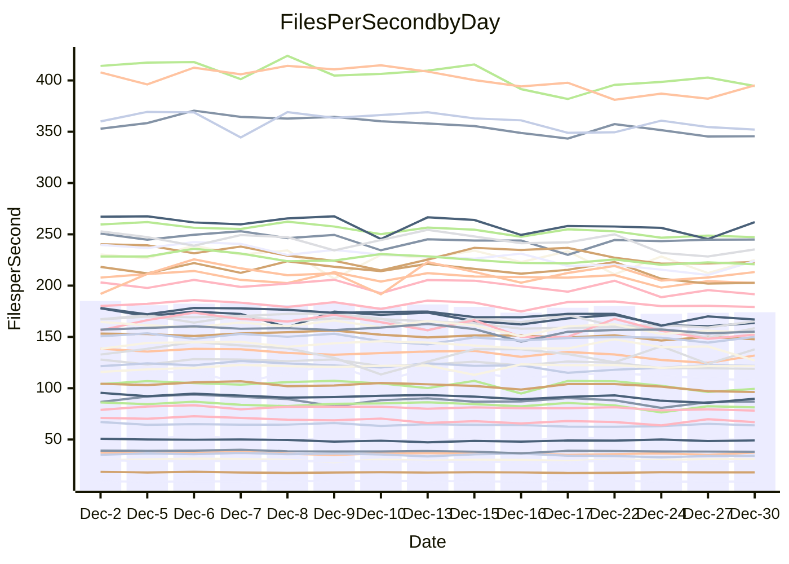

<!---
# This file is auto-generated. Do not edit.
# cspell:disable
--->
# Performance Report

## Daily Performance

## Time to Process Files

| Repository                                      | Elapsed | Min/Avg/Max           |   SD | SD Graph                |
| ----------------------------------------------- | ------: | :-------------------: | ---: | ----------------------- |
| AdaDoom3/AdaDoom3                    |    3.02 | 2.8 /   2.9 /   3.2   | 0.11 | `    ┣━━┻━━╋━●┻━━┫    ` |
| alexiosc/megistos                    |    7.16 | 6.7 /   7.0 /   7.7   | 0.28 | `    ┣━━┻━━╋━●┻━━┫    ` |
| apollographql/apollo-server          |    2.29 | 2.0 /   2.2 /   2.4   | 0.08 | `     ┣━┻━━╋━━●━┫     ` |
| aspnetboilerplate/aspnetboilerplate  |    9.66 | 8.8 /   9.2 /  10.0   | 0.31 | `    ┣━━┻━━╋━━┻●━┫    ` |
| aws-amplify/docs                     |   11.75 | 11.3 /  11.7 /  12.4  | 0.29 | `    ┣━━┻━━╋●━┻━━┫    ` |
| Azure/azure-rest-api-specs           |   15.49 | 13.8 /  15.0 /  17.0  | 0.84 | `   ┣━━━┻━━╋━●┻━━━┫   ` |
| bitjson/typescript-starter           |    0.64 | 0.6 /   0.7 /   0.7   | 0.02 | `     ┣━●┻━╋━┻━━┫     ` |
| caddyserver/caddy                    |    3.21 | 2.9 /   3.2 /   3.7   | 0.16 | `    ┣━━┻━━╋●━┻━━┫    ` |
| canada-ca/open-source-logiciel-libre |    0.77 | 0.7 /   0.8 /   0.8   | 0.02 | `     ┣━━┻━╋●┻━━┫     ` |
| chef/chef                            |    5.30 | 5.0 /   5.3 /   5.8   | 0.21 | `    ┣━━┻━━●━━┻━━┫    ` |
| dart-lang/sdk                        |   58.79 | 55.5 /  58.3 /  62.8  | 1.87 | `  ┣━━━┻━━━╋●━━┻━━━┫  ` |
| django/django                        |   14.46 | 13.4 /  14.1 /  15.5  | 0.52 | `   ┣━━━┻━━╋━●┻━━━┫   ` |
| eslint/eslint                        |   10.22 | 9.2 /   9.8 /  10.9   | 0.33 | `    ┣━━┻━━╋━━┻●━┫    ` |
| exonum/exonum                        |    3.00 | 2.9 /   3.1 /   3.7   | 0.20 | `    ┣━━┻●━╋━━┻━━┫    ` |
| flutter/samples                      |   17.26 | 15.0 /  16.5 /  18.1  | 0.68 | `   ┣━━━┻━━╋━━┻●━━┫   ` |
| gitbucket/gitbucket                  |    3.13 | 2.9 /   3.1 /   3.3   | 0.10 | `    ┣━━┻━━╋●━┻━━┫    ` |
| googleapis/google-cloud-cpp          |  130.55 | 117.0 / 123.9 / 133.5 | 4.47 | `  ┣━━━┻━━━╋━━━┻━●━┫  ` |
| graphql/express-graphql              |    0.70 | 0.7 /   0.7 /   0.8   | 0.02 | `     ┣━━●━╋━┻━━┫     ` |
| graphql/graphql-js                   |    2.19 | 2.1 /   2.2 /   2.4   | 0.07 | `     ┣━┻━━╋●━┻━┫     ` |
| graphql/graphql-relay-js             |    0.74 | 0.7 /   0.7 /   0.8   | 0.02 | `     ┣━━┻━╋━●━━┫     ` |
| graphql/graphql-spec                 |    0.84 | 0.8 /   0.8 /   0.9   | 0.02 | `     ┣━━┻━╋●┻━━┫     ` |
| iluwatar/java-design-patterns        |   11.20 | 10.3 /  11.1 /  13.6  | 0.61 | `    ┣━━┻━━╋●━┻━━┫    ` |
| ktaranov/sqlserver-kit               |    6.28 | 5.8 /   6.0 /   6.3   | 0.15 | `    ┣━━┻━━╋━━┻━●┫    ` |
| liriliri/licia                       |    3.60 | 3.2 /   3.5 /   3.8   | 0.11 | `    ┣━━┻━━╋━●┻━━┫    ` |
| MartinThoma/LaTeX-examples           |    6.38 | 6.0 /   6.2 /   6.5   | 0.12 | `    ┣━━┻━━╋━━●━━┫    ` |
| mdx-js/mdx                           |    1.61 | 1.5 /   1.6 /   1.7   | 0.05 | `     ┣━┻━━╋━━●━┫     ` |
| microsoft/TypeScript-Website         |    4.98 | 4.7 /   5.1 /   5.3   | 0.15 | `    ┣━━┻●━╋━━┻━━┫    ` |
| MicrosoftDocs/PowerShell-Docs        |   19.22 | 17.6 /  18.7 /  25.8  | 1.44 | `   ┣━━━┻━━╋●━┻━━━┫   ` |
| neovim/nvim-lspconfig                |    3.07 | 2.8 /   3.0 /   3.2   | 0.10 | `    ┣━━┻━━╋━●┻━━┫    ` |
| pagekit/pagekit                      |    3.51 | 3.0 /   3.2 /   3.8   | 0.16 | `    ┣━━┻━━╋━━┻━●┫    ` |
| php/php-src                          |   22.78 | 19.9 /  21.4 /  24.9  | 1.10 | `   ┣━━━┻━━╋━━┻●━━┫   ` |
| plasticrake/tplink-smarthome-api     |    0.91 | 0.8 /   0.9 /   1.0   | 0.04 | `     ┣━┻━━╋●━┻━┫     ` |
| prettier/prettier                    |    6.43 | 5.9 /   6.2 /   6.4   | 0.17 | `    ┣━━┻━━╋━━┻━●┫    ` |
| pycontribs/jira                      |    1.21 | 1.2 /   1.2 /   1.3   | 0.03 | `     ┣━┻●━╋━━┻━┫     ` |
| RustPython/RustPython                |    4.22 | 3.9 /   4.1 /   4.4   | 0.12 | `    ┣━━┻━━╋━━●━━┫    ` |
| shoelace-style/shoelace              |    2.38 | 2.3 /   2.4 /   2.5   | 0.06 | `     ┣━┻●━╋━━┻━┫     ` |
| slint-ui/slint                       |    9.97 | 8.4 /   9.1 /  10.1   | 0.36 | `    ┣━━┻━━╋━━┻━━┫ ●  ` |
| SoftwareBrothers/admin-bro           |    2.09 | 2.0 /   2.1 /   2.3   | 0.09 | `     ┣━┻━━●━━┻━┫     ` |
| sveltejs/svelte                      |   18.05 | 16.9 /  17.8 /  18.9  | 0.54 | `   ┣━━━┻━━╋━●┻━━━┫   ` |
| TheAlgorithms/Python                 |    5.33 | 4.9 /   5.2 /   5.7   | 0.19 | `    ┣━━┻━━╋━●┻━━┫    ` |
| twbs/bootstrap                       |    1.24 | 1.1 /   1.2 /   1.4   | 0.06 | `     ┣━┻━━╋━━●━┫     ` |
| typescript-cheatsheets/react         |    1.09 | 1.0 /   1.1 /   1.1   | 0.03 | `     ┣━┻━━╋●━┻━┫     ` |
| typescript-eslint/typescript-eslint  |    3.64 | 3.4 /   3.5 /   3.7   | 0.08 | `    ┣━━┻━━╋━━┻━●┫    ` |
| vitest-dev/vitest                    |    7.95 | 6.9 /   7.4 /   8.1   | 0.28 | `    ┣━━┻━━╋━━┻━━●    ` |
| w3c/aria-practices                   |    3.24 | 2.7 /   2.9 /   3.1   | 0.10 | `     ┣━┻━━╋━━┻━┫    ●` |
| w3c/specberus                        |    1.65 | 1.6 /   1.6 /   1.7   | 0.04 | `     ┣━┻━━╋●━┻━┫     ` |
| webdeveric/webpack-assets-manifest   |    0.65 | 0.6 /   0.7 /   0.7   | 0.01 | `     ┣━●┻━╋━┻━━┫     ` |
| webpack/webpack                      |    4.91 | 4.4 /   4.7 /   5.3   | 0.20 | `    ┣━━┻━━╋━━●━━┫    ` |
| wireapp/wire-desktop                 |    0.86 | 0.8 /   0.9 /   0.9   | 0.03 | `     ┣━┻━━●━━┻━┫     ` |
| wireapp/wire-webapp                  |    8.12 | 7.3 /   7.9 /   8.4   | 0.33 | `    ┣━━┻━━╋━●┻━━┫    ` |

Note:
- Elapsed time is in seconds.

## Files per Second over Time

| Repository                                      | Files |    Sec |    Fps |     Rel | Trend Fps              |    N |
| ----------------------------------------------- | ----: | -----: | -----: | ------: | ---------------------- | ---: |
| AdaDoom3/AdaDoom3                    |   103 |   3.02 |  34.13 |  -3.28% | `█▇██▇▅▇▇▇▇▇█▆▅▄▄▆▅▆▆` |   27 |
| alexiosc/megistos                    |   583 |   7.16 |  81.44 |  -2.42% | `▆█▄▇▇█▇█▆▇▇▆█▇▄▄▆▇▆▆` |   27 |
| apollographql/apollo-server          |   250 |   2.29 | 109.12 |  -3.98% | `▇▆█▄▇▆▆▆▇▅▄▅▆▆▅▅▅▄▄▄` |   29 |
| aspnetboilerplate/aspnetboilerplate  |  2246 |   9.66 | 232.42 |  -4.59% | `▇▇█▅▇██▇▆▇▇▆▆▇▆▄▅▄▆▅` |   27 |
| aws-amplify/docs                     |  2863 |  11.75 | 243.57 |  -0.52% | `▇██▅▇███▅█▆█▅▇▇▇▇██▇` |   29 |
| Azure/azure-rest-api-specs           |  2411 |  15.49 | 155.62 |  -3.22% | `▇▇█▆▅██▅▆▅▃▄▄▇▅▅▃▄▄▅` |   29 |
| bitjson/typescript-starter           |    20 |   0.64 |  31.40 |   3.85% | `▆█▆▄▇▅▆▆▇▇▆▇▆▇▇▆██▇█` |   27 |
| caddyserver/caddy                    |   279 |   3.21 |  86.99 |  -1.32% | `▇▇▅▇▇██▃▆█▆▅▇▇▅▄▆▆▆▆` |   29 |
| canada-ca/open-source-logiciel-libre |     7 |   0.77 |   9.07 |  -1.21% | `▇▆▆▇▇▇▅▆▇▇▄▆▇█▄▅▆▅▅▅` |   27 |
| chef/chef                            |  1204 |   5.30 | 227.09 |  -0.04% | `▇█▇▃▇▆█▇▇▇▅▆▇▄▆▇▅▃▆▆` |   28 |
| dart-lang/sdk                        | 10026 |  58.79 | 170.55 |  -0.67% | `██▇██▆▇▆▇█▆▆▇▇▅▄▆▇▅▇` |   29 |
| django/django                        |  2817 |  14.46 | 194.79 |  -2.30% | `▆▇█▅███▇▇▇▆▇▆█▄▆▆▆▅▆` |   29 |
| eslint/eslint                        |  2038 |  10.22 | 199.38 |  -3.92% | `▇▄█▆███▆▇█▇▇▇█▆▅▇▆▇▆` |   29 |
| exonum/exonum                        |   421 |   3.00 | 140.53 |   4.01% | `▆█▇▅▃▅▅██▇█▆▆▅▇█▄▅▆▇` |   27 |
| flutter/samples                      |  2690 |  17.26 | 155.89 |  -4.66% | `▆███▇▆█▆▇▄▆▇▆▆▆▆▄▄▆▅` |   29 |
| gitbucket/gitbucket                  |   412 |   3.13 | 131.51 |  -1.69% | `▆▆▇▇▇███▇▇▆▅▇▇▄▆▄▄▆▆` |   29 |
| googleapis/google-cloud-cpp          | 19742 | 130.55 | 151.22 |  -5.19% | `▇▇█▆▇▇█▄▇▅▄▄▆▇▅▅▆▅▆▄` |   29 |
| graphql/express-graphql              |    26 |   0.70 |  37.25 |   2.38% | `▇▇▇▆▇▇█▇█▆▇█▆▆▇█▇▄██` |   27 |
| graphql/graphql-js                   |   339 |   2.19 | 155.07 |  -0.83% | `█▇▇▇██▆▆█▅▄▄▆▇▆▇▆▆▇▆` |   28 |
| graphql/graphql-relay-js             |    28 |   0.74 |  37.75 |  -1.93% | `██▆▇▇███▆▅▅▅█▇▇██▆▇▆` |   27 |
| graphql/graphql-spec                 |    15 |   0.84 |  17.76 |  -0.99% | `█▅▄▇▇▆█▇█▇▇▇▆▆▇▇▆█▇▆` |   27 |
| iluwatar/java-design-patterns        |  1849 |  11.20 | 165.09 |  -1.22% | `▂████▆█▇▆▆▇▆▇█▇▆▆▆▆▇` |   29 |
| ktaranov/sqlserver-kit               |   489 |   6.28 |  77.92 |  -3.71% | `██▇▇▆█▇▇▆▅▇█▇▇▆▅▆▆▅▅` |   28 |
| liriliri/licia                       |  1434 |   3.60 | 398.85 |  -2.40% | `▆▆█▅▅▆▆▇▅▇▄▄▃▅▅▅▅▅▄▅` |   28 |
| MartinThoma/LaTeX-examples           |  1409 |   6.38 | 220.89 |  -2.08% | `█▅▇▇███▆▇▆▆▆▆▇▆▅▆▆▆▆` |   27 |
| mdx-js/mdx                           |   142 |   1.61 |  88.21 |  -3.30% | `▇▇▇▇███▆▇█▇▆▇█▅▆▆▄▇▆` |   27 |
| microsoft/TypeScript-Website         |   757 |   4.98 | 151.99 |   1.67% | `▇█▇█▆▅▇▆▇█▆▆▇▇█▆▅▆▇█` |   27 |
| MicrosoftDocs/PowerShell-Docs        |  2232 |  19.22 | 116.11 |  -3.01% | `▇█▇▇▇█▇▇▂██▇▇▇▇▇▇▇█▆` |   29 |
| neovim/nvim-lspconfig                |   372 |   3.07 | 121.17 |  -2.25% | `▇▇▇▆▆█▇▆▇▆▆▆▇▇▄▆▄▆▄▆` |   29 |
| pagekit/pagekit                      |   741 |   3.51 | 211.30 |  -7.76% | `▆▆█▇▇▆▅▆▇▇▇▆▅▅▅▄▆▃▇▄` |   27 |
| php/php-src                          |  2213 |  22.78 |  97.16 |  -6.30% | `▇██▇▆█▇▇█▆▃▄█▇▆▆▆▃▆▅` |   29 |
| plasticrake/tplink-smarthome-api     |    62 |   0.91 |  67.76 |  -1.15% | `▇██▇█▆█▆▇▇▅▆▇▇▇▃▇█▆▇` |   27 |
| prettier/prettier                    |  2202 |   6.43 | 342.51 |  -3.71% | `████▇██▆▆▅▆▇▅▇▇▆▆▅▆▅` |   29 |
| pycontribs/jira                      |    80 |   1.21 |  65.90 |   2.40% | `▆█▅▇▆▇▄▇█▆▆▆▅▅▄▆▇▇▅▇` |   28 |
| RustPython/RustPython                |   621 |   4.22 | 147.06 |  -3.04% | `▇▇█▇▆█▄██▇▇▇▆▇▅▆▆▇▆▆` |   29 |
| shoelace-style/shoelace              |   438 |   2.38 | 183.93 |   1.66% | `▇▅▇▆██▇▇▇▅▆▆██▆▇▇▆▅▇` |   29 |
| slint-ui/slint                       |  1954 |   9.97 | 196.02 |  -8.62% | `▇█▇▆▇▇▅▆▇▄▇▆▆▇▅▅▅▃▅▃` |   29 |
| SoftwareBrothers/admin-bro           |   441 |   2.09 | 211.38 |   0.48% | `▆▆▆▆▃██▆▅▇▄▆▆▇▆▄▅▆▇▆` |   27 |
| sveltejs/svelte                      |  7122 |  18.05 | 394.65 |  -1.24% | `████▇█▆▅▆▆▆▆▆▅▅▅▅▅▆▆` |   29 |
| TheAlgorithms/Python                 |  1361 |   5.33 | 255.54 |  -1.99% | `█▆▇▄▇▇█▆▆▅▆▄▆▆▆▆▄▅▇▆` |   29 |
| twbs/bootstrap                       |   120 |   1.24 |  96.50 |  -5.38% | `█▆▇▇▇█▅▇▇█▃▆▇▇█▅▅▅▅▅` |   28 |
| typescript-cheatsheets/react         |    53 |   1.09 |  48.70 |  -1.02% | `█▅▇▅▆▅▇▆▅▆▅▆▆▆▇▇▆▅▇▆` |   27 |
| typescript-eslint/typescript-eslint  |  1273 |   3.64 | 349.31 |  -3.58% | `▇█▇████▆▆█▆▇▅▅▇▆▆▆▆▅` |   29 |
| vitest-dev/vitest                    |  1936 |   7.95 | 243.41 |  -4.64% | `█▇▇▆▇█▆▆▇▇▆▄▇▆▆▅▆▆▆▅` |   29 |
| w3c/aria-practices                   |   405 |   3.24 | 125.16 | -11.58% | `█▇▇█▇█▇▆▆▆▅▇▆█▆▆▇▆▄▃` |   28 |
| w3c/specberus                        |   200 |   1.65 | 121.39 |  -0.72% | `▇█▇▆█▆▇▇▇▇▇▆▄▅▅▇▇▇▇▇` |   29 |
| webdeveric/webpack-assets-manifest   |    19 |   0.65 |  29.38 |   2.41% | `▇▇▆▆▆▆▇▅▅▆▅▆▅█▆▇▆▅▇▇` |   27 |
| webpack/webpack                      |  1095 |   4.91 | 222.96 |  -3.83% | `▇█▅▄▆▇▇▇▇█▆▇▇▆▅▅▄▆▅▅` |   29 |
| wireapp/wire-desktop                 |    43 |   0.86 |  50.23 |   0.11% | `▄▆▇▆▆█▅▇▅▅▅▅█▇▄▆▆▆▆▆` |   29 |
| wireapp/wire-webapp                  |  1337 |   8.12 | 164.74 |  -1.33% | `█▇█▆▄▇█▅▆▆▆▅▇▅▅▅▅▅▆▆` |   29 |

## Data Throughput

| Repository                                      | Files |    Sec |     Kps |     Rel | Trend Kps              |    N |
| ----------------------------------------------- | ----: | -----: | ------: | ------: | ---------------------- | ---: |
| AdaDoom3/AdaDoom3                    |   103 |   3.02 |  725.28 |  -3.28% | `█▇██▇▅▇▇▇▇▇█▆▅▄▄▆▅▆▆` |   27 |
| alexiosc/megistos                    |   583 |   7.16 |  639.95 |  -2.42% | `▆█▄▇▇█▇█▆▇▇▆█▇▄▄▆▇▆▆` |   27 |
| apollographql/apollo-server          |   250 |   2.29 |  872.95 |  -3.78% | `▇▆█▄▇▆▆▆▇▅▄▅▆▆▅▅▅▄▄▅` |   29 |
| aspnetboilerplate/aspnetboilerplate  |  2246 |   9.66 |  546.80 |  -4.59% | `▇▇█▅▇██▇▆▇▇▆▆▇▆▄▅▄▆▅` |   27 |
| aws-amplify/docs                     |  2863 |  11.75 |  834.57 |  -0.13% | `▆██▅▇███▅█▆█▅▇▇▇▇██▇` |   29 |
| Azure/azure-rest-api-specs           |  2411 |  15.49 |  448.28 |  -3.17% | `▇▇█▆▅██▅▆▅▃▄▄▇▅▅▃▄▄▅` |   29 |
| bitjson/typescript-starter           |    20 |   0.64 |  125.60 |   3.85% | `▆█▆▄▇▅▆▆▇▇▆▇▆▇▇▆██▇█` |   27 |
| caddyserver/caddy                    |   279 |   3.21 |  724.27 |  -1.03% | `▇▇▅▇▇██▃▆█▆▅▇▇▅▄▆▆▆▆` |   29 |
| canada-ca/open-source-logiciel-libre |     7 |   0.77 |   75.13 |  -1.21% | `▇▆▆▇▇▇▅▆▇▇▄▆▇█▄▅▆▅▅▅` |   27 |
| chef/chef                            |  1204 |   5.30 | 1043.04 |  -0.04% | `▇█▇▃▇▆█▇▇▇▅▆▇▄▆▇▅▃▆▆` |   28 |
| dart-lang/sdk                        | 10026 |  58.79 | 1218.06 |  -0.62% | `██▇▇█▆▇▆▇█▆▆▇▇▅▄▆▇▅▇` |   29 |
| django/django                        |  2817 |  14.46 | 1204.02 |  -2.15% | `▆▇█▅███▇▇▇▆▇▆█▄▆▆▆▅▆` |   29 |
| eslint/eslint                        |  2038 |  10.22 | 1628.70 |  -3.75% | `▇▄█▆███▆▇█▇▇▇█▆▅▇▇▇▆` |   29 |
| exonum/exonum                        |   421 |   3.00 | 1344.25 |   4.01% | `▆█▇▅▃▅▅██▇█▆▆▅▇█▄▅▆▇` |   27 |
| flutter/samples                      |  2690 |  17.26 | 1262.69 |  -4.66% | `▆███▇▆█▆▇▄▆▇▆▆▆▆▄▄▆▅` |   29 |
| gitbucket/gitbucket                  |   412 |   3.13 |  595.00 |  -1.65% | `▆▆▇▇▇███▇▇▆▄▇▇▄▆▄▄▆▆` |   29 |
| googleapis/google-cloud-cpp          | 19742 | 130.55 | 1181.76 |  -5.05% | `▇▇█▆▇▇█▄▇▅▄▄▆▇▅▅▆▅▆▄` |   29 |
| graphql/express-graphql              |    26 |   0.70 |  170.51 |   2.38% | `▇▇▇▆▇▇█▇█▆▇█▆▆▇█▇▄██` |   27 |
| graphql/graphql-js                   |   339 |   2.19 |  881.01 |  -0.83% | `█▇▇▇██▆▆█▅▄▄▆▇▆▇▆▆▇▆` |   28 |
| graphql/graphql-relay-js             |    28 |   0.74 |  148.29 |  -1.93% | `██▆▇▇███▆▅▅▅█▇▇██▆▇▆` |   27 |
| graphql/graphql-spec                 |    15 |   0.84 |  653.45 |  -0.91% | `█▅▄▇▇▇█▇█▇▇▇▆▆▇▇▆█▇▆` |   27 |
| iluwatar/java-design-patterns        |  1849 |  11.20 |  508.76 |  -1.20% | `▂████▆█▇▆▆▇▆▇█▇▆▆▆▆▇` |   29 |
| ktaranov/sqlserver-kit               |   489 |   6.28 | 1178.76 |  -3.72% | `██▇▇▆█▇▇▆▅▇█▇▇▆▅▆▆▅▅` |   28 |
| liriliri/licia                       |  1434 |   3.60 |  472.56 |  -2.40% | `▆▆█▅▅▆▆▇▅▇▄▄▃▅▅▅▅▅▄▅` |   28 |
| MartinThoma/LaTeX-examples           |  1409 |   6.38 |  456.21 |  -2.08% | `█▅▇▇███▆▇▆▆▆▆▇▆▅▆▆▆▆` |   27 |
| mdx-js/mdx                           |   142 |   1.61 |  409.35 |  -3.30% | `▇▇▇▇███▆▇█▇▆▇█▅▆▆▄▇▆` |   27 |
| microsoft/TypeScript-Website         |   757 |   4.98 | 1040.84 |   1.67% | `▇█▇█▆▅▇▆▇█▆▆▇▇█▆▅▆▇█` |   27 |
| MicrosoftDocs/PowerShell-Docs        |  2232 |  19.22 | 1159.26 |  -2.92% | `▇▇▇▇▇█▇▇▂██▇▇▇▇▇▇▇█▆` |   29 |
| neovim/nvim-lspconfig                |   372 |   3.07 |  316.61 |  -1.63% | `▇▇▇▆▆█▇▆▇▆▆▆▇▇▅▆▄▆▅▆` |   29 |
| pagekit/pagekit                      |   741 |   3.51 |  440.57 |  -7.76% | `▆▆█▇▇▆▅▆▇▇▇▆▅▅▅▄▆▃▇▄` |   27 |
| php/php-src                          |  2213 |  22.78 | 1422.33 |  -6.27% | `▇██▇▆█▇▇█▆▃▄█▇▆▆▆▃▆▅` |   29 |
| plasticrake/tplink-smarthome-api     |    62 |   0.91 |  366.13 |  -1.15% | `▇██▇█▆█▆▇▇▅▆▇▇▇▃▇█▆▇` |   27 |
| prettier/prettier                    |  2202 |   6.43 |  483.28 |  -4.01% | `████▇██▆▆▅▇▇▅▇▇▆▆▅▆▅` |   29 |
| pycontribs/jira                      |    80 |   1.21 |  453.89 |   2.40% | `▆█▅▇▆▇▄▇█▆▆▆▅▅▄▆▇▇▅▇` |   28 |
| RustPython/RustPython                |   621 |   4.22 | 1085.52 |  -2.92% | `▇▇█▇▆█▄██▇▇▇▆▇▅▆▆▇▆▆` |   29 |
| shoelace-style/shoelace              |   438 |   2.38 |  883.11 |   1.74% | `▆▅▇▆██▇▇▇▅▆▆██▆▇▇▆▅▇` |   29 |
| slint-ui/slint                       |  1954 |   9.97 | 1006.07 |  -8.28% | `▇█▆▆▇▇▅▆▇▅▇▆▆▇▅▅▆▃▅▄` |   29 |
| SoftwareBrothers/admin-bro           |   441 |   2.09 |  465.91 |   0.48% | `▆▆▆▆▃██▆▅▇▄▆▆▇▆▄▅▆▇▆` |   27 |
| sveltejs/svelte                      |  7122 |  18.05 |  259.33 |  -2.03% | `████▇█▇▆▆▅▅▅▆▄▅▅▄▄▅▅` |   29 |
| TheAlgorithms/Python                 |  1361 |   5.33 |  648.53 |  -1.72% | `█▆▇▄▇▇█▆▇▅▆▄▆▆▆▆▄▅▇▆` |   29 |
| twbs/bootstrap                       |   120 |   1.24 |  774.41 |  -5.38% | `█▆▇▇▇█▅▇▇█▃▆▇▇█▅▅▅▅▅` |   28 |
| typescript-cheatsheets/react         |    53 |   1.09 |  356.49 |  -1.02% | `█▅▇▅▆▅▇▆▅▆▅▆▆▆▇▇▆▅▇▆` |   27 |
| typescript-eslint/typescript-eslint  |  1273 |   3.64 | 1669.71 |  -2.98% | `▇█▇████▆▆█▆▇▅▆▇▇▇▆▆▆` |   29 |
| vitest-dev/vitest                    |  1936 |   7.95 |  502.04 |  -4.26% | `█▇▇▆▇█▆▆▇▇▇▄▇▇▆▆▆▇▇▅` |   29 |
| w3c/aria-practices                   |   405 |   3.24 | 1162.25 | -11.82% | `█▇▇█▇█▇▆▆▆▅▇▆█▆▆▇▆▄▃` |   28 |
| w3c/specberus                        |   200 |   1.65 |  387.25 |  -0.72% | `▇█▇▆█▆▇▇▇▇▇▆▄▅▅▇▇▇▇▇` |   29 |
| webdeveric/webpack-assets-manifest   |    19 |   0.65 |  157.70 |   2.41% | `▇▇▆▆▆▆▇▅▅▆▅▆▅█▆▇▆▅▇▇` |   27 |
| webpack/webpack                      |  1095 |   4.91 |  983.67 |  -3.80% | `▇█▅▄▆▇▇▇▇▇▆▇▇▆▅▅▄▆▅▅` |   29 |
| wireapp/wire-desktop                 |    43 |   0.86 |  221.94 |   0.33% | `▄▆▇▆▆█▅▇▅▅▅▅█▇▄▆▆▆▆▆` |   29 |
| wireapp/wire-webapp                  |  1337 |   8.12 |  666.60 |  -1.94% | `███▆▄▇█▅▆▆▆▅▇▅▅▅▄▄▆▆` |   29 |

