<!---
# This file is auto-generated. Do not edit.
# cspell:disable
--->
# Performance Report

## Daily Performance

```mermaid
xychart-beta
    title Files Per Second by Day
    y-axis Files per Second
    x-axis Date [Feb-9, Feb-10, Feb-11, Feb-12, Feb-16, Feb-17, Feb-18, Feb-19, Feb-22, Feb-23, Feb-24, Mar-1, Mar-2, Mar-3, Mar-4, Mar-5, Mar-9, Mar-10, Mar-11]
    bar [176.68, 172.01, 170.80, 172.59, 172.20, 169.11, 168.97, 169.87, 173.10, 169.52, 187.14, 175.84, 172.73, 171.17, 172.84, 172.51, 173.87, 166.90, 169.93]
    line [9.39, 9.10, 8.79, 9.11, 8.93, 8.64, 9.05, 8.51, 8.78, 8.98, 0.00, 8.08, 9.30, 9.23, 7.01, 8.99, 8.93, 9.19, 8.79]
    line [16.74, 16.81, 17.17, 15.81, 18.35, 18.08, 17.18, 16.76, 17.88, 18.10, 0.00, 18.36, 17.88, 17.67, 18.26, 17.81, 17.74, 17.16, 17.11]
    line [87.06, 84.92, 87.81, 86.69, 87.24, 85.15, 85.90, 85.00, 87.17, 77.95, 85.83, 91.39, 87.06, 85.30, 90.77, 85.14, 86.59, 87.51, 85.95]
    line [121.84, 129.06, 122.93, 124.68, 125.50, 128.25, 133.90, 127.83, 131.88, 135.36, 0.00, 136.13, 127.67, 129.13, 115.21, 128.04, 132.28, 131.12, 129.18]
    line [110.94, 109.21, 107.83, 106.68, 110.60, 103.95, 102.58, 106.20, 108.99, 106.23, 104.62, 109.75, 110.24, 105.98, 105.75, 109.38, 110.31, 100.38, 101.13]
    line [68.29, 67.95, 63.94, 63.10, 68.79, 65.40, 66.62, 66.45, 66.78, 68.09, 0.00, 66.08, 65.18, 64.75, 67.04, 66.56, 68.95, 64.38, 67.05]
    line [388.50, 387.75, 391.57, 373.53, 385.59, 389.88, 390.09, 378.81, 388.65, 389.04, 0.00, 385.97, 393.17, 367.25, 390.49, 394.48, 381.72, 394.91, 384.80]
    line [83.52, 82.54, 80.25, 85.24, 86.74, 82.84, 86.83, 81.45, 81.71, 81.96, 83.41, 83.27, 86.38, 83.49, 87.00, 81.33, 81.73, 85.99, 76.90]
    line [214.35, 200.27, 199.54, 204.14, 192.69, 201.75, 206.87, 197.87, 196.25, 209.40, 0.00, 195.54, 202.38, 202.85, 191.42, 202.51, 196.24, 197.11, 203.09]
    line [124.62, 123.31, 125.03, 120.42, 129.98, 129.47, 127.87, 128.69, 128.42, 128.71, 124.50, 130.30, 127.54, 126.59, 125.97, 127.42, 130.71, 121.58, 124.87]
    line [23.26, 29.91, 29.82, 30.05, 30.35, 28.52, 29.28, 29.65, 29.97, 29.42, 0.00, 30.75, 30.31, 29.86, 29.01, 30.05, 30.13, 30.67, 29.16]
    line [150.09, 144.64, 141.32, 141.68, 136.63, 142.32, 134.55, 145.82, 147.42, 139.34, 152.31, 150.56, 146.06, 142.81, 149.97, 143.38, 146.63, 143.67, 145.16]
    line [77.47, 76.02, 78.07, 71.09, 77.64, 74.87, 74.07, 74.98, 76.63, 78.24, 0.00, 74.50, 78.01, 75.53, 75.91, 76.37, 76.74, 78.07, 78.26]
    line [34.51, 36.01, 35.10, 35.21, 35.98, 34.82, 36.43, 35.46, 35.84, 36.34, 0.00, 33.04, 35.60, 35.46, 35.33, 35.02, 35.68, 36.33, 35.45]
    line [36.62, 36.71, 35.21, 36.78, 37.62, 37.74, 36.57, 37.30, 38.24, 36.77, 0.00, 38.95, 36.53, 38.39, 38.51, 36.98, 37.01, 37.24, 37.52]
    line [142.75, 143.10, 145.82, 143.11, 140.65, 144.98, 130.98, 140.65, 142.78, 139.39, 0.00, 143.34, 144.48, 139.23, 149.02, 142.27, 141.04, 131.48, 143.36]
    line [62.64, 63.65, 63.88, 60.68, 64.42, 62.12, 63.28, 58.66, 63.36, 62.75, 0.00, 62.13, 62.93, 61.84, 62.40, 65.57, 65.33, 60.32, 63.52]
    line [216.99, 208.40, 212.31, 208.84, 217.81, 211.80, 185.28, 215.46, 218.06, 220.51, 0.00, 217.03, 216.54, 214.05, 215.67, 214.99, 210.27, 209.48, 209.49]
    line [81.63, 78.70, 79.41, 80.42, 80.99, 80.08, 80.78, 76.61, 79.69, 77.15, 0.00, 81.09, 79.76, 76.55, 78.66, 78.03, 82.22, 76.26, 78.64]
    line [199.43, 190.33, 187.01, 193.91, 197.53, 192.34, 207.35, 190.87, 203.05, 198.23, 203.08, 201.82, 199.42, 191.77, 205.08, 185.92, 189.34, 196.04, 187.43]
    line [180.37, 179.50, 169.53, 174.82, 178.71, 168.06, 176.19, 177.57, 176.95, 181.84, 0.00, 179.55, 179.86, 167.73, 180.24, 173.20, 171.32, 173.38, 171.21]
    line [339.36, 335.43, 338.51, 330.30, 316.59, 330.53, 328.24, 334.55, 334.07, 337.95, 311.68, 337.70, 337.83, 327.94, 349.03, 342.19, 347.05, 332.14, 329.71]
    line [221.01, 216.87, 215.38, 220.23, 212.12, 219.37, 215.84, 210.18, 221.20, 215.57, 0.00, 213.93, 216.92, 221.14, 217.96, 220.33, 218.26, 203.06, 214.20]
    line [119.99, 116.03, 111.12, 110.27, 121.81, 115.35, 117.70, 117.45, 119.10, 115.72, 108.80, 112.87, 116.15, 114.50, 112.51, 113.94, 120.60, 113.49, 116.90]
    line [48.05, 47.30, 43.46, 46.02, 48.76, 47.89, 47.85, 48.05, 47.61, 47.20, 0.00, 48.02, 48.37, 47.65, 47.63, 47.32, 48.85, 48.14, 47.21]
    line [348.75, 351.19, 348.15, 346.62, 351.78, 343.88, 338.94, 349.19, 345.47, 339.39, 338.55, 349.45, 341.50, 347.71, 346.09, 326.09, 344.65, 341.47, 307.11]
    line [244.14, 228.71, 227.46, 228.82, 232.02, 224.80, 222.16, 236.53, 233.14, 236.87, 233.63, 236.34, 235.42, 223.75, 229.84, 238.57, 233.78, 235.19, 227.40]
    line [223.42, 222.08, 213.20, 215.50, 225.73, 187.50, 197.59, 213.32, 219.03, 225.40, 210.70, 230.59, 216.76, 206.01, 205.57, 226.86, 221.73, 221.35, 207.32]
    line [152.93, 151.27, 147.55, 140.92, 151.13, 151.76, 153.31, 151.18, 149.85, 150.69, 151.72, 152.23, 147.00, 150.12, 141.68, 146.96, 150.72, 155.73, 150.29]
    line [211.91, 205.36, 214.41, 205.57, 188.86, 196.47, 206.41, 197.46, 200.43, 203.43, 204.23, 205.42, 199.64, 182.37, 195.42, 194.44, 203.49, 183.39, 199.91]
    line [100.35, 99.46, 93.91, 99.01, 106.34, 93.17, 91.86, 97.86, 99.22, 96.08, 99.35, 97.75, 100.18, 94.61, 96.31, 97.57, 101.86, 95.28, 97.64]
    line [196.80, 192.49, 195.28, 196.29, 194.83, 188.10, 194.84, 192.66, 195.15, 192.32, 198.30, 195.10, 193.76, 188.01, 197.96, 192.68, 193.75, 175.32, 188.83]
    line [34.38, 31.28, 33.43, 33.24, 30.53, 33.31, 33.04, 33.28, 33.21, 33.17, 0.00, 33.83, 33.53, 33.62, 33.49, 33.14, 33.95, 33.62, 33.21]
    line [251.24, 247.36, 235.88, 244.92, 253.98, 247.84, 251.30, 245.99, 243.93, 233.93, 249.19, 248.13, 243.87, 237.66, 247.42, 254.95, 243.47, 243.03, 242.75]
    line [174.04, 154.30, 162.65, 156.66, 162.87, 159.96, 155.64, 155.90, 161.77, 147.50, 158.41, 164.95, 162.21, 159.97, 150.74, 160.22, 161.10, 161.51, 153.42]
    line [222.49, 222.54, 219.50, 226.16, 240.10, 228.96, 219.08, 223.33, 223.11, 227.19, 232.41, 236.43, 227.34, 214.20, 217.68, 225.52, 228.25, 225.18, 224.95]
    line [157.97, 156.56, 158.71, 155.41, 159.62, 150.02, 150.05, 151.55, 155.58, 158.55, 157.69, 158.64, 155.43, 153.65, 155.50, 156.87, 155.88, 143.12, 150.16]
    line [118.43, 117.39, 122.51, 116.51, 115.88, 120.25, 110.42, 115.69, 117.45, 119.97, 115.23, 122.06, 119.72, 118.69, 123.95, 122.72, 121.57, 124.24, 120.72]
    line [104.96, 94.67, 90.15, 101.17, 99.92, 94.76, 95.38, 95.32, 97.68, 93.94, 94.07, 99.29, 97.25, 94.72, 101.26, 100.51, 101.14, 99.01, 98.82]
    line [251.69, 234.31, 244.51, 240.78, 255.22, 243.34, 248.23, 244.44, 238.03, 255.33, 236.79, 251.67, 244.89, 236.28, 242.31, 243.53, 245.07, 230.76, 227.48]
    line [114.29, 115.98, 101.55, 113.56, 109.85, 113.73, 114.86, 110.85, 114.90, 116.94, 111.12, 118.08, 114.85, 110.74, 106.87, 118.34, 115.35, 117.85, 110.92]
    line [138.06, 134.03, 131.86, 138.50, 133.91, 133.44, 124.24, 137.70, 135.31, 139.52, 0.00, 136.77, 133.34, 134.11, 140.70, 133.62, 137.61, 136.83, 136.84]
    line [370.43, 367.95, 383.26, 380.80, 385.48, 383.39, 382.12, 384.41, 388.46, 384.20, 384.25, 386.70, 385.21, 379.99, 390.36, 383.00, 366.11, 371.77, 378.26]
    line [28.25, 25.94, 28.04, 27.66, 26.73, 25.95, 28.09, 26.29, 27.51, 28.29, 0.00, 28.66, 28.18, 27.97, 29.10, 28.22, 28.58, 28.15, 27.15]
    line [223.26, 221.76, 223.13, 220.88, 230.21, 215.32, 197.56, 224.48, 226.95, 226.51, 196.21, 223.62, 222.29, 220.81, 215.40, 214.83, 187.31, 220.97, 220.39]
    line [269.39, 246.86, 267.66, 266.35, 265.66, 244.28, 246.16, 242.48, 247.66, 256.36, 258.77, 266.75, 265.54, 255.52, 253.64, 257.26, 252.72, 268.99, 256.52]
    line [48.95, 44.92, 41.33, 48.11, 48.93, 47.91, 47.47, 47.85, 48.58, 49.42, 47.74, 45.18, 48.29, 48.28, 48.11, 46.21, 49.59, 50.01, 48.61]
    line [167.89, 164.45, 156.78, 159.08, 161.56, 165.23, 166.55, 160.76, 166.40, 167.25, 165.44, 165.22, 163.69, 164.41, 162.40, 166.32, 168.11, 161.38, 164.92]
    line [170.66, 167.78, 165.93, 167.97, 164.38, 154.74, 166.79, 161.65, 166.00, 156.64, 164.50, 165.52, 166.31, 161.74, 168.65, 162.47, 167.00, 157.06, 160.71]
    line [156.02, 149.70, 153.17, 152.51, 149.58, 151.17, 145.28, 150.19, 152.37, 147.43, 0.00, 156.21, 150.30, 151.78, 153.13, 151.59, 154.93, 153.68, 151.27]
```

## Time to Process Files

| Repository                                      | Elapsed | Min/Avg/Max           |   SD | SD Graph                |
| ----------------------------------------------- | ------: | :-------------------: | ---: | ----------------------- |
| AdaDoom3/AdaDoom3                    |    3.12 | 3.0 /   3.1 /   3.4   | 0.08 | `    ┣━━┻━━╋●━┻━━┫    ` |
| alexiosc/megistos                    |    7.66 | 7.1 /   7.4 /   8.2   | 0.23 | `    ┣━━┻━━╋━━┻●━┫    ` |
| apollographql/apollo-server          |    2.45 | 2.2 /   2.3 /   2.5   | 0.08 | `    ┣━━┻━━╋━━┻●━┫    ` |
| aspnetboilerplate/aspnetboilerplate  |   10.05 | 9.3 /  10.0 /  11.0   | 0.36 | `    ┣━━┻━━●━━┻━━┫    ` |
| aws-amplify/docs                     |   12.28 | 11.5 /  12.4 /  13.8  | 0.40 | `    ┣━━┻━●╋━━┻━━┫    ` |
| Azure/azure-rest-api-specs           |    9.07 | 8.8 /   9.4 /  10.5   | 0.43 | `    ┣━━●━━╋━━┻━━┫    ` |
| bitjson/typescript-starter           |    0.70 | 0.6 /   0.7 /   0.9   | 0.04 | `     ┣━┻━━╋●━┻━┫     ` |
| caddyserver/caddy                    |    3.76 | 3.2 /   3.4 /   3.8   | 0.15 | `    ┣━━┻━━╋━━┻━━┫ ●  ` |
| canada-ca/open-source-logiciel-libre |    0.76 | 0.7 /   0.8 /   1.0   | 0.06 | `     ┣━┻●━╋━━┻━┫     ` |
| chef/chef                            |    5.67 | 5.2 /   5.6 /   8.2   | 0.50 | `    ┣━━┻━━●━━┻━━┫    ` |
| dart-lang/sdk                        |   64.86 | 59.1 /  61.9 /  68.9  | 1.99 | `  ┣━━━┻━━━╋━━━┻━●━┫  ` |
| django/django                        |   15.00 | 14.3 /  14.7 /  16.2  | 0.39 | `    ┣━━┻━━╋━━●━━┫    ` |
| eslint/eslint                        |   11.74 | 9.9 /  10.5 /  11.9   | 0.40 | `    ┣━━┻━━╋━━┻━━┫   ●` |
| exonum/exonum                        |    3.33 | 3.0 /   3.3 /   3.7   | 0.16 | `    ┣━━┻━━╋●━┻━━┫    ` |
| flutter/samples                      |   18.21 | 16.5 /  17.4 /  19.9  | 0.69 | `   ┣━━━┻━━╋━━┻●━━┫   ` |
| gitbucket/gitbucket                  |    3.24 | 3.1 /   3.2 /   3.5   | 0.10 | `    ┣━━┻━━●━━┻━━┫    ` |
| googleapis/google-cloud-cpp          |  131.95 | 125.1 / 130.9 / 145.3 | 3.74 | `  ┣━━━┻━━━╋●━━┻━━━┫  ` |
| graphql/express-graphql              |    0.74 | 0.7 /   0.7 /   0.8   | 0.02 | `     ┣━━┻━╋●┻━━┫     ` |
| graphql/graphql-js                   |    2.26 | 2.2 /   2.3 /   2.5   | 0.07 | `     ┣━┻━●╋━━┻━┫     ` |
| graphql/graphql-relay-js             |    0.77 | 0.7 /   0.8 /   0.9   | 0.03 | `     ┣━┻━━╋●━┻━┫     ` |
| graphql/graphql-spec                 |    0.86 | 0.8 /   0.9 /   1.1   | 0.05 | `     ┣━┻━━●━━┻━┫     ` |
| iluwatar/java-design-patterns        |   12.21 | 10.9 /  12.1 /  14.4  | 0.60 | `   ┣━━━┻━━╋●━┻━━━┫   ` |
| ktaranov/sqlserver-kit               |    6.38 | 6.1 /   6.4 /   7.0   | 0.24 | `    ┣━━┻━●╋━━┻━━┫    ` |
| liriliri/licia                       |    3.79 | 3.5 /   3.7 /   3.9   | 0.10 | `    ┣━━┻━━╋━●┻━━┫    ` |
| MartinThoma/LaTeX-examples           |    7.01 | 6.2 /   6.6 /   7.6   | 0.26 | `    ┣━━┻━━╋━━┻━●┫    ` |
| mdx-js/mdx                           |    1.58 | 1.5 /   1.6 /   1.9   | 0.07 | `     ┣━┻●━╋━━┻━┫     ` |
| microsoft/TypeScript-Website         |    5.37 | 5.0 /   5.4 /   5.8   | 0.19 | `    ┣━━┻━━●━━┻━━┫    ` |
| MicrosoftDocs/PowerShell-Docs        |   25.93 | 22.5 /  23.9 /  28.9  | 1.17 | `   ┣━━┻━━━╋━━━┻━●┫   ` |
| neovim/nvim-lspconfig                |    3.41 | 3.1 /   3.3 /   3.7   | 0.12 | `    ┣━━┻━━╋━━●━━┫    ` |
| pagekit/pagekit                      |    3.57 | 3.3 /   3.4 /   3.7   | 0.11 | `    ┣━━┻━━╋━━┻●━┫    ` |
| php/php-src                          |   22.76 | 21.1 /  23.0 /  26.5  | 1.33 | `   ┣━━┻━━●╋━━━┻━━┫   ` |
| plasticrake/tplink-smarthome-api     |    0.94 | 0.9 /   0.9 /   1.1   | 0.04 | `     ┣━┻━━●━━┻━┫     ` |
| prettier/prettier                    |    6.94 | 6.2 /   6.6 /   7.2   | 0.20 | `    ┣━━┻━━╋━━┻━●┫    ` |
| pycontribs/jira                      |    1.23 | 1.2 /   1.3 /   1.5   | 0.05 | `     ┣━●━━╋━━┻━┫     ` |
| RustPython/RustPython                |    4.47 | 4.1 /   4.3 /   4.8   | 0.15 | `    ┣━━┻━━╋━━●━━┫    ` |
| shoelace-style/shoelace              |    2.47 | 2.4 /   2.5 /   2.8   | 0.09 | `    ┣━━┻━●╋━━┻━━┫    ` |
| slint-ui/slint                       |   10.67 | 9.2 /  10.3 /  13.1   | 0.69 | `   ┣━━━┻━━╋━●┻━━━┫   ` |
| SoftwareBrothers/admin-bro           |    2.22 | 2.1 /   2.2 /   2.4   | 0.07 | `     ┣━┻━━╋●━┻━┫     ` |
| sveltejs/svelte                      |   19.54 | 18.4 /  18.9 /  20.8  | 0.45 | `   ┣━━━┻━━╋━━┻━●━┫   ` |
| TheAlgorithms/Python                 |    5.58 | 5.3 /   5.6 /   6.2   | 0.20 | `    ┣━━┻━━●━━┻━━┫    ` |
| twbs/bootstrap                       |    1.22 | 1.1 /   1.2 /   1.4   | 0.06 | `     ┣━┻━━●━━┻━┫     ` |
| typescript-cheatsheets/react         |    1.12 | 1.1 /   1.1 /   1.3   | 0.04 | `     ┣━┻━━●━━┻━┫     ` |
| typescript-eslint/typescript-eslint  |    3.68 | 3.6 /   3.7 /   4.7   | 0.17 | `    ┣━━┻━●╋━━┻━━┫    ` |
| vitest-dev/vitest                    |    8.52 | 7.6 /   8.2 /   9.2   | 0.33 | `    ┣━━┻━━╋━━●━━┫    ` |
| w3c/aria-practices                   |    2.97 | 2.9 /   3.0 /   3.3   | 0.09 | `    ┣━━┻━●╋━━┻━━┫    ` |
| w3c/specberus                        |    1.71 | 1.6 /   1.7 /   1.9   | 0.06 | `     ┣━┻━━╋●━┻━┫     ` |
| webdeveric/webpack-assets-manifest   |    0.72 | 0.7 /   0.7 /   0.8   | 0.04 | `     ┣━┻━━╋━●┻━┫     ` |
| webpack/webpack                      |    5.07 | 4.6 /   5.0 /   6.6   | 0.32 | `    ┣━━┻━━╋●━┻━━┫    ` |
| wireapp/wire-desktop                 |    0.88 | 0.8 /   0.9 /   1.1   | 0.05 | `     ┣━┻━●╋━━┻━┫     ` |
| wireapp/wire-webapp                  |    9.32 | 8.3 /   8.9 /  10.0   | 0.30 | `    ┣━━┻━━╋━━┻━●┫    ` |

Note:
- Elapsed time is in seconds.

## Files per Second over Time

| Repository                                      | Files |    Sec |    Fps |     Rel | Trend Fps              |    N |
| ----------------------------------------------- | ----: | -----: | -----: | ------: | ---------------------- | ---: |
| AdaDoom3/AdaDoom3                    |   103 |   3.12 |  33.04 |  -0.57% | `▆▇▆▇▇▇▇▇▇▇▆█▇▆▇█▇▇▇▆` |   40 |
| alexiosc/megistos                    |   583 |   7.66 |  76.06 |  -3.90% | `▇▆▅▇██▆▇█▆▆▆▇▅▇██▆█▅` |   40 |
| apollographql/apollo-server          |   250 |   2.45 | 101.93 |  -5.12% | `▇▄▅▇▆▇▆█▆▄▆▆▅▇▆▇▆▄▄▄` |   43 |
| aspnetboilerplate/aspnetboilerplate  |  2246 |  10.05 | 223.55 |  -0.53% | `▆███▆▅█▇█▆▄▅▅▆▇█▆▇▇▆` |   42 |
| aws-amplify/docs                     |  2868 |  12.28 | 233.46 |   0.63% | `█▅▆▇▆▇▇▇▆▆▆▃▆▇▇▇▅▆▅▆` |   43 |
| Azure/azure-rest-api-specs           |  2418 |   9.07 | 266.70 |   4.81% | `▅█▇███▇██▆▇▆▆█▆▆▇█▅█` |   43 |
| bitjson/typescript-starter           |    20 |   0.70 |  28.64 |  -3.44% | `█▇▇▇█▇█▇▇██▆▆▇▇▇▇█▇▆` |   40 |
| caddyserver/caddy                    |   282 |   3.76 |  74.95 |  -9.78% | `▃▆▆▇▇████▇▇▇█▆▆▅██▅▄` |   42 |
| canada-ca/open-source-logiciel-libre |     7 |   0.76 |   9.19 |   3.88% | `▇▇█▆▅█▇████▇▂▇▇▇▇▇▅▇` |   40 |
| chef/chef                            |  1204 |   5.67 | 212.46 |  -0.98% | `██▇█▇▇█▅▇▇▆▆▆██▇█▇▆▇` |   42 |
| dart-lang/sdk                        | 10199 |  64.86 | 157.26 |  -4.09% | `█▄▇▇▇▇███▆▇▇█▇▆██▆▇▆` |   43 |
| django/django                        |  2833 |  15.00 | 188.82 |  -2.08% | `▇▇███▆██▇▇▅▆█▇▇▇█▄▆▆` |   43 |
| eslint/eslint                        |  2054 |  11.74 | 174.93 | -10.58% | `▇▇██▇█▇█▇▆▇▆█▅▆▅▆▇▇▄` |   43 |
| exonum/exonum                        |   421 |   3.33 | 126.56 |  -1.74% | `▆▇▇██▇▇▆▅▄▇▅▃▇▅▇▇▇▇▆` |   40 |
| flutter/samples                      |  2716 |  18.21 | 149.15 |  -3.58% | `▇█▇▇▇▇▆▆▇▆█▆▇▇▇▇▆▅▆▆` |   42 |
| gitbucket/gitbucket                  |   412 |   3.24 | 126.99 |  -0.03% | `▆█▆█▅█▇█▆▇▆▇▆█▆█▇▅▆▇` |   43 |
| googleapis/google-cloud-cpp          | 19767 | 131.95 | 149.80 |  -1.12% | `█▃█▇▆▆▅▇▇▇▆▇▆▇█▇▇▇▇▆` |   43 |
| graphql/express-graphql              |    26 |   0.74 |  34.99 |  -1.43% | `▆▇█▇▄█▇▇▆▇▇▇▇▆▇▆██▇▆` |   40 |
| graphql/graphql-js                   |   344 |   2.26 | 151.95 |   1.62% | `█▆█▇▇▇▇▃▇▇▇▇▅▆▆▇▇█▇▇` |   42 |
| graphql/graphql-relay-js             |    28 |   0.77 |  36.57 |  -1.92% | `██▆▇█▃█▇▇██▇█▆█▆▇▇█▆` |   40 |
| graphql/graphql-spec                 |    15 |   0.86 |  17.44 |  -0.26% | `█████▇▇█▇▇▇▇█▆█▇▇▆▆▇` |   42 |
| iluwatar/java-design-patterns        |  1927 |  12.21 | 157.78 |  -0.84% | `▃█▇█▇██▇█▇█▇▆▇██▇█▅▇` |   42 |
| ktaranov/sqlserver-kit               |   489 |   6.38 |  76.66 |   0.51% | `▇▃█▆▆▇█▇▇▆▆▆▆█▅▆▇▇█▆` |   40 |
| liriliri/licia                       |  1434 |   3.79 | 378.26 |  -2.13% | `▇▇▆▇▇█▇█▇▇▅▅▇▇█▄█▇▇▆` |   40 |
| MartinThoma/LaTeX-examples           |  1409 |   7.01 | 200.90 |  -6.15% | `█▅█▇▇██▇▇▅▇▆▇▇▇▇▅▆▇▅` |   40 |
| mdx-js/mdx                           |   141 |   1.58 |  88.96 |   3.46% | `▅▃▆█▇▆▆▇▇▆▆▇█▅▇▇▆▇▅▇` |   42 |
| microsoft/TypeScript-Website         |   763 |   5.37 | 142.13 |  -0.02% | `▆▅▆▇▇▇█▇▇▇▅▅█▇▆▇▅▄▇▆` |   42 |
| MicrosoftDocs/PowerShell-Docs        |  2707 |  25.93 | 104.38 |  -8.04% | `██▆█▇▇▇▇█▆█▅▅██▇███▅` |   43 |
| neovim/nvim-lspconfig                |   382 |   3.41 | 111.99 |  -3.55% | `▇▅▄▆▆▇▇▆▆▆▅▇▅▅▆█▇▆█▅` |   43 |
| pagekit/pagekit                      |   741 |   3.57 | 207.71 |  -4.29% | `▇▇▅█▆▅▆▇███▇▇█▇▆█▅▇▅` |   40 |
| php/php-src                          |  2221 |  22.76 |  97.60 |   0.66% | `▄▇▆▇▄██▇▄▇▇▃▇▇▇▇█▇▇▆` |   43 |
| plasticrake/tplink-smarthome-api     |    62 |   0.94 |  65.98 |  -0.44% | `█▇██▇▇▅█▇▆▆▇▇▇▇██▆█▇` |   40 |
| prettier/prettier                    |  2228 |   6.94 | 321.09 |  -4.07% | `▇▆▄▆▇▆▆▇▇▇▄▆█▇▇▇█▆▇▅` |   43 |
| pycontribs/jira                      |    80 |   1.23 |  65.05 |   4.12% | `▅▆▇▆▆▇▇▅▆▇▅▇▆█▇█▇▅▆▇` |   40 |
| RustPython/RustPython                |   628 |   4.47 | 140.46 |  -2.99% | `▅▅██▆▆█▆▇▆▆▆█▅▇▇▆▆█▆` |   43 |
| shoelace-style/shoelace              |   438 |   2.47 | 177.18 |   1.03% | `▆██▇███▇▇▇▅▄█▅█▆▆▆▅▇` |   41 |
| slint-ui/slint                       |  2084 |  10.67 | 195.39 |  -2.12% | `█▇██▇▇▇▇▇▆▅▅▇▆▇▇█▅█▇` |   43 |
| SoftwareBrothers/admin-bro           |   441 |   2.22 | 198.59 |  -0.95% | `▇▆▇█▅▆▆▆▇▇▇▆▅▇▇▆▅▆▇▆` |   40 |
| sveltejs/svelte                      |  7260 |  19.54 | 371.48 |  -2.74% | `▇██████▇█▇▇██▇▇█▄▆█▆` |   43 |
| TheAlgorithms/Python                 |  1372 |   5.58 | 245.78 |   0.45% | `▇▃▇▇▅▇▇▇▆▄▆▆▇▇█▆▇▆▆▆` |   43 |
| twbs/bootstrap                       |   120 |   1.22 |  98.20 |   0.25% | `▆▆▅▆▆▆▇▇▆▆▄▆▆▆▆▆█▅▆▆` |   42 |
| typescript-cheatsheets/react         |    53 |   1.12 |  47.39 |  -0.37% | `▇▇█▆▇▆█▇██▆█▇█▆▇█▇▇▇` |   40 |
| typescript-eslint/typescript-eslint  |  1268 |   3.68 | 344.38 |   0.40% | `▆█▇██▇▇▇▇████▇▅▇█▇▂█` |   43 |
| vitest-dev/vitest                    |  2002 |   8.52 | 234.95 |  -2.97% | `▇█▆▇▆▇▆▆▇▅▅▇▆▆▇▆▆▅▄▅` |   43 |
| w3c/aria-practices                   |   405 |   2.97 | 136.37 |   0.76% | `▅▇▇█▇▅▅█▆▆▅▇█▇▅█▇▇▇▇` |   40 |
| w3c/specberus                        |   204 |   1.71 | 119.32 |   0.42% | `▇▇▆█▇▇▇▆▇▇█▅███▇▇██▇` |   43 |
| webdeveric/webpack-assets-manifest   |    19 |   0.72 |  26.36 |  -4.29% | `▇▇▇▇██▇▇▇█▆██▇██▇▇▇▆` |   40 |
| webpack/webpack                      |  1098 |   5.07 | 216.58 |  -1.41% | `█▇▅▇▇▆▇██▇▇▇▇▇▆▆▂▇▇▇` |   43 |
| wireapp/wire-desktop                 |    43 |   0.88 |  48.71 |   2.19% | `█▇▇▆▇▆██▇▇▇▇▇▆▆█▇█▇▇` |   43 |
| wireapp/wire-webapp                  |  1502 |   9.32 | 161.12 |  -1.83% | `█▇▇▇▇▇▇▆▇█▇▆▇█▇█▇▆█▆` |   43 |

## Data Throughput

| Repository                                      | Files |    Sec |     Kps |     Rel | Trend Kps              |    N |
| ----------------------------------------------- | ----: | -----: | ------: | ------: | ---------------------- | ---: |
| AdaDoom3/AdaDoom3                    |   103 |   3.12 |  702.12 |  -0.57% | `▆▇▆▇▇▇▇▇▇▇▆█▇▆▇█▇▇▇▆` |   40 |
| alexiosc/megistos                    |   583 |   7.66 |  597.68 |  -3.90% | `▇▆▅▇██▆▇█▆▆▆▇▅▇██▆█▅` |   40 |
| apollographql/apollo-server          |   250 |   2.45 |  816.24 |  -5.12% | `▇▄▅▇▆▇▆█▆▄▆▆▅▇▆▇▆▄▄▄` |   43 |
| aspnetboilerplate/aspnetboilerplate  |  2246 |  10.05 |  526.14 |  -0.52% | `▆███▆▅█▇█▆▄▅▅▆▇█▆▇▇▆` |   42 |
| aws-amplify/docs                     |  2868 |  12.28 |  806.53 |   0.81% | `█▅▆▇▆▇▇▇▆▆▆▃▆▇▇▇▅▆▅▆` |   43 |
| Azure/azure-rest-api-specs           |  2418 |   9.07 |  757.65 |   4.16% | `▆█▇███▇██▆▇▆▆█▆▆▆█▅█` |   43 |
| bitjson/typescript-starter           |    20 |   0.70 |  114.58 |  -3.44% | `█▇▇▇█▇█▇▇██▆▆▇▇▇▇█▇▆` |   40 |
| caddyserver/caddy                    |   282 |   3.76 |  637.57 |  -8.66% | `▃▆▆▇▇████▇▇▇█▆▆▅██▅▄` |   42 |
| canada-ca/open-source-logiciel-libre |     7 |   0.76 |   76.17 |   3.88% | `▇▇█▆▅█▇████▇▂▇▇▇▇▇▅▇` |   40 |
| chef/chef                            |  1204 |   5.67 |  976.35 |  -0.97% | `██▇█▇▇█▅▇▇▆▆▆██▇█▇▆▇` |   42 |
| dart-lang/sdk                        | 10199 |  64.86 | 1100.84 |  -4.28% | `█▄▇▇▇▇███▆▇▇█▇▆██▆▇▆` |   43 |
| django/django                        |  2833 |  15.00 | 1165.72 |  -2.00% | `▇▇███▆██▇▇▅▆█▇▇▇█▄▆▆` |   43 |
| eslint/eslint                        |  2054 |  11.74 | 1432.44 | -10.24% | `▇▇██▇█▆█▇▆▇▆█▅▆▅▆▇▇▄` |   43 |
| exonum/exonum                        |   421 |   3.33 | 1210.62 |  -1.74% | `▆▇▇██▇▇▆▅▄▇▅▃▇▅▇▇▇▇▆` |   40 |
| flutter/samples                      |  2716 |  18.21 | 1210.23 |  -4.13% | `▇█▇▇▇▇▆▆▆▆█▆▇▇▇▇▆▄▆▅` |   42 |
| gitbucket/gitbucket                  |   412 |   3.24 |  574.21 |  -0.03% | `▆█▆█▅█▇█▆▇▆▇▆█▆█▇▅▆▇` |   43 |
| googleapis/google-cloud-cpp          | 19767 | 131.95 | 1177.91 |  -0.89% | `█▃█▇▆▆▅▇▇▇▆▇▆▇█▇▇▇▇▆` |   43 |
| graphql/express-graphql              |    26 |   0.74 |  160.16 |  -1.43% | `▆▇█▇▄█▇▇▆▇▇▇▇▆▇▆██▇▆` |   40 |
| graphql/graphql-js                   |   344 |   2.26 |  855.61 |   1.73% | `█▆█▇▇▇▇▃▇▇▇▇▅▆▆▇▇█▇▇` |   42 |
| graphql/graphql-relay-js             |    28 |   0.77 |  143.67 |  -1.92% | `██▆▇█▃█▇▇██▇█▆█▆▇▇█▆` |   40 |
| graphql/graphql-spec                 |    15 |   0.86 |  644.00 |  -0.08% | `█████▇▇█▇▇▇▇█▆█▇▇▆▆▇` |   42 |
| iluwatar/java-design-patterns        |  1927 |  12.21 |  483.65 |  -0.85% | `▃█▇█▇██▇█▇█▇▆▇██▇█▅▇` |   42 |
| ktaranov/sqlserver-kit               |   489 |   6.38 | 1159.81 |   0.51% | `▇▃█▆▆▇█▇▇▆▆▆▆█▅▆▇▇█▆` |   40 |
| liriliri/licia                       |  1434 |   3.79 |  448.16 |  -2.13% | `▇▇▆▇▇█▇█▇▇▅▅▇▇█▄█▇▇▆` |   40 |
| MartinThoma/LaTeX-examples           |  1409 |   7.01 |  414.93 |  -6.15% | `█▅█▇▇██▇▇▅▇▆▇▇▇▇▅▆▇▅` |   40 |
| mdx-js/mdx                           |   141 |   1.58 |  413.90 |   3.73% | `▅▃▆█▇▆▆▇▇▆▆▇█▅▇▇▆▇▆▇` |   42 |
| microsoft/TypeScript-Website         |   763 |   5.37 |  979.98 |   0.00% | `▆▅▆▇▇▇█▇▇▇▅▅█▇▆▇▅▄▇▆` |   42 |
| MicrosoftDocs/PowerShell-Docs        |  2707 |  25.93 | 1071.80 |  -7.94% | `██▆█▇▇▇▇█▆█▅▅██▇███▅` |   43 |
| neovim/nvim-lspconfig                |   382 |   3.41 |  294.03 |  -3.57% | `▇▅▄▅▅▇▇▆▅▆▅▇▅▅▆█▇▆█▅` |   43 |
| pagekit/pagekit                      |   741 |   3.57 |  433.08 |  -4.29% | `▇▇▅█▆▅▆▇███▇▇█▇▆█▅▇▅` |   40 |
| php/php-src                          |  2221 |  22.76 | 1440.51 |   0.87% | `▄▇▆▇▄██▇▅▇▇▃▇▇▇▇█▇▇▇` |   43 |
| plasticrake/tplink-smarthome-api     |    62 |   0.94 |  356.51 |  -0.44% | `█▇██▇▇▅█▇▆▆▇▇▇▇██▆█▇` |   40 |
| prettier/prettier                    |  2228 |   6.94 |  452.52 |  -4.60% | `▇▆▄▇▇▇▆▇▇▇▄▆█▇▇▇█▆▆▅` |   43 |
| pycontribs/jira                      |    80 |   1.23 |  448.04 |   4.12% | `▅▆▇▆▆▇▇▅▆▇▅▇▆█▇█▇▅▆▇` |   40 |
| RustPython/RustPython                |   628 |   4.47 | 1043.35 |  -2.76% | `▅▆██▆▆█▆▇▆▆▆█▅▇▇▇▆█▆` |   43 |
| shoelace-style/shoelace              |   438 |   2.47 |  854.34 |   1.06% | `▆██▇███▇▇▇▅▄█▅█▆▆▆▅▇` |   41 |
| slint-ui/slint                       |  2084 |  10.67 | 1236.82 |  10.63% | `▅▄█████▇▇▆▆▆▇▇█▇█▆█▇` |   43 |
| SoftwareBrothers/admin-bro           |   441 |   2.22 |  437.70 |  -0.95% | `▇▆▇█▅▆▆▆▇▇▇▆▅▇▇▆▅▆▇▆` |   40 |
| sveltejs/svelte                      |  7260 |  19.54 |  246.63 |  -2.67% | `▇█▇████▇█▇▇██▇▇█▄▆█▆` |   43 |
| TheAlgorithms/Python                 |  1372 |   5.58 |  624.31 |   0.42% | `▇▃▇▇▅▇▇▇▆▄▆▆▇▇█▆▇▆▆▆` |   43 |
| twbs/bootstrap                       |   120 |   1.22 |  788.84 |   0.35% | `▆▆▅▆▆▆▇▇▆▆▄▆▆▆▆▆█▅▆▆` |   42 |
| typescript-cheatsheets/react         |    53 |   1.12 |  346.90 |  -0.37% | `▇▇█▆▇▆█▇██▆█▇█▆▇█▇▇▇` |   40 |
| typescript-eslint/typescript-eslint  |  1268 |   3.68 | 1741.98 |   2.43% | `▆█▇██▇▇▇▆████▇▆███▂█` |   43 |
| vitest-dev/vitest                    |  2002 |   8.52 |  489.16 |  -3.37% | `▇█▅▇▆▇▆▆▇▅▅▆▆▆▇▆▆▅▄▅` |   43 |
| w3c/aria-practices                   |   405 |   2.97 | 1266.36 |   0.76% | `▅▇▇█▇▅▅█▆▆▅▇█▇▅█▇▇▇▇` |   40 |
| w3c/specberus                        |   204 |   1.71 |  374.34 |  -0.66% | `▇█▆█▇▇▇▆█▇█▅███▇▇██▇` |   43 |
| webdeveric/webpack-assets-manifest   |    19 |   0.72 |  141.50 |  -4.29% | `▇▇▇▇██▇▇▇█▆██▇██▇▇▇▆` |   40 |
| webpack/webpack                      |  1098 |   5.07 |  957.25 |  -1.22% | `█▇▅▇▇▆▇██▇▇▇▇▇▆▆▂▇▇▇` |   43 |
| wireapp/wire-desktop                 |    43 |   0.88 |  215.24 |   2.19% | `█▇▇▆▇▆██▇▇▇▇▇▆▆█▇█▇▇` |   43 |
| wireapp/wire-webapp                  |  1502 |   9.32 |  620.14 |  -3.34% | `█▇▇▇▇█▇▆▇█▇▅▆▇▇█▇▆▇▆` |   43 |

