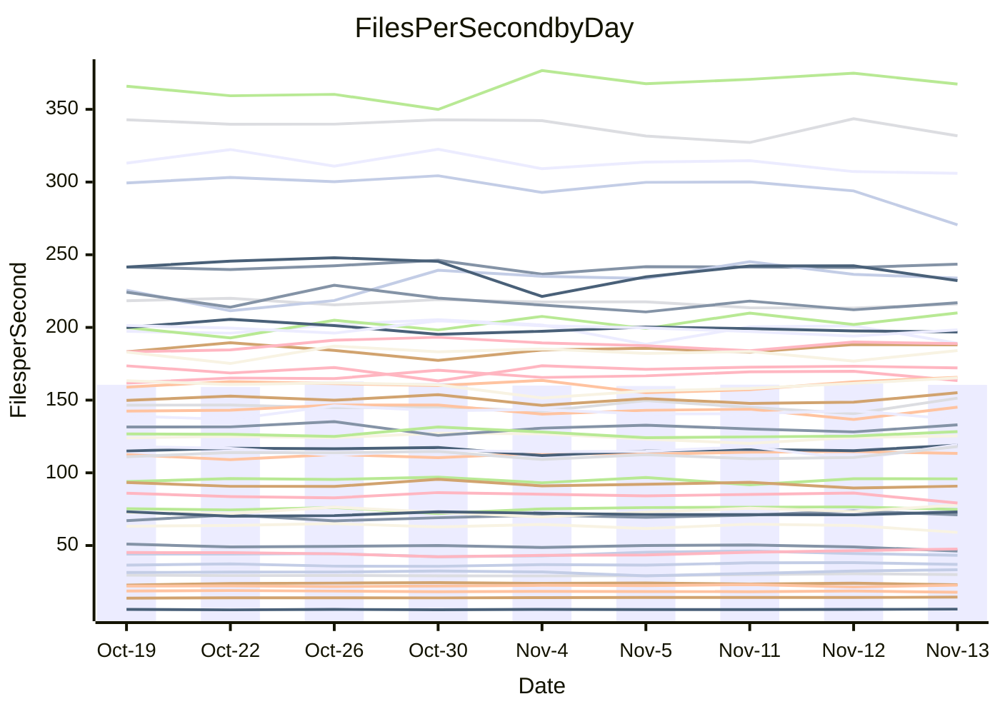

<!---
# This file is auto-generated. Do not edit.
# cspell:disable
--->
# Performance Report

## Daily Performance

## Time to Process Files

| Repository                                      | Elapsed | Min/Avg/Max           |   SD | SD Graph                |
| ----------------------------------------------- | ------: | :-------------------: | ---: | ----------------------- |
| AdaDoom3/AdaDoom3                    |    3.44 | 3.3 /   3.5 /   3.7   | 0.10 | `    ┣━━┻━●╋━━┻━━┫    ` |
| alexiosc/megistos                    |    7.49 | 7.3 /   8.0 /   8.7   | 0.36 | `    ┣━●┻━━╋━━┻━━┫    ` |
| apollographql/apollo-server          |    2.79 | 2.6 /   2.8 /   3.2   | 0.13 | `    ┣━━┻━━╋●━┻━━┫    ` |
| aspnetboilerplate/aspnetboilerplate  |   10.58 | 10.3 /  10.6 /  11.8  | 0.33 | `    ┣━━┻━━●━━┻━━┫    ` |
| aws-amplify/docs                     |   13.23 | 12.4 /  13.2 /  14.8  | 0.57 | `    ┣━━┻━━●━━┻━━┫    ` |
| Azure/azure-rest-api-specs           |   10.19 | 9.6 /  10.0 /  11.0   | 0.36 | `    ┣━━┻━━╋━●┻━━┫    ` |
| bitjson/typescript-starter           |    1.12 | 1.0 /   1.1 /   1.1   | 0.03 | `     ┣━┻━━╋━━┻●┫     ` |
| caddyserver/caddy                    |    3.85 | 3.6 /   3.8 /   4.0   | 0.09 | `    ┣━━┻━━╋●━┻━━┫    ` |
| canada-ca/open-source-logiciel-libre |    1.12 | 1.1 /   1.2 /   1.3   | 0.04 | `     ┣━●━━╋━━┻━┫     ` |
| chef/chef                            |    6.05 | 5.7 /   6.0 /   6.3   | 0.16 | `    ┣━━┻━━╋●━┻━━┫    ` |
| dart-lang/sdk                        |   65.02 | 63.7 /  67.3 /  72.3  | 2.07 | `  ┣━━━●━━━╋━━━┻━━━┫  ` |
| django/django                        |   15.67 | 14.9 /  15.8 /  17.2  | 0.53 | `    ┣━━┻━●╋━━┻━━┫    ` |
| eslint/eslint                        |   11.12 | 10.7 /  11.2 /  11.8  | 0.37 | `    ┣━━┻━●╋━━┻━━┫    ` |
| exonum/exonum                        |    3.53 | 3.5 /   3.7 /   4.0   | 0.12 | `    ┣━━●━━╋━━┻━━┫    ` |
| flutter/samples                      |   16.53 | 16.0 /  16.9 /  19.0  | 0.61 | `   ┣━━━┻●━╋━━┻━━━┫   ` |
| gitbucket/gitbucket                  |    3.64 | 3.5 /   3.7 /   3.9   | 0.11 | `    ┣━━┻━●╋━━┻━━┫    ` |
| googleapis/google-cloud-cpp          |  153.24 | 139.9 / 147.7 / 158.3 | 4.59 | `  ┣━━━┻━━━╋━━━┻●━━┫  ` |
| graphql/express-graphql              |    1.15 | 1.1 /   1.2 /   1.3   | 0.04 | `     ┣━┻●━╋━━┻━┫     ` |
| graphql/graphql-js                   |    2.94 | 2.8 /   3.0 /   3.2   | 0.11 | `    ┣━━┻━●╋━━┻━━┫    ` |
| graphql/graphql-relay-js             |    1.22 | 1.1 /   1.2 /   1.2   | 0.04 | `     ┣━┻━━╋━━●━┫     ` |
| graphql/graphql-spec                 |    1.31 | 1.3 /   1.3 /   1.4   | 0.04 | `     ┣━●━━╋━━┻━┫     ` |
| iluwatar/java-design-patterns        |   12.84 | 12.8 /  13.3 /  14.4  | 0.36 | `    ┣━●┻━━╋━━┻━━┫    ` |
| ktaranov/sqlserver-kit               |    6.69 | 6.6 /   6.8 /   7.1   | 0.17 | `    ┣━━●━━╋━━┻━━┫    ` |
| liriliri/licia                       |    4.33 | 4.1 /   4.3 /   4.6   | 0.12 | `    ┣━━┻━━╋━●┻━━┫    ` |
| MartinThoma/LaTeX-examples           |    7.11 | 6.8 /   7.1 /   7.9   | 0.26 | `    ┣━━┻━━●━━┻━━┫    ` |
| mdx-js/mdx                           |    1.98 | 1.9 /   2.0 /   2.2   | 0.08 | `     ┣━┻━●╋━━┻━┫     ` |
| microsoft/TypeScript-Website         |    5.72 | 5.5 /   5.8 /   6.5   | 0.20 | `    ┣━━┻━●╋━━┻━━┫    ` |
| MicrosoftDocs/PowerShell-Docs        |   22.95 | 23.3 /  24.3 /  26.2  | 0.75 | `   ┣●━━┻━━╋━━┻━━━┫   ` |
| neovim/nvim-lspconfig                |    4.41 | 4.3 /   4.4 /   4.6   | 0.08 | `    ┣━━┻━━●━━┻━━┫    ` |
| pagekit/pagekit                      |    3.53 | 3.5 /   3.7 /   4.0   | 0.14 | `    ┣━━●━━╋━━┻━━┫    ` |
| php/php-src                          |   28.55 | 25.9 /  26.9 /  28.5  | 0.76 | `   ┣━━━┻━━╋━━┻━━━┫●  ` |
| plasticrake/tplink-smarthome-api     |    1.30 | 1.3 /   1.4 /   1.5   | 0.05 | `     ●━┻━━╋━━┻━┫     ` |
| prettier/prettier                    |    7.91 | 7.2 /   7.6 /   8.3   | 0.23 | `    ┣━━┻━━╋━━●━━┫    ` |
| pycontribs/jira                      |    1.71 | 1.5 /   1.6 /   1.7   | 0.06 | `     ┣━┻━━╋━━┻━┫●    ` |
| RustPython/RustPython                |    5.40 | 5.2 /   5.5 /   6.0   | 0.24 | `    ┣━━┻━●╋━━┻━━┫    ` |
| shoelace-style/shoelace              |    2.90 | 2.9 /   3.0 /   3.2   | 0.08 | `    ┣━●┻━━╋━━┻━━┫    ` |
| slint-ui/slint                       |   13.65 | 13.3 /  13.8 /  14.4  | 0.36 | `    ┣━━┻━●╋━━┻━━┫    ` |
| SoftwareBrothers/admin-bro           |    2.70 | 2.5 /   2.7 /   2.9   | 0.07 | `     ┣━┻━━╋━●┻━┫     ` |
| sveltejs/svelte                      |   21.92 | 20.8 /  21.9 /  22.9  | 0.46 | `   ┣━━━┻━━●━━┻━━━┫   ` |
| TheAlgorithms/Python                 |    5.74 | 5.7 /   5.8 /   6.1   | 0.11 | `    ┣━━┻━●╋━━┻━━┫    ` |
| twbs/bootstrap                       |    2.00 | 1.8 /   1.9 /   2.0   | 0.05 | `     ┣━┻━━╋━━┻━┫ ●   ` |
| typescript-cheatsheets/react         |    1.43 | 1.3 /   1.4 /   1.6   | 0.06 | `     ┣━┻━━●━━┻━┫     ` |
| typescript-eslint/typescript-eslint  |    4.75 | 4.2 /   4.3 /   4.5   | 0.08 | `      ┣━┻━╋━┻━┫     ●` |
| vitest-dev/vitest                    |   10.00 | 9.2 /   9.9 /  10.9   | 0.48 | `    ┣━━┻━━╋●━┻━━┫    ` |
| w3c/aria-practices                   |    3.48 | 3.4 /   3.6 /   3.8   | 0.09 | `    ┣━━●━━╋━━┻━━┫    ` |
| w3c/specberus                        |    2.05 | 2.0 /   2.1 /   2.2   | 0.05 | `     ┣━┻━●╋━━┻━┫     ` |
| webdeveric/webpack-assets-manifest   |    1.27 | 1.2 /   1.2 /   1.3   | 0.04 | `     ┣━┻━━╋━●┻━┫     ` |
| webpack/webpack                      |    6.03 | 5.5 /   5.7 /   6.7   | 0.24 | `    ┣━━┻━━╋━━┻●━┫    ` |
| wireapp/wire-desktop                 |    1.38 | 1.4 /   1.5 /   1.7   | 0.08 | `     ┣━●━━╋━━┻━┫     ` |
| wireapp/wire-webapp                  |   10.77 | 10.6 /  11.2 /  12.3  | 0.49 | `    ┣━━●━━╋━━┻━━┫    ` |

Note:
- Elapsed time is in seconds.

## Files per Second over Time

| Repository                                      | Files |    Sec |    Fps |    Rel | Trend Fps              |    N |
| ----------------------------------------------- | ----: | -----: | -----: | -----: | ---------------------- | ---: |
| AdaDoom3/AdaDoom3                    |   103 |   3.44 |  29.98 |  1.34% | `▅▇▅▇▆▆▆▅▆▆▄▆▇██▄█▇█▇` |   21 |
| alexiosc/megistos                    |   583 |   7.49 |  77.86 |  6.03% | `▄▄▅█▆▅▅▃▅▄▄▇▇▆▇▆▆▆▄▇` |   21 |
| apollographql/apollo-server          |   253 |   2.79 |  90.84 | -1.07% | `▇▇▆▆▇▆█▇▆█▇▅▇██▆██▃▆` |   21 |
| aspnetboilerplate/aspnetboilerplate  |  2286 |  10.58 | 216.11 | -0.19% | `██▇▆▇██▇█▇▇█▆▆▇▆▄██▇` |   21 |
| aws-amplify/docs                     |  2871 |  13.23 | 216.95 | -0.35% | `▆▇▅███▇▇▅▇▆▆▃█▇▅▆▅▆▆` |   21 |
| Azure/azure-rest-api-specs           |  2365 |  10.19 | 232.19 | -3.27% | `▇▆█▇█▇▇▃▅▅▆▇▅▆▇▇▇▆▇▅` |   21 |
| bitjson/typescript-starter           |    20 |   1.12 |  17.83 | -3.80% | `█▇█▇▇▆▆▆▆▅▇▇▅▄▅▇▇▇▇▅` |   21 |
| caddyserver/caddy                    |   288 |   3.85 |  74.79 | -1.16% | `▇▆▆▆▆▇▄▅▇▆▆█▇▇▇▆▇▅█▆` |   21 |
| canada-ca/open-source-logiciel-libre |     7 |   1.12 |   6.23 |  4.55% | `▆▄▆▇▇▆▅▇▇▇▄▆▇▆▄█▇█▅█` |   21 |
| chef/chef                            |  1191 |   6.05 | 196.85 | -1.50% | `▇█▇▆█▆▅▇▅▄█▇▇▆▇▆▄▆▇▆` |   21 |
| dart-lang/sdk                        | 10747 |  65.02 | 165.28 |  3.78% | `██▆█▇▅▆▅▄▅▇▆▅▆▆▅▇▆▇█` |   21 |
| django/django                        |  2885 |  15.67 | 184.07 |  1.08% | `█▅▅▇▆█▆▇▇▇▄▇▇▆▇▇▆▆▄▇` |   21 |
| eslint/eslint                        |  2099 |  11.12 | 188.83 |  0.76% | `▇▇▄▇▇▇▇▅█▆▇▄▇▅▇▄▆█▆▆` |   21 |
| exonum/exonum                        |   421 |   3.53 | 119.29 |  3.96% | `▇▇█▆▆▅▇▆▇▅▇█▇██▇▇▅▄█` |   21 |
| flutter/samples                      |  2400 |  16.53 | 145.20 |  1.83% | `▇▇▆█▇█▇▇▆█▆▇▆▇▇▆▇▃▆▇` |   21 |
| gitbucket/gitbucket                  |   413 |   3.64 | 113.36 |  0.49% | `█▅▅▇▆▆▆▅█▆█▄▇▆█▆█▆▇▇` |   21 |
| googleapis/google-cloud-cpp          | 20952 | 153.24 | 136.72 | -3.37% | `▆▇▄▇██▇█▆▆▅█▅▅▆▇▆▇▇▅` |   21 |
| graphql/express-graphql              |    26 |   1.15 |  22.68 |  1.97% | `▅▆▄▄▅▅▅▅▆▅▅▅▅▅█▆▃▄▅▆` |   21 |
| graphql/graphql-js                   |   368 |   2.94 | 125.35 |  1.14% | `▅▆█▆█▆█▇█▇▇▅▆▆▄▇██▄▇` |   21 |
| graphql/graphql-relay-js             |    28 |   1.22 |  23.00 | -3.49% | `▄▇▅▆▆▇▇▇▅▅▆█▆▆▅▅▆▇▆▅` |   21 |
| graphql/graphql-spec                 |    19 |   1.31 |  14.49 |  2.60% | `▆▅▇▄█▆▆▇▆▇▆▇█▇▆▇█▅▆▇` |   21 |
| iluwatar/java-design-patterns        |  1992 |  12.84 | 155.08 |  3.56% | `▆█▇█▇▅█▄█▇▇▇▇▆▆▇▆▆▇█` |   21 |
| ktaranov/sqlserver-kit               |   489 |   6.69 |  73.06 |  2.17% | `▇▅▆▆▅▇▇▇▇▆▇▅▇▇▅▆█▆▅▇` |   21 |
| liriliri/licia                       |  1437 |   4.33 | 331.81 | -1.78% | `█▇▇█▇███▇█▆▆▆▄█▆▇██▆` |   21 |
| MartinThoma/LaTeX-examples           |  1409 |   7.11 | 198.31 | -0.14% | `▆▇▆▅█▆█▇▇▆▇██▇▆▆█▆▃▇` |   21 |
| mdx-js/mdx                           |   141 |   1.98 |  71.09 |  1.79% | `▅▇▆▃▆▅▆▆▇▆▇▅▅▇▇▆███▇` |   21 |
| microsoft/TypeScript-Website         |   761 |   5.72 | 133.01 |  1.32% | `▇▆▇▇██▅▆▇█▇▆▆▆▆▇▇▃▇▇` |   21 |
| MicrosoftDocs/PowerShell-Docs        |  2708 |  22.95 | 118.02 |  5.64% | `▆▆▇█▅▇▇▅▆▇▇▅▆▅▅▆█▆▄█` |   21 |
| neovim/nvim-lspconfig                |   759 |   4.41 | 172.14 |  0.18% | `▇▅███▇▅██▇▇▆█▇█████▇` |   21 |
| pagekit/pagekit                      |   741 |   3.53 | 209.99 |  3.85% | `▃▅▄▇▇▆▆█▇▅▇▅▇█▇█▇▇▅█` |   21 |
| php/php-src                          |  2262 |  28.55 |  79.22 | -6.58% | `▇█▄▇▅▅▇▇▆▇█▄▆▇▆▇█▇▇▄` |   21 |
| plasticrake/tplink-smarthome-api     |    62 |   1.30 |  47.61 |  6.73% | `▇▆▇▅▄▇▄▄▅▅▄▅▆▆█▆▇▇▇█` |   21 |
| prettier/prettier                    |  2421 |   7.91 | 306.00 | -2.31% | `▇█▇▅▆██▆▇▇▇▆▇▆▇▇▇▄▆▆` |   21 |
| pycontribs/jira                      |    79 |   1.71 |  46.22 | -7.11% | `▇▆▅▄▆█▆▆▅▄█▆▇▇█▆▅▅▇▄` |   21 |
| RustPython/RustPython                |   693 |   5.40 | 128.39 |  2.04% | `▆▅█▅▄██▇▆▇▃▆▆▇▇▄▅▆▇▇` |   21 |
| shoelace-style/shoelace              |   439 |   2.90 | 151.35 |  4.08% | `▅▆▆▆▅▆▆▇▄▇█▆▆▇▆▆▄▅▅█` |   21 |
| slint-ui/slint                       |  2565 |  13.65 | 187.98 |  1.63% | `▇█▇▅▇█▅▆▇█▆▅█▆▅▇█▇▇▇` |   21 |
| SoftwareBrothers/admin-bro           |   441 |   2.70 | 163.46 | -1.82% | `▄▇▆▇▆▆▇▇▆▇▇▆▇█▆▇█▇▇▆` |   21 |
| sveltejs/svelte                      |  8053 |  21.92 | 367.41 |  0.10% | `▇▆▅▅▅▆▄█▆▆▆▆▇▆▆█▇▇▇▆` |   21 |
| TheAlgorithms/Python                 |  1399 |   5.74 | 243.55 |  0.96% | `▇▇▆█▇▇█▆▇▆▇█▇▇▆█▅██▇` |   21 |
| twbs/bootstrap                       |   118 |   2.00 |  59.02 | -7.27% | `█▇▆▇█▇▆█▆▆▆▄▅██▆▆▇▆▄` |   21 |
| typescript-cheatsheets/react         |    53 |   1.43 |  36.99 |  0.13% | `▅▇▆▆▃▅▅▄▇▇▅▆▄▇▆▇▆▇█▆` |   21 |
| typescript-eslint/typescript-eslint  |  1285 |   4.75 | 270.62 | -9.45% | `▇█▇▇█▆█▇▅▇▇▇▇▆█▇▅▆▇▃` |   21 |
| vitest-dev/vitest                    |  2339 |  10.00 | 233.98 |  1.41% | `▅▄▃▃▄▅▇▇▅▅▇▆▆█▇█▆▆▇▆` |   21 |
| w3c/aria-practices                   |   414 |   3.48 | 119.08 |  3.18% | `██▆▇▆▇▇▆▄▇▅▅▇▇█▅▇▇▅█` |   21 |
| w3c/specberus                        |   197 |   2.05 |  95.87 |  0.96% | `▆█▇▇▆███▄▇███▅▇▅▇▇█▇` |   21 |
| webdeveric/webpack-assets-manifest   |    55 |   1.27 |  43.23 | -2.95% | `▆▆▅▇▅▅▄▅▄▇▅▇▆▇▆█▅▅▇▅` |   21 |
| webpack/webpack                      |  1141 |   6.03 | 189.10 | -4.47% | `▆▇▆█▇▇█▇▇▇▆▃▆▆█▇▇█▇▆` |   21 |
| wireapp/wire-desktop                 |    46 |   1.38 |  33.35 |  6.90% | `▆▇▇▆█▇▇▇▆▅▄▃█▆▆▆▇█▇█` |   21 |
| wireapp/wire-webapp                  |  1783 |  10.77 | 165.62 |  3.72% | `▇▆█▇█▆▇▇█▄▇▇▃▇▄▇█▅██` |   21 |

## Data Throughput

| Repository                                      | Files |    Sec |     Kps |    Rel | Trend Kps              |    N |
| ----------------------------------------------- | ----: | -----: | ------: | -----: | ---------------------- | ---: |
| AdaDoom3/AdaDoom3                    |   103 |   3.44 |  637.23 |  1.34% | `▅▇▅▇▆▆▆▅▆▆▄▆▇██▄█▇█▇` |   21 |
| alexiosc/megistos                    |   583 |   7.49 |  611.78 |  6.03% | `▄▄▅█▆▅▅▃▅▄▄▇▇▆▇▆▆▆▄▇` |   21 |
| apollographql/apollo-server          |   253 |   2.79 |  742.16 | -0.48% | `▆▇▅▆▆▆█▇▆█▇▅▇██▆██▃▆` |   21 |
| aspnetboilerplate/aspnetboilerplate  |  2286 |  10.58 |  525.82 | -0.19% | `██▇▆▇██▇█▇▇█▆▆▇▆▄██▇` |   21 |
| aws-amplify/docs                     |  2871 |  13.23 |  757.40 | -0.34% | `▆▇▅███▇▇▅▇▆▆▃█▇▅▆▅▆▆` |   21 |
| Azure/azure-rest-api-specs           |  2365 |  10.19 |  630.80 | -2.64% | `▇▆█▇█▇▇▃▅▅▆▇▅▇▇▇▇▆█▆` |   21 |
| bitjson/typescript-starter           |    20 |   1.12 |   71.33 | -3.80% | `█▇█▇▇▆▆▆▆▅▇▇▅▄▅▇▇▇▇▅` |   21 |
| caddyserver/caddy                    |   288 |   3.85 |  648.68 | -0.97% | `▆▆▆▆▆▇▄▅▇▆▆█▇▇▇▆▇▅█▆` |   21 |
| canada-ca/open-source-logiciel-libre |     7 |   1.12 |   51.61 |  4.55% | `▆▄▆▇▇▆▅▇▇▇▄▆▇▆▄█▇█▅█` |   21 |
| chef/chef                            |  1191 |   6.05 |  912.35 | -1.40% | `▆█▇▆█▆▅▇▅▄█▇▇▆▇▆▄▆▇▆` |   21 |
| dart-lang/sdk                        | 10747 |  65.02 | 1127.92 |  3.88% | `██▆█▇▅▆▅▄▅▇▆▅▆▆▆▇▇▇█` |   21 |
| django/django                        |  2885 |  15.67 | 1155.20 |  0.99% | `█▅▅▇▇█▇▇▇▇▄▇▇▆▇▇▆▆▄▇` |   21 |
| eslint/eslint                        |  2099 |  11.12 | 1354.55 |  0.58% | `▇▇▄▇▇▇▇▅█▆▇▄▇▅▇▄▅█▆▆` |   21 |
| exonum/exonum                        |   421 |   3.53 | 1141.06 |  3.96% | `▇▇█▆▆▅▇▆▇▅▇█▇██▇▇▅▄█` |   21 |
| flutter/samples                      |  2400 |  16.53 | 1295.69 |  1.83% | `▇▇▆█▇█▇▇▆█▆▇▆▇▇▆▇▃▆▇` |   21 |
| gitbucket/gitbucket                  |   413 |   3.64 |  515.22 |  0.49% | `█▅▅▇▆▆▆▅█▆█▄▇▆█▆█▆▇▇` |   21 |
| googleapis/google-cloud-cpp          | 20952 | 153.24 | 1113.62 | -3.14% | `▆▇▄▇██▇█▆▆▅█▅▅▆▇▆▇▇▅` |   21 |
| graphql/express-graphql              |    26 |   1.15 |  103.79 |  1.97% | `▅▆▄▄▅▅▅▅▆▅▅▅▅▅█▆▃▄▅▆` |   21 |
| graphql/graphql-js                   |   368 |   2.94 |  727.55 |  1.40% | `▅▆█▆█▅▇▇█▇▇▅▆▆▄▇██▄▇` |   21 |
| graphql/graphql-relay-js             |    28 |   1.22 |   90.37 | -3.49% | `▄▇▅▆▆▇▇▇▅▅▆█▆▆▅▅▆▇▆▅` |   21 |
| graphql/graphql-spec                 |    19 |   1.31 |  483.52 |  2.60% | `▆▅▇▄█▆▆▇▆▇▆▇█▇▆▇█▅▆▇` |   21 |
| iluwatar/java-design-patterns        |  1992 |  12.84 |  479.34 |  3.56% | `▆█▇█▇▅█▄█▇▇▇▇▆▆▇▆▆▇█` |   21 |
| ktaranov/sqlserver-kit               |   489 |   6.69 | 1106.33 |  2.17% | `▇▅▆▆▅▇▇▇▇▆▇▅▇▇▅▆█▆▅▇` |   21 |
| liriliri/licia                       |  1437 |   4.33 |  395.30 | -1.78% | `█▇▇█▇███▇█▆▆▆▄█▆▇██▆` |   21 |
| MartinThoma/LaTeX-examples           |  1409 |   7.11 |  409.56 | -0.14% | `▆▇▆▅█▆█▇▇▆▇██▇▆▆█▆▃▇` |   21 |
| mdx-js/mdx                           |   141 |   1.98 |  330.76 |  1.79% | `▅▇▆▃▆▅▆▆▇▆▇▅▅▇▇▆███▇` |   21 |
| microsoft/TypeScript-Website         |   761 |   5.72 |  920.04 |  1.33% | `▇▆▇▇██▅▆▇█▇▆▆▆▆▇▇▃▇▇` |   21 |
| MicrosoftDocs/PowerShell-Docs        |  2708 |  22.95 | 1215.23 |  5.67% | `▆▆▇█▅▇▇▅▆▇▇▅▆▅▅▆█▆▄█` |   21 |
| neovim/nvim-lspconfig                |   759 |   4.41 |  288.04 |  0.28% | `▇▅▇▇█▇▅██▇▇▆█▇█████▇` |   21 |
| pagekit/pagekit                      |   741 |   3.53 |  437.83 |  3.85% | `▃▅▄▇▇▆▆█▇▅▇▅▇█▇█▇▇▅█` |   21 |
| php/php-src                          |  2262 |  28.55 | 1386.32 | -6.55% | `▇█▄▇▅▅▇▇▆▇█▄▆▇▆▇█▇▇▄` |   21 |
| plasticrake/tplink-smarthome-api     |    62 |   1.30 |  257.23 |  6.73% | `▇▆▇▅▄▇▄▄▅▅▄▅▆▆█▆▇▇▇█` |   21 |
| prettier/prettier                    |  2421 |   7.91 |  424.93 | -2.65% | `▇██▅▆██▅▆▆▇▆▇▆▇▇▇▄▆▆` |   21 |
| pycontribs/jira                      |    79 |   1.71 |  327.60 | -7.11% | `▇▆▅▄▆█▆▆▅▄█▆▇▇█▆▅▅▇▄` |   21 |
| RustPython/RustPython                |   693 |   5.40 | 1068.29 |  4.20% | `▅▄▇▅▃▇▇█▇█▄▇▇█▇▄▆▇▇▇` |   21 |
| shoelace-style/shoelace              |   439 |   2.90 |  731.23 |  4.08% | `▅▆▆▆▅▆▆▇▄▇█▆▆▇▆▆▄▅▅█` |   21 |
| slint-ui/slint                       |  2565 |  13.65 | 1159.44 |  1.80% | `▇█▇▅▇█▅▆▇█▆▅█▆▆▇█▇▇▇` |   21 |
| SoftwareBrothers/admin-bro           |   441 |   2.70 |  360.28 | -1.82% | `▄▇▆▇▆▆▇▇▆▇▇▆▇█▆▇█▇▇▆` |   21 |
| sveltejs/svelte                      |  8053 |  21.92 |  245.09 |  0.06% | `▇▆▅▅▅▆▄█▆▆▆▆▇▆▆▇▇▇▇▆` |   21 |
| TheAlgorithms/Python                 |  1399 |   5.74 |  619.41 |  0.96% | `▇▇▆█▇▇█▆▇▆▇█▇▇▆█▅██▇` |   21 |
| twbs/bootstrap                       |   118 |   2.00 |  484.64 | -7.21% | `█▇▆▇█▇▆█▆▆▆▄▅██▆▆▇▆▄` |   21 |
| typescript-cheatsheets/react         |    53 |   1.43 |  273.58 |  0.13% | `▅▇▆▆▃▅▅▄▇▇▅▆▄▇▆▇▆▇█▆` |   21 |
| typescript-eslint/typescript-eslint  |  1285 |   4.75 | 1395.02 | -9.32% | `▇█▇▇█▆█▇▅▇▇▇▇▆█▇▅▆▇▃` |   21 |
| vitest-dev/vitest                    |  2339 |  10.00 |  502.56 | -1.37% | `▆▄▃▃▅▆██▅▆█▆▆▇▆█▆▅▇▆` |   21 |
| w3c/aria-practices                   |   414 |   3.48 | 1110.25 |  3.18% | `██▆▇▆▇▇▆▄▇▅▅▇▇█▅▇▇▅█` |   21 |
| w3c/specberus                        |   197 |   2.05 |  303.19 |  0.96% | `▆█▇▇▆███▄▇███▅▇▅▇▇█▇` |   21 |
| webdeveric/webpack-assets-manifest   |    55 |   1.27 |   99.82 | -2.95% | `▆▆▅▇▅▅▄▅▄▇▅▇▆▇▆█▅▅▇▅` |   21 |
| webpack/webpack                      |  1141 |   6.03 |  862.29 | -4.26% | `▆▇▆█▇▇█▇▇▇▆▃▅▆█▇▇█▇▆` |   21 |
| wireapp/wire-desktop                 |    46 |   1.38 |  186.33 |  6.90% | `▆▇▇▆█▇▇▇▆▅▄▃█▆▆▆▇█▇█` |   21 |
| wireapp/wire-webapp                  |  1783 |  10.77 |  612.50 |  3.87% | `▇▆█▇█▆▇▇█▄▇▇▃▇▄▇█▅██` |   21 |

