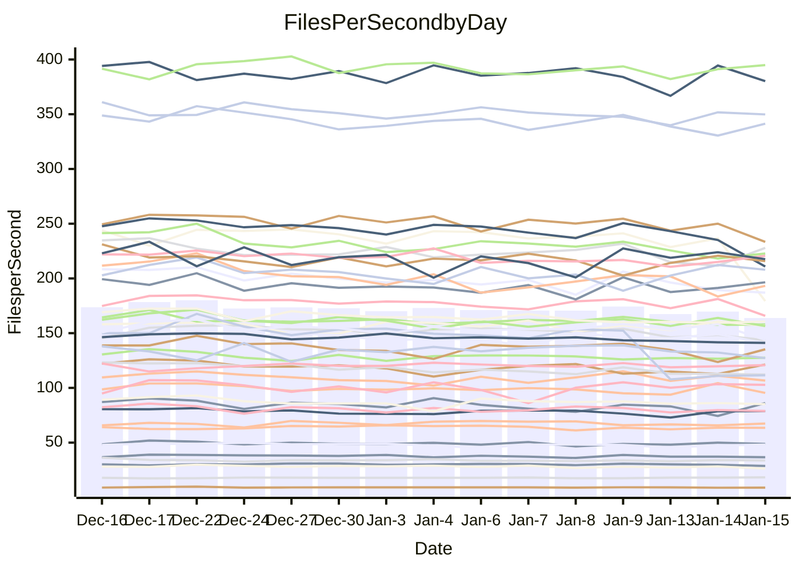

<!---
# This file is auto-generated. Do not edit.
# cspell:disable
--->
# Performance Report

## Daily Performance

## Time to Process Files

| Repository                                      | Elapsed | Min/Avg/Max           |   SD | SD Graph                |
| ----------------------------------------------- | ------: | :-------------------: | ---: | ----------------------- |
| AdaDoom3/AdaDoom3                    |    3.06 | 2.8 /   3.1 /   3.2   | 0.08 | `    ┣━━┻━━●━━┻━━┫    ` |
| alexiosc/megistos                    |    7.39 | 6.8 /   7.3 /   8.1   | 0.31 | `    ┣━━┻━━╋●━┻━━┫    ` |
| apollographql/apollo-server          |    2.34 | 2.2 /   2.3 /   2.8   | 0.12 | `    ┣━━┻━━╋●━┻━━┫    ` |
| aspnetboilerplate/aspnetboilerplate  |   10.08 | 9.0 /   9.7 /  10.4   | 0.34 | `    ┣━━┻━━╋━━●━━┫    ` |
| aws-amplify/docs                     |   15.98 | 11.5 /  12.0 /  13.6  | 0.41 | `        ┣┻╋┻┫       ●` |
| Azure/azure-rest-api-specs           |   21.20 | 14.4 /  16.9 /  24.9  | 2.36 | `   ┣━━┻━━━╋━━━┻━━●   ` |
| bitjson/typescript-starter           |    0.70 | 0.6 /   0.7 /   0.7   | 0.02 | `     ┣━━┻━╋━┻━━●     ` |
| caddyserver/caddy                    |    3.24 | 3.0 /   3.3 /   3.8   | 0.18 | `    ┣━━┻●━╋━━┻━━┫    ` |
| canada-ca/open-source-logiciel-libre |    0.78 | 0.7 /   0.8 /   0.8   | 0.02 | `     ┣━━┻━╋━●━━┫     ` |
| chef/chef                            |    5.53 | 5.2 /   5.5 /   6.6   | 0.32 | `    ┣━━┻━━●━━┻━━┫    ` |
| dart-lang/sdk                        |   62.74 | 57.6 /  61.0 /  67.3  | 2.05 | `  ┣━━━┻━━━╋━━●┻━━━┫  ` |
| django/django                        |   14.35 | 13.7 /  14.7 /  16.4  | 0.60 | `   ┣━━━┻●━╋━━┻━━━┫   ` |
| eslint/eslint                        |   10.90 | 9.6 /  10.3 /  11.2   | 0.38 | `    ┣━━┻━━╋━━┻━●┫    ` |
| exonum/exonum                        |    3.31 | 2.9 /   3.1 /   3.5   | 0.12 | `    ┣━━┻━━╋━━┻●━┫    ` |
| flutter/samples                      |   17.16 | 16.2 /  17.3 /  22.0  | 1.04 | `   ┣━━━┻━●╋━━┻━━━┫   ` |
| gitbucket/gitbucket                  |    3.23 | 3.0 /   3.2 /   3.4   | 0.09 | `    ┣━━┻━━╋●━┻━━┫    ` |
| googleapis/google-cloud-cpp          |  137.13 | 121.6 / 128.4 / 139.4 | 3.77 | `  ┣━━━┻━━━╋━━━┻━━━┫ ●` |
| graphql/express-graphql              |    0.73 | 0.7 /   0.7 /   0.8   | 0.02 | `     ┣━━┻━╋━●━━┫     ` |
| graphql/graphql-js                   |    2.36 | 2.1 /   2.2 /   2.4   | 0.07 | `     ┣━┻━━╋━━┻━●     ` |
| graphql/graphql-relay-js             |    0.76 | 0.7 /   0.7 /   0.8   | 0.02 | `     ┣━┻━━╋━●┻━┫     ` |
| graphql/graphql-spec                 |    0.82 | 0.8 /   0.8 /   0.9   | 0.01 | `     ┣━●┻━╋━┻━━┫     ` |
| iluwatar/java-design-patterns        |   11.98 | 10.8 /  11.5 /  12.2  | 0.32 | `    ┣━━┻━━╋━━┻━●┫    ` |
| ktaranov/sqlserver-kit               |    6.21 | 5.9 /   6.3 /   7.2   | 0.25 | `    ┣━━┻━●╋━━┻━━┫    ` |
| liriliri/licia                       |    3.63 | 3.6 /   3.7 /   3.9   | 0.08 | `    ┣━━┻━●╋━━┻━━┫    ` |
| MartinThoma/LaTeX-examples           |    6.38 | 6.2 /   6.5 /   6.8   | 0.16 | `    ┣━━┻━●╋━━┻━━┫    ` |
| mdx-js/mdx                           |    1.67 | 1.5 /   1.6 /   1.8   | 0.07 | `     ┣━┻━━╋●━┻━┫     ` |
| microsoft/TypeScript-Website         |    5.36 | 4.9 /   5.2 /   5.5   | 0.14 | `    ┣━━┻━━╋━━┻●━┫    ` |
| MicrosoftDocs/PowerShell-Docs        |   19.93 | 17.6 /  19.1 /  21.5  | 0.89 | `   ┣━━━┻━━╋━━●━━━┫   ` |
| neovim/nvim-lspconfig                |    3.09 | 2.9 /   3.1 /   3.5   | 0.13 | `    ┣━━┻━●╋━━┻━━┫    ` |
| pagekit/pagekit                      |    3.43 | 3.1 /   3.4 /   3.8   | 0.17 | `    ┣━━┻━━●━━┻━━┫    ` |
| php/php-src                          |   21.53 | 20.7 /  22.6 /  28.4  | 1.67 | `   ┣━━┻━●━╋━━━┻━━┫   ` |
| plasticrake/tplink-smarthome-api     |    0.92 | 0.9 /   0.9 /   1.0   | 0.03 | `     ┣━┻━━●━━┻━┫     ` |
| prettier/prettier                    |    6.46 | 6.1 /   6.4 /   7.2   | 0.19 | `    ┣━━┻━━●━━┻━━┫    ` |
| pycontribs/jira                      |    1.26 | 1.2 /   1.3 /   1.3   | 0.04 | `     ┣━┻━━╋●━┻━┫     ` |
| RustPython/RustPython                |    4.40 | 4.1 /   4.2 /   5.1   | 0.20 | `    ┣━━┻━━╋━●┻━━┫    ` |
| shoelace-style/shoelace              |    2.64 | 2.4 /   2.5 /   2.7   | 0.08 | `    ┣━━┻━━╋━━┻━━●    ` |
| slint-ui/slint                       |   10.21 | 8.7 /   9.8 /  11.8   | 0.64 | `   ┣━━━┻━━╋━●┻━━━┫   ` |
| SoftwareBrothers/admin-bro           |    2.12 | 2.0 /   2.2 /   2.3   | 0.08 | `    ┣━━┻━●╋━━┻━━┫    ` |
| sveltejs/svelte                      |   18.79 | 17.9 /  18.5 /  22.2  | 0.75 | `   ┣━━━┻━━╋●━┻━━━┫   ` |
| TheAlgorithms/Python                 |    5.86 | 5.1 /   5.4 /   5.8   | 0.17 | `    ┣━━┻━━╋━━┻━━┫●   ` |
| twbs/bootstrap                       |    1.26 | 1.1 /   1.2 /   1.4   | 0.06 | `     ┣━┻━━╋━●┻━┫     ` |
| typescript-cheatsheets/react         |    1.10 | 1.1 /   1.1 /   1.3   | 0.06 | `     ┣━┻━━●━━┻━┫     ` |
| typescript-eslint/typescript-eslint  |    3.65 | 3.5 /   3.6 /   3.8   | 0.08 | `    ┣━━┻━━╋●━┻━━┫    ` |
| vitest-dev/vitest                    |    9.23 | 7.5 /   7.9 /   8.4   | 0.23 | `      ┣━┻━╋━┻━┫     ●` |
| w3c/aria-practices                   |    2.99 | 2.7 /   3.0 /   3.3   | 0.14 | `    ┣━━┻━━╋●━┻━━┫    ` |
| w3c/specberus                        |    1.66 | 1.6 /   1.7 /   1.8   | 0.04 | `     ┣━┻━●╋━━┻━┫     ` |
| webdeveric/webpack-assets-manifest   |    0.72 | 0.6 /   0.7 /   0.8   | 0.03 | `     ┣━━┻━╋━┻━━●     ` |
| webpack/webpack                      |    4.80 | 4.6 /   4.9 /   5.3   | 0.19 | `    ┣━━┻━●╋━━┻━━┫    ` |
| wireapp/wire-desktop                 |    0.88 | 0.8 /   0.9 /   1.0   | 0.03 | `     ┣━┻━━●━━┻━┫     ` |
| wireapp/wire-webapp                  |    8.59 | 7.8 /   8.3 /   8.9   | 0.26 | `    ┣━━┻━━╋━━●━━┫    ` |

Note:
- Elapsed time is in seconds.

## Files per Second over Time

| Repository                                      | Files |    Sec |    Fps |     Rel | Trend Fps              |    N |
| ----------------------------------------------- | ----: | -----: | -----: | ------: | ---------------------- | ---: |
| AdaDoom3/AdaDoom3                    |   103 |   3.06 |  33.70 |  -0.26% | `▇▇▆▇▇▆█▅▇▆▆▇▅▇▇▇▅▆▇▇` |   28 |
| alexiosc/megistos                    |   583 |   7.39 |  78.94 |  -1.60% | `▇█▆▃▅█▇▅▆▆▆▇█▇▇▄▇▆▆▆` |   28 |
| apollographql/apollo-server          |   250 |   2.34 | 106.70 |  -1.70% | `▆▆▆▇▅▇▆█▇▃█▇▇█▇▇▄▇▇▆` |   31 |
| aspnetboilerplate/aspnetboilerplate  |  2246 |  10.08 | 222.73 |  -3.79% | `▇▇▇▇▄▅▆▆█▇▆▇▅█▇▇▅▅▄▅` |   28 |
| aws-amplify/docs                     |  2865 |  15.98 | 179.24 | -24.74% | `▆█▇▇▆███▇▆█▇██▆▇▃█▇ ` |   30 |
| Azure/azure-rest-api-specs           |  2364 |  21.20 | 111.50 | -22.89% | `█▇██▇▇▇▇▇▆██▇▇▃▃▃▁▃▃` |   31 |
| bitjson/typescript-starter           |    20 |   0.70 |  28.69 |  -5.17% | `███▆▇▅▇█▆▇█▆▄█▇▆▇▇▆▅` |   28 |
| caddyserver/caddy                    |   279 |   3.24 |  86.16 |   2.83% | `▅▇▅▅█▆▅▇▅▃▆▄▄▆▇▆▇▄▃▇` |   31 |
| canada-ca/open-source-logiciel-libre |     7 |   0.78 |   8.93 |  -1.95% | `▇███▇█▇▇███▆▆▆█▇▇█▆▆` |   28 |
| chef/chef                            |  1204 |   5.53 | 217.59 |  -0.24% | `█▅▇▆█▅▆██▄▇▃▇█▆█▇▆▇▇` |   29 |
| dart-lang/sdk                        | 10077 |  62.74 | 160.62 |  -2.59% | `▆▆▇▆▇▇▇▅█▇▇▇▆▆▇▆▆▄▆▆` |   31 |
| django/django                        |  2820 |  14.35 | 196.46 |   2.40% | `█▇▆▇▇▅▇▅█▆▇▆▄█▇▇▆▃▇▇` |   31 |
| eslint/eslint                        |  2038 |  10.90 | 186.97 |  -5.98% | `▅█▆▆▇▅▆▇▅▇█▄▅█▇▇▇▅▅▅` |   31 |
| exonum/exonum                        |   421 |   3.31 | 127.23 |  -5.36% | `█▇▆▇▆▆▇▇▆██▆█▇█▇▇▆▆▅` |   28 |
| flutter/samples                      |  2690 |  17.16 | 156.79 |   0.62% | `▂▇█▇▇▆▇█▇▇█▇▅▇▇▇▆▆▇▇` |   31 |
| gitbucket/gitbucket                  |   412 |   3.23 | 127.57 |  -0.76% | `█▄█▅▇▆████▆▆█▆▆▅█▇▆▇` |   31 |
| googleapis/google-cloud-cpp          | 19742 | 137.13 | 143.97 |  -6.45% | `▇▇▆▄▇█▇▅▅█▇▇▇█▆▇▇▇█▅` |   31 |
| graphql/express-graphql              |    26 |   0.73 |  35.59 |  -1.76% | `██▆▆▇██▇▇▇▇▇▇▇▇▇▆▅▆▆` |   28 |
| graphql/graphql-js                   |   339 |   2.36 | 143.55 |  -5.24% | `█▇▇▇▄█▇▇█▇▇█▇▇█▅▆▆▆▅` |   29 |
| graphql/graphql-relay-js             |    28 |   0.76 |  36.65 |  -2.78% | `▇▅█▇██▆▆█▅█▆▄▆██▅▆▆▆` |   28 |
| graphql/graphql-spec                 |    15 |   0.82 |  18.22 |   1.86% | `▆▆▇▅▇█▆▆▇▆▇█▅▆▅▇▇▇▇▇` |   28 |
| iluwatar/java-design-patterns        |  1892 |  11.98 | 157.97 |  -2.34% | `▆▇█▆▆▇▄█▆▇█▅██▇▆▆▇▆▆` |   31 |
| ktaranov/sqlserver-kit               |   489 |   6.21 |  78.72 |   1.07% | `▇▆▆▇▆▆▆█▇█▇▇▇█▆▃▆▆▇▇` |   29 |
| liriliri/licia                       |  1434 |   3.63 | 394.86 |   1.06% | `▇▅████▆▇██▇▅▇▇█▇▅▇▇█` |   29 |
| MartinThoma/LaTeX-examples           |  1409 |   6.38 | 220.69 |   1.13% | `▇▅▇▆▇▇█▆▅▄▆▇▅▇▆▆▅▅▆▇` |   28 |
| mdx-js/mdx                           |   142 |   1.67 |  85.12 |  -2.36% | `▇▃█▅▆▄████▇▇▇▆▇▆▆▇▆▆` |   29 |
| microsoft/TypeScript-Website         |   757 |   5.36 | 141.15 |  -3.30% | `▅█▆▇▆▇▇▅▆▇▅▆▇▆▇▅▆▄▅▅` |   30 |
| MicrosoftDocs/PowerShell-Docs        |  2236 |  19.93 | 112.17 |  -4.45% | `▆▇▇█▆▆▇▇▇▆▆▃█▇▇▃▆▇▆▆` |   31 |
| neovim/nvim-lspconfig                |   375 |   3.09 | 121.37 |   2.23% | `▇▇█▄▄▆▆▅▇▇▇▇█▅▆▅▄▆▅▇` |   31 |
| pagekit/pagekit                      |   741 |   3.43 | 215.80 |  -0.63% | `▅▆▅▃▇▅▆▆▆▇█▅▇▄▄▇▅▄▆▆` |   28 |
| php/php-src                          |  2213 |  21.53 | 102.77 |   4.22% | `█▄▆██▇▆▇▅▂▅▇▇█▆█▇▇██` |   31 |
| plasticrake/tplink-smarthome-api     |    62 |   0.92 |  67.40 |  -0.18% | `▇▇█▆▆▇▇█▇▇▇█▇█▆▅▇▇▆▇` |   28 |
| prettier/prettier                    |  2205 |   6.46 | 341.37 |  -0.28% | `▄█▆█████▆▇▆▇██▇▆▇▇▆▇` |   31 |
| pycontribs/jira                      |    80 |   1.26 |  63.52 |  -0.73% | `█▇▇█▇█▇█▆█▆▆▄▅▆▇▅▅▆▆` |   28 |
| RustPython/RustPython                |   620 |   4.40 | 140.78 |  -3.85% | `▇▅▇█▇██▅▇█▃██▇▇▇▆██▆` |   31 |
| shoelace-style/shoelace              |   438 |   2.64 | 165.83 |  -6.38% | `▆▇▆██▇▇▇▅▆▄▇█▇█▇▄▇█▄` |   30 |
| slint-ui/slint                       |  1973 |  10.21 | 193.18 |  -3.51% | `██▅▅▇▅█▃▅▅█▆▇▇▇▇▇▇▅▆` |   31 |
| SoftwareBrothers/admin-bro           |   441 |   2.12 | 207.96 |   1.84% | `█▅▆▆▄▇▅█▇▆▄█▇▆▄▆▆▇█▇` |   28 |
| sveltejs/svelte                      |  7145 |  18.79 | 380.24 |  -1.24% | `▇▇▇▇█▇▇▇█▇███▇▇▇▇▃█▇` |   31 |
| TheAlgorithms/Python                 |  1367 |   5.86 | 233.42 |  -6.93% | `▇▇▄█▇▆▅▄▇▇▇▆▇▇▅▅▆▅▆▄` |   31 |
| twbs/bootstrap                       |   120 |   1.26 |  95.41 |  -3.43% | `▆██▅▆▆▄▇▆▆▆▇▆▇▅▄▄▆█▅` |   30 |
| typescript-cheatsheets/react         |    53 |   1.10 |  48.15 |   0.60% | `█████▇▃███▇█▇▇▃▆▇▇▇▇` |   29 |
| typescript-eslint/typescript-eslint  |  1277 |   3.65 | 349.84 |  -0.37% | `▇▅█▇▇▇██▆▇█▆▇▇▆▆▅▆▇▇` |   31 |
| vitest-dev/vitest                    |  1946 |   9.23 | 210.91 | -13.91% | `▇▇▅▆▇▇▆██▅▅▄▆▇▆▇▆▆▅▁` |   31 |
| w3c/aria-practices                   |   405 |   2.99 | 135.23 |  -1.13% | `▄██▇▇▄▄▇▇▇▇▇▇▇█▅█▆▄▆` |   29 |
| w3c/specberus                        |   200 |   1.66 | 120.72 |   0.40% | `▆▆▇▅▇▇▇▆▆▆▇█▄▇▆▅▆▇▆▇` |   30 |
| webdeveric/webpack-assets-manifest   |    19 |   0.72 |  26.29 |  -6.79% | `█▆█▇▆██▆▇██▇▇▃▇▅▄█▇▅` |   28 |
| webpack/webpack                      |  1095 |   4.80 | 227.93 |   1.66% | `▆▆▆█▆▆▅█▄▄▆▇▇▆▇▄▅▅▄▇` |   29 |
| wireapp/wire-desktop                 |    43 |   0.88 |  48.86 |  -0.13% | `▆▆▆▇▇█▅▆███▇▄▇▆▆▆▆▇▇` |   31 |
| wireapp/wire-webapp                  |  1345 |   8.59 | 156.50 |  -2.71% | `█▆▇█▅▅██▅▅▇▇▆██▇▅▅█▆` |   31 |

## Data Throughput

| Repository                                      | Files |    Sec |     Kps |     Rel | Trend Kps              |    N |
| ----------------------------------------------- | ----: | -----: | ------: | ------: | ---------------------- | ---: |
| AdaDoom3/AdaDoom3                    |   103 |   3.06 |  716.22 |  -0.26% | `▇▇▆▇▇▆█▅▇▆▆▇▅▇▇▇▅▆▇▇` |   28 |
| alexiosc/megistos                    |   583 |   7.39 |  620.26 |  -1.60% | `▇█▆▃▅█▇▅▆▆▆▇█▇▇▄▇▆▆▆` |   28 |
| apollographql/apollo-server          |   250 |   2.34 |  854.03 |  -1.66% | `▆▆▆▇▅▇▆█▇▃█▇▇█▇▇▄▇▇▆` |   31 |
| aspnetboilerplate/aspnetboilerplate  |  2246 |  10.08 |  524.00 |  -3.79% | `▇▇▇▇▄▅▆▆█▇▆▇▅█▇▇▅▅▄▅` |   28 |
| aws-amplify/docs                     |  2865 |  15.98 |  614.80 | -24.68% | `▆█▇▇▆███▇▆█▇██▆▇▃█▇ ` |   30 |
| Azure/azure-rest-api-specs           |  2364 |  21.20 |  321.21 | -22.90% | `█▇██▇▇▇▇▇▆██▇▇▃▃▃▁▃▃` |   31 |
| bitjson/typescript-starter           |    20 |   0.70 |  114.76 |  -5.17% | `███▆▇▅▇█▆▇█▆▄█▇▆▇▇▆▅` |   28 |
| caddyserver/caddy                    |   279 |   3.24 |  718.60 |   3.02% | `▅▇▅▅█▆▅▇▅▃▆▄▄▆▇▆▇▄▃▇` |   31 |
| canada-ca/open-source-logiciel-libre |     7 |   0.78 |   73.96 |  -1.95% | `▇███▇█▇▇███▆▆▆█▇▇█▆▆` |   28 |
| chef/chef                            |  1204 |   5.53 |  999.22 |  -0.26% | `█▅▇▆█▅▆██▄▇▃▇█▆█▇▆▇▇` |   29 |
| dart-lang/sdk                        | 10077 |  62.74 | 1145.64 |  -2.62% | `▆▇▇▇▇▇▇▅█▇▇▇▆▆▇▇▆▄▆▆` |   31 |
| django/django                        |  2820 |  14.35 | 1216.49 |   2.54% | `█▇▆▇▇▅▇▅█▆▇▆▄█▇▇▆▃▇▇` |   31 |
| eslint/eslint                        |  2038 |  10.90 | 1528.17 |  -5.94% | `▅▇▆▆▇▅▆▇▅▇█▄▅█▇▇▇▅▅▅` |   31 |
| exonum/exonum                        |   421 |   3.31 | 1217.01 |  -5.36% | `█▇▆▇▆▆▇▇▆██▆█▇█▇▇▆▆▅` |   28 |
| flutter/samples                      |  2690 |  17.16 | 1269.96 |   0.62% | `▂▇█▇▇▆▇█▇▇█▇▅▇▇▇▆▆▇▇` |   31 |
| gitbucket/gitbucket                  |   412 |   3.23 |  577.16 |  -0.73% | `█▄█▅▇▆████▆▆█▆▆▅█▇▆▇` |   31 |
| googleapis/google-cloud-cpp          | 19742 | 137.13 | 1123.89 |  -6.49% | `▇▇▆▄▇█▇▅▅█▇▇▇█▆▇▇▇█▄` |   31 |
| graphql/express-graphql              |    26 |   0.73 |  162.90 |  -1.76% | `██▆▆▇██▇▇▇▇▇▇▇▇▇▆▅▆▆` |   28 |
| graphql/graphql-js                   |   339 |   2.36 |  815.58 |  -5.24% | `█▇▇▇▄█▇▇█▇▇█▇▇█▅▆▆▆▅` |   29 |
| graphql/graphql-relay-js             |    28 |   0.76 |  143.97 |  -2.78% | `▇▅█▇██▆▆█▅█▆▄▆██▅▆▆▆` |   28 |
| graphql/graphql-spec                 |    15 |   0.82 |  670.50 |   1.86% | `▆▆▇▅▇█▆▆▇▆▇█▅▆▅▇▇▇▇▇` |   28 |
| iluwatar/java-design-patterns        |  1892 |  11.98 |  485.26 |  -2.60% | `▆▇█▆▆▇▄█▆▇█▅██▇▆▆▇▆▆` |   31 |
| ktaranov/sqlserver-kit               |   489 |   6.21 | 1190.95 |   1.06% | `▇▆▆▇▆▆▆█▇█▇▇▇█▆▃▆▆▇▇` |   29 |
| liriliri/licia                       |  1434 |   3.63 |  467.83 |   1.06% | `▇▅████▆▇██▇▅▇▇█▇▅▇▇█` |   29 |
| MartinThoma/LaTeX-examples           |  1409 |   6.38 |  455.78 |   1.13% | `▇▅▇▆▇▇█▆▅▄▆▇▅▇▆▆▅▅▆▇` |   28 |
| mdx-js/mdx                           |   142 |   1.67 |  393.84 |  -2.52% | `▇▃█▅▆▄████▇▇▇▆▇▆▆▇▆▆` |   29 |
| microsoft/TypeScript-Website         |   757 |   5.36 |  966.62 |  -3.30% | `▅█▆▇▆▇▇▅▆▇▅▆▇▆▇▅▆▄▅▅` |   30 |
| MicrosoftDocs/PowerShell-Docs        |  2236 |  19.93 | 1120.49 |  -4.42% | `▆▇▇█▆▆▇▇▇▆▆▃█▇▇▃▆▇▆▆` |   31 |
| neovim/nvim-lspconfig                |   375 |   3.09 |  317.18 |   2.19% | `▇▇█▄▄▇▇▅▇▇▇▇█▅▆▅▄▆▅▇` |   31 |
| pagekit/pagekit                      |   741 |   3.43 |  449.94 |  -0.63% | `▅▆▅▃▇▅▆▆▆▇█▅▇▄▄▇▅▄▆▆` |   28 |
| php/php-src                          |  2213 |  21.53 | 1505.13 |   4.26% | `█▄▆██▇▆▇▅▂▅▇▇█▆█▇▇██` |   31 |
| plasticrake/tplink-smarthome-api     |    62 |   0.92 |  364.19 |  -0.18% | `▇▇█▆▆▇▇█▇▇▇█▇█▆▅▇▇▆▇` |   28 |
| prettier/prettier                    |  2205 |   6.46 |  481.94 |  -0.32% | `▄█▆█████▇▇▆▇██▇▆▇▇▆▇` |   31 |
| pycontribs/jira                      |    80 |   1.26 |  437.47 |  -0.73% | `█▇▇█▇█▇█▆█▆▆▄▅▆▇▅▅▆▆` |   28 |
| RustPython/RustPython                |   620 |   4.40 | 1041.29 |  -3.68% | `▇▅▇█▇██▅▇█▃██▇▇▇▆██▆` |   31 |
| shoelace-style/shoelace              |   438 |   2.64 |  796.57 |  -6.35% | `▆▇▆██▇▇▇▅▆▄▇█▇█▇▄▇█▄` |   30 |
| slint-ui/slint                       |  1973 |  10.21 |  992.12 |  -3.41% | `██▅▅▇▅█▃▅▅▇▆▆▇▇▇▇▇▅▆` |   31 |
| SoftwareBrothers/admin-bro           |   441 |   2.12 |  458.37 |   1.84% | `█▅▆▆▄▇▅█▇▆▄█▇▆▄▆▆▇█▇` |   28 |
| sveltejs/svelte                      |  7145 |  18.79 |  252.20 |  -0.41% | `▇▇▇▇█▇▇▇█▇███▇▇▇█▃█▇` |   31 |
| TheAlgorithms/Python                 |  1367 |   5.86 |  593.36 |  -6.78% | `▇▇▄█▇▆▅▄▇▇▇▆▇▇▅▅▆▅▆▄` |   31 |
| twbs/bootstrap                       |   120 |   1.26 |  765.63 |  -3.43% | `▆██▅▆▆▄▇▆▆▆▇▆▇▅▄▄▆█▅` |   30 |
| typescript-cheatsheets/react         |    53 |   1.10 |  352.51 |   0.60% | `█████▇▃███▇█▇▇▃▆▇▇▇▇` |   29 |
| typescript-eslint/typescript-eslint  |  1277 |   3.65 | 1692.22 |   0.57% | `▆▅▇▇▇▇██▆▇█▆▇▇▆▆▆▆▇▇` |   31 |
| vitest-dev/vitest                    |  1946 |   9.23 |  434.40 | -14.08% | `▇▇▅▆▇▇▆██▅▅▄▆▇▆▇▆▆▅▁` |   31 |
| w3c/aria-practices                   |   405 |   2.99 | 1255.84 |  -1.13% | `▄██▇▇▄▄▇▇▇▇▇▇▇█▅█▆▄▆` |   29 |
| w3c/specberus                        |   200 |   1.66 |  385.11 |   0.40% | `▆▆▇▅▇▇▇▆▆▆▇█▄▇▆▅▆▇▆▇` |   30 |
| webdeveric/webpack-assets-manifest   |    19 |   0.72 |  141.14 |  -6.79% | `█▆█▇▆██▆▇██▇▇▃▇▅▄█▇▅` |   28 |
| webpack/webpack                      |  1095 |   4.80 | 1005.60 |   1.67% | `▆▆▆█▆▆▅█▄▄▆▇▇▆▇▄▅▅▄▇` |   29 |
| wireapp/wire-desktop                 |    43 |   0.88 |  215.90 |  -0.13% | `▆▆▆▇▇█▅▆███▇▄▇▆▆▆▆▇▇` |   31 |
| wireapp/wire-webapp                  |  1345 |   8.59 |  632.51 |  -2.84% | `█▆▇█▅▅██▅▅▇▇▆█▇▇▅▄█▆` |   31 |

