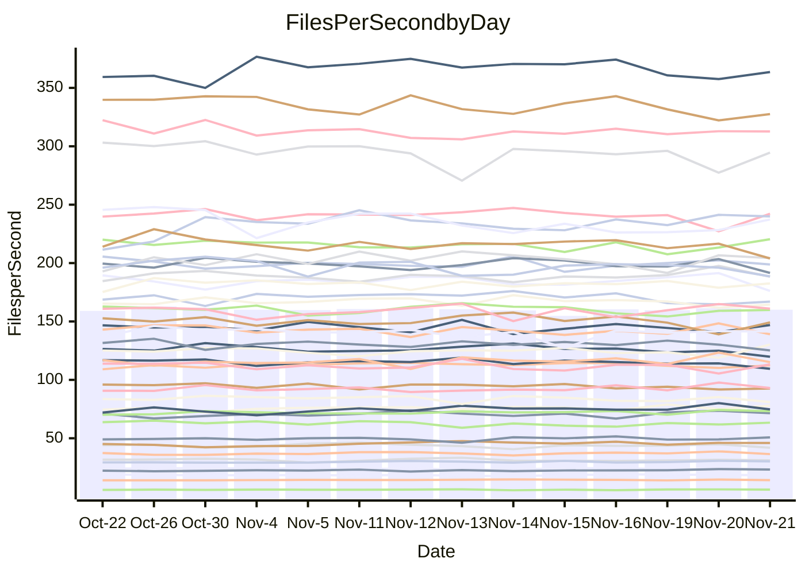

<!---
# This file is auto-generated. Do not edit.
# cspell:disable
--->
# Performance Report

## Daily Performance

## Time to Process Files

| Repository                                      | Elapsed | Min/Avg/Max           |    SD | SD Graph                |
| ----------------------------------------------- | ------: | :-------------------: | ----: | ----------------------- |
| AdaDoom3/AdaDoom3                    |    3.49 | 3.3 /   3.5 /   3.7   |  0.10 | `     ┣━┻━━╋●━┻━┫     ` |
| alexiosc/megistos                    |    7.86 | 7.3 /   7.9 /   8.7   |  0.33 | `    ┣━━┻━━●━━┻━━┫    ` |
| apollographql/apollo-server          |    2.72 | 2.6 /   2.8 /   3.2   |  0.12 | `     ┣━┻━●╋━━┻━┫     ` |
| aspnetboilerplate/aspnetboilerplate  |   10.41 | 10.3 /  10.7 /  11.8  |  0.35 | `    ┣━━┻●━╋━━┻━━┫    ` |
| aws-amplify/docs                     |   13.77 | 12.4 /  13.3 /  14.8  |  0.53 | `    ┣━━┻━━╋━━●━━┫    ` |
| Azure/azure-rest-api-specs           |   10.07 | 9.6 /  10.1 /  11.2   |  0.40 | `    ┣━━┻━━●━━┻━━┫    ` |
| bitjson/typescript-starter           |    1.08 | 1.0 /   1.1 /   1.1   |  0.03 | `     ┣━━┻━●━┻━━┫     ` |
| caddyserver/caddy                    |    3.71 | 3.4 /   3.8 /   4.0   |  0.11 | `     ┣━┻●━╋━━┻━┫     ` |
| canada-ca/open-source-logiciel-libre |    1.15 | 1.1 /   1.2 /   1.3   |  0.05 | `     ┣━━●━╋━┻━━┫     ` |
| chef/chef                            |    6.22 | 5.7 /   6.0 /   6.4   |  0.16 | `    ┣━━┻━━╋━━┻●━┫    ` |
| dart-lang/sdk                        |   68.64 | 63.7 /  67.5 /  72.3  |  2.12 | `   ┣━━┻━━━╋━●━┻━━┫   ` |
| django/django                        |   16.10 | 14.9 /  15.8 /  17.2  |  0.49 | `    ┣━━┻━━╋━●┻━━┫    ` |
| eslint/eslint                        |   10.79 | 10.6 /  11.1 /  11.8  |  0.35 | `    ┣━━●━━╋━━┻━━┫    ` |
| exonum/exonum                        |    3.70 | 3.4 /   3.7 /   4.0   |  0.13 | `     ┣━┻━━╋●━┻━┫     ` |
| flutter/samples                      |   17.54 | 16.0 /  16.9 /  19.0  |  0.60 | `    ┣━━┻━━╋━━●━━┫    ` |
| gitbucket/gitbucket                  |    3.69 | 3.5 /   3.7 /   3.9   |  0.11 | `     ┣━┻━━╋●━┻━┫     ` |
| googleapis/google-cloud-cpp          |  152.78 | 139.9 / 150.0 / 209.7 | 11.85 | `  ┣━━━┻━━━╋●━━┻━━━┫  ` |
| graphql/express-graphql              |    1.13 | 1.1 /   1.2 /   1.3   |  0.05 | `     ┣━━●━╋━┻━━┫     ` |
| graphql/graphql-js                   |    2.80 | 2.8 /   3.0 /   3.2   |  0.11 | `     ┣●┻━━╋━━┻━┫     ` |
| graphql/graphql-relay-js             |    1.16 | 1.1 /   1.2 /   1.2   |  0.03 | `     ┣━━┻●╋━┻━━┫     ` |
| graphql/graphql-spec                 |    1.34 | 1.3 /   1.3 /   1.4   |  0.03 | `     ┣━━┻━●━┻━━┫     ` |
| iluwatar/java-design-patterns        |   13.14 | 12.6 /  13.3 /  14.4  |  0.40 | `    ┣━━┻━●╋━━┻━━┫    ` |
| ktaranov/sqlserver-kit               |    6.60 | 6.6 /   6.8 /   7.3   |  0.19 | `    ┣━●┻━━╋━━┻━━┫    ` |
| liriliri/licia                       |    4.36 | 4.1 /   4.3 /   4.6   |  0.12 | `     ┣━┻━━╋━●┻━┫     ` |
| MartinThoma/LaTeX-examples           |    7.77 | 6.8 /   7.1 /   7.9   |  0.23 | `    ┣━━┻━━╋━━┻━━┫ ●  ` |
| mdx-js/mdx                           |    2.02 | 1.9 /   2.0 /   2.2   |  0.07 | `     ┣━┻━━╋●━┻━┫     ` |
| microsoft/TypeScript-Website         |    5.92 | 5.5 /   5.8 /   6.5   |  0.19 | `    ┣━━┻━━╋━●┻━━┫    ` |
| MicrosoftDocs/PowerShell-Docs        |   23.43 | 22.9 /  24.3 /  26.2  |  0.79 | `    ┣━●┻━━╋━━┻━━┫    ` |
| neovim/nvim-lspconfig                |    4.55 | 4.3 /   4.5 /   4.7   |  0.10 | `     ┣━┻━━╋━━●━┫     ` |
| pagekit/pagekit                      |    3.70 | 3.5 /   3.7 /   4.3   |  0.16 | `     ┣━┻━━●━━┻━┫     ` |
| php/php-src                          |   28.07 | 25.9 /  27.1 /  29.3  |  0.90 | `   ┣━━━┻━━╋━━┻●━━┫   ` |
| plasticrake/tplink-smarthome-api     |    1.33 | 1.3 /   1.4 /   1.5   |  0.05 | `     ┣━●━━╋━━┻━┫     ` |
| prettier/prettier                    |    7.80 | 7.2 /   7.7 /   8.3   |  0.20 | `    ┣━━┻━━╋●━┻━━┫    ` |
| pycontribs/jira                      |    1.55 | 1.5 /   1.6 /   1.7   |  0.06 | `     ┣━┻●━╋━━┻━┫     ` |
| RustPython/RustPython                |    5.91 | 5.2 /   5.5 /   6.0   |  0.23 | `    ┣━━┻━━╋━━┻━●┫    ` |
| shoelace-style/shoelace              |    2.98 | 2.9 /   3.0 /   3.2   |  0.09 | `     ┣━┻━●╋━━┻━┫     ` |
| slint-ui/slint                       |   14.22 | 13.3 /  13.9 /  15.0  |  0.39 | `    ┣━━┻━━╋━━●━━┫    ` |
| SoftwareBrothers/admin-bro           |    2.80 | 2.5 /   2.6 /   2.7   |  0.05 | `     ┣━┻━━╋━━┻━┫   ● ` |
| sveltejs/svelte                      |   22.11 | 20.8 /  21.9 /  22.9  |  0.49 | `    ┣━━┻━━╋●━┻━━┫    ` |
| TheAlgorithms/Python                 |    5.74 | 5.6 /   5.8 /   6.2   |  0.12 | `    ┣━━┻━●╋━━┻━━┫    ` |
| twbs/bootstrap                       |    1.82 | 1.8 /   1.9 /   2.4   |  0.11 | `     ┣━┻●━╋━━┻━┫     ` |
| typescript-cheatsheets/react         |    1.43 | 1.3 /   1.4 /   1.6   |  0.06 | `     ┣━┻━━●━━┻━┫     ` |
| typescript-eslint/typescript-eslint  |    4.28 | 4.2 /   4.3 /   4.7   |  0.13 | `     ┣━┻●━╋━━┻━┫     ` |
| vitest-dev/vitest                    |    9.75 | 9.2 /   9.9 /  10.9   |  0.49 | `    ┣━━┻━●╋━━┻━━┫    ` |
| w3c/aria-practices                   |    3.80 | 3.4 /   3.6 /   3.8   |  0.10 | `     ┣━┻━━╋━━┻━●     ` |
| w3c/specberus                        |    2.02 | 2.0 /   2.1 /   2.2   |  0.06 | `     ┣━●━━╋━━┻━┫     ` |
| webdeveric/webpack-assets-manifest   |    1.28 | 1.2 /   1.2 /   1.4   |  0.05 | `     ┣━━┻━╋━●━━┫     ` |
| webpack/webpack                      |    6.11 | 5.5 /   5.8 /   6.7   |  0.22 | `    ┣━━┻━━╋━━┻●━┫    ` |
| wireapp/wire-desktop                 |    1.41 | 1.3 /   1.5 /   1.7   |  0.09 | `     ┣━┻━●╋━━┻━┫     ` |
| wireapp/wire-webapp                  |   11.00 | 10.6 /  11.2 /  12.6  |  0.52 | `    ┣━━┻━●╋━━┻━━┫    ` |

Note:
- Elapsed time is in seconds.

## Files per Second over Time

| Repository                                      | Files |    Sec |    Fps |    Rel | Trend Fps              |    N |
| ----------------------------------------------- | ----: | -----: | -----: | -----: | ---------------------- | ---: |
| AdaDoom3/AdaDoom3                    |   103 |   3.49 |  29.55 | -0.73% | `▆▇▇▄▇▆▇▆▅▇█▆▅▆▅▇▅▇▇▆` |   30 |
| alexiosc/megistos                    |   583 |   7.86 |  74.14 | -0.33% | `▇▆▇▆▆▆▄▇▆▅▇▇▆▆▆▆▅█▆▆` |   30 |
| apollographql/apollo-server          |   253 |   2.72 |  92.93 |  1.22% | `▇█▇▆▇▇▃▆▆▇▇▅▇▆▆█▆█▇▇` |   30 |
| aspnetboilerplate/aspnetboilerplate  |  2286 |  10.41 | 219.66 |  2.39% | `▆▆▇▆▄██▇▇▅█▅▇▆▆▆▅▇██` |   30 |
| aws-amplify/docs                     |  2871 |  13.77 | 208.51 | -3.38% | `▃█▇▅▆▆▆▆▆▇▇▆▇▆▇▆▅▆▄▅` |   30 |
| Azure/azure-rest-api-specs           |  2365 |  10.07 | 234.83 | -0.43% | `▆▇███▇█▆▅▆▇▇▅▃▇▄▇▆▇▆` |   30 |
| bitjson/typescript-starter           |    20 |   1.08 |  18.45 | -0.36% | `▅▄▅▇▇▇▆▅▄▆▇▆██▆▇█▇▅▆` |   30 |
| caddyserver/caddy                    |   288 |   3.71 |  77.68 |  1.95% | `▆▅▅▅▆▄▆▅▅▅▅▅▄▅▆▆█▅▆▆` |   30 |
| canada-ca/open-source-logiciel-libre |     7 |   1.15 |   6.11 |  2.44% | `▇▆▄▇▆█▅▇▃▆▅▇▄▆▇▇█▇▆▇` |   30 |
| chef/chef                            |  1191 |   6.22 | 191.43 | -4.03% | `▇▆█▆▅▇█▆█▆▇▄▆▇▇█▇▇█▅` |   30 |
| dart-lang/sdk                        | 10778 |  68.64 | 157.01 | -1.37% | `▅▇▇▆▇▇▇█▄▆█▇▅▅▇▇███▆` |   30 |
| django/django                        |  2885 |  16.10 | 179.14 | -1.80% | `▇▆▇▇▆▆▄▇▆▆█▅▆▇▇▇▅▆▇▆` |   30 |
| eslint/eslint                        |  2089 |  10.79 | 193.68 |  2.82% | `▇▅▇▄▅█▆▆▅▆▆▇▆██▅▆█▅▇` |   30 |
| exonum/exonum                        |   421 |   3.70 | 113.85 | -1.02% | `▆▇▇▆▆▄▃▇▆▆▆▆▇▄▆▅▆█▆▆` |   30 |
| flutter/samples                      |  2400 |  17.54 | 136.81 | -3.64% | `▆██▆▇▃▆▇▇▅▇▆▇█▅▅▆█▇▆` |   30 |
| gitbucket/gitbucket                  |   413 |   3.69 | 111.84 | -0.90% | `▇▆█▆█▆▇▇▆▅▇█▇▆▄▇▇▅▆▆` |   30 |
| googleapis/google-cloud-cpp          | 20955 | 152.78 | 137.16 | -2.14% | `▇▇██▇██▇▇▂█▇█▇▇█▇██▇` |   30 |
| graphql/express-graphql              |    26 |   1.13 |  22.97 |  2.48% | `▆▅█▆▃▄▅▆▅▄▅▇▅▃▇▅▇▇▇▆` |   30 |
| graphql/graphql-js                   |   368 |   2.80 | 131.55 |  5.85% | `▆▅▄▇▇▇▄▆▆▇▇▇▆▇▄▇▆▅▇█` |   30 |
| graphql/graphql-relay-js             |    28 |   1.16 |  24.13 |  0.84% | `▇▆▆▆▇▇▆▅▅▇██▇▅▄█▇▆▆▇` |   30 |
| graphql/graphql-spec                 |    19 |   1.34 |  14.23 | -0.03% | `█▇▆▇█▅▆▇██▇█▇▅▅▇▆█▆▇` |   30 |
| iluwatar/java-design-patterns        |  1992 |  13.14 | 151.64 |  1.20% | `▇▅▆▆▅▆▇██▇▇▆▇▇▇▆▆▄▆▇` |   30 |
| ktaranov/sqlserver-kit               |   489 |   6.60 |  74.07 |  3.61% | `▇▇▆▆█▆▅▇▇▇▆▇██▆▄▅█▇█` |   30 |
| liriliri/licia                       |  1437 |   4.36 | 329.47 | -1.68% | `▆▄█▆▇██▆▆▆▇██▅▇▇▆▅▆▆` |   30 |
| MartinThoma/LaTeX-examples           |  1409 |   7.77 | 181.43 | -8.78% | `█▇▆▆█▆▃▇█▇▇█▆▇▇▆▅▇▇▄` |   30 |
| mdx-js/mdx                           |   141 |   2.02 |  69.70 | -1.43% | `▅▇▇▆███▇▆▇▅█▅▆▇█▇██▆` |   30 |
| microsoft/TypeScript-Website         |   761 |   5.92 | 128.61 | -2.05% | `▆▆▆▇█▃▇▇▆▇▇▇▆▇▇▇█▆▄▆` |   30 |
| MicrosoftDocs/PowerShell-Docs        |  2708 |  23.43 | 115.57 |  3.64% | `▆▅▅▆█▆▄█▅▅▄▅▇▆▆▇▆▄▆▇` |   30 |
| neovim/nvim-lspconfig                |   760 |   4.55 | 167.06 | -2.03% | `▇▇▇█▇▇█▇█▆▇▇█▆▅▅▆▅▆▆` |   30 |
| pagekit/pagekit                      |   741 |   3.70 | 200.35 | -0.71% | `▇█▇█▇▇▆█▇▇▇▆▆▃▇▆▅▇█▆` |   30 |
| php/php-src                          |  2262 |  28.07 |  80.60 | -4.00% | `▇▇▇▇██▇▅███▅▆▄▆▆▇▇▆▅` |   30 |
| plasticrake/tplink-smarthome-api     |    62 |   1.33 |  46.68 |  3.93% | `▆▆█▆▇▇▇█▇▇▅▇█▅▆▇▆▇▆▇` |   30 |
| prettier/prettier                    |  2426 |   7.80 | 311.22 | -0.39% | `█▇███▄▇▆▇▇█▇██▇▇▇▇█▇` |   30 |
| pycontribs/jira                      |    79 |   1.55 |  51.11 |  3.24% | `▇▆▇▅▅▅▇▄▇▇▆▅▇▄▆█▃▅▆▇` |   30 |
| RustPython/RustPython                |   703 |   5.91 | 118.96 | -5.28% | `▇█▇▄▆▇▇▇█▇▇▇▇▅▆▇▇▆▅▅` |   30 |
| shoelace-style/shoelace              |   439 |   2.98 | 147.12 |  1.48% | `▇▇▆▆▄▆▆█▅▆▅▇▇▇▆▇▄▅▇▇` |   30 |
| slint-ui/slint                       |  2570 |  14.22 | 180.78 | -2.24% | `█▇▆▇█▇▇▇▆▅▆▇▇▇▆█▇█▄▆` |   30 |
| SoftwareBrothers/admin-bro           |   441 |   2.80 | 157.38 | -5.94% | `▇█▆▇▇▇▇▅█▇▆▆▇▇▇▆▆▅▇▄` |   30 |
| sveltejs/svelte                      |  8068 |  22.11 | 364.88 | -0.45% | `▇▆▇█▇▇▇▆▇▆▆█▇▆▆▆▅▅▆▆` |   30 |
| TheAlgorithms/Python                 |  1399 |   5.74 | 243.71 |  1.09% | `▇▇▆█▅██▇█▇▆█▆▆▆▇▇▄▇▇` |   30 |
| twbs/bootstrap                       |   118 |   1.82 |  64.97 |  3.33% | `▇██▇▇█▇▅▇██▂▆▅▇██▆▆█` |   30 |
| typescript-cheatsheets/react         |    53 |   1.43 |  37.19 |  0.51% | `▄▇▆▇▆▇█▆▄▆▆▆▆▄▆▆▇▇▅▆` |   30 |
| typescript-eslint/typescript-eslint  |  1290 |   4.28 | 301.71 |  1.97% | `▇▇█▇▆▆█▄▇▇▆▇▆▇▇▇▇▅▆▇` |   30 |
| vitest-dev/vitest                    |  2338 |   9.75 | 239.88 |  3.33% | `▆█▇█▆▆▇▆▆▄▅▇▇▇▆▄▇▇▇▇` |   30 |
| w3c/aria-practices                   |   414 |   3.80 | 109.00 | -5.38% | `▇▇█▅▇▇▅█▆█▆▆▆▇█▄▆▆▅▄` |   30 |
| w3c/specberus                        |   197 |   2.02 |  97.41 |  2.88% | `█▅▇▅▇▇█▇▇█▇▇▆█▇▅▇▆▄█` |   30 |
| webdeveric/webpack-assets-manifest   |    55 |   1.28 |  42.86 | -2.85% | `▇▇▆█▅▆▇▅▃█▅▄▅▆▄▅▆▆▄▅` |   30 |
| webpack/webpack                      |  1143 |   6.11 | 187.12 | -5.11% | `▆▆█▇▇█▇▆▆▇▇▇▇▆▇▇▇▇▆▅` |   30 |
| wireapp/wire-desktop                 |    43 |   1.41 |  30.51 | -2.10% | `█▆▆▆▇█▇█▆▅█▅▆▇▇▄▇▇▇▆` |   30 |
| wireapp/wire-webapp                  |  1783 |  11.00 | 162.11 |  1.69% | `▄▇▄▇█▅██▇▇▇█▆▇▇▃▅▇▆▇` |   30 |

## Data Throughput

| Repository                                      | Files |    Sec |     Kps |     Rel | Trend Kps              |    N |
| ----------------------------------------------- | ----: | -----: | ------: | ------: | ---------------------- | ---: |
| AdaDoom3/AdaDoom3                    |   103 |   3.49 |  628.02 |  -0.73% | `▆▇▇▄▇▆▇▆▅▇█▆▅▆▅▇▅▇▇▆` |   30 |
| alexiosc/megistos                    |   583 |   7.86 |  582.56 |  -0.33% | `▇▆▇▆▆▆▄▇▆▅▇▇▆▆▆▆▅█▆▆` |   30 |
| apollographql/apollo-server          |   253 |   2.72 |  759.24 |   1.48% | `▇█▇▆▇▇▃▆▆▇▇▅▇▆▆█▆█▇▇` |   30 |
| aspnetboilerplate/aspnetboilerplate  |  2286 |  10.41 |  534.46 |   2.39% | `▆▆▇▆▄██▇▇▅█▅▇▆▆▆▅▇██` |   30 |
| aws-amplify/docs                     |  2871 |  13.77 |  727.73 |  -3.40% | `▃█▇▅▆▆▆▆▆▇▇▆▇▆▇▆▅▆▄▅` |   30 |
| Azure/azure-rest-api-specs           |  2365 |  10.07 |  638.95 |  -0.03% | `▆▇███▇█▆▅▆▇▇▅▃▇▄▇▆▇▇` |   30 |
| bitjson/typescript-starter           |    20 |   1.08 |   73.79 |  -0.36% | `▅▄▅▇▇▇▆▅▄▆▇▆██▆▇█▇▅▆` |   30 |
| caddyserver/caddy                    |   288 |   3.71 |  674.61 |   2.05% | `▆▅▅▅▆▄▆▅▅▅▅▅▄▅▆▆█▅▆▆` |   30 |
| canada-ca/open-source-logiciel-libre |     7 |   1.15 |   50.60 |   2.44% | `▇▆▄▇▆█▅▇▃▆▅▇▄▆▇▇█▇▆▇` |   30 |
| chef/chef                            |  1191 |   6.22 |  888.82 |  -3.87% | `▇▆█▆▅▇█▆█▆▇▄▆▇▇█▇▇█▅` |   30 |
| dart-lang/sdk                        | 10778 |  68.64 | 1073.39 |  -1.17% | `▅▇▇▆▇▇▇█▅▆█▇▅▅▇▇███▆` |   30 |
| django/django                        |  2885 |  16.10 | 1124.72 |  -1.84% | `▇▆▇▇▆▆▄▇▆▆█▅▆▇▇▇▅▆▇▆` |   30 |
| eslint/eslint                        |  2089 |  10.79 | 1314.31 |  -1.74% | `▇▅▇▅▆█▇▇▆▆▆▇▇▆▆▃▅▆▄▆` |   30 |
| exonum/exonum                        |   421 |   3.70 | 1088.98 |  -1.02% | `▆▇▇▆▆▄▃▇▆▆▆▆▇▄▆▅▆█▆▆` |   30 |
| flutter/samples                      |  2400 |  17.54 | 1220.86 |  -3.64% | `▆██▆▇▃▆▇▇▅▇▆▇█▅▅▆█▇▆` |   30 |
| gitbucket/gitbucket                  |   413 |   3.69 |  508.29 |  -0.90% | `▇▆█▆█▆▇▇▆▅▇█▇▆▄▇▇▅▆▆` |   30 |
| googleapis/google-cloud-cpp          | 20955 | 152.78 | 1117.42 |  -1.98% | `▇▇██▇██▇▇▂█▇█▇▇█▇██▇` |   30 |
| graphql/express-graphql              |    26 |   1.13 |  105.11 |   2.48% | `▆▅█▆▃▄▅▆▅▄▅▇▅▃▇▅▇▇▇▆` |   30 |
| graphql/graphql-js                   |   368 |   2.80 |  763.58 |   5.94% | `▆▅▄▇▇▇▄▆▆▇▇▇▆▇▄▇▆▅▇█` |   30 |
| graphql/graphql-relay-js             |    28 |   1.16 |   94.81 |   0.84% | `▇▆▆▆▇▇▆▅▅▇██▇▅▄█▇▆▆▇` |   30 |
| graphql/graphql-spec                 |    19 |   1.34 |  474.71 |  -0.03% | `█▇▆▇█▅▆▇██▇█▇▅▅▇▆█▆▇` |   30 |
| iluwatar/java-design-patterns        |  1992 |  13.14 |  468.69 |   1.20% | `▇▅▆▆▅▆▇██▇▇▆▇▇▇▆▆▄▆▇` |   30 |
| ktaranov/sqlserver-kit               |   489 |   6.60 | 1121.65 |   3.61% | `▇▇▆▆█▆▅▇▇▇▆▇██▆▄▅█▇█` |   30 |
| liriliri/licia                       |  1437 |   4.36 |  392.52 |  -1.68% | `▆▄█▆▇██▆▆▆▇██▅▇▇▆▅▆▆` |   30 |
| MartinThoma/LaTeX-examples           |  1409 |   7.77 |  374.70 |  -8.78% | `█▇▆▆█▆▃▇█▇▇█▆▇▇▆▅▇▇▄` |   30 |
| mdx-js/mdx                           |   141 |   2.02 |  324.27 |  -1.43% | `▅▇▇▆███▇▆▇▅█▅▆▇█▇██▆` |   30 |
| microsoft/TypeScript-Website         |   761 |   5.92 |  889.61 |  -2.04% | `▆▆▆▇█▃▇▇▆▇▇▇▆▇▇▇█▆▄▆` |   30 |
| MicrosoftDocs/PowerShell-Docs        |  2708 |  23.43 | 1190.10 |   3.66% | `▆▅▅▆█▆▄█▅▅▄▅▇▆▆▇▆▄▆▇` |   30 |
| neovim/nvim-lspconfig                |   760 |   4.55 |  310.17 |   6.48% | `▅▅▅▆▅▅▆▅▆▅▅▅▆█▇▇█▇██` |   30 |
| pagekit/pagekit                      |   741 |   3.70 |  417.73 |  -0.71% | `▇█▇█▇▇▆█▇▇▇▆▆▃▇▆▅▇█▆` |   30 |
| php/php-src                          |  2262 |  28.07 | 1413.00 |  -3.85% | `▇▇▇▇██▇▅███▅▆▄▆▆▇▇▆▅` |   30 |
| plasticrake/tplink-smarthome-api     |    62 |   1.33 |  252.23 |   3.93% | `▆▆█▆▇▇▇█▇▇▅▇█▅▆▇▆▇▆▇` |   30 |
| prettier/prettier                    |  2426 |   7.80 |  431.56 |  -0.67% | `█▇███▄▇▆▇▇█▇██▇▇▆▇█▇` |   30 |
| pycontribs/jira                      |    79 |   1.55 |  362.31 |   3.24% | `▇▆▇▅▅▅▇▄▇▇▆▅▇▄▆█▃▅▆▇` |   30 |
| RustPython/RustPython                |   703 |   5.91 | 1214.63 |  12.29% | `▄▅▄▃▃▄▄▄▅▄▄▄▄▇████▇▇` |   30 |
| shoelace-style/shoelace              |   439 |   2.98 |  710.81 |   1.48% | `▇▇▆▆▄▆▆█▅▆▅▇▇▇▆▇▄▅▇▇` |   30 |
| slint-ui/slint                       |  2570 |  14.22 | 1119.38 |  -1.87% | `█▆▆▇█▇▇▇▆▅▆▇▇▇▆█▇█▄▆` |   30 |
| SoftwareBrothers/admin-bro           |   441 |   2.80 |  346.87 |  -5.94% | `▇█▆▇▇▇▇▅█▇▆▆▇▇▇▆▆▅▇▄` |   30 |
| sveltejs/svelte                      |  8068 |  22.11 |  243.31 |  -0.50% | `▇▆▇█▇▇▇▆▇▆▆█▇▆▆▆▅▅▆▆` |   30 |
| TheAlgorithms/Python                 |  1399 |   5.74 |  619.82 |   1.09% | `▇▇▆█▅██▇█▇▆█▆▆▆▇▇▄▇▇` |   30 |
| twbs/bootstrap                       |   118 |   1.82 |  533.52 |   3.38% | `▇██▇▇█▇▅▇██▂▆▅▇██▆▆█` |   30 |
| typescript-cheatsheets/react         |    53 |   1.43 |  275.09 |   0.51% | `▄▇▆▇▆▇█▆▄▆▆▆▆▄▆▆▇▇▅▆` |   30 |
| typescript-eslint/typescript-eslint  |  1290 |   4.28 | 1557.90 |   2.22% | `▇▇█▇▆▆█▄▇▇▆▇▆▇▇▇▇▅▆█` |   30 |
| vitest-dev/vitest                    |  2338 |   9.75 |  515.36 |   1.78% | `▇█▆█▆▅▇▆▅▃▅▇▆▇▅▃▇▇▇▇` |   30 |
| w3c/aria-practices                   |   414 |   3.80 | 1016.28 |  -5.38% | `▇▇█▅▇▇▅█▆█▆▆▆▇█▄▆▆▅▄` |   30 |
| w3c/specberus                        |   197 |   2.02 |  308.05 |   2.88% | `█▅▇▅▇▇█▇▇█▇▇▆█▇▅▇▆▄█` |   30 |
| webdeveric/webpack-assets-manifest   |    55 |   1.28 |   98.96 |  -2.85% | `▇▇▆█▅▆▇▅▃█▅▄▅▆▄▅▆▆▄▅` |   30 |
| webpack/webpack                      |  1143 |   6.11 |  854.55 |  -4.84% | `▅▆█▇▇█▇▆▆▇▇▇▇▆▇▇▇▇▆▅` |   30 |
| wireapp/wire-desktop                 |    43 |   1.41 |  134.80 | -19.19% | `█▇▆▇██▇█▇▆█▆▇▃▄▂▃▃▃▃` |   30 |
| wireapp/wire-webapp                  |  1783 |  11.00 |  600.24 |   1.86% | `▄▇▄▇█▅██▇▇▇█▆▇▇▃▅▇▆▇` |   30 |

