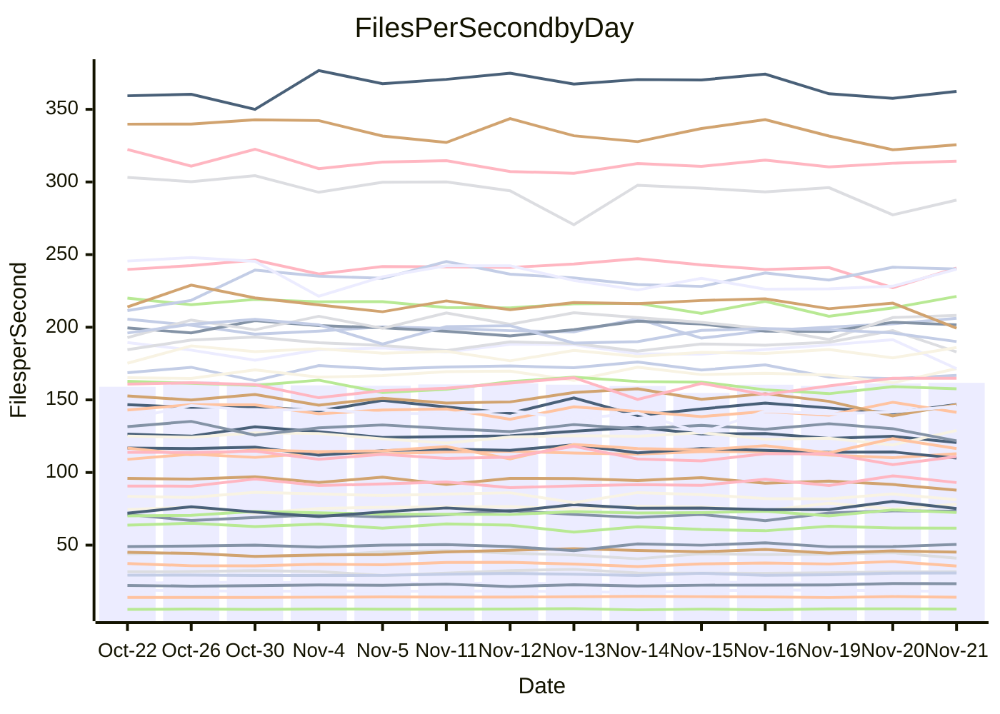

<!---
# This file is auto-generated. Do not edit.
# cspell:disable
--->
# Performance Report

## Daily Performance

## Time to Process Files

| Repository                                      | Elapsed | Min/Avg/Max           |    SD | SD Graph                |
| ----------------------------------------------- | ------: | :-------------------: | ----: | ----------------------- |
| AdaDoom3/AdaDoom3                    |    3.34 | 3.3 /   3.5 /   3.7   |  0.10 | `     ┣●┻━━╋━━┻━┫     ` |
| alexiosc/megistos                    |    7.75 | 7.3 /   7.9 /   8.7   |  0.33 | `    ┣━━┻━●╋━━┻━━┫    ` |
| apollographql/apollo-server          |    2.72 | 2.6 /   2.8 /   3.2   |  0.12 | `     ┣━┻━●╋━━┻━┫     ` |
| aspnetboilerplate/aspnetboilerplate  |   10.33 | 10.3 /  10.7 /  11.8  |  0.35 | `    ┣━━●━━╋━━┻━━┫    ` |
| aws-amplify/docs                     |   14.40 | 12.4 /  13.3 /  14.8  |  0.50 | `    ┣━━┻━━╋━━┻━━┫●   ` |
| Azure/azure-rest-api-specs           |    9.86 | 9.6 /  10.1 /  11.2   |  0.41 | `    ┣━━┻●━╋━━┻━━┫    ` |
| bitjson/typescript-starter           |    1.11 | 1.0 /   1.1 /   1.1   |  0.03 | `     ┣━━┻━╋━●━━┫     ` |
| caddyserver/caddy                    |    3.68 | 3.4 /   3.8 /   4.0   |  0.11 | `     ┣━●━━╋━━┻━┫     ` |
| canada-ca/open-source-logiciel-libre |    1.17 | 1.1 /   1.2 /   1.3   |  0.05 | `     ┣━━┻●╋━┻━━┫     ` |
| chef/chef                            |    5.78 | 5.7 /   6.0 /   6.4   |  0.16 | `    ┣━●┻━━╋━━┻━━┫    ` |
| dart-lang/sdk                        |   65.38 | 63.7 /  67.6 /  72.3  |  2.12 | `   ┣━━●━━━╋━━━┻━━┫   ` |
| django/django                        |   15.51 | 14.9 /  15.8 /  17.2  |  0.50 | `    ┣━━┻●━╋━━┻━━┫    ` |
| eslint/eslint                        |   11.41 | 10.6 /  11.1 /  11.8  |  0.35 | `    ┣━━┻━━╋━●┻━━┫    ` |
| exonum/exonum                        |    3.61 | 3.4 /   3.7 /   4.0   |  0.13 | `     ┣━┻━●╋━━┻━┫     ` |
| flutter/samples                      |   16.97 | 16.0 /  16.9 /  19.0  |  0.61 | `    ┣━━┻━━●━━┻━━┫    ` |
| gitbucket/gitbucket                  |    3.66 | 3.5 /   3.7 /   3.9   |  0.11 | `     ┣━┻━━●━━┻━┫     ` |
| googleapis/google-cloud-cpp          |  143.81 | 139.9 / 150.2 / 209.7 | 11.99 | `  ┣━━━┻━●━╋━━━┻━━━┫  ` |
| graphql/express-graphql              |    1.11 | 1.1 /   1.2 /   1.3   |  0.05 | `     ┣━●┻━╋━┻━━┫     ` |
| graphql/graphql-js                   |    2.85 | 2.8 /   3.0 /   3.2   |  0.11 | `     ┣━●━━╋━━┻━┫     ` |
| graphql/graphql-relay-js             |    1.17 | 1.1 /   1.2 /   1.2   |  0.04 | `     ┣━━┻━●━┻━━┫     ` |
| graphql/graphql-spec                 |    1.35 | 1.3 /   1.3 /   1.4   |  0.03 | `     ┣━━┻━╋●┻━━┫     ` |
| iluwatar/java-design-patterns        |   13.57 | 12.6 /  13.3 /  14.4  |  0.40 | `    ┣━━┻━━╋━●┻━━┫    ` |
| ktaranov/sqlserver-kit               |    6.75 | 6.6 /   6.8 /   7.3   |  0.19 | `    ┣━━┻━●╋━━┻━━┫    ` |
| liriliri/licia                       |    4.41 | 4.1 /   4.3 /   4.6   |  0.12 | `     ┣━┻━━╋━━●━┫     ` |
| MartinThoma/LaTeX-examples           |    6.99 | 6.8 /   7.1 /   7.9   |  0.24 | `    ┣━━┻━●╋━━┻━━┫    ` |
| mdx-js/mdx                           |    1.92 | 1.9 /   2.0 /   2.2   |  0.07 | `     ┣━●━━╋━━┻━┫     ` |
| microsoft/TypeScript-Website         |    6.25 | 5.5 /   5.8 /   6.5   |  0.18 | `    ┣━━┻━━╋━━┻━━┫●   ` |
| MicrosoftDocs/PowerShell-Docs        |   24.41 | 22.9 /  24.3 /  26.2  |  0.80 | `    ┣━━┻━━●━━┻━━┫    ` |
| neovim/nvim-lspconfig                |    4.55 | 4.3 /   4.5 /   4.7   |  0.10 | `     ┣━┻━━╋━━●━┫     ` |
| pagekit/pagekit                      |    3.56 | 3.5 /   3.7 /   4.3   |  0.16 | `     ┣━┻●━╋━━┻━┫     ` |
| php/php-src                          |   27.80 | 25.9 /  27.0 /  29.3  |  0.91 | `   ┣━━━┻━━╋━━●━━━┫   ` |
| plasticrake/tplink-smarthome-api     |    1.37 | 1.3 /   1.4 /   1.5   |  0.05 | `     ┣━┻━●╋━━┻━┫     ` |
| prettier/prettier                    |    7.72 | 7.2 /   7.7 /   8.3   |  0.21 | `    ┣━━┻━━●━━┻━━┫    ` |
| pycontribs/jira                      |    1.57 | 1.5 /   1.6 /   1.7   |  0.07 | `     ┣━┻━●╋━━┻━┫     ` |
| RustPython/RustPython                |    5.83 | 5.2 /   5.5 /   6.0   |  0.22 | `    ┣━━┻━━╋━━┻●━┫    ` |
| shoelace-style/shoelace              |    2.99 | 2.9 /   3.0 /   3.2   |  0.09 | `     ┣━┻━●╋━━┻━┫     ` |
| slint-ui/slint                       |   14.99 | 13.3 /  13.8 /  14.5  |  0.34 | `    ┣━━┻━━╋━━┻━━┫   ●` |
| SoftwareBrothers/admin-bro           |    2.57 | 2.5 /   2.6 /   2.7   |  0.05 | `     ┣●┻━━╋━━┻━┫     ` |
| sveltejs/svelte                      |   22.27 | 20.8 /  21.9 /  22.9  |  0.49 | `    ┣━━┻━━╋━●┻━━┫    ` |
| TheAlgorithms/Python                 |    5.81 | 5.6 /   5.8 /   6.2   |  0.13 | `    ┣━━┻━━●━━┻━━┫    ` |
| twbs/bootstrap                       |    1.91 | 1.8 /   1.9 /   2.4   |  0.11 | `     ┣━┻━━╋●━┻━┫     ` |
| typescript-cheatsheets/react         |    1.49 | 1.3 /   1.4 /   1.6   |  0.06 | `     ┣━┻━━╋━●┻━┫     ` |
| typescript-eslint/typescript-eslint  |    4.49 | 4.2 /   4.3 /   4.7   |  0.13 | `     ┣━┻━━╋━━●━┫     ` |
| vitest-dev/vitest                    |    9.74 | 9.2 /   9.9 /  10.9   |  0.49 | `    ┣━━┻━●╋━━┻━━┫    ` |
| w3c/aria-practices                   |    3.77 | 3.4 /   3.6 /   3.8   |  0.09 | `     ┣━┻━━╋━━┻━●     ` |
| w3c/specberus                        |    2.24 | 2.0 /   2.1 /   2.2   |  0.05 | `     ┣━┻━━╋━━┻━┫  ●  ` |
| webdeveric/webpack-assets-manifest   |    1.34 | 1.2 /   1.2 /   1.4   |  0.05 | `     ┣━━┻━╋━┻━━●     ` |
| webpack/webpack                      |    6.01 | 5.5 /   5.8 /   6.7   |  0.22 | `    ┣━━┻━━╋━━●━━┫    ` |
| wireapp/wire-desktop                 |    1.36 | 1.3 /   1.5 /   1.7   |  0.09 | `     ┣━●━━╋━━┻━┫     ` |
| wireapp/wire-webapp                  |   11.31 | 10.6 /  11.2 /  12.6  |  0.53 | `    ┣━━┻━━╋●━┻━━┫    ` |

Note:
- Elapsed time is in seconds.

## Files per Second over Time

| Repository                                      | Files |    Sec |    Fps |    Rel | Trend Fps              |    N |
| ----------------------------------------------- | ----: | -----: | -----: | -----: | ---------------------- | ---: |
| AdaDoom3/AdaDoom3                    |   103 |   3.34 |  30.88 |  3.86% | `▅▆▇▇▄▇▆▇▆▅▇█▆▅▆▅▇▅▇▇` |   29 |
| alexiosc/megistos                    |   583 |   7.75 |  75.22 |  1.16% | `▇▇▆▇▆▆▆▄▇▆▅▇▇▆▆▆▆▅█▆` |   29 |
| apollographql/apollo-server          |   253 |   2.72 |  93.09 |  1.44% | `▅▇█▇▆▇▇▃▆▆▇▇▅▇▆▆█▆█▇` |   29 |
| aspnetboilerplate/aspnetboilerplate  |  2286 |  10.33 | 221.24 |  3.24% | `█▆▆▇▆▄██▇▇▅█▅▇▆▆▆▅▇█` |   29 |
| aws-amplify/docs                     |  2871 |  14.40 | 199.40 | -7.85% | `▆▃█▇▅▆▆▆▆▆▇▇▆▇▆▇▆▅▆▄` |   29 |
| Azure/azure-rest-api-specs           |  2365 |   9.86 | 239.87 |  1.77% | `█▆▇███▇█▆▅▆▇▇▅▃▇▄▇▆▇` |   29 |
| bitjson/typescript-starter           |    20 |   1.11 |  18.09 | -2.36% | `▇▅▄▅▇▇▇▆▅▄▆▇▆██▆▇█▇▅` |   29 |
| caddyserver/caddy                    |   288 |   3.68 |  78.17 |  2.69% | `▆▆▅▅▅▆▄▆▅▅▅▅▅▄▅▆▆█▅▆` |   29 |
| canada-ca/open-source-logiciel-libre |     7 |   1.17 |   6.00 |  0.73% | `▅▇▆▄▇▆█▅▇▃▆▅▇▄▆▇▇█▇▆` |   29 |
| chef/chef                            |  1191 |   5.78 | 206.18 |  3.49% | `▇▇▆█▆▅▇█▆█▆▇▄▆▇▇█▇▇█` |   29 |
| dart-lang/sdk                        | 10778 |  65.38 | 164.86 |  3.68% | `▆▅▇▇▆▇▇▇█▄▆█▇▅▅▇▇███` |   29 |
| django/django                        |  2885 |  15.51 | 186.00 |  2.03% | `▇▇▆▇▇▆▆▄▇▆▆█▅▆▇▇▇▅▆▇` |   29 |
| eslint/eslint                        |  2089 |  11.41 | 183.07 | -2.91% | `▄▇▅▇▄▅█▆▆▅▆▆▇▆██▅▆█▅` |   29 |
| exonum/exonum                        |   421 |   3.61 | 116.49 |  1.31% | `▇▆▇▇▆▆▄▃▇▆▆▆▆▇▄▆▅▆█▆` |   29 |
| flutter/samples                      |  2400 |  16.97 | 141.40 | -0.42% | `▇▆██▆▇▃▆▇▇▅▇▆▇█▅▅▆█▇` |   29 |
| gitbucket/gitbucket                  |   413 |   3.66 | 112.89 |  0.03% | `▄▇▆█▆█▆▇▇▆▅▇█▇▆▄▇▇▅▆` |   29 |
| googleapis/google-cloud-cpp          | 20955 | 143.81 | 145.71 |  4.10% | `█▇▇▇█▇██▇▇▂█▇▇▇▇▇▇▇█` |   29 |
| graphql/express-graphql              |    26 |   1.11 |  23.49 |  5.00% | `▅▆▅█▆▃▄▅▆▅▄▅▇▅▃▇▅▇▇▇` |   29 |
| graphql/graphql-js                   |   368 |   2.85 | 128.93 |  3.88% | `▅▆▆▄▇██▄▇▇▇█▇▆▇▄█▇▅█` |   29 |
| graphql/graphql-relay-js             |    28 |   1.17 |  23.90 | -0.14% | `█▆▆▅▅▆▇▆▅▅▆▇▇▇▄▄▇▆▅▆` |   29 |
| graphql/graphql-spec                 |    19 |   1.35 |  14.11 | -0.90% | `▇█▇▆▇█▅▆▇██▇█▇▅▅▇▆█▆` |   29 |
| iluwatar/java-design-patterns        |  1992 |  13.57 | 146.76 | -2.13% | `▇▇▅▆▆▅▆▇██▇▇▆▇▇▇▆▆▄▆` |   29 |
| ktaranov/sqlserver-kit               |   489 |   6.75 |  72.43 |  1.37% | `▆▇▇▆▆█▆▅▇▇▇▆▇██▆▄▅█▇` |   29 |
| liriliri/licia                       |  1437 |   4.41 | 325.61 | -2.92% | `▆▆▄█▆▇██▆▆▆▇██▅▇▇▆▅▆` |   29 |
| MartinThoma/LaTeX-examples           |  1409 |   6.99 | 201.69 |  1.46% | `██▇▆▆█▆▃▇█▇▇█▆▇▇▆▅▇▇` |   29 |
| mdx-js/mdx                           |   141 |   1.92 |  73.35 |  3.87% | `▅▅▇▇▆███▇▆▇▅█▅▆▇█▇██` |   29 |
| microsoft/TypeScript-Website         |   761 |   6.25 | 121.81 | -7.46% | `▆▆▆▆▇█▃▇▇▆▇▇▇▆▇▇▇█▆▄` |   29 |
| MicrosoftDocs/PowerShell-Docs        |  2708 |  24.41 | 110.94 | -0.54% | `▅▆▅▅▆█▆▄█▅▅▄▅▇▆▆▇▆▄▆` |   29 |
| neovim/nvim-lspconfig                |   760 |   4.55 | 166.89 | -2.20% | `▆▇▇▇█▇▇█▇█▆▇▇█▆▅▅▆▅▆` |   29 |
| pagekit/pagekit                      |   741 |   3.56 | 208.19 |  3.29% | `▅▇█▇█▇▇▆█▇▇▇▆▆▃▇▆▅▇█` |   29 |
| php/php-src                          |  2262 |  27.80 |  81.38 | -3.17% | `▅▇▇▇▇██▇▅███▅▆▄▆▆▇▇▆` |   29 |
| plasticrake/tplink-smarthome-api     |    62 |   1.37 |  45.17 |  0.60% | `▅▆▆█▆▇▇▇█▇▇▅▇█▅▆▇▆▇▆` |   29 |
| prettier/prettier                    |  2426 |   7.72 | 314.26 |  0.60% | `▇█▇███▄▇▆▇▇█▇██▇▇▇▇█` |   29 |
| pycontribs/jira                      |    79 |   1.57 |  50.46 |  1.99% | `▆▇▆▇▅▅▅▇▄▇▇▆▅▇▄▆█▃▅▆` |   29 |
| RustPython/RustPython                |   703 |   5.83 | 120.63 | -4.08% | `▆▇█▇▄▆▇▇▇█▇▇▇▇▅▆▇▇▆▅` |   29 |
| shoelace-style/shoelace              |   439 |   2.99 | 146.87 |  1.35% | `▇▇▇▆▆▄▆▆█▅▆▅▇▇▇▆▇▄▅▇` |   29 |
| slint-ui/slint                       |  2570 |  14.99 | 171.50 | -7.49% | `▅█▆▅▇█▇▇▇▆▅▆▇▆▇▆█▇█▃` |   29 |
| SoftwareBrothers/admin-bro           |   441 |   2.57 | 171.51 |  2.60% | `▅▇█▆▇▇▇▇▅█▇▆▆▇▇▇▆▆▅▇` |   29 |
| sveltejs/svelte                      |  8068 |  22.27 | 362.33 | -1.19% | `▆▇▆▇█▇▇▇▆▇▆▆█▇▆▆▆▅▅▆` |   29 |
| TheAlgorithms/Python                 |  1399 |   5.81 | 240.74 | -0.15% | `█▇▇▆█▅██▇█▇▆█▆▆▆▇▇▄▇` |   29 |
| twbs/bootstrap                       |   118 |   1.91 |  61.71 | -1.91% | `▆▇██▇▇█▇▅▇██▂▆▅▇██▆▆` |   29 |
| typescript-cheatsheets/react         |    53 |   1.49 |  35.66 | -3.76% | `▆▄▇▆▇▆▇█▆▄▆▆▆▆▄▆▆▇▇▅` |   29 |
| typescript-eslint/typescript-eslint  |  1290 |   4.49 | 287.54 | -2.91% | `▇▇▇█▇▆▆█▄▇▇▆▇▆▇▇▇▇▅▆` |   29 |
| vitest-dev/vitest                    |  2338 |   9.74 | 240.12 |  3.56% | `▆▆█▇█▆▆▇▆▆▄▅▇▇▇▆▄▇▇▇` |   29 |
| w3c/aria-practices                   |   414 |   3.77 | 109.92 | -4.73% | `▅▇▇█▅▇▇▅█▆█▆▆▆▇█▄▆▆▅` |   29 |
| w3c/specberus                        |   197 |   2.24 |  87.85 | -7.45% | `██▅▇▅▇▇█▇▇█▇▇▆█▇▄▇▅▄` |   29 |
| webdeveric/webpack-assets-manifest   |    55 |   1.34 |  41.01 | -7.25% | `▇▇▇▆█▅▆▇▅▃█▅▄▅▆▄▅▆▆▄` |   29 |
| webpack/webpack                      |  1143 |   6.01 | 190.15 | -3.69% | `▃▆▆█▇▇█▇▆▆▇▇▇▇▆▇▇▇▇▆` |   29 |
| wireapp/wire-desktop                 |    43 |   1.36 |  31.67 |  1.68% | `▃█▆▆▆▇█▇█▆▅█▅▆▇▇▄▇▇▇` |   29 |
| wireapp/wire-webapp                  |  1783 |  11.31 | 157.68 | -1.12% | `▇▄▇▄▇█▅██▇▇▇█▆▇▇▃▅▇▆` |   29 |

## Data Throughput

| Repository                                      | Files |    Sec |     Kps |     Rel | Trend Kps              |    N |
| ----------------------------------------------- | ----: | -----: | ------: | ------: | ---------------------- | ---: |
| AdaDoom3/AdaDoom3                    |   103 |   3.34 |  656.19 |   3.86% | `▅▆▇▇▄▇▆▇▆▅▇█▆▅▆▅▇▅▇▇` |   29 |
| alexiosc/megistos                    |   583 |   7.75 |  591.04 |   1.16% | `▇▇▆▇▆▆▆▄▇▆▅▇▇▆▆▆▆▅█▆` |   29 |
| apollographql/apollo-server          |   253 |   2.72 |  760.51 |   1.71% | `▅▇█▇▆▇▇▃▆▆▇▇▅▇▆▆█▆█▇` |   29 |
| aspnetboilerplate/aspnetboilerplate  |  2286 |  10.33 |  538.29 |   3.24% | `█▆▆▇▆▄██▇▇▅█▅▇▆▆▆▅▇█` |   29 |
| aws-amplify/docs                     |  2871 |  14.40 |  695.92 |  -7.87% | `▆▃█▇▅▆▆▆▆▆▇▇▆▇▆▇▆▅▆▄` |   29 |
| Azure/azure-rest-api-specs           |  2365 |   9.86 |  652.66 |   2.19% | `█▆▇███▇█▆▅▆▇▇▅▃▇▄▇▆▇` |   29 |
| bitjson/typescript-starter           |    20 |   1.11 |   72.37 |  -2.36% | `▇▅▄▅▇▇▇▆▅▄▆▇▆██▆▇█▇▅` |   29 |
| caddyserver/caddy                    |   288 |   3.68 |  678.87 |   2.79% | `▆▆▅▅▅▆▄▆▅▅▅▅▅▄▅▆▆█▅▆` |   29 |
| canada-ca/open-source-logiciel-libre |     7 |   1.17 |   49.74 |   0.73% | `▅▇▆▄▇▆█▅▇▃▆▅▇▄▆▇▇█▇▆` |   29 |
| chef/chef                            |  1191 |   5.78 |  957.35 |   3.67% | `▇▇▆█▆▅▇█▆█▆▇▄▆▇▇█▇▇█` |   29 |
| dart-lang/sdk                        | 10778 |  65.38 | 1127.02 |   3.91% | `▆▅▇▇▆▇▇▇█▅▆█▇▅▅▇▇███` |   29 |
| django/django                        |  2885 |  15.51 | 1167.74 |   1.98% | `▇▇▆▇▇▆▆▄▇▆▆█▅▆▇▇▇▅▆▇` |   29 |
| eslint/eslint                        |  2089 |  11.41 | 1242.32 |  -7.35% | `▅▇▅▇▅▆█▇▇▆▆▆▇▇▆▆▃▅▆▄` |   29 |
| exonum/exonum                        |   421 |   3.61 | 1114.22 |   1.31% | `▇▆▇▇▆▆▄▃▇▆▆▆▆▇▄▆▅▆█▆` |   29 |
| flutter/samples                      |  2400 |  16.97 | 1261.85 |  -0.42% | `▇▆██▆▇▃▆▇▇▅▇▆▇█▅▅▆█▇` |   29 |
| gitbucket/gitbucket                  |   413 |   3.66 |  513.08 |   0.03% | `▄▇▆█▆█▆▇▇▆▅▇█▇▆▄▇▇▅▆` |   29 |
| googleapis/google-cloud-cpp          | 20955 | 143.81 | 1187.07 |   4.28% | `█▇▇▇█▇██▇▇▂█▇█▇▇█▇▇█` |   29 |
| graphql/express-graphql              |    26 |   1.11 |  107.51 |   5.00% | `▅▆▅█▆▃▄▅▆▅▄▅▇▅▃▇▅▇▇▇` |   29 |
| graphql/graphql-js                   |   368 |   2.85 |  748.35 |   3.97% | `▅▆▆▄▇██▄▇▇▇█▇▆▇▄█▇▅█` |   29 |
| graphql/graphql-relay-js             |    28 |   1.17 |   93.90 |  -0.14% | `█▆▆▅▅▆▇▆▅▅▆▇▇▇▄▄▇▆▅▆` |   29 |
| graphql/graphql-spec                 |    19 |   1.35 |  470.76 |  -0.90% | `▇█▇▆▇█▅▆▇██▇█▇▅▅▇▆█▆` |   29 |
| iluwatar/java-design-patterns        |  1992 |  13.57 |  453.60 |  -2.13% | `▇▇▅▆▆▅▆▇██▇▇▆▇▇▇▆▆▄▆` |   29 |
| ktaranov/sqlserver-kit               |   489 |   6.75 | 1096.88 |   1.37% | `▆▇▇▆▆█▆▅▇▇▇▆▇██▆▄▅█▇` |   29 |
| liriliri/licia                       |  1437 |   4.41 |  387.92 |  -2.92% | `▆▆▄█▆▇██▆▆▆▇██▅▇▇▆▅▆` |   29 |
| MartinThoma/LaTeX-examples           |  1409 |   6.99 |  416.56 |   1.46% | `██▇▆▆█▆▃▇█▇▇█▆▇▇▆▅▇▇` |   29 |
| mdx-js/mdx                           |   141 |   1.92 |  341.24 |   3.87% | `▅▅▇▇▆███▇▆▇▅█▅▆▇█▇██` |   29 |
| microsoft/TypeScript-Website         |   761 |   6.25 |  842.55 |  -7.46% | `▆▆▆▆▇█▃▇▇▆▇▇▇▆▇▇▇█▆▄` |   29 |
| MicrosoftDocs/PowerShell-Docs        |  2708 |  24.41 | 1142.36 |  -0.52% | `▅▆▅▅▆█▆▄█▅▅▄▅▇▆▆▇▆▄▆` |   29 |
| neovim/nvim-lspconfig                |   760 |   4.55 |  309.85 |   6.61% | `▅▅▅▅▆▅▅▆▅▆▅▅▅▆█▇▇█▇█` |   29 |
| pagekit/pagekit                      |   741 |   3.56 |  434.07 |   3.29% | `▅▇█▇█▇▇▆█▇▇▇▆▆▃▇▆▅▇█` |   29 |
| php/php-src                          |  2262 |  27.80 | 1426.67 |  -3.01% | `▅▇▇▇▇██▇▅███▅▆▄▆▆▇▇▆` |   29 |
| plasticrake/tplink-smarthome-api     |    62 |   1.37 |  244.09 |   0.60% | `▅▆▆█▆▇▇▇█▇▇▅▇█▅▆▇▆▇▆` |   29 |
| prettier/prettier                    |  2426 |   7.72 |  435.76 |   0.31% | `▇█▇███▄▇▆▇▇█▇██▇▇▆▇█` |   29 |
| pycontribs/jira                      |    79 |   1.57 |  357.67 |   1.99% | `▆▇▆▇▅▅▅▇▄▇▇▆▅▇▄▆█▃▅▆` |   29 |
| RustPython/RustPython                |   703 |   5.83 | 1231.69 |  14.41% | `▄▄▅▄▃▃▄▄▄▅▄▄▄▄▇████▇` |   29 |
| shoelace-style/shoelace              |   439 |   2.99 |  709.58 |   1.35% | `▇▇▇▆▆▄▆▆█▅▆▅▇▇▇▆▇▄▅▇` |   29 |
| slint-ui/slint                       |  2570 |  14.99 | 1061.90 |  -7.13% | `▅█▆▅▆█▇▇▇▆▅▆▇▆▇▆█▇█▄` |   29 |
| SoftwareBrothers/admin-bro           |   441 |   2.57 |  378.03 |   2.60% | `▅▇█▆▇▇▇▇▅█▇▆▆▇▇▇▆▆▅▇` |   29 |
| sveltejs/svelte                      |  8068 |  22.27 |  241.61 |  -1.24% | `▆▇▆▇█▇▇▇▆▇▆▆█▇▆▆▆▅▅▆` |   29 |
| TheAlgorithms/Python                 |  1399 |   5.81 |  612.25 |  -0.15% | `█▇▇▆█▅██▇█▇▆█▆▆▆▇▇▄▇` |   29 |
| twbs/bootstrap                       |   118 |   1.91 |  506.75 |  -1.87% | `▆▇██▇▇█▇▅▇██▂▆▅▇██▆▆` |   29 |
| typescript-cheatsheets/react         |    53 |   1.49 |  263.74 |  -3.76% | `▆▄▇▆▇▆▇█▆▄▆▆▆▆▄▆▆▇▇▅` |   29 |
| typescript-eslint/typescript-eslint  |  1290 |   4.49 | 1484.71 |  -2.67% | `▇▇▇█▇▆▆█▄▇▇▆▇▆▇▇▇▇▅▆` |   29 |
| vitest-dev/vitest                    |  2338 |   9.74 |  515.88 |   1.95% | `▇▇█▆█▆▅▇▆▅▃▅▇▆▇▅▃▇▇▇` |   29 |
| w3c/aria-practices                   |   414 |   3.77 | 1024.82 |  -4.73% | `▅▇▇█▅▇▇▅█▆█▆▆▆▇█▄▆▆▅` |   29 |
| w3c/specberus                        |   197 |   2.24 |  277.81 |  -7.45% | `██▅▇▅▇▇█▇▇█▇▇▆█▇▄▇▅▄` |   29 |
| webdeveric/webpack-assets-manifest   |    55 |   1.34 |   94.71 |  -7.25% | `▇▇▇▆█▅▆▇▅▃█▅▄▅▆▄▅▆▆▄` |   29 |
| webpack/webpack                      |  1143 |   6.01 |  868.40 |  -3.41% | `▃▅▆█▇▇█▇▆▆▇▇▇▇▆▇▇▇▇▆` |   29 |
| wireapp/wire-desktop                 |    43 |   1.36 |  139.94 | -16.58% | `▄█▇▆▇██▇█▇▆█▆▇▃▄▂▃▃▃` |   29 |
| wireapp/wire-webapp                  |  1783 |  11.31 |  583.85 |  -0.95% | `▇▄▇▄▇█▅██▇▇▇█▆▇▇▃▅▇▆` |   29 |

