<!---
# This file is auto-generated. Do not edit.
# cspell:disable
--->
# Performance Report

## Daily Performance

```mermaid
xychart-beta
    title Files Per Second by Day
    y-axis Files per Second
    x-axis Date [Jul-13, Jul-14, Jul-15, Jul-16, Jul-17, Jul-19, Jul-22, Jul-23, Jul-25, Jul-26, Jul-28, Jul-29, Jul-30, Jul-31, Aug-1, Aug-2, Aug-4, Aug-5, Aug-6, Aug-8, Aug-12]
    bar [58.79, 58.57, 57.68, 58.00, 58.84, 59.26, 58.68, 58.17, 57.75, 59.61, 62.19, 65.99, 119.41, 176.56, 184.20, 186.93, 190.59, 192.54, 190.31, 191.20, 191.99]
    line [7.02, 7.16, 6.36, 6.65, 7.05, 6.66, 6.84, 6.55, 7.13, 7.15, 6.78, 0.00, 8.58, 9.59, 10.14, 9.83, 9.72, 9.85, 9.44, 9.50, 10.61]
    line [23.37, 23.45, 21.90, 22.54, 22.12, 21.29, 22.30, 22.15, 22.47, 22.47, 21.08, 0.00, 28.05, 33.97, 33.41, 33.88, 33.91, 34.47, 34.14, 34.20, 35.52]
    line [29.33, 23.74, 27.78, 29.18, 29.05, 28.29, 28.99, 28.99, 27.54, 30.39, 28.15, 0.00, 35.47, 43.82, 43.53, 45.91, 45.13, 44.18, 44.67, 44.79, 46.17]
    line [62.00, 61.78, 58.43, 59.29, 60.30, 60.91, 58.60, 59.89, 55.90, 58.62, 60.13, 0.00, 136.93, 181.56, 189.65, 195.02, 194.05, 193.40, 189.46, 188.48, 181.89]
    line [27.83, 26.89, 27.74, 26.93, 27.57, 26.61, 27.38, 24.63, 27.03, 27.61, 25.25, 0.00, 35.54, 41.12, 40.79, 42.70, 43.09, 42.44, 41.97, 42.95, 42.54]
    line [7.58, 8.03, 7.85, 7.73, 7.70, 7.98, 7.91, 8.05, 7.59, 7.45, 7.70, 0.00, 15.35, 20.52, 20.02, 21.02, 20.56, 20.41, 20.21, 21.19, 20.61]
    line [37.65, 38.19, 37.44, 36.08, 36.17, 36.80, 36.33, 33.86, 36.85, 37.77, 39.16, 40.78, 81.67, 125.88, 127.23, 122.52, 127.67, 132.91, 132.93, 128.73, 121.46]
    line [26.70, 27.10, 27.20, 27.07, 27.01, 26.92, 27.47, 26.66, 27.43, 30.97, 30.05, 31.96, 64.46, 87.66, 89.40, 91.61, 93.99, 88.14, 91.02, 91.26, 92.27]
    line [36.86, 37.32, 34.63, 36.12, 35.95, 32.06, 35.91, 34.84, 35.83, 37.74, 37.47, 0.00, 86.83, 145.57, 147.18, 152.61, 139.36, 148.78, 146.56, 150.53, 150.82]
    line [63.02, 53.69, 62.28, 61.82, 60.90, 61.88, 63.11, 62.37, 60.34, 59.14, 63.13, 60.18, 114.35, 151.18, 156.08, 157.09, 160.72, 160.91, 159.40, 154.37, 150.44]
    line [11.44, 11.22, 11.35, 11.98, 12.04, 12.02, 11.90, 11.80, 11.36, 13.55, 14.23, 0.00, 25.77, 32.08, 37.76, 37.97, 39.70, 39.42, 39.41, 39.34, 38.43]
    line [22.06, 22.60, 22.13, 22.43, 22.72, 22.55, 21.86, 22.26, 21.95, 23.43, 24.27, 0.00, 53.52, 73.42, 79.00, 75.87, 80.18, 81.35, 79.97, 79.56, 82.94]
    line [39.28, 40.59, 38.43, 40.23, 39.01, 38.80, 38.78, 39.91, 39.18, 41.18, 41.34, 42.39, 74.35, 101.66, 102.10, 101.86, 102.94, 98.59, 101.98, 102.16, 98.05]
    line [118.00, 119.52, 118.41, 117.73, 118.60, 117.23, 116.11, 111.98, 117.50, 116.92, 121.39, 128.96, 224.88, 287.65, 265.54, 309.80, 305.59, 302.93, 302.86, 299.77, 302.75]
    line [57.65, 57.74, 58.09, 58.17, 60.81, 56.08, 57.71, 56.15, 58.33, 57.64, 59.86, 0.00, 129.84, 225.47, 230.05, 229.96, 242.74, 229.48, 222.58, 224.07, 231.24]
    line [175.55, 176.84, 169.75, 180.30, 182.30, 172.62, 176.61, 176.84, 177.23, 166.69, 179.41, 185.01, 355.40, 423.85, 475.59, 469.38, 432.41, 466.82, 461.84, 477.15, 479.65]
    line [103.83, 102.51, 105.16, 106.13, 103.87, 108.61, 104.49, 106.71, 106.47, 108.24, 105.78, 0.00, 185.16, 201.37, 231.04, 236.65, 230.99, 220.82, 226.74, 227.33, 230.05]
    line [102.68, 104.85, 103.75, 103.88, 102.51, 103.73, 100.66, 99.67, 100.15, 110.97, 102.83, 0.00, 197.16, 244.74, 257.08, 255.46, 264.48, 262.64, 256.46, 267.50, 261.95]
    line [63.66, 62.24, 62.09, 63.02, 61.85, 62.54, 62.41, 61.91, 63.17, 61.89, 63.66, 69.19, 158.17, 225.66, 231.72, 240.39, 241.50, 241.08, 235.56, 237.21, 221.75]
    line [48.54, 50.30, 48.98, 50.50, 50.58, 50.04, 48.89, 47.19, 48.99, 56.90, 58.22, 63.36, 102.80, 129.76, 133.12, 137.52, 130.49, 132.80, 126.71, 134.56, 131.87]
    line [30.81, 32.04, 31.20, 31.37, 32.22, 31.48, 32.54, 32.79, 31.43, 33.73, 32.26, 0.00, 55.02, 70.82, 70.14, 70.65, 71.76, 72.59, 71.65, 69.76, 71.15]
    line [23.42, 23.84, 23.28, 22.90, 23.01, 23.33, 23.62, 22.99, 23.89, 23.77, 25.50, 0.00, 56.46, 72.50, 74.86, 78.82, 78.78, 85.02, 87.13, 85.35, 87.99]
    line [38.75, 40.71, 39.33, 38.91, 39.62, 39.09, 35.48, 38.56, 39.69, 40.26, 39.60, 0.00, 64.51, 68.10, 80.32, 82.04, 81.68, 82.05, 80.44, 80.98, 81.21]
    line [96.63, 98.76, 91.36, 94.37, 96.15, 92.49, 93.02, 94.91, 94.67, 91.55, 95.54, 0.00, 194.86, 268.91, 261.76, 261.47, 263.34, 260.92, 262.66, 269.21, 291.47]
    line [44.10, 43.14, 44.26, 44.36, 45.16, 44.64, 44.46, 43.76, 43.57, 48.07, 47.27, 52.96, 112.26, 166.38, 174.81, 178.59, 173.53, 175.86, 170.50, 175.00, 171.58]
    line [59.26, 59.79, 58.32, 59.70, 59.73, 58.39, 58.96, 57.77, 58.20, 63.09, 63.92, 65.92, 149.04, 211.09, 211.74, 220.59, 213.68, 216.07, 216.46, 217.96, 224.10]
    line [78.89, 77.81, 76.80, 76.60, 79.47, 77.66, 72.69, 77.22, 77.14, 80.01, 79.98, 84.57, 187.23, 248.71, 282.27, 276.16, 287.06, 280.91, 282.25, 284.31, 280.20]
    line [25.28, 25.22, 25.17, 25.73, 24.02, 24.64, 25.68, 23.94, 24.45, 25.23, 26.24, 26.64, 41.74, 53.95, 54.92, 55.94, 55.08, 54.71, 53.08, 55.19, 54.74]
    line [57.69, 58.02, 49.37, 56.34, 57.82, 57.11, 53.36, 57.12, 54.66, 52.81, 56.98, 58.70, 123.04, 170.92, 180.50, 169.87, 176.46, 171.25, 178.78, 173.61, 176.30]
    line [68.01, 66.96, 68.08, 66.51, 64.55, 68.39, 67.76, 67.01, 68.84, 69.25, 68.91, 72.89, 112.18, 139.96, 140.96, 144.35, 144.89, 141.11, 140.08, 142.93, 142.65]
    line [32.99, 33.06, 30.97, 32.56, 32.53, 33.35, 32.20, 33.73, 32.71, 34.04, 32.69, 36.28, 67.26, 104.48, 107.51, 113.43, 113.03, 112.93, 114.12, 108.73, 106.00]
    line [59.77, 57.87, 59.15, 59.68, 58.63, 59.31, 59.48, 60.17, 58.38, 62.14, 60.02, 65.20, 147.38, 203.75, 210.55, 211.70, 215.99, 214.65, 218.75, 213.12, 205.73]
    line [20.95, 22.33, 21.90, 22.17, 21.82, 22.83, 22.16, 22.77, 21.97, 21.65, 20.95, 0.00, 27.59, 33.12, 30.06, 32.38, 33.03, 32.12, 32.58, 32.58, 33.28]
    line [32.03, 32.73, 31.18, 31.42, 32.25, 31.34, 31.55, 31.26, 31.76, 32.88, 30.84, 32.94, 46.53, 60.67, 58.92, 56.98, 58.43, 59.66, 58.88, 58.58, 58.27]
    line [161.32, 166.06, 161.19, 163.81, 162.95, 165.02, 159.52, 161.81, 162.29, 162.50, 164.03, 169.28, 297.61, 407.69, 399.58, 397.95, 401.80, 410.52, 401.88, 409.97, 405.28]
    line [46.44, 46.62, 45.76, 46.73, 47.06, 46.97, 46.44, 46.95, 46.62, 49.86, 49.32, 53.93, 111.43, 155.80, 153.95, 159.44, 152.22, 155.53, 156.29, 161.10, 162.78]
    line [78.12, 57.67, 77.25, 78.86, 77.06, 79.95, 75.86, 77.28, 75.98, 74.52, 78.88, 86.02, 139.21, 173.22, 177.60, 175.37, 180.04, 184.53, 180.79, 188.21, 196.46]
    line [42.19, 40.16, 39.43, 41.25, 42.15, 42.27, 42.09, 40.66, 41.29, 42.44, 42.11, 47.48, 108.63, 156.47, 156.31, 159.77, 165.84, 157.27, 161.17, 163.25, 165.24]
    line [186.87, 191.51, 181.06, 186.29, 182.66, 181.46, 188.04, 184.59, 176.63, 184.28, 179.17, 177.49, 309.36, 360.68, 378.77, 376.76, 381.06, 376.89, 380.84, 375.47, 389.83]
    line [85.30, 84.52, 82.01, 82.40, 84.30, 85.12, 84.40, 82.01, 83.68, 92.86, 92.36, 97.95, 188.50, 247.30, 265.75, 277.90, 279.14, 276.47, 277.53, 272.63, 268.74]
    line [90.21, 89.66, 89.77, 90.19, 90.20, 91.21, 89.43, 86.00, 87.23, 90.09, 92.38, 99.53, 205.61, 287.62, 300.04, 307.66, 316.30, 310.88, 313.17, 303.64, 316.37]
    line [193.41, 195.82, 190.82, 192.59, 191.36, 194.71, 189.55, 188.50, 169.72, 203.47, 193.16, 212.35, 321.42, 399.10, 407.64, 405.57, 411.93, 403.91, 413.52, 405.10, 420.13]
    line [56.85, 55.92, 57.21, 57.55, 59.10, 58.76, 57.86, 55.22, 57.94, 61.31, 61.72, 67.47, 139.62, 205.65, 208.16, 209.05, 209.34, 196.08, 209.34, 209.91, 209.46]
    line [29.88, 30.92, 31.24, 29.92, 31.01, 31.27, 31.17, 30.28, 31.14, 33.42, 31.63, 35.72, 84.37, 125.89, 130.82, 138.60, 138.80, 137.73, 133.56, 136.25, 128.42]
    line [22.38, 22.18, 21.73, 22.40, 21.26, 22.23, 22.16, 22.19, 21.79, 23.85, 24.06, 26.34, 62.00, 84.22, 89.16, 89.79, 90.02, 93.31, 91.21, 92.10, 96.11]
    line [52.42, 53.07, 51.85, 50.60, 52.55, 53.42, 52.64, 52.00, 51.26, 50.58, 54.23, 54.18, 111.37, 145.93, 153.71, 155.61, 162.84, 164.63, 162.06, 162.85, 162.53]
    line [0.00, 0.00, 0.00, 0.00, 0.00, 0.00, 0.00, 0.00, 0.00, 0.00, 111.91, 0.00, 210.28, 260.92, 285.21, 289.16, 278.10, 291.72, 291.23, 287.52, 287.44]
```

## Time to Process Files

| Repository                                      | Elapsed | Min/Avg/Max           |     SD | SD Graph                |
| ----------------------------------------------- | ------: | :-------------------: | -----: | ----------------------- |
| AdaDoom3/AdaDoom3                    |    2.68 | 2.5 /   6.3 /   9.6   |   2.81 | `    ┣━●┻━━╋━━┻━━┫    ` |
| alexiosc/megistos                    |    7.03 | 7.0 /  18.9 /  27.6   |   8.81 | `    ┣━●┻━━╋━━┻━━┫    ` |
| apollographql/apollo-server          |    2.06 | 1.8 /   4.9 /   7.9   |   2.23 | `     ┣●┻━━╋━━┻━┫     ` |
| aspnetboilerplate/aspnetboilerplate  |    9.05 | 8.7 /  18.0 /  25.3   |   6.68 | `    ┣━●┻━━╋━━┻━━┫    ` |
| aws-amplify/docs                     |   10.10 | 9.7 /  26.8 /  49.1   |  12.68 | `    ┣━●┻━━╋━━┻━━┫    ` |
| Azure/azure-rest-api-specs           |   12.29 | 12.5 /  24.4 /  41.2  |   8.45 | `    ┣●━┻━━╋━━┻━━┫    ` |
| bitjson/typescript-starter           |    0.56 | 0.6 /   0.8 /   1.0   |   0.15 | `     ┣━●┻━╋━┻━━┫     ` |
| caddyserver/caddy                    |    2.99 | 2.8 /   7.4 /  10.9   |   3.31 | `    ┣━●┻━━╋━━┻━━┫    ` |
| canada-ca/open-source-logiciel-libre |    0.66 | 0.7 /   0.9 /   1.2   |   0.16 | `     ┣●━┻━╋━┻━━┫     ` |
| chef/chef                            |    5.10 | 4.8 /  14.7 /  22.6   |   7.14 | `    ┣━●┻━━╋━━┻━━┫    ` |
| django/django                        |   12.47 | 12.3 /  34.1 /  50.3  |  16.08 | `   ┣━━●┻━━╋━━┻━━━┫   ` |
| eslint/eslint                        |    8.93 | 7.9 /  22.4 /  32.3   |  10.76 | `    ┣━●┻━━╋━━┻━━┫    ` |
| exonum/exonum                        |    2.79 | 2.7 /   8.5 /  19.8   |   4.41 | `    ┣━●┻━━╋━━┻━━┫    ` |
| gitbucket/gitbucket                  |    2.73 | 2.5 /   5.1 /   7.7   |   1.91 | `     ┣━●━━╋━━┻━┫     ` |
| googleapis/google-cloud-cpp          |  119.74 | 116.7 / 278.2 / 399.4 | 117.46 | `  ┣━●━┻━━━╋━━━┻━━━┫  ` |
| graphql/express-graphql              |    0.61 | 0.6 /   0.8 /   1.2   |   0.17 | `     ┣━●┻━╋━┻━━┫     ` |
| graphql/graphql-js                   |    1.83 | 1.7 /   4.1 /   6.2   |   1.83 | `     ┣━●━━╋━━┻━┫     ` |
| graphql/graphql-relay-js             |    0.61 | 0.6 /   0.9 /   1.2   |   0.17 | `     ┣━●┻━╋━┻━━┫     ` |
| graphql/graphql-spec                 |    0.73 | 0.7 /   1.5 /   2.2   |   0.57 | `     ┣━●┻━╋━┻━━┫     ` |
| iluwatar/java-design-patterns        |   10.43 | 10.1 /  24.8 /  49.2  |  11.04 | `    ┣━●┻━━╋━━┻━━┫    ` |
| ktaranov/sqlserver-kit               |    5.56 | 5.5 /  15.2 /  22.4   |   7.01 | `    ┣━●┻━━╋━━┻━━┫    ` |
| liriliri/licia                       |    2.95 | 2.9 /   6.2 /   8.8   |   2.34 | `    ┣━●┻━━╋━━┻━━┫    ` |
| MartinThoma/LaTeX-examples           |    6.12 | 5.8 /  10.6 /  14.3   |   3.40 | `    ┣━●┻━━╋━━┻━━┫    ` |
| mdx-js/mdx                           |    1.47 | 1.4 /   2.8 /   4.0   |   1.04 | `     ┣━●━━╋━━┻━┫     ` |
| microsoft/TypeScript-Website         |    4.39 | 4.1 /  12.2 /  18.2   |   5.91 | `    ┣━●┻━━╋━━┻━━┫    ` |
| MicrosoftDocs/PowerShell-Docs        |   20.89 | 18.5 /  61.7 / 108.8  |  31.77 | `   ┣━●┻━━━╋━━━┻━━┫   ` |
| neovim/nvim-lspconfig                |    2.66 | 2.4 /   5.3 /   7.9   |   2.03 | `     ┣●┻━━╋━━┻━┫     ` |
| pagekit/pagekit                      |    2.83 | 2.7 /   5.6 /   7.9   |   2.08 | `     ┣●┻━━╋━━┻━┫     ` |
| php/php-src                          |   22.93 | 23.1 /  70.4 / 106.4  |  35.27 | `   ┣━●┻━━━╋━━━┻━━┫   ` |
| plasticrake/tplink-smarthome-api     |    0.76 | 0.7 /   1.3 /   2.2   |   0.41 | `     ┣━●┻━╋━┻━━┫     ` |
| prettier/prettier                    |    5.38 | 5.3 /  10.4 /  13.9   |   3.76 | `    ┣━●┻━━╋━━┻━━┫    ` |
| pycontribs/jira                      |    1.10 | 1.1 /   1.9 /   2.7   |   0.64 | `     ┣━●━━╋━━┻━┫     ` |
| RustPython/RustPython                |    3.81 | 3.7 /   9.5 /  13.7   |   4.33 | `    ┣━●┻━━╋━━┻━━┫    ` |
| shoelace-style/shoelace              |    2.12 | 2.0 /   5.3 /   7.8   |   2.50 | `    ┣━●┻━━╋━━┻━━┫    ` |
| SoftwareBrothers/admin-bro           |    1.51 | 1.6 /   3.5 /   5.1   |   1.43 | `     ┣●┻━━╋━━┻━┫     ` |
| sveltejs/svelte                      |   17.24 | 16.7 /  29.5 /  55.0  |   9.37 | `    ┣━●┻━━╋━━┻━━┫    ` |
| TheAlgorithms/Python                 |    4.98 | 4.7 /  11.7 /  17.3   |   5.15 | `    ┣━●┻━━╋━━┻━━┫    ` |
| twbs/bootstrap                       |    1.13 | 1.0 /   2.7 /   4.0   |   1.21 | `     ┣━●━━╋━━┻━┫     ` |
| typescript-cheatsheets/react         |    0.97 | 0.9 /   1.7 /   2.5   |   0.54 | `     ┣━●┻━╋━┻━━┫     ` |
| typescript-eslint/typescript-eslint  |    3.17 | 3.1 /   5.5 /   7.5   |   1.67 | `     ┣●┻━━╋━━┻━┫     ` |
| vitest-dev/vitest                    |    5.82 | 5.5 /   7.6 /  14.8   |   3.34 | `    ┣━━┻●━╋━━┻━━┫    ` |
| w3c/aria-practices                   |    2.42 | 2.4 /   6.8 /  10.4   |   3.37 | `    ┣━●┻━━╋━━┻━━┫    ` |
| w3c/specberus                        |    1.40 | 1.4 /   2.4 /   3.2   |   0.73 | `     ┣━●━━╋━━┻━┫     ` |
| webdeveric/webpack-assets-manifest   |    0.57 | 0.6 /   0.8 /   1.0   |   0.14 | `     ┣━●┻━╋━┻━━┫     ` |
| webpack/webpack                      |    3.43 | 3.4 /   8.9 /  13.2   |   4.03 | `    ┣━●┻━━╋━━┻━━┫    ` |
| wireapp/wire-desktop                 |    0.74 | 0.7 /   1.1 /   1.5   |   0.29 | `     ┣━●┻━╋━┻━━┫     ` |
| wireapp/wire-webapp                  |    5.76 | 5.5 /  14.8 /  22.6   |   6.83 | `    ┣━●┻━━╋━━┻━━┫    ` |

Note:
- Elapsed time is in seconds.

## Files per Second over Time

| Repository                                      | Files |    Sec |    Fps |     Rel | Trend Fps              |    N |
| ----------------------------------------------- | ----: | -----: | -----: | ------: | ---------------------- | ---: |
| AdaDoom3/AdaDoom3                    |   103 |   2.68 |  38.43 |  78.33% | `▅▆▆█▇▇▇█████▇███████` |   56 |
| alexiosc/megistos                    |   583 |   7.03 |  82.94 |  93.29% | `▆▆▇██▇▇▇████▇███▇█▇█` |   56 |
| apollographql/apollo-server          |   250 |   2.06 | 121.46 |  77.55% | `▅▅██▇▆██▇████████▇█▇` |   58 |
| aspnetboilerplate/aspnetboilerplate  |  2739 |   9.05 | 302.75 |  65.49% | `▇▆▇▅▇█████▇██████▇██` |   57 |
| aws-amplify/docs                     |  2830 |  10.10 | 280.20 |  88.02% | `▇▇████▇███████▇█████` |   60 |
| Azure/azure-rest-api-specs           |  2414 |  12.29 | 196.46 |  71.52% | `▆▇▇▇▇▇▇▇▇▇█▇███▆█▇██` |   60 |
| bitjson/typescript-starter           |    20 |   0.56 |  35.52 |  34.49% | `▇▇▇█▇█▇█▇█▇█▇████▇██` |   56 |
| caddyserver/caddy                    |   276 |   2.99 |  92.27 |  83.84% | `▆▇▇▇█▇█▇█▇▇▇▇██▇▇█▇█` |   60 |
| canada-ca/open-source-logiciel-libre |     7 |   0.66 |  10.61 |  34.98% | `▇▆▇▇█▇▇▇▆▇▇▇▇▇▇▅▆▇▇█` |   56 |
| chef/chef                            |  1179 |   5.10 | 231.24 |  97.22% | `▄▇█▇▇█▇███▇██▆▇█▇▇▇█` |   59 |
| django/django                        |  2794 |  12.47 | 224.10 |  94.01% | `▆▇▇█████▇█▇█████████` |   60 |
| eslint/eslint                        |  1981 |   8.93 | 221.75 |  77.83% | `▆▇▇█████████▇█▇████▇` |   60 |
| exonum/exonum                        |   421 |   2.79 | 150.82 | 100.76% | `▅▆▇█▇███▇▇█▇██▇▇██▇█` |   56 |
| gitbucket/gitbucket                  |   411 |   2.73 | 150.44 |  56.02% | `▆▇█▇█▇██████████▇█▇▇` |   59 |
| googleapis/google-cloud-cpp          | 19462 | 119.74 | 162.53 |  79.68% | `▆▇█▇██▇█████████████` |   60 |
| graphql/express-graphql              |    26 |   0.61 |  42.54 |  31.12% | `█▇▇█▇███████▇███████` |   56 |
| graphql/graphql-js                   |   333 |   1.83 | 181.89 |  68.95% | `▇▇▇██████████▇████▇▇` |   56 |
| graphql/graphql-relay-js             |    28 |   0.61 |  46.17 |  35.49% | `▆▄▇▆▇▇▇█▇▇▇▇█▇▆▆▇▇▇▇` |   57 |
| graphql/graphql-spec                 |    15 |   0.73 |  20.61 |  65.00% | `▇▆▇▇▇▇███▇▇▇██▆█▇██▇` |   56 |
| iluwatar/java-design-patterns        |  1838 |  10.43 | 176.30 |  80.06% | `▇███▇▇█████▇█████▇██` |   60 |
| ktaranov/sqlserver-kit               |   489 |   5.56 |  87.99 |  98.27% | `▆▆▆▇▆▇▇▇▇▇█▇████████` |   57 |
| liriliri/licia                       |  1415 |   2.95 | 479.65 |  72.00% | `▇▇▇█████▆████▇██████` |   58 |
| MartinThoma/LaTeX-examples           |  1407 |   6.12 | 230.05 |  52.16% | `▇▇▆█▇███▇█▇▇▇█▇▇▇█▇█` |   56 |
| mdx-js/mdx                           |   144 |   1.47 |  98.05 |  60.74% | `▆▆██▇▇████▇▇█▇███▇█▇` |   59 |
| microsoft/TypeScript-Website         |   754 |   4.39 | 171.58 |  89.88% | `▆▇████████████▇▇████` |   60 |
| MicrosoftDocs/PowerShell-Docs        |  2683 |  20.89 | 128.42 |  89.74% | `▅▇█▇███████▇█▇█▇██▇▇` |   60 |
| neovim/nvim-lspconfig                |   351 |   2.66 | 131.87 |  64.23% | `▇▇▇▇█▇▇█▇█▇▇▇▆▇▆▇▇█▇` |   60 |
| pagekit/pagekit                      |   741 |   2.83 | 261.95 |  63.42% | `▇▇▇████▇████▇█▇█████` |   56 |
| php/php-src                          |  2204 |  22.93 |  96.11 | 105.06% | `▆▇▇▇█▇▇█▇██████▇████` |   60 |
| plasticrake/tplink-smarthome-api     |    62 |   0.76 |  81.21 |  50.07% | `▇▇▆████████████▇▇███` |   56 |
| prettier/prettier                    |  2182 |   5.38 | 405.28 |  63.07% | `▇█████▇████████▇████` |   60 |
| pycontribs/jira                      |    78 |   1.10 |  71.15 |  54.80% | `▇▇█▇██▇██████████▇▇█` |   57 |
| RustPython/RustPython                |   621 |   3.81 | 162.78 |  86.87% | `▆██▇████▇█▇██▇██████` |   59 |
| shoelace-style/shoelace              |   437 |   2.12 | 205.73 |  79.39% | `▇▇▇███▇██████████▇█▇` |   60 |
| SoftwareBrothers/admin-bro           |   440 |   1.51 | 291.47 |  85.49% | `▆▇▇▇▇▇▇▇▇▇▇▇▇▇▇▆▇▇▇█` |   58 |
| sveltejs/svelte                      |  7241 |  17.24 | 420.13 |  56.22% | `▇████▇█████▇████████` |   60 |
| TheAlgorithms/Python                 |  1337 |   4.98 | 268.74 |  76.80% | `▆▇█▇████████████████` |   60 |
| twbs/bootstrap                       |   120 |   1.13 | 106.00 |  77.20% | `▄▇▇▇█████████████▇▇▇` |   60 |
| typescript-cheatsheets/react         |    53 |   0.97 |  54.74 |  54.08% | `▇▇▇█████▇███▇█▇▇██▇█` |   58 |
| typescript-eslint/typescript-eslint  |  1237 |   3.17 | 389.83 |  53.30% | `▇▇████▇███▇█▇███▇███` |   60 |
| vitest-dev/vitest                    |  1672 |   5.82 | 287.44 |  17.20% | `▆▇▇█▇█▇▇████▇█▇█▇███` |   28 |
| w3c/aria-practices                   |   400 |   2.42 | 165.24 |  93.40% | `▆▇█▇██▇██▇████▇█████` |   58 |
| w3c/specberus                        |   200 |   1.40 | 142.65 |  51.46% | `▇▇██▇██████▇█▇██████` |   58 |
| webdeveric/webpack-assets-manifest   |    19 |   0.57 |  33.28 |  29.40% | `█▇██▅▇█▇███▇████████` |   56 |
| webpack/webpack                      |  1086 |   3.43 | 316.37 |  89.60% | `▆▇▇██▇████████████▇█` |   60 |
| wireapp/wire-desktop                 |    43 |   0.74 |  58.27 |  41.37% | `▇██▇▇▇▇▇██████▇██▇██` |   60 |
| wireapp/wire-webapp                  |  1206 |   5.76 | 209.46 |  88.77% | `▆█████████▆█████████` |   60 |

## Data Throughput

| Repository                                      | Files |    Sec |     Kps |     Rel | Trend Kps              |    N |
| ----------------------------------------------- | ----: | -----: | ------: | ------: | ---------------------- | ---: |
| AdaDoom3/AdaDoom3                    |   103 |   2.68 |  816.80 |  78.33% | `▅▆▆█▇▇▇█████▇███████` |   56 |
| alexiosc/megistos                    |   583 |   7.03 |  651.72 |  93.29% | `▆▆▇██▇▇▇████▇███▇█▇█` |   56 |
| apollographql/apollo-server          |   250 |   2.06 |  962.42 |  75.62% | `▅▅██▇▆██▇████████▇█▇` |   58 |
| aspnetboilerplate/aspnetboilerplate  |  2739 |   9.05 |  718.02 |  65.49% | `▇▆▇▅▇█████▇██████▇██` |   57 |
| aws-amplify/docs                     |  2830 |  10.10 |  927.25 |  88.27% | `▆▇████▇███████▇█████` |   60 |
| Azure/azure-rest-api-specs           |  2414 |  12.29 |  556.84 |  71.55% | `▆▇▇▇▇▇▇▇▇▇█▇███▆█▇██` |   60 |
| bitjson/typescript-starter           |    20 |   0.56 |  142.08 |  34.49% | `▇▇▇█▇█▇█▇█▇█▇████▇██` |   56 |
| caddyserver/caddy                    |   276 |   2.99 |  745.84 |  83.74% | `▆▇▇▇█▇█▇█▇▇▇▇███▇█▇█` |   60 |
| canada-ca/open-source-logiciel-libre |     7 |   0.66 |   87.94 |  34.98% | `▇▆▇▇█▇▇▇▆▇▇▇▇▇▇▅▆▇▇█` |   56 |
| chef/chef                            |  1179 |   5.10 | 1070.50 |  97.22% | `▄▇█▇▇█▇███▇██▆▇█▇▇▇█` |   59 |
| django/django                        |  2794 |  12.47 | 1365.71 |  94.21% | `▆▇▇█████▇█▇█████████` |   60 |
| eslint/eslint                        |  1981 |   8.93 | 1798.97 |  75.47% | `▆▇▇█████████▇█▇████▇` |   60 |
| exonum/exonum                        |   421 |   2.79 | 1442.67 | 100.76% | `▅▆▇█▇███▇▇█▇██▇▇██▇█` |   56 |
| gitbucket/gitbucket                  |   411 |   2.73 |  679.73 |  56.02% | `▆▇█▇█▇██████████▇█▇▇` |   59 |
| googleapis/google-cloud-cpp          | 19462 | 119.74 | 1161.44 |  80.19% | `▆▇█▇██▇█████████████` |   60 |
| graphql/express-graphql              |    26 |   0.61 |  194.71 |  31.12% | `█▇▇█▇███████▇███████` |   56 |
| graphql/graphql-js                   |   333 |   1.83 | 1035.06 |  68.95% | `▇▇▇██████████▇████▇▇` |   56 |
| graphql/graphql-relay-js             |    28 |   0.61 |  181.39 |  35.49% | `▆▄▇▆▇▇▇█▇▇▇▇█▇▆▆▇▇▇▇` |   57 |
| graphql/graphql-spec                 |    15 |   0.73 |  756.91 |  65.00% | `▇▆▇▇▇▇███▇▇▇██▆█▇██▇` |   56 |
| iluwatar/java-design-patterns        |  1838 |  10.43 |  542.52 |  80.08% | `▇███▇▇█████▇█████▇██` |   60 |
| ktaranov/sqlserver-kit               |   489 |   5.56 | 1330.85 |  98.27% | `▆▆▆▇▆▇▇▇▇▇█▇████████` |   57 |
| liriliri/licia                       |  1415 |   2.95 |  564.74 |  71.96% | `▇▇▇█████▆████▇██████` |   58 |
| MartinThoma/LaTeX-examples           |  1407 |   6.12 |  475.48 |  52.16% | `▇▇▆█▇███▇█▇▇▇█▇▇▇█▇█` |   56 |
| mdx-js/mdx                           |   144 |   1.47 |  447.37 |  60.87% | `▆▆██▇▇████▇▇█▇███▇█▇` |   59 |
| microsoft/TypeScript-Website         |   754 |   4.39 | 1176.91 |  89.89% | `▆▇████████████▇▇████` |   60 |
| MicrosoftDocs/PowerShell-Docs        |  2683 |  20.89 | 1312.44 |  90.03% | `▅▇█▇███████▇█▇█▇██▇▇` |   60 |
| neovim/nvim-lspconfig                |   351 |   2.66 |  346.02 |  64.26% | `▇▇▇▇█▇▇█▇█▇▇▇▆▇▆▇▇█▇` |   60 |
| pagekit/pagekit                      |   741 |   2.83 |  546.17 |  63.42% | `▇▇▇████▇████▇█▇█████` |   56 |
| php/php-src                          |  2204 |  22.93 | 1400.57 | 105.22% | `▆▇▇▇█▇▇█▇██████▇████` |   60 |
| plasticrake/tplink-smarthome-api     |    62 |   0.76 |  438.81 |  50.07% | `▇▇▆████████████▇▇███` |   56 |
| prettier/prettier                    |  2182 |   5.38 |  564.83 |  63.00% | `▇█████▇████████▇████` |   60 |
| pycontribs/jira                      |    78 |   1.10 |  497.17 |  54.80% | `▇▇█▇██▇██████████▇▇█` |   57 |
| RustPython/RustPython                |   621 |   3.81 | 1193.98 |  84.51% | `▆██▇████▇█▇██▇██████` |   59 |
| shoelace-style/shoelace              |   437 |   2.12 |  968.88 |  79.89% | `▇▇▇███▇██████████▇█▇` |   60 |
| SoftwareBrothers/admin-bro           |   440 |   1.51 |  643.21 |  85.69% | `▆▇▇▇▇▇▇▇▇▇▇▇▇▇▇▆▇▇▇█` |   58 |
| sveltejs/svelte                      |  7241 |  17.24 |  306.12 |  53.80% | `▇████▇█████▇██████▇█` |   60 |
| TheAlgorithms/Python                 |  1337 |   4.98 |  683.41 |  76.80% | `▆▇█▇████████████████` |   60 |
| twbs/bootstrap                       |   120 |   1.13 |  848.85 |  77.20% | `▄▇▇▇█████████████▇▇▇` |   60 |
| typescript-cheatsheets/react         |    53 |   0.97 |  399.71 |  54.08% | `▇▇▇█████▇███▇█▇▇██▇█` |   58 |
| typescript-eslint/typescript-eslint  |  1237 |   3.17 | 1768.59 |  41.73% | `▇▇████▇███▇▇▆▇▇▇▆▇▇▇` |   60 |
| vitest-dev/vitest                    |  1672 |   5.82 |  604.44 |  19.56% | `▆▆▇█▇█▇▇█▇██▇█▇█▇███` |   28 |
| w3c/aria-practices                   |   400 |   2.42 | 1532.58 |  93.13% | `▆▇█▇██▇██▇████▇█████` |   58 |
| w3c/specberus                        |   200 |   1.40 |  455.04 |  51.46% | `▇▇██▇██████▇█▇██████` |   58 |
| webdeveric/webpack-assets-manifest   |    19 |   0.57 |  178.69 |  29.40% | `█▇██▅▇█▇███▇████████` |   56 |
| webpack/webpack                      |  1086 |   3.43 | 1370.07 |  92.52% | `▆▇▇██▇████████████▇█` |   60 |
| wireapp/wire-desktop                 |    43 |   0.74 |  254.75 |  41.25% | `▇██▇▇▇▇▇██████▇██▇██` |   60 |
| wireapp/wire-webapp                  |  1206 |   5.76 |  889.25 |  87.31% | `▆█████████▆▇████████` |   60 |

