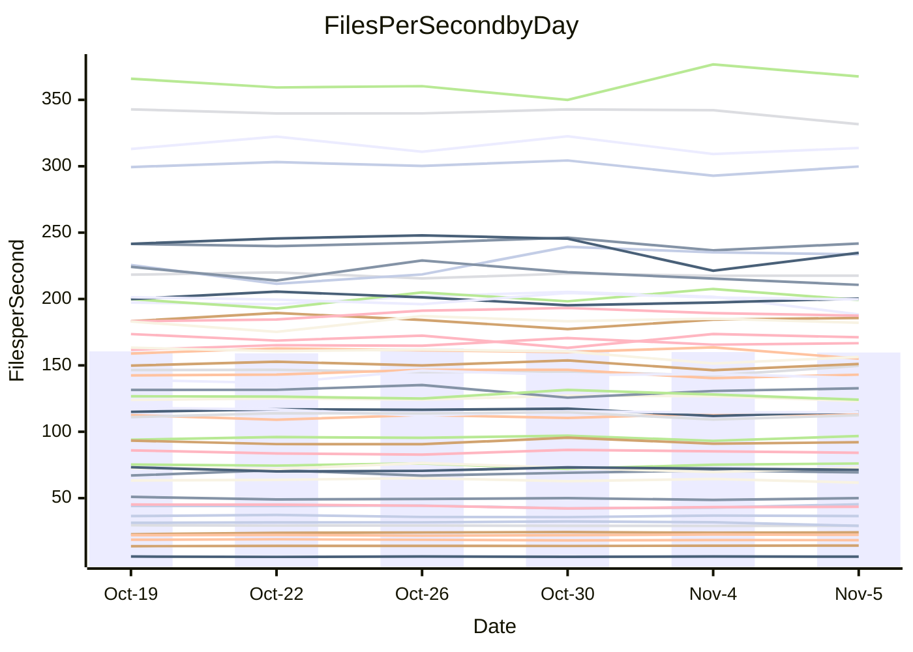

<!---
# This file is auto-generated. Do not edit.
# cspell:disable
--->
# Performance Report

## Daily Performance

## Time to Process Files

| Repository                                      | Elapsed | Min/Avg/Max           |   SD | SD Graph                |
| ----------------------------------------------- | ------: | :-------------------: | ---: | ----------------------- |
| AdaDoom3/AdaDoom3                    |    3.46 | 3.4 /   3.5 /   3.7   | 0.07 | `     ┣━┻●━╋━━┻━┫     ` |
| alexiosc/megistos                    |    7.57 | 7.3 /   8.0 /   8.7   | 0.39 | `    ┣━●┻━━╋━━┻━━┫    ` |
| apollographql/apollo-server          |    2.70 | 2.6 /   2.8 /   2.9   | 0.08 | `     ┣━┻●━╋━━┻━┫     ` |
| aspnetboilerplate/aspnetboilerplate  |   10.76 | 10.3 /  10.5 /  10.8  | 0.18 | `    ┣━━┻━━╋━━┻━●┫    ` |
| aws-amplify/docs                     |   14.82 | 12.4 /  13.0 /  13.9  | 0.43 | `     ┣━┻━━╋━━┻━┫    ●` |
| Azure/azure-rest-api-specs           |   10.26 | 9.6 /  10.1 /  11.0   | 0.39 | `    ┣━━┻━━╋●━┻━━┫    ` |
| bitjson/typescript-starter           |    1.11 | 1.0 /   1.1 /   1.1   | 0.03 | `     ┣━┻━━╋━━●━┫     ` |
| caddyserver/caddy                    |    3.70 | 3.7 /   3.8 /   4.0   | 0.09 | `    ┣━●┻━━╋━━┻━━┫    ` |
| canada-ca/open-source-logiciel-libre |    1.14 | 1.1 /   1.2 /   1.3   | 0.04 | `     ┣━●━━╋━━┻━┫     ` |
| chef/chef                            |    5.88 | 5.7 /   6.0 /   6.3   | 0.16 | `    ┣━━┻●━╋━━┻━━┫    ` |
| dart-lang/sdk                        |   70.19 | 63.7 /  67.1 /  72.3  | 2.33 | `  ┣━━━┻━━━╋━━━┻●━━┫  ` |
| django/django                        |   15.62 | 14.9 /  15.8 /  16.7  | 0.51 | `    ┣━━┻━●╋━━┻━━┫    ` |
| eslint/eslint                        |   10.94 | 10.7 /  11.2 /  11.8  | 0.38 | `    ┣━━┻●━╋━━┻━━┫    ` |
| exonum/exonum                        |    3.62 | 3.5 /   3.7 /   3.8   | 0.09 | `    ┣━━┻━●╋━━┻━━┫    ` |
| flutter/samples                      |   17.04 | 16.0 /  16.7 /  17.5  | 0.44 | `    ┣━━┻━━╋━●┻━━┫    ` |
| gitbucket/gitbucket                  |    3.57 | 3.5 /   3.7 /   3.9   | 0.11 | `    ┣━━●━━╋━━┻━━┫    ` |
| googleapis/google-cloud-cpp          |  153.52 | 139.9 / 147.2 / 158.3 | 4.91 | `  ┣━━━┻━━━╋━━━┻●━━┫  ` |
| graphql/express-graphql              |    1.15 | 1.1 /   1.2 /   1.2   | 0.03 | `     ┣━┻●━╋━━┻━┫     ` |
| graphql/graphql-js                   |    3.01 | 2.8 /   2.9 /   3.1   | 0.08 | `     ┣━┻━━╋━━●━┫     ` |
| graphql/graphql-relay-js             |    1.17 | 1.1 /   1.2 /   1.2   | 0.04 | `     ┣━┻━●╋━━┻━┫     ` |
| graphql/graphql-spec                 |    1.30 | 1.3 /   1.4 /   1.4   | 0.04 | `     ┣●┻━━╋━━┻━┫     ` |
| iluwatar/java-design-patterns        |   13.18 | 12.8 /  13.3 /  14.4  | 0.39 | `    ┣━━┻━●╋━━┻━━┫    ` |
| ktaranov/sqlserver-kit               |    6.68 | 6.6 /   6.8 /   7.1   | 0.16 | `    ┣━━●━━╋━━┻━━┫    ` |
| liriliri/licia                       |    4.34 | 4.1 /   4.2 /   4.4   | 0.09 | `    ┣━━┻━━╋━━┻●━┫    ` |
| MartinThoma/LaTeX-examples           |    6.91 | 6.8 /   7.1 /   7.6   | 0.20 | `    ┣━━┻●━╋━━┻━━┫    ` |
| mdx-js/mdx                           |    2.07 | 1.9 /   2.0 /   2.2   | 0.08 | `     ┣━┻━━╋●━┻━┫     ` |
| microsoft/TypeScript-Website         |    5.86 | 5.5 /   5.8 /   6.1   | 0.15 | `    ┣━━┻━━╋━●┻━━┫    ` |
| MicrosoftDocs/PowerShell-Docs        |   24.64 | 23.3 /  24.1 /  25.4  | 0.65 | `   ┣━━━┻━━╋━━●━━━┫   ` |
| neovim/nvim-lspconfig                |    4.38 | 4.3 /   4.4 /   4.6   | 0.09 | `    ┣━━┻●━╋━━┻━━┫    ` |
| pagekit/pagekit                      |    3.61 | 3.5 /   3.7 /   4.0   | 0.15 | `    ┣━━┻●━╋━━┻━━┫    ` |
| php/php-src                          |   27.15 | 25.9 /  27.0 /  28.5  | 0.84 | `   ┣━━━┻━━●━━┻━━━┫   ` |
| plasticrake/tplink-smarthome-api     |    1.38 | 1.3 /   1.4 /   1.5   | 0.04 | `     ┣━┻━●╋━━┻━┫     ` |
| prettier/prettier                    |    7.68 | 7.2 /   7.6 /   7.9   | 0.21 | `    ┣━━┻━━╋●━┻━━┫    ` |
| pycontribs/jira                      |    1.55 | 1.5 /   1.6 /   1.7   | 0.06 | `     ┣━┻●━╋━━┻━┫     ` |
| RustPython/RustPython                |    5.48 | 5.2 /   5.5 /   6.0   | 0.25 | `    ┣━━┻━━●━━┻━━┫    ` |
| shoelace-style/shoelace              |    2.98 | 2.9 /   3.0 /   3.2   | 0.08 | `     ┣━┻━●╋━━┻━┫     ` |
| slint-ui/slint                       |   13.38 | 13.3 /  13.8 /  14.4  | 0.39 | `    ┣━●┻━━╋━━┻━━┫    ` |
| SoftwareBrothers/admin-bro           |    2.61 | 2.6 /   2.7 /   2.9   | 0.07 | `     ┣━●━━╋━━┻━┫     ` |
| sveltejs/svelte                      |   21.67 | 20.8 /  22.0 /  22.9  | 0.48 | `   ┣━━━┻●━╋━━┻━━━┫   ` |
| TheAlgorithms/Python                 |    5.83 | 5.7 /   5.8 /   6.0   | 0.08 | `    ┣━━┻━━╋●━┻━━┫    ` |
| twbs/bootstrap                       |    1.90 | 1.8 /   1.9 /   2.0   | 0.06 | `     ┣━┻━━╋━●┻━┫     ` |
| typescript-cheatsheets/react         |    1.54 | 1.4 /   1.4 /   1.6   | 0.06 | `     ┣━┻━━╋━━┻●┫     ` |
| typescript-eslint/typescript-eslint  |    4.29 | 4.2 /   4.3 /   4.5   | 0.08 | `    ┣━━┻━━●━━┻━━┫    ` |
| vitest-dev/vitest                    |    9.69 | 9.2 /  10.0 /  10.9   | 0.53 | `    ┣━━┻●━╋━━┻━━┫    ` |
| w3c/aria-practices                   |    3.49 | 3.5 /   3.6 /   3.8   | 0.09 | `    ┣━━●━━╋━━┻━━┫    ` |
| w3c/specberus                        |    2.04 | 2.0 /   2.1 /   2.2   | 0.05 | `     ┣━┻●━╋━━┻━┫     ` |
| webdeveric/webpack-assets-manifest   |    1.21 | 1.2 /   1.2 /   1.3   | 0.04 | `     ┣━●━━╋━━┻━┫     ` |
| webpack/webpack                      |    6.01 | 5.5 /   5.7 /   6.7   | 0.28 | `    ┣━━┻━━╋━━●━━┫    ` |
| wireapp/wire-desktop                 |    1.39 | 1.4 /   1.5 /   1.7   | 0.09 | `     ┣━●━━╋━━┻━┫     ` |
| wireapp/wire-webapp                  |   12.28 | 10.7 /  11.1 /  12.1  | 0.35 | `    ┣━━┻━━╋━━┻━━┫   ●` |

Note:
- Elapsed time is in seconds.

## Files per Second over Time

| Repository                                      | Files |    Sec |    Fps |     Rel | Trend Fps         |    N |
| ----------------------------------------------- | ----: | -----: | -----: | ------: | ----------------- | ---: |
| AdaDoom3/AdaDoom3                    |   103 |   3.46 |  29.76 |   1.67% | `██▆█▆█▇▆▇▆▇▇▅▇█` |   14 |
| alexiosc/megistos                    |   583 |   7.57 |  76.98 |   5.87% | `▅▇▄▄▅█▆▅▅▃▅▄▄▇▇` |   14 |
| apollographql/apollo-server          |   253 |   2.70 |  93.79 |   2.14% | `▇█▆▇▅▅▆▆█▇▅▇▇▄▇` |   14 |
| aspnetboilerplate/aspnetboilerplate  |  2286 |  10.76 | 212.45 |  -2.61% | `▅███▇▆▆█▇▆█▇▇█▆` |   14 |
| aws-amplify/docs                     |  2871 |  14.82 | 193.69 | -12.17% | `▇▇▆▇▄█▇█▆▆▄▆▅▅▂` |   14 |
| Azure/azure-rest-api-specs           |  2365 |  10.26 | 230.42 |  -3.89% | `▅▇▇▆█▇█▇▇▃▅▅▆▇▅` |   14 |
| bitjson/typescript-starter           |    20 |   1.11 |  18.01 |  -3.25% | `▆▇█▇█▇▇▆▆▆▆▅▇▇▅` |   14 |
| caddyserver/caddy                    |   288 |   3.70 |  77.81 |   3.51% | `▇▆▇▆▆▇▇█▅▅█▆▆██` |   14 |
| canada-ca/open-source-logiciel-libre |     7 |   1.14 |   6.14 |   3.42% | `▇█▇▄▇██▇▆▇██▄▆█` |   14 |
| chef/chef                            |  1191 |   5.88 | 202.42 |   1.07% | `▇▆▇█▇▆█▆▅▇▅▄█▇▇` |   14 |
| dart-lang/sdk                        | 10719 |  70.19 | 152.70 |  -4.27% | `▇▇██▆█▇▅▆▅▄▅▇▆▅` |   14 |
| django/django                        |  2877 |  15.62 | 184.15 |   0.74% | `▅▅█▄▅▇▆█▆▇▇▇▄▇▆` |   14 |
| eslint/eslint                        |  2098 |  10.94 | 191.80 |   2.40% | `▅▄▇▇▄▇▇▇▇▅█▆▇▄▇` |   14 |
| exonum/exonum                        |   421 |   3.62 | 116.29 |   1.02% | `██▇▆█▆▆▅▇▆▇▅▇█▇` |   14 |
| flutter/samples                      |  2400 |  17.04 | 140.85 |  -2.00% | `▆▆▇▇▅█▆█▇▆▅█▅▆▆` |   14 |
| gitbucket/gitbucket                  |   413 |   3.57 | 115.73 |   3.41% | `▅▆█▅▅█▆▆▆▅█▆█▄▇` |   14 |
| googleapis/google-cloud-cpp          | 20949 | 153.52 | 136.46 |  -3.73% | `▆▅▆▇▄▇██▇█▆▆▅█▅` |   14 |
| graphql/express-graphql              |    26 |   1.15 |  22.59 |   1.94% | `▆▆▆█▅▄▅▆▆▅█▇▆▆▇` |   14 |
| graphql/graphql-js                   |   368 |   3.01 | 122.13 |  -2.10% | `█▇▅▆█▆█▅█▇█▇▇▅▆` |   14 |
| graphql/graphql-relay-js             |    28 |   1.17 |  24.00 |   0.65% | `▄▅▄▇▅▆▆▇▇▇▅▅▆█▆` |   14 |
| graphql/graphql-spec                 |    19 |   1.30 |  14.65 |   4.35% | `▅▆▆▅▇▄█▆▆▇▇▇▆██` |   14 |
| iluwatar/java-design-patterns        |  1992 |  13.18 | 151.10 |   0.52% | `▇▇▆█▇█▇▅█▄█▇▇▇▇` |   14 |
| ktaranov/sqlserver-kit               |   489 |   6.68 |  73.18 |   2.29% | `██▇▅▇▆▅▇█▇▇▆▇▆█` |   14 |
| liriliri/licia                       |  1437 |   4.34 | 330.75 |  -2.53% | `█▇█▇▇█▆▇▇█▇█▅▅▆` |   14 |
| MartinThoma/LaTeX-examples           |  1409 |   6.91 | 203.95 |   2.24% | `▇█▆▇▆▄█▆█▆▇▅▆▇▇` |   14 |
| mdx-js/mdx                           |   141 |   2.07 |  68.02 |  -1.28% | `▄▇▆█▇▄▇▅▆▆█▇█▆▆` |   14 |
| microsoft/TypeScript-Website         |   761 |   5.86 | 129.84 |  -1.83% | `▆▆▇▅▇▇█▇▄▅▇█▇▆▆` |   14 |
| MicrosoftDocs/PowerShell-Docs        |  2708 |  24.64 | 109.91 |  -2.32% | `▇▆▆▇██▅██▄▆██▆▆` |   14 |
| neovim/nvim-lspconfig                |   759 |   4.38 | 173.09 |   1.07% | `██▆▅▇▇▇▇▅▇█▇▇▆▇` |   14 |
| pagekit/pagekit                      |   741 |   3.61 | 204.99 |   2.28% | `▇█▄▅▅▇█▇▆█▇▆▇▅▇` |   14 |
| php/php-src                          |  2275 |  27.15 |  83.80 |  -0.87% | `▇█▇█▄▇▅▅▇▇▆▇█▄▆` |   14 |
| plasticrake/tplink-smarthome-api     |    62 |   1.38 |  44.77 |   1.66% | `█▆█▇█▆▅█▅▅▆▆▄▅▇` |   14 |
| prettier/prettier                    |  2415 |   7.68 | 314.41 |   0.08% | `▆▆▆█▇▅▅██▅▆▆▇▆▆` |   14 |
| pycontribs/jira                      |    79 |   1.55 |  51.08 |   2.82% | `█▆▇▆▅▄▆█▆▆▅▄█▆▇` |   14 |
| RustPython/RustPython                |   693 |   5.48 | 126.54 |   0.32% | `▆▇▆▅█▅▄██▇▆▇▃▆▆` |   14 |
| shoelace-style/shoelace              |   439 |   2.98 | 147.15 |   0.54% | `▇▇▅▆▆▆▅▆▆▇▄▇█▆▆` |   14 |
| slint-ui/slint                       |  2561 |  13.38 | 191.44 |   3.91% | `▅▇▇█▇▅▇█▅▆▇█▆▅█` |   14 |
| SoftwareBrothers/admin-bro           |   441 |   2.61 | 169.15 |   2.54% | `▇▇▄▇▆▇▇▆█▇▆▇█▆█` |   14 |
| sveltejs/svelte                      |  8036 |  21.67 | 370.87 |   1.80% | `▆▆▇▆▅▅▅▆▄█▆▆▆▆▇` |   14 |
| TheAlgorithms/Python                 |  1399 |   5.83 | 240.05 |  -0.51% | `▇▇█▇▆█▆▇█▅▇▆▇█▇` |   14 |
| twbs/bootstrap                       |   118 |   1.90 |  61.98 |  -2.42% | `▄▇█▇▆▇█▇▆█▆▆▆▄▅` |   14 |
| typescript-cheatsheets/react         |    53 |   1.54 |  34.36 |  -6.18% | `▆▆▆▇▆▇▃▅▅▄██▅▇▄` |   14 |
| typescript-eslint/typescript-eslint  |  1285 |   4.29 | 299.21 |  -0.15% | `▇▇▇█▇██▆█▇▅█▇▇▇` |   14 |
| vitest-dev/vitest                    |  2245 |   9.69 | 231.75 |   2.41% | `▅▆▆▄▃▃▅▆▇█▆▆█▆▆` |   14 |
| w3c/aria-practices                   |   414 |   3.49 | 118.60 |   3.07% | `▆▅██▆▇▆█▇▆▅▇▅▅█` |   14 |
| w3c/specberus                        |   197 |   2.04 |  96.65 |   1.42% | `▇▆▇█▇▇▆███▅▇███` |   14 |
| webdeveric/webpack-assets-manifest   |    55 |   1.21 |  45.46 |   3.01% | `▅▇▇▇▆█▆▆▅▆▄█▆█▇` |   14 |
| webpack/webpack                      |  1138 |   6.01 | 189.39 |  -4.04% | `▇█▆▇▇█▇▇████▆▃▆` |   14 |
| wireapp/wire-desktop                 |    46 |   1.39 |  33.08 |   7.08% | `▇▇▆▇▇▆█▇██▇▅▄▃█` |   14 |
| wireapp/wire-webapp                  |  1781 |  12.28 | 145.04 |  -9.71% | `▇▆▇▇█▇█▆▇▇█▄██▃` |   14 |

## Data Throughput

| Repository                                      | Files |    Sec |     Kps |     Rel | Trend Kps         |    N |
| ----------------------------------------------- | ----: | -----: | ------: | ------: | ----------------- | ---: |
| AdaDoom3/AdaDoom3                    |   103 |   3.46 |  632.56 |   1.67% | `██▆█▆█▇▆▇▆▇▇▅▇█` |   14 |
| alexiosc/megistos                    |   583 |   7.57 |  604.88 |   5.87% | `▅▇▄▄▅█▆▅▅▃▅▄▄▇▇` |   14 |
| apollographql/apollo-server          |   253 |   2.70 |  766.25 |   3.06% | `▆█▆▇▄▅▆▅█▇▅█▇▅▇` |   14 |
| aspnetboilerplate/aspnetboilerplate  |  2286 |  10.76 |  516.91 |  -2.61% | `▅███▇▆▆█▇▆█▇▇█▆` |   14 |
| aws-amplify/docs                     |  2871 |  14.82 |  676.12 | -12.17% | `▇▇▆▇▄█▇█▆▆▄▆▅▅▂` |   14 |
| Azure/azure-rest-api-specs           |  2365 |  10.26 |  625.02 |  -3.12% | `▅▇▇▆█▇█▇▇▃▅▅▆▇▅` |   14 |
| bitjson/typescript-starter           |    20 |   1.11 |   72.03 |  -3.25% | `▆▇█▇█▇▇▆▆▆▆▅▇▇▅` |   14 |
| caddyserver/caddy                    |   288 |   3.70 |  674.88 |   3.81% | `▆▅▇▆▆▇▇█▅▅█▆▆██` |   14 |
| canada-ca/open-source-logiciel-libre |     7 |   1.14 |   50.85 |   3.42% | `▇█▇▄▇██▇▆▇██▄▆█` |   14 |
| chef/chef                            |  1191 |   5.88 |  938.15 |   1.21% | `▇▅▆█▇▆█▆▅▇▅▄█▇▇` |   14 |
| dart-lang/sdk                        | 10719 |  70.19 | 1040.86 |  -4.25% | `▇▇██▆█▇▅▆▅▄▅▇▆▅` |   14 |
| django/django                        |  2877 |  15.62 | 1158.33 |   0.85% | `▅▅█▅▅▇▆█▆▇▇▇▄▇▇` |   14 |
| eslint/eslint                        |  2098 |  10.94 | 1378.47 |   2.33% | `▅▅▇▇▄▇▇▇▇▅█▆▇▄▇` |   14 |
| exonum/exonum                        |   421 |   3.62 | 1112.40 |   1.02% | `██▇▆█▆▆▅▇▆▇▅▇█▇` |   14 |
| flutter/samples                      |  2400 |  17.04 | 1256.90 |  -2.00% | `▆▆▇▇▅█▆█▇▆▅█▅▆▆` |   14 |
| gitbucket/gitbucket                  |   413 |   3.57 |  525.98 |   3.40% | `▅▆█▅▅▇▆▆▆▅█▆█▄▇` |   14 |
| googleapis/google-cloud-cpp          | 20949 | 153.52 | 1105.87 |  -3.90% | `▆▅▆▇▄▇██▇█▆▆▅█▅` |   14 |
| graphql/express-graphql              |    26 |   1.15 |  103.41 |   1.94% | `▆▆▆█▅▄▅▆▆▅█▇▆▆▇` |   14 |
| graphql/graphql-js                   |   368 |   3.01 |  708.90 |  -1.71% | `▇▇▄▆█▆█▅█▇█▇▇▅▆` |   14 |
| graphql/graphql-relay-js             |    28 |   1.17 |   94.28 |   0.65% | `▄▅▄▇▅▆▆▇▇▇▅▅▆█▆` |   14 |
| graphql/graphql-spec                 |    19 |   1.30 |  488.71 |   4.35% | `▅▆▆▅▇▄█▆▆▇▇▇▆██` |   14 |
| iluwatar/java-design-patterns        |  1992 |  13.18 |  467.04 |   0.52% | `▇▇▆█▇█▇▅█▄█▇▇▇▇` |   14 |
| ktaranov/sqlserver-kit               |   489 |   6.68 | 1108.11 |   2.30% | `██▇▅▇▆▅▇█▇▇▆▇▆█` |   14 |
| liriliri/licia                       |  1437 |   4.34 |  394.04 |  -2.53% | `█▇█▇▇█▆▇▇█▇█▅▅▆` |   14 |
| MartinThoma/LaTeX-examples           |  1409 |   6.91 |  421.22 |   2.24% | `▇█▆▇▆▄█▆█▆▇▅▆▇▇` |   14 |
| mdx-js/mdx                           |   141 |   2.07 |  316.47 |  -1.28% | `▄▇▆█▇▄▇▅▆▆█▇█▆▆` |   14 |
| microsoft/TypeScript-Website         |   761 |   5.86 |  898.11 |  -1.82% | `▆▆▇▅▇▇█▇▄▅▇█▇▆▆` |   14 |
| MicrosoftDocs/PowerShell-Docs        |  2708 |  24.64 | 1131.32 |  -2.32% | `▇▆▆▇██▅██▄▆██▆▆` |   14 |
| neovim/nvim-lspconfig                |   759 |   4.38 |  289.62 |   1.23% | `██▆▅▇▇▇▇▅▇█▇▇▆▇` |   14 |
| pagekit/pagekit                      |   741 |   3.61 |  427.40 |   2.28% | `▇█▄▅▅▇█▇▆█▇▆▇▅▇` |   14 |
| php/php-src                          |  2275 |  27.15 | 1468.77 |  -0.64% | `▇█▇█▄▇▅▅▇▇▆▇█▄▆` |   14 |
| plasticrake/tplink-smarthome-api     |    62 |   1.38 |  241.88 |   1.66% | `█▆█▇█▆▅█▅▅▆▆▄▅▇` |   14 |
| prettier/prettier                    |  2415 |   7.68 |  436.92 |  -0.36% | `▆▆▆█▇▅▅██▅▆▆▇▅▆` |   14 |
| pycontribs/jira                      |    79 |   1.55 |  362.06 |   2.82% | `█▆▇▆▅▄▆█▆▆▅▄█▆▇` |   14 |
| RustPython/RustPython                |   693 |   5.48 | 1052.84 |   3.53% | `▅▆▅▄▇▅▃▇▇█▇█▄▇▇` |   14 |
| shoelace-style/shoelace              |   439 |   2.98 |  710.95 |   0.54% | `▇▇▅▆▆▆▅▆▆▇▄▇█▆▆` |   14 |
| slint-ui/slint                       |  2561 |  13.38 | 1178.98 |   4.00% | `▅▇▇█▇▅▇█▅▆▇█▆▅█` |   14 |
| SoftwareBrothers/admin-bro           |   441 |   2.61 |  372.83 |   2.54% | `▇▇▄▇▆▇▇▆█▇▆▇█▆█` |   14 |
| sveltejs/svelte                      |  8036 |  21.67 |  247.65 |   1.85% | `▅▆▇▆▅▅▅▆▄█▆▆▆▆▇` |   14 |
| TheAlgorithms/Python                 |  1399 |   5.83 |  610.50 |  -0.50% | `▇▇█▇▆█▆▇█▅▇▆▇█▇` |   14 |
| twbs/bootstrap                       |   118 |   1.90 |  508.41 |  -2.42% | `▄▇█▇▆▇█▇▆█▆▆▆▄▅` |   14 |
| typescript-cheatsheets/react         |    53 |   1.54 |  254.11 |  -6.18% | `▆▆▆▇▆▇▃▅▅▄██▅▇▄` |   14 |
| typescript-eslint/typescript-eslint  |  1285 |   4.29 | 1538.43 |  -0.20% | `▇▇▇█▇██▆█▇▅█▇▇▇` |   14 |
| vitest-dev/vitest                    |  2245 |   9.69 |  513.97 |   1.61% | `▅▆▆▄▃▃▅▆██▅▆█▆▆` |   14 |
| w3c/aria-practices                   |   414 |   3.49 | 1105.80 |   3.07% | `▆▅██▆▇▆█▇▆▅▇▅▅█` |   14 |
| w3c/specberus                        |   197 |   2.04 |  305.66 |   1.42% | `▇▆▇█▇▇▆███▅▇███` |   14 |
| webdeveric/webpack-assets-manifest   |    55 |   1.21 |  104.98 |   3.01% | `▅▇▇▇▆█▆▆▅▆▄█▆█▇` |   14 |
| webpack/webpack                      |  1138 |   6.01 |  859.24 |  -4.24% | `▇█▆▇▇███████▆▃▆` |   14 |
| wireapp/wire-desktop                 |    46 |   1.39 |  184.83 |   7.08% | `▇▇▆▇▇▆█▇██▇▅▄▃█` |   14 |
| wireapp/wire-webapp                  |  1781 |  12.28 |  535.55 |  -9.67% | `▇▆▇▇█▇█▆▇▇█▄██▃` |   14 |

