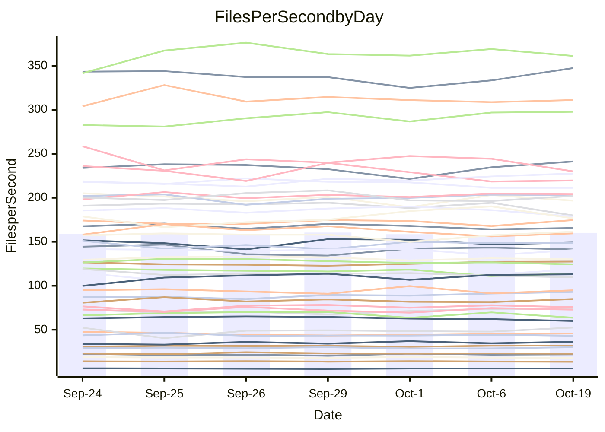

<!---
# This file is auto-generated. Do not edit.
# cspell:disable
--->
# Performance Report

## Daily Performance

## Time to Process Files

| Repository                                      | Elapsed | Min/Avg/Max           |   SD | SD Graph                |
| ----------------------------------------------- | ------: | :-------------------: | ---: | ----------------------- |
| AdaDoom3/AdaDoom3                    |    3.42 | 3.4 /   3.5 /   3.7   | 0.11 | `    ┣━━●━━╋━━┻━━┫    ` |
| alexiosc/megistos                    |    8.00 | 7.6 /   8.0 /   8.6   | 0.29 | `    ┣━━┻━━●━━┻━━┫    ` |
| apollographql/apollo-server          |    2.71 | 2.7 /   2.9 /   3.0   | 0.11 | `     ┣●┻━━╋━━┻━┫     ` |
| aspnetboilerplate/aspnetboilerplate  |   10.82 | 10.2 /  10.5 /  10.9  | 0.20 | `    ┣━━┻━━╋━━┻●━┫    ` |
| aws-amplify/docs                     |   12.62 | 12.5 /  13.1 /  13.9  | 0.42 | `    ┣━●┻━━╋━━┻━━┫    ` |
| Azure/azure-rest-api-specs           |   10.69 | 9.5 /  10.0 /  10.6   | 0.30 | `    ┣━━┻━━╋━━┻━━┫●   ` |
| bitjson/typescript-starter           |    1.10 | 1.0 /   1.1 /   1.1   | 0.02 | `     ┣━━┻━╋━┻●━┫     ` |
| caddyserver/caddy                    |    3.79 | 3.6 /   3.8 /   4.0   | 0.12 | `    ┣━━┻━━╋●━┻━━┫    ` |
| canada-ca/open-source-logiciel-libre |    1.17 | 1.1 /   1.2 /   1.3   | 0.05 | `     ┣━┻━●╋━━┻━┫     ` |
| chef/chef                            |    5.97 | 5.8 /   6.0 /   6.4   | 0.19 | `    ┣━━┻━●╋━━┻━━┫    ` |
| dart-lang/sdk                        |   65.98 | 64.8 /  67.8 /  73.2  | 2.34 | `  ┣━━━┻●━━╋━━━┻━━━┫  ` |
| django/django                        |   16.10 | 15.0 /  15.4 /  16.1  | 0.29 | `    ┣━━┻━━╋━━┻━━┫●   ` |
| eslint/eslint                        |   11.64 | 10.7 /  10.9 /  11.5  | 0.23 | `    ┣━━┻━━╋━━┻━━┫   ●` |
| exonum/exonum                        |    3.56 | 3.6 /   3.7 /   4.0   | 0.12 | `    ┣━●┻━━╋━━┻━━┫    ` |
| flutter/samples                      |   16.99 | 16.3 /  17.1 /  18.6  | 0.66 | `    ┣━━┻━━●━━┻━━┫    ` |
| gitbucket/gitbucket                  |    3.77 | 3.5 /   3.6 /   3.7   | 0.08 | `     ┣━┻━━╋━━┻━●     ` |
| googleapis/google-cloud-cpp          |  147.79 | 142.5 / 149.1 / 165.8 | 6.35 | `  ┣━━━┻━━●╋━━━┻━━━┫  ` |
| graphql/express-graphql              |    1.18 | 1.1 /   1.2 /   1.3   | 0.05 | `     ┣━┻━●╋━━┻━┫     ` |
| graphql/graphql-js                   |    2.86 | 2.8 /   2.9 /   3.0   | 0.06 | `     ┣━●━━╋━━┻━┫     ` |
| graphql/graphql-relay-js             |    1.23 | 1.1 /   1.2 /   1.3   | 0.04 | `     ┣━┻━━╋●━┻━┫     ` |
| graphql/graphql-spec                 |    1.41 | 1.3 /   1.4 /   1.4   | 0.02 | `     ┣━━┻━╋━┻━━●     ` |
| iluwatar/java-design-patterns        |   13.36 | 13.0 /  13.5 /  14.9  | 0.54 | `    ┣━━┻━●╋━━┻━━┫    ` |
| ktaranov/sqlserver-kit               |    6.63 | 6.6 /   6.9 /   7.3   | 0.22 | `    ┣━━●━━╋━━┻━━┫    ` |
| liriliri/licia                       |    4.14 | 4.2 /   4.3 /   4.4   | 0.10 | `    ┣━●┻━━╋━━┻━━┫    ` |
| MartinThoma/LaTeX-examples           |    6.94 | 6.9 /   7.1 /   7.4   | 0.19 | `    ┣━━┻●━╋━━┻━━┫    ` |
| mdx-js/mdx                           |    2.22 | 2.0 /   2.1 /   2.3   | 0.10 | `     ┣━┻━━╋━━┻●┫     ` |
| microsoft/TypeScript-Website         |    5.85 | 5.6 /   5.8 /   6.0   | 0.13 | `    ┣━━┻━━╋●━┻━━┫    ` |
| MicrosoftDocs/PowerShell-Docs        |   23.97 | 23.7 /  24.8 /  27.2  | 1.30 | `   ┣━━━┻●━╋━━┻━━━┫   ` |
| neovim/nvim-lspconfig                |    4.35 | 4.3 /   4.4 /   4.7   | 0.10 | `    ┣━━┻●━╋━━┻━━┫    ` |
| pagekit/pagekit                      |    3.63 | 3.5 /   3.7 /   3.8   | 0.07 | `     ┣━┻●━╋━━┻━┫     ` |
| php/php-src                          |   26.95 | 26.4 /  27.9 /  30.2  | 1.21 | `   ┣━━━●━━╋━━┻━━━┫   ` |
| plasticrake/tplink-smarthome-api     |    1.36 | 1.3 /   1.4 /   1.4   | 0.04 | `     ┣━┻━●╋━━┻━┫     ` |
| prettier/prettier                    |    7.55 | 7.0 /   7.5 /   7.8   | 0.22 | `    ┣━━┻━━╋●━┻━━┫    ` |
| pycontribs/jira                      |    1.50 | 1.5 /   1.7 /   2.0   | 0.12 | `     ┣━●━━╋━━┻━┫     ` |
| RustPython/RustPython                |    5.54 | 5.2 /   5.4 /   5.6   | 0.11 | `    ┣━━┻━━╋━━┻●━┫    ` |
| shoelace-style/shoelace              |    2.95 | 2.9 /   3.0 /   3.1   | 0.07 | `     ┣━┻━●╋━━┻━┫     ` |
| slint-ui/slint                       |   14.33 | 12.7 /  13.4 /  14.4  | 0.46 | `    ┣━━┻━━╋━━┻━━●    ` |
| SoftwareBrothers/admin-bro           |    2.66 | 2.6 /   2.6 /   2.8   | 0.07 | `     ┣━┻━━╋●━┻━┫     ` |
| sveltejs/svelte                      |   22.05 | 20.8 /  21.7 /  23.2  | 0.63 | `   ┣━━━┻━━╋━●┻━━━┫   ` |
| TheAlgorithms/Python                 |    5.79 | 5.8 /   6.0 /   6.6   | 0.23 | `    ┣━━●━━╋━━┻━━┫    ` |
| twbs/bootstrap                       |    1.97 | 1.8 /   1.9 /   1.9   | 0.04 | `     ┣━┻━━╋━━┻━┫ ●   ` |
| typescript-cheatsheets/react         |    1.46 | 1.4 /   1.5 /   1.6   | 0.07 | `     ┣━┻●━╋━━┻━┫     ` |
| typescript-eslint/typescript-eslint  |    4.32 | 4.3 /   4.4 /   4.6   | 0.11 | `    ┣━━┻●━╋━━┻━━┫    ` |
| vitest-dev/vitest                    |   10.27 | 9.3 /   9.8 /  11.1   | 0.58 | `    ┣━━┻━━╋━●┻━━┫    ` |
| w3c/aria-practices                   |    3.63 | 3.5 /   3.6 /   3.7   | 0.10 | `    ┣━━┻━━╋━●┻━━┫    ` |
| w3c/specberus                        |    2.08 | 2.0 /   2.1 /   2.3   | 0.09 | `     ┣━┻━●╋━━┻━┫     ` |
| webdeveric/webpack-assets-manifest   |    1.27 | 1.2 /   1.2 /   1.3   | 0.03 | `     ┣━━┻━╋━┻━●┫     ` |
| webpack/webpack                      |    5.71 | 5.4 /   5.6 /   6.1   | 0.21 | `    ┣━━┻━━╋●━┻━━┫    ` |
| wireapp/wire-desktop                 |    1.44 | 1.3 /   1.4 /   1.4   | 0.03 | `     ┣━━┻━╋━┻━━●     ` |
| wireapp/wire-webapp                  |   11.16 | 10.7 /  11.3 /  12.5  | 0.54 | `    ┣━━┻━●╋━━┻━━┫    ` |

Note:
- Elapsed time is in seconds.

## Files per Second over Time

| Repository                                      | Files |    Sec |    Fps |    Rel | Trend Fps    |    N |
| ----------------------------------------------- | ----: | -----: | -----: | -----: | ------------ | ---: |
| AdaDoom3/AdaDoom3                    |   103 |   3.42 |  30.15 |  3.55% | `▇▇▄██▆▆▇▅█` |    9 |
| alexiosc/megistos                    |   583 |   8.00 |  72.89 |  0.22% | `▆▅██▆▅▄▇▇▆` |    9 |
| apollographql/apollo-server          |   252 |   2.71 |  92.96 |  5.40% | `▆▆▅▄▇█▄█▆█` |    9 |
| aspnetboilerplate/aspnetboilerplate  |  2286 |  10.82 | 211.34 | -2.67% | `▇▆██▇█▆▅▆▆` |    9 |
| aws-amplify/docs                     |  2871 |  12.62 | 227.49 |  3.99% | `▆▆▆▄▇▅█▇██` |    9 |
| Azure/azure-rest-api-specs           |  2458 |  10.69 | 229.98 | -5.94% | `█▄▅▆▅▇▆▅▇▄` |    9 |
| bitjson/typescript-starter           |    20 |   1.10 |  18.14 | -2.22% | `▇▆▆▆▅▇█▆▆▅` |    9 |
| caddyserver/caddy                    |   287 |   3.79 |  75.64 | -0.74% | `▇▄█▇█▇▆██▇` |    9 |
| canada-ca/open-source-logiciel-libre |     7 |   1.17 |   5.98 |  2.28% | `█▇▅▆▄█▆█▇▇` |    9 |
| chef/chef                            |  1207 |   5.97 | 202.07 |  0.82% | `▇▆█▇█▅▆▇▄▇` |    9 |
| dart-lang/sdk                        | 10660 |  65.98 | 161.56 |  3.47% | `▇▇▇▇▇▆▄█▅█` |    9 |
| django/django                        |  2876 |  16.10 | 178.65 | -4.28% | `▇▇▅▇▇▇█▇▇▅` |    9 |
| eslint/eslint                        |  2093 |  11.64 | 179.88 | -6.35% | `▇██▇██▅██▄` |    9 |
| exonum/exonum                        |   421 |   3.56 | 118.40 |  4.92% | `▇▄█▆▅▆▇▆▇█` |    9 |
| flutter/samples                      |  2400 |  16.99 | 141.22 |  0.21% | `██▄▇▅▇▇▇▇▇` |    9 |
| gitbucket/gitbucket                  |   413 |   3.77 | 109.67 | -3.59% | `█▅▇▅▆▇▆▆▅▄` |    9 |
| googleapis/google-cloud-cpp          | 20772 | 147.79 | 140.55 |  0.77% | `▇▇▆▇▇▆██▃▇` |    9 |
| graphql/express-graphql              |    26 |   1.18 |  22.07 |  0.93% | `▇▅▅▇▄█▇▅▇▆` |    9 |
| graphql/graphql-js                   |   364 |   2.86 | 127.46 |  1.90% | `▇▇▅█▆▆▇█▇█` |    9 |
| graphql/graphql-relay-js             |    28 |   1.23 |  22.72 | -2.20% | `▅▄█▇▆▇▄▆▅▅` |    9 |
| graphql/graphql-spec                 |    19 |   1.41 |  13.50 | -3.80% | `▇▆██▆███▅▅` |    9 |
| iluwatar/java-design-patterns        |  1992 |  13.36 | 149.14 |  0.57% | `█▇▇▄███▇▇▇` |    9 |
| ktaranov/sqlserver-kit               |   489 |   6.63 |  73.70 |  3.50% | `▇▅▅▇▄▇▆█▇█` |    9 |
| liriliri/licia                       |  1437 |   4.14 | 347.50 |  3.71% | `██▇▆▇▅▅▅▇█` |    9 |
| MartinThoma/LaTeX-examples           |  1409 |   6.94 | 203.08 |  1.79% | `▇█▆▅▇▆█▇██` |    9 |
| mdx-js/mdx                           |   141 |   2.22 |  63.63 | -6.41% | `▆▇█▇▇▃▆▇▇▅` |    9 |
| microsoft/TypeScript-Website         |   761 |   5.85 | 130.05 | -0.87% | `▆▇▆█▇▅▆▅█▆` |    9 |
| MicrosoftDocs/PowerShell-Docs        |  2708 |  23.97 | 112.96 |  3.24% | `▄▇▇▇██▄███` |    9 |
| neovim/nvim-lspconfig                |   760 |   4.35 | 174.65 |  1.85% | `█▇▆▇█▇█▇▅█` |    9 |
| pagekit/pagekit                      |   741 |   3.63 | 204.21 |  1.09% | `▅▇▅▆▇▆▆█▆▇` |    9 |
| php/php-src                          |  2289 |  26.95 |  84.92 |  2.89% | `▆█▇▅▇▅▇▄█▇` |    9 |
| plasticrake/tplink-smarthome-api     |    62 |   1.36 |  45.71 |  1.38% | `█▇▇▄▅▆▅▆▆▇` |    9 |
| prettier/prettier                    |  2350 |   7.55 | 311.09 | -0.18% | `▅█▄▇▆▆▆▅▆▆` |    9 |
| pycontribs/jira                      |    79 |   1.50 |  52.51 |  9.31% | `█▂▆▇▇▆▆▆▅█` |    9 |
| RustPython/RustPython                |   688 |   5.54 | 124.28 | -2.80% | `▆▇█▆▆▅▇▆▆▅` |    9 |
| shoelace-style/shoelace              |   439 |   2.95 | 148.83 |  1.17% | `█▅▆▇▅█▇▇▇▇` |    9 |
| slint-ui/slint                       |  2531 |  14.33 | 176.60 | -1.58% | `▆▄▅▄▅▇▇█▇▅` |    9 |
| SoftwareBrothers/admin-bro           |   441 |   2.66 | 165.62 | -0.78% | `▇█▅▇█▆██▅▇` |    9 |
| sveltejs/svelte                      |  7965 |  22.05 | 361.25 | -1.06% | `▄▇█▇▆▆▆▇▇▆` |    9 |
| TheAlgorithms/Python                 |  1397 |   5.79 | 241.28 |  3.85% | `▇██▇▇▇▄█▆█` |    9 |
| twbs/bootstrap                       |   118 |   1.97 |  60.01 | -5.51% | `▆▇▇█▇▅▆▅▅▄` |    9 |
| typescript-cheatsheets/react         |    53 |   1.46 |  36.32 |  3.22% | `▅▄▇█▅██▄▇▇` |    9 |
| typescript-eslint/typescript-eslint  |  1285 |   4.32 | 297.73 |  2.70% | `▅▅▅██▆▆█▇█` |    9 |
| vitest-dev/vitest                    |  2257 |  10.27 | 219.68 | -3.06% | `█▇▃███▆▅▆▆` |    9 |
| w3c/aria-practices                   |   414 |   3.63 | 113.90 | -2.06% | `███▆▇██▅▅▆` |    9 |
| w3c/specberus                        |   197 |   2.08 |  94.82 |  0.31% | `▆▆▅▆▅▇█▃▆▆` |    9 |
| webdeveric/webpack-assets-manifest   |    55 |   1.27 |  43.18 | -1.71% | `▅█▅▅▅▅▅▆▆▅` |    9 |
| webpack/webpack                      |  1123 |   5.71 | 196.69 | -0.77% | `█▇▆▇▇▄▆▇█▆` |    9 |
| wireapp/wire-desktop                 |    46 |   1.44 |  32.02 |  2.27% | `▅▆▅▇▆▄▅▅█▇` |    9 |
| wireapp/wire-webapp                  |  1781 |  11.16 | 159.54 | -1.43% | `▆██▆█▇▆▃▇▆` |    9 |

## Data Throughput

| Repository                                      | Files |    Sec |     Kps |    Rel | Trend Kps    |    N |
| ----------------------------------------------- | ----: | -----: | ------: | -----: | ------------ | ---: |
| AdaDoom3/AdaDoom3                    |   103 |   3.42 |  640.67 |  3.55% | `▇▇▄██▆▆▇▅█` |    9 |
| alexiosc/megistos                    |   583 |   8.00 |  572.78 |  0.22% | `▆▅██▆▅▄▇▇▆` |    9 |
| apollographql/apollo-server          |   252 |   2.71 |  747.76 |  5.40% | `▆▆▅▄▇█▄█▆█` |    9 |
| aspnetboilerplate/aspnetboilerplate  |  2286 |  10.82 |  514.21 | -2.67% | `▇▆██▇█▆▅▆▆` |    9 |
| aws-amplify/docs                     |  2871 |  12.62 |  794.12 |  3.97% | `▆▆▆▄▇▅█▇██` |    9 |
| Azure/azure-rest-api-specs           |  2458 |  10.69 |  613.68 | -5.01% | `█▄▅▆▅▇▆▅▇▄` |    9 |
| bitjson/typescript-starter           |    20 |   1.10 |   72.55 | -2.22% | `▇▆▆▆▅▇█▆▆▅` |    9 |
| caddyserver/caddy                    |   287 |   3.79 |  647.33 | -0.62% | `▇▄█▇█▇▆██▇` |    9 |
| canada-ca/open-source-logiciel-libre |     7 |   1.17 |   49.59 |  2.28% | `█▇▅▆▄█▆█▇▇` |    9 |
| chef/chef                            |  1207 |   5.97 |  932.17 |  0.77% | `▇▆█▇█▅▆▇▄▇` |    9 |
| dart-lang/sdk                        | 10660 |  65.98 | 1102.34 |  2.89% | `▇▇▇▇▇▆▄█▅█` |    9 |
| django/django                        |  2876 |  16.10 | 1119.76 | -4.25% | `▇▇▅▇▇▇█▇▇▅` |    9 |
| eslint/eslint                        |  2093 |  11.64 | 1296.54 | -6.20% | `▇██▇██▅██▄` |    9 |
| exonum/exonum                        |   421 |   3.56 | 1132.53 |  4.92% | `▇▄█▆▅▆▇▆▇█` |    9 |
| flutter/samples                      |  2400 |  16.99 | 1260.20 |  0.21% | `██▄▇▅▇▇▇▇▇` |    9 |
| gitbucket/gitbucket                  |   413 |   3.77 |  498.70 | -3.57% | `█▅▇▅▆▇▆▆▅▄` |    9 |
| googleapis/google-cloud-cpp          | 20772 | 147.79 | 1142.44 |  0.95% | `▇▇▆▇▇▆██▃▇` |    9 |
| graphql/express-graphql              |    26 |   1.18 |  101.01 |  0.93% | `▇▅▅▇▄█▇▅▇▆` |    9 |
| graphql/graphql-js                   |   364 |   2.86 |  732.53 |  1.90% | `▇▇▅█▆▆▇█▇█` |    9 |
| graphql/graphql-relay-js             |    28 |   1.23 |   89.24 | -2.20% | `▅▄█▇▆▇▄▆▅▅` |    9 |
| graphql/graphql-spec                 |    19 |   1.41 |  450.34 | -3.80% | `▇▆██▆███▅▅` |    9 |
| iluwatar/java-design-patterns        |  1992 |  13.36 |  460.96 |  0.57% | `█▇▇▄███▇▇▇` |    9 |
| ktaranov/sqlserver-kit               |   489 |   6.63 | 1115.96 |  3.50% | `▇▅▅▇▄▇▆█▇█` |    9 |
| liriliri/licia                       |  1437 |   4.14 |  414.01 |  3.71% | `██▇▆▇▅▅▅▇█` |    9 |
| MartinThoma/LaTeX-examples           |  1409 |   6.94 |  419.42 |  1.79% | `▇█▆▅▇▆█▇██` |    9 |
| mdx-js/mdx                           |   141 |   2.22 |  296.06 | -6.41% | `▆▇█▇▇▃▆▇▇▅` |    9 |
| microsoft/TypeScript-Website         |   761 |   5.85 |  899.39 | -0.87% | `▆▇▆█▇▅▆▅█▆` |    9 |
| MicrosoftDocs/PowerShell-Docs        |  2708 |  23.97 | 1162.62 |  3.30% | `▄▇▇▇██▄███` |    9 |
| neovim/nvim-lspconfig                |   760 |   4.35 |  291.38 |  2.44% | `▇▆▆▇█▇█▇▅█` |    9 |
| pagekit/pagekit                      |   741 |   3.63 |  425.78 |  1.09% | `▅▇▅▆▇▆▆█▆▇` |    9 |
| php/php-src                          |  2289 |  26.95 | 1483.05 |  3.40% | `▆█▇▅▇▅▇▄█▇` |    9 |
| plasticrake/tplink-smarthome-api     |    62 |   1.36 |  246.97 |  1.38% | `█▇▇▄▅▆▅▆▆▇` |    9 |
| prettier/prettier                    |  2350 |   7.55 |  435.66 | -0.70% | `▅█▄▇▆▆▆▅▆▆` |    9 |
| pycontribs/jira                      |    79 |   1.50 |  372.22 |  9.31% | `█▂▆▇▇▆▆▆▅█` |    9 |
| RustPython/RustPython                |   688 |   5.54 |  981.76 | -2.78% | `▆▇█▆▆▅▇▆▆▅` |    9 |
| shoelace-style/shoelace              |   439 |   2.95 |  719.05 |  1.17% | `█▅▆▇▅█▇▇▇▇` |    9 |
| slint-ui/slint                       |  2531 |  14.33 | 1083.60 | -4.39% | `█▅▇▆▄▇▇█▇▅` |    9 |
| SoftwareBrothers/admin-bro           |   441 |   2.66 |  365.03 | -0.78% | `▇█▅▇█▆██▅▇` |    9 |
| sveltejs/svelte                      |  7965 |  22.05 |  241.06 | -1.29% | `▄▇█▇▆▆▆▇▇▆` |    9 |
| TheAlgorithms/Python                 |  1397 |   5.79 |  613.30 |  3.85% | `▇██▇▇▇▄█▆█` |    9 |
| twbs/bootstrap                       |   118 |   1.97 |  492.28 | -5.51% | `▆▇▇█▇▅▆▅▅▄` |    9 |
| typescript-cheatsheets/react         |    53 |   1.46 |  268.62 |  3.22% | `▅▄▇█▅██▄▇▇` |    9 |
| typescript-eslint/typescript-eslint  |  1285 |   4.32 | 1534.04 |  3.36% | `▅▅▅██▆▆█▇█` |    9 |
| vitest-dev/vitest                    |  2257 |  10.27 |  492.32 | -3.85% | `█▇▃███▆▅▆▅` |    9 |
| w3c/aria-practices                   |   414 |   3.63 | 1061.98 | -2.06% | `███▆▇██▅▅▆` |    9 |
| w3c/specberus                        |   197 |   2.08 |  299.86 |  0.94% | `▆▆▅▆▅▇█▃▆▆` |    9 |
| webdeveric/webpack-assets-manifest   |    55 |   1.27 |   99.70 | -3.30% | `▅█▅▅▅▅▅▆▆▄` |    9 |
| webpack/webpack                      |  1123 |   5.71 |  897.79 | -0.45% | `█▇▅▇▇▄▆▇█▆` |    9 |
| wireapp/wire-desktop                 |    46 |   1.44 |  178.92 | 20.53% | `▃▃▃▃▃▂▃▂█▇` |    9 |
| wireapp/wire-webapp                  |  1781 |  11.16 |  588.07 |  0.89% | `▆██▆█▇▆▃█▇` |    9 |

