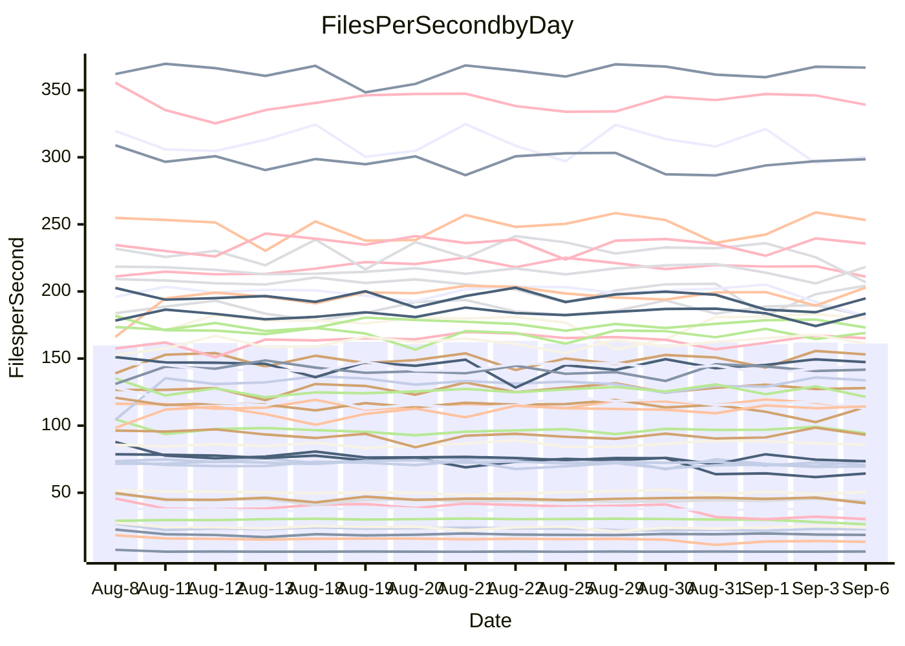

<!---
# This file is auto-generated. Do not edit.
# cspell:disable
--->
# Performance Report

## Daily Performance

## Time to Process Files

| Repository                                      | Elapsed | Min/Avg/Max           |   SD | SD Graph                |
| ----------------------------------------------- | ------: | :-------------------: | ---: | ----------------------- |
| AdaDoom3/AdaDoom3                    |    4.51 | 3.3 /   3.4 /   3.7   | 0.08 | `        ┣┻╋┻┫       ●` |
| alexiosc/megistos                    |    7.94 | 7.5 /   8.0 /   9.4   | 0.42 | `    ┣━━┻━━●━━┻━━┫    ` |
| apollographql/apollo-server          |    2.71 | 2.6 /   2.7 /   3.3   | 0.15 | `    ┣━━┻━━●━━┻━━┫    ` |
| aspnetboilerplate/aspnetboilerplate  |   10.47 | 10.2 /  10.6 /  11.2  | 0.25 | `    ┣━━┻━●╋━━┻━━┫    ` |
| aws-amplify/docs                     |   14.20 | 12.5 /  13.2 /  14.1  | 0.35 | `    ┣━━┻━━╋━━┻━━┫  ● ` |
| Azure/azure-rest-api-specs           |    9.57 | 9.4 /   9.9 /  11.3   | 0.45 | `    ┣━━┻●━╋━━┻━━┫    ` |
| bitjson/typescript-starter           |    1.08 | 0.9 /   1.1 /   1.3   | 0.06 | `     ┣━┻━━╋●━┻━┫     ` |
| caddyserver/caddy                    |    3.86 | 3.6 /   3.8 /   4.3   | 0.17 | `    ┣━━┻━━╋●━┻━━┫    ` |
| canada-ca/open-source-logiciel-libre |    1.14 | 0.9 /   1.1 /   1.2   | 0.04 | `     ┣━┻━━●━━┻━┫     ` |
| chef/chef                            |    6.03 | 5.8 /   6.1 /   7.3   | 0.27 | `    ┣━━┻━●╋━━┻━━┫    ` |
| dart-lang/sdk                        |   68.15 | 63.3 /  66.9 /  70.7  | 1.96 | `  ┣━━━┻━━━╋━●━┻━━━┫  ` |
| django/django                        |   15.32 | 14.8 /  15.6 /  16.4  | 0.37 | `    ┣━━┻●━╋━━┻━━┫    ` |
| eslint/eslint                        |   11.25 | 10.6 /  11.2 /  12.1  | 0.42 | `    ┣━━┻━━╋●━┻━━┫    ` |
| exonum/exonum                        |    3.71 | 3.5 /   3.7 /   4.1   | 0.13 | `    ┣━━┻━━╋●━┻━━┫    ` |
| flutter/samples                      |   16.47 | 16.3 /  17.2 /  19.7  | 0.68 | `   ┣━━●┻━━╋━━┻━━━┫   ` |
| gitbucket/gitbucket                  |    3.81 | 3.4 /   3.6 /   3.9   | 0.12 | `    ┣━━┻━━╋━━┻━●┫    ` |
| googleapis/google-cloud-cpp          |  147.27 | 136.7 / 143.7 / 155.3 | 4.83 | `  ┣━━━┻━━━╋━━●┻━━━┫  ` |
| graphql/express-graphql              |    1.15 | 1.0 /   1.1 /   1.3   | 0.05 | `     ┣━┻━━╋●━┻━┫     ` |
| graphql/graphql-js                   |    2.88 | 2.7 /   2.9 /   3.2   | 0.10 | `    ┣━━┻━━●━━┻━━┫    ` |
| graphql/graphql-relay-js             |    1.18 | 1.0 /   1.2 /   1.3   | 0.06 | `     ┣━┻━━╋●━┻━┫     ` |
| graphql/graphql-spec                 |    1.28 | 0.9 /   1.1 /   1.5   | 0.15 | `     ┣━┻━━╋━━┻●┫     ` |
| iluwatar/java-design-patterns        |   12.96 | 12.6 /  13.3 /  15.2  | 0.53 | `    ┣━━┻●━╋━━┻━━┫    ` |
| ktaranov/sqlserver-kit               |    6.80 | 6.5 /   6.7 /   7.0   | 0.16 | `    ┣━━┻━━╋●━┻━━┫    ` |
| liriliri/licia                       |    4.26 | 4.0 /   4.2 /   4.6   | 0.11 | `    ┣━━┻━━╋●━┻━━┫    ` |
| MartinThoma/LaTeX-examples           |    7.77 | 6.7 /   7.1 /   7.7   | 0.22 | `    ┣━━┻━━╋━━┻━━┫   ●` |
| mdx-js/mdx                           |    2.01 | 1.9 /   2.0 /   2.2   | 0.07 | `     ┣━┻━━●━━┻━┫     ` |
| microsoft/TypeScript-Website         |    5.80 | 5.5 /   5.8 /   7.3   | 0.37 | `    ┣━━┻━━●━━┻━━┫    ` |
| MicrosoftDocs/PowerShell-Docs        |   23.36 | 23.2 /  24.4 /  27.5  | 0.98 | `   ┣━━●┻━━╋━━┻━━━┫   ` |
| neovim/nvim-lspconfig                |    4.45 | 4.1 /   4.3 /   4.5   | 0.10 | `    ┣━━┻━━╋━━┻●━┫    ` |
| pagekit/pagekit                      |    3.57 | 3.5 /   3.6 /   4.1   | 0.14 | `    ┣━━┻━●╋━━┻━━┫    ` |
| php/php-src                          |   26.77 | 25.3 /  26.5 /  28.9  | 0.80 | `   ┣━━━┻━━╋●━┻━━━┫   ` |
| plasticrake/tplink-smarthome-api     |    1.39 | 1.2 /   1.4 /   1.6   | 0.06 | `     ┣━┻━━╋●━┻━┫     ` |
| prettier/prettier                    |    7.88 | 7.0 /   7.4 /   8.1   | 0.25 | `    ┣━━┻━━╋━━┻━━●    ` |
| pycontribs/jira                      |    1.53 | 1.5 /   1.6 /   1.7   | 0.05 | `     ┣━┻●━╋━━┻━┫     ` |
| RustPython/RustPython                |    5.35 | 5.1 /   5.4 /   5.8   | 0.19 | `    ┣━━┻━●╋━━┻━━┫    ` |
| shoelace-style/shoelace              |    3.03 | 2.9 /   3.0 /   3.7   | 0.16 | `    ┣━━┻━━●━━┻━━┫    ` |
| slint-ui/slint                       |   12.63 | 12.0 /  12.7 /  15.5  | 0.81 | `   ┣━━━┻━━●━━┻━━━┫   ` |
| SoftwareBrothers/admin-bro           |    2.59 | 2.4 /   2.6 /   3.0   | 0.10 | `    ┣━━┻━●╋━━┻━━┫    ` |
| sveltejs/svelte                      |   21.73 | 20.2 /  21.5 /  23.0  | 0.51 | `   ┣━━━┻━━╋━●┻━━━┫   ` |
| TheAlgorithms/Python                 |    5.70 | 5.6 /   6.0 /   6.9   | 0.31 | `    ┣━━┻●━╋━━┻━━┫    ` |
| twbs/bootstrap                       |    1.80 | 1.3 /   1.6 /   1.9   | 0.14 | `     ┣━┻━━╋━━┻●┫     ` |
| typescript-cheatsheets/react         |    1.40 | 1.3 /   1.4 /   1.5   | 0.04 | `     ┣━┻━━●━━┻━┫     ` |
| typescript-eslint/typescript-eslint  |    4.27 | 4.1 /   4.3 /   4.7   | 0.13 | `    ┣━━┻━●╋━━┻━━┫    ` |
| vitest-dev/vitest                    |   11.99 | 9.1 /   9.5 /  11.1   | 0.41 | `       ┣┻━╋━┻┫      ●` |
| w3c/aria-practices                   |    3.51 | 3.2 /   3.5 /   3.8   | 0.12 | `    ┣━━┻━━●━━┻━━┫    ` |
| w3c/specberus                        |    2.10 | 1.9 /   2.1 /   2.2   | 0.07 | `     ┣━┻━━╋●━┻━┫     ` |
| webdeveric/webpack-assets-manifest   |    1.25 | 1.1 /   1.2 /   1.3   | 0.04 | `     ┣━┻━━╋━━●━┫     ` |
| webpack/webpack                      |    5.90 | 5.4 /   5.7 /   6.2   | 0.19 | `    ┣━━┻━━╋━━●━━┫    ` |
| wireapp/wire-desktop                 |    1.44 | 0.9 /   1.1 /   1.4   | 0.13 | `     ┣━┻━━╋━━┻━┫●    ` |
| wireapp/wire-webapp                  |   11.09 | 10.8 /  11.3 /  13.3  | 0.52 | `    ┣━━┻━●╋━━┻━━┫    ` |

Note:
- Elapsed time is in seconds.

## Files per Second over Time

| Repository                                      | Files |    Sec |    Fps |     Rel | Trend Fps              |    N |
| ----------------------------------------------- | ----: | -----: | -----: | ------: | ---------------------- | ---: |
| AdaDoom3/AdaDoom3                    |   103 |   4.51 |  22.84 | -23.98% | `█▇▇▇▇█▇▇█▇██▇█▇▇▇▄▇ ` |   28 |
| alexiosc/megistos                    |   583 |   7.94 |  73.43 |  -0.08% | `▆▇▇██▇▇█▆█▇█▃▃▇█▆▆▇▇` |   28 |
| apollographql/apollo-server          |   252 |   2.71 |  93.09 |  -0.07% | `▆▇▇▂▆▇▇▇▆▇▆█▅█▆▆▆█▇▇` |   28 |
| aspnetboilerplate/aspnetboilerplate  |  2286 |  10.47 | 218.26 |   0.99% | `▆▇▆▆█▆▆▇▇▅▇▇▇█▇█▆▅▇▇` |   28 |
| aws-amplify/docs                     |  2871 |  14.20 | 202.21 |  -7.21% | `▆▇▇▇▆▇▆▆▇▇▇▆▅▇▅█▆▆▆▄` |   28 |
| Azure/azure-rest-api-specs           |  2438 |   9.57 | 254.67 |   2.87% | `▇█▄▆▅█▆▇▇▇█▇█▇▆▅▆█▇█` |   28 |
| bitjson/typescript-starter           |    20 |   1.08 |  18.44 |  -2.34% | `▇▅▇▆██▇▇▇▆▆██▇▇▇█▇▇▆` |   28 |
| caddyserver/caddy                    |   285 |   3.86 |  73.86 |  -2.13% | `█▄█▇▇▄▅▆█▅▆█▆▆▇▃█▆▆▆` |   28 |
| canada-ca/open-source-logiciel-libre |     7 |   1.14 |   6.16 |  -0.25% | `▆▇█▇▆▆▇▇▆▆▇▆▆▆█▇▆▆▇▇` |   28 |
| chef/chef                            |  1208 |   6.03 | 200.38 |   1.89% | `▆▇█▇▇█▇█▆█▇▇▇▅▇█▇▆█▇` |   28 |
| dart-lang/sdk                        | 10816 |  68.15 | 158.70 |  -1.60% | `▆█▇▆▇▇▆▇▅▄▇▇▄▆▇▆▇█▇▆` |   28 |
| django/django                        |  2858 |  15.32 | 186.53 |   1.66% | `▆▅█▆▆▇▇▆▆▇▇▇▇█▇▇▆▄▆▇` |   28 |
| eslint/eslint                        |  2090 |  11.25 | 185.84 |  -0.76% | `▅▄██▇█▆▆▇▄▆▇▇█▄▇▇▇▅▆` |   28 |
| exonum/exonum                        |   421 |   3.71 | 113.38 |  -1.40% | `▆█▇▆▇█▇▇▇██▇▅▇▇█▆▃▇▆` |   28 |
| flutter/samples                      |  2400 |  16.47 | 145.69 |   3.27% | `▇▆▇▆▇▆▇█▆▆▇▆▃▇███▇▆█` |   28 |
| gitbucket/gitbucket                  |   413 |   3.81 | 108.32 |  -6.11% | `█▅▆█▅▇█▆▄██▇█▇▇▇█▇▇▄` |   28 |
| googleapis/google-cloud-cpp          | 20726 | 147.27 | 140.74 |  -2.08% | `▅█▇▄█▆▆█▇▇▇▇▅▆▇▇▅▆█▆` |   28 |
| graphql/express-graphql              |    26 |   1.15 |  22.53 |  -2.26% | `█▆▇▇██▇▇▇▇▅▆▃▅▅▆▅▇▆▆` |   28 |
| graphql/graphql-js                   |   364 |   2.88 | 126.25 |   0.44% | `▆▆▆▆▆▆▆▆▆▇▇▆▆▇█▆▅▇▄▆` |   28 |
| graphql/graphql-relay-js             |    28 |   1.18 |  23.72 |  -1.83% | `█▇▇▆█▄▆▇█▇▃▆▆▇▃█▇█▇▆` |   28 |
| graphql/graphql-spec                 |    18 |   1.28 |  14.07 |  -7.00% | `█████▇██▇██▅██▂▂▅▆▄▆` |   28 |
| iluwatar/java-design-patterns        |  1992 |  12.96 | 153.70 |   2.82% | `▇▇▆▆▇█▇▃▇▇▆▇█▇█▆▆█▇█` |   28 |
| ktaranov/sqlserver-kit               |   489 |   6.80 |  71.96 |  -0.72% | `▆▇███▇▇▇▅█▇█▅▇█▆▅▇▅▇` |   28 |
| liriliri/licia                       |  1437 |   4.26 | 337.54 |  -0.67% | `▇█▇▇██▇▇▇▆▆█▇▇▇▇██▇▇` |   28 |
| MartinThoma/LaTeX-examples           |  1409 |   7.77 | 181.28 |  -9.13% | `▇▇▅▆▅▇▆██▆▆▇▇▆▇▇▇▅▄▃` |   28 |
| mdx-js/mdx                           |   141 |   2.01 |  70.02 |  -0.44% | `█▇█▅██▅▆▆▇▇▅▆▅█▅▇▆▆▆` |   28 |
| microsoft/TypeScript-Website         |   761 |   5.80 | 131.21 |   0.31% | `██▇▆█▇▇▇▇▇▇█▆▄█▆▇██▇` |   28 |
| MicrosoftDocs/PowerShell-Docs        |  2708 |  23.36 | 115.94 |   4.50% | `▄▅▇▆█▅█▇█▇▇▆▇▇▅▇█▇▇█` |   28 |
| neovim/nvim-lspconfig                |   757 |   4.45 | 170.23 |  -2.72% | `▆██▇█▇█▆▆▅▇▇▆▅▆█▇█▇▅` |   28 |
| pagekit/pagekit                      |   741 |   3.57 | 207.56 |   1.89% | `█▇███▇▇▆▇▃▆█▆██▇▃▆▆█` |   28 |
| php/php-src                          |  2281 |  26.77 |  85.22 |  -0.92% | `▇▄▇▇▅▇▇█▆▆▆█▆▆█▇▇▇▇▆` |   28 |
| plasticrake/tplink-smarthome-api     |    62 |   1.39 |  44.65 |  -1.66% | `▅██▆▇▇▇▇▇▆▇▇█▇▇▇▇▇▃▆` |   28 |
| prettier/prettier                    |  2286 |   7.88 | 289.92 |  -6.22% | `█▄▇▆▆█▇▆▅▅█▇█▆▇▆█▅▇▄` |   28 |
| pycontribs/jira                      |    79 |   1.53 |  51.50 |   2.25% | `▆▇▅▆▆▅▇▅▆▇▇█▇▇▇▃▇▅▆▇` |   28 |
| RustPython/RustPython                |   684 |   5.35 | 127.92 |   0.84% | `█▇█▅▆█▄▇▆██▄▇▆▇▇█▇▇▇` |   28 |
| shoelace-style/shoelace              |   439 |   3.03 | 144.99 |  -0.04% | `▆▇█▇▇█▆▂▆█▇███▇▆▇██▇` |   28 |
| slint-ui/slint                       |  2243 |  12.63 | 177.62 |   0.56% | `▇▆██▇▇█▇▇▇▄▆▇▃█████▇` |   28 |
| SoftwareBrothers/admin-bro           |   441 |   2.59 | 169.95 |   0.88% | `█▇█▃▇██▇▆▆███▇█▆█▇▇█` |   28 |
| sveltejs/svelte                      |  7828 |  21.73 | 360.28 |  -0.90% | `▆▅▄▅▆▆▆▆▆▅▇█▆▅▆▅▆▆▇▆` |   28 |
| TheAlgorithms/Python                 |  1396 |   5.70 | 244.80 |   4.48% | `▇▇▇▇█▇▇█▇▄▇▇█▇▆█▆▇▆█` |   28 |
| twbs/bootstrap                       |   118 |   1.80 |  65.40 | -12.19% | `█▇▆▆▇▇█▆█▅▇██▄▃▃▃▂▃▃` |   28 |
| typescript-cheatsheets/react         |    53 |   1.40 |  37.80 |   0.27% | `▅██▆▇▅█▅█▇▇▆▅▇▇▄▆▇▆▆` |   28 |
| typescript-eslint/typescript-eslint  |  1278 |   4.27 | 299.30 |   1.05% | `▇█▆▇█▆▇████▆▄▇▄▇▇▇▇▇` |   28 |
| vitest-dev/vitest                    |  2206 |  11.99 | 184.01 | -20.09% | `█▃▇▇█▆███▇▆▇▇▇▆█▇▆▇▁` |   28 |
| w3c/aria-practices                   |   409 |   3.51 | 116.54 |  -0.71% | `█▄▆▅▇▅▆▅▇█▇▇█▇▅▆▆▇▄▆` |   28 |
| w3c/specberus                        |   198 |   2.10 |  94.41 |  -2.15% | `▇▅█▇▄▆▇▇▇▇▆▇▆█▇▇▇█▆▆` |   28 |
| webdeveric/webpack-assets-manifest   |    54 |   1.25 |  43.09 |  -3.23% | `▄█▆▇█▆▇▇▇▆▆█▆▅▇▆▆█▇▆` |   28 |
| webpack/webpack                      |  1117 |   5.90 | 189.33 |  -3.30% | `▆█▇▇▄▇██▇▅▇█▇▇█▆▅▅▇▆` |   28 |
| wireapp/wire-desktop                 |    43 |   1.44 |  29.94 | -22.10% | `███▇▅█▇██▆▇██▇▃▃▂▃▂▂` |   28 |
| wireapp/wire-webapp                  |  1832 |  11.09 | 165.24 |   1.66% | `▇█▇▇▇███▇▇▇██▆▆▆▇█▇▇` |   28 |

## Data Throughput

| Repository                                      | Files |    Sec |     Kps |     Rel | Trend Kps              |    N |
| ----------------------------------------------- | ----: | -----: | ------: | ------: | ---------------------- | ---: |
| AdaDoom3/AdaDoom3                    |   103 |   4.51 |  485.49 | -23.98% | `█▇▇▇▇█▇▇█▇██▇█▇▇▇▄▇ ` |   28 |
| alexiosc/megistos                    |   583 |   7.94 |  576.99 |  -0.08% | `▆▇▇██▇▇█▆█▇█▃▃▇█▆▆▇▇` |   28 |
| apollographql/apollo-server          |   252 |   2.71 |  748.77 |  -0.07% | `▆▇▇▂▆▇▇▇▆▇▆█▅█▆▆▆█▇▇` |   28 |
| aspnetboilerplate/aspnetboilerplate  |  2286 |  10.47 |  531.04 |   1.00% | `▆▇▆▆█▆▆▇▇▅▇▇▇█▇█▆▅▇▇` |   28 |
| aws-amplify/docs                     |  2871 |  14.20 |  706.07 |  -7.21% | `▆▇▇▇▆▇▆▆▇▇▇▆▅▇▅█▆▆▆▄` |   28 |
| Azure/azure-rest-api-specs           |  2438 |   9.57 |  675.96 |   2.79% | `▇█▄▆▅█▇▇▇▇█▇█▇▆▅▆█▇█` |   28 |
| bitjson/typescript-starter           |    20 |   1.08 |   73.76 |  -2.34% | `▇▅▇▆██▇▇▇▆▆██▇▇▇█▇▇▆` |   28 |
| caddyserver/caddy                    |   285 |   3.86 |  631.06 |  -1.94% | `▇▄█▇▇▄▅▆█▅▆█▆▆▇▃█▆▆▆` |   28 |
| canada-ca/open-source-logiciel-libre |     7 |   1.14 |   51.02 |  -0.25% | `▆▇█▇▆▆▇▇▆▆▇▆▆▆█▇▆▆▇▇` |   28 |
| chef/chef                            |  1208 |   6.03 |  925.25 |   1.87% | `▆▇█▇▇█▇█▆█▇▇▇▅▇█▇▆█▇` |   28 |
| dart-lang/sdk                        | 10816 |  68.15 | 1076.79 |  -1.26% | `▆█▇▆▇▇▅▇▅▄▇▇▄▆▇▆▇█▇▆` |   28 |
| django/django                        |  2858 |  15.32 | 1169.43 |   1.71% | `▆▅█▆▆▇▇▆▆▇▇▇▇█▇▇▆▄▆▇` |   28 |
| eslint/eslint                        |  2090 |  11.25 | 1350.49 |  -0.76% | `▅▄██▇█▆▆▇▄▆▇▇█▄▇▇▇▅▆` |   28 |
| exonum/exonum                        |   421 |   3.71 | 1084.49 |  -1.40% | `▆█▇▆▇█▇▇▇██▇▅▇▇█▆▃▇▆` |   28 |
| flutter/samples                      |  2400 |  16.47 | 1300.14 |   4.06% | `▇▆▆▆▇▆▇█▆▆▇▆▃▇███▇▆█` |   28 |
| gitbucket/gitbucket                  |   413 |   3.81 |  492.30 |  -6.11% | `█▅▆█▅▇█▆▄██▇█▇▇▇█▇▇▄` |   28 |
| googleapis/google-cloud-cpp          | 20726 | 147.27 | 1137.40 |  -2.00% | `▅█▇▄█▆▆█▇▇▇▇▅▆▇▇▅▆█▆` |   28 |
| graphql/express-graphql              |    26 |   1.15 |  103.14 |  -2.26% | `█▆▇▇██▇▇▇▇▅▆▃▅▅▆▅▇▆▆` |   28 |
| graphql/graphql-js                   |   364 |   2.88 |  725.62 |   0.44% | `▆▆▆▆▆▆▆▆▆▇▇▆▆▇█▆▅▇▄▆` |   28 |
| graphql/graphql-relay-js             |    28 |   1.18 |   93.19 |  -1.83% | `█▇▇▆█▄▆▇█▇▃▆▆▇▃█▇█▇▆` |   28 |
| graphql/graphql-spec                 |    18 |   1.28 |  459.55 | -15.39% | `█████▇██▇██▅██▂▂▄▄▃▄` |   28 |
| iluwatar/java-design-patterns        |  1992 |  12.96 |  475.07 |   2.82% | `▇▇▆▆▇█▇▃▇▇▆▇█▇█▆▆█▇█` |   28 |
| ktaranov/sqlserver-kit               |   489 |   6.80 | 1089.61 |  -0.70% | `▆▇███▇▇▇▅█▇█▅▇█▆▅▇▅▇` |   28 |
| liriliri/licia                       |  1437 |   4.26 |  402.13 |  -0.67% | `▇█▇▇██▇▇▇▆▆█▇▇▇▇██▇▇` |   28 |
| MartinThoma/LaTeX-examples           |  1409 |   7.77 |  374.41 |  -9.13% | `▇▇▅▆▅▇▆██▆▆▇▇▆▇▇▇▅▄▃` |   28 |
| mdx-js/mdx                           |   141 |   2.01 |  325.76 |  -0.43% | `█▇█▅██▅▆▆▇▇▅▆▅█▅▇▆▆▆` |   28 |
| microsoft/TypeScript-Website         |   761 |   5.80 |  907.43 |   0.32% | `██▇▆█▇▇▇▇▇▇█▆▄█▆▇██▇` |   28 |
| MicrosoftDocs/PowerShell-Docs        |  2708 |  23.36 | 1192.30 |   4.53% | `▄▅▇▆█▅█▇█▇▇▆▇▇▅▇█▇▇█` |   28 |
| neovim/nvim-lspconfig                |   757 |   4.45 |  280.19 |  -1.72% | `▆██▇█▇█▆▇▅▇▇▆▆▆███▇▆` |   28 |
| pagekit/pagekit                      |   741 |   3.57 |  432.76 |   1.89% | `█▇███▇▇▆▇▃▆█▆██▇▃▆▆█` |   28 |
| php/php-src                          |  2281 |  26.77 | 1484.11 |  -0.86% | `▇▄▇▇▅▇▇█▆▆▆█▆▆█▇▇▇▇▆` |   28 |
| plasticrake/tplink-smarthome-api     |    62 |   1.39 |  241.27 |  -1.66% | `▅██▆▇▇▇▇▇▆▇▇█▇▇▇▇▇▃▆` |   28 |
| prettier/prettier                    |  2286 |   7.88 |  411.30 |  -6.23% | `█▄▇▆▆█▇▆▅▅█▇█▆▇▆█▅▇▄` |   28 |
| pycontribs/jira                      |    79 |   1.53 |  365.08 |   2.25% | `▆▇▅▆▆▅▇▅▆▇▇█▇▇▇▃▇▅▆▇` |   28 |
| RustPython/RustPython                |   684 |   5.35 | 1007.30 |   1.13% | `█▇█▅▆█▄▇▆██▄▇▆▇▇█▇▇▇` |   28 |
| shoelace-style/shoelace              |   439 |   3.03 |  700.49 |  -0.04% | `▆▇█▇▇█▆▂▆█▇███▇▆▇██▇` |   28 |
| slint-ui/slint                       |  2243 |  12.63 | 1159.24 |   0.65% | `▇▆██▇▇█▇▇▇▄▆▇▃█████▇` |   28 |
| SoftwareBrothers/admin-bro           |   441 |   2.59 |  374.58 |   0.88% | `█▇█▃▇██▇▆▆███▇█▆█▇▇█` |   28 |
| sveltejs/svelte                      |  7828 |  21.73 |  241.03 |  -0.97% | `▆▅▄▅▆▆▆▆▆▅▇█▆▅▆▅▆▆▇▆` |   28 |
| TheAlgorithms/Python                 |  1396 |   5.70 |  621.82 |   4.54% | `▇▇▇▇█▇▇█▇▄▇▇█▇▆█▆▇▆█` |   28 |
| twbs/bootstrap                       |   118 |   1.80 |  536.47 | -12.27% | `█▇▆▆▇▇█▆█▅▇██▄▃▃▃▂▃▃` |   28 |
| typescript-cheatsheets/react         |    53 |   1.40 |  279.58 |   1.05% | `▅█▇▆▇▄█▄█▇█▆▅▇█▅▆▇▇▇` |   28 |
| typescript-eslint/typescript-eslint  |  1278 |   4.27 | 1527.90 |   1.13% | `▇█▆▇█▆▇████▆▄▇▄▇▇▇▇▇` |   28 |
| vitest-dev/vitest                    |  2206 |  11.99 |  411.72 | -20.38% | `█▃▇▇█▆███▇▆▇▇▇▆█▇▆▇▁` |   28 |
| w3c/aria-practices                   |   409 |   3.51 | 1084.45 |  -0.71% | `█▄▆▅▇▅▆▅▇█▇▇█▇▅▆▆▇▄▆` |   28 |
| w3c/specberus                        |   198 |   2.10 |  296.59 |  -1.86% | `▇▅█▇▄▆▇▇▇▇▆▇▆█▇▇▇█▆▆` |   28 |
| webdeveric/webpack-assets-manifest   |    54 |   1.25 |  101.33 |  -3.23% | `▄█▆▇█▆▇▇▇▆▆█▆▅▇▆▆█▇▆` |   28 |
| webpack/webpack                      |  1117 |   5.90 |  859.34 |  -3.26% | `▆█▇▇▄▇██▇▅▇█▇▇█▆▅▅█▆` |   28 |
| wireapp/wire-desktop                 |    43 |   1.44 |  132.30 | -22.10% | `███▇▅█▇██▆▇██▇▃▃▂▃▂▂` |   28 |
| wireapp/wire-webapp                  |  1832 |  11.09 |  590.16 |   1.65% | `▇█▇▇▇███▇▇▇██▆▆▆▇█▇▇` |   28 |

