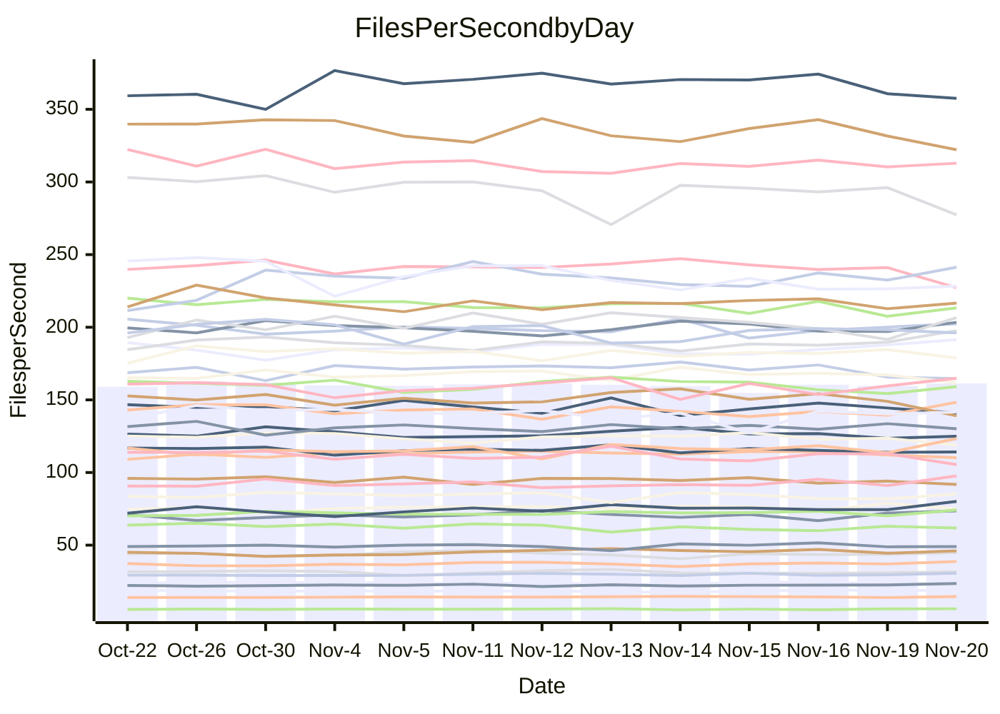

<!---
# This file is auto-generated. Do not edit.
# cspell:disable
--->
# Performance Report

## Daily Performance

## Time to Process Files

| Repository                                      | Elapsed | Min/Avg/Max           |    SD | SD Graph                |
| ----------------------------------------------- | ------: | :-------------------: | ----: | ----------------------- |
| AdaDoom3/AdaDoom3                    |    3.36 | 3.3 /   3.5 /   3.7   |  0.10 | `     ┣━●━━╋━━┻━┫     ` |
| alexiosc/megistos                    |    7.28 | 7.3 /   7.9 /   8.7   |  0.32 | `    ┣●━┻━━╋━━┻━━┫    ` |
| apollographql/apollo-server          |    2.59 | 2.6 /   2.8 /   3.2   |  0.12 | `     ┣●┻━━╋━━┻━┫     ` |
| aspnetboilerplate/aspnetboilerplate  |   10.72 | 10.3 /  10.7 /  11.8  |  0.35 | `    ┣━━┻━━●━━┻━━┫    ` |
| aws-amplify/docs                     |   13.26 | 12.4 /  13.3 /  14.8  |  0.51 | `    ┣━━┻━━●━━┻━━┫    ` |
| Azure/azure-rest-api-specs           |   10.36 | 9.6 /  10.1 /  11.2   |  0.41 | `    ┣━━┻━━╋━●┻━━┫    ` |
| bitjson/typescript-starter           |    1.07 | 1.0 /   1.1 /   1.1   |  0.03 | `     ┣━━┻●╋━┻━━┫     ` |
| caddyserver/caddy                    |    3.84 | 3.4 /   3.8 /   4.0   |  0.11 | `     ┣━┻━━╋━●┻━┫     ` |
| canada-ca/open-source-logiciel-libre |    1.13 | 1.1 /   1.2 /   1.3   |  0.05 | `     ┣━●┻━╋━┻━━┫     ` |
| chef/chef                            |    5.89 | 5.7 /   6.0 /   6.4   |  0.17 | `    ┣━━┻●━╋━━┻━━┫    ` |
| dart-lang/sdk                        |   65.36 | 63.7 /  67.7 /  72.3  |  2.12 | `   ┣━━●━━━╋━━━┻━━┫   ` |
| django/django                        |   16.12 | 14.9 /  15.8 /  17.2  |  0.50 | `    ┣━━┻━━╋━●┻━━┫    ` |
| eslint/eslint                        |   10.57 | 10.6 /  11.2 /  11.8  |  0.34 | `    ┣●━┻━━╋━━┻━━┫    ` |
| exonum/exonum                        |    3.41 | 3.5 /   3.7 /   4.0   |  0.12 | `    ●┣━┻━━╋━━┻━┫     ` |
| flutter/samples                      |   16.18 | 16.0 /  16.9 /  19.0  |  0.60 | `    ┣━●┻━━╋━━┻━━┫    ` |
| gitbucket/gitbucket                  |    3.75 | 3.5 /   3.7 /   3.9   |  0.11 | `     ┣━┻━━╋━●┻━┫     ` |
| googleapis/google-cloud-cpp          |  147.94 | 139.9 / 150.3 / 209.7 | 12.20 | `  ┣━━━┻━━●╋━━━┻━━━┫  ` |
| graphql/express-graphql              |    1.10 | 1.1 /   1.2 /   1.3   |  0.05 | `     ┣━●┻━╋━┻━━┫     ` |
| graphql/graphql-js                   |    3.09 | 2.8 /   3.0 /   3.2   |  0.10 | `     ┣━┻━━╋━━●━┫     ` |
| graphql/graphql-relay-js             |    1.19 | 1.1 /   1.2 /   1.2   |  0.04 | `     ┣━━┻━╋●┻━━┫     ` |
| graphql/graphql-spec                 |    1.30 | 1.3 /   1.3 /   1.4   |  0.03 | `     ┣━━●━╋━┻━━┫     ` |
| iluwatar/java-design-patterns        |   14.33 | 12.6 /  13.3 /  14.4  |  0.36 | `    ┣━━┻━━╋━━┻━━┫  ● ` |
| ktaranov/sqlserver-kit               |    6.58 | 6.6 /   6.9 /   7.3   |  0.19 | `    ┣━●┻━━╋━━┻━━┫    ` |
| liriliri/licia                       |    4.46 | 4.1 /   4.3 /   4.6   |  0.12 | `     ┣━┻━━╋━━┻●┫     ` |
| MartinThoma/LaTeX-examples           |    6.93 | 6.8 /   7.1 /   7.9   |  0.24 | `    ┣━━┻●━╋━━┻━━┫    ` |
| mdx-js/mdx                           |    1.92 | 1.9 /   2.0 /   2.2   |  0.07 | `     ┣━●━━╋━━┻━┫     ` |
| microsoft/TypeScript-Website         |    5.85 | 5.5 /   5.8 /   6.5   |  0.18 | `    ┣━━┻━━╋●━┻━━┫    ` |
| MicrosoftDocs/PowerShell-Docs        |   25.68 | 22.9 /  24.3 /  26.2  |  0.77 | `    ┣━━┻━━╋━━┻━━●    ` |
| neovim/nvim-lspconfig                |    4.62 | 4.3 /   4.4 /   4.7   |  0.10 | `     ┣━┻━━╋━━┻━●     ` |
| pagekit/pagekit                      |    3.59 | 3.5 /   3.7 /   4.3   |  0.16 | `     ┣━┻●━╋━━┻━┫     ` |
| php/php-src                          |   26.53 | 25.9 /  27.1 /  29.3  |  0.92 | `   ┣━━━┻●━╋━━┻━━━┫   ` |
| plasticrake/tplink-smarthome-api     |    1.35 | 1.3 /   1.4 /   1.5   |  0.05 | `     ┣━┻●━╋━━┻━┫     ` |
| prettier/prettier                    |    7.75 | 7.2 /   7.7 /   8.3   |  0.21 | `    ┣━━┻━━╋●━┻━━┫    ` |
| pycontribs/jira                      |    1.61 | 1.5 /   1.6 /   1.7   |  0.07 | `     ┣━┻━━●━━┻━┫     ` |
| RustPython/RustPython                |    5.63 | 5.2 /   5.5 /   6.0   |  0.23 | `    ┣━━┻━━╋●━┻━━┫    ` |
| shoelace-style/shoelace              |    3.12 | 2.9 /   3.0 /   3.2   |  0.09 | `     ┣━┻━━╋━━●━┫     ` |
| slint-ui/slint                       |   13.43 | 13.3 /  13.8 /  14.5  |  0.34 | `    ┣━●┻━━╋━━┻━━┫    ` |
| SoftwareBrothers/admin-bro           |    2.73 | 2.5 /   2.6 /   2.7   |  0.05 | `     ┣━┻━━╋━━┻━●     ` |
| sveltejs/svelte                      |   22.56 | 20.8 /  21.9 /  22.9  |  0.48 | `    ┣━━┻━━╋━━┻●━┫    ` |
| TheAlgorithms/Python                 |    6.16 | 5.6 /   5.8 /   6.1   |  0.11 | `     ┣━┻━━╋━━┻━┫   ● ` |
| twbs/bootstrap                       |    1.91 | 1.8 /   1.9 /   2.4   |  0.12 | `     ┣━┻━━╋●━┻━┫     ` |
| typescript-cheatsheets/react         |    1.37 | 1.3 /   1.4 /   1.6   |  0.06 | `     ┣━●━━╋━━┻━┫     ` |
| typescript-eslint/typescript-eslint  |    4.65 | 4.2 /   4.3 /   4.7   |  0.11 | `     ┣━┻━━╋━━┻━┫  ●  ` |
| vitest-dev/vitest                    |    9.69 | 9.2 /  10.0 /  10.9   |  0.50 | `    ┣━━┻●━╋━━┻━━┫    ` |
| w3c/aria-practices                   |    3.63 | 3.4 /   3.6 /   3.8   |  0.10 | `     ┣━┻━━╋●━┻━┫     ` |
| w3c/specberus                        |    2.15 | 2.0 /   2.1 /   2.2   |  0.05 | `     ┣━┻━━╋━━●━┫     ` |
| webdeveric/webpack-assets-manifest   |    1.23 | 1.2 /   1.2 /   1.4   |  0.05 | `     ┣━━┻●╋━┻━━┫     ` |
| webpack/webpack                      |    5.83 | 5.5 /   5.8 /   6.7   |  0.22 | `    ┣━━┻━━╋●━┻━━┫    ` |
| wireapp/wire-desktop                 |    1.36 | 1.3 /   1.5 /   1.7   |  0.09 | `     ┣━●━━╋━━┻━┫     ` |
| wireapp/wire-webapp                  |   11.20 | 10.6 /  11.2 /  12.6  |  0.54 | `    ┣━━┻━━●━━┻━━┫    ` |

Note:
- Elapsed time is in seconds.

## Files per Second over Time

| Repository                                      | Files |    Sec |    Fps |    Rel | Trend Fps              |    N |
| ----------------------------------------------- | ----: | -----: | -----: | -----: | ---------------------- | ---: |
| AdaDoom3/AdaDoom3                    |   103 |   3.36 |  30.68 |  3.31% | `▄▅▆▇▇▄▇▆▇▆▅▇█▆▅▆▅▇▅▇` |   28 |
| alexiosc/megistos                    |   583 |   7.28 |  80.12 |  8.05% | `▄▇▇▆▇▆▆▆▄▇▆▅▇▇▆▆▆▆▅█` |   28 |
| apollographql/apollo-server          |   253 |   2.59 |  97.72 |  6.74% | `▇▅▇█▇▆▇▇▃▆▆▇▇▅▇▆▆█▆█` |   28 |
| aspnetboilerplate/aspnetboilerplate  |  2286 |  10.72 | 213.34 | -0.46% | `▇█▆▆▇▆▄██▇▇▅█▅▇▆▆▆▅▇` |   28 |
| aws-amplify/docs                     |  2871 |  13.26 | 216.58 |  0.10% | `▆▆▃█▇▅▆▆▆▆▆▇▇▆▇▆▇▆▅▆` |   28 |
| Azure/azure-rest-api-specs           |  2365 |  10.36 | 228.27 | -3.26% | `▇█▆▇███▇█▆▅▆▇▇▅▃▇▄▇▆` |   28 |
| bitjson/typescript-starter           |    20 |   1.07 |  18.65 |  0.69% | `▇▇▅▄▅▇▇▇▆▅▄▆▇▆██▆▇█▇` |   28 |
| caddyserver/caddy                    |   288 |   3.84 |  74.91 | -1.65% | `▄▆▆▅▅▅▆▄▆▅▅▅▅▅▄▅▆▆█▅` |   28 |
| canada-ca/open-source-logiciel-libre |     7 |   1.13 |   6.21 |  4.31% | `▄▅▇▆▄▇▆█▅▇▃▆▅▇▄▆▇▇█▇` |   28 |
| chef/chef                            |  1191 |   5.89 | 202.32 |  1.61% | `█▇▇▆█▆▅▇█▆█▆▇▄▆▇▇█▇▇` |   28 |
| dart-lang/sdk                        | 10778 |  65.36 | 164.91 |  3.85% | `▇▆▅▇▇▆▇▇▇█▄▆█▇▅▅▇▇██` |   28 |
| django/django                        |  2885 |  16.12 | 178.93 | -1.91% | `▄▇▇▆▇▇▆▆▄▇▆▆█▅▆▇▇▇▅▆` |   28 |
| eslint/eslint                        |  2089 |  10.57 | 197.63 |  4.99% | `▇▄▇▅▇▄▅█▆▆▅▆▆▇▆██▅▆█` |   28 |
| exonum/exonum                        |   421 |   3.41 | 123.36 |  7.58% | `▆▇▆▇▇▆▆▄▃▇▆▆▆▆▇▄▆▅▆█` |   28 |
| flutter/samples                      |  2400 |  16.18 | 148.36 |  4.64% | `▆▇▆██▆▇▃▆▇▇▅▇▆▇█▅▅▆█` |   28 |
| gitbucket/gitbucket                  |   413 |   3.75 | 110.22 | -2.42% | `█▄▇▆█▆█▆▇▇▆▅▇█▇▆▄▇▇▅` |   28 |
| googleapis/google-cloud-cpp          | 20955 | 147.94 | 141.64 |  1.24% | `▇█▇▇▇█▇██▇▇▂█▇▇▇▇▇▇▇` |   28 |
| graphql/express-graphql              |    26 |   1.10 |  23.60 |  5.70% | `▅▅▆▅█▆▃▄▅▆▅▄▅▇▅▃▇▅▇▇` |   28 |
| graphql/graphql-js                   |   368 |   3.09 | 118.96 | -4.30% | `▇▅▆▆▄▇██▄▇▇▇█▇▆▇▄█▇▅` |   28 |
| graphql/graphql-relay-js             |    28 |   1.19 |  23.53 | -1.73% | `▆█▆▆▅▅▆▇▆▅▅▆▇▇▇▄▄▇▆▅` |   28 |
| graphql/graphql-spec                 |    19 |   1.30 |  14.60 |  2.62% | `▆▇█▇▆▇█▅▆▇██▇█▇▅▅▇▆█` |   28 |
| iluwatar/java-design-patterns        |  1992 |  14.33 | 139.01 | -7.53% | `▇▇▇▅▆▆▅▆▇██▇▇▆▇▇▇▆▆▄` |   28 |
| ktaranov/sqlserver-kit               |   489 |   6.58 |  74.26 |  4.07% | `▇▆▇▇▆▆█▆▅▇▇▇▆▇██▆▄▅█` |   28 |
| liriliri/licia                       |  1437 |   4.46 | 322.15 | -4.09% | `▆▆▆▄█▆▇██▆▆▆▇██▅▇▇▆▅` |   28 |
| MartinThoma/LaTeX-examples           |  1409 |   6.93 | 203.42 |  2.42% | `▇██▇▆▆█▆▃▇█▇▇█▆▇▇▆▅▇` |   28 |
| mdx-js/mdx                           |   141 |   1.92 |  73.56 |  4.33% | `▇▅▅▇▇▆███▇▆▇▅█▅▆▇█▇█` |   28 |
| microsoft/TypeScript-Website         |   761 |   5.85 | 130.16 | -1.15% | `▇▆▆▆▆▇█▃▇▇▆▇▇▇▆▇▇▇█▆` |   28 |
| MicrosoftDocs/PowerShell-Docs        |  2708 |  25.68 | 105.44 | -5.65% | `▇▅▆▅▅▆█▆▄█▅▅▄▅▇▆▆▇▆▄` |   28 |
| neovim/nvim-lspconfig                |   760 |   4.62 | 164.60 | -3.67% | `▇▆▇▇▇█▇▇█▇█▆▇▇█▆▅▅▆▅` |   28 |
| pagekit/pagekit                      |   741 |   3.59 | 206.65 |  2.62% | `▇▅▇█▇█▇▇▆█▇▇▇▆▆▃▇▆▅▇` |   28 |
| php/php-src                          |  2262 |  26.53 |  85.25 |  1.49% | `█▅▆▇▇▇█▇▇▅▇█▇▅▆▄▆▆▇▇` |   28 |
| plasticrake/tplink-smarthome-api     |    62 |   1.35 |  46.03 |  2.59% | `▄▅▆▆█▆▇▇▇█▇▇▅▇█▅▆▇▆▇` |   28 |
| prettier/prettier                    |  2426 |   7.75 | 312.90 |  0.17% | `█▇█▇███▄▇▆▇▇█▇██▇▇▆▇` |   28 |
| pycontribs/jira                      |    79 |   1.61 |  49.01 | -0.98% | `▇▆▇▆▇▅▅▅▇▄▇▇▆▅▇▄▆█▃▅` |   28 |
| RustPython/RustPython                |   703 |   5.63 | 124.94 | -0.68% | `▄▆▇█▇▄▆▇▇▇█▇▇▇▇▅▆▇▇▆` |   28 |
| shoelace-style/shoelace              |   439 |   3.12 | 140.89 | -2.87% | `█▆▆▇▆▆▄▅▅█▄▆▄▇▇▆▆▇▄▅` |   28 |
| slint-ui/slint                       |  2570 |  13.43 | 191.42 |  3.38% | `▆▅█▆▅▇█▇▇▇▆▅▆▇▆▇▆█▇█` |   28 |
| SoftwareBrothers/admin-bro           |   441 |   2.73 | 161.78 | -3.33% | `▇▅▇█▆▇▇▇▇▅█▇▆▆▇▇▇▆▅▅` |   28 |
| sveltejs/svelte                      |  8068 |  22.56 | 357.55 | -2.57% | `▆▆▇▆▇█▇▇▇▆▇▆▆█▇▆▆▆▅▅` |   28 |
| TheAlgorithms/Python                 |  1399 |   6.16 | 227.21 | -5.96% | `▇█▆▇▆█▅██▇█▇▆█▆▆▆▇▇▄` |   28 |
| twbs/bootstrap                       |   118 |   1.91 |  61.76 | -1.90% | `▇▆▇██▇▇█▇▅▇██▂▆▅▇██▆` |   28 |
| typescript-cheatsheets/react         |    53 |   1.37 |  38.77 |  4.81% | `▅▆▄▇▆▇▆▇█▆▄▆▆▆▆▄▆▆▇▇` |   28 |
| typescript-eslint/typescript-eslint  |  1290 |   4.65 | 277.37 | -6.56% | `▇▇▇▇█▇▆▆█▄▇▇▆▇▆▇▇▇▇▅` |   28 |
| vitest-dev/vitest                    |  2338 |   9.69 | 241.31 |  4.22% | `▇▆▆█▇█▆▆▇▆▆▄▅▇▇▇▆▄▇▇` |   28 |
| w3c/aria-practices                   |   414 |   3.63 | 114.16 | -1.09% | `▅▅▇▇█▅▇▇▅█▆█▆▆▆▇█▄▆▆` |   28 |
| w3c/specberus                        |   197 |   2.15 |  91.76 | -3.45% | `███▅▇▅▇▇█▇▇█▇▇▆█▇▄▇▅` |   28 |
| webdeveric/webpack-assets-manifest   |    55 |   1.23 |  44.83 |  1.44% | `▆▇▇▇▆█▅▆▇▅▃█▅▄▅▆▄▅▆▆` |   28 |
| webpack/webpack                      |  1143 |   5.83 | 196.06 | -0.72% | `▆▃▆▆█▇▇█▇▆▆▇▇▇▇▆▇▇▇▇` |   28 |
| wireapp/wire-desktop                 |    43 |   1.36 |  31.56 |  1.38% | `▄▃█▆▆▆▇█▇█▆▅█▅▆▇▇▄▇▇` |   28 |
| wireapp/wire-webapp                  |  1783 |  11.20 | 159.13 | -0.22% | `▇▇▄▇▄▇█▅██▇▇▇█▆▇▇▃▅▇` |   28 |

## Data Throughput

| Repository                                      | Files |    Sec |     Kps |     Rel | Trend Kps              |    N |
| ----------------------------------------------- | ----: | -----: | ------: | ------: | ---------------------- | ---: |
| AdaDoom3/AdaDoom3                    |   103 |   3.36 |  652.02 |   3.31% | `▄▅▆▇▇▄▇▆▇▆▅▇█▆▅▆▅▇▅▇` |   28 |
| alexiosc/megistos                    |   583 |   7.28 |  629.54 |   8.05% | `▄▇▇▆▇▆▆▆▄▇▆▅▇▇▆▆▆▆▅█` |   28 |
| apollographql/apollo-server          |   253 |   2.59 |  798.39 |   7.04% | `▇▅▇█▇▆▇▇▃▆▆▇▇▅▇▆▆█▆█` |   28 |
| aspnetboilerplate/aspnetboilerplate  |  2286 |  10.72 |  519.08 |  -0.46% | `▇█▆▆▇▆▄██▇▇▅█▅▇▆▆▆▅▇` |   28 |
| aws-amplify/docs                     |  2871 |  13.26 |  755.88 |   0.08% | `▆▆▃█▇▅▆▆▆▆▆▇▇▆▇▆▇▆▅▆` |   28 |
| Azure/azure-rest-api-specs           |  2365 |  10.36 |  621.09 |  -2.85% | `▇█▆▇███▇█▆▅▆▇▇▅▃▇▄▇▆` |   28 |
| bitjson/typescript-starter           |    20 |   1.07 |   74.61 |   0.69% | `▇▇▅▄▅▇▇▇▆▅▄▆▇▆██▆▇█▇` |   28 |
| caddyserver/caddy                    |   288 |   3.84 |  650.54 |  -1.55% | `▄▆▆▅▅▅▆▄▆▅▅▅▅▅▄▅▆▆█▅` |   28 |
| canada-ca/open-source-logiciel-libre |     7 |   1.13 |   51.44 |   4.31% | `▄▅▇▆▄▇▆█▅▇▃▆▅▇▄▆▇▇█▇` |   28 |
| chef/chef                            |  1191 |   5.89 |  939.40 |   1.79% | `█▇▇▆█▆▅▇█▆█▆▇▄▆▇▇█▇▇` |   28 |
| dart-lang/sdk                        | 10778 |  65.36 | 1127.35 |   4.08% | `▇▆▅▇▇▆▇▇▇█▅▆█▇▅▅▇▇██` |   28 |
| django/django                        |  2885 |  16.12 | 1123.38 |  -1.96% | `▄▇▇▆▇▇▆▆▄▇▆▆█▅▆▇▇▇▅▆` |   28 |
| eslint/eslint                        |  2089 |  10.57 | 1341.09 |   0.02% | `▇▅▇▅▇▅▆█▇▇▆▆▆▇▇▆▆▃▅▆` |   28 |
| exonum/exonum                        |   421 |   3.41 | 1179.99 |   7.58% | `▆▇▆▇▇▆▆▄▃▇▆▆▆▆▇▄▆▅▆█` |   28 |
| flutter/samples                      |  2400 |  16.18 | 1323.89 |   4.64% | `▆▇▆██▆▇▃▆▇▇▅▇▆▇█▅▅▆█` |   28 |
| gitbucket/gitbucket                  |   413 |   3.75 |  500.93 |  -2.42% | `█▄▇▆█▆█▆▇▇▆▅▇█▇▆▄▇▇▅` |   28 |
| googleapis/google-cloud-cpp          | 20955 | 147.94 | 1153.96 |   1.42% | `▇█▇▇▇█▇██▇▇▂█▇█▇▇█▇▇` |   28 |
| graphql/express-graphql              |    26 |   1.10 |  108.02 |   5.70% | `▅▅▆▅█▆▃▄▅▆▅▄▅▇▅▃▇▅▇▇` |   28 |
| graphql/graphql-js                   |   368 |   3.09 |  690.47 |  -4.21% | `▇▅▆▆▄▇██▄▇▇▇█▇▆▇▄█▇▅` |   28 |
| graphql/graphql-relay-js             |    28 |   1.19 |   92.45 |  -1.73% | `▆█▆▆▅▅▆▇▆▅▅▆▇▇▇▄▄▇▆▅` |   28 |
| graphql/graphql-spec                 |    19 |   1.30 |  487.02 |   2.62% | `▆▇█▇▆▇█▅▆▇██▇█▇▅▅▇▆█` |   28 |
| iluwatar/java-design-patterns        |  1992 |  14.33 |  429.66 |  -7.53% | `▇▇▇▅▆▆▅▆▇██▇▇▆▇▇▇▆▆▄` |   28 |
| ktaranov/sqlserver-kit               |   489 |   6.58 | 1124.54 |   4.07% | `▇▆▇▇▆▆█▆▅▇▇▇▆▇██▆▄▅█` |   28 |
| liriliri/licia                       |  1437 |   4.46 |  383.80 |  -4.09% | `▆▆▆▄█▆▇██▆▆▆▇██▅▇▇▆▅` |   28 |
| MartinThoma/LaTeX-examples           |  1409 |   6.93 |  420.11 |   2.42% | `▇██▇▆▆█▆▃▇█▇▇█▆▇▇▆▅▇` |   28 |
| mdx-js/mdx                           |   141 |   1.92 |  342.24 |   4.33% | `▇▅▅▇▇▆███▇▆▇▅█▅▆▇█▇█` |   28 |
| microsoft/TypeScript-Website         |   761 |   5.85 |  900.33 |  -1.15% | `▇▆▆▆▆▇█▃▇▇▆▇▇▇▆▇▇▇█▆` |   28 |
| MicrosoftDocs/PowerShell-Docs        |  2708 |  25.68 | 1085.73 |  -5.63% | `▇▅▆▅▅▆█▆▄█▅▅▄▅▇▆▆▇▆▄` |   28 |
| neovim/nvim-lspconfig                |   760 |   4.62 |  305.59 |   5.33% | `▅▅▅▅▅▆▅▅▆▅▆▅▅▅▆█▇▇█▇` |   28 |
| pagekit/pagekit                      |   741 |   3.59 |  430.86 |   2.62% | `▇▅▇█▇█▇▇▆█▇▇▇▆▆▃▇▆▅▇` |   28 |
| php/php-src                          |  2262 |  26.53 | 1494.60 |   1.66% | `█▅▆▇▇▇█▇▇▄▇█▇▅▆▄▆▆▇▇` |   28 |
| plasticrake/tplink-smarthome-api     |    62 |   1.35 |  248.69 |   2.59% | `▄▅▆▆█▆▇▇▇█▇▇▅▇█▅▆▇▆▇` |   28 |
| prettier/prettier                    |  2426 |   7.75 |  433.88 |  -0.13% | `█▇█▇███▄▇▆▇▇▇▇█▇▇▇▆▇` |   28 |
| pycontribs/jira                      |    79 |   1.61 |  347.38 |  -0.98% | `▇▆▇▆▇▅▅▅▇▄▇▇▆▅▇▄▆█▃▅` |   28 |
| RustPython/RustPython                |   703 |   5.63 | 1275.73 |  19.29% | `▂▄▄▅▄▃▃▄▄▄▅▄▄▄▄▇████` |   28 |
| shoelace-style/shoelace              |   439 |   3.12 |  680.70 |  -2.87% | `█▆▆▇▆▆▄▅▅█▄▆▄▇▇▆▆▇▄▅` |   28 |
| slint-ui/slint                       |  2570 |  13.43 | 1185.22 |   3.79% | `▆▅█▆▅▆█▇▇▇▆▅▆▇▆▇▆█▇█` |   28 |
| SoftwareBrothers/admin-bro           |   441 |   2.73 |  356.59 |  -3.33% | `▇▅▇█▆▇▇▇▇▅█▇▆▆▇▇▇▆▅▅` |   28 |
| sveltejs/svelte                      |  8068 |  22.56 |  238.42 |  -2.63% | `▆▆▇▆▇█▇▇▇▆▇▆▆█▇▆▆▆▅▅` |   28 |
| TheAlgorithms/Python                 |  1399 |   6.16 |  577.85 |  -5.96% | `▇█▆▇▆█▅██▇█▇▆█▆▆▆▇▇▄` |   28 |
| twbs/bootstrap                       |   118 |   1.91 |  507.16 |  -1.86% | `▇▆▇██▇▇█▇▅▇██▂▆▅▇██▆` |   28 |
| typescript-cheatsheets/react         |    53 |   1.37 |  286.73 |   4.81% | `▅▆▄▇▆▇▆▇█▆▄▆▆▆▆▄▆▆▇▇` |   28 |
| typescript-eslint/typescript-eslint  |  1290 |   4.65 | 1432.24 |  -6.32% | `▇▇▇▇█▇▆▆█▄▇▇▆▇▆▇▇▇▇▅` |   28 |
| vitest-dev/vitest                    |  2338 |   9.69 |  518.44 |   2.55% | `█▆▆▇▆█▆▅▇▆▅▃▅▇▆▇▅▃▇▇` |   28 |
| w3c/aria-practices                   |   414 |   3.63 | 1064.35 |  -1.09% | `▅▅▇▇█▅▇▇▅█▆█▆▆▆▇█▄▆▆` |   28 |
| w3c/specberus                        |   197 |   2.15 |  290.17 |  -3.45% | `███▅▇▅▇▇█▇▇█▇▇▆█▇▄▇▅` |   28 |
| webdeveric/webpack-assets-manifest   |    55 |   1.23 |  103.52 |   1.44% | `▆▇▇▇▆█▅▆▇▅▃█▅▄▅▆▄▅▆▆` |   28 |
| webpack/webpack                      |  1143 |   5.83 |  895.40 |  -0.42% | `▆▃▅▆█▇▇█▇▆▆▇▇▇▇▆▇▇▇▇` |   28 |
| wireapp/wire-desktop                 |    43 |   1.36 |  139.45 | -17.37% | `▅▄█▇▆▇██▇█▇▆█▆▇▃▄▂▃▃` |   28 |
| wireapp/wire-webapp                  |  1783 |  11.20 |  589.23 |  -0.04% | `▇▇▄▇▄▇█▅██▇▇▇█▆▇▇▃▅▇` |   28 |

