<!---
# This file is auto-generated. Do not edit.
# cspell:disable
--->
# Performance Report

## Daily Performance

```mermaid
xychart-beta
    title Files Per Second by Day
    y-axis Files per Second
    x-axis Date [Jul-23, Jul-25, Jul-26, Jul-28, Jul-29, Jul-30, Jul-31, Aug-1, Aug-2, Aug-4, Aug-5, Aug-6, Aug-8, Aug-12, Aug-13, Aug-16, Aug-17, Aug-18, Aug-19, Aug-20, Aug-21, Aug-22]
    bar [58.17, 57.75, 59.61, 62.19, 65.99, 119.41, 176.56, 184.20, 186.93, 190.59, 192.54, 190.31, 191.20, 180.70, 178.15, 177.36, 180.37, 181.58, 178.25, 178.21, 176.48, 177.31]
    line [22.15, 22.47, 22.47, 21.08, 0.00, 28.05, 33.97, 33.41, 33.88, 33.91, 34.47, 34.14, 34.20, 33.20, 34.57, 31.78, 34.11, 35.97, 0.00, 34.29, 33.06, 35.20]
    line [6.55, 7.13, 7.15, 6.78, 0.00, 8.58, 9.59, 10.14, 9.83, 9.72, 9.85, 9.44, 9.50, 9.79, 10.01, 9.93, 9.56, 9.98, 0.00, 10.21, 9.57, 9.67]
    line [33.86, 36.85, 37.77, 39.16, 40.78, 81.67, 125.88, 127.23, 122.52, 127.67, 132.91, 132.93, 128.73, 120.46, 121.08, 119.97, 118.94, 123.21, 122.05, 125.45, 120.85, 116.37]
    line [62.37, 60.34, 59.14, 63.13, 60.18, 114.35, 151.18, 156.08, 157.09, 160.72, 160.91, 159.40, 154.37, 143.15, 144.69, 142.97, 147.08, 148.37, 144.42, 139.84, 136.44, 133.06]
    line [26.66, 27.43, 30.97, 30.05, 31.96, 64.46, 87.66, 89.40, 91.61, 93.99, 88.14, 91.02, 91.26, 90.11, 84.85, 88.54, 87.18, 78.69, 87.97, 81.21, 83.61, 95.38]
    line [34.84, 35.83, 37.74, 37.47, 0.00, 86.83, 145.57, 147.18, 152.61, 139.36, 148.78, 146.56, 150.53, 148.96, 145.17, 146.97, 147.53, 146.24, 0.00, 148.33, 142.38, 151.12]
    line [28.99, 27.54, 30.39, 28.15, 0.00, 35.47, 43.82, 43.53, 45.91, 45.13, 44.18, 44.67, 44.79, 42.03, 41.23, 43.84, 44.17, 43.94, 0.00, 42.21, 42.40, 45.26]
    line [8.05, 7.59, 7.45, 7.70, 0.00, 15.35, 20.52, 20.02, 21.02, 20.56, 20.41, 20.21, 21.19, 20.25, 20.06, 19.64, 20.70, 20.41, 0.00, 20.37, 19.78, 16.65]
    line [59.89, 55.90, 58.62, 60.13, 0.00, 136.93, 181.56, 189.65, 195.02, 194.05, 193.40, 189.46, 188.48, 161.32, 170.45, 169.12, 163.90, 175.25, 0.00, 174.12, 168.12, 168.81]
    line [11.80, 11.36, 13.55, 14.23, 0.00, 25.77, 32.08, 37.76, 37.97, 39.70, 39.42, 39.41, 39.34, 38.23, 38.39, 37.87, 38.23, 38.08, 0.00, 38.14, 38.85, 37.70]
    line [24.63, 27.03, 27.61, 25.25, 0.00, 35.54, 41.12, 40.79, 42.70, 43.09, 42.44, 41.97, 42.95, 41.33, 40.92, 39.81, 41.51, 41.02, 0.00, 41.64, 40.90, 36.56]
    line [111.98, 117.50, 116.92, 121.39, 128.96, 224.88, 287.65, 265.54, 309.80, 305.59, 302.93, 302.86, 299.77, 259.20, 260.53, 258.00, 260.49, 259.27, 261.07, 258.95, 254.28, 252.45]
    line [56.15, 58.33, 57.64, 59.86, 0.00, 129.84, 225.47, 230.05, 229.96, 242.74, 229.48, 222.58, 224.07, 225.73, 230.84, 231.20, 230.56, 226.49, 220.96, 218.62, 223.21, 235.78]
    line [61.91, 63.17, 61.89, 63.66, 69.19, 158.17, 225.66, 231.72, 240.39, 241.50, 241.08, 235.56, 237.21, 229.02, 218.58, 221.35, 221.21, 218.06, 224.66, 224.81, 219.16, 211.20]
    line [22.26, 21.95, 23.43, 24.27, 0.00, 53.52, 73.42, 79.00, 75.87, 80.18, 81.35, 79.97, 79.56, 80.20, 83.75, 83.15, 84.93, 85.14, 0.00, 84.39, 80.69, 82.01]
    line [176.84, 177.23, 166.69, 179.41, 185.01, 355.40, 423.85, 475.59, 469.38, 432.41, 466.82, 461.84, 477.15, 462.92, 457.77, 453.39, 461.99, 463.36, 0.00, 463.20, 452.00, 439.43]
    line [77.22, 77.14, 80.01, 79.98, 84.57, 187.23, 248.71, 282.27, 276.16, 287.06, 280.91, 282.25, 284.31, 268.87, 259.91, 264.09, 263.50, 252.27, 247.59, 259.11, 258.43, 251.09]
    line [32.79, 31.43, 33.73, 32.26, 0.00, 55.02, 70.82, 70.14, 70.65, 71.76, 72.59, 71.65, 69.76, 72.23, 70.49, 71.73, 71.73, 69.94, 0.00, 72.13, 70.80, 70.95]
    line [39.91, 39.18, 41.18, 41.34, 42.39, 74.35, 101.66, 102.10, 101.86, 102.94, 98.59, 101.98, 102.16, 100.25, 96.34, 100.85, 99.70, 100.11, 0.00, 95.31, 98.34, 100.20]
    line [38.56, 39.69, 40.26, 39.60, 0.00, 64.51, 68.10, 80.32, 82.04, 81.68, 82.05, 80.44, 80.98, 74.91, 76.50, 76.38, 77.71, 75.62, 0.00, 77.72, 74.04, 70.35]
    line [106.71, 106.47, 108.24, 105.78, 0.00, 185.16, 201.37, 231.04, 236.65, 230.99, 220.82, 226.74, 227.33, 235.28, 233.55, 229.09, 233.43, 243.19, 0.00, 239.03, 235.84, 242.13]
    line [99.67, 100.15, 110.97, 102.83, 0.00, 197.16, 244.74, 257.08, 255.46, 264.48, 262.64, 256.46, 267.50, 243.48, 245.74, 247.26, 247.95, 246.01, 0.00, 245.63, 244.19, 237.32]
    line [47.19, 48.99, 56.90, 58.22, 63.36, 102.80, 129.76, 133.12, 137.52, 130.49, 132.80, 126.71, 134.56, 137.20, 131.68, 136.01, 136.33, 135.27, 137.39, 135.24, 132.55, 135.80]
    line [57.77, 58.20, 63.09, 63.92, 65.92, 149.04, 211.09, 211.74, 220.59, 213.68, 216.07, 216.46, 217.96, 220.64, 214.63, 212.14, 214.39, 207.70, 220.70, 210.90, 214.69, 206.22]
    line [43.76, 43.57, 48.07, 47.27, 52.96, 112.26, 166.38, 174.81, 178.59, 173.53, 175.86, 170.50, 175.00, 154.73, 157.53, 156.69, 160.04, 149.26, 160.96, 156.07, 157.97, 160.09]
    line [77.28, 75.98, 74.52, 78.88, 86.02, 139.21, 173.22, 177.60, 175.37, 180.04, 184.53, 180.79, 188.21, 179.85, 184.92, 184.34, 182.55, 194.62, 173.87, 185.52, 175.53, 184.67]
    line [22.99, 23.89, 23.77, 25.50, 0.00, 56.46, 72.50, 74.86, 78.82, 78.78, 85.02, 87.13, 85.35, 82.25, 84.75, 81.36, 85.27, 80.18, 0.00, 84.11, 82.91, 84.94]
    line [161.81, 162.29, 162.50, 164.03, 169.28, 297.61, 407.69, 399.58, 397.95, 401.80, 410.52, 401.88, 409.97, 380.61, 375.07, 385.96, 389.59, 387.36, 368.74, 381.05, 377.05, 388.53]
    line [57.12, 54.66, 52.81, 56.98, 58.70, 123.04, 170.92, 180.50, 169.87, 176.46, 171.25, 178.78, 173.61, 176.29, 177.61, 180.65, 178.25, 170.32, 0.00, 179.55, 173.37, 159.94]
    line [46.95, 46.62, 49.86, 49.32, 53.93, 111.43, 155.80, 153.95, 159.44, 152.22, 155.53, 156.29, 161.10, 149.57, 152.42, 154.99, 156.52, 151.19, 149.78, 152.30, 148.37, 152.77]
    line [94.91, 94.67, 91.55, 95.54, 0.00, 194.86, 268.91, 261.76, 261.47, 263.34, 260.92, 262.66, 269.21, 249.55, 240.04, 237.83, 228.68, 245.41, 242.22, 244.96, 234.22, 246.89]
    line [60.17, 58.38, 62.14, 60.02, 65.20, 147.38, 203.75, 210.55, 211.70, 215.99, 214.65, 218.75, 213.12, 199.30, 201.86, 197.88, 205.41, 206.29, 0.00, 206.95, 195.89, 198.81]
    line [33.73, 32.71, 34.04, 32.69, 36.28, 67.26, 104.48, 107.51, 113.43, 113.03, 112.93, 114.12, 108.73, 114.61, 115.03, 111.20, 115.68, 117.57, 108.01, 110.94, 111.36, 109.59]
    line [82.01, 83.68, 92.86, 92.36, 97.95, 188.50, 247.30, 265.75, 277.90, 279.14, 276.47, 277.53, 272.63, 271.36, 278.18, 281.29, 276.84, 282.85, 281.73, 278.23, 265.94, 284.38]
    line [23.94, 24.45, 25.23, 26.24, 26.64, 41.74, 53.95, 54.92, 55.94, 55.08, 54.71, 53.08, 55.19, 53.89, 53.76, 54.05, 51.77, 52.47, 0.00, 51.98, 49.75, 49.50]
    line [67.01, 68.84, 69.25, 68.91, 72.89, 112.18, 139.96, 140.96, 144.35, 144.89, 141.11, 140.08, 142.93, 132.02, 134.29, 131.31, 134.38, 103.66, 133.22, 133.90, 133.21, 135.84]
    line [31.26, 31.76, 32.88, 30.84, 32.94, 46.53, 60.67, 58.92, 56.98, 58.43, 59.66, 58.88, 58.58, 56.63, 54.55, 56.37, 56.24, 56.95, 55.01, 51.81, 55.08, 55.43]
    line [22.77, 21.97, 21.65, 20.95, 0.00, 27.59, 33.12, 30.06, 32.38, 33.03, 32.12, 32.58, 32.58, 32.53, 30.92, 31.50, 32.70, 32.97, 0.00, 32.06, 31.30, 30.41]
    line [184.59, 176.63, 184.28, 179.17, 177.49, 309.36, 360.68, 378.77, 376.76, 381.06, 376.89, 380.84, 375.47, 377.78, 381.67, 375.65, 377.00, 374.45, 380.47, 380.68, 375.26, 397.02]
    line [40.66, 41.29, 42.44, 42.11, 47.48, 108.63, 156.47, 156.31, 159.77, 165.84, 157.27, 161.17, 163.25, 158.60, 153.54, 148.56, 144.51, 138.29, 159.59, 153.49, 152.84, 151.42]
    line [86.00, 87.23, 90.09, 92.38, 99.53, 205.61, 287.62, 300.04, 307.66, 316.30, 310.88, 313.17, 303.64, 278.53, 253.81, 258.44, 269.09, 265.67, 263.14, 256.57, 256.22, 262.68]
    line [188.50, 169.72, 203.47, 193.16, 212.35, 321.42, 399.10, 407.64, 405.57, 411.93, 403.91, 413.52, 405.10, 413.56, 404.76, 403.76, 404.07, 431.05, 409.21, 405.37, 402.28, 402.99]
    line [55.22, 57.94, 61.31, 61.72, 67.47, 139.62, 205.65, 208.16, 209.05, 209.34, 196.08, 209.34, 209.91, 187.02, 173.84, 174.43, 177.08, 175.87, 164.73, 177.91, 172.41, 171.41]
    line [30.28, 31.14, 33.42, 31.63, 35.72, 84.37, 125.89, 130.82, 138.60, 138.80, 137.73, 133.56, 136.25, 131.30, 125.82, 127.16, 126.21, 130.73, 126.16, 124.30, 123.93, 127.92]
    line [22.19, 21.79, 23.85, 24.06, 26.34, 62.00, 84.22, 89.16, 89.79, 90.02, 93.31, 91.21, 92.10, 91.06, 89.72, 89.04, 89.39, 90.78, 90.42, 89.47, 89.22, 86.73]
    line [52.00, 51.26, 50.58, 54.23, 54.18, 111.37, 145.93, 153.71, 155.61, 162.84, 164.63, 162.06, 162.85, 147.34, 145.33, 143.10, 148.69, 150.98, 137.75, 145.27, 144.73, 145.80]
    line [0.00, 0.00, 0.00, 111.91, 0.00, 210.28, 260.92, 285.21, 289.16, 278.10, 291.72, 291.23, 287.52, 260.47, 256.60, 250.90, 257.82, 260.83, 265.11, 241.69, 253.34, 256.92]
```

## Time to Process Files

| Repository                                      | Elapsed | Min/Avg/Max           |    SD | SD Graph                |
| ----------------------------------------------- | ------: | :-------------------: | ----: | ----------------------- |
| AdaDoom3/AdaDoom3                    |    2.73 | 2.5 /   3.8 /   9.6   |  2.17 | `    ┣━━┻━●╋━━┻━━┫    ` |
| alexiosc/megistos                    |    7.11 | 6.6 /  10.9 /  27.6   |  7.11 | `    ┣━━┻●━╋━━┻━━┫    ` |
| apollographql/apollo-server          |    2.15 | 1.8 /   3.0 /   7.9   |  1.84 | `     ┣━┻━●╋━━┻━┫     ` |
| aspnetboilerplate/aspnetboilerplate  |   10.85 | 8.7 /  12.8 /  25.3   |  5.33 | `    ┣━━┻━●╋━━┻━━┫    ` |
| aws-amplify/docs                     |   11.27 | 9.7 /  15.8 /  36.8   |  9.93 | `    ┣━━┻━●╋━━┻━━┫    ` |
| Azure/azure-rest-api-specs           |   13.08 | 12.4 /  17.0 /  32.5  |  6.86 | `    ┣━━┻●━╋━━┻━━┫    ` |
| bitjson/typescript-starter           |    0.57 | 0.6 /   0.7 /   1.0   |  0.13 | `     ┣━━●━╋━┻━━┫     ` |
| caddyserver/caddy                    |    2.89 | 2.8 /   4.5 /  10.7   |  2.56 | `    ┣━━┻●━╋━━┻━━┫    ` |
| canada-ca/open-source-logiciel-libre |    0.72 | 0.7 /   0.8 /   1.2   |  0.13 | `     ┣━━┻●╋━┻━━┫     ` |
| chef/chef                            |    5.00 | 4.8 /   8.2 /  21.9   |  5.79 | `    ┣━━┻●━╋━━┻━━┫    ` |
| django/django                        |   13.55 | 12.3 /  19.7 /  49.4  | 12.88 | `   ┣━━━┻●━╋━━┻━━━┫   ` |
| eslint/eslint                        |    9.38 | 7.9 /  13.2 /  31.8   |  8.66 | `    ┣━━┻━●╋━━┻━━┫    ` |
| exonum/exonum                        |    2.79 | 2.7 /   4.7 /  12.3   |  3.40 | `    ┣━━┻●━╋━━┻━━┫    ` |
| gitbucket/gitbucket                  |    3.09 | 2.5 /   3.6 /   7.2   |  1.53 | `     ┣━┻━●╋━━┻━┫     ` |
| googleapis/google-cloud-cpp          |  134.08 | 116.7 / 179.0 / 395.2 | 95.04 | `  ┣━━━┻━●━╋━━━┻━━━┫  ` |
| graphql/express-graphql              |    0.71 | 0.6 /   0.7 /   1.2   |  0.16 | `     ┣━━┻━●━┻━━┫     ` |
| graphql/graphql-js                   |    1.97 | 1.7 /   2.6 /   6.2   |  1.47 | `     ┣━┻━●╋━━┻━┫     ` |
| graphql/graphql-relay-js             |    0.62 | 0.6 /   0.7 /   1.1   |  0.14 | `     ┣━━●━╋━┻━━┫     ` |
| graphql/graphql-spec                 |    0.90 | 0.7 /   1.0 /   2.0   |  0.46 | `     ┣━━┻━●━┻━━┫     ` |
| iluwatar/java-design-patterns        |   11.49 | 10.0 /  15.2 /  35.4  |  8.83 | `    ┣━━┻━●╋━━┻━━┫    ` |
| ktaranov/sqlserver-kit               |    5.76 | 5.5 /   8.9 /  21.7   |  5.59 | `    ┣━━┻●━╋━━┻━━┫    ` |
| liriliri/licia                       |    3.22 | 2.9 /   4.1 /   8.5   |  1.94 | `    ┣━━┻━●╋━━┻━━┫    ` |
| MartinThoma/LaTeX-examples           |    5.81 | 5.8 /   7.5 /  14.1   |  2.79 | `    ┣━━┻●━╋━━┻━━┫    ` |
| mdx-js/mdx                           |    1.44 | 1.4 /   1.9 /   3.7   |  0.84 | `     ┣━┻━●╋━━┻━┫     ` |
| microsoft/TypeScript-Website         |    4.71 | 4.1 /   7.1 /  18.2   |  4.69 | `    ┣━━┻●━╋━━┻━━┫    ` |
| MicrosoftDocs/PowerShell-Docs        |   20.97 | 18.5 /  33.9 /  93.2  | 25.26 | `   ┣━━┻━●━╋━━━┻━━┫   ` |
| neovim/nvim-lspconfig                |    2.58 | 2.4 /   3.4 /   7.9   |  1.59 | `     ┣━┻━●╋━━┻━┫     ` |
| pagekit/pagekit                      |    3.12 | 2.7 /   3.8 /   7.6   |  1.69 | `    ┣━━┻━●╋━━┻━━┫    ` |
| php/php-src                          |   25.42 | 23.1 /  38.9 / 106.4  | 27.80 | `   ┣━━┻━●━╋━━━┻━━┫   ` |
| plasticrake/tplink-smarthome-api     |    0.88 | 0.7 /   1.0 /   1.6   |  0.30 | `     ┣━━┻●╋━┻━━┫     ` |
| prettier/prettier                    |    5.63 | 5.3 /   7.2 /  13.9   |  3.04 | `    ┣━━┻●━╋━━┻━━┫    ` |
| pycontribs/jira                      |    1.10 | 1.1 /   1.4 /   2.5   |  0.51 | `     ┣━┻━●╋━━┻━┫     ` |
| RustPython/RustPython                |    4.06 | 3.7 /   5.8 /  13.6   |  3.39 | `    ┣━━┻━●╋━━┻━━┫    ` |
| shoelace-style/shoelace              |    2.20 | 2.0 /   3.2 /   7.7   |  2.02 | `    ┣━━┻━●╋━━┻━━┫    ` |
| SoftwareBrothers/admin-bro           |    1.78 | 1.6 /   2.3 /   4.9   |  1.10 | `     ┣━┻━●╋━━┻━┫     ` |
| sveltejs/svelte                      |   18.04 | 16.7 /  21.8 /  55.0  |  8.22 | `    ┣━━┻━●╋━━┻━━┫    ` |
| TheAlgorithms/Python                 |    4.70 | 4.5 /   7.0 /  16.8   |  4.10 | `    ┣━━┻●━╋━━┻━━┫    ` |
| twbs/bootstrap                       |    1.10 | 1.0 /   1.6 /   3.9   |  0.99 | `     ┣━┻━●╋━━┻━┫     ` |
| typescript-cheatsheets/react         |    1.07 | 0.9 /   1.2 /   2.5   |  0.46 | `     ┣━━┻●╋━┻━━┫     ` |
| typescript-eslint/typescript-eslint  |    3.12 | 3.1 /   4.0 /   7.5   |  1.45 | `     ┣━┻●━╋━━┻━┫     ` |
| vitest-dev/vitest                    |    6.64 | 5.5 /   7.1 /  14.8   |  2.46 | `    ┣━━┻━●╋━━┻━━┫    ` |
| w3c/aria-practices                   |    2.64 | 2.4 /   4.0 /  10.4   |  2.70 | `    ┣━━┻━●╋━━┻━━┫    ` |
| w3c/specberus                        |    1.47 | 1.4 /   1.8 /   3.0   |  0.58 | `     ┣━┻━●╋━━┻━┫     ` |
| webdeveric/webpack-assets-manifest   |    0.62 | 0.6 /   0.7 /   0.9   |  0.12 | `     ┣━━┻●╋━┻━━┫     ` |
| webpack/webpack                      |    4.13 | 3.4 /   5.6 /  13.2   |  3.25 | `    ┣━━┻━●╋━━┻━━┫    ` |
| wireapp/wire-desktop                 |    0.78 | 0.7 /   0.9 /   1.5   |  0.24 | `     ┣━━┻●╋━┻━━┫     ` |
| wireapp/wire-webapp                  |    7.04 | 5.5 /   9.2 /  22.6   |  5.39 | `    ┣━━┻━●╋━━┻━━┫    ` |

Note:
- Elapsed time is in seconds.

## Files per Second over Time

| Repository                                      | Files |    Sec |    Fps |    Rel | Trend Fps              |    N |
| ----------------------------------------------- | ----: | -----: | -----: | -----: | ---------------------- | ---: |
| AdaDoom3/AdaDoom3                    |   103 |   2.73 |  37.70 | 15.80% | `████████████████████` |   57 |
| alexiosc/megistos                    |   583 |   7.11 |  82.01 | 20.52% | `▇██▇▇████▇████▇▇█▇█▇` |   57 |
| apollographql/apollo-server          |   250 |   2.15 | 116.37 | 12.07% | `▇████▇██▇▇████▇▇▇██▇` |   60 |
| aspnetboilerplate/aspnetboilerplate  |  2739 |  10.85 | 252.45 |  4.98% | `████▇▇████████▇██▇▇▇` |   59 |
| aws-amplify/docs                     |  2830 |  11.27 | 251.09 | 10.80% | `██████████▇▇███████▇` |   61 |
| Azure/azure-rest-api-specs           |  2415 |  13.08 | 184.67 | 16.38% | `▇█▇█▇▇█▇███▇██▇▇▇▆▇█` |   61 |
| bitjson/typescript-starter           |    20 |   0.57 |  35.20 | 13.18% | `██▇█▇▆▇▅█▇▇██▇██▇▇▅█` |   57 |
| caddyserver/caddy                    |   276 |   2.89 |  95.38 | 27.43% | `▇▇▇▇▇▇▇▇▇▇▆▇▆▇▇▇▇▇▇█` |   61 |
| canada-ca/open-source-logiciel-libre |     7 |   0.72 |   9.67 |  5.81% | `█▇██▆████▅████▆▇▇▇▇▇` |   57 |
| chef/chef                            |  1180 |   5.00 | 235.78 | 24.75% | `██▇██▇██▇▇▇▇▇▇█▇▇▇██` |   59 |
| django/django                        |  2794 |  13.55 | 206.22 | 13.94% | `█████▇█▇██▇████████▇` |   61 |
| eslint/eslint                        |  1981 |   9.38 | 211.20 | 10.29% | `▇███▇███▇██████▇██▇▇` |   61 |
| exonum/exonum                        |   421 |   2.79 | 151.12 | 24.87% | `███▇███████████▇█▇██` |   57 |
| gitbucket/gitbucket                  |   411 |   3.09 | 133.06 |  2.60% | `████████████▇█▇█▇▆▇▇` |   61 |
| googleapis/google-cloud-cpp          | 19549 | 134.08 | 145.80 | 12.51% | `███▇█▇█████▇▇█▇▇████` |   61 |
| graphql/express-graphql              |    26 |   0.71 |  36.56 | -4.07% | `▇▇██▇▇▇▇█▇███▇▇█▇█▇▆` |   57 |
| graphql/graphql-js                   |   333 |   1.97 | 168.81 | 10.60% | `█████████▇███████▇██` |   58 |
| graphql/graphql-relay-js             |    28 |   0.62 |  45.26 | 13.20% | `██▄▆▇██▇▇███▇▇▇▇▆█▇█` |   57 |
| graphql/graphql-spec                 |    15 |   0.90 |  16.65 | -5.49% | `█▇██▇██▆██████▇▆█▇█▆` |   58 |
| iluwatar/java-design-patterns        |  1838 |  11.49 | 159.94 |  7.87% | `███████████▇███▇▇█▇▇` |   59 |
| ktaranov/sqlserver-kit               |   489 |   5.76 |  84.94 | 21.95% | `▇████▇█████▇███▇▇███` |   57 |
| liriliri/licia                       |  1415 |   3.22 | 439.43 | 11.15% | `████████████████▇█▇▇` |   58 |
| MartinThoma/LaTeX-examples           |  1407 |   5.81 | 242.13 | 18.30% | `█▇▇▇▇█▇█▇███████████` |   57 |
| mdx-js/mdx                           |   144 |   1.44 | 100.20 | 16.61% | `▇▇▇▆████▇████▇██▇▇██` |   58 |
| microsoft/TypeScript-Website         |   754 |   4.71 | 160.09 | 16.57% | `██▇▇██████▇██▇██████` |   60 |
| MicrosoftDocs/PowerShell-Docs        |  2683 |  20.97 | 127.92 | 18.52% | `███████████████▇████` |   61 |
| neovim/nvim-lspconfig                |   351 |   2.58 | 135.80 | 17.06% | `▇█████████████▇█▇███` |   61 |
| pagekit/pagekit                      |   741 |   3.12 | 237.32 |  8.17% | `▇██▆▇▇██▇▇█▇▇█▇▇▇▇▇▇` |   57 |
| php/php-src                          |  2205 |  25.42 |  86.73 | 15.20% | `████▇██▇████▇████▇█▇` |   61 |
| plasticrake/tplink-smarthome-api     |    62 |   0.88 |  70.35 |  0.96% | `█▇▇█▇▇█████▇███▇▇▆█▇` |   57 |
| prettier/prettier                    |  2188 |   5.63 | 388.53 | 14.25% | `▇█▇█▇█▇██▇█▇█▇█▇▆███` |   61 |
| pycontribs/jira                      |    78 |   1.10 |  70.95 | 13.26% | `▇██▇▇███▇██▇██▇█████` |   57 |
| RustPython/RustPython                |   621 |   4.06 | 152.77 | 16.89% | `▇█▇███████████▇▇█▇██` |   61 |
| shoelace-style/shoelace              |   437 |   2.20 | 198.81 | 14.55% | `█▇███▇▇███████▇█▇▇██` |   60 |
| SoftwareBrothers/admin-bro           |   440 |   1.78 | 246.89 | 13.21% | `▇██▇██▇▆██████▇███▆█` |   60 |
| sveltejs/svelte                      |  7270 |  18.04 | 402.99 | 12.21% | `█▇███▇▇██▇███▇█▇██▇▇` |   61 |
| TheAlgorithms/Python                 |  1337 |   4.70 | 284.38 | 22.29% | `█████████▇████▇█▇█▇█` |   61 |
| twbs/bootstrap                       |   120 |   1.10 | 109.59 | 16.80% | `█████▇▇████▇▇█▇█▇▇▇▇` |   61 |
| typescript-cheatsheets/react         |    53 |   1.07 |  49.50 |  5.71% | `██████████▇█▇██▄███▇` |   58 |
| typescript-eslint/typescript-eslint  |  1238 |   3.12 | 397.02 | 18.38% | `████▇▇▇▇▇█▇█▇█▇▇▇█▇█` |   61 |
| vitest-dev/vitest                    |  1706 |   6.64 | 256.92 |  2.76% | `▇▇█▇█▇▇█▇███▇▇█▇▇███` |   54 |
| w3c/aria-practices                   |   400 |   2.64 | 151.42 | 16.14% | `█▇██▆▇██▇▇▇████▇████` |   61 |
| w3c/specberus                        |   200 |   1.47 | 135.84 | 11.98% | `████▇█████▅████▇████` |   60 |
| webdeveric/webpack-assets-manifest   |    19 |   0.62 |  30.41 |  2.34% | `▇█▇█▇▇▇▇▇███▇█▇▇▇▇▇▇` |   57 |
| webpack/webpack                      |  1086 |   4.13 | 262.68 | 10.04% | `█▆▇▇██▇█████▇██▇▇███` |   61 |
| wireapp/wire-desktop                 |    43 |   0.78 |  55.43 |  8.29% | `█▇▇█████████▆▇▇█▇▇██` |   61 |
| wireapp/wire-webapp                  |  1207 |   7.04 | 171.41 |  6.77% | `▇█▇███▇████▇███▇████` |   61 |

## Data Throughput

| Repository                                      | Files |    Sec |     Kps |    Rel | Trend Kps              |    N |
| ----------------------------------------------- | ----: | -----: | ------: | -----: | ---------------------- | ---: |
| AdaDoom3/AdaDoom3                    |   103 |   2.73 |  801.13 | 15.80% | `████████████████████` |   57 |
| alexiosc/megistos                    |   583 |   7.11 |  644.38 | 20.52% | `▇██▇▇████▇████▇▇█▇█▇` |   57 |
| apollographql/apollo-server          |   250 |   2.15 |  922.14 | 11.53% | `▇████▇██▇▇████▇▇▇██▇` |   60 |
| aspnetboilerplate/aspnetboilerplate  |  2739 |  10.85 |  599.29 |  5.07% | `████▇▇████████▇██▇▇▇` |   59 |
| aws-amplify/docs                     |  2830 |  11.27 |  832.42 | 11.03% | `██████████▇▇███████▇` |   61 |
| Azure/azure-rest-api-specs           |  2415 |  13.08 |  523.96 | 16.54% | `▇█▇█▇▇█▇███▇██▇▇▇▆▇█` |   61 |
| bitjson/typescript-starter           |    20 |   0.57 |  140.78 | 13.18% | `██▇█▇▆▇▅█▇▇██▇██▇▇▅█` |   57 |
| caddyserver/caddy                    |   276 |   2.89 |  771.03 | 27.34% | `▇▇▇▇▇▇▇▇▇▇▆▇▆▇▇▇▇▇▇█` |   61 |
| canada-ca/open-source-logiciel-libre |     7 |   0.72 |   80.12 |  5.81% | `█▇██▆████▅████▆▇▇▇▇▇` |   57 |
| chef/chef                            |  1180 |   5.00 | 1090.98 | 24.70% | `██▇██▇██▇▇▇▇▇▇█▇▇▇██` |   59 |
| django/django                        |  2794 |  13.55 | 1257.85 | 14.08% | `█████▇█▇██▇████████▇` |   61 |
| eslint/eslint                        |  1981 |   9.38 | 1713.80 |  9.56% | `▇███▇███▇██████▇██▇▇` |   61 |
| exonum/exonum                        |   421 |   2.79 | 1445.50 | 24.87% | `███▇███████████▇█▇██` |   57 |
| gitbucket/gitbucket                  |   411 |   3.09 |  601.20 |  2.60% | `████████████▇█▇█▇▆▇▇` |   61 |
| googleapis/google-cloud-cpp          | 19549 | 134.08 | 1043.02 | 12.75% | `███▇█▇█████▇▇█▇█████` |   61 |
| graphql/express-graphql              |    26 |   0.71 |  167.33 | -4.07% | `▇▇██▇▇▇▇█▇███▇▇█▇█▇▆` |   57 |
| graphql/graphql-js                   |   333 |   1.97 |  960.66 | 10.60% | `█████████▇███████▇██` |   58 |
| graphql/graphql-relay-js             |    28 |   0.62 |  177.82 | 13.20% | `██▄▆▇██▇▇███▇▇▇▇▆█▇█` |   57 |
| graphql/graphql-spec                 |    15 |   0.90 |  611.47 | -5.49% | `█▇██▇██▆██████▇▆█▇█▆` |   58 |
| iluwatar/java-design-patterns        |  1838 |  11.49 |  492.18 |  7.87% | `███████████▇███▇▇█▇▇` |   59 |
| ktaranov/sqlserver-kit               |   489 |   5.76 | 1284.65 | 21.95% | `▇████▇█████▇███▇▇███` |   57 |
| liriliri/licia                       |  1415 |   3.22 |  517.38 | 11.15% | `████████████████▇█▇▇` |   58 |
| MartinThoma/LaTeX-examples           |  1407 |   5.81 |  500.44 | 18.30% | `█▇▇▇▇█▇█▇███████████` |   57 |
| mdx-js/mdx                           |   144 |   1.44 |  457.15 | 16.63% | `▇▇▇▆████▇████▇██▇▇██` |   58 |
| microsoft/TypeScript-Website         |   754 |   4.71 | 1098.31 | 16.59% | `██▇▇██████▇██▇██████` |   60 |
| MicrosoftDocs/PowerShell-Docs        |  2683 |  20.97 | 1307.42 | 18.61% | `███████████████▇████` |   61 |
| neovim/nvim-lspconfig                |   351 |   2.58 |  357.10 | 17.28% | `▇█████████████▇█▇███` |   61 |
| pagekit/pagekit                      |   741 |   3.12 |  494.81 |  8.17% | `▇██▆▇▇██▇▇█▇▇█▇▇▇▇▇▇` |   57 |
| php/php-src                          |  2205 |  25.42 | 1264.16 | 15.24% | `████▇██▇████▇████▇█▇` |   61 |
| plasticrake/tplink-smarthome-api     |    62 |   0.88 |  380.10 |  0.96% | `█▇▇█▇▇█████▇███▇▇▆█▇` |   57 |
| prettier/prettier                    |  2188 |   5.63 |  541.42 | 14.22% | `▇█▇█▇█▇██▇█▇█▇█▇▆███` |   61 |
| pycontribs/jira                      |    78 |   1.10 |  495.77 | 13.26% | `▇██▇▇███▇██▇██▇█████` |   57 |
| RustPython/RustPython                |   621 |   4.06 | 1120.82 | 16.16% | `▇█▇███████████▇▇█▇██` |   61 |
| shoelace-style/shoelace              |   437 |   2.20 |  936.28 | 14.71% | `█▇███▇▇█████████▇▇██` |   60 |
| SoftwareBrothers/admin-bro           |   440 |   1.78 |  544.84 | 13.27% | `▇██▇██▇▆██████▇███▆█` |   60 |
| sveltejs/svelte                      |  7270 |  18.04 |  293.35 | 11.32% | `█▇███▇▇██▇███▇▇▇██▇▇` |   61 |
| TheAlgorithms/Python                 |  1337 |   4.70 |  723.18 | 22.29% | `█████████▇████▇█▇█▇█` |   61 |
| twbs/bootstrap                       |   120 |   1.10 |  877.60 | 16.80% | `█████▇▇████▇▇█▇█▇▇▇▇` |   61 |
| typescript-cheatsheets/react         |    53 |   1.07 |  361.48 |  5.71% | `██████████▇█▇██▄███▇` |   58 |
| typescript-eslint/typescript-eslint  |  1238 |   3.12 | 1813.84 | 14.77% | `████▇▇▇▇▇█▇█▇█▇▇▇█▇█` |   61 |
| vitest-dev/vitest                    |  1706 |   6.64 |  536.57 |  3.19% | `▇▇█▇█▇▇█▇███▇▇▇▇▇███` |   54 |
| w3c/aria-practices                   |   400 |   2.64 | 1404.39 | 16.07% | `█▇██▆▇██▇▇▇████▇████` |   61 |
| w3c/specberus                        |   200 |   1.47 |  433.34 | 11.98% | `████▇█████▅████▇████` |   60 |
| webdeveric/webpack-assets-manifest   |    19 |   0.62 |  163.25 |  2.34% | `▇█▇█▇▇▇▇▇███▇█▇▇▇▇▇▇` |   57 |
| webpack/webpack                      |  1086 |   4.13 | 1140.44 | 11.19% | `█▆▇▇██▇█████▇██▇▇███` |   61 |
| wireapp/wire-desktop                 |    43 |   0.78 |  242.33 |  8.29% | `█▇▇█████████▆▇▇█▇▇██` |   61 |
| wireapp/wire-webapp                  |  1207 |   7.04 |  727.68 |  6.44% | `▇█▇███▇████▇███▇████` |   61 |

