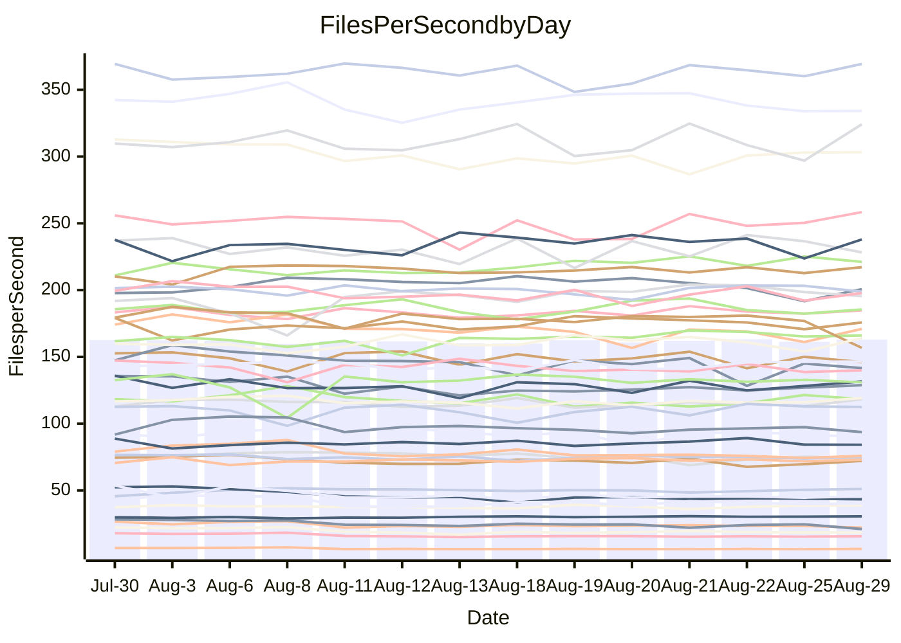

<!---
# This file is auto-generated. Do not edit.
# cspell:disable
--->
# Performance Report

## Daily Performance

## Time to Process Files

| Repository                                      | Elapsed | Min/Avg/Max           |   SD | SD Graph                |
| ----------------------------------------------- | ------: | :-------------------: | ---: | ----------------------- |
| AdaDoom3/AdaDoom3                    |    3.37 | 3.3 /   3.4 /   3.6   | 0.07 | `     ┣━┻●━╋━━┻━┫     ` |
| alexiosc/megistos                    |    7.78 | 7.4 /   7.8 /   8.4   | 0.21 | `    ┣━━┻━━●━━┻━━┫    ` |
| apollographql/apollo-server          |    2.79 | 2.6 /   2.7 /   3.3   | 0.15 | `    ┣━━┻━━╋━●┻━━┫    ` |
| aspnetboilerplate/aspnetboilerplate  |   10.53 | 10.1 /  10.6 /  11.2  | 0.28 | `    ┣━━┻━●╋━━┻━━┫    ` |
| aws-amplify/docs                     |   12.98 | 12.7 /  13.2 /  14.2  | 0.43 | `    ┣━━┻●━╋━━┻━━┫    ` |
| Azure/azure-rest-api-specs           |    9.44 | 9.4 /   9.9 /  11.3   | 0.44 | `    ┣━━●━━╋━━┻━━┫    ` |
| bitjson/typescript-starter           |    1.08 | 0.9 /   1.0 /   1.3   | 0.09 | `     ┣━┻━━╋━●┻━┫     ` |
| caddyserver/caddy                    |    3.85 | 3.6 /   3.8 /   4.1   | 0.14 | `    ┣━━┻━━╋━●┻━━┫    ` |
| canada-ca/open-source-logiciel-libre |    1.13 | 0.9 /   1.1 /   1.2   | 0.07 | `     ┣━┻━━╋●━┻━┫     ` |
| chef/chef                            |    6.17 | 5.8 /   6.2 /   7.7   | 0.40 | `    ┣━━┻━━●━━┻━━┫    ` |
| dart-lang/sdk                        |   65.83 | 63.3 /  67.1 /  70.7  | 2.00 | `  ┣━━━┻━●━╋━━━┻━━━┫  ` |
| django/django                        |   15.45 | 14.8 /  15.6 /  16.4  | 0.35 | `    ┣━━┻━●╋━━┻━━┫    ` |
| eslint/eslint                        |   11.26 | 10.6 /  11.2 /  12.1  | 0.40 | `    ┣━━┻━━╋●━┻━━┫    ` |
| exonum/exonum                        |    3.53 | 3.4 /   3.6 /   3.9   | 0.12 | `    ┣━━┻●━╋━━┻━━┫    ` |
| flutter/samples                      |   17.16 | 16.4 /  17.2 /  18.7  | 0.54 | `   ┣━━━┻━━●━━┻━━━┫   ` |
| gitbucket/gitbucket                  |    3.49 | 3.4 /   3.6 /   3.9   | 0.13 | `    ┣━━●━━╋━━┻━━┫    ` |
| googleapis/google-cloud-cpp          |  140.91 | 136.7 / 143.4 / 155.3 | 4.81 | `  ┣━━━┻━●━╋━━━┻━━━┫  ` |
| graphql/express-graphql              |    1.17 | 1.0 /   1.1 /   1.2   | 0.07 | `     ┣━┻━━╋━━●━┫     ` |
| graphql/graphql-js                   |    2.83 | 2.7 /   2.9 /   3.2   | 0.12 | `    ┣━━┻━●╋━━┻━━┫    ` |
| graphql/graphql-relay-js             |    1.32 | 1.0 /   1.1 /   1.3   | 0.07 | `     ┣━┻━━╋━━┻━┫ ●   ` |
| graphql/graphql-spec                 |    1.02 | 0.9 /   1.0 /   1.1   | 0.06 | `     ┣━┻━━╋●━┻━┫     ` |
| iluwatar/java-design-patterns        |   13.64 | 12.6 /  13.4 /  15.2  | 0.59 | `    ┣━━┻━━╋━●┻━━┫    ` |
| ktaranov/sqlserver-kit               |    6.70 | 6.5 /   6.8 /   7.4   | 0.21 | `    ┣━━┻━●╋━━┻━━┫    ` |
| liriliri/licia                       |    4.30 | 4.0 /   4.2 /   4.6   | 0.13 | `    ┣━━┻━━╋●━┻━━┫    ` |
| MartinThoma/LaTeX-examples           |    7.08 | 6.7 /   7.0 /   7.5   | 0.17 | `    ┣━━┻━━╋●━┻━━┫    ` |
| mdx-js/mdx                           |    1.96 | 1.8 /   2.0 /   2.2   | 0.09 | `     ┣━┻━━●━━┻━┫     ` |
| microsoft/TypeScript-Website         |    5.81 | 5.5 /   5.8 /   7.3   | 0.36 | `    ┣━━┻━━●━━┻━━┫    ` |
| MicrosoftDocs/PowerShell-Docs        |   24.08 | 23.2 /  24.5 /  27.5  | 1.01 | `   ┣━━━┻━●╋━━┻━━━┫   ` |
| neovim/nvim-lspconfig                |    4.29 | 4.1 /   4.3 /   4.7   | 0.15 | `    ┣━━┻━●╋━━┻━━┫    ` |
| pagekit/pagekit                      |    3.69 | 3.5 /   3.6 /   4.1   | 0.12 | `    ┣━━┻━━╋●━┻━━┫    ` |
| php/php-src                          |   27.05 | 25.4 /  26.8 /  29.7  | 1.03 | `   ┣━━━┻━━╋●━┻━━━┫   ` |
| plasticrake/tplink-smarthome-api     |    1.36 | 1.1 /   1.3 /   1.4   | 0.09 | `     ┣━┻━━╋●━┻━┫     ` |
| prettier/prettier                    |    7.05 | 7.0 /   7.4 /   8.1   | 0.23 | `    ┣●━┻━━╋━━┻━━┫    ` |
| pycontribs/jira                      |    1.54 | 1.5 /   1.6 /   1.7   | 0.06 | `     ┣━┻●━╋━━┻━┫     ` |
| RustPython/RustPython                |    5.19 | 5.0 /   5.3 /   5.8   | 0.23 | `    ┣━━┻●━╋━━┻━━┫    ` |
| shoelace-style/shoelace              |    3.10 | 2.7 /   3.0 /   3.7   | 0.20 | `    ┣━━┻━━╋●━┻━━┫    ` |
| slint-ui/slint                       |   14.30 | 11.8 /  12.4 /  14.7  | 0.56 | `    ┣━━┻━━╋━━┻━━┫   ●` |
| SoftwareBrothers/admin-bro           |    2.58 | 2.4 /   2.6 /   3.0   | 0.12 | `    ┣━━┻━━●━━┻━━┫    ` |
| sveltejs/svelte                      |   21.14 | 20.8 /  21.5 /  23.0  | 0.47 | `   ┣━━━┻●━╋━━┻━━━┫   ` |
| TheAlgorithms/Python                 |    5.84 | 5.6 /   6.0 /   6.9   | 0.32 | `    ┣━━┻━●╋━━┻━━┫    ` |
| twbs/bootstrap                       |    1.56 | 1.3 /   1.5 /   1.7   | 0.09 | `     ┣━┻━━╋●━┻━┫     ` |
| typescript-cheatsheets/react         |    1.37 | 1.3 /   1.4 /   1.5   | 0.05 | `     ┣━┻●━╋━━┻━┫     ` |
| typescript-eslint/typescript-eslint  |    4.21 | 4.1 /   4.2 /   4.5   | 0.12 | `    ┣━━┻━●╋━━┻━━┫    ` |
| vitest-dev/vitest                    |    9.61 | 9.0 /   9.5 /  11.1   | 0.46 | `    ┣━━┻━━╋●━┻━━┫    ` |
| w3c/aria-practices                   |    3.46 | 3.2 /   3.5 /   3.8   | 0.12 | `    ┣━━┻━━●━━┻━━┫    ` |
| w3c/specberus                        |    2.11 | 1.9 /   2.1 /   2.6   | 0.14 | `    ┣━━┻━━╋●━┻━━┫    ` |
| webdeveric/webpack-assets-manifest   |    1.25 | 1.0 /   1.2 /   1.3   | 0.08 | `     ┣━┻━━╋━━●━┫     ` |
| webpack/webpack                      |    5.62 | 5.4 /   5.6 /   6.2   | 0.20 | `    ┣━━┻━━●━━┻━━┫    ` |
| wireapp/wire-desktop                 |    1.07 | 0.9 /   1.1 /   1.3   | 0.10 | `     ┣━┻━━●━━┻━┫     ` |
| wireapp/wire-webapp                  |   11.03 | 10.8 /  11.3 /  13.3  | 0.53 | `    ┣━━┻━●╋━━┻━━┫    ` |

Note:
- Elapsed time is in seconds.

## Files per Second over Time

| Repository                                      | Files |    Sec |    Fps |     Rel | Trend Fps              |    N |
| ----------------------------------------------- | ----: | -----: | -----: | ------: | ---------------------- | ---: |
| AdaDoom3/AdaDoom3                    |   103 |   3.37 |  30.59 |   1.82% | `▅▅▇█▇▅▇█▇█▇▇▇▇█▇▇█▇█` |   25 |
| alexiosc/megistos                    |   583 |   7.78 |  74.92 |  -0.10% | `▆▆▆█▇▇▄▇█▅▇▆▇█▇▆█▅▇▇` |   25 |
| apollographql/apollo-server          |   252 |   2.79 |  90.17 |  -3.17% | `███▇████▆▆▇▇▂▇▇▇▇▆▇▆` |   25 |
| aspnetboilerplate/aspnetboilerplate  |  2286 |  10.53 | 217.16 |   1.02% | `▇▇█▅▆▆█▇▄▆▆▆▆▇▆▆▇▆▅▇` |   25 |
| aws-amplify/docs                     |  2871 |  12.98 | 221.13 |   1.94% | `▆▇▅▆▇▆▄▇▅▇▇██▆█▇▇██▇` |   25 |
| Azure/azure-rest-api-specs           |  2438 |   9.44 | 258.39 |   4.11% | `█▇█▇▇▇█▇▃▇█▄▆▅█▇▇▇▇█` |   25 |
| bitjson/typescript-starter           |    20 |   1.08 |  18.45 |  -5.62% | `█▅▄▅▅▄▄▄▂▅▃▅▄▅▅▅▅▅▄▄` |   25 |
| caddyserver/caddy                    |   285 |   3.85 |  74.03 |  -2.64% | `██▇██▇▇▆▇▇▄█▇▇▄▅▆█▅▆` |   25 |
| canada-ca/open-source-logiciel-libre |     7 |   1.13 |   6.20 |  -2.90% | `█▄▃▃▄▄▄▄▃▃▃▄▃▃▃▄▄▃▃▄` |   25 |
| chef/chef                            |  1207 |   6.17 | 195.50 |   0.53% | `▃▇▆▇▇█▇▇▇▆▇█▇▇█▇█▇█▇` |   25 |
| dart-lang/sdk                        | 10798 |  65.83 | 164.02 |   2.23% | `▄▆▄▅█▇▇▆▅▆█▇▆▇▇▅▇▅▄▇` |   25 |
| django/django                        |  2855 |  15.45 | 184.77 |   0.92% | `▅▆▆█▆▆▆▆▄▆▅█▅▆▇▆▆▆▆▆` |   25 |
| eslint/eslint                        |  2090 |  11.26 | 185.55 |  -0.52% | `▆▇▆▇▆██▆▅▅▄██▇▇▆▆▇▄▆` |   25 |
| exonum/exonum                        |   421 |   3.53 | 119.18 |   2.30% | `██▄▇▆▆█▆▇▅▇▆▅▇▇▆▆▆▇█` |   25 |
| flutter/samples                      |  2400 |  17.16 | 139.89 |  -1.84% | `▄▇█▆▆▇▆██▇▆▆▅▇▆▆█▅▆▆` |   25 |
| gitbucket/gitbucket                  |   413 |   3.49 | 118.41 |   3.15% | `▇█▇▆▅▅█▇▅█▅▆█▅▇█▆▄██` |   25 |
| googleapis/google-cloud-cpp          | 20651 | 140.91 | 146.55 |   1.90% | `▇▇▅█▆▆▄▆▇▅█▇▄█▆▆█▇▇▇` |   25 |
| graphql/express-graphql              |    26 |   1.17 |  22.23 |  -7.78% | `█▃▃▄▄▃▅▄▃▅▄▅▄▅▅▅▄▅▄▃` |   25 |
| graphql/graphql-js                   |   364 |   2.83 | 128.83 |   1.15% | `█▅▇▄▆▆▇▆▃▆▆▅▆▆▆▆▆▆▇▇` |   25 |
| graphql/graphql-relay-js             |    28 |   1.32 |  21.16 | -15.89% | `█▅▅▄▄▅▅▄▄▆▅▅▅▆▃▄▅▆▅▂` |   25 |
| graphql/graphql-spec                 |    16 |   1.02 |  15.75 |  -3.12% | `█▅▅▅▃▅▅▃▄▄▄▄▄▅▄▄▄▄▄▄` |   25 |
| iluwatar/java-design-patterns        |  1992 |  13.64 | 146.03 |  -2.22% | `▅█▆▇▇█▇▆▅▇▇▅▆▇▇▇▃▇▇▆` |   25 |
| ktaranov/sqlserver-kit               |   489 |   6.70 |  72.99 |   1.12% | `▆▆▇▆██▆▆█▆▇███▇▇▇▅█▇` |   25 |
| liriliri/licia                       |  1437 |   4.30 | 334.12 |  -1.64% | `█▆▆▆▇▄▅▆▆▇█▇▇█▇▆▆▆▅▆` |   25 |
| MartinThoma/LaTeX-examples           |  1409 |   7.08 | 198.91 |  -0.72% | `▆▇█▆▇▇▅▆▇▆▆▅▆▄▇▆██▆▆` |   25 |
| mdx-js/mdx                           |   141 |   1.96 |  72.12 |   0.33% | `█▇▇▆▇▄█▅▇█▇█▅██▅▆▆▇▇` |   25 |
| microsoft/TypeScript-Website         |   761 |   5.81 | 130.95 |  -0.24% | `▂████▆█▆███▇▆█▇▇▇▇▇▇` |   25 |
| MicrosoftDocs/PowerShell-Docs        |  2708 |  24.08 | 112.47 |   1.60% | `▃▇▇▇▇▇█▆▆▄▅▇▆█▅█▇█▇▇` |   25 |
| neovim/nvim-lspconfig                |   754 |   4.29 | 175.74 |   0.94% | `▇▅▇▆█▆▇▆▆▆██▇█▇█▆▇▅▇` |   25 |
| pagekit/pagekit                      |   741 |   3.69 | 200.76 |  -1.50% | `███▇▇▇▇▆██▆█▇█▇▇▆▆▃▆` |   25 |
| php/php-src                          |  2279 |  27.05 |  84.25 |  -1.40% | `▇▇▆▅▇▆█▅▇▇▄▇▇▆▇██▆▆▆` |   25 |
| plasticrake/tplink-smarthome-api     |    62 |   1.36 |  45.50 |  -3.11% | `█▅▅▄▄▅▅▆▆▃▆▇▄▅▅▅▅▅▄▅` |   25 |
| prettier/prettier                    |  2286 |   7.05 | 324.16 |   5.15% | `█▇▆▅▅▆▆▆██▄▇▆▆█▇▆▅▅█` |   25 |
| pycontribs/jira                      |    79 |   1.54 |  51.15 |   2.57% | `▇▆▇▇▇▆█▅█▆▇▅▆▆▅▇▅▆▇▇` |   25 |
| RustPython/RustPython                |   683 |   5.19 | 131.60 |   2.73% | `▆▅█▆▇▆▇▅▄█▇█▅▆█▄▇▆██` |   25 |
| shoelace-style/shoelace              |   439 |   3.10 | 141.62 |  -3.18% | `██▇██▇▇▇▇▆▇█▇▇█▆▂▆█▇` |   25 |
| slint-ui/slint                       |  2241 |  14.30 | 156.76 | -12.60% | `█▇▃█▇██▇▇▇▆██▇▇█▇▆▇▄` |   25 |
| SoftwareBrothers/admin-bro           |   441 |   2.58 | 170.94 |   0.41% | `█▇▆▇▇▆▇▆▆▇▆▆▃▆▆▇▆▅▅▇` |   25 |
| sveltejs/svelte                      |  7809 |  21.14 | 369.32 |   1.92% | `▇████▇█▆▇█▇▄▆▇██▇▇▆█` |   25 |
| TheAlgorithms/Python                 |  1390 |   5.84 | 237.91 |   1.85% | `▇▇█▃▇▆▃█▇▇▆▇▇█▇▇▇▇▃▇` |   25 |
| twbs/bootstrap                       |   118 |   1.56 |  75.85 |  -3.31% | `█▅▅▅▆▄▄▅▅▆▅▄▄▅▅▆▃▆▃▅` |   25 |
| typescript-cheatsheets/react         |    53 |   1.37 |  38.79 |   2.60% | `▇▇█▅▇▇▅▅▆▅██▆▇▅█▅█▇█` |   25 |
| typescript-eslint/typescript-eslint  |  1278 |   4.21 | 303.29 |   0.69% | `█▅▇▇▇▇▇▄▇▇▇▅▇▇▅▇▇▇▇▇` |   25 |
| vitest-dev/vitest                    |  2193 |   9.61 | 228.23 |  -0.93% | `▇▆▆▇▆▇▇▆▅█▃▇▇█▆███▇▆` |   25 |
| w3c/aria-practices                   |   409 |   3.46 | 118.37 |   0.24% | `█▆▆▆▅▅▆▅▅▇▃▅▄▆▄▅▄▆▇▆` |   25 |
| w3c/specberus                        |   198 |   2.11 |  93.72 |  -3.73% | `█▇▅▅▆▇▇▇▇▆▅▇▆▅▆▆▆▆▇▆` |   25 |
| webdeveric/webpack-assets-manifest   |    54 |   1.25 |  43.35 |  -6.66% | `█▆▆▆▆▅▅▆▆▃▆▅▆▆▅▅▅▅▅▅` |   25 |
| webpack/webpack                      |  1111 |   5.62 | 197.82 |   0.29% | `█▇▅▇▇▆▆█▆▆█▇▇▄▇██▇▅▇` |   25 |
| wireapp/wire-desktop                 |    43 |   1.07 |  40.28 |  -1.69% | `█▃▅▆▅▆▂▅▄▆▆▆▆▄▆▆▆▆▅▆` |   25 |
| wireapp/wire-webapp                  |  1831 |  11.03 | 166.00 |   2.18% | `▆█▆▇▇▅▃▇█▇█▇▇▇███▇▇▇` |   25 |

## Data Throughput

| Repository                                      | Files |    Sec |     Kps |     Rel | Trend Kps              |    N |
| ----------------------------------------------- | ----: | -----: | ------: | ------: | ---------------------- | ---: |
| AdaDoom3/AdaDoom3                    |   103 |   3.37 |  650.04 |   1.82% | `▅▅▇█▇▅▇█▇█▇▇▇▇█▇▇█▇█` |   25 |
| alexiosc/megistos                    |   583 |   7.78 |  588.71 |  -0.10% | `▆▆▆█▇▇▄▇█▅▇▆▇█▇▆█▅▇▇` |   25 |
| apollographql/apollo-server          |   252 |   2.79 |  725.32 |  -3.17% | `███▇████▆▆▇▇▂▇▇▇▇▆▇▆` |   25 |
| aspnetboilerplate/aspnetboilerplate  |  2286 |  10.53 |  528.36 |   1.04% | `▇▇█▅▆▆█▇▄▆▆▆▆▇▆▆▇▇▅▇` |   25 |
| aws-amplify/docs                     |  2871 |  12.98 |  772.15 |   1.95% | `▆▇▅▆▇▆▄▇▅▇▇██▆█▇▇██▇` |   25 |
| Azure/azure-rest-api-specs           |  2438 |   9.44 |  684.86 |   3.77% | `█▇█▇▇▇█▇▃▇█▄▆▅█▇▇▇▇█` |   25 |
| bitjson/typescript-starter           |    20 |   1.08 |   73.81 |  -5.62% | `█▅▄▅▅▄▄▄▂▅▃▅▄▅▅▅▅▅▄▄` |   25 |
| caddyserver/caddy                    |   285 |   3.85 |  631.99 |  -2.42% | `██▇██▇▇▆▇▇▄█▇▇▄▅▆█▅▆` |   25 |
| canada-ca/open-source-logiciel-libre |     7 |   1.13 |   51.38 |  -2.90% | `█▄▃▃▄▄▄▄▃▃▃▄▃▃▃▄▄▃▃▄` |   25 |
| chef/chef                            |  1207 |   6.17 |  903.47 |   0.61% | `▃▇▆▇▇█▇▇▇▆▇█▇▇█▇█▇█▇` |   25 |
| dart-lang/sdk                        | 10798 |  65.83 | 1110.16 |   2.31% | `▄▆▄▅█▇▇▆▅▅█▇▆▆▇▅▇▅▄▇` |   25 |
| django/django                        |  2855 |  15.45 | 1158.43 |   1.04% | `▅▆▆█▆▆▆▆▄▆▅█▆▆▇▆▆▆▆▇` |   25 |
| eslint/eslint                        |  2090 |  11.26 | 1348.21 |  -0.50% | `▆▇▆▇▆██▆▅▅▄██▇▇▆▆▇▄▆` |   25 |
| exonum/exonum                        |   421 |   3.53 | 1140.00 |   2.30% | `██▄▇▆▆█▆▇▅▇▆▅▇▇▆▆▆▇█` |   25 |
| flutter/samples                      |  2400 |  17.16 | 1248.37 |  -0.63% | `▄▇█▆▆▇▆██▇▆▆▆▇▆▇█▆▆▆` |   25 |
| gitbucket/gitbucket                  |   413 |   3.49 |  538.13 |   3.19% | `▇█▇▆▅▅█▇▅█▅▆█▅▇█▆▄██` |   25 |
| googleapis/google-cloud-cpp          | 20651 | 140.91 | 1184.86 |   2.16% | `▇▇▅█▆▆▄▆▇▅█▇▄█▆▆█▇▇▇` |   25 |
| graphql/express-graphql              |    26 |   1.17 |  101.76 |  -7.78% | `█▃▃▄▄▃▅▄▃▅▄▅▄▅▅▅▄▅▄▃` |   25 |
| graphql/graphql-js                   |   364 |   2.83 |  740.39 |   1.15% | `█▅▇▄▆▆▇▆▃▆▆▅▆▆▆▆▆▆▇▇` |   25 |
| graphql/graphql-relay-js             |    28 |   1.32 |   83.12 | -15.89% | `█▅▅▄▄▅▅▄▄▆▅▅▅▆▃▄▅▆▅▂` |   25 |
| graphql/graphql-spec                 |    16 |   1.02 |  570.89 |  -3.12% | `█▅▅▅▃▅▅▃▄▄▄▄▄▅▄▄▄▄▄▄` |   25 |
| iluwatar/java-design-patterns        |  1992 |  13.64 |  451.35 |  -2.22% | `▅█▆▇▇█▇▆▅▇▇▅▆▇▇▇▃▇▇▆` |   25 |
| ktaranov/sqlserver-kit               |   489 |   6.70 | 1104.83 |   1.12% | `▆▆▇▆██▆▆█▆▇███▇▇▇▅█▇` |   25 |
| liriliri/licia                       |  1437 |   4.30 |  398.06 |  -1.64% | `█▆▆▆▇▄▅▆▆▇█▇▇█▇▆▆▆▅▆` |   25 |
| MartinThoma/LaTeX-examples           |  1409 |   7.08 |  410.82 |  -0.72% | `▆▇█▆▇▇▅▆▇▆▆▅▆▄▇▆██▆▆` |   25 |
| mdx-js/mdx                           |   141 |   1.96 |  335.53 |   0.38% | `█▇▇▆▇▄█▅▇█▇█▅██▅▆▆▇▇` |   25 |
| microsoft/TypeScript-Website         |   761 |   5.81 |  905.63 |  -0.19% | `▂████▆█▆███▇▆█▇▇▇▇▇▇` |   25 |
| MicrosoftDocs/PowerShell-Docs        |  2708 |  24.08 | 1156.52 |   1.64% | `▃▇▇▇▇▇█▆▆▄▅▇▆█▅█▇█▇▇` |   25 |
| neovim/nvim-lspconfig                |   754 |   4.29 |  289.02 |   2.53% | `▆▅▇▆█▆▇▆▆▆██▇█▇█▆▇▆▇` |   25 |
| pagekit/pagekit                      |   741 |   3.69 |  418.59 |  -1.50% | `███▇▇▇▇▆██▆█▇█▇▇▆▆▃▆` |   25 |
| php/php-src                          |  2279 |  27.05 | 1467.66 |  -1.17% | `▆▆▆▅▇▆█▆▇▇▄▇▇▆▇██▆▆▆` |   25 |
| plasticrake/tplink-smarthome-api     |    62 |   1.36 |  245.84 |  -3.11% | `█▅▅▄▄▅▅▆▆▃▆▇▄▅▅▅▅▅▄▅` |   25 |
| prettier/prettier                    |  2286 |   7.05 |  459.87 |   5.12% | `█▇▆▅▆▆▆▆██▄▇▆▆█▇▆▅▅█` |   25 |
| pycontribs/jira                      |    79 |   1.54 |  362.55 |   2.53% | `▇▆▇▇▇▆█▄█▆▇▅▆▆▅▇▅▆▇▇` |   25 |
| RustPython/RustPython                |   683 |   5.19 | 1033.69 |   2.84% | `▆▅█▆▇▆▇▅▄█▇█▅▆█▄▇▆██` |   25 |
| shoelace-style/shoelace              |   439 |   3.10 |  684.22 |  -3.18% | `██▇██▇▇▇▇▆▇█▇▇█▆▂▆█▇` |   25 |
| slint-ui/slint                       |  2241 |  14.30 | 1023.19 | -12.43% | `█▇▃█▇██▇▇▇▅█▇▇▇█▇▆▇▄` |   25 |
| SoftwareBrothers/admin-bro           |   441 |   2.58 |  376.77 |   0.41% | `█▇▆▇▇▆▇▆▆▇▆▆▃▆▆▇▆▅▅▇` |   25 |
| sveltejs/svelte                      |  7809 |  21.14 |  247.26 |   1.91% | `▇████▇█▆▇█▆▄▆▇██▇▇▆█` |   25 |
| TheAlgorithms/Python                 |  1390 |   5.84 |  604.03 |   1.87% | `▇▇█▃▇▆▃█▇▇▆▇▇█▇▇▇▇▃▇` |   25 |
| twbs/bootstrap                       |   118 |   1.56 |  622.87 |  -3.31% | `█▅▅▅▆▄▄▅▅▆▅▄▄▅▅▆▃▆▃▅` |   25 |
| typescript-cheatsheets/react         |    53 |   1.37 |  286.86 |   3.82% | `▇▆▇▅▇▇▅▅▆▅██▆▇▅█▅█▇█` |   25 |
| typescript-eslint/typescript-eslint  |  1278 |   4.21 | 1548.23 |   0.79% | `█▅▇▇▇▇▇▄▇▇▇▅▇▇▅▇▇▇▇▇` |   25 |
| vitest-dev/vitest                    |  2193 |   9.61 |  512.76 |  -0.65% | `▇▆▆▇▆▇▇▆▅█▃▇▇█▆███▇▆` |   25 |
| w3c/aria-practices                   |   409 |   3.46 | 1101.47 |   0.25% | `█▆▆▆▅▅▆▅▅▇▃▅▄▆▄▅▄▆▇▆` |   25 |
| w3c/specberus                        |   198 |   2.11 |  294.40 |  -3.21% | `█▇▅▅▆▇▇▇▇▇▅▇▇▅▆▇▆▇▇▆` |   25 |
| webdeveric/webpack-assets-manifest   |    54 |   1.25 |  101.96 |  -6.56% | `█▆▆▆▆▅▅▆▆▃▆▅▆▆▅▅▅▅▅▅` |   25 |
| webpack/webpack                      |  1111 |   5.62 |  898.63 |   0.51% | `█▇▅▇▇▆▆▇▆▆█▇▇▄▇██▇▅▇` |   25 |
| wireapp/wire-desktop                 |    43 |   1.07 |  177.96 |  -1.69% | `█▃▅▆▅▆▂▅▄▆▆▆▆▄▆▆▆▆▅▆` |   25 |
| wireapp/wire-webapp                  |  1831 |  11.03 |  593.00 |   2.25% | `▆█▆▇▇▅▃▇█▇█▇▇▇███▇▇▇` |   25 |

