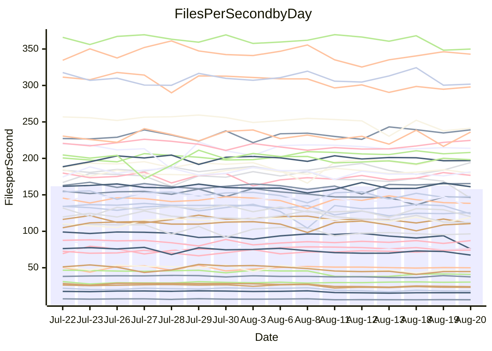

<!---
# This file is auto-generated. Do not edit.
# cspell:disable
--->
# Performance Report

## Daily Performance

## Time to Process Files

| Repository                                      | Elapsed | Min/Avg/Max           |   SD | SD Graph                |
| ----------------------------------------------- | ------: | :-------------------: | ---: | ----------------------- |
| AdaDoom3/AdaDoom3                    |    3.39 | 3.3 /   3.5 /   3.7   | 0.09 | `    ┣━━┻●━╋━━┻━━┫    ` |
| alexiosc/megistos                    |    7.71 | 7.4 /   7.8 /   8.5   | 0.27 | `    ┣━━┻━●╋━━┻━━┫    ` |
| apollographql/apollo-server          |    3.33 | 2.5 /   2.7 /   2.8   | 0.09 | `       ┣━┻╋┻━┫      ●` |
| aspnetboilerplate/aspnetboilerplate  |   10.69 | 10.1 /  10.7 /  12.2  | 0.42 | `    ┣━━┻━━●━━┻━━┫    ` |
| aws-amplify/docs                     |   12.78 | 12.7 /  13.3 /  14.2  | 0.41 | `    ┣━●┻━━╋━━┻━━┫    ` |
| Azure/azure-rest-api-specs           |   10.13 | 9.4 /   9.7 /  11.3   | 0.45 | `    ┣━━┻━━╋━━●━━┫    ` |
| bitjson/typescript-starter           |    1.10 | 0.9 /   1.0 /   1.3   | 0.10 | `     ┣━┻━━╋━━●━┫     ` |
| caddyserver/caddy                    |    3.74 | 3.6 /   3.8 /   4.1   | 0.16 | `    ┣━━┻━━●━━┻━━┫    ` |
| canada-ca/open-source-logiciel-libre |    1.15 | 0.9 /   1.1 /   1.2   | 0.08 | `     ┣━┻━━╋━━●━┫     ` |
| chef/chef                            |    6.09 | 5.9 /   6.3 /   7.7   | 0.39 | `    ┣━━┻●━╋━━┻━━┫    ` |
| dart-lang/sdk                        |   66.97 | 63.3 /  66.7 /  70.4  | 1.87 | `  ┣━━━┻━━━╋●━━┻━━━┫  ` |
| django/django                        |   15.85 | 14.8 /  15.6 /  16.4  | 0.39 | `    ┣━━┻━━╋━●┻━━┫    ` |
| eslint/eslint                        |   10.76 | 10.6 /  11.2 /  12.0  | 0.35 | `    ┣━●┻━━╋━━┻━━┫    ` |
| exonum/exonum                        |    3.80 | 3.4 /   3.6 /   4.0   | 0.15 | `    ┣━━┻━━╋━━┻●━┫    ` |
| flutter/samples                      |   17.63 | 16.4 /  17.1 /  18.7  | 0.54 | `   ┣━━━┻━━╋━━●━━━┫   ` |
| gitbucket/gitbucket                  |    3.47 | 3.5 /   3.6 /   3.9   | 0.14 | `    ┣━━●━━╋━━┻━━┫    ` |
| googleapis/google-cloud-cpp          |  155.32 | 135.4 / 142.3 / 153.9 | 4.39 | `   ┣━━┻━━━╋━━━┻━━┫  ●` |
| graphql/express-graphql              |    1.12 | 1.0 /   1.1 /   1.2   | 0.08 | `     ┣━┻━━╋━●┻━┫     ` |
| graphql/graphql-js                   |    2.90 | 2.6 /   2.8 /   3.2   | 0.14 | `    ┣━━┻━━╋━●┻━━┫    ` |
| graphql/graphql-relay-js             |    1.17 | 0.9 /   1.1 /   1.2   | 0.08 | `     ┣━┻━━╋━━●━┫     ` |
| graphql/graphql-spec                 |    1.02 | 0.9 /   1.0 /   1.1   | 0.07 | `     ┣━┻━━╋━●┻━┫     ` |
| iluwatar/java-design-patterns        |   13.51 | 12.6 /  13.3 /  14.6  | 0.54 | `    ┣━━┻━━╋●━┻━━┫    ` |
| ktaranov/sqlserver-kit               |    6.58 | 6.5 /   6.8 /   7.4   | 0.25 | `    ┣━━●━━╋━━┻━━┫    ` |
| liriliri/licia                       |    4.19 | 4.0 /   4.2 /   4.6   | 0.14 | `    ┣━━┻━●╋━━┻━━┫    ` |
| MartinThoma/LaTeX-examples           |    7.15 | 6.8 /   7.1 /   7.5   | 0.16 | `    ┣━━┻━━╋━●┻━━┫    ` |
| mdx-js/mdx                           |    2.09 | 1.8 /   1.9 /   2.2   | 0.09 | `     ┣━┻━━╋━━┻━●     ` |
| microsoft/TypeScript-Website         |    6.15 | 5.5 /   5.8 /   7.3   | 0.35 | `    ┣━━┻━━╋━━●━━┫    ` |
| MicrosoftDocs/PowerShell-Docs        |   24.49 | 23.3 /  24.6 /  27.5  | 0.96 | `   ┣━━━┻━━●━━┻━━━┫   ` |
| neovim/nvim-lspconfig                |    4.25 | 4.1 /   4.3 /   4.7   | 0.15 | `    ┣━━┻━●╋━━┻━━┫    ` |
| pagekit/pagekit                      |    3.56 | 3.5 /   3.6 /   4.0   | 0.11 | `    ┣━━┻●━╋━━┻━━┫    ` |
| php/php-src                          |   26.14 | 25.6 /  26.8 /  29.7  | 1.08 | `   ┣━━━┻●━╋━━┻━━━┫   ` |
| plasticrake/tplink-smarthome-api     |    1.42 | 1.1 /   1.3 /   1.4   | 0.10 | `     ┣━┻━━╋━━┻●┫     ` |
| prettier/prettier                    |    7.57 | 7.0 /   7.4 /   8.1   | 0.22 | `    ┣━━┻━━╋━●┻━━┫    ` |
| pycontribs/jira                      |    1.58 | 1.5 /   1.6 /   1.8   | 0.08 | `     ┣━┻━━●━━┻━┫     ` |
| RustPython/RustPython                |    5.69 | 5.0 /   5.3 /   5.8   | 0.21 | `    ┣━━┻━━╋━━┻━●┫    ` |
| shoelace-style/shoelace              |    2.99 | 2.7 /   2.9 /   3.3   | 0.13 | `    ┣━━┻━━╋●━┻━━┫    ` |
| slint-ui/slint                       |   12.29 | 11.7 /  12.4 /  14.7  | 0.58 | `    ┣━━┻━━●━━┻━━┫    ` |
| SoftwareBrothers/admin-bro           |    3.03 | 2.4 /   2.6 /   2.7   | 0.08 | `       ┣┻━╋━┻┫      ●` |
| sveltejs/svelte                      |   22.29 | 20.8 /  21.4 /  23.0  | 0.46 | `   ┣━━━┻━━╋━━┻━━●┫   ` |
| TheAlgorithms/Python                 |    5.81 | 5.6 /   6.0 /   6.9   | 0.29 | `    ┣━━┻●━╋━━┻━━┫    ` |
| twbs/bootstrap                       |    1.58 | 1.3 /   1.5 /   1.6   | 0.08 | `     ┣━┻━━╋━━┻●┫     ` |
| typescript-cheatsheets/react         |    1.41 | 1.3 /   1.4 /   1.5   | 0.05 | `     ┣━┻━━╋●━┻━┫     ` |
| typescript-eslint/typescript-eslint  |    4.29 | 4.0 /   4.2 /   4.5   | 0.14 | `    ┣━━┻━━╋━●┻━━┫    ` |
| vitest-dev/vitest                    |    9.29 | 8.9 /   9.6 /  11.1   | 0.48 | `    ┣━━┻●━╋━━┻━━┫    ` |
| w3c/aria-practices                   |    3.65 | 3.2 /   3.4 /   3.8   | 0.12 | `    ┣━━┻━━╋━━┻━●┫    ` |
| w3c/specberus                        |    2.05 | 1.9 /   2.0 /   2.6   | 0.17 | `    ┣━━┻━━●━━┻━━┫    ` |
| webdeveric/webpack-assets-manifest   |    1.21 | 1.0 /   1.1 /   1.3   | 0.09 | `     ┣━┻━━╋━●┻━┫     ` |
| webpack/webpack                      |    5.60 | 5.3 /   5.6 /   6.5   | 0.24 | `    ┣━━┻━━●━━┻━━┫    ` |
| wireapp/wire-desktop                 |    1.05 | 0.9 /   1.0 /   1.3   | 0.11 | `     ┣━┻━━╋●━┻━┫     ` |
| wireapp/wire-webapp                  |   11.05 | 10.8 /  11.3 /  13.3  | 0.51 | `    ┣━━┻●━╋━━┻━━┫    ` |

Note:
- Elapsed time is in seconds.

## Files per Second over Time

| Repository                                      | Files |    Sec |    Fps |     Rel | Trend Fps              |    N |
| ----------------------------------------------- | ----: | -----: | -----: | ------: | ---------------------- | ---: |
| AdaDoom3/AdaDoom3                    |   103 |   3.39 |  30.35 |   1.83% | `█▇▇▆▇▇▇▆▅▇█▇▅▇█▇█▇▇▇` |   25 |
| alexiosc/megistos                    |   583 |   7.71 |  75.58 |   1.08% | `▄▆█▇█▇▇▆▆▅█▆▇▄▆▇▅▇▆▇` |   25 |
| apollographql/apollo-server          |   252 |   3.33 |  75.78 | -20.34% | `▅▅▆▄▇▆▆▇█▇▆████▄▅▇▆ ` |   25 |
| aspnetboilerplate/aspnetboilerplate  |  2286 |  10.69 | 213.79 |  -0.08% | `█▆▆▅█▇▆▇▇█▆▇▆█▇▅▆▇▇▇` |   25 |
| aws-amplify/docs                     |  2871 |  12.78 | 224.69 |   3.64% | `▇▄▇▇█▇▄▆▇▅▇▇▆▄▇▅▇███` |   25 |
| Azure/azure-rest-api-specs           |  2443 |  10.13 | 241.24 |  -3.71% | `█▇█▇▇▇▇█▇█▇▇▇█▆▃▇▇▄▆` |   25 |
| bitjson/typescript-starter           |    20 |   1.10 |  18.10 | -10.01% | `▆▇█▇▇▇▇█▅▄▅▅▃▄▄▂▅▃▅▄` |   25 |
| caddyserver/caddy                    |   285 |   3.74 |  76.25 |   0.22% | `▇▅▇▇██▆██▇██▇▇▆▇▇▄█▇` |   25 |
| canada-ca/open-source-logiciel-libre |     7 |   1.15 |   6.11 |  -8.82% | `█▆▆▆▆▇▆█▄▃▂▄▄▄▃▃▃▃▄▃` |   25 |
| chef/chef                            |  1207 |   6.09 | 198.15 |   3.23% | `▇▇▆▇▂▇▇▃▇▆▇▇█▇▇▇▆▇█▇` |   25 |
| dart-lang/sdk                        | 10790 |  66.97 | 161.11 |  -0.07% | `▇▆▅▆▆▄▆▄▆▄▅█▇▇▆▅▆█▇▆` |   25 |
| django/django                        |  2852 |  15.85 | 179.90 |  -1.27% | `▅▆▆▇▆▇▅▅▆▆█▆▆▆▆▄▆▅█▅` |   25 |
| eslint/eslint                        |  2090 |  10.76 | 194.25 |   4.72% | `▅▆▆▇▅▇▅▆▇▆▇▆██▆▅▅▄██` |   25 |
| exonum/exonum                        |   421 |   3.80 | 110.70 |  -5.11% | `█▄█▆▇▆█▇▇▄▆▅▆▇▅▆▅▇▆▅` |   25 |
| flutter/samples                      |  2438 |  17.63 | 138.31 |  -3.43% | `▇▇█▇▅▇█▄▇█▆▆▇▆██▇▆▆▅` |   25 |
| gitbucket/gitbucket                  |   413 |   3.47 | 118.89 |   4.45% | `▇▅▇████▇█▇▆▅▅█▇▆█▅▆█` |   25 |
| googleapis/google-cloud-cpp          | 20603 | 155.32 | 132.65 |  -8.43% | `█▅▇▆▇▆▇▇█▅█▆▇▄▆▇▅█▇▄` |   25 |
| graphql/express-graphql              |    26 |   1.12 |  23.21 |  -6.66% | `▇▇█▆▇███▃▃▄▄▃▅▄▃▅▄▄▄` |   25 |
| graphql/graphql-js                   |   364 |   2.90 | 125.55 |  -3.52% | `████▆█▇█▄▆▄▆▆▆▆▃▅▅▅▆` |   25 |
| graphql/graphql-relay-js             |    28 |   1.17 |  24.01 |  -8.63% | `████▆▇▇▇▄▄▃▃▄▄▃▃▅▄▄▄` |   25 |
| graphql/graphql-spec                 |    16 |   1.02 |  15.75 |  -6.72% | `██▇▇▆▇▇█▅▅▅▃▅▅▃▄▄▄▄▄` |   25 |
| iluwatar/java-design-patterns        |  1992 |  13.51 | 147.49 |  -1.71% | `▆▇▇▇▇▇▄▄█▆▇▇█▇▅▅▇▆▅▆` |   25 |
| ktaranov/sqlserver-kit               |   489 |   6.58 |  74.26 |   3.88% | `▄▅▇█▆▆▄▆▆▇▆██▆▆█▆▇██` |   25 |
| liriliri/licia                       |  1437 |   4.19 | 342.89 |   0.53% | `▇█▅▇▆███▆▆▆▆▄▅▆▆▆█▆▇` |   25 |
| MartinThoma/LaTeX-examples           |  1409 |   7.15 | 196.94 |  -1.46% | `▅▇▇▇▇▇▇▆██▇█▇▅▇▇▇▇▅▆` |   25 |
| mdx-js/mdx                           |   141 |   2.09 |  67.39 |  -8.24% | `█▇█▇███▇▆▆▅▆▃▆▅▆▆▆▆▄` |   25 |
| microsoft/TypeScript-Website         |   761 |   6.15 | 123.82 |  -5.61% | `▆▇▇█▇▆▆▂████▆█▆███▇▆` |   25 |
| MicrosoftDocs/PowerShell-Docs        |  2708 |  24.49 | 110.56 |   0.32% | `▆▆█▇▆▆▇▃▇▇▇▇▇█▆▆▄▅▇▇` |   25 |
| neovim/nvim-lspconfig                |   752 |   4.25 | 176.78 |   1.54% | `▇██▄▇▄▇▇▅▇▆█▆▇▆▆▆██▇` |   25 |
| pagekit/pagekit                      |   741 |   3.56 | 208.11 |   2.28% | `▆▆▅▆▇▅▇███▇▇▇▇▆██▆█▇` |   25 |
| php/php-src                          |  2281 |  26.14 |  87.26 |   2.25% | `▄▇█▅▃▇█▇▇▆▅▇▆█▆▇▇▄▇▇` |   25 |
| plasticrake/tplink-smarthome-api     |    62 |   1.42 |  43.68 | -10.30% | `▆██▄██▇▆▄▄▃▃▄▄▄▄▃▄▅▃` |   25 |
| prettier/prettier                    |  2286 |   7.57 | 301.84 |  -2.30% | `▇▇▆▆▆▇▇█▇▆▅▆▆▆▆██▄▇▆` |   25 |
| pycontribs/jira                      |    79 |   1.58 |  49.97 |   0.03% | `█▄▄▅▅█▆▇▆▇▇▇▆▇▅█▆▇▅▆` |   25 |
| RustPython/RustPython                |   683 |   5.69 | 120.10 |  -7.04% | `▇██▆█▆█▆▄▇▆▆▆▆▄▃▇▆▇▄` |   25 |
| shoelace-style/shoelace              |   439 |   2.99 | 146.80 |  -2.13% | `██▃██▆▆▆▆▅▆▆▅▅▅▅▃▆▆▅` |   25 |
| slint-ui/slint                       |  2230 |  12.29 | 181.45 |   0.88% | `▇█▆███▇▇▇▃█▇▇█▆▇▇▅█▇` |   25 |
| SoftwareBrothers/admin-bro           |   441 |   3.03 | 145.35 | -16.03% | `▇▇▆█▆▇██▆▅▆▆▅▆▅▆▆▅▆ ` |   25 |
| sveltejs/svelte                      |  7799 |  22.29 | 349.95 |  -3.65% | `▇▇█▆▆▇▆▇████▆█▆▇█▆▄▅` |   25 |
| TheAlgorithms/Python                 |  1390 |   5.81 | 239.12 |   3.01% | `▅█▆▅▆▆▇▇▇█▃▇▆▃█▇▇▆▇▇` |   25 |
| twbs/bootstrap                       |   118 |   1.58 |  74.63 |  -7.88% | `▇▆▄▇█▅██▄▅▅▅▃▃▄▄▆▄▄▃` |   25 |
| typescript-cheatsheets/react         |    53 |   1.41 |  37.56 |  -1.43% | `█▄█▇▅█▇▇▆▇▅▇▇▅▅▆▅██▆` |   25 |
| typescript-eslint/typescript-eslint  |  1279 |   4.29 | 297.97 |  -2.07% | `█████▇▇▇▅▆▇▇▆▆▄▆▆▇▅▆` |   25 |
| vitest-dev/vitest                    |  2193 |   9.29 | 236.05 |   3.48% | `▆███▅▇█▇▆▇▇▆██▆▅█▃██` |   25 |
| w3c/aria-practices                   |   409 |   3.65 | 111.91 |  -6.29% | `▆▄▇▅▆▆▇█▆▆▆▅▅▆▅▅▇▃▅▄` |   25 |
| w3c/specberus                        |   198 |   2.05 |  96.46 |  -4.02% | `██▂▇██▇█▆▅▅▆▆▆▆▆▆▅▆▆` |   25 |
| webdeveric/webpack-assets-manifest   |    54 |   1.21 |  44.80 |  -6.92% | `█▇▇▇▇▆▆▆▄▄▄▄▄▄▄▄▂▄▃▄` |   25 |
| webpack/webpack                      |  1111 |   5.60 | 198.25 |   0.02% | `█▅██▇▆▇▇▆▅▆▆▆▆▇▆▆▇▇▆` |   25 |
| wireapp/wire-desktop                 |    43 |   1.05 |  40.83 |  -4.18% | `█▄██▇█▇▇▃▄▆▅▅▂▅▄▅▆▆▅` |   25 |
| wireapp/wire-webapp                  |  1828 |  11.05 | 165.45 |   2.62% | `▆▇▇▇█▇▆▆█▆▇▇▅▃▇█▇█▇█` |   25 |

## Data Throughput

| Repository                                      | Files |    Sec |     Kps |     Rel | Trend Kps              |    N |
| ----------------------------------------------- | ----: | -----: | ------: | ------: | ---------------------- | ---: |
| AdaDoom3/AdaDoom3                    |   103 |   3.39 |  645.03 |   1.83% | `█▇▇▆▇▇▇▆▅▇█▇▅▇█▇█▇▇▇` |   25 |
| alexiosc/megistos                    |   583 |   7.71 |  593.87 |   1.08% | `▄▆█▇█▇▇▆▆▅█▆▇▄▆▇▅▇▆▇` |   25 |
| apollographql/apollo-server          |   252 |   3.33 |  609.57 | -20.34% | `▅▅▆▄▇▆▆▇█▇▆████▄▅▇▆ ` |   25 |
| aspnetboilerplate/aspnetboilerplate  |  2286 |  10.69 |  520.08 |   0.69% | `█▆▆▆█▇▇▇██▆▇▆██▆▇▇▇▇` |   25 |
| aws-amplify/docs                     |  2871 |  12.78 |  784.57 |   3.71% | `▇▄▇▇█▇▄▆▇▅▇▇▆▄▇▅▇███` |   25 |
| Azure/azure-rest-api-specs           |  2443 |  10.13 |  641.76 |  -3.84% | `█▇█▇▇▇▇▇▇█▇▇▇█▆▃▇▇▄▆` |   25 |
| bitjson/typescript-starter           |    20 |   1.10 |   72.41 | -10.01% | `▆▇█▇▇▇▇█▅▄▅▅▃▄▄▂▅▃▅▄` |   25 |
| caddyserver/caddy                    |   285 |   3.74 |  650.17 |   0.41% | `▇▅▇▇██▆██▇██▇▇▇▇▇▄█▇` |   25 |
| canada-ca/open-source-logiciel-libre |     7 |   1.15 |   50.63 |  -8.82% | `█▆▆▆▆▇▆█▄▃▂▄▄▄▃▃▃▃▄▃` |   25 |
| chef/chef                            |  1207 |   6.09 |  915.05 |   3.27% | `▇▇▆▇▂▇▇▃▇▆▇▇█▇▇▇▆▇█▇` |   25 |
| dart-lang/sdk                        | 10790 |  66.97 | 1086.58 |  -0.52% | `▇▇▅▆▆▄▇▄▆▄▅█▇▇▆▅▅█▇▆` |   25 |
| django/django                        |  2852 |  15.85 | 1128.13 |  -0.97% | `▅▆▆▇▆▇▅▅▆▆█▆▆▆▆▄▆▅█▆` |   25 |
| eslint/eslint                        |  2090 |  10.76 | 1411.31 |   4.82% | `▅▆▆▇▅▇▅▆▇▆▇▆██▆▅▅▄██` |   25 |
| exonum/exonum                        |   421 |   3.80 | 1058.87 |  -5.11% | `█▄█▆▇▆█▇▇▄▆▅▆▇▅▆▅▇▆▅` |   25 |
| flutter/samples                      |  2438 |  17.63 | 1222.73 |  -2.92% | `▇▇█▇▅▇█▄▇█▆▆▇▆██▇▆▆▆` |   25 |
| gitbucket/gitbucket                  |   413 |   3.47 |  540.31 |   4.62% | `▇▅▇████▇█▇▆▅▅█▇▆█▅▆█` |   25 |
| googleapis/google-cloud-cpp          | 20603 | 155.32 | 1070.60 |  -8.17% | `█▅▇▆▇▆▇▇▇▅█▆▇▄▆▇▅█▇▄` |   25 |
| graphql/express-graphql              |    26 |   1.12 |  106.23 |  -6.66% | `▇▇█▆▇███▃▃▄▄▃▅▄▃▅▄▄▄` |   25 |
| graphql/graphql-js                   |   364 |   2.90 |  721.55 |  -3.52% | `████▆█▇█▄▆▄▆▆▆▆▃▅▅▅▆` |   25 |
| graphql/graphql-relay-js             |    28 |   1.17 |   94.34 |  -8.63% | `████▆▇▇▇▄▄▃▃▄▄▃▃▅▄▄▄` |   25 |
| graphql/graphql-spec                 |    16 |   1.02 |  570.78 |  -6.72% | `██▇▇▆▇▇█▅▅▅▃▅▅▃▄▄▄▄▄` |   25 |
| iluwatar/java-design-patterns        |  1992 |  13.51 |  455.88 |  -1.71% | `▆▇▇▇▇▇▄▄█▆▇▇█▇▅▅▇▆▅▆` |   25 |
| ktaranov/sqlserver-kit               |   489 |   6.58 | 1124.12 |   3.88% | `▄▅▇█▆▆▄▆▆▇▆██▆▆█▆▇██` |   25 |
| liriliri/licia                       |  1437 |   4.19 |  408.51 |   0.53% | `▇█▅▇▆███▆▆▆▆▄▅▆▆▆█▆▇` |   25 |
| MartinThoma/LaTeX-examples           |  1409 |   7.15 |  406.75 |  -1.46% | `▅▇▇▇▇▇▇▆██▇█▇▅▇▇▇▇▅▆` |   25 |
| mdx-js/mdx                           |   141 |   2.09 |  313.51 |  -8.15% | `█▇█▇███▇▆▆▅▆▃▆▅▆▆▆▆▄` |   25 |
| microsoft/TypeScript-Website         |   761 |   6.15 |  856.31 |  -5.53% | `▆▇▇█▇▆▆▂████▆█▆███▇▆` |   25 |
| MicrosoftDocs/PowerShell-Docs        |  2708 |  24.49 | 1136.46 |   0.33% | `▆▆█▇▆▆▇▃▇▇▇▇▇█▆▆▄▅▇▇` |   25 |
| neovim/nvim-lspconfig                |   752 |   4.25 |  287.74 |   2.48% | `▇▇▇▄▇▄▇▆▅▇▆█▆▇▆▆▆██▇` |   25 |
| pagekit/pagekit                      |   741 |   3.56 |  433.92 |   2.28% | `▆▆▅▆▇▅▇███▇▇▇▇▆██▆█▇` |   25 |
| php/php-src                          |  2281 |  26.14 | 1519.05 |   2.50% | `▄▇█▅▃▇█▇▇▇▆▇▆█▆▇▇▄█▇` |   25 |
| plasticrake/tplink-smarthome-api     |    62 |   1.42 |  236.01 | -10.30% | `▆██▄██▇▆▄▄▃▃▄▄▄▄▃▄▅▃` |   25 |
| prettier/prettier                    |  2286 |   7.57 |  428.20 |  -2.38% | `▇▇▆▆▆▇▇█▇▆▅▆▆▆▆██▄▇▆` |   25 |
| pycontribs/jira                      |    79 |   1.58 |  354.22 |  -0.11% | `█▄▄▅▅█▆▇▆▇▇▇▆▇▅█▆▇▅▆` |   25 |
| RustPython/RustPython                |   683 |   5.69 |  942.18 |  -7.04% | `▇██▆█▆█▆▄▇▆▆▆▆▄▃▇▆▇▄` |   25 |
| shoelace-style/shoelace              |   439 |   2.99 |  709.25 |  -2.13% | `██▃██▆▆▆▆▅▆▆▅▅▅▅▃▆▆▅` |   25 |
| slint-ui/slint                       |  2230 |  12.29 | 1181.49 |   0.95% | `▇█▆███▇█▇▃█▇▇█▇▇▇▅█▇` |   25 |
| SoftwareBrothers/admin-bro           |   441 |   3.03 |  320.35 | -16.03% | `▇▇▆█▆▇██▆▅▆▆▅▆▅▆▆▅▆ ` |   25 |
| sveltejs/svelte                      |  7799 |  22.29 |  234.27 |  -3.68% | `▇▇█▆▆▇▆▇████▆█▆▇█▆▄▅` |   25 |
| TheAlgorithms/Python                 |  1390 |   5.81 |  606.91 |   3.01% | `▅█▆▅▆▆▇▇▇█▃▇▆▃█▇▇▆▇▇` |   25 |
| twbs/bootstrap                       |   118 |   1.58 |  612.83 |  -7.88% | `▇▆▄▇█▅██▄▅▅▅▃▃▄▄▆▄▄▃` |   25 |
| typescript-cheatsheets/react         |    53 |   1.41 |  274.23 |  -1.43% | `█▄█▇▅█▇▇▆▇▅▇▇▅▅▆▅██▆` |   25 |
| typescript-eslint/typescript-eslint  |  1279 |   4.29 | 1517.59 |  -2.22% | `█████▇▇▇▅▆▇▇▆▆▄▆▆▆▅▆` |   25 |
| vitest-dev/vitest                    |  2193 |   9.29 |  530.33 |   4.63% | `▆▇▇█▅▇█▇▆▇▇▆██▆▅█▃██` |   25 |
| w3c/aria-practices                   |   409 |   3.65 | 1041.35 |  -6.27% | `▆▄▇▅▆▆▇█▆▆▆▅▅▆▅▅▇▃▅▄` |   25 |
| w3c/specberus                        |   198 |   2.05 |  303.02 |  -3.26% | `██▂▇██▇█▆▅▅▆▆▆▆▆▆▅▇▆` |   25 |
| webdeveric/webpack-assets-manifest   |    54 |   1.21 |  105.37 |  -6.61% | `█▇▇▇█▆▇▆▄▅▄▄▄▄▄▄▂▅▃▄` |   25 |
| webpack/webpack                      |  1111 |   5.60 |  899.37 |   0.24% | `█▅██▇▆▇▇▆▅▆▆▆▆▇▆▆▇▇▆` |   25 |
| wireapp/wire-desktop                 |    43 |   1.05 |  180.40 |  -4.18% | `█▄██▇█▇▇▃▄▆▅▅▂▅▄▅▆▆▅` |   25 |
| wireapp/wire-webapp                  |  1828 |  11.05 |  591.37 |   2.85% | `▆▇▇██▇▆▆█▆▇▇▅▃▇█▇█▇█` |   25 |

