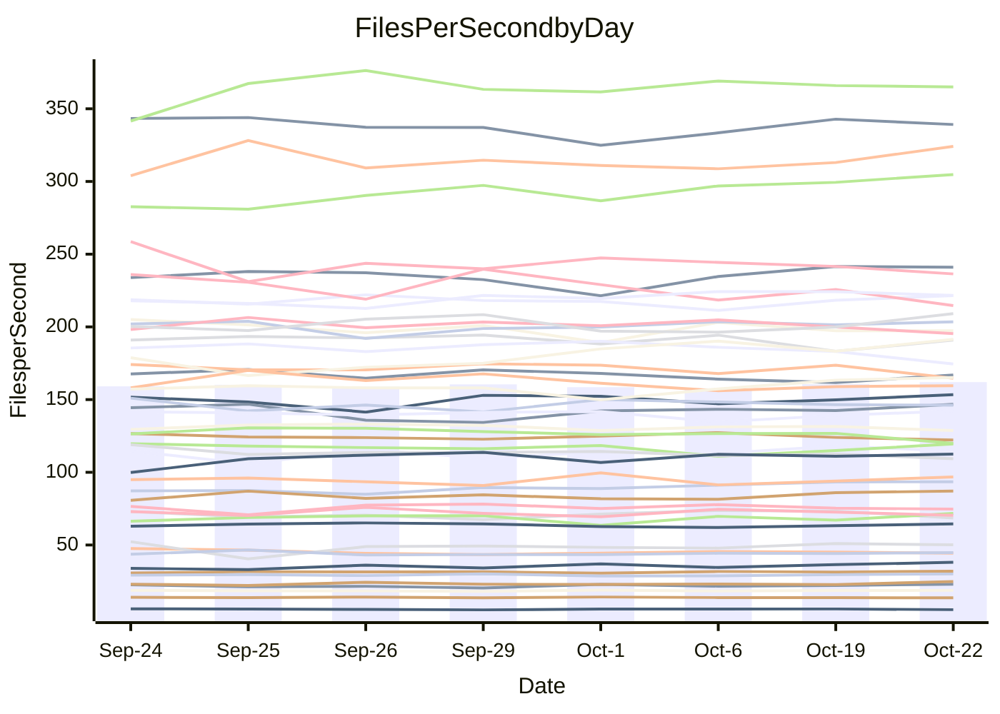

<!---
# This file is auto-generated. Do not edit.
# cspell:disable
--->
# Performance Report

## Daily Performance

## Time to Process Files

| Repository                                      | Elapsed | Min/Avg/Max           |   SD | SD Graph                |
| ----------------------------------------------- | ------: | :-------------------: | ---: | ----------------------- |
| AdaDoom3/AdaDoom3                    |    3.43 | 3.4 /   3.5 /   3.7   | 0.11 | `    ┣━━●━━╋━━┻━━┫    ` |
| alexiosc/megistos                    |    8.28 | 7.6 /   8.0 /   8.6   | 0.31 | `    ┣━━┻━━╋━●┻━━┫    ` |
| apollographql/apollo-server          |    2.70 | 2.6 /   2.8 /   3.0   | 0.12 | `    ┣━━●━━╋━━┻━━┫    ` |
| aspnetboilerplate/aspnetboilerplate  |   10.32 | 10.2 /  10.5 /  10.9  | 0.21 | `    ┣━━●━━╋━━┻━━┫    ` |
| aws-amplify/docs                     |   12.95 | 12.5 /  13.1 /  13.9  | 0.41 | `    ┣━━┻━●╋━━┻━━┫    ` |
| Azure/azure-rest-api-specs           |   10.35 | 9.5 /  10.1 /  10.7   | 0.32 | `    ┣━━┻━━╋━━●━━┫    ` |
| bitjson/typescript-starter           |    1.06 | 1.0 /   1.1 /   1.1   | 0.02 | `     ┣━━┻●╋━┻━━┫     ` |
| caddyserver/caddy                    |    3.85 | 3.6 /   3.8 /   4.0   | 0.12 | `    ┣━━┻━━╋━●┻━━┫    ` |
| canada-ca/open-source-logiciel-libre |    1.27 | 1.1 /   1.2 /   1.3   | 0.05 | `     ┣━┻━━╋━━┻●┫     ` |
| chef/chef                            |    5.69 | 5.8 /   6.0 /   6.4   | 0.16 | `    ●━━┻━━╋━━┻━━┫    ` |
| dart-lang/sdk                        |   64.75 | 63.9 /  67.2 /  73.2  | 2.34 | `  ┣━━━●━━━╋━━━┻━━━┫  ` |
| django/django                        |   16.49 | 14.9 /  15.5 /  16.2  | 0.40 | `    ┣━━┻━━╋━━┻━━┫ ●  ` |
| eslint/eslint                        |   10.99 | 10.7 /  11.0 /  11.7  | 0.34 | `    ┣━━┻━━●━━┻━━┫    ` |
| exonum/exonum                        |    3.67 | 3.6 /   3.7 /   4.0   | 0.12 | `    ┣━━┻━━●━━┻━━┫    ` |
| flutter/samples                      |   16.35 | 16.3 /  17.0 /  18.6  | 0.59 | `    ┣━●┻━━╋━━┻━━┫    ` |
| gitbucket/gitbucket                  |    3.78 | 3.5 /   3.6 /   3.8   | 0.09 | `    ┣━━┻━━╋━━┻●━┫    ` |
| googleapis/google-cloud-cpp          |  146.19 | 142.5 / 149.2 / 165.8 | 5.60 | `  ┣━━━┻━●━╋━━━┻━━━┫  ` |
| graphql/express-graphql              |    1.13 | 1.1 /   1.2 /   1.3   | 0.04 | `     ┣●┻━━╋━━┻━┫     ` |
| graphql/graphql-js                   |    2.98 | 2.8 /   2.9 /   3.1   | 0.07 | `     ┣━┻━━╋━●┻━┫     ` |
| graphql/graphql-relay-js             |    1.13 | 1.1 /   1.2 /   1.3   | 0.04 | `     ●━┻━━╋━━┻━┫     ` |
| graphql/graphql-spec                 |    1.39 | 1.3 /   1.4 /   1.4   | 0.03 | `     ┣━┻━━╋━━●━┫     ` |
| iluwatar/java-design-patterns        |   12.99 | 13.0 /  13.4 /  14.9  | 0.48 | `    ┣━━●━━╋━━┻━━┫    ` |
| ktaranov/sqlserver-kit               |    7.13 | 6.6 /   6.8 /   7.3   | 0.21 | `    ┣━━┻━━╋━━┻●━┫    ` |
| liriliri/licia                       |    4.24 | 4.1 /   4.3 /   4.4   | 0.10 | `    ┣━━┻━●╋━━┻━━┫    ` |
| MartinThoma/LaTeX-examples           |    6.92 | 6.9 /   7.1 /   7.4   | 0.18 | `    ┣━━┻●━╋━━┻━━┫    ` |
| mdx-js/mdx                           |    1.96 | 2.0 /   2.1 /   2.3   | 0.10 | `     ┣━●━━╋━━┻━┫     ` |
| microsoft/TypeScript-Website         |    5.91 | 5.6 /   5.8 /   6.0   | 0.12 | `    ┣━━┻━━╋━━●━━┫    ` |
| MicrosoftDocs/PowerShell-Docs        |   24.08 | 23.7 /  24.7 /  27.2  | 1.15 | `   ┣━━━┻●━╋━━┻━━━┫   ` |
| neovim/nvim-lspconfig                |    4.61 | 4.3 /   4.4 /   4.7   | 0.10 | `    ┣━━┻━━╋━━┻━●┫    ` |
| pagekit/pagekit                      |    3.79 | 3.5 /   3.7 /   4.0   | 0.13 | `    ┣━━┻━━╋━●┻━━┫    ` |
| php/php-src                          |   26.29 | 26.3 /  27.6 /  30.2  | 1.19 | `   ┣━━●┻━━╋━━┻━━━┫   ` |
| plasticrake/tplink-smarthome-api     |    1.40 | 1.3 /   1.4 /   1.4   | 0.04 | `     ┣━┻━━╋●━┻━┫     ` |
| prettier/prettier                    |    7.29 | 7.0 /   7.5 /   7.8   | 0.20 | `    ┣━━●━━╋━━┻━━┫    ` |
| pycontribs/jira                      |    1.58 | 1.5 /   1.6 /   2.0   | 0.11 | `     ┣━┻━●╋━━┻━┫     ` |
| RustPython/RustPython                |    5.74 | 5.2 /   5.4 /   5.6   | 0.11 | `    ┣━━┻━━╋━━┻━━┫  ● ` |
| shoelace-style/shoelace              |    3.00 | 2.9 /   3.0 /   3.1   | 0.06 | `     ┣━┻━━╋●━┻━┫     ` |
| slint-ui/slint                       |   13.26 | 12.7 /  13.5 /  14.4  | 0.47 | `    ┣━━┻●━╋━━┻━━┫    ` |
| SoftwareBrothers/admin-bro           |    2.64 | 2.6 /   2.7 /   2.9   | 0.09 | `     ┣━┻━●╋━━┻━┫     ` |
| sveltejs/svelte                      |   21.87 | 20.8 /  21.7 /  23.2  | 0.57 | `   ┣━━━┻━━╋●━┻━━━┫   ` |
| TheAlgorithms/Python                 |    5.80 | 5.7 /   6.0 /   6.6   | 0.22 | `    ┣━━┻●━╋━━┻━━┫    ` |
| twbs/bootstrap                       |    1.83 | 1.8 /   1.9 /   2.0   | 0.05 | `     ┣━┻●━╋━━┻━┫     ` |
| typescript-cheatsheets/react         |    1.39 | 1.4 /   1.5 /   1.6   | 0.07 | `     ┣●┻━━╋━━┻━┫     ` |
| typescript-eslint/typescript-eslint  |    4.22 | 4.3 /   4.4 /   4.6   | 0.11 | `    ┣━●┻━━╋━━┻━━┫    ` |
| vitest-dev/vitest                    |   10.53 | 9.3 /   9.9 /  11.1   | 0.52 | `    ┣━━┻━━╋━━┻●━┫    ` |
| w3c/aria-practices                   |    3.46 | 3.5 /   3.6 /   3.7   | 0.10 | `    ┣━━●━━╋━━┻━━┫    ` |
| w3c/specberus                        |    2.03 | 2.0 /   2.1 /   2.3   | 0.08 | `     ┣━┻●━╋━━┻━┫     ` |
| webdeveric/webpack-assets-manifest   |    1.23 | 1.2 /   1.2 /   1.3   | 0.03 | `     ┣━┻━●╋━━┻━┫     ` |
| webpack/webpack                      |    5.71 | 5.4 /   5.7 /   6.1   | 0.19 | `    ┣━━┻━━╋●━┻━━┫    ` |
| wireapp/wire-desktop                 |    1.44 | 1.3 /   1.4 /   1.5   | 0.04 | `     ┣━┻━━╋━●┻━┫     ` |
| wireapp/wire-webapp                  |   11.16 | 10.7 /  11.3 /  12.5  | 0.48 | `    ┣━━┻━●╋━━┻━━┫    ` |

Note:
- Elapsed time is in seconds.

## Files per Second over Time

| Repository                                      | Files |    Sec |    Fps |    Rel | Trend Fps       |    N |
| ----------------------------------------------- | ----: | -----: | -----: | -----: | --------------- | ---: |
| AdaDoom3/AdaDoom3                    |   103 |   3.43 |  30.07 |  2.86% | `▇▇▄██▆▆▇▅██▆█` |   12 |
| alexiosc/megistos                    |   583 |   8.28 |  70.42 | -3.15% | `▆▅██▆▅▄▇▇▆█▄▅` |   12 |
| apollographql/apollo-server          |   252 |   2.70 |  93.48 |  4.45% | `▅▅▅▃▆▇▄▇▆▇█▆▇` |   12 |
| aspnetboilerplate/aspnetboilerplate  |  2286 |  10.32 | 221.47 |  1.86% | `▇▆██▇█▆▅▆▆███` |   12 |
| aws-amplify/docs                     |  2871 |  12.95 | 221.67 |  0.70% | `▆▆▆▄▇▅█▇███▆▇` |   12 |
| Azure/azure-rest-api-specs           |  2448 |  10.35 | 236.44 | -3.01% | `█▄▆▆▅▇▆▅▇▄▇▆▅` |   12 |
| bitjson/typescript-starter           |    20 |   1.06 |  18.78 |  1.07% | `▇▆▆▆▅▇█▆▆▅▇█▇` |   12 |
| caddyserver/caddy                    |   288 |   3.85 |  74.73 | -1.63% | `▇▄█▇█▇▆██▇▅▇▆` |   12 |
| canada-ca/open-source-logiciel-libre |     7 |   1.27 |   5.52 | -6.42% | `█▇▅▆▄█▆█▇▇█▇▄` |   12 |
| chef/chef                            |  1191 |   5.69 | 209.15 |  4.42% | `▆▆█▇█▅▆▇▄▇▆▇█` |   12 |
| dart-lang/sdk                        | 10696 |  64.75 | 165.20 |  4.60% | `▆▇▆▆▆▆▃▇▅▇▇██` |   12 |
| django/django                        |  2877 |  16.49 | 174.48 | -6.07% | `▆▇▅▇▇▇█▇▆▅▅█▄` |   12 |
| eslint/eslint                        |  2098 |  10.99 | 190.99 |  0.60% | `▇██▇██▅██▅▅▇▇` |   12 |
| exonum/exonum                        |   421 |   3.67 | 114.67 |  0.47% | `▇▄█▆▅▆▇▆▇███▇` |   12 |
| flutter/samples                      |  2400 |  16.35 | 146.75 |  3.85% | `██▄▇▅▇▇▇▇▇▇██` |   12 |
| gitbucket/gitbucket                  |   413 |   3.78 | 109.33 | -3.64% | `█▆▇▅▆▇▆▆▅▅▅█▄` |   12 |
| googleapis/google-cloud-cpp          | 20788 | 146.19 | 142.20 |  2.02% | `▇▇▆▇▇▆██▃▇▆▇▇` |   12 |
| graphql/express-graphql              |    26 |   1.13 |  23.04 |  5.09% | `▇▅▅▇▄█▇▅▇▆▆▇█` |   12 |
| graphql/graphql-js                   |   364 |   2.98 | 122.22 | -2.07% | `█▇▅█▆▆▇█▇█▇▅▆` |   12 |
| graphql/graphql-relay-js             |    28 |   1.13 |  24.84 |  7.46% | `▅▄█▇▅▇▄▆▅▅▆▅█` |   12 |
| graphql/graphql-spec                 |    19 |   1.39 |  13.67 | -2.20% | `▇▆██▆███▅▅▇▇▆` |   12 |
| iluwatar/java-design-patterns        |  1992 |  12.99 | 153.36 |  3.15% | `█▇▇▄███▇▇▇█▇█` |   12 |
| ktaranov/sqlserver-kit               |   489 |   7.13 |  68.61 | -4.34% | `▇▅▅▇▄▇▆█▇██▇▅` |   12 |
| liriliri/licia                       |  1437 |   4.24 | 339.19 |  0.64% | `██▇▆▇▅▅▅▇█▇█▇` |   12 |
| MartinThoma/LaTeX-examples           |  1409 |   6.92 | 203.50 |  1.77% | `▇█▆▅▇▆█▇███▆█` |   12 |
| mdx-js/mdx                           |   141 |   1.96 |  71.80 |  5.98% | `▆▇█▇▇▃▆▇▇▅▇▆█` |   12 |
| microsoft/TypeScript-Website         |   761 |   5.91 | 128.70 | -1.95% | `▆▇▆█▇▅▆▅█▆▇▇▆` |   12 |
| MicrosoftDocs/PowerShell-Docs        |  2708 |  24.08 | 112.47 |  2.42% | `▄▇▇▇██▄███▇▇█` |   12 |
| neovim/nvim-lspconfig                |   759 |   4.61 | 164.69 | -4.26% | `█▇▆▇█▇█▇▅██▆▅` |   12 |
| pagekit/pagekit                      |   741 |   3.79 | 195.40 | -3.01% | `▆▇▆▆▇▆▆█▆▇█▄▅` |   12 |
| php/php-src                          |  2289 |  26.29 |  87.05 |  4.37% | `▆█▇▅▇▅▇▄█▇███` |   12 |
| plasticrake/tplink-smarthome-api     |    62 |   1.40 |  44.42 | -1.51% | `█▇▇▄▅▆▅▆▆▇▅▇▅` |   12 |
| prettier/prettier                    |  2363 |   7.29 | 324.10 |  3.88% | `▅█▄▇▆▆▆▅▆▆▆▆█` |   12 |
| pycontribs/jira                      |    79 |   1.58 |  50.11 |  2.75% | `█▂▆▇▇▆▆▆▅█▇▇▇` |   12 |
| RustPython/RustPython                |   688 |   5.74 | 119.91 | -6.02% | `▆▇█▆▆▅▇▆▆▅▇▆▄` |   12 |
| shoelace-style/shoelace              |   439 |   3.00 | 146.18 | -0.53% | `█▅▆▇▅█▇▇▇▇▇▅▇` |   12 |
| slint-ui/slint                       |  2539 |  13.26 | 191.47 |  6.14% | `▆▄▅▄▅▇▇█▇▅▇▇█` |   12 |
| SoftwareBrothers/admin-bro           |   441 |   2.64 | 166.96 |  0.81% | `▇█▆▇█▇██▅▇▇▄▇` |   12 |
| sveltejs/svelte                      |  7982 |  21.87 | 365.04 | -0.08% | `▄▇█▇▆▆▆▇▇▆▆▇▆` |   12 |
| TheAlgorithms/Python                 |  1399 |   5.80 | 241.08 |  2.75% | `▇▇█▇▇▆▃▇▆█▇██` |   12 |
| twbs/bootstrap                       |   118 |   1.83 |  64.53 |  1.70% | `▆▇▇█▇▅▇▆▅▄▇█▇` |   12 |
| typescript-cheatsheets/react         |    53 |   1.39 |  38.09 |  7.25% | `▄▄▆▇▅▇▇▃▇▇▇▇█` |   12 |
| typescript-eslint/typescript-eslint  |  1285 |   4.22 | 304.79 |  4.28% | `▅▅▅▇▇▆▅█▆▇▇▇█` |   12 |
| vitest-dev/vitest                    |  2261 |  10.53 | 214.68 | -5.17% | `█▇▃███▆▅▆▆▇▆▅` |   12 |
| w3c/aria-practices                   |   414 |   3.46 | 119.48 |  3.02% | `█▇█▆▇██▅▅▆▅██` |   12 |
| w3c/specberus                        |   197 |   2.03 |  96.82 |  2.58% | `▆▆▅▆▅▇█▃▆▆▅▆▇` |   12 |
| webdeveric/webpack-assets-manifest   |    55 |   1.23 |  44.79 |  1.83% | `▅█▅▅▅▅▅▆▆▅▆▆▆` |   12 |
| webpack/webpack                      |  1127 |   5.71 | 197.32 | -0.34% | `█▇▆▇▇▄▆▇█▆█▆▇` |   12 |
| wireapp/wire-desktop                 |    46 |   1.44 |  31.95 |  1.93% | `▅▆▅▇▆▄▅▅█▇▆▅▇` |   12 |
| wireapp/wire-webapp                  |  1781 |  11.16 | 159.55 | -0.98% | `▆██▆█▇▆▃▇▆▅▇▆` |   12 |

## Data Throughput

| Repository                                      | Files |    Sec |     Kps |    Rel | Trend Kps       |    N |
| ----------------------------------------------- | ----: | -----: | ------: | -----: | --------------- | ---: |
| AdaDoom3/AdaDoom3                    |   103 |   3.43 |  638.97 |  2.86% | `▇▇▄██▆▆▇▅██▆█` |   12 |
| alexiosc/megistos                    |   583 |   8.28 |  553.33 | -3.15% | `▆▅██▆▅▄▇▇▆█▄▅` |   12 |
| apollographql/apollo-server          |   252 |   2.70 |  751.89 |  4.45% | `▅▅▅▃▆▇▄▇▆▇█▆▇` |   12 |
| aspnetboilerplate/aspnetboilerplate  |  2286 |  10.32 |  538.85 |  1.86% | `▇▆██▇█▆▅▆▆███` |   12 |
| aws-amplify/docs                     |  2871 |  12.95 |  773.79 |  0.68% | `▆▆▆▄▇▅█▇███▆▇` |   12 |
| Azure/azure-rest-api-specs           |  2448 |  10.35 |  633.50 | -1.89% | `█▄▅▆▅▇▆▅▇▄▇▇▅` |   12 |
| bitjson/typescript-starter           |    20 |   1.06 |   75.14 |  1.07% | `▇▆▆▆▅▇█▆▆▅▇█▇` |   12 |
| caddyserver/caddy                    |   288 |   3.85 |  648.22 | -0.21% | `▇▄█▇█▇▆██▇▆▇▇` |   12 |
| canada-ca/open-source-logiciel-libre |     7 |   1.27 |   45.70 | -6.42% | `█▇▅▆▄█▆█▇▇█▇▄` |   12 |
| chef/chef                            |  1191 |   5.69 |  968.31 |  4.76% | `▆▆█▇█▅▆▇▄▇▆▆█` |   12 |
| dart-lang/sdk                        | 10696 |  64.75 | 1124.99 |  3.97% | `▆▇▇▆▆▆▄█▅▇▇██` |   12 |
| django/django                        |  2877 |  16.49 | 1096.56 | -5.79% | `▆▇▅▇▇▇█▇▆▅▅█▄` |   12 |
| eslint/eslint                        |  2098 |  10.99 | 1372.77 |  0.44% | `▇██▇██▅██▅▅▇▇` |   12 |
| exonum/exonum                        |   421 |   3.67 | 1096.85 |  0.47% | `▇▄█▆▅▆▇▆▇███▇` |   12 |
| flutter/samples                      |  2400 |  16.35 | 1309.56 |  3.85% | `██▄▇▅▇▇▇▇▇▇██` |   12 |
| gitbucket/gitbucket                  |   413 |   3.78 |  496.89 | -3.67% | `█▆▇▅▆▇▆▆▅▅▅█▄` |   12 |
| googleapis/google-cloud-cpp          | 20788 | 146.19 | 1155.51 |  2.14% | `▇▇▆▇▇▆██▃▇▆▇▇` |   12 |
| graphql/express-graphql              |    26 |   1.13 |  105.47 |  5.09% | `▇▅▅▇▄█▇▅▇▆▆▇█` |   12 |
| graphql/graphql-js                   |   364 |   2.98 |  706.45 | -1.51% | `█▇▅█▆▆▇█▇█▇▅▆` |   12 |
| graphql/graphql-relay-js             |    28 |   1.13 |   97.58 |  7.46% | `▅▄█▇▅▇▄▆▅▅▆▅█` |   12 |
| graphql/graphql-spec                 |    19 |   1.39 |  456.05 | -2.20% | `▇▆██▆███▅▅▇▇▆` |   12 |
| iluwatar/java-design-patterns        |  1992 |  12.99 |  474.00 |  3.15% | `█▇▇▄███▇▇▇█▇█` |   12 |
| ktaranov/sqlserver-kit               |   489 |   7.13 | 1038.83 | -4.34% | `▇▅▅▇▄▇▆█▇██▇▅` |   12 |
| liriliri/licia                       |  1437 |   4.24 |  404.10 |  0.64% | `██▇▆▇▅▅▅▇█▇█▇` |   12 |
| MartinThoma/LaTeX-examples           |  1409 |   6.92 |  420.29 |  1.77% | `▇█▆▅▇▆█▇███▆█` |   12 |
| mdx-js/mdx                           |   141 |   1.96 |  334.07 |  5.98% | `▆▇█▇▇▃▆▇▇▅▇▆█` |   12 |
| microsoft/TypeScript-Website         |   761 |   5.91 |  890.06 | -1.95% | `▆▇▆█▇▅▆▅█▆▇▇▆` |   12 |
| MicrosoftDocs/PowerShell-Docs        |  2708 |  24.08 | 1157.52 |  2.46% | `▄▇▇▇██▄███▇▇█` |   12 |
| neovim/nvim-lspconfig                |   759 |   4.61 |  274.91 | -3.79% | `▇▆▆▇▇▇█▇▅██▆▅` |   12 |
| pagekit/pagekit                      |   741 |   3.79 |  407.42 | -3.01% | `▆▇▆▆▇▆▆█▆▇█▄▅` |   12 |
| php/php-src                          |  2289 |  26.29 | 1520.51 |  4.77% | `▅█▇▅▇▅▇▄█▇███` |   12 |
| plasticrake/tplink-smarthome-api     |    62 |   1.40 |  240.03 | -1.51% | `█▇▇▄▅▆▅▆▆▇▅▇▅` |   12 |
| prettier/prettier                    |  2363 |   7.29 |  453.44 |  3.38% | `▅█▄▇▆▆▆▅▆▆▆▆▇` |   12 |
| pycontribs/jira                      |    79 |   1.58 |  355.21 |  2.75% | `█▂▆▇▇▆▆▆▅█▇▇▇` |   12 |
| RustPython/RustPython                |   688 |   5.74 |  949.83 | -5.74% | `▆▇█▆▆▅▇▆▆▅▇▆▄` |   12 |
| shoelace-style/shoelace              |   439 |   3.00 |  706.26 | -0.53% | `█▅▆▇▅█▇▇▇▇▇▅▇` |   12 |
| slint-ui/slint                       |  2539 |  13.26 | 1178.51 |  4.19% | `█▅▇▆▄▇▇█▇▅▇▇█` |   12 |
| SoftwareBrothers/admin-bro           |   441 |   2.64 |  367.99 |  0.81% | `▇█▆▇█▇██▅▇▇▄▇` |   12 |
| sveltejs/svelte                      |  7982 |  21.87 |  243.62 | -0.24% | `▄▇█▇▆▆▆▇▇▆▆▇▆` |   12 |
| TheAlgorithms/Python                 |  1399 |   5.80 |  613.12 |  2.81% | `▇▇█▇▇▆▃▇▆█▇██` |   12 |
| twbs/bootstrap                       |   118 |   1.83 |  529.37 |  1.70% | `▆▇▇█▇▅▇▆▅▄▇█▇` |   12 |
| typescript-cheatsheets/react         |    53 |   1.39 |  281.69 |  7.25% | `▄▄▆▇▅▇▇▃▇▇▇▇█` |   12 |
| typescript-eslint/typescript-eslint  |  1285 |   4.22 | 1567.13 |  4.56% | `▅▅▅▇▇▅▅▇▆▇███` |   12 |
| vitest-dev/vitest                    |  2261 |  10.53 |  483.29 | -5.32% | `█▇▃███▆▅▆▅▇▆▅` |   12 |
| w3c/aria-practices                   |   414 |   3.46 | 1114.02 |  3.02% | `█▇█▆▇██▅▅▆▅██` |   12 |
| w3c/specberus                        |   197 |   2.03 |  306.19 |  3.06% | `▆▆▅▆▅▇█▃▆▆▆▆▇` |   12 |
| webdeveric/webpack-assets-manifest   |    55 |   1.23 |  103.42 |  0.59% | `▆█▅▅▅▅▅▆▆▄▆▆▆` |   12 |
| webpack/webpack                      |  1127 |   5.71 |  897.64 | -0.43% | `█▇▅▇▇▄▆▇█▆█▆▆` |   12 |
| wireapp/wire-desktop                 |    46 |   1.44 |  178.52 | 14.99% | `▃▃▃▃▃▂▃▂█▇▇▆▇` |   12 |
| wireapp/wire-webapp                  |  1781 |  11.16 |  588.92 |  0.90% | `▆██▆█▇▆▃█▇▆▇▇` |   12 |

