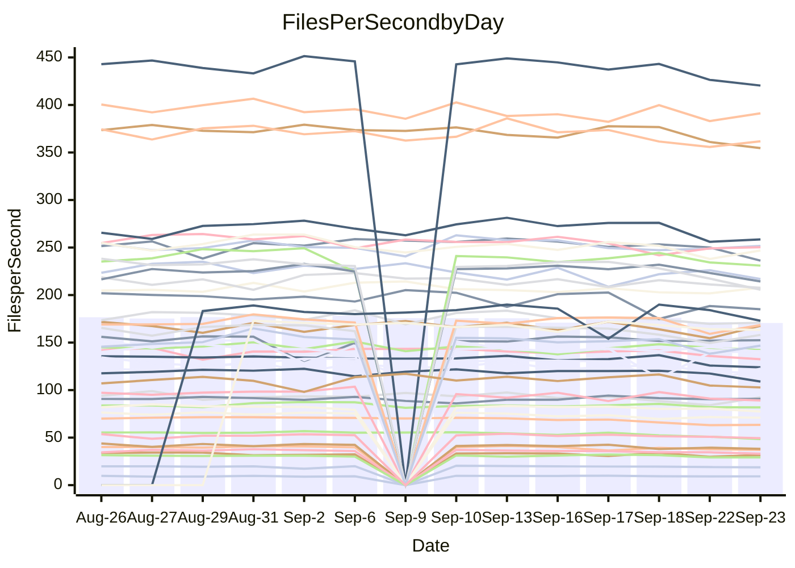

<!---
# This file is auto-generated. Do not edit.
# cspell:disable
--->
# Performance Report

## Daily Performance

## Time to Process Files

| Repository                                      | Elapsed | Min/Avg/Max           |   SD | SD Graph                |
| ----------------------------------------------- | ------: | :-------------------: | ---: | ----------------------- |
| AdaDoom3/AdaDoom3                    |    3.11 | 2.7 /   2.9 /   3.1   | 0.10 | `    ┣━━┻━━╋━━┻━━┫●   ` |
| alexiosc/megistos                    |    7.53 | 6.6 /   7.1 /   7.5   | 0.24 | `    ┣━━┻━━╋━━┻━●┫    ` |
| apollographql/apollo-server          |    2.29 | 2.0 /   2.1 /   2.3   | 0.05 | `     ┣━┻━━╋━━┻━┫    ●` |
| aspnetboilerplate/aspnetboilerplate  |   11.60 | 10.5 /  10.9 /  12.7  | 0.41 | `    ┣━━┻━━╋━━┻━━●    ` |
| aws-amplify/docs                     |   11.25 | 10.7 /  11.2 /  12.0  | 0.36 | `    ┣━━┻━━●━━┻━━┫    ` |
| Azure/azure-rest-api-specs           |   14.19 | 12.9 /  13.7 /  14.8  | 0.51 | `   ┣━━━┻━━╋━━●━━━┫   ` |
| bitjson/typescript-starter           |    0.63 | 0.6 /   0.6 /   0.7   | 0.03 | `     ┣━━┻━╋━●━━┫     ` |
| caddyserver/caddy                    |    2.99 | 2.8 /   3.0 /   3.5   | 0.18 | `    ┣━━┻━━●━━┻━━┫    ` |
| canada-ca/open-source-logiciel-libre |    0.76 | 0.7 /   0.7 /   0.9   | 0.04 | `     ┣━┻━━╋●━┻━┫     ` |
| chef/chef                            |    5.54 | 4.8 /   5.3 /   6.0   | 0.28 | `    ┣━━┻━━╋━━●━━┫    ` |
| dart-lang/sdk                        |   59.48 | 55.3 /  57.9 /  70.4  | 3.25 | `  ┣━━━┻━━━╋━●━┻━━━┫  ` |
| django/django                        |   13.44 | 13.0 /  13.6 /  14.4  | 0.38 | `    ┣━━┻━●╋━━┻━━┫    ` |
| eslint/eslint                        |    9.63 | 8.9 /   9.3 /  10.2   | 0.29 | `    ┣━━┻━━╋━━┻●━┫    ` |
| exonum/exonum                        |    2.98 | 2.7 /   3.0 /   3.7   | 0.18 | `    ┣━━┻━━●━━┻━━┫    ` |
| flutter/samples                      |   15.02 | 13.7 /  14.3 /  18.4  | 1.00 | `   ┣━━━┻━━╋━●┻━━━┫   ` |
| gitbucket/gitbucket                  |    3.10 | 2.8 /   2.9 /   3.5   | 0.12 | `    ┣━━┻━━╋━━┻●━┫    ` |
| googleapis/google-cloud-cpp          |  138.49 | 129.2 / 136.0 / 145.8 | 3.95 | `  ┣━━━┻━━━╋━━●┻━━━┫  ` |
| graphql/express-graphql              |    0.70 | 0.6 /   0.7 /   0.8   | 0.03 | `     ┣━┻━━╋━━●━┫     ` |
| graphql/graphql-js                   |    2.11 | 1.9 /   2.0 /   2.2   | 0.08 | `     ┣━┻━━╋━●┻━┫     ` |
| graphql/graphql-relay-js             |    0.73 | 0.6 /   0.7 /   0.7   | 0.03 | `     ┣━┻━━╋━━┻━●     ` |
| graphql/graphql-spec                 |    0.80 | 0.7 /   0.8 /   0.9   | 0.03 | `     ┣━┻━━╋━━●━┫     ` |
| iluwatar/java-design-patterns        |   10.91 | 10.1 /  10.7 /  12.5  | 0.48 | `    ┣━━┻━━╋●━┻━━┫    ` |
| ktaranov/sqlserver-kit               |    5.98 | 5.6 /   5.8 /   6.1   | 0.15 | `    ┣━━┻━━╋━━●━━┫    ` |
| liriliri/licia                       |    3.38 | 3.1 /   3.2 /   3.4   | 0.06 | `     ┣━┻━━╋━━┻━┫  ●  ` |
| MartinThoma/LaTeX-examples           |    6.57 | 5.8 /   6.2 /   6.8   | 0.26 | `    ┣━━┻━━╋━━┻●━┫    ` |
| mdx-js/mdx                           |    1.62 | 1.4 /   1.5 /   1.8   | 0.07 | `     ┣━┻━━╋━━┻●┫     ` |
| microsoft/TypeScript-Website         |    4.97 | 4.6 /   4.9 /   5.9   | 0.23 | `    ┣━━┻━━●━━┻━━┫    ` |
| MicrosoftDocs/PowerShell-Docs        |   22.71 | 20.6 /  21.7 /  23.9  | 0.80 | `   ┣━━━┻━━╋━━┻●━━┫   ` |
| neovim/nvim-lspconfig                |    2.87 | 2.5 /   2.6 /   2.9   | 0.09 | `    ┣━━┻━━╋━━┻━━┫●   ` |
| pagekit/pagekit                      |    3.21 | 2.9 /   3.1 /   3.4   | 0.11 | `    ┣━━┻━━╋━━●━━┫    ` |
| php/php-src                          |   24.38 | 23.2 /  24.4 /  26.1  | 0.71 | `   ┣━━━┻━━●━━┻━━━┫   ` |
| plasticrake/tplink-smarthome-api     |    0.87 | 0.8 /   0.8 /   0.9   | 0.03 | `     ┣━┻━━╋━━●━┫     ` |
| prettier/prettier                    |    6.18 | 5.7 /   5.9 /   6.2   | 0.13 | `    ┣━━┻━━╋━━┻━━●    ` |
| pycontribs/jira                      |    1.26 | 1.1 /   1.1 /   1.3   | 0.05 | `     ┣━┻━━╋━━┻━┫●    ` |
| RustPython/RustPython                |    4.42 | 4.0 /   4.3 /   6.1   | 0.40 | `    ┣━━┻━━╋●━┻━━┫    ` |
| shoelace-style/shoelace              |    2.36 | 2.1 /   2.2 /   2.5   | 0.11 | `    ┣━━┻━━╋━━┻●━┫    ` |
| SoftwareBrothers/admin-bro           |    2.14 | 1.8 /   1.9 /   2.0   | 0.06 | `     ┣━━┻━╋━┻━━┫    ●` |
| sveltejs/svelte                      |   19.00 | 17.4 /  18.6 /  20.3  | 0.55 | `   ┣━━━┻━━╋━●┻━━━┫   ` |
| TheAlgorithms/Python                 |    5.20 | 4.7 /   5.0 /   5.5   | 0.18 | `    ┣━━┻━━╋━━┻●━┫    ` |
| twbs/bootstrap                       |    1.17 | 1.0 /   1.1 /   1.4   | 0.08 | `     ┣━┻━━╋━━●━┫     ` |
| typescript-cheatsheets/react         |    1.07 | 0.9 /   1.0 /   1.1   | 0.04 | `     ┣━┻━━╋━━●━┫     ` |
| typescript-eslint/typescript-eslint  |    3.44 | 3.2 /   3.4 /   3.7   | 0.13 | `    ┣━━┻━━╋━●┻━━┫    ` |
| vitest-dev/vitest                    |    7.11 | 6.5 /   6.9 /   7.4   | 0.23 | `    ┣━━┻━━╋━━●━━┫    ` |
| w3c/aria-practices                   |    2.75 | 2.4 /   2.7 /   3.0   | 0.13 | `    ┣━━┻━━╋━●┻━━┫    ` |
| w3c/specberus                        |    1.63 | 1.5 /   1.6 /   2.1   | 0.13 | `    ┣━━┻━━╋●━┻━━┫    ` |
| webdeveric/webpack-assets-manifest   |    0.65 | 0.6 /   0.6 /   0.7   | 0.02 | `     ┣━━┻━╋━┻━●┫     ` |
| webpack/webpack                      |    4.40 | 4.1 /   4.3 /   4.7   | 0.14 | `    ┣━━┻━━╋━●┻━━┫    ` |
| wireapp/wire-desktop                 |    0.89 | 0.7 /   0.8 /   0.9   | 0.03 | `     ┣━┻━━╋━━┻━┫  ●  ` |
| wireapp/wire-webapp                  |    7.32 | 6.9 /   7.3 /   8.0   | 0.31 | `    ┣━━┻━━●━━┻━━┫    ` |

Note:
- Elapsed time is in seconds.

## Files per Second over Time

| Repository                                      | Files |    Sec |    Fps |     Rel | Trend Fps              |    N |
| ----------------------------------------------- | ----: | -----: | -----: | ------: | ---------------------- | ---: |
| AdaDoom3/AdaDoom3                    |   103 |   3.11 |  33.11 |  -8.07% | `▆▆▆▅▆█▆▆▆▇▆▆▅▆▄▆▄▅▄▃` |   23 |
| alexiosc/megistos                    |   583 |   7.53 |  77.47 |  -5.84% | `▆▇▇▄▅▇▆▄▆▅▆▆▇▄▄█▅▅▅▄` |   23 |
| apollographql/apollo-server          |   250 |   2.29 | 109.01 |  -8.77% | `▇▇▇▇█▅▇█▇▇▆█▇▇▇▇▇▆▇▄` |   25 |
| aspnetboilerplate/aspnetboilerplate  |  2739 |  11.60 | 236.21 |  -6.46% | `▇█▇▇███▇████▇█▆█▇▆▇▅` |   27 |
| aws-amplify/docs                     |  2831 |  11.25 | 251.75 |  -0.41% | `█▆█▅█▆▅██▇▇▆▇█▅▇▆▆▆▆` |   27 |
| Azure/azure-rest-api-specs           |  2426 |  14.19 | 170.91 |  -3.52% | `▇▅█▇▅█▅█▆▇█▇▅▆▆▆▆▆▄▅` |   27 |
| bitjson/typescript-starter           |    20 |   0.63 |  31.63 |  -3.67% | `████▃▇▆▆▆█▇▇▇▇▅▅█▃▄▅` |   23 |
| caddyserver/caddy                    |   276 |   2.99 |  92.41 |  -0.38% | `▇▇▆█▆▇█▆███▇▇▄▇▆▅▃▆▆` |   27 |
| canada-ca/open-source-logiciel-libre |     7 |   0.76 |   9.26 |  -2.50% | `▄▆█▃█▇▅▆██▇▇▇▇██▆▇▅▆` |   23 |
| chef/chef                            |  1201 |   5.54 | 216.90 |  -3.86% | `█▅▇▆▇▆▇▆▆▅▅▅▆▇▃▅▆▆▆▅` |   27 |
| dart-lang/sdk                        |  9713 |  59.48 | 163.31 |  -2.71% | `███▇▇█▇▇▇▇██▃▇█▇▆▇▆`  |   18 |
| django/django                        |  2792 |  13.44 | 207.79 |   1.01% | `▄█▇▇▅██▇▆▇▆▆▇▄▇▆▆▆▅▇` |   27 |
| eslint/eslint                        |  2000 |   9.63 | 207.60 |  -3.38% | `▇▄▇█▇█▇▇█▅▇▇▇█▆▅▇▆▇▆` |   27 |
| exonum/exonum                        |   421 |   2.98 | 141.10 |  -0.36% | `▇▇▆█▆▇▇▆▇▇▇▆▇▆▇▆▂▆▆▆` |   23 |
| flutter/samples                      |  2598 |  15.02 | 172.95 |  -5.04% | `▇███▇▇▇█▇███▇█▅▂█▇█▆` |   21 |
| gitbucket/gitbucket                  |   411 |   3.10 | 132.42 |  -5.41% | `▇█▇▇▇████▇▇▇▆█▇▇█▆▇▆` |   27 |
| googleapis/google-cloud-cpp          | 19685 | 138.49 | 142.14 |  -1.60% | `▇▇█▆▆█▅▆▇▆▆▅▄▄▆▇▇▇▆▆` |   27 |
| graphql/express-graphql              |    26 |   0.70 |  37.18 |  -6.16% | `█▇▆████▇▆███▇█▇▃▇▆▅▅` |   23 |
| graphql/graphql-js                   |   333 |   2.11 | 158.09 |  -3.39% | `▆▆█▇▇▇▆▇▇▅█▇▇▆▇▆▅▃▃▅` |   24 |
| graphql/graphql-relay-js             |    28 |   0.73 |  38.14 |  -8.66% | `▇▇▇█▄▇█▇█▄▆▇▇▅█▆▃▅▅▄` |   23 |
| graphql/graphql-spec                 |    15 |   0.80 |  18.71 |  -4.56% | `▆▇▇▅▆█▃▇██▇█▇▇█▆▆▆▆▅` |   23 |
| iluwatar/java-design-patterns        |  1838 |  10.91 | 168.41 |  -1.77% | `▇█▅▆██▇▇▇▇▇▆█▇█▇▇▇▃▆` |   23 |
| ktaranov/sqlserver-kit               |   489 |   5.98 |  81.81 |  -2.36% | `▅▅▆▇███▅▆▆▆▇▆▆▅▇▇▅▆▅` |   25 |
| liriliri/licia                       |  1421 |   3.38 | 420.42 |  -4.70% | `▇█▆▆▆▆█▇▇▇█▇▇▇▇▆▇▅▆▅` |   23 |
| MartinThoma/LaTeX-examples           |  1407 |   6.57 | 214.31 |  -5.01% | `▄▆▆▆█▄▇▆▆▇▆▇▇▇█▅▇▆▆▅` |   23 |
| mdx-js/mdx                           |   144 |   1.62 |  89.08 |  -7.03% | `▇▆▆▇▇▇█▆▆▄▆▆▇▆▆▃▇▅▅▄` |   25 |
| microsoft/TypeScript-Website         |   758 |   4.97 | 152.50 |  -0.41% | `▇▇█▇▇▃▆▇▆▆▆▆▇█▇▇▆▇▆▆` |   25 |
| MicrosoftDocs/PowerShell-Docs        |  2690 |  22.71 | 118.45 |  -4.19% | `▄██▇▃▇▆▇▆██▆▆▆▆▇▇▆▅▅` |   27 |
| neovim/nvim-lspconfig                |   356 |   2.87 | 123.97 |  -7.21% | `▅▇█▇▇▇▇▇▇██▇█▄▇▆█▆▄▄` |   27 |
| pagekit/pagekit                      |   741 |   3.21 | 230.98 |  -3.66% | `▆▇█▆█▆▇▄▇▅▇▅▅▆▅▆▇▅▅▅` |   23 |
| php/php-src                          |  2211 |  24.38 |  90.71 |   0.01% | `█▆█▅▇▇▆▄▅▅▇▇▆▆██▇▆▇▇` |   27 |
| plasticrake/tplink-smarthome-api     |    62 |   0.87 |  70.97 |  -4.81% | `▇██▆▅▇▇▇▇██▅▆▄▅▇▄▅▅▅` |   23 |
| prettier/prettier                    |  2190 |   6.18 | 354.59 |  -4.88% | `▅▇▆███▇▇▇▇▇▆▅▇█▇▇▆▅▅` |   26 |
| pycontribs/jira                      |    80 |   1.26 |  63.41 |  -9.01% | `█▇█████▇█▇█▇█▆▆█▆▆▃▅` |   26 |
| RustPython/RustPython                |   621 |   4.42 | 140.59 |  -3.46% | `█████▂▇█▇█▆▆▇▆▇▇▆▇▇▆` |   25 |
| shoelace-style/shoelace              |   437 |   2.36 | 184.98 |  -6.20% | `█▆▅█▇▆█▇█▇▃█▇▇▇█▃▆▅▅` |   25 |
| SoftwareBrothers/admin-bro           |   441 |   2.14 | 205.66 | -11.35% | `▅▇█▇▇▆▇▆▆▆▇▆▆▇▇▇▆▄▄▂` |   24 |
| sveltejs/svelte                      |  7431 |  19.00 | 391.20 |  -0.80% | `▇▆█▆▆▆▅▇▇▆▅▆▆▅▇▄▇▅▆▆` |   27 |
| TheAlgorithms/Python                 |  1345 |   5.20 | 258.54 |  -4.45% | `▆█▆█▇▆▆▇▇▇█▆▇▆▇▇▇▅▅▅` |   27 |
| twbs/bootstrap                       |   120 |   1.17 | 102.79 |  -6.55% | `█▆▇▂▆▇█▇▆▇█▇▇▅█▇█▆▅▅` |   26 |
| typescript-cheatsheets/react         |    53 |   1.07 |  49.44 |  -5.25% | `▅█▅▄▆▅▇▆▇▅▆▇▅▇▆▇▅▅▅▄` |   23 |
| typescript-eslint/typescript-eslint  |  1245 |   3.44 | 361.81 |  -2.50% | `▆▆█▆▆▆▅▅▇▇███▃▆▇▅▅▅▅` |   27 |
| vitest-dev/vitest                    |  1780 |   7.11 | 250.28 |  -2.67% | `▆▅█▇█▅▇█▄▇▅▇▆█▆▆▄▅▅▅` |   27 |
| w3c/aria-practices                   |   403 |   2.75 | 146.78 |  -3.00% | `▄▅█▇▆▇▆▆▆▆▆▆▄▆▆▅▆▃▄▅` |   25 |
| w3c/specberus                        |   200 |   1.63 | 122.56 |  -4.01% | `▇▆██▇█▅▇▇▇█▇█▇█▆▅▂▆▆` |   27 |
| webdeveric/webpack-assets-manifest   |    19 |   0.65 |  29.18 |  -5.63% | `▇▇▇▆▇▆▇▆▇▇▃█▇▆██▇▅▅▅` |   23 |
| webpack/webpack                      |  1086 |   4.40 | 246.89 |  -2.17% | `▇████▆▅▆▆▇▆▇▆▄▇▇▆▃▆▆` |   27 |
| wireapp/wire-desktop                 |    43 |   0.89 |  48.45 | -11.34% | `▆▇▆█▇▇▇▇▇▆▇▃▇▆▇▇▅▅▄▃` |   27 |
| wireapp/wire-webapp                  |  1228 |   7.32 | 167.67 |   0.88% | `▄█▇▇▄▇█▅▇█▇▅▆▆█▇▆▄▄▇` |   27 |

## Data Throughput

| Repository                                      | Files |    Sec |     Kps |     Rel | Trend Kps              |    N |
| ----------------------------------------------- | ----: | -----: | ------: | ------: | ---------------------- | ---: |
| AdaDoom3/AdaDoom3                    |   103 |   3.11 |  703.71 |  -8.07% | `▆▆▆▅▆█▆▆▆▇▆▆▅▆▄▆▄▅▄▃` |   23 |
| alexiosc/megistos                    |   583 |   7.53 |  608.71 |  -5.84% | `▆▇▇▄▅▇▆▄▆▅▆▆▇▄▄█▅▅▅▄` |   23 |
| apollographql/apollo-server          |   250 |   2.29 |  863.78 |  -8.77% | `▇▇▇▇█▅▇█▇▇▆█▇▇▇▇▇▆▇▄` |   25 |
| aspnetboilerplate/aspnetboilerplate  |  2739 |  11.60 |  549.18 |  -8.39% | `▇█▇▇███▇████▇█▆█▇▆▇▅` |   27 |
| aws-amplify/docs                     |  2831 |  11.25 |  840.00 |   0.15% | `█▆█▅█▆▅██▇▇▇▇█▅▇▆▆▆▇` |   27 |
| Azure/azure-rest-api-specs           |  2426 |  14.19 |  486.74 |  -3.40% | `▇▅█▇▅█▅█▆▇█▇▅▆▇▆▆▆▄▅` |   27 |
| bitjson/typescript-starter           |    20 |   0.63 |  126.52 |  -3.67% | `████▃▇▆▆▆█▇▇▇▇▅▅█▃▄▅` |   23 |
| caddyserver/caddy                    |   276 |   2.99 |  752.66 |   0.23% | `▇▆▆█▅▇█▆███▇▇▄▇▆▆▃▆▇` |   27 |
| canada-ca/open-source-logiciel-libre |     7 |   0.76 |   76.69 |  -2.50% | `▄▆█▃█▇▅▆██▇▇▇▇██▆▇▅▆` |   23 |
| chef/chef                            |  1201 |   5.54 |  995.27 |  -4.42% | `█▅▇▆▇▆▇▆▆▅▅▅▆▇▃▅▅▆▆▅` |   27 |
| dart-lang/sdk                        |  9713 |  59.48 | 1183.39 |  -2.81% | `███▇▇▇▇▇▇▇██▃▇█▇▆▇▆`  |   18 |
| django/django                        |  2792 |  13.44 | 1271.37 |   1.23% | `▄█▇▇▅██▇▆▇▆▆▇▄▇▆▆▆▅▇` |   27 |
| eslint/eslint                        |  2000 |   9.63 | 1699.10 |  -2.96% | `▇▄▇█▇█▇▇█▆▇▇▇█▇▅▇▆▇▆` |   27 |
| exonum/exonum                        |   421 |   2.98 | 1349.68 |  -0.36% | `▇▇▆█▆▇▇▆▇▇▇▆▇▆▇▆▂▆▆▆` |   23 |
| flutter/samples                      |  2598 |  15.02 | 1297.82 |  -5.03% | `▇███▇▇▇█▇███▇█▅▂█▇█▆` |   21 |
| gitbucket/gitbucket                  |   411 |   3.10 |  598.30 |  -5.41% | `▇█▇▇▇████▇▇▇▆█▇▇█▆▇▆` |   27 |
| googleapis/google-cloud-cpp          | 19685 | 138.49 | 1014.11 |  -1.68% | `▇▇█▆▆█▅▆▇▆▆▅▄▄▆▇▇▇▆▆` |   27 |
| graphql/express-graphql              |    26 |   0.70 |  170.17 |  -6.16% | `█▇▆████▇▆███▇█▇▃▇▆▅▅` |   23 |
| graphql/graphql-js                   |   333 |   2.11 |  900.13 |  -3.34% | `▆▆█▇▇▇▆▇▇▅█▇▇▆▇▆▅▃▃▅` |   24 |
| graphql/graphql-relay-js             |    28 |   0.73 |  149.82 |  -8.66% | `▇▇▇█▄▇█▇█▄▆▇▇▅█▆▃▅▅▄` |   23 |
| graphql/graphql-spec                 |    15 |   0.80 |  687.11 |  -4.56% | `▆▇▇▅▆█▃▇██▇█▇▇█▆▆▆▆▅` |   23 |
| iluwatar/java-design-patterns        |  1838 |  10.91 |  518.24 |  -1.77% | `▇█▅▆██▇▇▇▇▇▆█▇█▇▇▇▃▆` |   23 |
| ktaranov/sqlserver-kit               |   489 |   5.98 | 1237.50 |  -2.36% | `▅▅▆▇███▅▆▆▆▇▆▆▅▇▇▅▆▅` |   25 |
| liriliri/licia                       |  1421 |   3.38 |  495.57 |  -4.59% | `▇█▆▆▆▆█▇▇▇█▇▇▇▇▆▇▅▆▅` |   23 |
| MartinThoma/LaTeX-examples           |  1407 |   6.57 |  442.93 |  -5.01% | `▄▆▆▆█▄▇▆▆▇▆▇▇▇█▅▇▆▆▅` |   23 |
| mdx-js/mdx                           |   144 |   1.62 |  408.27 |  -6.69% | `▇▆▆▇▇▇█▆▆▄▆▆▇▆▆▃▇▅▅▄` |   25 |
| microsoft/TypeScript-Website         |   758 |   4.97 | 1043.57 |  -0.58% | `▇▇█▇▇▃▆▇▆▆▆▆▇█▇▇▆▇▆▆` |   25 |
| MicrosoftDocs/PowerShell-Docs        |  2690 |  22.71 | 1210.29 |  -4.21% | `▄██▇▃▇▆▇▆██▆▆▆▆▇▇▆▅▅` |   27 |
| neovim/nvim-lspconfig                |   356 |   2.87 |  325.60 |  -7.48% | `▆███▇▇▇█▇██▇█▄▇▆█▆▄▄` |   27 |
| pagekit/pagekit                      |   741 |   3.21 |  481.60 |  -3.66% | `▆▇█▆█▆▇▄▇▅▇▅▅▆▅▆▇▅▅▅` |   23 |
| php/php-src                          |  2211 |  24.38 | 1323.69 |   0.08% | `█▆█▅▇█▆▄▅▅▇▇▆▆██▇▆▇▇` |   27 |
| plasticrake/tplink-smarthome-api     |    62 |   0.87 |  383.47 |  -4.81% | `▇██▆▅▇▇▇▇██▅▆▄▅▇▄▅▅▅` |   23 |
| prettier/prettier                    |  2190 |   6.18 |  494.16 |  -4.88% | `▅▇▆███▇▇▇▇▇▆▅▇█▇▇▆▅▅` |   26 |
| pycontribs/jira                      |    80 |   1.26 |  436.72 |  -9.22% | `█▇████▇▇█▇▇▇█▅▆█▅▆▃▄` |   26 |
| RustPython/RustPython                |   621 |   4.42 | 1034.37 |  -3.18% | `█████▂▇█▇█▆▆▇▆▇▇▆▇▇▆` |   25 |
| shoelace-style/shoelace              |   437 |   2.36 |  877.89 |  -5.54% | `█▆▅█▇▆█▇▇▇▃█▇▇▇█▃▆▅▅` |   25 |
| SoftwareBrothers/admin-bro           |   441 |   2.14 |  453.29 | -11.46% | `▅▇█▇▇▆▇▆▆▆▇▆▆▇▇▇▆▄▄▂` |   24 |
| sveltejs/svelte                      |  7431 |  19.00 |  282.17 |  -1.26% | `▇▆█▆▆▆▅▇▇▆▅▆▆▅▆▃▆▅▅▆` |   27 |
| TheAlgorithms/Python                 |  1345 |   5.20 |  655.10 |  -4.65% | `▆█▆█▇▆▅▇▇▇█▆▇▆▇▇▇▅▅▅` |   27 |
| twbs/bootstrap                       |   120 |   1.17 |  823.20 |  -6.55% | `█▆▇▂▆▇█▇▆▇█▇▇▅█▇█▆▅▅` |   26 |
| typescript-cheatsheets/react         |    53 |   1.07 |  361.01 |  -5.25% | `▅█▅▄▆▅▇▆▇▅▆▇▅▇▆▇▅▅▅▄` |   23 |
| typescript-eslint/typescript-eslint  |  1245 |   3.44 | 1673.64 |  -2.22% | `▆▆▇▆▆▆▅▅▇▇███▃▆▇▅▅▅▅` |   27 |
| vitest-dev/vitest                    |  1780 |   7.11 |  513.78 |  -2.71% | `▆▅█▇█▅▇█▄▇▅▇▆█▆▆▄▅▅▅` |   27 |
| w3c/aria-practices                   |   403 |   2.75 | 1368.33 |  -2.66% | `▄▅█▇▆▇▆▆▆▆▆▆▄▆▆▅▆▃▄▅` |   25 |
| w3c/specberus                        |   200 |   1.63 |  390.97 |  -4.01% | `▇▆██▇█▅▇▇▇█▇█▇█▆▅▂▆▆` |   27 |
| webdeveric/webpack-assets-manifest   |    19 |   0.65 |  156.62 |  -5.63% | `▇▇▇▆▇▆▇▆▇▇▃█▇▆██▇▅▅▅` |   23 |
| webpack/webpack                      |  1086 |   4.40 | 1072.34 |  -2.15% | `▇████▆▅▆▆▇▆▇▆▄▇▇▆▃▆▆` |   27 |
| wireapp/wire-desktop                 |    43 |   0.89 |  212.95 | -11.13% | `▆▇▆█▇▇▇▇█▆▇▃▇▆▇▇▅▅▄▃` |   27 |
| wireapp/wire-webapp                  |  1228 |   7.32 |  708.11 |   0.46% | `▄█▇▇▄▇█▅▇█▇▅▆▆█▇▆▄▄▇` |   27 |

