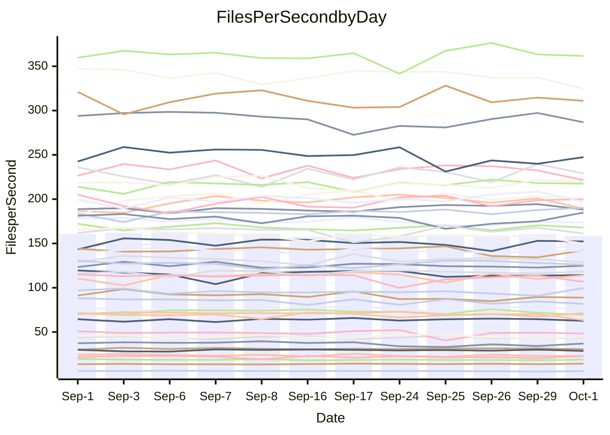

<!---
# This file is auto-generated. Do not edit.
# cspell:disable
--->
# Performance Report

## Daily Performance

## Time to Process Files

| Repository                                      | Elapsed | Min/Avg/Max           |   SD | SD Graph                |
| ----------------------------------------------- | ------: | :-------------------: | ---: | ----------------------- |
| AdaDoom3/AdaDoom3                    |    3.57 | 3.4 /   3.5 /   4.5   | 0.27 | `    ┣━━┻━━●━━┻━━┫    ` |
| alexiosc/megistos                    |    8.57 | 7.5 /   7.9 /   8.3   | 0.22 | `    ┣━━┻━━╋━━┻━━┫ ●  ` |
| apollographql/apollo-server          |    2.99 | 2.6 /   2.8 /   3.0   | 0.12 | `    ┣━━┻━━╋━━┻━●┫    ` |
| aspnetboilerplate/aspnetboilerplate  |   10.67 | 10.2 /  10.5 /  11.1  | 0.23 | `    ┣━━┻━━╋━●┻━━┫    ` |
| aws-amplify/docs                     |   12.52 | 12.7 /  13.3 /  14.2  | 0.43 | `    ┣●━┻━━╋━━┻━━┫    ` |
| Azure/azure-rest-api-specs           |    9.90 | 9.4 /   9.8 /  10.6   | 0.32 | `    ┣━━┻━━╋●━┻━━┫    ` |
| bitjson/typescript-starter           |    1.05 | 1.0 /   1.1 /   1.1   | 0.03 | `     ┣━●┻━╋━┻━━┫     ` |
| caddyserver/caddy                    |    3.88 | 3.6 /   3.8 /   4.0   | 0.13 | `    ┣━━┻━━╋━━●━━┫    ` |
| canada-ca/open-source-logiciel-libre |    1.23 | 1.1 /   1.2 /   1.3   | 0.06 | `     ┣━┻━━╋━━●━┫     ` |
| chef/chef                            |    6.04 | 5.8 /   6.0 /   6.4   | 0.16 | `    ┣━━┻━━●━━┻━━┫    ` |
| dart-lang/sdk                        |   73.15 | 64.5 /  67.3 /  73.0  | 1.84 | `   ┣━━━┻━━╋━━┻━━━┫  ●` |
| django/django                        |   15.02 | 15.0 /  15.5 /  16.4  | 0.36 | `    ┣━●┻━━╋━━┻━━┫    ` |
| eslint/eslint                        |   11.50 | 10.8 /  11.1 /  11.8  | 0.25 | `    ┣━━┻━━╋━━┻━●┫    ` |
| exonum/exonum                        |    3.63 | 3.6 /   3.7 /   4.1   | 0.13 | `    ┣━━┻●━╋━━┻━━┫    ` |
| flutter/samples                      |   16.84 | 16.3 /  17.0 /  18.6  | 0.55 | `    ┣━━┻━●╋━━┻━━┫    ` |
| gitbucket/gitbucket                  |    3.67 | 3.5 /   3.6 /   4.0   | 0.16 | `    ┣━━┻━━╋●━┻━━┫    ` |
| googleapis/google-cloud-cpp          |  142.49 | 139.0 / 147.0 / 163.3 | 5.16 | `  ┣━━━●━━━╋━━━┻━━━┫  ` |
| graphql/express-graphql              |    1.15 | 1.1 /   1.2 /   1.4   | 0.06 | `     ┣━┻●━╋━━┻━┫     ` |
| graphql/graphql-js                   |    2.88 | 2.7 /   2.9 /   3.1   | 0.09 | `     ┣━┻━●╋━━┻━┫     ` |
| graphql/graphql-relay-js             |    1.28 | 1.1 /   1.2 /   1.3   | 0.06 | `     ┣━┻━━╋━━┻━●     ` |
| graphql/graphql-spec                 |    1.33 | 1.3 /   1.3 /   1.4   | 0.04 | `     ┣━┻━●╋━━┻━┫     ` |
| iluwatar/java-design-patterns        |   13.06 | 12.8 /  13.3 /  14.9  | 0.52 | `    ┣━━┻━●╋━━┻━━┫    ` |
| ktaranov/sqlserver-kit               |    6.99 | 6.6 /   6.9 /   7.3   | 0.17 | `    ┣━━┻━━╋━●┻━━┫    ` |
| liriliri/licia                       |    4.41 | 4.1 /   4.2 /   4.4   | 0.09 | `    ┣━━┻━━╋━━┻━●┫    ` |
| MartinThoma/LaTeX-examples           |    6.86 | 6.9 /   7.3 /   7.8   | 0.25 | `    ┣●━┻━━╋━━┻━━┫    ` |
| mdx-js/mdx                           |    2.11 | 1.9 /   2.0 /   2.3   | 0.10 | `     ┣━┻━━╋━●┻━┫     ` |
| microsoft/TypeScript-Website         |    5.86 | 5.5 /   5.8 /   6.5   | 0.22 | `    ┣━━┻━━╋●━┻━━┫    ` |
| MicrosoftDocs/PowerShell-Docs        |   27.25 | 23.3 /  24.1 /  27.1  | 0.84 | `    ┣━━┻━━╋━━┻━━┫   ●` |
| neovim/nvim-lspconfig                |    4.32 | 4.2 /   4.3 /   4.5   | 0.09 | `    ┣━━┻━●╋━━┻━━┫    ` |
| pagekit/pagekit                      |    3.69 | 3.5 /   3.7 /   4.1   | 0.12 | `    ┣━━┻━━●━━┻━━┫    ` |
| php/php-src                          |   27.41 | 25.7 /  27.1 /  29.3  | 1.10 | `   ┣━━━┻━━╋●━┻━━━┫   ` |
| plasticrake/tplink-smarthome-api     |    1.41 | 1.3 /   1.4 /   1.6   | 0.07 | `     ┣━┻━━╋●━┻━┫     ` |
| prettier/prettier                    |    7.53 | 7.0 /   7.4 /   7.9   | 0.27 | `    ┣━━┻━━╋━●┻━━┫    ` |
| pycontribs/jira                      |    1.62 | 1.5 /   1.6 /   2.0   | 0.10 | `     ┣━┻━━●━━┻━┫     ` |
| RustPython/RustPython                |    5.35 | 5.2 /   5.4 /   5.7   | 0.14 | `    ┣━━┻━●╋━━┻━━┫    ` |
| shoelace-style/shoelace              |    2.95 | 2.9 /   3.0 /   3.1   | 0.07 | `     ┣━┻●━╋━━┻━┫     ` |
| slint-ui/slint                       |   13.62 | 12.2 /  12.8 /  14.4  | 0.58 | `    ┣━━┻━━╋━━┻●━┫    ` |
| SoftwareBrothers/admin-bro           |    2.58 | 2.5 /   2.6 /   2.7   | 0.06 | `     ┣━┻●━╋━━┻━┫     ` |
| sveltejs/svelte                      |   21.71 | 20.8 /  21.7 /  23.2  | 0.52 | `   ┣━━━┻━━●━━┻━━━┫   ` |
| TheAlgorithms/Python                 |    6.62 | 5.7 /   6.0 /   6.3   | 0.17 | `     ┣━┻━━╋━━┻━┫    ●` |
| twbs/bootstrap                       |    1.85 | 1.8 /   1.9 /   2.0   | 0.05 | `     ┣━┻━━●━━┻━┫     ` |
| typescript-cheatsheets/react         |    1.43 | 1.3 /   1.4 /   1.6   | 0.07 | `     ┣━┻━━●━━┻━┫     ` |
| typescript-eslint/typescript-eslint  |    4.48 | 4.3 /   4.4 /   4.7   | 0.13 | `    ┣━━┻━━╋━●┻━━┫    ` |
| vitest-dev/vitest                    |   10.05 | 9.2 /   9.8 /  12.0   | 0.72 | `    ┣━━┻━━╋●━┻━━┫    ` |
| w3c/aria-practices                   |    3.49 | 3.4 /   3.5 /   3.8   | 0.10 | `    ┣━━┻━●╋━━┻━━┫    ` |
| w3c/specberus                        |    1.96 | 2.0 /   2.1 /   2.2   | 0.05 | `   ● ┣━┻━━╋━━┻━┫     ` |
| webdeveric/webpack-assets-manifest   |    1.25 | 1.2 /   1.2 /   1.3   | 0.04 | `     ┣━┻━━╋●━┻━┫     ` |
| webpack/webpack                      |    5.66 | 5.3 /   5.7 /   6.1   | 0.21 | `    ┣━━┻━━●━━┻━━┫    ` |
| wireapp/wire-desktop                 |    1.39 | 1.3 /   1.4 /   1.4   | 0.03 | `     ┣━┻━━╋●━┻━┫     ` |
| wireapp/wire-webapp                  |   11.59 | 10.8 /  11.2 /  12.1  | 0.34 | `    ┣━━┻━━╋━━┻●━┫    ` |

Note:
- Elapsed time is in seconds.

## Files per Second over Time

| Repository                                      | Files |    Sec |    Fps |     Rel | Trend Fps            |    N |
| ----------------------------------------------- | ----: | -----: | -----: | ------: | -------------------- | ---: |
| AdaDoom3/AdaDoom3                    |   103 |   3.57 |  28.87 |  -1.54% | `█▆█▂███▇███▇▇▆██▆▇` |   17 |
| alexiosc/megistos                    |   583 |   8.57 |  68.03 |  -7.41% | `▅▄▇▆▇▆▇▆█▆▆▆▄█▇▅▅▃` |   17 |
| apollographql/apollo-server          |   252 |   2.99 |  84.23 |  -7.35% | `▆█▆▆▆▄▇▆▅▆▇▄▅▄▃▅▆▄` |   17 |
| aspnetboilerplate/aspnetboilerplate  |  2286 |  10.67 | 214.17 |  -1.44% | `▆▅▇▇█▇▇▆▆█▅▇▆▇█▇▇▆` |   17 |
| aws-amplify/docs                     |  2871 |  12.52 | 229.24 |   5.74% | `▆▆▇▄▇▇██▅▆▅▆▆▆▄▇▅█` |   17 |
| Azure/azure-rest-api-specs           |  2442 |   9.90 | 246.61 |  -1.09% | `▆█▇▇▇████▆▇█▄▅▆▅▇▆` |   17 |
| bitjson/typescript-starter           |    20 |   1.05 |  19.13 |   2.68% | `█▆▆▆▆▆▆▇▄▆▆▆▆▆▅▅▆▇` |   17 |
| caddyserver/caddy                    |   286 |   3.88 |  73.65 |  -2.97% | `█▆▅▆▇▅█▄███▇▄█▇█▇▆` |   17 |
| canada-ca/open-source-logiciel-libre |     7 |   1.23 |   5.71 |  -4.64% | `▇▇████▇▇█▃█▇▇▄▆▃▇▅` |   17 |
| chef/chef                            |  1207 |   6.04 | 199.73 |  -0.20% | `▆▄█▇▆▇▄▇▇▆▆▆▆█▇█▅▆` |   17 |
| dart-lang/sdk                        | 10563 |  73.15 | 144.39 |  -9.51% | `██▇▆█▆▇▆▆▄▇▆▆▆▆▆▅▃` |   17 |
| django/django                        |  2876 |  15.02 | 191.46 |   3.65% | `▆▄▆▇██▆▇▆▆▇▇▇▅▇▇██` |   17 |
| eslint/eslint                        |  2093 |  11.50 | 181.96 |  -3.86% | `▇▇▄▆▇▇▇▇▆▇▆▇██▇██▅` |   17 |
| exonum/exonum                        |   421 |   3.63 | 116.08 |   2.98% | `▆▄▇▇▇▇▆▇▇▆█▇▄█▇▆▆█` |   17 |
| flutter/samples                      |  2400 |  16.84 | 142.55 |   0.58% | `▇▇▆█▆▇██▇▇▇██▄▇▅▇▇` |   17 |
| gitbucket/gitbucket                  |   413 |   3.67 | 112.69 |  -1.71% | `█▇█▅█▄▄▇█▇██▆▇▆▆▇▆` |   17 |
| googleapis/google-cloud-cpp          | 20771 | 142.49 | 145.77 |   3.14% | `▆▇█▆█▇▆▇▃▇▇▆▆▆▆▆▆▇` |   17 |
| graphql/express-graphql              |    26 |   1.15 |  22.70 |   2.93% | `▆▇▇▇▇▆▇▃▆█▅▇▅▅▆▄▇▇` |   17 |
| graphql/graphql-js                   |   364 |   2.88 | 126.41 |   1.16% | `▆▇▄▆▇█▆▅▅▆▇▆▆▅▇▅▆▆` |   17 |
| graphql/graphql-relay-js             |    28 |   1.28 |  21.91 |  -8.07% | `▇█▇▆█▆▅▇▃▆█▅▄▇▆▅▆▄` |   17 |
| graphql/graphql-spec                 |    19 |   1.33 |  14.31 |   3.36% | `▆▇▄▇▇▆▆▅█▅█▇▇██▆██` |   17 |
| iluwatar/java-design-patterns        |  1992 |  13.06 | 152.56 |   1.47% | `▅█▇██▅▇███▇▇▇▇▃█▇▇` |   17 |
| ktaranov/sqlserver-kit               |   489 |   6.99 |  69.96 |  -1.62% | `▆▇▆▇██▅▇▆▇▇█▅▅▇▄▇▆` |   17 |
| liriliri/licia                       |  1437 |   4.41 | 325.51 |  -3.91% | `██▇▇▆▇█▆▅████▇▆▇▅▅` |   17 |
| MartinThoma/LaTeX-examples           |  1409 |   6.86 | 205.30 |   5.80% | `█▆▄▄▅▆▇█▆▅▅██▆▅▇▆█` |   17 |
| mdx-js/mdx                           |   141 |   2.11 |  66.98 |  -2.82% | `▇▆▆▆▆▆▇▅▆█▇▅▆▇▆▇▃▅` |   17 |
| microsoft/TypeScript-Website         |   761 |   5.86 | 129.82 |  -1.39% | `▆██▇▇▇▇▆▇▃█▆▇▆█▇▆▆` |   17 |
| MicrosoftDocs/PowerShell-Docs        |  2708 |  27.25 |  99.38 | -11.70% | `█▇▇██▆█▇█▇▇▃▆▇▇▇█▃` |   17 |
| neovim/nvim-lspconfig                |   761 |   4.32 | 176.30 |   0.94% | `██▇▆█▇█▆▇▇█▇▆▅▆▇▆▇` |   17 |
| pagekit/pagekit                      |   741 |   3.69 | 200.95 |  -0.29% | `▄▆▇█▇█▇▆█▇█▆█▆▇▇▇▇` |   17 |
| php/php-src                          |  2299 |  27.41 |  83.88 |  -0.82% | `█▇▇▇█▇▆▇▆▄▇▅▇▆▄▆▄▆` |   17 |
| plasticrake/tplink-smarthome-api     |    62 |   1.41 |  43.95 |  -1.43% | `▇▇▃▆▆▆▆██▄▅█▇▇▅▅▆▆` |   17 |
| prettier/prettier                    |  2334 |   7.53 | 310.08 |  -0.71% | `▇▄▆▄█▆██▆▆▅▅█▄█▇▆▆` |   17 |
| pycontribs/jira                      |    79 |   1.62 |  48.72 |  -0.30% | `▇▇▇█▆▆█▆▆▆██▂▆▇▇▆▆` |   17 |
| RustPython/RustPython                |   687 |   5.35 | 128.51 |   1.20% | `▇▆▇▇▇▇▆▄▅▆▅▆▇█▆▇▅▇` |   17 |
| shoelace-style/shoelace              |   439 |   2.95 | 148.98 |   1.98% | `▆██▆█▇▅▆▇▇▅█▅▆▇▅█▇` |   17 |
| slint-ui/slint                       |  2517 |  13.62 | 184.85 |   3.97% | `▇█▇▇▆▇█▅▇█▇▇▄▆▅▆██` |   17 |
| SoftwareBrothers/admin-bro           |   441 |   2.58 | 171.25 |   1.92% | `█▆▇▇▆▇█▆▅▇▆▆▇▅▇▇▆▇` |   17 |
| sveltejs/svelte                      |  7932 |  21.71 | 365.41 |   0.65% | `▆▇▇▆▆▆▇▆▆▅▆▄▇█▇▆▆▆` |   17 |
| TheAlgorithms/Python                 |  1396 |   6.62 | 210.73 | -10.17% | `▅▇▅█▅██▄▇▇▄▆▇▇▆▆▆▂` |   17 |
| twbs/bootstrap                       |   118 |   1.85 |  63.75 |  -0.08% | `▇▅▆█▇▇▄▇▆▇█▆▇▇█▇▅▇` |   17 |
| typescript-cheatsheets/react         |    53 |   1.43 |  37.12 |   0.31% | `▆▇▇▇▇█▆█▇▆▇▄▃▅▆▄▆▆` |   17 |
| typescript-eslint/typescript-eslint  |  1279 |   4.48 | 285.79 |  -1.98% | `▇██████▇▆█▄▆▅▆██▆▆` |   17 |
| vitest-dev/vitest                    |  2221 |  10.05 | 220.99 |  -2.51% | `█▇▇▂█▆█▅▇█▆█▇▄███▆` |   17 |
| w3c/aria-practices                   |   414 |   3.49 | 118.57 |   1.77% | `▇▇▄▇▅▇█▇▆▆██▇█▆▇▇▇` |   17 |
| w3c/specberus                        |   198 |   1.96 | 101.23 |   6.58% | `▆▇▅▅▄▆▆▆▆▆▆▆▆▄▆▄▇█` |   17 |
| webdeveric/webpack-assets-manifest   |    54 |   1.25 |  43.15 |  -1.32% | `▆▇▇▅▄▄▄▇▇▇▅▆█▅▅▆▆▅` |   17 |
| webpack/webpack                      |  1113 |   5.66 | 196.48 |   0.08% | `▄▄▇▅▆▆█▆▆▆▇▇▇▅▇▇▄▆` |   17 |
| wireapp/wire-desktop                 |    43 |   1.39 |  30.96 |  -0.71% | `▅▇▆▄▇▆█▆▅▆▆▅▇▆▇▇▅▆` |   17 |
| wireapp/wire-webapp                  |  1835 |  11.59 | 158.28 |  -3.70% | `▆▇▇▇▇▇█▇▇▇▄▅██▅█▇▅` |   17 |

## Data Throughput

| Repository                                      | Files |    Sec |     Kps |     Rel | Trend Kps            |    N |
| ----------------------------------------------- | ----: | -----: | ------: | ------: | -------------------- | ---: |
| AdaDoom3/AdaDoom3                    |   103 |   3.57 |  613.60 |  -1.54% | `█▆█▂███▇███▇▇▆██▆▇` |   17 |
| alexiosc/megistos                    |   583 |   8.57 |  534.59 |  -7.41% | `▅▄▇▆▇▆▇▆█▆▆▆▄█▇▅▅▃` |   17 |
| apollographql/apollo-server          |   252 |   2.99 |  677.52 |  -7.35% | `▆█▆▆▆▄▇▆▅▆▇▄▅▄▃▅▆▄` |   17 |
| aspnetboilerplate/aspnetboilerplate  |  2286 |  10.67 |  521.08 |  -1.44% | `▆▅▇▇█▇▇▆▆█▅▇▆▇█▇▇▆` |   17 |
| aws-amplify/docs                     |  2871 |  12.52 |  800.45 |   5.74% | `▆▆▇▄▇▇██▅▆▅▆▆▆▄▇▅█` |   17 |
| Azure/azure-rest-api-specs           |  2442 |   9.90 |  651.87 |  -1.09% | `▆█▇█▇██▇▇▅▆█▄▅▆▅▆▆` |   17 |
| bitjson/typescript-starter           |    20 |   1.05 |   76.53 |   2.68% | `█▆▆▆▆▆▆▇▄▆▆▆▆▆▅▅▆▇` |   17 |
| caddyserver/caddy                    |   286 |   3.88 |  630.17 |  -2.80% | `█▆▅▆▇▅█▄███▇▄█▇█▇▆` |   17 |
| canada-ca/open-source-logiciel-libre |     7 |   1.23 |   47.31 |  -4.64% | `▇▇████▇▇█▃█▇▇▄▆▃▇▅` |   17 |
| chef/chef                            |  1207 |   6.04 |  921.38 |  -0.29% | `▆▄█▇▆▇▄▇▇▇▆▇▆█▇█▅▆` |   17 |
| dart-lang/sdk                        | 10563 |  73.15 |  990.85 |  -8.93% | `██▇▆█▆▇▆▆▄▇▆▇▆▆▆▆▃` |   17 |
| django/django                        |  2876 |  15.02 | 1199.80 |   3.61% | `▆▄▆▇██▆▇▆▆▇▇▇▅▇▇██` |   17 |
| eslint/eslint                        |  2093 |  11.50 | 1311.29 |  -4.12% | `▇▇▅▆▇█▇▇▅▇▆▇██▇██▅` |   17 |
| exonum/exonum                        |   421 |   3.63 | 1110.30 |   2.98% | `▆▄▇▇▇▇▆▇▇▆█▇▄█▇▆▆█` |   17 |
| flutter/samples                      |  2400 |  16.84 | 1272.05 |   0.58% | `▇▇▆█▆▇██▇▇▇██▄▇▅▇▇` |   17 |
| gitbucket/gitbucket                  |   413 |   3.67 |  512.41 |  -1.66% | `█▇█▅█▄▄▇█▇██▆▇▆▆▇▆` |   17 |
| googleapis/google-cloud-cpp          | 20771 | 142.49 | 1182.82 |   3.35% | `▆▇█▆█▇▆▇▃█▇▇▆▆▆▆▆█` |   17 |
| graphql/express-graphql              |    26 |   1.15 |  103.90 |   2.93% | `▆▇▇▇▇▆▇▃▆█▅▇▅▅▆▄▇▇` |   17 |
| graphql/graphql-js                   |   364 |   2.88 |  726.53 |   1.16% | `▆▇▄▆▇█▆▅▅▆▇▆▆▅▇▅▆▆` |   17 |
| graphql/graphql-relay-js             |    28 |   1.28 |   86.07 |  -8.07% | `▇█▇▆█▆▅▇▃▆█▅▄▇▆▅▆▄` |   17 |
| graphql/graphql-spec                 |    19 |   1.33 |  477.51 |   4.25% | `▆▇▄▇▆▆▅▆█▅█▇▇██▇██` |   17 |
| iluwatar/java-design-patterns        |  1992 |  13.06 |  471.53 |   1.47% | `▅█▇██▅▇███▇▇▇▇▃█▇▇` |   17 |
| ktaranov/sqlserver-kit               |   489 |   6.99 | 1059.20 |  -1.62% | `▆▇▆▇██▅▇▆▇▇█▅▅▇▄▇▆` |   17 |
| liriliri/licia                       |  1437 |   4.41 |  387.80 |  -3.91% | `██▇▇▆▇█▆▅████▇▆▇▅▅` |   17 |
| MartinThoma/LaTeX-examples           |  1409 |   6.86 |  424.00 |   5.80% | `█▆▄▄▅▆▇█▆▅▅██▆▅▇▆█` |   17 |
| mdx-js/mdx                           |   141 |   2.11 |  311.64 |  -2.82% | `▇▆▆▆▆▆▇▅▆█▇▅▆▇▆▇▃▅` |   17 |
| microsoft/TypeScript-Website         |   761 |   5.86 |  897.79 |  -1.39% | `▆██▇▇▇▇▆▇▃█▆▇▆█▇▆▆` |   17 |
| MicrosoftDocs/PowerShell-Docs        |  2708 |  27.25 | 1022.40 | -11.67% | `█▇▇██▆█▇█▇▇▃▆▇▇▇█▃` |   17 |
| neovim/nvim-lspconfig                |   761 |   4.32 |  292.59 |   1.49% | `██▇▅▇▇█▆▇▇█▇▆▅▆▇▆█` |   17 |
| pagekit/pagekit                      |   741 |   3.69 |  418.98 |  -0.29% | `▄▆▇█▇█▇▆█▇█▆█▆▇▇▇▇` |   17 |
| php/php-src                          |  2299 |  27.41 | 1457.13 |  -0.94% | `█▇▇▇█▇▆▇▆▄▇▅▇▆▄▆▄▆` |   17 |
| plasticrake/tplink-smarthome-api     |    62 |   1.41 |  237.47 |  -1.43% | `▇▇▃▆▆▆▆██▄▅█▇▇▅▅▆▆` |   17 |
| prettier/prettier                    |  2334 |   7.53 |  435.10 |  -1.52% | `▇▄▆▄█▆██▆▆▅▅█▄▇▆▆▆` |   17 |
| pycontribs/jira                      |    79 |   1.62 |  345.35 |  -0.30% | `▇▇▇█▆▆█▆▆▆██▂▆▇▇▆▆` |   17 |
| RustPython/RustPython                |   687 |   5.35 | 1014.97 |   1.43% | `▇▆▆▆▇▇▆▄▅▆▅▆▇█▆▇▅▇` |   17 |
| shoelace-style/shoelace              |   439 |   2.95 |  719.79 |   1.98% | `▆██▆█▇▅▆▇▇▅█▅▆▇▅█▇` |   17 |
| slint-ui/slint                       |  2517 |  13.62 | 1137.66 |  -1.37% | `███▇▆▇█▆▇██▇▄▆▅▄▆▆` |   17 |
| SoftwareBrothers/admin-bro           |   441 |   2.58 |  377.45 |   1.92% | `█▆▇▇▆▇█▆▅▇▆▆▇▅▇▇▆▇` |   17 |
| sveltejs/svelte                      |  7932 |  21.71 |  244.39 |   0.62% | `▆▇▇▆▆▆▇▆▆▅▆▄▇█▇▆▆▆` |   17 |
| TheAlgorithms/Python                 |  1396 |   6.62 |  535.73 | -10.13% | `▅▇▅█▅██▄▇▇▅▆▇▇▆▆▆▂` |   17 |
| twbs/bootstrap                       |   118 |   1.85 |  522.94 |  -0.08% | `▇▅▆█▇▇▄▇▆▇█▆▇▇█▇▅▇` |   17 |
| typescript-cheatsheets/react         |    53 |   1.43 |  274.55 |   0.31% | `▆▇▇▇▇█▆█▇▆▇▄▃▅▆▄▆▆` |   17 |
| typescript-eslint/typescript-eslint  |  1279 |   4.48 | 1463.58 |  -1.79% | `▇██████▇▆█▄▆▆▆██▆▆` |   17 |
| vitest-dev/vitest                    |  2221 |  10.05 |  500.79 |  -1.72% | `▇▆▇▂█▆█▅▇█▆█▇▄███▆` |   17 |
| w3c/aria-practices                   |   414 |   3.49 | 1105.47 |   1.91% | `▇▇▄▇▅▇█▇▆▆▇█▇█▆▇▇█` |   17 |
| w3c/specberus                        |   198 |   1.96 |  318.00 |   6.58% | `▆▇▅▅▄▆▆▆▆▆▆▆▆▄▆▄▇█` |   17 |
| webdeveric/webpack-assets-manifest   |    54 |   1.25 |  101.48 |  -1.32% | `▆▇▇▅▄▄▄▇▇▇▅▆█▅▅▆▆▅` |   17 |
| webpack/webpack                      |  1113 |   5.66 |  896.41 |   0.58% | `▄▄▆▅▆▆█▆▆▆▇▇▇▅▆▇▄▆` |   17 |
| wireapp/wire-desktop                 |    43 |   1.39 |  143.27 |   2.29% | `▄▆▅▄▆▅▇▅▄▅▅▆█▇█▇▆▇` |   17 |
| wireapp/wire-webapp                  |  1835 |  11.59 |  568.87 |  -3.34% | `▆▇▇▇▇▇▇▇▇▇▄▅██▅█▇▆` |   17 |

