<!---
# This file is auto-generated. Do not edit.
# cspell:disable
--->
# Performance Report

## Daily Performance

```mermaid
xychart-beta
    title Files Per Second by Day
    y-axis Files per Second
    x-axis Date [Aug-8, Aug-11, Aug-12, Aug-13, Aug-18, Aug-19, Aug-20, Aug-21, Aug-22, Aug-25, Aug-29, Aug-30, Aug-31, Sep-1, Sep-3, Sep-6, Sep-7]
    bar [159.78, 161.87, 161.59, 160.12, 160.00, 162.54, 160.82, 162.11, 163.20, 161.31, 162.91, 160.67, 162.16, 160.72, 161.93, 162.34, 161.56]
    line [22.54, 19.07, 18.54, 16.95, 19.10, 18.27, 18.74, 19.65, 18.80, 18.62, 18.45, 19.29, 19.08, 19.71, 18.88, 18.65, 18.65]
    line [116.33, 116.04, 112.64, 113.43, 119.19, 111.93, 114.00, 116.17, 114.97, 113.11, 118.41, 118.01, 115.40, 119.50, 117.17, 114.93, 104.04]
    line [209.23, 208.13, 206.12, 205.21, 210.46, 206.31, 208.96, 205.28, 201.48, 191.68, 200.76, 205.32, 205.73, 181.85, 198.01, 203.39, 206.55]
    line [29.03, 29.67, 29.60, 30.33, 30.62, 30.06, 30.32, 30.71, 30.33, 30.41, 30.59, 30.45, 30.07, 29.95, 28.16, 27.92, 30.43]
    line [126.61, 126.72, 128.04, 119.05, 131.02, 129.61, 123.08, 132.18, 124.93, 128.24, 131.60, 124.76, 128.19, 130.51, 127.29, 128.13, 127.03]
    line [73.53, 74.78, 72.96, 75.57, 72.13, 74.31, 76.20, 74.98, 75.32, 73.98, 74.92, 67.44, 74.93, 71.42, 69.97, 74.43, 74.58]
    line [211.22, 214.76, 212.79, 213.14, 217.00, 221.94, 220.45, 225.30, 218.11, 225.16, 221.13, 216.69, 219.64, 218.57, 218.78, 215.63, 224.82]
    line [87.82, 77.70, 75.58, 76.94, 80.70, 76.26, 76.41, 76.73, 75.85, 74.38, 75.85, 75.82, 63.83, 64.49, 61.65, 64.50, 61.26]
    line [85.77, 84.48, 86.21, 84.78, 87.25, 83.34, 85.16, 86.61, 89.19, 84.30, 84.25, 86.47, 88.91, 88.27, 86.74, 86.90, 85.78]
    line [319.60, 305.87, 304.71, 313.08, 324.40, 300.37, 304.78, 324.68, 308.60, 296.98, 324.16, 313.60, 308.04, 321.08, 295.70, 309.43, 319.09]
    line [308.97, 296.59, 300.81, 290.46, 298.69, 294.82, 300.68, 286.71, 300.74, 302.95, 303.29, 287.37, 286.48, 293.90, 297.13, 298.52, 297.48]
    line [254.83, 253.26, 251.44, 230.32, 252.21, 237.84, 238.36, 257.03, 248.15, 250.39, 258.39, 253.25, 236.21, 242.44, 258.87, 252.44, 256.07]
    line [183.70, 188.70, 193.07, 183.50, 178.10, 183.95, 192.12, 193.67, 185.05, 182.38, 185.55, 193.26, 183.54, 188.75, 189.86, 184.03, 189.81]
    line [104.69, 93.74, 97.45, 98.22, 96.65, 95.35, 92.84, 95.49, 96.50, 97.40, 93.72, 97.65, 96.80, 96.99, 99.11, 93.19, 96.28]
    line [139.04, 152.86, 154.13, 144.07, 152.10, 146.68, 148.87, 153.90, 141.45, 150.06, 146.03, 152.71, 150.80, 143.28, 155.69, 153.87, 147.46]
    line [104.34, 135.34, 130.97, 132.26, 136.82, 135.16, 130.52, 133.31, 131.34, 132.85, 130.95, 124.42, 129.63, 128.97, 135.94, 133.80, 132.37]
    line [45.66, 38.22, 37.79, 38.23, 41.09, 41.54, 38.59, 41.99, 40.85, 39.81, 40.28, 41.27, 31.95, 30.26, 32.20, 30.88, 32.09]
    line [78.66, 78.35, 77.65, 75.86, 77.65, 74.07, 76.09, 68.93, 73.13, 75.35, 74.03, 75.97, 71.20, 78.69, 74.68, 74.33, 75.84]
    line [182.66, 171.17, 182.41, 178.32, 178.57, 176.08, 180.57, 179.89, 180.99, 176.89, 156.76, 164.43, 180.88, 181.23, 183.21, 177.43, 180.28]
    line [195.89, 203.57, 199.20, 201.23, 200.81, 196.78, 192.62, 201.64, 203.42, 203.18, 198.91, 200.77, 202.09, 205.14, 192.22, 184.22, 194.88]
    line [7.47, 6.09, 6.22, 6.12, 6.05, 6.23, 6.09, 6.02, 6.19, 6.02, 6.20, 6.04, 6.23, 6.06, 6.09, 6.20, 6.14]
    line [18.37, 15.99, 15.64, 15.11, 15.67, 15.78, 15.86, 15.35, 15.70, 15.41, 15.75, 15.00, 11.10, 13.64, 14.09, 13.63, 13.57]
    line [231.94, 225.75, 230.29, 219.53, 238.65, 216.52, 236.75, 225.24, 241.21, 236.60, 228.23, 232.86, 232.26, 235.92, 225.53, 217.15, 227.16]
    line [135.23, 122.44, 127.81, 121.17, 124.81, 124.18, 125.47, 127.40, 124.91, 126.98, 128.83, 125.51, 130.73, 123.39, 129.29, 124.27, 129.39]
    line [120.85, 115.35, 116.69, 115.74, 111.39, 116.78, 113.71, 117.01, 115.75, 116.08, 119.18, 113.59, 115.52, 110.36, 102.65, 114.46, 112.83]
    line [27.00, 22.24, 23.36, 22.81, 24.23, 23.27, 23.59, 24.08, 23.43, 23.40, 22.23, 21.90, 22.46, 21.60, 23.03, 22.85, 22.27]
    line [355.56, 335.17, 325.27, 335.20, 340.52, 346.23, 347.14, 347.41, 338.20, 333.97, 334.12, 345.07, 342.66, 347.17, 346.14, 336.60, 342.41]
    line [151.10, 147.11, 146.86, 146.10, 136.12, 147.29, 144.63, 149.12, 128.33, 145.05, 141.62, 149.48, 142.85, 145.28, 149.46, 148.18, 143.83]
    line [27.59, 24.33, 24.19, 23.40, 25.07, 24.48, 24.64, 22.11, 24.14, 24.67, 21.16, 23.95, 23.30, 24.27, 25.24, 24.42, 23.30]
    line [128.17, 119.97, 117.10, 115.21, 121.90, 112.74, 115.76, 112.80, 115.24, 121.46, 118.37, 119.80, 115.33, 116.38, 118.04, 111.85, 119.40]
    line [362.02, 369.62, 366.45, 360.63, 368.14, 348.34, 354.65, 368.47, 364.63, 360.14, 369.32, 367.60, 361.65, 359.68, 367.46, 363.32, 365.30]
    line [166.07, 194.86, 199.17, 196.17, 191.14, 199.41, 198.71, 204.15, 203.44, 198.55, 195.50, 193.96, 199.31, 199.53, 189.39, 201.97, 197.12]
    line [48.90, 45.53, 44.69, 45.18, 40.85, 44.70, 45.09, 43.47, 44.07, 43.94, 43.35, 43.55, 44.33, 43.81, 45.60, 43.01, 41.97]
    line [173.47, 171.46, 176.49, 170.50, 172.92, 180.52, 178.78, 177.41, 175.76, 170.70, 175.74, 172.74, 175.87, 178.56, 179.08, 174.59, 177.44]
    line [96.32, 95.66, 97.25, 93.41, 90.83, 93.92, 83.91, 92.53, 93.93, 91.70, 90.17, 94.03, 90.40, 91.22, 98.55, 92.55, 91.52]
    line [73.32, 70.77, 69.86, 70.01, 73.04, 72.36, 70.62, 73.83, 67.67, 69.68, 72.12, 68.00, 70.47, 70.89, 69.29, 68.94, 69.89]
    line [157.48, 162.05, 151.08, 164.19, 163.52, 165.17, 164.35, 169.78, 168.65, 165.26, 166.00, 163.99, 156.90, 161.76, 167.23, 165.73, 167.27]
    line [202.61, 193.89, 195.05, 196.60, 192.32, 200.16, 188.13, 196.57, 202.87, 192.16, 197.82, 199.85, 197.57, 186.50, 184.53, 195.23, 203.47]
    line [51.68, 50.89, 50.88, 50.22, 49.59, 50.25, 50.03, 48.40, 49.47, 50.47, 51.15, 52.21, 48.60, 50.89, 48.97, 49.35, 49.58]
    line [38.18, 37.54, 37.60, 36.71, 36.51, 39.25, 38.04, 36.06, 37.72, 38.63, 38.79, 37.24, 37.32, 37.33, 38.42, 37.82, 37.98]
    line [131.06, 143.98, 142.41, 148.62, 143.28, 139.37, 140.53, 139.04, 144.69, 138.65, 139.89, 133.31, 145.80, 144.08, 140.79, 141.02, 143.66]
    line [98.38, 112.00, 114.17, 108.57, 100.66, 108.77, 112.72, 106.20, 114.85, 112.98, 112.47, 111.83, 109.19, 115.12, 112.97, 114.35, 112.51]
    line [218.55, 218.05, 216.13, 212.80, 213.27, 214.61, 217.28, 213.25, 217.17, 212.77, 217.16, 219.42, 220.41, 214.04, 205.97, 219.44, 217.73]
    line [181.75, 171.06, 170.80, 168.18, 172.80, 168.69, 156.73, 170.52, 169.10, 161.12, 170.94, 170.42, 165.85, 172.14, 164.57, 168.71, 172.84]
    line [49.80, 44.85, 44.73, 46.28, 42.85, 47.12, 44.69, 45.57, 45.49, 44.61, 45.50, 46.05, 46.44, 45.45, 46.41, 42.91, 44.10]
    line [71.64, 71.63, 73.23, 72.55, 71.44, 73.71, 74.27, 72.25, 73.30, 71.82, 72.99, 72.24, 73.05, 70.19, 72.55, 71.94, 71.15]
    line [234.59, 230.11, 226.13, 243.15, 239.31, 234.89, 241.23, 236.06, 238.56, 223.75, 237.91, 239.06, 235.45, 226.56, 239.54, 233.61, 243.66]
    line [178.30, 186.48, 183.29, 179.27, 181.07, 184.49, 180.99, 187.99, 183.89, 182.41, 184.77, 186.94, 187.25, 183.77, 174.20, 186.05, 185.31]
    line [152.64, 157.58, 166.90, 158.63, 158.95, 166.31, 162.23, 164.91, 160.87, 154.07, 164.02, 158.84, 162.35, 165.15, 167.75, 162.42, 161.26]
    line [146.35, 145.37, 140.27, 142.62, 139.83, 147.55, 141.21, 140.96, 145.89, 146.30, 146.55, 142.25, 144.70, 138.76, 142.53, 146.03, 141.67]
```

## Time to Process Files

| Repository                                      | Elapsed | Min/Avg/Max           |   SD | SD Graph                |
| ----------------------------------------------- | ------: | :-------------------: | ---: | ----------------------- |
| AdaDoom3/AdaDoom3                    |    3.42 | 3.3 /   3.5 /   4.5   | 0.21 | `    ┣━━┻━●╋━━┻━━┫    ` |
| alexiosc/megistos                    |    7.77 | 7.5 /   7.9 /   9.4   | 0.40 | `    ┣━━┻━●╋━━┻━━┫    ` |
| apollographql/apollo-server          |    2.62 | 2.6 /   2.7 /   3.3   | 0.15 | `    ┣━━┻●━╋━━┻━━┫    ` |
| aspnetboilerplate/aspnetboilerplate  |   10.43 | 10.2 /  10.6 /  11.2  | 0.24 | `    ┣━━┻●━╋━━┻━━┫    ` |
| aws-amplify/docs                     |   12.70 | 12.5 /  13.2 /  14.2  | 0.39 | `    ┣━●┻━━╋━━┻━━┫    ` |
| Azure/azure-rest-api-specs           |    9.55 | 9.4 /   9.9 /  11.3   | 0.43 | `    ┣━━┻●━╋━━┻━━┫    ` |
| bitjson/typescript-starter           |    1.08 | 0.9 /   1.1 /   1.3   | 0.06 | `     ┣━┻━━╋●━┻━┫     ` |
| caddyserver/caddy                    |    3.64 | 3.6 /   3.8 /   4.3   | 0.16 | `    ┣━━●━━╋━━┻━━┫    ` |
| canada-ca/open-source-logiciel-libre |    1.15 | 0.9 /   1.1 /   1.2   | 0.04 | `     ┣━┻━━╋●━┻━┫     ` |
| chef/chef                            |    6.35 | 5.8 /   6.1 /   7.3   | 0.26 | `    ┣━━┻━━╋━●┻━━┫    ` |
| dart-lang/sdk                        |   66.21 | 63.3 /  66.9 /  70.7  | 1.90 | `  ┣━━━┻━━●╋━━━┻━━━┫  ` |
| django/django                        |   15.77 | 14.8 /  15.5 /  16.4  | 0.38 | `    ┣━━┻━━╋━●┻━━┫    ` |
| eslint/eslint                        |   11.12 | 10.6 /  11.2 /  12.1  | 0.40 | `    ┣━━┻━━●━━┻━━┫    ` |
| exonum/exonum                        |    3.79 | 3.5 /   3.7 /   4.1   | 0.13 | `    ┣━━┻━━╋━━●━━┫    ` |
| flutter/samples                      |   16.46 | 16.3 /  17.2 /  19.7  | 0.66 | `   ┣━━●┻━━╋━━┻━━━┫   ` |
| gitbucket/gitbucket                  |    3.96 | 3.4 /   3.6 /   4.0   | 0.14 | `    ┣━━┻━━╋━━┻━━┫●   ` |
| googleapis/google-cloud-cpp          |  147.01 | 136.7 / 143.7 / 155.3 | 4.70 | `  ┣━━━┻━━━╋━━●┻━━━┫  ` |
| graphql/express-graphql              |    1.16 | 1.0 /   1.1 /   1.3   | 0.05 | `     ┣━┻━━╋●━┻━┫     ` |
| graphql/graphql-js                   |    2.89 | 2.7 /   2.9 /   3.2   | 0.10 | `    ┣━━┻━━●━━┻━━┫    ` |
| graphql/graphql-relay-js             |    1.24 | 1.0 /   1.2 /   1.3   | 0.06 | `     ┣━┻━━╋━━●━┫     ` |
| graphql/graphql-spec                 |    1.33 | 0.9 /   1.1 /   1.5   | 0.15 | `     ┣━┻━━╋━━┻●┫     ` |
| iluwatar/java-design-patterns        |   13.10 | 12.6 /  13.3 /  15.2  | 0.53 | `    ┣━━┻━●╋━━┻━━┫    ` |
| ktaranov/sqlserver-kit               |    7.05 | 6.5 /   6.7 /   7.0   | 0.15 | `    ┣━━┻━━╋━━┻━━●    ` |
| liriliri/licia                       |    4.17 | 4.0 /   4.2 /   4.6   | 0.11 | `    ┣━━┻●━╋━━┻━━┫    ` |
| MartinThoma/LaTeX-examples           |    7.16 | 6.7 /   7.1 /   7.8   | 0.25 | `    ┣━━┻━━╋●━┻━━┫    ` |
| mdx-js/mdx                           |    1.99 | 1.9 /   2.0 /   2.2   | 0.07 | `     ┣━┻━●╋━━┻━┫     ` |
| microsoft/TypeScript-Website         |    5.69 | 5.5 /   5.8 /   7.3   | 0.35 | `    ┣━━┻━●╋━━┻━━┫    ` |
| MicrosoftDocs/PowerShell-Docs        |   23.67 | 23.2 /  24.4 /  27.5  | 0.96 | `   ┣━━━●━━╋━━┻━━━┫   ` |
| neovim/nvim-lspconfig                |    4.25 | 4.1 /   4.3 /   4.5   | 0.10 | `    ┣━━┻●━╋━━┻━━┫    ` |
| pagekit/pagekit                      |    3.61 | 3.5 /   3.6 /   4.1   | 0.14 | `    ┣━━┻━●╋━━┻━━┫    ` |
| php/php-src                          |   26.91 | 25.3 /  26.5 /  28.9  | 0.78 | `   ┣━━━┻━━╋━●┻━━━┫   ` |
| plasticrake/tplink-smarthome-api     |    1.39 | 1.2 /   1.4 /   1.6   | 0.05 | `     ┣━┻━━╋●━┻━┫     ` |
| prettier/prettier                    |    7.02 | 7.0 /   7.4 /   8.1   | 0.26 | `    ┣━●┻━━╋━━┻━━┫    ` |
| pycontribs/jira                      |    1.51 | 1.5 /   1.6 /   1.7   | 0.06 | `     ┣━●━━╋━━┻━┫     ` |
| RustPython/RustPython                |    5.43 | 5.1 /   5.4 /   5.8   | 0.18 | `    ┣━━┻━━╋●━┻━━┫    ` |
| shoelace-style/shoelace              |    3.12 | 2.9 /   3.0 /   3.7   | 0.15 | `    ┣━━┻━━╋━●┻━━┫    ` |
| slint-ui/slint                       |   12.30 | 12.0 /  12.7 /  15.5  | 0.77 | `   ┣━━━┻●━╋━━┻━━━┫   ` |
| SoftwareBrothers/admin-bro           |    2.53 | 2.4 /   2.6 /   3.0   | 0.10 | `    ┣━━┻●━╋━━┻━━┫    ` |
| sveltejs/svelte                      |   21.37 | 20.2 /  21.5 /  23.0  | 0.50 | `   ┣━━━┻━●╋━━┻━━━┫   ` |
| TheAlgorithms/Python                 |    5.76 | 5.6 /   5.9 /   6.9   | 0.31 | `    ┣━━┻●━╋━━┻━━┫    ` |
| twbs/bootstrap                       |    2.01 | 1.3 /   1.6 /   1.9   | 0.15 | `    ┣━━┻━━╋━━┻━━┫●   ` |
| typescript-cheatsheets/react         |    1.44 | 1.3 /   1.4 /   1.5   | 0.04 | `     ┣━┻━━╋━●┻━┫     ` |
| typescript-eslint/typescript-eslint  |    4.29 | 4.1 /   4.3 /   4.7   | 0.12 | `    ┣━━┻━●╋━━┻━━┫    ` |
| vitest-dev/vitest                    |    9.29 | 9.1 /   9.6 /  12.0   | 0.59 | `    ┣━━┻●━╋━━┻━━┫    ` |
| w3c/aria-practices                   |    3.39 | 3.2 /   3.5 /   3.8   | 0.12 | `    ┣━━┻●━╋━━┻━━┫    ` |
| w3c/specberus                        |    2.05 | 1.9 /   2.1 /   2.2   | 0.07 | `     ┣━┻━●╋━━┻━┫     ` |
| webdeveric/webpack-assets-manifest   |    1.29 | 1.1 /   1.2 /   1.3   | 0.04 | `     ┣━┻━━╋━━┻●┫     ` |
| webpack/webpack                      |    5.32 | 5.4 /   5.7 /   6.2   | 0.18 | `    ●━━┻━━╋━━┻━━┫    ` |
| wireapp/wire-desktop                 |    1.31 | 0.9 /   1.2 /   1.4   | 0.15 | `     ┣━┻━━╋━━●━┫     ` |
| wireapp/wire-webapp                  |   10.92 | 10.8 /  11.2 /  13.3  | 0.50 | `    ┣━━┻●━╋━━┻━━┫    ` |

Note:
- Elapsed time is in seconds.

## Files per Second over Time

| Repository                                      | Files |    Sec |    Fps |     Rel | Trend Fps              |    N |
| ----------------------------------------------- | ----: | -----: | -----: | ------: | ---------------------- | ---: |
| AdaDoom3/AdaDoom3                    |   103 |   3.42 |  30.12 |   0.86% | `██████▇█████▇▇▆█▂███` |   31 |
| alexiosc/megistos                    |   583 |   7.77 |  75.07 |   2.05% | `██▇▇█▆█▇█▃▃▇█▆▆▇▇█▇▇` |   31 |
| apollographql/apollo-server          |   252 |   2.62 |  96.11 |   3.47% | `▂▆▇▇▇▆▇▆█▅█▆▆▆█▇▇▆▅█` |   31 |
| aspnetboilerplate/aspnetboilerplate  |  2286 |  10.43 | 219.09 |   1.25% | `▆█▆▆▇▇▅▇▇▇█▇█▆▅▇▇█▇▇` |   31 |
| aws-amplify/docs                     |  2871 |  12.70 | 226.00 |   3.76% | `▇▆▇▆▆▇▇▇▆▆▇▅█▆▆▇▄▇▇▇` |   31 |
| Azure/azure-rest-api-specs           |  2438 |   9.55 | 255.25 |   2.84% | `▆▅█▆▇▇▇█▇█▇▆▅▆█▇█▇██` |   31 |
| bitjson/typescript-starter           |    20 |   1.08 |  18.45 |  -2.21% | `▆██▇▇▇▆▆██▇▇▇█▇▇▆▇▇▆` |   31 |
| caddyserver/caddy                    |   285 |   3.64 |  78.21 |   3.77% | `▇▇▄▅▆█▅▆█▆▆▇▃█▆▆▆▇▆█` |   31 |
| canada-ca/open-source-logiciel-libre |     7 |   1.15 |   6.08 |  -1.54% | `▇▆▆▇▇▆▆▇▆▆▆█▇▆▇▇▇█▇▆` |   31 |
| chef/chef                            |  1208 |   6.35 | 190.29 |  -3.47% | `▇▇█▇█▆█▇▇▇▅▇█▇▆█▇▇█▆` |   31 |
| dart-lang/sdk                        | 10816 |  66.21 | 163.37 |   1.31% | `▆▇▇▆▇▅▄▇▇▄▆▇▇▇█▇▆▇▆▇` |   31 |
| django/django                        |  2858 |  15.77 | 181.25 |  -1.50% | `▆▆▇▇▆▆▇▇▇▇█▇▇▆▄▆▇██▆` |   31 |
| eslint/eslint                        |  2090 |  11.12 | 187.92 |   0.27% | `█▇█▆▆▇▄▆▇▇█▄▇▇▇▅▆▇▇▇` |   31 |
| exonum/exonum                        |   421 |   3.79 | 111.10 |  -3.35% | `▆▇█▇▇▇██▇▅▇▇█▆▃▇▆▇▇▆` |   31 |
| flutter/samples                      |  2400 |  16.46 | 145.84 |   3.29% | `▆▇▆▇█▆▆▇▆▃▇███▇▆█▇▇█` |   31 |
| gitbucket/gitbucket                  |   413 |   3.96 | 104.40 |  -9.12% | `█▅▇█▆▄██▇█▇▇▇█▇█▅█▃▄` |   31 |
| googleapis/google-cloud-cpp          | 20726 | 147.01 | 140.98 |  -1.91% | `▄█▆▆█▇▇▇▇▅▆▇▇▅▆█▆█▆▆` |   31 |
| graphql/express-graphql              |    26 |   1.16 |  22.47 |  -2.35% | `▇███▇█▇▆▆▃▅▅▆▅▇▇▆▇▅▆` |   31 |
| graphql/graphql-js                   |   364 |   2.89 | 126.12 |   0.03% | `▆▆▆▆▆▆▇▇▆▆▇█▆▅▇▄▆▇█▆` |   31 |
| graphql/graphql-relay-js             |    28 |   1.24 |  22.61 |  -6.46% | `▆█▄▆▇█▇▃▆▆▇▃█▇█▇▆█▆▅` |   31 |
| graphql/graphql-spec                 |    18 |   1.33 |  13.49 | -10.12% | `██▇██▇██▅██▂▂▅▆▄▆▆▅▅` |   31 |
| iluwatar/java-design-patterns        |  1992 |  13.10 | 152.04 |   1.64% | `▆▇█▇▃▇▇▆▇█▇█▆▆█▇██▆▇` |   31 |
| ktaranov/sqlserver-kit               |   489 |   7.05 |  69.33 |  -4.42% | `██▇▇▇▅█▇█▅▇█▆▅▇▅▇█▇▅` |   31 |
| liriliri/licia                       |  1437 |   4.17 | 344.75 |   1.55% | `▇██▇▇▇▆▆█▇▇▇▇██▇▇▆▇▇` |   31 |
| MartinThoma/LaTeX-examples           |  1409 |   7.16 | 196.91 |  -0.73% | `▆▅▇▆██▆▆▇▇▆▇▇▇▅▄▃▅▅▆` |   31 |
| mdx-js/mdx                           |   141 |   1.99 |  70.88 |   0.99% | `▅██▅▆▆▇▇▅▆▅█▅▇▆▆▆▅▆▇` |   31 |
| microsoft/TypeScript-Website         |   761 |   5.69 | 133.70 |   2.12% | `▆█▇▇▇▇▇▇█▆▄█▆▇██▇█▇▇` |   31 |
| MicrosoftDocs/PowerShell-Docs        |  2708 |  23.67 | 114.43 |   2.89% | `▆█▅█▇█▇▇▆▇▇▅▇█▇▇██▆█` |   31 |
| neovim/nvim-lspconfig                |   757 |   4.25 | 178.28 |   1.89% | `▇█▇█▆▆▅▇▇▆▅▆███▇▅▇▇▇` |   31 |
| pagekit/pagekit                      |   741 |   3.61 | 205.24 |   0.65% | `██▇▇▆▇▄▇█▆██▇▃▆▇█▇█▇` |   31 |
| php/php-src                          |  2281 |  26.91 |  84.75 |  -1.57% | `▇▅▇▇█▆▆▆█▆▆█▇▇▇▇▆█▇▆` |   31 |
| plasticrake/tplink-smarthome-api     |    62 |   1.39 |  44.66 |  -1.40% | `▆▇▇▇▇▇▆▇▇█▇▇▇▇▇▃▆▆▆▆` |   31 |
| prettier/prettier                    |  2286 |   7.02 | 325.55 |   5.27% | `▅▆█▇▆▅▅█▆█▆▇▅▇▅▆▄█▇█` |   31 |
| pycontribs/jira                      |    79 |   1.51 |  52.20 |   4.02% | `▆▆▅▇▅▆▇▇█▇▇▇▃▇▅▆▇▄▄█` |   31 |
| RustPython/RustPython                |   684 |   5.43 | 125.88 |  -0.87% | `▅▆█▄▇▆██▄▇▆▇▇█▇▇▇▇▇▆` |   31 |
| shoelace-style/shoelace              |   439 |   3.12 | 140.75 |  -3.10% | `▇▇█▆▂▆█▇███▇▆▇██▇█▇▆` |   31 |
| slint-ui/slint                       |  2243 |  12.30 | 182.31 |   3.24% | `█▇▇█▇▇▇▄▆▇▃█████▇▇▇█` |   31 |
| SoftwareBrothers/admin-bro           |   441 |   2.53 | 174.24 |   3.35% | `▃▇▇█▇▅▆█▇█▇█▆█▆▇▇▇██` |   31 |
| sveltejs/svelte                      |  7828 |  21.37 | 366.36 |   0.86% | `▅▆▆▆▆▆▅▇█▆▅▆▅▆▆▇▆▅▆▆` |   31 |
| TheAlgorithms/Python                 |  1396 |   5.76 | 242.50 |   3.27% | `▇█▇▇█▇▄▇▇█▇▆█▆▇▆█▆██` |   31 |
| twbs/bootstrap                       |   118 |   2.01 |  58.82 | -20.00% | `▆█▇█▆█▅▇██▄▃▃▃▂▃▄▃▃▂` |   31 |
| typescript-cheatsheets/react         |    53 |   1.44 |  36.71 |  -2.77% | `▆▇▅█▅█▇▇▆▅▇█▄▆▇▆▆▇█▅` |   31 |
| typescript-eslint/typescript-eslint  |  1278 |   4.29 | 297.90 |   0.51% | `▇█▆▇████▆▄▇▄▇▇▇▇▇▇▇▇` |   31 |
| vitest-dev/vitest                    |  2206 |   9.29 | 237.57 |   3.93% | `██▆███▇▇▇▇▇▆█▇▆▇▂█▆█` |   31 |
| w3c/aria-practices                   |   409 |   3.39 | 120.52 |   2.88% | `▅▇▅▆▅▇█▇▇█▇▅▆▆▇▄▆▄▇▇` |   31 |
| w3c/specberus                        |   198 |   2.05 |  96.56 |   0.35% | `▇▄▆▇▇▇▇▆▇▆█▇▇▇█▆▆▅▆▇` |   31 |
| webdeveric/webpack-assets-manifest   |    54 |   1.29 |  41.85 |  -5.50% | `▇█▆▇▇▇▆▆█▆▅▇▇▇█▇▆▄▅▅` |   31 |
| webpack/webpack                      |  1117 |   5.32 | 209.97 |   7.34% | `▆▃▆▇▇▆▅▆▇▆▇▇▆▅▄▇▅▆▆█` |   31 |
| wireapp/wire-desktop                 |    43 |   1.31 |  32.83 | -12.94% | `▇▅█▇██▆▇██▇▃▃▂▃▂▂▃▃▃` |   31 |
| wireapp/wire-webapp                  |  1832 |  10.92 | 167.71 |   2.94% | `▇▇███▇▇▇██▆▆▆▇█▇▇███` |   31 |

## Data Throughput

| Repository                                      | Files |    Sec |     Kps |     Rel | Trend Kps              |    N |
| ----------------------------------------------- | ----: | -----: | ------: | ------: | ---------------------- | ---: |
| AdaDoom3/AdaDoom3                    |   103 |   3.42 |  640.09 |   0.86% | `██████▇█████▇▇▆█▂███` |   31 |
| alexiosc/megistos                    |   583 |   7.77 |  589.87 |   2.05% | `██▇▇█▆█▇█▃▃▇█▆▆▇▇█▇▇` |   31 |
| apollographql/apollo-server          |   252 |   2.62 |  773.08 |   3.47% | `▂▆▇▇▇▆▇▆█▅█▆▆▆█▇▇▆▅█` |   31 |
| aspnetboilerplate/aspnetboilerplate  |  2286 |  10.43 |  533.05 |   1.26% | `▆█▆▆▇▇▅▇▇▇█▇█▆▅▇▇█▇▇` |   31 |
| aws-amplify/docs                     |  2871 |  12.70 |  789.13 |   3.76% | `▇▆▇▆▆▇▇▇▆▆▇▅█▆▆▇▄▇▇▇` |   31 |
| Azure/azure-rest-api-specs           |  2438 |   9.55 |  677.48 |   2.77% | `▆▅█▇▇▇▇█▇█▇▆▅▆█▇█▇██` |   31 |
| bitjson/typescript-starter           |    20 |   1.08 |   73.79 |  -2.21% | `▆██▇▇▇▆▆██▇▇▇█▇▇▆▇▇▆` |   31 |
| caddyserver/caddy                    |   285 |   3.64 |  668.21 |   3.95% | `▇▇▄▅▆█▅▆█▆▆▇▃█▆▆▆▇▆█` |   31 |
| canada-ca/open-source-logiciel-libre |     7 |   1.15 |   50.39 |  -1.54% | `▇▆▆▇▇▆▆▇▆▆▆█▇▆▇▇▇█▇▆` |   31 |
| chef/chef                            |  1208 |   6.35 |  878.66 |  -3.49% | `▇▇█▇█▆█▇▇▇▅▇█▇▆█▇▇█▆` |   31 |
| dart-lang/sdk                        | 10816 |  66.21 | 1108.44 |   1.63% | `▆▇▇▆▇▅▄▇▇▄▆▇▆▇█▇▆▇▆▇` |   31 |
| django/django                        |  2858 |  15.77 | 1136.33 |  -1.46% | `▆▆▇▇▆▆▇▇▇▇█▇▇▆▄▆▇██▆` |   31 |
| eslint/eslint                        |  2090 |  11.12 | 1365.58 |   0.28% | `█▇█▆▆▇▄▆▇▇█▄▇▇▇▅▆▇▇▇` |   31 |
| exonum/exonum                        |   421 |   3.79 | 1062.70 |  -3.35% | `▆▇█▇▇▇██▇▅▇▇█▆▃▇▆▇▇▆` |   31 |
| flutter/samples                      |  2400 |  16.46 | 1301.47 |   4.01% | `▆▇▆▇█▆▆▇▆▃▇███▇▆█▇▇█` |   31 |
| gitbucket/gitbucket                  |   413 |   3.96 |  474.46 |  -9.12% | `█▅▇█▆▄██▇█▇▇▇█▇█▅█▃▄` |   31 |
| googleapis/google-cloud-cpp          | 20726 | 147.01 | 1139.38 |  -1.84% | `▄█▆▆█▇▇▇▇▅▆▇▇▅▆█▆█▆▆` |   31 |
| graphql/express-graphql              |    26 |   1.16 |  102.82 |  -2.35% | `▇███▇█▇▆▆▃▅▅▆▅▇▇▆▇▅▆` |   31 |
| graphql/graphql-js                   |   364 |   2.89 |  724.84 |   0.03% | `▆▆▆▆▆▆▇▇▆▆▇█▆▅▇▄▆▇█▆` |   31 |
| graphql/graphql-relay-js             |    28 |   1.24 |   88.83 |  -6.46% | `▆█▄▆▇█▇▃▆▆▇▃█▇█▇▆█▆▅` |   31 |
| graphql/graphql-spec                 |    18 |   1.33 |  440.60 | -17.57% | `██▇██▇██▅██▂▂▄▄▃▄▄▄▃` |   31 |
| iluwatar/java-design-patterns        |  1992 |  13.10 |  469.94 |   1.64% | `▆▇█▇▃▇▇▆▇█▇█▆▆█▇██▆▇` |   31 |
| ktaranov/sqlserver-kit               |   489 |   7.05 | 1049.68 |  -4.40% | `██▇▇▇▅█▇█▅▇█▆▅▇▅▇█▇▅` |   31 |
| liriliri/licia                       |  1437 |   4.17 |  410.72 |   1.55% | `▇██▇▇▇▆▆█▇▇▇▇██▇▇▆▇▇` |   31 |
| MartinThoma/LaTeX-examples           |  1409 |   7.16 |  406.69 |  -0.73% | `▆▅▇▆██▆▆▇▇▆▇▇▇▅▄▃▅▅▆` |   31 |
| mdx-js/mdx                           |   141 |   1.99 |  329.75 |   1.00% | `▅██▅▆▆▇▇▅▆▅█▅▇▆▆▆▅▆▇` |   31 |
| microsoft/TypeScript-Website         |   761 |   5.69 |  924.62 |   2.13% | `▆█▇▇▇▇▇▇█▆▄█▆▇██▇█▇█` |   31 |
| MicrosoftDocs/PowerShell-Docs        |  2708 |  23.67 | 1176.70 |   2.92% | `▆█▅█▇█▇▇▆▇▇▅▇█▇▇██▆█` |   31 |
| neovim/nvim-lspconfig                |   757 |   4.25 |  293.44 |   2.83% | `▇█▇█▆▇▅▇▇▇▆▆███▇▆███` |   31 |
| pagekit/pagekit                      |   741 |   3.61 |  427.93 |   0.65% | `██▇▇▆▇▄▇█▆██▇▃▆▇█▇█▇` |   31 |
| php/php-src                          |  2281 |  26.91 | 1475.97 |  -1.52% | `▇▅▇▇█▆▆▆█▆▆█▇▇▇▇▆█▇▆` |   31 |
| plasticrake/tplink-smarthome-api     |    62 |   1.39 |  241.29 |  -1.40% | `▆▇▇▇▇▇▆▇▇█▇▇▇▇▇▃▆▆▆▆` |   31 |
| prettier/prettier                    |  2286 |   7.02 |  461.84 |   5.26% | `▅▆█▇▆▅▅█▆█▆▇▅▇▅▆▄█▇█` |   31 |
| pycontribs/jira                      |    79 |   1.51 |  370.03 |   4.02% | `▆▆▅▇▅▆▇▇█▇▇▇▃▇▅▆▇▄▄█` |   31 |
| RustPython/RustPython                |   684 |   5.43 |  991.23 |  -0.61% | `▅▆█▄▇▆██▄▇▆▇▇█▇▇▇▇▇▆` |   31 |
| shoelace-style/shoelace              |   439 |   3.12 |  680.03 |  -3.10% | `▇▇█▆▂▆█▇███▇▆▇██▇█▇▆` |   31 |
| slint-ui/slint                       |  2243 |  12.30 | 1189.83 |   3.32% | `█▇▇█▇▇▇▄▆▇▃█████▇▇▇█` |   31 |
| SoftwareBrothers/admin-bro           |   441 |   2.53 |  384.05 |   3.35% | `▃▇▇█▇▅▆█▇█▇█▆█▆▇▇▇██` |   31 |
| sveltejs/svelte                      |  7828 |  21.37 |  245.10 |   0.80% | `▅▆▆▆▆▆▅▇█▆▅▆▅▆▆▇▆▅▆▆` |   31 |
| TheAlgorithms/Python                 |  1396 |   5.76 |  615.98 |   3.33% | `▇█▇▇█▇▄▇▇█▇▆█▆▇▆█▆██` |   31 |
| twbs/bootstrap                       |   118 |   2.01 |  482.49 | -20.07% | `▆█▇█▆█▅▇██▄▃▃▃▂▃▄▃▃▂` |   31 |
| typescript-cheatsheets/react         |    53 |   1.44 |  271.53 |  -2.08% | `▆▇▄█▄█▇█▆▅▇█▅▆▇▇▇▇█▅` |   31 |
| typescript-eslint/typescript-eslint  |  1278 |   4.29 | 1520.71 |   0.58% | `▇█▆▇████▆▄▇▄▇▇▇▇▇▇▇▇` |   31 |
| vitest-dev/vitest                    |  2206 |   9.29 |  531.57 |   3.58% | `██▆███▇▇▇▇▇▇█▇▆▇▂█▆█` |   31 |
| w3c/aria-practices                   |   409 |   3.39 | 1121.55 |   2.89% | `▅▇▅▆▅▇█▇▇█▇▅▆▆▇▄▆▄▇▇` |   31 |
| w3c/specberus                        |   198 |   2.05 |  303.35 |   0.62% | `▇▄▆▇▇▇▇▆▇▆█▇▇▇█▆▆▅▆▇` |   31 |
| webdeveric/webpack-assets-manifest   |    54 |   1.29 |   98.43 |  -5.50% | `▇█▆▇▇▇▆▆█▆▅▇▇▇█▇▆▄▅▅` |   31 |
| webpack/webpack                      |  1117 |   5.32 |  953.06 |   7.38% | `▆▃▆▇▇▆▅▆▇▆▇▇▆▅▄▇▅▆▆█` |   31 |
| wireapp/wire-desktop                 |    43 |   1.31 |  145.08 | -12.94% | `▇▅█▇██▆▇██▇▃▃▂▃▂▂▃▃▃` |   31 |
| wireapp/wire-webapp                  |  1832 |  10.92 |  598.96 |   2.93% | `▇▇███▇▇▇██▆▆▆▇█▇▇███` |   31 |

