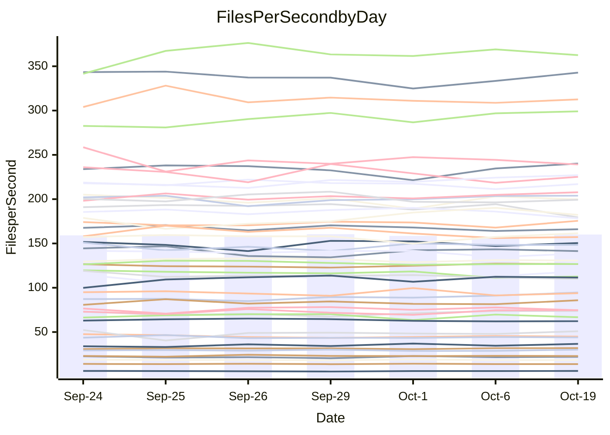

<!---
# This file is auto-generated. Do not edit.
# cspell:disable
--->
# Performance Report

## Daily Performance

## Time to Process Files

| Repository                                      | Elapsed | Min/Avg/Max           |   SD | SD Graph                |
| ----------------------------------------------- | ------: | :-------------------: | ---: | ----------------------- |
| AdaDoom3/AdaDoom3                    |    3.43 | 3.4 /   3.5 /   3.7   | 0.11 | `    ┣━━┻●━╋━━┻━━┫    ` |
| alexiosc/megistos                    |    7.63 | 7.6 /   8.0 /   8.6   | 0.27 | `    ┣━●┻━━╋━━┻━━┫    ` |
| apollographql/apollo-server          |    2.62 | 2.7 /   2.8 /   3.0   | 0.11 | `    ●┣━┻━━╋━━┻━┫     ` |
| aspnetboilerplate/aspnetboilerplate  |   10.27 | 10.2 /  10.6 /  10.9  | 0.21 | `    ┣━●┻━━╋━━┻━━┫    ` |
| aws-amplify/docs                     |   12.67 | 12.5 /  13.1 /  13.9  | 0.43 | `    ┣━━●━━╋━━┻━━┫    ` |
| Azure/azure-rest-api-specs           |    9.90 | 9.5 /  10.1 /  10.7   | 0.35 | `    ┣━━┻●━╋━━┻━━┫    ` |
| bitjson/typescript-starter           |    1.07 | 1.0 /   1.1 /   1.1   | 0.02 | `     ┣━━┻●╋━┻━━┫     ` |
| caddyserver/caddy                    |    3.91 | 3.6 /   3.8 /   4.0   | 0.12 | `    ┣━━┻━━╋━━●━━┫    ` |
| canada-ca/open-source-logiciel-libre |    1.15 | 1.1 /   1.2 /   1.3   | 0.05 | `     ┣━●━━╋━━┻━┫     ` |
| chef/chef                            |    6.14 | 5.8 /   6.0 /   6.4   | 0.18 | `    ┣━━┻━━╋━●┻━━┫    ` |
| dart-lang/sdk                        |   66.00 | 64.8 /  67.6 /  73.2  | 2.28 | `  ┣━━━┻●━━╋━━━┻━━━┫  ` |
| django/django                        |   16.16 | 15.0 /  15.5 /  16.1  | 0.34 | `    ┣━━┻━━╋━━┻━━●    ` |
| eslint/eslint                        |   11.70 | 10.7 /  11.0 /  11.6  | 0.31 | `    ┣━━┻━━╋━━┻━━┫●   ` |
| exonum/exonum                        |    3.55 | 3.6 /   3.7 /   4.0   | 0.12 | `    ┣━●┻━━╋━━┻━━┫    ` |
| flutter/samples                      |   16.95 | 16.3 /  17.0 /  18.6  | 0.63 | `    ┣━━┻━●╋━━┻━━┫    ` |
| gitbucket/gitbucket                  |    3.74 | 3.5 /   3.6 /   3.8   | 0.08 | `     ┣━┻━━╋━━●━┫     ` |
| googleapis/google-cloud-cpp          |  152.30 | 142.5 / 149.0 / 165.8 | 6.04 | `  ┣━━━┻━━━╋━●━┻━━━┫  ` |
| graphql/express-graphql              |    1.18 | 1.1 /   1.2 /   1.3   | 0.05 | `     ┣━┻━●╋━━┻━┫     ` |
| graphql/graphql-js                   |    2.89 | 2.8 /   2.9 /   3.0   | 0.06 | `     ┣━┻━●╋━━┻━┫     ` |
| graphql/graphql-relay-js             |    1.21 | 1.1 /   1.2 /   1.3   | 0.04 | `     ┣━┻━━●━━┻━┫     ` |
| graphql/graphql-spec                 |    1.35 | 1.3 /   1.4 /   1.4   | 0.03 | `     ┣━┻━●╋━━┻━┫     ` |
| iluwatar/java-design-patterns        |   13.13 | 13.0 /  13.4 /  14.9  | 0.51 | `    ┣━━┻●━╋━━┻━━┫    ` |
| ktaranov/sqlserver-kit               |    6.64 | 6.6 /   6.9 /   7.3   | 0.22 | `    ┣━━●━━╋━━┻━━┫    ` |
| liriliri/licia                       |    4.25 | 4.1 /   4.3 /   4.4   | 0.10 | `    ┣━━┻━●╋━━┻━━┫    ` |
| MartinThoma/LaTeX-examples           |    6.88 | 6.9 /   7.1 /   7.4   | 0.18 | `    ┣━━●━━╋━━┻━━┫    ` |
| mdx-js/mdx                           |    2.02 | 2.0 /   2.1 /   2.3   | 0.11 | `     ┣━┻●━╋━━┻━┫     ` |
| microsoft/TypeScript-Website         |    5.79 | 5.6 /   5.8 /   6.0   | 0.13 | `    ┣━━┻━━●━━┻━━┫    ` |
| MicrosoftDocs/PowerShell-Docs        |   24.58 | 23.7 /  24.7 /  27.2  | 1.26 | `   ┣━━━┻━━●━━┻━━━┫   ` |
| neovim/nvim-lspconfig                |    4.31 | 4.3 /   4.4 /   4.7   | 0.10 | `    ┣━●┻━━╋━━┻━━┫    ` |
| pagekit/pagekit                      |    3.51 | 3.5 /   3.7 /   3.8   | 0.06 | `   ● ┣━┻━━╋━━┻━┫     ` |
| php/php-src                          |   26.35 | 26.4 /  27.8 /  30.2  | 1.18 | `   ┣━━●┻━━╋━━┻━━━┫   ` |
| plasticrake/tplink-smarthome-api     |    1.41 | 1.3 /   1.4 /   1.4   | 0.04 | `     ┣━┻━━╋━●┻━┫     ` |
| prettier/prettier                    |    7.48 | 7.0 /   7.5 /   7.8   | 0.21 | `    ┣━━┻━━●━━┻━━┫    ` |
| pycontribs/jira                      |    1.60 | 1.5 /   1.6 /   2.0   | 0.12 | `     ┣━┻━●╋━━┻━┫     ` |
| RustPython/RustPython                |    5.32 | 5.2 /   5.4 /   5.6   | 0.11 | `    ┣━━┻●━╋━━┻━━┫    ` |
| shoelace-style/shoelace              |    2.97 | 2.9 /   3.0 /   3.1   | 0.06 | `     ┣━┻━━●━━┻━┫     ` |
| slint-ui/slint                       |   13.47 | 12.7 /  13.5 /  14.4  | 0.52 | `    ┣━━┻━━●━━┻━━┫    ` |
| SoftwareBrothers/admin-bro           |    2.65 | 2.6 /   2.6 /   2.8   | 0.06 | `     ┣━┻━━●━━┻━┫     ` |
| sveltejs/svelte                      |   21.89 | 20.8 /  21.8 /  23.2  | 0.61 | `   ┣━━━┻━━╋●━┻━━━┫   ` |
| TheAlgorithms/Python                 |    5.84 | 5.8 /   6.0 /   6.6   | 0.23 | `    ┣━━┻●━╋━━┻━━┫    ` |
| twbs/bootstrap                       |    1.83 | 1.8 /   1.9 /   2.0   | 0.05 | `     ┣━┻●━╋━━┻━┫     ` |
| typescript-cheatsheets/react         |    1.44 | 1.4 /   1.5 /   1.6   | 0.07 | `     ┣━●━━╋━━┻━┫     ` |
| typescript-eslint/typescript-eslint  |    4.28 | 4.3 /   4.4 /   4.6   | 0.11 | `    ┣━━●━━╋━━┻━━┫    ` |
| vitest-dev/vitest                    |    9.78 | 9.3 /   9.9 /  11.1   | 0.57 | `    ┣━━┻━●╋━━┻━━┫    ` |
| w3c/aria-practices                   |    3.71 | 3.5 /   3.6 /   3.7   | 0.10 | `    ┣━━┻━━╋━━┻●━┫    ` |
| w3c/specberus                        |    2.12 | 2.0 /   2.1 /   2.3   | 0.08 | `     ┣━┻━━╋●━┻━┫     ` |
| webdeveric/webpack-assets-manifest   |    1.23 | 1.2 /   1.2 /   1.3   | 0.03 | `     ┣━┻━●╋━━┻━┫     ` |
| webpack/webpack                      |    5.53 | 5.4 /   5.6 /   6.1   | 0.20 | `    ┣━━┻●━╋━━┻━━┫    ` |
| wireapp/wire-desktop                 |    1.46 | 1.3 /   1.4 /   1.4   | 0.03 | `     ┣━┻━━╋━━┻━┫●    ` |
| wireapp/wire-webapp                  |   11.50 | 10.7 /  11.3 /  12.5  | 0.52 | `    ┣━━┻━━╋●━┻━━┫    ` |

Note:
- Elapsed time is in seconds.

## Files per Second over Time

| Repository                                      | Files |    Sec |    Fps |    Rel | Trend Fps     |    N |
| ----------------------------------------------- | ----: | -----: | -----: | -----: | ------------- | ---: |
| AdaDoom3/AdaDoom3                    |   103 |   3.43 |  30.04 |  2.80% | `▇▇▄██▆▆▇▅██` |   10 |
| alexiosc/megistos                    |   583 |   7.63 |  76.36 |  4.96% | `▆▅██▆▅▄▇▇▆█` |   10 |
| apollographql/apollo-server          |   252 |   2.62 |  96.22 |  8.51% | `▅▅▅▃▆▇▄▇▆▇█` |   10 |
| aspnetboilerplate/aspnetboilerplate  |  2286 |  10.27 | 222.69 |  2.83% | `▇▆██▇█▆▅▆▆█` |   10 |
| aws-amplify/docs                     |  2871 |  12.67 | 226.61 |  3.18% | `▆▆▆▄▇▅█▇███` |   10 |
| Azure/azure-rest-api-specs           |  2458 |   9.90 | 248.28 |  2.15% | `█▄▆▆▅▇▆▅▇▄▇` |   10 |
| bitjson/typescript-starter           |    20 |   1.07 |  18.67 |  0.89% | `▇▆▆▆▅▇█▆▆▅▇` |   10 |
| caddyserver/caddy                    |   287 |   3.91 |  73.49 | -3.49% | `▇▄█▇█▇▆██▇▅` |   10 |
| canada-ca/open-source-logiciel-libre |     7 |   1.15 |   6.11 |  4.14% | `█▇▅▆▄█▆█▇▇█` |   10 |
| chef/chef                            |  1207 |   6.14 | 196.50 | -2.04% | `▇▆█▇█▅▆▇▄▇▆` |   10 |
| dart-lang/sdk                        | 10660 |  66.00 | 161.51 |  3.08% | `▇▇▇▇▇▆▄█▅██` |   10 |
| django/django                        |  2876 |  16.16 | 177.97 | -4.24% | `▇▇▅▇▇▇█▇▇▅▅` |   10 |
| eslint/eslint                        |  2093 |  11.70 | 178.88 | -6.27% | `▇██▇██▅██▅▄` |   10 |
| exonum/exonum                        |   421 |   3.55 | 118.55 |  4.54% | `▇▄█▆▅▆▇▆▇██` |   10 |
| flutter/samples                      |  2400 |  16.95 | 141.59 |  0.45% | `██▄▇▅▇▇▇▇▇▇` |   10 |
| gitbucket/gitbucket                  |   413 |   3.74 | 110.39 | -2.61% | `█▆▇▅▆▇▆▆▅▅▅` |   10 |
| googleapis/google-cloud-cpp          | 20772 | 152.30 | 136.39 | -2.29% | `▇▇▆▇▇▆██▃▇▆` |   10 |
| graphql/express-graphql              |    26 |   1.18 |  22.03 |  0.64% | `▇▅▅▇▄█▇▅▇▆▆` |   10 |
| graphql/graphql-js                   |   364 |   2.89 | 126.02 |  0.57% | `▇▇▅█▆▆▇█▇█▇` |   10 |
| graphql/graphql-relay-js             |    28 |   1.21 |  23.15 | -0.12% | `▅▄█▇▆▇▄▆▅▅▆` |   10 |
| graphql/graphql-spec                 |    19 |   1.35 |  14.07 |  0.69% | `▇▆██▆███▅▅▇` |   10 |
| iluwatar/java-design-patterns        |  1992 |  13.13 | 151.75 |  2.27% | `█▇▇▄███▇▇▇█` |   10 |
| ktaranov/sqlserver-kit               |   489 |   6.64 |  73.60 |  2.99% | `▇▅▅▇▄▇▆█▇██` |   10 |
| liriliri/licia                       |  1437 |   4.25 | 338.02 |  0.50% | `██▇▆▇▅▅▅▇█▇` |   10 |
| MartinThoma/LaTeX-examples           |  1409 |   6.88 | 204.73 |  2.43% | `▇█▆▅▇▆█▇███` |   10 |
| mdx-js/mdx                           |   141 |   2.02 |  69.76 |  3.27% | `▆▇█▇▇▃▆▇▇▅▇` |   10 |
| microsoft/TypeScript-Website         |   761 |   5.79 | 131.44 |  0.29% | `▆▇▆█▇▅▆▅█▆▇` |   10 |
| MicrosoftDocs/PowerShell-Docs        |  2708 |  24.58 | 110.18 |  0.37% | `▄▇▇▇██▄███▇` |   10 |
| neovim/nvim-lspconfig                |   760 |   4.31 | 176.44 |  2.70% | `█▇▆▇█▇█▇▅██` |   10 |
| pagekit/pagekit                      |   741 |   3.51 | 211.41 |  4.54% | `▅▇▅▆▆▆▆█▆▆█` |   10 |
| php/php-src                          |  2289 |  26.35 |  86.88 |  4.95% | `▆█▇▅▇▅▇▄█▇█` |   10 |
| plasticrake/tplink-smarthome-api     |    62 |   1.41 |  43.98 | -2.57% | `█▇▇▄▅▆▅▆▆▇▅` |   10 |
| prettier/prettier                    |  2350 |   7.48 | 314.12 |  0.81% | `▅█▄▇▆▆▆▅▆▆▆` |   10 |
| pycontribs/jira                      |    79 |   1.60 |  49.34 |  1.77% | `█▂▆▇▇▆▆▆▅█▇` |   10 |
| RustPython/RustPython                |   688 |   5.32 | 129.35 |  1.45% | `▆▇█▆▆▅▇▆▆▅▇` |   10 |
| shoelace-style/shoelace              |   439 |   2.97 | 147.81 |  0.36% | `█▅▆▇▅█▇▇▇▇▇` |   10 |
| slint-ui/slint                       |  2531 |  13.47 | 187.89 |  4.88% | `▆▄▅▄▅▇▇█▇▅▇` |   10 |
| SoftwareBrothers/admin-bro           |   441 |   2.65 | 166.43 | -0.22% | `▇█▅▇█▆██▅▇▇` |   10 |
| sveltejs/svelte                      |  7965 |  21.89 | 363.83 | -0.25% | `▄▇█▇▆▆▆▇▇▆▆` |   10 |
| TheAlgorithms/Python                 |  1397 |   5.84 | 239.13 |  2.53% | `▇██▇▇▇▄█▆██` |   10 |
| twbs/bootstrap                       |   118 |   1.83 |  64.49 |  2.11% | `▆▇▇█▇▅▇▆▅▄▇` |   10 |
| typescript-cheatsheets/react         |    53 |   1.44 |  36.87 |  4.46% | `▅▄▇█▅██▄▇▇█` |   10 |
| typescript-eslint/typescript-eslint  |  1285 |   4.28 | 300.47 |  3.37% | `▅▅▅██▆▆█▇██` |   10 |
| vitest-dev/vitest                    |  2257 |   9.78 | 230.78 |  2.15% | `█▇▃███▆▅▆▆▇` |   10 |
| w3c/aria-practices                   |   414 |   3.71 | 111.44 | -3.98% | `███▆▇██▅▅▆▅` |   10 |
| w3c/specberus                        |   197 |   2.12 |  92.82 | -1.83% | `▆▆▅▆▅▇█▃▆▆▅` |   10 |
| webdeveric/webpack-assets-manifest   |    55 |   1.23 |  44.73 |  1.99% | `▅█▅▅▅▅▅▆▆▅▆` |   10 |
| webpack/webpack                      |  1123 |   5.53 | 202.93 |  2.46% | `█▇▆▇▇▄▆▇█▆█` |   10 |
| wireapp/wire-desktop                 |    46 |   1.46 |  31.61 |  0.72% | `▅▆▅▇▆▄▅▅█▇▆` |   10 |
| wireapp/wire-webapp                  |  1781 |  11.50 | 154.90 | -4.16% | `▆██▆█▇▆▃▇▆▅` |   10 |

## Data Throughput

| Repository                                      | Files |    Sec |     Kps |    Rel | Trend Kps     |    N |
| ----------------------------------------------- | ----: | -----: | ------: | -----: | ------------- | ---: |
| AdaDoom3/AdaDoom3                    |   103 |   3.43 |  638.33 |  2.80% | `▇▇▄██▆▆▇▅██` |   10 |
| alexiosc/megistos                    |   583 |   7.63 |  600.03 |  4.96% | `▆▅██▆▅▄▇▇▆█` |   10 |
| apollographql/apollo-server          |   252 |   2.62 |  773.93 |  8.51% | `▅▅▅▃▆▇▄▇▆▇█` |   10 |
| aspnetboilerplate/aspnetboilerplate  |  2286 |  10.27 |  541.82 |  2.83% | `▇▆██▇█▆▅▆▆█` |   10 |
| aws-amplify/docs                     |  2871 |  12.67 |  791.06 |  3.16% | `▆▆▆▄▇▅█▇███` |   10 |
| Azure/azure-rest-api-specs           |  2458 |   9.90 |  662.51 |  3.07% | `█▄▅▆▅▇▆▅▇▄▇` |   10 |
| bitjson/typescript-starter           |    20 |   1.07 |   74.69 |  0.89% | `▇▆▆▆▅▇█▆▆▅▇` |   10 |
| caddyserver/caddy                    |   287 |   3.91 |  628.93 | -3.38% | `▇▄█▇█▇▆██▇▆` |   10 |
| canada-ca/open-source-logiciel-libre |     7 |   1.15 |   50.61 |  4.14% | `█▇▅▆▄█▆█▇▇█` |   10 |
| chef/chef                            |  1207 |   6.14 |  906.47 | -2.08% | `▇▆█▇█▅▆▇▄▇▆` |   10 |
| dart-lang/sdk                        | 10660 |  66.00 | 1102.04 |  2.57% | `▇▇▇▇▇▆▄█▅██` |   10 |
| django/django                        |  2876 |  16.16 | 1115.48 | -4.21% | `▇▇▅▇▇▇█▇▇▅▅` |   10 |
| eslint/eslint                        |  2093 |  11.70 | 1289.36 | -6.14% | `▇██▇██▅██▅▄` |   10 |
| exonum/exonum                        |   421 |   3.55 | 1134.00 |  4.54% | `▇▄█▆▅▆▇▆▇██` |   10 |
| flutter/samples                      |  2400 |  16.95 | 1263.52 |  0.45% | `██▄▇▅▇▇▇▇▇▇` |   10 |
| gitbucket/gitbucket                  |   413 |   3.74 |  501.98 | -2.58% | `█▆▇▅▆▇▆▆▅▅▅` |   10 |
| googleapis/google-cloud-cpp          | 20772 | 152.30 | 1108.60 | -2.13% | `▇▇▆▇▇▆██▃▇▆` |   10 |
| graphql/express-graphql              |    26 |   1.18 |  100.81 |  0.64% | `▇▅▅▇▄█▇▅▇▆▆` |   10 |
| graphql/graphql-js                   |   364 |   2.89 |  724.29 |  0.57% | `▇▇▅█▆▆▇█▇█▇` |   10 |
| graphql/graphql-relay-js             |    28 |   1.21 |   90.94 | -0.12% | `▅▄█▇▆▇▄▆▅▅▆` |   10 |
| graphql/graphql-spec                 |    19 |   1.35 |  469.56 |  0.69% | `▇▆██▆███▅▅▇` |   10 |
| iluwatar/java-design-patterns        |  1992 |  13.13 |  469.04 |  2.27% | `█▇▇▄███▇▇▇█` |   10 |
| ktaranov/sqlserver-kit               |   489 |   6.64 | 1114.32 |  2.99% | `▇▅▅▇▄▇▆█▇██` |   10 |
| liriliri/licia                       |  1437 |   4.25 |  402.71 |  0.50% | `██▇▆▇▅▅▅▇█▇` |   10 |
| MartinThoma/LaTeX-examples           |  1409 |   6.88 |  422.83 |  2.43% | `▇█▆▅▇▆█▇███` |   10 |
| mdx-js/mdx                           |   141 |   2.02 |  324.57 |  3.27% | `▆▇█▇▇▃▆▇▇▅▇` |   10 |
| microsoft/TypeScript-Website         |   761 |   5.79 |  909.05 |  0.29% | `▆▇▆█▇▅▆▅█▆▇` |   10 |
| MicrosoftDocs/PowerShell-Docs        |  2708 |  24.58 | 1133.96 |  0.42% | `▄▇▇▇██▄███▇` |   10 |
| neovim/nvim-lspconfig                |   760 |   4.31 |  294.37 |  3.24% | `▇▆▆▇▇▇█▇▅██` |   10 |
| pagekit/pagekit                      |   741 |   3.51 |  440.79 |  4.54% | `▅▇▅▆▆▆▆█▆▆█` |   10 |
| php/php-src                          |  2289 |  26.35 | 1517.18 |  5.42% | `▅█▇▅▇▅▇▄█▇█` |   10 |
| plasticrake/tplink-smarthome-api     |    62 |   1.41 |  237.65 | -2.57% | `█▇▇▄▅▆▅▆▆▇▅` |   10 |
| prettier/prettier                    |  2350 |   7.48 |  439.91 |  0.34% | `▅█▄▇▆▆▆▅▆▆▆` |   10 |
| pycontribs/jira                      |    79 |   1.60 |  349.76 |  1.77% | `█▂▆▇▇▆▆▆▅█▇` |   10 |
| RustPython/RustPython                |   688 |   5.32 | 1021.86 |  1.47% | `▆▇█▆▆▅▇▆▆▅▇` |   10 |
| shoelace-style/shoelace              |   439 |   2.97 |  714.11 |  0.36% | `█▅▆▇▅█▇▇▇▇▇` |   10 |
| slint-ui/slint                       |  2531 |  13.47 | 1152.90 |  2.18% | `█▅▇▆▄▇▇█▇▅▇` |   10 |
| SoftwareBrothers/admin-bro           |   441 |   2.65 |  366.82 | -0.22% | `▇█▅▇█▆██▅▇▇` |   10 |
| sveltejs/svelte                      |  7965 |  21.89 |  242.78 | -0.46% | `▄▇█▇▆▆▆▇▇▆▆` |   10 |
| TheAlgorithms/Python                 |  1397 |   5.84 |  607.85 |  2.53% | `▇██▇▇▇▄█▆██` |   10 |
| twbs/bootstrap                       |   118 |   1.83 |  529.04 |  2.11% | `▆▇▇█▇▅▇▆▅▄▇` |   10 |
| typescript-cheatsheets/react         |    53 |   1.44 |  272.73 |  4.46% | `▅▄▇█▅██▄▇▇█` |   10 |
| typescript-eslint/typescript-eslint  |  1285 |   4.28 | 1548.18 |  3.96% | `▅▅▅█▇▆▆█▇██` |   10 |
| vitest-dev/vitest                    |  2257 |   9.78 |  517.19 |  1.40% | `█▇▃███▆▅▆▅▇` |   10 |
| w3c/aria-practices                   |   414 |   3.71 | 1039.03 | -3.98% | `███▆▇██▅▅▆▅` |   10 |
| w3c/specberus                        |   197 |   2.12 |  293.55 | -1.27% | `▆▆▅▆▅▇█▃▆▆▆` |   10 |
| webdeveric/webpack-assets-manifest   |    55 |   1.23 |  103.28 |  0.50% | `▆█▅▅▅▅▅▆▆▄▆` |   10 |
| webpack/webpack                      |  1123 |   5.53 |  926.28 |  2.76% | `█▇▅▇▇▄▆▇█▆█` |   10 |
| wireapp/wire-desktop                 |    46 |   1.46 |  176.61 | 16.58% | `▃▃▃▃▃▂▃▂█▇▇` |   10 |
| wireapp/wire-webapp                  |  1781 |  11.50 |  570.99 | -2.13% | `▆██▆█▇▆▃█▇▆` |   10 |

