<!---
# This file is auto-generated. Do not edit.
# cspell:disable
--->
# Performance Report

```mermaid
xychart-beta
    title Files Per Second by Day
    y-axis Files per Second
    x-axis Date [Dec-23, Dec-24, Dec-27, Dec-28, Dec-29, Dec-30, Jan-1, Jan-4, Jan-5, Jan-6, Jan-7, Jan-8, Jan-9, Jan-10, Jan-11, Jan-13, Jan-16, Jan-17, Jan-18, Jan-20, Jan-22]
    bar [173.30, 173.54, 170.88, 173.10, 172.87, 170.63, 172.55, 170.72, 165.99, 165.55, 169.22, 174.07, 185.19, 187.45, 188.92, 191.86, 190.29, 191.94, 196.32, 194.86, 191.82]
    line [6.23, 6.06, 5.80, 6.19, 6.04, 6.09, 6.29, 6.13, 5.79, 5.41, 5.66, 6.15, 6.86, 6.90, 6.81, 6.66, 6.97, 6.64, 6.91, 6.72, 6.67]
    line [43.98, 45.75, 48.03, 44.47, 43.53, 43.39, 44.67, 43.92, 40.38, 37.83, 41.50, 45.72, 48.43, 43.80, 48.21, 48.57, 48.55, 50.09, 48.39, 47.34, 47.51]
    line [24.78, 24.02, 24.07, 23.90, 24.05, 23.79, 23.47, 23.84, 21.71, 20.06, 22.54, 25.57, 25.37, 26.38, 26.59, 26.51, 25.26, 25.41, 25.96, 26.49, 25.80]
    line [47.21, 45.81, 45.88, 45.34, 46.09, 44.04, 43.96, 44.61, 40.41, 39.77, 41.67, 47.14, 50.43, 48.76, 50.39, 48.56, 48.63, 49.92, 47.96, 48.91, 48.82]
    line [113.89, 119.27, 121.25, 119.32, 118.60, 119.88, 120.18, 120.91, 116.77, 113.59, 115.36, 119.01, 126.14, 130.00, 129.60, 128.50, 127.21, 130.68, 134.03, 132.53, 130.75]
    line [31.95, 32.72, 33.00, 31.56, 31.04, 31.19, 31.58, 30.98, 28.44, 27.47, 29.34, 33.19, 34.45, 32.48, 34.06, 34.46, 35.93, 33.32, 35.23, 35.39, 34.93]
    line [169.49, 175.43, 173.51, 166.13, 173.69, 176.28, 174.86, 172.30, 168.35, 166.48, 160.20, 176.21, 192.32, 196.53, 187.68, 194.19, 197.24, 195.66, 200.40, 198.68, 192.03]
    line [131.35, 128.71, 129.73, 130.21, 126.25, 125.32, 128.46, 125.36, 119.96, 121.55, 126.54, 132.92, 138.94, 136.24, 140.09, 141.04, 141.83, 138.27, 139.82, 139.77, 142.05]
    line [94.32, 94.29, 94.73, 94.34, 95.29, 95.11, 98.41, 97.41, 93.11, 86.98, 96.48, 99.80, 107.59, 107.79, 102.30, 102.07, 100.69, 106.54, 108.37, 107.20, 104.26]
    line [51.21, 51.38, 49.64, 48.60, 49.52, 48.09, 50.03, 48.82, 46.25, 44.36, 47.22, 53.09, 55.75, 56.48, 57.02, 56.66, 55.93, 59.24, 56.01, 55.67, 55.20]
    line [151.65, 150.82, 149.41, 147.54, 148.32, 148.24, 148.81, 152.12, 144.06, 141.46, 148.01, 153.69, 163.45, 163.04, 162.47, 164.23, 164.63, 167.70, 160.91, 159.45, 163.50]
    line [14.66, 13.81, 14.51, 13.39, 13.58, 14.12, 14.33, 14.46, 13.75, 12.60, 13.58, 14.59, 15.66, 15.79, 15.64, 15.80, 15.80, 16.00, 15.45, 15.24, 15.02]
    line [296.00, 294.23, 289.77, 295.71, 297.33, 290.64, 293.31, 297.11, 291.75, 279.45, 292.30, 315.14, 325.37, 329.28, 331.31, 322.95, 325.07, 320.94, 337.71, 314.28, 338.34]
    line [121.26, 119.81, 119.36, 122.21, 121.33, 118.71, 119.46, 120.59, 115.93, 111.61, 116.47, 122.24, 129.36, 128.91, 133.62, 132.89, 135.43, 131.64, 136.76, 137.40, 132.80]
    line [95.06, 94.41, 95.55, 97.07, 96.22, 92.57, 92.92, 91.62, 91.70, 90.24, 93.64, 97.75, 101.99, 101.23, 103.65, 103.42, 102.46, 106.20, 105.37, 102.12, 105.87]
    line [210.04, 207.76, 200.78, 205.77, 199.55, 199.57, 206.34, 210.39, 198.78, 192.42, 197.28, 209.87, 213.91, 219.61, 218.24, 213.27, 217.66, 218.45, 221.48, 225.59, 221.54]
    line [72.81, 72.16, 72.22, 72.29, 71.63, 70.43, 69.31, 70.55, 65.48, 65.68, 67.02, 74.90, 75.80, 79.70, 78.59, 81.33, 81.33, 81.07, 83.41, 80.33, 81.35]
    line [173.08, 173.52, 171.67, 165.07, 170.82, 168.89, 168.46, 160.87, 163.97, 157.39, 159.96, 176.03, 182.37, 173.15, 184.83, 185.84, 185.90, 183.93, 185.28, 191.50, 191.17]
    line [22.95, 22.15, 22.59, 22.93, 22.71, 21.96, 22.43, 22.76, 19.93, 19.65, 21.35, 23.88, 24.29, 22.74, 25.52, 24.84, 24.50, 25.34, 23.52, 24.93, 24.42]
    line [116.76, 117.75, 118.71, 118.58, 117.32, 112.42, 116.77, 113.28, 107.29, 110.98, 110.70, 119.74, 122.80, 129.73, 128.79, 126.07, 129.88, 128.08, 130.23, 129.79, 127.22]
    line [19.24, 18.95, 18.61, 19.20, 19.16, 18.64, 18.56, 18.69, 15.82, 15.37, 16.82, 19.06, 19.36, 19.05, 20.04, 19.27, 20.18, 19.35, 20.14, 20.01, 18.93]
    line [39.24, 39.22, 39.13, 37.99, 37.43, 37.30, 38.53, 37.44, 35.32, 32.27, 37.29, 39.53, 40.03, 40.97, 40.73, 40.14, 39.37, 40.16, 40.57, 39.99, 39.45]
    line [64.92, 64.92, 65.76, 63.97, 65.18, 60.36, 63.48, 65.17, 62.63, 59.94, 62.94, 68.03, 71.19, 73.13, 70.56, 71.46, 69.64, 73.60, 68.98, 70.36, 68.71]
    line [32.90, 33.40, 32.96, 33.38, 32.90, 31.64, 32.05, 31.87, 30.32, 30.13, 30.52, 32.45, 34.68, 36.83, 37.61, 37.83, 37.29, 37.79, 38.08, 37.68, 37.40]
    line [76.21, 75.66, 76.28, 80.16, 75.45, 77.29, 76.83, 75.96, 77.04, 75.98, 75.37, 79.34, 80.97, 83.22, 85.10, 84.24, 85.04, 88.54, 87.62, 86.00, 85.64]
    line [79.75, 79.57, 78.19, 78.53, 81.17, 72.47, 80.44, 78.06, 78.74, 77.69, 75.81, 82.18, 88.38, 87.15, 87.31, 87.18, 90.31, 92.11, 92.40, 91.04, 90.36]
    line [74.27, 74.27, 73.83, 75.96, 75.41, 73.52, 70.94, 72.13, 67.68, 66.21, 71.65, 76.02, 80.93, 84.19, 83.66, 81.75, 85.70, 86.11, 85.86, 86.06, 84.27]
    line [311.87, 322.19, 317.56, 317.24, 315.38, 325.99, 315.10, 321.37, 318.36, 304.42, 303.41, 319.39, 327.56, 357.94, 329.89, 337.22, 342.27, 345.00, 356.14, 349.54, 352.62]
    line [199.42, 199.83, 198.90, 201.82, 194.83, 201.20, 199.08, 201.68, 196.07, 191.44, 191.98, 208.77, 213.46, 218.16, 220.17, 217.65, 213.84, 219.82, 216.50, 223.77, 218.30]
    line [140.36, 136.98, 135.57, 135.50, 134.25, 129.01, 139.25, 139.78, 129.55, 131.60, 134.11, 136.19, 147.37, 149.33, 150.95, 149.18, 146.30, 139.07, 151.18, 153.74, 153.12]
    line [240.94, 253.96, 249.85, 237.45, 249.30, 236.26, 250.59, 240.41, 245.35, 243.40, 249.06, 252.82, 269.41, 273.80, 263.96, 272.92, 261.41, 256.94, 266.46, 233.73, 255.35]
    line [335.23, 343.48, 342.97, 326.49, 346.96, 341.41, 349.59, 332.44, 321.99, 323.13, 336.38, 352.94, 374.70, 389.29, 376.57, 388.49, 375.32, 366.20, 389.54, 377.40, 385.33]
    line [202.04, 203.32, 201.04, 202.44, 203.10, 195.80, 206.74, 207.91, 185.17, 183.38, 197.81, 213.96, 231.09, 232.21, 230.83, 222.60, 231.13, 231.51, 240.11, 237.40, 232.15]
    line [239.59, 240.67, 245.15, 245.04, 246.20, 235.52, 245.54, 241.43, 227.89, 226.93, 235.13, 241.29, 256.22, 256.06, 239.94, 250.86, 255.23, 249.00, 265.06, 266.25, 265.39]
    line [113.42, 116.57, 120.86, 116.04, 115.61, 111.25, 114.64, 107.26, 104.85, 102.99, 109.30, 116.77, 127.71, 114.20, 134.12, 122.32, 127.81, 135.76, 135.82, 124.24, 127.06]
    line [169.46, 179.44, 172.82, 176.92, 167.34, 176.43, 176.94, 178.99, 168.22, 166.87, 176.13, 175.56, 186.67, 196.90, 196.60, 194.03, 194.99, 192.23, 197.19, 192.71, 195.01]
    line [215.88, 203.82, 209.47, 208.55, 206.80, 208.32, 210.94, 208.87, 204.66, 200.55, 205.66, 217.93, 227.16, 232.86, 230.33, 232.89, 233.09, 238.38, 239.45, 235.23, 231.97]
    line [155.20, 157.30, 154.76, 157.76, 156.45, 156.97, 156.48, 161.27, 156.23, 155.16, 163.04, 163.18, 170.50, 178.84, 176.33, 177.89, 180.64, 176.54, 181.96, 178.88, 180.40]
    line [199.67, 194.62, 190.28, 203.79, 203.98, 206.16, 191.99, 203.06, 195.28, 197.18, 199.76, 210.90, 223.95, 228.77, 221.68, 228.59, 230.59, 232.51, 236.40, 229.96, 235.68]
    line [188.11, 196.54, 189.53, 183.55, 193.13, 194.30, 182.73, 194.72, 192.90, 184.51, 177.92, 195.10, 212.88, 219.97, 208.62, 218.28, 221.67, 222.50, 222.49, 221.50, 215.62]
    line [232.12, 236.13, 235.71, 228.72, 232.65, 236.79, 238.66, 239.84, 237.65, 227.69, 241.17, 242.31, 251.84, 257.31, 259.03, 255.67, 262.65, 261.59, 266.80, 267.02, 266.61]
    line [150.33, 152.02, 150.72, 154.90, 153.82, 147.24, 149.99, 145.79, 146.47, 145.32, 149.61, 152.47, 167.66, 162.55, 150.60, 169.56, 173.92, 177.33, 173.32, 178.23, 175.77]
    line [189.75, 189.98, 177.07, 192.83, 190.79, 182.79, 190.84, 188.67, 194.33, 177.58, 179.97, 187.56, 204.85, 175.41, 212.66, 215.89, 200.52, 199.18, 198.97, 206.74, 209.26]
    line [223.22, 223.16, 220.54, 207.84, 221.69, 222.09, 227.69, 222.11, 226.42, 218.19, 221.48, 227.88, 240.46, 239.34, 239.80, 239.93, 238.57, 236.32, 249.26, 244.81, 244.90]
    line [371.74, 360.07, 349.58, 358.00, 357.09, 358.22, 365.46, 375.72, 366.42, 366.13, 364.89, 378.25, 407.03, 408.32, 400.13, 413.71, 402.27, 405.88, 422.55, 417.95, 422.87]
    line [116.66, 113.51, 116.56, 110.18, 116.43, 113.57, 116.81, 116.74, 114.96, 116.34, 117.08, 121.26, 127.78, 131.45, 132.46, 133.58, 134.83, 138.33, 137.42, 133.67, 135.32]
    line [90.84, 89.17, 86.07, 86.04, 90.94, 91.20, 88.38, 89.72, 82.57, 85.29, 87.34, 86.74, 95.27, 97.94, 97.30, 98.25, 99.69, 99.56, 100.21, 102.10, 97.82]
    line [240.26, 242.42, 235.97, 234.05, 235.94, 244.60, 237.90, 238.37, 234.19, 223.75, 225.18, 243.31, 257.18, 256.97, 252.12, 251.26, 250.15, 255.66, 262.96, 271.72, 264.80]
    line [175.57, 172.74, 173.87, 177.24, 172.99, 166.08, 180.17, 181.21, 173.75, 179.71, 177.60, 181.52, 194.07, 204.27, 201.52, 203.28, 190.39, 203.06, 207.16, 206.41, 203.60]
    line [164.25, 165.65, 160.55, 167.52, 164.35, 162.61, 160.21, 152.67, 150.17, 151.88, 156.83, 157.18, 166.03, 166.95, 174.59, 178.01, 176.93, 175.50, 183.23, 181.65, 172.80]
```

Daily Performance

Time to Process Files

| Repository                                      | Elapsed | Min/Avg/Max           |   SD | SD Graph                |
| ----------------------------------------------- | ------: | :-------------------: | ---: | ----------------------- |
| AdaDoom3/AdaDoom3                    |    2.75 | 2.6 /   3.0 /   3.5   | 0.26 | `    ┣━━●━━╋━━┻━━┫    ` |
| alexiosc/megistos                    |    6.75 | 6.6 /   7.6 /   9.9   | 0.71 | `    ┣━●┻━━╋━━┻━━┫    ` |
| apollographql/apollo-server          |    2.40 | 2.3 /   2.6 /   3.1   | 0.16 | `    ┣━━●━━╋━━┻━━┫    ` |
| aspnetboilerplate/aspnetboilerplate  |    8.57 | 8.4 /   9.3 /  10.6   | 0.54 | `    ┣━●┻━━╋━━┻━━┫    ` |
| aws-amplify/docs                     |   11.84 | 11.3 /  12.5 /  13.8  | 0.61 | `    ┣━━●━━╋━━┻━━┫    ` |
| Azure/azure-rest-api-specs           |    9.78 | 8.6 /  10.0 /  11.7   | 0.65 | `    ┣━━┻━●╋━━┻━━┫    ` |
| bitjson/typescript-starter           |    0.99 | 1.0 /   1.1 /   1.4   | 0.10 | `     ┣━┻●━╋━━┻━┫     ` |
| caddyserver/caddy                    |    3.17 | 3.1 /   3.5 /   4.3   | 0.26 | `    ┣━●┻━━╋━━┻━━┫    ` |
| canada-ca/open-source-logiciel-libre |    1.06 | 1.0 /   1.1 /   1.4   | 0.10 | `     ┣━┻●━╋━━┻━┫     ` |
| chef/chef                            |    5.18 | 5.0 /   5.7 /   6.8   | 0.47 | `    ┣━━●━━╋━━┻━━┫    ` |
| dart-lang/sdk                        |   54.35 | 51.7 /  58.7 /  68.3  | 4.27 | `  ┣━━━●━━━╋━━━┻━━━┫  ` |
| django/django                        |   13.16 | 12.6 /  14.4 /  17.0  | 1.14 | `   ┣━━●┻━━╋━━┻━━━┫   ` |
| eslint/eslint                        |    9.09 | 9.0 /  10.0 /  11.3   | 0.56 | `    ┣●━┻━━╋━━┻━━┫    ` |
| exonum/exonum                        |    3.44 | 3.2 /   3.5 /   4.1   | 0.23 | `    ┣━━┻━●╋━━┻━━┫    ` |
| flutter/samples                      |   13.85 | 13.4 /  15.6 /  22.6  | 1.52 | `   ┣━━●┻━━╋━━┻━━━┫   ` |
| gitbucket/gitbucket                  |    3.11 | 3.0 /   3.3 /   4.0   | 0.23 | `    ┣━━●━━╋━━┻━━┫    ` |
| googleapis/google-cloud-cpp          |  127.39 | 113.8 / 127.1 / 145.3 | 8.33 | `  ┣━━━┻━━━●━━━┻━━━┫  ` |
| graphql/express-graphql              |    1.07 | 1.0 /   1.1 /   1.4   | 0.10 | `     ┣━┻●━╋━━┻━┫     ` |
| graphql/graphql-js                   |    2.59 | 2.5 /   2.8 /   3.2   | 0.17 | `    ┣━━●━━╋━━┻━━┫    ` |
| graphql/graphql-relay-js             |    1.05 | 1.0 /   1.2 /   1.5   | 0.11 | `     ┣━●━━╋━━┻━┫     ` |
| graphql/graphql-spec                 |    1.32 | 1.2 /   1.3 /   1.6   | 0.11 | `     ┣━┻━━●━━┻━┫     ` |
| iluwatar/java-design-patterns        |   10.91 | 10.9 /  12.1 /  13.3  | 0.77 | `    ┣●━┻━━╋━━┻━━┫    ` |
| ktaranov/sqlserver-kit               |    5.69 | 5.5 /   6.1 /   6.8   | 0.36 | `    ┣━●┻━━╋━━┻━━┫    ` |
| liriliri/licia                       |    3.80 | 3.6 /   4.1 /   4.7   | 0.29 | `    ┣━━●━━╋━━┻━━┫    ` |
| MartinThoma/LaTeX-examples           |    5.87 | 5.8 /   6.7 /   8.5   | 0.63 | `    ┣━●┻━━╋━━┻━━┫    ` |
| mdx-js/mdx                           |    1.71 | 1.7 /   1.9 /   2.2   | 0.16 | `     ┣━●━━╋━━┻━┫     ` |
| microsoft/TypeScript-Website         |    5.00 | 4.9 /   5.4 /   6.2   | 0.34 | `    ┣━●┻━━╋━━┻━━┫    ` |
| MicrosoftDocs/PowerShell-Docs        |   19.75 | 19.1 /  21.5 /  24.5  | 1.59 | `   ┣━━●┻━━╋━━┻━━━┫   ` |
| neovim/nvim-lspconfig                |    4.29 | 3.8 /   4.2 /   4.9   | 0.31 | `    ┣━━┻━━●━━┻━━┫    ` |
| pagekit/pagekit                      |    3.43 | 3.2 /   3.5 /   4.0   | 0.19 | `    ┣━━┻●━╋━━┻━━┫    ` |
| php/php-src                          |   23.29 | 21.7 /  24.6 /  30.2  | 1.72 | `   ┣━━━●━━╋━━┻━━━┫   ` |
| plasticrake/tplink-smarthome-api     |    1.21 | 1.2 /   1.4 /   1.7   | 0.11 | `     ┣━●━━╋━━┻━┫     ` |
| prettier/prettier                    |    7.29 | 7.0 /   7.7 /   8.5   | 0.39 | `    ┣━━●━━╋━━┻━━┫    ` |
| pycontribs/jira                      |    1.47 | 1.3 /   1.5 /   1.9   | 0.14 | `     ┣━┻━●╋━━┻━┫     ` |
| RustPython/RustPython                |    5.80 | 5.2 /   6.1 /   7.4   | 0.54 | `    ┣━━┻●━╋━━┻━━┫    ` |
| shoelace-style/shoelace              |    2.60 | 2.6 /   2.9 /   3.3   | 0.15 | `    ┣●━┻━━╋━━┻━━┫    ` |
| slint-ui/slint                       |   13.24 | 11.8 /  13.7 /  15.8  | 0.87 | `    ┣━━┻●━╋━━┻━━┫    ` |
| SoftwareBrothers/admin-bro           |    2.31 | 2.3 /   2.5 /   2.9   | 0.17 | `    ┣━●┻━━╋━━┻━━┫    ` |
| sveltejs/svelte                      |   19.63 | 19.3 /  21.6 /  24.7  | 1.43 | `   ┣━●━┻━━╋━━┻━━━┫   ` |
| TheAlgorithms/Python                 |    5.29 | 5.2 /   5.7 /   6.7   | 0.33 | `    ┣━●┻━━╋━━┻━━┫    ` |
| twbs/bootstrap                       |    1.74 | 1.6 /   1.8 /   2.1   | 0.12 | `     ┣━┻━●╋━━┻━┫     ` |
| typescript-cheatsheets/react         |    1.39 | 1.3 /   1.4 /   1.9   | 0.11 | `     ┣━┻━━●━━┻━┫     ` |
| typescript-eslint/typescript-eslint  |    3.78 | 3.8 /   4.2 /   5.0   | 0.28 | `    ┣●━┻━━╋━━┻━━┫    ` |
| vitest-dev/vitest                    |    9.42 | 8.5 /   9.7 /  10.7   | 0.49 | `    ┣━━┻●━╋━━┻━━┫    ` |
| w3c/aria-practices                   |    3.21 | 3.0 /   3.4 /   4.0   | 0.21 | `    ┣━━┻●━╋━━┻━━┫    ` |
| w3c/specberus                        |    1.82 | 1.8 /   2.0 /   2.6   | 0.16 | `     ┣━●━━╋━━┻━┫     ` |
| webdeveric/webpack-assets-manifest   |    1.18 | 1.1 /   1.2 /   1.6   | 0.11 | `     ┣━┻━●╋━━┻━┫     ` |
| webpack/webpack                      |    4.88 | 4.7 /   5.2 /   6.0   | 0.35 | `    ┣━━●━━╋━━┻━━┫    ` |
| wireapp/wire-desktop                 |    1.24 | 1.2 /   1.4 /   1.7   | 0.12 | `     ┣━●━━╋━━┻━┫     ` |
| wireapp/wire-webapp                  |   10.51 | 9.1 /  10.4 /  11.7   | 0.53 | `    ┣━━┻━━╋●━┻━━┫    ` |

Note:
- Elapsed time is in seconds.

Files per Second over Time

| Repository                                      | Files |    Sec |    Fps |    Rel | Trend Fps              |    N |
| ----------------------------------------------- | ----: | -----: | -----: | -----: | ---------------------- | ---: |
| AdaDoom3/AdaDoom3                    |   103 |   2.75 |  37.46 |  9.81% | `▇▇▇▇█▇▇▇▇▇▇█▇▇██▇▇▇▇` |   60 |
| alexiosc/megistos                    |   583 |   6.75 |  86.42 | 12.10% | `▇▇▆▇▇▇█▇██▇███▇▇█▇▇█` |   60 |
| apollographql/apollo-server          |   253 |   2.40 | 105.41 |  7.89% | `▇██▇▆▇▅████▆▆█▇▆▇▇██` |   60 |
| aspnetboilerplate/aspnetboilerplate  |  2286 |   8.57 | 266.61 |  8.37% | `▇▇█▆▇█▇▇▇████▇█▇████` |   60 |
| aws-amplify/docs                     |  2874 |  11.84 | 242.83 |  5.31% | `▇▇▇▇▆▇▇▆▆██▇▇▆█▆█▇█▇` |   60 |
| Azure/azure-rest-api-specs           |  2449 |   9.78 | 250.48 |  1.94% | `▆▅▅▇▅▅▆▆▆▅█▇▇██▆▇▇▇▆` |   60 |
| bitjson/typescript-starter           |    20 |   0.99 |  20.18 |  7.99% | `▇▇▆▇▇█▇█▇▇███▇▇█▇█▃▇` |   60 |
| caddyserver/caddy                    |   291 |   3.17 |  91.84 | 10.32% | `▆▇▇▆▇▇▇▇█▇███▇▇▇█▇▇█` |   60 |
| canada-ca/open-source-logiciel-libre |     7 |   1.06 |   6.62 |  5.16% | `█▇▇▆▇█▇█▇▇██▆▇▇▇▇▆█▇` |   60 |
| chef/chef                            |  1197 |   5.18 | 231.29 |  9.25% | `▇▆▇█▇██▇█████▆██▆██▇` |   60 |
| dart-lang/sdk                        | 10930 |  54.35 | 201.10 |  7.64% | `▇▇▇▇▇▆▅▆▇▇███▇▇██▇█▇` |   60 |
| django/django                        |  2889 |  13.16 | 219.47 |  9.02% | `▆▅▆▇▇▇▇▇▇▇█▇▇▇▇██▇▇▇` |   60 |
| eslint/eslint                        |  2062 |   9.09 | 226.90 |  9.97% | `▇▇▆▇▇▆▇▆▇█▇▅▇██▇▇▆▇█` |   60 |
| exonum/exonum                        |   421 |   3.44 | 122.42 |  1.65% | `█▇▆▇▇█▇█▇██▇████▇██▆` |   60 |
| flutter/samples                      |  2441 |  13.85 | 176.22 | 11.46% | `▇▁▇▆▇█▇▇██▇▇█▇████▇█` |   60 |
| gitbucket/gitbucket                  |   413 |   3.11 | 132.89 |  6.42% | `▇▇▇▇▇▇▇█▇▇███▇███▇▇▇` |   60 |
| googleapis/google-cloud-cpp          | 21017 | 127.39 | 164.98 | -0.66% | `▇▆▇▇▇▇▇▇▇████▇███▇▇▅` |   60 |
| graphql/express-graphql              |    26 |   1.07 |  24.27 |  5.36% | `██▇▇▇▇▇▇▇▅█▅▇█▇▇▇▆▇▇` |   60 |
| graphql/graphql-js                   |   368 |   2.59 | 142.31 |  7.52% | `█▇█▆▇▇▇█▇█▇▆▆█▇▇█▇▇▇` |   60 |
| graphql/graphql-relay-js             |    28 |   1.05 |  26.70 |  9.47% | `████▇▇█▆▇█▇▇▇████▇▇█` |   60 |
| graphql/graphql-spec                 |    19 |   1.32 |  14.40 | -1.25% | `▇█▇█▇██▇█▆█▇▇██▅▇▇▇▆` |   60 |
| iluwatar/java-design-patterns        |  1992 |  10.91 | 182.51 | 10.02% | `▇▇▇▇███▇▇███▇██▇▇▇██` |   60 |
| ktaranov/sqlserver-kit               |   489 |   5.69 |  85.92 |  7.38% | `█▆▇▆▇▇█▅███▇▇█▇▇▇▇▇▇` |   60 |
| liriliri/licia                       |  1437 |   3.80 | 377.84 |  6.29% | `▆▇█▆█▇▆▇▆█▇██▄▇███▇▇` |   60 |
| MartinThoma/LaTeX-examples           |  1409 |   5.87 | 240.03 | 12.66% | `▇▇▇▆▇▇▇▇▇█████▇██▇▇█` |   60 |
| mdx-js/mdx                           |   141 |   1.71 |  82.24 | 10.72% | `▆▇█▇██▇▇▇███▇█▆▇▇█▇█` |   60 |
| microsoft/TypeScript-Website         |   761 |   5.00 | 152.09 |  7.59% | `▇▇▇▆██▆▆▅▆████▇████▇` |   60 |
| MicrosoftDocs/PowerShell-Docs        |  2646 |  19.75 | 133.97 |  8.58% | `▇▇█▇▇▇█████████▅██▇▇` |   60 |
| neovim/nvim-lspconfig                |   768 |   4.29 | 178.87 | -1.42% | `▅▇█▆▇▇█▇▇██▇██▇▇█▇█▅` |   60 |
| pagekit/pagekit                      |   741 |   3.43 | 215.79 |  2.95% | `▇▆▇▆▅▆▇▇▇█▇▇▇█████▇▆` |   60 |
| php/php-src                          |  2265 |  23.29 |  97.24 |  5.19% | `▅▇▇▇▆▇█▇▇▇█▆▇██▇█▇▇▇` |   60 |
| plasticrake/tplink-smarthome-api     |    62 |   1.21 |  51.38 | 11.27% | `██▆█▇▇▇▇█▇▆▇▇▇▆▇█▇▆█` |   60 |
| prettier/prettier                    |  2549 |   7.29 | 349.65 |  7.06% | `▅▅▆▆▅▆▆▇▇█▇████▇▄▇█▇` |   60 |
| pycontribs/jira                      |    79 |   1.47 |  53.80 |  3.58% | `▇██▇▇▆▇▇█▇▆█▇▆█▇▆▆█▆` |   60 |
| RustPython/RustPython                |   723 |   5.80 | 124.67 |  5.12% | `██▆▆▆▇▅▇████▆▆▆▅▇▇▇▆` |   60 |
| shoelace-style/shoelace              |   439 |   2.60 | 168.52 |  9.28% | `▇▇▇▇██▇███▆▆▇▆▆▅█▆▇█` |   60 |
| slint-ui/slint                       |  2688 |  13.24 | 203.08 |  4.65% | `████▆▆▅▆▆▅▆▅▆▆▆▇▆▆█▆` |   60 |
| SoftwareBrothers/admin-bro           |   441 |   2.31 | 191.26 |  9.25% | `▇▇▆▇▇▇▇▇▇▇▇▆██▇██▇██` |   60 |
| sveltejs/svelte                      |  8300 |  19.63 | 422.92 | 10.03% | `▇▅▇▇▇▇▆▆▇██▇████▇███` |   60 |
| TheAlgorithms/Python                 |  1400 |   5.29 | 264.60 |  7.49% | `▅▇▇▆▆▆▇▇▆██▇█▇██▇███` |   60 |
| twbs/bootstrap                       |   118 |   1.74 |  68.00 |  2.10% | `█▆▇▇▇█▄▇█▆▆▇▇▇▇▇▇▆▆▆` |   60 |
| typescript-cheatsheets/react         |    53 |   1.39 |  38.11 | -0.86% | `▇█▇▇▇▇▇▇▇▇███▆█▇▇█▇▆` |   60 |
| typescript-eslint/typescript-eslint  |  1303 |   3.78 | 345.02 | 12.45% | `▇▇▇▆▆▆▇▇▆▇██▂▇▇▆▇█▇█` |   60 |
| vitest-dev/vitest                    |  2418 |   9.42 | 256.59 |  1.91% | `▆▇▆█▇▆▅▆▅▆▆▆▃▃▃▄▄▅▅▅` |   60 |
| w3c/aria-practices                   |   414 |   3.21 | 129.02 |  5.00% | `▆▇█▆▇▇▇▆▇▇███▇██▇▇█▇` |   60 |
| w3c/specberus                        |   197 |   1.82 | 107.95 |  9.25% | `▇▇▇▆▇▇▇▅▇█▇▇▇█▇█▇▇▆▇` |   60 |
| webdeveric/webpack-assets-manifest   |    55 |   1.18 |  46.63 |  3.02% | `▆▆▇▆█▇▇▇███▅▇▇▇▆▆▇▇▆` |   60 |
| webpack/webpack                      |  1139 |   4.88 | 233.50 |  6.95% | `▆▇▇▇▇▇▇██████▇▇█▇▇▇▇` |   60 |
| wireapp/wire-desktop                 |    44 |   1.24 |  35.39 |  8.93% | `▇▇▇▆▇█▇█▆▇█▇▇▇█▇█▇▇▇` |   60 |
| wireapp/wire-webapp                  |  2057 |  10.51 | 195.73 |  7.76% | `██▇▇█▇▇█▇▇██▇▅████▇█` |   60 |

Data Throughput

| Repository                                      | Files |    Sec |     Kps |    Rel | Trend Kps              |    N |
| ----------------------------------------------- | ----: | -----: | ------: | -----: | ---------------------- | ---: |
| AdaDoom3/AdaDoom3                    |   103 |   2.75 |  796.17 |  9.81% | `▇▇▇▇█▇▇▇▇▇▇█▇▇██▇▇▇▇` |   60 |
| alexiosc/megistos                    |   583 |   6.75 |  679.05 | 12.10% | `▇▇▆▇▇▇█▇██▇███▇▇█▇▇█` |   60 |
| apollographql/apollo-server          |   253 |   2.40 |  862.48 |  7.89% | `▇██▇▆▇▅████▆▆█▇▆▇▇██` |   60 |
| aspnetboilerplate/aspnetboilerplate  |  2286 |   8.57 |  648.68 |  8.37% | `▇▇█▆▇█▇▇▇████▇█▇████` |   60 |
| aws-amplify/docs                     |  2874 |  11.84 |  848.72 |  5.31% | `▇▇▇▇▆▇▇▆▆██▇▇▆█▆█▇█▇` |   60 |
| Azure/azure-rest-api-specs           |  2449 |   9.78 |  658.98 |  1.56% | `▆▅▅▇▅▅▆▆▆▅█▇▇██▆▇▇▇▅` |   60 |
| bitjson/typescript-starter           |    20 |   0.99 |   80.72 |  7.99% | `▇▇▆▇▇█▇█▇▇███▇▇█▇█▃▇` |   60 |
| caddyserver/caddy                    |   291 |   3.17 |  804.50 | 10.23% | `▆▇▇▆▇▇▇▇█▇███▇▇▇█▇▇█` |   60 |
| canada-ca/open-source-logiciel-libre |     7 |   1.06 |   54.88 |  5.16% | `█▇▇▆▇█▇█▇▇██▆▇▇▇▇▆█▇` |   60 |
| chef/chef                            |  1197 |   5.18 | 1073.36 |  9.18% | `▇▆▇█▇██▇█████▆██▆██▇` |   60 |
| dart-lang/sdk                        | 10930 |  54.35 | 1364.58 |  7.71% | `▇▇▇▇▇▆▅▆▇▇███▇▇██▇█▇` |   60 |
| django/django                        |  2889 |  13.16 | 1383.27 |  9.06% | `▆▅▆▇▇▇▇▇▇▇█▇▇▇▇██▇▇▇` |   60 |
| eslint/eslint                        |  2062 |   9.09 | 1569.28 | 10.18% | `▇▇▆▇▇▆▇▆▇█▇▅▇██▇▇▆▇█` |   60 |
| exonum/exonum                        |   421 |   3.44 | 1170.99 |  1.65% | `█▇▆▇▇█▇█▇██▇████▇██▆` |   60 |
| flutter/samples                      |  2441 |  13.85 | 1548.31 | 11.46% | `▇▁▇▆▇█▇▇██▇▇█▇████▇█` |   60 |
| gitbucket/gitbucket                  |   413 |   3.11 |  605.90 |  6.58% | `▇▇▇▇▇▇▇█▇▇███▇███▇▇▇` |   60 |
| googleapis/google-cloud-cpp          | 21017 | 127.39 | 1344.00 | -0.60% | `▇▆▇▇▇▇▇▇▇████▇███▇▇▅` |   60 |
| graphql/express-graphql              |    26 |   1.07 |  111.06 |  5.36% | `██▇▇▇▇▇▇▇▅█▅▇█▇▇▇▆▇▇` |   60 |
| graphql/graphql-js                   |   368 |   2.59 |  827.94 |  7.74% | `█▇█▆▇▇▇█▇█▇▆▆█▇▇█▇▇█` |   60 |
| graphql/graphql-relay-js             |    28 |   1.05 |  104.88 |  9.47% | `████▇▇█▆▇█▇▇▇████▇▇█` |   60 |
| graphql/graphql-spec                 |    19 |   1.32 |  480.48 | -1.25% | `▇█▇█▇██▇█▆█▇▇██▅▇▇▇▆` |   60 |
| iluwatar/java-design-patterns        |  1992 |  10.91 |  564.12 | 10.02% | `▇▇▇▇███▇▇███▇██▇▇▇██` |   60 |
| ktaranov/sqlserver-kit               |   489 |   5.69 | 1301.11 |  7.38% | `█▆▇▆▇▇█▅███▇▇█▇▇▇▇▇▇` |   60 |
| liriliri/licia                       |  1437 |   3.80 |  450.15 |  6.29% | `▆▇█▆█▇▆▇▆█▇██▄▇███▇▇` |   60 |
| MartinThoma/LaTeX-examples           |  1409 |   5.87 |  495.73 | 12.66% | `▇▇▇▆▇▇▇▇▇█████▇██▇▇█` |   60 |
| mdx-js/mdx                           |   141 |   1.71 |  382.04 | 10.72% | `▆▇█▇██▇▇▇███▇█▆▇▇█▇█` |   60 |
| microsoft/TypeScript-Website         |   761 |   5.00 | 1052.03 |  7.59% | `▇▇▇▆██▆▆▅▆████▇████▇` |   60 |
| MicrosoftDocs/PowerShell-Docs        |  2646 |  19.75 | 1400.44 |  8.73% | `▇▇█▇▇▇█████████▅██▇▇` |   60 |
| neovim/nvim-lspconfig                |   768 |   4.29 |  333.29 | -1.45% | `▅▇█▆▇▇█▇▇██▇██▇▇█▇█▅` |   60 |
| pagekit/pagekit                      |   741 |   3.43 |  449.92 |  2.95% | `▇▆▇▆▅▆▇▇▇█▇▇▇█████▇▆` |   60 |
| php/php-src                          |  2265 |  23.29 | 1697.52 |  4.90% | `▅▇▇▇▆▇█▇▇▇█▆▇█▇▇█▇▇▇` |   60 |
| plasticrake/tplink-smarthome-api     |    62 |   1.21 |  277.64 | 11.27% | `██▆█▇▇▇▇█▇▆▇▇▇▆▇█▇▆█` |   60 |
| prettier/prettier                    |  2549 |   7.29 |  494.65 |  6.22% | `▅▅▇▆▆▇▆▇▇██████▇▄▇█▇` |   60 |
| pycontribs/jira                      |    79 |   1.47 |  381.34 |  3.58% | `▇██▇▇▆▇▇█▇▆█▇▆█▇▆▆█▆` |   60 |
| RustPython/RustPython                |   723 |   5.80 | 1620.31 | 16.88% | `▇▇▅▅▅▇▅▇▇▇▇▇█▇▇▇███▇` |   60 |
| shoelace-style/shoelace              |   439 |   2.60 |  814.21 |  9.28% | `▇▇▇▇██▇███▆▆▇▆▆▅█▆▇█` |   60 |
| slint-ui/slint                       |  2688 |  13.24 | 1260.77 |  5.15% | `▇███▆▆▅▆▅▅▆▅▆▆▆▇▆▆█▆` |   60 |
| SoftwareBrothers/admin-bro           |   441 |   2.31 |  421.56 |  9.25% | `▇▇▆▇▇▇▇▇▇▇▇▆██▇██▇██` |   60 |
| sveltejs/svelte                      |  8300 |  19.63 |  284.68 | 10.33% | `▇▅▇▇▇▇▆▆▇██▇████▇███` |   60 |
| TheAlgorithms/Python                 |  1400 |   5.29 |  673.77 |  7.50% | `▅▇▇▆▆▆▇▇▆██▇█▇██▇███` |   60 |
| twbs/bootstrap                       |   118 |   1.74 |  558.41 |  2.10% | `█▆▇▇▇█▄▇█▆▆▇▇▇▇▇▇▆▆▆` |   60 |
| typescript-cheatsheets/react         |    53 |   1.39 |  281.84 | -0.86% | `▇█▇▇▇▇▇▇▇▇███▆█▇▇█▇▆` |   60 |
| typescript-eslint/typescript-eslint  |  1303 |   3.78 | 1807.71 | 13.63% | `▇▇▇▆▆▆▇▇▆▇█▇▂▇▇▆▇█▇█` |   60 |
| vitest-dev/vitest                    |  2418 |   9.42 |  741.86 | 30.61% | `▄▄▄▅▄▄▃▄▃▄▄▄▆▆▆▇▇███` |   60 |
| w3c/aria-practices                   |   414 |   3.21 | 1202.95 |  5.00% | `▆▇█▆▇▇▇▆▇▇███▇██▇▇█▇` |   60 |
| w3c/specberus                        |   197 |   1.82 |  341.38 |  9.25% | `▇▇▇▆▇▇▇▅▇█▇▇▇█▇█▇▇▆▇` |   60 |
| webdeveric/webpack-assets-manifest   |    55 |   1.18 |  106.83 |  3.02% | `▆▆▇▆█▇▇▇███▅▇▇▇▆▆▇▇▆` |   60 |
| webpack/webpack                      |  1139 |   4.88 | 1085.52 |  7.55% | `▆▇▇▇▇▇▇▇█████▇▇█▇▇▇▇` |   60 |
| wireapp/wire-desktop                 |    44 |   1.24 |  157.65 |  8.93% | `▇▇▇▆▇█▇█▆▇█▇▇▇█▇█▇▇▇` |   60 |
| wireapp/wire-webapp                  |  2057 |  10.51 |  756.47 | 10.10% | `▇▇▇▇█▇▇█▇▇██▇▅████▇█` |   60 |

