<!---
# This file is auto-generated. Do not edit.
# cspell:disable
--->
# Performance Report

## Daily Performance

```mermaid
xychart-beta
    title Files Per Second by Day
    y-axis Files per Second
    x-axis Date [Jan-20, Jan-21, Jan-22, Jan-26, Jan-27, Jan-28, Jan-29, Feb-2, Feb-5, Feb-8, Feb-9, Feb-10, Feb-11, Feb-12, Feb-16, Feb-17, Feb-18, Feb-19]
    bar [168.43, 169.86, 170.44, 173.21, 172.82, 168.69, 170.17, 172.76, 169.39, 173.94, 176.68, 172.01, 170.80, 172.59, 172.20, 169.11, 168.97, 169.63]
    line [105.90, 107.50, 104.30, 108.52, 110.13, 106.78, 107.20, 109.65, 110.63, 111.16, 110.94, 109.21, 107.83, 106.68, 110.60, 103.95, 102.58, 107.15]
    line [80.87, 81.08, 81.74, 87.91, 80.34, 86.50, 86.84, 88.66, 83.22, 85.59, 83.52, 82.54, 80.25, 85.24, 86.74, 82.84, 86.83, 80.43]
    line [146.83, 148.17, 142.81, 152.72, 147.54, 147.09, 145.41, 148.70, 151.93, 151.71, 152.93, 151.27, 147.55, 140.92, 151.13, 151.76, 153.31, 151.34]
    line [123.93, 133.11, 122.76, 127.88, 128.69, 130.23, 128.77, 121.54, 127.82, 124.27, 124.62, 123.31, 125.03, 120.42, 129.98, 129.47, 127.87, 128.63]
    line [196.43, 199.84, 197.78, 203.69, 196.52, 194.52, 195.98, 201.87, 201.12, 204.97, 199.43, 190.33, 187.01, 193.91, 197.53, 192.34, 207.35, 188.51]
    line [229.01, 219.68, 219.77, 209.49, 204.94, 198.04, 223.32, 227.45, 204.37, 225.14, 223.42, 222.08, 213.20, 215.50, 225.73, 187.50, 197.59, 211.45]
    line [158.69, 156.26, 158.43, 164.60, 154.09, 155.59, 154.71, 166.16, 160.94, 165.57, 174.04, 154.30, 162.65, 156.66, 162.87, 159.96, 155.64, 159.75]
    line [219.38, 227.33, 226.70, 233.87, 217.12, 216.93, 224.01, 224.86, 217.64, 233.33, 222.49, 222.54, 219.50, 226.16, 240.10, 228.96, 219.08, 222.80]
    line [344.00, 340.27, 346.07, 341.26, 330.59, 326.24, 336.05, 350.02, 336.18, 342.95, 339.36, 335.43, 338.51, 330.30, 316.59, 330.53, 328.24, 335.25]
    line [120.28, 114.69, 112.28, 117.78, 116.14, 114.78, 110.96, 118.96, 114.84, 114.56, 119.99, 116.03, 111.12, 110.27, 121.81, 115.35, 117.70, 117.65]
    line [147.59, 143.59, 141.42, 143.21, 141.20, 143.98, 143.78, 140.14, 135.87, 142.86, 142.75, 143.10, 145.82, 143.11, 140.65, 144.98, 130.98, 140.17]
    line [200.41, 200.50, 201.35, 196.11, 202.03, 205.84, 210.33, 202.30, 198.84, 204.68, 214.35, 200.27, 199.54, 204.14, 192.69, 201.75, 206.87, 197.41]
    line [139.36, 140.95, 149.41, 138.21, 138.55, 146.90, 148.25, 146.04, 146.87, 144.71, 150.09, 144.64, 141.32, 141.68, 136.63, 142.32, 134.55, 145.02]
    line [232.25, 239.53, 241.09, 233.83, 229.73, 231.27, 235.75, 232.76, 227.56, 235.60, 244.14, 228.71, 227.46, 228.82, 232.02, 224.80, 222.16, 235.94]
    line [187.45, 187.38, 192.87, 195.04, 191.69, 194.48, 178.97, 199.11, 192.32, 196.15, 196.80, 192.49, 195.28, 196.29, 194.83, 188.10, 194.84, 192.14]
    line [0.00, 0.00, 0.00, 256.11, 255.68, 274.20, 237.51, 254.20, 253.57, 266.34, 269.39, 246.86, 267.66, 266.35, 265.66, 244.28, 246.16, 241.99]
    line [117.45, 107.89, 115.63, 108.80, 113.98, 108.63, 112.03, 101.57, 107.21, 115.59, 114.29, 115.98, 101.55, 113.56, 109.85, 113.73, 114.86, 113.29]
    line [190.09, 194.48, 202.39, 197.93, 196.32, 205.82, 204.70, 203.85, 198.04, 207.86, 211.91, 205.36, 214.41, 205.57, 188.86, 196.47, 206.41, 193.71]
    line [146.52, 155.23, 146.60, 152.95, 153.44, 146.68, 148.04, 159.34, 150.93, 158.41, 157.97, 156.56, 158.71, 155.41, 159.62, 150.02, 150.05, 155.70]
    line [242.10, 243.52, 243.78, 252.46, 245.33, 245.88, 247.56, 250.17, 242.23, 239.94, 251.24, 247.36, 235.88, 244.92, 253.98, 247.84, 251.30, 244.99]
    line [111.61, 121.49, 119.94, 120.57, 119.01, 117.99, 117.30, 120.43, 119.43, 118.96, 118.43, 117.39, 122.51, 116.51, 115.88, 120.25, 110.42, 116.44]
    line [98.43, 101.26, 97.05, 98.45, 98.30, 100.11, 81.16, 97.62, 97.16, 101.86, 100.35, 99.46, 93.91, 99.01, 106.34, 93.17, 91.86, 101.64]
    line [385.76, 384.74, 382.99, 381.11, 378.87, 384.64, 371.32, 391.09, 379.53, 386.07, 370.43, 367.95, 383.26, 380.80, 385.48, 383.39, 382.12, 383.99]
    line [349.61, 348.67, 336.98, 334.45, 346.57, 346.60, 352.58, 347.78, 346.57, 347.57, 348.75, 351.19, 348.15, 346.62, 351.78, 343.88, 338.94, 349.20]
    line [247.79, 237.71, 245.48, 250.24, 239.03, 246.34, 215.04, 240.95, 243.60, 242.70, 251.69, 234.31, 244.51, 240.78, 255.22, 243.34, 248.23, 244.07]
    line [96.90, 99.42, 91.88, 98.65, 96.11, 99.25, 100.66, 103.18, 98.24, 96.65, 104.96, 94.67, 90.15, 101.17, 99.92, 94.76, 95.38, 95.51]
    line [49.98, 48.14, 47.57, 46.02, 47.96, 48.80, 46.78, 47.79, 48.42, 47.97, 48.95, 44.92, 41.33, 48.11, 48.93, 47.91, 47.47, 47.63]
    line [155.39, 161.05, 158.62, 159.47, 158.84, 149.03, 155.81, 162.82, 158.93, 165.88, 167.89, 164.45, 156.78, 159.08, 161.56, 165.23, 166.55, 160.30]
    line [163.17, 162.82, 166.39, 165.48, 164.06, 162.34, 156.27, 166.07, 155.61, 164.06, 170.66, 167.78, 165.93, 167.97, 164.38, 154.74, 166.79, 160.89]
    line [138.47, 151.83, 152.31, 153.48, 154.19, 144.39, 154.19, 151.10, 150.58, 152.48, 156.02, 149.70, 153.17, 152.51, 149.58, 151.17, 145.28, 148.67]
    line [0.00, 32.53, 32.97, 33.70, 32.82, 33.62, 33.93, 33.23, 33.25, 33.77, 34.38, 31.28, 33.43, 33.24, 30.53, 33.31, 33.04, 33.12]
    line [0.00, 9.21, 8.99, 8.69, 9.06, 9.17, 8.90, 9.14, 9.10, 8.87, 9.39, 9.10, 8.79, 9.11, 8.93, 8.64, 9.05, 8.82]
    line [0.00, 78.41, 81.03, 80.80, 79.69, 83.58, 77.01, 80.34, 79.32, 79.86, 81.63, 78.70, 79.41, 80.42, 80.99, 80.08, 80.78, 75.84]
    line [0.00, 30.87, 30.00, 28.70, 30.12, 29.90, 29.99, 31.08, 29.80, 28.87, 23.26, 29.91, 29.82, 30.05, 30.35, 28.52, 29.28, 29.51]
    line [0.00, 37.76, 37.89, 38.81, 37.93, 37.35, 37.58, 36.65, 37.87, 37.52, 36.62, 36.71, 35.21, 36.78, 37.62, 37.74, 36.57, 37.57]
    line [0.00, 17.39, 18.17, 18.55, 17.57, 16.82, 17.76, 17.39, 17.79, 18.01, 16.74, 16.81, 17.17, 15.81, 18.35, 18.08, 17.18, 16.38]
    line [0.00, 35.24, 34.68, 33.94, 35.92, 35.70, 34.97, 35.24, 35.24, 35.29, 34.51, 36.01, 35.10, 35.21, 35.98, 34.82, 36.43, 35.82]
    line [0.00, 127.27, 127.81, 130.32, 132.03, 125.54, 132.09, 121.09, 133.64, 133.48, 121.84, 129.06, 122.93, 124.68, 125.50, 128.25, 133.90, 128.80]
    line [0.00, 77.82, 78.41, 77.74, 77.78, 73.82, 74.60, 78.73, 76.88, 78.62, 77.47, 76.02, 78.07, 71.09, 77.64, 74.87, 74.07, 76.13]
    line [0.00, 67.48, 67.27, 65.41, 67.07, 67.22, 68.71, 67.83, 67.42, 64.50, 68.29, 67.95, 63.94, 63.10, 68.79, 65.40, 66.62, 66.03]
    line [0.00, 392.61, 391.87, 384.72, 385.87, 389.43, 389.76, 387.86, 381.95, 388.55, 388.50, 387.75, 391.57, 373.53, 385.59, 389.88, 390.09, 377.97]
    line [0.00, 214.36, 216.75, 217.84, 220.87, 215.44, 214.77, 213.40, 220.70, 222.08, 221.01, 216.87, 215.38, 220.23, 212.12, 219.37, 215.84, 210.02]
    line [0.00, 63.19, 63.24, 64.72, 62.00, 60.00, 63.28, 59.94, 63.60, 64.06, 62.64, 63.65, 63.88, 60.68, 64.42, 62.12, 63.28, 59.52]
    line [0.00, 87.43, 86.48, 87.49, 84.71, 86.94, 81.29, 88.85, 83.51, 88.25, 87.06, 84.92, 87.81, 86.69, 87.24, 85.15, 85.90, 87.01]
    line [0.00, 174.64, 178.29, 177.69, 180.46, 173.36, 171.47, 176.27, 176.08, 177.50, 180.37, 179.50, 169.53, 174.82, 178.71, 168.06, 176.19, 176.47]
    line [0.00, 45.59, 47.24, 46.87, 46.43, 46.80, 47.45, 47.29, 47.35, 47.86, 48.05, 47.30, 43.46, 46.02, 48.76, 47.89, 47.85, 48.02]
    line [0.00, 214.23, 216.83, 222.41, 215.81, 211.64, 216.10, 218.52, 215.06, 216.88, 216.99, 208.40, 212.31, 208.84, 217.81, 211.80, 185.28, 215.99]
    line [0.00, 141.02, 138.02, 132.73, 140.24, 138.48, 133.03, 140.20, 137.55, 139.32, 138.06, 134.03, 131.86, 138.50, 133.91, 133.44, 124.24, 137.90]
    line [0.00, 229.76, 226.99, 229.64, 213.50, 236.23, 220.41, 211.45, 222.13, 224.72, 223.26, 221.76, 223.13, 220.88, 230.21, 215.32, 197.56, 223.59]
    line [0.00, 27.74, 27.10, 28.41, 27.77, 28.43, 27.26, 29.20, 28.78, 27.22, 28.25, 25.94, 28.04, 27.66, 26.73, 25.95, 28.09, 26.06]
```

## Time to Process Files

| Repository                                      | Elapsed | Min/Avg/Max           |   SD | SD Graph                |
| ----------------------------------------------- | ------: | :-------------------: | ---: | ----------------------- |
| AdaDoom3/AdaDoom3                    |    3.00 | 3.0 /   3.1 /   3.4   | 0.10 | `    ┣━━●━━╋━━┻━━┫    ` |
| alexiosc/megistos                    |    8.20 | 6.8 /   7.3 /   7.6   | 0.17 | `      ┣━┻━╋━┻━┫     ●` |
| apollographql/apollo-server          |    2.29 | 2.2 /   2.3 /   2.5   | 0.07 | `     ┣━┻━●╋━━┻━┫     ` |
| aspnetboilerplate/aspnetboilerplate  |    9.52 | 9.4 /  10.1 /  11.3   | 0.39 | `    ┣━●┻━━╋━━┻━━┫    ` |
| aws-amplify/docs                     |   12.44 | 11.7 /  12.4 /  13.1  | 0.38 | `    ┣━━┻━━╋●━┻━━┫    ` |
| Azure/azure-rest-api-specs           |    9.82 | 0.0 /   8.0 /  10.4   | 3.29 | `   ┣━━━┻━━╋━●┻━━━┫   ` |
| bitjson/typescript-starter           |    0.67 | 0.6 /   0.7 /   0.9   | 0.04 | `     ┣━┻━●╋━━┻━┫     ` |
| caddyserver/caddy                    |    3.68 | 3.1 /   3.4 /   3.7   | 0.15 | `    ┣━━┻━━╋━━┻━━●    ` |
| canada-ca/open-source-logiciel-libre |    0.75 | 0.7 /   0.8 /   0.9   | 0.03 | `     ┣━┻●━╋━━┻━┫     ` |
| chef/chef                            |    5.87 | 5.3 /   5.7 /   8.2   | 0.54 | `    ┣━━┻━━╋●━┻━━┫    ` |
| dart-lang/sdk                        |   60.63 | 59.1 /  62.2 /  67.6  | 2.16 | `  ┣━━━┻●━━╋━━━┻━━━┫  ` |
| django/django                        |   15.12 | 14.2 /  14.7 /  15.8  | 0.36 | `    ┣━━┻━━╋━━┻●━┫    ` |
| eslint/eslint                        |   11.09 | 9.8 /  10.4 /  11.9   | 0.41 | `    ┣━━┻━━╋━━┻━●┫    ` |
| exonum/exonum                        |    3.22 | 3.0 /   3.3 /   3.7   | 0.15 | `    ┣━━┻━●╋━━┻━━┫    ` |
| flutter/samples                      |   16.62 | 16.9 /  17.6 /  19.5  | 0.65 | `   ┣━●━┻━━╋━━┻━━━┫   ` |
| gitbucket/gitbucket                  |    3.20 | 3.0 /   3.3 /   3.6   | 0.12 | `    ┣━━┻━●╋━━┻━━┫    ` |
| googleapis/google-cloud-cpp          |  127.03 | 125.8 / 131.7 / 142.8 | 4.18 | `  ┣━━●┻━━━╋━━━┻━━━┫  ` |
| graphql/express-graphql              |    0.72 | 0.7 /   0.7 /   0.8   | 0.02 | `     ┣━━●━╋━┻━━┫     ` |
| graphql/graphql-js                   |    2.29 | 2.2 /   2.3 /   2.5   | 0.07 | `     ┣━┻━━●━━┻━┫     ` |
| graphql/graphql-relay-js             |    0.75 | 0.7 /   0.7 /   0.8   | 0.02 | `     ┣━━┻━╋●┻━━┫     ` |
| graphql/graphql-spec                 |    1.00 | 0.8 /   0.9 /   1.1   | 0.05 | `     ┣━┻━━╋━━┻━┫ ●   ` |
| iluwatar/java-design-patterns        |   12.14 | 10.9 /  12.0 /  13.1  | 0.48 | `    ┣━━┻━━╋●━┻━━┫    ` |
| ktaranov/sqlserver-kit               |    6.29 | 6.1 /   6.4 /   7.0   | 0.21 | `    ┣━━┻●━╋━━┻━━┫    ` |
| liriliri/licia                       |    3.87 | 3.5 /   3.7 /   3.9   | 0.09 | `    ┣━━┻━━╋━━┻━●┫    ` |
| MartinThoma/LaTeX-examples           |    6.52 | 6.3 /   6.6 /   7.6   | 0.25 | `    ┣━━┻━●╋━━┻━━┫    ` |
| mdx-js/mdx                           |    1.61 | 1.6 /   1.6 /   1.9   | 0.06 | `     ┣━┻●━╋━━┻━┫     ` |
| microsoft/TypeScript-Website         |    5.58 | 5.0 /   5.4 /   5.9   | 0.21 | `    ┣━━┻━━╋━━●━━┫    ` |
| MicrosoftDocs/PowerShell-Docs        |   24.22 | 22.5 /  24.3 /  28.9  | 1.29 | `   ┣━━┻━━━●━━━┻━━┫   ` |
| neovim/nvim-lspconfig                |    3.11 | 3.1 /   3.3 /   3.7   | 0.13 | `    ┣━●┻━━╋━━┻━━┫    ` |
| pagekit/pagekit                      |    3.39 | 3.3 /   3.4 /   3.7   | 0.09 | `    ┣━━┻━●╋━━┻━━┫    ` |
| php/php-src                          |   24.23 | 21.1 /  22.9 /  26.5  | 1.44 | `   ┣━━┻━━━╋━━●┻━━┫   ` |
| plasticrake/tplink-smarthome-api     |    0.94 | 0.9 /   0.9 /   1.1   | 0.04 | `     ┣━┻━━╋●━┻━┫     ` |
| prettier/prettier                    |    6.69 | 6.2 /   6.6 /   7.2   | 0.21 | `    ┣━━┻━━╋━●┻━━┫    ` |
| pycontribs/jira                      |    1.28 | 1.2 /   1.3 /   1.5   | 0.05 | `     ┣━┻━━●━━┻━┫     ` |
| RustPython/RustPython                |    4.37 | 4.1 /   4.3 /   4.8   | 0.17 | `    ┣━━┻━━╋●━┻━━┫    ` |
| shoelace-style/shoelace              |    2.48 | 2.4 /   2.5 /   2.8   | 0.08 | `    ┣━━┻━━●━━┻━━┫    ` |
| slint-ui/slint                       |    9.98 | 9.2 /  10.0 /  13.1   | 0.69 | `   ┣━━━┻━━●━━┻━━━┫   ` |
| SoftwareBrothers/admin-bro           |    2.17 | 2.1 /   2.2 /   2.3   | 0.07 | `     ┣━┻━●╋━━┻━┫     ` |
| sveltejs/svelte                      |   18.71 | 18.4 /  18.9 /  20.1  | 0.38 | `   ┣━━━┻━●╋━━┻━━━┫   ` |
| TheAlgorithms/Python                 |    5.58 | 5.3 /   5.6 /   6.1   | 0.18 | `    ┣━━┻━━●━━┻━━┫    ` |
| twbs/bootstrap                       |    1.18 | 1.1 /   1.2 /   1.5   | 0.07 | `     ┣━┻●━╋━━┻━┫     ` |
| typescript-cheatsheets/react         |    1.12 | 1.1 /   1.1 /   1.3   | 0.04 | `     ┣━┻━●╋━━┻━┫     ` |
| typescript-eslint/typescript-eslint  |    3.64 | 3.6 /   3.7 /   3.8   | 0.06 | `    ┣━━●━━╋━━┻━━┫    ` |
| vitest-dev/vitest                    |    7.95 | 7.7 /   8.1 /   9.2   | 0.32 | `    ┣━━┻●━╋━━┻━━┫    ` |
| w3c/aria-practices                   |    2.96 | 2.9 /   3.0 /   3.3   | 0.09 | `    ┣━━┻━━●━━┻━━┫    ` |
| w3c/specberus                        |    1.75 | 1.6 /   1.7 /   1.8   | 0.05 | `     ┣━┻━━╋━━┻●┫     ` |
| webdeveric/webpack-assets-manifest   |    0.78 | 0.7 /   0.7 /   0.8   | 0.04 | `     ┣━┻━━╋━━┻━┫●    ` |
| webpack/webpack                      |    4.90 | 4.6 /   4.9 /   5.5   | 0.20 | `    ┣━━┻━●╋━━┻━━┫    ` |
| wireapp/wire-desktop                 |    0.89 | 0.9 /   0.9 /   1.1   | 0.06 | `     ┣━┻━●╋━━┻━┫     ` |
| wireapp/wire-webapp                  |    8.41 | 8.2 /   8.7 /  10.0   | 0.33 | `    ┣━━●━━╋━━┻━━┫    ` |

Note:
- Elapsed time is in seconds.

## Files per Second over Time

| Repository                                      | Files |    Sec |    Fps |     Rel | Trend Fps              |    N |
| ----------------------------------------------- | ----: | -----: | -----: | ------: | ---------------------- | ---: |
| AdaDoom3/AdaDoom3                    |   103 |   3.00 |  34.30 |   3.81% | `▇▇▇██▄▅█▇▇▇▄▇█▆▇▆▇▇█` |   32 |
| alexiosc/megistos                    |   583 |   8.20 |  71.10 | -10.90% | `▆██▆██▅▆▇█▇██▆██▆▆▅▂` |   32 |
| apollographql/apollo-server          |   250 |   2.29 | 108.94 |   0.98% | `█▇▇▇▆▇▇▆▆▇▅▇▄▆▅▄▅▄█▇` |   35 |
| aspnetboilerplate/aspnetboilerplate  |  2246 |   9.52 | 235.88 |   5.54% | `▃▆▇▇▆▆▆▅▆▇▆█▇▇▇▆▆▄▇█` |   33 |
| aws-amplify/docs                     |  2867 |  12.44 | 230.47 |  -0.58% | `▇▇▇█▅▆▇▅▆▆▆▆▆▅▄▅▆█▇▆` |   35 |
| Azure/azure-rest-api-specs           |  2373 |   9.82 | 241.65 |  10.35% | `▇████▇██████▇▇▇▇▇▇▇▇` |   35 |
| bitjson/typescript-starter           |    20 |   0.67 |  29.87 |   1.19% | `▇▇▇▅▂▆█▇▇▇██▄▇█▇▇▆▇▇` |   32 |
| caddyserver/caddy                    |   279 |   3.68 |  75.83 |  -9.05% | `▇▆█▆▆▆▅▇▃▆▇▇▇▆▅▇▅▆▆▃` |   35 |
| canada-ca/open-source-logiciel-libre |     7 |   0.75 |   9.30 |   3.63% | `▇▇▅██▇▇▇▅█▆▆▅▆▆▇▇▆▃█` |   32 |
| chef/chef                            |  1204 |   5.87 | 204.98 |  -3.19% | `▆▅███▇█▆█▇▇█▂▇▆▆▇█▅▆` |   34 |
| dart-lang/sdk                        | 10108 |  60.63 | 166.72 |   2.53% | `▄▇▇███▆▇▇█▇▇▅▄▅▇▆▅▆▇` |   35 |
| django/django                        |  2833 |  15.12 | 187.35 |  -2.70% | `▆▇██▆▇▇▇▇▇█▇▅▆▇▇▇▇▇▆` |   35 |
| eslint/eslint                        |  2058 |  11.09 | 185.53 |  -5.46% | `▇█▇▇▅▅▆▇▃▅▇▇▆▆▅█▅▆▆▅` |   35 |
| exonum/exonum                        |   421 |   3.22 | 130.58 |   1.56% | `▇███▅▆▇▆▅█▃▆▅▇███▇▅▇` |   32 |
| flutter/samples                      |  2684 |  16.62 | 161.54 |   5.52% | `▇▆█▇▇▇▇██▇▇█▅▅▇▆▇▅▇█` |   34 |
| gitbucket/gitbucket                  |   412 |   3.20 | 128.78 |   1.57% | `█▅█▆█▅▅▇▆▆▄█▇██▇▇█▇█` |   35 |
| googleapis/google-cloud-cpp          | 19818 | 127.03 | 156.01 |   3.66% | `▆▆██▇▆▆▇▇▇▇▆▇▆█▅▅▇▅█` |   35 |
| graphql/express-graphql              |    26 |   0.72 |  36.05 |   2.08% | `▇▇▆▇▆▇█▇▆▅█▇▅▆▇██▇▇█` |   32 |
| graphql/graphql-js                   |   343 |   2.29 | 149.98 |   0.48% | `▇▇█▇█▇▇▆▆▅▄▇▇▇█▇██▆▇` |   34 |
| graphql/graphql-relay-js             |    28 |   0.75 |  37.10 |  -0.73% | `▇█▇▇▆▆▆▄▆▆▆▇█▇▇▆▇▇█▇` |   32 |
| graphql/graphql-spec                 |    15 |   1.00 |  14.93 | -14.22% | `▇██▆▄█▆▇▆▇▂████▇█▇▄▄` |   33 |
| iluwatar/java-design-patterns        |  1917 |  12.14 | 157.86 |  -1.12% | `▆▆▇▇█▆▃▆▆▇▃▆▆▅▅▅▅▆▆▅` |   33 |
| ktaranov/sqlserver-kit               |   489 |   6.29 |  77.78 |   1.90% | `▆▇▇▇▇▇▆█▆▅▃▇▇▅▅▅▆▆▆▇` |   32 |
| liriliri/licia                       |  1434 |   3.87 | 370.42 |  -4.16% | `▆▅▆▆▆▅▇▆▇▆▄▆█▄▆▆▅▅▆▄` |   32 |
| MartinThoma/LaTeX-examples           |  1409 |   6.52 | 216.06 |   1.22% | `█▇▇█▇█▅▇▆▇▅█▆▇▇▃▇█▇▇` |   32 |
| mdx-js/mdx                           |   141 |   1.61 |  87.82 |   2.04% | `▃██▇▇▇▆▇▇█▆▇▇▅█▇▆█▇▇` |   32 |
| microsoft/TypeScript-Website         |   760 |   5.58 | 136.13 |  -4.07% | `▄▅▇▆▇▇▅█▆▆▆▆▅▇█▄▄▆▇▅` |   35 |
| MicrosoftDocs/PowerShell-Docs        |  2709 |  24.22 | 111.86 |   0.24% | `▄▇▇▇▇▆█▆▂▆▇▆▇▆▇▇▇▇▇▆` |   35 |
| neovim/nvim-lspconfig                |   379 |   3.11 | 122.03 |   5.89% | `█▆▆█▆█▆▅▆▇▃█▇▇▆▇▆▇▇█` |   35 |
| pagekit/pagekit                      |   741 |   3.39 | 218.39 |   0.68% | `▇▇▇█▇▅█▆▇▇▇▆▇▇▇▇▄▇▅▇` |   32 |
| php/php-src                          |  2221 |  24.23 |  91.67 |  -5.54% | `▇▇▅█▅▅▇▃▆▇█▇▆▆▄▆▃▇█▅` |   35 |
| plasticrake/tplink-smarthome-api     |    62 |   0.94 |  65.66 |  -1.22% | `▇▇▅▇█▇██▃▇▃█▆▆▇▇▆▇▇▆` |   32 |
| prettier/prettier                    |  2197 |   6.69 | 328.63 |  -2.12% | `▆▇▇▆▆▆▆▅█▅▇▄▃▇▇▅▆▆▆▅` |   35 |
| pycontribs/jira                      |    80 |   1.28 |  62.30 |  -0.13% | `▇▇██▇██▇█▆▇██▆▆▇▆▃▆▇` |   32 |
| RustPython/RustPython                |   622 |   4.37 | 142.39 |  -0.82% | `▇▇▆█▇▆▆▅▆▆▆▅▇█▃▄▆▇█▆` |   35 |
| shoelace-style/shoelace              |   438 |   2.48 | 176.33 |   0.49% | `▇█▇▇█▇█▇▅▆▇▇▃▇▆▇▇█▆▇` |   32 |
| slint-ui/slint                       |  2058 |   9.98 | 206.18 |   2.79% | `▇▇██▇▇▇███▆▅▇▅▆▇▇▇▂▇` |   35 |
| SoftwareBrothers/admin-bro           |   441 |   2.17 | 203.03 |   0.80% | `▄▆▇▆█▅▆▆▅▇▆▄▇▆▅▇▄▅▆▆` |   33 |
| sveltejs/svelte                      |  7215 |  18.71 | 385.53 |   1.22% | `▅▇█▆▇▅▄▇▇▇▇██▇▇▇▇█▇█` |   35 |
| TheAlgorithms/Python                 |  1369 |   5.58 | 245.56 |   0.15% | `▇▅▇▇▇▇▆▇▄▅██▆█▆▇▇█▅▇` |   35 |
| twbs/bootstrap                       |   120 |   1.18 | 101.61 |   3.77% | `▄▇▇▇▆█▆▆▅▇▆█▅▆▄▅▇▇▇▇` |   35 |
| typescript-cheatsheets/react         |    53 |   1.12 |  47.44 |   0.85% | `█▆▇▇▇▆▇▃▆▆▇█▇▇▇▇▇▇█▇` |   32 |
| typescript-eslint/typescript-eslint  |  1282 |   3.64 | 352.41 |   1.70% | `▇▆█▇▇██▆█▆██▇▇▆▆▇▇▇█` |   35 |
| vitest-dev/vitest                    |  1978 |   7.95 | 248.86 |   2.76% | `▆▆▇█▇▇▃▆█▆▇█▇▆▇▇▇▇▆▇` |   35 |
| w3c/aria-practices                   |   405 |   2.96 | 136.94 |   0.27% | `█▇███▆▇▇▅▇█▆▅▇█▄██▇▇` |   32 |
| w3c/specberus                        |   200 |   1.75 | 114.12 |  -3.72% | `▆▆▇▇▅▆▇██▆▆▆▆▇█▄█▆▄▅` |   35 |
| webdeveric/webpack-assets-manifest   |    19 |   0.78 |  24.48 | -11.03% | `██▇▆▇▇▄▇▇█▅▆▆▇▃▇▇▇▄▄` |   32 |
| webpack/webpack                      |  1096 |   4.90 | 223.66 |   0.64% | `▇█▇▇▆▇▇▆█▇▆█▅█▄▃▇█▆▇` |   33 |
| wireapp/wire-desktop                 |    43 |   0.89 |  48.24 |   1.82% | `█▇██▇█▂▄▄█▇█▆██▇▆█▇▇` |   35 |
| wireapp/wire-webapp                  |  1443 |   8.41 | 171.67 |   7.27% | `▆▇▇▇▇▆▇▅▅▆▆▆█▇▆▇▃▆▇█` |   35 |

## Data Throughput

| Repository                                      | Files |    Sec |     Kps |     Rel | Trend Kps              |    N |
| ----------------------------------------------- | ----: | -----: | ------: | ------: | ---------------------- | ---: |
| AdaDoom3/AdaDoom3                    |   103 |   3.00 |  728.86 |   3.81% | `▇▇▇██▄▅█▇▇▇▄▇█▆▇▆▇▇█` |   32 |
| alexiosc/megistos                    |   583 |   8.20 |  558.68 | -10.90% | `▆██▆██▅▆▇█▇██▆██▆▆▅▂` |   32 |
| apollographql/apollo-server          |   250 |   2.29 |  872.38 |   1.00% | `█▇▇▇▆▇▇▆▆▇▅▇▄▆▅▄▅▄█▇` |   35 |
| aspnetboilerplate/aspnetboilerplate  |  2246 |   9.52 |  555.05 |   5.54% | `▃▆▇▇▆▆▆▅▆▇▆█▇▇▇▆▆▄▇█` |   33 |
| aws-amplify/docs                     |  2867 |  12.44 |  794.87 |  -0.38% | `▇▇▇█▅▆▇▅▆▆▆▆▆▅▅▅▇█▇▆` |   35 |
| Azure/azure-rest-api-specs           |  2373 |   9.82 |  694.90 |  -5.02% | `▄███▆▃▇███▇█▅▅▅▅▄▅▆▅` |   30 |
| bitjson/typescript-starter           |    20 |   0.67 |  119.48 |   1.19% | `▇▇▇▅▂▆█▇▇▇██▄▇█▇▇▆▇▇` |   32 |
| caddyserver/caddy                    |   279 |   3.68 |  637.92 |  -8.45% | `▇▆█▆▆▆▅▇▃▆▇▇▇▆▅█▅▆▆▄` |   35 |
| canada-ca/open-source-logiciel-libre |     7 |   0.75 |   77.02 |   3.63% | `▇▇▅██▇▇▇▅█▆▆▅▆▆▇▇▆▃█` |   32 |
| chef/chef                            |  1204 |   5.87 |  941.80 |  -3.17% | `▆▅███▇█▆█▇▇█▂▇▆▆▇█▅▆` |   34 |
| dart-lang/sdk                        | 10108 |  60.63 | 1172.03 |   2.03% | `▄▇▇███▆▇▇█▇▇▅▅▅▇▆▅▆▇` |   35 |
| django/django                        |  2833 |  15.12 | 1155.10 |  -2.82% | `▆▇██▆▇▇▇▇▇█▇▅▆▇▇▇▆▇▆` |   35 |
| eslint/eslint                        |  2058 |  11.09 | 1509.14 |  -5.86% | `▇█▇▇▅▅▆▇▃▅▇▇▆▆▅█▅▆▆▅` |   35 |
| exonum/exonum                        |   421 |   3.22 | 1249.04 |   1.56% | `▇███▅▆▇▆▅█▃▆▅▇███▇▅▇` |   32 |
| flutter/samples                      |  2684 |  16.62 | 1323.46 |   6.45% | `▆▅▇▇▇▇▇▇▇▇▆▇▅▅▇▆▇▅▇█` |   34 |
| gitbucket/gitbucket                  |   412 |   3.20 |  582.30 |   1.57% | `█▅█▆█▅▅▇▆▆▄█▇██▇▇█▇█` |   35 |
| googleapis/google-cloud-cpp          | 19818 | 127.03 | 1224.28 |   3.85% | `▆▆██▇▆▆▇▇▇▇▆▇▆█▅▅▇▅█` |   35 |
| graphql/express-graphql              |    26 |   0.72 |  164.98 |   2.08% | `▇▇▆▇▆▇█▇▆▅█▇▅▆▇██▇▇█` |   32 |
| graphql/graphql-js                   |   343 |   2.29 |  843.03 |   0.19% | `▇▇█▇█▇▇▆▆▅▄▇▆▇█▇██▆▇` |   34 |
| graphql/graphql-relay-js             |    28 |   0.75 |  145.76 |  -0.73% | `▇█▇▇▆▆▆▄▆▆▆▇█▇▇▆▇▇█▇` |   32 |
| graphql/graphql-spec                 |    15 |   1.00 |  550.29 | -14.14% | `▇██▆▄█▆▇▆▇▂████▇█▇▄▄` |   33 |
| iluwatar/java-design-patterns        |  1917 |  12.14 |  484.04 |  -1.12% | `▆▆▇▇█▆▃▆▆▇▃▆▆▅▅▅▅▆▆▅` |   33 |
| ktaranov/sqlserver-kit               |   489 |   6.29 | 1176.70 |   1.90% | `▆▇▇▇▇▇▆█▆▅▃▇▇▅▅▅▆▆▆▇` |   32 |
| liriliri/licia                       |  1434 |   3.87 |  438.87 |  -4.16% | `▆▅▆▆▆▅▇▆▇▆▄▆█▄▆▆▅▅▆▄` |   32 |
| MartinThoma/LaTeX-examples           |  1409 |   6.52 |  446.22 |   1.22% | `█▇▇█▇█▅▇▆▇▅█▆▇▇▃▇█▇▇` |   32 |
| mdx-js/mdx                           |   141 |   1.61 |  407.32 |   2.13% | `▃██▇▇▇▆▇▇█▆▇▇▅█▇▆█▇▇` |   32 |
| microsoft/TypeScript-Website         |   760 |   5.58 |  938.40 |  -3.77% | `▄▅▇▆▇▇▅█▆▆▆▆▅▇█▄▄▆▇▅` |   35 |
| MicrosoftDocs/PowerShell-Docs        |  2709 |  24.22 | 1146.94 |   0.23% | `▄▇▇▇▇▆█▆▂▆▇▆▇▆▇▇▇▇▇▆` |   35 |
| neovim/nvim-lspconfig                |   379 |   3.11 |  320.68 |   6.09% | `█▆▆█▆█▆▅▆▇▃█▇▇▆▇▆▇▇█` |   35 |
| pagekit/pagekit                      |   741 |   3.39 |  455.36 |   0.68% | `▇▇▇█▇▅█▆▇▇▇▆▇▇▇▇▄▇▅▇` |   32 |
| php/php-src                          |  2221 |  24.23 | 1351.35 |  -5.09% | `▇▇▅█▅▅▇▃▆▇▇▇▆▆▄▆▄▇█▅` |   35 |
| plasticrake/tplink-smarthome-api     |    62 |   0.94 |  354.79 |  -1.22% | `▇▇▅▇█▇██▃▇▃█▆▆▇▇▆▇▇▆` |   32 |
| prettier/prettier                    |  2197 |   6.69 |  466.25 |  -1.85% | `▆▆▇▆▆▆▆▅█▅▇▄▃▇▇▅▆▆▆▅` |   35 |
| pycontribs/jira                      |    80 |   1.28 |  429.12 |  -0.13% | `▇▇██▇██▇█▆▇██▆▆▇▆▃▆▇` |   32 |
| RustPython/RustPython                |   622 |   4.37 | 1055.79 |  -0.79% | `▇▇▆█▇▆▆▅▆▆▆▅▇█▃▄▆▇█▆` |   35 |
| shoelace-style/shoelace              |   438 |   2.48 |  849.84 |   0.61% | `▇█▇▇█▇█▇▅▆▇▇▃▇▆▇▇█▆▇` |   32 |
| slint-ui/slint                       |  2058 |   9.98 | 1054.73 |   1.89% | `▇▇██▇▇▇███▆▅▇▅▆▇▇▇▂▇` |   35 |
| SoftwareBrothers/admin-bro           |   441 |   2.17 |  447.49 |   0.80% | `▄▆▇▆█▅▆▆▅▇▆▄▇▆▅▇▄▅▆▆` |   33 |
| sveltejs/svelte                      |  7215 |  18.71 |  255.84 |   1.21% | `▅▇█▆▇▅▄▇▇▇▇██▇▇▇▇█▇█` |   35 |
| TheAlgorithms/Python                 |  1369 |   5.58 |  623.85 |   0.15% | `▇▅▇▇▇▇▆▇▄▅██▆█▆▇▇█▅▇` |   35 |
| twbs/bootstrap                       |   120 |   1.18 |  815.40 |   3.77% | `▄▇▇▇▆█▆▆▅▇▆█▅▆▄▅▇▇▇▇` |   35 |
| typescript-cheatsheets/react         |    53 |   1.12 |  347.32 |   0.85% | `█▆▇▇▇▆▇▃▆▆▇█▇▇▇▇▇▇█▇` |   32 |
| typescript-eslint/typescript-eslint  |  1282 |   3.64 | 1734.02 |   2.20% | `▇▆█▇▇██▇█▆██▇▇▆▆▇▇▇█` |   35 |
| vitest-dev/vitest                    |  1978 |   7.95 |  521.12 |   2.90% | `▆▆▇█▇▇▃▆█▆▇█▇▆▇▇▇█▆▇` |   35 |
| w3c/aria-practices                   |   405 |   2.96 | 1271.71 |   0.27% | `█▇███▆▇▇▅▇█▆▅▇█▄██▇▇` |   32 |
| w3c/specberus                        |   200 |   1.75 |  364.05 |  -3.72% | `▆▆▇▇▅▆▇██▆▆▆▆▇█▄█▆▄▅` |   35 |
| webdeveric/webpack-assets-manifest   |    19 |   0.78 |  131.42 | -11.03% | `██▇▆▇▇▄▇▇█▅▆▆▇▃▇▇▇▄▄` |   32 |
| webpack/webpack                      |  1096 |   4.90 |  986.25 |   0.59% | `▇█▇▇▆▇▇▆█▇▆█▅█▄▃▇█▆▇` |   33 |
| wireapp/wire-desktop                 |    43 |   0.89 |  213.14 |   1.82% | `█▇██▇█▂▄▄█▇█▆██▇▆█▇▇` |   35 |
| wireapp/wire-webapp                  |  1443 |   8.41 |  673.23 |   5.50% | `▆▇██▇▇▇▆▆▆▆▇█▇▆▇▃▆▇█` |   35 |

