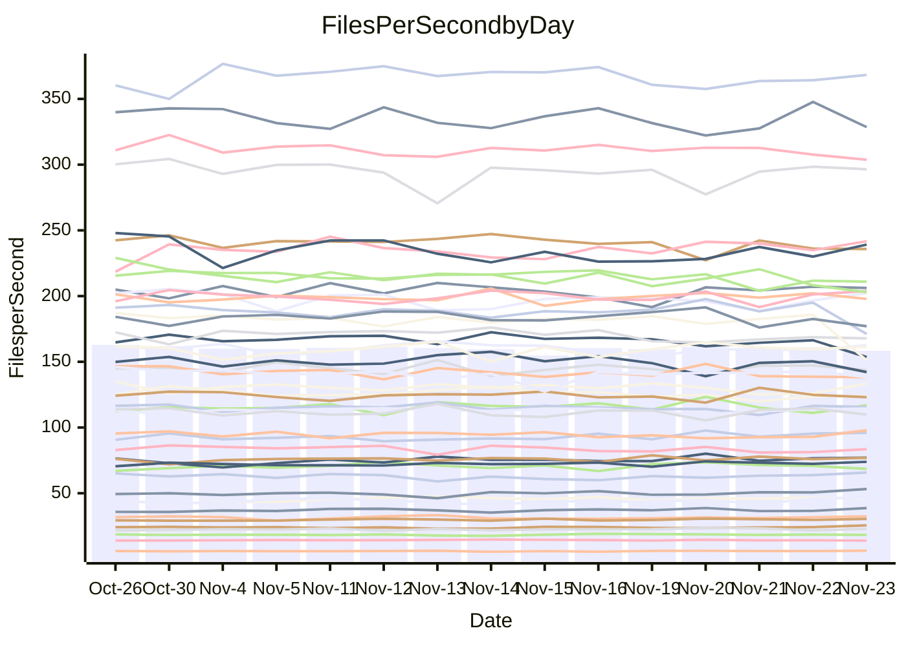

<!---
# This file is auto-generated. Do not edit.
# cspell:disable
--->
# Performance Report

## Daily Performance

## Time to Process Files

| Repository                                      | Elapsed | Min/Avg/Max           |    SD | SD Graph                |
| ----------------------------------------------- | ------: | :-------------------: | ----: | ----------------------- |
| AdaDoom3/AdaDoom3                    |    3.38 | 3.3 /   3.5 /   3.7   |  0.09 | `     ┣━┻●━╋━━┻━┫     ` |
| alexiosc/megistos                    |    7.57 | 7.3 /   7.8 /   8.7   |  0.32 | `    ┣━━┻●━╋━━┻━━┫    ` |
| apollographql/apollo-server          |    2.64 | 2.6 /   2.7 /   3.2   |  0.12 | `     ┣━●━━╋━━┻━┫     ` |
| aspnetboilerplate/aspnetboilerplate  |   11.26 | 10.3 /  10.7 /  11.8  |  0.35 | `    ┣━━┻━━╋━━┻━●┫    ` |
| aws-amplify/docs                     |   13.61 | 12.4 /  13.3 /  14.8  |  0.52 | `    ┣━━┻━━╋━●┻━━┫    ` |
| Azure/azure-rest-api-specs           |    9.89 | 9.6 /  10.1 /  11.2   |  0.40 | `    ┣━━┻●━╋━━┻━━┫    ` |
| bitjson/typescript-starter           |    1.09 | 1.0 /   1.1 /   1.1   |  0.03 | `     ┣━━┻━╋●┻━━┫     ` |
| caddyserver/caddy                    |    3.74 | 3.4 /   3.8 /   4.0   |  0.10 | `     ┣━┻━●╋━━┻━┫     ` |
| canada-ca/open-source-logiciel-libre |    1.11 | 1.1 /   1.2 /   1.3   |  0.04 | `     ┣━●┻━╋━┻━━┫     ` |
| chef/chef                            |    6.02 | 5.7 /   6.0 /   6.4   |  0.16 | `    ┣━━┻━━╋●━┻━━┫    ` |
| dart-lang/sdk                        |   66.76 | 63.7 /  67.6 /  72.3  |  2.04 | `   ┣━━┻━●━╋━━━┻━━┫   ` |
| django/django                        |   19.09 | 14.9 /  15.8 /  17.2  |  0.47 | `       ┣━┻╋┻━┫      ●` |
| eslint/eslint                        |   12.20 | 10.5 /  11.1 /  11.8  |  0.35 | `    ┣━━┻━━╋━━┻━━┫   ●` |
| exonum/exonum                        |    3.60 | 3.4 /   3.7 /   4.0   |  0.13 | `     ┣━┻●━╋━━┻━┫     ` |
| flutter/samples                      |   17.35 | 16.0 /  17.0 /  19.0  |  0.60 | `    ┣━━┻━━╋━●┻━━┫    ` |
| gitbucket/gitbucket                  |    3.61 | 3.5 /   3.7 /   3.9   |  0.10 | `     ┣━┻━●╋━━┻━┫     ` |
| googleapis/google-cloud-cpp          |  151.54 | 139.9 / 149.7 / 209.7 | 11.58 | `  ┣━━━┻━━━╋●━━┻━━━┫  ` |
| graphql/express-graphql              |    1.14 | 1.1 /   1.2 /   1.3   |  0.05 | `     ┣━━┻●╋━┻━━┫     ` |
| graphql/graphql-js                   |    2.99 | 2.8 /   3.0 /   3.2   |  0.11 | `     ┣━┻━━╋●━┻━┫     ` |
| graphql/graphql-relay-js             |    1.10 | 1.1 /   1.2 /   1.2   |  0.03 | `     ●━━┻━╋━┻━━┫     ` |
| graphql/graphql-spec                 |    1.36 | 1.3 /   1.3 /   1.4   |  0.03 | `     ┣━━┻━╋━●━━┫     ` |
| iluwatar/java-design-patterns        |   14.01 | 12.6 /  13.3 /  14.4  |  0.39 | `    ┣━━┻━━╋━━┻━●┫    ` |
| ktaranov/sqlserver-kit               |    6.62 | 6.5 /   6.8 /   7.3   |  0.19 | `    ┣━━●━━╋━━┻━━┫    ` |
| liriliri/licia                       |    4.37 | 4.1 /   4.3 /   4.6   |  0.12 | `     ┣━┻━━╋━●┻━┫     ` |
| MartinThoma/LaTeX-examples           |    6.91 | 6.8 /   7.1 /   7.9   |  0.26 | `    ┣━━┻●━╋━━┻━━┫    ` |
| mdx-js/mdx                           |    2.06 | 1.9 /   2.0 /   2.2   |  0.07 | `     ┣━┻━━╋━●┻━┫     ` |
| microsoft/TypeScript-Website         |    5.71 | 5.5 /   5.8 /   6.5   |  0.20 | `    ┣━━┻●━╋━━┻━━┫    ` |
| MicrosoftDocs/PowerShell-Docs        |   24.65 | 22.9 /  24.3 /  26.2  |  0.80 | `    ┣━━┻━━╋━●┻━━┫    ` |
| neovim/nvim-lspconfig                |    4.53 | 4.3 /   4.5 /   4.7   |  0.10 | `     ┣━┻━━╋━●┻━┫     ` |
| pagekit/pagekit                      |    3.59 | 3.5 /   3.7 /   4.3   |  0.15 | `     ┣━┻━●╋━━┻━┫     ` |
| php/php-src                          |   27.08 | 25.9 /  27.1 /  29.3  |  0.87 | `   ┣━━━┻━━●━━┻━━━┫   ` |
| plasticrake/tplink-smarthome-api     |    1.34 | 1.3 /   1.4 /   1.5   |  0.05 | `     ┣━┻●━╋━━┻━┫     ` |
| prettier/prettier                    |    7.99 | 7.2 /   7.8 /   8.3   |  0.18 | `    ┣━━┻━━╋━━┻●━┫    ` |
| pycontribs/jira                      |    1.48 | 1.5 /   1.6 /   1.7   |  0.06 | `     ┣●┻━━╋━━┻━┫     ` |
| RustPython/RustPython                |    5.67 | 5.2 /   5.6 /   6.0   |  0.22 | `    ┣━━┻━━╋●━┻━━┫    ` |
| shoelace-style/shoelace              |    3.06 | 2.9 /   3.0 /   3.2   |  0.09 | `     ┣━┻━━╋●━┻━┫     ` |
| slint-ui/slint                       |   14.52 | 13.3 /  13.9 /  15.0  |  0.38 | `    ┣━━┻━━╋━━┻━●┫    ` |
| SoftwareBrothers/admin-bro           |    2.87 | 2.5 /   2.6 /   2.8   |  0.06 | `     ┣━┻━━╋━━┻━┫    ●` |
| sveltejs/svelte                      |   21.91 | 20.8 /  21.9 /  22.9  |  0.49 | `    ┣━━┻━━●━━┻━━┫    ` |
| TheAlgorithms/Python                 |    5.93 | 5.6 /   5.8 /   6.2   |  0.13 | `    ┣━━┻━━╋━━●━━┫    ` |
| twbs/bootstrap                       |    1.79 | 1.8 /   1.9 /   2.4   |  0.11 | `     ┣━┻●━╋━━┻━┫     ` |
| typescript-cheatsheets/react         |    1.37 | 1.3 /   1.4 /   1.6   |  0.06 | `     ┣━●━━╋━━┻━┫     ` |
| typescript-eslint/typescript-eslint  |    4.35 | 4.2 /   4.4 /   4.7   |  0.12 | `     ┣━┻━━●━━┻━┫     ` |
| vitest-dev/vitest                    |    9.67 | 9.2 /   9.9 /  10.9   |  0.44 | `    ┣━━┻━●╋━━┻━━┫    ` |
| w3c/aria-practices                   |    3.58 | 3.4 /   3.6 /   3.8   |  0.10 | `     ┣━┻━●╋━━┻━┫     ` |
| w3c/specberus                        |    2.01 | 2.0 /   2.1 /   2.2   |  0.06 | `     ┣━●━━╋━━┻━┫     ` |
| webdeveric/webpack-assets-manifest   |    1.17 | 1.2 /   1.2 /   1.4   |  0.05 | `     ┣●━┻━╋━┻━━┫     ` |
| webpack/webpack                      |    5.65 | 5.5 /   5.8 /   6.7   |  0.23 | `    ┣━━┻●━╋━━┻━━┫    ` |
| wireapp/wire-desktop                 |    1.32 | 1.3 /   1.5 /   1.7   |  0.09 | `     ┣●┻━━╋━━┻━┫     ` |
| wireapp/wire-webapp                  |   10.96 | 10.6 /  11.2 /  12.6  |  0.52 | `    ┣━━┻●━╋━━┻━━┫    ` |

Note:
- Elapsed time is in seconds.

## Files per Second over Time

| Repository                                      | Files |    Sec |    Fps |     Rel | Trend Fps              |    N |
| ----------------------------------------------- | ----: | -----: | -----: | ------: | ---------------------- | ---: |
| AdaDoom3/AdaDoom3                    |   103 |   3.38 |  30.46 |   2.28% | `▄▇▆▇▆▅▇█▆▅▆▅▇▅▇▇▆▆▅▇` |   31 |
| alexiosc/megistos                    |   583 |   7.57 |  77.00 |   3.11% | `▆▆▆▄▇▆▅▇▇▆▆▆▆▅█▆▆▆█▇` |   31 |
| apollographql/apollo-server          |   253 |   2.64 |  95.97 |   4.15% | `▆▇▇▃▆▆▇▇▅▇▆▆█▆█▇▇█▇█` |   31 |
| aspnetboilerplate/aspnetboilerplate  |  2286 |  11.26 | 203.01 |  -5.11% | `▆▄██▇▇▅█▅▇▆▆▆▅▇██▆▆▅` |   31 |
| aws-amplify/docs                     |  2871 |  13.61 | 210.99 |  -2.06% | `▅▆▆▆▇▇██▆█▇▇▇▅▇▄▆▆▇▆` |   31 |
| Azure/azure-rest-api-specs           |  2365 |   9.89 | 239.20 |   1.87% | `██▇█▆▅▆▇▇▅▃▇▄▇▆▇▆▇▅▇` |   31 |
| bitjson/typescript-starter           |    20 |   1.09 |  18.27 |  -1.15% | `▇▇▇▆▅▄▆▇▆██▆▇█▇▅▆▆▇▆` |   31 |
| caddyserver/caddy                    |   288 |   3.74 |  76.91 |   0.75% | `▅▆▄▆▅▅▅▅▅▄▅▆▆█▅▆▆▄▆▅` |   31 |
| canada-ca/open-source-logiciel-libre |     7 |   1.11 |   6.29 |   5.11% | `▇▆█▅▇▃▆▅▇▄▆▇▇█▇▆▇▆▇█` |   31 |
| chef/chef                            |  1191 |   6.02 | 197.78 |  -0.60% | `▆▅▇█▆█▆▇▄▆▇▇█▇▇█▅▇▇▆` |   31 |
| dart-lang/sdk                        | 10778 |  66.76 | 161.45 |   1.51% | `▆▇▇▇█▄▆█▇▅▅▇▇███▆▆▇▇` |   31 |
| django/django                        |  2885 |  19.09 | 151.12 | -17.42% | `▇▆▆▄▇▆▆█▅▆▇▇▇▅▆▇▆▆█▁` |   31 |
| eslint/eslint                        |  2089 |  12.20 | 171.19 |  -9.52% | `▄▅█▆▆▅▆▆▇▆██▄▆█▅▇▇█▃` |   31 |
| exonum/exonum                        |   421 |   3.60 | 117.00 |   2.08% | `▆▆▄▃▇▆▆▆▆▇▄▆▅▆█▆▆▄▅▆` |   31 |
| flutter/samples                      |  2400 |  17.35 | 138.37 |  -2.23% | `▆▇▃▆▇▇▅▇▆▇█▅▅▆█▇▆▇▅▆` |   31 |
| gitbucket/gitbucket                  |   413 |   3.61 | 114.46 |   1.17% | `▆█▆▇▇▆▅▇█▇▆▄▇▇▅▆▆▆▇▇` |   31 |
| googleapis/google-cloud-cpp          | 20955 | 151.54 | 138.28 |  -1.56% | `█▇██▇▇▂█▇█▇▇█▇██▇██▇` |   31 |
| graphql/express-graphql              |    26 |   1.14 |  22.82 |   1.91% | `▆▄▅▆▆▅▄▅█▆▃█▅██▇▇▄▆▆` |   31 |
| graphql/graphql-js                   |   368 |   2.99 | 123.12 |  -1.10% | `▇▇▇▄▆▆▇▇▇▆▇▄▇▆▅▇█▇▆▆` |   31 |
| graphql/graphql-relay-js             |    28 |   1.10 |  25.56 |   6.66% | `▅▆▆▆▄▅▆▇▇▆▄▄▇▆▅▆▆▇▅█` |   31 |
| graphql/graphql-spec                 |    19 |   1.36 |  13.95 |  -2.09% | `▇█▅▆▇██▇█▇▅▅▇▆█▆▇▇▆▆` |   31 |
| iluwatar/java-design-patterns        |  1992 |  14.01 | 142.14 |  -5.08% | `▆▅▆▇██▇▇▆▇▇▇▆▆▄▆▇▇▆▅` |   31 |
| ktaranov/sqlserver-kit               |   489 |   6.62 |  73.90 |   3.04% | `▆█▆▅▇▇▇▆▇▇█▆▄▅█▇██▅█` |   31 |
| liriliri/licia                       |  1437 |   4.37 | 328.52 |  -2.05% | `▆▇██▆▆▆▇█▇▅▇▇▆▅▆▆██▆` |   31 |
| MartinThoma/LaTeX-examples           |  1409 |   6.91 | 203.88 |   2.75% | `▆█▆▃▇█▇▇█▆▇▇▆▅▇▇▄▇▇█` |   31 |
| mdx-js/mdx                           |   141 |   2.06 |  68.53 |  -3.00% | `▆███▇▆▇▅█▅▆▇█▇██▆▆▇▅` |   31 |
| microsoft/TypeScript-Website         |   761 |   5.71 | 133.37 |   1.94% | `▇█▃▇▇▆▇▇▇▆▇▇▇█▆▄▆▅▅▇` |   31 |
| MicrosoftDocs/PowerShell-Docs        |  2708 |  24.65 | 109.88 |  -1.61% | `▆█▆▄█▅▅▄▅▇▆▆▇▆▄▆▇█▇▆` |   31 |
| neovim/nvim-lspconfig                |   760 |   4.53 | 167.81 |  -1.53% | `█▇▇█▇█▆▇▇█▆▅▅▆▅▆▆▇▆▆` |   31 |
| pagekit/pagekit                      |   741 |   3.59 | 206.14 |   1.72% | `█▇▇▆█▇▇▇▆▆▃▇▆▅▇█▆▇▇▇` |   31 |
| php/php-src                          |  2262 |  27.08 |  83.53 |  -0.20% | `▇██▇▅███▅▆▄▆▆▇▇▆▅▆▅▆` |   31 |
| plasticrake/tplink-smarthome-api     |    62 |   1.34 |  46.39 |   2.93% | `▆▇▇▇█▇▇▅▇█▅▆▇▆▇▆▇█▇▇` |   31 |
| prettier/prettier                    |  2426 |   7.99 | 303.77 |  -2.47% | `██▄▇▆▇▇█▇██▇▇▇▇█▇▆█▆` |   31 |
| pycontribs/jira                      |    79 |   1.48 |  53.20 |   7.12% | `▅▅▅▇▄▇▇▆▅▇▄▆█▃▅▆▇▆▆█` |   31 |
| RustPython/RustPython                |   703 |   5.67 | 123.92 |  -1.03% | `▄▆▇▇▇█▇▇▇▇▅▆▇▇▆▅▅▆▆▆` |   31 |
| shoelace-style/shoelace              |   439 |   3.06 | 143.68 |  -0.96% | `▆▄▆▆█▅▆▅▇▇▇▆▇▄▅▇▇▇▇▆` |   31 |
| slint-ui/slint                       |  2570 |  14.52 | 177.02 |  -3.97% | `▇█▇▇▇▆▅▆▇▇▇▆█▇█▄▆▇▆▅` |   31 |
| SoftwareBrothers/admin-bro           |   441 |   2.87 | 153.59 |  -8.07% | `▇█▇█▆██▇▇▇█▇▆▆▅█▄▇▆▃` |   31 |
| sveltejs/svelte                      |  8068 |  21.91 | 368.22 |   0.39% | `█▇▇▇▆▇▆▆█▇▆▆▆▅▅▆▆▇▅▆` |   31 |
| TheAlgorithms/Python                 |  1399 |   5.93 | 235.78 |  -2.14% | `█▅██▇█▇▆█▆▆▆▇▇▄▇▇▆▆▆` |   31 |
| twbs/bootstrap                       |   118 |   1.79 |  65.76 |   4.47% | `▇▇█▇▅▇██▂▆▅▇██▆▆█▇▇█` |   31 |
| typescript-cheatsheets/react         |    53 |   1.37 |  38.70 |   4.72% | `▇▆▇█▆▄▆▆▆▆▄▆▆▇▇▅▆▃█▇` |   31 |
| typescript-eslint/typescript-eslint  |  1290 |   4.35 | 296.48 |   0.24% | `█▆▇█▄██▆█▇▇▇▇█▅▆█▇█▇` |   31 |
| vitest-dev/vitest                    |  2338 |   9.67 | 241.77 |   3.36% | `█▆▆▇▆▆▄▅▇▇▇▆▄▇▇▇▇▆▇▇` |   31 |
| w3c/aria-practices                   |   414 |   3.58 | 115.65 |   0.60% | `▅▇▇▆█▆█▆▇▇▇█▄▆▆▅▄█▇▇` |   31 |
| w3c/specberus                        |   197 |   2.01 |  97.96 |   3.58% | `▅▇▇█▇▇█▇▇▆█▇▅▇▆▄█▆▆█` |   31 |
| webdeveric/webpack-assets-manifest   |    55 |   1.17 |  46.91 |   6.17% | `█▅▆▇▅▃█▅▄▅▆▄▅▆▆▄▅▇▇█` |   31 |
| webpack/webpack                      |  1143 |   5.65 | 202.22 |   2.70% | `▇██▇▆▆▇▇▇▇▆█▇▇▇▆▅▆██` |   31 |
| wireapp/wire-desktop                 |    43 |   1.32 |  32.47 |   4.24% | `▆▇█▇█▆▅█▅▆▇▇▄▇▇▇▆▇▇▇` |   31 |
| wireapp/wire-webapp                  |  1783 |  10.96 | 162.75 |   2.21% | `▇█▅██▇▇▇█▆▇▇▃▅▇▆▇▅█▇` |   31 |

## Data Throughput

| Repository                                      | Files |    Sec |     Kps |     Rel | Trend Kps              |    N |
| ----------------------------------------------- | ----: | -----: | ------: | ------: | ---------------------- | ---: |
| AdaDoom3/AdaDoom3                    |   103 |   3.38 |  647.41 |   2.28% | `▄▇▆▇▆▅▇█▆▅▆▅▇▅▇▇▆▆▅▇` |   31 |
| alexiosc/megistos                    |   583 |   7.57 |  605.00 |   3.11% | `▆▆▆▄▇▆▅▇▇▆▆▆▆▅█▆▆▆█▇` |   31 |
| apollographql/apollo-server          |   253 |   2.64 |  784.07 |   4.31% | `▆▇▇▃▆▆▇▇▅▇▆▆█▆█▇▇█▇█` |   31 |
| aspnetboilerplate/aspnetboilerplate  |  2286 |  11.26 |  493.93 |  -5.11% | `▆▄██▇▇▅█▅▇▆▆▆▅▇██▆▆▅` |   31 |
| aws-amplify/docs                     |  2871 |  13.61 |  736.39 |  -2.08% | `▅▆▆▆▇▇██▆█▇▇▇▅▇▄▆▆▇▆` |   31 |
| Azure/azure-rest-api-specs           |  2365 |   9.89 |  650.83 |   2.16% | `██▇█▆▅▆▇▇▅▃▇▄▇▆▇▇▇▅▇` |   31 |
| bitjson/typescript-starter           |    20 |   1.09 |   73.07 |  -1.15% | `▇▇▇▆▅▄▆▇▆██▆▇█▇▅▆▆▇▆` |   31 |
| caddyserver/caddy                    |   288 |   3.74 |  667.86 |   0.84% | `▅▆▄▆▅▅▅▅▅▄▅▆▆█▅▆▆▄▆▅` |   31 |
| canada-ca/open-source-logiciel-libre |     7 |   1.11 |   52.10 |   5.11% | `▇▆█▅▇▃▆▅▇▄▆▇▇█▇▆▇▆▇█` |   31 |
| chef/chef                            |  1191 |   6.02 |  918.33 |  -0.46% | `▆▅▇█▆█▆▇▄▆▇▇█▇▇█▅▇▇▆` |   31 |
| dart-lang/sdk                        | 10778 |  66.76 | 1103.70 |   1.69% | `▆▇▇▇█▅▆█▇▅▅▇▇███▆▆▇▇` |   31 |
| django/django                        |  2885 |  19.09 |  948.78 | -17.45% | `▇▆▆▄▇▆▆█▅▆▇▇▇▅▆▇▆▆█▁` |   31 |
| eslint/eslint                        |  2089 |  12.20 | 1161.69 | -13.09% | `▅▆█▇▇▆▆▆▇▇▆▆▃▅▆▄▆▅▇▂` |   31 |
| exonum/exonum                        |   421 |   3.60 | 1119.15 |   2.08% | `▆▆▄▃▇▆▆▆▆▇▄▆▅▆█▆▆▄▅▆` |   31 |
| flutter/samples                      |  2400 |  17.35 | 1234.74 |  -2.23% | `▆▇▃▆▇▇▅▇▆▇█▅▅▆█▇▆▇▅▆` |   31 |
| gitbucket/gitbucket                  |   413 |   3.61 |  520.18 |   1.17% | `▆█▆▇▇▆▅▇█▇▆▄▇▇▅▆▆▆▇▇` |   31 |
| googleapis/google-cloud-cpp          | 20955 | 151.54 | 1126.53 |  -1.42% | `█▇██▇▇▂█▇█▇▇█▇██▇██▇` |   31 |
| graphql/express-graphql              |    26 |   1.14 |  104.44 |   1.91% | `▆▄▅▆▆▅▄▅█▆▃█▅██▇▇▄▆▆` |   31 |
| graphql/graphql-js                   |   368 |   2.99 |  714.63 |  -1.05% | `▇▇▇▄▆▆▇▇▇▆▇▄▇▆▅▇█▇▆▆` |   31 |
| graphql/graphql-relay-js             |    28 |   1.10 |  100.40 |   6.66% | `▅▆▆▆▄▅▆▇▇▆▄▄▇▆▅▆▆▇▅█` |   31 |
| graphql/graphql-spec                 |    19 |   1.36 |  465.32 |  -2.09% | `▇█▅▆▇██▇█▇▅▅▇▆█▆▇▇▆▆` |   31 |
| iluwatar/java-design-patterns        |  1992 |  14.01 |  439.34 |  -5.08% | `▆▅▆▇██▇▇▆▇▇▇▆▆▄▆▇▇▆▅` |   31 |
| ktaranov/sqlserver-kit               |   489 |   6.62 | 1119.12 |   3.04% | `▆█▆▅▇▇▇▆▇▇█▆▄▅█▇██▅█` |   31 |
| liriliri/licia                       |  1437 |   4.37 |  391.39 |  -2.05% | `▆▇██▆▆▆▇█▇▅▇▇▆▅▆▆██▆` |   31 |
| MartinThoma/LaTeX-examples           |  1409 |   6.91 |  421.06 |   2.75% | `▆█▆▃▇█▇▇█▆▇▇▆▅▇▇▄▇▇█` |   31 |
| mdx-js/mdx                           |   141 |   2.06 |  318.85 |  -3.00% | `▆███▇▆▇▅█▅▆▇█▇██▆▆▇▅` |   31 |
| microsoft/TypeScript-Website         |   761 |   5.71 |  922.58 |   1.94% | `▇█▃▇▇▆▇▇▇▆▇▇▇█▆▄▆▅▅▇` |   31 |
| MicrosoftDocs/PowerShell-Docs        |  2708 |  24.65 | 1131.45 |  -1.60% | `▆█▆▄█▅▅▄▅▇▆▆▇▆▄▆▇█▇▆` |   31 |
| neovim/nvim-lspconfig                |   760 |   4.53 |  311.56 |   5.99% | `▆▅▅▆▅▆▄▅▅▅█▇▇▇▇▇▇█▇█` |   31 |
| pagekit/pagekit                      |   741 |   3.59 |  429.82 |   1.72% | `█▇▇▆█▇▇▇▆▆▃▇▆▅▇█▆▇▇▇` |   31 |
| php/php-src                          |  2262 |  27.08 | 1464.40 |  -0.07% | `▇██▇▅███▅▆▄▆▆▇▇▆▅▆▅▇` |   31 |
| plasticrake/tplink-smarthome-api     |    62 |   1.34 |  250.65 |   2.93% | `▆▇▇▇█▇▇▅▇█▅▆▇▆▇▆▇█▇▇` |   31 |
| prettier/prettier                    |  2426 |   7.99 |  421.22 |  -2.68% | `██▄▇▆▇▇█▇██▇▇▆▇█▇▆▇▆` |   31 |
| pycontribs/jira                      |    79 |   1.48 |  377.12 |   7.12% | `▅▅▅▇▄▇▇▆▅▇▄▆█▃▅▆▇▆▆█` |   31 |
| RustPython/RustPython                |   703 |   5.67 | 1265.33 |  14.72% | `▃▃▄▄▄▅▄▄▄▄▇████▇▇█▇█` |   31 |
| shoelace-style/shoelace              |   439 |   3.06 |  694.20 |  -0.96% | `▆▄▆▆█▅▆▅▇▇▇▆▇▄▅▇▇▇▇▆` |   31 |
| slint-ui/slint                       |  2570 |  14.52 | 1096.08 |  -3.66% | `▇█▇▇▇▆▅▆▇▇▇▆█▇█▄▆▇▆▅` |   31 |
| SoftwareBrothers/admin-bro           |   441 |   2.87 |  338.53 |  -8.07% | `▇█▇█▆██▇▇▇█▇▆▆▅█▄▇▆▃` |   31 |
| sveltejs/svelte                      |  8068 |  21.91 |  245.54 |   0.34% | `█▇▇▇▆▇▆▆█▇▆▆▆▅▅▆▆▇▅▆` |   31 |
| TheAlgorithms/Python                 |  1399 |   5.93 |  599.64 |  -2.14% | `█▅██▇█▇▆█▆▆▆▇▇▄▇▇▆▆▆` |   31 |
| twbs/bootstrap                       |   118 |   1.79 |  539.98 |   4.51% | `▇▇█▇▅▇██▂▆▅▇██▆▆█▇▇█` |   31 |
| typescript-cheatsheets/react         |    53 |   1.37 |  286.26 |   4.72% | `▇▆▇█▆▄▆▆▆▆▄▆▆▇▇▅▆▃█▇` |   31 |
| typescript-eslint/typescript-eslint  |  1290 |   4.35 | 1530.87 |   0.45% | `█▆▇█▄██▆█▇▇▇▇█▅▆█▇█▇` |   31 |
| vitest-dev/vitest                    |  2338 |   9.67 |  519.43 |   2.16% | `█▆▅▇▆▅▃▅▇▆▇▅▃▇▇▇▇▅▇▇` |   31 |
| w3c/aria-practices                   |   414 |   3.58 | 1078.29 |   0.60% | `▅▇▇▆█▆█▆▇▇▇█▄▆▆▅▄█▇▇` |   31 |
| w3c/specberus                        |   197 |   2.01 |  309.79 |   3.58% | `▅▇▇█▇▇█▇▇▆█▇▅▇▆▄█▆▆█` |   31 |
| webdeveric/webpack-assets-manifest   |    55 |   1.17 |  108.33 |   6.17% | `█▅▆▇▅▃█▅▄▅▆▄▅▆▆▄▅▇▇█` |   31 |
| webpack/webpack                      |  1143 |   5.65 |  923.54 |   2.96% | `▇██▇▆▆▇▇▇▇▆██▇▇▆▆▆██` |   31 |
| wireapp/wire-desktop                 |    43 |   1.32 |  143.46 | -12.21% | `▇██▇█▇▆█▆▇▃▄▂▃▃▃▃▃▄▄` |   31 |
| wireapp/wire-webapp                  |  1783 |  10.96 |  602.61 |   2.36% | `▇█▅██▇▇▇█▆▇▇▃▅▇▆▇▅█▇` |   31 |

