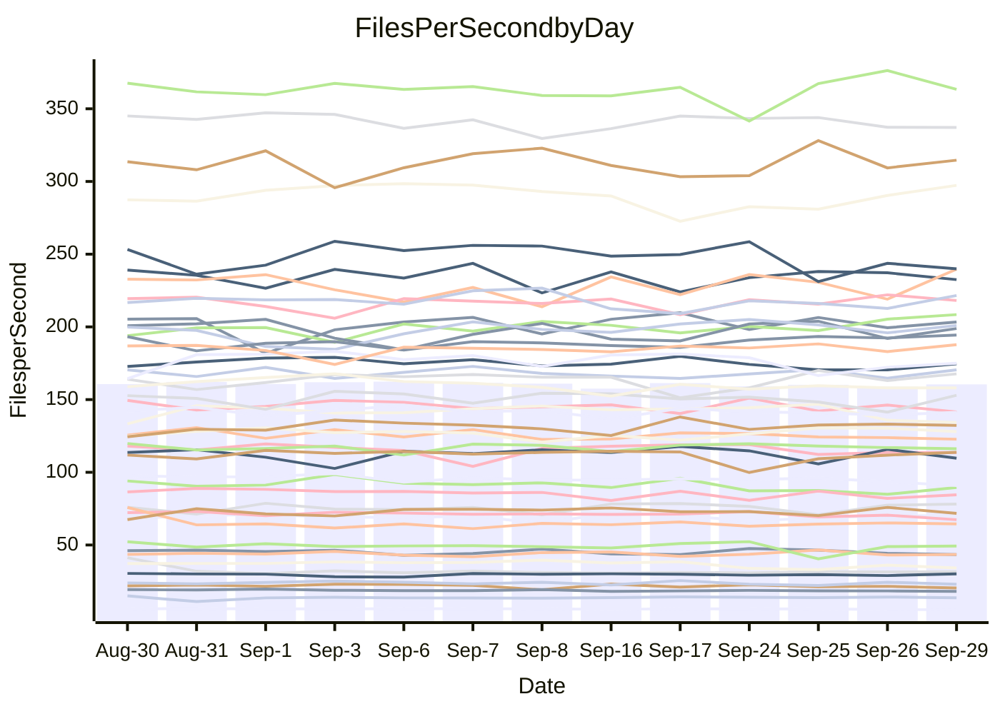

<!---
# This file is auto-generated. Do not edit.
# cspell:disable
--->
# Performance Report

## Daily Performance

## Time to Process Files

| Repository                                      | Elapsed | Min/Avg/Max           |   SD | SD Graph                |
| ----------------------------------------------- | ------: | :-------------------: | ---: | ----------------------- |
| AdaDoom3/AdaDoom3                    |    3.41 | 3.4 /   3.5 /   4.5   | 0.25 | `    ┣━━┻━●╋━━┻━━┫    ` |
| alexiosc/megistos                    |    8.12 | 7.5 /   8.0 /   9.4   | 0.46 | `    ┣━━┻━━╋●━┻━━┫    ` |
| apollographql/apollo-server          |    2.81 | 2.6 /   2.8 /   3.0   | 0.13 | `    ┣━━┻━━╋●━┻━━┫    ` |
| aspnetboilerplate/aspnetboilerplate  |   10.48 | 10.2 /  10.5 /  11.1  | 0.23 | `    ┣━━┻━━●━━┻━━┫    ` |
| aws-amplify/docs                     |   12.96 | 12.5 /  13.2 /  14.2  | 0.43 | `    ┣━━┻●━╋━━┻━━┫    ` |
| Azure/azure-rest-api-specs           |   10.18 | 9.4 /   9.8 /  10.6   | 0.34 | `    ┣━━┻━━╋━━●━━┫    ` |
| bitjson/typescript-starter           |    1.11 | 1.0 /   1.1 /   1.1   | 0.03 | `     ┣━┻━━╋━━┻●┫     ` |
| caddyserver/caddy                    |    3.66 | 3.6 /   3.8 /   4.3   | 0.17 | `    ┣━━┻●━╋━━┻━━┫    ` |
| canada-ca/open-source-logiciel-libre |    1.29 | 1.1 /   1.2 /   1.3   | 0.04 | `     ┣━┻━━╋━━┻━┫  ●  ` |
| chef/chef                            |    5.79 | 5.8 /   6.1 /   6.6   | 0.18 | `    ┣●━┻━━╋━━┻━━┫    ` |
| dart-lang/sdk                        |   66.84 | 64.5 /  67.3 /  73.0  | 1.85 | `  ┣━━━┻━━●╋━━━┻━━━┫  ` |
| django/django                        |   15.32 | 14.9 /  15.5 /  16.4  | 0.35 | `    ┣━━┻━●╋━━┻━━┫    ` |
| eslint/eslint                        |   10.77 | 10.7 /  11.1 /  11.9  | 0.30 | `    ┣━━●━━╋━━┻━━┫    ` |
| exonum/exonum                        |    3.84 | 3.6 /   3.7 /   4.1   | 0.13 | `    ┣━━┻━━╋━━●━━┫    ` |
| flutter/samples                      |   17.87 | 16.3 /  17.0 /  19.7  | 0.79 | `   ┣━━━┻━━╋━━┻●━━┫   ` |
| gitbucket/gitbucket                  |    3.64 | 3.5 /   3.6 /   4.0   | 0.15 | `    ┣━━┻━━╋●━┻━━┫    ` |
| googleapis/google-cloud-cpp          |  147.08 | 139.0 / 146.1 / 163.3 | 5.12 | `  ┣━━━┻━━━╋●━━┻━━━┫  ` |
| graphql/express-graphql              |    1.27 | 1.1 /   1.2 /   1.4   | 0.06 | `     ┣━┻━━╋━━┻●┫     ` |
| graphql/graphql-js                   |    2.97 | 2.7 /   2.9 /   3.1   | 0.09 | `     ┣━┻━━╋━●┻━┫     ` |
| graphql/graphql-relay-js             |    1.21 | 1.1 /   1.2 /   1.3   | 0.06 | `     ┣━┻━━╋━●┻━┫     ` |
| graphql/graphql-spec                 |    1.38 | 1.0 /   1.3 /   1.5   | 0.12 | `     ┣━┻━━╋━●┻━┫     ` |
| iluwatar/java-design-patterns        |   13.02 | 12.8 /  13.2 /  14.9  | 0.49 | `    ┣━━┻━●╋━━┻━━┫    ` |
| ktaranov/sqlserver-kit               |    7.26 | 6.6 /   6.8 /   7.1   | 0.16 | `    ┣━━┻━━╋━━┻━━┫ ●  ` |
| liriliri/licia                       |    4.26 | 4.1 /   4.2 /   4.4   | 0.08 | `    ┣━━┻━━╋━●┻━━┫    ` |
| MartinThoma/LaTeX-examples           |    7.08 | 6.9 /   7.2 /   7.8   | 0.27 | `    ┣━━┻━●╋━━┻━━┫    ` |
| mdx-js/mdx                           |    2.01 | 1.9 /   2.0 /   2.2   | 0.07 | `     ┣━┻━●╋━━┻━┫     ` |
| microsoft/TypeScript-Website         |    5.75 | 5.5 /   5.8 /   6.5   | 0.28 | `    ┣━━┻━●╋━━┻━━┫    ` |
| MicrosoftDocs/PowerShell-Docs        |   23.81 | 23.3 /  24.2 /  27.1  | 0.83 | `   ┣━━━┻●━╋━━┻━━━┫   ` |
| neovim/nvim-lspconfig                |    4.36 | 4.2 /   4.3 /   4.5   | 0.09 | `    ┣━━┻━━╋●━┻━━┫    ` |
| pagekit/pagekit                      |    3.64 | 3.5 /   3.7 /   4.1   | 0.12 | `    ┣━━┻━━●━━┻━━┫    ` |
| php/php-src                          |   27.19 | 25.3 /  26.8 /  29.3  | 1.08 | `   ┣━━━┻━━╋●━┻━━━┫   ` |
| plasticrake/tplink-smarthome-api     |    1.43 | 1.3 /   1.4 /   1.6   | 0.07 | `     ┣━┻━━╋━●┻━┫     ` |
| prettier/prettier                    |    7.42 | 7.0 /   7.4 /   7.9   | 0.26 | `    ┣━━┻━━╋●━┻━━┫    ` |
| pycontribs/jira                      |    1.60 | 1.5 /   1.6 /   2.0   | 0.10 | `     ┣━┻━━●━━┻━┫     ` |
| RustPython/RustPython                |    5.37 | 5.2 /   5.4 /   5.7   | 0.15 | `    ┣━━┻━●╋━━┻━━┫    ` |
| shoelace-style/shoelace              |    3.10 | 2.9 /   3.0 /   3.1   | 0.07 | `     ┣━┻━━╋━━┻●┫     ` |
| slint-ui/slint                       |   14.38 | 12.2 /  12.8 /  15.5  | 0.72 | `    ┣━━┻━━╋━━┻━━┫●   ` |
| SoftwareBrothers/admin-bro           |    2.59 | 2.5 /   2.6 /   2.8   | 0.06 | `     ┣━┻●━╋━━┻━┫     ` |
| sveltejs/svelte                      |   21.83 | 20.2 /  21.6 /  23.2  | 0.57 | `   ┣━━━┻━━╋●━┻━━━┫   ` |
| TheAlgorithms/Python                 |    6.00 | 5.7 /   5.9 /   6.3   | 0.19 | `    ┣━━┻━━╋●━┻━━┫    ` |
| twbs/bootstrap                       |    1.83 | 1.5 /   1.8 /   2.0   | 0.12 | `     ┣━┻━━●━━┻━┫     ` |
| typescript-cheatsheets/react         |    1.55 | 1.3 /   1.4 /   1.6   | 0.07 | `     ┣━┻━━╋━━┻━●     ` |
| typescript-eslint/typescript-eslint  |    4.30 | 4.3 /   4.4 /   4.7   | 0.14 | `    ┣━━┻●━╋━━┻━━┫    ` |
| vitest-dev/vitest                    |    9.27 | 9.2 /   9.8 /  12.0   | 0.68 | `    ┣━━┻●━╋━━┻━━┫    ` |
| w3c/aria-practices                   |    3.56 | 3.4 /   3.5 /   3.8   | 0.10 | `    ┣━━┻━━╋●━┻━━┫    ` |
| w3c/specberus                        |    2.18 | 2.0 /   2.1 /   2.2   | 0.05 | `     ┣━┻━━╋━━┻━┫●    ` |
| webdeveric/webpack-assets-manifest   |    1.24 | 1.2 /   1.2 /   1.3   | 0.04 | `     ┣━┻━━╋●━┻━┫     ` |
| webpack/webpack                      |    5.54 | 5.3 /   5.7 /   6.1   | 0.17 | `    ┣━━┻●━╋━━┻━━┫    ` |
| wireapp/wire-desktop                 |    1.36 | 1.0 /   1.3 /   1.4   | 0.12 | `     ┣━┻━━╋●━┻━┫     ` |
| wireapp/wire-webapp                  |   10.94 | 10.8 /  11.2 /  12.1  | 0.38 | `    ┣━━┻●━╋━━┻━━┫    ` |

Note:
- Elapsed time is in seconds.

## Files per Second over Time

| Repository                                      | Files |    Sec |    Fps |     Rel | Trend Fps              |    N |
| ----------------------------------------------- | ----: | -----: | -----: | ------: | ---------------------- | ---: |
| AdaDoom3/AdaDoom3                    |   103 |   3.41 |  30.17 |   2.04% | `█████▆█▂███▇███▇▇▆██` |   20 |
| alexiosc/megistos                    |   583 |   8.12 |  71.80 |  -1.56% | `▃▃▇█▆▆▇▇▇▇▇▇█▇▇▇▆█▇▆` |   20 |
| apollographql/apollo-server          |   252 |   2.81 |  89.53 |  -1.91% | `▄█▆▅▆█▆▆▆▄▇▆▅▆▇▄▅▄▃▅` |   20 |
| aspnetboilerplate/aspnetboilerplate  |  2286 |  10.48 | 218.14 |   0.20% | `▇█▇▇▆▅▇▇█▇▇▆▆█▅▇▆▇█▇` |   20 |
| aws-amplify/docs                     |  2871 |  12.96 | 221.60 |   2.04% | `▆▇▅█▆▆▇▄▇▇▇█▅▆▅▆▆▆▄▇` |   20 |
| Azure/azure-rest-api-specs           |  2442 |  10.18 | 239.90 |  -3.71% | `█▇▅▄▆█▇▇▇████▆▇█▄▅▆▅` |   20 |
| bitjson/typescript-starter           |    20 |   1.11 |  18.07 |  -3.86% | `▇▇▇▇█▆▆▆▆▆▆▇▄▆▆▆▆▆▅▅` |   20 |
| caddyserver/caddy                    |   286 |   3.66 |  78.18 |   3.82% | `▇▆▇▃█▆▆▆▇▆█▅███▇▅█▇█` |   20 |
| canada-ca/open-source-logiciel-libre |     7 |   1.29 |   5.41 | -10.45% | `▇▆█▇▇▇█▇██▇▇▇▃▇▇▆▄▆▃` |   20 |
| chef/chef                            |  1207 |   5.79 | 208.45 |   4.76% | `▇▄▆▇▇▅█▇▇▇▅▇▇▇▆▇▆█▇█` |   20 |
| dart-lang/sdk                        | 10563 |  66.84 | 158.04 |  -1.24% | `▅▇▇▇██▇▆█▆▇▆▆▄▇▆▆▆▆▆` |   20 |
| django/django                        |  2876 |  15.32 | 187.77 |   1.53% | `▇█▇▇▆▄▆▇██▆▇▆▆▇▇▇▅▇▇` |   20 |
| eslint/eslint                        |  2093 |  10.77 | 194.39 |   2.97% | `▇█▄▇▇▇▄▆▇▇▆▇▅▇▆▇██▇█` |   20 |
| exonum/exonum                        |   421 |   3.84 | 109.67 |  -3.21% | `▅█▇█▆▄▇▇▇▇▆▇▇▆█▇▄█▇▆` |   20 |
| flutter/samples                      |  2400 |  17.87 | 134.31 |  -4.90% | `▃▇███▇▆█▇▇██▇█▇██▄▇▆` |   20 |
| gitbucket/gitbucket                  |   413 |   3.64 | 113.59 |  -1.40% | `██▇▇█▇█▅█▄▄▇█▇██▆▇▆▆` |   20 |
| googleapis/google-cloud-cpp          | 20771 | 147.08 | 141.22 |  -0.54% | `▅▇▇▇▆▇█▆█▇▆▇▃▇▇▆▆▆▆▆` |   20 |
| graphql/express-graphql              |    26 |   1.27 |  20.47 |  -7.35% | `▄▆▆▇▆▇▇▇▇▆▇▃▆█▅▇▅▅▆▄` |   20 |
| graphql/graphql-js                   |   364 |   2.97 | 122.76 |  -2.43% | `▆▇█▆▅▇▄▆▇█▆▅▅▅▆▆▆▅▆▅` |   20 |
| graphql/graphql-relay-js             |    28 |   1.21 |  23.05 |  -3.29% | `▆▇▃█▇█▇▆█▆▅▇▃▆█▅▄▇▆▅` |   20 |
| graphql/graphql-spec                 |    19 |   1.38 |  13.74 |   0.04% | `██▂▂▅▆▄▆▆▅▅▅▆▅▆▆▆▆▆▆` |   20 |
| iluwatar/java-design-patterns        |  1992 |  13.02 | 152.96 |   1.61% | `█▇█▆▅█▇██▅▇███▇▇▇▇▃█` |   20 |
| ktaranov/sqlserver-kit               |   489 |   7.26 |  67.39 |  -5.86% | `▅▇█▆▆▇▅▇█▇▅▆▆▆▆▇▅▅▇▄` |   20 |
| liriliri/licia                       |  1437 |   4.26 | 337.13 |  -1.10% | `███▇██▇▇▆▇█▆▅████▇▆▇` |   20 |
| MartinThoma/LaTeX-examples           |  1409 |   7.08 | 198.88 |   1.67% | `█▆▇██▆▄▄▅▆▇█▆▅▅██▆▅▇` |   20 |
| mdx-js/mdx                           |   141 |   2.01 |  70.14 |   1.18% | `▆▄█▅▆▆▆▆▅▆▆▄▆█▆▄▆▇▅▆` |   20 |
| microsoft/TypeScript-Website         |   761 |   5.75 | 132.31 |   1.37% | `▅▃▇▅▆██▇▇▇▇▆▇▃█▆▇▆█▇` |   20 |
| MicrosoftDocs/PowerShell-Docs        |  2708 |  23.81 | 113.74 |   1.58% | `▇▇▅▇█▇▇██▆█▇█▇▇▃▆▇▇▇` |   20 |
| neovim/nvim-lspconfig                |   761 |   4.36 | 174.63 |  -0.02% | `▆▅▆███▇▆█▇█▆▇▇█▇▆▅▆▇` |   20 |
| pagekit/pagekit                      |   741 |   3.64 | 203.39 |   0.46% | `▆██▇▃▆▇█▇█▇▆█▇█▆▇▆▇▇` |   20 |
| php/php-src                          |  2299 |  27.19 |  84.54 |  -1.17% | `▆▆█▇▇▇▇▆█▇▆▇▅▄▇▄▇▆▄▆` |   20 |
| plasticrake/tplink-smarthome-api     |    62 |   1.43 |  43.43 |  -3.55% | `█▇▇▇▇▇▃▆▆▆▆██▄▅█▇▇▅▅` |   20 |
| prettier/prettier                    |  2334 |   7.42 | 314.63 |   0.86% | `█▆▇▅▇▄▆▄█▆██▆▆▅▅█▄█▇` |   20 |
| pycontribs/jira                      |    79 |   1.60 |  49.28 |  -0.18% | `███▅▇▇▇█▆▆█▆▆▆██▂▆▇▇` |   20 |
| RustPython/RustPython                |   687 |   5.37 | 127.99 |   0.85% | `▇▆▆▇▇▆▇▇▇▇▆▄▅▇▅▆▇█▇▇` |   20 |
| shoelace-style/shoelace              |   439 |   3.10 | 141.54 |  -3.22% | `█▇▆▅▆██▆█▇▅▆▇▇▅█▅▆▇▅` |   20 |
| slint-ui/slint                       |  2517 |  14.38 | 175.00 |  -0.50% | `▇▃█████▇▇▇█▇▇██▇▆▇▆▇` |   20 |
| SoftwareBrothers/admin-bro           |   441 |   2.59 | 170.44 |   1.33% | `█▇▇▅█▆▇▇▇▇█▇▅▇▆▆▇▅▇▇` |   20 |
| sveltejs/svelte                      |  7932 |  21.83 | 363.37 |  -0.13% | `▆▆▇▅▆▇▇▆▆▆▇▆▆▅▆▄▇█▇▆` |   20 |
| TheAlgorithms/Python                 |  1396 |   6.00 | 232.50 |  -1.31% | `█▆▅█▅▇▅█▅██▄▇▇▄▆▇▇▆▆` |   20 |
| twbs/bootstrap                       |   118 |   1.83 |  64.56 |  -1.70% | `█▅▄▄▄▃▃▄▄▄▂▄▃▄▄▃▄▄▄▄` |   20 |
| typescript-cheatsheets/react         |    53 |   1.55 |  34.22 |  -8.04% | `▅▇▇▅▆▇▇▇▇█▆█▇▆▇▄▃▅▆▄` |   20 |
| typescript-eslint/typescript-eslint  |  1279 |   4.30 | 297.31 |   2.40% | `▅█▄█▇██████▇▆█▄▆▅▆██` |   20 |
| vitest-dev/vitest                    |  2221 |   9.27 | 239.66 |   5.58% | `█▇▇██▇▇▂█▆█▅▇█▆█▇▄██` |   20 |
| w3c/aria-practices                   |   414 |   3.56 | 116.24 |  -0.48% | `██▅▇▆▇▄▆▄▇█▇▅▆▇▇▇▇▆▆` |   20 |
| w3c/specberus                        |   198 |   2.18 |  90.93 |  -4.91% | `▆█▆▇▇█▆▆▄▆▇▆▆▆▆▆▆▅▆▄` |   20 |
| webdeveric/webpack-assets-manifest   |    54 |   1.24 |  43.45 |  -0.75% | `▅▄▇▆▆▇▇▅▄▄▄▇▇▇▅▆█▅▅▆` |   20 |
| webpack/webpack                      |  1113 |   5.54 | 200.94 |   1.76% | `▆▆▇▅▄▄▆▅▆▆█▆▆▅▇▇▇▅▆▇` |   20 |
| wireapp/wire-desktop                 |    43 |   1.36 |  31.59 |  -3.66% | `█▇▃▃▂▃▂▂▃▃▃▃▂▂▃▂▃▂▃▃` |   20 |
| wireapp/wire-webapp                  |  1835 |  10.94 | 167.69 |   2.62% | `█▅▅▅▆▇▇▇▇▇█▇▇▇▄▅██▅█` |   20 |

## Data Throughput

| Repository                                      | Files |    Sec |     Kps |     Rel | Trend Kps              |    N |
| ----------------------------------------------- | ----: | -----: | ------: | ------: | ---------------------- | ---: |
| AdaDoom3/AdaDoom3                    |   103 |   3.41 |  641.23 |   2.04% | `█████▆█▂███▇███▇▇▆██` |   20 |
| alexiosc/megistos                    |   583 |   8.12 |  564.19 |  -1.56% | `▃▃▇█▆▆▇▇▇▇▇▇█▇▇▇▆█▇▆` |   20 |
| apollographql/apollo-server          |   252 |   2.81 |  720.13 |  -1.91% | `▄█▆▅▆█▆▆▆▄▇▆▅▆▇▄▅▄▃▅` |   20 |
| aspnetboilerplate/aspnetboilerplate  |  2286 |  10.48 |  530.74 |   0.20% | `▇█▇▇▆▅▇▇█▇▇▆▆█▅▇▆▇█▇` |   20 |
| aws-amplify/docs                     |  2871 |  12.96 |  773.80 |   2.04% | `▆▇▅█▆▆▇▄▇▇▇█▅▆▅▆▆▆▄▇` |   20 |
| Azure/azure-rest-api-specs           |  2442 |  10.18 |  634.12 |  -3.77% | `█▇▅▄▆█▇█▇██▇▇▅▆█▄▅▆▅` |   20 |
| bitjson/typescript-starter           |    20 |   1.11 |   72.28 |  -3.86% | `▇▇▇▇█▆▆▆▆▆▆▇▄▆▆▆▆▆▅▅` |   20 |
| caddyserver/caddy                    |   286 |   3.66 |  668.93 |   4.03% | `▇▆▇▃█▆▆▆▇▆█▅███▇▅█▇█` |   20 |
| canada-ca/open-source-logiciel-libre |     7 |   1.29 |   44.82 | -10.45% | `▇▆█▇▇▇█▇██▇▇▇▃▇▇▆▄▆▃` |   20 |
| chef/chef                            |  1207 |   5.79 |  961.61 |   4.63% | `▇▄▆▇▇▅█▇▇▇▅▇▇▇▆▇▆█▇█` |   20 |
| dart-lang/sdk                        | 10563 |  66.84 | 1084.50 |  -0.36% | `▅▆▇▇██▇▆█▆▇▆▆▄▇▆▇▆▆▆` |   20 |
| django/django                        |  2876 |  15.32 | 1176.69 |   1.48% | `▇█▇▇▆▄▆▇██▆▇▇▆▇▇▇▅▇▇` |   20 |
| eslint/eslint                        |  2093 |  10.77 | 1400.82 |   2.53% | `▇█▄▇▇▇▄▆▇▇▆▇▅▇▆▇▇▇▇▇` |   20 |
| exonum/exonum                        |   421 |   3.84 | 1049.07 |  -3.21% | `▅█▇█▆▄▇▇▇▇▆▇▇▆█▇▄█▇▆` |   20 |
| flutter/samples                      |  2400 |  17.87 | 1198.59 |  -4.90% | `▃▇███▇▆█▇▇██▇█▇██▄▇▆` |   20 |
| gitbucket/gitbucket                  |   413 |   3.64 |  516.51 |  -1.35% | `██▇▇█▇█▅█▄▄▇█▇██▆▇▆▆` |   20 |
| googleapis/google-cloud-cpp          | 20771 | 147.08 | 1145.93 |  -0.28% | `▅▇▇▇▆▇█▆█▇▆▇▃█▇▇▆▆▆▆` |   20 |
| graphql/express-graphql              |    26 |   1.27 |   93.70 |  -7.35% | `▄▆▆▇▆▇▇▇▇▆▇▃▆█▅▇▅▅▆▄` |   20 |
| graphql/graphql-js                   |   364 |   2.97 |  705.52 |  -2.43% | `▆▇█▆▅▇▄▆▇█▆▅▅▅▆▆▆▅▆▅` |   20 |
| graphql/graphql-relay-js             |    28 |   1.21 |   90.57 |  -3.29% | `▆▇▃█▇█▇▆█▆▅▇▃▆█▅▄▇▆▅` |   20 |
| graphql/graphql-spec                 |    19 |   1.38 |  458.46 |  -1.32% | `██▂▂▄▄▃▄▄▄▃▄▅▄▅▄▄▅▅▄` |   20 |
| iluwatar/java-design-patterns        |  1992 |  13.02 |  472.77 |   1.61% | `█▇█▆▅█▇██▅▇███▇▇▇▇▃█` |   20 |
| ktaranov/sqlserver-kit               |   489 |   7.26 | 1020.32 |  -5.86% | `▅▇█▆▆▇▅▇█▇▅▆▆▆▆▇▅▅▇▄` |   20 |
| liriliri/licia                       |  1437 |   4.26 |  401.65 |  -1.10% | `███▇██▇▇▆▇█▆▅████▇▆▇` |   20 |
| MartinThoma/LaTeX-examples           |  1409 |   7.08 |  410.74 |   1.67% | `█▆▇██▆▄▄▅▆▇█▆▅▅██▆▅▇` |   20 |
| mdx-js/mdx                           |   141 |   2.01 |  326.32 |   1.18% | `▆▄█▅▆▆▆▆▅▆▆▄▆█▆▄▆▇▅▆` |   20 |
| microsoft/TypeScript-Website         |   761 |   5.75 |  915.02 |   1.37% | `▅▃▇▅▆██▇▇▇▇▆▇▃█▆▇▆█▇` |   20 |
| MicrosoftDocs/PowerShell-Docs        |  2708 |  23.81 | 1170.09 |   1.62% | `▇▇▅▇█▇▇██▆█▇█▇▇▃▆▇▇▇` |   20 |
| neovim/nvim-lspconfig                |   761 |   4.36 |  289.83 |   0.67% | `▆▅▆███▇▅▇▇█▆▇▇█▇▆▅▆▇` |   20 |
| pagekit/pagekit                      |   741 |   3.64 |  424.07 |   0.46% | `▆██▇▃▆▇█▇█▇▆█▇█▆▇▆▇▇` |   20 |
| php/php-src                          |  2299 |  27.19 | 1468.61 |  -1.34% | `▆▆█▇▇▇▇▆█▇▆▆▅▃▇▄▇▆▄▆` |   20 |
| plasticrake/tplink-smarthome-api     |    62 |   1.43 |  234.68 |  -3.55% | `█▇▇▇▇▇▃▆▆▆▆██▄▅█▇▇▅▅` |   20 |
| prettier/prettier                    |  2334 |   7.42 |  441.48 |  -0.12% | `█▆▇▅▇▄▆▄█▆██▆▆▅▅█▄▇▆` |   20 |
| pycontribs/jira                      |    79 |   1.60 |  349.29 |  -0.18% | `███▅▇▇▇█▆▆█▆▆▆██▂▆▇▇` |   20 |
| RustPython/RustPython                |   687 |   5.37 | 1010.89 |   1.19% | `▇▆▆▇▇▆▇▇▇▇▆▄▅▆▅▆▇█▇▇` |   20 |
| shoelace-style/shoelace              |   439 |   3.10 |  683.83 |  -3.22% | `█▇▆▅▆██▆█▇▅▆▇▇▅█▅▆▇▅` |   20 |
| slint-ui/slint                       |  2517 |  14.38 | 1077.04 |  -6.24% | `▇▃█████▇▇▇█▇▇██▇▆▇▆▅` |   20 |
| SoftwareBrothers/admin-bro           |   441 |   2.59 |  375.66 |   1.33% | `█▇▇▅█▆▇▇▇▇█▇▅▇▆▆▇▅▇▇` |   20 |
| sveltejs/svelte                      |  7932 |  21.83 |  243.03 |  -0.18% | `▆▆▇▅▆▇▇▆▆▆▇▆▆▅▆▄▇█▇▆` |   20 |
| TheAlgorithms/Python                 |  1396 |   6.00 |  591.08 |  -1.23% | `█▆▅█▅▇▅█▅██▄▇▇▄▆▇▇▆▆` |   20 |
| twbs/bootstrap                       |   118 |   1.83 |  529.64 |  -1.73% | `█▅▄▄▄▃▃▄▄▄▂▄▃▄▄▃▄▄▄▄` |   20 |
| typescript-cheatsheets/react         |    53 |   1.55 |  253.10 |  -8.04% | `▅▇▇▅▆▇▇▇▇█▆█▇▆▇▄▃▅▆▄` |   20 |
| typescript-eslint/typescript-eslint  |  1279 |   4.30 | 1522.57 |   2.66% | `▅█▄█▇██████▇▆█▄▆▆▆██` |   20 |
| vitest-dev/vitest                    |  2221 |   9.27 |  543.10 |   6.54% | `▇▇▇█▇▆▇▂█▆█▅▇█▆█▇▄██` |   20 |
| w3c/aria-practices                   |   414 |   3.56 | 1083.78 |  -0.32% | `██▅▇▆▇▄▆▄▇█▇▅▆▇█▇█▆▆` |   20 |
| w3c/specberus                        |   198 |   2.18 |  285.64 |  -4.91% | `▆█▆▇▇█▆▆▄▆▇▆▆▆▆▆▆▅▆▄` |   20 |
| webdeveric/webpack-assets-manifest   |    54 |   1.24 |  102.19 |  -0.75% | `▅▄▇▆▆▇▇▅▄▄▄▇▇▇▅▆█▅▅▆` |   20 |
| webpack/webpack                      |  1113 |   5.54 |  916.79 |   2.31% | `▆▆▇▅▄▄▆▅▆▆█▆▆▅▇▇▇▅▆▇` |   20 |
| wireapp/wire-desktop                 |    43 |   1.36 |  146.21 |  -0.01% | `█▇▃▃▂▃▂▂▃▃▃▃▂▂▃▃▄▃▄▄` |   20 |
| wireapp/wire-webapp                  |  1835 |  10.94 |  602.68 |   3.10% | `█▅▅▅▆▇▇▇▇▇▇▇▇▇▄▅██▅█` |   20 |

