<!---
# This file is auto-generated. Do not edit.
# cspell:disable
--->
# Performance Report

## Daily Performance

```mermaid
xychart-beta
    title Files Per Second by Day
    y-axis Files per Second
    x-axis Date [Jun-30, Jul-1, Jul-2, Jul-5, Jul-6, Jul-7, Jul-8, Jul-11, Jul-12, Jul-13, Jul-14, Jul-15, Jul-16, Jul-17, Jul-19, Jul-22, Jul-23, Jul-25, Jul-26, Jul-28, Jul-29, Jul-30]
    bar [55.38, 53.96, 53.38, 53.29, 54.69, 54.15, 52.68, 52.74, 53.48, 58.79, 58.57, 57.68, 58.00, 58.84, 59.26, 58.68, 58.17, 57.75, 59.61, 62.19, 65.99, 113.60]
    line [62.22, 60.39, 56.87, 58.80, 61.52, 59.73, 59.67, 57.25, 59.76, 62.00, 61.78, 58.43, 59.29, 60.30, 60.91, 58.60, 59.89, 55.90, 58.62, 60.13, 0.00, 129.86]
    line [37.38, 38.58, 36.99, 37.44, 37.75, 37.85, 37.02, 34.25, 36.67, 39.28, 40.59, 38.43, 40.23, 39.01, 38.80, 38.78, 39.91, 39.18, 41.18, 41.34, 42.39, 71.62]
    line [31.49, 30.25, 28.83, 30.14, 31.39, 30.96, 0.00, 28.64, 28.73, 29.33, 23.74, 27.78, 29.18, 29.05, 28.29, 28.99, 28.99, 27.54, 30.39, 28.15, 0.00, 35.66]
    line [58.56, 57.32, 58.13, 59.40, 62.05, 58.77, 60.69, 57.88, 57.69, 63.02, 53.69, 62.28, 61.82, 60.90, 61.88, 63.11, 62.37, 60.34, 59.14, 63.13, 60.18, 110.66]
    line [8.08, 8.03, 7.91, 7.73, 7.95, 8.03, 0.00, 7.64, 7.43, 7.58, 8.03, 7.85, 7.73, 7.70, 7.98, 7.91, 8.05, 7.59, 7.45, 7.70, 0.00, 14.75]
    line [23.51, 21.26, 23.21, 22.78, 22.74, 21.42, 0.00, 22.47, 21.85, 20.95, 22.33, 21.90, 22.17, 21.82, 22.83, 22.16, 22.77, 21.97, 21.65, 20.95, 0.00, 26.97]
    line [20.94, 23.87, 23.33, 23.15, 23.48, 22.48, 0.00, 21.53, 21.55, 23.37, 23.45, 21.90, 22.54, 22.12, 21.29, 22.30, 22.15, 22.47, 22.47, 21.08, 0.00, 27.14]
    line [41.17, 29.01, 40.13, 39.92, 40.46, 40.58, 0.00, 37.95, 39.51, 38.75, 40.71, 39.33, 38.91, 39.62, 39.09, 35.48, 38.56, 39.69, 40.26, 39.60, 0.00, 62.45]
    line [28.75, 28.24, 27.65, 26.29, 28.70, 26.38, 0.00, 25.97, 25.27, 27.83, 26.89, 27.74, 26.93, 27.57, 26.61, 27.38, 24.63, 27.03, 27.61, 25.25, 0.00, 34.50]
    line [174.14, 177.27, 171.99, 172.23, 173.32, 175.11, 173.39, 173.74, 172.96, 175.55, 176.84, 169.75, 180.30, 182.30, 172.62, 176.61, 176.84, 177.23, 166.69, 179.41, 185.01, 342.26]
    line [6.89, 7.22, 7.04, 7.03, 6.91, 7.06, 0.00, 7.05, 6.73, 7.02, 7.16, 6.36, 6.65, 7.05, 6.66, 6.84, 6.55, 7.13, 7.15, 6.78, 0.00, 8.42]
    line [30.09, 26.38, 27.87, 29.69, 29.23, 28.58, 0.00, 29.03, 28.85, 30.81, 32.04, 31.20, 31.37, 32.22, 31.48, 32.54, 32.79, 31.43, 33.73, 32.26, 0.00, 53.22]
    line [61.16, 59.63, 57.22, 58.32, 59.51, 59.81, 0.00, 58.62, 57.98, 59.77, 57.87, 59.15, 59.68, 58.63, 59.31, 59.48, 60.17, 58.38, 62.14, 60.02, 65.20, 139.56]
    line [25.24, 24.74, 24.93, 22.81, 25.11, 24.25, 0.00, 24.97, 24.54, 25.28, 25.22, 25.17, 25.73, 24.02, 24.64, 25.68, 23.94, 24.45, 25.23, 26.24, 26.64, 40.01]
    line [39.23, 41.65, 40.80, 40.60, 42.25, 39.96, 40.88, 41.31, 41.23, 42.19, 40.16, 39.43, 41.25, 42.15, 42.27, 42.09, 40.66, 41.29, 42.44, 42.11, 47.48, 103.23]
    line [37.44, 36.89, 37.54, 37.39, 37.96, 37.38, 36.33, 35.68, 36.85, 48.54, 50.30, 48.98, 50.50, 50.58, 50.04, 48.89, 47.19, 48.99, 56.90, 58.22, 63.36, 98.96]
    line [31.69, 31.23, 31.21, 32.29, 33.10, 33.36, 32.59, 32.17, 32.28, 32.99, 33.06, 30.97, 32.56, 32.53, 33.35, 32.20, 33.73, 32.71, 34.04, 32.69, 36.28, 65.99]
    line [66.32, 68.05, 67.42, 66.36, 68.11, 66.59, 66.07, 65.01, 66.37, 68.01, 66.96, 68.08, 66.51, 64.55, 68.39, 67.76, 67.01, 68.84, 69.25, 68.91, 72.89, 107.71]
    line [95.43, 94.64, 92.95, 92.70, 93.91, 93.91, 97.14, 94.93, 90.72, 96.63, 98.76, 91.36, 94.37, 96.15, 92.49, 93.02, 94.91, 94.67, 91.55, 95.54, 0.00, 185.89]
    line [94.31, 100.99, 95.12, 94.46, 101.33, 98.77, 0.00, 95.14, 96.41, 102.68, 104.85, 103.75, 103.88, 102.51, 103.73, 100.66, 99.67, 100.15, 110.97, 102.83, 0.00, 189.14]
    line [8.40, 8.24, 8.28, 8.19, 8.63, 8.37, 0.00, 8.11, 8.54, 11.44, 11.22, 11.35, 11.98, 12.04, 12.02, 11.90, 11.80, 11.36, 13.55, 14.23, 0.00, 24.80]
    line [36.10, 36.00, 35.56, 34.93, 36.70, 36.34, 0.00, 34.76, 36.63, 37.65, 38.19, 37.44, 36.08, 36.17, 36.80, 36.33, 33.86, 36.85, 37.77, 39.16, 40.78, 80.01]
    line [195.56, 184.76, 182.13, 189.18, 176.80, 183.73, 190.06, 183.23, 187.99, 186.87, 191.51, 181.06, 186.29, 182.66, 181.46, 188.04, 184.59, 176.63, 184.28, 179.17, 177.49, 300.42]
    line [102.07, 102.24, 102.81, 99.98, 103.89, 102.63, 0.00, 97.06, 99.82, 103.83, 102.51, 105.16, 106.13, 103.87, 108.61, 104.49, 106.71, 106.47, 108.24, 105.78, 0.00, 178.34]
    line [43.04, 42.05, 41.34, 42.15, 42.53, 40.91, 0.00, 41.76, 42.26, 44.10, 43.14, 44.26, 44.36, 45.16, 44.64, 44.46, 43.76, 43.57, 48.07, 47.27, 52.96, 106.82]
    line [23.90, 23.42, 23.19, 23.32, 23.79, 23.42, 21.93, 22.47, 23.35, 26.70, 27.10, 27.20, 27.07, 27.01, 26.92, 27.47, 26.66, 27.43, 30.97, 30.05, 31.96, 61.32]
    line [36.33, 35.60, 35.86, 35.14, 36.26, 35.11, 0.00, 35.79, 35.44, 36.86, 37.32, 34.63, 36.12, 35.95, 32.06, 35.91, 34.84, 35.83, 37.74, 37.47, 0.00, 79.86]
    line [42.67, 39.88, 42.39, 42.24, 42.47, 42.51, 42.43, 41.92, 43.23, 46.44, 46.62, 45.76, 46.73, 47.06, 46.97, 46.44, 46.95, 46.62, 49.86, 49.32, 53.93, 106.72]
    line [80.39, 77.44, 78.37, 79.33, 78.73, 76.97, 77.95, 76.23, 77.21, 85.30, 84.52, 82.01, 82.40, 84.30, 85.12, 84.40, 82.01, 83.68, 92.86, 92.36, 97.95, 178.84]
    line [21.32, 20.26, 20.95, 20.54, 21.71, 21.11, 20.98, 20.82, 21.02, 23.42, 23.84, 23.28, 22.90, 23.01, 23.33, 23.62, 22.99, 23.89, 23.77, 25.50, 0.00, 53.26]
    line [162.04, 163.63, 163.52, 159.46, 166.05, 164.00, 156.23, 162.57, 160.66, 161.32, 166.06, 161.19, 163.81, 162.95, 165.02, 159.52, 161.81, 162.29, 162.50, 164.03, 169.28, 284.93]
    line [115.16, 113.05, 112.31, 110.93, 115.67, 112.16, 0.00, 108.89, 113.41, 118.00, 119.52, 118.41, 117.73, 118.60, 117.23, 116.11, 111.98, 117.50, 116.92, 121.39, 128.96, 216.14]
    line [19.39, 18.97, 18.75, 18.86, 19.03, 18.73, 0.00, 18.00, 18.67, 22.06, 22.60, 22.13, 22.43, 22.72, 22.55, 21.86, 22.26, 21.95, 23.43, 24.27, 0.00, 51.09]
    line [53.08, 56.15, 54.34, 55.22, 55.54, 54.83, 44.51, 54.58, 53.10, 57.69, 58.02, 49.37, 56.34, 57.82, 57.11, 53.36, 57.12, 54.66, 52.81, 56.98, 58.70, 116.95]
    line [56.70, 55.42, 56.02, 55.97, 59.70, 57.75, 58.20, 58.17, 58.70, 57.65, 57.74, 58.09, 58.17, 60.81, 56.08, 57.71, 56.15, 58.33, 57.64, 59.86, 0.00, 126.06]
    line [31.97, 29.38, 31.00, 30.73, 31.84, 31.72, 29.65, 28.10, 30.62, 32.03, 32.73, 31.18, 31.42, 32.25, 31.34, 31.55, 31.26, 31.76, 32.88, 30.84, 32.94, 44.71]
    line [63.02, 62.92, 60.05, 59.94, 61.97, 60.87, 60.86, 61.32, 60.29, 63.66, 62.24, 62.09, 63.02, 61.85, 62.54, 62.41, 61.91, 63.17, 61.89, 63.66, 69.19, 151.04]
    line [91.12, 91.92, 89.67, 90.03, 85.50, 91.69, 0.00, 89.71, 88.17, 90.21, 89.66, 89.77, 90.19, 90.20, 91.21, 89.43, 86.00, 87.23, 90.09, 92.38, 99.53, 194.59]
    line [183.04, 188.67, 178.03, 182.58, 173.26, 181.48, 195.68, 179.78, 183.27, 193.41, 195.82, 190.82, 192.59, 191.36, 194.71, 189.55, 188.50, 169.72, 203.47, 193.16, 212.35, 310.28]
    line [78.01, 75.37, 77.05, 77.75, 78.86, 75.50, 75.57, 76.15, 76.16, 78.89, 77.81, 76.80, 76.60, 79.47, 77.66, 72.69, 77.22, 77.14, 80.01, 79.98, 84.57, 176.48]
    line [54.68, 56.12, 54.84, 54.28, 55.54, 55.40, 55.26, 53.33, 55.62, 56.85, 55.92, 57.21, 57.55, 59.10, 58.76, 57.86, 55.22, 57.94, 61.31, 61.72, 67.47, 133.08]
    line [52.73, 52.59, 53.15, 52.86, 54.00, 52.16, 53.40, 52.17, 53.18, 59.26, 59.79, 58.32, 59.70, 59.73, 58.39, 58.96, 57.77, 58.20, 63.09, 63.92, 65.92, 142.84]
    line [75.25, 74.70, 74.82, 74.90, 72.90, 74.49, 74.41, 75.29, 74.73, 78.12, 57.67, 77.25, 78.86, 77.06, 79.95, 75.86, 77.28, 75.98, 74.52, 78.88, 86.02, 134.34]
    line [30.85, 30.72, 29.91, 29.74, 30.26, 30.42, 30.03, 30.14, 29.24, 29.88, 30.92, 31.24, 29.92, 31.01, 31.27, 31.17, 30.28, 31.14, 33.42, 31.63, 35.72, 80.78]
    line [19.44, 19.46, 19.02, 18.32, 19.11, 19.25, 17.58, 19.30, 19.39, 22.38, 22.18, 21.73, 22.40, 21.26, 22.23, 22.16, 22.19, 21.79, 23.85, 24.06, 26.34, 59.12]
    line [49.21, 46.17, 45.76, 46.03, 47.73, 47.13, 46.28, 44.48, 45.95, 52.42, 53.07, 51.85, 50.60, 52.55, 53.42, 52.64, 52.00, 51.26, 50.58, 54.23, 54.18, 106.51]
    line [0.00, 0.00, 0.00, 0.00, 0.00, 0.00, 0.00, 0.00, 0.00, 0.00, 0.00, 0.00, 0.00, 0.00, 0.00, 0.00, 0.00, 0.00, 0.00, 111.91, 0.00, 202.79]
```

## Time to Process Files

| Repository                                      | Elapsed | Min/Avg/Max           |    SD | SD Graph                |
| ----------------------------------------------- | ------: | :-------------------: | ----: | ----------------------- |
| AdaDoom3/AdaDoom3                    |    3.70 | 3.4 /   9.6 /  13.3   |  2.35 | `   ●┣━━┻━━╋━━┻━━┫    ` |
| alexiosc/megistos                    |    8.46 | 8.6 /  26.9 /  34.4   |  4.63 | `●    ┣━┻━━╋━━┻━┫     ` |
| apollographql/apollo-server          |    2.79 | 2.2 /   6.5 /   7.9   |  0.93 | `●    ┣━┻━━╋━━┻━┫     ` |
| aspnetboilerplate/aspnetboilerplate  |    9.98 | 10.4 /  23.1 /  25.7  |  2.73 | `●     ┣━┻━╋━┻━┫      ` |
| aws-amplify/docs                     |   12.19 | 12.0 /  35.6 /  49.1  |  5.04 | `●    ┣━━┻━╋━┻━━┫     ` |
| Azure/azure-rest-api-specs           |   14.06 | 15.8 /  30.6 /  41.2  |  3.44 | `●     ┣━┻━╋━┻━┫      ` |
| bitjson/typescript-starter           |    0.61 | 0.6 /   0.9 /   1.0   |  0.06 | `●    ┣━━┻━╋━┻━━┫     ` |
| caddyserver/caddy                    |    3.40 | 3.5 /  10.3 /  12.6   |  1.70 | `●    ┣━┻━━╋━━┻━┫     ` |
| canada-ca/open-source-logiciel-libre |    0.72 | 0.7 /   1.0 /   1.2   |  0.07 | ` ●   ┣━━┻━╋━┻━━┫     ` |
| chef/chef                            |    7.70 | 7.4 /  19.8 /  22.6   |  2.68 | `●    ┣━━┻━╋━┻━━┫     ` |
| django/django                        |   15.30 | 15.1 /  47.3 /  55.3  |  7.41 | `●    ┣━━┻━╋━┻━━┫     ` |
| eslint/eslint                        |    9.87 | 9.8 /  30.3 /  34.2   |  4.30 | `●     ┣━┻━╋━┻━┫      ` |
| exonum/exonum                        |    4.12 | 4.9 /  11.5 /  19.8   |  1.93 | `●   ┣━━┻━━╋━━┻━━┫    ` |
| gitbucket/gitbucket                  |    2.82 | 3.2 /   6.6 /   7.7   |  0.76 | `●     ┣━┻━╋━┻━┫      ` |
| googleapis/google-cloud-cpp          |  141.54 | 147.8 / 375.5 / 450.4 | 52.54 | `●    ┣━━┻━╋━┻━━┫     ` |
| graphql/express-graphql              |    0.62 | 0.6 /   1.0 /   1.2   |  0.08 | `●    ┣━━┻━╋━┻━━┫     ` |
| graphql/graphql-js                   |    1.94 | 2.1 /   5.5 /   6.2   |  0.74 | `●     ┣━┻━╋━┻━┫      ` |
| graphql/graphql-relay-js             |    0.70 | 0.7 /   1.0 /   1.2   |  0.07 | `  ●  ┣━━┻━╋━┻━━┫     ` |
| graphql/graphql-spec                 |    0.79 | 0.8 /   1.9 /   2.2   |  0.23 | `●     ┣━┻━╋━┻━┫      ` |
| iluwatar/java-design-patterns        |   12.04 | 12.0 /  32.5 /  49.2  |  4.91 | `●    ┣━┻━━╋━━┻━┫     ` |
| ktaranov/sqlserver-kit               |    6.97 | 7.1 /  21.0 /  24.5   |  3.21 | `●    ┣━━┻━╋━┻━━┫     ` |
| liriliri/licia                       |    3.32 | 3.3 /   7.8 /   8.8   |  0.94 | `●     ┣━┻━╋━┻━┫      ` |
| MartinThoma/LaTeX-examples           |    6.37 | 6.4 /  13.2 /  15.7   |  1.44 | `●     ┣━┻━╋━┻━┫      ` |
| mdx-js/mdx                           |    1.66 | 1.6 /   3.6 /   5.0   |  0.46 | `●    ┣━━┻━╋━┻━━┫     ` |
| microsoft/TypeScript-Website         |    5.43 | 5.3 /  16.6 /  18.9   |  2.47 | `●    ┣━━┻━╋━┻━━┫     ` |
| MicrosoftDocs/PowerShell-Docs        |   26.09 | 24.3 /  84.7 / 108.8  | 13.20 | `●    ┣━━┻━╋━┻━━┫     ` |
| neovim/nvim-lspconfig                |    2.83 | 2.8 /   7.5 /  10.0   |  1.57 | `  ● ┣━━┻━━╋━━┻━━┫    ` |
| pagekit/pagekit                      |    3.05 | 3.2 /   7.2 /   8.5   |  0.89 | `●     ┣━┻━╋━┻━┫      ` |
| php/php-src                          |   28.78 | 28.7 / 100.7 / 125.2  | 17.78 | `●    ┣━┻━━╋━━┻━┫     ` |
| plasticrake/tplink-smarthome-api     |    0.84 | 0.8 /   1.6 /   2.2   |  0.19 | ` ●   ┣━━┻━╋━┻━━┫     ` |
| prettier/prettier                    |    6.35 | 6.1 /  13.1 /  13.9   |  1.37 | `●     ┣━┻━╋━┻━┫      ` |
| pycontribs/jira                      |    1.21 | 1.2 /   2.5 /   3.0   |  0.30 | `●    ┣━━┻━╋━┻━━┫     ` |
| RustPython/RustPython                |    4.38 | 4.5 /  13.1 /  15.3   |  1.95 | `●    ┣━━┻━╋━┻━━┫     ` |
| shoelace-style/shoelace              |    2.49 | 2.3 /   7.1 /   8.1   |  1.01 | `●    ┣━━┻━╋━┻━━┫     ` |
| SoftwareBrothers/admin-bro           |    1.85 | 1.9 /   4.6 /   5.1   |  0.56 | `●     ┣━┻━╋━┻━┫      ` |
| sveltejs/svelte                      |   18.53 | 18.9 /  36.2 /  55.0  |  4.23 | `●    ┣━┻━━╋━━┻━┫     ` |
| TheAlgorithms/Python                 |    6.08 | 5.8 /  15.8 /  18.0   |  2.22 | `●    ┣━━┻━╋━┻━━┫     ` |
| twbs/bootstrap                       |    1.62 | 1.2 /   3.6 /   4.0   |  0.46 | `●    ┣━━┻━╋━┻━━┫     ` |
| typescript-cheatsheets/react         |    1.05 | 1.1 /   2.1 /   2.5   |  0.21 | `●     ┣━┻━╋━┻━┫      ` |
| typescript-eslint/typescript-eslint  |    3.41 | 3.4 /   6.6 /   7.5   |  0.65 | `●     ┣━┻━╋━┻━┫      ` |
| vitest-dev/vitest                    |    6.33 | 6.3 /  12.1 /  14.8   |  3.28 | `    ┣●━┻━━╋━━┻━━┫    ` |
| w3c/aria-practices                   |    2.94 | 2.9 /   9.3 /  10.4   |  1.36 | `●    ┣━━┻━╋━┻━━┫     ` |
| w3c/specberus                        |    1.51 | 1.5 /   2.9 /   3.2   |  0.28 | `●     ┣━┻━╋━┻━┫      ` |
| webdeveric/webpack-assets-manifest   |    0.58 | 0.6 /   0.9 /   1.0   |  0.06 | `●     ┣━┻━╋━┻━┫      ` |
| webpack/webpack                      |    4.03 | 4.2 /  11.7 /  13.2   |  1.49 | `●     ┣━┻━╋━┻━┫      ` |
| wireapp/wire-desktop                 |    0.77 | 0.9 /   1.3 /   1.6   |  0.11 | `●     ┣━┻━╋━┻━┫      ` |
| wireapp/wire-webapp                  |    6.71 | 6.8 /  20.0 /  22.9   |  2.78 | `●     ┣━┻━╋━┻━┫      ` |

Note:
- Elapsed time is in seconds.

## Files per Second over Time

| Repository                                      | Files |    Sec |    Fps |     Rel | Trend Fps              |    N |
| ----------------------------------------------- | ----: | -----: | -----: | ------: | ---------------------- | ---: |
| AdaDoom3/AdaDoom3                    |   103 |   3.70 |  27.86 | 139.61% | `▂▂▂▂▂▂▂▂▂▂▂▃▃▃▃▃▆▆█▇` |   56 |
| alexiosc/megistos                    |   583 |   8.46 |  68.90 | 200.77% | `▂▁▁▁▁▁▂▁▁▂▁▂▂▂▂▂▅▅██` |   56 |
| apollographql/apollo-server          |   247 |   2.79 |  88.48 | 124.93% | `▁▁▁▁▁▁▁▁▁▁▁▂▁▁▂▁▅▅█▆` |   58 |
| aspnetboilerplate/aspnetboilerplate  |  2739 |   9.98 | 274.39 | 125.38% | `▁▂▁▁▁▁▁▂▁▁▁▂▂▂▂▂▅▅██` |   57 |
| aws-amplify/docs                     |  2827 |  12.19 | 231.85 | 180.35% | `▁▂▁▁▂▂▂▂▂▂▂▂▂▂▂▂▅▅██` |   60 |
| Azure/azure-rest-api-specs           |  2409 |  14.06 | 171.31 | 115.19% | `▂▂▂▂▂▂▂▂▂▂▂▂▂▂▃▃▆▅▇█` |   60 |
| bitjson/typescript-starter           |    20 |   0.61 |  32.60 |  44.64% | `▃▂▃▃▃▃▃▃▃▃▃▃▃▂▂▂▅▄██` |   56 |
| caddyserver/caddy                    |   275 |   3.40 |  80.91 | 188.57% | `▁▂▂▁▁▁▁▂▂▁▂▂▂▂▂▂▅▅██` |   60 |
| canada-ca/open-source-logiciel-libre |     7 |   0.72 |   9.68 |  39.39% | `▃▃▃▃▃▂▃▃▃▄▃▄▃▃▃▃▄▄█▇` |   56 |
| chef/chef                            |  1179 |   7.70 | 153.21 | 147.61% | `▁▁▁▁▁▁▁▁▁▁▁▁▁▁▁▂▆▆██` |   59 |
| django/django                        |  2789 |  15.30 | 182.31 | 192.94% | `▁▁▁▁▁▁▁▁▁▁▁▁▂▂▂▂▆▅██` |   60 |
| eslint/eslint                        |  1945 |   9.87 | 196.98 | 192.82% | `▁▁▁▁▁▁▁▁▁▁▁▁▁▁▁▁▅▅██` |   60 |
| exonum/exonum                        |   421 |   4.12 | 102.07 | 166.12% | `▂▂▂▂▂▂▂▂▂▂▂▂▂▂▂▂▇▇▇█` |   56 |
| gitbucket/gitbucket                  |   411 |   2.82 | 145.51 | 129.39% | `▂▂▁▂▂▂▂▂▂▁▁▂▂▂▁▂▅▅▇█` |   59 |
| googleapis/google-cloud-cpp          | 19452 | 141.54 | 137.43 | 157.71% | `▂▁▂▂▁▂▂▂▂▁▁▂▂▂▂▂▆▅██` |   60 |
| graphql/express-graphql              |    26 |   0.62 |  41.90 |  54.11% | `▃▃▃▃▃▂▂▃▃▃▃▃▃▃▁▃▅▅██` |   56 |
| graphql/graphql-js                   |   333 |   1.94 | 171.36 | 169.89% | `▁▁▁▁▁▁▁▁▁▁▁▁▁▁▁▂▅▅▇█` |   57 |
| graphql/graphql-relay-js             |    28 |   0.70 |  40.02 |  36.66% | `▄▄▃▄▄▄▃▃▄▃▂▄▃▄▃▄▆▅██` |   57 |
| graphql/graphql-spec                 |    15 |   0.79 |  19.00 | 131.45% | `▂▂▁▂▂▂▂▂▁▁▂▁▁▂▁▂▅▅██` |   56 |
| iluwatar/java-design-patterns        |  1838 |  12.04 | 152.63 | 161.46% | `▂▂▂▂▂▂▂▂▂▂▂▂▂▂▂▂▅▅██` |   60 |
| ktaranov/sqlserver-kit               |   489 |   6.97 |  70.20 | 187.82% | `▁▁▁▁▁▁▁▁▁▁▁▁▂▂▂▂▅▅██` |   58 |
| liriliri/licia                       |  1415 |   3.32 | 426.18 | 130.01% | `▁▁▁▁▁▁▁▂▁▁▁▁▁▂▂▂▆▅██` |   59 |
| MartinThoma/LaTeX-examples           |  1407 |   6.37 | 220.76 | 103.47% | `▂▂▂▂▁▂▂▂▂▂▂▂▂▂▂▂▅▅██` |   56 |
| mdx-js/mdx                           |   144 |   1.66 |  86.54 | 113.53% | `▂▂▂▂▂▂▂▂▂▂▂▂▂▂▂▃▅▅██` |   60 |
| microsoft/TypeScript-Website         |   754 |   5.43 | 138.78 | 191.84% | `▁▁▁▁▁▁▁▁▁▁▁▁▁▁▂▂▅▅██` |   59 |
| MicrosoftDocs/PowerShell-Docs        |  2683 |  26.09 | 102.85 | 205.87% | `▁▁▁▁▁▁▁▁▁▁▁▁▁▁▂▂▅▅█▇` |   60 |
| neovim/nvim-lspconfig                |   349 |   2.83 | 123.22 | 151.96% | `▂▂▂▂▂▂▂▂▂▂▃▂▃▃▃▃▆▅██` |   60 |
| pagekit/pagekit                      |   741 |   3.05 | 242.63 | 129.60% | `▂▁▂▂▂▁▁▂▂▁▁▂▁▂▂▂▅▅▇█` |   56 |
| php/php-src                          |  2203 |  28.78 |  76.55 | 226.54% | `▁▁▁▁▁▁▁▁▁▁▂▁▂▂▂▂▆▆██` |   60 |
| plasticrake/tplink-smarthome-api     |    62 |   0.84 |  74.22 |  84.03% | `▂▃▃▂▁▂▂▃▃▃▂▃▃▃▃▃▆▅██` |   56 |
| prettier/prettier                    |  2181 |   6.35 | 343.29 | 102.47% | `▁▁▁▁▁▁▁▁▁▁▁▁▁▁▂▂▅▅██` |   60 |
| pycontribs/jira                      |    78 |   1.21 |  64.27 | 100.18% | `▂▂▂▂▂▂▃▂▂▂▂▂▂▂▂▃▅▅██` |   57 |
| RustPython/RustPython                |   612 |   4.38 | 139.74 | 185.22% | `▁▁▁▁▁▁▁▁▁▁▂▂▁▂▂▂▆▅██` |   59 |
| shoelace-style/shoelace              |   437 |   2.49 | 175.19 | 173.39% | `▁▁▁▁▁▁▁▁▁▁▁▁▁▁▁▂▅▅█▇` |   59 |
| SoftwareBrothers/admin-bro           |   440 |   1.85 | 237.42 | 139.12% | `▁▁▁▁▁▁▁▁▁▁▁▁▁▁▁▂▅▅██` |   58 |
| sveltejs/svelte                      |  7048 |  18.53 | 380.46 |  95.48% | `▃▃▂▃▃▃▂▃▃▁▃▃▃▃▃▃▆▆██` |   60 |
| TheAlgorithms/Python                 |  1337 |   6.08 | 219.92 | 149.31% | `▁▁▁▁▁▁▁▁▁▁▂▂▂▂▂▂▅▆██` |   60 |
| twbs/bootstrap                       |   120 |   1.62 |  73.98 | 113.73% | `▁▁▁▁▁▁▁▁▁▁▁▁▁▁▁▁▅▄█▆` |   60 |
| typescript-cheatsheets/react         |    53 |   1.05 |  50.42 |  95.52% | `▂▂▂▂▁▂▂▂▂▂▂▂▂▂▂▃▅▅▇█` |   58 |
| typescript-eslint/typescript-eslint  |  1252 |   3.41 | 367.15 |  92.27% | `▂▂▂▂▂▂▂▁▂▁▂▁▂▂▁▂▅▆██` |   60 |
| vitest-dev/vitest                    |  1648 |   6.33 | 260.49 |  73.51% | `▁▁▁▁▁▄▅██`            |    8 |
| w3c/aria-practices                   |   398 |   2.94 | 135.50 | 200.46% | `▁▁▁▁▁▁▁▁▁▁▁▁▁▁▁▁▅▅██` |   58 |
| w3c/specberus                        |   200 |   1.51 | 132.37 |  89.99% | `▁▁▂▂▂▁▁▂▂▂▂▂▂▂▂▂▅▅██` |   59 |
| webdeveric/webpack-assets-manifest   |    19 |   0.58 |  32.98 |  47.22% | `▃▃▃▃▃▃▃▄▃▃▂▃▂▃▂▃▄▅██` |   56 |
| webpack/webpack                      |  1085 |   4.03 | 269.29 | 181.46% | `▁▁▁▁▁▁▁▁▁▁▁▁▁▁▂▁▄▅██` |   59 |
| wireapp/wire-desktop                 |    43 |   0.77 |  55.66 |  74.46% | `▂▂▂▃▂▂▂▃▂▂▃▃▂▂▃▃▆▅▆█` |   60 |
| wireapp/wire-webapp                  |  1191 |   6.71 | 177.56 | 189.35% | `▁▁▁▁▁▁▁▁▁▁▁▁▁▁▂▂▅▅██` |   60 |

## Data Throughput

| Repository                                      | Files |    Sec |     Kps |     Rel | Trend Kps              |    N |
| ----------------------------------------------- | ----: | -----: | ------: | ------: | ---------------------- | ---: |
| AdaDoom3/AdaDoom3                    |   103 |   3.70 |  592.14 | 118.72% | `▂▂▂▂▂▂▂▂▂▂▂▃▃▃▃▃▆▆█▇` |   42 |
| alexiosc/megistos                    |   583 |   8.46 |  541.37 | 183.36% | `▁▁▁▁▁▁▁▁▁▁▁▂▂▂▂▂▅▅██` |   42 |
| apollographql/apollo-server          |   247 |   2.79 |  707.46 | 117.12% | `▁▁▁▁▁▁▁▁▁▁▁▂▁▁▂▁▅▅█▆` |   44 |
| aspnetboilerplate/aspnetboilerplate  |  2739 |   9.98 |  650.76 | 119.64% | `▁▁▁▁▁▁▁▁▁▁▁▂▂▁▂▂▅▅██` |   43 |
| aws-amplify/docs                     |  2827 |  12.19 |  766.09 | 173.99% | `▁▂▁▁▂▂▂▂▂▂▂▂▂▂▂▂▅▅██` |   45 |
| Azure/azure-rest-api-specs           |  2409 |  14.06 |  485.00 | 110.60% | `▂▂▂▂▂▂▂▂▂▂▂▂▂▂▃▃▆▅▇█` |   45 |
| bitjson/typescript-starter           |    20 |   0.61 |  130.42 |  45.03% | `▃▂▃▃▃▃▃▃▃▃▃▃▃▂▂▂▅▄██` |   42 |
| caddyserver/caddy                    |   275 |   3.40 |  655.23 | 173.76% | `▁▂▂▁▁▁▁▁▂▁▂▂▂▂▂▂▅▅██` |   45 |
| canada-ca/open-source-logiciel-libre |     7 |   0.72 |   80.22 |  40.05% | `▃▃▃▃▃▂▃▃▃▄▃▄▃▃▃▃▄▄█▇` |   42 |
| chef/chef                            |  1179 |   7.70 |  709.28 | 141.01% | `▁▁▁▁▁▁▁▁▁▁▁▁▁▁▁▂▆▆██` |   44 |
| django/django                        |  2789 |  15.30 | 1110.20 | 179.22% | `▁▁▁▁▁▁▁▁▁▁▁▁▂▂▂▂▆▅██` |   45 |
| eslint/eslint                        |  1945 |   9.87 | 1619.70 | 183.89% | `▁▁▁▁▁▁▁▁▁▁▁▁▁▁▁▁▅▅██` |   45 |
| exonum/exonum                        |   421 |   4.12 |  976.31 | 159.99% | `▂▂▂▂▂▂▂▂▂▂▂▂▂▂▂▂▇▇▇█` |   42 |
| gitbucket/gitbucket                  |   411 |   2.82 |  657.44 | 123.86% | `▂▂▁▂▂▂▂▂▂▁▁▂▂▂▁▂▅▅▇█` |   44 |
| googleapis/google-cloud-cpp          | 19452 | 141.54 |  979.93 | 147.25% | `▂▁▂▂▁▂▂▂▂▁▁▂▂▂▂▂▆▅██` |   45 |
| graphql/express-graphql              |    26 |   0.62 |  191.77 |  54.03% | `▃▃▃▃▃▂▂▃▃▃▃▃▃▃▁▃▅▅██` |   42 |
| graphql/graphql-js                   |   333 |   1.94 |  975.14 | 162.96% | `▁▁▁▁▁▁▁▁▁▁▁▁▁▁▁▂▅▅▇█` |   42 |
| graphql/graphql-relay-js             |    28 |   0.70 |  157.23 |  37.43% | `▄▄▃▄▄▄▃▃▄▃▂▄▃▄▃▄▆▅██` |   43 |
| graphql/graphql-spec                 |    15 |   0.79 |  697.80 | 128.34% | `▂▂▁▂▂▂▂▂▁▁▂▁▁▂▁▂▅▅██` |   42 |
| iluwatar/java-design-patterns        |  1838 |  12.04 |  469.68 | 155.31% | `▂▂▂▂▂▂▂▂▂▂▂▂▂▂▂▂▅▅██` |   45 |
| ktaranov/sqlserver-kit               |   489 |   6.97 | 1061.78 | 174.35% | `▁▁▁▁▁▁▁▁▁▁▁▁▂▂▂▂▅▅██` |   43 |
| liriliri/licia                       |  1415 |   3.32 |  501.78 | 124.99% | `▁▁▁▁▁▁▁▂▁▁▁▁▁▂▂▂▆▅██` |   44 |
| MartinThoma/LaTeX-examples           |  1407 |   6.37 |  456.27 |  99.00% | `▂▂▂▂▁▂▂▂▂▂▁▂▁▂▂▂▅▅██` |   42 |
| mdx-js/mdx                           |   144 |   1.66 |  394.85 | 108.51% | `▂▂▂▂▂▂▂▂▂▂▂▂▂▂▂▃▅▅██` |   45 |
| microsoft/TypeScript-Website         |   754 |   5.43 |  951.94 | 181.27% | `▁▁▁▁▁▁▁▁▁▁▁▁▁▁▂▂▅▅██` |   45 |
| MicrosoftDocs/PowerShell-Docs        |  2683 |  26.09 | 1049.64 | 195.65% | `▁▁▁▁▁▁▁▁▁▁▁▁▁▁▂▂▅▅█▇` |   45 |
| neovim/nvim-lspconfig                |   349 |   2.83 |  323.40 | 133.36% | `▂▂▂▂▂▂▂▂▂▂▃▂▃▃▃▃▆▅██` |   45 |
| pagekit/pagekit                      |   741 |   3.05 |  505.89 | 122.81% | `▂▁▁▁▁▁▁▁▁▁▁▂▁▂▁▂▅▅▇█` |   42 |
| php/php-src                          |  2203 |  28.78 | 1115.00 | 207.23% | `▁▁▁▁▁▁▁▁▁▁▁▁▁▁▂▂▆▆██` |   45 |
| plasticrake/tplink-smarthome-api     |    62 |   0.84 |  401.02 |  82.16% | `▂▃▃▂▁▂▂▃▃▃▂▃▃▃▃▃▆▅██` |   42 |
| prettier/prettier                    |  2181 |   6.35 |  478.50 |  99.52% | `▁▁▁▁▁▁▁▁▁▁▁▁▁▁▁▂▅▅██` |   45 |
| pycontribs/jira                      |    78 |   1.21 |  449.06 |  93.43% | `▂▂▂▂▂▂▂▂▂▂▂▂▂▂▂▃▅▅██` |   43 |
| RustPython/RustPython                |   612 |   4.38 | 1038.20 | 172.37% | `▁▁▁▁▁▁▁▁▁▁▁▁▁▁▂▂▆▅██` |   44 |
| shoelace-style/shoelace              |   437 |   2.49 |  822.64 | 166.32% | `▁▁▁▁▁▁▁▁▁▁▁▁▁▁▁▂▅▅█▇` |   45 |
| SoftwareBrothers/admin-bro           |   440 |   1.85 |  523.40 | 134.66% | `▁▁▁▁▁▁▁▁▁▁▁▁▁▁▁▂▅▅██` |   43 |
| sveltejs/svelte                      |  7048 |  18.53 |  282.00 |  90.65% | `▃▃▂▃▃▃▂▃▃▁▃▃▃▃▃▃▆▆██` |   45 |
| TheAlgorithms/Python                 |  1337 |   6.08 |  559.26 | 140.11% | `▁▁▁▁▁▁▁▁▁▁▂▂▂▂▂▂▅▆██` |   45 |
| twbs/bootstrap                       |   120 |   1.62 |  592.44 | 108.75% | `▁▁▁▁▁▁▁▁▁▁▁▁▁▁▁▁▅▄█▆` |   45 |
| typescript-cheatsheets/react         |    53 |   1.05 |  368.13 |  92.30% | `▂▂▂▂▁▂▂▂▂▂▂▂▂▂▂▃▅▅▇█` |   44 |
| typescript-eslint/typescript-eslint  |  1252 |   3.41 | 1840.14 |  90.56% | `▂▂▂▂▂▂▂▁▂▁▂▁▂▂▁▂▅▆██` |   45 |
| vitest-dev/vitest                    |  1648 |   6.33 |  535.37 |  73.51% | `▁▁▁▁▁▄▅██`            |    8 |
| w3c/aria-practices                   |   398 |   2.94 | 1258.99 | 190.57% | `▁▁▁▁▁▁▁▁▁▁▁▁▁▁▁▁▅▅██` |   43 |
| w3c/specberus                        |   200 |   1.51 |  422.26 |  87.15% | `▁▁▂▂▂▁▁▂▂▂▂▂▂▂▂▂▅▅██` |   44 |
| webdeveric/webpack-assets-manifest   |    19 |   0.58 |  177.04 |  47.69% | `▃▃▃▃▃▃▃▄▃▃▂▃▂▃▂▃▄▅██` |   42 |
| webpack/webpack                      |  1085 |   4.03 | 1149.13 | 176.55% | `▁▁▁▁▁▁▁▁▁▁▁▁▁▁▂▁▄▅██` |   45 |
| wireapp/wire-desktop                 |    43 |   0.77 |  243.37 |  71.72% | `▁▂▂▂▂▂▂▃▂▂▃▂▂▁▃▃▆▅▆█` |   45 |
| wireapp/wire-webapp                  |  1191 |   6.71 |  760.32 | 178.20% | `▁▁▁▁▁▁▁▁▁▁▁▁▁▁▂▂▅▅██` |   45 |

