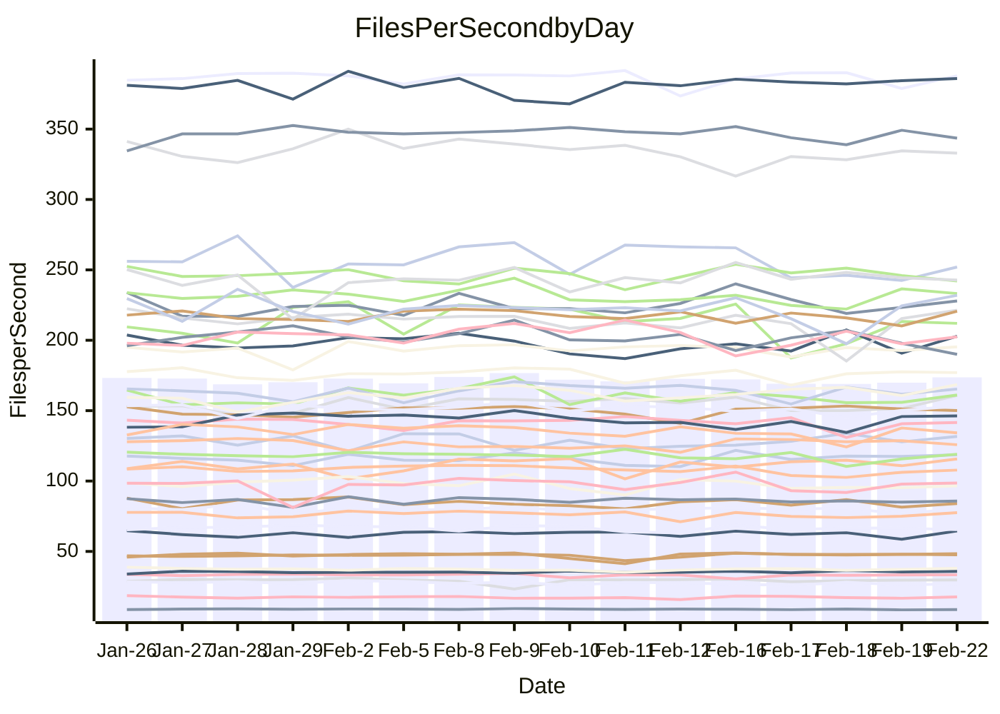

<!---
# This file is auto-generated. Do not edit.
# cspell:disable
--->
# Performance Report

## Daily Performance

## Time to Process Files

| Repository                                      | Elapsed | Min/Avg/Max           |   SD | SD Graph                |
| ----------------------------------------------- | ------: | :-------------------: | ---: | ----------------------- |
| AdaDoom3/AdaDoom3                    |    3.19 | 3.0 /   3.1 /   3.4   | 0.09 | `    ┣━━┻━━╋━●┻━━┫    ` |
| alexiosc/megistos                    |    7.30 | 6.8 /   7.3 /   8.2   | 0.23 | `    ┣━━┻━━●━━┻━━┫    ` |
| apollographql/apollo-server          |    2.36 | 2.2 /   2.3 /   2.5   | 0.07 | `     ┣━┻━━╋━●┻━┫     ` |
| aspnetboilerplate/aspnetboilerplate  |   10.43 | 9.3 /  10.0 /  11.3   | 0.43 | `    ┣━━┻━━╋━━●━━┫    ` |
| aws-amplify/docs                     |   12.65 | 11.7 /  12.4 /  13.1  | 0.37 | `    ┣━━┻━━╋━●┻━━┫    ` |
| Azure/azure-rest-api-specs           |    9.40 | 8.6 /   9.3 /  10.4   | 0.49 | `    ┣━━┻━━●━━┻━━┫    ` |
| bitjson/typescript-starter           |    0.69 | 0.6 /   0.7 /   0.9   | 0.04 | `     ┣━┻━━╋●━┻━┫     ` |
| caddyserver/caddy                    |    3.25 | 3.1 /   3.3 /   3.7   | 0.15 | `    ┣━━┻●━╋━━┻━━┫    ` |
| canada-ca/open-source-logiciel-libre |    0.77 | 0.7 /   0.8 /   1.0   | 0.05 | `     ┣━┻━●╋━━┻━┫     ` |
| chef/chef                            |    5.22 | 5.3 /   5.8 /   8.2   | 0.53 | `    ┣━━●━━╋━━┻━━┫    ` |
| dart-lang/sdk                        |   61.06 | 59.1 /  62.1 /  67.6  | 2.16 | `  ┣━━━┻━●━╋━━━┻━━━┫  ` |
| django/django                        |   14.55 | 14.2 /  14.7 /  15.8  | 0.36 | `    ┣━━┻━●╋━━┻━━┫    ` |
| eslint/eslint                        |   10.05 | 9.8 /  10.5 /  11.9   | 0.43 | `    ┣━━●━━╋━━┻━━┫    ` |
| exonum/exonum                        |    3.37 | 3.0 /   3.3 /   3.7   | 0.15 | `    ┣━━┻━━╋━●┻━━┫    ` |
| flutter/samples                      |   16.55 | 16.6 /  17.6 /  19.9  | 0.77 | `   ┣━━●┻━━╋━━┻━━━┫   ` |
| gitbucket/gitbucket                  |    3.12 | 3.1 /   3.3 /   3.5   | 0.10 | `    ┣━●┻━━╋━━┻━━┫    ` |
| googleapis/google-cloud-cpp          |  129.44 | 125.8 / 131.1 / 140.4 | 3.89 | `  ┣━━━┻━●━╋━━━┻━━━┫  ` |
| graphql/express-graphql              |    0.73 | 0.7 /   0.7 /   0.8   | 0.02 | `     ┣━━┻━●━┻━━┫     ` |
| graphql/graphql-js                   |    2.38 | 2.2 /   2.3 /   2.5   | 0.06 | `     ┣━┻━━╋━━┻━●     ` |
| graphql/graphql-relay-js             |    0.73 | 0.7 /   0.8 /   0.8   | 0.02 | `     ┣━●┻━╋━┻━━┫     ` |
| graphql/graphql-spec                 |    0.84 | 0.8 /   0.9 /   1.1   | 0.06 | `     ┣━┻━●╋━━┻━┫     ` |
| iluwatar/java-design-patterns        |   12.15 | 10.9 /  12.0 /  13.6  | 0.56 | `   ┣━━━┻━━╋●━┻━━━┫   ` |
| ktaranov/sqlserver-kit               |    6.31 | 6.1 /   6.4 /   7.0   | 0.22 | `    ┣━━┻●━╋━━┻━━┫    ` |
| liriliri/licia                       |    3.64 | 3.5 /   3.7 /   3.9   | 0.09 | `    ┣━━●━━╋━━┻━━┫    ` |
| MartinThoma/LaTeX-examples           |    6.43 | 6.3 /   6.6 /   7.6   | 0.25 | `    ┣━━┻●━╋━━┻━━┫    ` |
| mdx-js/mdx                           |    1.58 | 1.6 /   1.7 /   1.9   | 0.08 | `     ┣━●━━╋━━┻━┫     ` |
| microsoft/TypeScript-Website         |    5.30 | 5.0 /   5.4 /   5.9   | 0.22 | `    ┣━━┻━●╋━━┻━━┫    ` |
| MicrosoftDocs/PowerShell-Docs        |   23.60 | 22.5 /  24.4 /  28.9  | 1.25 | `   ┣━━┻━●━╋━━━┻━━┫   ` |
| neovim/nvim-lspconfig                |    3.08 | 3.1 /   3.3 /   3.7   | 0.11 | `    ┣●━┻━━╋━━┻━━┫    ` |
| pagekit/pagekit                      |    3.35 | 3.3 /   3.4 /   3.7   | 0.09 | `    ┣━━┻●━╋━━┻━━┫    ` |
| php/php-src                          |   24.68 | 21.1 /  22.9 /  26.5  | 1.35 | `   ┣━━┻━━━╋━━━┻●━┫   ` |
| plasticrake/tplink-smarthome-api     |    1.01 | 0.9 /   0.9 /   1.1   | 0.04 | `     ┣━┻━━╋━━┻━●     ` |
| prettier/prettier                    |    6.73 | 6.2 /   6.6 /   7.2   | 0.20 | `    ┣━━┻━━╋━●┻━━┫    ` |
| pycontribs/jira                      |    1.22 | 1.2 /   1.3 /   1.5   | 0.06 | `     ┣━●━━╋━━┻━┫     ` |
| RustPython/RustPython                |    4.31 | 4.1 /   4.3 /   4.8   | 0.16 | `    ┣━━┻━━●━━┻━━┫    ` |
| shoelace-style/shoelace              |    2.49 | 2.4 /   2.5 /   2.8   | 0.08 | `    ┣━━┻━━●━━┻━━┫    ` |
| slint-ui/slint                       |   10.78 | 9.2 /  10.0 /  13.1   | 0.70 | `   ┣━━━┻━━╋━━┻●━━┫   ` |
| SoftwareBrothers/admin-bro           |    2.19 | 2.1 /   2.2 /   2.4   | 0.08 | `     ┣━┻━━●━━┻━┫     ` |
| sveltejs/svelte                      |   18.71 | 18.4 /  18.9 /  20.1  | 0.38 | `   ┣━━━┻●━╋━━┻━━━┫   ` |
| TheAlgorithms/Python                 |    5.95 | 5.3 /   5.6 /   6.1   | 0.18 | `    ┣━━┻━━╋━━┻━━●    ` |
| twbs/bootstrap                       |    1.24 | 1.1 /   1.2 /   1.5   | 0.08 | `     ┣━┻━━●━━┻━┫     ` |
| typescript-cheatsheets/react         |    1.12 | 1.1 /   1.1 /   1.3   | 0.04 | `     ┣━┻━━●━━┻━┫     ` |
| typescript-eslint/typescript-eslint  |    3.82 | 3.6 /   3.7 /   3.8   | 0.06 | `    ┣━━┻━━╋━━┻━━●    ` |
| vitest-dev/vitest                    |    8.15 | 7.7 /   8.1 /   9.2   | 0.32 | `    ┣━━┻━━●━━┻━━┫    ` |
| w3c/aria-practices                   |    3.11 | 2.9 /   3.0 /   3.3   | 0.09 | `    ┣━━┻━━╋━━┻●━┫    ` |
| w3c/specberus                        |    1.65 | 1.6 /   1.7 /   1.8   | 0.05 | `     ┣━●━━╋━━┻━┫     ` |
| webdeveric/webpack-assets-manifest   |    0.73 | 0.7 /   0.7 /   0.8   | 0.04 | `     ┣━┻━━╋━●┻━┫     ` |
| webpack/webpack                      |    4.55 | 4.6 /   4.9 /   5.5   | 0.20 | `    ●━━┻━━╋━━┻━━┫    ` |
| wireapp/wire-desktop                 |    0.90 | 0.9 /   0.9 /   1.1   | 0.06 | `     ┣━┻━━●━━┻━┫     ` |
| wireapp/wire-webapp                  |    8.40 | 8.3 /   8.8 /  10.0   | 0.32 | `    ┣━●┻━━╋━━┻━━┫    ` |

Note:
- Elapsed time is in seconds.

## Files per Second over Time

| Repository                                      | Files |    Sec |    Fps |    Rel | Trend Fps              |    N |
| ----------------------------------------------- | ----: | -----: | -----: | -----: | ---------------------- | ---: |
| AdaDoom3/AdaDoom3                    |   103 |   3.19 |  32.31 | -2.65% | `█▄▅█▇▇▇▄▇█▆▇▆▇▇██▇█▆` |   32 |
| alexiosc/megistos                    |   583 |   7.30 |  79.85 |  0.31% | `██▆▇██▇██▇██▇▇▆▄▇██▇` |   32 |
| apollographql/apollo-server          |   250 |   2.36 | 105.73 | -2.19% | `▆▇▇▇▆▇▅█▄▆▆▅▅▅█▇▅▇▆▆` |   34 |
| aspnetboilerplate/aspnetboilerplate  |  2246 |  10.43 | 215.36 | -3.99% | `▆▆▆▅▆▇▆█▇▆▆▅▆▃▇▇▆█▆▅` |   32 |
| aws-amplify/docs                     |  2867 |  12.65 | 226.61 | -2.01% | `▅▆▇▅▆▆▆▆▆▅▅▅▇█▇▆█▇▇▅` |   34 |
| Azure/azure-rest-api-specs           |  2373 |   9.40 | 252.54 | -0.72% | `▆▃▇███▇█▅▅▅▅▄▅▅▅▅▅▇▆` |   34 |
| bitjson/typescript-starter           |    20 |   0.69 |  28.96 | -1.76% | `▂▆█▇▇▆█▇▄▇▇▇▇▆▇▇▇▆█▆` |   32 |
| caddyserver/caddy                    |   279 |   3.25 |  85.95 |  2.93% | `▇▇▆█▃▇███▇▅█▅▇▇▄█▆██` |   34 |
| canada-ca/open-source-logiciel-libre |     7 |   0.77 |   9.03 |  1.73% | `█▇▇▇▅█▆▇▆▆▆▇█▇▄█▂▅▇▇` |   32 |
| chef/chef                            |  1204 |   5.22 | 230.47 |  9.88% | `█▇█▆▇▇▇█▂▇▆▆▇█▅▆▇▆▆█` |   33 |
| dart-lang/sdk                        | 10108 |  61.06 | 165.56 |  1.77% | `██▆▇▇█▇▇▅▄▅▇▆▅▆▇▇▇▇▇` |   34 |
| django/django                        |  2833 |  14.55 | 194.75 |  0.86% | `▇█▇█████▅▆██▇▇█▆████` |   34 |
| eslint/eslint                        |  2058 |  10.05 | 204.82 |  4.45% | `▆▅▆▇▃▅▇▇▆▆▆█▅▆▆▅▇█▇█` |   34 |
| exonum/exonum                        |   421 |   3.37 | 124.91 | -3.19% | `▅▆▇▆▅█▃▆▅▇▇█▇▇▅▇▅██▆` |   32 |
| flutter/samples                      |  2684 |  16.55 | 162.22 |  5.56% | `▇▇▇▇▇▇▇█▅▅▇▆▇▆▇█▃█▇█` |   33 |
| gitbucket/gitbucket                  |   412 |   3.12 | 131.89 |  4.16% | `█▅▄▇▅▆▄█▇█▇▇▇█▇▇▇▅▆█` |   34 |
| googleapis/google-cloud-cpp          | 19818 | 129.44 | 153.10 |  1.28% | `▇▆▆▇▇▇▇▆▇▆█▅▅▇▅███▇▇` |   34 |
| graphql/express-graphql              |    26 |   0.73 |  35.51 |  0.37% | `▆▇█▇▅▅█▇▅▆▇██▇▆▇▅█▇▇` |   32 |
| graphql/graphql-js                   |   343 |   2.38 | 144.42 | -3.77% | `█▇▇▆▆▅▄▇▆▇█▇█▇▆▇▇▇█▅` |   33 |
| graphql/graphql-relay-js             |    28 |   0.73 |  38.59 |  3.49% | `▆▆▆▄▆▆▆▇█▇▇▆▇▇█▇▆▇▇█` |   32 |
| graphql/graphql-spec                 |    15 |   0.84 |  17.88 |  3.26% | `▄█▆▇▆▇▂████▇█▇▄▄█▇▇█` |   33 |
| iluwatar/java-design-patterns        |  1917 |  12.15 | 157.81 | -1.07% | `█▆▃▆▆▇▄▆▆▆▆▅▅▆▆▆▃▇▆▆` |   32 |
| ktaranov/sqlserver-kit               |   489 |   6.31 |  77.46 |  1.86% | `▇▇▆█▆▅▃▇▇▅▅▅▆▆▆▇▄▇▇▇` |   32 |
| liriliri/licia                       |  1434 |   3.64 | 394.06 |  2.35% | `▆▅▇▆▇▆▄▆█▄▆▆▅▅▆▄▅▅▇▆` |   32 |
| MartinThoma/LaTeX-examples           |  1409 |   6.43 | 219.11 |  2.47% | `▇▇▅▇▆▇▅▇▅▇▇▃▇▇▇▇▇▇█▇` |   32 |
| mdx-js/mdx                           |   141 |   1.58 |  89.51 |  4.59% | `▇▇▆▇▇█▆▇▇▅█▇▆█▇▇▄▄██` |   32 |
| microsoft/TypeScript-Website         |   760 |   5.30 | 143.52 |  1.48% | `▇▇▅█▆▆▆▆▅▇█▄▄▆▇▅▆▇▄▆` |   34 |
| MicrosoftDocs/PowerShell-Docs        |  2709 |  23.60 | 114.79 |  3.07% | `▇▆█▆▂▆▇▆▇▆▇▇▇▇▇▆▄▇▇▇` |   34 |
| neovim/nvim-lspconfig                |   379 |   3.08 | 122.86 |  6.27% | `▆█▅▅▆▇▃█▇▆▆▇▆▇▇█▇▆▇█` |   34 |
| pagekit/pagekit                      |   741 |   3.35 | 221.28 |  1.90% | `▇▅█▆▇▇▇▆▇▇▇▇▄▇▅▇▆█▇▇` |   32 |
| php/php-src                          |  2221 |  24.68 |  90.00 | -7.35% | `▅▅▇▃▆▇█▇▆▆▄▆▃▇█▅▆█▆▄` |   34 |
| plasticrake/tplink-smarthome-api     |    62 |   1.01 |  61.23 | -7.87% | `█▇██▃▇▃█▆▆▇▇▆▇▇▆▇▇▇▄` |   32 |
| prettier/prettier                    |  2197 |   6.73 | 326.56 | -2.32% | `▆▆▆▅█▅▇▄▃▇▇▅▆▆▆▅▆▇▆▅` |   34 |
| pycontribs/jira                      |    80 |   1.22 |  65.46 |  5.31% | `▇▇▇▇█▆▆██▆▆▇▆▃▆▇▃▇██` |   32 |
| RustPython/RustPython                |   622 |   4.31 | 144.45 |  0.42% | `▇▆▆▅▆▆▆▅▇█▃▄▆▇█▆█▇▇▇` |   34 |
| shoelace-style/shoelace              |   438 |   2.49 | 175.68 | -0.02% | `█▇█▇▅▆▇▇▃▇▆▇▇█▆▇█▇▇▇` |   32 |
| slint-ui/slint                       |  2058 |  10.78 | 190.96 | -5.51% | `▇▇▇███▆▅▇▅▆▇▇▇▂▇█▇█▅` |   34 |
| SoftwareBrothers/admin-bro           |   441 |   2.19 | 201.26 |  0.40% | `█▅▇▇▅▇▆▅▇▆▅▇▅▅▆▆▆▃▄▆` |   32 |
| sveltejs/svelte                      |  7215 |  18.71 | 385.67 |  1.22% | `▇▅▄▇▇▇▇▇█▇▇▇▇█▇▇▇▇█▇` |   34 |
| TheAlgorithms/Python                 |  1369 |   5.95 | 230.12 | -6.37% | `▇▇▆▇▄▅██▆█▆▇▇█▅▇▇▇▇▅` |   34 |
| twbs/bootstrap                       |   120 |   1.24 |  96.99 | -0.53% | `▆█▆▆▅▇▆█▅▆▄▅▇▇▇▇▃▇▆▆` |   34 |
| typescript-cheatsheets/react         |    53 |   1.12 |  47.19 | -0.06% | `▇▆▇▃▆▆▇█▇▇▇▇▇▇█▇▇▇▇▇` |   32 |
| typescript-eslint/typescript-eslint  |  1282 |   3.82 | 335.53 | -3.36% | `▇██▇█▆██▇▇▆▆▇▇▇█▇█▇▅` |   34 |
| vitest-dev/vitest                    |  1978 |   8.15 | 242.73 |  0.13% | `▇▇▃▆█▆▇█▇▆▇▇▇▇▆▇▇▆█▇` |   34 |
| w3c/aria-practices                   |   405 |   3.11 | 130.04 | -4.53% | `█▆▇▇▅██▇▅▇█▄██▇▇▇█▇▅` |   32 |
| w3c/specberus                        |   200 |   1.65 | 121.40 |  2.76% | `▅▆▇██▆▆▆▆▇█▄█▆▄▅▅▆▇▇` |   34 |
| webdeveric/webpack-assets-manifest   |    19 |   0.73 |  25.98 | -5.23% | `▇▇▄▇▇█▅▆▆▇▃▇▇▇▄▄▆▇▆▅` |   32 |
| webpack/webpack                      |  1096 |   4.55 | 240.73 |  8.43% | `▅▆▆▅▆▆▅▇▅▇▄▃▆▇▆▆▇▇▆█` |   33 |
| wireapp/wire-desktop                 |    43 |   0.90 |  47.59 |  0.42% | `▇█▂▄▄█▇█▆██▇▆█▇▇███▇` |   34 |
| wireapp/wire-webapp                  |  1443 |   8.40 | 171.87 |  6.74% | `▇▆▇▅▅▆▆▆█▇▆▇▃▆▇█▆▇▇█` |   34 |

## Data Throughput

| Repository                                      | Files |    Sec |     Kps |    Rel | Trend Kps              |    N |
| ----------------------------------------------- | ----: | -----: | ------: | -----: | ---------------------- | ---: |
| AdaDoom3/AdaDoom3                    |   103 |   3.19 |  686.72 | -2.65% | `█▄▅█▇▇▇▄▇█▆▇▆▇▇██▇█▆` |   32 |
| alexiosc/megistos                    |   583 |   7.30 |  627.43 |  0.31% | `██▆▇██▇██▇██▇▇▆▄▇██▇` |   32 |
| apollographql/apollo-server          |   250 |   2.36 |  846.67 | -2.18% | `▆▇▇▇▆▇▅█▄▆▆▅▅▅█▇▅▇▆▆` |   34 |
| aspnetboilerplate/aspnetboilerplate  |  2246 |  10.43 |  506.75 | -3.99% | `▆▆▆▅▆▇▆█▇▆▆▅▆▃▇▇▆█▆▅` |   32 |
| aws-amplify/docs                     |  2867 |  12.65 |  781.57 | -1.86% | `▅▆▇▅▆▆▆▆▆▅▅▅▇█▇▆█▇▇▆` |   34 |
| Azure/azure-rest-api-specs           |  2373 |   9.40 |  726.21 | -0.41% | `▆▃▇███▇█▅▅▅▅▄▅▆▅▅▆▇▆` |   34 |
| bitjson/typescript-starter           |    20 |   0.69 |  115.82 | -1.76% | `▂▆█▇▇▆█▇▄▇▇▇▇▆▇▇▇▆█▆` |   32 |
| caddyserver/caddy                    |   279 |   3.25 |  723.00 |  3.49% | `▇▇▅▇▃▇███▇▅█▅▇▇▄█▆██` |   34 |
| canada-ca/open-source-logiciel-libre |     7 |   0.77 |   74.85 |  1.73% | `█▇▇▇▅█▆▇▆▆▆▇█▇▄█▂▅▇▇` |   32 |
| chef/chef                            |  1204 |   5.22 | 1058.94 |  9.88% | `█▇█▆▇▇▇█▂▇▆▆▇█▅▆▇▆▆█` |   33 |
| dart-lang/sdk                        | 10108 |  61.06 | 1163.87 |  1.47% | `██▆▇▇█▇▇▅▅▅▇▆▅▆▇▇▇▇▇` |   34 |
| django/django                        |  2833 |  14.55 | 1200.72 |  0.78% | `▇█▇█████▅▆██▇▇█▆████` |   34 |
| eslint/eslint                        |  2058 |  10.05 | 1665.99 |  4.09% | `▆▅▇▇▃▆▇▇▆▆▅█▅▆▆▅▇█▇█` |   34 |
| exonum/exonum                        |   421 |   3.37 | 1194.83 | -3.19% | `▅▆▇▆▅█▃▆▅▇▇█▇▇▅▇▅██▆` |   32 |
| flutter/samples                      |  2684 |  16.55 | 1329.09 |  6.33% | `▇▇▇▇▇▇▆▇▅▅▇▆▇▆▇█▃█▇█` |   33 |
| gitbucket/gitbucket                  |   412 |   3.12 |  596.37 |  4.16% | `█▅▄▇▅▆▄█▇█▇▇▇█▇▇▇▅▆█` |   34 |
| googleapis/google-cloud-cpp          | 19818 | 129.44 | 1201.48 |  1.43% | `▇▆▆▇▇▇▇▆▇▆█▅▅▇▅███▇▇` |   34 |
| graphql/express-graphql              |    26 |   0.73 |  162.55 |  0.37% | `▆▇█▇▅▅█▇▅▆▇██▇▆▇▅█▇▇` |   32 |
| graphql/graphql-js                   |   343 |   2.38 |  811.79 | -3.95% | `█▇▇▆▆▅▄▇▆▇█▇█▇▆▇▇▇█▅` |   33 |
| graphql/graphql-relay-js             |    28 |   0.73 |  151.61 |  3.49% | `▆▆▆▄▆▆▆▇█▇▇▆▇▇█▇▆▇▇█` |   32 |
| graphql/graphql-spec                 |    15 |   0.84 |  659.25 |  3.34% | `▄█▆▇▆▇▂████▇█▇▄▄█▇▇█` |   33 |
| iluwatar/java-design-patterns        |  1917 |  12.15 |  483.89 | -1.07% | `█▆▃▆▆▇▄▆▆▆▆▅▅▆▆▆▃▇▆▆` |   32 |
| ktaranov/sqlserver-kit               |   489 |   6.31 | 1171.82 |  1.86% | `▇▇▆█▆▅▃▇▇▅▅▅▆▆▆▇▄▇▇▇` |   32 |
| liriliri/licia                       |  1434 |   3.64 |  466.88 |  2.35% | `▆▅▇▆▇▆▄▆█▄▆▆▅▅▆▄▅▅▇▆` |   32 |
| MartinThoma/LaTeX-examples           |  1409 |   6.43 |  452.53 |  2.47% | `▇▇▅▇▆▇▅▇▅▇▇▃▇▇▇▇▇▇█▇` |   32 |
| mdx-js/mdx                           |   141 |   1.58 |  415.18 |  4.65% | `▇▇▆▇▇█▆▇▇▅█▇▆█▇▇▄▄██` |   32 |
| microsoft/TypeScript-Website         |   760 |   5.30 |  989.35 |  1.69% | `▇▇▅█▆▆▆▆▅▇█▄▄▆▇▅▆▇▄▆` |   34 |
| MicrosoftDocs/PowerShell-Docs        |  2709 |  23.60 | 1176.98 |  3.06% | `▇▆█▆▂▆▇▆▇▆▇▇▇▇▇▆▄▇▇▇` |   34 |
| neovim/nvim-lspconfig                |   379 |   3.08 |  322.88 |  6.39% | `▆█▅▅▆▇▃█▇▆▆▇▆▇▇█▇▆▇█` |   34 |
| pagekit/pagekit                      |   741 |   3.35 |  461.36 |  1.90% | `▇▅█▆▇▇▇▆▇▇▇▇▄▇▅▇▆█▇▇` |   32 |
| php/php-src                          |  2221 |  24.68 | 1326.79 | -6.98% | `▅▅▇▃▆▇▇▇▆▆▄▆▄▇█▅▆█▆▄` |   34 |
| plasticrake/tplink-smarthome-api     |    62 |   1.01 |  330.82 | -7.87% | `█▇██▃▇▃█▆▆▇▇▆▇▇▆▇▇▇▄` |   32 |
| prettier/prettier                    |  2197 |   6.73 |  463.30 | -2.12% | `▆▆▆▅█▅▇▄▃▇▇▅▆▆▆▅▆▇▆▅` |   34 |
| pycontribs/jira                      |    80 |   1.22 |  450.86 |  5.31% | `▇▇▇▇█▆▆██▆▆▇▆▃▆▇▃▇██` |   32 |
| RustPython/RustPython                |   622 |   4.31 | 1071.04 |  0.43% | `▇▆▆▅▆▆▆▅▇█▃▄▆▇█▆█▇▇▇` |   34 |
| shoelace-style/shoelace              |   438 |   2.49 |  846.73 |  0.07% | `█▇█▇▅▆▇▇▃▇▆▇▇█▆▇█▇▇▇` |   32 |
| slint-ui/slint                       |  2058 |  10.78 |  976.87 | -6.26% | `▇▇▇███▆▅▇▅▆▇▇▇▂▇▇▇▇▅` |   34 |
| SoftwareBrothers/admin-bro           |   441 |   2.19 |  443.59 |  0.40% | `█▅▇▇▅▇▆▅▇▆▅▇▅▅▆▆▆▃▄▆` |   32 |
| sveltejs/svelte                      |  7215 |  18.71 |  255.94 |  1.22% | `▇▅▄▇▇▇▇▇█▇▇▇▇█▇▇▇▇█▇` |   34 |
| TheAlgorithms/Python                 |  1369 |   5.95 |  584.63 | -6.37% | `▇▇▆▇▄▅██▆█▆▇▇█▅▇▇▇▇▅` |   34 |
| twbs/bootstrap                       |   120 |   1.24 |  778.37 | -0.53% | `▆█▆▆▅▇▆█▅▆▄▅▇▇▇▇▃▇▆▆` |   34 |
| typescript-cheatsheets/react         |    53 |   1.12 |  345.45 | -0.06% | `▇▆▇▃▆▆▇█▇▇▇▇▇▇█▇▇▇▇▇` |   32 |
| typescript-eslint/typescript-eslint  |  1282 |   3.82 | 1650.96 | -3.07% | `▇██▇█▆██▇▇▆▆█▇▇███▇▆` |   34 |
| vitest-dev/vitest                    |  1978 |   8.15 |  508.29 |  0.27% | `▇▇▃▆█▆▇█▇▆▇▇▇█▆▇▇▆█▇` |   34 |
| w3c/aria-practices                   |   405 |   3.11 | 1207.62 | -4.53% | `█▆▇▇▅██▇▅▇█▄██▇▇▇█▇▅` |   32 |
| w3c/specberus                        |   200 |   1.65 |  387.28 |  2.76% | `▅▆▇██▆▆▆▆▇█▄█▆▄▅▅▆▇▇` |   34 |
| webdeveric/webpack-assets-manifest   |    19 |   0.73 |  139.45 | -5.23% | `▇▇▄▇▇█▅▆▆▇▃▇▇▇▄▄▆▇▆▅` |   32 |
| webpack/webpack                      |  1096 |   4.55 | 1061.54 |  8.38% | `▅▆▆▆▇▆▅▇▅▇▄▃▆▇▆▆▇▇▆█` |   33 |
| wireapp/wire-desktop                 |    43 |   0.90 |  210.27 |  0.42% | `▇█▂▄▄█▇█▆██▇▆█▇▇███▇` |   34 |
| wireapp/wire-webapp                  |  1443 |   8.40 |  674.02 |  5.42% | `▇▇▇▆▆▆▆▇█▇▆▇▃▆▇█▆▇▇█` |   34 |

