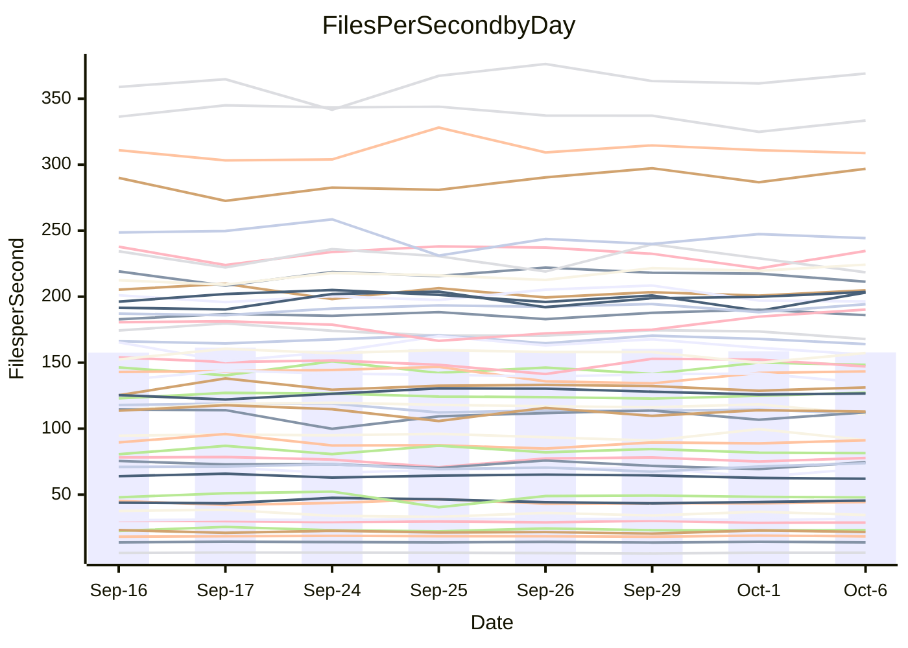

<!---
# This file is auto-generated. Do not edit.
# cspell:disable
--->
# Performance Report

## Daily Performance

## Time to Process Files

| Repository                                      | Elapsed | Min/Avg/Max           |   SD | SD Graph                |
| ----------------------------------------------- | ------: | :-------------------: | ---: | ----------------------- |
| AdaDoom3/AdaDoom3                    |    3.70 | 3.4 /   3.5 /   3.7   | 0.10 | `    ┣━━┻━━╋━━┻━━●    ` |
| alexiosc/megistos                    |    7.78 | 7.5 /   8.0 /   8.6   | 0.29 | `    ┣━━┻●━╋━━┻━━┫    ` |
| apollographql/apollo-server          |    2.83 | 2.6 /   2.8 /   3.0   | 0.12 | `    ┣━━┻━━●━━┻━━┫    ` |
| aspnetboilerplate/aspnetboilerplate  |   10.74 | 10.2 /  10.5 /  11.0  | 0.24 | `    ┣━━┻━━╋━●┻━━┫    ` |
| aws-amplify/docs                     |   12.65 | 12.5 /  13.3 /  13.9  | 0.39 | `    ┣●━┻━━╋━━┻━━┫    ` |
| Azure/azure-rest-api-specs           |    9.85 | 9.5 /  10.0 /  10.6   | 0.30 | `    ┣━━┻●━╋━━┻━━┫    ` |
| bitjson/typescript-starter           |    1.08 | 1.0 /   1.1 /   1.1   | 0.02 | `     ┣━━┻━●━┻━━┫     ` |
| caddyserver/caddy                    |    3.68 | 3.6 /   3.7 /   4.0   | 0.12 | `    ┣━━┻━●╋━━┻━━┫    ` |
| canada-ca/open-source-logiciel-libre |    1.17 | 1.1 /   1.2 /   1.3   | 0.06 | `     ┣━┻━●╋━━┻━┫     ` |
| chef/chef                            |    6.42 | 5.8 /   6.0 /   6.2   | 0.13 | `    ┣━━┻━━╋━━┻━━┫  ● ` |
| dart-lang/sdk                        |   70.15 | 64.8 /  68.1 /  73.2  | 2.55 | `  ┣━━━┻━━━╋━━●┻━━━┫  ` |
| django/django                        |   15.52 | 15.0 /  15.4 /  16.1  | 0.28 | `    ┣━━┻━━╋●━┻━━┫    ` |
| eslint/eslint                        |   10.75 | 10.8 /  11.0 /  11.5  | 0.26 | `    ┣━━●━━╋━━┻━━┫    ` |
| exonum/exonum                        |    3.69 | 3.6 /   3.7 /   4.0   | 0.12 | `    ┣━━┻━●╋━━┻━━┫    ` |
| flutter/samples                      |   16.76 | 16.3 /  17.0 /  18.6  | 0.61 | `   ┣━━━┻━●╋━━┻━━━┫   ` |
| gitbucket/gitbucket                  |    3.74 | 3.5 /   3.6 /   3.7   | 0.09 | `    ┣━━┻━━╋━━┻━●┫    ` |
| googleapis/google-cloud-cpp          |  165.76 | 142.2 / 147.8 / 163.3 | 5.59 | `   ┣━━━┻━━╋━━┻━━━┫  ●` |
| graphql/express-graphql              |    1.17 | 1.1 /   1.2 /   1.3   | 0.05 | `     ┣━┻━●╋━━┻━┫     ` |
| graphql/graphql-js                   |    2.88 | 2.8 /   2.9 /   3.0   | 0.06 | `     ┣━┻●━╋━━┻━┫     ` |
| graphql/graphql-relay-js             |    1.23 | 1.1 /   1.2 /   1.3   | 0.06 | `     ┣━┻━━╋●━┻━┫     ` |
| graphql/graphql-spec                 |    1.40 | 1.3 /   1.4 /   1.4   | 0.03 | `     ┣━┻━━╋━━┻●┫     ` |
| iluwatar/java-design-patterns        |   13.50 | 12.9 /  13.3 /  14.9  | 0.53 | `    ┣━━┻━━╋●━┻━━┫    ` |
| ktaranov/sqlserver-kit               |    6.69 | 6.6 /   6.9 /   7.3   | 0.19 | `    ┣━━●━━╋━━┻━━┫    ` |
| liriliri/licia                       |    4.21 | 4.1 /   4.3 /   4.4   | 0.11 | `    ┣━━┻●━╋━━┻━━┫    ` |
| MartinThoma/LaTeX-examples           |    6.88 | 6.9 /   7.2 /   7.4   | 0.20 | `    ┣━●┻━━╋━━┻━━┫    ` |
| mdx-js/mdx                           |    2.02 | 1.9 /   2.1 /   2.3   | 0.11 | `     ┣━┻━●╋━━┻━┫     ` |
| microsoft/TypeScript-Website         |    5.60 | 5.5 /   5.9 /   6.5   | 0.26 | `    ┣━━●━━╋━━┻━━┫    ` |
| MicrosoftDocs/PowerShell-Docs        |   24.15 | 23.3 /  24.6 /  27.2  | 1.28 | `   ┣━━━┻━●╋━━┻━━━┫   ` |
| neovim/nvim-lspconfig                |    4.66 | 4.2 /   4.4 /   4.5   | 0.08 | `    ┣━━┻━━╋━━┻━━┫   ●` |
| pagekit/pagekit                      |    3.71 | 3.5 /   3.6 /   3.8   | 0.07 | `     ┣━┻━━╋━●┻━┫     ` |
| php/php-src                          |   26.54 | 26.4 /  28.0 /  30.2  | 1.19 | `   ┣━━●┻━━╋━━┻━━━┫   ` |
| plasticrake/tplink-smarthome-api     |    1.36 | 1.3 /   1.4 /   1.5   | 0.06 | `     ┣━┻━●╋━━┻━┫     ` |
| prettier/prettier                    |    7.52 | 7.0 /   7.5 /   7.8   | 0.21 | `    ┣━━┻━━╋●━┻━━┫    ` |
| pycontribs/jira                      |    1.69 | 1.5 /   1.6 /   2.0   | 0.11 | `     ┣━┻━━╋●━┻━┫     ` |
| RustPython/RustPython                |    5.42 | 5.2 /   5.4 /   5.6   | 0.13 | `    ┣━━┻━━●━━┻━━┫    ` |
| shoelace-style/shoelace              |    2.96 | 2.9 /   3.0 /   3.1   | 0.07 | `     ┣━┻●━╋━━┻━┫     ` |
| slint-ui/slint                       |   13.36 | 12.2 /  13.1 /  14.4  | 0.61 | `    ┣━━┻━━╋●━┻━━┫    ` |
| SoftwareBrothers/admin-bro           |    2.78 | 2.6 /   2.6 /   2.7   | 0.06 | `     ┣━┻━━╋━━┻━┫●    ` |
| sveltejs/svelte                      |   21.35 | 20.8 /  21.8 /  23.2  | 0.57 | `   ┣━━━┻●━╋━━┻━━━┫   ` |
| TheAlgorithms/Python                 |    6.06 | 5.8 /   6.0 /   6.6   | 0.23 | `    ┣━━┻━━╋●━┻━━┫    ` |
| twbs/bootstrap                       |    1.92 | 1.8 /   1.8 /   1.9   | 0.04 | `     ┣━┻━━╋━━┻━●     ` |
| typescript-cheatsheets/react         |    1.45 | 1.4 /   1.5 /   1.6   | 0.08 | `     ┣━┻━●╋━━┻━┫     ` |
| typescript-eslint/typescript-eslint  |    4.37 | 4.3 /   4.4 /   4.7   | 0.14 | `    ┣━━┻━●╋━━┻━━┫    ` |
| vitest-dev/vitest                    |   10.13 | 9.2 /   9.8 /  11.1   | 0.55 | `    ┣━━┻━━╋━●┻━━┫    ` |
| w3c/aria-practices                   |    3.71 | 3.5 /   3.5 /   3.7   | 0.09 | `    ┣━━┻━━╋━━┻━●┫    ` |
| w3c/specberus                        |    2.06 | 2.0 /   2.1 /   2.3   | 0.08 | `     ┣━┻━●╋━━┻━┫     ` |
| webdeveric/webpack-assets-manifest   |    1.23 | 1.2 /   1.2 /   1.3   | 0.03 | `     ┣━┻━━●━━┻━┫     ` |
| webpack/webpack                      |    5.41 | 5.5 /   5.7 /   6.1   | 0.18 | `    ┣━●┻━━╋━━┻━━┫    ` |
| wireapp/wire-desktop                 |    1.39 | 1.3 /   1.4 /   1.4   | 0.02 | `     ┣━┻━━╋●━┻━┫     ` |
| wireapp/wire-webapp                  |   10.74 | 10.8 /  11.4 /  12.5  | 0.52 | `    ┣━●┻━━╋━━┻━━┫    ` |

Note:
- Elapsed time is in seconds.

## Files per Second over Time

| Repository                                      | Files |    Sec |    Fps |     Rel | Trend Fps      |    N |
| ----------------------------------------------- | ----: | -----: | -----: | ------: | -------------- | ---: |
| AdaDoom3/AdaDoom3                    |   103 |   3.70 |  27.84 |  -5.62% | `███▇▇▄██▆▆▇▅` |   11 |
| alexiosc/megistos                    |   583 |   7.78 |  74.89 |   2.51% | `█▆▆▆▅█▇▆▅▄▇▇` |   11 |
| apollographql/apollo-server          |   252 |   2.83 |  88.91 |  -0.19% | `▅▆█▅▅▅▃▆▇▄▇▆` |   11 |
| aspnetboilerplate/aspnetboilerplate  |  2286 |  10.74 | 212.93 |  -1.91% | `▆█▅▇▆▇█▇▇▆▅▆` |   11 |
| aws-amplify/docs                     |  2871 |  12.65 | 227.04 |   5.12% | `▅▅▅▆▆▆▄▇▅█▇█` |   11 |
| Azure/azure-rest-api-specs           |  2459 |   9.85 | 249.72 |   1.82% | `█▆▇█▄▅▆▅▇▆▅▇` |   11 |
| bitjson/typescript-starter           |    20 |   1.08 |  18.45 |  -0.03% | `▅▆▆▇▇▇▆▆▇█▆▆` |   11 |
| caddyserver/caddy                    |   286 |   3.68 |  77.62 |   1.26% | `███▇▄█▇█▇▆██` |   11 |
| canada-ca/open-source-logiciel-libre |     7 |   1.17 |   5.96 |   1.86% | `█▄██▇▅▆▄█▅▇▇` |   11 |
| chef/chef                            |  1207 |   6.42 | 188.14 |  -6.51% | `▇▆▅▆▆█▇█▅▆▇▃` |   11 |
| dart-lang/sdk                        | 10637 |  70.15 | 151.64 |  -2.97% | `▇▅█▇▇▇▇▇▆▄█▅` |   11 |
| django/django                        |  2876 |  15.52 | 185.29 |  -0.44% | `▆▆▇▇▇▅▇▇▇█▇▇` |   11 |
| eslint/eslint                        |  2093 |  10.75 | 194.77 |   2.31% | `▅▇▆▇██▇██▅██` |   11 |
| exonum/exonum                        |   421 |   3.69 | 114.12 |   0.71% | `▇▆█▇▄█▇▅▆▇▆▇` |   11 |
| flutter/samples                      |  2400 |  16.76 | 143.16 |   1.29% | `▇▇▇██▄▇▅▇▇▇▇` |   11 |
| gitbucket/gitbucket                  |   413 |   3.74 | 110.48 |  -4.16% | `█▇██▅▇▅▆▇▅▅▅` |   11 |
| googleapis/google-cloud-cpp          | 20772 | 165.76 | 125.32 | -10.90% | `▄██▇▇▆▇▇▆██▃` |   11 |
| graphql/express-graphql              |    26 |   1.17 |  22.31 |   1.49% | `▆█▄▆▅▄▆▃▇▇▄▆` |   11 |
| graphql/graphql-js                   |   364 |   2.88 | 126.29 |   1.23% | `▆▆█▇▇▅█▆▆▇█▇` |   11 |
| graphql/graphql-relay-js             |    28 |   1.23 |  22.80 |  -2.36% | `▃▆█▅▄▇▆▅▆▄▆▅` |   11 |
| graphql/graphql-spec                 |    19 |   1.40 |  13.53 |  -3.80% | `█▅█▇▆██▆▇██▆` |   11 |
| iluwatar/java-design-patterns        |  1992 |  13.50 | 147.61 |  -1.31% | `██▇▇▇▇▃█▇█▆▇` |   11 |
| ktaranov/sqlserver-kit               |   489 |   6.69 |  73.11 |   2.97% | `▆▇▆▇▅▅▇▄▇▆█▇` |   11 |
| liriliri/licia                       |  1437 |   4.21 | 340.99 |   1.58% | `▅████▇▆▇▅▅▅▇` |   11 |
| MartinThoma/LaTeX-examples           |  1409 |   6.88 | 204.71 |   4.04% | `▅▅▅▇█▆▅▇▆█▇█` |   11 |
| mdx-js/mdx                           |   141 |   2.02 |  69.97 |   1.72% | `▆█▇▅▆▇▆▇▃▅▆▆` |   11 |
| microsoft/TypeScript-Website         |   761 |   5.60 | 135.88 |   4.28% | `▇▃█▆▇▆█▇▆▆▆█` |   11 |
| MicrosoftDocs/PowerShell-Docs        |  2708 |  24.15 | 112.15 |   1.50% | `█▇▇▃▆▇▇▇█▃▇▇` |   11 |
| neovim/nvim-lspconfig                |   761 |   4.66 | 163.25 |  -5.91% | `▇▇█▇▆▅▆▇▆▇▆▄` |   11 |
| pagekit/pagekit                      |   741 |   3.71 | 199.95 |  -1.74% | `█▇█▅▇▅▆▇▆▆█▆` |   11 |
| php/php-src                          |  2300 |  26.54 |  86.66 |   5.42% | `▆▅█▆█▇▅▇▅▇▄█` |   11 |
| plasticrake/tplink-smarthome-api     |    62 |   1.36 |  45.53 |   1.92% | `█▃▅█▇▇▅▅▆▆▇▇` |   11 |
| prettier/prettier                    |  2336 |   7.52 | 310.78 |  -0.03% | `▆▆▅▅█▄▇▆▆▆▅▆` |   11 |
| pycontribs/jira                      |    79 |   1.69 |  46.71 |  -3.54% | `▆▆██▂▆▇▇▆▆▇▅` |   11 |
| RustPython/RustPython                |   688 |   5.42 | 126.95 |  -0.02% | `▅▆▅▆▇█▆▆▅▇▆▆` |   11 |
| shoelace-style/shoelace              |   439 |   2.96 | 148.53 |   1.57% | `▇▇▅█▅▆▇▅█▇▇▇` |   11 |
| slint-ui/slint                       |  2519 |  13.36 | 188.48 |   5.29% | `▆▇▆▆▄▅▄▅▇▇█▇` |   11 |
| SoftwareBrothers/admin-bro           |   441 |   2.78 | 158.91 |  -5.02% | `▅█▆▇█▅▇█▆██▅` |   11 |
| sveltejs/svelte                      |  7945 |  21.35 | 372.13 |   2.42% | `▆▅▆▄▇█▇▆▆▆▇▇` |   11 |
| TheAlgorithms/Python                 |  1396 |   6.06 | 230.22 |  -1.10% | `██▆▇██▇▇▇▄█▇` |   11 |
| twbs/bootstrap                       |   118 |   1.92 |  61.58 |  -3.74% | `▆▇█▆▇▇█▇▅▆▅▅` |   11 |
| typescript-cheatsheets/react         |    53 |   1.45 |  36.43 |   1.70% | `█▇█▄▄▆▆▅▇▇▃▆` |   11 |
| typescript-eslint/typescript-eslint  |  1282 |   4.37 | 293.13 |   1.76% | `▅█▄▆▅▅██▆▆█▇` |   11 |
| vitest-dev/vitest                    |  2257 |  10.13 | 222.80 |  -2.26% | `▇█▆█▇▃███▆▅▆` |   11 |
| w3c/aria-practices                   |   414 |   3.71 | 111.45 |  -4.40% | `▆▇████▆▇██▅▅` |   11 |
| w3c/specberus                        |   197 |   2.06 |  95.57 |   1.07% | `▆▆▆▆▆▅▆▅▇█▃▆` |   11 |
| webdeveric/webpack-assets-manifest   |    55 |   1.23 |  44.73 |   1.81% | `▇▇▄▆█▅▅▅▅▅▆▇` |   11 |
| webpack/webpack                      |  1114 |   5.41 | 206.03 |   4.33% | `▇▆▇█▇▆▇▇▄▆▇█` |   11 |
| wireapp/wire-desktop                 |    46 |   1.39 |  33.03 |   6.48% | `▅▅▆▅▆▅▇▆▄▅▅█` |   11 |
| wireapp/wire-webapp                  |  1775 |  10.74 | 165.29 |   2.53% | `▇▇▄▆██▆█▇▆▃▇` |   11 |

## Data Throughput

| Repository                                      | Files |    Sec |     Kps |     Rel | Trend Kps      |    N |
| ----------------------------------------------- | ----: | -----: | ------: | ------: | -------------- | ---: |
| AdaDoom3/AdaDoom3                    |   103 |   3.70 |  591.74 |  -5.62% | `███▇▇▄██▆▆▇▅` |   11 |
| alexiosc/megistos                    |   583 |   7.78 |  588.45 |   2.51% | `█▆▆▆▅█▇▆▅▄▇▇` |   11 |
| apollographql/apollo-server          |   252 |   2.83 |  715.13 |  -0.19% | `▅▆█▅▅▅▃▆▇▄▇▆` |   11 |
| aspnetboilerplate/aspnetboilerplate  |  2286 |  10.74 |  518.08 |  -1.91% | `▆█▅▇▆▇█▇▇▆▅▆` |   11 |
| aws-amplify/docs                     |  2871 |  12.65 |  792.53 |   5.09% | `▅▅▅▆▆▆▄▇▅█▇█` |   11 |
| Azure/azure-rest-api-specs           |  2459 |   9.85 |  664.26 |   2.71% | `█▅▇█▄▅▆▅▇▆▅▇` |   11 |
| bitjson/typescript-starter           |    20 |   1.08 |   73.81 |  -0.03% | `▅▆▆▇▇▇▆▆▇█▆▆` |   11 |
| caddyserver/caddy                    |   286 |   3.68 |  664.10 |   1.43% | `███▇▄█▇█▇▆██` |   11 |
| canada-ca/open-source-logiciel-libre |     7 |   1.17 |   49.41 |   1.86% | `█▄██▇▅▆▄█▅▇▇` |   11 |
| chef/chef                            |  1207 |   6.42 |  867.90 |  -6.58% | `▇▆▅▆▆█▇█▅▆▇▃` |   11 |
| dart-lang/sdk                        | 10637 |  70.15 | 1035.68 |  -3.25% | `▆▄▇▇▇▇▇▇▆▄█▅` |   11 |
| django/django                        |  2876 |  15.52 | 1161.34 |  -0.45% | `▆▆▇▇▇▅▇▇▇█▇▇` |   11 |
| eslint/eslint                        |  2093 |  10.75 | 1403.78 |   2.53% | `▅▇▆▇██▇██▅██` |   11 |
| exonum/exonum                        |   421 |   3.69 | 1091.59 |   0.71% | `▇▆█▇▄█▇▅▆▇▆▇` |   11 |
| flutter/samples                      |  2400 |  16.76 | 1277.51 |   1.29% | `▇▇▇██▄▇▅▇▇▇▇` |   11 |
| gitbucket/gitbucket                  |   413 |   3.74 |  502.38 |  -4.13% | `█▇██▅▇▅▆▇▅▅▅` |   11 |
| googleapis/google-cloud-cpp          | 20772 | 165.76 | 1017.01 | -10.87% | `▄██▇▇▆▇▇▆██▃` |   11 |
| graphql/express-graphql              |    26 |   1.17 |  102.11 |   1.49% | `▆█▄▆▅▄▆▃▇▇▄▆` |   11 |
| graphql/graphql-js                   |   364 |   2.88 |  725.80 |   1.23% | `▆▆█▇▇▅█▆▆▇█▇` |   11 |
| graphql/graphql-relay-js             |    28 |   1.23 |   89.57 |  -2.36% | `▃▆█▅▄▇▆▅▆▄▆▅` |   11 |
| graphql/graphql-spec                 |    19 |   1.40 |  451.44 |  -3.80% | `█▅█▇▆██▆▇██▆` |   11 |
| iluwatar/java-design-patterns        |  1992 |  13.50 |  456.23 |  -1.31% | `██▇▇▇▇▃█▇█▆▇` |   11 |
| ktaranov/sqlserver-kit               |   489 |   6.69 | 1106.99 |   2.97% | `▆▇▆▇▅▅▇▄▇▆█▇` |   11 |
| liriliri/licia                       |  1437 |   4.21 |  406.25 |   1.58% | `▅████▇▆▇▅▅▅▇` |   11 |
| MartinThoma/LaTeX-examples           |  1409 |   6.88 |  422.79 |   4.04% | `▅▅▅▇█▆▅▇▆█▇█` |   11 |
| mdx-js/mdx                           |   141 |   2.02 |  325.53 |   1.72% | `▆█▇▅▆▇▆▇▃▅▆▆` |   11 |
| microsoft/TypeScript-Website         |   761 |   5.60 |  939.75 |   4.28% | `▇▃█▆▇▆█▇▆▆▆█` |   11 |
| MicrosoftDocs/PowerShell-Docs        |  2708 |  24.15 | 1153.84 |   1.52% | `█▇▇▃▆▇▇▇█▃▇▇` |   11 |
| neovim/nvim-lspconfig                |   761 |   4.66 |  271.79 |  -5.37% | `▇▇█▇▆▅▆▇▆█▆▄` |   11 |
| pagekit/pagekit                      |   741 |   3.71 |  416.89 |  -1.74% | `█▇█▅▇▅▆▇▆▆█▆` |   11 |
| php/php-src                          |  2300 |  26.54 | 1506.23 |   5.44% | `▆▅█▆█▇▅▇▅▇▄█` |   11 |
| plasticrake/tplink-smarthome-api     |    62 |   1.36 |  246.01 |   1.92% | `█▃▅█▇▇▅▅▆▆▇▇` |   11 |
| prettier/prettier                    |  2336 |   7.52 |  435.84 |  -0.56% | `▆▆▅▅█▄▇▆▆▆▅▆` |   11 |
| pycontribs/jira                      |    79 |   1.69 |  331.08 |  -3.54% | `▆▆██▂▆▇▇▆▆▇▅` |   11 |
| RustPython/RustPython                |   688 |   5.42 | 1002.87 |   0.12% | `▅▆▄▆▇█▆▇▅▇▆▆` |   11 |
| shoelace-style/shoelace              |   439 |   2.96 |  717.61 |   1.57% | `▇▇▅█▅▆▇▅█▇▇▇` |   11 |
| slint-ui/slint                       |  2519 |  13.36 | 1155.94 |   0.96% | `▇██▇▄▆▅▄▆▆█▇` |   11 |
| SoftwareBrothers/admin-bro           |   441 |   2.78 |  350.26 |  -5.02% | `▅█▆▇█▅▇█▆██▅` |   11 |
| sveltejs/svelte                      |  7945 |  21.35 |  248.66 |   2.32% | `▆▅▆▄▇█▇▆▆▆▇▇` |   11 |
| TheAlgorithms/Python                 |  1396 |   6.06 |  585.27 |  -1.07% | `██▆▇██▇▇▇▄█▇` |   11 |
| twbs/bootstrap                       |   118 |   1.92 |  505.18 |  -3.74% | `▆▇█▆▇▇█▇▅▆▅▅` |   11 |
| typescript-cheatsheets/react         |    53 |   1.45 |  269.45 |   1.70% | `█▇█▄▄▆▆▅▇▇▃▆` |   11 |
| typescript-eslint/typescript-eslint  |  1282 |   4.37 | 1500.15 |   1.77% | `▅█▄▆▅▅██▆▆█▇` |   11 |
| vitest-dev/vitest                    |  2257 |  10.13 |  499.31 |  -3.01% | `▇█▆█▇▃███▆▅▆` |   11 |
| w3c/aria-practices                   |   414 |   3.71 | 1039.13 |  -4.34% | `▅▆████▆▇██▅▅` |   11 |
| w3c/specberus                        |   197 |   2.06 |  301.25 |   1.42% | `▆▆▆▆▆▅▆▅▇█▃▆` |   11 |
| webdeveric/webpack-assets-manifest   |    55 |   1.23 |  103.29 |  -0.04% | `▇▇▄▆█▅▅▅▅▅▆▆` |   11 |
| webpack/webpack                      |  1114 |   5.41 |  941.37 |   4.92% | `▆▆▇█▇▅▇▇▄▆▇█` |   11 |
| wireapp/wire-desktop                 |    46 |   1.39 |  184.52 |  30.14% | `▂▂▃▃▄▃▄▄▃▃▃█` |   11 |
| wireapp/wire-webapp                  |  1775 |  10.74 |  607.24 |   4.94% | `▇▇▄▆██▆█▇▆▃█` |   11 |

