<!---
# This file is auto-generated. Do not edit.
# cspell:disable
--->
# Performance Report

## Daily Performance

```mermaid
xychart-beta
    title Files Per Second by Day
    y-axis Files per Second
    x-axis Date [Aug-18, Aug-19, Aug-20, Aug-21, Aug-22, Aug-23, Aug-26, Aug-27, Aug-29, Aug-31, Sep-2, Sep-6, Sep-9, Sep-10, Sep-13, Sep-16, Sep-17]
    bar [181.58, 178.25, 178.21, 176.48, 177.31, 178.59, 176.65, 175.34, 176.71, 179.62, 175.68, 178.38, 175.73, 175.70, 175.56, 170.99, 174.40]
    line [35.97, 0.00, 34.29, 33.06, 35.20, 33.44, 33.88, 34.28, 34.29, 31.46, 31.96, 32.39, 0.00, 33.27, 33.48, 33.18, 30.60]
    line [100.11, 0.00, 95.31, 98.34, 100.20, 98.20, 97.14, 95.15, 97.31, 98.42, 98.44, 103.61, 0.00, 95.82, 91.96, 97.25, 94.72]
    line [41.02, 0.00, 41.64, 40.90, 36.56, 37.81, 40.07, 40.16, 39.52, 40.88, 40.72, 39.85, 0.00, 39.94, 41.26, 40.08, 39.41]
    line [43.94, 0.00, 42.21, 42.40, 45.26, 41.26, 43.81, 40.27, 43.32, 41.01, 43.29, 42.33, 0.00, 41.15, 42.24, 41.01, 43.74]
    line [52.47, 0.00, 51.98, 49.75, 49.50, 52.81, 53.66, 48.74, 52.00, 52.00, 53.54, 52.52, 0.00, 52.32, 54.12, 51.77, 52.64]
    line [245.41, 242.22, 244.96, 234.22, 246.89, 237.83, 238.28, 231.51, 232.29, 237.57, 232.38, 230.54, 0.00, 229.61, 230.62, 234.72, 234.09]
    line [32.97, 0.00, 32.06, 31.30, 30.41, 32.21, 31.61, 31.00, 30.67, 31.04, 30.96, 30.04, 0.00, 31.22, 29.93, 31.17, 32.44]
    line [135.27, 137.39, 135.24, 132.55, 135.80, 124.86, 135.53, 135.15, 134.28, 135.44, 134.10, 133.16, 133.12, 133.37, 136.08, 131.30, 133.69]
    line [69.94, 0.00, 72.13, 70.80, 70.95, 67.44, 70.02, 70.97, 71.48, 71.44, 71.07, 70.80, 70.10, 70.83, 70.27, 68.51, 66.08]
    line [175.25, 0.00, 174.12, 168.12, 168.81, 160.53, 165.45, 157.28, 166.29, 168.59, 168.11, 162.00, 0.00, 166.81, 166.56, 165.69, 169.14]
    line [117.57, 108.01, 110.94, 111.36, 109.59, 114.15, 106.99, 110.60, 113.93, 109.73, 98.03, 113.59, 117.23, 110.00, 114.04, 109.51, 117.67]
    line [146.24, 0.00, 148.33, 142.38, 151.12, 148.79, 140.03, 146.17, 148.08, 143.16, 143.31, 137.86, 0.00, 143.10, 144.41, 139.70, 147.40]
    line [78.69, 87.97, 81.21, 83.61, 95.38, 96.21, 93.90, 98.97, 89.73, 92.49, 93.42, 92.85, 96.99, 93.46, 97.52, 91.70, 95.18]
    line [265.67, 263.14, 256.57, 256.22, 262.68, 265.85, 254.87, 246.75, 253.70, 263.63, 263.57, 250.38, 244.75, 250.69, 253.77, 247.48, 254.25]
    line [206.29, 0.00, 206.95, 195.89, 198.81, 198.92, 201.94, 200.15, 198.85, 195.27, 198.37, 193.18, 205.21, 202.42, 187.59, 200.94, 198.23]
    line [151.19, 149.78, 152.30, 148.37, 152.77, 157.05, 152.12, 144.60, 151.74, 152.77, 128.16, 146.70, 0.00, 151.25, 142.95, 141.14, 143.50]
    line [463.36, 0.00, 463.20, 452.00, 439.43, 448.11, 442.87, 446.82, 438.90, 433.22, 451.36, 445.82, 0.00, 442.79, 448.98, 444.77, 443.21]
    line [85.14, 0.00, 84.39, 80.69, 82.01, 80.62, 81.99, 84.93, 82.93, 82.69, 82.19, 79.19, 0.00, 81.30, 83.34, 82.19, 77.77]
    line [9.98, 0.00, 10.21, 9.57, 9.67, 10.21, 9.79, 8.96, 9.05, 9.81, 8.92, 9.30, 0.00, 9.85, 9.67, 9.68, 10.02]
    line [80.18, 0.00, 84.11, 82.91, 84.94, 84.37, 83.76, 83.84, 82.02, 86.32, 87.46, 87.14, 81.35, 83.34, 83.78, 82.79, 81.91]
    line [226.49, 220.96, 218.62, 223.21, 235.78, 218.52, 223.39, 232.83, 235.11, 223.20, 230.93, 227.50, 233.38, 223.69, 216.25, 228.77, 201.03]
    line [20.41, 0.00, 20.37, 19.78, 16.65, 19.78, 19.77, 19.75, 19.38, 19.78, 17.23, 19.98, 0.00, 20.38, 20.10, 19.75, 20.18]
    line [246.01, 0.00, 245.63, 244.19, 237.32, 241.48, 235.19, 238.66, 248.28, 246.15, 249.29, 224.39, 0.00, 241.04, 239.64, 234.60, 234.95]
    line [75.62, 0.00, 77.72, 74.04, 70.35, 73.82, 76.46, 74.01, 76.69, 74.15, 76.26, 75.33, 0.00, 76.18, 75.30, 72.34, 72.26]
    line [374.45, 380.47, 380.68, 375.26, 397.02, 370.26, 374.39, 363.66, 375.36, 378.12, 369.19, 372.46, 362.58, 366.57, 385.92, 371.23, 370.83]
    line [123.21, 122.05, 125.45, 120.85, 116.37, 122.78, 117.70, 119.12, 121.35, 120.42, 122.42, 114.54, 119.33, 121.78, 117.69, 120.09, 120.47]
    line [175.87, 164.73, 177.91, 172.41, 171.41, 172.78, 171.71, 167.41, 160.25, 170.61, 161.33, 168.54, 172.61, 166.17, 170.88, 163.08, 175.34]
    line [56.95, 55.01, 51.81, 55.08, 55.43, 57.37, 55.42, 55.44, 54.92, 55.19, 56.79, 55.22, 55.40, 55.63, 54.54, 52.86, 55.75]
    line [148.37, 144.42, 139.84, 136.44, 133.06, 147.23, 141.82, 144.43, 131.99, 140.70, 140.40, 143.33, 143.38, 143.55, 140.59, 138.57, 139.91]
    line [170.32, 0.00, 179.55, 173.37, 159.94, 179.71, 169.02, 169.12, 169.70, 179.72, 174.42, 171.06, 0.00, 173.10, 169.76, 175.73, 177.28]
    line [259.27, 261.07, 258.95, 254.28, 252.45, 254.96, 251.52, 256.47, 238.41, 254.64, 251.96, 258.89, 257.30, 255.86, 259.52, 256.30, 243.96]
    line [387.36, 368.74, 381.05, 377.05, 388.53, 370.41, 373.49, 378.95, 372.79, 371.32, 379.20, 373.63, 372.65, 376.36, 368.52, 365.71, 383.72]
    line [149.26, 160.96, 156.07, 157.97, 160.09, 159.80, 156.02, 151.31, 156.46, 156.20, 128.81, 149.88, 0.00, 151.49, 151.06, 156.36, 153.55]
    line [282.85, 281.73, 278.23, 265.94, 284.38, 284.39, 265.58, 259.03, 272.73, 274.59, 278.30, 269.85, 262.88, 274.40, 281.31, 272.54, 276.03]
    line [243.19, 0.00, 239.03, 235.84, 242.13, 231.92, 216.52, 227.39, 223.72, 225.22, 232.84, 224.81, 0.00, 227.34, 228.09, 230.87, 238.68]
    line [218.06, 224.66, 224.81, 219.16, 211.20, 220.63, 218.66, 210.78, 216.53, 205.56, 221.13, 223.08, 217.30, 217.60, 210.80, 216.66, 212.83]
    line [103.66, 133.22, 133.90, 133.21, 135.84, 133.85, 134.48, 128.45, 125.51, 128.57, 133.06, 133.03, 112.77, 129.44, 131.63, 130.97, 135.67]
    line [260.83, 265.11, 241.69, 253.34, 256.92, 209.05, 254.71, 263.18, 264.22, 258.50, 262.12, 249.11, 258.37, 255.88, 255.75, 261.30, 257.19]
    line [138.29, 159.59, 153.49, 152.84, 151.42, 150.33, 145.56, 148.61, 150.44, 164.92, 155.92, 153.19, 0.00, 155.03, 154.46, 150.27, 156.00]
    line [38.08, 0.00, 38.14, 38.85, 37.70, 37.19, 34.46, 37.13, 36.19, 37.79, 36.83, 35.85, 0.00, 37.06, 36.42, 35.98, 34.66]
    line [130.73, 126.16, 124.30, 123.93, 127.92, 119.73, 122.40, 121.04, 123.38, 130.04, 119.32, 127.89, 123.29, 124.49, 129.64, 121.66, 122.92]
    line [207.70, 220.70, 210.90, 214.69, 206.22, 205.16, 204.73, 205.50, 203.46, 212.85, 203.78, 213.00, 214.26, 206.28, 205.22, 203.09, 211.30]
    line [431.05, 409.21, 405.37, 402.28, 402.99, 406.75, 400.52, 392.20, 399.70, 406.57, 392.41, 395.48, 385.49, 402.68, 388.38, 390.24, 399.80]
    line [252.27, 247.59, 259.11, 258.43, 251.09, 261.73, 254.45, 247.25, 249.51, 257.53, 250.46, 249.77, 240.66, 262.89, 257.78, 257.49, 243.64]
    line [90.78, 90.42, 89.47, 89.22, 86.73, 90.81, 90.69, 90.61, 92.79, 91.57, 89.68, 92.88, 88.59, 86.05, 89.85, 89.86, 94.28]
    line [194.62, 173.87, 185.52, 175.53, 184.67, 182.24, 173.51, 182.05, 181.30, 178.67, 173.82, 183.91, 169.15, 181.18, 183.51, 175.60, 178.29]
    line [150.98, 137.75, 145.27, 144.73, 145.80, 149.65, 145.04, 143.72, 145.86, 150.29, 143.06, 151.08, 140.90, 145.94, 143.19, 137.67, 142.26]
    line [0.00, 0.00, 0.00, 0.00, 0.00, 0.00, 0.00, 0.00, 183.14, 189.02, 182.17, 179.93, 181.55, 184.12, 189.95, 185.74, 166.47]
    line [0.00, 0.00, 0.00, 0.00, 0.00, 0.00, 0.00, 0.00, 0.00, 172.99, 170.71, 168.98, 170.63, 166.15, 168.68, 161.23, 169.82]
```

## Time to Process Files

| Repository                                      | Elapsed | Min/Avg/Max           |   SD | SD Graph                |
| ----------------------------------------------- | ------: | :-------------------: | ---: | ----------------------- |
| AdaDoom3/AdaDoom3                    |    2.97 | 2.6 /   2.8 /   3.1   | 0.11 | `    ┣━━┻━━╋━━┻━●┫    ` |
| alexiosc/megistos                    |    7.50 | 6.7 /   7.1 /   7.6   | 0.24 | `    ┣━━┻━━╋━━┻━●┫    ` |
| apollographql/apollo-server          |    2.08 | 1.9 /   2.1 /   2.3   | 0.06 | `     ┣━┻━━●━━┻━┫     ` |
| aspnetboilerplate/aspnetboilerplate  |   11.23 | 10.4 /  10.8 /  12.7  | 0.38 | `    ┣━━┻━━╋━━┻●━┫    ` |
| aws-amplify/docs                     |   11.62 | 10.6 /  11.1 /  12.0  | 0.35 | `    ┣━━┻━━╋━━┻━●┫    ` |
| Azure/azure-rest-api-specs           |   13.56 | 12.4 /  13.5 /  14.8  | 0.54 | `   ┣━━━┻━━●━━┻━━━┫   ` |
| bitjson/typescript-starter           |    0.65 | 0.6 /   0.6 /   0.7   | 0.03 | `     ┣━━┻━╋━┻━━●     ` |
| caddyserver/caddy                    |    2.90 | 2.8 /   3.1 /   3.5   | 0.22 | `    ┣━━┻●━╋━━┻━━┫    ` |
| canada-ca/open-source-logiciel-libre |    0.70 | 0.7 /   0.7 /   0.9   | 0.04 | `     ┣━┻●━╋━━┻━┫     ` |
| chef/chef                            |    5.97 | 4.8 /   5.2 /   6.0   | 0.24 | `    ┣━━┻━━╋━━┻━━┫  ● ` |
| dart-lang/sdk                        |   57.16 | 55.3 /  57.9 /  70.4  | 3.73 | `  ┣━━━┻━━●╋━━━┻━━━┫  ` |
| django/django                        |   13.21 | 12.7 /  13.4 /  14.4  | 0.42 | `    ┣━━┻●━╋━━┻━━┫    ` |
| eslint/eslint                        |    9.38 | 8.7 /   9.1 /  10.2   | 0.29 | `    ┣━━┻━━╋━●┻━━┫    ` |
| exonum/exonum                        |    2.86 | 2.7 /   2.9 /   3.3   | 0.11 | `    ┣━━┻●━╋━━┻━━┫    ` |
| flutter/samples                      |   15.61 | 13.7 /  14.1 /  14.5  | 0.31 | `      ┣━┻━╋━┻━┫     ●` |
| gitbucket/gitbucket                  |    2.94 | 2.8 /   2.9 /   3.5   | 0.14 | `    ┣━━┻━━●━━┻━━┫    ` |
| googleapis/google-cloud-cpp          |  138.38 | 128.9 / 135.4 / 145.8 | 4.23 | `  ┣━━━┻━━━╋━━●┻━━━┫  ` |
| graphql/express-graphql              |    0.66 | 0.6 /   0.6 /   0.7   | 0.03 | `     ┣━━┻━╋●┻━━┫     ` |
| graphql/graphql-js                   |    1.97 | 1.9 /   2.0 /   2.3   | 0.09 | `     ┣━┻━●╋━━┻━┫     ` |
| graphql/graphql-relay-js             |    0.64 | 0.6 /   0.7 /   0.7   | 0.03 | `     ┣━┻●━╋━━┻━┫     ` |
| graphql/graphql-spec                 |    0.74 | 0.7 /   0.8 /   0.9   | 0.04 | `     ┣━┻━●╋━━┻━┫     ` |
| iluwatar/java-design-patterns        |   10.37 | 10.0 /  10.6 /  11.5  | 0.38 | `    ┣━━┻●━╋━━┻━━┫    ` |
| ktaranov/sqlserver-kit               |    5.97 | 5.6 /   5.8 /   6.2   | 0.17 | `    ┣━━┻━━╋━●┻━━┫    ` |
| liriliri/licia                       |    3.19 | 3.0 /   3.2 /   3.3   | 0.07 | `    ┣━━┻━━╋●━┻━━┫    ` |
| MartinThoma/LaTeX-examples           |    5.89 | 5.8 /   6.1 /   6.8   | 0.27 | `    ┣━━●━━╋━━┻━━┫    ` |
| mdx-js/mdx                           |    1.52 | 1.4 /   1.5 /   1.6   | 0.05 | `     ┣━┻━━╋━●┻━┫     ` |
| microsoft/TypeScript-Website         |    4.94 | 4.6 /   4.9 /   5.9   | 0.23 | `    ┣━━┻━━╋●━┻━━┫    ` |
| MicrosoftDocs/PowerShell-Docs        |   21.85 | 20.5 /  21.7 /  23.9  | 0.83 | `   ┣━━━┻━━╋●━┻━━━┫   ` |
| neovim/nvim-lspconfig                |    2.67 | 2.5 /   2.6 /   2.9   | 0.08 | `    ┣━━┻━━╋●━┻━━┫    ` |
| pagekit/pagekit                      |    3.15 | 2.9 /   3.1 /   3.4   | 0.10 | `    ┣━━┻━━╋━●┻━━┫    ` |
| php/php-src                          |   23.45 | 23.2 /  24.5 /  26.1  | 0.67 | `   ┣━●━┻━━╋━━┻━━━┫   ` |
| plasticrake/tplink-smarthome-api     |    0.86 | 0.8 /   0.8 /   0.9   | 0.03 | `     ┣━┻━━╋━●┻━┫     ` |
| prettier/prettier                    |    5.71 | 5.6 /   5.8 /   6.6   | 0.20 | `    ┣━━┻●━╋━━┻━━┫    ` |
| pycontribs/jira                      |    1.21 | 1.1 /   1.1 /   1.2   | 0.03 | `     ┣━┻━━╋━━┻━┫ ●   ` |
| RustPython/RustPython                |    4.33 | 4.0 /   4.2 /   6.1   | 0.37 | `    ┣━━┻━━╋●━┻━━┫    ` |
| shoelace-style/shoelace              |    2.20 | 2.1 /   2.2 /   2.5   | 0.09 | `     ┣━┻━━●━━┻━┫     ` |
| SoftwareBrothers/admin-bro           |    1.88 | 1.8 /   1.9 /   2.1   | 0.07 | `     ┣━┻━━●━━┻━┫     ` |
| sveltejs/svelte                      |   18.48 | 16.8 /  18.3 /  19.2  | 0.51 | `   ┣━━━┻━━╋●━┻━━━┫   ` |
| TheAlgorithms/Python                 |    4.87 | 4.7 /   4.9 /   5.5   | 0.19 | `    ┣━━┻━●╋━━┻━━┫    ` |
| twbs/bootstrap                       |    1.02 | 1.0 /   1.1 /   1.4   | 0.07 | `     ┣━●━━╋━━┻━┫     ` |
| typescript-cheatsheets/react         |    1.01 | 0.9 /   1.0 /   1.5   | 0.09 | `     ┣━┻━●╋━━┻━┫     ` |
| typescript-eslint/typescript-eslint  |    3.35 | 3.1 /   3.3 /   3.7   | 0.12 | `    ┣━━┻━━╋●━┻━━┫    ` |
| vitest-dev/vitest                    |    6.91 | 6.4 /   6.9 /   9.6   | 0.53 | `    ┣━━┻━━●━━┻━━┫    ` |
| w3c/aria-practices                   |    2.58 | 2.4 /   2.6 /   2.9   | 0.10 | `    ┣━━┻━●╋━━┻━━┫    ` |
| w3c/specberus                        |    1.47 | 1.5 /   1.5 /   1.9   | 0.10 | `     ┣━┻●━╋━━┻━┫     ` |
| webdeveric/webpack-assets-manifest   |    0.59 | 0.6 /   0.6 /   0.7   | 0.02 | `     ┣━●┻━╋━┻━━┫     ` |
| webpack/webpack                      |    4.27 | 4.1 /   4.3 /   4.6   | 0.14 | `    ┣━━┻━━●━━┻━━┫    ` |
| wireapp/wire-desktop                 |    0.77 | 0.7 /   0.8 /   0.9   | 0.03 | `     ┣━┻━●╋━━┻━┫     ` |
| wireapp/wire-webapp                  |    6.98 | 6.8 /   7.2 /   7.9   | 0.28 | `    ┣━━┻●━╋━━┻━━┫    ` |

Note:
- Elapsed time is in seconds.

## Files per Second over Time

| Repository                                      | Files |    Sec |    Fps |     Rel | Trend Fps              |    N |
| ----------------------------------------------- | ----: | -----: | -----: | ------: | ---------------------- | ---: |
| AdaDoom3/AdaDoom3                    |   103 |   2.97 |  34.66 |  -6.42% | `▇▅▃▄▇▆▆▆▅▆█▆▆▆▇▆▆▅▆▄` |   29 |
| alexiosc/megistos                    |   583 |   7.50 |  77.77 |  -5.47% | `▅█▅▆█▇█▇▅▆▇▆▅▆▅▇▇█▅▄` |   29 |
| apollographql/apollo-server          |   250 |   2.08 | 120.47 |   0.03% | `█▇▇▆█▇▇▇▇█▅▇█▇▇▆█▇▇▇` |   32 |
| aspnetboilerplate/aspnetboilerplate  |  2739 |  11.23 | 243.96 |  -3.95% | `▇▇█▃▇▇█▇▇▇██▇████▇█▆` |   34 |
| aws-amplify/docs                     |  2831 |  11.62 | 243.64 |  -4.41% | `▇▄▇▄▆█▆█▅█▆▅██▇▇▆▇█▅` |   34 |
| Azure/azure-rest-api-specs           |  2417 |  13.56 | 178.29 |  -0.34% | `█▇▇▇▇▇▅█▇▅█▅█▆▇█▇▅▆▇` |   34 |
| bitjson/typescript-starter           |    20 |   0.65 |  30.60 |  -8.70% | `▇▇█▇█▇███▃▇▆▆▆▇▇▇▇▇▄` |   29 |
| caddyserver/caddy                    |   276 |   2.90 |  95.18 |   4.51% | `▆██▇▃▇▆▆█▅▆▇▆▇▇█▇▇▄▇` |   34 |
| canada-ca/open-source-logiciel-libre |     7 |   0.70 |  10.02 |   4.14% | `██▆█▇▃▆▇▃▇▇▅▆▇▇▇▇▇▇█` |   29 |
| chef/chef                            |  1201 |   5.97 | 201.03 | -10.93% | `▇▇▆▅██▄▇▆▇▆▇▅▆▅▅▅▆▇▃` |   34 |
| dart-lang/sdk                        |  9707 |  57.16 | 169.82 |   1.25% | `███▇▇█▇▇▇▇██▃▇`       |   13 |
| django/django                        |  2792 |  13.21 | 211.30 |   1.57% | `▅▆▇█▆▄█▇▇▅██▇▆▇▆▆▇▄▇` |   34 |
| eslint/eslint                        |  1996 |   9.38 | 212.83 |  -2.04% | `▇▇▅▇▇▇▄▇█▇█▇▇█▅▇▇▇█▆` |   34 |
| exonum/exonum                        |   421 |   2.86 | 147.40 |   2.21% | `▇▆▄▆▇▇▇▆█▆▆▆▅▆▆▇▆▆▅▇` |   29 |
| flutter/samples                      |  2598 |  15.61 | 166.47 |  -9.97% | `▆█▅██▇▅▅▆█▅██▇▆▇▂`    |   16 |
| gitbucket/gitbucket                  |   411 |   2.94 | 139.91 |  -0.22% | `▇▇█▃▇▇▇▇▇▇███▇▇▇▇▅▇▇` |   34 |
| googleapis/google-cloud-cpp          | 19685 | 138.38 | 142.26 |  -1.75% | `▅▆▇▅▇▇▇█▆▆█▅▆▇▆▆▅▄▄▆` |   34 |
| graphql/express-graphql              |    26 |   0.66 |  39.41 |  -1.90% | `▃▇▇▇▇█▇▅▇███▇▆███▇█▇` |   29 |
| graphql/graphql-js                   |   333 |   1.97 | 169.14 |   1.59% | `▇▆▇▇▄▆▇█▇▇▇▆▇▇▆█▇▇▆▇` |   30 |
| graphql/graphql-relay-js             |    28 |   0.64 |  43.74 |   3.42% | `▃▆▆█▃▆▆▇▇▄▆▇▆▇▄▅▆▆▄▇` |   29 |
| graphql/graphql-spec                 |    15 |   0.74 |  20.18 |   2.61% | `▇█▆▇█▆▇▇▅▆█▄▇██▇█▇▇█` |   29 |
| iluwatar/java-design-patterns        |  1838 |  10.37 | 177.28 |   2.57% | `█▆▅▆▅▇█▄▆██▇▆▆▇▆▅█▆▇` |   29 |
| ktaranov/sqlserver-kit               |   489 |   5.97 |  81.91 |  -2.11% | `▅█▆▅█▅▆▆▇███▅▆▆▆▇▆▆▆` |   31 |
| liriliri/licia                       |  1415 |   3.19 | 443.21 |  -0.83% | `▇▇▆▇█▆█▆▅▆▆█▇▆▇█▇▇▇▇` |   29 |
| MartinThoma/LaTeX-examples           |  1407 |   5.89 | 238.68 |   3.89% | `▇▄▃▇█▄▆▆▅█▄▇▆▆▇▆▇▇▆█` |   29 |
| mdx-js/mdx                           |   144 |   1.52 |  94.72 |  -2.68% | `▅▆▅▅▅▇▆▆▇▆▇█▆▅▃▅▅▇▆▅` |   31 |
| microsoft/TypeScript-Website         |   758 |   4.94 | 153.55 |  -0.80% | `█▆▆▆▇▇▇█▇▇▃▆▇▆▆▆▆▇█▇` |   32 |
| MicrosoftDocs/PowerShell-Docs        |  2686 |  21.85 | 122.92 |  -0.91% | `▆▅▆▇▇▄██▇▃▇▆▇▆██▆▆▆▆` |   34 |
| neovim/nvim-lspconfig                |   357 |   2.67 | 133.69 |   0.01% | `██▇▇█▅▇▇▇▇▇▇▇▆▇█▇█▄▇` |   34 |
| pagekit/pagekit                      |   741 |   3.15 | 234.95 |  -2.70% | `▆▆▃▇▆▆▇█▆█▆▇▄▇▅▇▅▅▆▅` |   29 |
| php/php-src                          |  2211 |  23.45 |  94.28 |   4.68% | `▆▆▇▆██▆█▅▇▇▅▄▅▅▇▆▆▆█` |   34 |
| plasticrake/tplink-smarthome-api     |    62 |   0.86 |  72.26 |  -3.62% | `▇▄▇█▅▆▇▇▆▅▆▆▆▆▇▇▅▆▄▅` |   29 |
| prettier/prettier                    |  2191 |   5.71 | 383.72 |   2.36% | `▇▆█▇█▆▇▆███▇▇▇▇▇▆▅██` |   33 |
| pycontribs/jira                      |    80 |   1.21 |  66.08 |  -6.25% | `█▆█▇██▇█▇▇█▇▇█▇▇▇█▅▅` |   32 |
| RustPython/RustPython                |   621 |   4.33 | 143.50 |  -3.03% | `██▆███████▂▇█▇█▆▆▇▆▇` |   32 |
| shoelace-style/shoelace              |   437 |   2.20 | 198.23 |  -0.39% | `█▇▇▇▇█▆▅█▇▆█▇█▇▃█▇▇▇` |   31 |
| SoftwareBrothers/admin-bro           |   440 |   1.88 | 234.09 |  -0.68% | `█▇▇█▅▅▇█▇▇▇▇▆▆▆▇▆▇▇▇` |   31 |
| sveltejs/svelte                      |  7389 |  18.48 | 399.80 |  -0.02% | `▅▆▅▆▆▇▆█▅▆▆▅▇▆▅▅▆▅▅▆` |   34 |
| TheAlgorithms/Python                 |  1345 |   4.87 | 276.03 |   1.24% | `▄▇▃▇▆▆█▆█▇▆▆▇▇▇█▆▇▆▇` |   34 |
| twbs/bootstrap                       |   120 |   1.02 | 117.67 |   6.41% | `▇▆█▇██▆▇▂▆▇█▇▆▇█▇▇▅█` |   33 |
| typescript-cheatsheets/react         |    53 |   1.01 |  52.64 |   1.68% | `▇▇▇█▅▆█▆▆▇▆▇▇▇▆▇█▆▇▇` |   29 |
| typescript-eslint/typescript-eslint  |  1243 |   3.35 | 370.83 |  -0.95% | `▄▇▄▆▇▆▆█▆▆▆▅▅▇▇███▃▆` |   34 |
| vitest-dev/vitest                    |  1778 |   6.91 | 257.19 |   1.16% | `▇▇███▇▇█▇█▇▇█▆▇▇▇▇█▇` |   34 |
| w3c/aria-practices                   |   403 |   2.58 | 156.00 |   2.48% | `▄▃▅▄▆▄▅█▇▆▆▆▆▆▆▆▆▄▅▆` |   32 |
| w3c/specberus                        |   200 |   1.47 | 135.67 |   4.13% | `▇▆█▇▄▇▅██▇█▄▇▇▇█▇█▇█` |   34 |
| webdeveric/webpack-assets-manifest   |    19 |   0.59 |  32.44 |   3.96% | `██▇▆▆▇▇▆▅▇▆▆▆▆▇▃█▇▆█` |   29 |
| webpack/webpack                      |  1086 |   4.27 | 254.25 |  -0.55% | `▇▅▆▇▆▇███▇▆▅▆▆▇▆▇▆▄▇` |   34 |
| wireapp/wire-desktop                 |    43 |   0.77 |  55.75 |   1.26% | `▆▆▇▇▇▆▇▆█▇▇▇▇▇▆▇▃▇▆▇` |   34 |
| wireapp/wire-webapp                  |  1224 |   6.98 | 175.34 |   3.74% | `▇▆▇▄▇▄█▇▇▄▇█▅▇█▇▅▆▆█` |   34 |

## Data Throughput

| Repository                                      | Files |    Sec |     Kps |     Rel | Trend Kps              |    N |
| ----------------------------------------------- | ----: | -----: | ------: | ------: | ---------------------- | ---: |
| AdaDoom3/AdaDoom3                    |   103 |   2.97 |  736.60 |  -6.42% | `▇▅▃▄▇▆▆▆▅▆█▆▆▆▇▆▆▅▆▄` |   29 |
| alexiosc/megistos                    |   583 |   7.50 |  611.07 |  -5.47% | `▅█▅▆█▇█▇▅▆▇▆▅▆▅▇▇█▅▄` |   29 |
| apollographql/apollo-server          |   250 |   2.08 |  954.63 |   0.03% | `█▇▇▆█▇▇▇▇█▅▇█▇▇▆█▇▇▇` |   32 |
| aspnetboilerplate/aspnetboilerplate  |  2739 |  11.23 |  579.21 |  -3.93% | `▇▇█▃▇▇█▇▇▇██▇████▇█▆` |   34 |
| aws-amplify/docs                     |  2831 |  11.62 |  809.68 |  -4.21% | `▇▄▇▄▆█▆█▅█▆▅██▇▇▇▇█▅` |   34 |
| Azure/azure-rest-api-specs           |  2417 |  13.56 |  508.92 |   0.15% | `█▇▇▇▇▇▅█▇▅█▅█▆▇█▇▅▆▇` |   34 |
| bitjson/typescript-starter           |    20 |   0.65 |  122.41 |  -8.70% | `▇▇█▇█▇███▃▇▆▆▆▇▇▇▇▇▄` |   29 |
| caddyserver/caddy                    |   276 |   2.90 |  775.19 |   5.29% | `▆██▇▃▇▆▆█▅▆▇▆▇▇█▇▇▄▇` |   34 |
| canada-ca/open-source-logiciel-libre |     7 |   0.70 |   83.02 |   4.14% | `██▆█▇▃▆▇▃▇▇▅▆▇▇▇▇▇▇█` |   29 |
| chef/chef                            |  1201 |   5.97 |  922.47 | -11.60% | `▇▇▆▅██▄▇▆▇▆▇▅▆▅▅▅▆▇▃` |   34 |
| dart-lang/sdk                        |  9707 |  57.16 | 1230.87 |   1.14% | `███▇▇▇▇▇▇▇██▃▇`       |   13 |
| django/django                        |  2792 |  13.21 | 1291.28 |   1.71% | `▅▆▇█▆▄█▇▇▅██▇▆▇▆▆▇▄▇` |   34 |
| eslint/eslint                        |  1996 |   9.38 | 1743.37 |  -1.31% | `▇▇▅▇▇▇▄▇█▇█▇▇█▆▇▇▇█▇` |   34 |
| exonum/exonum                        |   421 |   2.86 | 1409.94 |   2.21% | `▇▆▄▆▇▇▇▆█▆▆▆▅▆▆▇▆▆▅▇` |   29 |
| flutter/samples                      |  2598 |  15.61 | 1249.13 |  -9.96% | `▆█▅██▇▅▅▆█▅██▇▆▇▂`    |   16 |
| gitbucket/gitbucket                  |   411 |   2.94 |  632.15 |  -0.22% | `▇▇█▃▇▇▇▇▇▇███▇▇▇▇▅▇▇` |   34 |
| googleapis/google-cloud-cpp          | 19685 | 138.38 | 1014.19 |  -1.99% | `▅▆▇▅▇▇▇█▆▆█▅▆▇▆▆▅▄▄▆` |   34 |
| graphql/express-graphql              |    26 |   0.66 |  180.36 |  -1.90% | `▃▇▇▇▇█▇▅▇███▇▆███▇█▇` |   29 |
| graphql/graphql-js                   |   333 |   1.97 |  962.54 |   1.59% | `▇▆▇▇▄▆▇█▇▇▇▆▇▇▆█▇▇▆▇` |   30 |
| graphql/graphql-relay-js             |    28 |   0.64 |  171.84 |   3.42% | `▃▆▆█▃▆▆▇▇▄▆▇▆▇▄▅▆▆▄▇` |   29 |
| graphql/graphql-spec                 |    15 |   0.74 |  741.41 |   2.61% | `▇█▆▇█▆▇▇▅▆█▄▇██▇█▇▇█` |   29 |
| iluwatar/java-design-patterns        |  1838 |  10.37 |  545.53 |   2.57% | `█▆▅▆▅▇█▄▆██▇▆▆▇▆▅█▆▇` |   29 |
| ktaranov/sqlserver-kit               |   489 |   5.97 | 1238.96 |  -2.10% | `▅█▆▅█▅▆▆▇███▅▆▆▆▇▆▆▆` |   31 |
| liriliri/licia                       |  1415 |   3.19 |  521.83 |  -0.83% | `▇▇▆▇█▆█▆▅▆▆█▇▆▇█▇▇▇▇` |   29 |
| MartinThoma/LaTeX-examples           |  1407 |   5.89 |  493.31 |   3.89% | `▇▄▃▇█▄▆▆▅█▄▇▆▆▇▆▇▇▆█` |   29 |
| mdx-js/mdx                           |   144 |   1.52 |  433.49 |  -2.41% | `▅▆▅▅▅▇▆▆▇▆▇█▆▅▃▅▅▇▆▅` |   31 |
| microsoft/TypeScript-Website         |   758 |   4.94 | 1050.71 |  -1.04% | `█▆▆▆▇▇▇█▇▇▃▆▇▆▆▆▆▇█▇` |   32 |
| MicrosoftDocs/PowerShell-Docs        |  2686 |  21.85 | 1256.97 |  -0.84% | `▆▅▆▇▇▄██▇▃▇▆▇▆██▆▆▆▆` |   34 |
| neovim/nvim-lspconfig                |   357 |   2.67 |  350.51 |  -0.45% | `██▇██▅▇▇▇▇▇▇▇▆▇█▇█▄▇` |   34 |
| pagekit/pagekit                      |   741 |   3.15 |  489.87 |  -2.70% | `▆▆▃▇▆▆▇█▆█▆▇▄▇▅▇▅▅▆▅` |   29 |
| php/php-src                          |  2211 |  23.45 | 1375.38 |   4.73% | `▆▆▇▆██▅█▅▇▇▆▄▅▅▇▆▆▆█` |   34 |
| plasticrake/tplink-smarthome-api     |    62 |   0.86 |  390.42 |  -3.62% | `▇▄▇█▅▆▇▇▆▅▆▆▆▆▇▇▅▆▄▅` |   29 |
| prettier/prettier                    |  2191 |   5.71 |  534.87 |   2.39% | `▇▆█▇█▆▇▆███▇▇▇▇▇▆▅██` |   33 |
| pycontribs/jira                      |    80 |   1.21 |  455.14 |  -6.89% | `█▅█▇██▇█▇▇▇▇▇█▇▇▇▇▄▅` |   32 |
| RustPython/RustPython                |   621 |   4.33 | 1052.79 |  -3.03% | `██▆███████▂▇█▇█▆▆▇▆▇` |   32 |
| shoelace-style/shoelace              |   437 |   2.20 |  935.82 |  -0.17% | `█▇▇▇▇█▆▅█▇▆█▇█▇▃█▇▇▇` |   31 |
| SoftwareBrothers/admin-bro           |   440 |   1.88 |  516.60 |  -0.68% | `█▇▇█▅▅▇█▇▇▇▇▆▆▆▇▆▇▇▇` |   31 |
| sveltejs/svelte                      |  7389 |  18.48 |  288.66 |  -0.60% | `▅▆▅▆▆▇▆█▅▆▆▅▆▆▅▅▅▅▄▆` |   34 |
| TheAlgorithms/Python                 |  1345 |   4.87 |  699.42 |   0.94% | `▄▇▃▇▆▆█▆█▇▆▅▇▇▇█▆▇▆▇` |   34 |
| twbs/bootstrap                       |   120 |   1.02 |  942.34 |   6.41% | `▇▆█▇██▆▇▂▆▇█▇▆▇█▇▇▅█` |   33 |
| typescript-cheatsheets/react         |    53 |   1.01 |  384.34 |   1.68% | `▇▇▇█▅▆█▆▆▇▆▇▇▇▆▇█▆▇▇` |   29 |
| typescript-eslint/typescript-eslint  |  1243 |   3.35 | 1715.12 |  -0.28% | `▄▇▄▆▇▆▆▇▆▆▆▅▅▇▇███▃▆` |   34 |
| vitest-dev/vitest                    |  1778 |   6.91 |  528.42 |   0.60% | `▇▇███▇▇█▇█▇▇█▆▇▇▇▇█▇` |   34 |
| w3c/aria-practices                   |   403 |   2.58 | 1454.33 |   2.96% | `▄▃▅▄▆▄▅█▇▆▆▆▆▆▆▆▆▄▆▆` |   32 |
| w3c/specberus                        |   200 |   1.47 |  432.78 |   4.13% | `▇▆█▇▄▇▅██▇█▄▇▇▇█▇█▇█` |   34 |
| webdeveric/webpack-assets-manifest   |    19 |   0.59 |  174.15 |   3.96% | `██▇▆▆▇▇▆▅▇▆▆▆▆▇▃█▇▆█` |   29 |
| webpack/webpack                      |  1086 |   4.27 | 1104.31 |  -0.51% | `▇▅▆▇▆▇███▇▆▅▆▆▇▆▇▆▄▇` |   34 |
| wireapp/wire-desktop                 |    43 |   0.77 |  245.05 |   1.64% | `▆▆▇▆▇▆▇▆█▇▇▇▇█▆▇▃▇▆▇` |   34 |
| wireapp/wire-webapp                  |  1224 |   6.98 |  741.59 |   3.39% | `▇▆█▄▇▄█▇▇▄▇█▅▇█▇▅▆▆█` |   34 |

