<!---
# This file is auto-generated. Do not edit.
# cspell:disable
--->
# Performance Report

## Daily Performance

```mermaid
xychart-beta
    title Files Per Second by Day
    y-axis Files per Second
    x-axis Date [Feb-12, Feb-16, Feb-17, Feb-18, Feb-19, Feb-22, Feb-23, Feb-24, Mar-1, Mar-2, Mar-3, Mar-4, Mar-5, Mar-9, Mar-10, Mar-11, Mar-12, Mar-14]
    bar [172.59, 172.20, 169.11, 168.97, 169.87, 173.10, 169.52, 187.14, 175.84, 172.73, 171.17, 172.84, 172.51, 173.87, 166.90, 170.28, 167.96, 170.77]
    line [80.42, 80.99, 80.08, 80.78, 76.61, 79.69, 77.15, 0.00, 81.09, 79.76, 76.55, 78.66, 78.03, 82.22, 76.26, 77.15, 71.76, 77.49]
    line [106.68, 110.60, 103.95, 102.58, 106.20, 108.99, 106.23, 104.62, 109.75, 110.24, 105.98, 105.75, 109.38, 110.31, 100.38, 105.62, 108.06, 108.63]
    line [33.24, 30.53, 33.31, 33.04, 33.28, 33.21, 33.17, 0.00, 33.83, 33.53, 33.62, 33.49, 33.14, 33.95, 33.62, 33.19, 33.27, 32.31]
    line [30.05, 30.35, 28.52, 29.28, 29.65, 29.97, 29.42, 0.00, 30.75, 30.31, 29.86, 29.01, 30.05, 30.13, 30.67, 29.03, 29.26, 28.24]
    line [9.11, 8.93, 8.64, 9.05, 8.51, 8.78, 8.98, 0.00, 8.08, 9.30, 9.23, 7.01, 8.99, 8.93, 9.19, 8.82, 8.78, 8.85]
    line [226.16, 240.10, 228.96, 219.08, 223.33, 223.11, 227.19, 232.41, 236.43, 227.34, 214.20, 217.68, 225.52, 228.25, 225.18, 226.33, 225.86, 218.26]
    line [85.24, 86.74, 82.84, 86.83, 81.45, 81.71, 81.96, 83.41, 83.27, 86.38, 83.49, 87.00, 81.33, 81.73, 85.99, 80.85, 82.96, 80.12]
    line [215.50, 225.73, 187.50, 197.59, 213.32, 219.03, 225.40, 210.70, 230.59, 216.76, 206.01, 205.57, 226.86, 221.73, 221.35, 212.75, 199.22, 215.68]
    line [228.82, 232.02, 224.80, 222.16, 236.53, 233.14, 236.87, 233.63, 236.34, 235.42, 223.75, 229.84, 238.57, 233.78, 235.19, 230.19, 227.52, 236.26]
    line [124.68, 125.50, 128.25, 133.90, 127.83, 131.88, 135.36, 0.00, 136.13, 127.67, 129.13, 115.21, 128.04, 132.28, 131.12, 129.21, 133.16, 123.46]
    line [193.91, 197.53, 192.34, 207.35, 190.87, 203.05, 198.23, 203.08, 201.82, 199.42, 191.77, 205.08, 185.92, 189.34, 196.04, 194.47, 189.79, 190.73]
    line [15.81, 18.35, 18.08, 17.18, 16.76, 17.88, 18.10, 0.00, 18.36, 17.88, 17.67, 18.26, 17.81, 17.74, 17.16, 17.19, 17.39, 17.59]
    line [120.42, 129.98, 129.47, 127.87, 128.69, 128.42, 128.71, 124.50, 130.30, 127.54, 126.59, 125.97, 127.42, 130.71, 121.58, 127.36, 124.48, 124.29]
    line [140.92, 151.13, 151.76, 153.31, 151.18, 149.85, 150.69, 151.72, 152.23, 147.00, 150.12, 141.68, 146.96, 150.72, 155.73, 147.60, 143.40, 150.52]
    line [196.29, 194.83, 188.10, 194.84, 192.66, 195.15, 192.32, 198.30, 195.10, 193.76, 188.01, 197.96, 192.68, 193.75, 175.32, 190.22, 185.25, 190.86]
    line [36.78, 37.62, 37.74, 36.57, 37.30, 38.24, 36.77, 0.00, 38.95, 36.53, 38.39, 38.51, 36.98, 37.01, 37.24, 37.69, 35.74, 37.96]
    line [155.41, 159.62, 150.02, 150.05, 151.55, 155.58, 158.55, 157.69, 158.64, 155.43, 153.65, 155.50, 156.87, 155.88, 143.12, 148.41, 142.99, 157.82]
    line [35.21, 35.98, 34.82, 36.43, 35.46, 35.84, 36.34, 0.00, 33.04, 35.60, 35.46, 35.33, 35.02, 35.68, 36.33, 35.73, 35.13, 35.70]
    line [86.69, 87.24, 85.15, 85.90, 85.00, 87.17, 77.95, 85.83, 91.39, 87.06, 85.30, 90.77, 85.14, 86.59, 87.51, 84.24, 87.90, 85.86]
    line [266.35, 265.66, 244.28, 246.16, 242.48, 247.66, 256.36, 258.77, 266.75, 265.54, 255.52, 253.64, 257.26, 252.72, 268.99, 255.45, 256.91, 258.23]
    line [373.53, 385.59, 389.88, 390.09, 378.81, 388.65, 389.04, 0.00, 385.97, 393.17, 367.25, 390.49, 394.48, 381.72, 394.91, 378.59, 380.73, 378.04]
    line [71.09, 77.64, 74.87, 74.07, 74.98, 76.63, 78.24, 0.00, 74.50, 78.01, 75.53, 75.91, 76.37, 76.74, 78.07, 77.77, 75.81, 76.50]
    line [156.66, 162.87, 159.96, 155.64, 155.90, 161.77, 147.50, 158.41, 164.95, 162.21, 159.97, 150.74, 160.22, 161.10, 161.51, 151.54, 150.87, 163.76]
    line [143.11, 140.65, 144.98, 130.98, 140.65, 142.78, 139.39, 0.00, 143.34, 144.48, 139.23, 149.02, 142.27, 141.04, 131.48, 140.53, 137.19, 141.47]
    line [63.10, 68.79, 65.40, 66.62, 66.45, 66.78, 68.09, 0.00, 66.08, 65.18, 64.75, 67.04, 66.56, 68.95, 64.38, 66.76, 65.74, 67.01]
    line [110.27, 121.81, 115.35, 117.70, 117.45, 119.10, 115.72, 108.80, 112.87, 116.15, 114.50, 112.51, 113.94, 120.60, 113.49, 117.14, 111.13, 113.02]
    line [220.23, 212.12, 219.37, 215.84, 210.18, 221.20, 215.57, 0.00, 213.93, 216.92, 221.14, 217.96, 220.33, 218.26, 203.06, 214.04, 216.20, 208.89]
    line [208.84, 217.81, 211.80, 185.28, 215.46, 218.06, 220.51, 0.00, 217.03, 216.54, 214.05, 215.67, 214.99, 210.27, 209.48, 205.50, 209.94, 197.73]
    line [60.68, 64.42, 62.12, 63.28, 58.66, 63.36, 62.75, 0.00, 62.13, 62.93, 61.84, 62.40, 65.57, 65.33, 60.32, 62.74, 61.81, 62.24]
    line [141.68, 136.63, 142.32, 134.55, 145.82, 147.42, 139.34, 152.31, 150.56, 146.06, 142.81, 149.97, 143.38, 146.63, 143.67, 144.98, 145.39, 136.20]
    line [113.56, 109.85, 113.73, 114.86, 110.85, 114.90, 116.94, 111.12, 118.08, 114.85, 110.74, 106.87, 118.34, 115.35, 117.85, 111.69, 113.35, 117.08]
    line [101.17, 99.92, 94.76, 95.38, 95.32, 97.68, 93.94, 94.07, 99.29, 97.25, 94.72, 101.26, 100.51, 101.14, 99.01, 98.81, 93.34, 95.04]
    line [174.82, 178.71, 168.06, 176.19, 177.57, 176.95, 181.84, 0.00, 179.55, 179.86, 167.73, 180.24, 173.20, 171.32, 173.38, 172.10, 172.10, 157.32]
    line [330.30, 316.59, 330.53, 328.24, 334.55, 334.07, 337.95, 311.68, 337.70, 337.83, 327.94, 349.03, 342.19, 347.05, 332.14, 332.99, 332.76, 338.71]
    line [167.97, 164.38, 154.74, 166.79, 161.65, 166.00, 156.64, 164.50, 165.52, 166.31, 161.74, 168.65, 162.47, 167.00, 157.06, 163.43, 155.76, 162.12]
    line [204.14, 192.69, 201.75, 206.87, 197.87, 196.25, 209.40, 0.00, 195.54, 202.38, 202.85, 191.42, 202.51, 196.24, 197.11, 203.57, 201.55, 197.62]
    line [46.02, 48.76, 47.89, 47.85, 48.05, 47.61, 47.20, 0.00, 48.02, 48.37, 47.65, 47.63, 47.32, 48.85, 48.14, 46.80, 45.64, 45.75]
    line [27.66, 26.73, 25.95, 28.09, 26.29, 27.51, 28.29, 0.00, 28.66, 28.18, 27.97, 29.10, 28.22, 28.58, 28.15, 27.59, 27.57, 27.33]
    line [116.51, 115.88, 120.25, 110.42, 115.69, 117.45, 119.97, 115.23, 122.06, 119.72, 118.69, 123.95, 122.72, 121.57, 124.24, 119.01, 120.80, 119.53]
    line [346.62, 351.78, 343.88, 338.94, 349.19, 345.47, 339.39, 338.55, 349.45, 341.50, 347.71, 346.09, 326.09, 344.65, 341.47, 324.21, 336.76, 329.86]
    line [138.50, 133.91, 133.44, 124.24, 137.70, 135.31, 139.52, 0.00, 136.77, 133.34, 134.11, 140.70, 133.62, 137.61, 136.83, 137.71, 137.11, 128.08]
    line [99.01, 106.34, 93.17, 91.86, 97.86, 99.22, 96.08, 99.35, 97.75, 100.18, 94.61, 96.31, 97.57, 101.86, 95.28, 99.47, 100.53, 102.92]
    line [48.11, 48.93, 47.91, 47.47, 47.85, 48.58, 49.42, 47.74, 45.18, 48.29, 48.28, 48.11, 46.21, 49.59, 50.01, 45.26, 45.18, 46.06]
    line [205.57, 188.86, 196.47, 206.41, 197.46, 200.43, 203.43, 204.23, 205.42, 199.64, 182.37, 195.42, 194.44, 203.49, 183.39, 190.63, 194.30, 197.18]
    line [244.92, 253.98, 247.84, 251.30, 245.99, 243.93, 233.93, 249.19, 248.13, 243.87, 237.66, 247.42, 254.95, 243.47, 243.03, 240.56, 233.05, 248.73]
    line [220.88, 230.21, 215.32, 197.56, 224.48, 226.95, 226.51, 196.21, 223.62, 222.29, 220.81, 215.40, 214.83, 187.31, 220.97, 216.10, 215.46, 210.23]
    line [380.80, 385.48, 383.39, 382.12, 384.41, 388.46, 384.20, 384.25, 386.70, 385.21, 379.99, 390.36, 383.00, 366.11, 371.77, 375.43, 375.30, 373.84]
    line [240.78, 255.22, 243.34, 248.23, 244.44, 238.03, 255.33, 236.79, 251.67, 244.89, 236.28, 242.31, 243.53, 245.07, 230.76, 233.02, 245.37, 247.15]
    line [159.08, 161.56, 165.23, 166.55, 160.76, 166.40, 167.25, 165.44, 165.22, 163.69, 164.41, 162.40, 166.32, 168.11, 161.38, 162.34, 157.75, 166.14]
    line [152.51, 149.58, 151.17, 145.28, 150.19, 152.37, 147.43, 0.00, 156.21, 150.30, 151.78, 153.13, 151.59, 154.93, 153.68, 151.29, 150.86, 151.00]
```

## Time to Process Files

| Repository                                      | Elapsed | Min/Avg/Max           |   SD | SD Graph                |
| ----------------------------------------------- | ------: | :-------------------: | ---: | ----------------------- |
| AdaDoom3/AdaDoom3                    |    3.20 | 3.0 /   3.1 /   3.4   | 0.07 | `    ┣━━┻━━╋━━┻●━┫    ` |
| alexiosc/megistos                    |    7.93 | 7.1 /   7.4 /   8.4   | 0.29 | `    ┣━━┻━━╋━━┻━●┫    ` |
| apollographql/apollo-server          |    2.31 | 2.2 /   2.3 /   2.5   | 0.08 | `    ┣━━┻━●╋━━┻━━┫    ` |
| aspnetboilerplate/aspnetboilerplate  |   10.61 | 9.3 /  10.0 /  11.0   | 0.36 | `    ┣━━┻━━╋━━┻━━●    ` |
| aws-amplify/docs                     |   11.96 | 11.5 /  12.4 /  13.8  | 0.39 | `    ┣━━●━━╋━━┻━━┫    ` |
| Azure/azure-rest-api-specs           |    9.63 | 8.8 /   9.4 /  10.5   | 0.39 | `    ┣━━┻━━╋━●┻━━┫    ` |
| bitjson/typescript-starter           |    0.74 | 0.6 /   0.7 /   0.8   | 0.03 | `     ┣━━┻━╋━┻━━┫●    ` |
| caddyserver/caddy                    |    3.70 | 3.2 /   3.4 /   3.8   | 0.15 | `    ┣━━┻━━╋━━┻━━●    ` |
| canada-ca/open-source-logiciel-libre |    0.81 | 0.7 /   0.8 /   1.0   | 0.05 | `     ┣━┻━━●━━┻━┫     ` |
| chef/chef                            |    5.88 | 5.2 /   5.7 /   8.2   | 0.50 | `    ┣━━┻━━╋●━┻━━┫    ` |
| dart-lang/sdk                        |   63.80 | 59.8 /  62.3 /  68.9  | 2.07 | `  ┣━━━┻━━━╋━━●┻━━━┫  ` |
| django/django                        |   14.69 | 14.3 /  14.8 /  16.2  | 0.41 | `   ┣━━━┻━●╋━━┻━━━┫   ` |
| eslint/eslint                        |   10.78 | 9.9 /  10.5 /  11.7   | 0.41 | `    ┣━━┻━━╋━●┻━━┫    ` |
| exonum/exonum                        |    3.37 | 3.0 /   3.3 /   3.7   | 0.15 | `    ┣━━┻━━╋━●┻━━┫    ` |
| flutter/samples                      |   17.39 | 16.5 /  17.6 /  19.9  | 0.81 | `   ┣━━━┻━●╋━━┻━━━┫   ` |
| gitbucket/gitbucket                  |    3.36 | 3.1 /   3.2 /   3.5   | 0.09 | `    ┣━━┻━━╋━━┻●━┫    ` |
| googleapis/google-cloud-cpp          |  130.76 | 125.1 / 131.0 / 145.3 | 3.64 | `  ┣━━━┻━━━●━━━┻━━━┫  ` |
| graphql/express-graphql              |    0.73 | 0.7 /   0.7 /   0.8   | 0.02 | `     ┣━━┻●╋━┻━━┫     ` |
| graphql/graphql-js                   |    2.30 | 2.2 /   2.3 /   2.5   | 0.07 | `     ┣━┻━━●━━┻━┫     ` |
| graphql/graphql-relay-js             |    0.72 | 0.7 /   0.8 /   0.9   | 0.03 | `     ┣━┻●━╋━━┻━┫     ` |
| graphql/graphql-spec                 |    0.86 | 0.8 /   0.9 /   1.1   | 0.05 | `     ┣━┻━━●━━┻━┫     ` |
| iluwatar/java-design-patterns        |   11.81 | 11.4 /  12.2 /  14.4  | 0.58 | `   ┣━━━┻●━╋━━┻━━━┫   ` |
| ktaranov/sqlserver-kit               |    6.56 | 6.1 /   6.4 /   7.0   | 0.23 | `    ┣━━┻━━╋━●┻━━┫    ` |
| liriliri/licia                       |    3.86 | 3.5 /   3.7 /   3.9   | 0.11 | `    ┣━━┻━━╋━━●━━┫    ` |
| MartinThoma/LaTeX-examples           |    7.45 | 6.2 /   6.6 /   7.6   | 0.27 | `    ┣━━┻━━╋━━┻━━┫  ● ` |
| mdx-js/mdx                           |    1.68 | 1.5 /   1.6 /   1.9   | 0.08 | `     ┣━┻━━╋●━┻━┫     ` |
| microsoft/TypeScript-Website         |    5.38 | 5.0 /   5.4 /   5.8   | 0.19 | `    ┣━━┻━━●━━┻━━┫    ` |
| MicrosoftDocs/PowerShell-Docs        |   23.33 | 22.6 /  23.9 /  26.8  | 0.92 | `   ┣━━━┻●━╋━━┻━━━┫   ` |
| neovim/nvim-lspconfig                |    3.54 | 3.1 /   3.3 /   3.7   | 0.12 | `    ┣━━┻━━╋━━┻━━●    ` |
| pagekit/pagekit                      |    3.54 | 3.3 /   3.4 /   3.7   | 0.10 | `    ┣━━┻━━╋━━●━━┫    ` |
| php/php-src                          |   23.97 | 21.2 /  22.9 /  26.0  | 1.19 | `   ┣━━┻━━━╋━━●┻━━┫   ` |
| plasticrake/tplink-smarthome-api     |    0.94 | 0.9 /   0.9 /   1.1   | 0.03 | `     ┣━┻━━●━━┻━┫     ` |
| prettier/prettier                    |    6.82 | 6.3 /   6.6 /   7.2   | 0.20 | `    ┣━━┻━━╋━━●━━┫    ` |
| pycontribs/jira                      |    1.26 | 1.2 /   1.3 /   1.5   | 0.05 | `     ┣━┻━●╋━━┻━┫     ` |
| RustPython/RustPython                |    4.58 | 4.1 /   4.3 /   4.8   | 0.16 | `    ┣━━┻━━╋━━┻━●┫    ` |
| shoelace-style/shoelace              |    3.19 | 2.4 /   2.5 /   2.8   | 0.09 | `       ┣━┻╋┻━┫      ●` |
| slint-ui/slint                       |   10.69 | 9.5 /  10.5 /  13.1   | 0.66 | `   ┣━━━┻━━╋●━┻━━━┫   ` |
| SoftwareBrothers/admin-bro           |    2.24 | 2.1 /   2.2 /   2.4   | 0.07 | `     ┣━┻━━╋━●┻━┫     ` |
| sveltejs/svelte                      |   19.44 | 18.4 /  18.9 /  20.8  | 0.44 | `   ┣━━━┻━━╋━━┻●━━┫   ` |
| TheAlgorithms/Python                 |    5.50 | 5.3 /   5.6 /   6.2   | 0.20 | `    ┣━━┻●━╋━━┻━━┫    ` |
| twbs/bootstrap                       |    1.16 | 1.1 /   1.2 /   1.4   | 0.06 | `     ┣━●━━╋━━┻━┫     ` |
| typescript-cheatsheets/react         |    1.18 | 1.1 /   1.1 /   1.2   | 0.03 | `     ┣━┻━━╋━━┻━●     ` |
| typescript-eslint/typescript-eslint  |    3.83 | 3.6 /   3.7 /   4.7   | 0.17 | `    ┣━━┻━━╋●━┻━━┫    ` |
| vitest-dev/vitest                    |    8.24 | 7.6 /   8.2 /   9.1   | 0.28 | `    ┣━━┻━━╋●━┻━━┫    ` |
| w3c/aria-practices                   |    3.15 | 2.9 /   3.0 /   3.3   | 0.09 | `    ┣━━┻━━╋━━┻━●┫    ` |
| w3c/specberus                        |    1.72 | 1.6 /   1.7 /   1.9   | 0.06 | `     ┣━┻━━╋●━┻━┫     ` |
| webdeveric/webpack-assets-manifest   |    0.70 | 0.7 /   0.7 /   0.8   | 0.03 | `     ┣━┻━━╋●━┻━┫     ` |
| webpack/webpack                      |    5.22 | 4.6 /   5.0 /   6.6   | 0.32 | `    ┣━━┻━━╋━●┻━━┫    ` |
| wireapp/wire-desktop                 |    0.95 | 0.8 /   0.9 /   1.1   | 0.04 | `     ┣━┻━━╋━━●━┫     ` |
| wireapp/wire-webapp                  |    9.04 | 8.4 /   9.0 /  10.0   | 0.33 | `    ┣━━┻━━╋●━┻━━┫    ` |

Note:
- Elapsed time is in seconds.

## Files per Second over Time

| Repository                                      | Files |    Sec |    Fps |     Rel | Trend Fps              |    N |
| ----------------------------------------------- | ----: | -----: | -----: | ------: | ---------------------- | ---: |
| AdaDoom3/AdaDoom3                    |   103 |   3.20 |  32.17 |  -3.28% | `▇▇▇▇▆█▇▆▇█▇▇▇▆▆▇▇▇▆▆` |   41 |
| alexiosc/megistos                    |   583 |   7.93 |  73.50 |  -6.42% | `▆▇█▆▆▆▇▆▇██▆█▆▆▅▅▃█▅` |   41 |
| apollographql/apollo-server          |   250 |   2.31 | 108.09 |   0.76% | `▆█▆▄▆▆▅▇▆▇▆▄▄▄▆▇▇▆▆▆` |   43 |
| aspnetboilerplate/aspnetboilerplate  |  2246 |  10.61 | 211.77 |  -6.01% | `█▇█▆▄▅▆▇▇█▇▇▇▇▆█▆█▇▅` |   43 |
| aws-amplify/docs                     |  2868 |  11.96 | 239.76 |   3.33% | `██▇▇▇▄▇███▆▇▅▇▆█▆▇▇█` |   43 |
| Azure/azure-rest-api-specs           |  2418 |   9.63 | 250.97 |  -1.46% | `▇██▆▇▆▆█▆▆▆█▅█▆▇█▅█▆` |   43 |
| bitjson/typescript-starter           |    20 |   0.74 |  27.11 |  -8.75% | `█▇▇██▆▆▇▇▇▇█▇▆▆▆▆▇▆▄` |   41 |
| caddyserver/caddy                    |   282 |   3.70 |  76.21 |  -8.34% | `████▇▇█▆▆▅██▅▄▇█▇▆▇▄` |   42 |
| canada-ca/open-source-logiciel-libre |     7 |   0.81 |   8.69 |  -1.62% | `▇████▇▂▇▇▇▇█▆█▆▇▆▇▇▆` |   41 |
| chef/chef                            |  1204 |   5.88 | 204.66 |  -4.26% | `█▅▇▇▆▆▆██▇█▇▆▇▇▇▆▅█▆` |   43 |
| dart-lang/sdk                        | 10199 |  63.80 | 159.85 |  -1.94% | `███▆▇▇█▇▆██▆▇▆▇█▇▄▇▆` |   43 |
| django/django                        |  2833 |  14.69 | 192.82 |   0.40% | `██▇▇▅▆█▇▇▇█▄▆▆▇▇▅▆▆▇` |   43 |
| eslint/eslint                        |  2054 |  10.78 | 190.54 |  -2.65% | `▆█▇▆▇▆█▅▆▅▆▇▇▃██▇▄▆▆` |   43 |
| exonum/exonum                        |   421 |   3.37 | 125.05 |  -3.25% | `█▇▅▄█▆▃█▅▇█▇▇▆▇▇▇█▅▆` |   41 |
| flutter/samples                      |  2716 |  17.39 | 156.19 |   1.81% | `▇▇▇▆█▆▇▇██▇▅▆▆▄▇▄▅█▇` |   43 |
| gitbucket/gitbucket                  |   412 |   3.36 | 122.54 |  -3.82% | `▇█▆▇▆▇▆█▆█▇▅▆▇█▇▆▆▆▅` |   43 |
| googleapis/google-cloud-cpp          | 19767 | 130.76 | 151.17 |  -0.11% | `▆▇█▇▇▇▇███▇█▇▇▇▇▇▇▇▇` |   43 |
| graphql/express-graphql              |    26 |   0.73 |  35.78 |   0.75% | `▇▆▅▇▆▆▆▅▆▆█▇▇▆▆█▆▆▆▇` |   41 |
| graphql/graphql-js                   |   344 |   2.30 | 149.42 |   0.27% | `▇▃▇▇▇▇▅▆▆▇▇█▇▇▆▆▅▆▇▇` |   42 |
| graphql/graphql-relay-js             |    28 |   0.72 |  38.64 |   3.40% | `█▇▇██▇█▆█▆▇▇█▆▇▇▆▅▇█` |   41 |
| graphql/graphql-spec                 |    15 |   0.86 |  17.34 |  -1.21% | `▇█▇▇▇▇█▆█▇▇▆▆▇▇▆▇▆▇▇` |   42 |
| iluwatar/java-design-patterns        |  1927 |  11.81 | 163.23 |   3.25% | `█▇█▇█▇▆▇██▇█▅▇▅▆▅▇██` |   43 |
| ktaranov/sqlserver-kit               |   489 |   6.56 |  74.58 |  -2.20% | `█▇▇▆▆▆▆█▅▆▇▇█▆▇▆▇▅▇▆` |   41 |
| liriliri/licia                       |  1434 |   3.86 | 371.78 |  -3.41% | `▇█▇▇▅▅▇▇█▅██▇▆▆▅▆▆▆▅` |   41 |
| MartinThoma/LaTeX-examples           |  1409 |   7.45 | 189.22 | -11.18% | `█▇▇▅▇▆▇▇▇▇▅▆▇▅▅▄▅▇▆▃` |   41 |
| mdx-js/mdx                           |   141 |   1.68 |  83.92 |  -2.38% | `▆▇▇▆▆▇█▅▇▇▆▇▆█▄▆█▇▇▆` |   43 |
| microsoft/TypeScript-Website         |   763 |   5.38 | 141.76 |   0.24% | `█▇▇▇▅▅█▇▆▇▅▄▇▆▆▅▇▄▆▆` |   42 |
| MicrosoftDocs/PowerShell-Docs        |  2707 |  23.33 | 116.03 |   2.04% | `▇▇▇▆▇▄▅██▇▇██▄▆▇▆▇█▇` |   43 |
| neovim/nvim-lspconfig                |   382 |   3.54 | 108.05 |  -6.88% | `▇▆▆▆▅▇▅▅▆█▇▆█▅▇▆▅▅▇▄` |   43 |
| pagekit/pagekit                      |   741 |   3.54 | 209.46 |  -3.20% | `▆████▇▇█▇▆█▅█▅▆▇▇▆▆▆` |   41 |
| php/php-src                          |  2221 |  23.97 |  92.66 |  -4.66% | `█▇▄▇▇▃▇▇▇▇█▇▇▆▆▇▄▆▆▅` |   43 |
| plasticrake/tplink-smarthome-api     |    62 |   0.94 |  66.31 |   0.05% | `▅█▇▆▅▇▇▇▇██▆█▇▆█▆▇█▇` |   41 |
| prettier/prettier                    |  2228 |   6.82 | 326.54 |  -2.36% | `▆▇▇▇▄▆█▇▇▇█▆▇▅▆▆▆▆█▅` |   43 |
| pycontribs/jira                      |    80 |   1.26 |  63.68 |   2.19% | `▇▅▆▇▅▇▆█▇█▇▅▆▇▆▆▆▆▆▇` |   41 |
| RustPython/RustPython                |   628 |   4.58 | 137.24 |  -5.05% | `█▆▇▆▆▆█▅▇▇▆▆█▆▇▆▇▆▄▅` |   43 |
| shoelace-style/shoelace              |   438 |   3.19 | 137.41 | -21.55% | `█▇▇▇▅▄█▅█▆▆▆▅▇▅▇▆▇▇ ` |   42 |
| slint-ui/slint                       |  2084 |  10.69 | 195.01 |  -1.03% | `▇▇▇▆▅▅▇▆▇▇█▅█▇▆▅▇▆▇▇` |   43 |
| SoftwareBrothers/admin-bro           |   441 |   2.24 | 196.83 |  -1.75% | `▇▇███▇▅▇▇▇▅▆█▆█▇▇▇▆▆` |   41 |
| sveltejs/svelte                      |  7260 |  19.44 | 373.43 |  -2.23% | `█▇█▇▇██▇▇█▄▆█▆▆▇▆▇▇▆` |   43 |
| TheAlgorithms/Python                 |  1372 |   5.50 | 249.59 |   2.28% | `▇▇▆▄▆▆▇▇█▆▇▆▆▆▄▇▆▄▇▇` |   43 |
| twbs/bootstrap                       |   120 |   1.16 | 103.07 |   4.78% | `▇▇▆▆▄▆▆▆▆▆█▅▆▆▆▇▆▇▇▇` |   42 |
| typescript-cheatsheets/react         |    53 |   1.18 |  45.01 |  -5.41% | `█▇██▆█▇█▅▇█▇▆▇▄█▆▄▆▅` |   41 |
| typescript-eslint/typescript-eslint  |  1268 |   3.83 | 331.47 |  -2.90% | `██▇████▇▆███▂██▇▇█▇▇` |   43 |
| vitest-dev/vitest                    |  2002 |   8.24 | 242.87 |   0.20% | `▇▆█▅▆▇▇▆█▇▇▅▄▆▆▆▇██▇` |   43 |
| w3c/aria-practices                   |   405 |   3.15 | 128.78 |  -5.02% | `▅█▆▆▅▇█▇▆█▇▇▇▇█▇▇█▅▅` |   41 |
| w3c/specberus                        |   204 |   1.72 | 118.70 |  -0.11% | `▇▆▇▇█▅███▇▇██▇▇▆▇▇▇▇` |   43 |
| webdeveric/webpack-assets-manifest   |    19 |   0.70 |  27.09 |  -1.75% | `▇▇▇█▆██▇██▇▇▇▆▇█▆▇▇▆` |   41 |
| webpack/webpack                      |  1098 |   5.22 | 210.49 |  -3.63% | `▇██▇▇▇▇▇▆▆▂▇▇▇▆▆▆▇▆▆` |   43 |
| wireapp/wire-desktop                 |    43 |   0.95 |  45.19 |  -5.36% | `██▇▇▇▇▇▆▆█▇█▇▇▂▅▅▆▆▅` |   43 |
| wireapp/wire-webapp                  |  1502 |   9.04 | 166.09 |   1.38% | `▇▆▇█▇▆▇█▇█▇▆█▆▇▅▆▆▇▇` |   43 |

## Data Throughput

| Repository                                      | Files |    Sec |     Kps |     Rel | Trend Kps              |    N |
| ----------------------------------------------- | ----: | -----: | ------: | ------: | ---------------------- | ---: |
| AdaDoom3/AdaDoom3                    |   103 |   3.20 |  683.70 |  -3.28% | `▇▇▇▇▆█▇▆▇█▇▇▇▆▆▇▇▇▆▆` |   41 |
| alexiosc/megistos                    |   583 |   7.93 |  577.55 |  -6.42% | `▆▇█▆▆▆▇▆▇██▆█▆▆▅▅▃█▅` |   41 |
| apollographql/apollo-server          |   250 |   2.31 |  865.55 |   0.76% | `▆█▆▄▆▆▅▇▆▇▆▄▄▄▆▇▇▆▆▆` |   43 |
| aspnetboilerplate/aspnetboilerplate  |  2246 |  10.61 |  498.39 |  -6.00% | `█▇█▆▄▅▆▇▇█▇▇▇▇▆█▆█▇▅` |   43 |
| aws-amplify/docs                     |  2868 |  11.96 |  828.31 |   3.46% | `██▇▇▇▄▇███▆▇▅▇▆█▆▇▇█` |   43 |
| Azure/azure-rest-api-specs           |  2418 |   9.63 |  712.94 |  -1.96% | `▇██▆▇▆▆█▆▆▆█▅█▆▇█▅█▆` |   43 |
| bitjson/typescript-starter           |    20 |   0.74 |  108.45 |  -8.75% | `█▇▇██▆▆▇▇▇▇█▇▆▆▆▆▇▆▄` |   41 |
| caddyserver/caddy                    |   282 |   3.70 |  648.31 |  -7.45% | `████▇▇█▆▆▅██▅▄▇█▇▇▇▅` |   42 |
| canada-ca/open-source-logiciel-libre |     7 |   0.81 |   72.02 |  -1.62% | `▇████▇▂▇▇▇▇█▆█▆▇▆▇▇▆` |   41 |
| chef/chef                            |  1204 |   5.88 |  940.51 |  -4.25% | `█▅▇▇▆▆▆██▇█▇▆▇▇▇▆▅█▆` |   43 |
| dart-lang/sdk                        | 10199 |  63.80 | 1119.00 |  -2.10% | `███▆▇▇█▇▆██▆▇▆▇█▇▄▇▆` |   43 |
| django/django                        |  2833 |  14.69 | 1190.44 |   0.49% | `██▇▇▅▆█▇▇▇█▄▆▆▇▇▅▆▆▇` |   43 |
| eslint/eslint                        |  2054 |  10.78 | 1560.25 |  -2.32% | `▆█▇▆▇▆█▅▆▅▆▇▇▃▇█▇▄▆▆` |   43 |
| exonum/exonum                        |   421 |   3.37 | 1196.13 |  -3.25% | `█▇▅▄█▆▃█▅▇█▇▇▆▇▇▇█▅▆` |   41 |
| flutter/samples                      |  2716 |  17.39 | 1267.31 |   1.21% | `▇▇▇▆█▆▇▇██▇▅▆▆▄▆▄▅█▇` |   43 |
| gitbucket/gitbucket                  |   412 |   3.36 |  554.13 |  -3.82% | `▇█▆▇▆▇▆█▆█▇▅▆▇█▇▆▆▆▅` |   43 |
| googleapis/google-cloud-cpp          | 19767 | 130.76 | 1188.66 |   0.06% | `▆▇█▇▇▇▇█████▇▇▇▇▇▇▇▇` |   43 |
| graphql/express-graphql              |    26 |   0.73 |  163.78 |   0.75% | `▇▆▅▇▆▆▆▅▆▆█▇▇▆▆█▆▆▆▇` |   41 |
| graphql/graphql-js                   |   344 |   2.30 |  841.33 |   0.35% | `▇▃▇▇▇▇▅▆▆▇▇█▇▇▆▆▅▆▇▇` |   42 |
| graphql/graphql-relay-js             |    28 |   0.72 |  151.79 |   3.40% | `█▇▇██▇█▆█▆▇▇█▆▇▇▆▅▇█` |   41 |
| graphql/graphql-spec                 |    15 |   0.86 |  640.51 |  -1.07% | `▇█▇▇▇▇█▆█▇▇▆▆▇▇▆▇▆▇▇` |   42 |
| iluwatar/java-design-patterns        |  1927 |  11.81 |  500.36 |   3.24% | `█▇█▇█▇▆▇██▇█▅▇▅▆▅▇██` |   43 |
| ktaranov/sqlserver-kit               |   489 |   6.56 | 1128.34 |  -2.20% | `█▇▇▆▆▆▆█▅▆▇▇█▆▇▆▇▅▇▆` |   41 |
| liriliri/licia                       |  1434 |   3.86 |  440.48 |  -3.41% | `▇█▇▇▅▅▇▇█▅██▇▆▆▅▆▆▆▅` |   41 |
| MartinThoma/LaTeX-examples           |  1409 |   7.45 |  390.79 | -11.18% | `█▇▇▅▇▆▇▇▇▇▅▆▇▅▅▄▅▇▆▃` |   41 |
| mdx-js/mdx                           |   141 |   1.68 |  390.45 |  -2.16% | `▆▇▇▆▆▇█▅▇▇▆▇▆█▄▆█▇▇▆` |   43 |
| microsoft/TypeScript-Website         |   763 |   5.38 |  977.45 |   0.26% | `█▇▇▇▅▅█▇▆▇▅▄▇▆▆▅▇▄▆▆` |   42 |
| MicrosoftDocs/PowerShell-Docs        |  2707 |  23.33 | 1191.43 |   2.13% | `▇▇▇▆▇▄▅██▇▇██▄▆▇▆▇█▇` |   43 |
| neovim/nvim-lspconfig                |   382 |   3.54 |  283.70 |  -6.89% | `▇▆▅▆▅▇▅▅▆█▇▆█▅▇▆▅▅▇▄` |   43 |
| pagekit/pagekit                      |   741 |   3.54 |  436.73 |  -3.20% | `▆████▇▇█▇▆█▅█▅▆▇▇▆▆▆` |   41 |
| php/php-src                          |  2221 |  23.97 | 1367.65 |  -4.55% | `█▇▄▇▇▃▇▇▇▇█▇▇▆▆▇▄▆▆▅` |   43 |
| plasticrake/tplink-smarthome-api     |    62 |   0.94 |  358.26 |   0.05% | `▅█▇▆▅▇▇▇▇██▆█▇▆█▆▇█▇` |   41 |
| prettier/prettier                    |  2228 |   6.82 |  460.21 |  -2.80% | `▆▇▇▇▄▆█▇▇▇█▆▆▅▆▆▆▆█▅` |   43 |
| pycontribs/jira                      |    80 |   1.26 |  438.57 |   2.19% | `▇▅▆▇▅▇▆█▇█▇▅▆▇▆▆▆▆▆▇` |   41 |
| RustPython/RustPython                |   628 |   4.58 | 1019.48 |  -4.84% | `█▆▇▆▆▆█▅▇▇▇▆█▆▇▇▇▆▅▅` |   43 |
| shoelace-style/shoelace              |   438 |   3.19 |  662.59 | -21.53% | `█▇▇▇▅▄█▅█▆▆▆▅▇▅▇▆▇▇ ` |   42 |
| slint-ui/slint                       |  2084 |  10.69 | 1234.43 |   8.74% | `█▇▇▆▆▆▇▇█▇█▆█▇▆▆▇▇▇▇` |   43 |
| SoftwareBrothers/admin-bro           |   441 |   2.24 |  433.84 |  -1.75% | `▇▇███▇▅▇▇▇▅▆█▆█▇▇▇▆▆` |   41 |
| sveltejs/svelte                      |  7260 |  19.44 |  247.92 |  -2.16% | `█▇█▇▇██▇▇█▄▆█▆▆▇▆▇▇▆` |   43 |
| TheAlgorithms/Python                 |  1372 |   5.50 |  633.97 |   2.25% | `▇▇▆▄▆▆▇▇█▆▇▆▆▆▄▇▆▄▇▇` |   43 |
| twbs/bootstrap                       |   120 |   1.16 |  828.03 |   4.86% | `▇▇▆▆▄▆▆▆▆▆█▅▆▆▆▇▆▇▇▇` |   42 |
| typescript-cheatsheets/react         |    53 |   1.18 |  329.50 |  -5.41% | `█▇██▆█▇█▅▇█▇▆▇▄█▆▄▆▅` |   41 |
| typescript-eslint/typescript-eslint  |  1268 |   3.83 | 1676.70 |  -1.34% | `▇▇▆████▇▆███▂██▇▇█▇▇` |   43 |
| vitest-dev/vitest                    |  2002 |   8.24 |  505.64 |  -0.17% | `▇▆█▅▆▇▇▆█▇▇▅▄▆▆▆▇██▇` |   43 |
| w3c/aria-practices                   |   405 |   3.15 | 1195.86 |  -5.02% | `▅█▆▆▅▇█▇▆█▇▇▇▇█▇▇█▅▅` |   41 |
| w3c/specberus                        |   204 |   1.72 |  372.39 |  -0.96% | `▇▆█▇█▅███▇▇██▇▇▆▇▇▇▇` |   43 |
| webdeveric/webpack-assets-manifest   |    19 |   0.70 |  145.43 |  -1.75% | `▇▇▇█▆██▇██▇▇▇▆▇█▆▇▇▆` |   41 |
| webpack/webpack                      |  1098 |   5.22 |  930.34 |  -3.46% | `▇██▇▇▇▇▇▆▆▂▇▇▇▇▆▆▇▆▆` |   43 |
| wireapp/wire-desktop                 |    43 |   0.95 |  199.67 |  -5.36% | `██▇▇▇▇▇▆▆█▇█▇▇▂▅▅▆▆▅` |   43 |
| wireapp/wire-webapp                  |  1502 |   9.04 |  639.25 |   0.21% | `▇▆▇█▇▅▆█▇█▇▆█▆▇▅▅▆▇▇` |   43 |

