<!---
# This file is auto-generated. Do not edit.
# cspell:disable
--->
# Performance Report

## Daily Performance

```mermaid
xychart-beta
    title Files Per Second by Day
    y-axis Files per Second
    x-axis Date [Feb-17, Feb-18, Feb-19, Feb-22, Feb-23, Feb-24, Mar-1, Mar-2, Mar-3, Mar-4, Mar-5, Mar-9, Mar-10, Mar-11, Mar-12, Mar-14, Mar-16, Mar-17, Mar-18, Mar-19]
    bar [169.11, 168.97, 169.87, 173.10, 169.52, 187.14, 175.84, 172.73, 171.17, 172.84, 172.51, 173.87, 166.90, 170.28, 167.96, 170.77, 172.49, 163.12, 168.74, 168.19]
    line [28.52, 29.28, 29.65, 29.97, 29.42, 0.00, 30.75, 30.31, 29.86, 29.01, 30.05, 30.13, 30.67, 29.03, 29.26, 28.24, 29.28, 0.00, 30.17, 29.37]
    line [8.64, 9.05, 8.51, 8.78, 8.98, 0.00, 8.08, 9.30, 9.23, 7.01, 8.99, 8.93, 9.19, 8.82, 8.78, 8.85, 9.10, 0.00, 9.23, 9.07]
    line [18.08, 17.18, 16.76, 17.88, 18.10, 0.00, 18.36, 17.88, 17.67, 18.26, 17.81, 17.74, 17.16, 17.19, 17.39, 17.59, 17.80, 0.00, 18.15, 17.74]
    line [129.47, 127.87, 128.69, 128.42, 128.71, 124.50, 130.30, 127.54, 126.59, 125.97, 127.42, 130.71, 121.58, 127.36, 124.48, 124.29, 128.83, 0.00, 127.06, 125.62]
    line [34.82, 36.43, 35.46, 35.84, 36.34, 0.00, 33.04, 35.60, 35.46, 35.33, 35.02, 35.68, 36.33, 35.73, 35.13, 35.70, 35.19, 0.00, 33.61, 35.14]
    line [80.08, 80.78, 76.61, 79.69, 77.15, 0.00, 81.09, 79.76, 76.55, 78.66, 78.03, 82.22, 76.26, 77.15, 71.76, 77.49, 80.92, 0.00, 79.48, 74.88]
    line [151.76, 153.31, 151.18, 149.85, 150.69, 151.72, 152.23, 147.00, 150.12, 141.68, 146.96, 150.72, 155.73, 147.60, 143.40, 150.52, 151.12, 0.00, 145.52, 148.80]
    line [103.95, 102.58, 106.20, 108.99, 106.23, 104.62, 109.75, 110.24, 105.98, 105.75, 109.38, 110.31, 100.38, 105.62, 108.06, 108.63, 109.77, 0.00, 109.48, 108.27]
    line [33.31, 33.04, 33.28, 33.21, 33.17, 0.00, 33.83, 33.53, 33.62, 33.49, 33.14, 33.95, 33.62, 33.19, 33.27, 32.31, 33.08, 0.00, 32.27, 31.87]
    line [128.25, 133.90, 127.83, 131.88, 135.36, 0.00, 136.13, 127.67, 129.13, 115.21, 128.04, 132.28, 131.12, 129.21, 133.16, 123.46, 118.56, 0.00, 113.21, 116.75]
    line [82.84, 86.83, 81.45, 81.71, 81.96, 83.41, 83.27, 86.38, 83.49, 87.00, 81.33, 81.73, 85.99, 80.85, 82.96, 80.12, 83.75, 0.00, 84.19, 83.15]
    line [228.96, 219.08, 223.33, 223.11, 227.19, 232.41, 236.43, 227.34, 214.20, 217.68, 225.52, 228.25, 225.18, 226.33, 225.86, 218.26, 223.17, 0.00, 221.50, 221.32]
    line [389.88, 390.09, 378.81, 388.65, 389.04, 0.00, 385.97, 393.17, 367.25, 390.49, 394.48, 381.72, 394.91, 378.59, 380.73, 378.04, 384.33, 0.00, 389.20, 377.08]
    line [187.50, 197.59, 213.32, 219.03, 225.40, 210.70, 230.59, 216.76, 206.01, 205.57, 226.86, 221.73, 221.35, 212.75, 199.22, 215.68, 216.63, 0.00, 210.43, 193.87]
    line [224.80, 222.16, 236.53, 233.14, 236.87, 233.63, 236.34, 235.42, 223.75, 229.84, 238.57, 233.78, 235.19, 230.19, 227.52, 236.26, 231.32, 0.00, 238.26, 224.98]
    line [192.34, 207.35, 190.87, 203.05, 198.23, 203.08, 201.82, 199.42, 191.77, 205.08, 185.92, 189.34, 196.04, 194.47, 189.79, 190.73, 198.77, 0.00, 192.18, 194.35]
    line [85.15, 85.90, 85.00, 87.17, 77.95, 85.83, 91.39, 87.06, 85.30, 90.77, 85.14, 86.59, 87.51, 84.24, 87.90, 85.86, 89.44, 0.00, 85.10, 87.44]
    line [159.96, 155.64, 155.90, 161.77, 147.50, 158.41, 164.95, 162.21, 159.97, 150.74, 160.22, 161.10, 161.51, 151.54, 150.87, 163.76, 156.32, 0.00, 160.16, 155.88]
    line [115.35, 117.70, 117.45, 119.10, 115.72, 108.80, 112.87, 116.15, 114.50, 112.51, 113.94, 120.60, 113.49, 117.14, 111.13, 113.02, 119.58, 0.00, 119.14, 105.46]
    line [74.87, 74.07, 74.98, 76.63, 78.24, 0.00, 74.50, 78.01, 75.53, 75.91, 76.37, 76.74, 78.07, 77.77, 75.81, 76.50, 76.10, 0.00, 75.83, 77.73]
    line [211.80, 185.28, 215.46, 218.06, 220.51, 0.00, 217.03, 216.54, 214.05, 215.67, 214.99, 210.27, 209.48, 205.50, 209.94, 197.73, 195.52, 0.00, 213.68, 210.13]
    line [188.10, 194.84, 192.66, 195.15, 192.32, 198.30, 195.10, 193.76, 188.01, 197.96, 192.68, 193.75, 175.32, 190.22, 185.25, 190.86, 181.70, 189.94, 188.37, 185.08]
    line [244.28, 246.16, 242.48, 247.66, 256.36, 258.77, 266.75, 265.54, 255.52, 253.64, 257.26, 252.72, 268.99, 255.45, 256.91, 258.23, 279.40, 263.00, 252.47, 257.12]
    line [62.12, 63.28, 58.66, 63.36, 62.75, 0.00, 62.13, 62.93, 61.84, 62.40, 65.57, 65.33, 60.32, 62.74, 61.81, 62.24, 64.17, 0.00, 63.86, 58.94]
    line [150.02, 150.05, 151.55, 155.58, 158.55, 157.69, 158.64, 155.43, 153.65, 155.50, 156.87, 155.88, 143.12, 148.41, 142.99, 157.82, 153.98, 0.00, 153.38, 139.61]
    line [144.98, 130.98, 140.65, 142.78, 139.39, 0.00, 143.34, 144.48, 139.23, 149.02, 142.27, 141.04, 131.48, 140.53, 137.19, 141.47, 140.41, 0.00, 148.35, 139.62]
    line [330.53, 328.24, 334.55, 334.07, 337.95, 311.68, 337.70, 337.83, 327.94, 349.03, 342.19, 347.05, 332.14, 332.99, 332.76, 338.71, 338.07, 0.00, 322.72, 331.33]
    line [65.40, 66.62, 66.45, 66.78, 68.09, 0.00, 66.08, 65.18, 64.75, 67.04, 66.56, 68.95, 64.38, 66.76, 65.74, 67.01, 67.20, 0.00, 65.95, 67.44]
    line [168.06, 176.19, 177.57, 176.95, 181.84, 0.00, 179.55, 179.86, 167.73, 180.24, 173.20, 171.32, 173.38, 172.10, 172.10, 157.32, 178.31, 0.00, 177.48, 174.59]
    line [142.32, 134.55, 145.82, 147.42, 139.34, 152.31, 150.56, 146.06, 142.81, 149.97, 143.38, 146.63, 143.67, 144.98, 145.39, 136.20, 146.18, 0.00, 130.60, 143.08]
    line [120.25, 110.42, 115.69, 117.45, 119.97, 115.23, 122.06, 119.72, 118.69, 123.95, 122.72, 121.57, 124.24, 119.01, 120.80, 119.53, 126.22, 0.00, 107.61, 116.09]
    line [343.88, 338.94, 349.19, 345.47, 339.39, 338.55, 349.45, 341.50, 347.71, 346.09, 326.09, 344.65, 341.47, 324.21, 336.76, 329.86, 335.24, 0.00, 334.53, 340.45]
    line [93.17, 91.86, 97.86, 99.22, 96.08, 99.35, 97.75, 100.18, 94.61, 96.31, 97.57, 101.86, 95.28, 99.47, 100.53, 102.92, 100.79, 0.00, 95.35, 97.29]
    line [37.74, 36.57, 37.30, 38.24, 36.77, 0.00, 38.95, 36.53, 38.39, 38.51, 36.98, 37.01, 37.24, 37.69, 35.74, 37.96, 37.35, 0.00, 35.28, 37.00]
    line [47.89, 47.85, 48.05, 47.61, 47.20, 0.00, 48.02, 48.37, 47.65, 47.63, 47.32, 48.85, 48.14, 46.80, 45.64, 45.75, 45.73, 0.00, 48.37, 47.46]
    line [25.95, 28.09, 26.29, 27.51, 28.29, 0.00, 28.66, 28.18, 27.97, 29.10, 28.22, 28.58, 28.15, 27.59, 27.57, 27.33, 27.63, 0.00, 28.59, 27.31]
    line [201.75, 206.87, 197.87, 196.25, 209.40, 0.00, 195.54, 202.38, 202.85, 191.42, 202.51, 196.24, 197.11, 203.57, 201.55, 197.62, 197.66, 0.00, 200.62, 201.74]
    line [165.23, 166.55, 160.76, 166.40, 167.25, 165.44, 165.22, 163.69, 164.41, 162.40, 166.32, 168.11, 161.38, 162.34, 157.75, 166.14, 167.79, 164.95, 163.61, 160.66]
    line [243.34, 248.23, 244.44, 238.03, 255.33, 236.79, 251.67, 244.89, 236.28, 242.31, 243.53, 245.07, 230.76, 233.02, 245.37, 247.15, 244.31, 242.54, 248.89, 239.78]
    line [47.91, 47.47, 47.85, 48.58, 49.42, 47.74, 45.18, 48.29, 48.28, 48.11, 46.21, 49.59, 50.01, 45.26, 45.18, 46.06, 49.62, 0.00, 50.27, 47.92]
    line [113.73, 114.86, 110.85, 114.90, 116.94, 111.12, 118.08, 114.85, 110.74, 106.87, 118.34, 115.35, 117.85, 111.69, 113.35, 117.08, 116.33, 113.67, 102.23, 111.85]
    line [133.44, 124.24, 137.70, 135.31, 139.52, 0.00, 136.77, 133.34, 134.11, 140.70, 133.62, 137.61, 136.83, 137.71, 137.11, 128.08, 140.27, 0.00, 133.28, 136.43]
    line [94.76, 95.38, 95.32, 97.68, 93.94, 94.07, 99.29, 97.25, 94.72, 101.26, 100.51, 101.14, 99.01, 98.81, 93.34, 95.04, 100.22, 91.09, 98.60, 93.87]
    line [383.39, 382.12, 384.41, 388.46, 384.20, 384.25, 386.70, 385.21, 379.99, 390.36, 383.00, 366.11, 371.77, 375.43, 375.30, 373.84, 387.17, 380.46, 388.00, 376.90]
    line [215.32, 197.56, 224.48, 226.95, 226.51, 196.21, 223.62, 222.29, 220.81, 215.40, 214.83, 187.31, 220.97, 216.10, 215.46, 210.23, 227.83, 0.00, 208.12, 203.11]
    line [196.47, 206.41, 197.46, 200.43, 203.43, 204.23, 205.42, 199.64, 182.37, 195.42, 194.44, 203.49, 183.39, 190.63, 194.30, 197.18, 199.38, 0.00, 185.28, 177.09]
    line [247.84, 251.30, 245.99, 243.93, 233.93, 249.19, 248.13, 243.87, 237.66, 247.42, 254.95, 243.47, 243.03, 240.56, 233.05, 248.73, 246.58, 0.00, 248.89, 245.96]
    line [219.37, 215.84, 210.18, 221.20, 215.57, 0.00, 213.93, 216.92, 221.14, 217.96, 220.33, 218.26, 203.06, 214.04, 216.20, 208.89, 219.08, 0.00, 221.58, 224.63]
    line [154.74, 166.79, 161.65, 166.00, 156.64, 164.50, 165.52, 166.31, 161.74, 168.65, 162.47, 167.00, 157.06, 163.43, 155.76, 162.12, 164.69, 146.57, 161.90, 163.92]
    line [151.17, 145.28, 150.19, 152.37, 147.43, 0.00, 156.21, 150.30, 151.78, 153.13, 151.59, 154.93, 153.68, 151.29, 150.86, 151.00, 150.98, 147.76, 147.05, 149.47]
```

## Time to Process Files

| Repository                                      | Elapsed | Min/Avg/Max           |   SD | SD Graph                |
| ----------------------------------------------- | ------: | :-------------------: | ---: | ----------------------- |
| AdaDoom3/AdaDoom3                    |    3.10 | 3.0 /   3.1 /   3.4   | 0.07 | `    ┣━━┻━━●━━┻━━┫    ` |
| alexiosc/megistos                    |    7.48 | 7.1 /   7.5 /   8.4   | 0.31 | `    ┣━━┻━━●━━┻━━┫    ` |
| apollographql/apollo-server          |    2.29 | 2.2 /   2.3 /   2.5   | 0.08 | `    ┣━━┻━●╋━━┻━━┫    ` |
| aspnetboilerplate/aspnetboilerplate  |   10.19 | 9.3 /  10.0 /  11.0   | 0.35 | `    ┣━━┻━━╋━●┻━━┫    ` |
| aws-amplify/docs                     |   13.03 | 11.5 /  12.3 /  13.8  | 0.39 | `    ┣━━┻━━╋━━┻━━●    ` |
| Azure/azure-rest-api-specs           |    9.15 | 8.7 /   9.4 /  10.5   | 0.37 | `    ┣━━●━━╋━━┻━━┫    ` |
| bitjson/typescript-starter           |    0.68 | 0.6 /   0.7 /   0.8   | 0.03 | `     ┣━┻━━●━━┻━┫     ` |
| caddyserver/caddy                    |    3.34 | 3.2 /   3.4 /   3.8   | 0.15 | `    ┣━━┻━●╋━━┻━━┫    ` |
| canada-ca/open-source-logiciel-libre |    0.77 | 0.7 /   0.8 /   1.0   | 0.05 | `     ┣━┻━●╋━━┻━┫     ` |
| chef/chef                            |    6.02 | 5.2 /   5.7 /   8.2   | 0.50 | `    ┣━━┻━━╋━●┻━━┫    ` |
| dart-lang/sdk                        |   62.10 | 60.2 /  62.7 /  69.7  | 2.24 | `  ┣━━━┻━━●╋━━━┻━━━┫  ` |
| django/django                        |   15.36 | 14.3 /  14.8 /  16.2  | 0.41 | `   ┣━━━┻━━╋━━┻●━━┫   ` |
| eslint/eslint                        |   10.36 | 9.9 /  10.5 /  11.7   | 0.40 | `    ┣━━┻━●╋━━┻━━┫    ` |
| exonum/exonum                        |    3.57 | 3.0 /   3.3 /   3.7   | 0.17 | `    ┣━━┻━━╋━━┻━●┫    ` |
| flutter/samples                      |   20.61 | 16.5 /  17.6 /  19.9  | 0.81 | `    ┣━━┻━━╋━━┻━━┫   ●` |
| gitbucket/gitbucket                  |    3.22 | 3.1 /   3.2 /   3.4   | 0.08 | `    ┣━━┻━●╋━━┻━━┫    ` |
| googleapis/google-cloud-cpp          |  133.76 | 125.1 / 131.1 / 145.3 | 3.61 | `  ┣━━━┻━━━╋━━●┻━━━┫  ` |
| graphql/express-graphql              |    0.75 | 0.7 /   0.7 /   0.8   | 0.02 | `     ┣━━┻━╋━●━━┫     ` |
| graphql/graphql-js                   |    2.28 | 2.2 /   2.3 /   2.5   | 0.07 | `     ┣━┻━●╋━━┻━┫     ` |
| graphql/graphql-relay-js             |    0.74 | 0.7 /   0.8 /   0.9   | 0.03 | `     ┣━┻━●╋━━┻━┫     ` |
| graphql/graphql-spec                 |    0.83 | 0.8 /   0.9 /   1.0   | 0.04 | `     ┣━┻━●╋━━┻━┫     ` |
| iluwatar/java-design-patterns        |   12.55 | 11.6 /  12.2 /  14.4  | 0.55 | `   ┣━━━┻━━╋━●┻━━━┫   ` |
| ktaranov/sqlserver-kit               |    6.27 | 6.1 /   6.4 /   7.0   | 0.20 | `    ┣━━┻●━╋━━┻━━┫    ` |
| liriliri/licia                       |    3.87 | 3.5 /   3.7 /   3.9   | 0.10 | `    ┣━━┻━━╋━━┻●━┫    ` |
| MartinThoma/LaTeX-examples           |    6.59 | 6.2 /   6.7 /   7.6   | 0.30 | `    ┣━━┻━●╋━━┻━━┫    ` |
| mdx-js/mdx                           |    1.62 | 1.5 /   1.6 /   1.9   | 0.07 | `     ┣━┻━●╋━━┻━┫     ` |
| microsoft/TypeScript-Website         |    5.40 | 5.0 /   5.4 /   5.8   | 0.19 | `    ┣━━┻━━●━━┻━━┫    ` |
| MicrosoftDocs/PowerShell-Docs        |   24.28 | 22.6 /  23.9 /  26.8  | 0.98 | `   ┣━━━┻━━╋●━┻━━━┫   ` |
| neovim/nvim-lspconfig                |    3.70 | 3.1 /   3.3 /   3.5   | 0.12 | `    ┣━━┻━━╋━━┻━━┫   ●` |
| pagekit/pagekit                      |    3.26 | 3.3 /   3.4 /   3.7   | 0.10 | `    ┣●━┻━━╋━━┻━━┫    ` |
| php/php-src                          |   22.99 | 21.2 /  23.0 /  26.0  | 1.19 | `   ┣━━┻━━━●━━━┻━━┫   ` |
| plasticrake/tplink-smarthome-api     |    0.92 | 0.9 /   0.9 /   1.0   | 0.03 | `     ┣━┻━●╋━━┻━┫     ` |
| prettier/prettier                    |    6.83 | 6.3 /   6.6 /   7.2   | 0.19 | `    ┣━━┻━━╋━━┻●━┫    ` |
| pycontribs/jira                      |    1.28 | 1.2 /   1.3 /   1.5   | 0.06 | `     ┣━┻━━●━━┻━┫     ` |
| RustPython/RustPython                |    4.30 | 4.1 /   4.3 /   4.8   | 0.17 | `    ┣━━┻━●╋━━┻━━┫    ` |
| shoelace-style/shoelace              |    2.44 | 2.4 /   2.5 /   3.2   | 0.14 | `    ┣━━┻●━╋━━┻━━┫    ` |
| slint-ui/slint                       |   12.70 | 9.7 /  10.6 /  13.1   | 0.65 | `    ┣━━┻━━╋━━┻━━┫   ●` |
| SoftwareBrothers/admin-bro           |    2.20 | 2.1 /   2.2 /   2.4   | 0.06 | `     ┣━┻━━●━━┻━┫     ` |
| sveltejs/svelte                      |   19.23 | 18.4 /  19.0 /  20.8  | 0.44 | `   ┣━━━┻━━╋━●┻━━━┫   ` |
| TheAlgorithms/Python                 |    5.51 | 5.3 /   5.6 /   6.2   | 0.19 | `    ┣━━┻●━╋━━┻━━┫    ` |
| twbs/bootstrap                       |    1.18 | 1.1 /   1.2 /   1.4   | 0.06 | `     ┣━┻●━╋━━┻━┫     ` |
| typescript-cheatsheets/react         |    1.10 | 1.1 /   1.1 /   1.2   | 0.03 | `     ┣━┻━●╋━━┻━┫     ` |
| typescript-eslint/typescript-eslint  |    3.69 | 3.6 /   3.8 /   4.7   | 0.17 | `    ┣━━┻━●╋━━┻━━┫    ` |
| vitest-dev/vitest                    |    8.50 | 7.6 /   8.2 /   9.1   | 0.27 | `    ┣━━┻━━╋━━●━━┫    ` |
| w3c/aria-practices                   |    3.02 | 2.9 /   3.0 /   3.3   | 0.10 | `    ┣━━┻━━╋●━┻━━┫    ` |
| w3c/specberus                        |    1.83 | 1.6 /   1.7 /   1.9   | 0.06 | `     ┣━┻━━╋━━┻━●     ` |
| webdeveric/webpack-assets-manifest   |    0.73 | 0.7 /   0.7 /   0.8   | 0.03 | `     ┣━┻━━╋━━●━┫     ` |
| webpack/webpack                      |    5.36 | 4.6 /   5.1 /   6.6   | 0.33 | `    ┣━━┻━━╋━━●━━┫    ` |
| wireapp/wire-desktop                 |    0.91 | 0.8 /   0.9 /   1.1   | 0.04 | `     ┣━┻━━●━━┻━┫     ` |
| wireapp/wire-webapp                  |    9.85 | 8.4 /   9.0 /  10.0   | 0.34 | `    ┣━━┻━━╋━━┻━━┫ ●  ` |

Note:
- Elapsed time is in seconds.

## Files per Second over Time

| Repository                                      | Files |    Sec |    Fps |     Rel | Trend Fps              |    N |
| ----------------------------------------------- | ----: | -----: | -----: | ------: | ---------------------- | ---: |
| AdaDoom3/AdaDoom3                    |   103 |   3.10 |  33.28 |   0.21% | `▇█▇▇▇█▇▇▇▇▆▇▇▇▆▆▇▆▄▇` |   42 |
| alexiosc/megistos                    |   583 |   7.48 |  77.93 |  -0.34% | `▆▆▇▆▇██▆█▆▆▅▅▃█▅█▇▄▆` |   42 |
| apollographql/apollo-server          |   250 |   2.29 | 108.93 |   1.47% | `▇▆▆▇▇█▇▄▄▅▇█▇▆▇▇▇▇▇▇` |   44 |
| aspnetboilerplate/aspnetboilerplate  |  2246 |  10.19 | 220.34 |  -1.82% | `▄▅▆▇▇█▇▇▇▇▇█▆█▇▅▇▆▇▆` |   44 |
| aws-amplify/docs                     |  2868 |  13.03 | 220.04 |  -5.34% | `▇▄▇███▆▇▅▇▆█▆▇▇█▇█▇▅` |   44 |
| Azure/azure-rest-api-specs           |  2417 |   9.15 | 264.26 |   3.86% | `▅▆▇▅▅▆▇▅▇▅▆▇▅▇▅█▆▅▅▇` |   45 |
| bitjson/typescript-starter           |    20 |   0.68 |  29.61 |   0.01% | `█▆▆▇▇▇██▇▆▆▇▆▇▇▅▇▇▆▇` |   42 |
| caddyserver/caddy                    |   282 |   3.34 |  84.47 |   2.01% | `▇▇█▆▆▅██▅▄▇█▇▇▇▄▇▇▆▇` |   43 |
| canada-ca/open-source-logiciel-libre |     7 |   0.77 |   9.04 |   2.28% | `██▂▇▇▇▇█▆█▇▇▆▇▇▇███▇` |   42 |
| chef/chef                            |  1204 |   6.02 | 199.96 |  -5.95% | `▆▆▆██▇█▇▆▇▇▇▆▅█▆▇▇▅▆` |   44 |
| dart-lang/sdk                        | 10223 |  62.10 | 164.62 |   1.40% | `▇█▇▆██▆▇▆▇█▇▄▇▆▇▄▇▇▇` |   45 |
| django/django                        |  2833 |  15.36 | 184.41 |  -3.61% | `▆█▇▇▇█▄▆▆▇▇▅▆▆▇▅▇▆▆▆` |   45 |
| eslint/eslint                        |  2054 |  10.36 | 198.22 |   1.38% | `▇▆█▅▆▅▆▇▇▃██▇▄▆▆▇▆▆▇` |   44 |
| exonum/exonum                        |   421 |   3.57 | 118.00 |  -8.17% | `█▆▄█▅▇█▇▇▆▇▇▇█▅▆▄▃▄▄` |   42 |
| flutter/samples                      |  2716 |  20.61 | 131.80 | -13.92% | `█▆▇▇██▇▅▆▆▄▇▄▅█▇▇▇▆▃` |   44 |
| gitbucket/gitbucket                  |   412 |   3.22 | 128.01 |   0.40% | `▅▇▆▇▆█▇▅▅▆█▇▆▆▆▅▇▇▅▇` |   44 |
| googleapis/google-cloud-cpp          | 19814 | 133.76 | 148.14 |  -1.98% | `▇▇███▇█▇▇▇▇▇▇▇▇▇▆▆▇▆` |   45 |
| graphql/express-graphql              |    26 |   0.75 |  34.69 |  -2.22% | `▆▆▆▅▆▆█▇▇▆▆█▆▆▆▇▆▄▆▆` |   42 |
| graphql/graphql-js                   |   344 |   2.28 | 150.69 |   0.95% | `▇▇▅▆▆▇▇█▇▇▆▆▅▆▇▇▇▆▆▇` |   43 |
| graphql/graphql-relay-js             |    28 |   0.74 |  38.06 |   1.93% | `█▇█▆█▆▇▇█▆▇▇▆▅▇█▇▅▆▇` |   42 |
| graphql/graphql-spec                 |    15 |   0.83 |  18.07 |   2.49% | `▇▇█▆█▇▇▆▆▇▇▆▇▆▇▆▇█▇█` |   43 |
| iluwatar/java-design-patterns        |  1927 |  12.55 | 153.55 |  -2.93% | `█▇▆▇██▇█▅▇▅▆▅▇██▇▇▇▆` |   44 |
| ktaranov/sqlserver-kit               |   489 |   6.27 |  77.98 |   2.01% | `▆▆▆█▅▆▇▇█▇█▆▇▆▇▆▆▆▇▇` |   42 |
| liriliri/licia                       |  1437 |   3.87 | 371.63 |  -3.51% | `▄▅▇▇█▄██▇▆▅▅▆▆▆▅▆▇▆▅` |   42 |
| MartinThoma/LaTeX-examples           |  1409 |   6.59 | 213.73 |   0.82% | `█▇████▆▇█▆▆▅▆█▆▄▅▇▆▇` |   42 |
| mdx-js/mdx                           |   141 |   1.62 |  86.91 |   1.10% | `▆▇█▅▇▇▆▇▆█▄▆█▇▇▆█▆▇▇` |   44 |
| microsoft/TypeScript-Website         |   763 |   5.40 | 141.39 |  -0.02% | `▅▅█▇▆▇▅▄▇▆▆▅▇▄▆▆▆█▅▆` |   43 |
| MicrosoftDocs/PowerShell-Docs        |  2707 |  24.28 | 111.47 |  -1.90% | `▄▅██▇▇██▄▆▇▆▇█▇▇▇▄▆▆` |   45 |
| neovim/nvim-lspconfig                |   381 |   3.70 | 103.02 | -11.14% | `▅▆▅▅▆█▆▅█▅▇▅▄▅▇▄▇▇▄▂` |   44 |
| pagekit/pagekit                      |   741 |   3.26 | 227.54 |   5.12% | `▇▇▇▇▇▆▇▄▇▅▆▆▇▆▅▅▇▇▇█` |   42 |
| php/php-src                          |  2221 |  22.99 |  96.60 |  -0.09% | `▃█████▇█▇▇█▄▇▇▅█▅▇▅▇` |   45 |
| plasticrake/tplink-smarthome-api     |    62 |   0.92 |  67.27 |   1.29% | `▅▇▇▆▇██▆█▆▆█▅▇▇▇▇▆▇▇` |   42 |
| prettier/prettier                    |  2232 |   6.83 | 326.58 |  -2.43% | `▄▆█▇▇▇█▆▇▅▆▆▆▆█▅▆▅▆▅` |   44 |
| pycontribs/jira                      |    80 |   1.28 |  62.47 |   0.30% | `▅▇▆█▇█▇▅▆▇▆▆▆▆▆▇▇▇▃▆` |   42 |
| RustPython/RustPython                |   628 |   4.30 | 145.95 |   1.14% | `▆▇█▆██▇▇█▆▇▇█▆▅▅▇▄▆▇` |   44 |
| shoelace-style/shoelace              |   439 |   2.44 | 179.55 |   3.07% | `▆▆█▆█▇▇▇▆█▆█▇▇█▂██▇█` |   43 |
| slint-ui/slint                       |  2087 |  12.70 | 164.39 | -16.30% | `▅▅▇▆▇▇█▅█▇▆▅▇▆▇▇▇▆▆▃` |   44 |
| SoftwareBrothers/admin-bro           |   441 |   2.20 | 200.86 |   0.30% | `█▇▅▇▇▇▅▆█▆█▇▇▇▆▆▆▇▇▇` |   42 |
| sveltejs/svelte                      |  7274 |  19.23 | 378.22 |  -0.94% | `██▇▇█▄▆█▆▆▇▆▇▇▆█▇█▇▇` |   45 |
| TheAlgorithms/Python                 |  1372 |   5.51 | 249.01 |   2.04% | `▆▆▇▇█▆▇▆▆▆▄▇▆▄▇▇▇▇▆▇` |   44 |
| twbs/bootstrap                       |   120 |   1.18 | 101.96 |   3.91% | `▄▆▆▆▆▆█▅▆▆▆▇▆▇▇▇▇▅▅▇` |   43 |
| typescript-cheatsheets/react         |    53 |   1.10 |  48.08 |   1.16% | `▆█▇█▅▇█▇▆▇▄█▆▄▆▅▅▇▆▇` |   42 |
| typescript-eslint/typescript-eslint  |  1270 |   3.69 | 344.45 |   1.23% | `███▇▆███▂██▇▇█▇▇▇▇▇█` |   44 |
| vitest-dev/vitest                    |  2010 |   8.50 | 236.56 |  -2.40% | `▇▇▆█▇▇▅▄▆▆▆▇██▇▇▇█▇▆` |   45 |
| w3c/aria-practices                   |   405 |   3.02 | 134.03 |  -1.05% | `▅▇█▇▆█▇▇▇▇█▇▇█▅▅█▆█▆` |   42 |
| w3c/specberus                        |   204 |   1.83 | 111.27 |  -6.47% | `▇▅█▇▇▇▇█▇▆▇▅▇▇▇▆█▄▇▅` |   44 |
| webdeveric/webpack-assets-manifest   |    19 |   0.73 |  26.09 |  -5.55% | `▆██▇██▇▇▇▆▇█▆▇▇▆▇██▅` |   42 |
| webpack/webpack                      |  1100 |   5.36 | 205.12 |  -5.67% | `█▇▇▇▆▆▂▇█▇▇▆▇▇▆▆█▆▆▆` |   44 |
| wireapp/wire-desktop                 |    43 |   0.91 |  47.46 |  -0.63% | `▇▇▇▆▆█▇█▇▇▂▅▅▆▆▅██▇▇` |   44 |
| wireapp/wire-webapp                  |  1540 |   9.85 | 156.34 |  -4.83% | `▆▇█▇█▇▆█▆▇▅▆▆▇▇█▇▇▇▅` |   45 |

## Data Throughput

| Repository                                      | Files |    Sec |     Kps |     Rel | Trend Kps              |    N |
| ----------------------------------------------- | ----: | -----: | ------: | ------: | ---------------------- | ---: |
| AdaDoom3/AdaDoom3                    |   103 |   3.10 |  707.21 |   0.21% | `▇█▇▇▇█▇▇▇▇▆▇▇▇▆▆▇▆▄▇` |   42 |
| alexiosc/megistos                    |   583 |   7.48 |  612.38 |  -0.34% | `▆▆▇▆▇██▆█▆▆▅▅▃█▅█▇▄▆` |   42 |
| apollographql/apollo-server          |   250 |   2.29 |  872.33 |   1.47% | `▇▆▆▇▇█▇▄▄▅▇█▇▆▇▇▇▇▇▇` |   44 |
| aspnetboilerplate/aspnetboilerplate  |  2246 |  10.19 |  518.58 |  -1.81% | `▄▅▆▇▇█▇▇▇▇▇█▆█▇▅▇▆▇▆` |   44 |
| aws-amplify/docs                     |  2868 |  13.03 |  760.17 |  -5.24% | `▇▄▇███▆▇▅▇▆█▆▇▇█▇█▇▅` |   44 |
| Azure/azure-rest-api-specs           |  2417 |   9.15 |  752.77 |   3.69% | `▅▅▇▅▅▆▇▅▇▅▆▇▄▇▅█▆▅▅▇` |   45 |
| bitjson/typescript-starter           |    20 |   0.68 |  118.43 |   0.01% | `█▆▆▇▇▇██▇▆▆▇▆▇▇▅▇▇▆▇` |   42 |
| caddyserver/caddy                    |   282 |   3.34 |  719.80 |   3.00% | `▇▇█▆▆▅██▆▄▇█▇▇▇▅▇█▇█` |   43 |
| canada-ca/open-source-logiciel-libre |     7 |   0.77 |   74.90 |   2.28% | `██▂▇▇▇▇█▆█▇▇▆▇▇▇███▇` |   42 |
| chef/chef                            |  1204 |   6.02 |  919.43 |  -5.89% | `▆▆▆██▇█▇▆▇▇▇▆▅█▆▇▇▅▆` |   44 |
| dart-lang/sdk                        | 10223 |  62.10 | 1149.64 |   1.04% | `▇█▇▆██▆▇▆▇█▇▄▇▆▇▄▇▇▇` |   45 |
| django/django                        |  2833 |  15.36 | 1140.73 |  -3.35% | `▆█▇▇▇█▄▆▆▇▇▅▆▆▇▅▇▆▆▆` |   45 |
| eslint/eslint                        |  2054 |  10.36 | 1622.54 |   1.66% | `▇▆█▅▆▅▆▇▇▃▇█▇▄▆▆▇▆▆▇` |   44 |
| exonum/exonum                        |   421 |   3.57 | 1128.68 |  -8.17% | `█▆▄█▅▇█▇▇▆▇▇▇█▅▆▄▃▄▄` |   42 |
| flutter/samples                      |  2716 |  20.61 | 1069.46 | -14.44% | `█▆▇▇██▇▅▆▆▄▆▄▅█▇▇▇▅▂` |   44 |
| gitbucket/gitbucket                  |   412 |   3.22 |  578.83 |   0.40% | `▅▇▆▇▆█▇▅▅▆█▇▆▆▆▅▇▇▅▇` |   44 |
| googleapis/google-cloud-cpp          | 19814 | 133.76 | 1170.82 |  -1.37% | `▇▇█████▇▇▇▇▇▇▇▇▇▆▆▇▇` |   45 |
| graphql/express-graphql              |    26 |   0.75 |  158.76 |  -2.22% | `▆▆▆▅▆▆█▇▇▆▆█▆▆▆▇▆▄▆▆` |   42 |
| graphql/graphql-js                   |   344 |   2.28 |  848.49 |   1.02% | `▇▇▅▆▆▇▇█▇▇▆▆▅▆▇▇▇▆▆▇` |   43 |
| graphql/graphql-relay-js             |    28 |   0.74 |  149.51 |   1.93% | `█▇█▆█▆▇▇█▆▇▇▆▅▇█▇▅▆▇` |   42 |
| graphql/graphql-spec                 |    15 |   0.83 |  667.29 |   2.62% | `▇▇█▆█▇▇▆▆▇▇▆▇▆▇▆▇█▇█` |   43 |
| iluwatar/java-design-patterns        |  1927 |  12.55 |  470.68 |  -2.93% | `█▇▆▇██▇█▅▇▅▆▅▇██▇▇▇▆` |   44 |
| ktaranov/sqlserver-kit               |   489 |   6.27 | 1179.77 |   2.01% | `▆▆▆█▅▆▇▇█▇█▆▇▆▇▆▆▆▇▇` |   42 |
| liriliri/licia                       |  1437 |   3.87 |  441.46 |  -3.27% | `▄▅▇▇█▄██▇▆▅▅▆▆▆▅▆▇▆▅` |   42 |
| MartinThoma/LaTeX-examples           |  1409 |   6.59 |  441.42 |   0.82% | `█▇████▆▇█▆▆▅▆█▆▄▅▇▆▇` |   42 |
| mdx-js/mdx                           |   141 |   1.62 |  404.36 |   1.30% | `▆▇█▅▇▇▆▇▆█▄▆█▇▇▆█▆▇▇` |   44 |
| microsoft/TypeScript-Website         |   763 |   5.40 |  974.92 |  -0.01% | `▅▅█▇▆▇▅▄▇▆▆▅▇▄▆▆▆█▅▆` |   43 |
| MicrosoftDocs/PowerShell-Docs        |  2707 |  24.28 | 1144.60 |  -1.82% | `▄▅██▇▇██▄▆▇▆▇█▇▇▇▄▆▆` |   45 |
| neovim/nvim-lspconfig                |   381 |   3.70 |  270.94 | -11.01% | `▅▆▅▅▆█▆▅█▅▇▅▄▅▇▄▇▇▄▂` |   44 |
| pagekit/pagekit                      |   741 |   3.26 |  474.42 |   5.12% | `▇▇▇▇▇▆▇▄▇▅▆▆▇▆▅▅▇▇▇█` |   42 |
| php/php-src                          |  2221 |  22.99 | 1426.32 |   0.01% | `▃█████▇█▇▇█▄▇▇▅█▅▇▅▇` |   45 |
| plasticrake/tplink-smarthome-api     |    62 |   0.92 |  363.47 |   1.29% | `▅▇▇▆▇██▆█▆▆█▅▇▇▇▇▆▇▇` |   42 |
| prettier/prettier                    |  2232 |   6.83 |  460.02 |  -2.85% | `▄▆█▇▇▇█▆▆▅▆▆▆▆█▅▆▅▆▅` |   44 |
| pycontribs/jira                      |    80 |   1.28 |  430.28 |   0.30% | `▅▇▆█▇█▇▅▆▇▆▆▆▆▆▇▇▇▃▆` |   42 |
| RustPython/RustPython                |   628 |   4.30 | 1084.86 |   1.41% | `▆▇█▆██▇▇█▆▇▇█▇▅▅▇▄▆▇` |   44 |
| shoelace-style/shoelace              |   439 |   2.44 |  867.49 |   3.29% | `▆▆█▆█▇▇▇▆█▆█▇▇█▂██▇█` |   43 |
| slint-ui/slint                       |  2087 |  12.70 | 1039.67 |  -9.54% | `▆▆▇▇█▇█▆█▇▆▆▇▇▇▇▇▆▇▅` |   44 |
| SoftwareBrothers/admin-bro           |   441 |   2.20 |  442.71 |   0.30% | `█▇▅▇▇▇▅▆█▆█▇▇▇▆▆▆▇▇▇` |   42 |
| sveltejs/svelte                      |  7274 |  19.23 |  251.04 |  -0.90% | `██▇▇█▄▆█▆▆▇▆▇▇▆█▇█▇▇` |   45 |
| TheAlgorithms/Python                 |  1372 |   5.51 |  632.50 |   2.02% | `▆▆▇▇█▆▇▆▆▆▄▇▆▄▇▇▇▇▆▇` |   44 |
| twbs/bootstrap                       |   120 |   1.18 |  819.11 |   3.99% | `▄▆▆▆▆▆█▅▆▆▆▇▆▇▇▇▇▅▅▇` |   43 |
| typescript-cheatsheets/react         |    53 |   1.10 |  351.95 |   1.16% | `▆█▇█▅▇█▇▆▇▄█▆▄▆▅▅▇▆▇` |   42 |
| typescript-eslint/typescript-eslint  |  1270 |   3.69 | 1740.67 |   2.52% | `███▇▆███▂██▇▇█▇▇▇▇▇█` |   44 |
| vitest-dev/vitest                    |  2010 |   8.50 |  491.71 |  -2.87% | `▇▇▆█▇▇▅▄▆▆▆▇██▇▇▇█▇▆` |   45 |
| w3c/aria-practices                   |   405 |   3.02 | 1244.68 |  -1.05% | `▅▇█▇▆█▇▇▇▇█▇▇█▅▅█▆█▆` |   42 |
| w3c/specberus                        |   204 |   1.83 |  349.07 |  -7.14% | `▇▅█▇▇▇▇█▇▆▇▅▇▇▇▆█▃▇▄` |   44 |
| webdeveric/webpack-assets-manifest   |    19 |   0.73 |  140.07 |  -5.55% | `▆██▇██▇▇▇▆▇█▆▇▇▆▇██▅` |   42 |
| webpack/webpack                      |  1100 |   5.36 |  908.89 |  -5.29% | `▇▇▇▇▆▆▂▇█▇▇▆▇▇▆▆█▆▆▆` |   44 |
| wireapp/wire-desktop                 |    43 |   0.91 |  209.72 |  -0.63% | `▇▇▇▆▆█▇█▇▇▂▅▅▆▆▅██▇▇` |   44 |
| wireapp/wire-webapp                  |  1540 |   9.85 |  594.71 |  -6.73% | `▆▇█▇█▇▆█▆▇▅▆▆▇▇█▇▆▇▅` |   45 |

