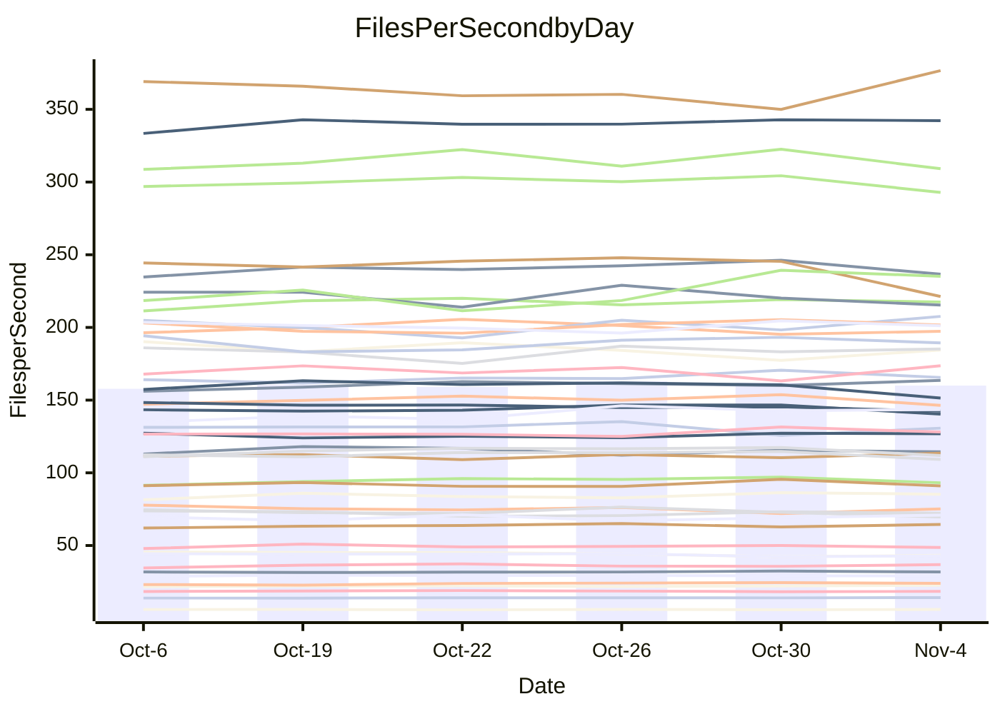

<!---
# This file is auto-generated. Do not edit.
# cspell:disable
--->
# Performance Report

## Daily Performance

## Time to Process Files

| Repository                                      | Elapsed | Min/Avg/Max           |   SD | SD Graph                |
| ----------------------------------------------- | ------: | :-------------------: | ---: | ----------------------- |
| AdaDoom3/AdaDoom3                    |    3.51 | 3.4 /   3.5 /   3.7   | 0.08 | `     ┣━┻━━●━━┻━┫     ` |
| alexiosc/megistos                    |    8.11 | 7.3 /   8.0 /   8.7   | 0.36 | `    ┣━━┻━━╋●━┻━━┫    ` |
| apollographql/apollo-server          |    2.84 | 2.6 /   2.7 /   2.9   | 0.07 | `     ┣━┻━━╋━━●━┫     ` |
| aspnetboilerplate/aspnetboilerplate  |   10.36 | 10.3 /  10.6 /  10.9  | 0.21 | `    ┣━━●━━╋━━┻━━┫    ` |
| aws-amplify/docs                     |   13.70 | 12.4 /  12.9 /  13.9  | 0.38 | `    ┣━━┻━━╋━━┻━━┫●   ` |
| Azure/azure-rest-api-specs           |   10.37 | 9.6 /  10.1 /  11.0   | 0.41 | `    ┣━━┻━━╋━●┻━━┫    ` |
| bitjson/typescript-starter           |    1.08 | 1.0 /   1.1 /   1.1   | 0.02 | `     ┣━━┻━●━┻━━┫     ` |
| caddyserver/caddy                    |    3.72 | 3.7 /   3.8 /   4.0   | 0.10 | `     ┣━●━━╋━━┻━┫     ` |
| canada-ca/open-source-logiciel-libre |    1.15 | 1.1 /   1.2 /   1.3   | 0.03 | `     ┣━━●━╋━┻━━┫     ` |
| chef/chef                            |    6.16 | 5.7 /   6.0 /   6.4   | 0.18 | `    ┣━━┻━━╋━━●━━┫    ` |
| dart-lang/sdk                        |   72.28 | 63.7 /  66.5 /  70.1  | 2.08 | `   ┣━━┻━━━╋━━━┻━━┫  ●` |
| django/django                        |   15.57 | 14.9 /  15.7 /  16.5  | 0.47 | `    ┣━━┻━●╋━━┻━━┫    ` |
| eslint/eslint                        |   10.66 | 10.7 /  11.2 /  11.8  | 0.37 | `    ┣━●┻━━╋━━┻━━┫    ` |
| exonum/exonum                        |    3.63 | 3.5 /   3.7 /   3.8   | 0.09 | `     ┣━┻━●╋━━┻━┫     ` |
| flutter/samples                      |   17.40 | 16.2 /  16.7 /  17.2  | 0.31 | `    ┣━━┻━━╋━━┻━━┫●   ` |
| gitbucket/gitbucket                  |    3.53 | 3.5 /   3.7 /   3.8   | 0.08 | `    ●┣━┻━━╋━━┻━┫     ` |
| googleapis/google-cloud-cpp          |  150.23 | 139.9 / 148.1 / 165.8 | 7.16 | `  ┣━━━┻━━━╋●━━┻━━━┫  ` |
| graphql/express-graphql              |    1.11 | 1.1 /   1.2 /   1.2   | 0.03 | `    ●┣━━┻━╋━┻━━┫     ` |
| graphql/graphql-js                   |    2.87 | 2.8 /   2.9 /   3.1   | 0.08 | `     ┣━┻●━╋━━┻━┫     ` |
| graphql/graphql-relay-js             |    1.21 | 1.1 /   1.2 /   1.2   | 0.04 | `     ┣━┻━━╋━●┻━┫     ` |
| graphql/graphql-spec                 |    1.34 | 1.3 /   1.4 /   1.4   | 0.04 | `     ┣━┻━●╋━━┻━┫     ` |
| iluwatar/java-design-patterns        |   12.91 | 12.8 /  13.4 /  14.4  | 0.41 | `    ┣━━●━━╋━━┻━━┫    ` |
| ktaranov/sqlserver-kit               |    6.75 | 6.6 /   6.8 /   7.1   | 0.18 | `    ┣━━┻━●╋━━┻━━┫    ` |
| liriliri/licia                       |    4.21 | 4.1 /   4.2 /   4.4   | 0.07 | `     ┣━┻━●╋━━┻━┫     ` |
| MartinThoma/LaTeX-examples           |    6.93 | 6.8 /   7.0 /   7.6   | 0.21 | `    ┣━━┻●━╋━━┻━━┫    ` |
| mdx-js/mdx                           |    1.94 | 2.0 /   2.1 /   2.2   | 0.08 | `     ┣●┻━━╋━━┻━┫     ` |
| microsoft/TypeScript-Website         |    5.71 | 5.6 /   5.8 /   6.1   | 0.16 | `    ┣━━┻━●╋━━┻━━┫    ` |
| MicrosoftDocs/PowerShell-Docs        |   24.21 | 23.3 /  24.1 /  25.4  | 0.62 | `   ┣━━━┻━━●━━┻━━━┫   ` |
| neovim/nvim-lspconfig                |    4.36 | 4.3 /   4.5 /   4.7   | 0.11 | `    ┣━━┻●━╋━━┻━━┫    ` |
| pagekit/pagekit                      |    3.62 | 3.5 /   3.7 /   4.0   | 0.15 | `    ┣━━┻━●╋━━┻━━┫    ` |
| php/php-src                          |   27.01 | 26.3 /  27.3 /  30.2  | 1.15 | `   ┣━━━┻━●╋━━┻━━━┫   ` |
| plasticrake/tplink-smarthome-api     |    1.40 | 1.3 /   1.4 /   1.5   | 0.04 | `     ┣━┻━━●━━┻━┫     ` |
| prettier/prettier                    |    7.69 | 7.2 /   7.5 /   7.9   | 0.20 | `    ┣━━┻━━╋━●┻━━┫    ` |
| pycontribs/jira                      |    1.65 | 1.5 /   1.6 /   1.7   | 0.06 | `     ┣━┻━━╋━●┻━┫     ` |
| RustPython/RustPython                |    5.54 | 5.2 /   5.4 /   5.8   | 0.20 | `    ┣━━┻━━╋━●┻━━┫    ` |
| shoelace-style/shoelace              |    3.20 | 2.9 /   3.0 /   3.1   | 0.05 | `     ┣━━┻━╋━┻━━┫    ●` |
| slint-ui/slint                       |   13.79 | 13.1 /  13.7 /  14.4  | 0.43 | `    ┣━━┻━━╋●━┻━━┫    ` |
| SoftwareBrothers/admin-bro           |    2.70 | 2.6 /   2.7 /   2.9   | 0.08 | `     ┣━┻━━╋●━┻━┫     ` |
| sveltejs/svelte                      |   21.84 | 20.8 /  21.9 /  22.9  | 0.55 | `    ┣━━┻━━●━━┻━━┫    ` |
| TheAlgorithms/Python                 |    5.85 | 5.7 /   5.8 /   6.1   | 0.11 | `    ┣━━┻━━╋●━┻━━┫    ` |
| twbs/bootstrap                       |    1.88 | 1.8 /   1.9 /   2.0   | 0.05 | `     ┣━┻━━╋━●┻━┫     ` |
| typescript-cheatsheets/react         |    1.36 | 1.4 /   1.5 /   1.6   | 0.06 | `     ●━┻━━╋━━┻━┫     ` |
| typescript-eslint/typescript-eslint  |    4.50 | 4.2 /   4.3 /   4.4   | 0.06 | `     ┣━┻━━╋━━┻━┫    ●` |
| vitest-dev/vitest                    |    9.95 | 9.2 /  10.1 /  10.9   | 0.52 | `    ┣━━┻━●╋━━┻━━┫    ` |
| w3c/aria-practices                   |    3.75 | 3.5 /   3.6 /   3.7   | 0.09 | `     ┣━┻━━╋━━┻●┫     ` |
| w3c/specberus                        |    2.19 | 2.0 /   2.1 /   2.3   | 0.06 | `     ┣━┻━━╋━━┻━●     ` |
| webdeveric/webpack-assets-manifest   |    1.31 | 1.2 /   1.2 /   1.3   | 0.03 | `     ┣━━┻━╋━┻━━┫●    ` |
| webpack/webpack                      |    5.66 | 5.4 /   5.6 /   5.8   | 0.12 | `    ┣━━┻━━╋●━┻━━┫    ` |
| wireapp/wire-desktop                 |    1.48 | 1.4 /   1.4 /   1.5   | 0.03 | `     ┣━┻━━╋━━●━┫     ` |
| wireapp/wire-webapp                  |   10.79 | 10.7 /  11.2 /  12.5  | 0.45 | `    ┣━━●━━╋━━┻━━┫    ` |

Note:
- Elapsed time is in seconds.

## Files per Second over Time

| Repository                                      | Files |    Sec |    Fps |    Rel | Trend Fps       |    N |
| ----------------------------------------------- | ----: | -----: | -----: | -----: | --------------- | ---: |
| AdaDoom3/AdaDoom3                    |   103 |   3.51 |  29.35 |  0.29% | `█▅██▆█▆█▇▇▇▆▇` |   12 |
| alexiosc/megistos                    |   583 |   8.11 |  71.87 | -2.04% | `▆▆▅▇▄▄▅█▆▅▅▃▅` |   12 |
| apollographql/apollo-server          |   253 |   2.84 |  89.23 | -3.01% | `▇▅▇█▆▇▄▅▆▆█▇▅` |   12 |
| aspnetboilerplate/aspnetboilerplate  |  2286 |  10.36 | 220.74 |  1.97% | `▅▆▆███▇▆▆█▇▆█` |   12 |
| aws-amplify/docs                     |  2871 |  13.70 | 209.59 | -6.07% | `▆▇▇▇▆▇▄█▇█▆▆▄` |   12 |
| Azure/azure-rest-api-specs           |  2365 |  10.37 | 228.00 | -5.93% | `▆█▅▇▇▆█▇█▇▇▃▅` |   12 |
| bitjson/typescript-starter           |    20 |   1.08 |  18.54 | -0.39% | `▆▆▅▇█▇█▇▇▅▅▆▆` |   12 |
| caddyserver/caddy                    |   288 |   3.72 |  77.38 |  2.71% | `██▇▆▇▆▆▇▇█▅▅█` |   12 |
| canada-ca/open-source-logiciel-libre |     7 |   1.15 |   6.06 |  1.76% | `█▇▇█▇▄▇██▇▆██` |   12 |
| chef/chef                            |  1191 |   6.16 | 193.30 | -3.52% | `▇▄▇▆▇█▇▆█▆▅▇▅` |   12 |
| dart-lang/sdk                        | 10719 |  72.28 | 148.30 | -7.64% | `▇▄▇▇█▇▅█▇▅▆▅▃` |   12 |
| django/django                        |  2877 |  15.57 | 184.80 |  0.71% | `▇▇▅▅█▄▅▇▆█▆▇▆` |   12 |
| eslint/eslint                        |  2098 |  10.66 | 196.88 |  4.73% | `▇█▅▄▇▇▄▇▇▇▇▅█` |   12 |
| exonum/exonum                        |   421 |   3.63 | 115.87 |  0.86% | `▅▆██▇▆█▆▆▅▇▆▇` |   12 |
| flutter/samples                      |  2400 |  17.40 | 137.95 | -4.30% | `▇▆▆▆▇█▅█▇██▆▅` |   12 |
| gitbucket/gitbucket                  |   413 |   3.53 | 117.10 |  5.11% | `▆▅▅▅█▅▅▇▆▅▅▅█` |   12 |
| googleapis/google-cloud-cpp          | 20949 | 150.23 | 139.45 | -0.91% | `▇▃▆▆▆▇▄▇██▇█▆` |   12 |
| graphql/express-graphql              |    26 |   1.11 |  23.33 |  6.22% | `▄▆▆▆▆█▅▄▆▆▆▆█` |   12 |
| graphql/graphql-js                   |   368 |   2.87 | 128.42 |  2.60% | `█▇█▇▅▆█▆█▅█▇█` |   12 |
| graphql/graphql-relay-js             |    28 |   1.21 |  23.15 | -2.22% | `▆▅▅▅▄█▅▇▇█▇█▅` |   12 |
| graphql/graphql-spec                 |    19 |   1.34 |  14.16 |  1.49% | `▇▅▅▆▆▅▇▄█▆▆▇▇` |   12 |
| iluwatar/java-design-patterns        |  1992 |  12.91 | 154.29 |  3.36% | `▆▆▇▇▆█▇█▇▅█▄█` |   12 |
| ktaranov/sqlserver-kit               |   489 |   6.75 |  72.46 |  0.59% | `█▇██▇▅▆▆▅▇▇▇▇` |   12 |
| liriliri/licia                       |  1437 |   4.21 | 341.00 |  0.27% | `▅▇█▇▇▇▇█▆▇▇█▇` |   12 |
| MartinThoma/LaTeX-examples           |  1409 |   6.93 | 203.44 |  1.64% | `▇█▇█▆▇▆▄█▆█▆▇` |   12 |
| mdx-js/mdx                           |   141 |   1.94 |  72.86 |  6.40% | `▆▇▄▇▆█▇▄▇▅▆▆█` |   12 |
| microsoft/TypeScript-Website         |   761 |   5.71 | 133.18 |  1.16% | `▅█▆▆▇▆▇▇██▅▅▇` |   12 |
| MicrosoftDocs/PowerShell-Docs        |  2708 |  24.21 | 111.88 | -0.42% | `▇▇▇▆▆▇██▅██▄▆` |   12 |
| neovim/nvim-lspconfig                |   759 |   4.36 | 174.26 |  2.13% | `▇▅██▆▅▇▇▇▇▅▇█` |   12 |
| pagekit/pagekit                      |   741 |   3.62 | 204.49 |  1.45% | `█▆▇█▄▅▅▇█▇▆█▇` |   12 |
| php/php-src                          |  2275 |  27.01 |  84.22 |  0.15% | `▄█▇███▅▇▆▆██▇` |   12 |
| plasticrake/tplink-smarthome-api     |    62 |   1.40 |  44.22 | -0.63% | `███▆█▇█▆▅█▅▄▆` |   12 |
| prettier/prettier                    |  2415 |   7.69 | 314.04 |  0.20% | `▅▆▆▆▆█▇▅▅██▅▆` |   12 |
| pycontribs/jira                      |    79 |   1.65 |  47.97 | -3.12% | `▆▄█▆▇▆▅▄▆█▆▆▅` |   12 |
| RustPython/RustPython                |   693 |   5.54 | 125.14 | -1.47% | `▆▆▅▇▆▄█▅▄██▇▆` |   12 |
| shoelace-style/shoelace              |   439 |   3.20 | 136.99 | -6.46% | `████▆▇█▇▅█▇█▄` |   12 |
| slint-ui/slint                       |  2561 |  13.79 | 185.70 |  0.27% | `█▇▅▇▇█▇▅▇█▅▆▇` |   12 |
| SoftwareBrothers/admin-bro           |   441 |   2.70 | 163.31 | -0.86% | `█▅▇▇▄▇▆▇▇▆█▇▆` |   12 |
| sveltejs/svelte                      |  8036 |  21.84 | 367.88 |  0.99% | `▆▇▆▆▇▆▅▅▅▆▄█▆` |   12 |
| TheAlgorithms/Python                 |  1399 |   5.85 | 239.10 | -0.41% | `▇▅▇▇█▇▇█▇██▆▇` |   12 |
| twbs/bootstrap                       |   118 |   1.88 |  62.68 | -1.77% | `▆▅▄▇█▇▆▇█▇▆█▆` |   12 |
| typescript-cheatsheets/react         |    53 |   1.36 |  38.97 |  8.49% | `▃▆▆▆▆▇▆▇▄▆▆▅█` |   12 |
| typescript-eslint/typescript-eslint  |  1285 |   4.50 | 285.51 | -4.93% | `▇▆▇▇▇█▇██▆█▇▅` |   12 |
| vitest-dev/vitest                    |  2245 |   9.95 | 225.56 |  1.12% | `▄▅▅▆▆▄▃▃▅▆▇█▆` |   12 |
| w3c/aria-practices                   |   414 |   3.75 | 110.36 | -4.12% | `▅▅▆▅██▆▇▆█▇▆▅` |   12 |
| w3c/specberus                        |   197 |   2.19 |  89.77 | -5.22% | `▄▇▇▆▇█▇▇▇███▅` |   12 |
| webdeveric/webpack-assets-manifest   |    55 |   1.31 |  41.95 | -4.76% | `▆▇▅▇▇▇▆█▆▆▄▆▄` |   12 |
| webpack/webpack                      |  1138 |   5.66 | 201.23 |  0.46% | `▇█▆▇▅▆▆█▇▇█▇▇` |   12 |
| wireapp/wire-desktop                 |    46 |   1.48 |  31.19 | -1.90% | `▅█▇▆▅▇▆▅█▆▇▇▆` |   12 |
| wireapp/wire-webapp                  |  1781 |  10.79 | 165.07 |  3.12% | `▄█▇▆▇▇█▇█▆▇▇█` |   12 |

## Data Throughput

| Repository                                      | Files |    Sec |     Kps |    Rel | Trend Kps       |    N |
| ----------------------------------------------- | ----: | -----: | ------: | -----: | --------------- | ---: |
| AdaDoom3/AdaDoom3                    |   103 |   3.51 |  623.66 |  0.29% | `█▅██▆█▆█▇▇▇▆▇` |   12 |
| alexiosc/megistos                    |   583 |   8.11 |  564.76 | -2.04% | `▆▆▅▇▄▄▅█▆▅▅▃▅` |   12 |
| apollographql/apollo-server          |   253 |   2.84 |  729.00 | -1.73% | `▇▅▆█▆▇▄▅▆▅█▇▅` |   12 |
| aspnetboilerplate/aspnetboilerplate  |  2286 |  10.36 |  537.08 |  1.97% | `▅▆▆███▇▆▆█▇▆█` |   12 |
| aws-amplify/docs                     |  2871 |  13.70 |  731.62 | -6.07% | `▆▇▇▇▆▇▄█▇█▆▆▄` |   12 |
| Azure/azure-rest-api-specs           |  2365 |  10.37 |  618.44 | -4.70% | `▆▇▅▇▇▆█▇█▇▇▃▅` |   12 |
| bitjson/typescript-starter           |    20 |   1.08 |   74.14 | -0.39% | `▆▆▅▇█▇█▇▇▅▅▆▆` |   12 |
| caddyserver/caddy                    |   288 |   3.72 |  671.14 |  3.30% | `█▇▆▅▇▆▆▇▇█▅▅█` |   12 |
| canada-ca/open-source-logiciel-libre |     7 |   1.15 |   50.25 |  1.76% | `█▇▇█▇▄▇██▇▆██` |   12 |
| chef/chef                            |  1191 |   6.16 |  895.91 | -3.29% | `▇▄▇▆▆█▇▆█▆▆▇▅` |   12 |
| dart-lang/sdk                        | 10719 |  72.28 | 1010.83 | -7.69% | `▇▄▇▇█▇▅█▇▅▆▅▃` |   12 |
| django/django                        |  2877 |  15.57 | 1162.42 |  0.91% | `▇▇▅▅█▄▅▇▆█▆▇▇` |   12 |
| eslint/eslint                        |  2098 |  10.66 | 1414.97 |  4.60% | `██▅▄▇▇▄▇▇▇▇▅█` |   12 |
| exonum/exonum                        |   421 |   3.63 | 1108.35 |  0.86% | `▅▆██▇▆█▆▆▅▇▆▇` |   12 |
| flutter/samples                      |  2400 |  17.40 | 1231.02 | -4.30% | `▇▆▆▆▇█▅█▇██▆▅` |   12 |
| gitbucket/gitbucket                  |   413 |   3.53 |  532.21 |  5.09% | `▆▅▅▅█▅▅▇▆▅▅▅█` |   12 |
| googleapis/google-cloud-cpp          | 20949 | 150.23 | 1130.12 | -1.13% | `▇▃▆▆▆▇▄▇██▇█▆` |   12 |
| graphql/express-graphql              |    26 |   1.11 |  106.78 |  6.22% | `▄▆▆▆▆█▅▄▆▆▆▆█` |   12 |
| graphql/graphql-js                   |   368 |   2.87 |  745.37 |  3.23% | `█▇▇▇▄▆█▆█▅█▇█` |   12 |
| graphql/graphql-relay-js             |    28 |   1.21 |   90.96 | -2.22% | `▆▅▅▅▄█▅▇▇█▇█▅` |   12 |
| graphql/graphql-spec                 |    19 |   1.34 |  472.40 |  1.49% | `▇▅▅▆▆▅▇▄█▆▆▇▇` |   12 |
| iluwatar/java-design-patterns        |  1992 |  12.91 |  476.88 |  3.36% | `▆▆▇▇▆█▇█▇▅█▄█` |   12 |
| ktaranov/sqlserver-kit               |   489 |   6.75 | 1097.28 |  0.60% | `█▇██▇▅▆▆▅▇▇▇▇` |   12 |
| liriliri/licia                       |  1437 |   4.21 |  406.25 |  0.27% | `▅▇█▇▇▇▇█▆▇▇█▇` |   12 |
| MartinThoma/LaTeX-examples           |  1409 |   6.93 |  420.16 |  1.64% | `▇█▇█▆▇▆▄█▆█▆▇` |   12 |
| mdx-js/mdx                           |   141 |   1.94 |  338.98 |  6.40% | `▆▇▄▇▆█▇▄▇▅▆▆█` |   12 |
| microsoft/TypeScript-Website         |   761 |   5.71 |  921.21 |  1.18% | `▅█▆▆▇▆▇▇██▅▅▇` |   12 |
| MicrosoftDocs/PowerShell-Docs        |  2708 |  24.21 | 1151.53 | -0.41% | `▇▇▇▆▆▇██▅██▄▆` |   12 |
| neovim/nvim-lspconfig                |   759 |   4.36 |  291.59 |  2.43% | `▇▅██▆▅▇▇▇▇▅▇█` |   12 |
| pagekit/pagekit                      |   741 |   3.62 |  426.36 |  1.45% | `█▆▇█▄▅▅▇█▇▆█▇` |   12 |
| php/php-src                          |  2275 |  27.01 | 1476.12 |  0.55% | `▄█▇███▅▇▆▆██▇` |   12 |
| plasticrake/tplink-smarthome-api     |    62 |   1.40 |  238.95 | -0.63% | `███▆█▇█▆▅█▅▄▆` |   12 |
| prettier/prettier                    |  2415 |   7.69 |  436.40 | -0.48% | `▆▆▆▆▆█▇▅▅██▅▆` |   12 |
| pycontribs/jira                      |    79 |   1.65 |  340.07 | -3.12% | `▆▄█▆▇▆▅▄▆█▆▆▅` |   12 |
| RustPython/RustPython                |   693 |   5.54 | 1041.20 |  3.11% | `▅▅▅▆▅▄▇▅▃▇▇█▇` |   12 |
| shoelace-style/shoelace              |   439 |   3.20 |  661.88 | -6.46% | `████▆▇█▇▅█▇█▄` |   12 |
| slint-ui/slint                       |  2561 |  13.79 | 1143.66 |  0.41% | `█▇▅▇▆█▇▅▇█▅▆▇` |   12 |
| SoftwareBrothers/admin-bro           |   441 |   2.70 |  359.95 | -0.86% | `█▅▇▇▄▇▆▇▇▆█▇▆` |   12 |
| sveltejs/svelte                      |  8036 |  21.84 |  245.65 |  1.03% | `▆▇▅▆▇▆▅▅▅▆▄█▆` |   12 |
| TheAlgorithms/Python                 |  1399 |   5.85 |  608.10 | -0.39% | `▇▅▇▇█▇▇█▇██▆▇` |   12 |
| twbs/bootstrap                       |   118 |   1.88 |  514.22 | -1.77% | `▆▅▄▇█▇▆▇█▇▆█▆` |   12 |
| typescript-cheatsheets/react         |    53 |   1.36 |  288.26 |  8.49% | `▃▆▆▆▆▇▆▇▄▆▆▅█` |   12 |
| typescript-eslint/typescript-eslint  |  1285 |   4.50 | 1468.00 | -4.91% | `▇▆▇▇▇█▇██▆█▇▅` |   12 |
| vitest-dev/vitest                    |  2245 |   9.95 |  500.24 | -0.07% | `▄▅▅▆▆▄▃▃▅▆██▅` |   12 |
| w3c/aria-practices                   |   414 |   3.75 | 1029.01 | -4.12% | `▅▅▆▅██▆▇▆█▇▆▅` |   12 |
| w3c/specberus                        |   197 |   2.19 |  283.88 | -5.15% | `▄▇▇▆▇█▇▇▇███▅` |   12 |
| webdeveric/webpack-assets-manifest   |    55 |   1.31 |   96.87 | -4.91% | `▇▇▅▇▇▇▆█▆▆▄▆▄` |   12 |
| webpack/webpack                      |  1138 |   5.66 |  912.96 |  0.12% | `▇█▆▇▅▆▅▇▇▇▇▇▇` |   12 |
| wireapp/wire-desktop                 |    46 |   1.48 |  174.23 | -0.53% | `▂█▇▇▆▇▇▆█▇██▇` |   12 |
| wireapp/wire-webapp                  |  1781 |  10.79 |  609.50 |  3.43% | `▃█▇▆▇▇█▇█▇▇▇█` |   12 |

