<!---
# This file is auto-generated. Do not edit.
# cspell:disable
--->
# Performance Report

## Daily Performance

```mermaid
xychart-beta
    title Files Per Second by Day
    y-axis Files per Second
    x-axis Date [Nov-26, Nov-27, Nov-28, Nov-29, Nov-30, Dec-2, Dec-8, Dec-9, Dec-10, Dec-13, Dec-14, Dec-15, Dec-16, Dec-20, Dec-22, Dec-23, Dec-24]
    bar [160.01, 159.51, 160.85, 158.58, 159.25, 158.41, 158.24, 160.26, 160.13, 162.46, 160.30, 159.32, 159.99, 160.32, 171.41, 173.30, 172.38]
    line [18.83, 18.32, 19.02, 18.13, 19.36, 18.09, 18.49, 18.92, 19.04, 18.41, 18.71, 17.35, 18.44, 18.66, 19.39, 19.24, 18.85]
    line [31.60, 31.68, 30.55, 32.17, 27.01, 31.76, 31.99, 31.99, 30.84, 32.08, 31.89, 31.67, 31.01, 31.00, 31.79, 31.95, 32.77]
    line [24.09, 24.00, 22.97, 23.09, 24.60, 24.46, 23.99, 23.97, 23.56, 24.27, 23.97, 21.89, 24.77, 24.75, 25.98, 24.78, 23.81]
    line [165.34, 167.76, 159.74, 168.29, 166.84, 155.06, 164.08, 161.66, 171.02, 169.99, 161.97, 169.28, 168.79, 164.45, 163.90, 173.08, 172.85]
    line [6.16, 6.03, 5.90, 6.01, 6.16, 6.12, 6.00, 6.03, 6.11, 5.69, 6.12, 5.85, 6.27, 5.94, 6.19, 6.23, 6.07]
    line [96.91, 93.91, 96.71, 97.20, 94.57, 96.80, 90.09, 95.39, 94.62, 99.56, 95.79, 93.99, 95.03, 91.66, 95.50, 94.32, 91.66]
    line [51.79, 48.42, 50.26, 50.21, 51.36, 49.95, 51.18, 48.94, 51.93, 50.78, 49.91, 50.66, 50.34, 50.02, 51.61, 51.21, 51.39]
    line [126.14, 121.82, 120.62, 120.89, 122.51, 125.41, 124.96, 118.90, 125.77, 122.50, 124.97, 121.63, 124.44, 114.40, 117.66, 113.42, 117.71]
    line [37.18, 37.74, 38.63, 39.45, 38.80, 39.93, 37.87, 36.13, 38.10, 36.47, 38.38, 37.81, 37.32, 38.13, 39.99, 39.24, 39.35]
    line [163.00, 169.37, 167.40, 162.13, 167.55, 165.94, 166.49, 162.27, 148.64, 164.74, 167.10, 169.90, 168.25, 171.20, 165.98, 169.49, 174.65]
    line [123.27, 123.12, 128.04, 125.68, 123.73, 126.68, 128.02, 124.91, 128.75, 126.25, 125.99, 122.54, 125.77, 120.95, 129.07, 131.35, 129.20]
    line [21.29, 23.51, 23.57, 23.50, 23.32, 21.90, 22.93, 23.26, 21.71, 22.48, 22.26, 24.16, 21.86, 22.99, 23.86, 22.95, 21.88]
    line [119.47, 113.07, 108.78, 113.61, 117.05, 115.87, 112.86, 110.11, 114.79, 114.58, 111.22, 109.33, 106.79, 113.91, 116.30, 113.89, 117.60]
    line [45.25, 44.50, 44.73, 43.85, 45.20, 42.00, 46.02, 43.67, 43.68, 45.02, 45.75, 43.43, 44.94, 44.85, 45.35, 43.98, 46.56]
    line [286.19, 292.24, 281.16, 293.25, 299.40, 309.39, 295.84, 293.27, 283.38, 296.25, 298.40, 299.27, 280.90, 293.45, 278.89, 296.00, 293.62]
    line [69.45, 70.29, 72.76, 71.50, 72.49, 68.01, 65.32, 69.78, 72.32, 70.99, 69.49, 68.20, 68.29, 71.18, 72.28, 72.81, 74.20]
    line [14.61, 14.49, 13.79, 14.45, 14.21, 13.55, 14.37, 14.53, 14.61, 14.25, 14.42, 14.66, 14.20, 14.14, 14.58, 14.66, 14.46]
    line [142.26, 141.63, 133.10, 147.45, 147.90, 147.19, 142.70, 144.08, 143.97, 142.44, 148.72, 148.74, 148.66, 145.81, 145.83, 151.65, 152.04]
    line [131.47, 131.60, 135.88, 131.34, 132.15, 133.58, 127.82, 130.48, 134.87, 129.94, 136.83, 140.59, 128.00, 132.13, 140.04, 140.36, 140.15]
    line [335.50, 325.97, 342.99, 339.55, 340.91, 343.35, 333.69, 321.17, 305.21, 329.78, 336.28, 339.96, 335.03, 330.81, 346.52, 335.23, 348.17]
    line [192.08, 198.49, 194.68, 194.09, 191.43, 192.21, 203.69, 197.75, 183.65, 201.42, 192.31, 202.71, 196.90, 201.49, 199.06, 199.67, 190.75]
    line [61.80, 64.96, 64.67, 62.90, 65.22, 65.65, 62.39, 60.36, 64.84, 65.11, 62.93, 65.98, 63.02, 64.70, 64.39, 64.92, 65.56]
    line [90.32, 91.22, 95.22, 98.38, 95.87, 95.57, 93.03, 94.71, 95.93, 94.05, 97.42, 87.40, 93.20, 92.02, 98.77, 95.06, 92.11]
    line [75.69, 74.97, 72.54, 73.38, 73.35, 76.02, 71.59, 73.55, 75.54, 73.95, 75.07, 76.77, 72.26, 69.84, 77.03, 74.27, 74.85]
    line [45.62, 44.62, 44.61, 47.22, 46.33, 44.42, 44.87, 45.90, 44.67, 46.00, 48.05, 47.07, 45.85, 42.75, 47.52, 47.21, 45.80]
    line [220.97, 238.24, 242.33, 236.55, 228.65, 226.03, 235.13, 236.77, 244.11, 232.83, 233.41, 237.39, 235.87, 236.73, 241.85, 239.59, 246.68]
    line [73.49, 71.80, 68.80, 70.33, 71.28, 70.66, 70.99, 71.64, 73.38, 70.10, 71.99, 68.96, 71.11, 72.00, 74.62, 76.21, 76.18]
    line [75.07, 72.02, 77.23, 76.76, 75.06, 80.27, 76.65, 75.94, 76.12, 76.57, 75.62, 71.86, 75.70, 72.52, 79.52, 79.75, 78.94]
    line [197.62, 198.09, 199.18, 190.53, 196.53, 193.86, 202.32, 202.37, 184.12, 199.02, 199.50, 195.58, 198.56, 202.04, 205.76, 202.04, 203.69]
    line [29.86, 30.48, 28.76, 28.98, 28.47, 31.13, 29.50, 29.81, 30.70, 31.34, 29.78, 30.86, 29.89, 30.20, 33.22, 32.90, 33.35]
    line [192.32, 195.34, 189.35, 192.30, 195.25, 190.71, 193.15, 186.55, 193.19, 192.23, 185.43, 191.26, 188.26, 189.10, 196.56, 199.42, 200.66]
    line [183.57, 185.12, 185.03, 175.76, 181.77, 182.47, 179.95, 179.31, 188.38, 180.77, 185.77, 186.35, 184.33, 182.33, 191.53, 189.75, 190.04]
    line [111.80, 116.19, 117.82, 117.56, 113.82, 115.04, 119.17, 112.82, 116.99, 116.61, 109.61, 115.93, 113.66, 115.36, 122.68, 121.26, 118.84]
    line [187.96, 198.52, 194.49, 202.79, 200.07, 197.01, 195.46, 191.88, 199.25, 200.18, 192.55, 195.85, 196.96, 197.31, 203.68, 215.88, 205.04]
    line [157.87, 156.54, 160.15, 158.52, 161.43, 161.03, 163.37, 162.01, 157.69, 162.41, 162.92, 155.61, 157.24, 162.25, 174.81, 169.46, 180.33]
    line [207.83, 208.99, 199.30, 206.34, 190.41, 205.06, 206.03, 204.37, 194.91, 205.14, 200.36, 207.64, 202.85, 200.31, 210.29, 210.04, 212.65]
    line [116.48, 115.76, 116.91, 109.21, 117.71, 115.04, 114.43, 117.93, 116.17, 113.85, 113.19, 111.86, 113.23, 116.22, 119.95, 116.76, 117.89]
    line [306.69, 310.59, 299.95, 317.57, 310.02, 296.47, 313.58, 317.30, 295.96, 306.54, 308.67, 318.29, 308.47, 312.68, 311.01, 311.87, 331.54]
    line [180.91, 184.73, 187.07, 183.30, 171.17, 189.43, 187.46, 185.27, 181.05, 182.93, 185.74, 173.94, 185.68, 184.19, 188.28, 188.11, 195.43]
    line [212.04, 213.89, 218.50, 211.90, 198.01, 215.07, 216.21, 215.29, 206.31, 212.61, 210.51, 204.56, 210.18, 211.34, 200.66, 223.22, 220.88]
    line [216.67, 216.64, 214.89, 220.14, 219.09, 206.67, 213.42, 215.72, 212.77, 206.57, 216.35, 210.81, 207.51, 213.81, 235.09, 232.12, 235.95]
    line [139.88, 148.61, 147.55, 150.86, 144.17, 148.12, 146.38, 144.41, 148.76, 149.26, 148.44, 146.25, 144.57, 148.51, 160.26, 155.20, 155.19]
    line [112.40, 105.21, 111.47, 116.12, 108.62, 108.44, 104.81, 110.68, 102.65, 110.81, 107.51, 105.11, 109.29, 110.23, 118.20, 116.66, 110.98]
    line [142.22, 131.52, 144.79, 139.07, 144.20, 143.55, 138.09, 144.82, 146.07, 144.49, 139.02, 141.78, 142.36, 140.50, 151.95, 150.33, 150.60]
    line [86.46, 84.38, 84.35, 87.05, 85.49, 84.05, 80.02, 85.30, 82.71, 84.32, 82.91, 77.95, 81.87, 81.89, 89.30, 90.84, 88.11]
    line [360.42, 361.78, 353.39, 352.03, 379.23, 367.49, 374.69, 369.34, 374.83, 359.05, 350.76, 385.22, 356.23, 361.41, 363.52, 371.74, 351.86]
    line [233.01, 234.04, 231.90, 232.03, 221.81, 240.23, 229.14, 227.27, 231.37, 242.80, 219.56, 233.62, 231.32, 236.32, 236.26, 240.94, 251.72]
    line [229.08, 239.26, 235.89, 229.81, 229.18, 221.75, 237.38, 239.25, 224.99, 230.85, 236.16, 237.46, 237.06, 237.81, 238.36, 240.26, 240.19]
    line [166.78, 158.69, 159.56, 158.17, 155.13, 153.99, 150.95, 152.99, 153.72, 160.91, 157.90, 164.74, 161.04, 164.69, 164.20, 175.57, 172.81]
    line [138.39, 140.67, 142.96, 135.37, 140.89, 136.51, 139.19, 142.56, 144.70, 146.06, 142.91, 137.61, 141.27, 139.39, 164.22, 164.25, 162.91]
```

## Time to Process Files

| Repository                                      | Elapsed | Min/Avg/Max           |   SD | SD Graph                |
| ----------------------------------------------- | ------: | :-------------------: | ---: | ----------------------- |
| AdaDoom3/AdaDoom3                    |    3.10 | 3.1 /   3.4 /   3.8   | 0.16 | `    ┣●━┻━━╋━━┻━━┫    ` |
| alexiosc/megistos                    |    7.69 | 7.5 /   7.9 /   8.8   | 0.29 | `    ┣━━┻●━╋━━┻━━┫    ` |
| apollographql/apollo-server          |    2.66 | 2.5 /   2.7 /   2.9   | 0.10 | `     ┣━┻━●╋━━┻━┫     ` |
| aspnetboilerplate/aspnetboilerplate  |    9.80 | 9.6 /  10.6 /  12.5   | 0.54 | `    ┣━●┻━━╋━━┻━━┫    ` |
| aws-amplify/docs                     |   13.36 | 12.7 /  13.5 /  15.9  | 0.61 | `    ┣━━┻━●╋━━┻━━┫    ` |
| Azure/azure-rest-api-specs           |   10.39 | 9.7 /  10.3 /  10.9   | 0.36 | `    ┣━━┻━━╋●━┻━━┫    ` |
| bitjson/typescript-starter           |    1.06 | 1.0 /   1.1 /   1.2   | 0.04 | `     ┣━━┻●╋━┻━━┫     ` |
| caddyserver/caddy                    |    3.70 | 3.5 /   3.8 /   4.2   | 0.16 | `    ┣━━┻●━╋━━┻━━┫    ` |
| canada-ca/open-source-logiciel-libre |    1.14 | 1.1 /   1.2 /   1.3   | 0.04 | `     ┣━━┻●╋━┻━━┫     ` |
| chef/chef                            |    6.75 | 5.8 /   6.0 /   6.5   | 0.18 | `     ┣━┻━━╋━━┻━┫    ●` |
| dart-lang/sdk                        |   63.79 | 60.5 /  67.4 /  75.3  | 2.94 | `   ┣━●┻━━━╋━━━┻━━┫   ` |
| django/django                        |   14.92 | 14.6 /  15.6 /  16.9  | 0.48 | `    ┣●━┻━━╋━━┻━━┫    ` |
| eslint/eslint                        |   10.38 | 10.2 /  10.8 /  11.4  | 0.30 | `    ┣━●┻━━╋━━┻━━┫    ` |
| exonum/exonum                        |    3.53 | 3.5 /   3.6 /   3.9   | 0.10 | `     ┣━●━━╋━━┻━┫     ` |
| flutter/samples                      |   16.06 | 15.7 /  17.0 /  21.1  | 0.88 | `    ┣━━●━━╋━━┻━━┫    ` |
| gitbucket/gitbucket                  |    3.48 | 3.3 /   3.6 /   3.8   | 0.12 | `     ┣━┻●━╋━━┻━┫     ` |
| googleapis/google-cloud-cpp          |  129.22 | 125.3 / 145.4 / 159.8 | 8.93 | `  ●━━━┻━━━╋━━━┻━━━┫  ` |
| graphql/express-graphql              |    1.11 | 1.1 /   1.1 /   1.4   | 0.08 | `     ┣━┻━●╋━━┻━┫     ` |
| graphql/graphql-js                   |    2.94 | 2.8 /   2.9 /   3.2   | 0.09 | `     ┣━┻━━╋●━┻━┫     ` |
| graphql/graphql-relay-js             |    1.17 | 1.1 /   1.2 /   1.3   | 0.05 | `     ┣━┻━━╋●━┻━┫     ` |
| graphql/graphql-spec                 |    1.30 | 1.3 /   1.3 /   1.5   | 0.04 | `     ┣━┻●━╋━━┻━┫     ` |
| iluwatar/java-design-patterns        |   12.83 | 12.4 /  13.4 /  14.9  | 0.50 | `    ┣━●┻━━╋━━┻━━┫    ` |
| ktaranov/sqlserver-kit               |    6.46 | 6.3 /   6.8 /   7.3   | 0.27 | `    ┣━●┻━━╋━━┻━━┫    ` |
| liriliri/licia                       |    4.11 | 4.1 /   4.3 /   4.7   | 0.15 | `    ┣━●┻━━╋━━┻━━┫    ` |
| MartinThoma/LaTeX-examples           |    6.87 | 6.8 /   7.1 /   7.7   | 0.19 | `    ┣━━●━━╋━━┻━━┫    ` |
| mdx-js/mdx                           |    1.92 | 1.9 /   2.0 /   2.2   | 0.09 | `     ┣━┻●━╋━━┻━┫     ` |
| microsoft/TypeScript-Website         |    5.48 | 5.4 /   5.7 /   6.1   | 0.21 | `    ┣━━●━━╋━━┻━━┫    ` |
| MicrosoftDocs/PowerShell-Docs        |   23.10 | 22.1 /  24.2 /  26.2  | 1.09 | `   ┣━━━●━━╋━━┻━━━┫   ` |
| neovim/nvim-lspconfig                |    4.32 | 4.4 /   4.6 /   5.1   | 0.15 | `    ┣●━┻━━╋━━┻━━┫    ` |
| pagekit/pagekit                      |    3.45 | 3.4 /   3.6 /   3.9   | 0.10 | `     ●━┻━━╋━━┻━┫     ` |
| php/php-src                          |   25.90 | 24.8 /  26.8 /  29.7  | 1.17 | `   ┣━━━●━━╋━━┻━━━┫   ` |
| plasticrake/tplink-smarthome-api     |    1.30 | 1.3 /   1.4 /   1.6   | 0.05 | `     ┣━●━━╋━━┻━┫     ` |
| prettier/prettier                    |    7.41 | 7.5 /   7.9 /   8.4   | 0.21 | `   ●┣━━┻━━╋━━┻━━┫    ` |
| pycontribs/jira                      |    1.56 | 1.5 /   1.6 /   1.7   | 0.05 | `     ┣━┻━━●━━┻━┫     ` |
| RustPython/RustPython                |    5.94 | 5.5 /   5.9 /   6.8   | 0.29 | `    ┣━━┻━━╋●━┻━━┫    ` |
| shoelace-style/shoelace              |    2.87 | 2.8 /   3.0 /   3.7   | 0.16 | `    ┣━━●━━╋━━┻━━┫    ` |
| slint-ui/slint                       |   14.02 | 13.6 /  14.1 /  15.0  | 0.36 | `    ┣━━┻━●╋━━┻━━┫    ` |
| SoftwareBrothers/admin-bro           |    2.52 | 2.5 /   2.7 /   2.9   | 0.09 | `     ┣●┻━━╋━━┻━┫     ` |
| sveltejs/svelte                      |   23.24 | 21.1 /  22.6 /  23.8  | 0.69 | `    ┣━━┻━━╋━━●━━┫    ` |
| TheAlgorithms/Python                 |    5.62 | 5.6 /   5.9 /   6.5   | 0.22 | `    ┣━●┻━━╋━━┻━━┫    ` |
| twbs/bootstrap                       |    1.83 | 1.8 /   1.8 /   2.0   | 0.05 | `     ┣━┻━●╋━━┻━┫     ` |
| typescript-cheatsheets/react         |    1.35 | 1.3 /   1.4 /   1.7   | 0.07 | `     ┣━┻━●╋━━┻━┫     ` |
| typescript-eslint/typescript-eslint  |    4.34 | 4.0 /   4.4 /   4.9   | 0.16 | `    ┣━━┻●━╋━━┻━━┫    ` |
| vitest-dev/vitest                    |    9.38 | 9.6 /  10.3 /  11.6   | 0.38 | `   ●┣━━┻━━╋━━┻━━┫    ` |
| w3c/aria-practices                   |    3.66 | 3.4 /   3.7 /   4.0   | 0.16 | `    ┣━━┻━━●━━┻━━┫    ` |
| w3c/specberus                        |    2.08 | 1.9 /   2.1 /   2.3   | 0.07 | `     ┣━┻━━●━━┻━┫     ` |
| webdeveric/webpack-assets-manifest   |    1.20 | 1.2 /   1.2 /   1.4   | 0.05 | `     ┣━┻●━╋━━┻━┫     ` |
| webpack/webpack                      |    5.68 | 5.2 /   5.7 /   6.1   | 0.22 | `    ┣━━┻━●╋━━┻━━┫    ` |
| wireapp/wire-desktop                 |    1.39 | 1.3 /   1.4 /   1.6   | 0.07 | `     ┣━┻━━●━━┻━┫     ` |
| wireapp/wire-webapp                  |    9.90 | 10.1 /  11.1 /  12.4  | 0.46 | `  ● ┣━━┻━━╋━━┻━━┫    ` |

Note:
- Elapsed time is in seconds.

## Files per Second over Time

| Repository                                      | Files |    Sec |    Fps |     Rel | Trend Fps              |    N |
| ----------------------------------------------- | ----: | -----: | -----: | ------: | ---------------------- | ---: |
| AdaDoom3/AdaDoom3                    |   103 |   3.10 |  33.24 |   8.73% | `▆▆▇▅▅▆▅▄▆▅▅▆▅██▇████` |   34 |
| alexiosc/megistos                    |   583 |   7.69 |  75.84 |   2.72% | `▇█▆▆██▆█▃▆▅▅▄██▇▇▆▆▇` |   34 |
| apollographql/apollo-server          |   253 |   2.66 |  95.28 |   1.48% | `▆▆▅█▅▃▅▅▄▆▆▄▄▆▇▆▅▆▄▆` |   34 |
| aspnetboilerplate/aspnetboilerplate  |  2286 |   9.80 | 233.16 |   7.57% | `▅▄▅▆▆▅▆▆▅▂▆▆▅██▇▇███` |   34 |
| aws-amplify/docs                     |  2874 |  13.36 | 215.05 |   1.06% | `▆▇▆▅▇▅▇▆▅▇▆▆▆▃▇█▇██▇` |   34 |
| Azure/azure-rest-api-specs           |  2438 |  10.39 | 234.56 |  -0.37% | `▅▅▆▇▆▆▄█▆██▅▆█▅▆▇██▆` |   34 |
| bitjson/typescript-starter           |    20 |   1.06 |  18.83 |   0.85% | `▇▅▇▇▆▄▇▆▇▅▇▆▆▇▇█▆█▇▇` |   34 |
| caddyserver/caddy                    |   290 |   3.70 |  78.45 |   3.04% | `▆▇▇▆▆▅▆▇▆▆▇▅▃██████▇` |   34 |
| canada-ca/open-source-logiciel-libre |     7 |   1.14 |   6.16 |   1.62% | `▆▃▆▆▇▅▇█▇▆▆▅▆▇▆▇▇▇▆▇` |   34 |
| chef/chef                            |  1192 |   6.75 | 176.55 | -10.54% | `▄█▇▆▆█▆█▅▆▇▇█▆▇█▇▆█▃` |   34 |
| dart-lang/sdk                        | 10901 |  63.79 | 170.89 |   5.99% | `▄▅▅▅▄▆▅▅▅▆▆▆▆▆▆▆██▇▇` |   34 |
| django/django                        |  2889 |  14.92 | 193.57 |   4.55% | `▅▆▅▆▇▄▆▆▇▅▆▆▅▅█▇▅██▇` |   34 |
| eslint/eslint                        |  2062 |  10.38 | 198.74 |   3.45% | `▆▇▅▅▅▆▅▅▅▆▆▆▅█▆██▇█▇` |   34 |
| exonum/exonum                        |   421 |   3.53 | 119.33 |   3.34% | `▇▅▇▆▅▅▄▆▇▆▇█▆███▅█▇█` |   34 |
| flutter/samples                      |  2441 |  16.06 | 152.03 |   6.48% | `▇▇▆▆▅▆▆▆▇▆▆▆▆▇█▇█▇▇█` |   34 |
| gitbucket/gitbucket                  |   413 |   3.48 | 118.51 |   2.07% | `▆▆▆▅▃▆▆▄▅▆▆▅▆▇███▇▇▇` |   34 |
| googleapis/google-cloud-cpp          | 21013 | 129.22 | 162.62 |  12.25% | `▅▅▅▄▄▄▃▄▅▄▄▃▄▇███▇▇▇` |   34 |
| graphql/express-graphql              |    26 |   1.11 |  23.35 |   2.82% | `▅▆▆▅▇█▃▆▇▇▇▇▆▇██▆▆▄▇` |   34 |
| graphql/graphql-js                   |   368 |   2.94 | 125.22 |  -0.70% | `▇▇▆▆▆▅▇▇▅▆▆▄▄▇▇▇███▆` |   34 |
| graphql/graphql-relay-js             |    28 |   1.17 |  23.90 |  -1.37% | `▅▆▆▆▅▃▆█▆▆▆▇▆▇█▆▆▇▅▅` |   34 |
| graphql/graphql-spec                 |    19 |   1.30 |  14.64 |   2.17% | `█▆▇█▇█▇▇▆▇▆▇▇▇██▇█▇█` |   34 |
| iluwatar/java-design-patterns        |  1992 |  12.83 | 155.25 |   4.55% | `▆▆▆▅▆▅▅▆▄▅▆▆▆███▆▇▇▇` |   34 |
| ktaranov/sqlserver-kit               |   489 |   6.46 |  75.67 |   5.02% | `▆▅▄▆▅▄▄▇▆▄▇▅▄▅███▆█▇` |   34 |
| liriliri/licia                       |  1437 |   4.11 | 350.05 |   4.71% | `▃▄█▆▇▇█▇▆▅▆▆▆▇█▆█▅██` |   34 |
| MartinThoma/LaTeX-examples           |  1409 |   6.87 | 205.23 |   3.09% | `▄▇▆▇▆▆▇▇▅▆█▇▇▇█▆█▇▇█` |   34 |
| mdx-js/mdx                           |   141 |   1.92 |  73.32 |   4.22% | `▇▇▆▅▇▅▆▇▄▄▇▅▇▇▇█▇▇█▇` |   34 |
| microsoft/TypeScript-Website         |   761 |   5.48 | 138.94 |   4.13% | `▆▆▄▇▇█▅▅▄▄▆▅▅█▇██▇█▇` |   34 |
| MicrosoftDocs/PowerShell-Docs        |  2639 |  23.10 | 114.23 |   3.78% | `▄▆▆▄▆▄▆▅▅▆▅▆▆█▇█▆█▅▇` |   34 |
| neovim/nvim-lspconfig                |   766 |   4.32 | 177.17 |   6.25% | `▃▆▆▇▆▇▇▆▇▆▇▇█▆▆▇▆▇▇█` |   34 |
| pagekit/pagekit                      |   741 |   3.45 | 214.90 |   5.04% | `▅▆▇▇▅▇▆▆▅▆▆▄▆▇██▇▇▇█` |   34 |
| php/php-src                          |  2265 |  25.90 |  87.44 |   3.44% | `▅▆▆▅▅▄▅▄▆▅▅▆▄▇████▇▇` |   34 |
| plasticrake/tplink-smarthome-api     |    62 |   1.30 |  47.70 |   4.62% | `▆▆▇█▇▇▇▆▆▇▃▆▅▇█▇▇▇▅▇` |   34 |
| prettier/prettier                    |  2467 |   7.41 | 332.92 |   7.48% | `▄▅▆▄▇▇▆▅▆▅▆▇▆▅▇▆▆▆██` |   34 |
| pycontribs/jira                      |    79 |   1.56 |  50.67 |   0.42% | `▇▇▆▅▇▆▇▇▅▆▆▆▆█▇█▇▅▇▆` |   34 |
| RustPython/RustPython                |   711 |   5.94 | 119.79 |  -1.03% | `█▇▇██▇███▇▅▅▆▇▆▃▆▆▆▇` |   34 |
| shoelace-style/shoelace              |   439 |   2.87 | 152.87 |   5.13% | `▆▇▅▇▆▇▆▇▆█▆▆▆▅▇▇▇▇▇▇` |   34 |
| slint-ui/slint                       |  2628 |  14.02 | 187.45 |   1.64% | `▇▅▆▆▇▇▆▇▆▇▇▇▅███▇██▇` |   34 |
| SoftwareBrothers/admin-bro           |   441 |   2.52 | 175.22 |   5.62% | `▇▇▇▄▇▇▇▇▇▇▅▅▇▆▅██▇▇█` |   34 |
| sveltejs/svelte                      |  8238 |  23.24 | 354.51 |  -2.38% | `▇▆▅▅▄█▄▅▅▇▆▅▆▆▆█▆▆▄▅` |   34 |
| TheAlgorithms/Python                 |  1399 |   5.62 | 248.83 |   5.53% | `▇▇▅▆▆▇▅█▆▆▆▆▇▆█▇█▅██` |   34 |
| twbs/bootstrap                       |   118 |   1.83 |  64.34 |   0.52% | `▇▇▇▆▆█▆▅▆▆▆▇██▆▇▇▇█▇` |   34 |
| typescript-cheatsheets/react         |    53 |   1.35 |  39.16 |   2.61% | `▇▄▇▇▇▆▆▆▆▇▇▆▆█▇▇▇█▇▇` |   34 |
| typescript-eslint/typescript-eslint  |  1294 |   4.34 | 298.48 |   2.39% | `▆▇█▇██▇▆▃▆█▇▆▅▅██▆▇█` |   34 |
| vitest-dev/vitest                    |  2424 |   9.38 | 258.46 |  10.63% | `▅▇▆▅▃▅▅▅▆▅▇▅▆▆▅▇▅▆▇█` |   34 |
| w3c/aria-practices                   |   414 |   3.66 | 113.26 |   0.15% | `▆▅▇▇▄▅▄▄▄▄▆▆▆▆▇▇▃██▆` |   34 |
| w3c/specberus                        |   197 |   2.08 |  94.75 |  -0.03% | `▆█▇▇▆▆▆▆▅▆▃▇▄▇▅▆▇▅▄▆` |   34 |
| webdeveric/webpack-assets-manifest   |    55 |   1.20 |  45.78 |   2.48% | `▆▆▇▇▇▆▇▇▇▆▆▇▇▇▆▇▇▄█▇` |   34 |
| webpack/webpack                      |  1139 |   5.68 | 200.37 |   0.82% | `▅▆▅▅▃▅▆▆▅▄▅▅▅▇▅███▇▅` |   34 |
| wireapp/wire-desktop                 |    44 |   1.39 |  31.60 |   0.32% | `▅▆▇▆▆▆▅▄▆▇▇▄▆▄█▇█▄█▆` |   34 |
| wireapp/wire-webapp                  |  1809 |   9.90 | 182.78 |  12.70% | `▅▆▅▅▆▄▅▅▅▄▅▆▅█▆▆▅▇▇█` |   34 |

## Data Throughput

| Repository                                      | Files |    Sec |     Kps |     Rel | Trend Kps              |    N |
| ----------------------------------------------- | ----: | -----: | ------: | ------: | ---------------------- | ---: |
| AdaDoom3/AdaDoom3                    |   103 |   3.10 |  706.53 |   8.73% | `▆▆▇▅▅▆▅▄▆▅▅▆▅██▇████` |   34 |
| alexiosc/megistos                    |   583 |   7.69 |  595.88 |   2.72% | `▇█▆▆██▆█▃▆▅▅▄██▇▇▆▆▇` |   34 |
| apollographql/apollo-server          |   253 |   2.66 |  779.58 |   1.52% | `▆▆▅█▅▃▅▅▄▆▆▄▄▆▇▆▅▆▄▆` |   34 |
| aspnetboilerplate/aspnetboilerplate  |  2286 |   9.80 |  567.31 |   7.57% | `▅▄▅▆▆▅▆▆▅▂▆▆▅██▇▇███` |   34 |
| aws-amplify/docs                     |  2874 |  13.36 |  751.64 |   1.12% | `▆▇▆▅▇▅▇▆▅▇▆▆▆▃▇█▇██▇` |   34 |
| Azure/azure-rest-api-specs           |  2438 |  10.39 |  619.89 |  -1.42% | `▅▅▆▇▆▆▄█▅██▅▆█▅▆▇██▆` |   34 |
| bitjson/typescript-starter           |    20 |   1.06 |   75.32 |   0.85% | `▇▅▇▇▆▄▇▆▇▅▇▆▆▇▇█▆█▇▇` |   34 |
| caddyserver/caddy                    |   290 |   3.70 |  686.29 |   3.42% | `▆▇▇▆▆▅▆▇▆▆▇▅▄██████▇` |   34 |
| canada-ca/open-source-logiciel-libre |     7 |   1.14 |   51.07 |   1.62% | `▆▃▆▆▇▅▇█▇▆▆▅▆▇▆▇▇▇▆▇` |   34 |
| chef/chef                            |  1192 |   6.75 |  820.97 | -10.52% | `▄▇▇▆▆█▆█▅▆▇▇█▆▇█▇▆█▃` |   34 |
| dart-lang/sdk                        | 10901 |  63.79 | 1158.49 |   5.72% | `▄▅▅▆▄▆▅▅▅▆▆▆▆▆▆▆██▇▇` |   34 |
| django/django                        |  2889 |  14.92 | 1218.78 |   4.71% | `▅▆▅▅▆▄▆▆▇▅▆▆▅▅█▇▅██▇` |   34 |
| eslint/eslint                        |  2062 |  10.38 | 1369.28 |   4.01% | `▆▇▅▅▅▆▅▅▅▆▆▆▅█▆██▇█▇` |   34 |
| exonum/exonum                        |   421 |   3.53 | 1141.40 |   3.34% | `▇▅▇▆▅▅▄▆▇▆▇█▆███▅█▇█` |   34 |
| flutter/samples                      |  2441 |  16.06 | 1335.80 |   5.52% | `▇▇▇▆▆▆▆▆▇▆▆▆▆▇█▇█▇▇█` |   34 |
| gitbucket/gitbucket                  |   413 |   3.48 |  539.18 |   2.13% | `▆▆▆▅▃▆▆▄▅▆▆▅▆▇███▇▇▇` |   34 |
| googleapis/google-cloud-cpp          | 21013 | 129.22 | 1323.59 |  12.15% | `▅▅▅▄▄▄▃▄▅▄▄▃▄▇███▇▇▇` |   34 |
| graphql/express-graphql              |    26 |   1.11 |  106.86 |   2.82% | `▅▆▆▅▇█▃▆▇▇▇▇▆▇██▆▆▄▇` |   34 |
| graphql/graphql-js                   |   368 |   2.94 |  726.85 |  -0.70% | `▇▇▆▆▆▅▇▇▅▆▆▄▄▇▇▇███▆` |   34 |
| graphql/graphql-relay-js             |    28 |   1.17 |   93.90 |  -1.37% | `▅▆▆▆▅▃▆█▆▆▆▇▆▇█▆▆▇▅▅` |   34 |
| graphql/graphql-spec                 |    19 |   1.30 |  488.43 |   2.17% | `█▆▇█▇█▇▇▆▇▆▇▇▇██▇█▇█` |   34 |
| iluwatar/java-design-patterns        |  1992 |  12.83 |  479.86 |   4.55% | `▆▆▆▅▆▅▅▆▄▅▆▆▆███▆▇▇▇` |   34 |
| ktaranov/sqlserver-kit               |   489 |   6.46 | 1145.86 |   5.02% | `▆▅▄▆▅▄▄▇▆▄▇▅▄▅███▆█▇` |   34 |
| liriliri/licia                       |  1437 |   4.11 |  417.04 |   4.71% | `▃▄█▆▇▇█▇▆▅▆▆▆▇█▆█▅██` |   34 |
| MartinThoma/LaTeX-examples           |  1409 |   6.87 |  423.86 |   3.09% | `▄▇▆▇▆▆▇▇▅▆█▇▇▇█▆█▇▇█` |   34 |
| mdx-js/mdx                           |   141 |   1.92 |  340.58 |   4.18% | `▇▇▆▅▇▅▆▇▄▄▇▅▇▇▇█▇▇█▇` |   34 |
| microsoft/TypeScript-Website         |   761 |   5.48 |  961.07 |   4.13% | `▆▆▄▇▇█▅▅▄▄▆▅▅█▇██▇█▇` |   34 |
| MicrosoftDocs/PowerShell-Docs        |  2639 |  23.10 | 1191.67 |   4.16% | `▄▆▆▄▆▄▆▅▅▆▅▆▆█▇█▆█▅▇` |   34 |
| neovim/nvim-lspconfig                |   766 |   4.32 |  330.29 |   6.34% | `▃▆▆▇▆▇▇▆▇▆▇▇█▆▆▇▆▇▇█` |   34 |
| pagekit/pagekit                      |   741 |   3.45 |  448.08 |   5.04% | `▅▆▇▇▅▇▆▆▅▆▆▄▆▇██▇▇▇█` |   34 |
| php/php-src                          |  2265 |  25.90 | 1530.98 |   3.34% | `▅▆▆▅▅▄▅▄▆▅▅▆▄▇████▇▇` |   34 |
| plasticrake/tplink-smarthome-api     |    62 |   1.30 |  257.76 |   4.62% | `▆▆▇█▇▇▇▆▆▇▃▆▅▇█▇▇▇▅▇` |   34 |
| prettier/prettier                    |  2467 |   7.41 |  474.35 |   8.22% | `▅▅▆▄▇▇▆▅▆▅▆▇▆▅▇▆▆▇██` |   34 |
| pycontribs/jira                      |    79 |   1.56 |  359.15 |   0.42% | `▇▇▆▅▇▆▇▇▅▆▆▆▆█▇█▇▅▇▆` |   34 |
| RustPython/RustPython                |   711 |   5.94 | 1331.01 |   4.02% | `▇▆▆▇▇▇███▇▅▅▆▇▇▄▇▇▆█` |   34 |
| shoelace-style/shoelace              |   439 |   2.87 |  738.56 |   5.13% | `▆▇▅▇▆▇▆▇▆█▆▆▆▅▇▇▇▇▇▇` |   34 |
| slint-ui/slint                       |  2628 |  14.02 | 1157.95 |   1.37% | `▇▅▆▆▇▇▆▇▆▇▇▆▅███▇▇█▇` |   34 |
| SoftwareBrothers/admin-bro           |   441 |   2.52 |  386.21 |   5.62% | `▇▇▇▄▇▇▇▇▇▇▅▅▇▆▅██▇▇█` |   34 |
| sveltejs/svelte                      |  8238 |  23.24 |  238.02 |  -2.21% | `▇▆▅▅▄█▄▅▅▇▆▅▆▆▆█▆▆▄▅` |   34 |
| TheAlgorithms/Python                 |  1399 |   5.62 |  633.37 |   5.58% | `▇▇▅▆▆▇▅█▆▆▆▆▇▆█▇█▅██` |   34 |
| twbs/bootstrap                       |   118 |   1.83 |  528.34 |   0.52% | `▇▇▇▆▆█▆▅▆▆▆▇██▆▇▇▇█▇` |   34 |
| typescript-cheatsheets/react         |    53 |   1.35 |  289.63 |   2.61% | `▇▄▇▇▇▆▆▆▆▇▇▆▆█▇▇▇█▇▇` |   34 |
| typescript-eslint/typescript-eslint  |  1294 |   4.34 | 1543.82 |   2.49% | `▆▇█▇██▇▆▃▆█▇▆▅▆██▆▇█` |   34 |
| vitest-dev/vitest                    |  2424 |   9.38 |  562.56 |  10.98% | `▅▇▆▅▃▅▅▅▆▅▇▅▅▆▅▇▅▆▇█` |   34 |
| w3c/aria-practices                   |   414 |   3.66 | 1055.98 |   0.15% | `▆▅▇▇▄▅▄▄▄▄▆▆▆▆▇▇▃██▆` |   34 |
| w3c/specberus                        |   197 |   2.08 |  299.63 |  -0.03% | `▆█▇▇▆▆▆▆▅▆▃▇▄▇▅▆▇▅▄▆` |   34 |
| webdeveric/webpack-assets-manifest   |    55 |   1.20 |  104.87 |   2.22% | `▆▆▇▇▇▆▇▇▇▆▆▇▇▇▆▆▇▄█▇` |   34 |
| webpack/webpack                      |  1139 |   5.68 |  924.96 |   1.31% | `▅▆▅▅▃▅▆▆▅▄▅▅▅▇▅███▇▆` |   34 |
| wireapp/wire-desktop                 |    44 |   1.39 |  140.75 |   0.84% | `▅▆▇▆▆▆▅▃▆▇▆▄▆▄█▇█▄█▆` |   34 |
| wireapp/wire-webapp                  |  1809 |   9.90 |  681.19 |  13.08% | `▅▆▅▅▆▄▅▅▅▄▅▆▅█▆▆▅▇▇█` |   34 |

