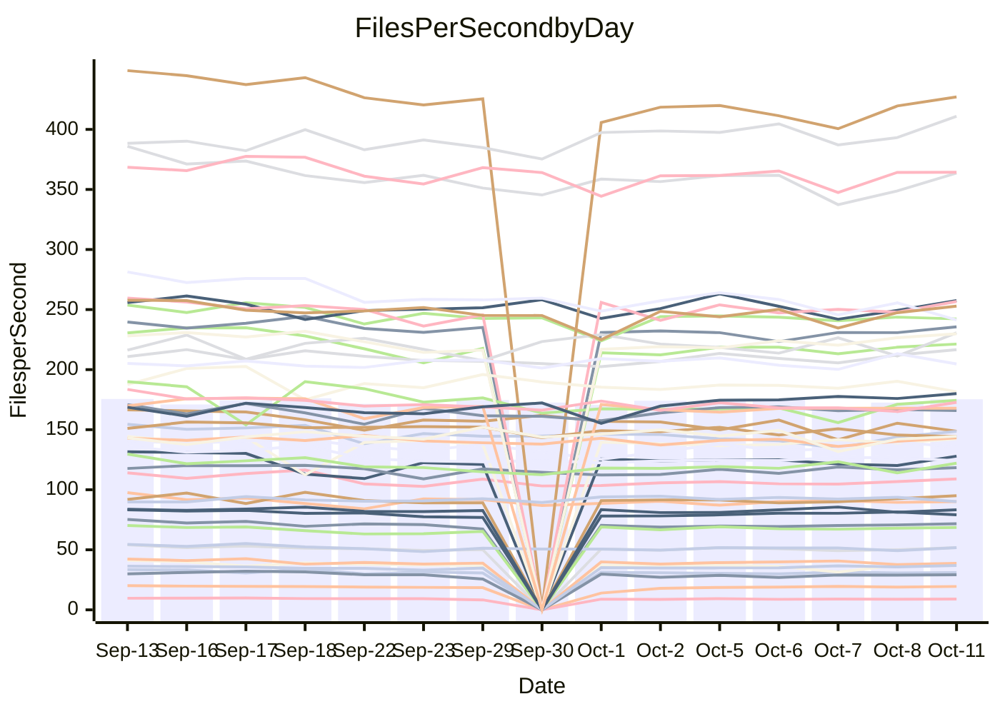

<!---
# This file is auto-generated. Do not edit.
# cspell:disable
--->
# Performance Report

## Daily Performance

## Time to Process Files

| Repository                                      | Elapsed | Min/Avg/Max           |   SD | SD Graph                |
| ----------------------------------------------- | ------: | :-------------------: | ---: | ----------------------- |
| AdaDoom3/AdaDoom3                    |    2.79 | 2.8 /   2.9 /   3.1   | 0.08 | `    ┣━●┻━━╋━━┻━━┫    ` |
| alexiosc/megistos                    |    7.43 | 6.6 /   7.3 /   7.7   | 0.25 | `    ┣━━┻━━╋━●┻━━┫    ` |
| apollographql/apollo-server          |    2.09 | 2.1 /   2.1 /   2.3   | 0.07 | `     ┣━┻●━╋━━┻━┫     ` |
| aspnetboilerplate/aspnetboilerplate  |   10.79 | 10.5 /  10.9 /  12.0  | 0.34 | `    ┣━━┻━●╋━━┻━━┫    ` |
| aws-amplify/docs                     |   11.09 | 10.8 /  11.4 /  12.6  | 0.37 | `    ┣━━●━━╋━━┻━━┫    ` |
| Azure/azure-rest-api-specs           |   14.38 | 13.0 /  14.1 /  15.6  | 0.61 | `   ┣━━━┻━━╋●━┻━━━┫   ` |
| bitjson/typescript-starter           |    0.64 | 0.6 /   0.6 /   0.7   | 0.03 | `     ┣━━┻━●━┻━━┫     ` |
| caddyserver/caddy                    |    2.97 | 2.8 /   3.1 /   3.5   | 0.15 | `    ┣━━┻●━╋━━┻━━┫    ` |
| canada-ca/open-source-logiciel-libre |    0.80 | 0.7 /   0.8 /   0.9   | 0.05 | `     ┣━┻━━╋━●┻━┫     ` |
| chef/chef                            |    5.21 | 5.1 /   5.5 /   6.0   | 0.22 | `    ┣━━●━━╋━━┻━━┫    ` |
| dart-lang/sdk                        |   53.98 | 54.2 /  57.4 /  70.4  | 3.24 | `  ┣━━━●━━━╋━━━┻━━━┫  ` |
| django/django                        |   13.51 | 12.9 /  13.6 /  14.3  | 0.31 | `    ┣━━┻━●╋━━┻━━┫    ` |
| eslint/eslint                        |    9.26 | 9.1 /   9.5 /  10.0   | 0.22 | `    ┣━●┻━━╋━━┻━━┫    ` |
| exonum/exonum                        |    2.98 | 2.9 /   3.0 /   3.7   | 0.16 | `    ┣━━┻━●╋━━┻━━┫    ` |
| flutter/samples                      |   16.47 | 13.7 /  15.9 /  18.4  | 1.55 | `   ┣━━━┻━━╋●━┻━━━┫   ` |
| gitbucket/gitbucket                  |    3.03 | 2.9 /   3.0 /   3.3   | 0.11 | `    ┣━━┻━━●━━┻━━┫    ` |
| googleapis/google-cloud-cpp          |  137.02 | 129.1 / 136.3 / 149.4 | 4.60 | `  ┣━━━┻━━━╋●━━┻━━━┫  ` |
| graphql/express-graphql              |    0.69 | 0.6 /   0.7 /   0.8   | 0.04 | `     ┣━┻━●╋━━┻━┫     ` |
| graphql/graphql-js                   |    2.11 | 1.9 /   2.1 /   2.4   | 0.11 | `    ┣━━┻━━●━━┻━━┫    ` |
| graphql/graphql-relay-js             |    0.72 | 0.6 /   0.7 /   0.8   | 0.03 | `     ┣━┻━━╋●━┻━┫     ` |
| graphql/graphql-spec                 |    0.77 | 0.7 /   0.8 /   1.1   | 0.06 | `     ┣━┻━●╋━━┻━┫     ` |
| iluwatar/java-design-patterns        |   10.84 | 10.3 /  10.9 /  12.5  | 0.42 | `    ┣━━┻━●╋━━┻━━┫    ` |
| ktaranov/sqlserver-kit               |    5.78 | 5.7 /   5.9 /   6.4   | 0.17 | `    ┣━━┻●━╋━━┻━━┫    ` |
| liriliri/licia                       |    3.32 | 3.1 /   3.3 /   3.5   | 0.11 | `    ┣━━┻━━●━━┻━━┫    ` |
| MartinThoma/LaTeX-examples           |    6.18 | 5.9 /   6.3 /   7.0   | 0.25 | `    ┣━━┻━●╋━━┻━━┫    ` |
| mdx-js/mdx                           |    1.49 | 1.4 /   1.6 /   1.8   | 0.06 | `     ┣●┻━━╋━━┻━┫     ` |
| microsoft/TypeScript-Website         |    5.10 | 4.7 /   5.1 /   5.5   | 0.20 | `    ┣━━┻━━╋●━┻━━┫    ` |
| MicrosoftDocs/PowerShell-Docs        |   21.51 | 20.6 /  22.5 /  24.1  | 0.86 | `   ┣━━●┻━━╋━━┻━━━┫   ` |
| neovim/nvim-lspconfig                |    2.88 | 2.6 /   2.8 /   3.0   | 0.12 | `    ┣━━┻━━╋━●┻━━┫    ` |
| pagekit/pagekit                      |    3.17 | 3.0 /   3.2 /   3.5   | 0.09 | `    ┣━━┻━━●━━┻━━┫    ` |
| php/php-src                          |   24.72 | 23.1 /  24.0 /  25.2  | 0.57 | `   ┣━━━┻━━╋━━┻●━━┫   ` |
| plasticrake/tplink-smarthome-api     |    0.87 | 0.8 /   0.9 /   0.9   | 0.03 | `     ┣━┻━━●━━┻━┫     ` |
| prettier/prettier                    |    6.11 | 5.7 /   6.0 /   6.4   | 0.16 | `    ┣━━┻━━╋●━┻━━┫    ` |
| pycontribs/jira                      |    1.17 | 1.1 /   1.2 /   1.3   | 0.05 | `     ┣━┻━●╋━━┻━┫     ` |
| RustPython/RustPython                |    4.41 | 4.1 /   4.4 /   4.9   | 0.16 | `    ┣━━┻━━●━━┻━━┫    ` |
| shoelace-style/shoelace              |    2.51 | 2.1 /   2.3 /   2.5   | 0.10 | `    ┣━━┻━━╋━━┻━━●    ` |
| SoftwareBrothers/admin-bro           |    2.01 | 1.8 /   2.0 /   2.2   | 0.09 | `     ┣━┻━━●━━┻━┫     ` |
| sveltejs/svelte                      |   18.40 | 18.1 /  18.9 /  20.3  | 0.51 | `   ┣━━━●━━╋━━┻━━━┫   ` |
| TheAlgorithms/Python                 |    6.25 | 4.7 /   5.1 /   5.5   | 0.21 | `      ┣━┻━╋━┻━┫     ●` |
| twbs/bootstrap                       |    1.11 | 1.0 /   1.1 /   1.2   | 0.05 | `     ┣━┻━━●━━┻━┫     ` |
| typescript-cheatsheets/react         |    1.02 | 1.0 /   1.0 /   1.2   | 0.04 | `     ┣━┻━●╋━━┻━┫     ` |
| typescript-eslint/typescript-eslint  |    3.51 | 3.2 /   3.4 /   3.7   | 0.13 | `    ┣━━┻━━╋●━┻━━┫    ` |
| vitest-dev/vitest                    |    6.97 | 6.7 /   7.1 /   7.4   | 0.20 | `    ┣━━┻━●╋━━┻━━┫    ` |
| w3c/aria-practices                   |    2.74 | 2.6 /   2.8 /   3.0   | 0.12 | `    ┣━━┻━●╋━━┻━━┫    ` |
| w3c/specberus                        |    1.57 | 1.5 /   1.6 /   2.1   | 0.12 | `     ┣━┻━●╋━━┻━┫     ` |
| webdeveric/webpack-assets-manifest   |    0.65 | 0.6 /   0.7 /   0.8   | 0.05 | `     ┣━┻━●╋━━┻━┫     ` |
| webpack/webpack                      |    4.67 | 4.2 /   4.4 /   4.8   | 0.17 | `    ┣━━┻━━╋━━┻●━┫    ` |
| wireapp/wire-desktop                 |    0.83 | 0.8 /   0.8 /   0.9   | 0.04 | `     ┣━┻━●╋━━┻━┫     ` |
| wireapp/wire-webapp                  |    7.59 | 6.9 /   7.4 /   8.0   | 0.26 | `    ┣━━┻━━╋━●┻━━┫    ` |

Note:
- Elapsed time is in seconds.

## Files per Second over Time

| Repository                                      | Files |    Sec |    Fps |     Rel | Trend Fps              |    N |
| ----------------------------------------------- | ----: | -----: | -----: | ------: | ---------------------- | ---: |
| AdaDoom3/AdaDoom3                    |   103 |   2.79 |  36.91 |   4.60% | `▆▆▅▄▆▆▇▅▆▅▆▇▅▅██▇▇██` |   25 |
| alexiosc/megistos                    |   583 |   7.43 |  78.42 |  -2.34% | `▆▆▆▅▄▅▆▆▄▆▆▅▆▇▅▆▅█▆▅` |   25 |
| apollographql/apollo-server          |   250 |   2.09 | 119.71 |   2.82% | `▇█▅▇▆▆▄█▆█▇▇▆▇▅█▇▇▇█` |   27 |
| aspnetboilerplate/aspnetboilerplate  |  2739 |  10.79 | 253.91 |   1.37% | `▇▆▇▅▆█▆▇▄▇▇█▆▆▇▇▆▇█▇` |   26 |
| aws-amplify/docs                     |  2832 |  11.09 | 255.37 |   2.81% | `▇██▇▇▄█▇▇▆▆██▇▇▅▇▇▇█` |   27 |
| Azure/azure-rest-api-specs           |  2429 |  14.38 | 168.88 |  -1.64% | `█▅▇▆▆▇█▄▅▆█▇▆▆▆▆▇▄█▆` |   27 |
| bitjson/typescript-starter           |    20 |   0.64 |  31.18 |  -0.01% | `█▄▅▆▅▆▅▅▅▆▅▃▆▄▃▆▄▆▅▅` |   25 |
| caddyserver/caddy                    |   277 |   2.97 |  93.38 |   3.66% | `▃▇██▆▆▇▆▇▇▇▅▆▇█▇▆▇▆█` |   27 |
| canada-ca/open-source-logiciel-libre |     7 |   0.80 |   8.70 |  -5.20% | `██▆▇▄▆▇▃▇██▆▄▆▇▆▇▅█▆` |   25 |
| chef/chef                            |  1201 |   5.21 | 230.55 |   5.02% | `▇▇▆▄▇██▇▅▇▆▆▅▇▅▇▄▆██` |   27 |
| dart-lang/sdk                        |  9757 |  53.98 | 180.75 |   6.37% | `▆▆▆▇▇▅▅▇▇█▇▆▇▇▇██▇██` |   27 |
| django/django                        |  2792 |  13.51 | 206.68 |   0.40% | `▆▅▇▇▅▇▇▆▇▇▇▇▆▅▆▅█▇▆▆` |   27 |
| eslint/eslint                        |  2016 |   9.26 | 217.62 |   3.39% | `▆▇▆▆▅▅▇▅▆▇▇▇▇▇▅▆▇▇██` |   27 |
| exonum/exonum                        |   421 |   2.98 | 141.41 |   1.99% | `▃▇▇█▇▇▇█▇▇▇▇▆█▇██▇██` |   25 |
| flutter/samples                      |  2850 |  16.47 | 172.99 |   0.12% | `██▆▇▅▆▆▅▆▆▆▅▅▆▆▄▇▅▇▆` |   27 |
| gitbucket/gitbucket                  |   411 |   3.03 | 135.83 |  -0.19% | `▆▇▆▇▅▄▅▅▆▆▇█▆▄▇▆█▇▆▆` |   27 |
| googleapis/google-cloud-cpp          | 19680 | 137.02 | 143.63 |  -0.62% | `▇▆▆█▆▇█▇▇▆▇▆▇▇█▃▆▆▆▆` |   27 |
| graphql/express-graphql              |    26 |   0.69 |  37.79 |   0.92% | `██▇▇▇▇▆▆▇▇▇▆▅▇▆▃▇▇▇▇` |   25 |
| graphql/graphql-js                   |   333 |   2.11 | 157.91 |   0.66% | `▅▅▇▇█▇▆█▆▆▆▄█▇▇▄▇▆▃▇` |   27 |
| graphql/graphql-relay-js             |    28 |   0.72 |  38.70 |  -2.49% | `▆▇▇▆▇██▇▃▇█▆▇▇██▆▅▆▇` |   25 |
| graphql/graphql-spec                 |    15 |   0.77 |  19.44 |   3.22% | `█▇▇▇▇▂▇▇▅▇▆███▆█▇▇██` |   25 |
| iluwatar/java-design-patterns        |  1838 |  10.84 | 169.61 |   0.65% | `█▇▃▇▇▇▆▇▆▅▆▇▆▇▇▇▇▆▆▇` |   25 |
| ktaranov/sqlserver-kit               |   489 |   5.78 |  84.57 |   2.39% | `█▆▇▆▇▇▇▇▅▄▇▇▇▇██▇▅▇█` |   25 |
| liriliri/licia                       |  1421 |   3.32 | 427.55 |   0.60% | `█▆▇▆▆▅▆▆▆▆▆▇▅▆▅▄▆▆▇▇` |   25 |
| MartinThoma/LaTeX-examples           |  1407 |   6.18 | 227.51 |   1.80% | `█▇▆▅▆▆▃█▇▆▅▇▆▇▇▆█▆█▇` |   25 |
| mdx-js/mdx                           |   144 |   1.49 |  96.87 |   5.56% | `█▆▆▅▅▆▆▅▇▆▆▆▅▅▆▆▇▆▇█` |   26 |
| microsoft/TypeScript-Website         |   758 |   5.10 | 148.62 |  -1.03% | `█▆▇▇▅▆▇▇▄▇█▆▅▄▇▇▇▄▄▆` |   27 |
| MicrosoftDocs/PowerShell-Docs        |  2692 |  21.51 | 125.16 |   4.42% | `▇▆▆▅▄▆▆▅▆▅█▆▅▇▆█▄▅▆█` |   27 |
| neovim/nvim-lspconfig                |   361 |   2.88 | 125.53 |  -1.37% | `█▆▆▆▆▆▇▆▇█▅▇▇▅▇▇▆█▆▇` |   27 |
| pagekit/pagekit                      |   741 |   3.17 | 233.83 |   0.36% | `█▇▇▆▇▆▇▆▆▇▇▅▅▆▄▆▆▆▇▇` |   25 |
| php/php-src                          |  2211 |  24.72 |  89.46 |  -2.89% | `▆▆▆▇▅▇▇█▇▅█▆▇▆█▇█▆▆▅` |   27 |
| plasticrake/tplink-smarthome-api     |    62 |   0.87 |  71.08 |   0.28% | `▆▇█▇▅▇▆▅▇▆▇▇▆▆▆▇▆██▇` |   25 |
| prettier/prettier                    |  2197 |   6.11 | 359.66 |  -1.19% | `▇▆▆█▇▅█▇▅▇▇▇█▇▇▅█▆█▇` |   26 |
| pycontribs/jira                      |    80 |   1.17 |  68.36 |   1.27% | `▆▇▃▅▆█▇▅████▇▆█▇▇██▇` |   25 |
| RustPython/RustPython                |   621 |   4.41 | 140.72 |  -0.34% | `██▇▇▆▇█▇▃▆█▇▇▇█▆█▆█▇` |   27 |
| shoelace-style/shoelace              |   437 |   2.51 | 173.89 |  -8.27% | `█▆▆█▇▆▄▆▇▆▇▆▆▇▆▆█▆▇▄` |   27 |
| SoftwareBrothers/admin-bro           |   441 |   2.01 | 219.29 |  -0.74% | `█▇▆▄▆▆█▄▄▅▇█▇▅▇▆▆▇▇▇` |   25 |
| sveltejs/svelte                      |  7490 |  18.40 | 407.11 |   3.53% | `▅▆▆▅▅▇█▅▇▆▇▇▇▇█▆▆▇█▇` |   27 |
| TheAlgorithms/Python                 |  1355 |   6.25 | 216.85 | -17.62% | `▆▆▆▆▆▅▄█▆▆█▇▆▆▇▄▆▆▇ ` |   27 |
| twbs/bootstrap                       |   120 |   1.11 | 107.63 |  -0.09% | `▇▅▅█▅▅▇▆▆▇▇▆▆▅▇▆▆▇█▇` |   27 |
| typescript-cheatsheets/react         |    53 |   1.02 |  51.82 |   1.30% | `█▇▇▆▇▇██▄████▇█▆▆▇██` |   25 |
| typescript-eslint/typescript-eslint  |  1248 |   3.51 | 355.72 |  -1.69% | `▆▇▇▆▅▇▆▇▆█▆▇█▇▆▄▆▅█▆` |   27 |
| vitest-dev/vitest                    |  1800 |   6.97 | 258.25 |   1.88% | `▅▅▅▅▆▄▆▅▄▆█▇▅▆▅▄▅▅▆▆` |   27 |
| w3c/aria-practices                   |   403 |   2.74 | 147.33 |   1.10% | `▄▆▇▇▇▇█▇▇█▄▆▆▅▆▄▆▇█▇` |   27 |
| w3c/specberus                        |   200 |   1.57 | 127.31 |   2.52% | `▅▂▇▇▇███▆▇▇██▇▇▇▇▆██` |   26 |
| webdeveric/webpack-assets-manifest   |    19 |   0.65 |  29.43 |   1.44% | `█▆▆▆▄▇▃▆▆▅▆▆▇▅▂▆▆▆▆▇` |   25 |
| webpack/webpack                      |  1086 |   4.67 | 232.65 |  -5.16% | `▄▇▇▆▆▄█▄▇▇▅█▆▆▇▆▆▇█▅` |   27 |
| wireapp/wire-desktop                 |    43 |   0.83 |  52.07 |   0.87% | `▇▇▅▇▇▇▇▄▇▇█▇▇▇█▇▆▆▇█` |   27 |
| wireapp/wire-webapp                  |  1227 |   7.59 | 161.58 |  -2.40% | `▃▄▆▅▅▄▅▅▆▇▇▅▆█▅▆▆▆▇▅` |   27 |

## Data Throughput

| Repository                                      | Files |    Sec |     Kps |     Rel | Trend Kps              |    N |
| ----------------------------------------------- | ----: | -----: | ------: | ------: | ---------------------- | ---: |
| AdaDoom3/AdaDoom3                    |   103 |   2.79 |  784.53 |   4.60% | `▆▆▅▄▆▆▇▅▆▅▆▇▅▅██▇▇██` |   25 |
| alexiosc/megistos                    |   583 |   7.43 |  616.17 |  -2.34% | `▆▆▆▅▄▅▆▆▄▆▆▅▆▇▅▆▅█▆▅` |   25 |
| apollographql/apollo-server          |   250 |   2.09 |  948.62 |   2.82% | `▇█▅▇▆▆▄█▆█▇▇▆▇▅█▇▇▇█` |   27 |
| aspnetboilerplate/aspnetboilerplate  |  2739 |  10.79 |  590.31 |   0.54% | `█▇█▅▆█▆▇▄▇▇█▆▆▇▇▆▇█▇` |   26 |
| aws-amplify/docs                     |  2832 |  11.09 |  852.58 |   3.01% | `▇▇█▇▇▄█▇▇▆▆██▇▇▅▇▇▇█` |   27 |
| Azure/azure-rest-api-specs           |  2429 |  14.38 |  482.65 |  -1.51% | `█▅▇▆▆▇█▄▅▆█▇▆▆▆▆█▄█▆` |   27 |
| bitjson/typescript-starter           |    20 |   0.64 |  124.71 |  -0.01% | `█▄▅▆▅▆▅▅▅▆▅▃▆▄▃▆▄▆▅▅` |   25 |
| caddyserver/caddy                    |   277 |   2.97 |  771.69 |   5.01% | `▃▆▇▇▆▆▇▆▇▆▆▄▆▆█▇▆▇▆█` |   27 |
| canada-ca/open-source-logiciel-libre |     7 |   0.80 |   72.06 |  -5.20% | `██▆▇▄▆▇▃▇██▆▄▆▇▆▇▅█▆` |   25 |
| chef/chef                            |  1201 |   5.21 | 1058.13 |   4.97% | `▇▇▆▄▇██▇▅▇▆▆▅▇▅▇▄▆██` |   27 |
| dart-lang/sdk                        |  9757 |  53.98 | 1304.14 |   6.06% | `▆▆▆▇▇▅▅▇▇██▆▇▇▇██▇██` |   27 |
| django/django                        |  2792 |  13.51 | 1264.86 |   0.46% | `▆▅▇▇▅▇▇▆▇▇▇▇▆▅▆▅█▇▆▆` |   27 |
| eslint/eslint                        |  2016 |   9.26 | 1776.55 |   3.24% | `▆▇▆▆▅▅▇▅▆▇▇▇▇▇▅▆▇▇██` |   27 |
| exonum/exonum                        |   421 |   2.98 | 1352.67 |   1.99% | `▃▇▇█▇▇▇█▇▇▇▇▆█▇██▇██` |   25 |
| flutter/samples                      |  2850 |  16.47 | 1341.45 |   1.64% | `██▆▇▆▆▇▆▇▇▆▆▆▇▇▅█▆█▇` |   27 |
| gitbucket/gitbucket                  |   411 |   3.03 |  613.72 |  -0.19% | `▆▇▆▇▅▄▅▅▆▆▇█▆▄▇▆█▇▆▆` |   27 |
| googleapis/google-cloud-cpp          | 19680 | 137.02 | 1109.53 |   6.33% | `▆▅▅▇▅▆▇▇▆▅▆▅▆▆▇▅▇▇██` |   27 |
| graphql/express-graphql              |    26 |   0.69 |  172.94 |   0.92% | `██▇▇▇▇▆▆▇▇▇▆▅▇▆▃▇▇▇▇` |   25 |
| graphql/graphql-js                   |   333 |   2.11 |  900.51 |   0.75% | `▅▅▇▇█▇▆█▆▆▆▄█▇▇▄▇▆▃▇` |   27 |
| graphql/graphql-relay-js             |    28 |   0.72 |  152.05 |  -2.49% | `▆▇▇▆▇██▇▃▇█▆▇▇██▆▅▆▇` |   25 |
| graphql/graphql-spec                 |    15 |   0.77 |  714.09 |   3.22% | `█▇▇▇▇▂▇▇▅▇▆███▆█▇▇██` |   25 |
| iluwatar/java-design-patterns        |  1838 |  10.84 |  522.11 |   0.68% | `█▇▃▇▇▇▆▇▆▅▆▇▆▇▇▇▇▆▆▇` |   25 |
| ktaranov/sqlserver-kit               |   489 |   5.78 | 1279.29 |   2.39% | `█▆▇▆▇▇▇▇▅▄▇▇▇▇██▇▅▇█` |   25 |
| liriliri/licia                       |  1421 |   3.32 |  503.97 |   0.64% | `█▆▇▆▇▅▆▆▆▆▆▇▅▆▅▄▆▆▇▇` |   25 |
| MartinThoma/LaTeX-examples           |  1407 |   6.18 |  470.22 |   1.80% | `█▇▆▅▆▆▃█▇▆▅▇▆▇▇▆█▆█▇` |   25 |
| mdx-js/mdx                           |   144 |   1.49 |  445.33 |   5.92% | `█▆▆▅▅▆▆▅▇▆▆▇▅▅▆▆▇▆▇█` |   26 |
| microsoft/TypeScript-Website         |   758 |   5.10 | 1016.80 |  -1.06% | `█▆▇▇▅▆▇▇▄▇█▆▅▄▇▇▇▄▄▆` |   27 |
| MicrosoftDocs/PowerShell-Docs        |  2692 |  21.51 | 1279.05 |   4.40% | `▇▆▆▅▄▆▆▅▆▅█▆▅▇▆█▄▅▆█` |   27 |
| neovim/nvim-lspconfig                |   361 |   2.88 |  324.78 |  -2.47% | `█▆▇▆▇▆▇▆▇█▅▇█▅▇▇▆█▆▇` |   27 |
| pagekit/pagekit                      |   741 |   3.17 |  487.54 |   0.36% | `█▇▇▆▇▆▇▆▆▇▇▅▅▆▄▆▆▆▇▇` |   25 |
| php/php-src                          |  2211 |  24.72 | 1307.17 |  -2.79% | `▅▆▆▇▅▇▇█▇▅█▆▇▆█▇█▆▆▅` |   27 |
| plasticrake/tplink-smarthome-api     |    62 |   0.87 |  384.08 |   0.28% | `▆▇█▇▅▇▆▅▇▆▇▇▆▆▆▇▆██▇` |   25 |
| prettier/prettier                    |  2197 |   6.11 |  501.10 |  -1.24% | `▇▆▆█▇▅█▇▅▇▇▇█▇▇▅█▆█▆` |   26 |
| pycontribs/jira                      |    80 |   1.17 |  470.81 |   1.27% | `▆▇▃▅▆█▇▅████▇▆█▇▇██▇` |   25 |
| RustPython/RustPython                |   621 |   4.41 | 1035.80 |  -0.22% | `██▇▇▆██▇▃▆█▇▇▇█▆█▆█▇` |   27 |
| shoelace-style/shoelace              |   437 |   2.51 |  826.49 |  -7.99% | `▇▆▆█▇▆▄▆▇▆▇▆▆▇▆▆█▆▇▄` |   27 |
| SoftwareBrothers/admin-bro           |   441 |   2.01 |  483.34 |  -0.79% | `█▇▆▄▆▆█▄▄▅▇█▇▅▇▅▆▇▇▇` |   25 |
| sveltejs/svelte                      |  7490 |  18.40 |  294.05 |   3.64% | `▅▆▆▅▅▇█▅▇▆▇▇▇▇█▆▆▇█▇` |   27 |
| TheAlgorithms/Python                 |  1355 |   6.25 |  549.73 | -17.50% | `▆▆▆▆▆▅▄█▆▆█▇▆▆▇▄▆▆▇ ` |   27 |
| twbs/bootstrap                       |   120 |   1.11 |  861.98 |  -0.09% | `▇▅▅█▅▅▇▆▆▇▇▆▆▅▇▆▆▇█▇` |   27 |
| typescript-cheatsheets/react         |    53 |   1.02 |  378.36 |   1.30% | `█▇▇▆▇▇██▄████▇█▆▆▇██` |   25 |
| typescript-eslint/typescript-eslint  |  1248 |   3.51 | 1659.73 |  -1.19% | `▆▆▇▆▅▇▆▇▆▇▆▇█▇▆▄▆▅█▆` |   27 |
| vitest-dev/vitest                    |  1800 |   6.97 |  531.00 |   2.29% | `▅▆▆▆▆▄▆▅▄▆█▇▅▆▅▄▅▆▇▇` |   27 |
| w3c/aria-practices                   |   403 |   2.74 | 1373.50 |   1.14% | `▄▆▇▇▇▇█▇▇█▄▆▆▅▆▄▆▇█▇` |   27 |
| w3c/specberus                        |   200 |   1.57 |  406.13 |   2.52% | `▅▂▇▇▇███▆▇▇██▇▇▇▇▆██` |   26 |
| webdeveric/webpack-assets-manifest   |    19 |   0.65 |  158.02 |   1.44% | `█▆▆▆▄▇▃▆▆▅▆▆▇▅▂▆▆▆▆▇` |   25 |
| webpack/webpack                      |  1086 |   4.67 | 1014.13 |  -4.91% | `▄▇▇▆▆▄█▄▇▇▅█▆▆▇▆▆▇█▅` |   27 |
| wireapp/wire-desktop                 |    43 |   0.83 |  228.86 |   0.87% | `▇▇▅▇▇▇▇▄▇▇█▇▇▇█▇▆▆▇█` |   27 |
| wireapp/wire-webapp                  |  1227 |   7.59 |  683.85 |  -2.37% | `▃▄▆▅▅▄▅▅▆▇▇▅▆█▅▆▆▆▇▅` |   27 |

