<!---
# This file is auto-generated. Do not edit.
# cspell:disable
--->
# Performance Report

## Daily Performance

```mermaid
xychart-beta
    title Files Per Second by Day
    y-axis Files per Second
    x-axis Date [Aug-12, Aug-13, Aug-16, Aug-17, Aug-18, Aug-19, Aug-20, Aug-21, Aug-22, Aug-23, Aug-26, Aug-27, Aug-29, Aug-31, Sep-2, Sep-6, Sep-9, Sep-10]
    bar [180.70, 178.15, 177.36, 180.37, 181.58, 178.25, 178.21, 176.48, 177.31, 178.59, 176.65, 175.34, 176.71, 179.62, 175.68, 178.38, 175.73, 175.70]
    line [20.25, 20.06, 19.64, 20.70, 20.41, 0.00, 20.37, 19.78, 16.65, 19.78, 19.77, 19.75, 19.38, 19.78, 17.23, 19.98, 0.00, 20.38]
    line [90.11, 84.85, 88.54, 87.18, 78.69, 87.97, 81.21, 83.61, 95.38, 96.21, 93.90, 98.97, 89.73, 92.49, 93.42, 92.85, 96.99, 93.46]
    line [114.61, 115.03, 111.20, 115.68, 117.57, 108.01, 110.94, 111.36, 109.59, 114.15, 106.99, 110.60, 113.93, 109.73, 98.03, 113.59, 117.23, 110.00]
    line [158.60, 153.54, 148.56, 144.51, 138.29, 159.59, 153.49, 152.84, 151.42, 150.33, 145.56, 148.61, 150.44, 164.92, 155.92, 153.19, 0.00, 155.03]
    line [249.55, 240.04, 237.83, 228.68, 245.41, 242.22, 244.96, 234.22, 246.89, 237.83, 238.28, 231.51, 232.29, 237.57, 232.38, 230.54, 0.00, 229.61]
    line [199.30, 201.86, 197.88, 205.41, 206.29, 0.00, 206.95, 195.89, 198.81, 198.92, 201.94, 200.15, 198.85, 195.27, 198.37, 193.18, 205.21, 202.42]
    line [229.02, 218.58, 221.35, 221.21, 218.06, 224.66, 224.81, 219.16, 211.20, 220.63, 218.66, 210.78, 216.53, 205.56, 221.13, 223.08, 217.30, 217.60]
    line [120.46, 121.08, 119.97, 118.94, 123.21, 122.05, 125.45, 120.85, 116.37, 122.78, 117.70, 119.12, 121.35, 120.42, 122.42, 114.54, 119.33, 121.78]
    line [380.61, 375.07, 385.96, 389.59, 387.36, 368.74, 381.05, 377.05, 388.53, 370.41, 373.49, 378.95, 372.79, 371.32, 379.20, 373.63, 372.65, 376.36]
    line [260.47, 256.60, 250.90, 257.82, 260.83, 265.11, 241.69, 253.34, 256.92, 209.05, 254.71, 263.18, 264.22, 258.50, 262.12, 249.11, 258.37, 255.88]
    line [161.32, 170.45, 169.12, 163.90, 175.25, 0.00, 174.12, 168.12, 168.81, 160.53, 165.45, 157.28, 166.29, 168.59, 168.11, 162.00, 0.00, 166.81]
    line [149.57, 152.42, 154.99, 156.52, 151.19, 149.78, 152.30, 148.37, 152.77, 157.05, 152.12, 144.60, 151.74, 152.77, 128.16, 146.70, 0.00, 151.25]
    line [377.78, 381.67, 375.65, 377.00, 374.45, 380.47, 380.68, 375.26, 397.02, 370.26, 374.39, 363.66, 375.36, 378.12, 369.19, 372.46, 362.58, 366.57]
    line [132.02, 134.29, 131.31, 134.38, 103.66, 133.22, 133.90, 133.21, 135.84, 133.85, 134.48, 128.45, 125.51, 128.57, 133.06, 133.03, 112.77, 129.44]
    line [220.64, 214.63, 212.14, 214.39, 207.70, 220.70, 210.90, 214.69, 206.22, 205.16, 204.73, 205.50, 203.46, 212.85, 203.78, 213.00, 214.26, 206.28]
    line [137.20, 131.68, 136.01, 136.33, 135.27, 137.39, 135.24, 132.55, 135.80, 124.86, 135.53, 135.15, 134.28, 135.44, 134.10, 133.16, 133.12, 133.37]
    line [413.56, 404.76, 403.76, 404.07, 431.05, 409.21, 405.37, 402.28, 402.99, 406.75, 400.52, 392.20, 399.70, 406.57, 392.41, 395.48, 385.49, 402.68]
    line [268.87, 259.91, 264.09, 263.50, 252.27, 247.59, 259.11, 258.43, 251.09, 261.73, 254.45, 247.25, 249.51, 257.53, 250.46, 249.77, 240.66, 262.89]
    line [56.63, 54.55, 56.37, 56.24, 56.95, 55.01, 51.81, 55.08, 55.43, 57.37, 55.42, 55.44, 54.92, 55.19, 56.79, 55.22, 55.40, 55.63]
    line [143.15, 144.69, 142.97, 147.08, 148.37, 144.42, 139.84, 136.44, 133.06, 147.23, 141.82, 144.43, 131.99, 140.70, 140.40, 143.33, 143.38, 143.55]
    line [131.30, 125.82, 127.16, 126.21, 130.73, 126.16, 124.30, 123.93, 127.92, 119.73, 122.40, 121.04, 123.38, 130.04, 119.32, 127.89, 123.29, 124.49]
    line [271.36, 278.18, 281.29, 276.84, 282.85, 281.73, 278.23, 265.94, 284.38, 284.39, 265.58, 259.03, 272.73, 274.59, 278.30, 269.85, 262.88, 274.40]
    line [278.53, 253.81, 258.44, 269.09, 265.67, 263.14, 256.57, 256.22, 262.68, 265.85, 254.87, 246.75, 253.70, 263.63, 263.57, 250.38, 244.75, 250.69]
    line [187.02, 173.84, 174.43, 177.08, 175.87, 164.73, 177.91, 172.41, 171.41, 172.78, 171.71, 167.41, 160.25, 170.61, 161.33, 168.54, 172.61, 166.17]
    line [91.06, 89.72, 89.04, 89.39, 90.78, 90.42, 89.47, 89.22, 86.73, 90.81, 90.69, 90.61, 92.79, 91.57, 89.68, 92.88, 88.59, 86.05]
    line [179.85, 184.92, 184.34, 182.55, 194.62, 173.87, 185.52, 175.53, 184.67, 182.24, 173.51, 182.05, 181.30, 178.67, 173.82, 183.91, 169.15, 181.18]
    line [147.34, 145.33, 143.10, 148.69, 150.98, 137.75, 145.27, 144.73, 145.80, 149.65, 145.04, 143.72, 145.86, 150.29, 143.06, 151.08, 140.90, 145.94]
    line [9.79, 10.01, 9.93, 9.56, 9.98, 0.00, 10.21, 9.57, 9.67, 10.21, 9.79, 8.96, 9.05, 9.81, 8.92, 9.30, 0.00, 9.85]
    line [33.20, 34.57, 31.78, 34.11, 35.97, 0.00, 34.29, 33.06, 35.20, 33.44, 33.88, 34.28, 34.29, 31.46, 31.96, 32.39, 0.00, 33.27]
    line [80.20, 83.75, 83.15, 84.93, 85.14, 0.00, 84.39, 80.69, 82.01, 80.62, 81.99, 84.93, 82.93, 82.69, 82.19, 79.19, 0.00, 81.30]
    line [38.23, 38.39, 37.87, 38.23, 38.08, 0.00, 38.14, 38.85, 37.70, 37.19, 34.46, 37.13, 36.19, 37.79, 36.83, 35.85, 0.00, 37.06]
    line [225.73, 230.84, 231.20, 230.56, 226.49, 220.96, 218.62, 223.21, 235.78, 218.52, 223.39, 232.83, 235.11, 223.20, 230.93, 227.50, 233.38, 223.69]
    line [148.96, 145.17, 146.97, 147.53, 146.24, 0.00, 148.33, 142.38, 151.12, 148.79, 140.03, 146.17, 148.08, 143.16, 143.31, 137.86, 0.00, 143.10]
    line [42.03, 41.23, 43.84, 44.17, 43.94, 0.00, 42.21, 42.40, 45.26, 41.26, 43.81, 40.27, 43.32, 41.01, 43.29, 42.33, 0.00, 41.15]
    line [259.20, 260.53, 258.00, 260.49, 259.27, 261.07, 258.95, 254.28, 252.45, 254.96, 251.52, 256.47, 238.41, 254.64, 251.96, 258.89, 257.30, 255.86]
    line [41.33, 40.92, 39.81, 41.51, 41.02, 0.00, 41.64, 40.90, 36.56, 37.81, 40.07, 40.16, 39.52, 40.88, 40.72, 39.85, 0.00, 39.94]
    line [235.28, 233.55, 229.09, 233.43, 243.19, 0.00, 239.03, 235.84, 242.13, 231.92, 216.52, 227.39, 223.72, 225.22, 232.84, 224.81, 0.00, 227.34]
    line [82.25, 84.75, 81.36, 85.27, 80.18, 0.00, 84.11, 82.91, 84.94, 84.37, 83.76, 83.84, 82.02, 86.32, 87.46, 87.14, 81.35, 83.34]
    line [154.73, 157.53, 156.69, 160.04, 149.26, 160.96, 156.07, 157.97, 160.09, 159.80, 156.02, 151.31, 156.46, 156.20, 128.81, 149.88, 0.00, 151.49]
    line [72.23, 70.49, 71.73, 71.73, 69.94, 0.00, 72.13, 70.80, 70.95, 67.44, 70.02, 70.97, 71.48, 71.44, 71.07, 70.80, 70.10, 70.83]
    line [74.91, 76.50, 76.38, 77.71, 75.62, 0.00, 77.72, 74.04, 70.35, 73.82, 76.46, 74.01, 76.69, 74.15, 76.26, 75.33, 0.00, 76.18]
    line [100.25, 96.34, 100.85, 99.70, 100.11, 0.00, 95.31, 98.34, 100.20, 98.20, 97.14, 95.15, 97.31, 98.42, 98.44, 103.61, 0.00, 95.82]
    line [462.92, 457.77, 453.39, 461.99, 463.36, 0.00, 463.20, 452.00, 439.43, 448.11, 442.87, 446.82, 438.90, 433.22, 451.36, 445.82, 0.00, 442.79]
    line [243.48, 245.74, 247.26, 247.95, 246.01, 0.00, 245.63, 244.19, 237.32, 241.48, 235.19, 238.66, 248.28, 246.15, 249.29, 224.39, 0.00, 241.04]
    line [53.89, 53.76, 54.05, 51.77, 52.47, 0.00, 51.98, 49.75, 49.50, 52.81, 53.66, 48.74, 52.00, 52.00, 53.54, 52.52, 0.00, 52.32]
    line [176.29, 177.61, 180.65, 178.25, 170.32, 0.00, 179.55, 173.37, 159.94, 179.71, 169.02, 169.12, 169.70, 179.72, 174.42, 171.06, 0.00, 173.10]
    line [32.53, 30.92, 31.50, 32.70, 32.97, 0.00, 32.06, 31.30, 30.41, 32.21, 31.61, 31.00, 30.67, 31.04, 30.96, 30.04, 0.00, 31.22]
    line [0.00, 0.00, 0.00, 0.00, 0.00, 0.00, 0.00, 0.00, 0.00, 0.00, 0.00, 0.00, 183.14, 189.02, 182.17, 179.93, 181.55, 184.12]
    line [0.00, 0.00, 0.00, 0.00, 0.00, 0.00, 0.00, 0.00, 0.00, 0.00, 0.00, 0.00, 0.00, 172.99, 170.71, 168.98, 170.63, 166.15]
```

## Time to Process Files

| Repository                                      | Elapsed | Min/Avg/Max           |   SD | SD Graph                |
| ----------------------------------------------- | ------: | :-------------------: | ---: | ----------------------- |
| AdaDoom3/AdaDoom3                    |    2.74 | 2.6 /   2.7 /   3.1   | 0.10 | `    ┣━━┻━━●━━┻━━┫    ` |
| alexiosc/megistos                    |    7.28 | 6.6 /   7.1 /   7.6   | 0.25 | `    ┣━━┻━━╋━━●━━┫    ` |
| apollographql/apollo-server          |    2.07 | 1.9 /   2.1 /   2.3   | 0.07 | `     ┣━┻━━●━━┻━┫     ` |
| aspnetboilerplate/aspnetboilerplate  |   10.58 | 10.1 /  10.7 /  12.7  | 0.36 | `    ┣━━┻━●╋━━┻━━┫    ` |
| aws-amplify/docs                     |   10.74 | 10.0 /  11.0 /  12.0  | 0.40 | `    ┣━━┻●━╋━━┻━━┫    ` |
| Azure/azure-rest-api-specs           |   13.76 | 12.4 /  13.4 /  14.8  | 0.53 | `    ┣━━┻━━╋━●┻━━┫    ` |
| bitjson/typescript-starter           |    0.59 | 0.6 /   0.6 /   0.7   | 0.03 | `     ┣━━┻●╋━┻━━┫     ` |
| caddyserver/caddy                    |    2.87 | 2.8 /   3.1 /   3.5   | 0.20 | `    ┣━━●━━╋━━┻━━┫    ` |
| canada-ca/open-source-logiciel-libre |    0.71 | 0.7 /   0.7 /   0.9   | 0.04 | `     ┣━┻━●╋━━┻━┫     ` |
| chef/chef                            |    5.24 | 4.8 /   5.2 /   6.0   | 0.22 | `    ┣━━┻━━╋●━┻━━┫    ` |
| dart-lang/sdk                        |   57.84 | 55.3 /  56.8 /  58.7  | 1.09 | `   ┣━━┻━━━╋━━●┻━━┫   ` |
| django/django                        |   13.84 | 12.5 /  13.2 /  14.4  | 0.46 | `    ┣━━┻━━╋━━┻●━┫    ` |
| eslint/eslint                        |    9.01 | 8.2 /   9.0 /  10.2   | 0.31 | `    ┣━━┻━━●━━┻━━┫    ` |
| exonum/exonum                        |    2.94 | 2.7 /   2.9 /   3.3   | 0.10 | `    ┣━━┻━━╋●━┻━━┫    ` |
| flutter/samples                      |   14.43 | 13.7 /  14.1 /  14.5  | 0.31 | `    ┣━━┻━━╋━━●━━┫    ` |
| gitbucket/gitbucket                  |    2.88 | 2.8 /   2.9 /   3.5   | 0.13 | `    ┣━━┻━━●━━┻━━┫    ` |
| googleapis/google-cloud-cpp          |  132.73 | 120.4 / 134.2 / 152.4 | 4.96 | `  ┣━━━┻━━●╋━━━┻━━━┫  ` |
| graphql/express-graphql              |    0.63 | 0.6 /   0.6 /   0.7   | 0.03 | `     ┣━━┻●╋━┻━━┫     ` |
| graphql/graphql-js                   |    1.98 | 1.9 /   2.0 /   2.4   | 0.10 | `     ┣━┻━●╋━━┻━┫     ` |
| graphql/graphql-relay-js             |    0.72 | 0.6 /   0.7 /   0.8   | 0.04 | `     ┣━┻━━╋━━┻●┫     ` |
| graphql/graphql-spec                 |    0.74 | 0.7 /   0.8 /   0.9   | 0.05 | `     ┣━┻━●╋━━┻━┫     ` |
| iluwatar/java-design-patterns        |   10.52 | 10.0 /  10.5 /  11.5  | 0.37 | `    ┣━━┻━━●━━┻━━┫    ` |
| ktaranov/sqlserver-kit               |    5.89 | 5.6 /   5.9 /   6.6   | 0.20 | `    ┣━━┻━━╋●━┻━━┫    ` |
| liriliri/licia                       |    3.18 | 3.0 /   3.1 /   3.3   | 0.08 | `    ┣━━┻━━╋●━┻━━┫    ` |
| MartinThoma/LaTeX-examples           |    6.11 | 5.8 /   6.1 /   6.8   | 0.27 | `    ┣━━┻━━●━━┻━━┫    ` |
| mdx-js/mdx                           |    1.52 | 1.4 /   1.5 /   1.7   | 0.06 | `     ┣━┻━━╋━━●━┫     ` |
| microsoft/TypeScript-Website         |    5.13 | 4.6 /   4.8 /   5.9   | 0.21 | `    ┣━━┻━━╋━━┻●━┫    ` |
| MicrosoftDocs/PowerShell-Docs        |   22.07 | 19.4 /  21.5 /  23.9  | 0.88 | `   ┣━━━┻━━╋━●┻━━━┫   ` |
| neovim/nvim-lspconfig                |    2.67 | 2.5 /   2.6 /   3.0   | 0.09 | `     ┣━┻━━╋●━┻━┫     ` |
| pagekit/pagekit                      |    3.15 | 2.8 /   3.0 /   3.4   | 0.11 | `    ┣━━┻━━╋━━●━━┫    ` |
| php/php-src                          |   25.26 | 23.2 /  24.5 /  26.1  | 0.67 | `   ┣━━━┻━━╋━━┻●━━┫   ` |
| plasticrake/tplink-smarthome-api     |    0.80 | 0.8 /   0.8 /   0.9   | 0.03 | `     ┣━┻●━╋━━┻━┫     ` |
| prettier/prettier                    |    5.82 | 5.4 /   5.8 /   6.6   | 0.22 | `    ┣━━┻━━●━━┻━━┫    ` |
| pycontribs/jira                      |    1.14 | 1.1 /   1.1 /   1.2   | 0.03 | `     ┣━┻━━╋━━●━┫     ` |
| RustPython/RustPython                |    4.15 | 3.8 /   4.1 /   6.1   | 0.33 | `    ┣━━┻━━●━━┻━━┫    ` |
| shoelace-style/shoelace              |    2.15 | 2.1 /   2.2 /   2.4   | 0.08 | `     ┣━┻━●╋━━┻━┫     ` |
| SoftwareBrothers/admin-bro           |    1.90 | 1.6 /   1.9 /   2.2   | 0.09 | `     ┣━┻━━╋●━┻━┫     ` |
| sveltejs/svelte                      |   18.31 | 16.8 /  18.0 /  19.1  | 0.45 | `    ┣━━┻━━╋━●┻━━┫    ` |
| TheAlgorithms/Python                 |    4.88 | 4.5 /   4.9 /   5.5   | 0.20 | `    ┣━━┻━━●━━┻━━┫    ` |
| twbs/bootstrap                       |    1.12 | 1.0 /   1.1 /   1.4   | 0.06 | `     ┣━┻━━╋━●┻━┫     ` |
| typescript-cheatsheets/react         |    1.04 | 0.9 /   1.0 /   1.5   | 0.08 | `     ┣━┻━━╋●━┻━┫     ` |
| typescript-eslint/typescript-eslint  |    3.27 | 3.1 /   3.3 /   3.6   | 0.11 | `    ┣━━┻━●╋━━┻━━┫    ` |
| vitest-dev/vitest                    |    7.30 | 6.0 /   6.8 /   9.6   | 0.50 | `    ┣━━┻━━╋━━●━━┫    ` |
| w3c/aria-practices                   |    2.62 | 2.4 /   2.6 /   3.1   | 0.13 | `    ┣━━┻━━●━━┻━━┫    ` |
| w3c/specberus                        |    1.53 | 1.4 /   1.5 /   1.9   | 0.09 | `     ┣━┻━━●━━┻━┫     ` |
| webdeveric/webpack-assets-manifest   |    0.60 | 0.6 /   0.6 /   0.8   | 0.03 | `     ┣━━┻━●━┻━━┫     ` |
| webpack/webpack                      |    4.29 | 3.5 /   4.2 /   5.0   | 0.21 | `    ┣━━┻━━╋●━┻━━┫    ` |
| wireapp/wire-desktop                 |    0.76 | 0.7 /   0.8 /   0.9   | 0.03 | `     ┣━━┻●╋━┻━━┫     ` |
| wireapp/wire-webapp                  |    7.13 | 5.5 /   7.0 /   7.9   | 0.36 | `    ┣━━┻━━╋●━┻━━┫    ` |

Note:
- Elapsed time is in seconds.

## Files per Second over Time

| Repository                                      | Files |    Sec |    Fps |    Rel | Trend Fps              |    N |
| ----------------------------------------------- | ----: | -----: | -----: | -----: | ---------------------- | ---: |
| AdaDoom3/AdaDoom3                    |   103 |   2.74 |  37.63 |  0.14% | `█▇█▇▇▇▅▃▄▇▆▆▆▅▆█▆▆▆▇` |   40 |
| alexiosc/megistos                    |   583 |   7.28 |  80.13 | -3.02% | `█▄▇▆▆▅█▅▆█▇█▇▅▆▇▆▅▆▅` |   40 |
| apollographql/apollo-server          |   250 |   2.07 | 120.63 |  0.08% | `██▆██▄█▇▇▇█▇▇▇▇█▆▇█▇` |   43 |
| aspnetboilerplate/aspnetboilerplate  |  2739 |  10.58 | 258.94 |  1.34% | `▇▇███▆▇▇█▃▇▇█▇▇▇██▇█` |   44 |
| aws-amplify/docs                     |  2830 |  10.74 | 263.54 |  2.27% | `▆█▇▆▆▇▆▄▇▄▆█▆▇▄▇▆▄▇█` |   45 |
| Azure/azure-rest-api-specs           |  2416 |  13.76 | 175.54 | -2.80% | `██▇▄▅▅█▇▇▇▇▇▅█▇▅█▅█▆` |   45 |
| bitjson/typescript-starter           |    20 |   0.59 |  33.95 |  1.25% | `▇▆▃█▇▇▇▇▇█▇█▇▇▃▇▅▆▆▇` |   40 |
| caddyserver/caddy                    |   276 |   2.87 |  96.21 |  7.82% | `▇▇▇█▇▅▆██▇▃▇▆▆█▅▆▇▆▇` |   45 |
| canada-ca/open-source-logiciel-libre |     7 |   0.71 |   9.84 |  1.32% | `▇▆▆▇██▇▆▇▆▃▅▇▃▇▇▅▆▇▇` |   40 |
| chef/chef                            |  1181 |   5.24 | 225.48 | -0.87% | `▇▆▅▆▃▇▇▇▆▅██▄▇▆▇▆▇▅▆` |   44 |
| dart-lang/sdk                        |  9685 |  57.84 | 167.44 | -1.66% | `▇██▆▆▇▅▆`             |    7 |
| django/django                        |  2792 |  13.84 | 201.67 | -4.61% | `▆▇▅█▆▆▅▆▇█▆▄█▇▇▅██▇▆` |   45 |
| eslint/eslint                        |  1996 |   9.01 | 221.49 |  0.98% | `▆█▇▇█▇▇▇▅▇▇▇▄▇█▇█▇▆█` |   45 |
| exonum/exonum                        |   421 |   2.94 | 143.34 | -1.47% | `▇▆▇█▇▇▆▄▆▇▇▇▆█▆▆▆▅▆▆` |   40 |
| flutter/samples                      |  2598 |  14.43 | 180.03 | -2.24% | `▆█▆██▇▅▆▆█▆`          |   10 |
| gitbucket/gitbucket                  |   411 |   2.88 | 142.60 |  0.55% | `▅█▇▇▇▇▇▇█▃▆▆▇▆▆▇▇▇▇▇` |   45 |
| googleapis/google-cloud-cpp          | 19600 | 132.73 | 147.67 |  1.36% | `▇██▆█▇▆▆▇▆▇███▆▆█▆▇▇` |   45 |
| graphql/express-graphql              |    26 |   0.63 |  40.99 |  1.54% | `▇█▇▅█▃▇▇▇▇█▇▅████▇▆█` |   40 |
| graphql/graphql-js                   |   333 |   1.98 | 167.82 |  0.70% | `█▅█▇▃█▇▆▇▆▄▆▆█▇▇▇▆▇▇` |   41 |
| graphql/graphql-relay-js             |    28 |   0.72 |  39.00 | -8.36% | `▅▇▇██▄▇▇█▄▆▇▇▇▅▇▇▆▇▅` |   40 |
| graphql/graphql-spec                 |    15 |   0.74 |  20.31 |  2.51% | `█▇█▃▇▇▇▆▇▇▆▇▇▅▆█▃▇██` |   41 |
| iluwatar/java-design-patterns        |  1838 |  10.52 | 174.77 | -0.11% | `▆█▅▄██▆▅▆▅▇▇▄▆█▇▇▆▆▇` |   40 |
| ktaranov/sqlserver-kit               |   489 |   5.89 |  83.09 | -0.69% | `█▇█▆▇▆█▇▆█▆▆▆▇███▆▇▆` |   42 |
| liriliri/licia                       |  1415 |   3.18 | 445.50 | -1.35% | `▆█▆▆▇▆▆▆▆▇▆▇▅▅▅▅▇▆▆▆` |   40 |
| MartinThoma/LaTeX-examples           |  1407 |   6.11 | 230.36 | -0.26% | `▇█▇█▇▇▄▃▇█▄▆▆▅█▄▇▆▆▇` |   40 |
| mdx-js/mdx                           |   144 |   1.52 |  94.64 | -3.68% | `▆▇▇▆▇▇▅▆▆▆▆▇▆▆▇▇▇█▆▆` |   41 |
| microsoft/TypeScript-Website         |   754 |   5.13 | 146.96 | -5.79% | `████▇██▆▆▆▇▇▇█▇▇▃▆▇▆` |   42 |
| MicrosoftDocs/PowerShell-Docs        |  2685 |  22.07 | 121.67 | -2.91% | `█▆▅▇▆▆▆▅▇▇▇▄██▇▃█▆▇▆` |   45 |
| neovim/nvim-lspconfig                |   352 |   2.67 | 131.95 | -1.67% | `▇▄▅▇▇███▇██▅▇▇▇▇▇▇▇▆` |   45 |
| pagekit/pagekit                      |   741 |   3.15 | 235.13 | -3.60% | `▇▇▆▆▆▆▆▃▇▆▆▇█▆█▆▇▄▇▅` |   40 |
| php/php-src                          |  2211 |  25.26 |  87.54 | -2.79% | `▅▇▆▆▆█▆▆▇▆██▆█▅▇▇▅▄▅` |   45 |
| plasticrake/tplink-smarthome-api     |    62 |   0.80 |  77.40 |  2.38% | `▄▃▇▄▄▇▄▇█▅▆▇▇▆▅▆▆▆▆▇` |   40 |
| prettier/prettier                    |  2191 |   5.82 | 376.58 | -0.39% | `█▇▇█▇▇▆█▇█▆▇▆▇▇▇▇▇▇▇` |   45 |
| pycontribs/jira                      |    80 |   1.14 |  69.91 | -1.44% | `▇▇▄█▆█▆█▇██▇█▇▇█▇▇█▇` |   43 |
| RustPython/RustPython                |   621 |   4.15 | 149.59 | -0.72% | `▇▇███▇██▆▇█▇▇█▇█▂▇█▇` |   43 |
| shoelace-style/shoelace              |   437 |   2.15 | 203.20 |  1.55% | `▄▇▇▇▇██▇▇▇▆█▆▄█▇▆█▇█` |   42 |
| SoftwareBrothers/admin-bro           |   440 |   1.90 | 231.11 | -2.76% | `█▄█▆██▇▇▇▅▅▇█▇▇▆▆▆▆▆` |   43 |
| sveltejs/svelte                      |  7345 |  18.31 | 401.10 | -0.60% | `▆▇▇▇▇▆▅▆▅▆▆▆▆█▅▆▆▅▇▆` |   45 |
| TheAlgorithms/Python                 |  1345 |   4.88 | 275.44 |  0.57% | `███▇▆▆▄▇▃▇▆▆█▆█▇▆▆▇▇` |   45 |
| twbs/bootstrap                       |   120 |   1.12 | 107.59 | -3.89% | `▇▆█▆▇▄▇▆▇▇▇█▆▇▂▆▇█▇▆` |   44 |
| typescript-cheatsheets/react         |    53 |   1.04 |  50.78 | -3.02% | `▇▇▇▆▇▇▇▇█▅▆█▆▆▇▆▇▇▇▆` |   40 |
| typescript-eslint/typescript-eslint  |  1244 |   3.27 | 380.21 |  1.25% | `█▆▆▇█▆▄▆▄▆▇▆▆▇▆▆▆▅▄▇` |   45 |
| vitest-dev/vitest                    |  1773 |   7.30 | 242.84 | -4.68% | `▇▆▂▇▇▆▇▇███▇▇█▇█▇▇█▆` |   45 |
| w3c/aria-practices                   |   400 |   2.62 | 152.92 |  0.51% | `▆▆▆▅▆▆▅▄▆▅▆▅▆█▇▆▇▆▇▆` |   43 |
| w3c/specberus                        |   200 |   1.53 | 130.59 | -0.48% | `██▇███▇▆▇▇▄▇▅██▇▇▄▇▇` |   45 |
| webdeveric/webpack-assets-manifest   |    19 |   0.60 |  31.48 |  0.07% | `█▇▆▆███▇▆▇▇▇▇▆▇▆▇▆▇▇` |   40 |
| webpack/webpack                      |  1086 |   4.29 | 252.93 | -2.45% | `███▇▇▆▇▆▆▇▆▇███▇▆▆▆▇` |   45 |
| wireapp/wire-desktop                 |    43 |   0.76 |  56.29 |  1.48% | `▆█▇▆█▇▆▆▇▆▇▅▇▆█▇▆▆▆▇` |   45 |
| wireapp/wire-webapp                  |  1217 |   7.13 | 170.63 | -1.11% | `██████▇▆█▄▇▄█▇▇▄▇█▆▇` |   45 |

## Data Throughput

| Repository                                      | Files |    Sec |     Kps |    Rel | Trend Kps              |    N |
| ----------------------------------------------- | ----: | -----: | ------: | -----: | ---------------------- | ---: |
| AdaDoom3/AdaDoom3                    |   103 |   2.74 |  799.63 |  0.14% | `█▇█▇▇▇▅▃▄▇▆▆▆▅▆█▆▆▆▇` |   40 |
| alexiosc/megistos                    |   583 |   7.28 |  629.64 | -3.02% | `█▄▇▆▆▅█▅▆█▇█▇▅▆▇▆▅▆▅` |   40 |
| apollographql/apollo-server          |   250 |   2.07 |  955.86 |  0.08% | `██▆██▄█▇▇▇█▇▇▇▇█▆▇█▇` |   43 |
| aspnetboilerplate/aspnetboilerplate  |  2739 |  10.58 |  614.68 |  1.38% | `▇▇███▆▇▇█▃▇▇█▇▇▇██▇█` |   44 |
| aws-amplify/docs                     |  2830 |  10.74 |  874.44 |  2.43% | `▆█▇▆▆▇▆▄▇▄▆█▆▇▄▇▆▄▇█` |   45 |
| Azure/azure-rest-api-specs           |  2416 |  13.76 |  499.29 | -2.55% | `█▇▇▄▅▅█▇▇▇▇▇▅█▇▅█▅█▆` |   45 |
| bitjson/typescript-starter           |    20 |   0.59 |  135.81 |  1.25% | `▇▆▃█▇▇▇▇▇█▇█▇▇▃▇▅▆▆▇` |   40 |
| caddyserver/caddy                    |   276 |   2.87 |  778.74 |  8.03% | `▇▇▇█▇▅▆██▇▃▇▆▆█▅▆▇▆▇` |   45 |
| canada-ca/open-source-logiciel-libre |     7 |   0.71 |   81.51 |  1.32% | `▇▆▆▇██▇▆▇▆▃▅▇▃▇▇▅▆▇▇` |   40 |
| chef/chef                            |  1181 |   5.24 | 1043.01 | -0.91% | `▇▆▅▆▃▇▇▇▆▅██▄▇▆▇▆▇▅▆` |   44 |
| dart-lang/sdk                        |  9685 |  57.84 | 1213.97 | -1.81% | `▇██▆▆▇▅▆`             |    7 |
| django/django                        |  2792 |  13.84 | 1231.72 | -4.47% | `▆▇▅█▆▆▅▆▇█▆▄█▇▇▅██▇▆` |   45 |
| eslint/eslint                        |  1996 |   9.01 | 1813.85 |  1.89% | `▆█▇▇█▇▇▇▅▇▇▇▃▇█▇█▇▇█` |   45 |
| exonum/exonum                        |   421 |   2.94 | 1371.06 | -1.47% | `▇▆▇█▇▇▆▄▆▇▇▇▆█▆▆▆▅▆▆` |   40 |
| flutter/samples                      |  2598 |  14.43 | 1350.85 | -2.22% | `▆█▆██▇▅▆▆█▆`          |   10 |
| gitbucket/gitbucket                  |   411 |   2.88 |  644.28 |  0.55% | `▅█▇▇▇▇▇▇█▃▆▆▇▆▆▇▇▇▇▇` |   45 |
| googleapis/google-cloud-cpp          | 19600 | 132.73 | 1054.99 |  1.31% | `▇██▆█▇▆▆▇▆▇███▆▆█▆▇▇` |   45 |
| graphql/express-graphql              |    26 |   0.63 |  187.59 |  1.54% | `▇█▇▅█▃▇▇▇▇█▇▅████▇▆█` |   40 |
| graphql/graphql-js                   |   333 |   1.98 |  955.01 |  0.70% | `█▅█▇▃█▇▆▇▆▄▆▆█▇▇▇▆▇▇` |   41 |
| graphql/graphql-relay-js             |    28 |   0.72 |  153.21 | -8.36% | `▅▇▇██▄▇▇█▄▆▇▇▇▅▇▇▆▇▅` |   40 |
| graphql/graphql-spec                 |    15 |   0.74 |  746.19 |  2.51% | `█▇█▃▇▇▇▆▇▇▆▇▇▅▆█▃▇██` |   41 |
| iluwatar/java-design-patterns        |  1838 |  10.52 |  537.83 | -0.11% | `▆█▅▄██▆▅▆▅▇▇▄▆█▇▇▆▆▇` |   40 |
| ktaranov/sqlserver-kit               |   489 |   5.89 | 1256.91 | -0.68% | `█▇█▆▇▆█▇▆█▆▆▆▇███▆▇▆` |   42 |
| liriliri/licia                       |  1415 |   3.18 |  524.52 | -1.35% | `▆█▆▆▇▆▆▆▆▇▆▇▅▅▅▅▇▆▆▆` |   40 |
| MartinThoma/LaTeX-examples           |  1407 |   6.11 |  476.12 | -0.26% | `▇█▇█▇▇▄▃▇█▄▆▆▅█▄▇▆▆▇` |   40 |
| mdx-js/mdx                           |   144 |   1.52 |  431.78 | -3.68% | `▆▇▇▆▇▇▅▆▆▆▆▇▆▆▇▇▇█▆▆` |   41 |
| microsoft/TypeScript-Website         |   754 |   5.13 | 1008.23 | -5.78% | `████▇██▆▆▆▇▇▇█▇▇▃▆▇▆` |   42 |
| MicrosoftDocs/PowerShell-Docs        |  2685 |  22.07 | 1244.16 | -2.84% | `█▆▅▇▆▆▆▅▇▇▇▄██▇▃█▆▇▆` |   45 |
| neovim/nvim-lspconfig                |   352 |   2.67 |  348.23 | -1.36% | `▇▄▅▇▇███▇██▅▇▇▇▇▇▇▇▇` |   45 |
| pagekit/pagekit                      |   741 |   3.15 |  490.26 | -3.60% | `▇▇▆▆▆▆▆▃▇▆▆▇█▆█▆▇▄▇▅` |   40 |
| php/php-src                          |  2211 |  25.26 | 1276.92 | -2.72% | `▅▇▆▆▆█▆▆▇▆██▅█▅▇▇▆▄▅` |   45 |
| plasticrake/tplink-smarthome-api     |    62 |   0.80 |  418.19 |  2.38% | `▄▃▇▄▄▇▄▇█▅▆▇▇▆▅▆▆▆▆▇` |   40 |
| prettier/prettier                    |  2191 |   5.82 |  524.91 | -0.36% | `█▇▇█▇▇▆█▇█▆▇▆▇▇▇▇▇▇▇` |   45 |
| pycontribs/jira                      |    80 |   1.14 |  481.49 | -2.46% | `██▄█▆█▅█▇██▇█▇▇▇▇▇█▇` |   43 |
| RustPython/RustPython                |   621 |   4.15 | 1097.45 | -0.71% | `▇▇███▇██▆▇█▇▇█▇█▂▇█▇` |   43 |
| shoelace-style/shoelace              |   437 |   2.15 |  956.97 |  1.55% | `▄▇▇▇▇██▇▇▇▆█▆▄█▇▆█▇█` |   42 |
| SoftwareBrothers/admin-bro           |   440 |   1.90 |  510.02 | -2.76% | `█▄█▆██▇▇▇▅▅▇█▇▇▆▆▆▆▆` |   43 |
| sveltejs/svelte                      |  7345 |  18.31 |  289.97 | -1.23% | `▇▇▇▇▇▆▅▆▅▆▆▇▆█▅▆▆▄▆▆` |   45 |
| TheAlgorithms/Python                 |  1345 |   4.88 |  697.91 |  0.21% | `███▇▆▆▄▇▃▇▆▆█▆█▇▆▅▇▇` |   45 |
| twbs/bootstrap                       |   120 |   1.12 |  861.59 | -3.89% | `▇▆█▆▇▄▇▆▇▇▇█▆▇▂▆▇█▇▆` |   44 |
| typescript-cheatsheets/react         |    53 |   1.04 |  370.79 | -3.02% | `▇▇▇▆▇▇▇▇█▅▆█▆▆▇▆▇▇▇▆` |   40 |
| typescript-eslint/typescript-eslint  |  1244 |   3.27 | 1757.39 |  2.45% | `█▅▆▇█▆▄▆▄▆▇▆▆▇▆▆▆▅▄▇` |   45 |
| vitest-dev/vitest                    |  1773 |   7.30 |  500.07 | -5.69% | `▇▆▂▇▇▆▇▇███▇▇█▇█▇▇█▆` |   45 |
| w3c/aria-practices                   |   400 |   2.62 | 1418.29 |  0.51% | `▆▆▆▅▆▆▅▄▆▅▆▅▆█▇▆▇▆▇▆` |   43 |
| w3c/specberus                        |   200 |   1.53 |  416.59 | -0.48% | `██▇███▇▆▇▇▄▇▅██▇▇▄▇▇` |   45 |
| webdeveric/webpack-assets-manifest   |    19 |   0.60 |  169.02 |  0.07% | `█▇▆▆███▇▆▇▇▇▇▆▇▆▇▆▇▇` |   40 |
| webpack/webpack                      |  1086 |   4.29 | 1098.60 | -2.31% | `███▇▇▆▇▆▆▇▆▇███▇▆▆▆▇` |   45 |
| wireapp/wire-desktop                 |    43 |   0.76 |  247.41 |  1.97% | `▆█▇▆█▇▆▆▇▆▇▅▇▆█▇▆▇▆▇` |   45 |
| wireapp/wire-webapp                  |  1217 |   7.13 |  723.89 | -1.19% | `██████▇▆█▄▇▄█▇▇▄▇█▆▇` |   45 |

