<!---
# This file is auto-generated. Do not edit.
# cspell:disable
--->
# Performance Report

## Daily Performance

```mermaid
xychart-beta
    title Files Per Second by Day
    y-axis Files per Second
    x-axis Date [Jun-4, Jun-5, Jun-6, Jun-7, Jun-8, Jun-9, Jun-10, Jun-11, Jun-12, Jun-13, Jun-14, Jun-16, Jun-23, Jun-24, Jun-25, Jun-30, Jul-2, Jul-4]
    bar [166.18, 163.49, 167.64, 166.67, 170.13, 167.55, 162.35, 108.94, 163.62, 164.52, 162.91, 165.65, 161.06, 164.28, 159.75, 168.95, 160.66, 165.65]
    line [104.91, 105.40, 103.85, 106.22, 109.49, 108.40, 100.17, 93.09, 97.72, 89.92, 95.33, 99.63, 94.35, 94.02, 95.44, 96.15, 95.34, 100.21]
    line [122.32, 125.12, 124.06, 124.88, 126.90, 127.99, 124.73, 92.95, 120.36, 118.07, 115.35, 114.38, 112.71, 115.12, 110.67, 113.20, 113.18, 117.12]
    line [9.28, 10.06, 10.19, 9.49, 10.16, 10.41, 10.23, 10.15, 7.58, 7.35, 7.42, 7.28, 7.12, 7.22, 7.17, 7.37, 7.23, 7.48]
    line [32.93, 35.76, 34.34, 33.08, 34.79, 30.45, 36.74, 34.61, 25.22, 27.49, 26.99, 26.84, 26.60, 26.95, 25.71, 26.35, 26.84, 26.87]
    line [71.14, 76.14, 78.15, 82.81, 79.64, 79.01, 70.82, 61.30, 76.37, 77.13, 76.03, 78.06, 76.22, 74.88, 79.14, 76.99, 75.88, 78.97]
    line [29.82, 30.31, 29.19, 29.49, 29.31, 30.11, 30.11, 28.55, 21.08, 22.04, 22.18, 21.66, 21.30, 21.15, 22.00, 21.90, 21.51, 22.23]
    line [75.74, 76.85, 75.23, 78.81, 80.33, 77.10, 77.48, 64.05, 77.39, 75.61, 71.46, 77.16, 73.34, 75.14, 76.59, 75.51, 75.45, 77.33]
    line [373.98, 371.38, 376.26, 368.01, 380.10, 379.55, 383.29, 365.99, 374.63, 372.72, 362.93, 349.94, 351.35, 353.13, 360.69, 354.83, 355.80, 361.35]
    line [208.94, 221.41, 223.40, 228.84, 234.29, 227.02, 228.77, 219.57, 195.02, 221.53, 214.60, 224.77, 214.79, 220.92, 207.92, 222.39, 218.49, 212.92]
    line [37.31, 37.44, 37.24, 35.30, 34.77, 36.25, 37.82, 33.71, 28.61, 28.16, 28.05, 28.76, 25.82, 27.29, 28.03, 27.82, 28.74, 29.25]
    line [73.11, 74.81, 76.32, 76.71, 76.80, 73.74, 74.27, 59.93, 73.62, 72.46, 71.40, 73.58, 68.82, 72.77, 72.13, 70.38, 72.17, 72.77]
    line [85.47, 89.21, 83.88, 87.59, 84.94, 85.33, 87.27, 67.23, 77.70, 76.81, 78.39, 74.00, 74.26, 76.13, 73.45, 76.23, 74.07, 75.16]
    line [203.68, 215.12, 220.07, 216.34, 222.20, 218.63, 215.45, 173.74, 197.78, 209.33, 207.61, 214.45, 207.28, 201.26, 204.34, 194.65, 210.00, 189.35]
    line [209.34, 207.30, 195.72, 199.83, 209.95, 194.96, 213.85, 159.52, 202.89, 195.38, 189.84, 200.33, 200.19, 199.73, 196.39, 195.67, 205.11, 195.27]
    line [238.54, 237.31, 234.14, 229.58, 244.42, 243.79, 239.33, 159.65, 230.81, 234.11, 231.13, 227.87, 231.36, 235.26, 222.40, 235.59, 233.45, 238.83]
    line [88.02, 88.72, 85.27, 89.11, 82.67, 88.45, 84.36, 84.11, 87.88, 85.81, 88.09, 78.16, 86.88, 85.49, 77.34, 74.76, 87.51, 89.86]
    line [143.16, 145.94, 143.30, 134.96, 144.03, 143.02, 149.83, 130.69, 133.43, 133.31, 131.91, 133.18, 130.59, 136.24, 136.67, 127.99, 132.91, 123.67]
    line [66.39, 61.22, 66.87, 62.38, 67.14, 67.89, 65.57, 63.26, 51.25, 48.63, 44.36, 52.41, 51.44, 53.68, 51.84, 52.69, 51.50, 54.05]
    line [116.92, 123.22, 114.34, 124.65, 123.68, 119.64, 124.80, 107.83, 101.96, 100.16, 109.91, 108.33, 100.84, 107.27, 100.09, 103.62, 104.63, 109.46]
    line [248.05, 241.53, 240.02, 250.72, 249.07, 243.35, 230.21, 168.52, 236.78, 215.01, 237.87, 232.93, 234.34, 233.01, 236.58, 224.78, 231.59, 236.06]
    line [63.49, 66.01, 65.37, 69.17, 67.00, 68.40, 68.60, 63.88, 50.72, 51.41, 51.47, 52.39, 51.73, 51.82, 52.39, 52.00, 48.43, 53.00]
    line [252.30, 249.54, 253.41, 262.59, 260.07, 261.63, 234.80, 222.16, 255.69, 252.37, 242.53, 253.26, 253.77, 251.67, 255.05, 257.07, 253.64, 255.15]
    line [189.06, 201.96, 198.84, 198.16, 197.09, 193.40, 192.55, 186.93, 176.04, 174.92, 181.06, 184.11, 172.84, 180.05, 180.38, 178.52, 180.47, 184.19]
    line [131.72, 138.89, 137.60, 137.33, 133.44, 128.55, 130.54, 117.59, 120.60, 119.36, 126.68, 124.68, 124.29, 119.55, 125.16, 125.39, 122.70, 128.33]
    line [16.78, 16.53, 16.44, 17.51, 17.66, 17.41, 17.50, 17.71, 17.68, 18.34, 17.12, 16.25, 16.59, 17.11, 17.00, 18.16, 17.94, 17.60]
    line [209.74, 209.84, 206.76, 201.57, 215.78, 212.77, 213.18, 139.00, 202.99, 196.51, 209.12, 202.60, 203.46, 201.26, 194.60, 207.89, 194.40, 206.30]
    line [180.33, 185.60, 181.36, 181.92, 188.23, 188.91, 180.00, 125.49, 173.22, 170.75, 180.24, 189.10, 183.71, 182.95, 183.62, 171.28, 176.05, 165.17]
    line [180.81, 182.21, 194.17, 193.46, 193.48, 195.01, 190.90, 131.77, 192.67, 189.08, 189.64, 183.39, 188.80, 187.17, 172.53, 184.06, 188.67, 191.08]
    line [45.18, 46.69, 45.37, 46.01, 47.36, 45.48, 45.06, 39.72, 39.47, 40.00, 39.07, 39.70, 37.48, 36.99, 36.10, 35.86, 38.94, 37.99]
    line [185.43, 180.94, 188.95, 192.45, 187.05, 185.74, 177.64, 118.63, 166.53, 181.43, 168.60, 169.42, 174.24, 176.57, 177.80, 167.68, 175.75, 164.40]
    line [48.30, 47.93, 47.89, 48.02, 48.77, 46.64, 45.94, 46.92, 47.88, 49.42, 46.70, 44.72, 47.61, 46.18, 46.86, 40.79, 46.17, 46.96]
    line [138.53, 141.10, 136.12, 141.18, 140.04, 142.05, 141.88, 103.59, 133.58, 131.67, 139.76, 130.35, 131.39, 132.60, 136.92, 129.95, 133.16, 126.99]
    line [149.33, 152.93, 149.35, 153.74, 153.91, 150.81, 139.91, 110.07, 150.95, 153.45, 149.19, 147.76, 147.78, 145.47, 144.87, 146.87, 151.06, 149.11]
    line [221.77, 221.19, 224.37, 218.89, 220.13, 221.21, 219.70, 143.90, 199.78, 201.47, 205.17, 207.22, 205.60, 202.43, 207.02, 202.54, 202.72, 191.83]
    line [156.03, 151.19, 149.91, 156.27, 156.23, 153.60, 155.11, 113.07, 141.70, 154.36, 151.21, 153.33, 147.83, 153.51, 152.15, 153.26, 150.82, 149.42]
    line [123.79, 117.07, 125.94, 118.40, 118.39, 121.53, 129.30, 127.90, 119.77, 124.29, 124.35, 117.01, 116.01, 109.65, 114.81, 109.29, 115.47, 120.20]
    line [341.58, 330.05, 336.69, 331.37, 341.98, 331.53, 337.68, 257.72, 315.29, 320.05, 316.70, 318.97, 304.83, 306.07, 310.41, 315.81, 298.93, 317.87]
    line [60.87, 59.62, 60.76, 62.31, 62.61, 63.50, 58.41, 51.82, 52.68, 49.85, 52.20, 51.85, 50.23, 51.87, 46.40, 53.06, 51.19, 52.05]
    line [141.73, 144.23, 142.34, 139.73, 144.07, 140.57, 144.39, 117.16, 134.67, 135.55, 132.71, 138.18, 135.01, 128.78, 135.00, 135.05, 134.05, 133.68]
    line [171.41, 171.98, 173.13, 171.37, 173.71, 173.55, 167.26, 155.87, 157.93, 149.82, 145.84, 147.63, 152.29, 157.67, 151.07, 160.69, 154.94, 151.39]
    line [114.82, 116.20, 110.99, 111.90, 113.82, 109.84, 106.42, 108.66, 112.63, 116.73, 103.14, 113.74, 113.71, 108.86, 112.34, 109.73, 113.68, 112.34]
    line [333.26, 322.71, 333.34, 330.40, 327.16, 331.90, 323.14, 261.07, 338.35, 332.69, 326.37, 322.64, 316.02, 312.10, 320.45, 307.34, 312.08, 317.53]
    line [363.68, 370.07, 366.52, 374.25, 374.25, 369.07, 378.68, 227.98, 386.38, 382.81, 374.09, 365.35, 357.60, 370.08, 357.07, 371.96, 367.90, 365.47]
    line [32.51, 32.67, 32.05, 32.77, 33.08, 31.95, 32.91, 27.58, 30.74, 29.76, 30.63, 29.07, 28.80, 30.64, 31.41, 29.25, 30.37, 29.89]
    line [185.74, 189.51, 188.80, 197.42, 184.56, 185.39, 175.70, 156.70, 187.10, 192.94, 186.79, 186.02, 178.80, 184.67, 184.84, 185.79, 182.56, 179.17]
    line [157.04, 157.22, 160.62, 160.99, 161.40, 162.90, 146.98, 118.64, 159.81, 164.92, 162.77, 165.48, 159.81, 157.56, 155.70, 158.25, 148.90, 167.35]
    line [221.25, 213.65, 229.70, 223.48, 219.68, 227.92, 202.72, 153.79, 213.73, 212.23, 220.18, 211.27, 214.37, 216.02, 220.47, 209.37, 208.94, 222.33]
    line [168.03, 163.74, 168.68, 168.50, 167.45, 164.46, 166.51, 117.60, 170.47, 156.38, 164.16, 163.15, 161.29, 162.24, 165.87, 161.72, 162.26, 150.17]
    line [85.09, 84.81, 89.37, 83.72, 89.94, 85.93, 72.73, 68.90, 82.72, 88.26, 76.41, 88.08, 81.29, 84.76, 61.88, 83.73, 83.48, 87.22]
    line [148.06, 137.39, 147.79, 143.52, 149.79, 142.40, 146.80, 105.67, 145.87, 143.36, 146.61, 147.23, 141.81, 150.65, 147.20, 148.34, 142.33, 150.97]
```

## Time to Process Files

| Repository                                      | Elapsed | Min/Avg/Max           |    SD | SD Graph                |
| ----------------------------------------------- | ------: | :-------------------: | ----: | ----------------------- |
| AdaDoom3/AdaDoom3                    |    3.45 | 3.1 /   3.3 /   4.1   |  0.22 | `     ┣━┻━━╋●━┻━┫     ` |
| alexiosc/megistos                    |    7.54 | 7.2 /   7.8 /  12.1   |  0.87 | `    ┣━━┻━●╋━━┻━━┫    ` |
| apollographql/apollo-server          |    2.54 | 2.3 /   2.6 /   3.0   |  0.20 | `     ┣━┻━━●━━┻━┫     ` |
| aspnetboilerplate/aspnetboilerplate  |   10.16 | 9.8 /  11.0 /  27.9   |  3.16 | `    ┣━━┻━●╋━━┻━━┫    ` |
| aws-amplify/docs                     |   13.48 | 12.1 /  13.1 /  15.7  |  0.76 | `    ┣━━┻━━╋━●┻━━┫    ` |
| Azure/azure-rest-api-specs           |    9.45 | 8.9 /   9.5 /  13.0   |  0.70 | `    ┣━━┻━━●━━┻━━┫    ` |
| bitjson/typescript-starter           |    0.90 | 0.6 /   0.8 /   1.0   |  0.13 | `     ┣━━┻━╋━●━━┫     ` |
| caddyserver/caddy                    |    3.61 | 3.3 /   3.8 /   5.9   |  0.44 | `    ┣━━┻━●╋━━┻━━┫    ` |
| canada-ca/open-source-logiciel-libre |    0.94 | 0.7 /   0.8 /   1.1   |  0.13 | `     ┣━━┻━╋━●━━┫     ` |
| chef/chef                            |    6.18 | 5.5 /   6.1 /   9.9   |  0.72 | `    ┣━━┻━━●━━┻━━┫    ` |
| dart-lang/sdk                        |   63.85 | 63.2 /  69.7 / 148.3  | 14.63 | `  ┣━━━┻━●━╋━━━┻━━━┫  ` |
| django/django                        |   17.24 | 14.7 /  16.5 /  41.3  |  4.57 | `   ┣━━━┻━━╋●━┻━━━┫   ` |
| eslint/eslint                        |   10.89 | 10.3 /  11.6 /  28.4  |  3.09 | `    ┣━━┻━●╋━━┻━━┫    ` |
| exonum/exonum                        |    3.50 | 3.1 /   3.6 /   4.5   |  0.27 | `     ┣━┻━●╋━━┻━┫     ` |
| flutter/samples                      |   17.82 | 16.9 /  18.5 /  38.8  |  3.80 | `   ┣━━━┻━●╋━━┻━━━┫   ` |
| gitbucket/gitbucket                  |    3.52 | 3.2 /   3.6 /   6.7   |  0.60 | `    ┣━━┻━━●━━┻━━┫    ` |
| googleapis/google-cloud-cpp          |  135.69 | 134.4 / 146.1 / 295.9 | 28.23 | `  ┣━━━┻━●━╋━━━┻━━━┫  ` |
| graphql/express-graphql              |    0.97 | 0.7 /   0.9 /   1.0   |  0.11 | `     ┣━━┻━╋━●━━┫     ` |
| graphql/graphql-js                   |    2.94 | 2.4 /   2.6 /   3.1   |  0.17 | `     ┣━┻━━╋━━┻━●     ` |
| graphql/graphql-relay-js             |    0.96 | 0.7 /   0.9 /   1.1   |  0.13 | `     ┣━━┻━╋●┻━━┫     ` |
| graphql/graphql-spec                 |    0.91 | 0.8 /   0.9 /   0.9   |  0.03 | `     ┣━━┻━╋━●━━┫     ` |
| iluwatar/java-design-patterns        |   13.33 | 12.5 /  13.6 /  28.2  |  2.79 | `    ┣━━┻━━●━━┻━━┫    ` |
| ktaranov/sqlserver-kit               |    6.72 | 6.3 /   6.8 /  10.6   |  0.75 | `    ┣━━┻━━●━━┻━━┫    ` |
| liriliri/licia                       |    3.98 | 3.7 /   3.9 /   4.2   |  0.14 | `     ┣━┻━━╋●━┻━┫     ` |
| MartinThoma/LaTeX-examples           |    6.83 | 6.4 /   7.3 /  20.0   |  2.41 | `    ┣━━┻━●╋━━┻━━┫    ` |
| mdx-js/mdx                           |    1.88 | 1.6 /   1.8 /   2.9   |  0.25 | `     ┣━┻━━╋●━┻━┫     ` |
| microsoft/TypeScript-Website         |    5.98 | 5.3 /   5.8 /  11.4   |  1.09 | `    ┣━━┻━━╋●━┻━━┫    ` |
| MicrosoftDocs/PowerShell-Docs        |   24.10 | 23.2 /  24.2 /  26.3  |  0.82 | `    ┣━━┻━●╋━━┻━━┫    ` |
| neovim/nvim-lspconfig                |    4.56 | 3.9 /   4.4 /  10.5   |  1.13 | `    ┣━━┻━━●━━┻━━┫    ` |
| pagekit/pagekit                      |    3.86 | 3.3 /   3.7 /  10.0   |  1.19 | `    ┣━━┻━━●━━┻━━┫    ` |
| php/php-src                          |   26.11 | 25.1 /  27.9 /  45.4  |  4.01 | `   ┣━━━┻●━╋━━┻━━━┫   ` |
| plasticrake/tplink-smarthome-api     |    1.15 | 0.9 /   1.1 /   1.4   |  0.14 | `     ┣━━┻━╋●┻━━┫     ` |
| prettier/prettier                    |    7.16 | 6.8 /   7.2 /  11.9   |  0.88 | `    ┣━━┻━━●━━┻━━┫    ` |
| pycontribs/jira                      |    1.52 | 1.2 /   1.4 /   2.0   |  0.18 | `     ┣━┻━━╋●━┻━┫     ` |
| RustPython/RustPython                |    5.09 | 4.6 /   5.0 /   7.5   |  0.49 | `    ┣━━┻━━╋●━┻━━┫    ` |
| shoelace-style/shoelace              |    2.90 | 2.5 /   2.7 /   3.1   |  0.18 | `     ┣━┻━━╋━━●━┫     ` |
| slint-ui/slint                       |   12.16 | 10.7 /  11.9 /  16.2  |  0.93 | `    ┣━━┻━━╋●━┻━━┫    ` |
| SoftwareBrothers/admin-bro           |    2.39 | 2.2 /   2.4 /   2.7   |  0.14 | `     ┣━┻━━●━━┻━┫     ` |
| sveltejs/svelte                      |   20.70 | 19.4 /  22.3 /  80.1  | 10.58 | `   ┣━━┻━━●╋━━━┻━━┫   ` |
| TheAlgorithms/Python                 |    5.88 | 5.4 /   6.2 /  17.4   |  2.10 | `    ┣━━┻━━●━━┻━━┫    ` |
| twbs/bootstrap                       |    1.31 | 1.3 /   1.4 /   1.7   |  0.08 | `     ┣━━●━╋━┻━━┫     ` |
| typescript-cheatsheets/react         |    1.39 | 1.1 /   1.3 /   1.6   |  0.15 | `     ┣━┻━━╋━●┻━┫     ` |
| typescript-eslint/typescript-eslint  |    4.00 | 3.7 /   4.0 /   7.1   |  0.58 | `    ┣━━┻━━●━━┻━━┫    ` |
| vitest-dev/vitest                    |    8.93 | 8.6 /   9.6 /  25.9   |  2.99 | `    ┣━━┻━●╋━━┻━━┫    ` |
| w3c/aria-practices                   |    3.16 | 2.9 /   3.2 /   3.9   |  0.20 | `     ┣━┻━━●━━┻━┫     ` |
| w3c/specberus                        |    1.86 | 1.6 /   1.8 /   2.3   |  0.17 | `     ┣━┻━━●━━┻━┫     ` |
| webdeveric/webpack-assets-manifest   |    1.02 | 0.8 /   0.9 /   1.1   |  0.13 | `     ┣━━┻━╋━●━━┫     ` |
| webpack/webpack                      |    5.80 | 4.9 /   5.3 /   8.3   |  0.59 | `    ┣━━┻━━╋━●┻━━┫    ` |
| wireapp/wire-desktop                 |    0.92 | 0.9 /   0.9 /   1.1   |  0.05 | `     ┣━━┻━●━┻━━┫     ` |
| wireapp/wire-webapp                  |   12.03 | 10.0 /  11.2 /  25.1  |  2.58 | `    ┣━━┻━━╋●━┻━━┫    ` |

Note:
- Elapsed time is in seconds.

## Files per Second over Time

| Repository                                      | Files |    Sec |    Fps |     Rel | Trend Fps              |    N |
| ----------------------------------------------- | ----: | -----: | -----: | ------: | ---------------------- | ---: |
| AdaDoom3/AdaDoom3                    |   103 |   3.45 |  29.89 |  -3.54% | `█▇█▂▆▆▆▆▅▅▄▅▆▆▆▇▅▆▆▆` |   29 |
| alexiosc/megistos                    |   583 |   7.54 |  77.33 |   2.75% | `███▁██▇▆█▆▇▇▇█▇▇▇▇██` |   29 |
| apollographql/apollo-server          |   255 |   2.54 | 100.21 |   0.41% | `█▆▂▇▆▄▅▆▅▆▃▃▅▆▅▅▆▆▄▆` |   31 |
| aspnetboilerplate/aspnetboilerplate  |  2259 |  10.16 | 222.33 |   4.53% | `█▇▁█▇▇█▇██▇██▇█▇▇▇▇█` |   30 |
| aws-amplify/docs                     |  2871 |  13.48 | 212.92 |  -3.18% | `██▅█▄▇▆▇▅▇▇▇▇▇▅▇▇▇▆▆` |   31 |
| Azure/azure-rest-api-specs           |  2411 |   9.45 | 255.15 |   1.31% | `█▆▂██▇▇█▇▇█▇█▇██████` |   31 |
| bitjson/typescript-starter           |    20 |   0.90 |  22.23 | -13.43% | `███▇▇▃▃▃▃▂▃▃▂▃▃▃▃▃▃▃` |   29 |
| caddyserver/caddy                    |   285 |   3.61 |  78.97 |   4.43% | `▇▆▁▇▇█▇██▇█▇▇▇████▇█` |   31 |
| canada-ca/open-source-logiciel-libre |     7 |   0.94 |   7.48 | -13.32% | `█████▃▃▃▃▃▃▂▃▃▃▃▃▃▃▃` |   29 |
| chef/chef                            |  1206 |   6.18 | 195.27 |  -1.77% | `▆█▁▇▇▇▆▇▇▇▇█▇▇▇▇▆▇▇▇` |   31 |
| dart-lang/sdk                        | 10685 |  63.85 | 167.35 |   7.26% | `▇▇▁█▇█████▇█▇▇▇▇█▆▇█` |   31 |
| django/django                        |  2847 |  17.24 | 165.17 |  -7.17% | `█▇▁█▇▇▇█▇██▇████▆█▇▇` |   31 |
| eslint/eslint                        |  2080 |  10.89 | 191.08 |   3.66% | `██▁██▇▇▇█▇▇▇▇▇▇▇▇▇▇█` |   31 |
| exonum/exonum                        |   421 |   3.50 | 120.20 |   0.89% | `▆▇███▇▇▇▆▇▄▇▆▇▂▆▅▆▅▇` |   29 |
| flutter/samples                      |  2657 |  17.82 | 149.11 |   1.56% | `██▇▁████████▇█▇▇████` |   30 |
| gitbucket/gitbucket                  |   412 |   3.52 | 117.12 |  -0.55% | `██▁█▇▇▇▇▆▆▇▇▇▇▆▇▆▆▇▇` |   31 |
| googleapis/google-cloud-cpp          | 20485 | 135.69 | 150.97 |   5.70% | `█▇█▁▇█▇██▇▇██████▇▇█` |   30 |
| graphql/express-graphql              |    26 |   0.97 |  26.87 | -11.85% | `█▅█▆█▂▃▃▃▃▂▃▃▃▂▂▂▃▃▃` |   29 |
| graphql/graphql-js                   |   364 |   2.94 | 123.67 |  -9.96% | `▇▇█▂▇▅▅▅▅▃▅▆▆▆▆▆▄▅▅▄` |   29 |
| graphql/graphql-relay-js             |    28 |   0.96 |  29.25 |  -8.69% | `▅▇█▄█▄▃▃▄▂▃▂▄▃▂▃▃▄▄▄` |   29 |
| graphql/graphql-spec                 |    16 |   0.91 |  17.60 |   2.14% | `▆▆▆█▇█▆▄▅▃▆▆▆▅▅▇█▆█▆` |   31 |
| iluwatar/java-design-patterns        |  1992 |  13.33 | 149.42 |  -0.20% | `███▁█▇███▇█▇█████▇█▇` |   29 |
| ktaranov/sqlserver-kit               |   489 |   6.72 |  72.77 |   0.63% | `██▂███▇█▆▇█▇███▇▇▇██` |   30 |
| liriliri/licia                       |  1437 |   3.98 | 361.35 |  -1.13% | `██▅█▇▇▆▅▆▅▄▆▄▅▆▅▅▅▅▆` |   30 |
| MartinThoma/LaTeX-examples           |  1409 |   6.83 | 206.30 |   2.83% | `███▁██▇███▇█▇██▇█▇██` |   29 |
| mdx-js/mdx                           |   141 |   1.88 |  75.16 |  -5.67% | `███▁█▆▆▇▆▆▆▆▆▆▆▆▆▆▅▆` |   29 |
| microsoft/TypeScript-Website         |   760 |   5.98 | 126.99 |  -5.19% | `███▁█▇▇█▇▇▇▇▇▇▇█▇▇▇▇` |   29 |
| MicrosoftDocs/PowerShell-Docs        |  2707 |  24.10 | 112.34 |   0.45% | `▇▅▆▅▇█▄▇▇▇▇▇▄▆▇▆▆█▆▇` |   31 |
| neovim/nvim-lspconfig                |   749 |   4.56 | 164.40 |  -6.39% | `█▇▁▇▇█▇▇▇▇▇▇▇▇▇▇▇▇▇▇` |   31 |
| pagekit/pagekit                      |   741 |   3.86 | 191.83 |  -7.53% | `███▁█▇▇▇▇▇▇▇▇▇▇▇▇▇▇▇` |   29 |
| php/php-src                          |  2277 |  26.11 |  87.22 |   5.48% | `█▅▁█▇█▆███▅▇█▇▃▇██▇█` |   31 |
| plasticrake/tplink-smarthome-api     |    62 |   1.15 |  54.05 |  -7.46% | `██▇▆█▄▃▂▄▄▃▄▄▄▄▄▄▄▃▄` |   29 |
| prettier/prettier                    |  2274 |   7.16 | 317.53 |  -0.57% | `█▇▁████▇▇▇▇▆▇▇▇▆▇▇▇▇` |   31 |
| pycontribs/jira                      |    79 |   1.52 |  52.05 |  -6.44% | `▇█▇▂█▅▄▅▅▅▅▃▅▅▅▃▅▅▅▅` |   29 |
| RustPython/RustPython                |   681 |   5.09 | 133.68 |  -2.07% | `██▂█▇▇▇▇▇▇▇▇▆▆▇▇▇▇▇▇` |   31 |
| shoelace-style/shoelace              |   439 |   2.90 | 151.39 |  -6.59% | `██▇▃█▆▄▄▄▄▄▆▅▆▆▄▆▅▅▄` |   29 |
| slint-ui/slint                       |  2179 |  12.16 | 179.17 |  -2.60% | `▆▆▂▇██▇▇▆▆▇██▆▇█▇█▆▇` |   31 |
| SoftwareBrothers/admin-bro           |   441 |   2.39 | 184.19 |  -1.34% | `█▇▇▅█▅▅▅▆▃▅▅▅▅▅▅▅▆▅▆` |   29 |
| sveltejs/svelte                      |  7567 |  20.70 | 365.47 |   1.50% | `██▁██████▇▇███▇██▇██` |   31 |
| TheAlgorithms/Python                 |  1389 |   5.88 | 236.06 |   1.03% | `██▇▁█▇▆▇▇▇▇▇▇▇█▇▇▇▇▇` |   30 |
| twbs/bootstrap                       |   118 |   1.31 |  89.86 |   5.36% | `█▇▅██▇█▅▇█▇▇▇▆▅▃▅▇██` |   31 |
| typescript-cheatsheets/react         |    53 |   1.39 |  37.99 |  -8.78% | `██▇▂█▅▅▅▅▄▄▄▅▅▂▃▃▅▅▄` |   29 |
| typescript-eslint/typescript-eslint  |  1271 |   4.00 | 317.87 |  -0.11% | `██▁█▇▇▇▇▆▇▇▇▇▆▇▇▇▆▇▇` |   31 |
| vitest-dev/vitest                    |  2132 |   8.93 | 238.83 |   3.74% | `██▁█▇█▇▇█▇▇▇▇█▇█████` |   31 |
| w3c/aria-practices                   |   405 |   3.16 | 128.33 |   0.49% | `█▇█▃█▆▆▇▇▇▇▆▆▆▆▇▇▇▆█` |   30 |
| w3c/specberus                        |   204 |   1.86 | 109.46 |  -2.03% | `▇█▂█▄▄▅▅▄▄▄▅▅▅▄▅▄▄▅▅` |   31 |
| webdeveric/webpack-assets-manifest   |    54 |   1.02 |  53.00 | -10.51% | `███▆▇▃▃▃▃▃▃▃▃▃▃▃▃▂▃▄` |   30 |
| webpack/webpack                      |  1099 |   5.80 | 189.35 |  -8.67% | `██▂█▇▇▇██▇▇▇▇▇▇▅▇█▇▆` |   31 |
| wireapp/wire-desktop                 |    43 |   0.92 |  46.96 |   0.12% | `▇▆▆█▇█▇▆▇▇▇▇▆▆▇▃▅▇▆▇` |   31 |
| wireapp/wire-webapp                  |  1806 |  12.03 | 150.17 |  -7.08% | `▇█▁██▇███▇▇██▇█▇██▇▇` |   31 |

## Data Throughput

| Repository                                      | Files |    Sec |     Kps |     Rel | Trend Kps              |    N |
| ----------------------------------------------- | ----: | -----: | ------: | ------: | ---------------------- | ---: |
| AdaDoom3/AdaDoom3                    |   103 |   3.45 |  635.20 |  -3.54% | `█▇█▂▆▆▆▆▅▅▄▅▆▆▆▇▅▆▆▆` |   29 |
| alexiosc/megistos                    |   583 |   7.54 |  607.60 |   2.75% | `███▁██▇▆█▆▇▇▇█▇▇▇▇██` |   29 |
| apollographql/apollo-server          |   255 |   2.54 |  792.67 |   0.30% | `█▆▂▇▆▄▅▆▅▆▃▃▅▆▅▅▆▆▄▆` |   31 |
| aspnetboilerplate/aspnetboilerplate  |  2259 |  10.16 |  523.19 |   4.55% | `█▇▁█▇▇█▇██▇██▇█▇▇▇▇█` |   30 |
| aws-amplify/docs                     |  2871 |  13.48 |  741.40 |  -3.07% | `██▅█▄▇▆▇▅▇▇▇▇▇▅▇▇▇▆▆` |   31 |
| Azure/azure-rest-api-specs           |  2411 |   9.45 |  699.40 |   1.18% | `█▆▂██▇▇▇▇▇█▇█▇██████` |   31 |
| bitjson/typescript-starter           |    20 |   0.90 |   88.91 | -13.43% | `███▇▇▃▃▃▃▂▃▃▂▃▃▃▃▃▃▃` |   29 |
| caddyserver/caddy                    |   285 |   3.61 |  669.69 |   4.34% | `▇▆▁▇▇█▇██▇█▇▇▇████▇█` |   31 |
| canada-ca/open-source-logiciel-libre |     7 |   0.94 |   61.97 | -13.32% | `█████▃▃▃▃▃▃▂▃▃▃▃▃▃▃▃` |   29 |
| chef/chef                            |  1206 |   6.18 |  898.00 |  -1.78% | `▆█▁▇▇▇▆▇▇▇▇█▇▇▇▇▆▇▇▇` |   31 |
| dart-lang/sdk                        | 10685 |  63.85 | 1140.05 |   7.13% | `▇▇▁█▇█████▇█▇▇▇▇█▆▇█` |   31 |
| django/django                        |  2847 |  17.24 | 1027.03 |  -6.98% | `█▇▁█▇▇▇█▇██▇████▆█▇▇` |   31 |
| eslint/eslint                        |  2080 |  10.89 | 1381.23 |   3.55% | `██▁██▇▇▇█▇▇▇▇▇▇▇▇▇▇█` |   31 |
| exonum/exonum                        |   421 |   3.50 | 1149.78 |   0.89% | `▆▇███▇▇▇▆▇▄▇▆▇▂▆▅▆▅▇` |   29 |
| flutter/samples                      |  2657 |  17.82 | 1229.77 |   1.56% | `██▇▁████████▇█▇▇████` |   30 |
| gitbucket/gitbucket                  |   412 |   3.52 |  529.86 |  -0.50% | `██▁█▇▇▇▇▆▆▇▇▇▇▆▇▆▆▇▇` |   31 |
| googleapis/google-cloud-cpp          | 20485 | 135.69 | 1203.92 |   5.77% | `█▇█▁▇█▇██▇▇██████▇▇█` |   30 |
| graphql/express-graphql              |    26 |   0.97 |  122.99 | -11.85% | `█▅█▆█▂▃▃▃▃▂▃▃▃▂▂▂▃▃▃` |   29 |
| graphql/graphql-js                   |   364 |   2.94 |  711.09 | -10.12% | `▇▇█▂▇▅▅▅▅▃▅▆▆▆▆▆▄▅▅▄` |   29 |
| graphql/graphql-relay-js             |    28 |   0.96 |  114.93 |  -8.69% | `▅▇█▄█▄▃▃▄▂▃▂▄▃▂▃▃▄▄▄` |   29 |
| graphql/graphql-spec                 |    16 |   0.91 |  629.10 |  -1.59% | `▆▇▆█▇█▆▄▅▄▆▆▆▅▆▆▇▅▇▅` |   31 |
| iluwatar/java-design-patterns        |  1992 |  13.33 |  461.84 |  -0.20% | `███▁█▇███▇█▇█████▇█▇` |   29 |
| ktaranov/sqlserver-kit               |   489 |   6.72 | 1101.53 |   0.63% | `██▂███▇█▆▇█▇███▇▇▇██` |   30 |
| liriliri/licia                       |  1437 |   3.98 |  430.50 |  -1.13% | `██▅█▇▇▆▅▆▅▄▆▄▅▆▅▅▅▅▆` |   30 |
| MartinThoma/LaTeX-examples           |  1409 |   6.83 |  426.06 |   2.83% | `███▁██▇███▇█▇██▇█▇██` |   29 |
| mdx-js/mdx                           |   141 |   1.88 |  349.14 |  -5.67% | `███▁█▆▆▇▆▆▆▆▆▆▆▆▆▆▅▆` |   29 |
| microsoft/TypeScript-Website         |   760 |   5.98 |  877.05 |  -5.19% | `███▁█▇▇█▇▇▇▇▇▇▇█▇▇▇▇` |   29 |
| MicrosoftDocs/PowerShell-Docs        |  2707 |  24.10 | 1154.50 |   0.47% | `▇▅▆▅▇█▄▇▇▇▇▇▄▆▇▆▆█▆▇` |   31 |
| neovim/nvim-lspconfig                |   749 |   4.56 |  263.83 |  -6.10% | `█▇▁▇▇█▇▇█▇▇▇▇▇▇▇▇▇▇▇` |   31 |
| pagekit/pagekit                      |   741 |   3.86 |  399.96 |  -7.53% | `███▁█▇▇▇▇▇▇▇▇▇▇▇▇▇▇▇` |   29 |
| php/php-src                          |  2277 |  26.11 | 1517.99 |   5.66% | `█▅▁█▇█▆███▅▇█▇▃▇██▇█` |   31 |
| plasticrake/tplink-smarthome-api     |    62 |   1.15 |  292.07 |  -7.46% | `██▇▆█▄▃▂▄▄▃▄▄▄▄▄▄▄▃▄` |   29 |
| prettier/prettier                    |  2274 |   7.16 |  451.59 |   0.62% | `█▇▁████▇█▇█▇▇██▆█▇▇▇` |   31 |
| pycontribs/jira                      |    79 |   1.52 |  370.31 |  -6.44% | `▇█▇▂█▅▄▅▅▅▅▃▅▅▅▃▅▅▅▅` |   29 |
| RustPython/RustPython                |   681 |   5.09 | 1041.93 |  -1.26% | `██▂█▇▇▇▇▇▇▇▇▇▆▇▇▇▇▇▇` |   31 |
| shoelace-style/shoelace              |   439 |   2.90 |  731.41 |  -6.59% | `██▇▃█▆▄▄▄▄▄▆▅▆▆▄▆▅▅▄` |   29 |
| slint-ui/slint                       |  2179 |  12.16 | 1161.74 |  -2.08% | `▆▆▂▇██▇▇▇▆▇██▆▇█▇█▆▇` |   31 |
| SoftwareBrothers/admin-bro           |   441 |   2.39 |  405.96 |  -1.34% | `█▇▇▅█▅▅▅▆▃▅▅▅▅▅▅▅▆▅▆` |   29 |
| sveltejs/svelte                      |  7567 |  20.70 |  242.41 |   1.22% | `██▁██████▇▇███▇██▇██` |   31 |
| TheAlgorithms/Python                 |  1389 |   5.88 |  599.42 |   1.03% | `██▇▁█▇▆▇▇▇▇▇▇▇█▇▇▇▇▇` |   30 |
| twbs/bootstrap                       |   118 |   1.31 |  737.91 |   5.42% | `█▇▅██▇█▅▇█▇▇▇▆▅▃▅▇██` |   31 |
| typescript-cheatsheets/react         |    53 |   1.39 |  277.43 |  -8.78% | `██▇▂█▅▅▅▅▄▄▄▅▅▂▃▃▅▅▄` |   29 |
| typescript-eslint/typescript-eslint  |  1271 |   4.00 | 1620.63 |   0.49% | `██▁█▇▇▇▇▆▇▇▇▇▆▇▇▇▆▇▇` |   31 |
| vitest-dev/vitest                    |  2132 |   8.93 |  521.01 |   3.03% | `██▁█▇█▇▇▇▇▇▇▇█▇▇█▇▇█` |   31 |
| w3c/aria-practices                   |   405 |   3.16 | 1192.05 |   0.49% | `█▇█▃█▆▆▇▇▇▇▆▆▆▆▇▇▇▆█` |   30 |
| w3c/specberus                        |   204 |   1.86 |  344.49 |  -1.93% | `▇█▂█▄▄▅▅▄▄▄▅▅▅▄▅▄▄▅▅` |   31 |
| webdeveric/webpack-assets-manifest   |    54 |   1.02 |  123.66 | -10.90% | `███▆▇▃▃▃▃▃▃▃▃▃▃▃▃▂▃▄` |   30 |
| webpack/webpack                      |  1099 |   5.80 |  852.50 |  -8.63% | `██▂█▇▇▇██▇▇▇▇▇▇▅▇█▇▆` |   31 |
| wireapp/wire-desktop                 |    43 |   0.92 |  207.51 |   0.12% | `▇▆▆█▇█▇▆▇▇▇▇▆▆▇▃▅▇▆▇` |   31 |
| wireapp/wire-webapp                  |  1806 |  12.03 |  535.41 |  -7.90% | `▇█▁██▇███▇▇█▇▇█▇▇▇▇▇` |   31 |

