<!---
# This file is auto-generated. Do not edit.
# cspell:disable
--->
# Performance Report

## Daily Performance

```mermaid
xychart-beta
    title Files Per Second by Day
    y-axis Files per Second
    x-axis Date [Oct-26, Oct-27, Oct-28, Oct-30, Nov-2, Nov-3, Nov-4, Nov-5, Nov-6, Nov-7, Nov-8, Nov-9, Nov-10, Nov-12, Nov-17, Nov-19, Nov-22, Nov-23]
    bar [173.89, 170.56, 170.37, 173.88, 181.41, 181.83, 180.03, 177.03, 180.02, 181.19, 180.85, 185.26, 182.11, 183.02, 179.67, 181.22, 181.55, 184.70]
    line [70.98, 69.93, 0.00, 63.29, 68.50, 72.61, 67.57, 70.12, 69.24, 70.59, 70.35, 69.51, 68.69, 67.71, 70.32, 71.50, 69.84, 71.46]
    line [7.70, 9.21, 0.00, 8.54, 9.31, 9.31, 9.15, 9.14, 9.20, 9.09, 9.19, 9.27, 8.92, 9.14, 9.18, 8.84, 9.32, 9.24]
    line [137.46, 131.41, 141.42, 135.85, 137.42, 138.47, 136.81, 134.26, 133.45, 139.44, 136.40, 136.32, 131.65, 134.94, 137.19, 136.33, 132.82, 127.42]
    line [41.37, 40.21, 0.00, 39.88, 39.20, 40.08, 39.54, 40.28, 39.64, 39.74, 38.81, 37.90, 39.54, 38.73, 39.95, 40.00, 37.29, 39.41]
    line [129.89, 125.78, 127.43, 122.27, 128.47, 126.54, 125.96, 128.10, 126.48, 129.06, 126.84, 130.40, 128.50, 126.86, 127.39, 128.53, 129.02, 122.85]
    line [18.86, 18.89, 0.00, 18.26, 18.82, 18.54, 18.97, 18.76, 18.55, 18.73, 18.36, 18.35, 19.12, 18.64, 18.32, 18.95, 18.34, 18.44]
    line [106.93, 114.25, 117.62, 116.69, 112.83, 118.13, 116.33, 113.51, 117.50, 115.81, 118.63, 116.72, 116.49, 116.48, 117.45, 112.12, 117.70, 117.75]
    line [26.75, 31.16, 0.00, 30.03, 31.49, 27.98, 30.33, 30.80, 30.49, 31.24, 30.45, 31.85, 30.57, 31.13, 30.89, 30.94, 31.34, 30.76]
    line [192.94, 194.04, 190.43, 184.26, 190.47, 194.38, 184.13, 185.17, 189.74, 189.19, 183.94, 184.74, 191.91, 183.56, 186.00, 187.01, 192.19, 191.67]
    line [123.18, 125.67, 124.73, 126.71, 126.18, 126.17, 125.20, 123.91, 124.93, 127.28, 124.63, 124.24, 125.03, 125.24, 123.48, 121.57, 127.94, 124.68]
    line [160.33, 162.73, 160.24, 156.22, 158.57, 160.95, 158.00, 160.31, 147.15, 159.42, 156.12, 164.10, 153.25, 158.83, 162.50, 155.26, 161.99, 161.00]
    line [126.95, 139.16, 0.00, 136.48, 142.08, 141.79, 134.81, 142.76, 139.88, 142.79, 144.44, 140.29, 132.61, 142.45, 144.07, 134.61, 146.19, 141.96]
    line [350.00, 351.95, 377.37, 358.99, 355.86, 364.55, 364.46, 351.23, 368.55, 361.63, 363.56, 361.00, 364.43, 360.15, 365.05, 367.22, 354.80, 363.64]
    line [86.74, 88.89, 92.25, 89.49, 91.13, 92.48, 92.53, 87.65, 91.37, 92.01, 91.93, 94.57, 93.46, 93.94, 91.73, 87.45, 91.05, 94.79]
    line [223.01, 233.96, 0.00, 237.68, 238.13, 248.60, 234.68, 231.98, 234.98, 230.05, 223.17, 216.85, 227.77, 231.99, 238.91, 233.06, 237.44, 231.81]
    line [157.59, 153.18, 0.00, 145.79, 154.88, 156.33, 151.90, 155.38, 149.97, 157.16, 151.98, 154.79, 156.47, 154.38, 143.43, 149.38, 154.11, 161.15]
    line [145.23, 141.08, 0.00, 146.35, 144.69, 143.99, 152.36, 147.11, 149.93, 152.49, 155.90, 160.36, 152.28, 150.06, 152.05, 158.28, 146.52, 158.85]
    line [429.12, 407.23, 0.00, 412.16, 413.22, 414.38, 421.70, 412.03, 421.51, 412.86, 422.15, 414.20, 436.61, 418.89, 419.72, 418.60, 416.16, 419.91]
    line [203.88, 227.29, 0.00, 222.52, 224.45, 225.63, 219.89, 210.23, 216.75, 222.44, 224.03, 222.14, 214.23, 209.04, 218.60, 212.59, 214.66, 226.79]
    line [264.92, 265.93, 252.89, 258.82, 265.53, 262.27, 265.13, 268.91, 260.25, 268.67, 265.98, 276.77, 250.02, 272.22, 269.63, 262.78, 266.27, 264.63]
    line [139.29, 148.91, 140.68, 142.52, 142.98, 143.73, 145.11, 140.08, 145.92, 145.09, 140.71, 145.23, 139.03, 143.66, 147.67, 143.64, 145.07, 148.78]
    line [111.48, 106.51, 103.12, 104.26, 107.07, 102.94, 104.39, 101.54, 105.44, 103.31, 109.90, 104.67, 104.85, 104.85, 102.15, 102.24, 108.41, 107.84]
    line [36.95, 35.92, 0.00, 36.38, 36.34, 35.21, 36.89, 35.49, 35.63, 36.38, 37.15, 37.84, 35.87, 36.08, 37.20, 36.20, 36.44, 36.12]
    line [51.24, 50.76, 0.00, 50.60, 49.95, 51.96, 49.47, 50.81, 49.63, 49.77, 48.97, 50.50, 48.94, 50.11, 50.42, 50.32, 51.47, 51.26]
    line [215.77, 215.45, 210.62, 210.07, 213.81, 209.04, 216.16, 216.14, 213.21, 213.46, 209.61, 218.80, 218.08, 206.42, 211.56, 214.70, 201.32, 208.63]
    line [91.26, 89.28, 0.00, 89.81, 95.01, 87.81, 92.12, 91.82, 94.84, 93.87, 94.75, 84.15, 93.85, 94.70, 94.62, 92.44, 90.51, 94.24]
    line [68.76, 67.37, 65.87, 66.92, 67.26, 68.82, 68.00, 67.86, 65.51, 63.67, 64.87, 66.76, 67.56, 66.97, 68.98, 66.79, 63.49, 65.54]
    line [37.60, 38.10, 0.00, 37.55, 36.80, 39.02, 37.93, 37.67, 37.57, 37.08, 36.63, 38.88, 36.70, 37.54, 37.45, 37.05, 37.59, 38.10]
    line [207.91, 212.07, 202.67, 201.52, 209.94, 210.45, 210.46, 205.70, 195.00, 206.27, 202.50, 195.41, 214.93, 208.44, 206.40, 204.90, 203.63, 207.69]
    line [76.65, 81.85, 0.00, 79.53, 82.90, 85.80, 87.11, 84.45, 83.88, 83.68, 89.12, 87.30, 84.78, 87.41, 87.06, 86.68, 84.68, 84.66]
    line [233.39, 233.79, 227.55, 225.16, 233.46, 237.64, 215.17, 224.62, 227.06, 227.82, 230.59, 232.99, 231.54, 235.20, 225.87, 229.42, 231.39, 232.22]
    line [79.29, 81.13, 0.00, 82.62, 82.09, 84.81, 83.10, 81.93, 82.15, 84.55, 84.56, 84.50, 82.79, 84.08, 81.67, 82.81, 81.19, 83.62]
    line [237.77, 226.97, 0.00, 226.09, 225.89, 219.34, 227.90, 223.41, 226.89, 231.20, 232.42, 233.76, 216.82, 232.75, 231.73, 227.11, 220.77, 232.83]
    line [174.46, 161.39, 168.18, 167.34, 169.29, 170.21, 167.93, 169.20, 166.04, 167.77, 170.78, 172.83, 169.54, 170.69, 168.51, 170.43, 152.49, 164.76]
    line [375.79, 366.87, 356.05, 347.75, 366.29, 362.14, 364.28, 361.14, 363.96, 367.65, 347.60, 375.37, 367.87, 367.07, 371.79, 359.89, 353.22, 368.32]
    line [169.22, 171.31, 0.00, 165.69, 170.56, 173.64, 167.90, 172.53, 172.53, 170.03, 165.93, 170.87, 155.75, 175.08, 172.86, 174.82, 173.87, 168.75]
    line [256.30, 256.87, 266.32, 254.88, 263.29, 262.92, 253.89, 248.33, 260.33, 260.40, 262.23, 265.71, 267.34, 258.77, 260.78, 261.46, 264.14, 258.29]
    line [411.45, 395.67, 400.69, 402.14, 395.05, 414.08, 397.19, 404.53, 393.69, 403.73, 402.78, 401.18, 398.88, 404.51, 401.52, 385.51, 402.83, 398.10]
    line [240.92, 252.96, 0.00, 236.88, 251.19, 246.42, 246.40, 248.00, 243.11, 246.73, 252.50, 246.24, 251.54, 252.31, 250.79, 249.89, 259.20, 257.89]
    line [27.99, 29.64, 0.00, 29.85, 27.90, 29.48, 29.46, 29.34, 29.13, 28.68, 28.99, 28.78, 28.56, 28.81, 27.61, 29.00, 27.12, 28.69]
    line [121.43, 123.62, 120.10, 122.23, 120.57, 121.21, 121.39, 121.32, 116.47, 124.25, 122.72, 125.93, 124.62, 120.74, 122.33, 123.30, 126.42, 130.12]
    line [96.07, 97.00, 89.69, 96.76, 102.94, 97.99, 100.19, 101.63, 104.36, 102.75, 108.04, 105.75, 108.53, 107.61, 103.87, 104.59, 104.39, 110.58]
    line [170.67, 171.40, 160.91, 162.39, 166.03, 163.82, 171.58, 163.50, 168.96, 172.75, 170.15, 173.41, 171.14, 167.37, 166.50, 171.04, 166.81, 168.79]
    line [251.11, 237.75, 241.93, 228.86, 238.45, 230.34, 237.13, 232.97, 242.75, 238.83, 237.46, 245.31, 238.15, 238.92, 243.36, 234.75, 243.01, 243.28]
    line [203.15, 250.81, 239.84, 243.76, 249.82, 255.91, 247.24, 251.21, 246.70, 252.56, 252.48, 253.34, 246.50, 250.04, 248.32, 248.40, 243.10, 246.46]
    line [49.42, 52.03, 51.91, 49.28, 50.64, 52.57, 51.30, 51.37, 51.10, 52.20, 48.34, 51.40, 48.84, 50.71, 51.87, 51.27, 48.95, 50.74]
    line [178.18, 170.70, 158.05, 164.74, 173.21, 172.35, 171.74, 166.28, 171.14, 173.72, 175.33, 180.56, 166.86, 160.67, 171.35, 173.67, 163.99, 174.13]
    line [175.38, 177.37, 162.19, 179.55, 173.75, 173.21, 170.21, 168.22, 175.85, 174.73, 178.68, 179.16, 176.80, 173.86, 176.80, 174.52, 178.44, 183.84]
    line [143.63, 133.31, 137.82, 144.72, 162.92, 163.47, 161.58, 153.47, 160.59, 159.17, 156.54, 166.82, 162.10, 163.95, 153.46, 157.33, 159.29, 160.15]
    line [0.00, 0.00, 0.00, 0.00, 0.00, 0.00, 0.00, 0.00, 0.00, 0.00, 0.00, 0.00, 0.00, 0.00, 216.65, 210.39, 209.57, 206.62]
```

## Time to Process Files

| Repository                                      | Elapsed | Min/Avg/Max           |    SD | SD Graph                |
| ----------------------------------------------- | ------: | :-------------------: | ----: | ----------------------- |
| AdaDoom3/AdaDoom3                    |    2.85 | 2.6 /   2.8 /   3.1   |  0.09 | `     ┣━┻━━●━━┻━┫     ` |
| alexiosc/megistos                    |    6.89 | 6.4 /   6.9 /   7.6   |  0.27 | `    ┣━━┻━━●━━┻━━┫    ` |
| apollographql/apollo-server          |    2.13 | 2.1 /   2.2 /   2.6   |  0.10 | `     ┣━┻━●╋━━┻━┫     ` |
| aspnetboilerplate/aspnetboilerplate  |    8.71 | 8.6 /   9.1 /   9.7   |  0.25 | `    ┣━●┻━━╋━━┻━━┫    ` |
| aws-amplify/docs                     |   11.57 | 10.9 /  11.5 /  14.0  |  0.46 | `    ┣━━┻━━╋●━┻━━┫    ` |
| Azure/azure-rest-api-specs           |   14.23 | 13.6 /  14.5 /  16.5  |  0.54 | `    ┣━━┻━●╋━━┻━━┫    ` |
| bitjson/typescript-starter           |    0.65 | 0.6 /   0.7 /   0.8   |  0.03 | `     ┣━━┻━●━┻━━┫     ` |
| caddyserver/caddy                    |    2.94 | 2.9 /   3.1 /   3.3   |  0.11 | `     ┣━●━━╋━━┻━┫     ` |
| canada-ca/open-source-logiciel-libre |    0.76 | 0.7 /   0.8 /   0.9   |  0.04 | `     ┣━━┻●╋━┻━━┫     ` |
| chef/chef                            |    5.18 | 5.0 /   5.3 /   7.1   |  0.32 | `    ┣━━┻━●╋━━┻━━┫    ` |
| dart-lang/sdk                        |   53.81 | 52.2 /  56.4 /  63.6  |  2.13 | `   ┣━━●━━━╋━━━┻━━┫   ` |
| django/django                        |   13.46 | 13.0 /  13.6 /  15.4  |  0.49 | `    ┣━━┻━●╋━━┻━━┫    ` |
| eslint/eslint                        |    9.73 | 8.9 /   9.5 /  10.4   |  0.30 | `    ┣━━┻━━╋━●┻━━┫    ` |
| exonum/exonum                        |    2.97 | 2.9 /   3.0 /   3.4   |  0.12 | `     ┣━┻━●╋━━┻━┫     ` |
| flutter/samples                      |   16.91 | 16.0 /  16.6 /  18.5  |  0.52 | `    ┣━━┻━━╋━●┻━━┫    ` |
| gitbucket/gitbucket                  |    3.23 | 2.8 /   3.0 /   3.7   |  0.13 | `     ┣━┻━━╋━━┻●┫     ` |
| googleapis/google-cloud-cpp          |  123.02 | 114.9 / 126.9 / 163.1 | 10.45 | `  ┣━━━┻━●━╋━━━┻━━━┫  ` |
| graphql/express-graphql              |    0.68 | 0.7 /   0.7 /   0.8   |  0.02 | `     ┣━━┻●╋━┻━━┫     ` |
| graphql/graphql-js                   |    2.10 | 2.0 /   2.1 /   2.5   |  0.10 | `     ┣━┻━●╋━━┻━┫     ` |
| graphql/graphql-relay-js             |    0.71 | 0.7 /   0.7 /   0.8   |  0.02 | `     ┣━━┻━●━┻━━┫     ` |
| graphql/graphql-spec                 |    0.81 | 0.8 /   0.8 /   0.9   |  0.03 | `     ┣━━┻━╋●┻━━┫     ` |
| iluwatar/java-design-patterns        |   10.96 | 10.3 /  10.8 /  11.9  |  0.34 | `    ┣━━┻━━╋━●┻━━┫    ` |
| ktaranov/sqlserver-kit               |    5.85 | 5.7 /   5.9 /   6.3   |  0.14 | `    ┣━━┻━●╋━━┻━━┫    ` |
| liriliri/licia                       |    3.41 | 3.3 /   3.4 /   3.7   |  0.09 | `     ┣━┻━●╋━━┻━┫     ` |
| MartinThoma/LaTeX-examples           |    6.05 | 5.9 /   6.2 /   6.9   |  0.18 | `    ┣━━┻●━╋━━┻━━┫    ` |
| mdx-js/mdx                           |    1.51 | 1.5 /   1.5 /   1.8   |  0.07 | `     ┣━┻━●╋━━┻━┫     ` |
| microsoft/TypeScript-Website         |    4.70 | 4.7 /   5.0 /   6.4   |  0.26 | `    ┣━━●━━╋━━┻━━┫    ` |
| MicrosoftDocs/PowerShell-Docs        |   17.13 | 17.6 /  21.1 /  24.4  |  1.89 | `   ●━━━┻━━╋━━┻━━━┫   ` |
| neovim/nvim-lspconfig                |    3.00 | 2.8 /   2.9 /   3.3   |  0.08 | `     ┣━┻━━╋━━┻●┫     ` |
| pagekit/pagekit                      |    3.20 | 2.9 /   3.2 /   3.5   |  0.12 | `     ┣━┻━━╋●━┻━┫     ` |
| php/php-src                          |   19.99 | 20.3 /  21.7 /  24.7  |  1.10 | `   ┣━●━┻━━╋━━┻━━━┫   ` |
| plasticrake/tplink-smarthome-api     |    0.87 | 0.8 /   0.9 /   1.2   |  0.06 | `     ┣━┻━●╋━━┻━┫     ` |
| prettier/prettier                    |    6.00 | 5.9 /   6.1 /   6.8   |  0.20 | `    ┣━━┻━●╋━━┻━━┫    ` |
| pycontribs/jira                      |    1.22 | 1.1 /   1.2 /   1.3   |  0.04 | `     ┣━━┻━╋●┻━━┫     ` |
| RustPython/RustPython                |    3.91 | 3.9 /   4.2 /   4.7   |  0.18 | `    ┣━●┻━━╋━━┻━━┫    ` |
| shoelace-style/shoelace              |    2.28 | 2.2 /   2.3 /   2.5   |  0.07 | `     ┣━┻●━╋━━┻━┫     ` |
| slint-ui/slint                       |    9.30 | 8.5 /   9.1 /   9.9   |  0.40 | `    ┣━━┻━━╋━●┻━━┫    ` |
| SoftwareBrothers/admin-bro           |    1.94 | 1.9 /   2.0 /   2.2   |  0.07 | `     ┣━●━━╋━━┻━┫     ` |
| sveltejs/svelte                      |   19.26 | 18.1 /  19.1 /  20.9  |  0.58 | `    ┣━━┻━━╋●━┻━━┫    ` |
| TheAlgorithms/Python                 |    5.13 | 4.9 /   5.1 /   5.5   |  0.15 | `    ┣━━┻━━●━━┻━━┫    ` |
| twbs/bootstrap                       |    1.11 | 1.1 /   1.1 /   1.3   |  0.04 | `     ┣━┻●━╋━━┻━┫     ` |
| typescript-cheatsheets/react         |    1.03 | 1.0 /   1.1 /   1.1   |  0.03 | `     ┣━━●━╋━┻━━┫     ` |
| typescript-eslint/typescript-eslint  |    3.46 | 3.3 /   3.5 /   3.7   |  0.09 | `     ┣━┻━━●━━┻━┫     ` |
| vitest-dev/vitest                    |    7.21 | 6.7 /   7.1 /   7.6   |  0.21 | `    ┣━━┻━━╋●━┻━━┫    ` |
| w3c/aria-practices                   |    2.71 | 2.7 /   2.8 /   3.1   |  0.10 | `     ┣━┻●━╋━━┻━┫     ` |
| w3c/specberus                        |    1.60 | 1.5 /   1.6 /   1.8   |  0.04 | `     ┣━┻━━●━━┻━┫     ` |
| webdeveric/webpack-assets-manifest   |    0.66 | 0.6 /   0.7 /   0.8   |  0.03 | `     ┣━━┻━●━┻━━┫     ` |
| webpack/webpack                      |    4.50 | 4.3 /   4.6 /   5.0   |  0.16 | `    ┣━━┻━●╋━━┻━━┫    ` |
| wireapp/wire-desktop                 |    0.85 | 0.8 /   0.8 /   1.0   |  0.03 | `     ┣━━┻━●━┻━━┫     ` |
| wireapp/wire-webapp                  |    7.63 | 7.1 /   7.5 /   8.3   |  0.25 | `    ┣━━┻━━╋●━┻━━┫    ` |

Note:
- Elapsed time is in seconds.

## Files per Second over Time

| Repository                                      | Files |    Sec |    Fps |    Rel | Trend Fps              |    N |
| ----------------------------------------------- | ----: | -----: | -----: | -----: | ---------------------- | ---: |
| AdaDoom3/AdaDoom3                    |   103 |   2.85 |  36.12 | -0.57% | `▆▆▅▇▆▇▅▆▆▅█▅▇▆▆▆▆▅▆▆` |   42 |
| alexiosc/megistos                    |   583 |   6.89 |  84.66 | -0.00% | `▅▇▅▇█▇▆▇▇▇▇▆▇▇▅█▇▇▆▆` |   42 |
| apollographql/apollo-server          |   251 |   2.13 | 117.75 |  1.92% | `██▆██▇▇▇█▇▇████▄▇▆██` |   44 |
| aspnetboilerplate/aspnetboilerplate  |  2246 |   8.71 | 257.89 |  3.88% | `▆▇▅▇▇▆▇▇▇▇█▇▇▅▇▅▇▇██` |   43 |
| aws-amplify/docs                     |  2852 |  11.57 | 246.46 | -0.59% | `▇███▇█▇▇█▇▇█▇▇▇█▇▇▇▇` |   44 |
| Azure/azure-rest-api-specs           |  2478 |  14.23 | 174.13 |  2.12% | `█▆▇▇▇█▆▆▃▅▆█▇▆▇▇█▇▅▇` |   44 |
| bitjson/typescript-starter           |    20 |   0.65 |  30.76 |  0.35% | `▇▇█▇▆█▇█▇██▇▇▇█▇▇█▇▇` |   42 |
| caddyserver/caddy                    |   279 |   2.94 |  94.79 |  4.19% | `▇▇▇▇▆█▇█▇█▇▆▇█▄█▅▄▇█` |   44 |
| canada-ca/open-source-logiciel-libre |     7 |   0.76 |   9.24 |  1.75% | `▇▇▇█▇█▇▇█▇█▇▇▇▇▄▇▇█▇` |   42 |
| chef/chef                            |  1203 |   5.18 | 232.22 |  1.51% | `▇▆█▇█▇▇██▇▇▆▇▇▇█▇▆▇▇` |   44 |
| dart-lang/sdk                        |  9893 |  53.81 | 183.84 |  5.23% | `█▇▅▇▇▇▇▅▇▇▇▇▇▆▇▆▇▆▇█` |   44 |
| django/django                        |  2796 |  13.46 | 207.69 |  0.83% | `█▆▇▆▆▅█▇▇██▇▆▆▅▇▇▇▆▇` |   44 |
| eslint/eslint                        |  2030 |   9.73 | 208.63 | -1.95% | `▆▇▅▆▅▇▇▄▇▄▇▃█▅▆▅▇▆▄▅` |   44 |
| exonum/exonum                        |   421 |   2.97 | 141.96 |  1.47% | `▆▇█▇█▇▅█▇▇█▇█▇▇▅▇▃█▇` |   42 |
| flutter/samples                      |  2786 |  16.91 | 164.76 | -2.00% | `▆▆▇█▇█▇▆██▆▆█▇█▇▇█▄▆` |   43 |
| gitbucket/gitbucket                  |   411 |   3.23 | 127.42 | -6.33% | `█▇██▇▇▆▇▇▆▇█▇▇▇▇█▇▇▆` |   44 |
| googleapis/google-cloud-cpp          | 19702 | 123.02 | 160.15 |  2.54% | `█▇▆▅██▇█▇█▂▇██▆▇▆▇▇▇` |   45 |
| graphql/express-graphql              |    26 |   0.68 |  38.10 |  1.64% | `█▇▅▆▇█▆█▆▇▆▇▇▆▆▇▆▇▇▇` |   42 |
| graphql/graphql-js                   |   338 |   2.10 | 161.00 |  1.92% | `▆██▅██▆▇▆███▇█▇▇▅▆██` |   44 |
| graphql/graphql-relay-js             |    28 |   0.71 |  39.41 | -0.47% | `▇▇▇▇▆▆▇▅█▆██▆▇▇▇█▇▅▇` |   42 |
| graphql/graphql-spec                 |    15 |   0.81 |  18.44 | -1.19% | `▄▇█▆▅▆▇▆▆▇▄▆▄█▇▅▇█▆▆` |   42 |
| iluwatar/java-design-patterns        |  1849 |  10.96 | 168.75 | -1.22% | `▇▆▇▅▇▇▄█▇█▇▇▇█▇███▇▆` |   43 |
| ktaranov/sqlserver-kit               |   489 |   5.85 |  83.62 |  1.09% | `▇█▇█▇▇▆█▇▇▅▅▇▆▇▇▆▆▆▇` |   43 |
| liriliri/licia                       |  1430 |   3.41 | 419.91 |  0.65% | `▇▆▆▇▇▆█▆▇▇▇▆▇▇▆█▆▇▆▇` |   43 |
| MartinThoma/LaTeX-examples           |  1409 |   6.05 | 232.83 |  2.22% | `▇█████▆████▇██▆▇▇█▆█` |   42 |
| mdx-js/mdx                           |   142 |   1.51 |  94.24 |  1.75% | `▇▇█▇█▄▇▇█▇█▇▇▇▇▇█▅▆▇` |   43 |
| microsoft/TypeScript-Website         |   757 |   4.70 | 161.15 |  6.03% | `▇██▆▇▇▇▇▇▇▇▂▆▇▆▇▆▇▇█` |   43 |
| MicrosoftDocs/PowerShell-Docs        |  2229 |  17.13 | 130.12 |  6.85% | `▆▇▇▆▇▇▇▇▄▇▆▆▆▇▆▇▆▇▇█` |   44 |
| neovim/nvim-lspconfig                |   369 |   3.00 | 122.85 | -3.40% | `█▇██▇██▇▇█▇▇▇█▇██▇█▆` |   44 |
| pagekit/pagekit                      |   741 |   3.20 | 231.81 | -1.02% | `▄▅▆▆▃▄▅▅▆▆█▇▆▅▅▅▇▆▆▆` |   42 |
| php/php-src                          |  2211 |  19.99 | 110.58 |  8.15% | `▅▆█▇█▇██▇▇▅▇▇▇▇▇▅█▇█` |   44 |
| plasticrake/tplink-smarthome-api     |    62 |   0.87 |  71.46 |  3.17% | `█▇▇█▇▇▇▇▆▇▇█▇█████▇█` |   42 |
| prettier/prettier                    |  2209 |   6.00 | 368.32 |  1.36% | `▆██▄▇█▇▇█▇████▇█▆▆▆▇` |   44 |
| pycontribs/jira                      |    80 |   1.22 |  65.54 | -2.01% | `▅▃▅▅▆▆▆▆▆▆▆▇█▆▅▆▆▅▄▅` |   43 |
| RustPython/RustPython                |   621 |   3.91 | 158.85 |  6.03% | `▆▆▇▇██▇█▅▆▇▇▇▆█▇██▆█` |   43 |
| shoelace-style/shoelace              |   437 |   2.28 | 191.67 |  1.95% | `▆▇█▆▆▆█▅▆▇▆▆▇▇█▅▆███` |   44 |
| slint-ui/slint                       |  1921 |   9.30 | 206.62 | -2.83% | `▇█▅▆▆█▃▆▅`            |    8 |
| SoftwareBrothers/admin-bro           |   441 |   1.94 | 226.79 |  3.62% | `█▇▇██▇▆▄▇▆██▆▆▇▅▅▇▆█` |   42 |
| sveltejs/svelte                      |  7667 |  19.26 | 398.10 | -0.26% | `█▆▇▆▇▇▇▇▇▇█▇▆▇▄▆▅▆▇▇` |   44 |
| TheAlgorithms/Python                 |  1358 |   5.13 | 264.63 | -0.15% | `██▅▇▆█▄█▇▇▇█▆▇▄█▆▇▇▆` |   44 |
| twbs/bootstrap                       |   120 |   1.11 | 107.84 |  2.92% | `▆▇▆▇█▆▆▆▆▇▆▇▅▅▇▆▇▃▇▇` |   43 |
| typescript-cheatsheets/react         |    53 |   1.03 |  51.26 |  2.09% | `▆▇▇▆▆▇▆▇▅██▇▆▇▇█▇▆██` |   42 |
| typescript-eslint/typescript-eslint  |  1260 |   3.46 | 363.64 |  0.60% | `▄██▇▇▇▇▇▇▅█▆▇▇▇█▇▇▆▇` |   44 |
| vitest-dev/vitest                    |  1861 |   7.21 | 258.29 | -0.50% | `▆█▇▇▇██▇▅██▇█▆▇█▇▇█▇` |   44 |
| w3c/aria-practices                   |   403 |   2.71 | 148.78 |  3.20% | `▆█▇▇▅▇▆▆▆▇▇▇▇██▇▅▇▇█` |   44 |
| w3c/specberus                        |   200 |   1.60 | 124.68 | -0.27% | `███▇▇▇▇█▇▆▆▆▇█▇▇▇▄█▇` |   43 |
| webdeveric/webpack-assets-manifest   |    19 |   0.66 |  28.69 | -0.45% | `▇█▆█▇▇▇▇▆██▅▇▄▆███▅▇` |   43 |
| webpack/webpack                      |  1094 |   4.50 | 243.28 |  2.15% | `▆▇▆▆▆▇▆▆▆▇▇█▇▇▇▇▆▄▇▇` |   44 |
| wireapp/wire-desktop                 |    43 |   0.85 |  50.74 | -0.47% | `█▇▆▃▇▇▅▇▇▅▇▇▇▇█▆▇▇▅▆` |   44 |
| wireapp/wire-webapp                  |  1288 |   7.63 | 168.79 |  0.33% | `▇███▆█▇█▅▆▇▇▅▇██▇▇▇▇` |   44 |

## Data Throughput

| Repository                                      | Files |    Sec |     Kps |    Rel | Trend Kps              |    N |
| ----------------------------------------------- | ----: | -----: | ------: | -----: | ---------------------- | ---: |
| AdaDoom3/AdaDoom3                    |   103 |   2.85 |  767.54 | -0.57% | `▆▆▅▇▆▇▅▆▆▅█▅▇▆▆▆▆▅▆▆` |   42 |
| alexiosc/megistos                    |   583 |   6.89 |  665.23 | -0.00% | `▅▇▅▇█▇▆▇▇▇▇▆▇▇▅█▇▇▆▆` |   42 |
| apollographql/apollo-server          |   251 |   2.13 |  939.22 |  2.34% | `██▆██▇▇▇█▇▇████▄▇▆██` |   44 |
| aspnetboilerplate/aspnetboilerplate  |  2246 |   8.71 |  606.71 |  3.90% | `▆▇▅▇▇▆▇▇▇▇█▇▇▅▇▅▇▇██` |   43 |
| aws-amplify/docs                     |  2852 |  11.57 |  832.54 |  0.23% | `▇███▇█▇██▇▇█▇▇▇█▇▇▇▇` |   44 |
| Azure/azure-rest-api-specs           |  2478 |  14.23 |  494.97 |  1.89% | `█▆▇▇▇█▆▆▃▅▆█▇▆▇▇█▇▅▇` |   44 |
| bitjson/typescript-starter           |    20 |   0.65 |  123.04 |  0.35% | `▇▇█▇▆█▇█▇██▇▇▇█▇▇█▇▇` |   42 |
| caddyserver/caddy                    |   279 |   2.94 |  785.50 |  4.24% | `▇▇▆▇▆█▇█▇█▇▆▇█▄█▅▄▆█` |   44 |
| canada-ca/open-source-logiciel-libre |     7 |   0.76 |   76.55 |  1.75% | `▇▇▇█▇█▇▇█▇█▇▇▇▇▄▇▇█▇` |   42 |
| chef/chef                            |  1203 |   5.18 | 1066.88 |  1.53% | `▇▆█▇█▇▇██▇▇▆▇▇▇█▇▆▇▇` |   44 |
| dart-lang/sdk                        |  9893 |  53.81 | 1320.32 |  4.89% | `█▇▅▇█▇▇▅▇▇▇▇▇▆▇▆▇▆▇█` |   44 |
| django/django                        |  2796 |  13.46 | 1277.10 |  0.97% | `█▆▇▆▆▅█▇▇██▇▆▆▆▇█▇▇▇` |   44 |
| eslint/eslint                        |  2030 |   9.73 | 1701.37 | -2.04% | `▆▇▅▆▅▇▇▄▇▄▇▃█▅▆▅▇▆▄▅` |   44 |
| exonum/exonum                        |   421 |   2.97 | 1357.90 |  1.47% | `▆▇█▇█▇▅█▇▇█▇█▇▇▅▇▃█▇` |   42 |
| flutter/samples                      |  2786 |  16.91 | 1300.82 | -2.00% | `▆▆▇█▇█▇▆██▆▆█▇█▇▇█▄▆` |   43 |
| gitbucket/gitbucket                  |   411 |   3.23 |  575.70 | -6.33% | `█▇██▇▇▆▇▇▆▇█▇▇▇▇█▇▇▆` |   44 |
| googleapis/google-cloud-cpp          | 19702 | 123.02 | 1249.67 |  2.72% | `█▇▆▅██▇█▇█▂▇██▆▇▇▇▇▇` |   45 |
| graphql/express-graphql              |    26 |   0.68 |  174.37 |  1.64% | `█▇▅▆▇█▆█▆▇▆▇▇▆▆▇▆▇▇▇` |   42 |
| graphql/graphql-js                   |   338 |   2.10 |  917.41 |  2.28% | `▆██▅██▆▇▆███▇█▇▇▅▇██` |   44 |
| graphql/graphql-relay-js             |    28 |   0.71 |  154.83 | -0.47% | `▇▇▇▇▆▆▇▅█▆██▆▇▇▇█▇▅▇` |   42 |
| graphql/graphql-spec                 |    15 |   0.81 |  677.44 | -1.19% | `▄▇█▆▅▆▇▆▆▇▄▆▄█▇▅▇█▆▆` |   42 |
| iluwatar/java-design-patterns        |  1849 |  10.96 |  519.84 | -1.17% | `▇▆▇▅▇▇▄█▇█▇▇▇█▇███▇▆` |   43 |
| ktaranov/sqlserver-kit               |   489 |   5.85 | 1265.17 |  1.09% | `▇█▇█▇▇▆█▇▇▅▅▇▆▇▇▆▆▆▇` |   43 |
| liriliri/licia                       |  1430 |   3.41 |  495.66 |  0.84% | `▇▆▆▇▇▆█▆▇▇▇▆▇▇▆█▆▇▇▇` |   43 |
| MartinThoma/LaTeX-examples           |  1409 |   6.05 |  480.87 |  2.22% | `▇█████▆████▇██▆▇▇█▆█` |   42 |
| mdx-js/mdx                           |   142 |   1.51 |  437.35 |  1.75% | `▇▇█▇█▄▇▇█▇█▇▇▇▇▇█▅▆▇` |   43 |
| microsoft/TypeScript-Website         |   757 |   4.70 | 1103.33 |  6.05% | `▇██▆▇▇▇▇▇▇▇▂▆▇▆▇▆▇▇█` |   43 |
| MicrosoftDocs/PowerShell-Docs        |  2229 |  17.13 | 1297.21 |  4.93% | `▇▇█▇▇█▇▇▄▆▆▆▆▇▆▇▆▆▇█` |   44 |
| neovim/nvim-lspconfig                |   369 |   3.00 |  319.62 | -3.35% | `█▇██▇██▇▇█▇▇▇█▇██▇█▆` |   44 |
| pagekit/pagekit                      |   741 |   3.20 |  483.33 | -1.02% | `▄▅▆▆▃▄▅▅▆▆█▇▆▅▅▅▇▆▆▆` |   42 |
| php/php-src                          |  2211 |  19.99 | 1618.25 |  8.17% | `▅▆█▇█▇██▇▇▅▇▇▇▇▇▅█▇█` |   44 |
| plasticrake/tplink-smarthome-api     |    62 |   0.87 |  386.14 |  3.17% | `█▇▇█▇▇▇▇▆▇▇█▇█████▇█` |   42 |
| prettier/prettier                    |  2209 |   6.00 |  513.88 |  1.33% | `▆██▄▇█▇▇█▇████▇█▆▆▆▇` |   44 |
| pycontribs/jira                      |    80 |   1.22 |  451.37 | -2.01% | `▅▃▅▅▆▆▆▆▆▆▆▇█▆▅▆▆▅▄▅` |   43 |
| RustPython/RustPython                |   621 |   3.91 | 1169.26 |  6.03% | `▆▆▇▇██▇█▅▆▇▇▇▆█▇██▆█` |   43 |
| shoelace-style/shoelace              |   437 |   2.28 |  918.44 |  2.01% | `▆▇█▆▆▆█▅▆▇▆▆▇▇█▅▆███` |   44 |
| slint-ui/slint                       |  1921 |   9.30 | 1037.74 | -2.96% | `██▆▆▆█▃▆▅`            |    8 |
| SoftwareBrothers/admin-bro           |   441 |   1.94 |  499.87 |  3.62% | `█▇▇██▇▆▄▇▆██▆▆▇▅▅▇▆█` |   42 |
| sveltejs/svelte                      |  7667 |  19.26 |  283.56 | -0.50% | `█▆▇▆█▇▇▇▇▇█▇▆▇▄▆▅▇▇▇` |   44 |
| TheAlgorithms/Python                 |  1358 |   5.13 |  670.14 | -0.15% | `██▅▇▆█▄█▇▇▇█▆▇▄█▆▇▇▆` |   44 |
| twbs/bootstrap                       |   120 |   1.11 |  864.55 |  2.92% | `▆▇▆▇█▆▆▆▆▇▆▇▅▅▇▆▇▃▇▇` |   43 |
| typescript-cheatsheets/react         |    53 |   1.03 |  375.29 |  2.09% | `▆▇▇▆▆▇▆▇▅██▇▆▇▇█▇▆██` |   42 |
| typescript-eslint/typescript-eslint  |  1260 |   3.46 | 1731.34 |  1.43% | `▄██▇▇▇▇▇█▅█▇▇▇██▇▇▆▇` |   44 |
| vitest-dev/vitest                    |  1861 |   7.21 |  525.74 |  0.07% | `▆█▇▇▇██▇▆██▇█▆▇█▇▇█▇` |   44 |
| w3c/aria-practices                   |   403 |   2.71 | 1386.99 |  3.20% | `▆█▇▇▅▇▆▆▆▇▇▇▇██▇▅▇▇█` |   44 |
| w3c/specberus                        |   200 |   1.60 |  397.71 | -0.27% | `███▇▇▇▇█▇▆▆▆▇█▇▇▇▄█▇` |   43 |
| webdeveric/webpack-assets-manifest   |    19 |   0.66 |  154.04 | -0.45% | `▇█▆█▇▇▇▇▆██▅▇▄▆███▅▇` |   43 |
| webpack/webpack                      |  1094 |   4.50 | 1074.06 |  2.26% | `▆▇▆▆▆▇▆▆▆▇▇█▇▇▇▇▆▄▇▇` |   44 |
| wireapp/wire-desktop                 |    43 |   0.85 |  223.02 | -0.47% | `█▇▆▃▇▇▅▇▇▅▇▇▇▇█▆▇▇▅▆` |   44 |
| wireapp/wire-webapp                  |  1288 |   7.63 |  694.55 | -0.73% | `▇███▆█▇█▅▆▆▇▅▇██▇▇▆▇` |   44 |

