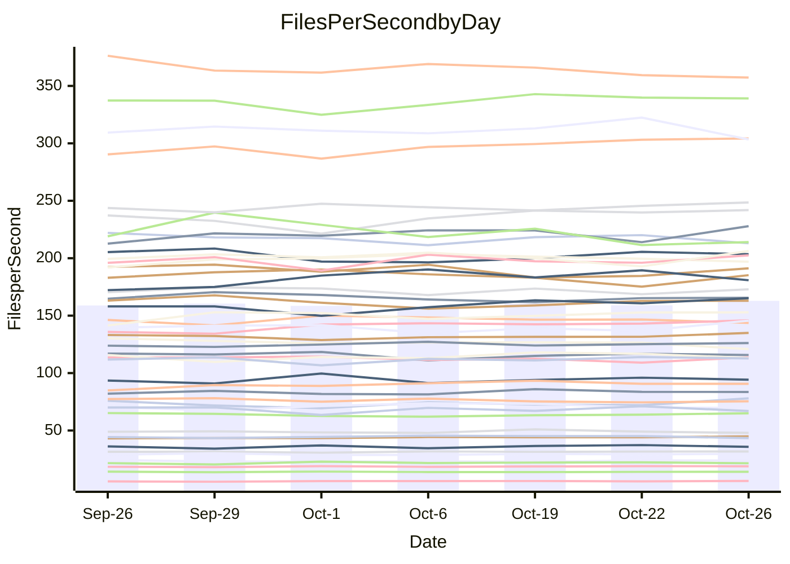

<!---
# This file is auto-generated. Do not edit.
# cspell:disable
--->
# Performance Report

## Daily Performance

## Time to Process Files

| Repository                                      | Elapsed | Min/Avg/Max           |   SD | SD Graph                |
| ----------------------------------------------- | ------: | :-------------------: | ---: | ----------------------- |
| AdaDoom3/AdaDoom3                    |    3.51 | 3.4 /   3.5 /   3.7   | 0.11 | `    ┣━━┻━━●━━┻━━┫    ` |
| alexiosc/megistos                    |    7.70 | 7.3 /   8.0 /   8.6   | 0.36 | `    ┣━━┻●━╋━━┻━━┫    ` |
| apollographql/apollo-server          |    2.73 | 2.6 /   2.8 /   3.0   | 0.12 | `    ┣━━┻●━╋━━┻━━┫    ` |
| aspnetboilerplate/aspnetboilerplate  |   10.71 | 10.2 /  10.5 /  10.9  | 0.22 | `    ┣━━┻━━╋━━●━━┫    ` |
| aws-amplify/docs                     |   12.63 | 12.5 /  13.0 /  13.9  | 0.47 | `    ┣━━●━━╋━━┻━━┫    ` |
| Azure/azure-rest-api-specs           |    9.72 | 9.6 /  10.1 /  10.7   | 0.26 | `    ┣━●┻━━╋━━┻━━┫    ` |
| bitjson/typescript-starter           |    1.07 | 1.0 /   1.1 /   1.1   | 0.02 | `     ┣━━┻●╋━┻━━┫     ` |
| caddyserver/caddy                    |    3.82 | 3.6 /   3.8 /   3.9   | 0.09 | `    ┣━━┻━━╋●━┻━━┫    ` |
| canada-ca/open-source-logiciel-libre |    1.15 | 1.1 /   1.2 /   1.3   | 0.05 | `     ┣━┻●━╋━━┻━┫     ` |
| chef/chef                            |    5.74 | 5.7 /   6.0 /   6.4   | 0.18 | `    ┣━●┻━━╋━━┻━━┫    ` |
| dart-lang/sdk                        |   65.92 | 63.7 /  66.9 /  73.2  | 2.53 | `  ┣━━━┻━━●╋━━━┻━━━┫  ` |
| django/django                        |   15.68 | 14.9 /  15.6 /  16.5  | 0.51 | `    ┣━━┻━━●━━┻━━┫    ` |
| eslint/eslint                        |   10.94 | 10.7 /  11.1 /  11.8  | 0.38 | `    ┣━━┻━●╋━━┻━━┫    ` |
| exonum/exonum                        |    3.71 | 3.5 /   3.7 /   3.8   | 0.09 | `    ┣━━┻━━╋━●┻━━┫    ` |
| flutter/samples                      |   16.71 | 16.2 /  17.0 /  18.6  | 0.60 | `    ┣━━┻●━╋━━┻━━┫    ` |
| gitbucket/gitbucket                  |    3.70 | 3.5 /   3.7 /   3.8   | 0.09 | `    ┣━━┻━━╋●━┻━━┫    ` |
| googleapis/google-cloud-cpp          |  139.94 | 142.5 / 149.7 / 165.8 | 5.99 | `  ┣●━━┻━━━╋━━━┻━━━┫  ` |
| graphql/express-graphql              |    1.19 | 1.1 /   1.2 /   1.3   | 0.04 | `     ┣━┻━━●━━┻━┫     ` |
| graphql/graphql-js                   |    2.82 | 2.8 /   2.9 /   3.1   | 0.07 | `     ┣●┻━━╋━━┻━┫     ` |
| graphql/graphql-relay-js             |    1.17 | 1.1 /   1.2 /   1.3   | 0.04 | `     ┣━┻●━╋━━┻━┫     ` |
| graphql/graphql-spec                 |    1.29 | 1.3 /   1.4 /   1.4   | 0.03 | `    ●┣━┻━━╋━━┻━┫     ` |
| iluwatar/java-design-patterns        |   13.23 | 12.8 /  13.3 /  14.9  | 0.50 | `    ┣━━┻━●╋━━┻━━┫    ` |
| ktaranov/sqlserver-kit               |    7.13 | 6.6 /   6.8 /   7.3   | 0.21 | `    ┣━━┻━━╋━━┻●━┫    ` |
| liriliri/licia                       |    4.30 | 4.1 /   4.3 /   4.4   | 0.09 | `    ┣━━┻━━╋●━┻━━┫    ` |
| MartinThoma/LaTeX-examples           |    6.80 | 6.9 /   7.1 /   7.6   | 0.22 | `    ┣━●┻━━╋━━┻━━┫    ` |
| mdx-js/mdx                           |    2.01 | 2.0 /   2.1 /   2.3   | 0.11 | `     ┣━┻●━╋━━┻━┫     ` |
| microsoft/TypeScript-Website         |    5.57 | 5.6 /   5.8 /   6.0   | 0.12 | `    ┣●━┻━━╋━━┻━━┫    ` |
| MicrosoftDocs/PowerShell-Docs        |   24.80 | 23.3 /  24.3 /  27.2  | 0.94 | `   ┣━━━┻━━╋━●┻━━━┫   ` |
| neovim/nvim-lspconfig                |    4.38 | 4.3 /   4.4 /   4.7   | 0.10 | `    ┣━━┻━●╋━━┻━━┫    ` |
| pagekit/pagekit                      |    3.56 | 3.5 /   3.7 /   4.0   | 0.13 | `    ┣━━●━━╋━━┻━━┫    ` |
| php/php-src                          |   27.90 | 26.3 /  27.5 /  30.2  | 1.17 | `   ┣━━━┻━━╋●━┻━━━┫   ` |
| plasticrake/tplink-smarthome-api     |    1.45 | 1.4 /   1.4 /   1.4   | 0.03 | `     ┣━┻━━╋━━┻━●     ` |
| prettier/prettier                    |    7.77 | 7.1 /   7.5 /   7.8   | 0.17 | `    ┣━━┻━━╋━━┻━●┫    ` |
| pycontribs/jira                      |    1.60 | 1.5 /   1.6 /   1.7   | 0.05 | `     ┣━┻━●╋━━┻━┫     ` |
| RustPython/RustPython                |    5.80 | 5.2 /   5.4 /   5.7   | 0.16 | `    ┣━━┻━━╋━━┻━━┫●   ` |
| shoelace-style/shoelace              |    3.11 | 2.9 /   3.0 /   3.1   | 0.05 | `     ┣━┻━━╋━━┻━┫ ●   ` |
| slint-ui/slint                       |   13.71 | 13.0 /  13.6 /  14.4  | 0.45 | `    ┣━━┻━━╋●━┻━━┫    ` |
| SoftwareBrothers/admin-bro           |    2.68 | 2.6 /   2.7 /   2.9   | 0.08 | `     ┣━┻━━●━━┻━┫     ` |
| sveltejs/svelte                      |   22.49 | 20.8 /  21.8 /  22.6  | 0.45 | `    ┣━━┻━━╋━━┻━●┫    ` |
| TheAlgorithms/Python                 |    5.86 | 5.7 /   5.9 /   6.6   | 0.23 | `    ┣━━┻━●╋━━┻━━┫    ` |
| twbs/bootstrap                       |    1.78 | 1.8 /   1.9 /   2.0   | 0.05 | `     ┣●┻━━╋━━┻━┫     ` |
| typescript-cheatsheets/react         |    1.57 | 1.4 /   1.5 /   1.6   | 0.06 | `     ┣━┻━━╋━━┻━●     ` |
| typescript-eslint/typescript-eslint  |    4.20 | 4.2 /   4.3 /   4.6   | 0.10 | `    ┣━●┻━━╋━━┻━━┫    ` |
| vitest-dev/vitest                    |   10.28 | 9.3 /  10.1 /  11.1   | 0.58 | `    ┣━━┻━━╋●━┻━━┫    ` |
| w3c/aria-practices                   |    3.59 | 3.5 /   3.6 /   3.7   | 0.10 | `    ┣━━┻━━●━━┻━━┫    ` |
| w3c/specberus                        |    2.10 | 2.0 /   2.1 /   2.3   | 0.08 | `     ┣━┻━━●━━┻━┫     ` |
| webdeveric/webpack-assets-manifest   |    1.26 | 1.2 /   1.2 /   1.3   | 0.02 | `     ┣━━┻━╋━┻●━┫     ` |
| webpack/webpack                      |    5.61 | 5.4 /   5.7 /   6.1   | 0.18 | `    ┣━━┻━●╋━━┻━━┫    ` |
| wireapp/wire-desktop                 |    1.40 | 1.3 /   1.4 /   1.5   | 0.05 | `     ┣━┻━●╋━━┻━┫     ` |
| wireapp/wire-webapp                  |   10.79 | 10.7 /  11.2 /  12.5  | 0.46 | `    ┣━━●━━╋━━┻━━┫    ` |

Note:
- Elapsed time is in seconds.

## Files per Second over Time

| Repository                                      | Files |    Sec |    Fps |    Rel | Trend Fps        |    N |
| ----------------------------------------------- | ----: | -----: | -----: | -----: | ---------------- | ---: |
| AdaDoom3/AdaDoom3                    |   103 |   3.51 |  29.34 |  0.30% | `▄██▆▆▇▅██▆█▆▇▇` |   13 |
| alexiosc/megistos                    |   583 |   7.70 |  75.71 |  3.22% | `▆▆▅▄▃▆▆▅▇▃▄▅█▆` |   13 |
| apollographql/apollo-server          |   252 |   2.73 |  92.24 |  2.52% | `▅▃▆▇▄▇▆▇█▆▇▅▆▇` |   13 |
| aspnetboilerplate/aspnetboilerplate  |  2286 |  10.71 | 213.54 | -1.82% | `██▇█▆▅▆▆███▇▆▆` |   13 |
| aws-amplify/docs                     |  2871 |  12.63 | 227.32 |  3.19% | `▆▄▇▅█▇███▆▇▄██` |   13 |
| Azure/azure-rest-api-specs           |  2448 |   9.72 | 251.95 |  3.27% | `▆▇▆▇▇▆▇▄▇▇▅█▇█` |   13 |
| bitjson/typescript-starter           |    20 |   1.07 |  18.75 |  0.46% | `▆▆▅▇█▆▆▅▇█▇█▇▇` |   13 |
| caddyserver/caddy                    |   288 |   3.82 |  75.41 | -0.87% | `█▆█▇▅█▇▆▅▇▆▅▆▆` |   13 |
| canada-ca/open-source-logiciel-libre |     7 |   1.15 |   6.08 |  3.70% | `▅▆▄█▆█▇▇█▇▄▇██` |   13 |
| chef/chef                            |  1191 |   5.74 | 207.51 |  3.10% | `█▇█▅▆▇▄▇▆▇█▇▆█` |   13 |
| dart-lang/sdk                        | 10696 |  65.92 | 162.27 |  2.00% | `▆▆▆▆▃▇▅▇▇██▆█▇` |   13 |
| django/django                        |  2877 |  15.68 | 183.47 | -0.31% | `▅▇▇▇█▇▇▅▅█▄▅▇▆` |   13 |
| eslint/eslint                        |  2098 |  10.94 | 191.74 |  1.59% | `█▇██▅██▅▅▇▇▄▇▇` |   13 |
| exonum/exonum                        |   421 |   3.71 | 113.35 | -1.49% | `█▆▅▅▇▅▆██▇▆█▆▆` |   13 |
| flutter/samples                      |  2400 |  16.71 | 143.63 |  1.55% | `▄▇▅▇▇▇▇▆▇▇█▆█▇` |   13 |
| gitbucket/gitbucket                  |   413 |   3.70 | 111.59 | -0.92% | `▇▆▇█▆▆▅▅▅█▅▅▇▆` |   13 |
| googleapis/google-cloud-cpp          | 20788 | 139.94 | 148.55 |  6.92% | `▆▆▇▆█▇▃▆▆▆▇▄▇█` |   13 |
| graphql/express-graphql              |    26 |   1.19 |  21.84 | -0.38% | `▅▇▄█▇▅▇▆▆▇█▅▅▆` |   13 |
| graphql/graphql-js                   |   364 |   2.82 | 129.08 |  3.56% | `▅█▆▆▇█▇█▇▅▆█▆█` |   13 |
| graphql/graphql-relay-js             |    28 |   1.17 |  23.92 |  2.32% | `█▇▅▇▄▆▅▅▆▅█▅▇▇` |   13 |
| graphql/graphql-spec                 |    19 |   1.29 |  14.70 |  5.50% | `▇▇▅▇▇▇▅▅▆▆▅▇▄█` |   13 |
| iluwatar/java-design-patterns        |  1992 |  13.23 | 150.52 |  0.61% | `▇▃█▇█▆▆▇▇▇█▇█▇` |   13 |
| ktaranov/sqlserver-kit               |   489 |   7.13 |  68.54 | -4.11% | `▅▇▄▇▆█▇██▇▅▇▆▅` |   13 |
| liriliri/licia                       |  1437 |   4.30 | 334.19 | -0.83% | `▇▆▇▅▅▅▇█▇█▇▇█▆` |   13 |
| MartinThoma/LaTeX-examples           |  1409 |   6.80 | 207.32 |  4.49% | `▆▅▆▆█▇█▇█▆▇▆▄█` |   13 |
| mdx-js/mdx                           |   141 |   2.01 |  70.05 |  3.04% | `█▇▇▃▆▇▇▅▇▆█▇▅▇` |   13 |
| microsoft/TypeScript-Website         |   761 |   5.57 | 136.58 |  3.86% | `▆█▇▅▆▅█▆▆▇▅▇▇█` |   13 |
| MicrosoftDocs/PowerShell-Docs        |  2708 |  24.80 | 109.20 | -2.29% | `▇▇▇█▃▇▇▇▆▆▇██▆` |   13 |
| neovim/nvim-lspconfig                |   759 |   4.38 | 173.16 |  0.98% | `▆▇█▇█▇▅██▆▅▇▇▇` |   13 |
| pagekit/pagekit                      |   741 |   3.56 | 207.89 |  3.81% | `▆▆▇▆▆█▆▇█▄▅▅▇█` |   13 |
| php/php-src                          |  2289 |  27.90 |  82.04 | -1.75% | `▇▅▇▅▇▄█▇███▅▇▆` |   13 |
| plasticrake/tplink-smarthome-api     |    62 |   1.45 |  42.74 | -4.48% | `█▅▆▇▆███▆█▇█▆▅` |   13 |
| prettier/prettier                    |  2363 |   7.77 | 304.14 | -2.60% | `▄█▇▇▆▆▆▆▇▇██▅▅` |   13 |
| pycontribs/jira                      |    79 |   1.60 |  49.44 |  0.90% | `▅▆▆▅▅▆▄█▆▇▆▅▄▆` |   13 |
| RustPython/RustPython                |   688 |   5.80 | 118.62 | -6.53% | `█▆▇▅▇▆▆▅▇▆▄█▅▄` |   13 |
| shoelace-style/shoelace              |   439 |   3.11 | 140.99 | -4.04% | `▆▇▅█▇▇▇▇▇▅▇▇▇▅` |   13 |
| slint-ui/slint                       |  2539 |  13.71 | 185.15 |  1.35% | `▅▄▅▇▇█▇▅▇▇█▇▅▇` |   13 |
| SoftwareBrothers/admin-bro           |   441 |   2.68 | 164.68 | -0.24% | `▆▇█▇██▅▇▇▄▇▆▇▇` |   13 |
| sveltejs/svelte                      |  7982 |  22.49 | 354.96 | -2.92% | `█▇▆▅▆▆▇▆▆▇▆▅▅▅` |   13 |
| TheAlgorithms/Python                 |  1399 |   5.86 | 238.84 |  1.20% | `▇▇▆▆▃▇▆█▇██▇█▇` |   13 |
| twbs/bootstrap                       |   118 |   1.78 |  66.28 |  4.39% | `▇█▇▅▇▆▅▄▇█▇▆▇█` |   13 |
| typescript-cheatsheets/react         |    53 |   1.57 |  33.75 | -6.95% | `▆▇▅▇▇▃▇▇▇▇█▇█▄` |   13 |
| typescript-eslint/typescript-eslint  |  1285 |   4.20 | 305.89 |  3.22% | `▅▇▇▅▅▇▆▇▇▇█▇██` |   13 |
| vitest-dev/vitest                    |  2261 |  10.28 | 219.90 | -0.78% | `▃███▆▅▆▆▇▆▅▄▄▆` |   13 |
| w3c/aria-practices                   |   414 |   3.59 | 115.25 | -0.39% | `█▆▇██▅▅▆▅██▆▇▆` |   13 |
| w3c/specberus                        |   197 |   2.10 |  93.73 | -0.82% | `▅▆▅▇█▃▆▆▅▆▇▆▆▆` |   13 |
| webdeveric/webpack-assets-manifest   |    55 |   1.26 |  43.61 | -0.87% | `▅▅▅▅▅▆▇▅▇▆▇▅█▆` |   13 |
| webpack/webpack                      |  1127 |   5.61 | 200.80 |  1.74% | `▆▇▇▄▆▇█▆█▆▇▆█▇` |   13 |
| wireapp/wire-desktop                 |    46 |   1.40 |  32.86 |  4.75% | `▅▇▆▄▅▅█▇▆▅▇▆▅█` |   13 |
| wireapp/wire-webapp                  |  1781 |  10.79 | 165.05 |  2.57% | `█▆█▇▆▄▇▆▅▇▆▇▆▇` |   13 |

## Data Throughput

| Repository                                      | Files |    Sec |     Kps |    Rel | Trend Kps        |    N |
| ----------------------------------------------- | ----: | -----: | ------: | -----: | ---------------- | ---: |
| AdaDoom3/AdaDoom3                    |   103 |   3.51 |  623.49 |  0.30% | `▄██▆▆▇▅██▆█▆▇▇` |   13 |
| alexiosc/megistos                    |   583 |   7.70 |  594.90 |  3.22% | `▆▆▅▄▃▆▆▅▇▃▄▅█▆` |   13 |
| apollographql/apollo-server          |   252 |   2.73 |  741.98 |  2.52% | `▅▃▆▇▄▇▆▇█▆▇▅▆▇` |   13 |
| aspnetboilerplate/aspnetboilerplate  |  2286 |  10.71 |  519.55 | -1.82% | `██▇█▆▅▆▆███▇▆▆` |   13 |
| aws-amplify/docs                     |  2871 |  12.63 |  793.51 |  3.18% | `▆▄▇▅█▇███▆▇▄██` |   13 |
| Azure/azure-rest-api-specs           |  2448 |   9.72 |  675.07 |  4.11% | `▅▆▅▇▆▅▇▄▇▇▅█▇█` |   13 |
| bitjson/typescript-starter           |    20 |   1.07 |   75.02 |  0.46% | `▆▆▅▇█▆▆▅▇█▇█▇▇` |   13 |
| caddyserver/caddy                    |   288 |   3.82 |  654.06 |  0.21% | `█▆█▇▅█▇▆▅▇▆▆▇▇` |   13 |
| canada-ca/open-source-logiciel-libre |     7 |   1.15 |   50.41 |  3.70% | `▅▆▄█▆█▇▇█▇▄▇██` |   13 |
| chef/chef                            |  1191 |   5.74 |  960.71 |  3.37% | `█▇█▅▆▇▄▇▆▆█▇▆█` |   13 |
| dart-lang/sdk                        | 10696 |  65.92 | 1105.05 |  1.57% | `▆▆▆▆▃▇▅▇▇██▆█▇` |   13 |
| django/django                        |  2877 |  15.68 | 1153.07 | -0.09% | `▅▇▇▇█▇▇▅▅█▄▅▇▆` |   13 |
| eslint/eslint                        |  2098 |  10.94 | 1378.21 |  1.43% | `█▇██▅██▅▅▇▇▄▇▇` |   13 |
| exonum/exonum                        |   421 |   3.71 | 1084.19 | -1.49% | `█▆▅▅▇▅▆██▇▆█▆▆` |   13 |
| flutter/samples                      |  2400 |  16.71 | 1281.73 |  1.55% | `▄▇▅▇▇▇▇▆▇▇█▆█▇` |   13 |
| gitbucket/gitbucket                  |   413 |   3.70 |  507.14 | -0.96% | `▇▆▇█▆▆▅▅▅█▅▅▇▆` |   13 |
| googleapis/google-cloud-cpp          | 20788 | 139.94 | 1207.09 |  7.00% | `▆▆▇▆▇▇▃▆▆▆▇▄▇█` |   13 |
| graphql/express-graphql              |    26 |   1.19 |   99.94 | -0.38% | `▅▇▄█▇▅▇▆▆▇█▅▅▆` |   13 |
| graphql/graphql-js                   |   364 |   2.82 |  746.11 |  4.02% | `▅▇▆▆▇█▇▇▇▄▆█▆█` |   13 |
| graphql/graphql-relay-js             |    28 |   1.17 |   93.97 |  2.32% | `█▇▅▇▄▆▅▅▆▅█▅▇▇` |   13 |
| graphql/graphql-spec                 |    19 |   1.29 |  490.65 |  5.50% | `▇▇▅▇▇▇▅▅▆▆▅▇▄█` |   13 |
| iluwatar/java-design-patterns        |  1992 |  13.23 |  465.23 |  0.61% | `▇▃█▇█▆▆▇▇▇█▇█▇` |   13 |
| ktaranov/sqlserver-kit               |   489 |   7.13 | 1037.80 | -4.11% | `▅▇▄▇▆█▇██▇▅▇▆▅` |   13 |
| liriliri/licia                       |  1437 |   4.30 |  398.14 | -0.83% | `▇▆▇▅▅▅▇█▇█▇▇█▆` |   13 |
| MartinThoma/LaTeX-examples           |  1409 |   6.80 |  428.17 |  4.49% | `▆▅▆▆█▇█▇█▆▇▆▄█` |   13 |
| mdx-js/mdx                           |   141 |   2.01 |  325.91 |  3.04% | `█▇▇▃▆▇▇▅▇▆█▇▅▇` |   13 |
| microsoft/TypeScript-Website         |   761 |   5.57 |  944.57 |  3.86% | `▆█▇▅▆▅█▆▆▇▅▇▇█` |   13 |
| MicrosoftDocs/PowerShell-Docs        |  2708 |  24.80 | 1123.86 | -2.26% | `▇▇▇▇▃▇▇▇▆▆▇██▆` |   13 |
| neovim/nvim-lspconfig                |   759 |   4.38 |  289.06 |  1.31% | `▆▇▇▇█▇▅██▆▅▇▇▇` |   13 |
| pagekit/pagekit                      |   741 |   3.56 |  433.45 |  3.81% | `▆▆▇▆▆█▆▇█▄▅▅▇█` |   13 |
| php/php-src                          |  2289 |  27.90 | 1432.92 | -1.48% | `▇▅▇▅▇▄█▇███▅▇▆` |   13 |
| plasticrake/tplink-smarthome-api     |    62 |   1.45 |  230.91 | -4.48% | `█▅▆▇▆███▆█▇█▆▅` |   13 |
| prettier/prettier                    |  2363 |   7.77 |  425.51 | -2.88% | `▄█▇▆▆▆▆▆▇▇█▇▅▅` |   13 |
| pycontribs/jira                      |    79 |   1.60 |  350.43 |  0.90% | `▅▆▆▅▅▆▄█▆▇▆▅▄▆` |   13 |
| RustPython/RustPython                |   688 |   5.80 |  939.67 | -6.33% | `█▆▆▅▇▆▆▅▇▆▄█▅▄` |   13 |
| shoelace-style/shoelace              |   439 |   3.11 |  681.19 | -4.04% | `▆▇▅█▇▇▇▇▇▅▇▇▇▅` |   13 |
| slint-ui/slint                       |  2539 |  13.71 | 1139.66 |  0.55% | `▇▆▄▇▇█▇▅▇▇█▇▅▇` |   13 |
| SoftwareBrothers/admin-bro           |   441 |   2.68 |  362.96 | -0.24% | `▆▇█▇██▅▇▇▄▇▆▇▇` |   13 |
| sveltejs/svelte                      |  7982 |  22.49 |  236.89 | -3.03% | `█▇▆▅▆▆▇▆▆▇▆▅▅▅` |   13 |
| TheAlgorithms/Python                 |  1399 |   5.86 |  607.42 |  1.24% | `▇▇▆▆▃▇▆█▇██▇█▇` |   13 |
| twbs/bootstrap                       |   118 |   1.78 |  543.76 |  4.39% | `▇█▇▅▇▆▅▄▇█▇▆▇█` |   13 |
| typescript-cheatsheets/react         |    53 |   1.57 |  249.62 | -6.95% | `▆▇▅▇▇▃▇▇▇▇█▇█▄` |   13 |
| typescript-eslint/typescript-eslint  |  1285 |   4.20 | 1572.75 |  3.40% | `▄▇▇▅▅▇▆▇▇▇█▇██` |   13 |
| vitest-dev/vitest                    |  2261 |  10.28 |  495.04 | -0.88% | `▃███▆▅▆▅▇▆▅▄▄▅` |   13 |
| w3c/aria-practices                   |   414 |   3.59 | 1074.54 | -0.39% | `█▆▇██▅▅▆▅██▆▇▆` |   13 |
| w3c/specberus                        |   197 |   2.10 |  296.40 | -0.49% | `▅▆▅▇█▃▆▆▆▆▇▆▆▆` |   13 |
| webdeveric/webpack-assets-manifest   |    55 |   1.26 |  100.70 | -1.70% | `▆▆▆▆▆▇▇▅▇▆▇▅█▅` |   13 |
| webpack/webpack                      |  1127 |   5.61 |  913.47 |  1.59% | `▅▇▇▄▆▇█▆█▆▆▆█▇` |   13 |
| wireapp/wire-desktop                 |    46 |   1.40 |  183.57 | 13.67% | `▃▃▃▂▃▂█▇▇▆▇▇▆█` |   13 |
| wireapp/wire-webapp                  |  1781 |  10.79 |  609.24 |  3.92% | `█▅█▇▆▃█▇▆▇▇█▇█` |   13 |

