<!---
# This file is auto-generated. Do not edit.
# cspell:disable
--->
# Performance Report

## Daily Performance

```mermaid
xychart-beta
    title Files Per Second by Day
    y-axis Files per Second
    x-axis Date [Nov-7, Nov-8, Nov-9, Nov-10, Nov-12, Nov-17, Nov-19, Nov-22, Nov-23, Nov-25, Nov-26, Nov-27, Nov-28, Dec-2, Dec-5, Dec-6, Dec-7]
    bar [181.19, 180.85, 185.26, 182.11, 183.02, 179.67, 181.22, 181.55, 184.70, 192.57, 183.27, 184.75, 182.79, 184.99, 180.86, 182.42, 182.83]
    line [39.74, 38.81, 37.90, 39.54, 38.73, 39.95, 40.00, 37.29, 39.41, 0.00, 39.61, 38.93, 39.59, 39.21, 38.95, 39.16, 39.98]
    line [9.09, 9.19, 9.27, 8.92, 9.14, 9.18, 8.84, 9.32, 9.24, 0.00, 9.27, 9.05, 9.13, 9.38, 8.86, 9.19, 9.24]
    line [63.67, 64.87, 66.76, 67.56, 66.97, 68.98, 66.79, 63.49, 65.54, 67.63, 65.16, 64.17, 67.20, 67.10, 64.34, 65.01, 64.46]
    line [222.44, 224.03, 222.14, 214.23, 209.04, 218.60, 212.59, 214.66, 226.79, 0.00, 213.37, 216.21, 222.03, 191.91, 211.40, 225.62, 216.82]
    line [159.42, 156.12, 164.10, 153.25, 158.83, 162.50, 155.26, 161.99, 161.00, 160.02, 155.33, 155.60, 159.85, 157.03, 158.70, 160.32, 157.97]
    line [37.08, 36.63, 38.88, 36.70, 37.54, 37.45, 37.05, 37.59, 38.10, 0.00, 36.55, 37.13, 38.36, 37.28, 36.55, 36.94, 38.11]
    line [115.81, 118.63, 116.72, 116.49, 116.48, 117.45, 112.12, 117.70, 117.75, 118.80, 116.72, 112.25, 111.37, 118.51, 115.50, 115.87, 105.20]
    line [18.73, 18.36, 18.35, 19.12, 18.64, 18.32, 18.95, 18.34, 18.44, 18.84, 18.37, 18.41, 18.93, 18.48, 17.91, 18.52, 17.91]
    line [189.19, 183.94, 184.74, 191.91, 183.56, 186.00, 187.01, 192.19, 191.67, 0.00, 182.52, 184.50, 184.37, 180.13, 182.27, 185.97, 183.39]
    line [93.87, 94.75, 84.15, 93.85, 94.70, 94.62, 92.44, 90.51, 94.24, 0.00, 91.28, 92.74, 93.28, 95.50, 92.21, 94.67, 92.84]
    line [49.77, 48.97, 50.50, 48.94, 50.11, 50.42, 50.32, 51.47, 51.26, 50.21, 50.12, 50.94, 45.60, 50.75, 50.03, 49.80, 49.98]
    line [227.82, 230.59, 232.99, 231.54, 235.20, 225.87, 229.42, 231.39, 232.22, 233.95, 231.55, 229.52, 231.73, 230.37, 226.75, 238.77, 230.39]
    line [152.49, 155.90, 160.36, 152.28, 150.06, 152.05, 158.28, 146.52, 158.85, 0.00, 155.81, 155.95, 156.73, 153.23, 152.74, 150.88, 153.33]
    line [92.01, 91.93, 94.57, 93.46, 93.94, 91.73, 87.45, 91.05, 94.79, 93.97, 94.67, 91.62, 92.04, 86.62, 91.97, 93.82, 91.60]
    line [231.20, 232.42, 233.76, 216.82, 232.75, 231.73, 227.11, 220.77, 232.83, 0.00, 226.61, 230.78, 225.94, 228.40, 228.42, 235.98, 231.28]
    line [246.73, 252.50, 246.24, 251.54, 252.31, 250.79, 249.89, 259.20, 257.89, 248.21, 247.03, 244.22, 263.12, 252.89, 247.30, 238.91, 249.28]
    line [145.09, 140.71, 145.23, 139.03, 143.66, 147.67, 143.64, 145.07, 148.78, 145.20, 139.52, 142.17, 141.34, 138.40, 144.20, 144.71, 145.14]
    line [84.55, 84.56, 84.50, 82.79, 84.08, 81.67, 82.81, 81.19, 83.62, 0.00, 81.43, 78.64, 84.26, 78.88, 82.13, 83.39, 79.45]
    line [129.06, 126.84, 130.40, 128.50, 126.86, 127.39, 128.53, 129.02, 122.85, 124.15, 127.61, 128.38, 128.27, 127.96, 123.07, 128.36, 127.97]
    line [103.31, 109.90, 104.67, 104.85, 104.85, 102.15, 102.24, 108.41, 107.84, 102.72, 107.24, 107.62, 105.35, 104.37, 103.06, 105.64, 106.80]
    line [31.24, 30.45, 31.85, 30.57, 31.13, 30.89, 30.94, 31.34, 30.76, 0.00, 30.81, 30.58, 31.64, 29.90, 30.63, 31.36, 30.89]
    line [142.79, 144.44, 140.29, 132.61, 142.45, 144.07, 134.61, 146.19, 141.96, 0.00, 142.52, 141.79, 143.85, 132.83, 138.36, 145.16, 141.72]
    line [70.59, 70.35, 69.51, 68.69, 67.71, 70.32, 71.50, 69.84, 71.46, 0.00, 68.63, 69.18, 70.98, 71.07, 70.27, 72.65, 71.06]
    line [157.16, 151.98, 154.79, 156.47, 154.38, 143.43, 149.38, 154.11, 161.15, 140.96, 153.09, 157.58, 151.62, 150.61, 153.46, 148.08, 152.95]
    line [83.68, 89.12, 87.30, 84.78, 87.41, 87.06, 86.68, 84.68, 84.66, 0.00, 86.16, 86.09, 86.12, 86.10, 84.45, 86.85, 83.80]
    line [367.65, 347.60, 375.37, 367.87, 367.07, 371.79, 359.89, 353.22, 368.32, 374.93, 365.77, 365.67, 369.95, 352.91, 358.41, 370.56, 364.48]
    line [412.86, 422.15, 414.20, 436.61, 418.89, 419.72, 418.60, 416.16, 419.91, 420.14, 425.45, 413.25, 414.49, 414.13, 417.32, 417.87, 401.19]
    line [230.05, 223.17, 216.85, 227.77, 231.99, 238.91, 233.06, 237.44, 231.81, 0.00, 229.54, 227.35, 233.78, 239.72, 236.67, 242.41, 240.69]
    line [36.38, 37.15, 37.84, 35.87, 36.08, 37.20, 36.20, 36.44, 36.12, 0.00, 36.09, 35.82, 35.94, 35.10, 36.40, 35.75, 36.91]
    line [170.03, 165.93, 170.87, 155.75, 175.08, 172.86, 174.82, 173.87, 168.75, 0.00, 168.42, 172.41, 165.34, 178.00, 170.24, 174.62, 172.41]
    line [403.73, 402.78, 401.18, 398.88, 404.51, 401.52, 385.51, 402.83, 398.10, 400.47, 401.59, 405.72, 393.85, 407.78, 396.11, 412.42, 405.98]
    line [361.63, 363.56, 361.00, 364.43, 360.15, 365.05, 367.22, 354.80, 363.64, 373.17, 364.09, 364.55, 368.33, 360.08, 369.35, 368.90, 344.39]
    line [268.67, 265.98, 276.77, 250.02, 272.22, 269.63, 262.78, 266.27, 264.63, 265.39, 262.12, 264.70, 259.96, 267.12, 267.54, 261.60, 259.75]
    line [167.77, 170.78, 172.83, 169.54, 170.69, 168.51, 170.43, 152.49, 164.76, 169.85, 169.02, 158.91, 164.95, 167.24, 171.12, 163.98, 170.66]
    line [260.40, 262.23, 265.71, 267.34, 258.77, 260.78, 261.46, 264.14, 258.29, 259.88, 261.65, 261.27, 259.85, 259.59, 261.91, 256.38, 255.24]
    line [139.44, 136.40, 136.32, 131.65, 134.94, 137.19, 136.33, 132.82, 127.42, 141.81, 137.38, 133.61, 136.04, 138.47, 135.71, 138.36, 137.92]
    line [213.46, 209.61, 218.80, 218.08, 206.42, 211.56, 214.70, 201.32, 208.63, 216.56, 211.21, 211.52, 202.80, 207.87, 211.25, 214.29, 205.55]
    line [206.27, 202.50, 195.41, 214.93, 208.44, 206.40, 204.90, 203.63, 207.69, 210.97, 200.63, 206.29, 201.28, 203.16, 197.69, 205.56, 198.75]
    line [252.56, 252.48, 253.34, 246.50, 250.04, 248.32, 248.40, 243.10, 246.46, 253.84, 244.86, 252.77, 242.22, 250.75, 244.77, 249.57, 253.00]
    line [28.68, 28.99, 28.78, 28.56, 28.81, 27.61, 29.00, 27.12, 28.69, 0.00, 29.62, 29.42, 28.97, 30.07, 28.83, 29.04, 29.09]
    line [124.25, 122.72, 125.93, 124.62, 120.74, 122.33, 123.30, 126.42, 130.12, 126.69, 118.47, 125.05, 124.39, 115.88, 118.39, 119.81, 122.77]
    line [102.75, 108.04, 105.75, 108.53, 107.61, 103.87, 104.59, 104.39, 110.58, 106.99, 105.01, 108.35, 107.81, 104.02, 106.94, 104.99, 103.46]
    line [52.20, 48.34, 51.40, 48.84, 50.71, 51.87, 51.27, 48.95, 50.74, 51.36, 50.08, 50.94, 50.51, 51.36, 50.85, 53.51, 50.97]
    line [173.72, 175.33, 180.56, 166.86, 160.67, 171.35, 173.67, 163.99, 174.13, 171.44, 171.10, 169.17, 169.92, 156.42, 166.33, 173.70, 167.47]
    line [127.28, 124.63, 124.24, 125.03, 125.24, 123.48, 121.57, 127.94, 124.68, 128.18, 123.81, 124.58, 126.05, 121.44, 124.27, 122.27, 126.51]
    line [172.75, 170.15, 173.41, 171.14, 167.37, 166.50, 171.04, 166.81, 168.79, 172.43, 172.30, 165.40, 170.85, 167.09, 169.78, 169.21, 170.29]
    line [238.83, 237.46, 245.31, 238.15, 238.92, 243.36, 234.75, 243.01, 243.28, 229.25, 233.06, 241.24, 236.91, 240.36, 239.27, 231.52, 238.08]
    line [174.73, 178.68, 179.16, 176.80, 173.86, 176.80, 174.52, 178.44, 183.84, 176.75, 178.41, 176.49, 178.04, 178.10, 172.07, 178.26, 177.85]
    line [159.17, 156.54, 166.82, 162.10, 163.95, 153.46, 157.33, 159.29, 160.15, 167.27, 163.00, 166.53, 160.28, 164.60, 161.29, 159.50, 164.08]
    line [0.00, 0.00, 0.00, 0.00, 0.00, 216.65, 210.39, 209.57, 206.62, 225.23, 216.74, 223.01, 218.30, 218.24, 211.89, 221.99, 212.41]
```

## Time to Process Files

| Repository                                      | Elapsed | Min/Avg/Max           |   SD | SD Graph                |
| ----------------------------------------------- | ------: | :-------------------: | ---: | ----------------------- |
| AdaDoom3/AdaDoom3                    |    2.79 | 2.6 /   2.8 /   3.1   | 0.08 | `     ┣━┻●━╋━━┻━┫     ` |
| alexiosc/megistos                    |    6.96 | 6.4 /   6.8 /   7.5   | 0.22 | `    ┣━━┻━━╋━●┻━━┫    ` |
| apollographql/apollo-server          |    2.39 | 2.1 /   2.2 /   2.5   | 0.07 | `     ┣━┻━━╋━━┻━┫  ●  ` |
| aspnetboilerplate/aspnetboilerplate  |    9.01 | 8.5 /   9.0 /   9.8   | 0.27 | `    ┣━━┻━━●━━┻━━┫    ` |
| aws-amplify/docs                     |   11.30 | 11.0 /  11.5 /  12.3  | 0.28 | `    ┣━━┻●━╋━━┻━━┫    ` |
| Azure/azure-rest-api-specs           |   14.39 | 13.7 /  14.4 /  16.5  | 0.55 | `    ┣━━┻━━●━━┻━━┫    ` |
| bitjson/typescript-starter           |    0.65 | 0.6 /   0.6 /   0.7   | 0.02 | `     ┣━━┻━●━┻━━┫     ` |
| caddyserver/caddy                    |    3.05 | 2.9 /   3.0 /   3.3   | 0.10 | `     ┣━┻━━●━━┻━┫     ` |
| canada-ca/open-source-logiciel-libre |    0.76 | 0.7 /   0.8 /   0.9   | 0.02 | `     ┣━━┻●╋━┻━━┫     ` |
| chef/chef                            |    5.23 | 5.0 /   5.2 /   5.6   | 0.16 | `    ┣━━┻━━●━━┻━━┫    ` |
| dart-lang/sdk                        |   56.03 | 53.8 /  56.2 /  59.4  | 1.41 | `   ┣━━┻━━━●━━━┻━━┫   ` |
| django/django                        |   14.15 | 13.0 /  13.7 /  15.5  | 0.52 | `    ┣━━┻━━╋━●┻━━┫    ` |
| eslint/eslint                        |    9.88 | 8.9 /   9.6 /  10.4   | 0.35 | `    ┣━━┻━━╋━●┻━━┫    ` |
| exonum/exonum                        |    2.97 | 2.9 /   3.0 /   3.4   | 0.12 | `    ┣━━┻━━●━━┻━━┫    ` |
| flutter/samples                      |   15.76 | 15.0 /  16.3 /  19.1  | 0.70 | `   ┣━━━●━━╋━━┻━━━┫   ` |
| gitbucket/gitbucket                  |    2.98 | 2.9 /   3.0 /   3.2   | 0.08 | `     ┣━┻━●╋━━┻━┫     ` |
| googleapis/google-cloud-cpp          |  120.33 | 117.0 / 123.0 / 160.5 | 7.26 | `  ┣━━━┻━●━╋━━━┻━━━┫  ` |
| graphql/express-graphql              |    0.68 | 0.7 /   0.7 /   0.7   | 0.02 | `     ┣━━●━╋━┻━━┫     ` |
| graphql/graphql-js                   |    2.15 | 2.0 /   2.1 /   2.3   | 0.08 | `     ┣━┻━━●━━┻━┫     ` |
| graphql/graphql-relay-js             |    0.70 | 0.7 /   0.7 /   0.8   | 0.02 | `     ┣━━●━╋━┻━━┫     ` |
| graphql/graphql-spec                 |    0.84 | 0.8 /   0.8 /   0.9   | 0.03 | `     ┣━━┻━╋━●━━┫     ` |
| iluwatar/java-design-patterns        |   10.72 | 10.3 /  10.8 /  11.8  | 0.37 | `    ┣━━┻━●╋━━┻━━┫    ` |
| ktaranov/sqlserver-kit               |    6.15 | 5.7 /   5.9 /   6.5   | 0.18 | `    ┣━━┻━━╋━━●━━┫    ` |
| liriliri/licia                       |    3.57 | 3.2 /   3.4 /   3.6   | 0.08 | `     ┣━┻━━╋━━┻━●     ` |
| MartinThoma/LaTeX-examples           |    6.09 | 6.0 /   6.2 /   6.5   | 0.14 | `    ┣━━┻━●╋━━┻━━┫    ` |
| mdx-js/mdx                           |    1.53 | 1.5 /   1.5 /   1.7   | 0.05 | `     ┣━┻━━●━━┻━┫     ` |
| microsoft/TypeScript-Website         |    4.95 | 4.7 /   5.0 /   6.4   | 0.28 | `    ┣━━┻━━●━━┻━━┫    ` |
| MicrosoftDocs/PowerShell-Docs        |   18.16 | 17.1 /  19.0 /  22.2  | 1.43 | `   ┣━━━┻●━╋━━┻━━━┫   ` |
| neovim/nvim-lspconfig                |    2.88 | 2.8 /   2.9 /   3.2   | 0.07 | `     ┣━┻━●╋━━┻━┫     ` |
| pagekit/pagekit                      |    3.08 | 2.9 /   3.2 /   3.6   | 0.14 | `    ┣━━┻●━╋━━┻━━┫    ` |
| php/php-src                          |   21.37 | 19.9 /  20.9 /  23.1  | 0.74 | `   ┣━━━┻━━╋━●┻━━━┫   ` |
| plasticrake/tplink-smarthome-api     |    0.87 | 0.8 /   0.9 /   0.9   | 0.02 | `     ┣━━●━╋━┻━━┫     ` |
| prettier/prettier                    |    6.00 | 5.9 /   6.1 /   6.7   | 0.17 | `    ┣━━┻━●╋━━┻━━┫    ` |
| pycontribs/jira                      |    1.24 | 1.1 /   1.2 /   1.4   | 0.05 | `     ┣━┻━━╋●━┻━┫     ` |
| RustPython/RustPython                |    4.05 | 3.9 /   4.0 /   4.4   | 0.12 | `    ┣━━┻━━●━━┻━━┫    ` |
| shoelace-style/shoelace              |    2.38 | 2.3 /   2.4 /   2.5   | 0.06 | `     ┣━┻━━╋●━┻━┫     ` |
| slint-ui/slint                       |    9.12 | 8.4 /   9.0 /   9.9   | 0.37 | `    ┣━━┻━━╋●━┻━━┫    ` |
| SoftwareBrothers/admin-bro           |    2.03 | 1.9 /   2.0 /   2.3   | 0.09 | `     ┣━┻━━●━━┻━┫     ` |
| sveltejs/svelte                      |   17.45 | 16.9 /  18.9 /  20.9  | 0.77 | `   ┣●━━┻━━╋━━┻━━━┫   ` |
| TheAlgorithms/Python                 |    5.24 | 4.9 /   5.1 /   5.5   | 0.15 | `    ┣━━┻━━╋━●┻━━┫    ` |
| twbs/bootstrap                       |    1.12 | 1.1 /   1.1 /   1.3   | 0.05 | `     ┣━┻━●╋━━┻━┫     ` |
| typescript-cheatsheets/react         |    1.06 | 1.0 /   1.1 /   1.2   | 0.04 | `     ┣━┻━━●━━┻━┫     ` |
| typescript-eslint/typescript-eslint  |    3.69 | 3.3 /   3.5 /   3.7   | 0.07 | `     ┣━┻━━╋━━┻━┫  ●  ` |
| vitest-dev/vitest                    |    7.38 | 6.9 /   7.1 /   7.7   | 0.18 | `    ┣━━┻━━╋━━┻●━┫    ` |
| w3c/aria-practices                   |    2.78 | 2.7 /   2.8 /   3.2   | 0.09 | `     ┣━┻━●╋━━┻━┫     ` |
| w3c/specberus                        |    1.58 | 1.6 /   1.6 /   1.8   | 0.04 | `     ┣━┻●━╋━━┻━┫     ` |
| webdeveric/webpack-assets-manifest   |    0.65 | 0.6 /   0.7 /   0.7   | 0.02 | `     ┣━━┻●╋━┻━━┫     ` |
| webpack/webpack                      |    4.60 | 4.4 /   4.6 /   4.9   | 0.11 | `    ┣━━┻━━●━━┻━━┫    ` |
| wireapp/wire-desktop                 |    0.84 | 0.8 /   0.8 /   1.0   | 0.03 | `     ┣━━┻━●━┻━━┫     ` |
| wireapp/wire-webapp                  |    7.61 | 7.3 /   7.6 /   8.2   | 0.22 | `    ┣━━┻━━●━━┻━━┫    ` |

Note:
- Elapsed time is in seconds.

## Files per Second over Time

| Repository                                      | Files |    Sec |    Fps |    Rel | Trend Fps              |    N |
| ----------------------------------------------- | ----: | -----: | -----: | -----: | ---------------------- | ---: |
| AdaDoom3/AdaDoom3                    |   103 |   2.79 |  36.91 |  1.59% | `▇▇▆▆▇█▇▆▆█▆█▆███▄█▆█` |   37 |
| alexiosc/megistos                    |   583 |   6.96 |  83.80 | -2.63% | `▆▆▇█▇▇▅█▆▇▇▇▇▇▇▇▆▄▇▆` |   37 |
| apollographql/apollo-server          |   251 |   2.39 | 105.20 | -9.10% | `█▇▇██▇▆▇▅▆▆███▇▆█▇▇▄` |   39 |
| aspnetboilerplate/aspnetboilerplate  |  2246 |   9.01 | 249.28 | -0.18% | `▇▆▇▅▇▅▆▇▆▃▇█▆▆▇▄▆▆▅▆` |   38 |
| aws-amplify/docs                     |  2859 |  11.30 | 253.00 |  1.88% | `█▇█▅▆▇█▇█▄█▇██▅▆▆▇▇█` |   39 |
| Azure/azure-rest-api-specs           |  2410 |  14.39 | 167.47 | -1.22% | `████▆██▇▆▇█▅▅█▇▆▆▇█▇` |   39 |
| bitjson/typescript-starter           |    20 |   0.65 |  30.89 | -0.05% | `▇▆▅▇▇▇▆▆▄█▆█▅▇▆▄▆▇▇▆` |   37 |
| caddyserver/caddy                    |   279 |   3.05 |  91.60 | -0.36% | `▇█▇▇███▆▆▇▆▅▄▆▇▆▆█▇▇` |   39 |
| canada-ca/open-source-logiciel-libre |     7 |   0.76 |   9.24 |  1.60% | `█▇▇██▇▇▆▇▇▆██▆▆▆█▅▇▇` |   37 |
| chef/chef                            |  1204 |   5.23 | 230.39 |  0.10% | `▇▇▇▇▆▇▇▅▇▅█▆▇▇▆▅▄▇█▇` |   39 |
| dart-lang/sdk                        |  9965 |  56.03 | 177.85 |  0.88% | `▇▇▇▇█▇▅█▇▇▇█▇▅▅▇▇▅▇▇` |   39 |
| django/django                        |  2813 |  14.15 | 198.75 | -2.52% | `██▆▇█▃▇██▆▇▆█▇▇▃▆▇▇▆` |   39 |
| eslint/eslint                        |  2030 |   9.88 | 205.55 | -2.59% | `▇▇▅▇▅▇▆▇▇▆▄▅▇█▆▇▇▅▇▆` |   39 |
| exonum/exonum                        |   421 |   2.97 | 141.72 |  0.53% | `█▇▇█▆█▇▆██▇█▅█▇▅█▅█▇` |   37 |
| flutter/samples                      |  2689 |  15.76 | 170.66 |  1.65% | `▇▇▇▇▆▆▇▃▆▅▇▇▆█▆▇▇▇▆▇` |   39 |
| gitbucket/gitbucket                  |   411 |   2.98 | 137.92 |  1.22% | `█▇▇█▇▅▇▆▄▇▆▇▇▇▇▆▆▇▇▇` |   39 |
| googleapis/google-cloud-cpp          | 19744 | 120.33 | 164.08 |  2.03% | `█▆██▇████▇▇█▇█▇▇▇▆▇█` |   39 |
| graphql/express-graphql              |    26 |   0.68 |  38.11 |  2.60% | `▇█▆▇▅█▄▆█▆██▇▆▅▄█▆▆█` |   37 |
| graphql/graphql-js                   |   339 |   2.15 | 157.97 | -0.16% | `▇▇█▄▅█▇▆█▄▇▇▆█▅█▇▆▇▇` |   38 |
| graphql/graphql-relay-js             |    28 |   0.70 |  39.98 |  1.72% | `▄▆▇█▅▆▇▆▆▅▇▆▆▇▄▆▇▆▆▇` |   37 |
| graphql/graphql-spec                 |    15 |   0.84 |  17.91 | -3.10% | `▇█▆▇▆▇▇▆█▇██▇▆▅▄▆▇▇▆` |   38 |
| iluwatar/java-design-patterns        |  1849 |  10.72 | 172.41 |  0.81% | `▆▅▄▇▇█▆▇▇▄▇██▆▆▇▅▇▇▇` |   38 |
| ktaranov/sqlserver-kit               |   489 |   6.15 |  79.45 | -3.60% | `▆▇█▆▇█▄▇▅▄▇█▅▆▇▆█▇▇▆` |   37 |
| liriliri/licia                       |  1434 |   3.57 | 401.19 | -4.18% | `▆▆▄▆▅█▄▆▆▆▅▆▄▆▆▅▆▄▅▄` |   39 |
| MartinThoma/LaTeX-examples           |  1409 |   6.09 | 231.28 |  0.91% | `▅█▆▇▅▆█▇▆█▅█▇▇▇▆▇▇█▇` |   37 |
| mdx-js/mdx                           |   142 |   1.53 |  92.84 | -0.10% | `▆█▆▇▅▇█▇█▆▇▇██▅▇▇██▇` |   37 |
| microsoft/TypeScript-Website         |   757 |   4.95 | 152.95 |  0.47% | `█▅▇▇▇▇▇▇▇█▇▆▆▇█▆▇▅▆▇` |   38 |
| MicrosoftDocs/PowerShell-Docs        |  2229 |  18.16 | 122.77 |  0.66% | `█▆█▆▄▅▇██▇█▄▆▇▇▄▅▅▆▇` |   39 |
| neovim/nvim-lspconfig                |   369 |   2.88 | 127.97 |  0.63% | `▆▆▇▇█▇▇▇██▇▇▇▆▇▄▆▆▇▇` |   39 |
| pagekit/pagekit                      |   741 |   3.08 | 240.69 |  3.59% | `▇▆▇▆▃▇▅▆▄▆▅▇▇▆▅▇█▇▇▇` |   37 |
| php/php-src                          |  2211 |  21.37 | 103.46 | -2.32% | `▇▇▃▆██▇▇▇▇▇▆▆▇▆▆▆█▆▆` |   39 |
| plasticrake/tplink-smarthome-api     |    62 |   0.87 |  71.06 |  1.51% | `▆▇▅▆▅▅▅▆▅▆▆▇▆█▅▆▅▅▇▆` |   37 |
| prettier/prettier                    |  2187 |   6.00 | 364.48 |  0.10% | `█▇█▇▇▇▇▇▇██▅▇██▇▅▅█▇` |   39 |
| pycontribs/jira                      |    80 |   1.24 |  64.46 | -2.15% | `▇▆▆▆▆▆▅▃█▇▇▇▆▆▆▆▄▆▆▆` |   39 |
| RustPython/RustPython                |   621 |   4.05 | 153.33 | -0.58% | `█▇▇██▆█▆█▇█▆▇██▇▄▆▆▇` |   38 |
| shoelace-style/shoelace              |   437 |   2.38 | 183.39 | -0.88% | `█▇▅▇▆▇▆▆▇▇▆▆▅▅█▇▇▄▇▆` |   38 |
| slint-ui/slint                       |  1937 |   9.12 | 212.41 | -1.53% | `▇▆▇▇▆▄▆▇▇▅█▅▇▄▅▅▇▇▇▆` |   28 |
| SoftwareBrothers/admin-bro           |   441 |   2.03 | 216.82 |  0.54% | `▆██▇▃█▆▇▇▅▇█▃▇▆▆▅▅█▇` |   37 |
| sveltejs/svelte                      |  7084 |  17.45 | 405.98 |  1.49% | `▇▇▇▆▇▇▇▇▇▆▆█▆▇▆▆▇▄█▇` |   39 |
| TheAlgorithms/Python                 |  1360 |   5.24 | 259.75 | -2.27% | `▇▇▆▅▆█▇▇▆▅▇█▆▇▇▇▆█▆▆` |   39 |
| twbs/bootstrap                       |   120 |   1.12 | 106.80 |  1.83% | `▇▆▇▆█▇▆█▆█▇▆▆▆▅▅█▇▇▇` |   38 |
| typescript-cheatsheets/react         |    53 |   1.06 |  49.98 |  0.04% | `█▇▇▇▆▇▇▇██▆▃▇█▆▇▆▇▇▇` |   38 |
| typescript-eslint/typescript-eslint  |  1270 |   3.69 | 344.39 | -5.58% | `█▅█▆██▇▇▇▇█▆▇▇█████▅` |   39 |
| vitest-dev/vitest                    |  1883 |   7.38 | 255.24 | -2.25% | `▆▆█▆▆▅▆▆▇▅▇▅▇██▄▆▆▆▅` |   39 |
| w3c/aria-practices                   |   403 |   2.78 | 145.14 |  1.25% | `█▇▃▆▇▇▇▇▇▆▆▇▆▇▇▇█▇▇▇` |   38 |
| w3c/specberus                        |   200 |   1.58 | 126.51 |  1.76% | `█▇▇▇▆▇█▇▆█▆█▄▆█▆▇▇▆▇` |   39 |
| webdeveric/webpack-assets-manifest   |    19 |   0.65 |  29.09 |  0.83% | `▅▇█▇▇█▇▇▇█▇▇█▇▇▆▆▇▇▇` |   37 |
| webpack/webpack                      |  1095 |   4.60 | 238.08 | -0.07% | `▅▇▅▆▆▄▇█▇▆▆▆█▇▆▆▇▇▅▆` |   39 |
| wireapp/wire-desktop                 |    43 |   0.84 |  50.97 |  0.19% | `▇▇▇▇▃▇▅▇█▆▆▇▇▅▇▇▇▇█▇` |   39 |
| wireapp/wire-webapp                  |  1296 |   7.61 | 170.29 |  0.40% | `▇▆▇███▆▇▄▆▇▄█▆▇▆▆█▆▇` |   39 |

## Data Throughput

| Repository                                      | Files |    Sec |     Kps |    Rel | Trend Kps              |    N |
| ----------------------------------------------- | ----: | -----: | ------: | -----: | ---------------------- | ---: |
| AdaDoom3/AdaDoom3                    |   103 |   2.79 |  784.35 |  1.59% | `▇▇▆▆▇█▇▆▆█▆█▆███▄█▆█` |   37 |
| alexiosc/megistos                    |   583 |   6.96 |  658.46 | -2.63% | `▆▆▇█▇▇▅█▆▇▇▇▇▇▇▇▆▄▇▆` |   37 |
| apollographql/apollo-server          |   251 |   2.39 |  839.09 | -9.03% | `█▇▇██▇▆▇▅▆▆███▇▆█▇▇▄` |   39 |
| aspnetboilerplate/aspnetboilerplate  |  2246 |   9.01 |  586.47 | -0.18% | `▇▆▇▅▇▅▆▇▆▃▇█▆▆▇▄▆▆▅▆` |   38 |
| aws-amplify/docs                     |  2859 |  11.30 |  859.72 |  2.54% | `█▇█▅▆▇█▇█▄█▇██▆▆▆▇▇█` |   39 |
| Azure/azure-rest-api-specs           |  2410 |  14.39 |  481.92 | -0.61% | `████▇██▇▆▇█▅▅█▇▆▆▇█▇` |   39 |
| bitjson/typescript-starter           |    20 |   0.65 |  123.54 | -0.05% | `▇▆▅▇▇▇▆▆▄█▆█▅▇▆▄▆▇▇▆` |   37 |
| caddyserver/caddy                    |   279 |   3.05 |  759.41 | -0.41% | `▇█▇▇███▆▆▇▆▅▄▆▇▆▆█▇▇` |   39 |
| canada-ca/open-source-logiciel-libre |     7 |   0.76 |   76.56 |  1.60% | `█▇▇██▇▇▆▇▇▆██▆▆▆█▅▇▇` |   37 |
| chef/chef                            |  1204 |   5.23 | 1058.01 |  0.08% | `▇▇▇▇▆▇▇▅▇▅█▆▇▇▆▅▄▇█▇` |   39 |
| dart-lang/sdk                        |  9965 |  56.03 | 1271.01 |  0.44% | `▇▇█▇█▇▅█▇▇▇▇▇▅▅▇▇▅▇▇` |   39 |
| django/django                        |  2813 |  14.15 | 1225.33 | -2.32% | `██▆▇█▃▇██▆▇▆█▇▇▃▆▇▇▆` |   39 |
| eslint/eslint                        |  2030 |   9.88 | 1676.84 | -2.59% | `▇▇▅▇▅▇▆▇▇▆▄▅▇█▆▇▇▅▇▆` |   39 |
| exonum/exonum                        |   421 |   2.97 | 1355.62 |  0.53% | `█▇▇█▆█▇▆██▇█▅█▇▅█▅█▇` |   37 |
| flutter/samples                      |  2689 |  15.76 | 1382.30 |  3.00% | `▇▇▇▇▆▆▇▃▆▅▇▇▆█▆▇▇▇▆▇` |   39 |
| gitbucket/gitbucket                  |   411 |   2.98 |  623.48 |  1.27% | `█▇▇█▇▅▇▆▄▇▆▇▇▇▇▆▆▇▇▇` |   39 |
| googleapis/google-cloud-cpp          | 19744 | 120.33 | 1278.11 |  1.95% | `█▆██▇████▇▇█▇█▇▇▇▆▇█` |   39 |
| graphql/express-graphql              |    26 |   0.68 |  174.40 |  2.60% | `▇█▆▇▅█▄▆█▆██▇▆▅▄█▆▆█` |   37 |
| graphql/graphql-js                   |   339 |   2.15 |  897.50 | -0.22% | `▇▇█▄▅█▇▆█▄▇▇▆█▅█▇▆▇▇` |   38 |
| graphql/graphql-relay-js             |    28 |   0.70 |  157.06 |  1.72% | `▄▆▇█▅▆▇▆▆▅▇▆▆▇▄▆▇▆▆▇` |   37 |
| graphql/graphql-spec                 |    15 |   0.84 |  658.03 | -3.10% | `▇█▆▇▆▇▇▆█▇██▇▆▅▄▆▇▇▆` |   38 |
| iluwatar/java-design-patterns        |  1849 |  10.72 |  531.11 |  0.82% | `▆▅▄▇▇█▆▇▇▄▇██▆▆▇▅▇▇▇` |   38 |
| ktaranov/sqlserver-kit               |   489 |   6.15 | 1202.14 | -3.60% | `▆▇█▆▇█▄▇▅▄▇█▅▆▇▆█▇▇▆` |   37 |
| liriliri/licia                       |  1434 |   3.57 |  475.33 | -3.93% | `▆▆▄▆▅█▄▆▆▆▅▆▄▆▆▅▆▄▅▄` |   39 |
| MartinThoma/LaTeX-examples           |  1409 |   6.09 |  477.66 |  0.91% | `▅█▆▇▅▆█▇▆█▅█▇▇▇▆▇▇█▇` |   37 |
| mdx-js/mdx                           |   142 |   1.53 |  430.87 | -0.10% | `▆█▆▇▅▇█▇█▆▇▇██▅▇▇██▇` |   37 |
| microsoft/TypeScript-Website         |   757 |   4.95 | 1047.44 |  0.49% | `█▅▇▇▇▇▇▇▇█▇▆▆▇█▆▇▅▆▇` |   38 |
| MicrosoftDocs/PowerShell-Docs        |  2229 |  18.16 | 1223.85 |  0.19% | `█▆█▆▄▅▇██▇█▄▆▇▇▄▅▅▆▇` |   39 |
| neovim/nvim-lspconfig                |   369 |   2.88 |  330.84 |  0.21% | `▆▆▇▇█▇▇▇██▇▇▇▆▇▃▆▆▇▇` |   39 |
| pagekit/pagekit                      |   741 |   3.08 |  501.84 |  3.59% | `▇▆▇▆▃▇▅▆▄▆▅▇▇▆▅▇█▇▇▇` |   37 |
| php/php-src                          |  2211 |  21.37 | 1514.36 | -2.31% | `▇▇▃▆██▇▇▇▇▇▆▆▇▆▆▆█▆▆` |   39 |
| plasticrake/tplink-smarthome-api     |    62 |   0.87 |  383.95 |  1.51% | `▆▇▅▆▅▅▅▆▅▆▆▇▆█▅▆▅▅▇▆` |   37 |
| prettier/prettier                    |  2187 |   6.00 |  515.81 |  1.25% | `█▇▇▇▇▇▇▇▇▇▇▅▇██▇▅▅█▇` |   39 |
| pycontribs/jira                      |    80 |   1.24 |  443.97 | -2.15% | `▇▆▆▆▆▆▅▃█▇▇▇▆▆▆▆▄▆▆▆` |   39 |
| RustPython/RustPython                |   621 |   4.05 | 1128.58 | -0.58% | `█▇▇██▆█▆█▇█▆▇██▇▄▆▆▇` |   38 |
| shoelace-style/shoelace              |   437 |   2.38 |  878.78 | -0.88% | `█▇▅▇▆▇▆▆▇▇▆▆▅▅█▇▇▄▇▆` |   38 |
| slint-ui/slint                       |  1937 |   9.12 | 1084.43 | -0.68% | `▇▆▇▇▆▅▆▇▇▅█▆█▄▆▅▇▇▇▆` |   28 |
| SoftwareBrothers/admin-bro           |   441 |   2.03 |  477.89 |  0.54% | `▆██▇▃█▆▇▇▅▇█▃▇▆▆▅▅█▇` |   37 |
| sveltejs/svelte                      |  7084 |  17.45 |  269.36 | -4.00% | `▇█▇▇█▇███▇▇▇▅▆▅▅▆▃▆▆` |   39 |
| TheAlgorithms/Python                 |  1360 |   5.24 |  656.82 | -2.38% | `▇▇▆▅▆█▇▇▆▅▇█▆▇▇▇▆█▆▆` |   39 |
| twbs/bootstrap                       |   120 |   1.12 |  857.07 |  1.89% | `▇▆▇▆█▇▆█▆█▇▆▆▆▅▅█▇▇▇` |   38 |
| typescript-cheatsheets/react         |    53 |   1.06 |  365.87 |  0.04% | `█▇▇▇▆▇▇▇██▆▃▇█▆▇▆▇▇▇` |   38 |
| typescript-eslint/typescript-eslint  |  1270 |   3.69 | 1633.03 | -5.56% | `█▅█▆██▇▇▇▇█▆▇▇█████▅` |   39 |
| vitest-dev/vitest                    |  1883 |   7.38 |  522.13 | -1.77% | `▆▆█▆▆▆▆▆▇▅▇▅▇██▄▆▆▆▅` |   39 |
| w3c/aria-practices                   |   403 |   2.78 | 1353.40 |  1.26% | `█▇▃▆▇▇▇▇▇▆▆▇▆▇▇▇█▇▇▇` |   38 |
| w3c/specberus                        |   200 |   1.58 |  403.57 |  1.76% | `█▇▇▇▆▇█▇▆█▆█▄▆█▆▇▇▆▇` |   39 |
| webdeveric/webpack-assets-manifest   |    19 |   0.65 |  156.18 |  0.83% | `▅▇█▇▇█▇▇▇█▇▇█▇▇▆▆▇▇▇` |   37 |
| webpack/webpack                      |  1095 |   4.60 | 1050.14 | -0.08% | `▅▇▅▆▆▄▆█▇▆▆▆█▇▆▆▇▇▅▆` |   39 |
| wireapp/wire-desktop                 |    43 |   0.84 |  224.04 |  0.19% | `▇▇▇▇▃▇▅▇█▆▆▇▇▅▇▇▇▇█▇` |   39 |
| wireapp/wire-webapp                  |  1296 |   7.61 |  695.62 | -0.11% | `▇▆▇███▆▇▄▇▇▄█▆▇▆▆█▆▇` |   39 |

