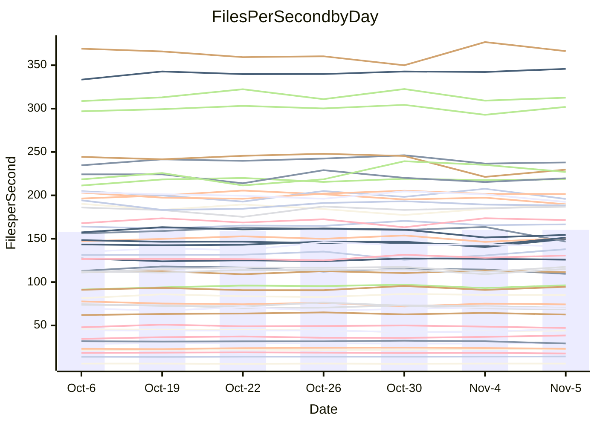

<!---
# This file is auto-generated. Do not edit.
# cspell:disable
--->
# Performance Report

## Daily Performance

## Time to Process Files

| Repository                                      | Elapsed | Min/Avg/Max           |   SD | SD Graph                |
| ----------------------------------------------- | ------: | :-------------------: | ---: | ----------------------- |
| AdaDoom3/AdaDoom3                    |    3.50 | 3.4 /   3.5 /   3.7   | 0.08 | `     ┣━┻━●╋━━┻━┫     ` |
| alexiosc/megistos                    |    8.50 | 7.3 /   8.0 /   8.7   | 0.35 | `    ┣━━┻━━╋━━┻●━┫    ` |
| apollographql/apollo-server          |    2.68 | 2.6 /   2.8 /   2.9   | 0.07 | `     ┣━●━━╋━━┻━┫     ` |
| aspnetboilerplate/aspnetboilerplate  |   10.46 | 10.3 /  10.5 /  10.9  | 0.21 | `    ┣━━┻━●╋━━┻━━┫    ` |
| aws-amplify/docs                     |   13.07 | 12.4 /  12.9 /  13.9  | 0.43 | `    ┣━━┻━━╋●━┻━━┫    ` |
| Azure/azure-rest-api-specs           |   10.30 | 9.6 /  10.1 /  11.0   | 0.40 | `    ┣━━┻━━╋━●┻━━┫    ` |
| bitjson/typescript-starter           |    1.13 | 1.0 /   1.1 /   1.1   | 0.02 | `     ┣━━┻━╋━┻━━┫ ●   ` |
| caddyserver/caddy                    |    3.88 | 3.7 /   3.8 /   4.0   | 0.10 | `     ┣━┻━━╋━●┻━┫     ` |
| canada-ca/open-source-logiciel-libre |    1.15 | 1.1 /   1.2 /   1.3   | 0.03 | `     ┣━━●━╋━┻━━┫     ` |
| chef/chef                            |    6.28 | 5.7 /   6.0 /   6.4   | 0.18 | `    ┣━━┻━━╋━━┻●━┫    ` |
| dart-lang/sdk                        |   69.44 | 63.7 /  67.0 /  72.3  | 2.52 | `   ┣━━┻━━━╋━━━●━━┫   ` |
| django/django                        |   15.39 | 14.9 /  15.7 /  16.5  | 0.45 | `    ┣━━┻●━╋━━┻━━┫    ` |
| eslint/eslint                        |   11.13 | 10.7 /  11.1 /  11.8  | 0.38 | `    ┣━━┻━━●━━┻━━┫    ` |
| exonum/exonum                        |    3.85 | 3.5 /   3.7 /   3.8   | 0.08 | `     ┣━┻━━╋━━┻━┫●    ` |
| flutter/samples                      |   16.03 | 16.2 /  16.7 /  17.4  | 0.36 | `    ●━━┻━━╋━━┻━━┫    ` |
| gitbucket/gitbucket                  |    3.71 | 3.5 /   3.7 /   3.8   | 0.09 | `     ┣━┻━━●━━┻━┫     ` |
| googleapis/google-cloud-cpp          |  148.39 | 139.9 / 148.3 / 165.8 | 6.90 | `  ┣━━━┻━━━●━━━┻━━━┫  ` |
| graphql/express-graphql              |    1.16 | 1.1 /   1.2 /   1.2   | 0.03 | `     ┣━┻●━╋━━┻━┫     ` |
| graphql/graphql-js                   |    2.92 | 2.8 /   2.9 /   3.1   | 0.08 | `     ┣━┻━━●━━┻━┫     ` |
| graphql/graphql-relay-js             |    1.21 | 1.1 /   1.2 /   1.2   | 0.04 | `     ┣━┻━━╋●━┻━┫     ` |
| graphql/graphql-spec                 |    1.33 | 1.3 /   1.4 /   1.4   | 0.04 | `     ┣━┻●━╋━━┻━┫     ` |
| iluwatar/java-design-patterns        |   13.23 | 12.8 /  13.3 /  14.4  | 0.41 | `    ┣━━┻━●╋━━┻━━┫    ` |
| ktaranov/sqlserver-kit               |    6.94 | 6.6 /   6.8 /   7.1   | 0.17 | `    ┣━━┻━━╋━━●━━┫    ` |
| liriliri/licia                       |    4.16 | 4.1 /   4.2 /   4.4   | 0.07 | `     ┣━●━━╋━━┻━┫     ` |
| MartinThoma/LaTeX-examples           |    7.32 | 6.8 /   7.0 /   7.6   | 0.20 | `    ┣━━┻━━╋━━┻●━┫    ` |
| mdx-js/mdx                           |    2.02 | 1.9 /   2.1 /   2.2   | 0.08 | `     ┣━┻━●╋━━┻━┫     ` |
| microsoft/TypeScript-Website         |    5.52 | 5.6 /   5.8 /   6.1   | 0.15 | `    ┣●━┻━━╋━━┻━━┫    ` |
| MicrosoftDocs/PowerShell-Docs        |   23.52 | 23.3 /  24.1 /  25.4  | 0.60 | `   ┣━━━●━━╋━━┻━━━┫   ` |
| neovim/nvim-lspconfig                |    4.43 | 4.3 /   4.4 /   4.7   | 0.11 | `    ┣━━┻━●╋━━┻━━┫    ` |
| pagekit/pagekit                      |    3.78 | 3.5 /   3.7 /   4.0   | 0.15 | `    ┣━━┻━━╋━●┻━━┫    ` |
| php/php-src                          |   26.71 | 26.3 /  27.3 /  30.2  | 1.11 | `   ┣━━━┻●━╋━━┻━━━┫   ` |
| plasticrake/tplink-smarthome-api     |    1.40 | 1.3 /   1.4 /   1.5   | 0.04 | `     ┣━┻━━╋●━┻━┫     ` |
| prettier/prettier                    |    7.72 | 7.2 /   7.5 /   7.9   | 0.20 | `    ┣━━┻━━╋━━●━━┫    ` |
| pycontribs/jira                      |    1.68 | 1.5 /   1.6 /   1.7   | 0.06 | `     ┣━┻━━╋━━●━┫     ` |
| RustPython/RustPython                |    5.31 | 5.2 /   5.4 /   5.8   | 0.19 | `    ┣━━┻●━╋━━┻━━┫    ` |
| shoelace-style/shoelace              |    2.90 | 2.9 /   3.0 /   3.2   | 0.07 | `     ┣●┻━━╋━━┻━┫     ` |
| slint-ui/slint                       |   13.54 | 13.1 /  13.7 /  14.4  | 0.42 | `    ┣━━┻━●╋━━┻━━┫    ` |
| SoftwareBrothers/admin-bro           |    2.65 | 2.6 /   2.7 /   2.9   | 0.07 | `     ┣━┻━●╋━━┻━┫     ` |
| sveltejs/svelte                      |   21.94 | 20.8 /  21.9 /  22.9  | 0.53 | `    ┣━━┻━━●━━┻━━┫    ` |
| TheAlgorithms/Python                 |    5.88 | 5.7 /   5.8 /   6.1   | 0.10 | `    ┣━━┻━━╋●━┻━━┫    ` |
| twbs/bootstrap                       |    1.89 | 1.8 /   1.9 /   2.0   | 0.05 | `     ┣━┻━━╋━●┻━┫     ` |
| typescript-cheatsheets/react         |    1.38 | 1.4 /   1.5 /   1.6   | 0.07 | `     ┣━●━━╋━━┻━┫     ` |
| typescript-eslint/typescript-eslint  |    4.26 | 4.2 /   4.3 /   4.5   | 0.08 | `     ┣━┻━●╋━━┻━┫     ` |
| vitest-dev/vitest                    |    9.89 | 9.2 /  10.1 /  10.9   | 0.50 | `    ┣━━┻━●╋━━┻━━┫    ` |
| w3c/aria-practices                   |    3.52 | 3.5 /   3.6 /   3.8   | 0.10 | `     ┣━┻●━╋━━┻━┫     ` |
| w3c/specberus                        |    2.04 | 2.0 /   2.1 /   2.3   | 0.07 | `     ┣━┻●━╋━━┻━┫     ` |
| webdeveric/webpack-assets-manifest   |    1.20 | 1.2 /   1.3 /   1.3   | 0.03 | `     ┣●┻━━╋━━┻━┫     ` |
| webpack/webpack                      |    5.65 | 5.4 /   5.6 /   5.8   | 0.11 | `    ┣━━┻━━╋●━┻━━┫    ` |
| wireapp/wire-desktop                 |    1.57 | 1.4 /   1.4 /   1.5   | 0.03 | `     ┣━┻━━╋━━┻━┫    ●` |
| wireapp/wire-webapp                  |   12.13 | 10.7 /  11.1 /  12.5  | 0.45 | `    ┣━━┻━━╋━━┻━━┫●   ` |

Note:
- Elapsed time is in seconds.

## Files per Second over Time

| Repository                                      | Files |    Sec |    Fps |    Rel | Trend Fps        |    N |
| ----------------------------------------------- | ----: | -----: | -----: | -----: | ---------------- | ---: |
| AdaDoom3/AdaDoom3                    |   103 |   3.50 |  29.47 |  0.69% | `█▅██▆█▆█▇▇▇▆▇▇` |   13 |
| alexiosc/megistos                    |   583 |   8.50 |  68.61 | -6.34% | `▆▆▅▇▄▄▅█▆▅▅▃▅▄` |   13 |
| apollographql/apollo-server          |   253 |   2.68 |  94.53 |  2.99% | `▇▅▇█▆▇▄▅▆▆█▇▅▇` |   13 |
| aspnetboilerplate/aspnetboilerplate  |  2286 |  10.46 | 218.56 |  0.81% | `▅▆▆███▇▆▆█▇▆█▇` |   13 |
| aws-amplify/docs                     |  2871 |  13.07 | 219.64 | -1.10% | `▆▇▇▇▆▇▄█▇█▆▆▄▆` |   13 |
| Azure/azure-rest-api-specs           |  2365 |  10.30 | 229.61 | -4.83% | `▆█▅▇▇▆█▇█▇▇▃▅▅` |   13 |
| bitjson/typescript-starter           |    20 |   1.13 |  17.68 | -4.98% | `▆▆▅▇█▇█▇▇▅▅▆▆▄` |   13 |
| caddyserver/caddy                    |   288 |   3.88 |  74.28 | -1.60% | `██▇▆▇▆▆▇▇█▅▅█▆` |   13 |
| canada-ca/open-source-logiciel-libre |     7 |   1.15 |   6.09 |  2.05% | `█▇▇█▇▄▇██▇▆███` |   13 |
| chef/chef                            |  1191 |   6.28 | 189.76 | -5.03% | `▇▄▇▆▇█▇▆█▆▅▇▅▄` |   13 |
| dart-lang/sdk                        | 10719 |  69.44 | 154.36 | -3.29% | `▇▅▇▇██▆█▇▅▆▅▄▅` |   13 |
| django/django                        |  2877 |  15.39 | 186.91 |  1.81% | `▇▇▅▅█▄▅▇▆█▆▇▆▇` |   13 |
| eslint/eslint                        |  2098 |  11.13 | 188.45 | -0.12% | `▇█▅▄▇▇▄▇▇▇▇▅█▆` |   13 |
| exonum/exonum                        |   421 |   3.85 | 109.49 | -4.75% | `▅▆██▇▆█▆▆▅▇▆▇▄` |   13 |
| flutter/samples                      |  2400 |  16.03 | 149.71 |  4.21% | `▆▆▆▆▇▇▅█▆█▇▆▅█` |   13 |
| gitbucket/gitbucket                  |   413 |   3.71 | 111.46 | -0.34% | `▆▅▅▅█▅▅▇▆▅▅▅█▆` |   13 |
| googleapis/google-cloud-cpp          | 20949 | 148.39 | 141.18 |  0.39% | `▇▃▆▆▆▇▄▇██▇█▆▇` |   13 |
| graphql/express-graphql              |    26 |   1.16 |  22.45 |  1.71% | `▄▆▆▆▆█▅▄▆▆▆▆█▇` |   13 |
| graphql/graphql-js                   |   368 |   2.92 | 125.90 |  0.39% | `█▇█▇▅▆█▆█▅█▇█▇` |   13 |
| graphql/graphql-relay-js             |    28 |   1.21 |  23.15 | -2.06% | `▆▅▅▅▄█▅▇▇█▇█▅▅` |   13 |
| graphql/graphql-spec                 |    19 |   1.33 |  14.24 |  1.96% | `▇▅▅▆▆▅▇▄█▆▆▇▇▇` |   13 |
| iluwatar/java-design-patterns        |  1992 |  13.23 | 150.56 |  0.61% | `▆▆▇▇▆█▇█▇▅█▄█▇` |   13 |
| ktaranov/sqlserver-kit               |   489 |   6.94 |  70.46 | -2.23% | `█▇██▇▅▆▆▅▇▇▇▇▆` |   13 |
| liriliri/licia                       |  1437 |   4.16 | 345.84 |  1.68% | `▅▇█▇▇▇▇█▆▇▇█▇█` |   13 |
| MartinThoma/LaTeX-examples           |  1409 |   7.32 | 192.39 | -4.00% | `▇█▇█▆▇▆▄█▆█▆▇▅` |   13 |
| mdx-js/mdx                           |   141 |   2.02 |  69.74 |  1.35% | `▆▇▄▇▆█▇▄▇▅▆▆█▇` |   13 |
| microsoft/TypeScript-Website         |   761 |   5.52 | 137.94 |  4.69% | `▅▇▆▆▇▅▇▇█▇▄▅▇█` |   13 |
| MicrosoftDocs/PowerShell-Docs        |  2708 |  23.52 | 115.13 |  2.51% | `▇▇▇▆▆▇██▅██▄▆█` |   13 |
| neovim/nvim-lspconfig                |   759 |   4.43 | 171.52 |  0.36% | `▇▅██▆▅▇▇▇▇▅▇█▇` |   13 |
| pagekit/pagekit                      |   741 |   3.78 | 195.90 | -2.92% | `█▆▇█▄▅▅▇█▇▆█▇▆` |   13 |
| php/php-src                          |  2275 |  26.71 |  85.17 |  1.26% | `▄█▇███▅▇▆▆██▇▇` |   13 |
| plasticrake/tplink-smarthome-api     |    62 |   1.40 |  44.16 | -0.72% | `███▆█▇█▆▅█▅▄▆▆` |   13 |
| prettier/prettier                    |  2415 |   7.72 | 312.67 | -0.25% | `▅▆▆▆▆█▇▅▅██▅▆▆` |   13 |
| pycontribs/jira                      |    79 |   1.68 |  47.13 | -4.59% | `▆▄█▆▇▆▅▄▆█▆▆▅▄` |   13 |
| RustPython/RustPython                |   693 |   5.31 | 130.61 |  2.95% | `▆▆▅▇▆▄█▅▄██▇▆▇` |   13 |
| shoelace-style/shoelace              |   439 |   2.90 | 151.19 |  3.75% | `▇▇▇▇▆▇▇▇▅▇▇▇▄█` |   13 |
| slint-ui/slint                       |  2561 |  13.54 | 189.19 |  2.13% | `█▇▅▇▇█▇▅▇█▅▆▇▇` |   13 |
| SoftwareBrothers/admin-bro           |   441 |   2.65 | 166.59 |  1.20% | `█▅▇▇▄▇▆▇▇▆█▇▆▇` |   13 |
| sveltejs/svelte                      |  8036 |  21.94 | 366.30 |  0.48% | `▆▇▆▆▇▆▅▅▅▆▄█▆▆` |   13 |
| TheAlgorithms/Python                 |  1399 |   5.88 | 237.92 | -0.87% | `▇▅▇▇█▇▇█▇██▆▇▇` |   13 |
| twbs/bootstrap                       |   118 |   1.89 |  62.59 | -1.79% | `▆▅▄▇█▇▆▇█▇▆█▆▆` |   13 |
| typescript-cheatsheets/react         |    53 |   1.38 |  38.45 |  6.32% | `▃▆▆▆▆▇▆▇▄▆▆▅██` |   13 |
| typescript-eslint/typescript-eslint  |  1285 |   4.26 | 301.97 |  0.94% | `▇▆▇▇▇█▇██▆█▇▅█` |   13 |
| vitest-dev/vitest                    |  2245 |   9.89 | 226.95 |  1.66% | `▄▅▅▆▆▄▃▃▅▆▇█▆▆` |   13 |
| w3c/aria-practices                   |   414 |   3.52 | 117.51 |  2.42% | `▅▅▆▅██▆▇▆█▇▆▅▇` |   13 |
| w3c/specberus                        |   197 |   2.04 |  96.34 |  2.13% | `▄▇▇▆▇█▇▇▇███▅█` |   13 |
| webdeveric/webpack-assets-manifest   |    55 |   1.20 |  45.83 |  4.44% | `▆▇▅▇▇▇▆█▆▆▅▆▄█` |   13 |
| webpack/webpack                      |  1138 |   5.65 | 201.52 |  0.57% | `▇█▆▇▅▆▆█▇▇█▇▇▇` |   13 |
| wireapp/wire-desktop                 |    46 |   1.57 |  29.21 | -7.97% | `▅█▇▆▅▇▆▅█▆▇▇▆▃` |   13 |
| wireapp/wire-webapp                  |  1781 |  12.13 | 146.79 | -8.52% | `▄█▇▆▇▇█▇█▆▇▇█▄` |   13 |

## Data Throughput

| Repository                                      | Files |    Sec |     Kps |    Rel | Trend Kps        |    N |
| ----------------------------------------------- | ----: | -----: | ------: | -----: | ---------------- | ---: |
| AdaDoom3/AdaDoom3                    |   103 |   3.50 |  626.32 |  0.69% | `█▅██▆█▆█▇▇▇▆▇▇` |   13 |
| alexiosc/megistos                    |   583 |   8.50 |  539.08 | -6.34% | `▆▆▅▇▄▄▅█▆▅▅▃▅▄` |   13 |
| apollographql/apollo-server          |   253 |   2.68 |  772.31 |  4.25% | `▇▅▆█▆▇▄▅▆▅█▇▅█` |   13 |
| aspnetboilerplate/aspnetboilerplate  |  2286 |  10.46 |  531.77 |  0.81% | `▅▆▆███▇▆▆█▇▆█▇` |   13 |
| aws-amplify/docs                     |  2871 |  13.07 |  766.71 | -1.10% | `▆▇▇▇▆▇▄█▇█▆▆▄▆` |   13 |
| Azure/azure-rest-api-specs           |  2365 |  10.30 |  622.81 | -3.68% | `▆▇▅▇▇▆█▇█▇▇▃▅▅` |   13 |
| bitjson/typescript-starter           |    20 |   1.13 |   70.71 | -4.98% | `▆▆▅▇█▇█▇▇▅▅▆▆▄` |   13 |
| caddyserver/caddy                    |   288 |   3.88 |  644.29 | -1.08% | `█▇▆▅▇▆▆▇▇█▅▅█▆` |   13 |
| canada-ca/open-source-logiciel-libre |     7 |   1.15 |   50.46 |  2.05% | `█▇▇█▇▄▇██▇▆███` |   13 |
| chef/chef                            |  1191 |   6.28 |  879.51 | -4.82% | `▇▄▇▆▆█▇▆█▆▆▇▅▅` |   13 |
| dart-lang/sdk                        | 10719 |  69.44 | 1052.18 | -3.34% | `▇▅▇▇██▆█▇▅▆▅▄▅` |   13 |
| django/django                        |  2877 |  15.39 | 1175.71 |  1.99% | `▇▇▅▅█▄▅▇▆█▆▇▇▇` |   13 |
| eslint/eslint                        |  2098 |  11.13 | 1354.39 | -0.23% | `██▅▄▇▇▄▇▇▇▇▅█▆` |   13 |
| exonum/exonum                        |   421 |   3.85 | 1047.33 | -4.75% | `▅▆██▇▆█▆▆▅▇▆▇▄` |   13 |
| flutter/samples                      |  2400 |  16.03 | 1335.96 |  4.21% | `▆▆▆▆▇▇▅█▆█▇▆▅█` |   13 |
| gitbucket/gitbucket                  |   413 |   3.71 |  506.58 | -0.36% | `▆▅▅▅█▅▅▇▆▅▅▅█▆` |   13 |
| googleapis/google-cloud-cpp          | 20949 | 148.39 | 1144.14 |  0.18% | `▇▃▆▆▆▇▄▇██▇█▆▆` |   13 |
| graphql/express-graphql              |    26 |   1.16 |  102.74 |  1.71% | `▄▆▆▆▆█▅▄▆▆▆▆█▇` |   13 |
| graphql/graphql-js                   |   368 |   2.92 |  730.78 |  0.96% | `█▇▇▇▄▆█▆█▅█▇█▇` |   13 |
| graphql/graphql-relay-js             |    28 |   1.21 |   90.96 | -2.06% | `▆▅▅▅▄█▅▇▇█▇█▅▅` |   13 |
| graphql/graphql-spec                 |    19 |   1.33 |  475.14 |  1.96% | `▇▅▅▆▆▅▇▄█▆▆▇▇▇` |   13 |
| iluwatar/java-design-patterns        |  1992 |  13.23 |  465.37 |  0.61% | `▆▆▇▇▆█▇█▇▅█▄█▇` |   13 |
| ktaranov/sqlserver-kit               |   489 |   6.94 | 1067.00 | -2.22% | `█▇██▇▅▆▆▅▇▇▇▇▆` |   13 |
| liriliri/licia                       |  1437 |   4.16 |  412.03 |  1.68% | `▅▇█▇▇▇▇█▆▇▇█▇█` |   13 |
| MartinThoma/LaTeX-examples           |  1409 |   7.32 |  397.35 | -4.00% | `▇█▇█▆▇▆▄█▆█▆▇▅` |   13 |
| mdx-js/mdx                           |   141 |   2.02 |  324.47 |  1.35% | `▆▇▄▇▆█▇▄▇▅▆▆█▇` |   13 |
| microsoft/TypeScript-Website         |   761 |   5.52 |  954.15 |  4.70% | `▅▇▆▆▇▅▇▇█▇▄▅▇█` |   13 |
| MicrosoftDocs/PowerShell-Docs        |  2708 |  23.52 | 1185.03 |  2.52% | `▇▇▇▆▆▇██▅██▄▆█` |   13 |
| neovim/nvim-lspconfig                |   759 |   4.43 |  287.00 |  0.63% | `▇▅██▆▅▇▇▇▇▅▇█▇` |   13 |
| pagekit/pagekit                      |   741 |   3.78 |  408.46 | -2.92% | `█▆▇█▄▅▅▇█▇▆█▇▆` |   13 |
| php/php-src                          |  2275 |  26.71 | 1492.63 |  1.63% | `▄█▇███▅▇▆▆██▇▇` |   13 |
| plasticrake/tplink-smarthome-api     |    62 |   1.40 |  238.63 | -0.72% | `███▆█▇█▆▅█▅▄▆▆` |   13 |
| prettier/prettier                    |  2415 |   7.72 |  434.51 | -0.87% | `▆▆▆▆▆█▇▅▅██▅▆▆` |   13 |
| pycontribs/jira                      |    79 |   1.68 |  334.09 | -4.59% | `▆▄█▆▇▆▅▄▆█▆▆▅▄` |   13 |
| RustPython/RustPython                |   693 |   5.31 | 1086.69 |  7.35% | `▅▅▅▆▅▄▇▅▃▇▇█▇█` |   13 |
| shoelace-style/shoelace              |   439 |   2.90 |  730.47 |  3.75% | `▇▇▇▇▆▇▇▇▅▇▇▇▄█` |   13 |
| slint-ui/slint                       |  2561 |  13.54 | 1165.14 |  2.26% | `█▇▅▇▆█▇▅▇█▅▆▇█` |   13 |
| SoftwareBrothers/admin-bro           |   441 |   2.65 |  367.17 |  1.20% | `█▅▇▇▄▇▆▇▇▆█▇▆▇` |   13 |
| sveltejs/svelte                      |  8036 |  21.94 |  244.60 |  0.52% | `▆▇▅▆▇▆▅▅▅▆▄█▆▆` |   13 |
| TheAlgorithms/Python                 |  1399 |   5.88 |  605.10 | -0.85% | `▇▅▇▇█▇▇█▇██▆▇▇` |   13 |
| twbs/bootstrap                       |   118 |   1.89 |  513.42 | -1.79% | `▆▅▄▇█▇▆▇█▇▆█▆▆` |   13 |
| typescript-cheatsheets/react         |    53 |   1.38 |  284.35 |  6.32% | `▃▆▆▆▆▇▆▇▄▆▆▅██` |   13 |
| typescript-eslint/typescript-eslint  |  1285 |   4.26 | 1552.59 |  0.95% | `▇▆▇▇▇█▇██▆█▇▅█` |   13 |
| vitest-dev/vitest                    |  2245 |   9.89 |  503.33 |  0.55% | `▄▅▅▆▆▄▃▃▅▆██▅▆` |   13 |
| w3c/aria-practices                   |   414 |   3.52 | 1095.63 |  2.42% | `▅▅▆▅██▆▇▆█▇▆▅▇` |   13 |
| w3c/specberus                        |   197 |   2.04 |  304.67 |  2.20% | `▄▇▇▆▇█▇▇▇███▅█` |   13 |
| webdeveric/webpack-assets-manifest   |    55 |   1.20 |  105.84 |  4.29% | `▇▇▅▇▇▇▆█▆▆▅▆▄█` |   13 |
| webpack/webpack                      |  1138 |   5.65 |  914.26 |  0.25% | `▇█▆▇▅▆▅▇▇▇▇▇▇▇` |   13 |
| wireapp/wire-desktop                 |    46 |   1.57 |  163.21 | -6.78% | `▂█▇▇▆▇▇▆█▇██▇▅` |   13 |
| wireapp/wire-webapp                  |  1781 |  12.13 |  542.00 | -8.27% | `▃█▇▆▇▇█▇█▇▇▇█▄` |   13 |

