<!---
# This file is auto-generated. Do not edit.
# cspell:disable
--->
# Performance Report

```mermaid
xychart-beta
    title Files Per Second by Day
    y-axis Files per Second
    x-axis Date [Jan-10, Jan-11, Jan-13, Jan-16, Jan-17, Jan-18, Jan-20, Jan-22, Jan-24, Jan-26, Jan-27, Jan-31, Feb-1, Feb-2, Feb-3, Feb-4, Feb-6, Feb-7, Feb-8, Feb-9]
    bar [187.45, 188.92, 191.86, 190.29, 191.94, 196.32, 194.86, 191.82, 190.32, 191.51, 190.41, 192.01, 191.89, 188.72, 191.38, 188.90, 190.72, 190.17, 190.44, 191.84]
    line [79.70, 78.59, 81.33, 81.33, 81.07, 83.41, 80.33, 81.35, 82.74, 85.67, 76.62, 69.80, 79.78, 83.19, 79.99, 81.38, 78.37, 78.87, 76.33, 80.63]
    line [56.48, 57.02, 56.66, 55.93, 59.24, 56.01, 55.67, 55.20, 55.10, 53.59, 53.02, 57.11, 52.81, 55.66, 56.60, 51.29, 52.77, 57.05, 53.25, 55.68]
    line [107.79, 102.30, 102.07, 100.69, 106.54, 108.37, 107.20, 104.26, 106.72, 105.14, 103.83, 105.85, 104.82, 108.27, 101.16, 101.71, 96.80, 105.17, 106.78, 100.83]
    line [43.80, 48.21, 48.57, 48.55, 50.09, 48.39, 47.34, 47.51, 47.53, 47.48, 45.26, 47.60, 46.28, 48.66, 45.03, 44.68, 43.73, 45.57, 47.74, 41.58]
    line [22.74, 25.52, 24.84, 24.50, 25.34, 23.52, 24.93, 24.42, 24.29, 23.65, 23.65, 21.57, 23.77, 24.71, 24.15, 24.26, 23.40, 25.18, 24.34, 22.53]
    line [40.97, 40.73, 40.14, 39.37, 40.16, 40.57, 39.99, 39.45, 39.56, 40.89, 38.42, 41.91, 40.21, 40.30, 38.59, 39.97, 40.70, 38.75, 38.14, 38.46]
    line [163.04, 162.47, 164.23, 164.63, 167.70, 160.91, 159.45, 163.50, 167.30, 165.36, 160.46, 164.87, 161.06, 158.29, 161.96, 164.85, 164.28, 164.40, 159.10, 156.63]
    line [128.91, 133.62, 132.89, 135.43, 131.64, 136.76, 137.40, 132.80, 128.54, 132.65, 129.67, 126.00, 129.13, 135.02, 129.21, 131.37, 130.21, 127.48, 133.83, 120.57]
    line [196.53, 187.68, 194.19, 197.24, 195.66, 200.40, 198.68, 192.03, 202.65, 197.73, 197.86, 185.13, 193.14, 197.96, 188.03, 184.87, 192.18, 186.89, 188.37, 191.02]
    line [19.05, 20.04, 19.27, 20.18, 19.35, 20.14, 20.01, 18.93, 20.01, 19.80, 18.94, 17.77, 19.48, 18.59, 18.27, 20.00, 20.26, 18.55, 19.66, 20.75]
    line [48.76, 50.39, 48.56, 48.63, 49.92, 47.96, 48.91, 48.82, 49.53, 48.99, 48.58, 48.96, 48.60, 48.80, 46.86, 44.78, 49.77, 46.58, 46.37, 49.57]
    line [101.23, 103.65, 103.42, 102.46, 106.20, 105.37, 102.12, 105.87, 102.16, 102.14, 102.53, 103.49, 99.40, 99.16, 97.64, 98.18, 103.70, 106.20, 99.99, 99.65]
    line [219.61, 218.24, 213.27, 217.66, 218.45, 221.48, 225.59, 221.54, 226.67, 217.21, 209.84, 210.58, 224.80, 219.16, 222.44, 214.46, 210.98, 218.39, 222.45, 225.29]
    line [389.29, 376.57, 388.49, 375.32, 366.20, 389.54, 377.40, 385.33, 384.07, 389.49, 375.11, 344.39, 377.92, 368.78, 357.60, 388.25, 362.18, 363.07, 369.70, 363.76]
    line [232.86, 230.33, 232.89, 233.09, 238.38, 239.45, 235.23, 231.97, 232.80, 236.05, 231.31, 219.07, 234.91, 232.08, 226.54, 219.34, 230.80, 225.22, 227.18, 219.59]
    line [6.90, 6.81, 6.66, 6.97, 6.64, 6.91, 6.72, 6.67, 6.94, 6.67, 6.54, 6.62, 6.41, 6.91, 6.36, 6.58, 6.71, 6.80, 6.54, 6.32]
    line [173.15, 184.83, 185.84, 185.90, 183.93, 185.28, 191.50, 191.17, 193.91, 185.17, 181.80, 175.63, 188.19, 178.84, 190.27, 179.88, 183.71, 188.14, 181.32, 183.90]
    line [73.13, 70.56, 71.46, 69.64, 73.60, 68.98, 70.36, 68.71, 69.89, 68.59, 68.16, 64.96, 64.42, 71.54, 66.41, 68.48, 67.32, 68.66, 69.54, 64.63]
    line [136.24, 140.09, 141.04, 141.83, 138.27, 139.82, 139.77, 142.05, 138.61, 141.46, 138.59, 143.14, 142.73, 142.84, 131.70, 135.60, 134.90, 137.77, 133.55, 140.21]
    line [149.33, 150.95, 149.18, 146.30, 139.07, 151.18, 153.74, 153.12, 150.15, 146.49, 146.96, 143.93, 149.76, 150.71, 139.56, 149.35, 149.31, 151.26, 147.89, 142.44]
    line [228.77, 221.68, 228.59, 230.59, 232.51, 236.40, 229.96, 235.68, 233.44, 228.13, 220.74, 229.98, 223.23, 220.66, 222.78, 222.35, 231.30, 222.88, 223.28, 206.21]
    line [130.00, 129.60, 128.50, 127.21, 130.68, 134.03, 132.53, 130.75, 129.59, 130.75, 126.15, 128.28, 128.07, 127.23, 125.91, 129.12, 126.49, 131.65, 129.27, 131.24]
    line [32.48, 34.06, 34.46, 35.93, 33.32, 35.23, 35.39, 34.93, 34.02, 34.09, 33.87, 34.29, 34.92, 32.72, 32.24, 34.39, 32.11, 29.25, 34.28, 34.24]
    line [87.15, 87.31, 87.18, 90.31, 92.11, 92.40, 91.04, 90.36, 90.73, 88.98, 87.79, 92.24, 85.84, 87.34, 84.11, 87.49, 86.37, 87.72, 85.83, 83.72]
    line [232.21, 230.83, 222.60, 231.13, 231.51, 240.11, 237.40, 232.15, 240.84, 231.74, 230.60, 238.25, 234.41, 226.71, 230.40, 229.74, 237.81, 232.23, 224.57, 235.06]
    line [329.28, 331.31, 322.95, 325.07, 320.94, 337.71, 314.28, 338.34, 330.62, 332.64, 332.86, 330.58, 325.66, 323.17, 336.90, 335.91, 322.03, 323.49, 318.09, 296.32]
    line [357.94, 329.89, 337.22, 342.27, 345.00, 356.14, 349.54, 352.62, 353.32, 354.47, 340.16, 355.36, 343.22, 341.35, 343.34, 343.75, 345.17, 341.37, 358.57, 367.94]
    line [129.73, 128.79, 126.07, 129.88, 128.08, 130.23, 129.79, 127.22, 125.81, 130.48, 125.23, 130.52, 121.85, 125.25, 129.66, 129.52, 125.44, 125.65, 123.91, 126.75]
    line [257.31, 259.03, 255.67, 262.65, 261.59, 266.80, 267.02, 266.61, 269.34, 261.80, 260.28, 260.12, 259.24, 266.03, 264.66, 253.81, 264.19, 262.88, 255.12, 258.35]
    line [84.19, 83.66, 81.75, 85.70, 86.11, 85.86, 86.06, 84.27, 86.06, 83.34, 81.63, 80.82, 83.46, 83.98, 85.68, 83.63, 81.75, 82.99, 80.30, 82.51]
    line [178.84, 176.33, 177.89, 180.64, 176.54, 181.96, 178.88, 180.40, 174.86, 177.54, 174.66, 177.76, 179.20, 178.55, 179.09, 179.41, 173.82, 171.95, 172.64, 173.85]
    line [218.16, 220.17, 217.65, 213.84, 219.82, 216.50, 223.77, 218.30, 218.17, 216.51, 216.11, 223.69, 217.62, 221.92, 210.52, 217.06, 217.75, 221.18, 215.63, 214.19]
    line [162.55, 150.60, 169.56, 173.92, 177.33, 173.32, 178.23, 175.77, 178.27, 178.37, 173.24, 175.53, 174.36, 175.31, 176.60, 177.03, 168.50, 172.68, 169.57, 174.43]
    line [114.20, 134.12, 122.32, 127.81, 135.76, 135.82, 124.24, 127.06, 126.29, 124.09, 118.58, 122.01, 124.68, 121.40, 124.27, 121.00, 122.72, 124.94, 121.83, 119.74]
    line [219.97, 208.62, 218.28, 221.67, 222.50, 222.49, 221.50, 215.62, 221.41, 212.75, 215.81, 222.32, 209.91, 217.01, 216.15, 212.32, 213.20, 215.93, 213.93, 216.48]
    line [239.34, 239.80, 239.93, 238.57, 236.32, 249.26, 244.81, 244.90, 244.81, 248.38, 241.40, 249.14, 241.45, 239.07, 239.51, 243.53, 244.90, 249.62, 243.56, 242.98]
    line [196.90, 196.60, 194.03, 194.99, 192.23, 197.19, 192.71, 195.01, 195.95, 192.00, 189.33, 196.17, 191.05, 192.93, 192.90, 193.43, 182.93, 188.24, 197.74, 197.89]
    line [36.83, 37.61, 37.83, 37.29, 37.79, 38.08, 37.68, 37.40, 37.80, 38.01, 36.89, 36.96, 37.04, 36.98, 36.58, 36.57, 37.20, 37.62, 37.00, 38.80]
    line [273.80, 263.96, 272.92, 261.41, 256.94, 266.46, 233.73, 255.35, 238.38, 229.34, 231.07, 215.86, 227.49, 237.43, 233.36, 227.18, 233.42, 233.14, 230.84, 227.29]
    line [83.22, 85.10, 84.24, 85.04, 88.54, 87.62, 86.00, 85.64, 83.63, 82.99, 83.39, 81.99, 83.50, 81.95, 82.10, 83.95, 83.89, 81.23, 83.38, 83.13]
    line [131.45, 132.46, 133.58, 134.83, 138.33, 137.42, 133.67, 135.32, 136.02, 132.00, 133.67, 130.01, 133.77, 131.00, 132.25, 127.77, 131.87, 132.83, 130.24, 134.40]
    line [97.94, 97.30, 98.25, 99.69, 99.56, 100.21, 102.10, 97.82, 100.22, 98.35, 98.09, 97.24, 99.79, 99.21, 94.63, 98.63, 99.54, 99.93, 96.90, 98.61]
    line [408.32, 400.13, 413.71, 402.27, 405.88, 422.55, 417.95, 422.87, 425.03, 422.04, 415.46, 422.79, 413.85, 411.47, 422.24, 425.96, 422.90, 426.77, 417.49, 406.61]
    line [26.38, 26.59, 26.51, 25.26, 25.41, 25.96, 26.49, 25.80, 26.06, 26.20, 24.97, 23.09, 24.19, 23.67, 25.80, 25.02, 24.57, 25.83, 26.53, 26.74]
    line [256.97, 252.12, 251.26, 250.15, 255.66, 262.96, 271.72, 264.80, 259.27, 265.80, 263.72, 257.16, 251.63, 250.02, 261.80, 245.30, 263.91, 261.35, 263.52, 274.12]
    line [15.79, 15.64, 15.80, 15.80, 16.00, 15.45, 15.24, 15.02, 15.03, 15.29, 14.84, 15.62, 14.38, 14.96, 14.97, 15.27, 14.50, 15.88, 15.38, 15.93]
    line [256.06, 239.94, 250.86, 255.23, 249.00, 265.06, 266.25, 265.39, 261.87, 267.56, 251.76, 251.39, 257.09, 256.60, 252.24, 257.13, 261.45, 265.63, 258.24, 252.41]
    line [175.41, 212.66, 215.89, 200.52, 199.18, 198.97, 206.74, 209.26, 204.49, 217.13, 213.62, 216.87, 219.73, 217.00, 217.80, 206.42, 216.86, 217.40, 212.93, 217.55]
    line [204.27, 201.52, 203.28, 190.39, 203.06, 207.16, 206.41, 203.60, 205.03, 203.50, 200.03, 203.99, 203.12, 208.67, 201.18, 195.78, 203.73, 196.42, 202.06, 200.20]
    line [166.95, 174.59, 178.01, 176.93, 175.50, 183.23, 181.65, 172.80, 167.02, 174.50, 177.97, 180.67, 179.91, 166.82, 180.26, 174.86, 175.68, 174.32, 177.53, 181.81]
```

Daily Performance

Time to Process Files

| Repository                                      | Elapsed | Min/Avg/Max           |   SD | SD Graph                |
| ----------------------------------------------- | ------: | :-------------------: | ---: | ----------------------- |
| AdaDoom3/AdaDoom3                    |    2.65 | 2.6 /   2.8 /   2.9   | 0.06 | `     ●━┻━━╋━━┻━┫     ` |
| alexiosc/megistos                    |    7.07 | 6.6 /   7.0 /   7.8   | 0.24 | `    ┣━━┻━━╋●━┻━━┫    ` |
| apollographql/apollo-server          |    2.55 | 2.3 /   2.5 /   2.7   | 0.11 | `    ┣━━┻━━╋━●┻━━┫    ` |
| aspnetboilerplate/aspnetboilerplate  |    8.85 | 8.3 /   8.7 /   9.9   | 0.25 | `    ┣━━┻━━╋●━┻━━┫    ` |
| aws-amplify/docs                     |   11.83 | 11.3 /  11.8 /  12.5  | 0.27 | `    ┣━━┻━━●━━┻━━┫    ` |
| Azure/azure-rest-api-specs           |    8.92 | 8.6 /   9.4 /  11.2   | 0.48 | `    ┣━━●━━╋━━┻━━┫    ` |
| bitjson/typescript-starter           |    0.96 | 1.0 /   1.0 /   1.2   | 0.06 | `     ┣━●━━╋━━┻━┫     ` |
| caddyserver/caddy                    |    3.48 | 3.1 /   3.3 /   3.6   | 0.12 | `    ┣━━┻━━╋━━┻●━┫    ` |
| canada-ca/open-source-logiciel-libre |    1.11 | 1.0 /   1.1 /   1.2   | 0.05 | `     ┣━┻━━╋━━●━┫     ` |
| chef/chef                            |    5.81 | 5.0 /   5.3 /   5.9   | 0.20 | `    ┣━━┻━━╋━━┻━━┫ ●  ` |
| dart-lang/sdk                        |   54.72 | 50.2 /  54.2 /  60.2  | 1.70 | `  ┣━━━┻━━━╋●━━┻━━━┫  ` |
| django/django                        |   13.35 | 12.6 /  13.4 /  14.9  | 0.43 | `    ┣━━┻━━●━━┻━━┫    ` |
| eslint/eslint                        |    9.62 | 9.0 /   9.5 /  10.1   | 0.24 | `    ┣━━┻━━╋━●┻━━┫    ` |
| exonum/exonum                        |    3.32 | 3.2 /   3.3 /   3.6   | 0.10 | `    ┣━━┻━━●━━┻━━┫    ` |
| flutter/samples                      |   14.18 | 13.4 /  14.2 /  22.6  | 1.20 | `   ┣━━━┻━━●━━┻━━━┫   ` |
| gitbucket/gitbucket                  |    3.43 | 3.0 /   3.1 /   3.4   | 0.11 | `    ┣━━┻━━╋━━┻━━┫ ●  ` |
| googleapis/google-cloud-cpp          |  116.41 | 113.8 / 119.1 / 135.3 | 4.18 | `  ┣━━━┻●━━╋━━━┻━━━┫  ` |
| graphql/express-graphql              |    1.15 | 1.0 /   1.1 /   1.3   | 0.06 | `     ┣━┻━━╋━━●━┫     ` |
| graphql/graphql-js                   |    2.64 | 2.5 /   2.7 /   3.1   | 0.10 | `    ┣━━┻━━●━━┻━━┫    ` |
| graphql/graphql-relay-js             |    1.05 | 1.0 /   1.1 /   1.3   | 0.06 | `     ┣━┻●━╋━━┻━┫     ` |
| graphql/graphql-spec                 |    1.19 | 1.2 /   1.3 /   1.4   | 0.06 | `     ┣━●━━╋━━┻━┫     ` |
| iluwatar/java-design-patterns        |   11.73 | 10.8 /  11.2 /  12.0  | 0.30 | `    ┣━━┻━━╋━━┻━●┫    ` |
| ktaranov/sqlserver-kit               |    5.89 | 5.5 /   5.8 /   6.3   | 0.18 | `    ┣━━┻━━╋●━┻━━┫    ` |
| liriliri/licia                       |    3.95 | 3.6 /   3.8 /   4.2   | 0.16 | `    ┣━━┻━━╋━●┻━━┫    ` |
| MartinThoma/LaTeX-examples           |    5.99 | 5.8 /   6.1 /   6.7   | 0.20 | `    ┣━━┻━●╋━━┻━━┫    ` |
| mdx-js/mdx                           |    1.75 | 1.4 /   1.8 /   2.1   | 0.10 | `     ┣━┻━●╋━━┻━┫     ` |
| microsoft/TypeScript-Website         |    5.34 | 4.9 /   5.1 /   5.9   | 0.21 | `    ┣━━┻━━╋━━●━━┫    ` |
| MicrosoftDocs/PowerShell-Docs        |   19.70 | 19.1 /  19.9 /  21.5  | 0.51 | `   ┣━━━┻━●╋━━┻━━━┫   ` |
| neovim/nvim-lspconfig                |    4.03 | 3.8 /   4.0 /   4.6   | 0.16 | `    ┣━━┻━━╋●━┻━━┫    ` |
| pagekit/pagekit                      |    3.29 | 3.2 /   3.4 /   3.9   | 0.14 | `    ┣━━┻●━╋━━┻━━┫    ` |
| php/php-src                          |   23.06 | 21.7 /  23.0 /  24.8  | 0.65 | `   ┣━━━┻━━●━━┻━━━┫   ` |
| plasticrake/tplink-smarthome-api     |    1.25 | 1.2 /   1.3 /   1.5   | 0.06 | `     ┣━┻●━╋━━┻━┫     ` |
| prettier/prettier                    |    7.24 | 7.0 /   7.5 /   8.1   | 0.29 | `    ┣━━┻●━╋━━┻━━┫    ` |
| pycontribs/jira                      |    1.42 | 1.3 /   1.4 /   1.7   | 0.08 | `     ┣━┻━●╋━━┻━┫     ` |
| RustPython/RustPython                |    6.27 | 5.2 /   5.9 /   7.1   | 0.35 | `    ┣━━┻━━╋━━●━━┫    ` |
| shoelace-style/shoelace              |    2.80 | 2.6 /   2.7 /   3.0   | 0.09 | `    ┣━━┻━━╋━━●━━┫    ` |
| slint-ui/slint                       |   12.65 | 11.8 /  12.8 /  15.0  | 0.57 | `   ┣━━━┻━●╋━━┻━━━┫   ` |
| SoftwareBrothers/admin-bro           |    2.40 | 2.3 /   2.4 /   2.7   | 0.10 | `    ┣━━┻━━●━━┻━━┫    ` |
| sveltejs/svelte                      |   20.68 | 19.3 /  19.9 /  21.5  | 0.39 | `   ┣━━━┻━━╋━━┻━━●┫   ` |
| TheAlgorithms/Python                 |    5.55 | 5.2 /   5.4 /   6.3   | 0.21 | `    ┣━━┻━━╋━●┻━━┫    ` |
| twbs/bootstrap                       |    1.83 | 1.6 /   1.7 /   2.0   | 0.08 | `     ┣━┻━━╋━━┻●┫     ` |
| typescript-cheatsheets/react         |    1.38 | 1.3 /   1.3 /   1.5   | 0.05 | `     ┣━┻━━╋━●┻━┫     ` |
| typescript-eslint/typescript-eslint  |    4.41 | 3.8 /   4.0 /   5.0   | 0.20 | `    ┣━━┻━━╋━━┻━━●    ` |
| vitest-dev/vitest                    |   11.05 | 8.5 /  10.3 /  11.7   | 0.79 | `   ┣━━━┻━━╋━━●━━━┫   ` |
| w3c/aria-practices                   |    3.15 | 3.0 /   3.2 /   3.6   | 0.12 | `    ┣━━┻━●╋━━┻━━┫    ` |
| w3c/specberus                        |    1.95 | 1.8 /   1.9 /   2.1   | 0.09 | `     ┣━┻━━╋━●┻━┫     ` |
| webdeveric/webpack-assets-manifest   |    1.32 | 1.0 /   1.2 /   1.4   | 0.08 | `     ┣━┻━━╋━━┻━●     ` |
| webpack/webpack                      |    5.21 | 4.7 /   4.9 /   5.5   | 0.16 | `    ┣━━┻━━╋━━┻━●┫    ` |
| wireapp/wire-desktop                 |    1.28 | 1.2 /   1.3 /   1.6   | 0.08 | `     ┣━┻━━●━━┻━┫     ` |
| wireapp/wire-webapp                  |   10.49 | 9.1 /  10.6 /  11.8   | 0.53 | `    ┣━━┻━●╋━━┻━━┫    ` |

Note:
- Elapsed time is in seconds.

Files per Second over Time

| Repository                                      | Files |    Sec |    Fps |     Rel | Trend Fps              |    N |
| ----------------------------------------------- | ----: | -----: | -----: | ------: | ---------------------- | ---: |
| AdaDoom3/AdaDoom3                    |   103 |   2.65 |  38.80 |   3.99% | `▅▆▅▇▆▅▆▅▆▅▇▅▇▅█▆▆▅▆█` |   57 |
| alexiosc/megistos                    |   583 |   7.07 |  82.51 |  -1.24% | `▆▇▇▇█▆█▇█▅▅▅▇▇▆▃▆▇▅▆` |   57 |
| apollographql/apollo-server          |   254 |   2.55 |  99.65 |  -2.48% | `▆▇█▄▅▆▄▆▄▆▇▇███▇▅▇▅▆` |   57 |
| aspnetboilerplate/aspnetboilerplate  |  2286 |   8.85 | 258.35 |  -1.29% | `▆▇▇▇▆█▇▆▅▆▇▇▇▇▇▃▇▇▇▆` |   57 |
| aws-amplify/docs                     |  2874 |  11.83 | 242.98 |  -0.08% | `▆▆▇▅▆▆▆█▄▇▇▆▇█▇▇▇▆▆▆` |   57 |
| Azure/azure-rest-api-specs           |  2444 |   8.92 | 274.12 |   5.51% | `▆▇▅▅▅▇▆▄▅▄▆▅▇▆▆▆█▅▆▇` |   57 |
| bitjson/typescript-starter           |    20 |   0.96 |  20.75 |   6.59% | `▇▅▇▄▃▇▅▇▇▇█▇▇▇▄▇▅█▇█` |   57 |
| caddyserver/caddy                    |   291 |   3.48 |  83.72 |  -5.21% | `▄▆█▄▅▆▄▄▇▇▇▆▅▇▅▄▅▇▆▅` |   57 |
| canada-ca/open-source-logiciel-libre |     7 |   1.11 |   6.32 |  -5.36% | `▄▇▆█▃▆▆▇█▃▆▆▇▇▆▆▇▆▅▅` |   57 |
| chef/chef                            |  1199 |   5.81 | 206.21 |  -9.05% | `▇▆▆▆▆▇▅█▆▄▇█▇▅▇▆▇▅▇▄` |   57 |
| dart-lang/sdk                        | 10955 |  54.72 | 200.20 |  -0.90% | `▆▆█▅▆▆▅▆▄▆▆▆▆▆▄▆▆▅▅▆` |   57 |
| django/django                        |  2890 |  13.35 | 216.48 |   0.08% | `▆▆█▆▆▇▇▆▇▆▇█▅▇▇█▄▆▇▇` |   57 |
| eslint/eslint                        |  2060 |   9.62 | 214.19 |  -1.61% | `▆███▄▇▆▆▇█▆▇█▇█▇▆▇▆▆` |   57 |
| exonum/exonum                        |   421 |   3.32 | 126.75 |  -0.43% | `▄▆▇▆▇▇█▇▇█▇▆▆▆▇▄▇▆▇▇` |   57 |
| flutter/samples                      |  2474 |  14.18 | 174.43 |   0.88% | `█▇▇███▇███▇▇▇▇█▇▇▇▇▇` |   57 |
| gitbucket/gitbucket                  |   414 |   3.43 | 120.57 |  -8.77% | `▇▆▇█▇▄▇▆▆█▄█▇▅▆▇█▇▇▄` |   57 |
| googleapis/google-cloud-cpp          | 21165 | 116.41 | 181.81 |   2.93% | `██▃▇█▇██▅██▇▆▆▇▇▇▇▇█` |   57 |
| graphql/express-graphql              |    26 |   1.15 |  22.53 |  -6.86% | `▆▅▇▇▆▇▆▇▇▅▂▇▇█▇▇▇▆▇▅` |   57 |
| graphql/graphql-js                   |   370 |   2.64 | 140.21 |   1.00% | `█▇█▇▆▃▇▅▇▆▆▆▅▇▆▅▅█▅▇` |   57 |
| graphql/graphql-relay-js             |    28 |   1.05 |  26.74 |   4.52% | `▅▄▅▅▇▇▇▄▇██▅▄▇▇█▇███` |   57 |
| graphql/graphql-spec                 |    19 |   1.19 |  15.93 |   4.71% | `▆▄█▄█▆▅▇▅▇▄▇▄███▆▆██` |   57 |
| iluwatar/java-design-patterns        |  2039 |  11.73 | 173.85 |  -1.91% | `█▇█▇██▇██▇▅▇▆▆▅▆▆▇▅▆` |   57 |
| ktaranov/sqlserver-kit               |   490 |   5.89 |  83.13 |  -1.14% | `▆▇█▄▅▆▇▇▆██▆▇▄▇▇▆▇▇▇` |   57 |
| liriliri/licia                       |  1437 |   3.95 | 363.76 |  -3.38% | `▇▆▇▅▆▆▄███▆▆▄▄▇▄▇█▆▆` |   57 |
| MartinThoma/LaTeX-examples           |  1409 |   5.99 | 235.06 |   1.30% | `█▅▇▅▅▆█▇▇▅█▇▇▆█▆▆▄▇▇` |   57 |
| mdx-js/mdx                           |   141 |   1.75 |  80.63 |   0.80% | `▇▇█▇▆▇▇▆███▅▅▇▆█▄▄▆▇` |   57 |
| microsoft/TypeScript-Website         |   761 |   5.34 | 142.44 |  -4.20% | `▇▇▇▇▇▄▃▆▇▇▇▇▆▇▇▅▆█▆▅` |   57 |
| MicrosoftDocs/PowerShell-Docs        |  2648 |  19.70 | 134.40 |   1.01% | `█▇▆▇█▇▆▆▇▅▇▇██▇▆██▄█` |   57 |
| neovim/nvim-lspconfig                |   769 |   4.03 | 191.02 |  -1.57% | `█▆█▇▇▆▅▆▃█▆▇▇▆▆▇▅▇▆▆` |   57 |
| pagekit/pagekit                      |   741 |   3.29 | 225.29 |   3.25% | `██▇▇█▇▇▆█▅▃▇▇▇▇█▇▇██` |   57 |
| php/php-src                          |  2274 |  23.06 |  98.61 |  -0.12% | `▇▇▆▇▅▆▄▇▇▆▇▆██▆▆▆▅▇▇` |   57 |
| plasticrake/tplink-smarthome-api     |    62 |   1.25 |  49.57 |   2.55% | `▇▇█▆▇▃▇▃▅▆▇██▇▄▆▄▇▄▇` |   57 |
| prettier/prettier                    |  2664 |   7.24 | 367.94 |   6.29% | `▆▄▇▅▆▅▇▆▆▆▆▇▆▅▇███▆█` |   57 |
| pycontribs/jira                      |    79 |   1.42 |  55.68 |   1.68% | `▅▆▇▇█▇▇▇▃▅▅▅▇▇█▆▆▃▇▇` |   57 |
| RustPython/RustPython                |   751 |   6.27 | 119.74 |  -3.74% | `█▇▇▆▇█▇▇▆▆▇▆█▇██▇▆▆▆` |   57 |
| shoelace-style/shoelace              |   439 |   2.80 | 156.63 |  -3.57% | `▅▇▅▆▇▇▅█▅▇▅▇█▇▇▅▆▆▅▅` |   57 |
| slint-ui/slint                       |  2751 |  12.65 | 217.55 |   3.11% | `▇██▇▇██▇▅▇█▇██▇▅▇███` |   57 |
| SoftwareBrothers/admin-bro           |   441 |   2.40 | 183.90 |  -0.72% | `█▇▇▅█▇█▇▆▅█▇▅▇▇█▄▆▇▇` |   57 |
| sveltejs/svelte                      |  8410 |  20.68 | 406.61 |  -2.51% | `▆▇▇▆▇████▇▇▇███▇▇▇▇▆` |   57 |
| TheAlgorithms/Python                 |  1401 |   5.55 | 252.41 |  -2.04% | `▇▆▇▇▅▇▇▇▇▆▇▇███▇█▇▆▆` |   57 |
| twbs/bootstrap                       |   118 |   1.83 |  64.63 |  -6.25% | `▅▃█▇▆▄▇▇▅▇▅▆▇▇▆▆▇▇▇▅` |   57 |
| typescript-cheatsheets/react         |    53 |   1.38 |  38.46 |  -3.12% | `▇▇▇▇▆▅▆█▆▆██▇▅▇▅▆▆▄▆` |   57 |
| typescript-eslint/typescript-eslint  |  1307 |   4.41 | 296.32 |  -9.68% | `▆▇▇▆▇█▇██▆▇▇▅▅██▆▇▄▅` |   57 |
| vitest-dev/vitest                    |  2511 |  11.05 | 227.29 |  -5.76% | `▆▅█▆▆▇▇▆▇▄▇▆▇▇▇▇▆▅▆▆` |   57 |
| w3c/aria-practices                   |   414 |   3.15 | 131.24 |   1.68% | `▇▇▅▇▇▆▄▇▇▆▆█▅▇▇▅▇▇█▇` |   57 |
| w3c/specberus                        |   197 |   1.95 | 100.83 |  -3.27% | `▇▆▇▇▆▃▇▇▃▇▅▄▄▇▆▇▆▇█▅` |   57 |
| webdeveric/webpack-assets-manifest   |    55 |   1.32 |  41.58 | -11.14% | `▇▆█▇▄▆▇▄█▅▇▅▄▅▇▇█▇▇▄` |   57 |
| webpack/webpack                      |  1143 |   5.21 | 219.59 |  -5.09% | `██▇▇▆▆▇▃▅▇█▇▇█▅▇▅▇▇▅` |   57 |
| wireapp/wire-desktop                 |    44 |   1.28 |  34.24 |   0.70% | `█▇█▄▄▅▇▇▇▇▅█▄▂▅▇▇▆█▇` |   57 |
| wireapp/wire-webapp                  |  2075 |  10.49 | 197.89 |   2.53% | `█▅▆▅█▇▇▆▇▆▇▄▆▅▇█████` |   56 |

Data Throughput

| Repository                                      | Files |    Sec |     Kps |     Rel | Trend Kps              |    N |
| ----------------------------------------------- | ----: | -----: | ------: | ------: | ---------------------- | ---: |
| AdaDoom3/AdaDoom3                    |   103 |   2.65 |  824.59 |   3.99% | `▅▆▅▇▆▅▆▅▆▅▇▅▇▅█▆▆▅▆█` |   57 |
| alexiosc/megistos                    |   583 |   7.07 |  648.37 |  -1.24% | `▆▇▇▇█▆█▇█▅▅▅▇▇▆▃▆▇▅▆` |   57 |
| apollographql/apollo-server          |   254 |   2.55 |  818.78 |  -2.09% | `▆▇█▄▅▆▄▆▄▆▇▇███▇▅▇▅▆` |   57 |
| aspnetboilerplate/aspnetboilerplate  |  2286 |   8.85 |  628.57 |  -1.29% | `▆▇▇▇▆█▇▆▅▆▇▇▇▇▇▃▇▇▇▆` |   57 |
| aws-amplify/docs                     |  2874 |  11.83 |  849.48 |  -0.05% | `▆▆▇▅▆▆▆█▄▇▇▆▇█▇▇▇▆▆▆` |   57 |
| Azure/azure-rest-api-specs           |  2444 |   8.92 |  724.89 |   6.00% | `▆█▅▅▅▇▆▄▅▄▆▅▇▆▆▆█▅▆▇` |   57 |
| bitjson/typescript-starter           |    20 |   0.96 |   82.99 |   6.59% | `▇▅▇▄▃▇▅▇▇▇█▇▇▇▄▇▅█▇█` |   57 |
| caddyserver/caddy                    |   291 |   3.48 |  733.89 |  -5.20% | `▄▆█▄▅▆▄▄▇▇▇▆▅▇▅▄▅▇▆▅` |   57 |
| canada-ca/open-source-logiciel-libre |     7 |   1.11 |   52.34 |  -5.36% | `▄▇▆█▃▆▆▇█▃▆▆▇▇▆▆▇▆▅▅` |   57 |
| chef/chef                            |  1199 |   5.81 |  967.43 |  -8.65% | `▇▆▆▆▆▇▅█▆▄▇█▇▅▇▆▇▅▇▄` |   57 |
| dart-lang/sdk                        | 10955 |  54.72 | 1366.71 |  -0.31% | `▆▆█▅▆▆▅▆▄▆▆▆▆▆▄▆▆▅▅▆` |   57 |
| django/django                        |  2890 |  13.35 | 1367.03 |   0.23% | `▆▆█▆▆▇▇▆▇▆▇█▅▇▇█▄▇▇▇` |   57 |
| eslint/eslint                        |  2060 |   9.62 | 1485.27 |  -1.44% | `▆███▄▇▆▆▇█▆▇█▇█▇▆▇▆▆` |   57 |
| exonum/exonum                        |   421 |   3.32 | 1212.39 |  -0.43% | `▄▆▇▆▇▇█▇▇█▇▆▆▆▇▄▇▆▇▇` |   57 |
| flutter/samples                      |  2474 |  14.18 | 1516.21 |   0.12% | `█▇▇███▇▇█▇▇▆▇▇▇▆▇▇▇▇` |   57 |
| gitbucket/gitbucket                  |   414 |   3.43 |  550.73 |  -8.54% | `▇▆▇█▇▄▇▆▆█▄█▇▅▆▇█▇▇▄` |   57 |
| googleapis/google-cloud-cpp          | 21165 | 116.41 | 1477.36 |   2.68% | `██▃▇█▇██▅██▇▆▆▇▇▇▇▇█` |   57 |
| graphql/express-graphql              |    26 |   1.15 |  103.13 |  -6.86% | `▆▅▇▇▆▇▆▇▇▅▂▇▇█▇▇▇▆▇▅` |   57 |
| graphql/graphql-js                   |   370 |   2.64 |  813.97 |   0.81% | `█▇█▇▆▃▇▅▇▆▆▆▅▇▆▅▅█▅▇` |   57 |
| graphql/graphql-relay-js             |    28 |   1.05 |  105.05 |   4.52% | `▅▄▅▅▇▇▇▄▇██▅▄▇▇█▇███` |   57 |
| graphql/graphql-spec                 |    19 |   1.19 |  531.63 |   4.71% | `▆▄█▄█▆▅▇▅▇▄▇▄███▆▆██` |   57 |
| iluwatar/java-design-patterns        |  2039 |  11.73 |  537.85 |  -1.82% | `█▇█▇██▇██▇▅▇▆▆▅▆▆▇▅▆` |   57 |
| ktaranov/sqlserver-kit               |   490 |   5.89 | 1256.69 |  -1.26% | `▆▇█▄▅▆▇▇▆██▆▇▄▇▇▆▇▇▇` |   57 |
| liriliri/licia                       |  1437 |   3.95 |  433.37 |  -3.38% | `▇▆▇▅▆▆▄███▆▆▄▄▇▄▇█▆▆` |   57 |
| MartinThoma/LaTeX-examples           |  1409 |   5.99 |  485.48 |   1.30% | `█▅▇▅▅▆█▇▇▅█▇▇▆█▆▆▄▇▇` |   57 |
| mdx-js/mdx                           |   141 |   1.75 |  374.55 |   0.80% | `▇▇█▇▆▇▇▆███▅▅▇▆█▄▄▆▇` |   57 |
| microsoft/TypeScript-Website         |   761 |   5.34 |  985.27 |  -4.20% | `▇▇▇▇▇▄▃▆▇▇▇▇▆▇▇▅▆█▆▅` |   57 |
| MicrosoftDocs/PowerShell-Docs        |  2648 |  19.70 | 1405.28 |   1.04% | `█▇▆▇█▇▆▆▇▅▇▇██▇▆██▄█` |   57 |
| neovim/nvim-lspconfig                |   769 |   4.03 |  359.68 |  -0.78% | `█▅█▇▇▆▅▆▃█▆▇▇▆▆▇▅▇▆▇` |   57 |
| pagekit/pagekit                      |   741 |   3.29 |  469.73 |   3.25% | `██▇▇█▇▇▆█▅▃▇▇▇▇█▇▇██` |   57 |
| php/php-src                          |  2274 |  23.06 | 1716.03 |  -0.50% | `▇▇▆▇▅▆▄▇▇▆▇▆██▆▆▆▅▇▇` |   57 |
| plasticrake/tplink-smarthome-api     |    62 |   1.25 |  267.82 |   2.55% | `▇▇█▆▇▃▇▃▅▆▇██▇▄▆▄▇▄▇` |   57 |
| prettier/prettier                    |  2664 |   7.24 |  506.19 |   4.18% | `▇▄▇▄▆▅▇▆▅▆▆▇▅▅▆███▆█` |   57 |
| pycontribs/jira                      |    79 |   1.42 |  394.70 |   1.68% | `▅▆▇▇█▇▇▇▃▅▅▅▇▇█▆▆▃▇▇` |   57 |
| RustPython/RustPython                |   751 |   6.27 | 1724.49 |   8.53% | `▇▆▇▆▇█▇▇▆▆▇▆▇▇▇█▇▆▆█` |   57 |
| shoelace-style/shoelace              |   439 |   2.80 |  756.75 |  -3.57% | `▅▇▅▆▇▇▅█▅▇▅▇█▇▇▅▆▆▅▅` |   57 |
| slint-ui/slint                       |  2751 |  12.65 | 1351.51 |   3.04% | `▇██▇███▇▅▇█▇██▇▆▇██▇` |   57 |
| SoftwareBrothers/admin-bro           |   441 |   2.40 |  405.32 |  -0.72% | `█▇▇▅█▇█▇▆▅█▇▅▇▇█▄▆▇▇` |   57 |
| sveltejs/svelte                      |  8410 |  20.68 |  272.93 |  -2.68% | `▆▇▇▆▇████▇▇▇███▇▇▇▇▆` |   57 |
| TheAlgorithms/Python                 |  1401 |   5.55 |  642.65 |  -2.04% | `▇▆▇▇▅▇▇▇▇▆▇▇███▇█▇▆▆` |   57 |
| twbs/bootstrap                       |   118 |   1.83 |  530.71 |  -6.25% | `▅▃█▇▆▄▇▇▅▇▅▆▇▇▆▆▇▇▇▅` |   57 |
| typescript-cheatsheets/react         |    53 |   1.38 |  284.46 |  -3.12% | `▇▇▇▇▆▅▆█▆▆██▇▅▇▅▆▆▄▆` |   57 |
| typescript-eslint/typescript-eslint  |  1307 |   4.41 | 1562.31 |  -9.07% | `▆▇▇▆▇█▇██▆▇▇▅▅██▆▇▄▅` |   57 |
| vitest-dev/vitest                    |  2511 |  11.05 |  683.59 |   3.88% | `▇▆█▇▆▇▇▆▇▅█▆▇▇▇▇▇▆▇▇` |   57 |
| w3c/aria-practices                   |   414 |   3.15 | 1225.84 |   1.76% | `▇▇▅▇▇▆▄▇▇▆▆█▅▇▇▅▇▇█▇` |   57 |
| w3c/specberus                        |   197 |   1.95 |  319.88 |  -2.96% | `▇▆▇▇▆▃▇▇▃▇▅▄▄▇▆▇▆▇█▅` |   57 |
| webdeveric/webpack-assets-manifest   |    55 |   1.32 |   95.27 | -11.14% | `▇▆█▇▄▆▇▄█▅▇▅▄▅▇▇█▇▇▄` |   57 |
| webpack/webpack                      |  1143 |   5.21 | 1024.75 |  -4.60% | `██▇▇▆▆▇▃▅▇█▇▇█▅▇▅▇▇▆` |   57 |
| wireapp/wire-desktop                 |    44 |   1.28 |  152.54 |   0.70% | `█▇█▄▄▅▇▇▇▇▅█▄▂▅▇▇▆█▇` |   57 |
| wireapp/wire-webapp                  |  2075 |  10.49 |  768.18 |   2.75% | `█▆▆▅█▇▇▆▇▆▇▄▆▅▇██▇██` |   56 |

