<!---
# This file is auto-generated. Do not edit.
# cspell:disable
--->
# Performance Report

## Daily Performance

```mermaid
xychart-beta
    title Files Per Second by Day
    y-axis Files per Second
    x-axis Date [Jul-13, Jul-14, Jul-15, Jul-16, Jul-17, Jul-19, Jul-22, Jul-23, Jul-25, Jul-26, Jul-28, Jul-29, Jul-30, Jul-31, Aug-1, Aug-2, Aug-4, Aug-5, Aug-6, Aug-8, Aug-12]
    bar [58.79, 58.57, 57.68, 58.00, 58.84, 59.26, 58.68, 58.17, 57.75, 59.61, 62.19, 65.99, 119.41, 176.56, 184.20, 186.93, 190.59, 192.54, 190.31, 191.20, 180.98]
    line [7.02, 7.16, 6.36, 6.65, 7.05, 6.66, 6.84, 6.55, 7.13, 7.15, 6.78, 0.00, 8.58, 9.59, 10.14, 9.83, 9.72, 9.85, 9.44, 9.50, 9.90]
    line [23.37, 23.45, 21.90, 22.54, 22.12, 21.29, 22.30, 22.15, 22.47, 22.47, 21.08, 0.00, 28.05, 33.97, 33.41, 33.88, 33.91, 34.47, 34.14, 34.20, 33.02]
    line [29.33, 23.74, 27.78, 29.18, 29.05, 28.29, 28.99, 28.99, 27.54, 30.39, 28.15, 0.00, 35.47, 43.82, 43.53, 45.91, 45.13, 44.18, 44.67, 44.79, 42.86]
    line [62.00, 61.78, 58.43, 59.29, 60.30, 60.91, 58.60, 59.89, 55.90, 58.62, 60.13, 0.00, 136.93, 181.56, 189.65, 195.02, 194.05, 193.40, 189.46, 188.48, 158.05]
    line [27.83, 26.89, 27.74, 26.93, 27.57, 26.61, 27.38, 24.63, 27.03, 27.61, 25.25, 0.00, 35.54, 41.12, 40.79, 42.70, 43.09, 42.44, 41.97, 42.95, 40.94]
    line [7.58, 8.03, 7.85, 7.73, 7.70, 7.98, 7.91, 8.05, 7.59, 7.45, 7.70, 0.00, 15.35, 20.52, 20.02, 21.02, 20.56, 20.41, 20.21, 21.19, 20.32]
    line [37.65, 38.19, 37.44, 36.08, 36.17, 36.80, 36.33, 33.86, 36.85, 37.77, 39.16, 40.78, 81.67, 125.88, 127.23, 122.52, 127.67, 132.91, 132.93, 128.73, 119.57]
    line [26.70, 27.10, 27.20, 27.07, 27.01, 26.92, 27.47, 26.66, 27.43, 30.97, 30.05, 31.96, 64.46, 87.66, 89.40, 91.61, 93.99, 88.14, 91.02, 91.26, 88.91]
    line [36.86, 37.32, 34.63, 36.12, 35.95, 32.06, 35.91, 34.84, 35.83, 37.74, 37.47, 0.00, 86.83, 145.57, 147.18, 152.61, 139.36, 148.78, 146.56, 150.53, 150.42]
    line [63.02, 53.69, 62.28, 61.82, 60.90, 61.88, 63.11, 62.37, 60.34, 59.14, 63.13, 60.18, 114.35, 151.18, 156.08, 157.09, 160.72, 160.91, 159.40, 154.37, 141.14]
    line [11.44, 11.22, 11.35, 11.98, 12.04, 12.02, 11.90, 11.80, 11.36, 13.55, 14.23, 0.00, 25.77, 32.08, 37.76, 37.97, 39.70, 39.42, 39.41, 39.34, 38.25]
    line [22.06, 22.60, 22.13, 22.43, 22.72, 22.55, 21.86, 22.26, 21.95, 23.43, 24.27, 0.00, 53.52, 73.42, 79.00, 75.87, 80.18, 81.35, 79.97, 79.56, 81.38]
    line [39.28, 40.59, 38.43, 40.23, 39.01, 38.80, 38.78, 39.91, 39.18, 41.18, 41.34, 42.39, 74.35, 101.66, 102.10, 101.86, 102.94, 98.59, 101.98, 102.16, 101.39]
    line [118.00, 119.52, 118.41, 117.73, 118.60, 117.23, 116.11, 111.98, 117.50, 116.92, 121.39, 128.96, 224.88, 287.65, 265.54, 309.80, 305.59, 302.93, 302.86, 299.77, 258.33]
    line [57.65, 57.74, 58.09, 58.17, 60.81, 56.08, 57.71, 56.15, 58.33, 57.64, 59.86, 0.00, 129.84, 225.47, 230.05, 229.96, 242.74, 229.48, 222.58, 224.07, 227.94]
    line [175.55, 176.84, 169.75, 180.30, 182.30, 172.62, 176.61, 176.84, 177.23, 166.69, 179.41, 185.01, 355.40, 423.85, 475.59, 469.38, 432.41, 466.82, 461.84, 477.15, 464.75]
    line [103.83, 102.51, 105.16, 106.13, 103.87, 108.61, 104.49, 106.71, 106.47, 108.24, 105.78, 0.00, 185.16, 201.37, 231.04, 236.65, 230.99, 220.82, 226.74, 227.33, 234.85]
    line [102.68, 104.85, 103.75, 103.88, 102.51, 103.73, 100.66, 99.67, 100.15, 110.97, 102.83, 0.00, 197.16, 244.74, 257.08, 255.46, 264.48, 262.64, 256.46, 267.50, 247.18]
    line [63.66, 62.24, 62.09, 63.02, 61.85, 62.54, 62.41, 61.91, 63.17, 61.89, 63.66, 69.19, 158.17, 225.66, 231.72, 240.39, 241.50, 241.08, 235.56, 237.21, 230.98]
    line [48.54, 50.30, 48.98, 50.50, 50.58, 50.04, 48.89, 47.19, 48.99, 56.90, 58.22, 63.36, 102.80, 129.76, 133.12, 137.52, 130.49, 132.80, 126.71, 134.56, 136.77]
    line [30.81, 32.04, 31.20, 31.37, 32.22, 31.48, 32.54, 32.79, 31.43, 33.73, 32.26, 0.00, 55.02, 70.82, 70.14, 70.65, 71.76, 72.59, 71.65, 69.76, 72.66]
    line [23.42, 23.84, 23.28, 22.90, 23.01, 23.33, 23.62, 22.99, 23.89, 23.77, 25.50, 0.00, 56.46, 72.50, 74.86, 78.82, 78.78, 85.02, 87.13, 85.35, 81.76]
    line [38.75, 40.71, 39.33, 38.91, 39.62, 39.09, 35.48, 38.56, 39.69, 40.26, 39.60, 0.00, 64.51, 68.10, 80.32, 82.04, 81.68, 82.05, 80.44, 80.98, 74.03]
    line [96.63, 98.76, 91.36, 94.37, 96.15, 92.49, 93.02, 94.91, 94.67, 91.55, 95.54, 0.00, 194.86, 268.91, 261.76, 261.47, 263.34, 260.92, 262.66, 269.21, 253.81]
    line [44.10, 43.14, 44.26, 44.36, 45.16, 44.64, 44.46, 43.76, 43.57, 48.07, 47.27, 52.96, 112.26, 166.38, 174.81, 178.59, 173.53, 175.86, 170.50, 175.00, 152.35]
    line [59.26, 59.79, 58.32, 59.70, 59.73, 58.39, 58.96, 57.77, 58.20, 63.09, 63.92, 65.92, 149.04, 211.09, 211.74, 220.59, 213.68, 216.07, 216.46, 217.96, 220.61]
    line [78.89, 77.81, 76.80, 76.60, 79.47, 77.66, 72.69, 77.22, 77.14, 80.01, 79.98, 84.57, 187.23, 248.71, 282.27, 276.16, 287.06, 280.91, 282.25, 284.31, 268.12]
    line [25.28, 25.22, 25.17, 25.73, 24.02, 24.64, 25.68, 23.94, 24.45, 25.23, 26.24, 26.64, 41.74, 53.95, 54.92, 55.94, 55.08, 54.71, 53.08, 55.19, 53.72]
    line [57.69, 58.02, 49.37, 56.34, 57.82, 57.11, 53.36, 57.12, 54.66, 52.81, 56.98, 58.70, 123.04, 170.92, 180.50, 169.87, 176.46, 171.25, 178.78, 173.61, 176.21]
    line [68.01, 66.96, 68.08, 66.51, 64.55, 68.39, 67.76, 67.01, 68.84, 69.25, 68.91, 72.89, 112.18, 139.96, 140.96, 144.35, 144.89, 141.11, 140.08, 142.93, 133.89]
    line [32.99, 33.06, 30.97, 32.56, 32.53, 33.35, 32.20, 33.73, 32.71, 34.04, 32.69, 36.28, 67.26, 104.48, 107.51, 113.43, 113.03, 112.93, 114.12, 108.73, 113.38]
    line [59.77, 57.87, 59.15, 59.68, 58.63, 59.31, 59.48, 60.17, 58.38, 62.14, 60.02, 65.20, 147.38, 203.75, 210.55, 211.70, 215.99, 214.65, 218.75, 213.12, 197.60]
    line [20.95, 22.33, 21.90, 22.17, 21.82, 22.83, 22.16, 22.77, 21.97, 21.65, 20.95, 0.00, 27.59, 33.12, 30.06, 32.38, 33.03, 32.12, 32.58, 32.58, 32.16]
    line [32.03, 32.73, 31.18, 31.42, 32.25, 31.34, 31.55, 31.26, 31.76, 32.88, 30.84, 32.94, 46.53, 60.67, 58.92, 56.98, 58.43, 59.66, 58.88, 58.58, 56.52]
    line [161.32, 166.06, 161.19, 163.81, 162.95, 165.02, 159.52, 161.81, 162.29, 162.50, 164.03, 169.28, 297.61, 407.69, 399.58, 397.95, 401.80, 410.52, 401.88, 409.97, 388.87]
    line [46.44, 46.62, 45.76, 46.73, 47.06, 46.97, 46.44, 46.95, 46.62, 49.86, 49.32, 53.93, 111.43, 155.80, 153.95, 159.44, 152.22, 155.53, 156.29, 161.10, 152.58]
    line [78.12, 57.67, 77.25, 78.86, 77.06, 79.95, 75.86, 77.28, 75.98, 74.52, 78.88, 86.02, 139.21, 173.22, 177.60, 175.37, 180.04, 184.53, 180.79, 188.21, 181.25]
    line [42.19, 40.16, 39.43, 41.25, 42.15, 42.27, 42.09, 40.66, 41.29, 42.44, 42.11, 47.48, 108.63, 156.47, 156.31, 159.77, 165.84, 157.27, 161.17, 163.25, 159.93]
    line [186.87, 191.51, 181.06, 186.29, 182.66, 181.46, 188.04, 184.59, 176.63, 184.28, 179.17, 177.49, 309.36, 360.68, 378.77, 376.76, 381.06, 376.89, 380.84, 375.47, 382.77]
    line [85.30, 84.52, 82.01, 82.40, 84.30, 85.12, 84.40, 82.01, 83.68, 92.86, 92.36, 97.95, 188.50, 247.30, 265.75, 277.90, 279.14, 276.47, 277.53, 272.63, 270.79]
    line [90.21, 89.66, 89.77, 90.19, 90.20, 91.21, 89.43, 86.00, 87.23, 90.09, 92.38, 99.53, 205.61, 287.62, 300.04, 307.66, 316.30, 310.88, 313.17, 303.64, 279.46]
    line [193.41, 195.82, 190.82, 192.59, 191.36, 194.71, 189.55, 188.50, 169.72, 203.47, 193.16, 212.35, 321.42, 399.10, 407.64, 405.57, 411.93, 403.91, 413.52, 405.10, 414.86]
    line [56.85, 55.92, 57.21, 57.55, 59.10, 58.76, 57.86, 55.22, 57.94, 61.31, 61.72, 67.47, 139.62, 205.65, 208.16, 209.05, 209.34, 196.08, 209.34, 209.91, 191.28]
    line [29.88, 30.92, 31.24, 29.92, 31.01, 31.27, 31.17, 30.28, 31.14, 33.42, 31.63, 35.72, 84.37, 125.89, 130.82, 138.60, 138.80, 137.73, 133.56, 136.25, 132.11]
    line [22.38, 22.18, 21.73, 22.40, 21.26, 22.23, 22.16, 22.19, 21.79, 23.85, 24.06, 26.34, 62.00, 84.22, 89.16, 89.79, 90.02, 93.31, 91.21, 92.10, 91.07]
    line [52.42, 53.07, 51.85, 50.60, 52.55, 53.42, 52.64, 52.00, 51.26, 50.58, 54.23, 54.18, 111.37, 145.93, 153.71, 155.61, 162.84, 164.63, 162.06, 162.85, 147.10]
    line [0.00, 0.00, 0.00, 0.00, 0.00, 0.00, 0.00, 0.00, 0.00, 0.00, 111.91, 0.00, 210.28, 260.92, 285.21, 289.16, 278.10, 291.72, 291.23, 287.52, 261.85]
```

## Time to Process Files

| Repository                                      | Elapsed | Min/Avg/Max           |     SD | SD Graph                |
| ----------------------------------------------- | ------: | :-------------------: | -----: | ----------------------- |
| AdaDoom3/AdaDoom3                    |    2.72 | 2.5 /   6.3 /   9.6   |   2.83 | `    ┣━●┻━━╋━━┻━━┫    ` |
| alexiosc/megistos                    |    6.96 | 7.0 /  18.7 /  27.6   |   8.86 | `    ┣━●┻━━╋━━┻━━┫    ` |
| apollographql/apollo-server          |    2.09 | 1.8 /   4.8 /   7.9   |   2.25 | `     ┣━●━━╋━━┻━┫     ` |
| aspnetboilerplate/aspnetboilerplate  |   10.60 | 8.7 /  17.9 /  25.3   |   6.69 | `    ┣━━●━━╋━━┻━━┫    ` |
| aws-amplify/docs                     |   10.70 | 9.7 /  26.3 /  49.1   |  12.80 | `    ┣━●┻━━╋━━┻━━┫    ` |
| Azure/azure-rest-api-specs           |   13.83 | 12.5 /  24.1 /  41.2  |   8.55 | `    ┣━●┻━━╋━━┻━━┫    ` |
| bitjson/typescript-starter           |    0.60 | 0.6 /   0.8 /   1.0   |   0.15 | `     ┣━●┻━╋━┻━━┫     ` |
| caddyserver/caddy                    |    3.11 | 2.8 /   7.2 /  10.9   |   3.34 | `    ┣━●┻━━╋━━┻━━┫    ` |
| canada-ca/open-source-logiciel-libre |    0.73 | 0.7 /   0.9 /   1.2   |   0.16 | `     ┣━●┻━╋━┻━━┫     ` |
| chef/chef                            |    5.43 | 4.8 /  14.5 /  22.6   |   7.18 | `    ┣━●┻━━╋━━┻━━┫    ` |
| django/django                        |   12.68 | 12.3 /  33.4 /  50.3  |  16.27 | `   ┣━━●┻━━╋━━┻━━━┫   ` |
| eslint/eslint                        |    8.81 | 7.9 /  22.0 /  32.3   |  10.87 | `    ┣━●┻━━╋━━┻━━┫    ` |
| exonum/exonum                        |    2.83 | 2.7 /   8.4 /  19.8   |   4.44 | `    ┣━●┻━━╋━━┻━━┫    ` |
| gitbucket/gitbucket                  |    2.98 | 2.5 /   5.1 /   7.7   |   1.92 | `     ┣━●━━╋━━┻━┫     ` |
| googleapis/google-cloud-cpp          |  138.26 | 116.7 / 273.5 / 399.4 | 118.48 | `  ┣━━●┻━━━╋━━━┻━━━┫  ` |
| graphql/express-graphql              |    0.65 | 0.6 /   0.8 /   1.2   |   0.18 | `     ┣━●┻━╋━┻━━┫     ` |
| graphql/graphql-js                   |    1.94 | 1.7 /   4.1 /   6.2   |   1.84 | `     ┣━●━━╋━━┻━┫     ` |
| graphql/graphql-relay-js             |    0.65 | 0.6 /   0.9 /   1.2   |   0.17 | `     ┣━●┻━╋━┻━━┫     ` |
| graphql/graphql-spec                 |    0.71 | 0.7 /   1.4 /   2.2   |   0.57 | `     ┣━●┻━╋━┻━━┫     ` |
| iluwatar/java-design-patterns        |   10.44 | 10.1 /  24.6 /  49.2  |  11.10 | `    ┣━●┻━━╋━━┻━━┫    ` |
| ktaranov/sqlserver-kit               |    6.10 | 5.5 /  15.1 /  22.4   |   7.06 | `    ┣━●┻━━╋━━┻━━┫    ` |
| liriliri/licia                       |    3.14 | 2.9 /   6.1 /   8.8   |   2.36 | `    ┣━●┻━━╋━━┻━━┫    ` |
| MartinThoma/LaTeX-examples           |    5.93 | 5.8 /  10.5 /  14.3   |   3.42 | `    ┣━●┻━━╋━━┻━━┫    ` |
| mdx-js/mdx                           |    1.45 | 1.4 /   2.8 /   4.0   |   1.05 | `     ┣━●━━╋━━┻━┫     ` |
| microsoft/TypeScript-Website         |    4.96 | 4.1 /  12.0 /  18.2   |   5.93 | `    ┣━●┻━━╋━━┻━━┫    ` |
| MicrosoftDocs/PowerShell-Docs        |   20.56 | 18.5 /  60.3 / 108.8  |  32.10 | `   ┣━━●━━━╋━━━┻━━┫   ` |
| neovim/nvim-lspconfig                |    2.55 | 2.4 /   5.2 /   7.9   |   2.06 | `     ┣●┻━━╋━━┻━┫     ` |
| pagekit/pagekit                      |    3.07 | 2.7 /   5.5 /   7.9   |   2.09 | `     ┣━●━━╋━━┻━┫     ` |
| php/php-src                          |   24.03 | 23.1 /  68.9 / 106.4  |  35.64 | `   ┣━●┻━━━╋━━━┻━━┫   ` |
| plasticrake/tplink-smarthome-api     |    0.86 | 0.7 /   1.3 /   2.2   |   0.41 | `     ┣━●┻━╋━┻━━┫     ` |
| prettier/prettier                    |    5.48 | 5.3 /  10.3 /  13.9   |   3.79 | `    ┣━●┻━━╋━━┻━━┫    ` |
| pycontribs/jira                      |    1.06 | 1.1 /   1.9 /   2.7   |   0.64 | `     ┣━●━━╋━━┻━┫     ` |
| RustPython/RustPython                |    4.18 | 3.7 /   9.3 /  13.7   |   4.37 | `    ┣━━●━━╋━━┻━━┫    ` |
| shoelace-style/shoelace              |    2.22 | 2.0 /   5.2 /   7.8   |   2.53 | `    ┣━━●━━╋━━┻━━┫    ` |
| SoftwareBrothers/admin-bro           |    1.82 | 1.6 /   3.5 /   5.1   |   1.45 | `     ┣━●━━╋━━┻━┫     ` |
| sveltejs/svelte                      |   17.28 | 16.7 /  29.1 /  55.0  |   9.45 | `    ┣━●┻━━╋━━┻━━┫    ` |
| TheAlgorithms/Python                 |    5.25 | 4.7 /  11.5 /  17.3   |   5.21 | `    ┣━●┻━━╋━━┻━━┫    ` |
| twbs/bootstrap                       |    1.03 | 1.0 /   2.7 /   4.0   |   1.23 | `     ┣━●━━╋━━┻━┫     ` |
| typescript-cheatsheets/react         |    0.97 | 0.9 /   1.7 /   2.5   |   0.54 | `     ┣━●┻━╋━┻━━┫     ` |
| typescript-eslint/typescript-eslint  |    3.29 | 3.1 /   5.4 /   7.5   |   1.70 | `     ┣━●━━╋━━┻━┫     ` |
| vitest-dev/vitest                    |    6.76 | 5.5 /   7.5 /  14.8   |   3.24 | `    ┣━━┻━●╋━━┻━━┫    ` |
| w3c/aria-practices                   |    2.52 | 2.4 /   6.7 /  10.4   |   3.40 | `    ┣━━●━━╋━━┻━━┫    ` |
| w3c/specberus                        |    1.50 | 1.4 /   2.4 /   3.2   |   0.73 | `     ┣━●━━╋━━┻━┫     ` |
| webdeveric/webpack-assets-manifest   |    0.60 | 0.6 /   0.8 /   1.0   |   0.14 | `     ┣━●┻━╋━┻━━┫     ` |
| webpack/webpack                      |    4.17 | 3.4 /   8.7 /  13.2   |   4.06 | `    ┣━━●━━╋━━┻━━┫    ` |
| wireapp/wire-desktop                 |    0.77 | 0.7 /   1.1 /   1.5   |   0.30 | `     ┣━●┻━╋━┻━━┫     ` |
| wireapp/wire-webapp                  |    6.73 | 5.5 /  14.6 /  22.6   |   6.89 | `    ┣━━●━━╋━━┻━━┫    ` |

Note:
- Elapsed time is in seconds.

## Files per Second over Time

| Repository                                      | Files |    Sec |    Fps |    Rel | Trend Fps              |    N |
| ----------------------------------------------- | ----: | -----: | -----: | -----: | ---------------------- | ---: |
| AdaDoom3/AdaDoom3                    |   103 |   2.72 |  37.84 | 73.15% | `▆▆█▇▇▇█████▇███████▇` |   57 |
| alexiosc/megistos                    |   583 |   6.96 |  83.79 | 92.43% | `▆▇██▇▇▇████▇███▇█▇██` |   57 |
| apollographql/apollo-server          |   250 |   2.09 | 119.78 | 70.86% | `██▇▆██▇████████▇█▇▇▇` |   60 |
| aspnetboilerplate/aspnetboilerplate  |  2739 |  10.60 | 258.31 | 40.20% | `▆▇▅▇█████▇██████▇█▆▆` |   58 |
| aws-amplify/docs                     |  2830 |  10.70 | 264.49 | 72.95% | `████▇███████▇█████▇▇` |   62 |
| Azure/azure-rest-api-specs           |  2414 |  13.83 | 174.53 | 49.42% | `▇▇▇▇▇▇▇██▇███▆███▇█▇` |   62 |
| bitjson/typescript-starter           |    20 |   0.60 |  33.33 | 25.66% | `▇██▇█▇█▇█▇█▇██████▇▇` |   57 |
| caddyserver/caddy                    |   276 |   3.11 |  88.69 | 72.40% | `▇▇█▇█▇█▇▇▇▇██▇▇█▇▇█▇` |   62 |
| canada-ca/open-source-logiciel-libre |     7 |   0.73 |   9.61 | 21.53% | `▇▇███▇█▇████▇█▅▆▇██▇` |   57 |
| chef/chef                            |  1179 |   5.43 | 217.21 | 82.11% | `▇█▇▇█▇███▇██▆▇█▇▇▇█▇` |   60 |
| django/django                        |  2794 |  12.68 | 220.28 | 85.25% | `▇█████▇█▇███████████` |   62 |
| eslint/eslint                        |  1981 |   8.81 | 224.96 | 75.44% | `▇█████████▇█▇█████▇▇` |   62 |
| exonum/exonum                        |   421 |   2.83 | 148.67 | 94.40% | `▆▇█▇███▇▇█▇██▇▇██▇██` |   57 |
| gitbucket/gitbucket                  |   411 |   2.98 | 137.84 | 40.73% | `█▇█▇██████████▇█▇▆▇▆` |   61 |
| googleapis/google-cloud-cpp          | 19462 | 138.26 | 140.76 | 52.37% | `█▇██▇█████████████▆▇` |   62 |
| graphql/express-graphql              |    26 |   0.65 |  40.25 | 23.44% | `▇▇█▇███████▇███████▇` |   57 |
| graphql/graphql-js                   |   333 |   1.94 | 171.73 | 57.32% | `▇██████████▇████▇▅▆▇` |   58 |
| graphql/graphql-relay-js             |    28 |   0.65 |  43.32 | 26.59% | `▄▇▆▇▇▇█▇▇▇▇█▇▆▆▇▇▇▆▇` |   58 |
| graphql/graphql-spec                 |    15 |   0.71 |  21.01 | 64.84% | `▇▇▇▇███▇▇▇██▆█▇██▇▇█` |   58 |
| iluwatar/java-design-patterns        |  1838 |  10.44 | 176.09 | 77.52% | `███▇▇█████▇█████▇███` |   61 |
| ktaranov/sqlserver-kit               |   489 |   6.10 |  80.12 | 77.83% | `▆▆▇▆▇▇▇▇▇█▇███████▇▇` |   58 |
| liriliri/licia                       |  1415 |   3.14 | 451.20 | 59.86% | `▇▇█████▆████▇██████▇` |   59 |
| MartinThoma/LaTeX-examples           |  1407 |   5.93 | 237.16 | 55.39% | `▇▆█▇███▇█▇▇▇█▇▇▇█▇██` |   57 |
| mdx-js/mdx                           |   144 |   1.45 |  99.57 | 61.37% | `▆██▇▇████▇▇█▇███▇██▇` |   60 |
| microsoft/TypeScript-Website         |   754 |   4.96 | 152.04 | 66.38% | `▇████████████▇▇███▇▇` |   61 |
| MicrosoftDocs/PowerShell-Docs        |  2683 |  20.56 | 130.52 | 87.03% | `█▇███████▇█▇█▇██▇█▇▇` |   62 |
| neovim/nvim-lspconfig                |   351 |   2.55 | 137.79 | 67.84% | `▇▇█▇▇█▇█▇▇▇▆▇▆▇▇████` |   62 |
| pagekit/pagekit                      |   741 |   3.07 | 241.75 | 49.31% | `▇▇████▇████▇█▇████▇▇` |   57 |
| php/php-src                          |  2204 |  24.03 |  91.71 | 89.95% | `█▇██▇█▇██████▇████▇█` |   62 |
| plasticrake/tplink-smarthome-api     |    62 |   0.86 |  72.20 | 32.48% | `▇▆████████████▇▇██▇▇` |   57 |
| prettier/prettier                    |  2182 |   5.48 | 398.51 | 57.57% | `████▇████████▇████▇█` |   62 |
| pycontribs/jira                      |    78 |   1.06 |  73.25 | 57.81% | `▇█▇██▇██████████▇▇██` |   58 |
| RustPython/RustPython                |   621 |   4.18 | 148.64 | 66.42% | `█▇████▇█▇██▇█████▇▇▇` |   61 |
| shoelace-style/shoelace              |   437 |   2.22 | 196.98 | 67.83% | `▇███▇██████████▇█▇▇▇` |   62 |
| SoftwareBrothers/admin-bro           |   440 |   1.82 | 241.18 | 50.21% | `█▇█▇██▇▇█▇███▇████▇▇` |   60 |
| sveltejs/svelte                      |  7241 |  17.28 | 418.95 | 53.14% | `███▇█████▇██████████` |   62 |
| TheAlgorithms/Python                 |  1337 |   5.25 | 254.72 | 63.18% | `█▇█████████████▇███▇` |   62 |
| twbs/bootstrap                       |   120 |   1.03 | 116.40 | 89.29% | `▇▇█████████████▇▇███` |   62 |
| typescript-cheatsheets/react         |    53 |   0.97 |  54.83 | 53.07% | `▇▇█████▇███▇█▇▇██▇▇█` |   59 |
| typescript-eslint/typescript-eslint  |  1237 |   3.29 | 375.91 | 45.39% | `████▇███▇█▇███▇█████` |   62 |
| vitest-dev/vitest                    |  1672 |   6.76 | 247.30 |  0.19% | `▇█▇█▇▇████▇█▇█▇██▇▇▆` |   30 |
| w3c/aria-practices                   |   400 |   2.52 | 158.91 | 80.71% | `█▇██▇██▇████▇█████▇█` |   60 |
| w3c/specberus                        |   200 |   1.50 | 133.43 | 39.70% | `██▇██████▇█▇██████▆▇` |   60 |
| webdeveric/webpack-assets-manifest   |    19 |   0.60 |  31.68 | 22.57% | `▇██▅▇█▇███▇████████▇` |   57 |
| webpack/webpack                      |  1086 |   4.17 | 260.51 | 52.52% | `▇██▇████████████▇█▇▆` |   62 |
| wireapp/wire-desktop                 |    43 |   0.77 |  55.87 | 33.90% | `█▇▇▇▇▇██████▇██▇██▇▇` |   62 |
| wireapp/wire-webapp                  |  1206 |   6.73 | 179.08 | 57.43% | `████▇███▆▇████████▆▆` |   62 |

## Data Throughput

| Repository                                      | Files |    Sec |     Kps |    Rel | Trend Kps              |    N |
| ----------------------------------------------- | ----: | -----: | ------: | -----: | ---------------------- | ---: |
| AdaDoom3/AdaDoom3                    |   103 |   2.72 |  804.10 | 73.15% | `▆▆█▇▇▇█████▇███████▇` |   57 |
| alexiosc/megistos                    |   583 |   6.96 |  658.38 | 92.43% | `▆▇██▇▇▇████▇███▇█▇██` |   57 |
| apollographql/apollo-server          |   250 |   2.09 |  949.17 | 69.10% | `██▇▆██▇████████▇█▇▇▇` |   60 |
| aspnetboilerplate/aspnetboilerplate  |  2739 |  10.60 |  612.62 | 40.20% | `▆▇▅▇█████▇██████▇█▆▆` |   58 |
| aws-amplify/docs                     |  2830 |  10.70 |  875.25 | 73.17% | `████▇███████▇█████▇▇` |   62 |
| Azure/azure-rest-api-specs           |  2414 |  13.83 |  494.67 | 49.45% | `▇▇▇▇▇▇▇██▇███▆███▇█▇` |   62 |
| bitjson/typescript-starter           |    20 |   0.60 |  133.31 | 25.66% | `▇██▇█▇█▇█▇█▇██████▇▇` |   57 |
| caddyserver/caddy                    |   276 |   3.11 |  716.89 | 72.32% | `▇▇█▇█▇█▇▇▇▇███▇█▇▇█▇` |   62 |
| canada-ca/open-source-logiciel-libre |     7 |   0.73 |   79.59 | 21.53% | `▇▇███▇█▇████▇█▅▆▇██▇` |   57 |
| chef/chef                            |  1179 |   5.43 | 1005.55 | 82.11% | `▇█▇▇█▇███▇██▆▇█▇▇▇█▇` |   60 |
| django/django                        |  2794 |  12.68 | 1342.41 | 85.44% | `▇█████▇█▇███████████` |   62 |
| eslint/eslint                        |  1981 |   8.81 | 1824.97 | 73.25% | `▇█████████▇█▇█████▇▇` |   62 |
| exonum/exonum                        |   421 |   2.83 | 1422.06 | 94.40% | `▆▇█▇███▇▇█▇██▇▇██▇██` |   57 |
| gitbucket/gitbucket                  |   411 |   2.98 |  622.79 | 40.73% | `█▇█▇██████████▇█▇▆▇▆` |   61 |
| googleapis/google-cloud-cpp          | 19462 | 138.26 | 1005.88 | 52.77% | `█▇██▇█████████████▆▇` |   62 |
| graphql/express-graphql              |    26 |   0.65 |  184.22 | 23.44% | `▇▇█▇███████▇███████▇` |   57 |
| graphql/graphql-js                   |   333 |   1.94 |  977.28 | 57.32% | `▇██████████▇████▇▅▆▇` |   58 |
| graphql/graphql-relay-js             |    28 |   0.65 |  170.19 | 26.59% | `▄▇▆▇▇▇█▇▇▇▇█▇▆▆▇▇▇▆▇` |   58 |
| graphql/graphql-spec                 |    15 |   0.71 |  771.83 | 64.84% | `▇▇▇▇███▇▇▇██▆█▇██▇▇█` |   58 |
| iluwatar/java-design-patterns        |  1838 |  10.44 |  541.88 | 77.54% | `███▇▇█████▇█████▇███` |   61 |
| ktaranov/sqlserver-kit               |   489 |   6.10 | 1211.77 | 77.83% | `▆▆▇▆▇▇▇▇▇█▇███████▇▇` |   58 |
| liriliri/licia                       |  1415 |   3.14 |  531.23 | 59.82% | `▇▇█████▆████▇██████▇` |   59 |
| MartinThoma/LaTeX-examples           |  1407 |   5.93 |  490.16 | 55.39% | `▇▆█▇███▇█▇▇▇█▇▇▇█▇██` |   57 |
| mdx-js/mdx                           |   144 |   1.45 |  454.29 | 61.49% | `▆██▇▇████▇▇█▇███▇██▇` |   60 |
| microsoft/TypeScript-Website         |   754 |   4.96 | 1042.88 | 66.39% | `▇████████████▇▇███▇▇` |   61 |
| MicrosoftDocs/PowerShell-Docs        |  2683 |  20.56 | 1333.91 | 87.30% | `█▇███████▇█▇█▇██▇█▇▇` |   62 |
| neovim/nvim-lspconfig                |   351 |   2.55 |  361.56 | 67.86% | `▇▇█▇▇█▇█▇▇▇▆▇▆▇▇████` |   62 |
| pagekit/pagekit                      |   741 |   3.07 |  504.05 | 49.31% | `▇▇████▇████▇█▇████▇▇` |   57 |
| php/php-src                          |  2204 |  24.03 | 1336.54 | 90.08% | `█▇██▇█▇██████▇████▇█` |   62 |
| plasticrake/tplink-smarthome-api     |    62 |   0.86 |  390.10 | 32.48% | `▇▆████████████▇▇██▇▇` |   57 |
| prettier/prettier                    |  2182 |   5.48 |  555.39 | 57.51% | `████▇████████▇████▇█` |   62 |
| pycontribs/jira                      |    78 |   1.06 |  511.80 | 57.81% | `▇█▇██▇██████████▇▇██` |   58 |
| RustPython/RustPython                |   621 |   4.18 | 1090.28 | 64.43% | `█▇████▇█▇██▇█████▇▇▇` |   61 |
| shoelace-style/shoelace              |   437 |   2.22 |  927.65 | 68.27% | `▇███▇██████████▇█▇▇▇` |   62 |
| SoftwareBrothers/admin-bro           |   440 |   1.82 |  532.25 | 50.36% | `█▇█▇██▇▇█▇███▇████▇▇` |   60 |
| sveltejs/svelte                      |  7241 |  17.28 |  305.26 | 50.88% | `███▇█████▇██████▇███` |   62 |
| TheAlgorithms/Python                 |  1337 |   5.25 |  647.75 | 63.18% | `█▇█████████████▇███▇` |   62 |
| twbs/bootstrap                       |   120 |   1.03 |  932.19 | 89.29% | `▇▇█████████████▇▇███` |   62 |
| typescript-cheatsheets/react         |    53 |   0.97 |  400.35 | 53.07% | `▇▇█████▇███▇█▇▇██▇▇█` |   59 |
| typescript-eslint/typescript-eslint  |  1237 |   3.29 | 1705.42 | 34.91% | `████▇███▇▇▆▇▇▇▆▇▇▇▇▇` |   62 |
| vitest-dev/vitest                    |  1672 |   6.76 |  520.04 |  2.05% | `▇█▇█▇▇█▇██▇█▇█▇██▇▇▆` |   30 |
| w3c/aria-practices                   |   400 |   2.52 | 1473.90 | 80.47% | `█▇██▇██▇████▇█████▇█` |   60 |
| w3c/specberus                        |   200 |   1.50 |  425.64 | 39.70% | `██▇██████▇█▇██████▆▇` |   60 |
| webdeveric/webpack-assets-manifest   |    19 |   0.60 |  170.05 | 22.57% | `▇██▅▇█▇███▇████████▇` |   57 |
| webpack/webpack                      |  1086 |   4.17 | 1128.16 | 54.74% | `▇███████████████▇█▇▆` |   62 |
| wireapp/wire-desktop                 |    43 |   0.77 |  244.25 | 33.79% | `█▇▇▇▇▇██████▇██▇██▇▇` |   62 |
| wireapp/wire-webapp                  |  1206 |   6.73 |  760.27 | 56.28% | `████▇███▆▇████████▆▆` |   62 |

